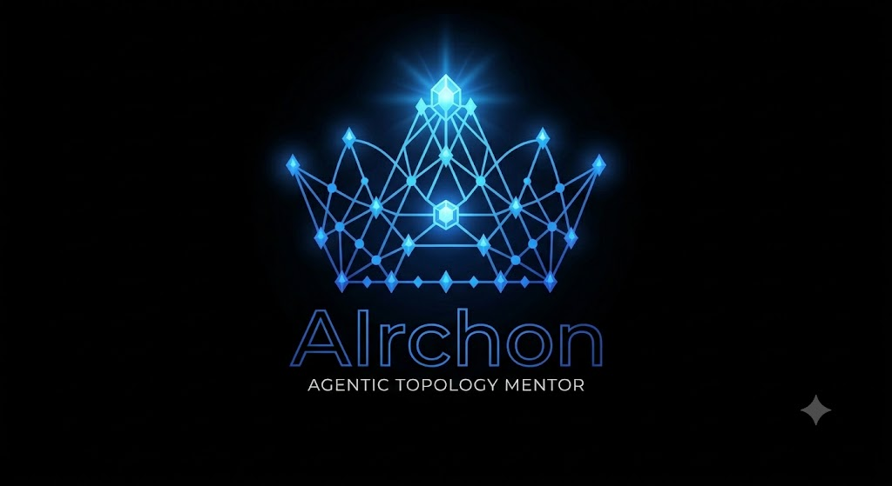

<div align="center">



# ⚡ AIrchon

**The Sovereign Mentor of Agentic Topologies**

*"Burn the black boxes. The fire belongs to all."*

[]()
[]()

</div>

---

## 🏛️ Why "AIrchon"

The name fuses **AI** with **Archon** (Greek *árchōn*, ἄρχων --
"ruler," "first one," the one who governs). In the old mythic sense,
an Archon is a gatekeeper: a power that stands between people and
higher knowledge and hoards it. AIrchon takes that authority and turns
it inside out -- it is the archon that opens the gate instead of
guarding it.

The Promethean framing is the honest ambition, not a claim already
earned: AIrchon does not know anything the internet doesn't already
know. Claude Code's docs, Copilot CLI's docs, OpenCode's own source,
Hermes Agent's, pi's, DeepSeek Harness's, LangGraph's, Microsoft
Conductor's, GitHub Agentic Workflows' -- nine distinct agent
harnesses and orchestration frameworks -- plus the HuggingFace
Cookbook and the Agentic SDLC Handbook for the two adjacent domains.
All of it already public. The actual problem is that it's scattered across
dozens of pages, changelogs, and repos, written for different
audiences, and most of it goes unread end to end. AIrchon's job is
narrower than "reveal hidden truth": fetch it live, cite it plainly,
organize it into one progressively-readable place, and teach it back
in order. Authority earned by citation, not by gatekeeping -- but the
fire was never actually locked away, just scattered and under-read.

---

## 👑 What this is honestly good for, and what it isn't

**What's actually been tested and holds up:** asking `airchon-mentor`
about your own harness's real, current tool surface, rather than
trusting a model's memory of it. That memory fails for two distinct
reasons, not one. The obvious one is staleness -- training data goes
stale fast for a CLI that ships continuously. The sharper one: an
ungrounded model is optimizing for *plausible given its training
distribution*, not *true* -- on any topic with a lot of noisy internet
discussion (outdated tutorials, confident wrong answers, blog posts
about the wrong tool version), the popular-but-wrong content can
simply outnumber the correct-but-sparse official source, and the model
will return the popular answer with full confidence, independent of
how recent its training is. Forcing a live citation to one specific,
authoritative source -- not just "a" source, *the* source -- overrides
both failure modes at once. It matters most exactly where getting it
wrong is expensive -- e.g. not knowing your harness already ships a
built-in capability and reaching for an unnecessary third-party tool
with its own security exposure instead.

**The grounding claim has been checked, not just asserted.**
[resources/sources-of-truth.md](resources/sources-of-truth.md) is a
live audit of every one of the 225 sources cited across all five
reference areas -- a git commit SHA for every `github.com` source, a
SHA-256 content hash for everything else -- generated by actually
fetching each one, not by describing a mechanism. Result: 222 of 225
are live and correct right now. Running it once already caught two
real defects a page that never gets re-checked never would have: a
dead link in two harness pages (`docs.github.com/en/enterprise-cloud`,
now 404) and a citation truncated mid-URL by a markdown line-wrap bug
in two others. That's a 98.7% clean rate on first audit, with the
failures found and named, not hidden.

**What this builds: AI-engineer fluency, specifically.** Across all
five domains, this is the actual working knowledge of someone building
and operating agentic systems, not an approximation of it: a harness's
real control loop, memory, tools, permissions, and orchestration
mechanics, traced through actual config keys rather than described
abstractly; a 19-item anti-pattern taxonomy for the failures that
"don't crash, they produce plausible wrong output," plus the
load-lifecycle and lockfile/dependency-pinning discipline that
prevents them; building and scoring a RAG evaluation pipeline with
critique-agent filtering and LLM-as-judge comparison; classifying and
choosing a model by parameter scale, MoE architecture, and
quantization scheme for a deployment target; and operating a real
local inference engine. Every capstone is graded on whether the
artifact you produced actually runs and does what you claimed, not on
how well you described it -- that's testing and debugging discipline,
exercised on the actual object of AI engineering. It is not generic
computer science (algorithms, data structures, database design) --
those were never the claim, and this project doesn't need to reach
for them to teach what an AI engineer actually needs. The tier
system's own top-tier note is the one honest ceiling worth stating:
Archon tier is *necessary but not sufficient* for building something
better than what exists -- fluency with the current state of the art
is the floor a real contribution stands on, not the contribution
itself.

**What's still unproven:** the tier rubric and the multi-session
courses under it are original pedagogical design, authored and graded
by the same kind of model that teaches from them -- not a researched
claim about how people learn. It's currently a solo-tested tool: the
person building it is deliberately going through it from the bottom
tier as its first real learner, not a second, independent person. That
makes a tier badge a practice signal you can act on today, not yet an
external credential someone else should take on faith. Separately: a
real mechanism to re-run the sources-of-truth audit now exists
(`airchon-sync`, below) -- but it's invoked by name, not scheduled, so
a page's **VERIFIED** tag is still only as current as the last time
someone actually ran it. Building `airchon-sync` surfaced a real
reason not to rush straight to unattended scheduling: a confirmed,
non-trivial share of doc-page hash "drift" turned out to be CDN cache
noise on SPA-rendered sites, not real content change. The check-and-
handoff mechanism is real and working; knowing when its signal is
trustworthy enough to act on without a human watching is the next
thing to earn, not something this project has claimed to have
already.

---

## ⚡ What it actually does

AIrchon is a conversational mentor, not a wizard with hidden
subcommands -- backed by three specialist agents behind one thin
router, plus a fourth, standalone maintenance skill. You ask it a real
question, in plain language, and it answers in prose, citing exactly
where the answer came from.

- **`airchon-mentor` answers, read-only.** Every factual claim is
  tagged, explicitly or by the shape of the answer: **VERIFIED**
  (fetched this session, or already cited in a reference area, from a
  named source) or **BEST CURRENT UNDERSTANDING, UNCONFIRMED**
  (reasoned, not yet confirmed against a source). The two are never
  blended together. It can also read (never edit) your own project's
  agent-harness setup and advise on guardrails, control flow, or
  performance -- but it never writes to any reference area, even when
  its own live research fills a gap.
- **No authority overreach.** `references/harnesses/` covers nine
  distinct systems in comparative, per-mechanism depth -- Claude Code,
  GitHub Copilot CLI, OpenCode, pi, Hermes Agent, and DeepSeek Harness
  as coding-agent harnesses, plus LangGraph, Microsoft Conductor, and
  GitHub Agentic Workflows as deterministic-orchestration frameworks --
  each a different product from a different company or project. A
  mechanism confirmed for one is never quietly assumed to hold for
  another; every one gets its own citation.
- **`airchon-author` is the only writer**, across five reference
  areas -- harness internals, Agentic SDLC technique, RAG technique,
  AI model classification, and local inference engines (see the table
  below). One topic file per subject, only built when a real question
  needs it -- never pre-built speculatively. The next question about
  the same topic gets answered from what's already there, faster and
  just as grounded, until something changes underneath it.
- **`airchon-teacher` assesses, then teaches.** A 40-question exam,
  grounded in a curriculum spanning all five reference areas,
  classifies you into one of four tiers -- Slumberer, Gnostic,
  Demiurge, Archon -- and persists the result locally
  (`~/.airchon/level`), never uploaded. Once classified, it walks you
  through the course toward your next tier session by session --
  currently 3 sessions for Slumberer->Gnostic and 68 for
  Gnostic->Demiurge across all five domains, teaching each item to
  completion and grading a real exercise before moving on. See the
  honesty note above on what a tier signals before treating it as more
  than a practice tool -- that's a caveat on the exam's construct
  validity, not on how much the course actually covers.
- **`airchon-sync` closes the staleness loop, on request.** A
  standalone, FORCED-only skill (never triggers from ambient
  conversation -- invoke it by name) that re-checks every source in
  `resources/sources-of-truth.json` against its live current state,
  hands the ones that actually changed off to `airchon-author` with
  concrete evidence (a GitHub compare diff for a moved commit, a
  changed-hash note for a doc page), and mechanically rebaselines the
  tracked files afterward -- never by hand-editing them. Built via
  `/genesis`; real-task testing while building it found that a
  meaningful share of doc-page "drift" is CDN cache noise on
  SPA-rendered sites, not real content change (see its own `SKILL.md`)
  -- it works, but isn't yet recommended for unattended scheduling
  until that's been watched across a few manual runs.

---

## 🌙 The Learning Path

Four tiers, one arc. The names are borrowed on purpose -- mythic
scaffolding lifted from Gnostic cosmology, purely for the fun of it
and as a memory hook, not a claim about anything outside this project
(see
[reader-proficiency-tiers.md](resources/airchon-teacher/reader-proficiency-tiers.md)
for the full rubric and its own honest ceiling note).

| | Tier | The lore | What's expected of you |
| :---: | :--- | :--- | :--- |
| 🌙 | **Slumberer** | The sleeper who hasn't yet woken up -- doesn't know there's a gate, let alone what's behind it. | You've used an AI coding agent, maybe a lot -- but "the model" and "the harness wrapping it" are still one undifferentiated blur. No vocabulary yet for tool calls, context windows, or hooks. |
| 👁️ | **Gnostic** | The one who has acquired *gnosis* -- direct knowledge, not hearsay about it. | You can describe a harness's control loop and place it on its own axes -- reactive vs. deliberative, single-agent vs. multi-agent -- correctly and unprompted. Still map, not territory. |
| 📐 | **Demiurge** | The craftsman-god who takes received forms and actually shapes matter with them. | The largest transition, 55 modules across five domains: harness power-user depth (trace a request through actual config keys, write hooks and permission rules, compare mechanisms across Claude Code/Copilot CLI/OpenCode) *plus* real RAG pipeline construction, Agentic SDLC practitioner mechanics, AI model classification, and local inference-engine operation (llama.cpp/Ollama/KTransformers) -- each held to its own source's grounding standard, not blended into one undifferentiated claim. |
| 👑 | **Archon** | Mastery over the created order -- authority earned by citation, not gatekeeping. | You can justify what a *new* harness should do instead of only explaining what ships today, and critique this book's own harness design-space surveys *and* the Agentic SDLC Handbook's design-space/methodology chapters as a starting position to argue with, not received fact. Necessary, not sufficient, for actually building one. |

Ask "assess my proficiency" or "take the exam" to find out where you
stand, via a 40-question exam grounded in the reference areas. Once
classified, ask to be taught and `airchon-teacher` runs the course
toward your next tier, session by session.

---

## 🛠️ Where the knowledge actually comes from

| Reference area | Primary sources | Grounding standard |
| :--- | :--- | :--- |
| `references/harnesses/` | Nine systems, each from its own official docs/repo: `code.claude.com/docs` + `github.com/anthropics/claude-code` (Claude Code), `docs.github.com/copilot` + `github.com/github/copilot-cli` (Copilot CLI), `github.com/anomalyco/opencode` + `opencode.ai/docs` (OpenCode), `github.com/earendil-works/pi` (pi), `hermes-agent.nousresearch.com/docs` + `github.com/NousResearch/hermes-agent` (Hermes Agent), `github.com/deepseek-ai/deepseek-harness` (DeepSeek Harness), `github.com/langchain-ai/langgraph` + `docs.langchain.com` (LangGraph), `github.com/microsoft/conductor` (Microsoft Conductor); plus HuggingFace's agent-engineering courses for general vocabulary | Independently cross-verified per source, tagged VERIFIED / BEST CURRENT UNDERSTANDING |
| `references/sdlc/` | The Agentic SDLC Handbook (Daniel Meppiel) | Attributed "the handbook says" -- single-source, not independently cross-verified |
| `references/rag/` | HuggingFace Cookbook notebooks, Lewis et al. (2020) and related papers | Attributed to the specific notebook or paper |
| `references/models/` | Hugging Face's Hub docs, the `transformers` glossary, the Optimum quantization guide, named community writeups | Attributed to the specific source |
| `references/inference-engines/` | `ktransformers.net/docs`, `docs.ollama.com`, `github.com/ggml-org/llama.cpp` (+ linked subpages) | Attributed to each engine's own docs/repo |

Each row is a bounded claim, not a blanket endorsement -- a source is
only ever cited for what it actually documents, and only
`references/harnesses/` carries this project's own independently
cross-verified VERIFIED tag; the other four attribute claims to their
single named source instead.

---

## 🚀 How to use it

First, install [APM](https://github.com/microsoft/apm) on your machine.
Then run:

```bash
apm install https://github.com/sfernandezplain/AIrchon --target <harness>
```

Where `<harness>` is `claude`, `copilot`, or `opencode`. You can repeat
`--target` for multiple harnesses in one command.

This deploys all three agents -- `airchon-mentor`, `airchon-author`,
`airchon-teacher` -- to Claude Code, Copilot CLI, and OpenCode, and both
skills (`airchon`, the router; `airchon-sync`, the source-drift checker)
to Claude Code only, for `/airchon`, `/airchon-sync`, and natural-
language discovery. Skills have no Copilot CLI or OpenCode deploy
path; the agents are what keep both covered either way. **Known gap:**
the OpenCode deploy currently fails to load -- its `tools:` frontmatter
is written as a list, and OpenCode requires a tool-name-to-boolean
mapping instead. `apm install` will warn about this; it isn't silently
broken, but it isn't fixed yet either.

Then just ask it something, for example:

```
/airchon how does Claude Code handle context compaction?
how would I build a multi-agent harness like this one?
what's the actual difference between OpenCode's and Claude Code's tool loop?
walk me through how MCP servers get discovered and invoked
how does Hermes Agent's memory architecture compare to Claude Code's
what does LangGraph's StateGraph actually get you over a plain agent loop
what's the difference between a quantized and a MoE model, for an agent I'm serving locally
how does llama.cpp's KV cache differ from Ollama's default context window
write up KTransformers' operator-injection mechanism in the wiki-book
assess my proficiency / take the exam
teach me / continue my course
review my project's own skills and agent files for guardrail gaps
/airchon-sync                                  (explicit only -- see below)
```

No fixed command set to memorize -- if the question fits one of the
five reference areas, ask it the way you'd ask a person. Three things
don't work like free-form chat: the exam and the course pace one
question or one topic at a time once you're in them, asking whether
you want to continue rather than taking open-ended follow-ups; and
`/airchon-sync` never triggers on its own from a related-sounding
question -- it makes real network calls and can trigger real rewrites,
so it only runs when named explicitly (`/airchon-sync`, or "run the
source sync").

---

## 🗺️ Repository layout

```
apm.yml                                        APM project manifest (targets: claude, copilot, opencode)
apm.lock.yaml                                  Resolved/locked dependency versions
.apm/agents/airchon-mentor.agent.md            Read-only mentor -- answers, reviews your project's harness setup
.apm/agents/airchon-author.agent.md            The only writer, across all five reference areas
.apm/agents/airchon-teacher.agent.md           Lean router body for the teacher's own procedures -- read-only on all reference areas
.apm/skills/airchon/SKILL.md                   Thin router skill (Claude Code only)
.apm/skills/airchon-sync/                      Source-drift checker skill (Claude Code only, FORCED -- invoke by name).
                                                Bundles scripts/check_drift.py (the actual hash/commit checks --
                                                deterministic, never LLM-recalled) and its own handoff-prompt template
references/harnesses/                          Wiki-book: AI agent harness internals -- mentor reads, author writes
references/sdlc/                               Agentic SDLC Handbook digest
references/rag/                                RAG definitions and techniques
references/models/                             AI model classification for agentic development
references/inference-engines/                  Local/self-hosted inference engine internals (llama.cpp, Ollama, KTransformers)
resources/airchon-teacher/                     Teacher's own procedures (exam, course delivery, guardrails), the tier rubric,
                                                the curriculum, and the session-pacing files for each course
resources/path-resolution.md                   Shared path-resolution fallback used by all three agents
resources/sources-of-truth.md, .json           Live snapshot of every source cited across all five
                                                reference areas -- commit SHA or content hash. Re-checkable now via
                                                airchon-sync (invoked by name); not yet scheduled/unattended
~/.airchon/level, ~/.airchon/qualify-exam.md,
~/.airchon/course-progress.md, ~/.airchon/exercises/,
~/.airchon/session-{N}.exam.md                 Teacher's own state -- your machine, outside this repo
.claude/, .github/, .opencode/, .agents/       Deployed copies of the agents and skills (gitignored, regenerated by `apm install`)
```

For the full architecture rationale -- why the read/write split, why
the router stays thin, why the teacher's own content lives outside the
reference areas -- see `CLAUDE.md`. Design history and past decisions,
including the honest write-ups of things that turned out wrong or
incomplete along the way, live in `CHANGELOG.md`; this file only ever
describes the present.
