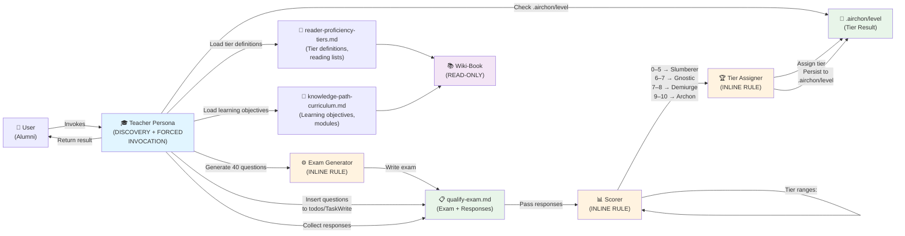
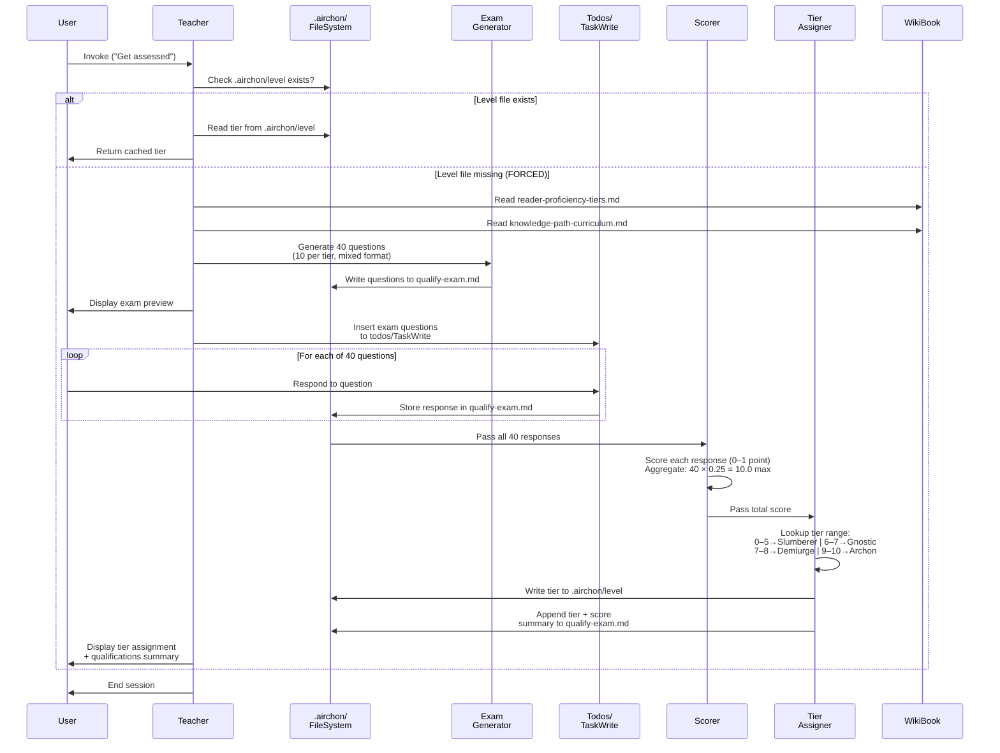
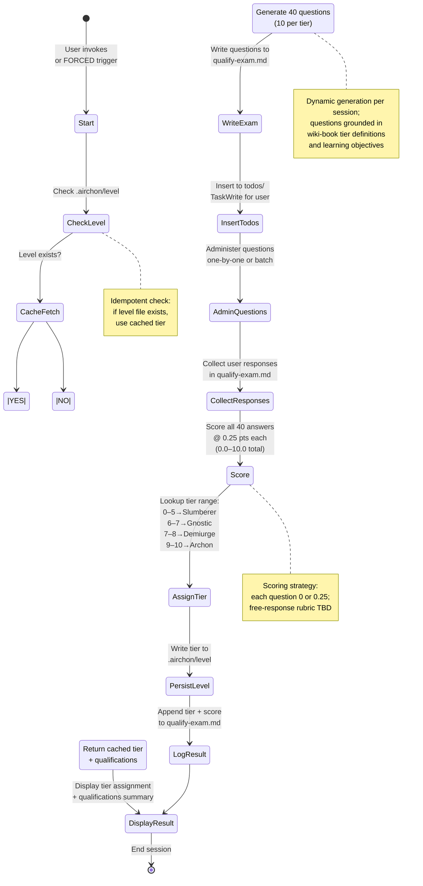

# Genesis Handoff Packet: Teacher Primitive (Steps 1–6)

**Primitive:** Teacher – Qualification Exam Administrator  
**Type:** Custom agentic persona (variation of airchon-mentor)  
**Status:** Design Phase (Steps 1–6); Step 7b implementation deferred  
**Targets:** Claude Code + Copilot CLI (common harnesses supporting TaskWrite/todos)  
**Date:** 2026-08-22

---

## Step 1: Design Intent & Scope (Implicit)

**Capability:** Teacher administers a 40-question qualification exam to alumni, determines proficiency tier (Slumberer/Gnostic/Demiurge/Archon), persists results, and triggers downstream course recommendations (not delivered by Teacher itself).

**User Trigger:**
- DISCOVERY-invocable: "Get assessed" appears in available agents
- FORCED: Auto-trigger when `{user_home}/.airchon/` exists but `.airchon/level` missing

**Boundary:**
- **Reads:** `reader-proficiency-tiers.md`, `knowledge-path-curriculum.md`, user responses, filesystem `.airchon/` state
- **Never writes:** `references/harnesses/**` (wiki-book immutable; enforced structurally via omitted Write/Edit tools)
- **Does NOT:** Deliver courses (downstream), modify wiki-book, generate curriculum content

**Workflow Name:** "User-Classifying Flow"

---

## Step 2: Component Diagram

---

## Step 3: Sequence Diagram

---

## Step 3.5: Composition Decision Table

| Component | Type | Location | Rationale |
|-----------|------|----------|-----------|
| **Teacher Persona** | PERSONA | `.apm/agents/teacher.agent.md` | Invocation entry point; orchestrates workflow; bare agent deployed to both targets (Claude Code + Copilot CLI) via `apm install`. Paired with thin routing skill `.apm/skills/teacher/SKILL.md` (Claude Code discovery only). |
| **Exam Generator** | INLINE RULE | Inside `teacher.agent.md` | Generates 40 questions on-demand per session; one-shot semantic cost; no persistent state; can be templated as a prompt section or delegated as an inline function call. |
| **Scorer** | INLINE RULE | Inside `teacher.agent.md` | Scores responses; pattern-match or LLM-based (rubric); low-cost lookup. No persistent state; can be regex-based or LLM-guided comparison. |
| **Tier Assigner** | INLINE RULE | Inside `teacher.agent.md` | Maps score → tier via table lookup; deterministic, zero-cost. Enforces `.airchon/level` persistence. |
| **Filesystem Bridge** | S7 DETERMINISTIC TOOL | Provided by harness (TaskWrite, todos, file I/O) | Teacher uses native harness tools (TaskWrite for todo mgmt, file write for `.airchon/level` & `qualify-exam.md`). No custom bridge needed; relies on S7 contract. |
| **Question Bank / Curriculum** | EXTERNAL MODULE (READ-ONLY) | `references/harnesses/reader-proficiency-tiers.md`, `knowledge-path-curriculum.md` | Wiki-book; Teacher reads tier definitions and learning objectives; never writes. Enforced structurally (no Write/Edit tools). |

**Key Decision:**
- **Inline vs. Separate:** All rules (Exam Gen, Scorer, Tier Assign) are INLINE within Teacher persona to avoid unnecessary coordination overhead. Teacher is a single orchestrator, not a skill with micro-services.
- **Question Generation:** Dynamic semantic generation per session (vs. pre-authored bank). Rationale: flexible, session-scoped, no repo bloat. Trade-off: higher LLM cost per exam. (Open Q for Step 7b: revisit if cost becomes concern.)
- **Filesystem Persistence:** Uses harness-native TaskWrite (Claude Code) and todos (Copilot CLI) for todo insertion; uses native file I/O for `.airchon/level` and `qualify-exam.md`. No custom bridge.

---

## Step 4: Interface Sketches

### Exam Generator Interface
**Input:**
- Tier definitions (from `reader-proficiency-tiers.md`)
- Learning objectives (from `knowledge-path-curriculum.md`)
- Random seed (optional, for reproducibility)

**Output:**
- Array of 40 questions: `{ questionID, tier, type (multiple_choice | short_answer | free_response), text, options (if MC), metadata }`
- Written to `qualify-exam.md` as markdown frontmatter + unordered list

**Constraints:**
- Equal distribution: 10 questions per tier
- Mixed format: ~50% test-like (MC/short-answer), ~50% free-response
- Grounded in wiki-book content (not invented)
- Each question scores 0.25 points

### Scorer Interface
**Input:**
- 40 user responses (text from todos/TaskWrite or `qualify-exam.md` markdown)
- Question metadata (original question text, tier, type, expected concepts)

**Output:**
- Scoring array: `{ questionID, scoreObtained (0 or 0.25), reasoning }`
- Aggregate score: sum of all questionScores (0.0–10.0 range)
- Breakdown by tier: score per tier (used for diagnostics)

**Constraints:**
- Each response is binary: correct (0.25) or incorrect (0.0)
- Free-response scoring: LLM-guided rubric comparison OR pattern matching (OPEN Q for Step 7b)
- Scoring deterministic and repeatable (log reasoning for transparency)

### Tier Assigner Interface
**Input:**
- Total score (0.0–10.0)

**Output:**
- Tier assignment: one of { Slumberer | Gnostic | Demiurge | Archon }
- Persistent write to `.airchon/level` (one line or JSON)
- Metadata: score achieved, timestamp, exam version

**Constraints:**
- Lookup table (deterministic, zero-cost)
- Score ranges: 0–5→Slumberer | 6–7→Gnostic | 7–8→Demiurge | 9–10→Archon
- **DESIGN DEFECT:** Boundary overlap at 7.0 and gap at 5→6 (see Step 5)
- Idempotent write to `.airchon/level`

---

## Step 5: Compliance Check

### Single Responsibility Principle
✅ **Teacher:** Orchestrates exam workflow (invocation, state checking, delegation).  
✅ **Exam Generator:** Generates questions only; does not score or assign tier.  
✅ **Scorer:** Scores responses; does not assign tier or generate questions.  
✅ **Tier Assigner:** Assigns tier via lookup; does not score or generate questions.  
**Verdict:** SoC respected; each component has one clear responsibility.

### PROSE Constraints

| Constraint | Status | Finding |
|-----------|--------|---------|
| **Progressive Disclosure** | ✅ | Exam questions presented one-by-one (or in batches) via todos/TaskWrite; user sees context progressively. Tier assignment hidden from user until final step. |
| **Reduced Scope** | ✅ | Teacher focuses on exam administration only; does NOT deliver courses, modify wiki-book, or handle tier-specific learning paths. Downstream orchestration (course delivery) is separate. |
| **Orchestrated Composition** | ✅ | Teacher orchestrates three inline rules (Exam Gen → Scorer → Tier Assign); each has clear input/output contract. No circular dependencies. |
| **Safety Boundaries** | ⚠️ | See defects below. Free-response scoring strategy undefined (LLM vs. regex vs. key). Score boundary overlap at 7.0 needs clarification. |
| **Explicit Hierarchy** | ✅ | Teacher is top-level entry point (DISCOVERY-invocable). Internal rules are hidden from user. Filesystem (.airchon/level) is authoritative for cached tier. |

### Design Defects & Open Questions

**DEFECT 1: Score Boundary Ambiguity**
- Stated ranges: 0–5→Slumberer | 6–7→Gnostic | 7–8→Demiurge | 9–10→Archon
- **Problem:** Score 7.0 maps to both Gnostic (6–7) and Demiurge (7–8). Score 5.0 is Slumberer; score 5.25–5.75 is ambiguous (neither 6+ nor ≤5).
- **Impact:** Tier assignment is non-deterministic at boundaries.
- **Resolution (for Step 7b):** Redefine ranges to eliminate overlap: e.g., 0–5.99→Slumberer | 6.00–6.99→Gnostic | 7.00–7.99→Demiurge | 8.00–10.00→Archon. OR add clarification rule (e.g., round 7.0 up to Demiurge).

**DEFECT 2: Free-Response Scoring Strategy Undefined**
- 40 questions include free-response format; scoring mechanism not specified.
- **Options (open for Step 7b):**
  1. LLM-guided rubric: Provide learning objectives; LLM compares user response to rubric.
  2. Pattern matching: Pre-author regex patterns for expected keywords/phrases.
  3. Answer key comparison: Operator provides "good answer" examples; LLM does semantic similarity.
  4. Human review: Teacher marks questions as pending manual review; operator scores later.
- **Impact:** Cost, consistency, and user experience depend on choice.

**DEFECT 3: Exam Generation Approach Trade-offs**
- Stated approach: Dynamically generate 40 questions per session (semantic cost per exam).
- **Alternatives:**
  1. Pre-authored question bank (40–100 questions stored in repo; random sampling per exam). Lower cost, higher consistency, risk of repetition.
  2. Hybrid: Pre-authored tier concepts + dynamic prose generation (template-based). Moderate cost, better consistency.
- **Open for Step 7b:** Choose based on cost vs. variety trade-off.

**DEFECT 4: FORCED Trigger Timing Undefined**
- Teacher must auto-run when `.airchon/level` is missing. Timing options:
  1. On first alumni session creation (`.airchon/` directory created).
  2. Periodic check during each invocation.
  3. One-time check after `.airchon/` exists for first time.
- **Impact:** Affects UX (surprise trigger vs. opt-in discovery).

---

## Step 6: Full Handoff Packet

### Targets Declaration
- **Primary Targets:** Claude Code, Copilot CLI (common harnesses supporting TaskWrite/todos)
- **Secondary Targets:** None (OpenCode is research subject, not deploy target)
- **Deployment:** Teacher agent → `.apm/agents/teacher.agent.md` (bare agent, no skill partner on Copilot)
- **Deployment Tool:** `apm install`

### Invocation Modes
| Primitive | Invocation | Discovery | Forced | Tool List |
|-----------|-----------|-----------|--------|-----------|
| Teacher | YES | YES ("Get assessed") | YES (if .airchon/level missing) | [TaskWrite/todos, File I/O] (no Write/Edit to wiki-book) |
| Exam Generator | NO | N/A | N/A | Internal rule (no direct invocation) |
| Scorer | NO | N/A | N/A | Internal rule (no direct invocation) |
| Tier Assigner | NO | N/A | N/A | Internal rule (no direct invocation) |

### User-Classifying Flow (Mermaid State Machine)

### Module Composition Table
(See Step 3.5 above; inline all rules within teacher.agent.md for simplicity and to avoid coordination overhead.)

### Compliance Findings Summary
- ✅ SoC respected
- ✅ PROSE constraints met (with caveats)
- ⚠️ **Defect 1:** Score boundary overlap at 7.0; gap at 5→6 (clarify ranges in Step 7b)
- ⚠️ **Defect 2:** Free-response scoring strategy undefined (choose rubric approach in Step 7b)
- ⚠️ **Defect 3:** Exam generation cost vs. consistency (choose dynamic vs. pre-authored in Step 7b)
- ⚠️ **Defect 4:** FORCED trigger timing undefined (clarify UX flow in Step 7b)

### Cost Projection

| Operation | Cost Model | Estimate |
|-----------|-----------|----------|
| **Exam Generation** | Semantic (LLM prompt: "Generate 40 questions grounded in tier definitions + learning objectives") | ~1–2 semantic calls per exam per user (moderate cost) |
| **Question Insertion** | Deterministic (TaskWrite/todos API call) | ~1 API call per batch (negligible cost) |
| **Response Collection** | Deterministic (read from todos/qualify-exam.md) | ~1 read per session (negligible cost) |
| **Scoring** | Hybrid (regex pattern matching for MC/short-answer; LLM rubric for free-response) | ~0.5 semantic calls if LLM-guided rubric; negligible if regex-only |
| **Tier Assignment** | Deterministic (table lookup) | Negligible |
| **Filesystem Persistence** | Deterministic (file write to .airchon/) | Negligible |
| **TOTAL per User Assessment** | **Low-to-Moderate** | ~1–2.5 semantic calls + filesystem I/O (acceptable for infrequent per-user assessment) |

---

## Todo List (for Step 7b Implementation)

### Todo 1: Implement Teacher Persona Core
- **ID:** `teacher-persona-core`
- **Title:** Drafting Teacher persona orchestration logic
- **Description:** 
  - Implement `.apm/agents/teacher.agent.md` frontmatter (tools: [TaskWrite/todos, File I/O]; no Write/Edit to wiki-book).
  - Implement Teacher invocation handler (DISCOVERY + FORCED).
  - Implement `.airchon/level` check (cached tier return if exists).
  - Implement workflow orchestration (call Exam Gen → Scorer → Tier Assign sequentially).
  - Implement user session management (todo insertion, response collection from TaskWrite/todos).
  - Validate YAML syntax (bracket-list tools, no unquoted colon-space in description).

### Todo 2: Implement Exam Generator
- **ID:** `exam-generator-inline`
- **Title:** Implementing 40-question exam generation
- **Description:**
  - Design prompt template for semantic generation (input: tier definitions + learning objectives from wiki-book; output: 40 JSON questions).
  - Implement question grounding: ensure questions reference reading lists from `reader-proficiency-tiers.md` and modules from `knowledge-path-curriculum.md`.
  - Implement equal distribution (10 questions per tier).
  - Implement mixed format (50% test-like MC/short-answer, 50% free-response).
  - Implement markdown formatting for `qualify-exam.md` (frontmatter + unordered list with metadata).
  - **Dependencies:** Requires wiki-book read-only access.

### Todo 3: Implement Scorer
- **ID:** `scorer-inline`
- **Title:** Implementing 40-question scoring logic
- **Description:**
  - Implement MC/short-answer scoring (regex pattern matching or key comparison).
  - **DESIGN DECISION (Step 7b):** Choose free-response scoring strategy (LLM rubric, pattern match, or deferred human review).
  - Implement 0.25-point per-question scoring (binary: 0 or 0.25).
  - Implement aggregate score calculation (sum of 40 questions, 0.0–10.0 range).
  - Implement score breakdown by tier (diagnostic output).
  - Implement scoring transparency (log reasoning for each question).
  - **BLOCKER:** Resolve free-response strategy before implementation.

### Todo 4: Implement Tier Assigner
- **ID:** `tier-assigner-inline`
- **Title:** Implementing tier assignment & persistence
- **Description:**
  - Implement tier lookup table.
  - **DESIGN DECISION (Step 7b):** Resolve score boundary ambiguity (clarify 0–5/6–7/7–8/9–10 ranges or add interpolation rule).
  - Implement `.airchon/level` deterministic write (idempotent, one-line or JSON format).
  - Implement `.airchon/` directory creation if missing.
  - Implement tier + score summary append to `qualify-exam.md`.
  - **BLOCKER:** Resolve boundary ambiguity before implementation.

### Todo 5: Implement Filesystem Bridge & Validation
- **ID:** `filesystem-bridge-s7`
- **Title:** Implementing S7 deterministic tool contract for .airchon/ persistence
- **Description:**
  - Validate `.airchon/` directory creation is idempotent (create if missing, no-op if exists).
  - Validate `.airchon/level` write is deterministic (single source of truth for tier).
  - Validate `qualify-exam.md` write is append-safe (exam + responses + tier preserved across invocations).
  - Test caching: verify teacher returns cached tier on subsequent invocations (no re-exam until `.airchon/level` explicitly deleted).
  - Implement error handling (permission denied, disk full, corrupted level file).

### Todo 6: Implement User Session Management & Todo Integration
- **ID:** `session-mgmt-todos`
- **Title:** Integrating Teacher with harness todo/TaskWrite systems
- **Description:**
  - Implement TaskWrite insertion (Claude Code) for 40 questions as batch of tasks.
  - Implement todos insertion (Copilot CLI) for 40 questions as batch of todos.
  - Implement response collection from completed tasks/todos.
  - Implement session isolation (ensure exam responses from one user don't leak to another).
  - Test harness compatibility: verify both Claude Code TaskWrite and Copilot CLI todos work identically.

### Todo 7: Implement FORCED Trigger & Alumni Detection
- **ID:** `forced-trigger-alumni`
- **Title:** Implementing FORCED auto-trigger for missing .airchon/level
- **Description:**
  - Implement alumni folder detection (check if `.airchon/` exists).
  - Implement missing-level detection (check if `.airchon/level` does NOT exist).
  - Implement FORCED invocation flow (silently trigger exam if alumni folder exists but level missing).
  - **DESIGN DECISION (Step 7b):** Clarify trigger timing (on first `.airchon/` creation vs. periodic vs. one-time).
  - Test UX: verify FORCED trigger doesn't surprise users (clarify in UI/messaging).

### Todo 8: Implement Router Skill (Claude Code Only)
- **ID:** `router-skill-teacher`
- **Title:** Drafting Teacher router skill for Claude Code discovery
- **Description:**
  - Implement `.apm/skills/teacher/SKILL.md` (thin routing wrapper, discovery-only, Claude Code target).
  - Configure `allowed-tools: [Agent(teacher-mentor)]` (scoped invocation).
  - Implement simple dispatch: check intent, call teacher agent, return result.
  - Validate skill registration (verify "Teacher available" appears in system reminder).
  - **Note:** Copilot CLI deploys teacher.agent.md directly (no skill needed); skill is Claude Code discovery convenience only.

### Todo 9: Validation & Testing
- **ID:** `validation-testing`
- **Title:** Implementing validation suite for Teacher workflows
- **Description:**
  - Unit test: exam generation produces 40 questions (10 per tier).
  - Unit test: scoring correctly computes 0–10 range (0.25 per question).
  - Unit test: tier assignment matches lookup table (Slumberer/Gnostic/Demiurge/Archon).
  - Integration test: full workflow (generate → administer → score → persist) produces .airchon/level and qualify-exam.md.
  - Integration test: cached tier returned on re-invocation (idempotence).
  - Integration test: FORCED trigger fires when .airchon/level missing.
  - Manual test: both Claude Code TaskWrite and Copilot CLI todos work identically.
  - Harness compatibility test: verify teacher deploys to both `.claude/agents/teacher.agent.md` and `.github/agents/teacher.agent.md` via `apm install`.

### Todo 10: Documentation & Deployment
- **ID:** `documentation-deployment`
- **Title:** Finalizing documentation and deployment
- **Description:**
  - Update CHANGELOG.md with Teacher primitive entry (date, capability, invocation modes, wiki-book integration).
  - Update apm.yml if Teacher becomes a dependency for other primitives (currently standalone).
  - Document tier characteristics and reading lists in `.airchon/level` result (for user clarity on what tier means).
  - Document exam format and scoring in comments within teacher.agent.md (for future maintainers).
  - Run `apm install` and verify teacher.agent.md deploys to both targets.
  - Verify teacher appears in DISCOVERY-invocable agents list (both Claude Code and Copilot CLI).

---

## Appendices

### A. Design Decisions Summary (for Step 7b Implementer)

| Decision | Status | Rationale |
|----------|--------|-----------|
| All rules inline (Exam Gen, Scorer, Tier Assign) within Teacher | ✅ DECIDED | Avoids coordination overhead; Teacher is orchestrator. |
| Dynamic exam generation per session (vs. pre-authored bank) | ⚠️ OPEN | Cost vs. variety trade-off; recommend dynamic for MVP. |
| Score ranges: 0–5→Slumberer \| 6–7→Gnostic \| 7–8→Demiurge \| 9–10→Archon | ⚠️ DEFECT | Overlap at 7.0; gap at 5→6. **Must resolve before scoring.** |
| Free-response scoring: LLM rubric vs. pattern match vs. key | ⚠️ OPEN | Choose rubric approach; impacts cost & consistency. |
| FORCED trigger on missing .airchon/level | ✅ DECIDED | Enforces one-time qualification for all alumni. |
| Persistence to .airchon/level (single source of truth) | ✅ DECIDED | Enables caching & idempotent re-invocation. |
| Teacher never writes wiki-book (READ-ONLY) | ✅ DECIDED | Structural boundary (no Write/Edit tools). |

### B. Grounding References (Wiki-Book Excerpts for Step 7b)

**From reader-proficiency-tiers.md:**
- Slumberer: Entry level, no mental model; reading list includes high-level overviews.
- Gnostic: Understands agent topology & loop; reading list includes agent-loop.md, agent-topology.md.
- Demiurge: Can trace real request through one harness; 21 modules across 5 thematic clusters.
- Archon: Can design new harnesses; 10 modules in design-space band.

**From knowledge-path-curriculum.md:**
- Learning objectives per tier transition (e.g., Slumberer→Gnostic: understand agent invocation flow, tool dispatch).
- 21 Demiurge modules: LLM reasoning (4), tool invocation (4), memory/context (4), MCP protocol (3), error handling (2).
- 10 Archon modules: orchestration patterns, scaling, multi-agent coordination.
- Comprehension checks and capstone exercises for validation.

**Question sourcing approach:** Calibrate 40 questions to reading lists (does respondent know the materials?) and learning objectives (can respondent apply the concepts?).

---

## Sign-Off

**Handoff Status:** ✅ COMPLETE (Steps 1–6)  
**Implementation Status:** ⏸️ PENDING (Step 7b deferred to implementer)  
**Next Action:** Step 7b: Draft teacher.agent.md and teacher skill.md based on this packet. Resolve open design decisions (score boundaries, free-response rubric, exam generation cost model, FORCED trigger timing) before coding.

**Open Questions for Step 7b (blocking):**
1. Clarify score boundary ranges (resolve 7.0 overlap and 5→6 gap).
2. Choose free-response scoring strategy (LLM rubric, pattern match, key comparison, or human review).
3. Choose exam generation approach (dynamic semantic vs. pre-authored bank vs. hybrid).
4. Clarify FORCED trigger timing (on first .airchon/ creation? periodic? one-time?).
5. Define .airchon/level file format (single line tier string, JSON with metadata, or markdown frontmatter?).

---

**End of Handoff Packet**
