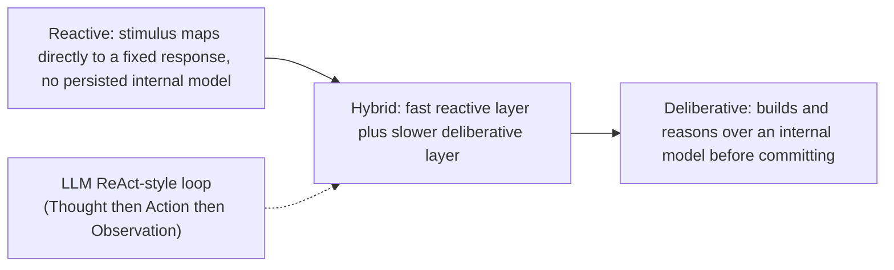
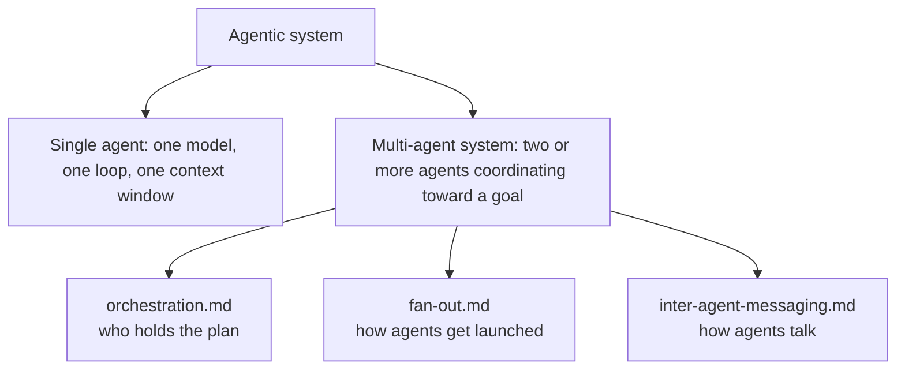
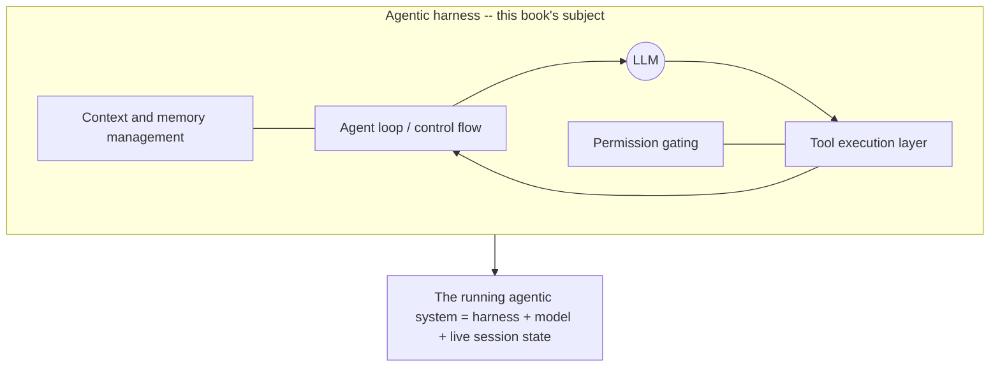

# Ch. 01 -- A topology of agentic systems

**Prerequisites:** None -- this is the first chapter and the map every later chapter assumes. | **Sources:** [`references/harnesses/agent-topology.md`](../../references/harnesses/agent-topology.md) (VERIFIED from Anthropic engineering blog, Claude Code docs glossary, Hugging Face Agents Course, Lilian Weng blog, arXiv:2505.10468), [`resources/airchon-teacher/knowledge-path-curriculum.md`](../../resources/airchon-teacher/knowledge-path-curriculum.md) Cluster ordering
**Reading time:** ~18 min | **You will learn:** what counts as an "agent" and why credible sources disagree; the four classification axes; where a harness sits relative to a bare agentic system

> Why this chapter exists: Before you can reason about caching, compaction, or orchestration, you need a map that tells you what kind of thing you are looking at. This chapter builds that map. It names the four independent axes that place any agentic system -- reactive vs. deliberative, single vs. multi-agent, tool-augmented vs. autonomous, narrow vs. broad component decomposition -- and then fixes the word this whole book hangs on: a harness. Every later chapter assumes you can point at a running system and say "that part is the model, that part is the harness, and the two together are the agent." Without that split, Ch.02's loop, Ch.05's coordination, and the harness syntheses at the end will blur.

## The idea in plain language

### What you are actually looking at when you say "agent"

Before the topology, meet one concrete system from zero so the axes have something to classify.

Imagine you open a terminal, type `claude "fix the failing test in auth.test.ts"`, and watch. The harness prints a plan, reads `auth.test.ts` and `auth.ts`, runs `npm test` to reproduce the failure, edits `auth.ts`, runs the test again, sees it pass, and exits with a summary. You, the developer, experienced "an agent fixed my test." But architecturally at least four things happened together: a language model chose what to do next at each step; that model was given tools (Read, Edit, Bash) it could call; the harness executed those tools and pasted the results back into the model's context; and the whole loop ran until the model decided no more tool calls were needed. If you change one of those ingredients -- give it no tools, make the next tool chosen by a fixed script instead of the model, or run two models instead of one -- you get a different system that may still be called "an agent" in casual conversation but will behave differently enough to matter when you debug.

An "agentic system" is therefore not one thing. It is a family of architectures that share a recognizable shape -- a language model that can call tools, observe what happened, and decide what to do next -- but differ along independent dimensions that matter every time you build or debug one. Think of it the way you think about databases: saying "it is a database" tells you almost nothing about whether it is row-oriented or column-oriented, embedded or distributed, transactional or eventually consistent. Agentic systems have the same kind of hidden topology. Two systems can both be called "an agent" and behave completely differently because they sit at different points on axes that casual usage does not name.

### Two definitions side by side -- why "what counts as an agent" is not settled

The simplest way to meet the topology is to hold two definitions of "agent" side by side and notice where they disagree. Anthropic's engineering blog ([Building Effective Agents](https://anthropic.com/engineering/building-effective-agents), VERIFIED 2026-08-17) draws a deliberately narrow line: a **workflow** is a system where "LLMs and tools are orchestrated through predefined code paths," and an **agent** is a system where "LLMs dynamically direct their own processes and tool usage, maintaining control over how they accomplish tasks." On that framing, autonomy over control flow is the boundary. If a human-authored program decides which tool runs after which, you have a workflow even if the pipeline calls ten tools. You only earn the word agent once the model itself chooses the next step. The Hugging Face Agents Course (Unit 1, VERIFIED 2026-08-17) draws a broader line: "An Agent is a system that leverages an AI model to interact with its environment in order to achieve a user-defined objective," decomposed into a Brain (the model, which handles reasoning and planning) and a Body (everything the agent is equipped to do -- its tools). That framing does not require dynamic control flow to qualify; reasoning, planning, and tool-mediated action are enough. A fixed script that calls an LLM to fill in each step's content would fail Anthropic's test and pass the Hugging Face course's test. Neither source is wrong. They answer different questions -- the blog advises when to reach for autonomy ("only increasing complexity when needed"), the course teaches the whole space a newcomer will encounter -- and this book leans toward the Hugging Face framing for its default vocabulary while keeping Anthropic's workflow/agent boundary handy whenever a harness mixes fixed and dynamic control flow in the same run (which, as you will see in Ch.05, several of them do).

Once you have the family picture, four axes let you place any system on the map. They are independent: knowing a system's position on one tells you nothing about its position on the others.

## How it actually works

### Axis one: reactive vs. deliberative

The vocabulary is older than LLM agents -- the wiki flags it as inherited from classical AI and robotics (subsumption architectures for purely reactive robot control; multi-agent-systems textbooks that treat purely reactive, deliberative, and hybrid as the three standard families) -- and BEST CURRENT UNDERSTANDING is that the 2025 taxonomy paper this chapter cites (arXiv:2505.10468, VERIFIED 2026-08-17) is itself drawing on that lineage. VERIFIED from that paper: reactive behaviour is basic stimulus-response -- "reactivity refers to an agent's capacity to respond to changes in its environment" -- typically paired with basic learning heuristics and a limited planning horizon. Deliberative behaviour is associated with "recursive reasoning capabilities," "dynamic task decomposition," and "multi-step reasoning and planning mechanisms" that support adaptive re-planning as circumstances change.

Where does a ReAct-style LLM loop sit? Neither extreme. BEST CURRENT UNDERSTANDING (reasoned from the verified material, not stated in those terms by any single source): a single ReAct loop is closer to the hybrid family. Each Thought step performs a bounded act of reasoning against the model's current context -- a lightweight, single-step deliberation -- but the loop as a whole has no persistent, explicitly-represented world model that survives outside the context window the way a classical deliberative planner's internal model would. Its "planning" is re-derived from scratch out of the conversation history at every step. That is a genuinely different shape from either extreme, which is part of why the taxonomy paper had to introduce a newer framing rather than relying on the classical pair alone.

### Axis two: single-agent vs. multi-agent systems

This is the axis that will later split into three whole chapters (Ch.05). VERIFIED (Hugging Face Agents Course, Unit 2.1, 2026-08-17): "Instead of relying on a single agent, tasks are distributed among agents with distinct capabilities." Two concrete reasons to prefer several narrow agents over one broad one: focus ("Each agent is more focused on its core task, thus more performant") and cost/latency ("Separating memories reduces the count of input tokens at each step"). The same taxonomy paper (arXiv:2505.10468, VERIFIED) names this exact split as its top-level distinction -- "AI Agents" for the monolithic case ("autonomous software entities engineered for goal-directed task execution within bounded digital environments") vs. "Agentic AI" for the coordinated case ("multiple, specialised agents that coordinate, communicate, and dynamically allocate sub-tasks" under "orchestrated autonomy").

The mechanism the taxonomy names -- orchestrated autonomy -- is precisely what this book grounds in harness specifics elsewhere. As the wiki notes, [agent-topology.md](../../references/harnesses/agent-topology.md) deliberately stops at the conceptual boundary and points forward: [orchestration.md](../../references/harnesses/orchestration.md) answers who holds the plan, [fan-out.md](../../references/harnesses/fan-out.md) answers how agents get launched, and [inter-agent-messaging.md](../../references/harnesses/inter-agent-messaging.md) answers what wire format they use to talk. If you are tempted to re-derive multi-agent mechanics here, resist -- those three pages are the authoritative, harness-grounded detail. This chapter is the scaffold they build on.

### Axis three: tool-augmented vs. fully autonomous

VERIFIED (Anthropic blog, same source as above): a tool-augmented workflow calls tools from within a fixed, human-authored path -- tools extend what the system can do, but a human or static program still decides when and in what order. A fully autonomous agent hands that ordering to the model itself, with the human's role reduced to the initial command, after which "agents plan and operate independently." VERIFIED (arXiv:2505.10468): the taxonomy paper draws an equivalent line under different names -- "Tool-augmented AI Agents" integrate tools/APIs into the reasoning pipeline within a single bounded task, while "Agentic AI" reserves a step beyond that for orchestrators that "coordinate the lifecycle of subordinate agents, manage dependencies, assign roles, and resolve conflicts."

BEST CURRENT UNDERSTANDING (synthesized from both verified sources, not stated as a single spectrum by either): tool-augmentation and full autonomy are better treated as two ends of a continuum. A fixed pipeline that calls one tool at one step is tool-augmented-but-not-autonomous. A ReAct single agent that picks its own next tool call each turn is meaningfully more autonomous at the per-step level while still bounded to one task. A multi-agent system whose orchestrator decides which subordinate agents to spawn, in what order, is autonomous at a level above individual tool calls entirely. Anthropic's advice to add autonomy incrementally is advice about where on this continuum to land, not which of two modes to pick.

### Axis four: the component decomposition and its rivals

Once something qualifies as an agent, what are its parts? Three credible sources give three different answers, from broadest to narrowest, and this book is explicit about where it sits.

VERIFIED (Lilian Weng, "LLM Powered Autonomous Agents," 2026-08-17): the most decomposed architecture -- four parts, with the LLM as the brain "complemented by several key components": **Planning** (subgoal decomposition plus "reflection and refinement"), **Memory** (explicitly split into short-term as in-context learning inside the finite context window and long-term as an external vector store accessible via fast retrieval), and **Tool use** (calling external APIs for extra information, code execution, proprietary data).

VERIFIED (Hugging Face Agents Course, same source as above): the narrowest pedagogical pair -- Brain (the AI model, which handles reasoning and planning, folded into one box) and Body (everything the agent is equipped to do). No distinct memory component is named; the course only gestures at contextual adaptation without giving memory its own box.

VERIFIED (Anthropic engineering blog, same source): the narrowest of all -- "typically just LLMs using tools based on environmental feedback in a loop." No dedicated memory or planning module. Planning is emergent from what the model does inside the loop; memory is emergent from the loop's growing conversation history.

| Source | Components named | Where planning lives | Where memory lives |
|---|---|---|---|
| Lilian Weng | LLM core, Planning, Memory (short/long), Tools | Its own module | Its own module, split |
| Hugging Face course | Brain, Body | Inside the Brain | Not named distinctly |
| Anthropic blog | LLM, tools, loop | Emergent from loop | Emergent from context |

BEST CURRENT UNDERSTANDING (this book's editorial observation, VERIFIED-adjacent): this book's own pages already reflect the narrow end, not the broad one. The loop lives in [agent-loop.md](../../references/harnesses/agent-loop.md) in narrow Thought/Action/Observation terms; memory and planning appear as separate harness-mechanism pages (memory-management, context-compression, instruction-context-budget) layered onto the loop, not baked into its definition. Both granularities describe the same underlying system -- they differ in where they draw boxes, not in what the system does.

### Where a "harness" sits relative to a bare agentic system

Every axis above describes abstract properties. None distinguishes "the model," "the code that wraps the model," and "the whole running thing you point at and call an agent" -- and casual usage applies "agent" to all three interchangeably. This book exists to document the middle layer, so the word harness needs its own grounding.

VERIFIED (Claude Code docs glossary, entry "Agentic harness," fetched 2026-08-17): the most precise definition found -- "The tools, context management, and execution environment that turn a language model into a capable coding agent. Claude Code is the harness; Claude is the model inside it. The harness supplies file access, shell execution, permission gating, memory loading, and the loop that chains actions together." The glossary separately defines "Agentic loop" as "the cycle Claude works through for every task: gather context, take action, verify results, and repeat until done," naming that loop as one of the things the harness supplies.

VERIFIED (Anthropic blog, "A harness for every task," fetched 2026-08-17): uses harness the same way -- as a structural scaffold distinct from the model's intelligence, describing Claude Code as able to "write its own harness on the fly, custom-built for the task at hand," contrasted with "the default Claude Code harness, which is built for coding."

VERIFIED (OpenCode docs, opencode.ai/docs/, fetched 2026-08-17): does not use the word harness at all on its landing page -- "OpenCode is an open source AI coding agent" -- despite architecturally performing the identical role the Claude Code glossary calls a harness (tool-execution loop, session management, permission layer around a caller-supplied model, each source-verified elsewhere). For Copilot CLI, the absence of harness vocabulary in `docs.github.com/copilot` material is UNCONFIRMED-as-absent (targeted search, not exhaustive read).

BEST CURRENT UNDERSTANDING: harness is Claude Code's preferred term, adopted by this book as its umbrella term precisely because it is the most precisely defined one found -- but the concept it names (a runtime substrate supplying tool execution, context/memory handling, permission gating, and loop control around one or more models) is not Claude-Code-specific, and this book applies it to Copilot CLI and OpenCode by architectural analogy.

## Edge cases and gotchas the wiki flagged

- **No single definition of "agent" is canonical.** Treat Anthropic's narrow (autonomy over control flow) and the Hugging Face course's broad (AI model acting on tools toward an objective) framings as answering different questions, not as one being wrong. Misreading this as a binary will cause you to mis-classify fixed-path tool users. Source: [agent-topology.md](../../references/harnesses/agent-topology.md) Sections 1 and 7.
- **The four axes are independent.** A system's position on reactive/deliberative does not fix its position on single/multi-agent, and narrow vs. broad component decomposition is a vocabulary choice, not a behavioural difference. Conflating axes is the most common way newcomers invent a "type of agent" that does not exist.
- **Single-agent vs. multi-agent is not just a count.** The taxonomy papers treat it as a claim about where responsibility is drawn -- each agent gets its own bounded scope, its own context, and often its own memory, with a coordination layer above. Counting processes without checking context and plan ownership will mislabel a parallel-tool-calls run as "multi-agent." Source: [agent-topology.md](../../references/harnesses/agent-topology.md) Section 3.
- **"Harness" is Claude-Code-specific vocabulary applied by analogy.** OpenCode does not use the word for itself; Copilot CLI's usage is UNCONFIRMED. Do not cite those harnesses' docs as evidence for harness terminology -- cite the Claude Code glossary, and treat the application to other harnesses as architectural analogy, flagged as such. Source: [agent-topology.md](../../references/harnesses/agent-topology.md) Section 6.
- **Read this page before [agent-loop.md](../../references/harnesses/agent-loop.md).** The loop page assumes you already know which family of agentic system it is describing (a single, hybrid-reactive, tool-augmented agent in the narrow decomposition). Reading the loop first and then trying to infer the topology backwards is the pedagogical anti-pattern this book's order exists to prevent. Source: knowledge-path curriculum Cluster ordering and [agent-topology.md](../../references/harnesses/agent-topology.md) Section 7.

## Sources and grounding note

This chapter distills:

- `references/harnesses/agent-topology.md` -- every claim above about what a source says is inherited from that page's own Sources section. Tags preserved: VERIFIED (Anthropic engineering blog "Building Effective Agents," Claude Code docs glossary and Agent SDK overview, Hugging Face Agents Course Units 1 and 2.1, Lilian Weng "LLM Powered Autonomous Agents," arXiv:2505.10468 taxonomy paper, OpenCode docs landing page) vs. BEST CURRENT UNDERSTANDING, UNCONFIRMED (historical lineage of reactive/deliberative vocabulary; hybrid placement of ReAct; continuum reading of tool-augmented vs. autonomous; harness-as-analogy applied to non-Claude-Code harnesses). No claim here was re-verified against a primary source this chapter -- authority rests with the wiki page's own dated fetches (2026-08-17), as documented there.
- `resources/airchon-teacher/knowledge-path-curriculum.md` -- for the position of this chapter as the first general-concept chapter (Slumberer->Gnostic Transition 1, preceding the agent loop) and its placement before all harness-specific detail.

No gap is noted for this chapter's subject -- the wiki's topology page is complete. If a future mechanism needs a topology extension (e.g., a new coordination pattern the current four axes do not capture), that extension belongs in [`references/harnesses/agent-topology.md`](../../references/harnesses/agent-topology.md) first -- ask `airchon-author` to research it there before adding it to the book.

---

Prev: [Foreword](../foreword.md) | Index: [index.md](../index.md) | Next: [Ch.02 Agent Loop](02-agent-loop.md) | Glossary: [agent-topology](../glossary.md#agent-topology) · [agent-loop](../glossary.md#agent-loop) · [harness](../glossary.md#harness) · [reactive](../glossary.md#reactive) · [deliberative](../glossary.md#deliberative)
