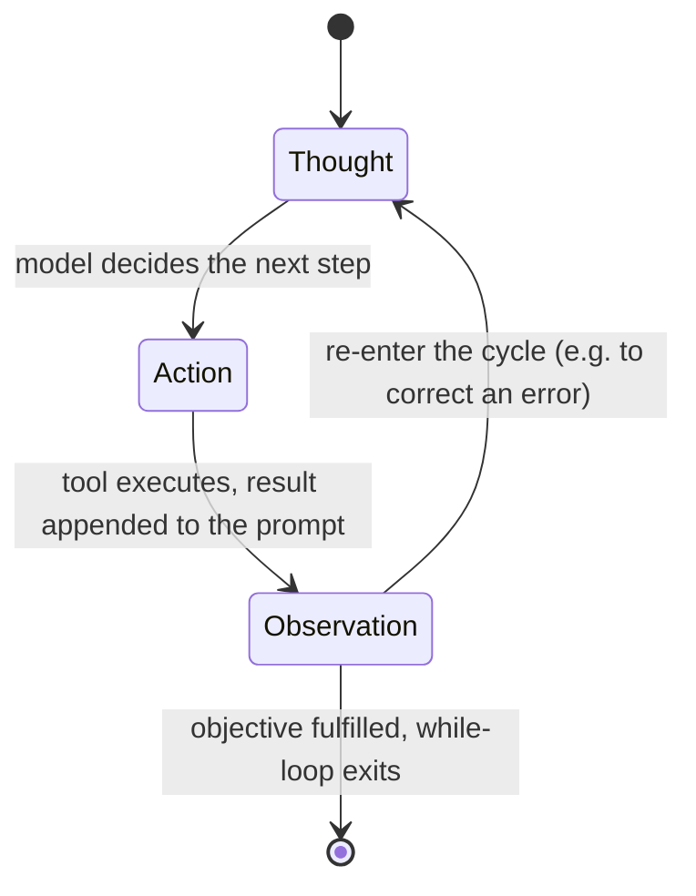

# Ch. 02 -- The agent loop -- thought, action, observation

**Prerequisites:** [Ch.01 Topology](01-topology.md) -- you need the four axes and the harness/model distinction before the loop's own mechanics will land. | **Sources:** [`references/harnesses/agent-topology.md`](../../references/harnesses/agent-topology.md) Section 7 (where the loop sits), [`references/harnesses/agent-loop.md`](../../references/harnesses/agent-loop.md) (VERIFIED from Hugging Face Agents Course Units 1), [`resources/airchon-teacher/knowledge-path-curriculum.md`](../../resources/airchon-teacher/knowledge-path-curriculum.md) Transition 1 Module 2
**Reading time:** ~16 min | **You will learn:** the Thought/Action/Observation cycle and ReAct framing; why observations are appended to the prompt; the stop-and-parse mechanism; three failure classes that map onto the three step names

> Why this chapter exists: Ch.01 gave you the map. This chapter gives you the engine that every harness on that map wraps. The Thought/Action/Observation while-loop is the paradigm case of "agent" this whole book uses -- the narrow, Hugging-Face-course-leaning sense where a language model plans its own next step, calls a tool, and learns from what came back. Ch.03 will hang real harness specifics onto it (turn counts, budget caps, step-limit injections); Ch.04 will show what happens to its growing context when it runs too long; Ch.05 will show what happens when you run more than one of these loops at once. None of that makes sense until you can trace one loop iteration turn by turn.

## The idea in plain language

### The loop in one sentence, then one concrete iteration

The agent loop is three words in a circle: Thought, Action, Observation. In one sentence: a language model looks at everything said so far, decides to do one thing next, watches what happened, remembers it by appending it to the conversation, and repeats.

Make it concrete. Suppose the user said "add a retry to the login fetcher." The harness hands the model the system prompt plus that request. Iteration 1: **Thought** -- "I need to find the fetcher file first." **Action** -- `Grep pattern="fetch.*login" path="src"` (the model emits that as JSON and stops). The harness parses that JSON, runs ripgrep, gets a hit `src/api/auth.ts:42`. That result -- "Found src/api/auth.ts:42 -- `export async function loginFetcher`" -- is appended as an **Observation**. Iteration 2 now sees the user request *plus* the observation that the fetcher lives in `auth.ts`. Thought: "Now I should read that file." Action: `Read src/api/auth.ts`. Observation: the file's contents, now 200 lines appended. Iteration 3: Thought: "I see no retry logic; I'll edit." Action: `Edit src/api/auth.ts ...` Observation: "File updated." The loop exits when a Thought produces no tool calls and instead produces a final answer like "Added exponential backoff -- tests pass." Each observation literally becomes part of the next prompt.

### Two load-bearing facts the simple picture hides

First, **the loop's entire state is the growing prompt**. There is no hidden side-channel the next Thought can consult that is not already in the conversation history. When a tool returns a large JSON blob, that blob is not "returned to the caller" the way a function return value sits on a stack frame. It is appended to the end of the prompt, where it will be re-read -- and re-paid for -- on every future model call for the rest of the session. If iteration 2 read a 20,000-line file, iterations 3, 4, 5 ... N each re-read those 20,000 lines as part of their input. This is why tool-output volume is a context cost, not just an I/O cost, and why the compression and caching chapters exist at all. A developer who treats "Read a big file" as free after the read will systematically misprice which operations make sessions expensive.

Second, **an Action does not come from a function pointer -- it comes from text the model emitted and then stopped**. The model does not call a tool by invoking a function pointer. It emits text in a predetermined format -- JSON `{"tool": "Read", "path": "src/api/auth.ts"}`, or a Python code block, or a fine-tuned function-call object -- and then deliberately stops generating. An external parser reads that text, decides which tool the model meant, extracts the arguments, and only then does the harness execute anything. The course calls this the **stop-and-parse** approach, and its three parts (emit in a format, stop, parse) are at least as important as the loop's three named steps, because they are where format errors, truncation mid-JSON, and schema mismatches live. Two harnesses can run the same Thought/Action/Observation loop with completely different stop-and-parse details and behave like different systems -- one may refuse to run a truncated tool call (pi's `failToolCallsFromTruncatedMessage()` does exactly this), the other may try to parse it.

### Why "while loop until done" matters more than "three steps"

The course is explicit: control flow is a `while` loop that continues until the objective is fulfilled, and because errors are Observations, the agent can "re-enter the cycle to correct its approach" instead of crashing. There is no separate error-handling mode. A permission-denied Observation is handled the same way a file-content Observation is -- the next Thought reads it and decides. This is why the same loop that writes files can also recover from its own failures without special casing: recovery *is* the loop, seen one iteration later.

## How it actually works

### The loop, as commonly taught

VERIFIED (Hugging Face Agents Course, Unit 1 "Agent steps and structure," fetched 2026-07-30) the cycle is named Thought -> Action -> Observation, and the course defines each step in these terms: Thought -- "The LLM part of the Agent decides what the next step should be." Action -- "The agent takes an action by calling the tools with the associated arguments." Observation -- "The model reflects on the response from the tool." VERIFIED (same page): control flow is explicitly a while loop -- "the agent uses a while loop: the loop continues until the objective of the agent has been fulfilled" -- attributed to the ReAct pattern, and genuinely cyclical: if an observation reports an error, the agent can "re-enter the cycle to correct its approach" instead of stopping.

It is tempting to read the loop as four boxes because the diagram has four nodes, but the vocabulary is three named steps plus a transition condition. The transition -- "is the objective fulfilled?" -- is not itself a Thought, and on many harnesses (Ch.03 will show this concretely) it is not even decided by the model alone; a harness-side budget cap or step limit can force the same exit the model's own "I am done" would have produced, with a different status code.

### Observations are appended to context, not returned to a caller

VERIFIED (Hugging Face Agents Course, Unit 1 "Observations," fetched 2026-07-30): observations are "how an Agent perceives the consequences of its actions" -- "signals from the environment." The mechanical sequence is: parse the action to identify function and arguments, execute it, then "Append the result as an Observation" at the end of the prompt, integrating "the new information into its existing context, effectively updating its memory." VERIFIED (same page): five observation categories are taught -- system feedback (errors, status codes), data changes (file/database modifications), environmental data (metrics, sensor readings), response analysis (API/computation output), and time-based events.

Three consequences follow from the append mechanic, and this book returns to all three:

First, context grows monotonically. Nothing about the loop shrinks the prompt; the only mechanisms that shrink it -- compaction, eviction, prefix caching -- are harness-layer interventions on the loop, not part of the loop's own definition. Reading a 20,000-line file and then a 20,000-line observation is not twice as expensive as reading the file once. It is an input-token cost paid again on the next model call, and again on the one after that, until something explicitly compresses it.

Second, everything the model learns is mediated by text. The agent does not observe a file's bytes directly; it observes the harness's textual rendering of those bytes as formatted by the tool. Two harnesses can render the same successful file read as observably different Observations (different truncation, different error formatting), and the model will behave differently on each even though the underlying filesystem fact is identical.

Third, error handling is just another Observation. A failed tool call does not throw an exception the loop catches at a different layer. It produces an Observation that says the call failed, which the next Thought must interpret. This is why the same loop that writes files correctly can also recover from a permission-denied error without any special error-handling mode -- the recovery is the same mechanism as the write, seen one iteration later.

### How an action gets out of the model: stop-and-parse

VERIFIED (Hugging Face Agents Course, Unit 1 "Actions," fetched 2026-07-30): three agent shapes are named by action format -- JSON agent (action expressed as JSON), code agent ("the Agent writes a code block that is interpreted externally"), and function-calling agent, described as "a subcategory of the JSON Agent which has been fine-tuned to generate a new message for each action." VERIFIED (same page): the stop-and-parse approach has three parts -- the agent emits the action in "a clear, predetermined format (JSON or code)"; the LLM must "stop generating additional tokens" once the action is complete; an external parser then reads the action, picks the tool, and extracts parameters. Completion is signalled in a format-specific way (a terminal structured action object for JSON agents; the course's code-agent example uses `print(final_answer)`).

This three-part split is where the loop's most concrete failure modes live. The model can emit the wrong format and get a parse error as its Observation. It can emit the right format but get truncated by an output-length limit -- the pi and Hermes Agent implementations (Ch.03) both document explicit mitigations for this case, refusing to execute a tool call whose arguments may be truncated, and that mitigation belongs to the stop-and-parse layer, not to the loop's planning logic. It can emit the right format for the wrong tool, or the right tool with wrong arguments, and each of those is a different class of failure to separate when profiling a run.

## Edge cases and gotchas the wiki flagged

- **Treating a framework-general course as evidence about one product's internals is authority overreach.** [agent-loop.md](../../references/harnesses/agent-loop.md) is deliberately general-concepts only and holds no harness sections. Every harness-specific claim about where its stop condition lives, how it formats tool results, or what its turn boundaries are belongs on [agent-loop-implementations.md](../../references/harnesses/agent-loop-implementations.md) with that harness's own docs/repo citation. Do not cite the Hugging Face course as proof of how Claude Code counts a turn. Source: [agent-loop.md](../../references/harnesses/agent-loop.md) scope note.
- **The loop's state is the growing prompt -- there is no other memory.** Tool-output volume is context cost. This is load-bearing for performance work and for the compression chapter that follows. Source: [agent-loop.md](../../references/harnesses/agent-loop.md) Section 2.
- **Completion signalling is format-specific.** A JSON agent and a code agent both run the same while loop but signal "I am done" differently (structured action object vs. `print(final_answer)` in the course's example). Do not assume a harness's completion tool (`task_complete`, `kanban_complete`) is part of the general loop -- those are harness-layer additions Ch.03 will ground. Source: [agent-loop.md](../../references/harnesses/agent-loop.md) Section 3.
- **ReAct attribution is the course's claim, not an independently verified reading of the ReAct paper.** The original Yao et al. ReAct paper was not fetched for [agent-loop.md](../../references/harnesses/agent-loop.md). Treat the pattern name as inherited from the course, and cite the course, not the paper, when attributing the cycle. Source: [agent-loop.md](../../references/harnesses/agent-loop.md) Sources section.
- **Three failure classes map onto the three step names.** BEST CURRENT UNDERSTANDING (reasoned from verified material, not stated by the source): bad Thought (wrong next step given adequate evidence), bad Action (right intent, wrong tool or arguments), and bad Observation handling (result returned but not integrated, so work repeats). Keeping them distinct is what makes "the agent was slow" resolvable into a layer. Source: [agent-loop.md](../../references/harnesses/agent-loop.md) Section 4.

## Sources and grounding note

This chapter distills:

- `references/harnesses/agent-topology.md` Section 7 -- for where the Thought/Action/Observation loop sits among the four topology axes (a single, hybrid-reactive, tool-augmented agent in the narrow decomposition).
- `references/harnesses/agent-loop.md` -- the authoritative page for this chapter. Every VERIFIED claim above about what the course teaches is inherited from that page's own dated fetch (2026-07-30) of the Hugging Face Agents Course (Units 1, Observations, Actions). Tags preserved: VERIFIED (Thought/Action/Observation definitions, while-loop framing, ReAct attribution, append-to-context mechanic, five observation categories, three agent shapes, stop-and-parse three parts) vs. BEST CURRENT UNDERSTANDING, UNCONFIRMED (three failure classes). No claim here re-fetches a primary source -- authority rests with the wiki page's own fetch, as documented there.
- `references/harnesses/agent-loop-implementations.md` -- not distilled here, but named as the companion page that gives each harness's own stop condition, turn-counting, and budget-cap specifics. That separation is load-bearing and is preserved deliberately.

If a future mechanism needs a loop extension (e.g., a new action format beyond JSON/code/function-calling), that extension belongs in [`references/harnesses/agent-loop.md`](../../references/harnesses/agent-loop.md) first -- ask `airchon-author` to research it there before adding it to the book.

---

Prev: [Ch.01 Topology](01-topology.md) | Index: [index.md](../index.md) | Next: [Ch.03 Agent Loop Implementations](03-agent-loop-implementations.md) | Glossary: [agent-loop](../glossary.md#agent-loop) · [thought](../glossary.md#thought) · [action](../glossary.md#action) · [observation](../glossary.md#observation) · [react](../glossary.md#react) · [stop-and-parse](../glossary.md#stop-and-parse)
