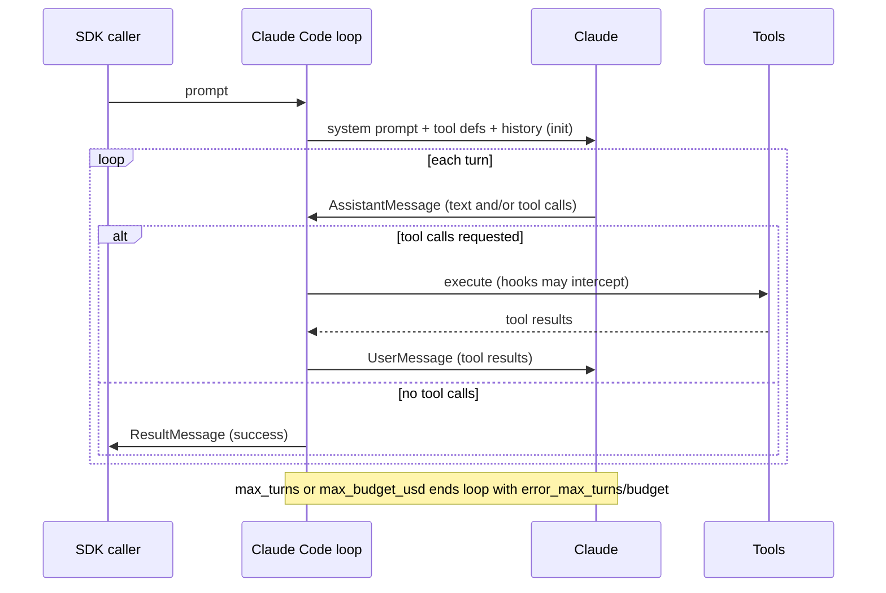
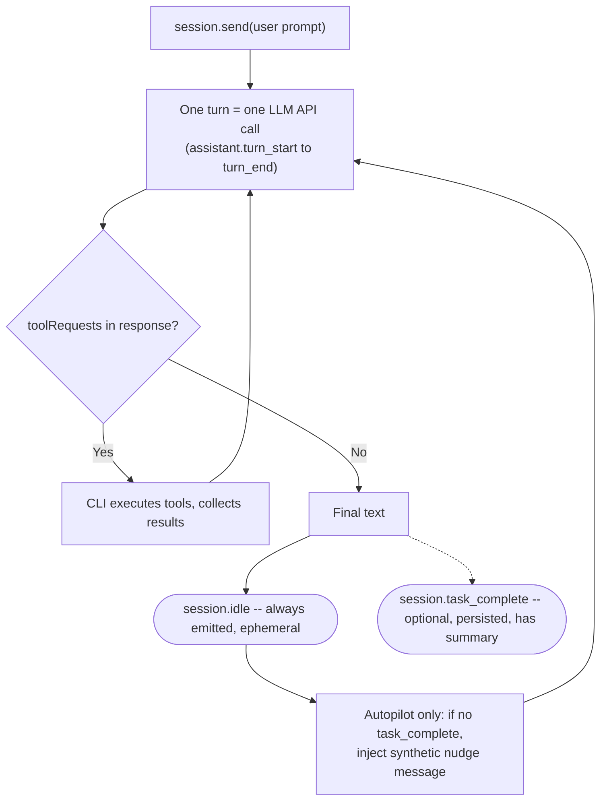
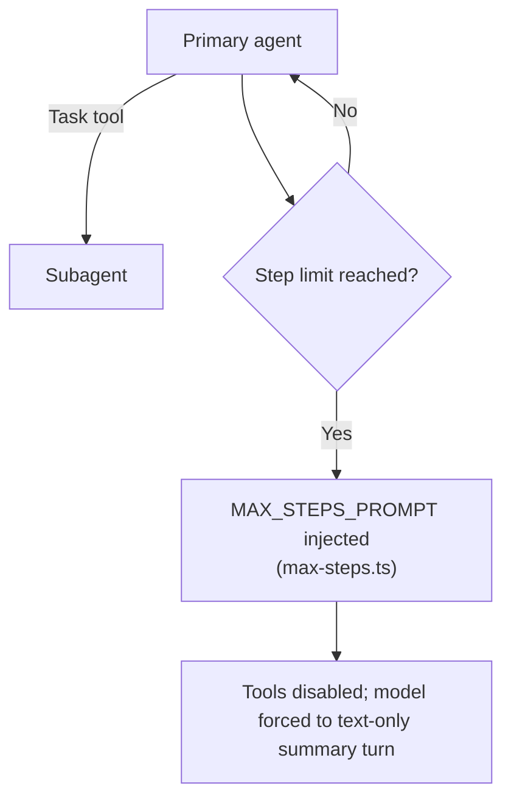

# Ch. 03 -- Agent loop implementations (Claude Code, Copilot CLI, OpenCode, pi, Hermes Agent, DeepSeek)

**Prerequisites:** [Ch.02 Agent Loop](02-agent-loop.md) -- the general Thought/Action/Observation cycle this chapter hangs harness specifics onto. | **Sources:** [`references/harnesses/agent-loop-implementations.md`](../../references/harnesses/agent-loop-implementations.md) (VERIFIED from Agent SDK docs, Copilot SDK docs, OpenCode `dev` branch source, pi `packages/agent` source, Hermes Agent `agent/conversation_loop.py`, DeepSeek Harness Cordis docs), [`references/harnesses/agent-loop.md`](../../references/harnesses/agent-loop.md) for the general append mechanic
**Reading time:** ~22 min | **You will learn:** how six harnesses each implement the same abstract loop with different turn boundaries, stop conditions, and budget caps; why a turn means one LLM call everywhere but not the same bookkeeping

> Why this chapter exists: Ch.02 taught the abstract loop -- one whiteboard diagram that every harness instantiates. This chapter shows what changes when you actually ship that loop inside a product. Each harness answers the same four questions -- what counts as a turn, what stops the loop naturally, what caps can stop it early, and what happens to tool results in context -- and arrives at a different answer that matters in practice. If you read Ch.02 and then jumped straight to Ch.04's memory advice without this chapter, you would conflate turn counts that are not comparable and misread a budget cap as a turn cap.

## The idea in plain language

### The same recipe, six different kitchens

If the general loop from Ch.02 is a recipe -- Thought, act, observe, repeat until done -- then a harness's loop implementation is a specific kitchen that runs that recipe with its own timers, counters, and house rules. Every kitchen makes the same dish (the model deciding the next tool call against an appended history), but one kitchen counts steps differently from another, one times out on dollars (`max_budget_usd`) while another times out on steps (`max_turns`), and one injects a synthetic reminder into the recipe when the chef stalls (`Copilot CLI autopilot`'s task-completeness nudge) while another injects one when the recipe gets too long (`OpenCode`'s `MAX_STEPS_PROMPT`). The differences are not cosmetic. A prompt that runs 40 turns in Claude Code, 40 turns in Copilot CLI, and 40 turns in OpenCode has hit three different limits (or none) depending on how each harness defines and bounds a turn -- so comparing "turn count" across harnesses without defining what a turn *is* per harness is a category error this chapter exists to prevent.

Start with the simplest notion everyone agrees on: the **natural stop**.

The smallest example to keep in mind is the natural stop condition. In every harness this chapter covers, the natural stop is the same: the model produces output with no tool calls. The harness does not decide the task is done. The model does -- by choosing not to ask for another tool. Everything else -- turn caps, budget caps, step-limit injections, synthetic nudges -- is a harness-side guardrail on top of that model-authored decision, and each harness layers a different guardrail at a different trigger point for a different reason.

Progressive disclosure helps here, so we will walk the six harnesses from the most documented and most constrained (Claude Code) to the least constrained (pi), with the open-source trio that lets you actually read the loop (OpenCode, pi, Hermes Agent) carrying the most source-verified detail.

## How it actually works

### Claude Code -- the documented SDK loop, turn-and-budget-capped

VERIFIED (`code.claude.com/docs/en/agent-sdk/agent-loop`, fetched 2026-07-30): Claude Code's SDK "runs the same execution loop that powers Claude Code." Five stages: receive prompt (system prompt, tool definitions, conversation history; SDK yields `SystemMessage` subtype `init`), evaluate and respond (Claude may respond with text, tool calls, or both; SDK yields `AssistantMessage`), execute tools (SDK runs each requested tool, results feed back; hooks may intercept before execution), repeat (each full cycle is one turn), return result (final text-only `AssistantMessage` followed by `ResultMessage` with usage/cost/session ID).

A **turn** is one full cycle -- one Claude response plus any tool execution it requested. VERIFIED (same page): "Turns continue until Claude produces output with no tool calls, at which point the loop ends." Two hard caps bound it independently: `max_turns`/`maxTurns` (counts tool-use turns only) and `max_budget_usd`/`maxBudgetUsd` (spend threshold that "covers subagents: their spend counts toward the total"). Hitting either yields `ResultMessage` subtype `error_max_turns` or `error_max_budget_usd` -- the loop reports which limit ended it, not a silent truncation. Tool results are appended as a `UserMessage` ("with the tool result content sent back to Claude"), mechanically the same append-to-context shape Ch.02 describes, now with Claude-Code-specific naming. The context window "does not reset between turns within a session"; compaction summarizes older history when it nears the limit, emitting `compact_boundary`. VERIFIED (same page): parallel execution -- "Read-only tools ... can run concurrently. Tools that modify state (like Edit, Write, and Bash) run sequentially."



Authority note: Claude Code is closed source. The Agent SDK docs are product-surface documentation, not published source. If a claim needs to go deeper than what those docs state, the honest answer is "not independently verifiable" -- do not fill that gap with OpenCode's or pi's mechanism. Source: [agent-loop-implementations.md](../../references/harnesses/agent-loop-implementations.md) Section 1.

### Copilot CLI -- one LLM call is one turn, with a two-signal completion split

Copilot CLI publishes no dedicated loop page at `docs.github.com/copilot`. VERIFIED (`github.com/github/copilot-sdk` `docs/features/agent-loop.md` and `session-limits.md`, fetched via `gh api` 2026-08-24): the grounding for this section is the Copilot SDK's own docs, where the CLI is named as the orchestrator -- "The SDK is a transport layer... The CLI is the orchestrator that runs the agentic tool-use loop." That sentence is treated as VERIFIED evidence about the CLI's loop shape while honestly flagging that no first-party `docs.github.com` page independently corroborates it.



VERIFIED (same doc): a turn is "exactly one LLM API call... 1. CLI sends history to LLM. 2. LLM responds (possibly with tool requests). 3. If tools requested, CLI executes them. 4. `assistant.turn_end` is emitted." VERIFIED: the loop's natural stop is model-driven -- "The CLI is purely mechanical: model asked for tools -> execute -> call model again. The model is the decision-maker for when to stop." Crucially, two separate completion signals exist with different guarantees. `session.idle` is always emitted when the tool-use loop ends -- ephemeral, not persisted, means only "the agent has stopped processing" (the signal `sendAndWait()` blocks on). `session.task_complete` is optional -- requires the model to call a `task_complete` tool -- persisted to the event log with an optional `summary`, meaning the model considers the overall task fulfilled. In ordinary interactive mode, `task_complete` may never appear; `session.idle` still fires.

VERIFIED (same doc): autopilot mode turns the optional signal into a second gate. If the loop ends without `task_complete`, the CLI injects a synthetic user message -- "You have not yet marked the task as complete using the task_complete tool. If you were planning, stop planning and start implementing..." -- re-read as an ordinary user turn that restarts the loop. Structurally the same injection shape OpenCode's step-limit and pi's steering queues use (below), but the trigger is inverted: OpenCode injects when a ceiling is reached, autopilot injects when a completion signal is absent. VERIFIED (`session-limits.md`): no documented hard turn-count cap analogous to Claude Code's `max_turns`. What exists is a soft, spend-denominated `sessionLimits.maxAiCredits`, checked after a model call returns ("one response can exceed the configured value before the next call is blocked") and raising `session_limits_exhausted.requested` (pause-for-decision) rather than a hard stop.

### OpenCode -- step-limit prompt injection from real source


VERIFIED (`opencode.ai/docs/agents/`, fetched 2026-07-30): OpenCode distinguishes primary agents ("the main assistants you interact with") from subagents invoked via a `Task` tool, with per-agent permission modes (allow all, ask, or disable). VERIFIED (same page): a documented step limit -- "When the limit is reached, the agent receives a special system prompt instructing it to respond with a summarization." VERIFIED (`github.com/anomalyco/opencode` `dev` branch, `packages/core/src/session/runner/max-steps.ts`, read directly): the exact text is `MAX_STEPS_PROMPT`: "CRITICAL - MAXIMUM STEPS REACHED / The maximum number of steps allowed for this task has been reached. Tools are disabled until next user input. Respond with text only." -- a hard-coded injection into the model's stream, forcing a text-only turn. Because OpenCode is open source, this is the harness where "go read the loop" is actionable: `packages/core/src/session/runner/` (`index.ts`, `llm.ts`, `max-steps.ts`, `model.ts`), `session/execution.ts`, `session/compaction.ts`.

### pi -- no hard cap, with explicit user-queued steering and a length-gated safety

pi ships as a monorepo at `github.com/earendil-works/pi` (three npm packages: `@earendil-works/pi-ai` for wire protocol, `@earendil-works/pi-agent-core` for the loop, `@earendil-works/pi-coding-agent` for the shipped CLI -- VERIFIED via `package.json` reads 2026-09-01).

```mermaid
sequenceDiagram
    participant App as coding-agent (AgentSession)
    participant Loop as pi-agent-core runLoop
    participant LLM as Model via pi-ai
    participant Tools as Tools
    App->>Loop: agentLoop(prompts, context, config)
    Loop->>Loop: emit turn_start
    loop each turn
        Loop->>LLM: streamAssistantResponse
        LLM-->>Loop: AssistantMessage (stopReason: toolUse/stop/length/error/aborted)
        alt stopReason is toolUse
            Loop->>Tools: executeToolCalls (parallel or sequential)
            Tools-->>Loop: ToolResultMessage[]
            Loop->>Loop: turn_end; prepareNextTurn hook (compaction check)
        else stopReason is stop (no tool calls)
            Loop->>Loop: getFollowUpMessages() -- if queued, continue else agent_end
        end
    end
```

VERIFIED (`packages/agent/src/types.ts`, `agent-loop.ts`, full reads): a turn is "one assistant response + any tool calls/results" (`turn_start` to `turn_end`). The natural stop is model-driven; no `maxTurns`/`maxBudgetUsd`/`maxSteps` field exists in `AgentLoopConfig` -- the only externally-forced early stop is the `shouldStopAfterTurn` predicate the embedding app supplies. VERIFIED (settings docs, grepped 2026-09-01): no documented hard cap. Two source-verified mechanics matter: (1) compaction runs via `prepareNextTurn` -- "Pi checks this threshold after tools finish and their results are appended, before starting the next assistant response" (`packages/coding-agent/docs/compaction.md`), mechanically wired at `agent-session.ts`'s `prepareNextTurnWithContext` hook; (2) a genuine safety: VERIFIED (`failToolCallsFromTruncatedMessage()` in `agent-loop.ts`): if `stopReason` is `length` (output truncated by token limit) and the message contains tool calls, none are executed -- synthetic error `ToolResultMessage`s are substituted instead, instructing the model to re-issue with complete arguments. This directly parallels Hermes Agent's identical mitigation (below), an independent convergence worth naming.

VERIFIED (usage docs, `types.ts`): interactive steering -- a **steering message** (Enter) drains via `getSteeringMessages()` immediately after current tool calls finish, before the next LLM call; a **follow-up message** (Alt+Enter) drains via `getFollowUpMessages()` only when the agent would otherwise stop. Same injection shape as Copilot CLI's autopilot nudge and OpenCode's `MAX_STEPS_PROMPT`, but the trigger is categorically different: pi's queues are drained only because a human queued something, never because a threshold was hit.

### Hermes Agent and DeepSeek Harness -- the open-source Python and plugin-loop ends

These are covered in detail in the wiki page but summarized here comparatively, since Ch.03's purpose is the cross-harness table, not a full transcription of each harness's loop body.

VERIFIED (`agent/conversation_loop.py`, read 2026-09-01): Hermes Agent's `run_conversation()` is a ~3,900-line `while (api_call_count < max_iterations and iteration_budget.remaining > 0) or _budget_grace_call` loop over `tool_calls` vs. finalization, with a named internal vocabulary clash: `conversation_loop.py` calls the whole `run_conversation()` call "one user turn" while `hermes_cli/config.py`'s `resolve_turn_limit()` calls each single pass through the loop a "turn" -- a directly observed inconsistency fleeting enough to catch only because Hermes Agent is open source. VERIFIED (same files): the iteration budget is a lock-guarded `IterationBudget` (`consume()`/`refund()` for `execute_code` programmatic calls), with a one-shot `budget_grace_call` flag guaranteeing exactly one further iteration when exhausted. VERIFIED: tool dispatch uses a segment planner (`tool_dispatch_helpers.py`'s `_plan_tool_batch_segments()`) splitting a batch into maximal parallel-safe runs vs. sequential barriers (read-only/non-overlapping paths admitted via `DaemonThreadPoolExecutor` up to `_MAX_TOOL_WORKERS = 8`), with three bounded nudges on the no-tool-calls finalization path (dropped-tool-call recovery up to 3, verify-on-stop up to 2, kanban-stop up to 2). VERIFIED: a `finish_reason == "length"` response with parsed tool calls is never executed -- same `stopReason:length`-gates-execution safety as pi, second independent convergence.

For DeepSeek Harness (`github.com/deepseek-ai/deepseek-harness`, Cordis plugin `@deepseek-ai/dsh-agent-loop`, docs fetched 2026-09-01): the loop is itself a plugin -- the design principle is "Everything is a Plugin" -- and follows a Cordis waterfall/serial pattern over `agent/pre-step` waterfalls and `agent/turn-stopping` serial checks rather than a single monolithic `while` statement. The wiki treats this as the framework harness where the loop's own shape is intentionally swappable.

### The comparison you actually need

| Harness | What one turn is | Natural stop | Hard cap | Cap enforcement shape |
|---|---|---|---|---|
| Claude Code | One Claude response + tool execution | Model output with no tool calls | `max_turns` and `max_budget_usd` | Immediate, reported as `error_max_turns`/`error_max_budget_usd` |
| Copilot CLI | Exactly one LLM API call | No `toolRequests` in response | `maxAiCredits` (soft, spend) | After a call returns; may exceed by one response; raises `session_limits_exhausted.requested` (pause for decision) |
| OpenCode | Primary/subagent step | No tool calls, or step limit | Step limit (system prompt injection) | `MAX_STEPS_PROMPT` forces text-only turn |
| pi | `turn_start` to `turn_end` (one response + tool execution) | No tool calls and no `getFollowUpMessages()` queued | None; only `shouldStopAfterTurn` predicate | App-supplied predicate checked after `turn_end`, before `prepareNextTurn` |
| Hermes Agent | One pass through `while` (one LLM call + tool dispatch) in source; whole `run_conversation()` in docstring | No `tool_calls` | `max_iterations`/`max_turns` + `IterationBudget` (with `budget_grace_call`) | Budget/iteration caps with grace call; refund for `execute_code` |
| DeepSeek | Cordis plugin `AgentLoop` driver turn | Plugin's turn-stopping chain | Configurable via Cordis catalog | Waterfall/serial plugin chain |

## Edge cases and gotchas the wiki flagged

- **Turn is not comparable across harnesses without a per-harness definition.** A Copilot CLI turn is exactly one LLM API call; a Claude Code turn is one full evaluate-respond-execute cycle; pi explicitly includes tool execution inside the turn. Do not sum turn counts across harnesses silently. Source: [agent-loop-implementations.md](../../references/harnesses/agent-loop-implementations.md) Sections 1-4.
- **Two distinct completion signals in Copilot CLI.** `session.idle` (always, ephemeral, mechanical) vs. `session.task_complete` (optional, persisted, semantic). In interactive mode, `task_complete` may never appear; do not treat `idle` as proof the model considers the task fulfilled. Source: [agent-loop-implementations.md](../../references/harnesses/agent-loop-implementations.md) Section 2.
- **Step-limit injection is not truncation.** OpenCode's `MAX_STEPS_PROMPT` and Copilot CLI's autopilot nudge both inject a synthetic message the model reads as context; they do not cut the stream. pi's `length`-gated refusal to execute truncated tool calls is the inverse -- an execution-time safety that discards calls rather than injecting a new prompt. Source: [agent-loop-implementations.md](../../references/harnesses/agent-loop-implementations.md) Sections 2-4.
- **`stopReason: length` with parsed tool calls is refused in both pi and Hermes Agent.** Even if the JSON parses cleanly, truncated arguments are discarded and the model is told to re-issue. This is a convergence worth citing, not assumed absent elsewhere without a source. Source: [agent-loop-implementations.md](../../references/harnesses/agent-loop-implementations.md) Sections 4-5.
- **Hermes Agent's `max_turns` default is inconsistent across files.** `resolve_turn_limit()` normalizes absent/`None` to unlimited (`sys.maxsize`), with CLI wiring confirming unlimited. Separately, `iteration_budget.py`'s docstring states "default 500" and a defensive `getattr(..., 500)` fallback exists. Neither Copilot CLI nor OpenCode nor pi exposes enough internals to surface an equivalent inconsistency; pi's loop config has no cap field at all. Source: [agent-loop-implementations.md](../../references/harnesses/agent-loop-implementations.md) Section 5.5.

## Sources and grounding note

This chapter distills:

- `references/harnesses/agent-loop-implementations.md` Sections 1-6 -- the sole authoritative page for every harness-specific claim above. Tags preserved per section: VERIFIED (Agent SDK docs for Claude Code; Copilot SDK `agent-loop.md`/`session-limits.md` for Copilot CLI; `opencode.ai/docs/agents` plus `max-steps.ts` `dev` branch source for OpenCode; `packages/agent` and `packages/coding-agent` source/docs for pi; `agent/conversation_loop.py`/`tool_dispatch_helpers.py`/`tool_executor.py`/`iteration_budget.py`/`verification_stop.py`/`kanban_stop.py` plus `hermes_cli/config.py` for Hermes Agent; DeepSeek Harness `docs/` and Cordis catalogs for DeepSeek) vs. BEST CURRENT UNDERSTANDING, UNCONFIRMED (what arms `budget_grace_call` in Hermes Agent; deployment surface of `AgentHarness` in pi). No claim here re-fetches a primary source -- authority rests with that wiki page's own dated fetches and direct source reads (2026-07-30 through 2026-09-01), as documented there.
- `references/harnesses/agent-loop.md` -- for the general append-to-context shape now named per harness (`UserMessage`, `role: tool`, `role: "tool"`).

If a harness adds a new loop-level guard or a new `stopReason` variant, that addition belongs in [`references/harnesses/agent-loop-implementations.md`](../../references/harnesses/agent-loop-implementations.md) first -- ask `airchon-author` to research it there before adding it to the book.

---

Prev: [Ch.02 Agent Loop](02-agent-loop.md) | Index: [index.md](../index.md) | Next: [Ch.04 Memory and Context](04-memory-context.md) | Glossary: [agent-loop](../glossary.md#agent-loop) · [turn](../glossary.md#turn) · [task_complete](../glossary.md#task_complete) · [max_turns](../glossary.md#max_turns) · [step-limit](../glossary.md#step-limit)
