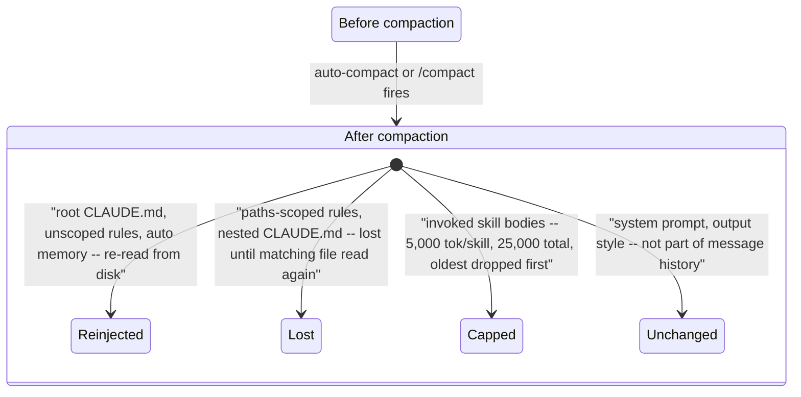

# Ch. 04 -- Memory, instruction budget, and compression

**Prerequisites:** [Ch.03 Loop Implementations](03-agent-loop-implementations.md) -- you need to know how the loop appends context before the costs of that growth will make sense. | **Sources:** [`references/harnesses/memory-management.md`](../../references/harnesses/memory-management.md), [`references/harnesses/instruction-context-budget.md`](../../references/harnesses/instruction-context-budget.md), [`references/harnesses/context-compression.md`](../../references/harnesses/context-compression.md), [`references/harnesses/caching.md`](../../references/harnesses/caching.md), [`references/harnesses/session-persistence.md`](../../references/harnesses/session-persistence.md)
**Reading time:** ~28 min | **You will learn:** the three different things people conflate as "context" -- eager instruction budget, mid-run compression, and compaction survival; how caching reuses a prefix rather than shrinking it; what actually persists across a process restart

> Why this chapter exists: Ch.02 showed the loop's state is the growing prompt. That leaves three questions every harness must answer: what gets loaded eagerly before the loop starts and how do you keep that tier small (instruction budget), what happens when the loop fills the context window mid-run (compression), and what survives process death (session persistence). Add a fourth -- how a server reuses a previously-sent prefix so the next turn costs a fraction of a fresh call (caching) -- and you have the four operations on the same resource that newcomers most often conflate. This chapter deliberately keeps them apart, the same way the curriculum's Cluster 1 does.

## The idea in plain language

### Four tables, not one "too long" problem

Think of an agent session as a long dinner-table conversation where everything anyone says gets written down and re-read before the next person speaks. Now imagine a newcomer says "the conversation got too long." That complaint could mean four completely different things -- different tables, different fixes, different cost models -- and this chapter keeps them scrupulously apart because every harness names them similarly enough to confuse:

1. **The table set before anyone sits down** (instruction budget).
2. **The conversation itself getting too long to hold in one's head** (compression).
3. **The dinner party ending and everyone going home** (persistence across process death).
4. **The bill for re-reading the same minutes before each turn** (caching).

Meet each from zero below before the mechanism section names config keys and file paths.

### Table 1 -- the eager instruction budget (set before the loop starts)

Imagine the restaurant tapes house rules to the wall before anyone arrives: `CLAUDE.md` on the main wall, `~/.pi/agent/AGENTS.md` in the global hallway, `.claude/rules/*.md` placards for specific rooms. Every guest must read all the rules once on arrival, even if tonight's dish never needs the seafood rules. That reading time is paid *eagerly* -- whether or not the task needs it -- and again before every future turn when the whole prompt is re-sent. The budget question is therefore "how do you keep the wall small without losing the rules that matter?" The answer is not to pile more rules on the wall; it is to make rules *lazy* -- loaded only when the agent reads a matching file (Claude Code's `paths:` scoping, Copilot CLI's `applyTo:`) -- or to package whole instruction bundles as **skills** loaded only on invocation (Ch.08). An `@path/to/import` line between two rule files does not help the budget either: the docs are blunt that imports "still load and enter the context window at launch," so they reorganize the wall rather than shrink it.

Four different problems all sound like "the conversation got too long," but they are different tables -- continued:.

### Table 2 -- the conversation itself getting too long (compression)

Mid-run compression -- Claude Code's evict-then-summarize, Copilot CLI's 95%-trigger checkpoint compaction, OpenCode's `prune()`/`process()` pipeline -- shrinks or summarizes the transcript when the model is mid-task. It decides what to evict first (oldest tool outputs) and what to preserve as summary.

The first table is set before anyone sits down. Instruction files -- `CLAUDE.md`, `AGENTS.md`, `~/.pi/agent/AGENTS.md` -- are the house rules taped to the wall. The harness reads them, concatenates them, and hands the whole bundle to the model as the first message. The cost of that bundle is paid whether or not the task needs any of it, and on every future turn. That is the eager-load budget, and the craft of keeping it small is a different skill from handling a loop that has grown too long.

The second table is the conversation itself getting too long to hold in one's head. Mid-run compression -- Claude Code's evict-then-summarize, Copilot CLI's 95%-trigger checkpoint compaction, OpenCode's `prune()`/`process()` pipeline -- shrinks or summarizes the transcript when the model is mid-task. It decides what to evict first (oldest tool outputs) and what to preserve as summary.

The third table is what happens when the dinner party ends and everyone goes home. Session persistence -- Claude Code's JSONL transcripts under `~/.claude/projects/`, Copilot CLI's session databases under `~/.copilot/`, OpenCode's SQLite migration, pi's JSONL tree -- decides what a `--resume` or `--continue` brings back when a new process starts. That is distinct from "what survived compaction inside one run."

The fourth is not a shrinking mechanism at all, but a reuse mechanism. Prompt caching recognizes that the beginning of a long conversation has not changed since the last turn -- the same system prompt, the same house rules, the same early tool outputs -- and charges a tenth of the price for re-sending them. It does not shorten the transcript. It makes re-sending it cheaper.

## How it actually works

### Memory management -- the instruction-file hierarchies and who gets to write them

VERIFIED ([memory-management.md](../../references/harnesses/memory-management.md) Sections 1-6): every harness has a purely human-authored instruction-file tier, but the tiers differ in discovery and liveness.

**Claude Code** (VERIFIED, `code.claude.com/docs/en/memory`): four scopes concatenated in load order, broadest first: managed policy (`/Library/Application Support/ClaudeCode/CLAUDE.md` on macOS, `/etc/claude-code/CLAUDE.md` on Linux/WSL, `C:\Program Files\ClaudeCode\CLAUDE.md` on Windows), user (`~/.claude/CLAUDE.md`), project (`./CLAUDE.md` or `./.claude/CLAUDE.md` discovered by walking up from cwd), local (`./CLAUDE.local.md`, gitignored -- append after `CLAUDE.md` in the same directory). All files concatenate; subdirectories below cwd are not loaded at launch but load when Claude reads a file there. `@path/to/import` expands at launch, relative to the importing file, recursion capped at four hops, parsed outside fenced code blocks -- and the docs are blunt that imports "still load and enter the context window at launch," not a saving. `.claude/rules/**/*.md` is the modular alternative: rules without `paths:` frontmatter load at launch with `.claude/CLAUDE.md` priority; rules with `paths:` (glob list) load only when Claude reads a matching file -- "not on every tool use." Brace expansion is budgeted (1,000 patterns, 4 MiB per rule).

Claude Code's distinguishing mechanism is **auto memory** (VERIFIED, same docs): on by default, stored at `~/.claude/projects/<project>/memory/` derived from the git repository (all worktrees of one repo share one directory), holding a `MEMORY.md` entrypoint plus arbitrary topic files. Only `MEMORY.md`'s first 200 lines or 25KB loads at startup; topic files are read on demand with ordinary file tools. Auto memory is machine-local, not inherited by subagents (except forks), controlled by `autoMemoryEnabled` and `CLAUDE_CODE_DISABLE_AUTO_MEMORY=1`.

**Copilot CLI** (VERIFIED, `docs.github.com` docs + `changelog.md`): instruction files automatically incorporated -- `.github/copilot-instructions.md` (repo-wide), `.github/instructions/**/*.instructions.md` (path-specific, no longer included in full on every session per a token-saving changelog entry), `AGENTS.md`, `CLAUDE.md` (reads `CLAUDE.md` too, with `@`-import expansion across all three families), and `~/.copilot/instructions/**/*.instructions.md` (user-level). But Copilot CLI's architectural difference is **Copilot Memory** -- a server-side service, not files. VERIFIED (same docs): two memory types -- repository-level facts (coding conventions, decisions, build commands; created only by users with write access; stored with the repo with code citations validated against the current branch) and user-level preferences (personal preferences from that user's interactions only). Both auto-delete after 28 days unused, visible at profile -> Copilot settings -> Features -> Copilot Memory and at repository Settings -> Copilot -> Memory. The CLI surface is `/memory on|off|show` plus model-facing tools `store_memory`/`vote_memory` (permission-gated, scope-visible as `user` vs `owner/repo`, throttled, shown in timeline). Sessions refresh memory context after 30 minutes -- injection is not purely session-start.

**OpenCode** (VERIFIED, `opencode.ai/docs/rules/` + `packages/opencode/src/session/instruction.ts` source, `dev` branch): ships **no native agent-authored memory tool at all** -- the only hit for the word `memory` in the docs tree is `opencode-supermemory`, a third-party plugin. What it has is a human-authored `AGENTS.md` hierarchy (project root `AGENTS.md`, global `~/.config/opencode/AGENTS.md`, with `CLAUDE.md`/`CONTEXT.md` only as compatibility fallbacks). The persistence-relevant finding is source-verified liveness: `Instruction.system()` is called fresh, with no caching, on **every iteration of the main session loop** (`prompt.ts`'s `while (true)`), so an `AGENTS.md` edit is visible on the very next turn. A second source-only finding is a nearby-file auto-attach: when the model reads a file, `resolve()` walks upward for the nearest `AGENTS.md`/`CLAUDE.md` not already surfaced, attached as `Instructions from: <path>`.

**pi** (VERIFIED, `github.com/earendil-works/pi` `resource-loader.ts` + docs, 2026-09-01): also ships **no agent-authored memory tool** (zero `MEMORY.md` hits in a repo-wide search). The instruction tier is `AGENTS.md`/`CLAUDE.md` discovered at global `~/.pi/agent/AGENTS.md`, then walking up from cwd to root, with per-directory first-match precedence `["AGENTS.override.md", "AGENTS.md", "AGENTS.MD", "CLAUDE.md", "CLAUDE.MD"]` -- at most one file per directory, root-most ancestor first in the assembled list, global at the very front. Special cases: `AGENTS.override.md` substitutes exclusively for that directory; `findShadowedContextFile()` prevents a linked git worktree from double-loading its main repo's file; `--no-context-files` disables the tier; the SDK exposes `agentsFilesOverride` for programmatic replacement.

**Hermes Agent** (VERIFIED, `agent/system_prompt.py` vs docs): three cache-priority tiers (`stable`/`context`/`volatile`) over `SOUL.md` (identity, slot 1), memory files `MEMORY.md`/`USER.md` with dedicated post-turn closed-learning-loop review, plus context-file discovery covering `CLAUDE.md`/`AGENTS.md`/`.cursorrules`. **DeepSeek Harness** (VERIFIED): ships **no `AGENTS.md`/`CLAUDE.md` convention at all** -- its deployment persona is a Cordis config string (`persona:` under `dsh-system-prompt`), with third-party memory MCP servers (Memorix, MCP Reference Memory, Engram) as default-off reference configs.

VERIFIED (same docs): what survives compaction in Claude Code is asymmetric by tier -- project-root `CLAUDE.md`, unscoped rules, and `MEMORY.md` are re-injected from disk; path-scoped rules and nested `CLAUDE.md` are lost until triggered again; skill bodies cap at 5,000 tok/skill, 25,000 total, oldest dropped, keeping the start of the file.

### Instruction context budget -- keeping the eager tier small

VERIFIED ([instruction-context-budget.md](../../references/harnesses/instruction-context-budget.md) Sections 1-5): why `@` imports don't reduce eager-load cost (they are organization, not saving -- the imported text still enters the window at launch), path-scoped rules vs. `applyTo:` as two harnesses' answers to scoping, skills as the invoke-only lazy tier, exclusion/trim levers, and how to measure what loaded.

**Claude Code** offers `claudeMdExcludes` (glob patterns, arrays merge), managed-policy `claudeMd` inlining, and `CLAUDE_CODE_ADDITIONAL_DIRECTORIES_CLAUDE_MD=1` for `--add-dir` memory files. **OpenCode** documents no path-scoped instruction tier -- absence of one is the lever -- and its per-turn re-read means budget is recomputed every turn rather than frozen at launch. **pi** adds provider-native deferred-schema-loading (`registerTool()`/`setActiveTools()`) as a genuinely new lazy mechanism, plus the `AGENTS.override.md` exclusive substitution and `agentsFilesOverride` programmatic control from Section 4.2. Measurement surfaces: Claude Code `/context` (Memory files heading) plus `InstructionsLoaded` hook; pi's `instructions.json`; OpenCode's source-only `instruction.ts` call site.

### Context compression -- shrinking a live run that has grown too long

VERIFIED ([context-compression.md](../../references/harnesses/context-compression.md) Sections 1-6): mid-run compression distinct from eager-load budget and compaction survival.

**Claude Code** (VERIFIED): two-phase evict-then-summarize; Sonnet 5's ~967K auto-compact default and thrash guard (after three consecutive compactions that refill immediately, auto-compaction stops with an actionable error; CHANGELOG "Increased auto-compact warning threshold from 60% to 80%"). **Copilot CLI** (VERIFIED, changelog-traced): from a 2025-10 truncation warning to 95%-trigger background checkpointed compaction to today's `preCompact` hook and infinite-session checkpoint summaries; `/compact` accepts focus instructions; skills remain effective after compaction (the only harness to document this explicitly). **OpenCode** (VERIFIED, `packages/opencode/src/session/compaction.ts` + `overflow.ts`, `dev` branch): source-verified `prune()`/`process()` pipeline, anchored-summary Markdown template, and a flagged docs/source config-key mismatch. **Hermes Agent** (VERIFIED): two independently-thresholded layers -- 85%-of-context-length gateway safety net plus a primary `ContextEngine.should_compress()` 50% trigger with a pluggable engine.

### Caching -- reusing a prefix, not shrinking a transcript

VERIFIED ([caching.md](../../references/harnesses/caching.md) Sections 1-5): server-side prefix reuse distinct from compression (shrinking) and memory loading (bringing instructions in).

**Claude Code**: layer-ordered prefix match, full invalidate-vs-keep action lists, TTL-by-auth-path, cache scope, subagent/fork behavior; changelog fixes (v2.1.211 Bedrock parity, `ENABLE_PROMPT_CACHING_1H`/`FORCE_PROMPT_CACHING_5M`, `--exclude-dynamic-system-prompt-sections`); underlying mechanism -- Anthropic Messages API breakpoint cap, TTL pricing, 20-block lookback. **Copilot CLI**: 10%-read-discount/24h-vs-1h TTL split, OTel cache attributes. **OpenCode**: source-verified `packages/llm/src/cache-policy.ts` auto-placement (last-tool/last-system/latest-user-message breakpoints), 4-breakpoint-cap for Anthropic/Bedrock, OpenAI/Gemini implicit-caching no-op, and a flagged docs/source config-surface gap. **pi**: shared `CacheRetention` enum across four provider protocols; compaction sets `cacheRetention: "none"`, opposite Claude Code's stance. **Hermes Agent**: three source layers (user docs, developer guide, `prompt_caching.py`) that visibly disagree on default TTL (1-hour claimed vs. 5-minute actual) and on whether caching can be disabled.

The mechanic to internalize: editing an early system-prompt section invalidates the cache and re-sends the whole prefix; appending a new user message preserves it. That is why the same conversation can cost an order of magnitude more when a harness rewrites early context (compaction, system-prompt rebuild) than when it appends at the end.

### Session persistence -- what survives process death

VERIFIED ([session-persistence.md](../../references/harnesses/session-persistence.md) Sections 1-6): Claude Code writes plaintext JSONL under `~/.claude/projects/` (rewind/resume/fork via `claude --continue`/`--resume`/`--fork-session`/`/branch`); Copilot CLI uses session databases under `~/.copilot/` (relocatable via `COPILOT_HOME`) with SQL/recovery semantics and directory binding; OpenCode migrated from flat JSON to SQLite with `Session.fork()` and a shadow-git-repo-backed `SessionRevert`; pi ships a JSONL tree with `--continue`/`--resume` and a harness-mode `AgentHarness` lane system still experimental.

## Edge cases and gotchas the wiki flagged

- **Memory loading vs. memory writing vs. session persistence are three different capabilities.** Claude Code is file-based and machine-local with no dedicated memory tool; Copilot CLI has both files and a server-side service with `store_memory`/`vote_memory`; OpenCode and pi have files only, no native agent-authored memory tool at all, and a third-party plugin fills the gap; DeepSeek has no instruction-file convention at all, only a Cordis persona string. Treating "it has AGENTS.md" as "it has memory" conflates the first capability with the second. Source: [memory-management.md](../../references/harnesses/memory-management.md) Sections 1-6.
- **`@` imports and path-scoped rules answer different cost questions.** Imports reorganize but do not reduce eager-load cost; path-scoped rules (Claude Code `paths:`; Copilot CLI `applyTo:`) reduce it by deferring load until a matching file is read. Source: [instruction-context-budget.md](../../references/harnesses/instruction-context-budget.md).
- **Compaction survival is asymmetric by tier.** Project-root CLAUDE.md and unscoped rules re-inject; path-scoped rules and nested CLAUDE.md are summarized away until triggered again. If a rule must survive every compaction, remove `paths:` or move it to project-root CLAUDE.md. Source: [memory-management.md](../../references/harnesses/memory-management.md) Section 1.7.
- **Mid-session edit liveness differs by harness.** Claude Code: no hot-reload for the launch-loaded tier -- edit-then-restart or `--continue` or `/compact`-as-reload is the only documented path. Copilot CLI: unknown whether edits re-inject after compaction. OpenCode: strongest "live on next turn" guarantee, source-verified every-turn re-read. pi: neither frozen nor every-turn -- reload via `/reload` or restart, with `AGENTS.override.md` and `agentsFilesOverride` as additional controls. Source: [memory-management.md](../../references/harnesses/memory-management.md) Sections 1.8, 2.5, 3.2, 4.2.
- **Editing an early prompt section is a cache-invalidating action; appending is not.** This is why compaction and frequent system-prompt rebuilds dominate cost even when token counts look modest. Source: [caching.md](../../references/harnesses/caching.md) Sections 1, 3, 5.

## Sources and grounding note

This chapter distills:

- `references/harnesses/memory-management.md` Sections 1-6 -- authority: Claude Code docs (`/memory`, `/context-window`, `/how-claude-code-works`) + CHANGELOG for Section 1; `docs.github.com` docs + Copilot CLI `changelog.md` for Section 2; `opencode.ai/docs/rules/` plus `instruction.ts`/`prompt.ts` `dev` branch source for Section 3; `github.com/earendil-works/pi` `resource-loader.ts` + docs for Section 4; Hermes Agent `system_prompt.py` + DeepSeek Harness docs for Sections 5-6. Tags preserved: VERIFIED (every tier, path, tool name, scope, and survival rule stated above) vs. BEST CURRENT UNDERSTANDING, UNCONFIRMED (whether a nested CLAUDE.md re-injected mid-session reflects recent edits; whether Copilot CLI reloads instruction files post-compaction; what arms Hermes Agent's `budget_grace_call`).
- `references/harnesses/instruction-context-budget.md` Sections 1-5 -- for why `@` imports don't help, path-scoped vs. `applyTo:`, skills as invoke-only tier, exclusion levers, and measurement surfaces.
- `references/harnesses/context-compression.md` -- for evict-then-summarize, auto-compact defaults, thrash guards, `prune()`/`process()` pipeline, and two-threshold Hermes layer.
- `references/harnesses/caching.md` -- for breakpoint placement, TTL, invalidate lists, and the Anthropic API mechanism underneath.
- `references/harnesses/session-persistence.md` -- for JSONL vs. session-database vs. SQLite vs. JSONL-tree storage and `--resume`/`--continue`/`--fork-session` semantics.

No gap is noted for the eager-budget/compression/persistence/caching topics in scope. If a future mechanism adds a new budget tier or a new cache-invalidation rule, that addition belongs in the corresponding `references/harnesses/*.md` page first -- ask `airchon-author` to research it there.

---

Prev: [Ch.03 Loop Implementations](03-agent-loop-implementations.md) | Index: [index.md](../index.md) | Next: [Ch.05 Coordination](05-coordination.md) | Glossary: [memory](../glossary.md#memory) · [instruction-budget](../glossary.md#instruction-budget) · [compaction](../glossary.md#compaction) · [caching](../glossary.md#caching) · [session-persistence](../glossary.md#session-persistence) · [AGENTS.md](../glossary.md#agents-md)
