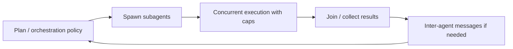
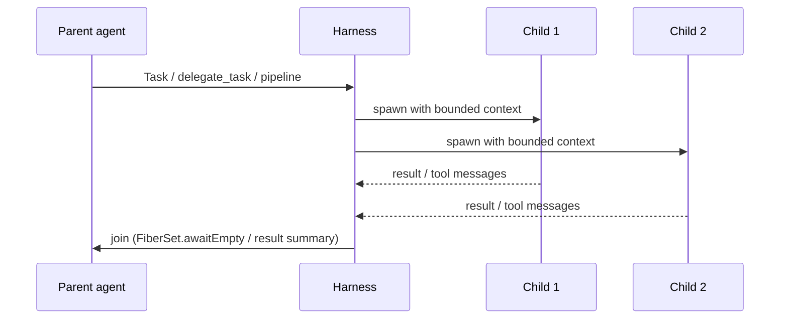

# Ch. 05 -- Coordination: orchestration, handoff, fan-out, messaging

**Prerequisites:** [Ch.01 Topology](01-topology.md) (single vs. multi-agent), [Ch.02 Loop](02-agent-loop.md) (one loop), [Ch.04 Memory & Context](04-memory-context.md) (compaction survival vs. handoff). | **Sources:** [`references/harnesses/orchestration.md`](../../references/harnesses/orchestration.md), [`references/harnesses/handoff-mechanism.md`](../../references/harnesses/handoff-mechanism.md), [`references/harnesses/fan-out.md`](../../references/harnesses/fan-out.md), [`references/harnesses/inter-agent-messaging.md`](../../references/harnesses/inter-agent-messaging.md), [`references/harnesses/multi-agent-coordination-design-space.md`](../../references/harnesses/multi-agent-coordination-design-space.md)
**Reading time:** ~30 min | **You will learn:** who holds the plan (orchestration) vs. how agents get launched (fan-out) vs. what crosses the spawn boundary (handoff) vs. how running agents talk (messaging) -- four separable questions with per-harness answers

> Why this chapter exists: Once a task needs more than one agent, four questions that are easy to blur become load-bearing -- who holds the overall plan, how a new agent gets spawned and what crosses that boundary, how many agents run concurrently and how that is throttled, and what wire format agents use to talk once running. Earlier chapters treated the single loop. This chapter is the multi-agent half of the book -- the place Cluster 2's four pages and the general coordination design space converge. Ch.03's turn caps and Ch.04's compaction survival reappear here as constraints a coordinator must respect.

## The idea in plain language

### One agent vs. many: what changes and what stays the same

A single agent is a single loop with a single context window -- one model, one transcript, one `while` from Ch.02. A multi-agent system is not "the same thing, but faster." It is a different architecture where a single large goal is split into sub-goals, each sub-goal gets its own agent (its own loop with its own context window), and the agents coordinate so their outputs compose into one answer instead of diverging.

Developers new to agents often imagine multi-agent as "run three agents in parallel and merge the diffs." That is the degenerated case that fails as soon as agents must depend on each other or share a repo. The real design space is four separable decisions that live at different layers, and each harness answers each decision differently even when the names sound the same. Meet each from zero:

Start with the smallest true multi-agent example. You ask a harness to research a codebase, write a plan, and then implement that plan in parallel across three files. The first question -- orchestration -- is: who holds that plan? In Claude Code's turn-by-turn model, the answer is no one durable; each turn's model decides the next subagent call from scratch against the transcript. In Claude Code's Dynamic workflows (the Workflow tool's `agent()`/`pipeline()`), the answer is a script-held plan the harness can resume in order after a crash. In Copilot CLI's `/fleet`, the answer is a named orchestrator agent. Those are structurally different planners, not different labels for the same planner.

The second question -- fan-out -- is: once the plan says "spawn three agents," how do they get launched and how many are allowed to run at once? Claude Code has three distinct fan-out layers (in-conversation parallel subagents with depth/session/concurrency caps, background `claude agents` sessions with no documented hard cap, and Workflow `pipeline()` with a 16-concurrent/1,000-total throttling policy). Copilot CLI traces a changelog from parallel tool execution behind a flag (2025-10-22, GA-mandatory in 2026-02-25) to configurable subagent depth/concurrency limits to `/fleet`'s conditional dependency-based parallelism. OpenCode's answer is `FiberSet` -- each `Task` tool call forks an Effect fiber and `FiberSet.awaitEmpty` joins them.

The third question -- handoff -- is: what crosses the spawn boundary? Claude Code subagents start with a fresh context and are resumed via `SendMessage` + agent ID, with forks vs. named subagents as distinct lifetime choices. Copilot CLI has custom-agent subagents plus `/delegate` to a cloud agent. OpenCode's answer is source-verified and precise: `session.create(parentID)` plus a durable `task_id` resume, with `deriveSubagentSessionPermission` governing what the child is allowed to do.

The fourth question -- messaging -- is: once agents are already running, what is the actual wire they use to talk? Claude Code has a `SendMessage` tool with `agent-ID`-vs-name addressing and a file-based mailbox at `~/.claude/teams/{team}/inboxes/{agent}.json` (with structured `shutdown_request`/`plan_approval_response` protocol messages). Copilot CLI has a one-directional `subagent.*` lifecycle event stream and `/fleet` todo-state coordination, with no confirmed peer-to-peer channel (flagged UNCONFIRMED-as-absent, not proven absent). OpenCode has no dedicated inter-agent message type at all -- a subagent's completion is an ordinary message row written into the parent session and observed through the same SSE bus every other event uses.

## How it actually works

### Orchestration -- who holds the plan

VERIFIED ([orchestration.md](../../references/harnesses/orchestration.md) Sections 1-6): the Hugging Face agents course's orchestrator/manager-agent concept grounds the question.

**Claude Code** has two models in one product. The default is **turn-by-turn**: subagents/skills/agent teams, with each turn's model deciding the next agent call against the transcript. The documented comparison table makes this explicit. Alongside it, the **Dynamic workflows / Workflow tool** (`agent()`/`pipeline()`) holds a **script-held plan** -- start-order resume semantics, documented size guidelines, `16-concurrent`/`1,000-total` agent caps, and `/deep-research` as a shipped example. **Copilot CLI**'s answer is `/fleet` with an explicitly named "orchestrator agent," plus the separate Copilot SDK's SQL-todo `todo_deps` Fleet-mode runtime (flagged as adjacent-surface background). **OpenCode**'s taxonomy is primary vs. subagent (Build/Plan/General/Explore/Scout) with `permission.task` glob allow/deny as schema-omission enforcement, not runtime refusal. **pi** has no built-in orchestrator/fleet primitive -- only an inert-by-default subagent example extension isolated at the OS-process level. **Hermes Agent** is the outlier with three coexisting layers: in-conversation `delegate_task` (self-nestable behind `role="orchestrator"`), a durable out-of-process Kanban board that survives the spawning conversation's own death, and a cross-machine `a2a_orchestrate` layer for coordinating outside the local process.

### Handoff -- what crosses the spawn boundary

VERIFIED ([handoff-mechanism.md](../../references/harnesses/handoff-mechanism.md) Sections 1-6): the compaction-vs-handoff distinction is load-bearing -- what survives compaction stays in [memory-management.md](../../references/harnesses/memory-management.md) Section 1.7; this page is strictly agent-to-agent transfer.

**Claude Code**: fresh-context subagents, resumed via `SendMessage` + agent ID, with forks (parent context inherited, single-use) vs. named subagents (addressable, resumeable), plus depth/session/concurrency limits. Agent teams add peer-to-peer mailbox messaging with plan-approval/shutdown protocols. **Copilot CLI**: custom-agent subagents discovered per a `docs.github.com` location, plus `/delegate` to a cloud agent and a VS Code-only `handoffs` field ruled out as out-of-scope. **OpenCode** (source-verified, 2026-07-30): `Task` tool (`session.create(parentID)`, `task_id` resume, `deriveSubagentSessionPermission`, with a `dev`-branch caveat). **pi** (2026-09-01): no native subagent handoff, but an example extension `handoff.ts` performs an LLM-generated, human-reviewed context handoff into a new session -- an explicit alternative to compaction. **Hermes Agent** (2026-09-01): `delegate_task` spawns an in-process child `AIAgent` object seeded only with the delegated goal/context (never the parent's history), with only the child's structured summary re-entering the parent while the full child transcript stays in its own session row. Hermes also uses the word "handoff" for a different, LLM-generated context-transfer-into-a-new-session mechanism -- flagged explicitly to avoid conflating the two.

### Fan-out -- launch mechanics and concurrency caps

VERIFIED ([fan-out.md](../../references/harnesses/fan-out.md) Sections 1-6): distinct from handoff (what crosses) and orchestration (who holds the plan).

**Claude Code**: three layers -- in-conversation "Run parallel research" subagents (concurrent/session/depth caps), `claude agents` background sessions (one-prompt-at-a-time, no documented hard cap), and Workflow `pipeline()` (runtime-throttled, 16-concurrent/1,000-total). **Copilot CLI** (changelog-traced): parallel tool execution's 2025-10-22 introduction and 2026-02-25 GA-mandatory removal of the opt-out; subagent depth/concurrency limits (introduced/configurable/changed); `/fleet` conditional parallelism; experimental multiple-concurrent-sessions. **OpenCode** (source-verified, `dev` branch): `FiberSet` concurrent dispatch (`packages/opencode/src/session/llm/native-runtime.ts`) -- each batched `Task` call forks an Effect fiber, `FiberSet.awaitEmpty` joins. **DeepSeek Harness**: `SubagentRuntime.start()`/`.startContinuable()` one-shot vs. continuable split, `inheritsParentContext` decoupling, no numeric cap. **pi** (2026-09-01): no built-in subagent mechanism -- a manually-symlinked example extension spawns a separate OS process per subagent. **Hermes Agent** delegates to its orchestration-role layer for fan-out policy.

### Inter-agent messaging -- the wire once agents are talking

VERIFIED ([inter-agent-messaging.md](../../references/harnesses/inter-agent-messaging.md) Sections 1-6): the wire format once agents are running.

**Claude Code**: `SendMessage` tool (agent-ID vs. name addressing, v2.1.199 collision guard), file-based mailbox at `~/.claude/teams/{team}/inboxes/{agent}.json` (v2.1.207 validation/eviction), structured `shutdown_request`/`plan_approval_response` messages, `TeammateIdle`/`TaskCreated`/`TaskCompleted` hooks (payload schema flagged as a docs gap). **Copilot CLI**: one-directional `subagent.*` lifecycle stream (envelope-level `agentId`) and `/fleet` status-report-into-shared-todo coordination; absence of a peer-to-peer channel flagged UNCONFIRMED-as-absent. **OpenCode**: source-verified finding of **no dedicated inter-agent message type** -- completion is an ordinary message row (`Info`/`Part` schema) written into the parent session and observed via the directory-scoped SSE bus (`packages/opencode/src/server/routes/...`). **pi**: no built-in messaging -- the subagent extension's child closes stdin at spawn, so no channel exists to a running subagent. **Hermes Agent** (2026-09-01): `delegate_task` result delivery via a background handle returned at spawn time, completion stored durably in `state.db` and republished as a synthetic message onto the parent's fresh-turn queue.

### The general coordination design space

VERIFIED ([multi-agent-coordination-design-space.md](../../references/harnesses/multi-agent-coordination-design-space.md), general-concepts page): surveys general multi-agent literature -- centralized/decentralized/layered/shared-message-pool topologies (arXiv:2402.01680, MetaGPT shared-message-pool arXiv:2308.00352), blackboard architectures (Hayes-Roth/Hearsay-II via arXiv:2510.01285), consensus/voting (arXiv:2501.06322, LLM-Blender), and market-based task allocation (Contract Net Protocol). Then places harnesses on that map: Claude Code's agent-team shared self-claimed task list as the book's clearest real blackboard instance (coexisting with its addressed mailbox -- evidence a system can hold more than one point on the spectrum), `/deep-research`'s claim-level voting as the clearest consensus instance (with Copilot CLI's `vote_memory` flagged as a naming false friend), and a consistent negative finding -- no harness implements genuine market-based/competitive-bidding allocation; capability-based direct dispatch replaces it everywhere.

## Edge cases and gotchas the wiki flagged

- **Four separable questions, not one "multi-agent" feature.** Who holds the plan (orchestration), how agents get launched (fan-out), what crosses the boundary (handoff), and how running agents talk (messaging) are independent. A harness can offer one without the others. Source: [multi-agent-coordination-design-space.md](../../references/harnesses/multi-agent-coordination-design-space.md) topology mapping + [agent-topology.md](../../references/harnesses/agent-topology.md) Section 3.
- **Fork vs. named subagent lifetime differs.** Claude Code forks inherit parent context as single-use copies; named subagents are addressable and resumeable via `SendMessage` + agent ID. Counting forks as "subagents that can be messaged later" mislabels the weaker lifetime. Source: [handoff-mechanism.md](../../references/harnesses/handoff-mechanism.md) Section 1.
- **Hermes Agent's word "handoff" names a different mechanism.** Its docs use handoff for an LLM-generated context-transfer-into-a-new-session, not for `delegate_task` parent-to-child spawning. Source: [handoff-mechanism.md](../../references/harnesses/handoff-mechanism.md) Section 5.
- **Copilot CLI has no confirmed peer-to-peer channel.** The `subagent.*` stream is one-directional lifecycle. Peer messaging absence is UNCONFIRMED-as-absent, not proven. Source: [inter-agent-messaging.md](../../references/harnesses/inter-agent-messaging.md) Section 2.
- **pi's subagent story is example-extension-only.** No built-in subagent mechanism, no built-in messaging -- the extension spawns a separate OS process and closes stdin. Source: [fan-out.md](../../references/harnesses/fan-out.md) Section 6, [inter-agent-messaging.md](../../references/harnesses/inter-agent-messaging.md) Section 4.

## Sources and grounding note

This chapter distills:

- `references/harnesses/orchestration.md` -- for turn-by-turn vs. script-held (`agent()`/`pipeline()`) vs. `/fleet` vs. primary/subagent taxonomy vs. three-layer Hermes.
- `references/harnesses/handoff-mechanism.md` -- for fresh-context vs. `session.create(parentID)` vs. `/delegate` vs. LLM-generated `handoff.ts` vs. in-process child object.
- `references/harnesses/fan-out.md` -- for three fan-out layers vs. changelog-traced Copilot CLI limits vs. `FiberSet` vs. `inheritsParentContext`.
- `references/harnesses/inter-agent-messaging.md` -- for `SendMessage` mailbox vs. `subagent.*` stream vs. SSE bus vs. `state.db` republish.
- `references/harnesses/multi-agent-coordination-design-space.md` -- for the general coordination patterns and where each harness lands on them (blackboard, consensus, no market-based allocation).

Tags preserved as VERIFIED (every config key, file path, tool name, and wire path stated above) vs. BEST CURRENT UNDERSTANDING, UNCONFIRMED (whether Copilot CLI peer messaging is absent; market-based allocation absence as negative finding) per those pages' own Sections and Sources. No claim here re-fetches a primary source.

---

Prev: [Ch.04 Memory & Context](04-memory-context.md) | Index: [index.md](../index.md) | Next: [Ch.06 Transport](06-transport.md) | Glossary: [orchestration](../glossary.md#orchestration) · [handoff](../glossary.md#handoff) · [fan-out](../glossary.md#fan-out) · [messaging](../glossary.md#messaging) · [multi-agent](../glossary.md#multi-agent)
