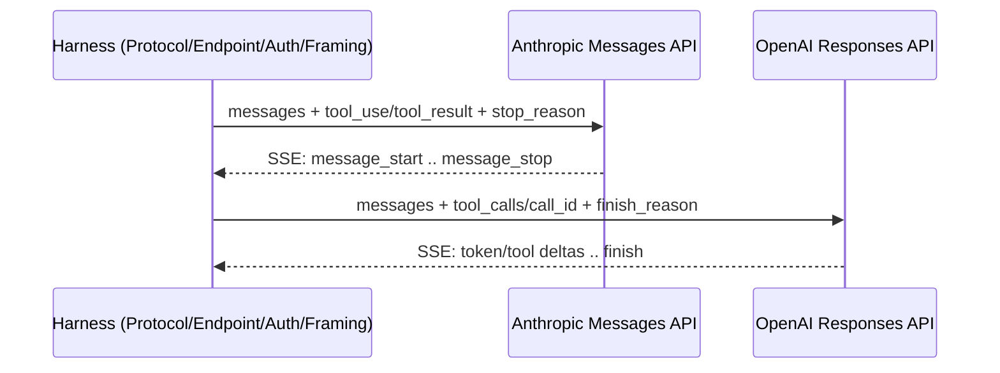
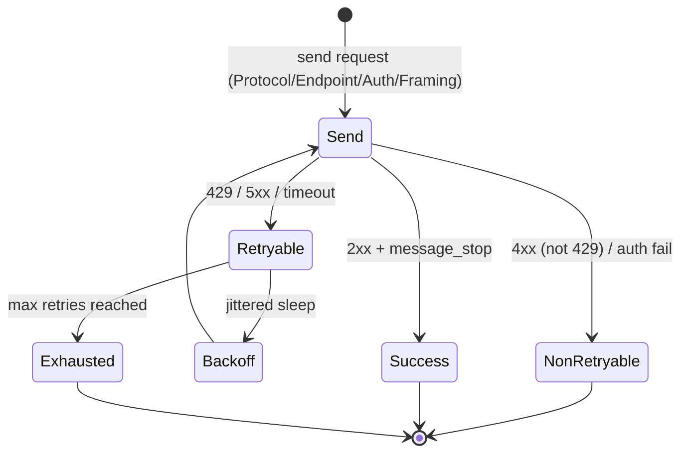

# Ch. 06 -- Transport and the LLM API contract

**Prerequisites:** [Ch.02 Loop](02-agent-loop.md) (stop-and-parse), [Ch.03 Loop Implementations](03-agent-loop-implementations.md) (turn budgeting). | **Sources:** [`references/harnesses/llm-api-contract.md`](../../references/harnesses/llm-api-contract.md), [`references/harnesses/streaming-and-incremental-rendering.md`](../../references/harnesses/streaming-and-incremental-rendering.md), [`references/harnesses/retries.md`](../../references/harnesses/retries.md), [`references/harnesses/model-routing-and-selection.md`](../../references/harnesses/model-routing-and-selection.md)
**Reading time:** ~28 min | **You will learn:** the wire-level layer every other cluster assumes -- how a single outbound model request is framed (Anthropic Messages vs. OpenAI Responses), how it streams back (SSE events, buffering, delta-coalescing), how failure on that single request is retried, and how the harness picks which model answers a given step

> Why this chapter exists: The loop needs a wire. Every turn is one outbound request and one inbound stream, and everything above -- memory, orchestration, tool execution -- assumes that wire behaves a certain way and recovers a certain way. This chapter makes that wire-level contract explicit before Ch.07's permission gates and Ch.08's tool surfaces add policy on top of it. The curriculum places Transport (Cluster 3) after Memory&Context and Coordination and before Config&Permissions for exactly that reason -- the lower layer must be taught before the policy layer above it.

## The idea in plain language

### What "transport" means from zero

If the agent loop is the recipe (Thought -> Action -> Observation) and orchestration is the kitchen that decides who cooks which dish, transport is the gas line and the plating window. It is the physical mechanism that carries "here is the whole conversation so far (system prompt, tool definitions, history including last Observation), and here are the tools you may call" as one outbound HTTPS request to a model provider, and then carries the provider's incremental response back, token by token, over Server-Sent Events, until the model signals "I am done with this turn." For a developer, that means every turn is one HTTP round-trip: request out, streamed chunks back, parsed into either tool calls or final text. The harness does not invent this contract. Providers publish it -- Anthropic's **Messages API** and OpenAI's **Responses API** are the two canonical shapes, each with its own field names for tool calls and stop reasons -- and the harness wraps one or both behind a `Protocol`/`Endpoint`/`Auth`/`Framing` decomposition (OpenCode names this explicitly: four axes that let the same loop target different providers without rewriting the loop) that lets the same session route the next turn to a different provider without changing the code above it.

Four separable questions live at this layer, taught here as four mechanisms that compose (smallest example first, full mechanism below).

Four separable questions live at this layer, taught here as four mechanisms that compose.

First, what is actually in the outbound request -- which fields name a tool call, which field names the stop reason, which event deltas carry arguments mid-stream -- and how that differs between Anthropic (`tool_use`/`tool_result` blocks, `stop_reason` enumeration, a specific `message_start` to `message_stop` SSE sequence) and OpenAI (`tool_calls`/`call_id`, `finish_reason`).

Second, what the client does once the bytes start arriving -- buffering, reassembly, and pacing discipline at the JSON-parsing level, distinct from mere network buffering. Claude Code's delta-coalescing history is the book's concrete performance-engineering example of why this matters.

Third, what happens when that single request fails -- not when context overflows mid-session and not when the loop runs out of budget, but when the one HTTP request itself is rate-limited, timed out, or gateway-failed. Retry policy lives here. Claude Code documents its retried-vs-not category list and three config surfaces; OpenCode source-verifies a two-layer architecture (a bounded, jittered transport retry wrapped by an effectively uncapped whole-turn retry); pi shows a third shape where provider-level retry and turn-level retry are exposed as separate knobs.

Fourth, which model answers that request at all. Model routing is a harness-side precedence stack -- not "which model family is best" in the abstract but "which config scope wins when three scopes each name a different model for the next step," and how Copilot CLI's two-system Auto router, Claude Code's four-tier session-model precedence, and OpenCode's `defaultModel()` startup resolution each answer it differently.

## How it actually works

### The LLM API contract -- two provider shapes and one unified harness decomposition

VERIFIED ([llm-api-contract.md](../../references/harnesses/llm-api-contract.md) Sections 1-3):

**Anthropic Messages API:** sends `tool_use` and receives `tool_result` blocks, with a named `stop_reason` enumeration and a fixed SSE event sequence `message_start` -> `content_block_start` -> `content_block_delta` (which carries in-progress tool-call argument deltas) -> `content_block_stop` -> `message_delta` -> `message_stop`. The closing `message_stop` carries the final usage/cost tally.

**OpenAI Responses API:** sends `tool_calls` with `call_id` correlation identifiers and receives `finish_reason` as the stop field -- a different envelope name for the same "why did this response end" concept.

**OpenCode's `Protocol`/`Endpoint`/`Auth`/`Framing` decomposition** (source-verified `packages/core/src/session/` and `packages/llm/`, `dev` branch): unifies both provider shapes behind one route abstraction -- `Protocol` selects the envelope, `Endpoint` selects the URL, `Auth` selects the credential header/query shape, `Framing` selects the event-parsing grammar. Both Anthropic and OpenAI semantics are expressible as different points on that same four-axis decomposition rather than as two completely separate clients.

For harnesses that ship no owned provider abstraction -- Copilot CLI is VERIFIED to route through GitHub's own proxy/billing layer rather than direct provider endpoints (flagged as AUTHORITY OVERREACH to avoid attributing provider docs directly) -- the contract is instead documented via the Copilot SDK's `agent-loop.md` description of "the CLI sends the full conversation history to the LLM" (cross-referenced from Ch.03, not repeated).

### Streaming and incremental rendering -- buffering, reassembly, pacing

VERIFIED ([streaming-and-incremental-rendering.md](../../references/harnesses/streaming-and-incremental-rendering.md) Sections 1-4):

The client/UI-side layer sits above the wire-level SSE contract. Three operations are named and distinguished explicitly: **buffering** (holding bytes until a parseable chunk is available), **reassembly** (reconstructing a JSON tool-call argument object from multiple `content_block_delta` events), and **pacing** (deciding how often to repaint the terminal). They are not synonyms -- the page explicitly argues that "reassembly at the JSON-parsing level" is a different discipline from "buffering and pacing," and that no harness in the book attempts to parse a genuinely incomplete tool-call JSON object mid-stream as an optimization; reassembly waits for a `content_block_stop` before the tool is dispatched.

Claude Code's **delta-coalescing history** is the book's worked performance example -- a changelog-traced evolution where coalescing adjacent deltas before rendering measurably improved throughput, showing why the three-operation split matters operationally. OpenCode's source-verified path is `packages/opencode/src/session/render/` plus the `session/runner/llm.ts` stream-consumption site that the loop pages cite as a verification pointer.

### Retries -- failure recovery on a single outbound request

VERIFIED ([retries.md](../../references/harnesses/retries.md) Sections 1-6): distinct from context-overflow handling ([context-compression.md](../../references/harnesses/context-compression.md)) and cache-prefix reuse ([caching.md](../../references/harnesses/caching.md)).

**Claude Code** (VERIFIED, `code.claude.com/docs/en/agent-sdk` and `CHANGELOG.md`): documents a retried-vs-not category list and three config surfaces -- `CLAUDE_CODE_MAX_RETRIES` (default 10), `CLAUDE_CODE_RETRY_WATCHDOG` / `API_TIMEOUT_MS`, plus the changelog-traced fixes: v2.1.198/2.1.199 UX and subscription-429 changes, v2.1.98 Retry-After-as-minimum, v2.1.76 compaction circuit breaker, v2.1.110/111 fallback-retry-cap revert, and `fallbackModel` as a per-request alternative model when the primary is unavailable.

**OpenCode** (VERIFIED, `packages/llm/src/route/executor.ts` + `packages/opencode/src/session/retry.ts`, `dev` branch): source-verified two-layer architecture -- a bounded, jittered transport retry (`executor.ts`) wrapped by an effectively uncapped whole-turn retry (`SessionRetry.policy` via `Effect.retry` in `session/processor.ts`), with a live-fetched GitHub Issue (#17648) corroborating the unbounded behaviour from real usage.

**Copilot CLI** (VERIFIED, `changelog.md` per-subsystem hardenings 0.0.389 through 1.0.66): since its docs page turned out to be generic platform guidance (not CLI-specific), the only reliable source is the changelog's per-subsystem entries, plus `continueOnAutoMode` as a loop-level continuation flag.

**pi** (VERIFIED, `packages/coding-agent/docs/settings.md` + `packages/agent/src/types.ts`): two-layer, with a third sibling package `pi-agent-core` carrying its own durable crash-recoverable retry state machine; the nearest documented numeric cap `retry.provider.maxRetries` defaults to `0`, and the settings doc warns that raising it "can make SDK/provider retries handle out-of-usage-limit errors before Pi sees them" -- a masking risk, not an enforcement.

**Hermes Agent** (VERIFIED, `agent/retry_utils.py` + `error_classifier.py` + `conversation_loop.py`): single `while retry_count < max_retries` loop threading rate-limit-aware provider fallback, one-shot per-provider OAuth refresh, credential-pool rotation, and format-recovery one-shots (image shrink, thinking-signature strip, grammar fallback) ahead of jittered backoff.

### Model routing and selection -- which model answers the step

VERIFIED ([model-routing-and-selection.md](../../references/harnesses/model-routing-and-selection.md) Sections 1-6):

**Claude Code**: four-tier session-model precedence stack (documented highest to lowest), with a config key or flag at each tier. **Copilot CLI**: two-system Auto routing -- `model: auto` or `Auto` selects between models per step, documented as a two-system router. **OpenCode**: `defaultModel()` startup-resolution algorithm (source-verified). **pi** and **Hermes Agent**: each ships a provider-discovery layer (pi via `pi-ai` automatic model discovery and `model` routing; Hermes Agent via `provider_adapter` per-session selection with multi-provider support as a first-class source-level concern).

The craft question routing answers is not "which model is best" but "when three scopes each name a different model for the next step, which one wins" -- a precedence problem, not a benchmark problem. The book keeps those two questions strictly separate.

## Edge cases and gotchas the wiki flagged

- **SSE event naming differs per provider; do not unify them by aliasing.** Anthropic's `stop_reason` vs. OpenAI's `finish_reason`, `tool_use`/`tool_result` vs. `tool_calls`/`call_id`, and the `message_start`..`message_stop` sequence with `content_block_delta` carrying argument deltas are provider-specific semantics. The harness decomposition names that difference explicitly (`Protocol`/`Endpoint`/`Auth`/`Framing`) rather than papering over it. Source: [llm-api-contract.md](../../references/harnesses/llm-api-contract.md) Sections 1-3.
- **Reassembly waits for `content_block_stop` -- no speculative incomplete-JSON parse.** The streaming page explicitly distinguishes buffering/pacing from JSON-parsing-level reassembly and states no harness in the book attempts the speculative parse as an optimization. Source: [streaming-and-incremental-rendering.md](../../references/harnesses/streaming-and-incremental-rendering.md) Sections 2-3.
- **Retry categories are documented as retried vs. not, not as "always retry on failure."** Claude Code's category list is explicit about which failures are retryable (rate limits, gateway, timeout) and which are not (auth, schema). OpenCode's two-layer split (bounded transport vs. uncapped whole-turn) means the two layers have different retry budgets for the same underlying failure. Source: [retries.md](../../references/harnesses/retries.md) Sections 1, 4, 6.
- **Transport retry and context-overflow handling are different layers.** Retrying a single outbound HTTP request is not the same as handling a full context window. The three pages [retries.md](../../references/harnesses/retries.md), [context-compression.md](../../references/harnesses/context-compression.md), and [caching.md](../../references/harnesses/caching.md) each scope their subject explicitly; conflating them produces a debugging anti-pattern where a retry-category fix is attempted for an overflow problem. Source: [retries.md](../../references/harnesses/retries.md) scope note.
- **Model routing is precedence, not preference.** When multiple scopes or flags each name a model, the winner is determined by a documented precedence chain (highest to lowest), with one documented exception per harness where a setting merges rather than overrides. Do not treat the harness's routing as a recommendation about which model family to choose. Source: [model-routing-and-selection.md](../../references/harnesses/model-routing-and-selection.md) Sections 1-4.

## Sources and grounding note

This chapter distills:

- `references/harnesses/llm-api-contract.md` -- for Anthropic Messages vs. OpenAI Responses envelope, SSE event sequence, and OpenCode's `Protocol`/`Endpoint`/`Auth`/`Framing` decomposition. Tags: VERIFIED (every field name, event name, and decomposition label stated above) vs. BEST CURRENT UNDERSTANDING (Copilot CLI's proxy/billing layer, flagged as AUTHORITY OVERREACH boundary).
- `references/harnesses/streaming-and-incremental-rendering.md` -- for buffering/reassembly/pacing, `content_block_stop` gating, and delta-coalescing. Tags: VERIFIED (every named mechanism) per that page's own fetch.
- `references/harnesses/retries.md` Sections 1-6 -- for per-harness retry surfaces, two-layer architecture, and changelog-traced fixes. Tags: VERIFIED (every config key, cap, and fix version) vs. BEST CURRENT UNDERSTANDING (absence of a second harness's speculative-parse optimization as a negative finding, scoped honestly).
- `references/harnesses/model-routing-and-selection.md` -- for four-tier precedence, two-system Auto routing, and startup resolution. Tags: VERIFIED per that page's own fetch.

No gap is noted for the transport topics in scope. If a provider adds a new event type or a new `stop_reason` variant, that addition belongs in [`references/harnesses/llm-api-contract.md`](../../references/harnesses/llm-api-contract.md) first -- ask `airchon-author` to research it there.

---

Prev: [Ch.05 Coordination](05-coordination.md) | Index: [index.md](../index.md) | Next: [Ch.07 Config & Permissions](07-config-permissions.md) | Glossary: [llm-api-contract](../glossary.md#llm-api-contract) · [streaming](../glossary.md#streaming) · [retries](../glossary.md#retries) · [model-routing](../glossary.md#model-routing) · [sse](../glossary.md#sse)
