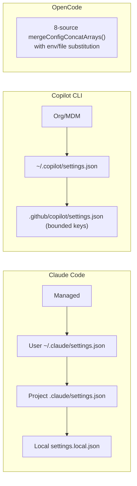

# Ch. 07 -- Config, permissions, hooks, and auth

**Prerequisites:** [Ch.06 Transport](06-transport.md) -- the wire you are now gating and attributing; [Ch.04 Memory](04-memory-context.md) -- `AGENTS.md`/`CLAUDE.md` discovery overlaps with config-file discovery. | **Sources:** [`references/harnesses/configuration.md`](../../references/harnesses/configuration.md), [`references/harnesses/permissions-and-sandboxing.md`](../../references/harnesses/permissions-and-sandboxing.md), [`references/harnesses/hooks-lifecycle-extensibility.md`](../../references/harnesses/hooks-lifecycle-extensibility.md), [`references/harnesses/auth-and-usage-accounting.md`](../../references/harnesses/auth-and-usage-accounting.md)
**Reading time:** ~32 min | **You will learn:** the settings-file hierarchies and merge-order exceptions; the OS-sandbox-and-allowlist two-layer permission architecture; the ~30-event hook catalogue and exit-code-2-only-blocks rule; the three genuinely distinct budget-enforcement layers and auth precedence stacks

> Why this chapter exists: Transport made the wire concrete. Policy is what you put in front of it. Every harness needs four policy subsystems that look unrelated until you see them together: a general settings-file system (where config lives and which scope wins), a permission architecture that turns those rules into runtime gates, a hook system that lets user-owned code sit inside the control flow itself, and an identity-and-spend layer that says who pays for the last ten turns. The curriculum's Cluster 4 groups them deliberately -- Config & Permissions -- because they are the general harness-engine that sits above any single tool's allowlist and below any single orchestration plan.

## The idea in plain language

### Four policy subsystems, not one "settings" file

When a developer says "settings," they often mean one file. An agentic harness needs four policy subsystems that look unrelated until you see them together, each answering a different developer question:

- **Configuration:** where a harness's opinions become text on disk, and which file wins when two files disagree (the settings-file hierarchy). E.g., a team rule in `.claude/settings.json` vs. your personal rule in `~/.claude/settings.json` -- which one applies?
- **Permissions:** where those opinions become enforced gates at runtime, per tool call (allow/ask/deny + sandbox layers). A rule that says `Bash: allow` is not the same as whether the OS actually sandboxes that bash.
- **Hooks:** where you inject your own code *inside* the harness's own control flow (before a tool runs, after it runs, before compaction), with a single blocking rule (exit 2) worth memorizing.
- **Auth and usage accounting:** where the harness answers "who is this (which credential), and how much have they spent already (per turn, per workflow, per org)?" Budget enforcement lives at three genuinely distinct layers.

Meet each through its smallest example below; the mechanism section names the exact keys, paths, and event names.

It helps to meet each subsystem through its smallest example.

Configuration: you install Claude Code and create two settings files -- a user-level `~/.claude/settings.json` and a project-level `.claude/settings.json`. Both name the same key. Which one wins? Claude Code answers with a four-scope hierarchy (Managed, User, Project, Local), documented as highest to lowest, with one named exception where permission rules merge rather than override. OpenCode answers with an eight-source `mergeConfigConcatArrays()` order, with `{env:}`/`{file:}` substitution as a value syntax. Copilot CLI answers with a `~/.copilot` directory layout and a 6/7-link precedence chain plus a bounded `.github/copilot/settings.json` repo-key list. pi answers with two scopes (global/project) and a documented per-key nested-object merge plus a `defaultTools` wholesale-replace exception. The question is the same everywhere. The hierarchy is harness-specific.

Permissions: a permission *rule* (`allow`/`ask`/`deny` with glob patterns, per-agent overrides in OpenCode, per-tool "permission-required" columns in Claude Code's tools-reference table) is not the same as a permission *gate*. Claude Code documents two independent sandbox layers for its Bash tool -- filesystem and network -- each with its own escape hatch, plus the changelog-traced `Sandboxed Bash` two-layer design that the rule schema sits above. OpenCode, source-verified, ships no OS-level sandbox at all -- a real absence that must be stated rather than assumed present.

Hooks: the place user code sits directly inside the loop, not beside it. Claude Code documents an ~30-event catalogue (`PreToolUse`, `PostToolUse`, `PreCompact`, `Stop`, `SessionStart`, `TeammateIdle`, ...) with a single blocking rule: only exit code 2 (or `{"decision":"block"}`) blocks the action it is attached to; other non-zero exits are surfaced but do not block. OpenCode has a two-surface plugin model -- a generic `event` bus vs. a typed `Hooks` interface of functions.

Auth and usage accounting: API-key/OAuth precedence, token/cost tracking surfaces (`/usage`, `/context`), and three distinct budget-enforcement layers the wiki keeps scrupulously separate -- an SDK-level per-turn cap (Claude Code `max_turns`/`max_budget_usd` already met in Ch.03), a workflow-level cap, and an org-level cap -- each operating at a different layer, with spend accounting that crosses subagent boundaries on some harnesses and not others.

## How it actually works

### Configuration -- the settings-file hierarchies and their merge-order exceptions

VERIFIED ([configuration.md](../../references/harnesses/configuration.md) Sections 1-6):

**Claude Code** (VERIFIED, `code.claude.com/docs/en/configuration` + `settings.json` docs + `CHANGELOG.md`): four scopes in documented precedence (Managed `settings.json` / User `~/.claude/settings.json` / Project `.claude/settings.json` / Local `.claude/settings.local.json`), with the documented permission-rules-merge exception (permission rules merge across scopes rather than the narrowest scope overriding the broadest), a flagged docs-internal inconsistency on CLI-flags-vs-Managed ordering, and a changelog-traced migration (`~/.claude.json` to `settings.json`) plus malformed-file hardening.

**Copilot CLI** (VERIFIED, `docs.github.com` + `changelog.md`): `~/.copilot` directory layout (`settings.json` at user scope, `.github/copilot/settings.json` at repo scope with a bounded key list), a 6/7-link precedence chain (personal > path-specific > repository-wide > agent instructions > organization), MDM-managed settings, and the changelog-traced structural history (`config.json` to `settings.json` renames at both repo and user scope) plus its own read of Claude Code's `.claude/settings.json` as a cross-harness interop measure.

**OpenCode** (VERIFIED, `packages/opencode/src/config/config.ts`, `dev` branch): source-verified `mergeConfigConcatArrays()` over **eight sources** in a fixed merge order, with `{env:ENV_VAR}` and `{file:path}` value substitution and a granular `permission` schema (`allow`/`ask`/`deny`, glob patterns, per-agent overrides, plus a source-only `OPENCODE_PERMISSION` env-override not found in docs).

**pi** (VERIFIED, `github.com/earendil-works/pi` docs + settings inventory): two-scope (global/project) model with no managed/MDM tier at all, a stated key-by-key nested-object merge with a worked `compaction.reserveTokens` example and a named `defaultTools` wholesale-replace exception, plus a full settings-key-cluster and CLI-flag/env-var inventory.

**Hermes Agent** (VERIFIED, `hermes_cli/config.py` + `config.yaml`): single `~/.hermes/` root splitting non-secret settings (`config.yaml`) from credentials (`.env`), a routing-aware `hermes config set` that writes each key to the right file, and a `hermes config migrate` step that discovers per-skill settings.

**DeepSeek Harness** (VERIFIED, Cordis plugin catalog docs): configuration is the Cordis plugin enable/disable tree plus the `persona:` string under `dsh-system-prompt`; no `.json` settings-file hierarchy in the style of the other harnesses.

### Permissions and sandboxing -- rule schemas vs. enforcement architectures

VERIFIED ([permissions-and-sandboxing.md](../../references/harnesses/permissions-and-sandboxing.md) Sections 1-6): the enforcement architecture underneath the permission-rule schema.

**Claude Code** (VERIFIED, `code.claude.com/docs/en/permissions` + `CHANGELOG.md`): documents its rule schema (`allow`/`ask`/`deny`, glob tool patterns, per-tool permission-required columns in `tools-reference`, the `Edit` tool's three-gate check, Bash timeout/backgrounding) and separately its OS-level **sandboxed Bash two-layer** design (filesystem layer and network layer, each documented as independent, with named escape hatches). **OpenCode** (VERIFIED, source: `packages/opencode/src/session/permission.ts` + docs, `dev` branch): ships **no OS-level sandbox at all** -- a direct, source-verified finding that the wiki states plainly (not an absence inferred from docs silence), with a permission model that is schema-omission enforcement rather than runtime refusal (`allow`/`ask`/`deny` + `doom_loop` guard). **Copilot CLI** (VERIFIED, `docs.github.com` permission-kind vocabulary: shell/write/read/url/memory/MCP-SERVER vs. changelog-confirmed functional tools), **pi** (VERIFIED, `permissions.md` docs + per-directory allowlist), **Hermes Agent** (VERIFIED, seven sandboxed terminal execution backends plus `permissions.md` policy file), and **DeepSeek Harness** (VERIFIED, Cordis capability separation) are covered on the wiki page alongside the two above; their enforcement surfaces differ in whether the gate lives in-process, in an OS sandbox, or at a job/credential boundary (the `safe-outputs` pattern Ch.12's `deterministic-orchestration` page names as structurally stronger than any in-process gate).

### Hooks and lifecycle extensibility -- sitting inside the loop, not beside it

VERIFIED ([hooks-lifecycle-extensibility.md](../../references/harnesses/hooks-lifecycle-extensibility.md) Sections 1-6):

**Claude Code** (VERIFIED, `code.claude.com/docs/en/hooks`): documents an **~30-event catalogue** including `PreToolUse`, `PostToolUse`, `PreCompact`, `Stop`, `SessionStart`, `SessionEnd`, `UserPromptSubmit`, `TeammateIdle`, `TaskCreated`, `TaskCompleted`, plus an explicitly named rule the wiki carries forward with precision: **only exit code 2 (or `{"decision":"block"}`) blocks the action it is attached to**; other non-zero exit codes surface output but do not block. The catalogue is demonstrably `code.claude.com`-rendered but `gh api raw` HTML was re-fetched this session to check the lifecycle location claim directly (cross-referenced from [handoff-mechanism.md](../../references/harnesses/handoff-mechanism.md) Section 2's content-hash drift re-check, 2026-09-03).

**OpenCode** (VERIFIED, `packages/opencode/src/plugin/` + `hooks/` `dev` branch): offers a two-surface plugin model -- a generic `event` bus (every event as an untyped envelope) vs. a typed `Hooks` interface (one function per hook, typed payload).

**Hermes Agent** (VERIFIED, `agent/hooks.py` + `hooks/` directory): the most extensible of the six, with a plugin-populated `hermes doctor` registry surfaced in [observability-and-self-diagnostics.md](../../references/harnesses/observability-and-self-diagnostics.md) rather than repeated here.

**pi** (VERIFIED, `packages/agent/docs/harness.md` 200KB spec): the `AgentHarness` spec names `prepareNextTurn` as the hook that wires compaction into the loop (already met in Ch.03).

### Auth and usage accounting -- three distinct budget-enforcement layers, not one

VERIFIED ([auth-and-usage-accounting.md](../../references/harnesses/auth-and-usage-accounting.md) Sections 1-6):

Three genuinely distinct enforcement layers are documented at three different depths, and this book keeps them separate rather than blending them into "how budgets work":

1. SDK/loop-level -- per-turn caps (`max_turns`, `max_budget_usd`, `maxAiCredits`, `max_steps`, `IterationBudget`) already covered in Ch.03, here named as the first layer.
2. Workflow-level -- the harness's own spend metering against the current run's accumulated usage, surfaced as `/usage`, `/context`, `/status`, and as OTel `gen_ai.conversation.compacted` spans.
3. Org-level -- admin-managed caps (Managed `settings.json` policy scope in Claude Code; org/MDM settings in Copilot CLI; `~/.hermes/` credential separation in Hermes Agent) that constrain a tool invocation regardless of which subagent issued it.

Auth precedence is equally harness-specific. VERIFIED (same pages): Claude Code documents its full authentication precedence stack (highest to lowest) with env-var and OAuth sources; Copilot CLI documents its own GitHub-identity-linked auth flow plus `GH_TOKEN`/`GITHUB_TOKEN` handling; OpenCode documents its `mergeConfigConcatArrays()` as the same order that resolves auth config; pi documents no managed tier and thus no MDM-mediated auth override. The page's consistent finding is that where subagent spend counts differs -- Ch.03 already noted "covers subagents: their spend counts toward the total" for Claude Code's `max_budget_usd`; the same qualifier applies (or not) at each of the three enforcement layers per harness and is flagged per harness rather than assumed uniform.

## Edge cases and gotchas the wiki flagged

- **Permission rules merge vs. settings override.** In Claude Code, most settings obey narrowest-scope-wins, but permission rules merge across scopes -- an exception the docs name explicitly. Treating all config keys as narrowest-wins will misread which permission rules are active. Source: [configuration.md](../../references/harnesses/configuration.md) Section 1.
- **OpenCode has no OS-level sandbox.** Its permission model is schema-level (whether a tool is listed as allowed in the merged config) rather than an OS enforcement layer. Do not cite OpenCode's docs as evidence for filesystem/network sandboxing. Source: [permissions-and-sandboxing.md](../../references/harnesses/permissions-and-sandboxing.md) Section 3.
- **Only exit code 2 blocks (Claude Code).** Other non-zero hook exits surface output but do not block. Source: [hooks-lifecycle-extensibility.md](../../references/harnesses/hooks-lifecycle-extensibility.md) Section 1.
- **Three budget-enforcement layers are distinct, not synonyms.** SDK-level, workflow-level, and org-level budgets are enforced at different depths with different surfaces (`max_turns` vs. `PreCompact` vs. Managed policy) and different subagent-accounting rules. Source: [auth-and-usage-accounting.md](../../references/harnesses/auth-and-usage-accounting.md) Sections 1, 4.
- **`safe-outputs` (GitHub Agentic Workflows, covered via [deterministic-orchestration.md](../../references/harnesses/deterministic-orchestration.md)) is a deliberately stronger boundary than any in-process permission gate mentioned here -- a job/credential-boundary separation for the deterministic/probabilistic seam. Do not equate them. Source: [configuration.md](../../references/harnesses/configuration.md) pi vs. DeepSeek discussion + [deterministic-orchestration.md](../../references/harnesses/deterministic-orchestration.md) Sections 14-16.

## Sources and grounding note

This chapter distills:

- `references/harnesses/configuration.md` -- for four-scope vs. `~/.copilot` vs. eight-source vs. two-scope vs. `~/.hermes/` vs. Cordis configuration hierarchies and documented exceptions (`claudeMdExcludes`, `claudeMd` inlining, `mergeConfigConcatArrays`, `defaultTools` wholesale-replace). Tags: VERIFIED (every scope path, file name, and exception stated above) per that page's own dated fetches.
- `references/harnesses/permissions-and-sandboxing.md` -- for rule schemas vs. two-layer OS sandbox vs. absence in OpenCode. Tags: VERIFIED per that page's own direct reads.
- `references/harnesses/hooks-lifecycle-extensibility.md` -- for ~30-event catalogue, exit-code-2-only-blocks rule, and `event` bus vs. typed `Hooks`. Tags: VERIFIED per that page's own docs/source reads (with one content-hash re-fetch noted in page's own Sources section).
- `references/harnesses/auth-and-usage-accounting.md` -- for API-key/OAuth precedence and the three budget-enforcement layers. Tags: VERIFIED (every precedence order and enforcement mechanism named) per that page's own fetch.

No gap is noted for these four subjects. If a harness adds a new hook event, a new permission kind, or a new settings-file scope, that addition belongs in the corresponding `references/harnesses/*.md` page first -- ask `airchon-author` to research it there.

---

Prev: [Ch.06 Transport](06-transport.md) | Index: [index.md](../index.md) | Next: [Ch.08 Skills & Tools](08-skills-tools.md) | Glossary: [configuration](../glossary.md#configuration) · [permissions](../glossary.md#permissions) · [sandbox](../glossary.md#sandbox) · [hooks](../glossary.md#hooks) · [auth](../glossary.md#auth)
