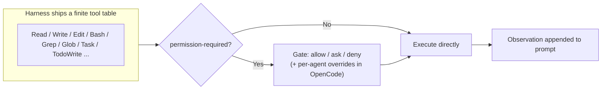

# Ch. 08 -- Skills and tools

**Prerequisites:** [Ch.06 Transport](06-transport.md) (tool-calling envelope), [Ch.07 Config & Permissions](07-config-permissions.md) (permission schema that governs tools), [Ch.03 Loop Implementations](03-agent-loop-implementations.md) (turn budgeting the tool surface is metered against). | **Sources:** [`references/harnesses/built-in-tools.md`](../../references/harnesses/built-in-tools.md), [`references/harnesses/built-in-skills.md`](../../references/harnesses/built-in-skills.md), [`references/harnesses/mcp-integration.md`](../../references/harnesses/mcp-integration.md), [`references/harnesses/tool-schema-and-interface-design.md`](../../references/harnesses/tool-schema-and-interface-design.md), [`references/harnesses/system-prompt-design-as-craft.md`](../../references/harnesses/system-prompt-design-as-craft.md)
**Reading time:** ~30 min | **You will learn:** the full tool inventory per harness and the permission-required column; the three-gate Edit check; what ships as a skill by default vs. user-authored content; discovery/registration/transport for MCP servers; how tool schemas are authored and how system prompts are crafted to make those tools reliably callable

> Why this chapter exists: Tools are what the loop can act on; skills are how a harness packages instruction bundles the loop can load on demand; MCP is how a harness discovers tools it did not ship. The curriculum's Cluster 5 groups them together because they are the loop's effector surface -- one layer above the transport and config substrate, one layer below the RAG/SDLC/model concerns that compose these primitives into longer-running workflows. Read Ch.06's API contract to know the envelope, Ch.07's permission schema to know the gate, and then this chapter to know what is inside the gate and how new entries get added at runtime.

## The idea in plain language

### What a "tool," a "skill," and an "MCP server" each are -- from zero

A harness's **tool** is an executable operation exposed directly to the model -- a function the model may call by emitting the right JSON. `Read("src/auth.ts")` reads a file and returns its contents as an Observation; `Bash("npm test")` runs a shell command; `Edit("src/auth.ts", ...)` patches a file; `Grep("login", "src")` searches. Each is typed, documented, and permission-gated individually. The list is finite and documented per harness (Claude Code publishes a table with a `permission-required` column; Copilot CLI publishes permission-kind labels), and that finite list is the loop's entire effector surface -- the model cannot do anything not on that list without an extension.

A **skill** is a markdown bundle -- a file or directory with frontmatter that the harness discovers by filename, loads *on demand* when the model decides it is relevant (not on every turn), and uses to teach the model *when and how* to use its tools for a specific task. Think "code-review skill" as a playbook: it names the sequence (find changed files, read tests, run linter, post comments) and the tool calls that realize each step. Skills are the mechanism Ch.04's "instruction budget" called the invoke-only lazy tier: they keep the eager prompt small by withholding until needed, then inject as one coherent bundle.

An **MCP server** is a remote extension that *registers new tools* into that finite list at runtime, without the harness having shipped them. An MCP server speaks the Model Context Protocol over stdio/SSE, advertises tools like `mcp_sentry_get_issue`, and those tools appear to the model alongside `Read` and `Bash` as if native. Each of these three is easy to conflate because they all ultimately produce a tool call, but they sit at different layers of extension -- native capability vs. bundled instruction vs. runtime-discovered tool -- and this chapter keeps them apart the way Ch.04 kept eager, compressed, and cached apart.

Start with the simplest distinction. A tool is an executable operation exposed directly to the model (Read a file, Run a bash command, Write an edit, Search). Every harness documents a finite inventory -- Claude Code's `tools-reference` table (a docs-verified list with a permission-required column, including the `TodoWrite` to `Task*` migration), Copilot CLI's permission-kind vocabulary (shell/write/read/url/memory/MCP-SERVER) with its changelog-confirmed functional tools, OpenCode's documented `allow`/`ask`/`deny` model with a `doom_loop` guard. The Edit tool, because it modifies persistent state a human must read, is documented with more guardrails than any other -- the book names a three-gate check as its concrete mechanism. That emphasis is deliberate: tools are not just a list; they vary in how much trust the harness extends before running them.

A skill is a package of markdown instructions, discovered by filename, loaded on demand rather than on every turn, and held to a design standard the book treats as a craft -- not just "which prompt works" but how to write it so the model reliably calls the right tools with the right arguments. Claude Code ships a bundled set present in every session (`/doctor`, `/code-review`, `/batch`, `/debug`, `/loop`, `/claude-api`, `/verify`, `/run`, `/run-skill-generator`, `/dataviz`, `/design-sync`, `/fewer-permission-prompts`) with `disableBundledSkills`/`skillOverrides`; Copilot CLI ships its own Forge-generated draft-skill pipeline reviewed via `/chronicle skills review`; OpenCode has no confirmed bundled skills, purely a generic extension point; pi claims `agentskills.io` conformance with cross-harness directory reuse; Hermes Agent exposes a tool-callable three-level progressive disclosure (`skills_list()` -> `skill_view()` -> `skill_manage`).

MCP is the runtime extension half -- discovery, registration, transport, and tool-calling for servers the harness did not ship. Config formats and transports differ per harness, but the negotiation vocabulary (tool naming with `sanitize(server)_sanitize(tool)`, pagination, capability negotiation for `roots`/`sampling`/`elicitation`, well-known remote-default servers) is best read where the book documents it: OpenCode's source-verified `roots`-enabled / `sampling`/`elicitation`-commented-out gap (with a since-closed-as-completed GitHub issue behind the comment) and its `.well-known/opencode` org-wide remote-default servers vs. Hermes Agent's `mcp_<server>_<tool>`-namespaced registry with per-server filtering and live re-discovery vs. pi's stated design choice of no built-in MCP client at all.

Two design-space pages sit behind this inventory and are kept distinct from it. [tool-schema-and-interface-design.md](../../references/harnesses/tool-schema-and-interface-design.md) treats schema authoring as a JSON Schema discipline grounded in Anthropic's own `define-tools`/`strict-tool-use` guidance (good vs. poor description example, `strict: true` grammar-constrained sampling closing type-coercion/missing-field failures, schema-attached `input_examples` vs. system-prompt few-shot examples). [system-prompt-design-as-craft.md](../../references/harnesses/system-prompt-design-as-craft.md) treats the skill/markdown content that sits in the prompt as a craft discipline grounded in Anthropic's tool-use and prompting best-practices docs and its `building-effective-agents`/`effective-context-engineering-for-ai-agents` posts (tool-calling-style phrasing, aggressive-language dial-back, parallel-tool-call prompting, canonical vs. exhaustive examples, per-turn prompt assembly in OpenCode vs. once-per-session with compaction-rebuilds in Hermes Agent).

## How it actually works

### Built-in tools -- the inventory, the permission column, and the Edit tool's three gates

VERIFIED ([built-in-tools.md](../../references/harnesses/built-in-tools.md) Sections 1-6): the full inventory, not a sampled list.

**Claude Code** (VERIFIED, `code.claude.com/docs/en/tools-reference` + `CHANGELOG.md`): documents its tool table with a `permission-required` column -- the sourced answer to "which tools require a permission check and which do not" -- plus three naming artefacts worth internalizing. The `TodoWrite` to `Task*` migration and its later model-conditional withholding on Opus 4.8/Sonnet 5/Fable 5/Mythos 5+; the three-way `Task`-prefix naming overload against `TaskOutput`/`TaskStop` and `CronCreate`/`Cron*` (cross-referenced from session-persistence Section 1.2); and the sourced-withheld-claim discipline itself (whether a tool exists in a given session can be conditional on the model family). The Edit tool's three-gate check (name as a concrete three-gate mechanism, not just "edit checks something"), Bash timeout/backgrounding, and the `permission-required` semantics ("permission-required" means the tool routes through the permission classifier and can be asked/allowed/denied, not that it is always denied without approval) are the mechanisms this section foregrounds.

**Copilot CLI** (VERIFIED, `docs.github.com` permission-kind vocabulary + `changelog.md` functional tools): uses `shell`/`write`/`read`/`url`/`memory`/`MCP-SERVER` as permission-kind labels, vs. the changelog-confirmed functional surface (`shell`/`view`/`web-fetch`/`search`/`task` tools, `store_memory`/`vote_memory`, model-conditional `apply_patch` for Codex models, the curated-by-default GitHub MCP server).

**OpenCode** (VERIFIED, `opencode.ai/docs/tools/` + source): documented tool list with `allow`/`ask`/`deny` and the `doom_loop` guard (a loop-detection mechanism distinct from `max_steps`, which guards turn-counting).

**pi** (VERIFIED, `github.com/earendil-works/pi` `packages/coding-agent` tool list, 2026-09-01): exactly eight built-in tools -- `grep`/`find` shell out to real `ripgrep`/`fd` binaries -- resolving the `pi-ai`-vs-`pi-coding-agent` naming question (both real, correctly scoped names for different packages in the same monorepo, met in Ch.03).

**Hermes Agent** (VERIFIED, `tools/registry.py` `get_definitions()` read directly): an order of magnitude larger, dynamically-gated registry -- roughly 86 tools by the reference page, a union across every platform/integration rather than a fixed per-session table -- with a three-tier three-bridge-tool deferred-loading mechanism.

### Built-in skills -- what ships, what is opt-in, what is absent

VERIFIED ([built-in-skills.md](../../references/harnesses/built-in-skills.md) Sections 1-6):

The inventory-vs-authoring distinction is load-bearing. A built-in skill is something the product ships as a skill in the sense Ch.04 introduced -- a markdown bundle with frontmatter, discovered by directory, loaded on demand -- but authored by the vendor and present by default, not synthesized by an agent or authored by the user for this task. That makes it a different product-surface question from "can the harness load a user-authored skill."

**Claude Code** (VERIFIED, `code.claude.com/docs/en/skills`): ships a bundled set in every session (`/doctor`, `/code-review`, `/batch`, `/debug`, `/loop`, `/claude-api`, `/verify`, `/run`, `/run-skill-generator`, `/dataviz`, `/design-sync`, `/fewer-permission-prompts`) with `disableBundledSkills`/`skillOverrides` controls, vs. the separately opt-in `anthropics/skills` plugin-marketplace repo (source-available docx/pdf/pptx/xlsx, `skill-creator` meta-tool). **Copilot CLI** (VERIFIED, `changelog.md` v1.0.17): ships the `configure-copilot` subagent (not a skill) and its Forge-generated draft-skill pipeline via `/chronicle skills review` -- the only harness-authors-its-own-skills pattern the book found. **OpenCode** (VERIFIED, negative finding): no confirmed bundled skills -- purely a generic `.claude/skills`-compatible extension point. **pi** (VERIFIED): `agentskills.io` conformance with cross-harness directory reuse; **Hermes Agent** (VERIFIED): the same conformance plus tool-callable progressive disclosure (`skills_list()` -> `skill_view()` -> autonomous `skill_manage`).

### MCP integration -- discovery, registration, transport, tool calling

VERIFIED ([mcp-integration.md](../../references/harnesses/mcp-integration.md) Sections 1-6):

**Claude Code** (VERIFIED, `code.claude.com/docs/en/mcp`): config-precedence resolution for MCP server registration, discovery walk, and a tool-search flow for how servers appear as callable tools. **Copilot CLI** (VERIFIED, same docs + `changelog.md`): similar discovery/registration surface with GitHub-proxied transport variants. **OpenCode** (VERIFIED, `packages/opencode/src/mcp/` source, `dev` branch): the source-verified naming/pagination/capability layer -- `sanitize(server)_sanitize(tool)` joining, `roots` enabled, `sampling`/`elicitation` commented out despite each citing a since-closed-as-completed GitHub issue (flagged as an unresolved discrepancy), and `.well-known/opencode` org-wide remote-default servers. **pi** (VERIFIED, docs + source): **no built-in MCP client at all**, a stated design choice, with `pi-mcp-adapter` as the named third-party gap-filler. **Hermes Agent** (VERIFIED, `agent/mcp/` source): `mcp_<server>_<tool>` namespacing with per-server include/exclude filtering and live runtime tool-list re-discovery.

### Tool schemas and system-prompt craft -- two design-space companions

These are general-concepts pages that do not inventory one harness's tools but ground how tools and the prose around them are authored at all, held to a higher standard than "what a harness ships today" -- the book teaches them here so every later primitive in the SDLC chapter (Ch.10) inherits the same authoring discipline.

VERIFIED ([tool-schema-and-interface-design.md](../../references/harnesses/tool-schema-and-interface-design.md) Sections 1-6): JSON Schema authoring grounded in Anthropic's `define-tools`/`strict-tool-use` docs (the good-vs-poor description worked example, `strict: true` grammar-constrained sampling closing type-coercion/missing-field failures, schema-attached `input_examples` distinguished from system-prompt few-shot examples), naming/description conventions (service-prefixed namespacing, explicit negative-boundary descriptions that steer the model toward the right tool), the largest built-in surface's uneven consolidation via an `action` parameter (Hermes Agent), the three-tier deferred-loading mechanism with three bridge tools, a fifth nine-strategy fuzzy-match cascade plus `_sanitize_tool_error()`, and GitHub Copilot CLI's opaque-runtime/no-published-`input_schema` closed-source treatment.

VERIFIED ([system-prompt-design-as-craft.md](../../references/harnesses/system-prompt-design-as-craft.md) Sections 1-7): system-prompt/agent-instruction design as a craft between the loop and memory/instruction-budget -- tool-calling-style phrasing, aggressive-language dial-back, parallel-tool-call prompting, few-shot tool-call examples vs. prose constraints as complementary, and critically a per-turn-assembled prompt whose assembly logic is itself source-verified and not a static file. OpenCode's `SystemPrompt.Service` (`environment()`/`skills()`/`mcp()` + `prompt.ts` `Effect.all([...])` fixed-order concatenation, with per-agent override keying as the most granular of the three harnesses) vs. pi's `buildSystemPrompt()` (genuinely code-assembled, unlike OpenCode's static `anthropic.txt` base tier) vs. Hermes Agent's `agent/system_prompt.py`/`agent/prompt_builder.py` (three cache-priority tiers `stable`/`context`/`volatile`, rebuilt at most once per session and only on compaction to keep prompt caches warm, plus a documented fix for the date-in-prompt cache-busting problem).

## Edge cases and gotchas the wiki flagged

- **Tool inventory is model-conditional on some harnesses.** Claude Code's `TodoWrite` withholding on Opus 4.8/Sonnet 5+ means the tool table is not a fixed set independent of the model family. Do not cite a static list without noting conditional withholding where the wiki flags it. Source: [built-in-tools.md](../../references/harnesses/built-in-tools.md) Section 1.
- **Permission-required is a routing column, not a verdict.** It means the tool consults the permission policy; it does not mean the tool is denied. The verdict (`allow`/`ask`/`deny`) is separate per tool, per agent, per pattern. Source: [built-in-tools.md](../../references/harnesses/built-in-tools.md) Section 1, [permissions-and-sandboxing.md](../../references/harnesses/permissions-and-sandboxing.md).
- **Bundled skills vs. plugin-marketplace skills vs. user-authored skills are three registration scopes.** A harness can ship bundled skills, expose a marketplace repo as opt-in, and still load user-authored skills from disk -- and the `disableBundledSkills`/`skillOverrides` controls manage only the first scope. Source: [built-in-skills.md](../../references/harnesses/built-in-skills.md) Sections 1-3.
- **OpenCode has no bundled skills and pi has no built-in MCP client -- both are real absences, not search failures.** Treat negative findings the wiki source-verifies (the `opencode-supermemory` plugin and `pi-mcp-adapter` as third-party gap-fillers) as the authoritative answer, not as a gap to fill with another harness's mechanism. Source: [built-in-skills.md](../../references/harnesses/built-in-skills.md) Section 3, [mcp-integration.md](../../references/harnesses/mcp-integration.md) Section 5.
- **System prompts are assembled program, not static files.** OpenCode's `SystemPrompt.Service` and pi's `buildSystemPrompt()` show per-turn assembly over a fixed concatenation order; Hermes Agent's three-tier rebuild at most once per session plus a cache-stability fix proves the assembly itself is a cache-sensitive design choice. Source: [system-prompt-design-as-craft.md](../../references/harnesses/system-prompt-design-as-craft.md) Sections 2, 6.

## Sources and grounding note

This chapter distills:

- `references/harnesses/built-in-tools.md` Sections 1-6 -- for the full per-harness inventory, permission-required semantics, `TodoWrite`->`Task*` migration, three-way naming overload, Edit three-gate check, and per-harness permission models. Tags: VERIFIED (every tool name, permission kind, and guard) per that page's own docs/CHANGELOG reads.
- `references/harnesses/built-in-skills.md` Sections 1-6 -- for bundled-skill inventories, `disableBundledSkills`/`skillOverrides`, Forge draft-skill pipeline, no-confirmed-bundled-skills finding, `agentskills.io` conformance, and progressive disclosure. Tags: VERIFIED per that page's own docs/source reads, with UNCONFIRMED-as-absent flagged honestly for the OpenCode gap.
- `references/harnesses/mcp-integration.md` Sections 1-6 -- for config formats, transports, `sanitize(server)_sanitize(tool)`, pagination/capability negotiation (with flagged unresolved discrepancy), `.well-known` defaults, and per-server filtering. Tags: VERIFIED per that page's own docs/source reads.
- `references/harnesses/tool-schema-and-interface-design.md` and `references/harnesses/system-prompt-design-as-craft.md` -- for schema-authoring discipline and prompt-craft discipline as general design-space companions. Tags: VERIFIED (every named guideline, example, and assembly mechanism) vs. BEST CURRENT UNDERSTANDING (historical lineage of each guideline) per those pages' own fetches.

No gap is noted for the skills/tools topics in scope beyond the honestly-flagged negative findings already named. If a harness adds a new tool or a new MCP transport, that addition belongs in the corresponding `references/harnesses/*.md` page first -- ask `airchon-author` to research it there.

---

Prev: [Ch.07 Config & Permissions](07-config-permissions.md) | Index: [index.md](../index.md) | Next: [Ch.09 RAG](09-rag.md) | Glossary: [built-in-tools](../glossary.md#built-in-tools) · [built-in-skills](../glossary.md#built-in-skills) · [mcp](../glossary.md#mcp) · [tool-schema](../glossary.md#tool-schema) · [system-prompt](../glossary.md#system-prompt)
