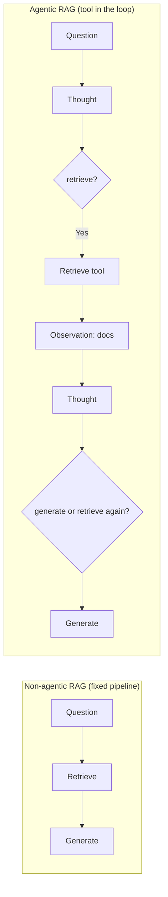
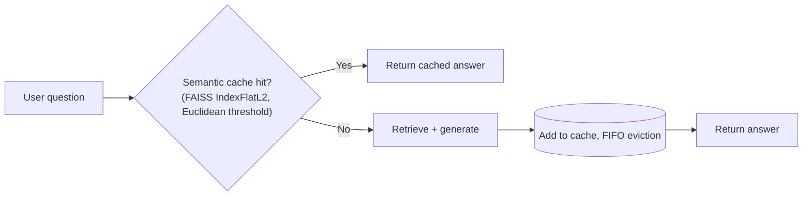

# Ch. 09 -- Retrieval-Augmented Generation

**Prerequisites:** [Ch.04 Memory & Context](04-memory-context.md) (context-window limits), [Ch.08 Skills & Tools](08-skills-tools.md) (tools vs. skills vs. MCP as extension points). | **Sources:** [`references/rag/*`](../../references/rag/index.md) -- `foundations.md`, `basic-rag-pipeline.md`, `advanced-rag-techniques.md`, `vector-store-integrations.md`, `semantic-caching.md`, `structured-generation-for-rag.md`, `rag-evaluation.md`, `agentic-rag-with-llamaindex.md`, `heterogeneous-data-sources.md`, `cache-augmented-generation.md` (all sourced from HuggingFace Cookbook notebooks + Lewis et al. 2020 + ancillary arXiv papers), [`references/harnesses/context-retrieval-and-agentic-search.md`](../../references/harnesses/context-retrieval-and-agentic-search.md) for the harness-specific counterpoint
**Reading time:** ~35 min | **You will learn:** Lewis et al.'s parametric/non-parametric split and the HuggingFace agentic-RAG reframing; the five-stage baseline pipeline; advanced techniques (character-vs-token chunking, ColBERTv2 reranking, Rewrite-Retrieve-Read and HyDE, PaCMAP, vector-store swaps); cache-augmented generation as a retrieval-free alternative; agentic RAG with LlamaIndex; evaluation via synthetic datasets, critique agents, LLM-as-judge, and RAGAS

> Why this chapter exists: The curriculum groups RAG (Cluster 6) as the first practitioner-mechanics cluster after the five core harness clusters -- the place where a real retrieve-then-generate pipeline is built, tuned, and evaluated at the same parameter granularity already demanded of memory, orchestration, and transport. It is deliberately distinct from the Archon-tier retrieval question in [context-retrieval-and-agentic-search.md](../../references/harnesses/context-retrieval-and-agentic-search.md) -- whether a harness should retrieve at all and how it does code discovery without embeddings -- which this chapter cross-references rather than repeats. The transport and skills chapters you have just read are the natural neighbours: retrieval is another tool the loop may call, and the question "is retrieval a fixed pipeline stage or one callable tool among several" is the exact generalization this chapter serves.

## The idea in plain language

### What a language model cannot do alone -- and why retrieval fixes it

A language model is good at composing fluent answers from what it learned during training -- the cutoff date of its dataset. It is not good, on its own, at three things a developer immediately needs: **citing where a fact came from** (provenance), **updating when a fact changes after training** (freshness), and **answering precisely about a private corpus it never saw** (your repo, your docs, your internal tickets). Try asking a base model "how do you combine multiple adapters in our adapter registry at `src/adapters/registry.ts`?" without retrieval: it will hallucinate a plausible-sounding answer because that file never appeared in its training data. Give it the five most relevant retrieved chunks from that registry and ask again -- now it can quote the file, point at a line, and change its answer when the file changes, because the retrieved chunks, not the weights, carry the knowledge.

**Retrieval-Augmented Generation (RAG) is the name for adding two steps around the model: load an external corpus, retrieve the few documents most relevant to the question, and only then generate the answer conditioned on the retrieved context.** The model still writes the final sentence. The new parts are what it gets to read before it writes. Conceptually, split the model's memory into two kinds: **parametric memory** (the weights -- what it learned during training, fixed) and **non-parametric memory** (the index -- what it can look up at query time, mutable, citable). RAG is the decision to make important knowledge non-parametric instead of parametric, so the answer can carry a citation and can change when the index changes without retraining.

### Smallest pipeline vs. agentic reframing

The simplest RAG shape -- the baseline Ch.09's first notebook teaches -- is a fixed five-stage chain you can trace file by file: **Load** the corpus (`GitHubIssuesLoader` reading GitHub issues), **Split** each document into chunks (`RecursiveCharacterTextSplitter`), **Embed** each chunk into a vector, **Store and Retrieve** (put vectors in FAISS, return top-k most similar to the question's embedding), **Generate** (prompt the model with the retrieved chunks + the question). That pipeline runs once per question, in that order, every time.

The HuggingFace Agents Course reframes that split operationally: in **agentic RAG**, retrieval is not a fixed stage the pipeline always runs -- it is *one callable tool among several* the agent loop (Ch.02) decides to invoke or not. The model may read the question and decide retrieval is unnecessary, or it may retrieve, see an insufficient result, retrieve again with a reformulated query, and only then generate. The retrieval tool returns documents as Observations; the next Thought decides whether another retrieval is needed. That reframing is where RAG leaves the textbook pipeline and joins the harness work of this book.

### A primer on the pieces the rest of the chapter assumes you understand

- **Embedding:** turning text into a high-dimensional vector where semantically similar texts lie near each other, so "cosine similarity" becomes a proxy for "answers the same question."
- **Chunking:** cutting a long document into smaller pieces so each embedding represents a coherent, retrievable unit. A 10,000-line file as one embedding would drown the relevant paragraph; a sentence per embedding would fragment context. Chunk size is the tradeoff.
- **Vector store (FAISS, Milvus, ...):** the database that holds embeddings and answers "nearest-k to this query vector" efficiently.
- **Reranking (ColBERTv2/RAGatouille):** a second, more expensive pass that re-scores the top-k candidates by having the query and document jointly attend to each other (a cross-encoder), trading latency for precision over raw cosine.
- **Evaluation:** how you know whether the retrieved set and the generated answer were jointly *faithful* to the retrieved context and *relevant* to the question, not merely fluent -- the RAGAS four metrics and critique-agent LLM-as-judge families.

Meet the vocabulary here first; meet the mechanism and its edge cases (character-vs-token trap, HyDE vs. Rewrite-Retrieve-Read, semantic-cache placement, CAG as the retrieval-free alternative when the KB fits in context) in "How it actually works" with running examples.

Lewis et al. (2020, VERIFIED via `foundations.md`'s fetch of arXiv:2005.11401) gave this the name that stuck: augment parametric memory (weights) with non-parametric memory (retrieved documents). Two abstract failure modes motivated the split -- no provenance and stale knowledge -- and each still names a concrete quality problem a RAG pipeline must solve even when its components have changed since the paper: can the answer point at the document that supports it, and would the answer change if the document changed.

The HuggingFace Agents Course (Unit 3, VERIFIED via the same page) reframes the same idea at one level of abstraction higher: retrieval is not a fixed pipeline stage every generation must pass through. In agentic RAG, retrieval is *one callable tool among several* the agent loop decides to invoke or not. That reframing is where RAG leaves the textbook pipeline and joins the harness work of this book -- the loop decides when to retrieve, what to retrieve, and whether to retrieve again after seeing a first result, rather than a static loader/splitter/embedder/retriever chain running once before generation begins.

## How it actually works

### Foundations -- parametric vs. non-parametric, RAG-Sequence vs. RAG-Token, and the agentic reframing

VERIFIED ([foundations.md](../../references/rag/foundations.md), sourced from Lewis et al. 2020 + HuggingFace Agents Course Unit 3):

Lewis et al. name two problems that compound a language model's limited ability to "access and precisely manipulate knowledge" -- no evidence to cite and a fixed training snapshot that ages -- and offer non-parametric memory as the fix for both. The paper introduces two sequence-level variants -- **RAG-Sequence** (retrieve once per prompt, generate the whole continuation conditioned on one retrieved set) and **RAG-Token** (retrieve per token, re-ranking as generation proceeds) -- a distinction the Cookbook notebooks that follow realize in different retrieval-generator coupling choices.

The Agents Course reframes that split operationally: an agentic RAG system treats the retriever as a tool the agent may call zero, one, or several times in a run, interleaved with reasoning, rather than as a fixed stage the pipeline always runs. The retrieval tool returns documents as Observations (in the Ch.02 sense), the next Thought decides whether another retrieval is needed, and the generator is simply the model's next turn after the relevant context has been assembled -- the same loop Ch.02 describes, now with retrieval as one of the callable Actions.

VERIFIED (same page): parametric memory is the model's own weights; non-parametric memory is the external index. The synthesis "RAG consistently outperforms fine-tuning for knowledge injection" (Ovadia et al. 2023, cited via `cache-augmented-generation.md`) is held as BEST CURRENT UNDERSTANDING where cross-page synthesis goes beyond a single notebook, flagged honestly.

### The basic pipeline -- LangChain + Zephyr + FAISS over GitHub issues

VERIFIED ([basic-rag-pipeline.md](../../references/rag/basic-rag-pipeline.md), sourced from the Cookbook `rag_zephyr_langchain` notebook): the baseline shape every later module varies -- `GitHubIssuesLoader` -> `RecursiveCharacterTextSplitter` -> embed -> store in FAISS -> retrieve top-k -> prompt with retrieved context -> generate with Zephyr. The worked motivating failure is "how do you combine multiple adapters?" asked with no retrieved context (the base model hallucinates) vs. with retrieved context (the adapter-combination pattern is present in the corpus and the answer cites it). The page is explicit that this is the introductory notebook's choice of loader/embedding/vector-store -- a small, focused corpus of GitHub issues, not a production-scale index -- so later pages can swap each stage independently and name what changed.

### Advanced techniques -- the character-vs-token trap, reranking, query reformulation, and visualization

VERIFIED ([advanced-rag-techniques.md](../../references/rag/advanced-rag-techniques.md), sourced from the `advanced_rag` notebook + two arXiv papers on query reformulation):

**The chunking trap.** `RecursiveCharacterTextSplitter` with a character-based `chunk_size` silently disagrees with a tokenizer's actual token count. A character-sized chunk that happens to contain dense code or unicode can overflow an embedding model's real token budget. The documented fix is a token-aware splitter (the page's specific class name depends on the notebook version) that counts the way the embedding model will count. VERIFIED (same page): this matters operationally because an overflowed chunk embeds incorrectly or is truncated before embedding, so the retrieved result is a mangled version of the source.

**Embedding-space visualization (PaCMAP).** The notebook projects embeddings into a human-inspectable 2D layout with PaCMAP, showing cluster structure and nearest-neighbour distances that a scalar relevance score collapses. The visualization is diagnostic, not a ranking step.

**ColBERTv2 cross-encoder reranking via RAGatouille.** The notebook adds a second pass after retrieval: the top-k retrieved candidates are re-scored by a cross-encoder that jointly attends to query and document (richer than dense cosine), with RAGatouille as the recipe. The re-ranked top-1 is measurably more precise on the notebook's examples than the dense-only top-1.

**Pre-retrieval query transformation: Rewrite-Retrieve-Read and HyDE.** VERIFIED (same page, sourced from two arXiv papers): **Rewrite-Retrieve-Read** (Ma et al. 2023) rewrites the query before retrieval via an LLM -- "generate a better question and retrieve against that." **HyDE** / Hypothetical Document Embeddings (Gao et al. 2022) generates a hypothetical answer, *embeds the hypothetical answer instead of the query*, and retrieves against the corpus -- the encoder's dense bottleneck filters out the hypothetical's false details while preserving the query-neighbourhood structure. The two differ in what the LLM generates before retrieval (a better question vs. a hypothetical answer) and in what is embedded afterwards (the rewritten question vs. the hypothetical document).

### Vector-store swaps -- the same shape over three production stores

VERIFIED ([vector-store-integrations.md](../../references/rag/vector-store-integrations.md), sourced from three Cookbook notebooks): three notebooks that hold the retrieve-then-generate shape constant while swapping the retriever half onto **Milvus**, **Elasticsearch**, and **MongoDB Atlas** respectively. Each pairs its production store with a named embedding model and a documented retrieval-call shape that remains structurally identical to the FAISS baseline (query string in, top-k chunks out). The page names one difference per store -- which `connect`/`index`/`search` vocabulary each store's client exposes -- but the broader point is a harness lesson: where innovation actually lands is in the retrieval path for a repo-scale corpus, not re-deriving the prompt or generator.

### Semantic caching -- before retrieval, not before generation

VERIFIED ([semantic-caching.md](../../references/rag/semantic-caching.md), sourced from the `semantic_cache_chroma_vector_database` notebook):

A RAG system has two repeatable expensive steps -- retrieval and generation -- but the notebook places the cache **between the user and retrieval**, not between the user and the LLM. The cache key is the embedding of the *question*, stored in FAISS `IndexFlatL2` and matched by Euclidean distance against a configured threshold; two differently-worded queries with the same intent match the same cached entry. Eviction is FIFO by the notebook's default, and threshold tuning is explicit -- a distance that is too permissive conflates distinct intents, too strict never hits.

### Structured generation for RAG -- from prompting to logit-biasing

VERIFIED ([structured-generation-for-rag.md](../../references/rag/structured-generation-for-rag.md), sourced from the `structured_generation` notebook):

The provenance problem named back in `foundations.md` -- an answer with no citation -- is solved concretely as source-snippet highlighting: the generation step is modified to output a structured answer object that names which retrieved chunk(s) the answer draws from. The notebook shows a naive JSON-prompting approach (ask the model to produce JSON via instructions) and where it breaks (missing fields, type coercion, parse failures), then the fix: **Outlines**' logit-biasing constrained-decoding mechanism that masks the token distribution so the model's next token can only produce values consistent with a Pydantic-schema grammar. The same schema attached as `input_examples` on the tool definition (met in [tool-schema-and-interface-design.md](../../references/harnesses/tool-schema-and-interface-design.md)) reappears here as the generation-side enforcement.

### RAG evaluation -- critique agents, LLM-as-judge, and RAGAS

VERIFIED ([rag-evaluation.md](../../references/rag/rag-evaluation.md), sourced from the `rag_evaluation` notebook + RAGAS paper/docs):

The `rag_evaluation` notebook builds a **synthetic QA pipeline** -- generate question-answer pairs from the knowledge base itself -- then filters them through three **critique agents** (groundedness / relevance / standalone-ness), each as an LLM binary classifier over the `(question, retrieved context, answer)` triple. Pairs that fail any critique are dropped; surviving pairs are compared by an LLM-as-judge (GPT-4-style) scoring rubric that the notebook names explicitly (Prometheus-style). Alongside that notebook, a **RAGAS** (Shahul Es et al., arXiv:2309.15217) section adds four reference-free metrics that evaluate RAG quality without ground-truth answers: **Faithfulness** (are all claims in the response entailed by retrieved context), **Context Precision** (does the retriever rank relevant chunks above irrelevant ones), **Context Recall** (does the retrieved set cover the ground-truth context), and **Response Relevancy** (is the answer aligned with the question). The page states the two evaluation families are complementary: critique+judge measures answer correctness against synthetic truth, RAGAS measures groundedness directly against retrieved context.

### Cache-Augmented Generation -- the retrieval-free alternative

VERIFIED ([cache-augmented-generation.md](../../references/rag/cache-augmented-generation.md), sourced from Ovadia et al. 2023 + Anthropic prompt-caching docs, flagged as BEST CURRENT UNDERSTANDING synthesis):

**CAG** loads the *entire* knowledge base into the context window and caches the prefix rather than retrieving. When the KB fits in context and prompt caching makes re-reading that prefix affordable per query (the page names 0.1x read cost and 5-min/1-hour TTLs as the enabling mechanism), retrieval can be skipped entirely. The single characteristic that determines whether CAG is architecturally viable is KB size vs. context window -- if the KB exceeds the window, CAG is not an option and retrieval is mandatory. The tradeoff stated in the page is performance vs. retrieval-engineering cost: RAG consistently outperforms fine-tuning for knowledge injection, but retrieval itself is the engineering surface where quality actually varies at scale.

### Agentic RAG with LlamaIndex and heterogeneous data sources

VERIFIED ([agentic-rag-with-llamaindex.md](../../references/rag/agentic-rag-with-llamaindex.md) + [heterogeneous-data-sources.md](../../references/rag/heterogeneous-data-sources.md)):

**LlamaIndex** (sourced from the `rag_llamaindex_librarian` notebook) re-expresses the same five-stage shape as a three-phase vocabulary -- Loading -> Indexing -> Querying -- and the page's notable implementation choice is a fully local Ollama + Llama 2 + `BAAI/bge-base-en-v1.5` stack chosen specifically to avoid an OpenAI-by-default dependency the notebook calls an "OpenAI-by-default trap." The general-purpose retrieval plane remains dense retrieval over embeddings.

**Heterogeneous sources** stretches that plane in two directions. The `rag_with_unstructured_data` notebook replaces the chunk-and-embed unit with Unstructured's **partition-then-chunk** pipeline for mixed formats (PDF, PPTX, EPUB, HTML) in one corpus. The `rag_with_sql_reranker` notebook skips the usual vector index entirely -- it uses **Jina Reranker v2** scoring whole SQL table schemas directly, with no vector index at all, as its retrieval mechanism.

## Edge cases and gotchas the wiki flagged

- **Harness-agnostic RAG is not harness-internal code discovery.** None of Claude Code, Copilot CLI, or OpenCode ships embeddings-based retrieval as its primary or default code-discovery strategy; all three converge on agentic `Grep`/`Glob`/`Read`-style iterative search instead ([context-retrieval-and-agentic-search.md](../../references/harnesses/context-retrieval-and-agentic-search.md), VERIFIED there). Do not cite this chapter's `feature-extraction` / `sentence-similarity` embedding vocabulary as evidence that any of those three harnesses does RAG over source code internally -- cite the harness page, which states the opposite, with a named staleness reason (index staleness) and a brought-your-own-RAG-via-MCP extension seam for code.
- **A character-based `chunk_size` silently disagrees with a tokenizer's token count.** A chunk that looks within-budget in characters can overflow the embedding model's real token budget and embed incorrectly. Source: [advanced-rag-techniques.md](../../references/rag/advanced-rag-techniques.md).
- **HyDE embeds a hypothetical answer, not the query.** Rewrite-Retrieve-Read rewrites the question and embeds the rewritten question; HyDE generates a hypothetical answer and embeds that hypothetical. The encoder's dense bottleneck is what filters out HyDE's false details. Source: [advanced-rag-techniques.md](../../references/rag/advanced-rag-techniques.md) Section 6 (VERIFIED from two arXiv papers, not from the base Cookbook notebook).
- **Semantic cache sits before retrieval, not before generation.** Two expensive steps (retrieval, generation) are cacheable, but the notebook's placement -- question-embedding-to-question-embedding Euclidean match in FAISS `IndexFlatL2` -- captures both savings at once; placing it before generation only would miss the retrieval cost. Source: [semantic-caching.md](../../references/rag/semantic-caching.md).
- **CAG is viable only when the KB fits in the context window.** If the KB exceeds the window, retrieval is mandatory regardless of caching economics. Source: [cache-augmented-generation.md](../../references/rag/cache-augmented-generation.md).

## Sources and grounding note

This chapter distills:

- `references/rag/foundations.md` (Lewis et al. 2020 + HuggingFace Agents Course Unit 3) -- for parametric/non-parametric, RAG-Sequence/Token, and the agentic reframing.
- `references/rag/basic-rag-pipeline.md` (`rag_zephyr_langchain` notebook) -- for `GitHubIssuesLoader` -> `RecursiveCharacterTextSplitter` -> embed -> FAISS -> retrieve -> prompt -> generate.
- `references/rag/advanced-rag-techniques.md` (`advanced_rag` notebook + two query-reformulation papers) -- for the character-vs-token trap, PaCMAP, RAGatouille/ColBERTv2, and Rewrite-Retrieve-Read / HyDE.
- `references/rag/vector-store-integrations.md` (three notebooks) -- for Milvus/Elasticsearch/MongoDB Atlas swaps.
- `references/rag/semantic-caching.md` (`semantic_cache_chroma_vector_database` notebook) -- for placement, `IndexFlatL2`, FIFO, Euclidean threshold.
- `references/rag/structured-generation-for-rag.md` (`structured_generation` notebook) -- for source highlighting and Outlines logit-biasing.
- `references/rag/rag-evaluation.md` (`rag_evaluation` notebook + RAGAS paper/docs) -- for synthetic QA generation, critique agents, LLM-as-judge, and RAGAS four metrics.
- `references/rag/agentic-rag-with-llamaindex.md` (`rag_llamaindex_librarian` notebook) -- for Loading/Indexing/Querying and the fully local stack.
- `references/rag/heterogeneous-data-sources.md` (`rag_with_unstructured_data`, `rag_with_sql_reranker`) -- for partition-then-chunk and Jina Reranker v2 over SQL schemas.
- `references/rag/cache-augmented-generation.md` -- for CAG vs. RAG tradeoff and prompt-caching enabling mechanism.
- `references/harnesses/context-retrieval-and-agentic-search.md` -- for the harness-specific counterpoint (agentic search vs. embeddings, `dynamicRetrieval` scoped to skill/MCP instruction text).

Tags preserved as VERIFIED (every loader/splitter/store/class/metric name stated above) vs. BEST CURRENT UNDERSTANDING (Ovadia et al. synthesis that RAG outperforms fine-tuning; CAG "skip retrieval" framing) per those pages' own Sources sections. When the Cookbook notebook is the source, this chapter cites the notebook via the wiki page that verified it -- it does not claim to have fetched the notebook directly.

If a harness adds a verified RAG-over-code mechanism, that addition belongs in [`references/harnesses/context-retrieval-and-agentic-search.md`](../../references/harnesses/context-retrieval-and-agentic-search.md) first -- ask `airchon-author` to research it there. If a new HuggingFace Cookbook notebook appears, that addition belongs in [`references/rag/*`](../../references/rag/index.md) first.

---

Prev: [Ch.08 Skills & Tools](08-skills-tools.md) | Index: [index.md](../index.md) | Next: [Ch.10 Agentic SDLC](10-sdlc.md) | Glossary: [rag](../glossary.md#rag) · [parametric-memory](../glossary.md#parametric-memory) · [colbert](../glossary.md#colbert) · [hyde](../glossary.md#hyde) · [ragas](../glossary.md#ragas) · [cag](../glossary.md#cag)
