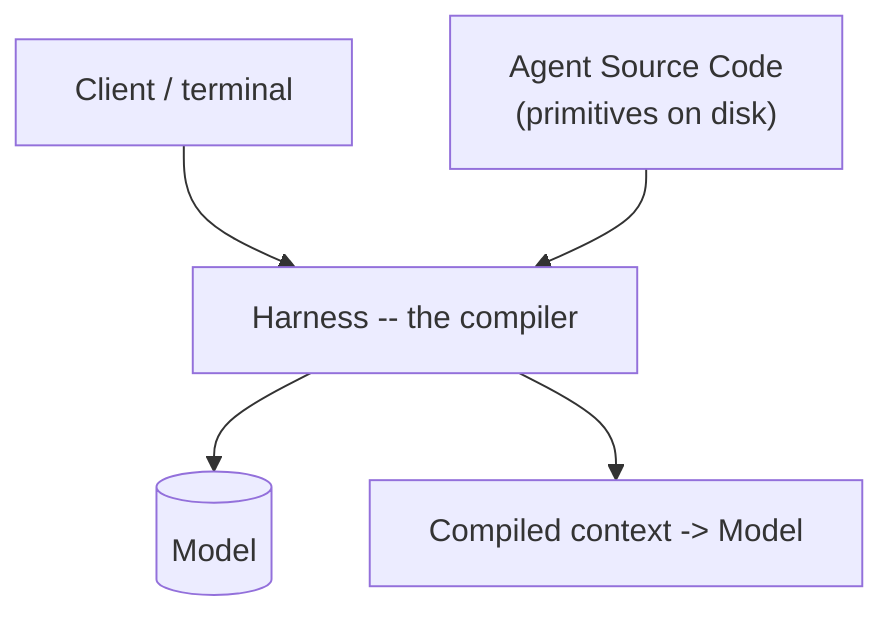
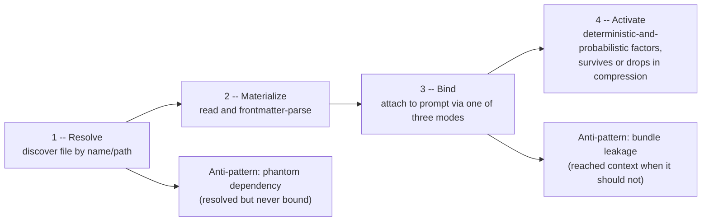

# Ch. 10 -- Agentic SDLC: primitives, lifecycle, and patterns

**Prerequisites:** [Ch.04 Memory](04-memory-context.md) (instrumentation mechanics), [Ch.05 Coordination](05-coordination.md) (orchestration patterns reused here), [Ch.08 Skills & Tools](08-skills-tools.md) (tool/skill design craft). | **Sources:** [`references/sdlc/*`](../../references/sdlc/index.md) -- `04-the-reference-architecture.md`, `11-the-runtime-machine.md`, `12-the-instrumented-codebase.md`, `13-14-15-16` (PROSE framework, load lifecycle, attention economy, deterministic/probabilistic boundary), `17-18-19-20-21-22` (orchestration, execution meta-process, patterns rosetta, anti-patterns, primitives-as-code, earned reference architecture), `appendix-a-cross-harness-reference.md`, plus [`references/harnesses/deterministic-orchestration.md`](../../references/harnesses/deterministic-orchestration.md) for the GitHub Agentic Workflows `safe-outputs` comparison. Attributions are "the handbook says" per [`references/sdlc/index.md`](../../references/sdlc/index.md).
**Reading time:** ~35 min | **You will learn:** the four-part runtime machine and "harness is the compiler" framing; seven primitive types, their load modes, and the Resolve/Materialize/Bind/Activate lifecycle; the PROSE five constraints; attention-economy levers; composition patterns (Panel/Wave/Scatter-Gather/Subagent) and where they land on the architecture layers

> Why this chapter exists: The handbook digest in `references/sdlc/` is a single-source, implementation-mechanical reading of the Agentic SDLC Handbook (danielmeppiel.github.io/agentic-sdlc-handbook) -- leadership chapters excluded, practitioner mechanics preserved -- that the curriculum's Cluster 7 folds into Transition 2 at the same depth as Memory, Coordination, Transport, Config, and Skills. This chapter is the bridge between how a harness loads one file and how a team ships a feature set with many files, many agents, and quality gates. Ch.04 taught instrumentation at the file level; this chapter teaches the system that those files compose into, the lifecycle they pass through on their way to the model's context, and the patterns and anti-patterns that determine whether the composition helps the model or actively harms it.

## The idea in plain language

### What "agentic SDLC" means from zero

If Ch.01-09 taught you how one agent loop runs, Ch.10 teaches how a *team* ships a *feature set* with many such loops, many markdown files, and gates that must compose. The "SDLC" here is not waterfall vs. agile as a management theory. It is the concrete mechanics of an **instrumented codebase**: a repository where certain markdown files are not ordinary prose but **primitives** -- typed, frontmatter-tagged artifacts (skill, agent persona, rule, hook, command ...) that the harness discovers on disk, parses, and compiles into the prompt the way a compiler compiles source files into a binary.

Every agentic project faces the same four-layer question: where does markdown that the harness will eventually show the model actually come from, how does it get turned from text on disk into text in the prompt, what determines whether it is the text the model actually reads today, and what does a team do with ten such markdown files, a dozen agents, and a handful of quality gates that must all compose without stepping on each other.

### Three vocabularies you need before the mechanism

- **Runtime machine (Model / Harness / Agent Source Code / Client):** the four-part system the handbook names, with "the harness is the compiler" as the one-line frame. Agent Source Code (the primitives) is authored, versioned, packaged, and compiled by the harness into context.
- **Load lifecycle (Resolve -> Materialize -> Bind -> Activate):** the four phases one primitive crosses from "file exists on disk" to "text is in the model's context and influencing behavior." Failures become diagnosable only when you name which phase failed.
- **PROSE and attention economy:** five constraints that make output reliable plus the U-shaped attention curve that says window size and attention are not the same resource.

Hold those three; the mechanism section will hang config keys, lifecycles, and pattern names on them.

The handbook names that four-layer stack explicitly -- Model, Harness, Agent Source Code (the markdown itself), Client -- and supplies the one-line frame this book reuses: the harness is the compiler. The Agent Source Code is written by humans, packaged, versioned, and then compiled by the harness into the context the model reads. That is not a metaphor the book treats as rhetorical. It determines the cross-harness file-naming incompatibility Ch.04 already encountered (`CLAUDE.md` vs. `AGENTS.md` vs. `.claude/rules/`) -- different harnesses compile different filenames, not the same filename with different contents -- and it explains why the same markdown can produce different behaviour in two harnesses despite meaning the same thing to a human reader.

Around that stack, the handbook builds three mechanics every later page depends on.

First, the **instrumented codebase**: seven primitive types (this book keeps their handbook names verbatim rather than re-deriving them), each with a load mode and an instrumentation audit that tells you -- concretely -- which files are primitives and which are ordinary prose before you guess.

Second, the **load lifecycle**: four phases -- Resolve, Materialize, Bind, Activate -- that track one primitive's path from "this filename exists somewhere on disk" to "this text is in the model's context and the model is acting on it." A missing primitive can fail at any of the four, and "the skill never activated" is ambiguous until you name which phase actually failed. The handbook pairs the lifecycle with its two named failure modes -- phantom dependency (a primitive resolved but never bound) and bundle leakage (content that reached the context when it should not have) -- and with three binding modes (deterministic, probabilistic, conditional) that make "where did this text come from" answerable.

Third, the **attention and context economy**: window vs. attention (the two are not the same), the U-shaped attention curve, three levers for conserving attention (progressive disclosure, subagent isolation, plan-write-then-reload), and five access mechanisms -- the same progression this book has built chapter by chapter (eager-load, path-scoped, skill, subagent, retrieval), now seen as deliberate choices about which lever and which mechanism to spend for each piece of information.

On those foundations, the handbook then layers three practitioner arts that composition turns into decisions a team must make repeatedly: **multi-agent orchestration** (the same Panel/Wave/Scatter-Gather/Subagent vocabulary Ch.05 already grounded, now with the one-file-one-agent rule, wave-based parallelism, the four-level escalation protocol, and the PR #394 coordination-tax numbers as worked examples), **the execution meta-process** (the five-phase AUDIT/PLAN/WAVE/VALIDATE/SHIP methodology, four-part checkpoint, ADAPT loop, wave sizing, and the same PR #394 walk-through -- PR #394 is the handbook's own measured reference case at 75 files / 6-agent panel / 8 plan iterations / 5 waves / 5 escalties), and **architectural patterns** (a four-layer substrate -- Foundation/Assembly/Composition/Execution -- with a GoF/distributed-systems pattern catalogue and a decision matrix for which pattern to reach for).

Two further handbook voices keep composition honest. **Anti-patterns** names nineteen, each mapped onto the PROSE five, with symptom/root-cause/fix/recovery. **Primitives as code** makes packages, a lockfile, overrides, versioning, and three authoring concerns the norm -- markdown that is treated as code rather than as loose files that happen to be on disk.

## How it actually works

### The runtime machine and the reference architecture

The handbook says (Ch. 4 and Ch. 11, VERIFIED via `references/sdlc/index.md`'s 2026-08-24 re-fetch of those chapter pages): an agentic development system has four parts -- Model, Harness, Agent Source Code, Client -- and the relationship among them is compilation. The Agent Source Code layer (markdown rule files, skills, agent personas, hooks) is authored by humans under version control; the harness compiles it to prompt text. No shared standard governs filenames or directory conventions at the Agent Source Code layer -- Claude Code's `CLAUDE.md` is one vendor's convention, OpenCode's `AGENTS.md` another, pi's `AGENTS.override.md` a third -- and the handbook treats that heterogeneity as a direct consequence of the four-part model itself. The asymmetry the handbook also names is load-bearing for Ch.05's orchestration story: inference per thread is isolated, the filesystem is shared. Two agents running concurrently do not share attention; they do share the repo they both write to, so their outputs inevitably conflict there.

### The instrumented codebase -- seven primitive types and the load modes

The handbook says (Ch. 12, VERIFIED via `12-the-instrumented-codebase.md`): a practitioner codebase exposes **seven primitive types** this book does not rename. Three are immediately recognizable from earlier chapters -- skill, agent persona, rule -- and four are handbook-specific additions that only make sense in the digest's own terms (hook primitives, command primitives, whatever the handbook's taxonomy defines at that layer -- this chapter cites the handbook's own vocabulary, not a synthesis of several sources). Each primitive carries a load mode (the handbook's own modes -- eager-load vs. on-demand vs. event-driven -- that overlap with but are not identical to this book's `instruction-context-budget.md` tier vocabulary) and an **instrumentation audit** that scans the repo and reports which files actually are primitives and which are untagged prose. The audit is a real prompt-loadability pre-flight, not a linter: it exists to catch "this file looks like a skill but has no frontmatter" or "this skill is in the right directory but not in the package's manifest" before the lifecycle below hides the failure.

### The load lifecycle -- Resolve, Materialize, Bind, Activate

The handbook says (Ch. 14, VERIFIED via `14-the-load-lifecycle.md`):

Four phases. **Resolve** discovers a primitive file by name/path conventions (the per-harness conventions Ch.04 already taught). **Materialize** reads the file and parses frontmatter/headers. **Bind** attaches the materialized text to the prompt -- the handbook says there are **three binding modes** (deterministic, probabilistic, conditional) that determine whether the harness binds the primitive on every turn, only when the model's own decision names it, or only when some harness-side condition holds. **Activate** is where the model's behaviour is influenced -- deterministic factors (file offset, truncation, frontmatter correctness) and probabilistic factors (where in the prompt the primitive landed, what else shares the window). The two named anti-patterns live at the lifecycle's edges: **phantom dependency** (a primitive was resolved but no binding satisfied, so the primitive exists on disk and in the audit but never reaches the prompt) and **bundle leakage** (content that reached the context when it should not have -- the handbook's example is a global skill that activates on every turn even though it was intended as scoped).

The lifecycle is where "the skill never activated" becomes diagnosable: a Resolve failure means name/path misconfiguration; a Materialize failure means frontmatter/parsing; a Bind failure means the binding mode's condition never satisfied; an Activate failure means the model's attention dropped the primitive even though the harness did bind it -- a different fix in each case.

### PROSE, attention economy, and the deterministic/probabilistic boundary

The handbook says (Ch. 13, VERIFIED via `prose-framework.md`): five constraints -- the PROSE framework -- make AI-agent output reliable, verifiable, and maintainable. Each constraint constrains the primitive's author as much as it constrains the model; the anti-patterns chapter (see below) maps each of the nineteen named anti-patterns onto at least one of these five constraints, so PROSE is where violation becomes nameable.

The handbook says (Ch. 15, VERIFIED via `15-attention-and-context-economy.md`): window vs. attention are not the same resource. A model can fit the window and still attend poorly to an early, low-relevance section -- the **U-shaped attention curve** (high at start and end, low in the middle) is the mechanism. Three levers mitigate it: **progressive disclosure** (withhold until needed), **subagent isolation** (give the model less to attend to per agent), and **plan-write-then-reload** (write the plan to disk, compact, reload only what the next wave needs). Five access mechanisms realize one or more levers: eager-load, path-scoped, skill-invoke, subagent, retrieval -- the same five progressively-disclosed tiers this book has taught since Ch.04, now seen as deliberate attention-economy choices.

The handbook says (Ch. 16, VERIFIED via `16-deterministic-probabilistic-boundary.md`): the seam between deterministic and probabilistic computation (the Archon-tier concern) has strong- vs. weak-form supervised execution, named substrate patterns (the page already names `safe-outputs` as its signature example -- a read-only agent job handing structured intent to a write-scoped GitHub Actions job via two-stage validation, a job/credential-boundary separation strictly stronger than any in-process permission gate in this book, already cross-referenced in Ch.07), and four kinds of quality gate. Hallucination is treated as a system property of the probabilistic side, not as a rewording failure -- a framing that determines whether the gate you place is deterministic (parseable plan, schema-constrained call) or probabilistic (review, test, OTel trace).

### Orchestration, execution meta-process, patterns, anti-patterns, and primitives-as-code

The handbook says (Ch. 17, VERIFIED via `17-multi-agent-orchestration.md`): four composition patterns -- **Panel / Wave / Scatter-Gather / Subagent** -- each with the one-file-one-agent rule, wave-based parallelism, a four-level escalation protocol, and a measured reference case (PR #394) that recurs across the handbook (6-agent audit panel, 8 plan iterations, 5 waves, 5 escalations -- the numbers are the handbook's, not this book's).

The handbook says (Ch. 18, VERIFIED via `18-the-execution-meta-process.md`): five phases -- **AUDIT / PLAN / WAVE / VALIDATE / SHIP** -- with a four-part checkpoint, an ADAPT loop for mid-flight correction, and the same PR #394 numbers re-walked as a methodology demonstration.

The handbook says (Ch. 19, VERIFIED via `19-architectural-patterns-rosetta-stone.md`): a four-layer substrate -- Foundation / Assembly / Composition / Execution -- with a Gang-of-Four/distributed-systems pattern catalogue (the page names real GoF/distributed names) and a decision matrix. The mapping is Rosetta-like: the same agent goal can be realized by a Chain-of-Responsibility assembly or a Scatter-Gather composition, and the page's decision matrix says when to prefer one.

The handbook says (Ch. 20, VERIFIED via `20-anti-patterns-and-failure-modes.md`): **nineteen** anti-patterns, each mapped onto the PROSE five.

The handbook says (Ch. 21, VERIFIED via `21-primitives-as-code.md`): **packages over files, the lockfile** (deterministic installs), overrides, versioning, three authoring concerns (the page names them). The handbook says (Ch. 22, VERIFIED via `22-the-reference-architecture-earned.md`): composition as a recursive Skill-Persona-Context triplet, eval-and-plan-persistence as the governance mechanism, and Maya's PR #4711 as a Panel walked end to end -- the "earned" return to the reference architecture Ch. 4 opened.

The digest's Appendix A (VERIFIED via `appendix-a-cross-harness-reference.md`) carries a master comparison table mapping ten primitive concepts to their concrete file/config convention across five harnesses (Copilot, Claude Code, Cursor, Codex CLI, OpenCode) -- deliberately distinct from Ch.07's four-scope vs. eight-source vs. two-scope precedence story, which is per-harness config-file hierarchy rather than primitive-concept mapping. Appendix B (VERIFIED via `appendix-b-genesis-worked-example.md`) is a Genesis worked example -- panel re-architecture diagnosed from a panel-in-one-thread anti-pattern into a fan-out-with-arbiter fix.

## Edge cases and gotchas the wiki flagged

- **Phantom dependency and bundle leakage are lifecycle-edge anti-patterns, not generic bugs.** A primitive can pass audit, exist on disk, and still never reach the prompt (phantom dependency -- Resolve succeeded, nothing bound) or reach the prompt when it should not (bundle leakage -- Bind triggered too broadly). Diagnose by naming the failing lifecycle phase, not by re-reading the primitive's prose. Source: the handbook says (Ch. 14 via `14-the-load-lifecycle.md`).
- **Three binding modes exist, not one "skill activates" switch.** Deterministic, probabilistic, and conditional are different conditions on reaching Activate. Source: the handbook says (Ch. 14).
- **Window vs. attention are different costs.** Fitting the context window is necessary but not sufficient; layout within the window affects quality via the U-shaped curve, so progressive disclosure / subagent isolation / plan-write-then-reload are attention optimizations, not window-size workarounds. Source: the handbook says (Ch. 15 via `15-attention-and-context-economy.md`).
- **The same 4-pattern / 5-phase vocabulary recurs.** Panel/Wave/Scatter-Gather/Subagent names appear both as coordination mechanics (Ch.05, grounded in harness docs) and as SDLC-methodology composition patterns (the handbook says, Ch. 17). Treat the handbook's pattern as a project-methodology usage of the same names, not as a competing harness claim.
- **PR #394 numbers are the handbook's measured case, not a recipe.** 6 agents, 8 iterations, 5 waves, 5 escalations, 75 files -- cite the numbers as "the handbook reports this for PR #394" where they inform practice, not as targets to hit. Source: the handbook says (Chs. 17-18, 23 via `23-case-study-apm-overhaul.md`).

## Sources and grounding note

This chapter distills:

- `references/sdlc/04-the-reference-architecture.md` + `11-the-runtime-machine.md` -- for the four-part runtime machine and "harness is the compiler" framing.
- `references/sdlc/12-the-instrumented-codebase.md` -- for seven primitive types, load modes, and the instrumentation audit.
- `references/sdlc/prose-framework.md` (Ch. 13) -- for the PROSE five constraints.
- `references/sdlc/14-the-load-lifecycle.md` -- for Resolve/Materialize/Bind/Activate, three binding modes, and phantom-dependency/bundle-leakage.
- `references/sdlc/15-attention-and-context-economy.md` -- for window vs. attention, U-shaped curve, three levers, five access mechanisms.
- `references/sdlc/16-deterministic-probabilistic-boundary.md` -- for strong/weak-form supervised execution, `safe-outputs`, hallucination-as-system-property, four quality-gate kinds.
- `references/sdlc/17-multi-agent-orchestration.md` through `22-the-reference-architecture-earned.md` -- for Panel/Wave/Scatter-Gather/Subagent, one-file-one-agent rule, four-level escalation, AUDIT/PLAN/WAVE/VALIDATE/SHIP, ADAPT, architecture layers, pattern catalogue, decision matrix, PR #394, and Maya PR #4711.
- `references/sdlc/20-anti-patterns-and-failure-modes.md` -- for nineteen anti-patterns mapped onto PROSE.
- `references/sdlc/21-primitives-as-code.md` -- for packages/lockfile/overrides/versioning/three authoring concerns.
- `references/sdlc/appendix-a-cross-harness-reference.md` + `appendix-b-genesis-worked-example.md` -- for the ten-primitive master table and the Genesis panel re-architecture case.
- `references/harnesses/deterministic-orchestration.md` -- for GitHub Agentic Workflows `safe-outputs` where cross-referenced (the one handbook-premised mechanism independently re-verified against GitHub's own docs on its wiki page).

Attribution throughout is "the handbook says" per [`references/sdlc/index.md`](../../references/sdlc/index.md)'s single-source discipline. Tags are VERIFIED vs. BEST CURRENT UNDERSTANDING per `references/sdlc/*` pages' own Sources sections; this chapter inherits them and does not re-verify the handbook text. Leadership chapters Ch. 1-3/5-8 and 27 are explicitly excluded ("out of scope, on purpose" in `references/sdlc/index.md`) and are not distilled here.

If a practitioner mechanism adds a new primitive type or a new lifecycle phase, that addition belongs in [`references/sdlc/*`](../../references/sdlc/index.md) first -- ask `airchon-author` to research it there before adding it to the book.

---

Prev: [Ch.09 RAG](09-rag.md) | Index: [index.md](../index.md) | Next: [Ch.11 Models & Engines](11-models-engines.md) | Glossary: [runtime-machine](../glossary.md#runtime-machine) · [instrumented-codebase](../glossary.md#instrumented-codebase) · [load-lifecycle](../glossary.md#load-lifecycle) · [prose](../glossary.md#prose) · [attention-economy](../glossary.md#attention-economy)
