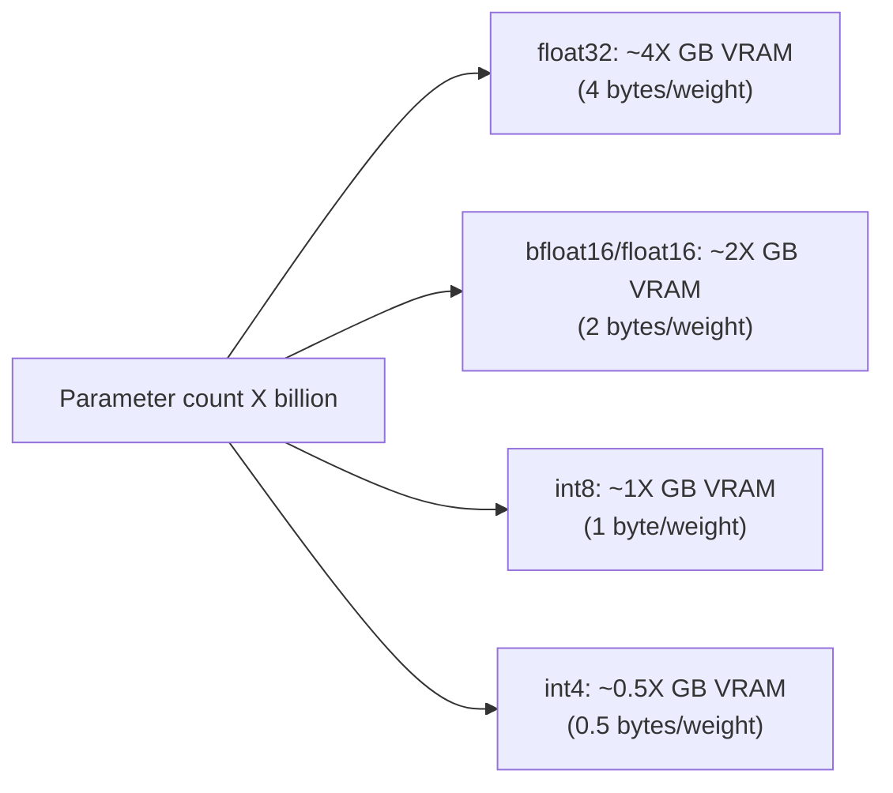
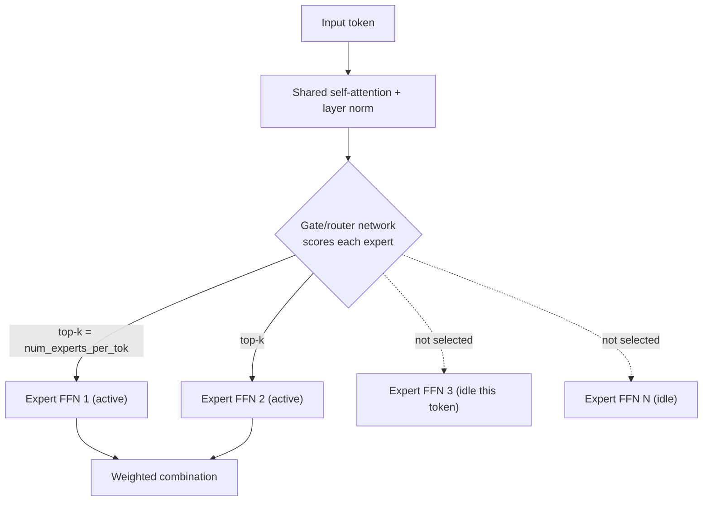
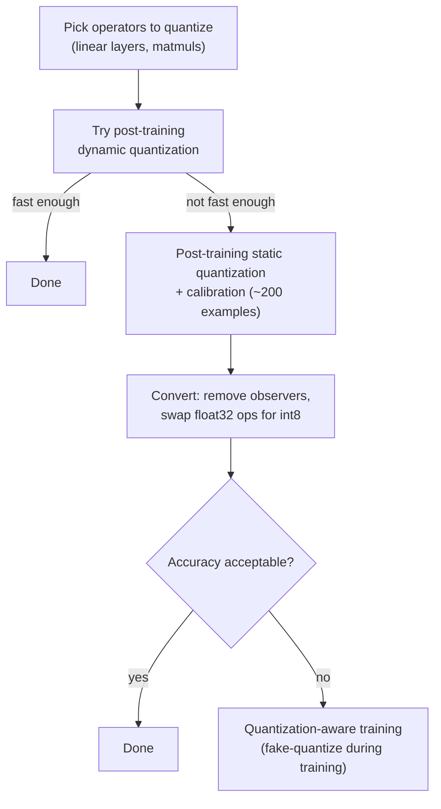
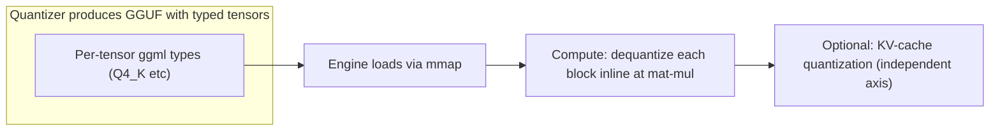
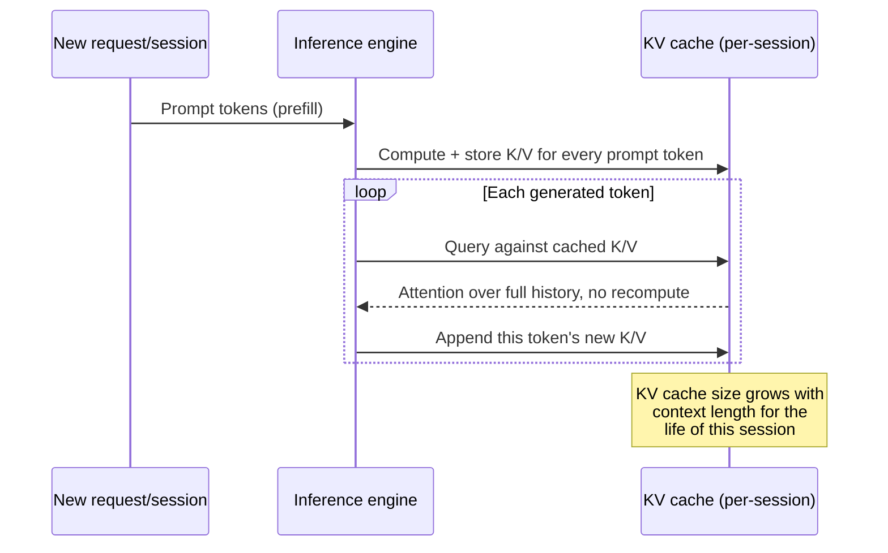

# Ch. 11 -- AI model classification and inference engines

**Prerequisites:** [Ch.06 Transport](06-transport.md) (which model answers the step -- now you learn what that model *is*), [Ch.10 SDLC](10-sdlc.md) (how a model choice composes with a harness's runtime machine), [Ch.03 Loop Implementations](03-agent-loop-implementations.md) (per-harness model families, e.g. Opus 4.x / Sonnet), [Ch.04 Memory & Context](04-memory-context.md) (context growth that makes KV-cache costs real). | **Sources:** [`references/models/*`](../../references/models/index.md) -- `model-terminology.md`, `task-and-pipeline-classification.md`, `parameter-count-and-scale.md`, `mixture-of-experts-and-frankenmerging.md`, `quantization.md`; [`references/inference-engines/*`](../../references/inference-engines/index.md) -- 11 general-concept pages + 3 per-engine implementations (`llama-cpp.md`, `ollama.md`, `ktransformers.md`). Sourced from HuggingFace `transformers` docs, HuggingFace Hub docs, `huggingface.co/tasks/*` pages, HuggingFace Optimum docs, Maxime Labonne frankenMoE writeup, and `llama.cpp`/`Ollama`/`KTransformers` docs/repos directly (2026-09-03). Attributions "the docs say" / "the guide says" per those areas' own Sources sections.
**Reading time:** ~65 min | **You will learn:** the four classification axes (terminology -> task/pipeline -> parameter count/scale -> MoE/frankenmerging -> quantization) with a ground-up primer for each; why 4*X GB / 2*X GB VRAM is a rule of thumb and when the KV cache overtakes it; what GGUF carries and why GGML/GGMF/GGJT failed; how `mmap`/KV-cache/batching/offloading/speculative decoding compose -- and when to pick llama.cpp vs. Ollama vs. KTransformers

> Why this chapter exists: You have spent ten chapters on the harness *around* the model -- the loop, its memory, its coordination, its wire, its policy. This chapter teaches the model's own taxonomy: four independent classification axes you can read off any model card, each answering a different harness-builder question. Then it teaches what happens when the model stops being a hosted API endpoint whose bill you pay per token and becomes a file on your own machine that you must load, quantize, cache, batch, shard, and serve within real hardware limits. The `references/models/` pages cross-link into the inference-engine pages deliberately ("per-tensor quantization," "MoE expert offloading") rather than being re-derived. The curriculum places Clusters 9 and 10 here -- Transition 2's final two bands -- precisely because they are the first place where the model itself becomes a classified, measurable, and locally runnable artifact. Everything the harness does above assumes the model can be there at all; this chapter makes that assumption explicit and costed.

## The idea in plain language

### What a model card is really telling you

Open any model card on the Hugging Face Hub. You see a name like `Qwen2-7B-Instruct` or `Mixtral-8x7B`, a task tag like `text-generation`, a parameter count, and a list of files. A developer who reads that card casually sees one thing -- a model name. A harness builder who has read this chapter sees four independent things simultaneously, and each one answers a different deployment question.

This section walks those four things in the order you should learn them, from the vocabulary that lets you parse the other three, to the task that names what the model does, to the scale that names what it costs, to the architecture and precision choices that name how that cost is managed.

But before the taxonomy, two physical ideas must be taught from zero because the rest of the chapter assumes you can reason about them without hand-waving: **what quantization is** (and why you would do it at all), and **what the KV cache is** (and why a model's memory bill does not stop at its weights). Every later mechanism -- GGUF mixed types, KV-cache quantization, batching economics, speculative decoding acceptance rates -- is a variation on those two tradeoffs. Get them once here; reuse them everywhere.

### Primer 1: What quantization *is* -- and why "smaller numbers" is the whole idea

A model's weights are numbers. In training, they are typically stored as 32-bit floating point (`float32`) -- a representation that can express a huge range of values with fine granularity, because it uses 1 sign bit, 8 exponent bits, and 23 mantissa bits for each number. At inference time -- when you are *using* the model, not training it -- you face a simple physical tradeoff: each weight must live somewhere (VRAM on a GPU, RAM on a CPU, or disk), must be moved over a memory bus to the compute unit, and must be multiplied and summed. Finer-grained numbers cost more on all three axes. Coarser-grained numbers cost less on all three, but represent each weight less faithfully, so the model's answers may get slightly worse.

**Quantization is the act of storing and (optionally) computing with those same weights at a coarser precision than they were trained at, in exchange for concrete resource savings.** That is the whole idea. Everything else is detail about *which* coarser precision and *how carefully* the mapping is calibrated.

The smallest example: take one weight value `0.123456` stored in `float32`. If you store it as `float16` instead, you keep a floating-point representation but with fewer bits for the mantissa (10 stored bits instead of 23) -- same scheme, less precise. If you store it as `int8` instead, you do something categorically different: you map the continuous float range `[a, b]` your weights actually span onto the 256 distinct integer values `[-128..127]` or `[-127..127]` via a scale factor `S` and a zero-point `Z` (`x = S*(x_q - Z)`). Both reduce memory. The first (`float32 -> float16`) is relatively gentle and the guide calls it straightforward because both types are floats. The second (`float32 -> int8`) is more aggressive, saves more memory, and requires deciding how to map the range well -- the "calibration" problem. The payoff the guide measures is physical: a 15.5-billion-parameter model at `bfloat16` needs ~29 GB of VRAM; at `int8` it needs ~15 GB; at `int4` it needs ~9.5 GB. The cost the guide also measures is that 4-bit quantization runs *slower* than 8-bit in its setup because the per-block dequantize step at compute time adds overhead -- smaller does not automatically mean faster, only reliably smaller in memory.

Progressive disclosure: this primer gave you the one-sentence definition ("coarser precision for resource savings"), the smallest example (one weight, two destination types), and the measured tradeoff (VRAM cascade 29 -> 15 -> 9.5 GB with a speed caveat). The sections below will add three refinements the primer deliberately deferred: *which* `int8` mapping (affine vs. symmetric), *how finely* the scale is chosen (per-tensor vs. per-channel), and *when* that mapping's calibration is done (dynamic PTQ vs. static PTQ vs. QAT). Meet the idea here first; meet the refinements when they have a reason to exist.

### Primer 2: What the KV cache *is* -- and why the model's memory bill grows with conversation length

A transformer generates tokens one at a time. Naively, to produce token 500, it would recompute attention over tokens 1..499 from scratch. The KV cache avoids that repeated work: for every attention layer, the **key** and **value** vectors computed for each earlier token are kept in memory, so producing the next token only needs to compute its single new query and compare it against the already-stored keys and values. Conceptually, it is memoization: remember the intermediate results for earlier tokens so you do not recompute the whole history.

Why an agent-harness builder must care: the model's own *weights* are fixed in size the moment you load them -- a 7-billion-parameter model at `int8` is ~7 GB whether the conversation is 10 tokens or 100,000 tokens long. The KV cache is not fixed. It grows with **sequence length x layers x KV-heads x head-dimension x 2 (key+value) x precision**, and it is allocated *per session* (two concurrent agent sessions need two independent caches against the same shared weights). An agent loop that accumulates tool outputs, retrieved documents, and prior turns is precisely the workload where sequence length keeps growing for the life of the session. The guide's worked example makes the magnitude concrete: at 16,000 tokens of context for a 15.5B-parameter model, the KV cache alone is ~15 GB in `float16` -- roughly half the model's own weight memory again, scaling linearly from there. Architectural mitigations (MQA sharing one KV pair across all heads, GQA sharing across groups of heads) collapse that 15 GB to under 400 MB for the same context, which is why the harness guide says to prefer them for any chat-like, long-context workload.

That primer -- fixed weights vs. per-session growing cache, and the fact that cache cost scales with context length rather than with model size -- is the lens every later section in this chapter's second half assumes you already have. Context-window sizing (`--ctx-size`, `OLLAMA_CONTEXT_LENGTH`), KV-cache quantization (`--cache-type-k/v`), batching slot design (managing many live caches against one weight allocation), and even speculative decoding's batch-size economy all follow from it.

### Primer 3: What Mixture of Experts *is* -- and why "only two experts fire" is the economy

A dense model uses every parameter on every token. A Mixture of Experts (MoE) splits each feed-forward layer into many smaller sub-networks called **experts** (say, 8 of them) and adds a tiny **gate/router** network that, for each token, picks only a few experts to actually run (say, 2 of the 8). Only the chosen experts' weights are executed; the others sit idle for that token. The compute bill per token therefore scales with `num_experts_per_tok` (2), not with `num_local_experts` (8), while the total learned capacity scales with the larger number. The self-attention and normalization weights remain shared across all experts, which is why Mixtral-8x7B is ~45B total, not 56B -- the FFN layers multiply, the rest does not.

Why this matters to a harness: an MoE lets you serve a model whose *memory* footprint is frontier-scale (you must hold all experts) but whose *compute* per token is mid-scale. And the deployment corollary that will matter in the offloading section: because every expert must be resident even though only a subset fires per token, per-layer GPU offloading alone cannot avoid holding every expert of an active MoE layer in GPU memory at once.

With those three primers -- quantization as "coarser numbers for less memory/bandwidth," KV cache as "growing per-session memory distinct from fixed weights," MoE as "many experts, few fire per token" -- the taxonomy below has the idea-level foundation it needs. Each later "how it actually works" section simply adds the precise knobs the guides verified.

### The four classification axes in one paragraph each

A model card tells you **vocabulary** first (encoder vs. decoder, causal vs. masked language modelling, what a "head" is) so you can parse the other three. It tells you **task/pipeline** second (`text-generation` for the agent's reasoning loop, `feature-extraction`/`sentence-similarity` for embeddings and RAG, `summarization` for compaction helpers, etc.) so you know what role the model fills in a multi-model pipeline. It tells you **scale** third (7B/70B parameter count and the `4*X / 2*X` VRAM rule, plus the KV-cache second cost that overtakes it in long sessions and why MQA/GQA exist). And it tells you **architecture and precision** fourth and fifth (whether internal capacity is dense or sparse MoE with its `num_local_experts`/`num_experts_per_tok` sparsity pair and frankenMoE stitching, and at what precision the model actually runs -- quantization's int8 schemes, granularities, and calibration families, with the 29->15->9.5 GB cascade that will be reused from primer 1 with verified numbers).

When you stop calling a hosted API and run the model locally, those four axes converge on an **engine** (`llama.cpp`, Ollama, or KTransformers) that must answer the same eleven questions in engine-agnostic form first and then per engine: file format, load strategy, weight-precision consumption, KV-cache management, sampling, batching, offloading, multi-GPU, speculative decoding, server API shape, and distribution registry.

## How it actually works

### The model's own taxonomy -- four axes the engine half assumes

#### 1. Terminology -- the grounding glossary that lets you read the other pages

VERIFIED ([model-terminology.md](../../references/models/model-terminology.md), sourced from the Hugging Face `transformers` glossary, `huggingface.co/docs/transformers/glossary`): the page defines pretrained vs. fine-tuned vs. LLM, encoder/decoder/encoder-decoder (seq2seq) architectures, causal vs. masked language modelling, tokens/input IDs/attention masks, model heads and backbones, and feature-extraction/multimodal terms. Every later page (and the inference-engine pages that compose with those model pages) links back here rather than redefining those terms.

Two details worth foregrounding because they determine deployability, not just vocabulary:

- A **decoder** with **causal masking** is unidirectional (each token can only attend to previous tokens) -- the property that makes **autoregressive generation** (one token at a time, conditioning on its own past output) possible. An **encoder** with **masked language modelling** is bidirectional (each token can attend to tokens on both sides) -- excellent for understanding/classification but not for generation in its pure form. An **encoder-decoder** (seq2seq) does both in sequence. When a model card says "decoder" vs. "encoder," it is telling you whether the architecture can *generate* at all in the loop sense Ch.02 describes.

- A **head** is not a separate model. It is the task-specific final-layer projection that turns a shared **backbone**'s hidden state into logits for a particular task (generation head, classification head, token-classification head). Fine-tuning for a new task often means keeping the backbone and swapping or adding a head, which is why the same backbone can appear under several pipeline tags.

#### 2. Task and pipeline type -- what a model is *for* in a multi-model pipeline

VERIFIED ([task-and-pipeline-classification.md](../../references/models/task-and-pipeline-classification.md), sourced from Hugging Face Hub docs (`huggingface.co/docs/hub/models-tasks`) plus `huggingface.co/tasks/<task-name>` pages, since `docs/hub/models-tasks` itself is a contributor guide rather than a task-definition page -- the wiki treats that as a live finding). Six Hub categories (NLP/Vision/Audio/Multimodal/Tabular/RL) plus the NLP tasks a harness project actually encounters:

- `text-generation` -- the agent loop's **reasoning backbone**. This is the `while` loop's Thought step; this is where capability matters most and where scale/quantization tradeoffs bite hardest.

- `text2text-generation` -- fixed input->output transforms (translate, reformat). (The Hub's dedicated page for this tag 404'd in-session, flagged openly on the wiki.)

- `feature-extraction` and `sentence-similarity` -- embeddings. If you are building RAG (Ch.09), the embedding model that turns text into vectors for retrieval is often an entirely different, much smaller model than the generation model, chosen for this tag. This is also the vocabulary behind semantic caching and semantic routing.

- `question-answering` (extractive vs. generative), `summarization` (the most common helper for **context compaction** in Ch.04), `text-classification` and `token-classification` (routing decisions, guardrails -- "should this request go to agent A or agent B?", "is this output safe?"), `fill-mask` (encoder pretraining -- mostly a preparation-time concern), `translation`.

**Running example for a harness pipeline.** Suppose you build an agent that answers questions over an internal codebase. You do not use one model for everything. You use a small `feature-extraction` model (a few hundred million parameters, cheap, fast) to embed the codebase into a vector store for retrieval; you use the large `text-generation` model to reason over the retrieved chunks in the loop; you optionally use a `summarization` model to compact the loop's history when context grows long; and you may put a tiny `text-classification` guardrail model in front of a tool call. Task tags are how you *assign roles* in that pipeline. Without them, "which model should I use?" is unanswerable.

#### 3. Parameter count and scale -- how big it is, and what that costs to run

VERIFIED ([parameter-count-and-scale.md](../../references/models/parameter-count-and-scale.md), sourced from `huggingface.co/docs/transformers/llm_tutorial_optimization` for the formula -- neither the `transformers` glossary nor the Optimum guide states it directly): a **parameter** is one learned weight -- one floating-point number inside an attention projection, feed-forward layer, embedding table, or normalization scale. The `7B`/`13B`/`70B` naming convention is total count, rounded to the nearest billion, appended as a suffix precisely because it is the most Hub-searchable proxy for deployability.

**The VRAM rule of thumb -- derived from bytes per parameter.**

> "Loading the weights of a model having X billion parameters requires roughly 4*X GB of VRAM in float32 precision"
> "Loading the weights of a model having X billion parameters requires roughly 2*X GB of VRAM in bfloat16/float16 precision"

The derivation is direct: 4 bytes per `float32` weight, 2 bytes per `bfloat16`/`float16` weight. Worked examples at `bfloat16` -- GPT-3 (175B) -> 350 GB, BLOOM (176B) -> 352 GB, Llama-2-70B -> 140 GB, Falcon-40B -> 80 GB, StarCoder (15.5B) -> 31 GB. The guide notes the largest single-chip GPU of that generation (A100/H100) offers 80 GB -- so every model above StarCoder requires either **quantization** (see next section) or splitting across multiple GPUs (tensor/pipeline parallelism) to run on one chip generation's hardware at all.

For short prompts, the guide says weight memory dominates total inference memory -- the rule of thumb *is* the budget. For long-context agentic sessions, the approximation breaks down, because the second cost -- the KV cache from primer 2, re-stated here at mechanism depth -- grows with context length. At a hypothetical 16,000-token input for the 15.5B-parameter octocoder example, the KV cache in `float16` is ~15 GB -- roughly half the model's own 31 GB weight memory again. **MQA** (one shared KV pair for all heads) and **GQA** (a small number of shared pairs) shrink that 15 GB to under 400 MB. The guide's recommendation: use MQA/GQA for any autoregressive, large-input-sequence deployment -- which describes essentially every agent harness's growing-history loop.

**Practical tiers.** The memory mechanics compose into three harness-relevant tiers (BEST CURRENT UNDERSTANDING synthesis on the wiki page, not a single-source quote, carried forward honestly as such):

- **Small (single-digit billions and below):** fit on consumer GPUs or even CPU RAM at reduced precision, cheap per call, weakest at multi-step reasoning. Suited to auxiliary `feature-extraction`/`classification` roles, not to the core loop.
- **Mid-scale (7B-70B):** the most common range usable as the agent's own `text-generation` loop, tens to low hundreds of GB at `bfloat16`, locally feasible on a high-end workstation or small multi-GPU node once quantized.
- **Frontier-scale hosted (tens to hundreds of billions, often MoE):** consumed via hosted API; the harness pays per-token cost and network latency instead of local VRAM. This is the deployment shape `llm-api-contract.md` and `auth-and-usage-accounting.md` document from the harness-integration side.

#### 4. Mixture of Experts and frankenMoE -- the architecture axis

VERIFIED ([mixture-of-experts-and-frankenmerging.md](../../references/models/mixture-of-experts-and-frankenmerging.md), sourced from Maxime Labonne's frankenMoE writeup, `huggingface.co/blog/mlabonne/frankenmoe`): the full mechanism restated from primer 3 at model-page depth.

A **sparse MoE layer** replaces a dense transformer's feed-forward sublayer with many smaller **expert FFN** sublayers (say 8). A **gate/router** network, for each token, scores which experts should handle that token and routes to the top-k (`num_experts_per_tok`, typically 2). Only those k experts execute; the rest are idle for that token. Two configuration parameters govern the shape: `num_local_experts` (total experts) vs. `num_experts_per_tok` (active per token). Self-attention and layer-norm remain shared across the whole model -- the reason Mixtral-8x7B is ~45B rather than naive 56B -- only the FFN layers multiply.

**Native MoE vs. frankenMoE is a training-methodology distinction, not a capability label.** A **native MoE** (Mixtral itself) is trained as MoE from scratch: experts and router are jointly learned together from initialization. A **frankenMoE** (also called MoErges) **upcycles existing dense checkpoints**: take several already-fine-tuned dense models (chat-specialized, code-specialized, math-specialized, role-play-specialized in the blog's worked example), treat each model's FFN layers as one expert slot in the new MoE, share attention/norm from a chosen base model, and *only then* attach and initialize the router. The experts were never trained to cooperate with a shared router -- getting a working router is the separate problem.

**MergeKit's three router-initialization methods** (the lever behind that downstream problem):

- `random` -- random weights. Risks "identical expert selection" (router fails to differentiate), flagged as requiring fine-tuning afterward -- not self-sufficient.
- `cheap_embed` -- derived by applying raw token-embedding transformations across all layers. Computationally inexpensive: no full forward pass through experts needed.
- `hidden` -- the recommended method: create hidden representations of positive *and negative* prompts by extracting them from the last LLM layer, initialize the router from those representations. Stated as "most effective for appropriate token routing."

Worked composition: **Beyonder-4x7B-v3** combines four Mistral-based 7B experts (AlphaMonarch-7B chat, CodeNinja-1.0-OpenChat-7B code, NeuralDaredevil-7B math, Kunoichi-DPO-v2-7B role-play) into a single frankenMoE at 2 experts active per token, yielding 24.2B total (again below naive 28B because attention/norm are shared), reported as top performance across multiple benchmarks vs. its individual source experts.

**The precise tradeoff the harness builder inherits** (VERIFIED, same blog): a frankenMoE must hold *all* experts resident even though only `num_experts_per_tok` fire per token, so VRAM cost tracks the full combined parameter count via the `4*X/2*X` rule above even though compute tracks the smaller active fraction. Speed is slower than a simpler weight-averaged merge of the same sources due to routing overhead. The win is **knowledge preservation**: each expert's FFN weights stay intact from its own specialty fine-tune rather than being averaged/blended away, which "can result in stronger models" than a dense merge. This is the memory-for-breadth tradeoff pushed down *into* the model's own weights rather than expressed at the harness's orchestration layer.

#### 5. Quantization -- the deployment-precision axis, now at full mechanism depth

VERIFIED ([quantization.md](../../references/models/quantization.md), sourced from Hugging Face Optimum's `concept_guides/quantization`): this section inherits primer 1's idea-level story and adds the three mechanism refinements it deferred -- scheme, granularity, and calibration -- plus the measured cascade.

##### What changes and what stays the same

Four common lower-precision types, each paired with the wider **accumulation type** used when summing many values (because two `int8` values near 127 would overflow `int8` itself if accumulated in `int8`): `float16` (accumulates in `float16`), `bfloat16` (in `float32`), `int16` (in `int32`), `int8` (in `int32`). The two most common transitions are `float32 -> float16` and `float32 -> int8`.

`float32 -> float16` is comparatively simple because both are floating point with the same scheme (1 sign bit + exponent field + mantissa). Three practical questions to check: does the operation have a `float16` kernel; does the hardware actually support `float16` *compute* (the guide notes some Intel CPUs historically stored as `float16` but computed by converting back to `float32`, with full support arriving only in Cooper Lake / Sapphire Rapids); and is the operation sensitive to `float16`'s narrower range -- `LayerNorm`'s epsilon ~`1e-12` is smaller than `float16`'s smallest representable value ~`6e-5`, risking `NaN`.

##### Int8 mapping: affine vs. symmetric, and per-tensor vs. per-channel granularity

**Affine quantization** maps the observed float range `[a, b]` onto the `int8` space with two parameters: `S` (scale, positive `float32`) and `Z` (zero-point, the `int8` value that represents exactly `0.0` -- important because zero "is used everywhere throughout machine learning models" and must be exactly representable). The math: `x = S*(x_q - Z)`, forward `x_q = round(x/S + Z)`, clipping outside `[a, b]` to the boundary. `S` and `Z` are derived from the observed `[a, b]` (the guide defers their derivation to Jacob et al. 2017 and Lei Mao's blog, not re-derived here).

**Symmetric quantization** is the common special case where the float range is treated as `[-a, a]` mapped onto `[-127, 127]` -- deliberately *excluding* `-128` from the full signed `[-128..127]` range -- so that `Z=0` exactly, which "can provide a speedup since a lot of addition operations can be skipped," at the cost of one lost representable value out of 256. The tradeoff is scheme-level: one bit of representable precision for arithmetic simplicity.

**Granularity** is orthogonal to scheme: **per-tensor** computes one `(S,Z)` pair for an entire tensor; **per-channel** (per-axis) computes one `(S,Z)` pair for each slice along a chosen dimension (example: tensor shape `[N,C,H,W]` with per-channel along `C` produces `C` separate pairs). Per-channel "can give a better accuracy" but "requires more memory" for the extra pairs -- an explicit accuracy-vs-overhead tradeoff on top of the base precision-reduction tradeoff.

##### Calibration: when and how the [a, b] range is estimated

Weights have known ranges at quantization time; **activations do not** (they depend on the input). Calibration is the step that estimates activation ranges. Three approaches, in increasing upfront cost and generally increasing accuracy:

1. **Post-training dynamic quantization (PTQ dynamic):** activation range is computed *on the fly, at runtime* for each activation. Strong results, minimal setup, but "a bit slower than static quantization because of the overhead ... computing the range each time," and "not an option on certain hardware."

2. **Post-training static quantization (PTQ static):** activation range is computed *in advance, at quantization time* by passing representative data through the model and recording activation values. Concrete steps: attach observers, run ~200 examples through the model as a calibration dataset, compute each range via a chosen calibration technique (below).

3. **Quantization-aware training (QAT):** activation range is handled *at training time itself*, using "fake quantize" operators that record values like observers *and* simulate the quantization error during training so the model's own weights adapt to compensate before ever being deployed quantized.

For static PTQ and QAT, concrete **calibration techniques** for turning observed values into `[a,b]`: **min-max** (observed min/max directly -- "works well with weights"), **moving average min-max** ("works well with activations"), and **histogram-based** methods that choose the range by optimizing **entropy** minimization, **mean-square-error** minimization, or a fixed **percentile** (exact percentile "is not always possible to exactly match ... when doing symmetric quantization").

**The guide's own practical procedure** for quantizing a model to `int8` (the decision tree it recommends you follow):

> (1) Choose which operators to quantize (the ones dominating compute, e.g. linear projections / matmuls). (2) Try dynamic PTQ first; stop if fast enough. (3) Otherwise try static PTQ (attach observers, run calibration). (4) Choose and run a calibration technique. (5) Convert the model (remove observers, swap `float32` operators for `int8` counterparts). (6) Evaluate accuracy; if not good enough, restart from step 3 with QAT instead of static PTQ.

##### The measured VRAM payoff and the non-obvious speed/energy caveats

VERIFIED (`huggingface.co/docs/transformers/llm_tutorial_optimization`, fetched 2026-09-03, supplementary to the Optimum guide and cited directly on [parameter-count-and-scale.md](parameter-count-and-scale.md) §3 for its bf16 numbers): the same guide provides the concrete worked cascade that primer 1 quoted, here with the measured detail behind each number -- for `bigcode/octocoder` (~15.5B parameters), `bfloat16` -> **~29 GB**, `int8` (`load_in_8bit=True`, `bitsandbytes` library) -> **~15 GB** ("could therefore run this model on consumer GPUs like the 4090"), `int4` (`load_in_4bit=True`) -> **~9.5 GB** ("just 9.5GB! That's really not a lot for a >15 billion parameter model," small enough for RTX3090, V100, T4 -- "quite accessible for most people").

Speed, explicitly: because weights are "quantize[d] ... load[ed] ... pass[ed] ... in bfloat16 precision; dynamically dequantize[d] ... to perform the computation," **inference time is often not reduced but rather increases** -- "4-bit in particular runs slower than 8-bit due to the more aggressive quantization method leading to quantize and dequantize taking longer." The guide's own summary, preserved verbatim: "model quantization trades improved memory efficiency against accuracy and in some cases inference time" -- memory savings are close to guaranteed; latency and accuracy costs are real but often small enough for text-generation's `argmax`/`top-k` decoding ("we don't really care about the exact values of the next token logit distribution as long as an argmax/top-k gives the same result") to be worth paying.

Energy, as the same page's cited benchmarking study adds: for **large models (>=5B parameters)**, NF4 "achieves near-FP16 energy consumption with significant memory savings," but for **small models (<3B)**, the same NF4 "can increase energy consumption by 25-56% despite achieving 75% memory compression," because "the dequantization overhead exceeds the memory bandwidth savings at this scale." Separately, batch size dominates energy more than precision at typical serving batch sizes ("increasing batch size from 1 to 8-64 reduces per-token energy by 84-96%"). This is the finding that closes the when-to-quantize synthesis below.

##### When to quantize which model in an agentic pipeline

Synthesis of §3-6 at harness decision depth (this is the chapter's own synthesis of verified facts, flagged honestly as such, not attributed to a source as a policy): quantize when the deployment target's VRAM budget cannot fit the model at its native precision per §3's rule, which in practice means any mid-to-large `text-generation` model targeted at local consumer/single-GPU-workstation hardware rather than a hosted multi-GPU cluster. Prefer `int8` over `int4` when the accuracy margin matters and the extra few GB are affordable (15 vs 9.5 GB for the same octocoder example); prefer `int4` when fitting the smallest accelerator is the binding constraint and modest quality/latency cost is tolerable. For small auxiliary models (`feature-extraction`, `text-classification`, `token-classification`, typically well under 3B) §6's energy finding is a direct caution: quantizing them may not pay off the way it does for a large `text-generation` model -- benchmark rather than assume. QAT is worth its one-time retraining cost specifically when a quantized model will be served at very high call volume for a long lifetime and PTQ accuracy loss is unacceptable; most harness deployments that consume off-the-shelf pre-quantized checkpoints (GGUF/AWQ/GPTQ community quantizations) are using PTQ-quantized checkpoints by default and only reach for QAT if the model is already being trained or fine-tuned in-house.

This section's companion on the inference-engine side -- [quantization-at-inference-time.md](../../references/inference-engines/quantization-at-inference-time.md) -- is deliberately cross-linked rather than re-derived: it answers "the engine consumes what the model page quantized, dequantizing inline per block at compute time, with GGUF mixed-per-tensor types and an independent KV-cache quantization axis," at engine-specific depth. The division the two pages keep is load-bearing: model precision is what the quantizer produced; engine behaviour is how that mixed-precision file is consumed without ever reconstituting a full `float` copy in memory.

### Running it locally -- the eleven engine-agnostic concepts and the three engines that wrap them

#### 1. Model file formats -- GGUF and why a purpose-built format had to exist

VERIFIED ([model-file-formats.md](../../references/inference-engines/model-file-formats.md), sourced from `github.com/ggml-org/llama.cpp` README + linked docs): a **training checkpoint** (Safetensors + `config.json`) and an **inference-serving format** solve different problems. The checkpoint records the model for further training; the serving format must make that model *loadable, inspectable, and compute-ready* on heterogeneous hardware with mixed precisions per tensor. GGUF's three predecessors (GGML, GGMF, GGJT) failed that second job for a concrete structural reason the docs name plainly: they had "no way to identify which architecture [a file was for], and no way to detect a breaking hyperparameter change." A file that silently accepts wrong hyperparameters produces a running model with subtly wrong behavior -- worse than a load error. **GGUF** fixes it with a four-section layout: **header** (magic + version), **typed, namespaced metadata** as key-value pairs (architecture name, hyperparameters, tokenizer, quantization metadata -- each with a type tag so the loader can reject mismatches), **tensor infos** (name, shape, `ggml` type per tensor, offset), and **tensor data** (the actual weight bytes). The per-tensor `ggml` type enumeration is why one file can mix precisions: one tensor may be `Q4_K_M`, another `F16`, a third `Q8_0`, with the type recorded explicitly in the tensor-info array. This is why "swap the local model" is a cheap operation against GGUF but fragile against an older format -- the loader, not the operator, catches the mismatch.

#### 2. Memory-mapped loading -- how a GGUF file reaches memory without a full copy

VERIFIED ([memory-mapped-model-loading.md](../../references/inference-engines/memory-mapped-model-loading.md)): why `mmap` trades a full-file copy for lazy, page-cache-backed loading: the OS maps the file's address range into the process's virtual memory without copying file contents into heap memory up front; pages are faulted in from the page cache on first access. GGUF's alignment requirement is the structural precondition that makes this safe (tensors are aligned so each mapping starts on a page boundary the OS can handle). llama.cpp exposes five explicit `--load-mode` surfaces -- `auto`/`mmap`/`mlock`/`mmap+mlock`/`dio` -- trading load-speed vs. pageout-risk vs. memory-locking: `mmap` is the default efficiency choice; `mlock` prevents the OS from paging model pages back to disk (critical when the model must stay resident under memory pressure); `dio` (direct I/O) bypasses the page cache entirely. A harness that swaps or restarts local models frequently cares about this choice because it determines whether reloading a second model evicts the first's pages or competes for cache.

#### 3. Quantization at inference time -- the engine consumes what the model page produced

VERIFIED ([quantization-at-inference-time.md](../../references/inference-engines/quantization-at-inference-time.md), cross-linking `references/models/quantization.md`): why dequantization happens **inline, per weight block, at compute time** (not once at load). The engine does not expand the whole quantized model into a `float16`/`float32` copy in memory before computing -- that would erase the memory saving quantization just bought. Instead, each quantized weight block is dequantized *at the moment* the matrix-multiply needs it, multiplied in the wider accumulation type (`int32` or `float32`), and then discarded. The engine therefore stays at quantized memory footprint for storage while paying a small compute cost for conversion. GGUF's mixed-per-tensor consequence follows: because each tensor carries its own `ggml` type, the engine must handle different block sizes and scale layouts per tensor. Runtime KV-cache quantization (`--cache-type-k`/`-v`) is an independent axis -- it quantizes *activations* being cached, not weights, so you can hold weights at `Q4_K_M` and KV entries at `Q8_0` simultaneously for the right memory-vs-quality mix in long sessions.

#### 4. KV cache and context-window management -- the growing cost, made configurable

VERIFIED ([kv-cache-and-context-window-management.md](../../references/inference-engines/kv-cache-and-context-window-management.md)): the mechanism from primer 2 at engine-knob depth. Why the cache's cost scales with **context length**, not model size, and why an agent builder must budget for it separately from weights.

Context-window sizing is an explicit, VRAM-aware setting on every engine:

- **llama.cpp** -- `--ctx-size N` (`-c N`) sets the window the engine allocates KV-cache space for; `0` falls back to the GGUF metadata's declared architecture default per [model-file-formats.md](../../references/inference-engines/model-file-formats.md) §4.
- **Ollama** -- automatic VRAM-tiered defaults (under 24 GiB VRAM -> 4,000 tokens; 24-48 GiB -> 32,000; 48+ GiB -> 256,000) explicitly because "setting a larger context length will increase the amount of memory required to run a model." The documentation calls out agentic workloads by name: "tasks requiring substantial context -- such as web search, agents, and coding tools -- should utilise at least 64,000 tokens," via `OLLAMA_CONTEXT_LENGTH=64000 ollama serve` or a per-request Modelfile `PARAMETER num_ctx` (default `2048` per `docs.ollama.com/modelfile.md`). `ollama ps` surfaces the consequence directly: it reports whether the running model is fully GPU-resident or CPU-offloaded, which "may degrade performance" -- a context window sized past VRAM forces part of the cache or weights onto the slower host-memory path, coupling this section to the offloading section below.

**KV-cache quantization** -- `llama.cpp` flags `-ctk`/`--cache-type-k TYPE` and `-ctv`/`--cache-type-v TYPE` (e.g. `q4_0`, `q8_0`) -- quantizes the cached keys/values themselves to a lower-precision type, independent of weight precision. Because cache size scales linearly with context length, this lever is disproportionately valuable for the long-context, many-tool-call sessions an agent loop produces, where the cache can overtake weights as the larger consumer. It is the same "coarser numbers for less memory" idea from primer 1, applied to a different data structure (cached activations, not weights) with an independent quality tradeoff.

#### 5. Sampling and decoding -- how tokens are actually picked, and how structure is enforced

VERIFIED ([sampling-and-decoding-parameters.md](../../references/inference-engines/sampling-and-decoding-parameters.md)): the shared core sampling knobs every engine exposes, then the mechanism that makes tool calling reliable.

**Core sampling parameters** -- `temperature` (randomness; 0 is deterministic greedy), `top_k` (only consider the top-k most likely tokens), `top_p` aka nucleus sampling (only consider tokens whose cumulative probability reaches p), `repeat_penalty`/`repeat_last_n` (penalize recent tokens to reduce loops), `seed` (deterministic replay), `num_predict` (max tokens to generate), `stop` sequences (strings that halt generation). These are the knobs the agent harness sets per call to trade determinism, creativity, and loop length.

**Grammar-constrained decoding via GBNF** -- this is *not* reweighting. The engine masks the token distribution *before* sampling so that only tokens consistent with a supplied grammar (GBNF -- G-BNF, a Llama.cpp grammar formalism) can ever be sampled; no probability mass is assigned to tokens that would violate the grammar. With automatic JSON-Schema-to-grammar conversion, an `inputSchema` that names `{ "type": "object", "properties": { "file": { "type": "string" } } }` becomes a grammar guaranteeing the model cannot produce a non-conforming token next. This is the mechanism that makes the OpenAI-shaped `tools` array Ch.06's API contract promised *actually* yield parseable `tool_calls` reliably at the inference layer, rather than relying on prompt instructions the model might ignore. Treat GBNF as token-masking, not as a prompt trick.

#### 6. Batching and continuous batching -- how one loaded model serves many concurrent prompts

VERIFIED ([batching-and-continuous-batching.md](../../references/inference-engines/batching-and-continuous-batching.md)): why **single-token decoding is memory-bandwidth-bound** (the operation spends most of its time loading weights from VRAM over the memory bus, not computing), which makes serving one token at a time wasteful when the same weights could serve several requests in the same bus transfer.

**Static batching** concatenates multiple requests into one batch that runs together start-to-finish -- simple, but requires all requests in the batch to arrive together and all generate the same number of tokens, wasting slots for short completions.

**Continuous batching** (llama-server's slot-based design) replaces that with a dynamic slot pool: `--parallel N` sets how many concurrent slots exist (one KV cache per slot against the same shared weights), `--batch-size` sets the total token budget per step, `--ubatch-size` sets the micro-batch for prompt-processing (prefill). When one slot's request finishes, its slot is immediately refilled with the next queued request -- no waiting for the whole batch. This is why batching is the mechanism that decides whether a harness fan-out (Ch.05's `pipeline()` with 16 concurrent agents) gets real throughput against one shared local model or serializes behind a single cache. For a harness designer, the question is not "does the engine support batching" but "which slot design does it use and how does that interact with my fan-out concurrency?"

#### 7. CPU/GPU/heterogeneous offloading and expert offloading for MoE -- where each computation runs

VERIFIED ([cpu-gpu-heterogeneous-offloading.md](../../references/inference-engines/cpu-gpu-heterogeneous-offloading.md)): the placement decision.

**General-case offloading (llama.cpp):** per-layer `--gpu-layers` (how many layers to place on GPU vs. keeping on CPU) and `--device` (which physical GPU for each tier), hybrid inference that can spill from GPU to CPU when VRAM is insufficient. The granularity is *per layer*: one tensor copy per layer, one decision per layer.

**Why per-layer granularity cannot solve MoE resident pressure.** Per [mixture-of-experts-and-frankenmerging.md](../../references/models/mixture-of-experts-and-frankenmerging.md) §4's tradeoff, a frankenMoE must hold *all* experts of an active layer even though only `num_experts_per_tok` will fire for any token. Per-layer offloading holds every expert of an active MoE layer in GPU memory at once, which re-creates the very VRAM pressure MoE's sparse compute was meant to alleviate.

**KTransformers' "arithmetic intensity guided offloading"** -- the finer-than-layer strategy that makes a 671B MoE locally deployable at all. The mechanism: MoE's two components have vastly different arithmetic intensities (compute per byte moved): ~512 for the shared attention (MLA -- Multi-Head Latent Attention, compute-heavy) vs. ~0.075 for the sparse experts (memory-heavy, compute-light per expert). KTransformers exploits that gap via operator injection (`match`/`replace`, `optimize_and_load_gguf`, `generate_device`/`prefill_device` placement): place compute-intensive operators on GPU, keep memory-heavy, rarely-touched experts on CPU or even NVMe, and shuffle only the active experts' weights per token. This is operator-level placement, not layer-level placement -- the structural lever per-layer cannot express.

#### 8. Multi-GPU parallelism, speculative decoding, server/API, and model distribution -- the deployment tail

VERIFIED ([multi-gpu-and-tensor-parallelism.md](../../references/inference-engines/multi-gpu-and-tensor-parallelism.md)): **tensor vs. layer parallelism.** `--split-mode layer` partitions by layer (throughput-oriented, tolerates slow interconnects -- each GPU holds whole layers, tokens flow layer-by-layer across GPUs). `--split-mode tensor` (experimental) shards each individual tensor across GPUs (latency-oriented, needs fast interconnect like NVLink -- the same operation runs partitioned across GPUs). `--tensor-split` sets the fractional split ratio; `--main-gpu` pins the primary device. This composes with KTransformers' expert placement from §7: layer sharding is the default; expert placement refines it.

VERIFIED ([speculative-decoding.md](../../references/inference-engines/speculative-decoding.md)): **draft-then-verify-in-one-batch** as pure latency optimization with no distribution change (acceptance-rate dependent). A small, fast **draft model** (the speculator) generates N tokens cheaply; the large **target model** verifies all N in one parallel batch. If verification accepts k of the N (acceptance rate determines realized speedup), the batch saves N-k sequential target-model steps; if it rejects early, the draft work is discarded and the target model corrects. Llama.cpp's drafter taxonomy: **model-based** -- a separate draft model, EAGLE-3/DFlash/DSpark learned drafters -- vs. **pattern-based n-gram** family (cheap, no extra model, looks back at prompt/context repetition). Two harness shapes benefit most: context-echoing generation (the answer repeats earlier context, so a pattern drafter has high acceptance) and small on-device drafter paired with a large target (the local draft cost is negligible). Treat speculative decoding as latency amortization, not throughput: it does not change total tokens per second the hardware can produce, it reduces wall-clock time per request when draft acceptance is high.

VERIFIED ([server-api-modes.md](../../references/inference-engines/server-api-modes.md)): **one-shot CLI vs. persistent server**; "OpenAI-compatible" as a concrete API claim with documented per-engine gaps; llama-server's native endpoint family; why concurrency-aware serving (slots, batching) captures the throughput a harness wants more than API shape alone does. API compatibility answers "can my harness's tool-calling JSON hit this endpoint unchanged"; concurrency answers "can it do so N times at once without serializing."

VERIFIED ([model-management-and-distribution.md](../../references/inference-engines/model-management-and-distribution.md)): **how a model artifact reaches the machine.** Llama.cpp's direct-path and `-hf` Hugging Face reference model (pull by HF repo id), Ollama's **name/manifest/Modelfile-build** layer (`ollama pull`/`create`/`show`/`rm`, a Modelfile-as-Dockerfile analogue with `FROM`, `TEMPLATE`, `PARAMETER` directives that let you pin the artifact and its default `num_ctx`/sampling params as inspectable, reproducible configuration), KTransformers' curated registry for `kt run`. The distribution story is where Ollama's product thesis lives: the model is not just a file but a versioned, reproducible bundle.

### The per-engine page -- when to pick which

VERIFIED ([llama-cpp.md](../../references/inference-engines/llama-cpp.md), [ollama.md](../../references/inference-engines/ollama.md), [ktransformers.md](../../references/inference-engines/ktransformers.md)):

**llama.cpp** -- the foundational C/C++ engine with maximal hardware-backend breadth (Apple Silicon, x86, RISC-V, CUDA/HIP/MUSA/Vulkan/SYCL...), `llama cli`/`llama serve` binaries, K-quant/I-quant GGUF naming families and `Q4_K_M` as its documented default, and the engine documented as Ollama's own backend. **Choose when you need hardware breadth, first-party access to every knob in §§1-8 above, or the engine-under-the-engine for another harness.** The operator cost is that every knob above is your responsibility.

**Ollama** -- a model-registry/Modelfile/REST distribution layer *over* llama.cpp (plus a newer directly-`ggml`-based Go engine for multimodal). The Modelfile instruction set (`FROM`, `TEMPLATE`, `PARAMETER`, `SYSTEM`, `ADAPTER`, `LICENSE`...) makes the entire model choice (which artifact, which `num_ctx`, which default sampling params, which system persona) an inspectable, versionable text file -- the same reproducibility calculus a Dockerfile gave containers. GPU-vendor support and VRAM-based automatic scheduling (the tiered defaults from §4) mean Ollama makes a sensible initial guess that you override only for known-heavy workloads like agents. Dual REST/OpenAI-compatible surfaces plus documented integrations with Claude Code/Codex/Copilot CLI/OpenCode mean the harness's existing `tools` JSON can hit Ollama with minimal change. **Choose when you want reproducible, inspectable per-persona model configuration with ecosystem integrations and sensible automatic defaults, at the cost of the engine's abstraction hiding some low-level knobs.**

**KTransformers** -- heterogeneous CPU/GPU inference purpose-built for large MoE (`kt-kernel`/`sglang-kt` serving, its distinct name, and a curated large-MoE model list -- DeepSeek, Kimi, MiniMax, Qwen, GLM, up to DeepSeek R1 at 671B), with a narrower, operator-injection architecture underneath (`match`/`replace`, `optimize_and_load_gguf`, `generate_device`/`prefill_device` placement on top of a `kvcache-ai/ktransformers` upstream tutorial). **Choose when the target is a frontier-scale, tool-competent open-weight MoE that no other local engine can place without holding every expert in GPU memory at once** (per §§4 and 7, the very case per-layer offloading cannot express). The cost is a narrower hardware/model-scope and an upstream tutorial model rather than a broad general-purpose engine.

No per-engine page re-derives a general-concept page. The shared mechanism lives in the eleven general-concept pages above; the engine pages name only what is genuinely engine-specific.

## Edge cases and gotchas the wiki flagged

- **Hub task taxonomy is contributor-facing, not task-definition-facing.** `huggingface.co/docs/hub/models-tasks` describes how to propose a new task type; concrete task definitions live at `huggingface.co/tasks/<task-name>` -- the task page this chapter cites per task. Source: [task-and-pipeline-classification.md](../../references/models/task-and-pipeline-classification.md) Section 1.

- **4*X GB / 2*X GB is a rule of thumb, not a quote with overhead or cache included.** It assumes contiguous weights with no overhead and no KV-cache cost; add cache cost for long-context agent sessions (which grows with tokens, not model size, per §4/primer 2). The single-GPU-capacity numbers above (A100/H100 80 GB) are generator-relative -- newer hardware changes which StarCoder-at-31-GB class fits, not the multiplication itself. Source: [parameter-count-and-scale.md](../../references/models/parameter-count-and-scale.md) derived from `huggingface.co/docs/transformers/llm_tutorial_optimization`.

- **FrankenMoE vs. native MoE is a training-methodology distinction, not a capability label.** MergeKit's `random`/`cheap_embed`/`hidden` router initializations are the lever behind frankenMoE's preservation tradeoff; do not treat any initialization as "the MoE one." A model called "MoE" on the Hub may be either. Source: [mixture-of-experts-and-frankenmerging.md](../../references/models/mixture-of-experts-and-frankenmerging.md).

- **Quantized inference is smaller, not automatically faster -- and not automatically lower-energy.** Dequantization happens inline per block at compute time, so memory footprint falls but arithmetic cost may still involve conversion. For small auxiliary models (<3B), the dequantization overhead can even *increase* energy vs. unquantized, while batch-size scaling may dwarf either precision choice. Benchmark, do not assume. Source: [quantization-at-inference-time.md](../../references/inference-engines/quantization-at-inference-time.md) and the energy benchmarking cited in [quantization.md](../../references/models/quantization.md) §6.

- **Layer-granularity offloading cannot avoid holding every MoE expert.** The per-layer `--gpu-layers` default must hold all experts of an active MoE layer; finer-than-layer (KTransformers' operator injection at ~0.075 intensity) is the mechanism that avoids it. Source: [cpu-gpu-heterogeneous-offloading.md](../../references/inference-engines/cpu-gpu-heterogeneous-offloading.md) composing [mixture-of-experts-and-frankenmerging.md](../../references/models/mixture-of-experts-and-frankenmerging.md).

- **Speculative decoding is not free parallelism -- it trades draft cost and acceptance rate for latency.** A low acceptance rate turns the draft model's work into wasted compute; a pattern-based n-gram drafter with low acceptance re-captures less than a model-based drafter whose acceptance justifies its extra load. The decision to speculate is per-request engineering, not a global toggle. Source: [speculative-decoding.md](../../references/inference-engines/speculative-decoding.md).

- **GBNF grammar constraint is token-masking, not prompting -- and not reweighting.** The engine zeros out disallowed tokens before sampling, rather than asking the model to "please produce valid JSON" and hoping. This is why it gives structural guarantees where prompt instructions give only probabilistic ones. Source: [sampling-and-decoding-parameters.md](../../references/inference-engines/sampling-and-decoding-parameters.md).

## Sources and grounding note

This chapter distills:

- `references/models/model-terminology.md` -- terminology grounding glossary (VERIFIED from Hugging Face `transformers` glossary, 2026-09-03).
- `references/models/task-and-pipeline-classification.md` -- task/pipeline taxonomy (VERIFIED from Hub task pages, with `text2text-generation` 404 flagged).
- `references/models/parameter-count-and-scale.md` -- parameter count, `4*X`/`2*X` VRAM rule, KV cache, MQA/GQA (VERIFIED from HuggingFace `llm_tutorial_optimization` page).
- `references/models/mixture-of-experts-and-frankenmerging.md` -- MoE/frankenMoE, router-init methods (VERIFIED from Labonne's writeup).
- `references/models/quantization.md` -- precision axis, schemes, granularity, calibration, 29->15->9.5 GB cascade (VERIFIED from HuggingFace Optimum docs + `llm_tutorial_optimization` supplement).
- `references/inference-engines/model-file-formats.md` through `model-management-and-distribution.md` (11 pages, 2026-09-03) -- engine-agnostic concepts (VERIFIED from `llama.cpp`, `Ollama`, `KTransformers` docs/repos) plus `llama-cpp.md`/`ollama.md`/`ktransformers.md` for per-engine specifics.

Tags preserved as VERIFIED (every GGUF section, load mode, sampling param, offload flag, model-list entry) vs. BEST CURRENT UNDERSTANDING (capability-tier synthesis, when-to-quantize decision rule) per those pages' own Sources sections; this chapter inherits them. When the book synthesizes across pages (e.g. "prefer int8 over int4 when..."), it is flagged as synthesis, not as a guide quote.

If a model card adds a new task tag or an engine adds a new quantization type, that addition belongs in [`references/models/*`](../../references/models/index.md) or [`references/inference-engines/*`](../../references/inference-engines/index.md) first -- ask `airchon-author` to research it there.

---

Prev: [Ch.10 Agentic SDLC](10-sdlc.md) | Index: [index.md](../index.md) | Next: [Ch.12 Advanced](12-advanced.md) | Glossary: [model-classification](../glossary.md#model-classification) · [moe](../glossary.md#moe) · [quantization](../glossary.md#quantization) · [gguf](../glossary.md#gguf) · [kv-cache](../glossary.md#kv-cache) · [inference-engine](../glossary.md#inference-engine) · [speculative-decoding](../glossary.md#speculative-decoding) · [batching](../glossary.md#batching)
