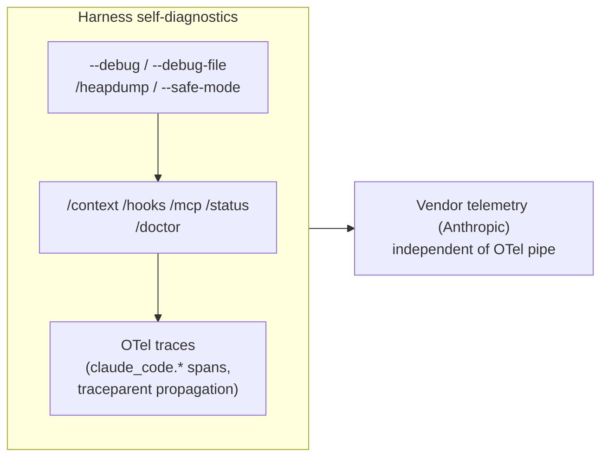
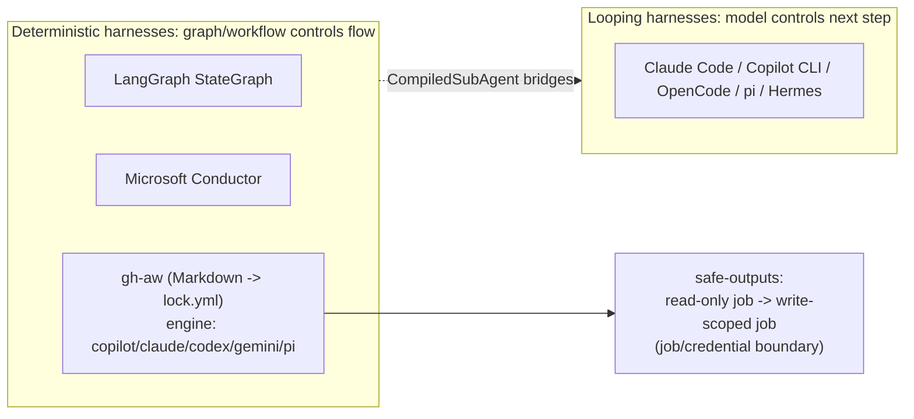

# Ch. 12 -- Advanced topics: observability, packaging, middleware, and deterministic orchestration

**Prerequisites:** [Ch.06 Transport](06-transport.md) (wire), [Ch.07 Config](07-config-permissions.md) (policy), [Ch.05 Coordination](05-coordination.md) (multi-agent patterns this chapter contrasts). | **Sources:** [`references/harnesses/observability-and-self-diagnostics.md`](../../references/harnesses/observability-and-self-diagnostics.md), [`references/harnesses/packaging-distribution-and-self-update.md`](../../references/harnesses/packaging-distribution-and-self-update.md), [`references/harnesses/tui-cli-application-architecture.md`](../../references/harnesses/tui-cli-application-architecture.md), [`references/harnesses/middleware-composed-agent-harnesses.md`](../../references/harnesses/middleware-composed-agent-harnesses.md), [`references/harnesses/deterministic-orchestration.md`](../../references/harnesses/deterministic-orchestration.md), [`references/harnesses/advanced-planning-and-execution-architectures.md`](../../references/harnesses/advanced-planning-and-execution-architectures.md), [`references/harnesses/evals-and-testing-a-harness.md`](../../references/harnesses/evals-and-testing-a-harness.md) plus general design-space pages ([tool-schema-and-interface-design.md](../../references/harnesses/tool-schema-and-interface-design.md), [system-prompt-design-as-craft.md](../../references/harnesses/system-prompt-design-as-craft.md), [context-retrieval-and-agentic-search.md](../../references/harnesses/context-retrieval-and-agentic-search.md))
**Reading time:** ~32 min | **You will learn:** how each harness exposes introspection vs. vendor telemetry vs. OTel traces; the six-channel packaging landscape and two manifest integrity chains; four TUI rendering architectures and why scrolling vs. alt-screen matters; middleware as an onion vs. hooks as interception; deterministic graph/workflow harnesses vs. looping harnesses; a negative finding about what no harness ships as loop-native planning today

> Why this chapter exists: Eleven chapters have taught the harness from the inside out -- loop, context, coordination, wire, policy, primitives, model. The last general-concept chapter teaches the layer above and the layer below that the first eleven deliberately scoped out: how the harness itself is observed and debugged, how the harness binary gets onto a machine and keeps itself up to date, how its terminal actually renders, and -- in the opposite direction -- what design space looks like when the fundamental shape is not "a loop that dynamically chooses its next tool call" but a fixed graph, a declarative workflow file, or a middleware onion composed around a LangGraph runtime. The general design-space pages the wiki added in 2026-08-17 (middleware, deterministic orchestration, advanced planning) all land here rather than being interleaved earlier, for the same reason the curriculum reserves "design-space and methodology" for the Archon-tier extension -- you need the general loop thoroughly before the alternatives to it are meaningful.

## The idea in plain language

### What "advanced" means here -- and why it comes last

Three practical questions close the practitioner's loop -- how to debug the harness itself while it is running (observability), how the harness binary gets onto a machine and keeps itself up to date without manual reinstall (packaging and self-update), and how the harness actually renders in the terminal you see (TUI architecture) -- each a layer the first eleven chapters deliberately scoped out as "table stakes" beneath the agentic mechanism proper.

And three design-space surveys place the looping harness you have spent the book learning alongside its siblings -- architectures that *do not* loop the way Ch.02 describes but still qualify as harnesses: middleware as an onion wrapper around the model call (rewrites *before* the step, unlike a hook that vetoes *after*), deterministic graph/workflow harnesses where a `StateGraph` or a Markdown-to-`.lock.yml` file controls flow instead of the model, and a negative-finding survey of what no harness in the book ships as loop-native planning today (MCTS, loop-integrated self-critique, speculative tool execution) and why that gap plausibly persists.

You need the general loop thoroughly before the alternatives to it are meaningful -- which is why this is chapter twelve, not chapter two.

The first design-space sibling is middleware. A hook, as Ch.07 described it, observes or vetoes an action a harness was already about to take -- it sits *after* the request, deciding pass or block. Middleware wraps the request *before* the step it mediates runs -- an onion that can rewrite request state, inject context, or reorder tool definitions at construction time rather than polling a hook on every invocation. LangChain's Deep Agents (verified live from `github.com/langchain-ai/deepagents`'s own `libs/ARCHITECTURE.md`) makes this the organizing idea: LangGraph supplies a runtime (state, checkpoints, streaming, interrupts), LangChain's own bare `create_agent()` supplies a capability-free agent loop, and `create_deep_agent()` is an opinionated, bundled default stack -- middleware (`BackendProtocol` virtual filesystem, planning middleware, memory), backends, subagents, skills, and profile -- composed at construction time. Built-in tool-call-level bridge `CompiledSubAgent` (any compiled LangGraph `StateGraph` can be handed as a subagent) closes the loop back to Ch.05's subagent vocabulary, now across paradigms.

The second sibling is deterministic orchestration -- what Ch.10's handbook names as the deterministic/probabilistic boundary, but studied here as an entire harness category rather than a chapter-16 section. Three instances ground the same pattern: LangGraph (a runtime that executes an explicit `StateGraph`/checkpoint/interrupt workflow), Microsoft Conductor (a separate, independently-built orchestrator), and GitHub Agentic Workflows (`github.com/github/gh-aw`) -- a Markdown-plus-frontmatter-compiled-to-`.lock.yml` authoring surface whose `engine:` property installs and runs a workflow step through the real vendor CLI (Copilot, Claude Code, Codex, Gemini, or **pi**) rather than a bare model API. Conductor's `validator` block and Agentic Workflows' `safe-outputs` mechanism are the book's strongest example of the handbook's cross-job separation done right: a read-only agent job handing structured intent to a write-scoped GitHub Actions job via two-stage validation, explicitly distinguished from a same-run `validator` that the page argues is fail-open by comparison.

The third survey -- advanced/novel planning and execution architectures -- is, unlike the other two, an original synthesis whose finding is negative: the wiki re-confirms (via fresh changelog greps of both closed-source harnesses and a zero-hit `gh search code` sweep of OpenCode's `dev` branch) that none of Claude Code, Copilot CLI, or OpenCode implements tree-search/MCTS-style planning, loop-integrated self-critique, multi-model per-step ensembling, or speculative tool execution *inside the primary task loop*, while distinguishing that negative from three real, shipped, but structurally different adjacent features (Claude Code's `/ultrareview` fleet review, `/deep-research` voting, Copilot CLI's rubber-duck second opinion) and from this book's own prior findings (Ch.06's speculative-JSON-parse negative, Ch.05's parallel-already-decided-calls). The literature grounding for what *would* count (Tree of Thoughts / LATS / Reflexion / Mixture-of-Agents / speculative decoding lines from arXiv:2305.10601 through 2607.23933) and a reasoned BEST CURRENT UNDERSTANDING account of why the gap plausibly persists close the survey.

## How it actually works

### Observability and self-diagnostics -- introspection vs. telemetry vs. OTel traces

VERIFIED ([observability-and-self-diagnostics.md](../../references/harnesses/observability-and-self-diagnostics.md) Sections 1-7, plus cross-refs to [auth-and-usage-accounting.md](../../references/harnesses/auth-and-usage-accounting.md) for cost-only metrics):

**Claude Code** (VERIFIED, docs + `CHANGELOG.md`): three layers -- docs-verified debug flags (`--debug`/`--debug=category`/`--debug-file`, `/debug`, `--safe-mode`, `CLAUDE_CONFIG_DIR`-isolated run, `/heapdump`), docs-verified introspection commands (`/context`/`/hooks`/`/mcp`/`/status` plus pre-existing `/doctor`/`claude doctor`), and a separate, beta OpenTelemetry **traces** signal (`CLAUDE_CODE_ENHANCED_TELEMETRY_BETA`, the `claude_code.interaction`/`llm_request`/`tool`/`tool.execution`/`hook` span hierarchy with W3C `traceparent` propagation into subprocesses and from an embedding caller). A third, default-on vendor telemetry layer to Anthropic (latency/reliability metrics, redacted crash reports) sits alongside any customer-configured OTel pipe -- independent of user opt-in for traces.

**Copilot CLI, OpenCode, pi, Hermes Agent** (VERIFIED, each section's own docs/source reads, 2026-09-01): pi reaches full 29/29 per-harness-page parity on this page with its `@earendil-works/pi-telemetry` internal span schema (deliberately no exporter / OTel dependency shipped; backend left to caller). Hermes Agent is the most extensively documented surface on this page -- a plugin-populated `hermes doctor` health-check registry, a supply-chain poisoning advisory scanner, five log files behind a filtering DSL, and a bundled fail-open third-party tracing plugin. The page is explicitly the final item on a 2026-08-17 gap-analysis list (`HANDOFF-missing-topics.md`, now deleted), distinct from cost-and-usage accounting's own OTel layer -- cross-referenced, not repeated.

### Packaging, distribution, and self-update -- the table-stakes layer

VERIFIED ([packaging-distribution-and-self-update.md](../../references/harnesses/packaging-distribution-and-self-update.md) Sections 1-6): explicitly scoped as "table stakes" (like TUI/CLI architecture below), not a differentiating design decision -- incorrect in `retries.md`'s earlier single-line auto-updater mention (a version-number error corrected this session to v2.1.147, not v2.1.144).

**Claude Code** (VERIFIED, docs + `CHANGELOG.md` + manifest fetch): six distribution channels (curl/`irm` native installer, two-channel Homebrew casks, WinGet, signed apt/dnf/apk repos, npm with per-platform `optionalDependencies` + postinstall, VS Code extension's private-CLI-copy with `autoInstallIdeExtension` reverse-auto-install), a `manifest.json` + GPG/platform-code-signing integrity chain, and a changelog-traced auto-update history (`autoUpdatesChannel`/`minimumVersion`, `DISABLE_AUTOUPDATER` vs. `DISABLE_UPDATES`, v2.1.207 streamed-download fix, v2.1.221 launcher-preservation fix, plugin-auto-update as a distinct subsystem). **Copilot CLI**, **OpenCode**, **pi** (npm-primary distribution -- an outlier -- with the rename `@mariozechner/pi-coding-agent` to `@earendil-works/pi-coding-agent` documented), and **Hermes Agent** (no package-registry artifact at all -- `curl`/`irm` piped installer does a `git clone` into a `uv` virtual environment) round out the distribution surface.

### TUI/CLI application architecture -- the rendering layer one level above streaming

VERIFIED ([tui-cli-application-architecture.md](../../references/harnesses/tui-cli-application-architecture.md) Sections 1-6): explicitly scoped as lower-priority "table stakes" requested in one handoff, documenting the rendering engine / component model / input handling layer one level above [streaming-and-incremental-rendering.md](../../references/harnesses/streaming-and-incremental-rendering.md)'s buffering/reassembly/pacing concerns (cross-referenced, not duplicated).

**Claude Code** (docs-verified two-path renderer -- classic scrollback vs. alt-screen `fullscreen` -- plus Ink corroborated indirectly via Ink's README and changelog Yoga/layout/cell-based-renderer facts; 19-context keybindings taxonomy). **Copilot CLI** (Ink usage directly confirmed via a GitHub engineering blog on its animated ASCII banner -- JSX components, `useState`/`useEffect`, frame-timing -- plus changelog-traced cycled-mode architecture: interactive/plan/autopilot with shell demoted out of the cycle, independently-focusable session panes). **OpenCode** (OpenTUI), **pi** (from-scratch `pi-tui`, the fourth distinct architecture alongside Ink/OpenTUI/blessed), **Hermes Agent** (two front ends over one core -- base `prompt_toolkit` CLI and a TypeScript/React TUI on `@hermes/ink`, a private Ink fork). Each is a different rendering-engine choice atop the same streaming contract from Ch.06 -- the design decision below streaming, not a re-derivation of it.

### Middleware-composed harnesses and the library-as-harness stack

VERIFIED ([middleware-composed-agent-harnesses.md](../../references/harnesses/middleware-composed-agent-harnesses.md), fetched live from `github.com/langchain-ai/deepagents` -- `libs/ARCHITECTURE.md`, `graph.py`, `middleware/` directory listing, `THREAT_MODEL.md`):

**Middleware** is not this book's event-dispatch hook vocabulary ([hooks-lifecycle-extensibility.md](../../references/harnesses/hooks-lifecycle-extensibility.md)). A hook observes or vetoes an action the harness is already taking; middleware is an **in-process, construction-time-composed onion wrapper** around the model call / tool execution / state prep -- able to rewrite the request *before* the step it wraps runs. The three-layer stack is verified directly from the Deep Agents architecture doc: LangGraph (state, checkpoints, streaming, interrupts) underneath LangChain's bare, capability-free `create_agent()` underneath Deep Agents' `create_deep_agent()` -- an opinionated, bundled default stack. The `BackendProtocol` virtual-filesystem backend, a fully source-read default middleware stack and ordering (with an honestly-flagged, precisely-sourced discrepancy between two first-party docs pages and the SDK's own source tree over whether `write_todos` planning ships bundled by default -- stated, not silently resolved), and `CompiledSubAgent` as a directly-sourced bridge back into deterministic-orchestrator territory (any compiled LangGraph `StateGraph` can be handed as a subagent) are the mechanisms this section foregrounds.

### Deterministic orchestration -- graphs, workflows, and `safe-outputs`

VERIFIED ([deterministic-orchestration.md](../../references/harnesses/deterministic-orchestration.md) Sections 1-16): three instances of the same category, studied side by side.

**LangGraph** (`StateGraph` with checkpoints/interrupts as the runtime), **Microsoft Conductor** (`validator` block as one concrete gating shape -- the page argues it is fail-open as implemented, compared to the next instance's two-stage separation), and **GitHub Agentic Workflows** (`gh-aw`) -- the Markdown-plus-frontmatter -> `.lock.yml` authoring surface, a fourth position on the code-vs-declarative axis (source and executed artifact are different files), with `engine:` running a workflow step through a real vendor CLI (Copilot/Claude/Codex/Gemini/pi as wrapped harnesses the page notes as a sixth wrapped-harness data point) rather than a bare model API. `safe-outputs` -- a read-only agent job handing structured intent to a separate write-scoped job via two-stage pre-check/apply-time validation, a job/credential-boundary separation for the deterministic/probabilistic seam structurally stronger than any in-process gate elsewhere in the book -- is the page's genuinely new general concept, with a three-way synthesis that closes on the deterministic-first vs. probabilistic-first worldview choice behind the harness taxonomy.

### Advanced/novel planning, evals, and the careful negatives around retrieval

VERIFIED ([advanced-planning-and-execution-architectures.md](../../references/harnesses/advanced-planning-and-execution-architectures.md), 2026-08-17): the original-design-space-survey page whose finding is genuinely **negative** -- through fresh changelog greps of both closed-source harnesses and an explicit zero-hit `gh search code` sweep of OpenCode's `dev` branch, no harness in the book implements tree-search/MCTS-style planning, loop-integrated self-critique, per-step multi-model ensembling, or speculative tool execution inside the primary task loop. The page distinguishes that negative from adjacent shipped features and from this book's own prior findings, then surveys the literature that would constitute a positive (Tree of Thoughts -- arXiv:2305.10601; LATS -- arXiv:2310.04406; Reflexion -- arXiv:2303.11366; Mixture-of-Agents -- arXiv:2406.04692; speculative decoding line -- arXiv:2211.17192 plus PASTE/B-PASTE/2026 lineage), before closing with a reasoned BEST CURRENT UNDERSTANDING account of why the gap plausibly persists -- cost metering, interactive-latency UX, and a permission architecture that assumes sequential tool execution.

Carefully scoped alongside it, two further companion pages fill in adjacent ground the negatives must be distinguished from: [evals-and-testing-a-harness.md](../../references/harnesses/evals-and-testing-a-harness.md) (verified harness surfaces for testing/benchmarking a harness instance rather than planning mechanics inside one run) and [context-retrieval-and-agentic-search.md](../../references/harnesses/context-retrieval-and-agentic-search.md) (VERIFIED as the initial-discovery layer *underneath* context compression and instruction budget: none of Claude Code, Copilot CLI, or OpenCode ships embeddings-based code-discovery as primary; Claude Code's docs-verified product-blog reversal of an early RAG+vector-db implementation cites index staleness, while `dynamicRetrieval` is scoped precisely to skill/MCP instruction text and a brought-your-own-RAG-via-MCP seam is the sanctioned extension point -- the narrow, source-verified boundary this book re-verifies each time a chapter is tempted to conflate Ch.09's general RAG vocabulary with a harness's own code-search behaviour).

## Edge cases and gotchas the wiki flagged

- **Observability is not cost-and-usage accounting.** [observability-and-self-diagnostics.md](../../references/harnesses/observability-and-self-diagnostics.md) documents debugging/operating the harness's own execution (debug flags, `/doctor`, OTel traces), distinct from [auth-and-usage-accounting.md](../../references/harnesses/auth-and-usage-accounting.md) Section 1.4's OTel metrics/events as a cost-and-usage catalogue. Citing one page as evidence for the other is a blended-sounding claim the book forbids. Source: [observability-and-self-diagnostics.md](../../references/harnesses/observability-and-self-diagnostics.md) opening scope.
- **OTel traces and vendor telemetry are independent pipes.** Claude Code's default-on vendor telemetry to Anthropic is not the same signal as the customer-configured OTel traces (`CLAUDE_CODE_ENHANCED_TELEMETRY_BETA`) -- one is not evidence about the other's existence or contents. Source: [observability-and-self-diagnostics.md](../../references/harnesses/observability-and-self-diagnostics.md) Section 1.
- **Package-registry tables are table stakes, not design decisions.** The six-channel Claude Code distribution and the per-harness channel catalogue exist to close an 8-item gap-analysis list, correctly scoped as lower priority than design-space pages. Source: [packaging-distribution-and-self-update.md](../../references/harnesses/packaging-distribution-and-self-update.md) opening scope.
- **Middleware wraps before the step; a hook intercepts at lifecycle.** The two are different architectural primitives with different composition points. Source: [middleware-composed-agent-harnesses.md](../../references/harnesses/middleware-composed-agent-harnesses.md) Section 1 flagship distinction + [hooks-lifecycle-extensibility.md](../../references/harnesses/hooks-lifecycle-extensibility.md).
- **The deterministic/probabilistic seam at `safe-outputs` is a job/credential-boundary separation, not a permission gate.** Do not equate it with Ch.07's in-process `allow`/`ask`/`deny` gates -- the page argues it is structurally stronger precisely because it separates the agent's credential from the writing credential. Source: [deterministic-orchestration.md](../../references/harnesses/deterministic-orchestration.md) Section 15.
- **A negative finding is still a finding.** That no harness in the book implements MCTS planning or loop-integrated self-critique as ship-to-user loop mechanics is a re-confirmed, methodologically described negative (changelog greps plus `gh search code` sweep), not an absence of research. Source: [advanced-planning-and-execution-architectures.md](../../references/harnesses/advanced-planning-and-execution-architectures.md) opening method.

## Sources and grounding note

This chapter distills:

- `references/harnesses/observability-and-self-diagnostics.md` Sections 1-7 -- VERIFIED (docs + CHANGELOG + `pi-telemetry` span schema + Hermes Agent `hermes doctor` / supply-chain scanner, 2026-09-01) per that page's own Sources.
- `references/harnesses/packaging-distribution-and-self-update.md` Sections 1-6 -- VERIFIED (docs + manifest fetch + `CHANGELOG.md`) per that page's own Sources.
- `references/harnesses/tui-cli-application-architecture.md` Sections 1-6 -- VERIFIED (Ink/OpenTUI/ `pi-tui` / `@hermes/ink` plus `CHANGELOG.md` mode history) per that page's own Sources.
- `references/harnesses/middleware-composed-agent-harnesses.md` -- VERIFIED (live fetch from `github.com/langchain-ai/deepagents` `libs/ARCHITECTURE.md` + `graph.py` + `middleware/` + `THREAT_MODEL.md`) per that page's own Sources; discrepancy flagged openly.
- `references/harnesses/deterministic-orchestration.md` Sections 1-16 -- VERIFIED (LangGraph/Conductor/`gh-aw` docs, three instances, including `engine:` as sixth harness wrap and `safe-outputs` as the page's new concept) per that page's own Sources.
- `references/harnesses/advanced-planning-and-execution-architectures.md` -- VERIFIED as negative finding (fresh greps + `gh search code` zero-hit) plus literature grounding (named arXiv lines); BEST CURRENT UNDERSTANDING (plausible gap account) flagged as such.
- `references/harnesses/evals-and-testing-a-harness.md` + `references/harnesses/context-retrieval-and-agentic-search.md` -- where cross-referenced as the careful counterpoints to the advanced-planning negatives, each VERIFIED per that page's own sources (e.g. Lewis et al. original RAG paper + Amazon Science AAAI 2026 paper for the retrieval design space).

If a future mechanism adds a new OTel span name, a new distribution channel, a new middleware kind, or a new deterministic orchestration instance, that addition belongs in the corresponding `references/harnesses/*.md` page first -- ask `airchon-author` to research it there before adding it to the book.

---

Prev: [Ch.11 Models & Engines](11-models-engines.md) | Index: [index.md](../index.md) | Next: [Claude Code synthesis](../harnesses/claude-code.md) | Glossary: [observability](../glossary.md#observability) · [middleware](../glossary.md#middleware) · [deterministic-orchestration](../glossary.md#deterministic-orchestration) · [safe-outputs](../glossary.md#safe-outputs)
