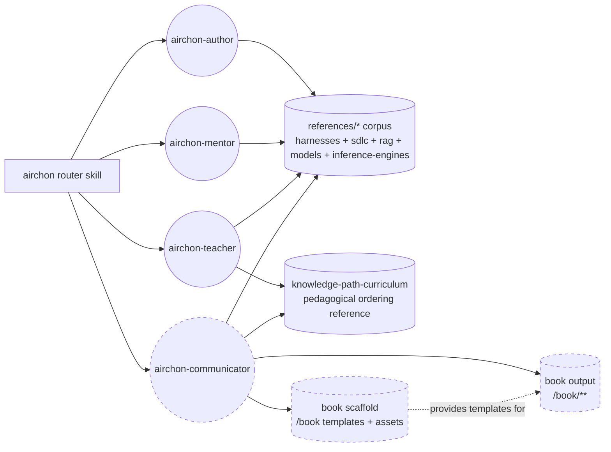
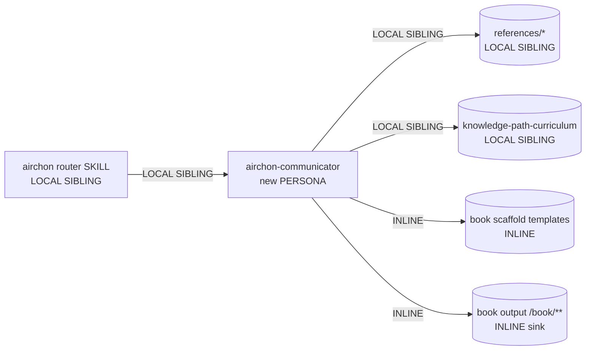

# Genesis Handoff Packet — airchon-communicator (didactic book author)

*Generated 2026-09-12 via genesis 8-step design. Design ends at step 6 persistence; steps 7b-8 executed by caller thread after this packet.*

---

## Step 1 — Intent + Scope + Dispatch Description + Cost Stance

### One-paragraph intent

`airchon-communicator` is a didactic science-communicator PERSONA SCOPING FILE whose capability is to generate and maintain a pedagogical book at `/book` — *The Road to Agentic Archon* — as an ordered, distilled, easy-language (Kent Beck / Martin Fowler voice) version of what `airchon-author` has created across the five `references/*` areas (`harnesses/`, `sdlc/`, `rag/`, `models/`, `inference-engines/`). The book's contract is a fixed scaffold: index → foreword → general concepts taught in pedagogical order (knowledge tree sorted for learning progression, not wiki write-date order) → concrete harness-by-harness synthesis pages (Claude Code, Copilot CLI, OpenCode, and any harness the wiki covers) → glossary; every chapter is detailed and verbose rather than compressed, uses Mermaid diagrams whenever a visual clarifies structure/flow/cache composition/system topology, and carries explicit navigation links (index ↔ chapter ↔ next page, glossary term ↔ usage). The agent reads the wiki corpus as its ground truth (never re-researches what the wiki already verified), distills and reorders that material into teachable prose, and owns the only write surface to `/book/**`.

### Boundary (what it does NOT do)

- Does NOT write to any `references/**` area — that remains `airchon-author`'s exclusive write surface (single-writer per sink preserved). Reading all five areas is allowed; writing them is forbidden.
- Does NOT answer open-ended Q&A in conversational mentor voice — that is `airchon-mentor`'s job. Communicator's output is the book artifact, not a chat answer.
- Does NOT assess tiers, run exams, or deliver courses — that is `airchon-teacher`'s job.
- Does NOT invent facts beyond what the wiki (plus its cited primary sources) already grounds. When the wiki is missing a topic the book needs, the agent names the gap and delegates the research to `airchon-author` rather than hallucinating a chapter.
- Does NOT produce a one-shot outline without content — each chapter/page must be detailed, easy-to-learn prose with concrete config keys, file paths, and mechanisms carried over from the wiki, rewritten for pedagogical clarity.

### Dispatch description (frontmatter `description` — imperative, intent-first, indirect triggers, <=1024 chars)

> Use this skill when the user asks to generate, build, update, expand, or revise the didactic book at /book -- "The Road to Agentic Archon" -- a distilled, pedagogically ordered, easy-language version of the wiki-book, or to add a chapter, foreword, index, glossary, or harness-by-harness synthesis to that book, or to explain a hard harness concept with a Mermaid diagram for the book. Triggers even when the user does not name the agent -- phrases like "make the book", "write the book", "distill the wiki", "road to archon", "explain caching visually", or "turn the wiki into a book" all invoke this. Owns only /book/** and never writes to references/**.

*Character count: ~612. Verified <=1024. Imperative phrasing ("Use this skill when..."), user-intent framing (generate/build the book), indirect triggers named (phrases without agent name).*

### Cost stance + cap (read at step 1)

- **Stance:** `balanced` (default). No operator override was declared in the request.
- **Cap:** none declared. Informational projection only; no halt gate.
- Implication per `references/cost-economics-process.md`: B13 always, role class per slot cheapest-meeting-need, B14 thrift at validation when within 80% of budget. Frugal-only mandates (B12/B15/B16 declared, A12 preferred) do NOT fire; quality-only promotions do NOT fire.

### Single-responsibility check

Paragraph contains one capability ("generate/maintain the didactic book `/book` from the wiki corpus in pedagogical order with precise navigation and diagrams") plus its scaffold (index/foreword/chapters/harness pages/glossary) — not "and" connecting two distinct capabilities. No R1 SPLIT trigger fires on the intent itself (passes DESCRIPTION CONJUNCTION gate).

---

## Step 2 — Component Diagram (flowchart)

Load: `assets/primitives.md`, `assets/design-patterns.md`, `assets/architectural-patterns.md`, `assets/refactor-patterns.md`, `assets/mermaid-conventions.md`



**Node-type legend per mermaid-conventions:** `((PERSONA))`, `[SKILL]`, `[/RULE/]`, `{ORCHESTRATOR}`, `[(ASSET)]`. Here PERSONA nodes are `(( ))`, SKILL is `[ ]`, ASSET is `[( )]`.
- `airchon-communicator` PERSONA — **NEW** — science-communicator lens, grounded in corpus, owns `/book/**` write.
- `airchon-author` PERSONA — EXISTING — only writer to `references/**` (upstream source of communicator's corpus).
- `airchon-mentor` / `airchon-teacher` PERSONA — EXISTING — read-only on corpus, not depended on at runtime but shown for SoC boundary.
- `airchon` router SKILL — EXISTING, to be updated (adds dispatch to communicator).
- `references/*` corpus ASSET — EXISTING — five areas, ~80 md files, the ground truth communicator distills.
- `knowledge-path-curriculum.md` ASSET — EXISTING — ordering precedent (Slumberer→Gnostic→Demiurge→Archon clusters), reused as ORDERING REFERENCE, not as content to copy verbatim.
- `book scaffold` ASSET — **NEW** INLINE — `/book` layout templates (chapter, foreword, index, glossary, next-page link partial) that communicate the scaffold contract without polluting the persona body (C1 LAZY ASSET + S5 LAZY PROXY).
- `book output` ASSET — **NEW** — the generated book itself at `/book/**`, the single-writer sink of this design.

**Edges = depends-on (not call sequence).** No hidden external module edges.

---

## Step 3 — Thread / Sequence Diagram (sequenceDiagram)

Pattern selected: **A2 PIPELINE** (Pipes-and-Filters) as Tier-3 spine — see Step 3.1 rationale. Within stage 3 (Implement Chapters), optional B1 FAN-OUT per chapter when outline yields >=3 independent chapters.

```mermaid
sequenceDiagram
    participant Op as Operator
    participant Router as airchon router
    participant Comm as airchon-communicator<br/>(PIPELINE orchestrator)
    participant Inv as Inventory<br/>(C6 + Read)
    participant Out as Outline<br/>(knowledge-tree order)
    participant Chap as Chapter workers<br/>(B1 fan-out, optional)
    participant Book as /book/**<br/>(S7 write sink)

    Op->>Router: "make the book / Road to Archon"
    Router->>Comm: spawn (communicator persona + corpus pointers)
    Comm->>Inv: stage 1: inventory corpus<br/>Read index.md + topic files (lazy)
    Inv-->>Comm: inventory table (topics, status, gaps)
    Note over Comm: S4 gate 1 — inventory complete?<br/>all 5 areas indexed; gaps named+delegated
    Comm->>Out: stage 2: design TOC / knowledge-tree order<br/>Beck/Fowler voice + progression
    Out-->>Comm: TOC + glossary term list + harness page list
    Note over Comm: S4 gate 2 — TOC reviews against<br/>knowledge-path-curriculum clusters<br/>+ pedagogical deps (topology→loop→impl)
    Comm->>Chap: stage 3: draft chapters (sequential default;<br/>B1 fan-out when >=3 independent chapters)
    Chap-->>Comm: chapter drafts + Mermaid blocks
    Chap->>Book: S7 write chapter md + next-page links (tool-bridged)
    Book-->>Comm: write receipts (path + hash)
    Note over Comm: S4 gate 3 — link + glossary + diagram audit<br/>index↔chapter↔next, glossary coverage, mermaid ASCII+render
    Comm->>Book: stage 4: emit index, foreword, glossary, harness-by-harness synthesis
    Book-->>Comm: final book receipts
    Comm-->>Router: confirmation (pages touched, sources cited)
    Router-->>Op: "book updated at /book — N chapters, linked"
```

**Interlocks:**
- Single-writer on `/book/**` — only airchon-communicator writes; airchon-author never touches `/book/**`.
- Single-writer on `references/**` preserved — communicator never writes there.
- Per-chapter interlock when fan-out fires: one worker per chapter file (per-file single-writer, not per-book serialization).

**Pattern composes per step 3 tier selection:**
- Tier-3: A2 PIPELINE (ordered stages with S4 gates, B4 state between stages)
- Tier-2 per stage: B4 PLAN MEMENTO (TOC + inventory persisted), B8 ATTENTION ANCHOR (voice + scaffold constraints re-injected), S4 VALIDATION DECORATOR (three gates), S7 DETERMINISTIC TOOL BRIDGE (writes/reads), C6 GROUNDING (corpus loads), C1/S5 lazy assets, B13 cache-aware prefix.

---

## Step 3.1 — Tradeoff Check

Two decisions surfaced alternatives; `pattern-tradeoffs.md` loaded and cited below. Diagrams in packet caption the chosen row.

### Tradeoff 1 — Architectural shape: A2 PIPELINE vs A4 STAFFED PLAN vs A1 PANEL

| Candidate | Fit | Misfit |
|---|---|---|
| A2 PIPELINE | Ordered stages (inventory → outline → chapters → index/glossary) with verifiable hand-offs; each stage has different mental mode (inventory=retrieval, outline=pedagogy, chapters=generation, synthesis=integration). Canonical A2 condition. | — |
| A4 STAFFED PLAN | Book tasks benefit from different lenses (writer vs diagram vs indexer) but tasks are NOT yet atomized from a persisted plan with per-todo staffing at design time; the book's chapter list emerges FROM the outline stage. STAFFED PLAN could layer inside stage 3 later. | Staffing field premature before TOC exists; plan artifact is the TOC itself which PIPELINE already produces. |
| A1 PANEL | Would apply only if chapter ordering needed >=3 independent expert lenses synthesized into one verdict. Ordering is pedagogical, not adversarial multi-lens synthesis. | No >=3 lenses with synthesis decision; PANEL anti-pattern PANEL-WITHOUT-SYNTHESIS would result. |

**Selection: A2 PIPELINE.**
**Matrix cited: `pattern-tradeoffs.md` §4 Threading topology — sequential threads with shared state via B4+B5 is PIPELINE, not parallel. Row: `SHARED STATE / SEQUENTIAL THREADS = B5 ACCEPTANCE OBSERVER between stages / PIPELINE (A2)` — sequence of stages sharing B4 state with gates, not parallel fan-out.**

No alternative warrants A8 ALIGNMENT LOOP as primary (single artifact iteration with steward is per-chapter refinement if a chapter fails its gate, not the book-level shape).

### Tradeoff 2 — Grounding doctrine for wiki facts: C6 LAZY vs EAGER PRELOAD

**Selection: C6 EXTERNAL CORPUS GROUNDING (lazy) + C1 LAZY ASSET.**
**Matrix cited: `pattern-tradeoffs.md` §3 Grounding doctrine — EXTERNAL SOURCE / LAZY LOAD = C6.** Wiki is external to LLM pretraining (truth #5 FROZEN CUTOFF), so lazy fetch at the step that needs each topic is the mitigator. EAGER EXTERNAL FETCH would load all ~80 md files at session start for cache cost with no benefit (anti-pattern EAGER BLOAT). Communicator loads `index.md` + the topic pages its current chapter actually distills, not the whole corpus eagerly.

### Tradeoff 3 — Gate type for chapter/index correctness

**Selection: S4 VALIDATION DECORATOR (programmatic) for link/glossary/diagram checks + B5 ACCEPTANCE OBSERVER at end for pedagogical progression check.**
**Matrix cited: `pattern-tradeoffs.md` §2 Gate types — INTERNAL+PROGRAMMATIC = S4 (link existence, glossary coverage, file written), INTERNAL+JUDGEMENT = B9/B5 (is progression pedagogically sound?).** Link integrity is deterministic; progression is judgement. Two gates, not one.

---

## Step 3.2 — Cost Check (mandatory)

Load: `assets/token-economics.md`, `assets/runtime-affordances/model-catalog.md`
Stance: `balanced`. No cap.

| Module / Stage | Role class | Prefix size | Output volume | Turns | Cost patterns applied | Cost-shape matrix row (§10) |
|---|---|---|---|---|---|---|
| airchon-communicator (outline/TOC synthesis) | planner — ordering knowledge tree across 5 areas requires cross-file reasoning + multi-step planning, bounded plan output | M (5-20K — indexes + curriculum + persona) | M (500-3K — TOC + glossary term list) | medium (4-8) | B12 (explicit planner bind), B13 (stable communicator prefix), B4 | Heterogeneous tool surface? No. Workflow shape = heterogeneous-cost stages → A12 GRADIENT candidate (see below) |
| Chapter drafting (per chapter, sequential or B1 fanned) | implementer — follows given TOC + source page, terse-to-medium output, low hallucination on routine rephrase | M (5-20K — chapter source pages + voice guide; lazy per chapter keeps prefix stable) | L (over 3K — detailed verbose chapter, Fowler voice, diagrams) | medium per chapter | B13, B4, S7 (tool-bridged writes) | Long synthesis output (>3K) → R1 SPLIT producer step (one file per chapter, not one giant write) + Fan-out across N similar items → Output bytes × N → A12 MID=implementer |
| Index / Foreword / Glossary / Harness-by-harness synthesis | reviewer/implementer — rubric-graded assembly from chapter receipts (deduplicate terms, verify links) | S-M | M | low-medium | B13, S4 | — |
| Inventory scan (C6 lazy reads) | trivial / long-context-retriever if KB exceeds impl context — but KB fits per-chapter lazy, so trivial | S | S (table) | low | B13 | Multi-step plan against large corpus → Input prefix size → C6+S5 lazy (already selected) |

**Pattern-tradeoff §10 citations:**
- Outline stage: no dominant bucket yet; design-time predicted bucket is `Input prefix size` → C6+B13 (already applied).
- Chapter fan-out with N chapters: `Fan-out across N similar items → Output bytes × N → Heavy role class on workers → A12 GRADIENT WORKFLOW (mid=implementer)`. Applied: planner front (outline), implementer middle (chapters), reviewer back (index/glossary audit). Gradient saves `(planner_rate - implementer_rate) × N` output budget; break-even at N≥4.
- Long synthesis output per chapter (L) → `R1 SPLIT producer step; or S7` — applied: one file per chapter (split) + deterministic write via tool.

**B12 SELECTION RULE per module (balanced posture rationale):**
- Outline: harness default for persona = session default (often reviewer/implementer); REQUIRED=planner because cross-file synthesis + planning requires high reasoning. → BIND UP with cited STAKES (knowledge-tree dependency ordering; prerequisite chain determines learnability, not just style).
- Chapters: REQUIRED=implementer (follow given TOC, paraphrase grounded prose, generate Mermaid). If default is planner-class, BIND DOWN for economy — per-element justification recorded (routine follow-plan + low STAKES per chapter; no irreversible side effect beyond file write).
- Index/glossary: REQUIRED=reviewer (rubric: every glossary term linked, every chapter linked, no dangling next-page). BIND per default table.

**Cache invalidators audit:** none introduced. Communicator body must not embed timestamp, must not mutate tool catalogue mid-session, must not switch model mid-pipeline, must not edit rule files. Prefix is persona + scaffold templates (stable) → variable suffix is corpus pages + chapter drafts.

**Tool surface:** built-ins only (Read, Write, Edit, Glob, Grep, Bash/WebFetch for source verification only when wiki gaps exist). No catalogue bloat (>20 tools) — B15 NOT triggered.

**Effort governor:** not triggered; balanced default uses per-harness defaults. No effort-everywhere.

---

## Step 3.5 — Composition Decision

Load: `assets/composition-substrate.md`

| Box | Composition mode | Rationale |
|---|---|---|
| airchon-communicator agent file (`.apm/agents/airchon-communicator.agent.md`) | **LOCAL SIBLING** primitive in same source tree (sibling to mentor/author/teacher) | Single-project reusable; no independent release cadence; not rule-of-three; different lens but same owner. INLINE rejected (persona needs own dispatch entry); EXTERNAL rejected (not reused in 3+ projects). |
| airchon router skill (`.apm/skills/airchon/SKILL.md`) update | **LOCAL SIBLING** — extend existing sibling's `allowed-tools` to include `Agent(airchon-communicator)` and extend dispatch taxonomy with BOOK intent | One-line composition edge, not a new module. |
| references/* corpus | **LOCAL SIBLING** asset — existing, read-only | Distribution boundary already crossed at repo level; no new dependency. |
| knowledge-path-curriculum.md | **LOCAL SIBLING** asset — ordering precedent, read-only | Reused as ordering *reference*, not as content to depend on as external module (same tree, same owner). |
| /book scaffold templates (chapter.md, foreword.md, index.md, glossary.md partials) | **INLINE** asset within communicator primitive (`assets/book-templates/` or `references/book-templates/` lazy path) | Unique to this module; no reuse elsewhere; keeps load lazy (C1/S5). LOCAL SIBLING rejected — scaffold is not a standalone capability. |
| /book output (`/book/**`) | **INLINE** sink owned by communicator (single-writer) | Not a dependency; the produced artifact. No distribution crossing. |

**Transitive closure:** none beyond local siblings + inline assets. No external module boundary crossed → `external modules required = (none)`. Declaration mechanism N/A.



**Audience boundary (§7):** every artifact emitted by communicator is **EXTERNAL** (human reads the book). Spawn briefs, if chapter fan-out fires internally, are **INTERNAL** and would be caveman — but this design's primary shape is sequential PIPELINE with optional internal fan-out; per-spawn table below covers that optional fan-out. Synthesizer is the book assembler itself — ingests INTERNAL chapter drafts, emits EXTERNAL book pages in normal prose (Fowler/Beck voice). No caveman on EXTERNAL.

---

## Step 4 — SoC Pass

For each module (annotated with composition mode above):

- **Does existing module already do this?** No. `airchon-author` writes `references/**`; `airchon-mentor` explains conversationally without persisting; `airchon-teacher` assesses and courses. None generates a pedagogically ordered, visually diagrammed book at `/book/**`. No duplication; depend-on via corpus read is correct composition, not duplication.
- **Trigger collision?** Checked frontmatter `description` against installed siblings:
  - mentor: harness internals Q&A (DISCOVERY, read-only)
  - author: research+write into `references/**` (DISCOVERY, write to references)
  - teacher: proficiency tiers / exams / courses (DISCOVERY, writes `~/.airchon/*`)
  - **communicator: generate/maintain `/book/**` didactic book** — trigger nouns (`book`, `Road to Archon`, `chapter`, `foreword`, `index`, `glossary`, `Mermaid diagram for the book`) are disjoint. No DISPATCH COLLISION. Severity: none. Narrowing not required.
- **R1 SPLIT triggers on communicator?** Description = one capability (book authoring) with scaffold facets (index/foreword/glossary are facets of the same book, not independent capabilities). BODY OVER BUDGET guarded by lazy scaffold (C1/S5) — chapter templates live outside the main persona body, loaded only when drafting. No multi-lens body: voice is single (Fowler/Beck pedagogical). DIVERGENT CADENCE: book scaffold templates change slower than chapter prose; already separated as INLINE lazy asset → split not warranted. **No R1 fires; PREMATURE SPLIT avoided.**
- **R2 FUSE?** Not applicable — no tiny siblings to merge.
- **R3 EXTRACT?** Book scaffold extracted as INLINE lazy asset (already applied). No duplicated inline content elsewhere to extract. PROMOTION-WITHOUT-NEED avoided.
- **R4 INLINE?** No thin proxy produced.
- **R5 COST PRUNE?** Already applied via gradient (A12) and per-chapter split; no flat heavy-class graph remains.
- **R6 AUDIENCE-BOUNDARY?** New design, so enforce from start: HUMAN_RATIONALE stays in handoff packet, SPAWN_BRIEFs (if fan-out) are caveman INTERNAL, book pages are NORMAL EXTERNAL. Compliant.
- **S7 seam check per §4:** Steps naming CONSEQUENTIAL SIDE EFFECTS = file writes to `/book/**` — MUST cross S7 via Write/Edit tool (deterministic). Facts that must be true = wiki page content, file existence — MUST cross S7 via Read/Glob/Grep (tool-bridged, not LLM-asserted). The design names both explicitly. No TOOLLESS ASSERTION.
- **Module existence collapse (R2 check for "always loaded together"): ** communicator + scaffold templates are not always co-loaded with author/mentor — author may never load communicator's voice guide. No collapse.

**Finding: SoC clean. One new persona + one router update + inline scaffold. No hidden external dependency. No boundary violation (bundle leakage avoided: scaffold lives inside communicator's own asset subtree, not as loose `.md` under `.apm/agents/` — that path is a deployable-agent root per CLAUDE.md gotcha; keep scaffold under `assets/` or `book/` not `.apm/agents/`).**

---

## Step 5 — Compliance Check

### a) Classic principles / PROSE 5-axis + 7 LLM truths

| Axis | Check | Verdict | Severity |
|---|---|---|---|
| Progressive Disclosure | Persona body <=500 lines & <=5000 tokens; overflow to lazy `references/book-templates/*.md` with explicit `Read ... if drafting Chapter` triggers. Scaffold not inlined eagerly. | PASS | — |
| Reduced Scope | Child chapter workers (if fanned) get fresh context with only chapter's source pages + TOC slice; parent holds only outline+state. B3 not needed (workers don't spawn peers). | PASS | — |
| Orchestrated Composition | Inline vs local-sibling vs external declared; no phantom dependency (every corpus read declared as LOCAL SIBLING asset). | PASS | — |
| Safety Boundaries | Writes gated via S7 Write tool; no destructive irreversible beyond file write (book overwrite is recoverable via git). B10 HUMAN CHECKPOINT not mandatory for book file write but offered when overwriting non-empty `/book/**` without `force` flag (see interface sketch). | PASS | — |
| Explicit Hierarchy | No scope-attached rule files introduced; scope is file-path `/book/**` owned by communicator alone. Hierarchy not violated. | PASS | — |
| Truth #1 (context fragile) | B4 PLAN MEMENTO (TOC + inventory) persisted; B8 anchor re-injects voice+scaffold constraints each chapter. | PASS | — |
| Truth #4 (hallucination) | C2 grounded communicator persona (Beck/Fowler voice but grounded in wiki citations), C6 lazy corpus loads, facts tagged VERIFIED vs BEST CURRENT UNDERSTANDING per book chapter. | PASS | — |
| Truth #5 (frozen pretraining) | No pretraining citation without fetch; wiki is the fetched corpus (already sourced). Gaps delegate to author, not hallucinated. | PASS | — |
| Truth #2 (explicit) | Handoff between stages via B4 artifact, not tacit recall; child gets explicit pointer to TOC slice. | PASS | — |
| Truth #3 (probabilistic) | S7 bridged writes/reads; book generation judgement stays LLM (composition/language) per tradeoff §9 row. | PASS | — |

**BLOCKER:** none. **HIGH:** none. **MEDIUM:** none.

### b) MODULE ENTRYPOINT canonical spec compliance (for the natural-language modules to be drafted at step 7b)

| Rule | Check | Verdict |
|---|---|---|
| `name` regex `^[a-z0-9-]{1,64}$`, equals parent dir, no leading/trailing/consecutive hyphens | `airchon-communicator` — lowercase, 21 chars, no double hyphen, will live as `.apm/agents/airchon-communicator.agent.md` (agent persona file, not SKILL.md — same regex discipline applies per `primitives.md` §1). Skill update keeps `name: airchon` for router dir. | PASS |
| SKILL.md body budget (if a new skill were emitted) — not applicable; communicator is PERSONA SCOPING FILE, not MODULE ENTRYPOINT SKILL. Persona guidance: keep body well under harness per-skill load budget; overflow to `references/` with explicit load triggers. Design respects. | PASS |
| `description` ≤1024 chars, imperative, intent-first, indirect triggers named | Communicator description ~612 chars, starts "Use this skill when...", names indirect triggers ("make the book", "distill the wiki", ...). | PASS |
| ASCII only | Enforced at step 8 lint (no emojis, no fancy dashes). | To verify |
| Coherent unit | Single responsibility: book authoring. | PASS |
| Declared targets honored | Design declares `common-only` (persona uses Read/Write/Edit/Glob/Grep/WebFetch/WebSearch + TodoWrite/TaskCreate — all in common substrate). No per-harness adapter needed. Portal `airchon` router dispatches via common `Agent(...)` primitive. | PASS |
| External-module declaration | No external modules → no phantom dependency check. | PASS |
| Bundled scripts discipline | No scripts bundled in this design (S7 uses preloaded terminal tools only). If scripts added later, they must be non-interactive, version-pinned, --help, stdout/stderr split per `primitives.md` §MODULE ENTRYPOINT. | PASS by vacuity |
| Cost projection honored | Bands declared at step 3.2; step 8 will validate emitted `model:` field (personas use no `model:` frontmatter on current harness; cost is via per-harness default routing — B12 reasoning still recorded). | To verify at step 8 |

---

## Step 6 — Handoff Packet (persisted; truth #5 — plan before execution)

This section IS the plan the coder thread reloads before each module draft (B4 PLAN MEMENTO).

### 6a) Diagrams (recap — the load-bearing artifacts)

- Component diagram (§2), Sequence diagram (§3), Dependency graph (§3.5) — all above, each under 25 nodes.
- Loop/supervised fragments not primary; per-chapter retry is bounded (2 retries) with S4 gate fail → delegate gap to author, not unbounded loop.

### 6b) Interface Sketch per Module

#### M1 — `airchon-communicator` (PERSONA SCOPING FILE) — NEW

- **Name:** `airchon-communicator`
- **File:** `.apm/agents/airchon-communicator.agent.md`
- **Trigger description:** see §1 dispatch description (book at `/book/**`, Road to Archon, chapters/foreword/index/glossary/harness synthesis + Mermaid visuals). DISCOVERY invocable.
- **Inputs:** operator request ("make the book" / "add chapter on caching" / "update the foreword"), corpus at `references/**` (5 areas, already grounded by author), ordering precedent at `resources/airchon-teacher/knowledge-path-curriculum.md` (for dependency order inspiration, not verbatim). Optional `force` flag when overwriting existing `/book/**`.
- **Outputs:** book artifact(s) at `/book/**` — `index.md`, `foreword.md`, `chapters/NN-slug.md`, `harnesses/{claude,copilot,opencode,...}.md`, `glossary.md` — each with explicit navigation links (index↔chapter, chapter↔next, glossary↔usage) and Mermaid diagrams where visual clarifies. Short confirmation reply naming pages touched + sources cited (does not re-teach at mentor depth).
- **Dependencies:** `references/**` corpus (LOCAL SIBLING, READ), `resources/airchon-teacher/*` ordering reference (LOCAL SIBLING, READ lazily), book scaffold templates (INLINE lazy assets). No external module.
- **Tools:** [Read, Write, Edit, Glob, Grep, Bash, WebFetch, WebSearch, TodoWrite, TaskCreate] — common substrate only. No `model:` frontmatter binding (per-harness adapter says persona files do not carry `model:` — cost reasoning is informational; B12 table still recorded).
- **Hard constraints:** Write scope = `/book/**` only (single-writer sink). Never writes `references/**`, never edits router's own copy under `.claude/`/`.github/` (generated, gitignored). Every factual claim in a book chapter carries a citation back to the wiki source page (VERIFIED vs BEST CURRENT UNDERSTANDING inherited). Language = Fowler/Beck: clear, pedagogical, example-rich, progressive disclosure. Verbose per chapter is correct; thrift applies only if approaching per-file size budget.
- **Side effects:** deterministic file writes via S7 (Write/Edit). Facts via Read/Glob/Grep (tool-bridged). No irreversible destructive operation (book overwrite is git-recoverable; still gated by `force` check per interface sketch below).

#### M2 — `airchon` router skill update — EXISTING (delta)

- **Name:** `airchon` (dir ` .apm/skills/airchon/`)
- **File:** `.apm/skills/airchon/SKILL.md` (delta to `allowed-tools` + dispatch taxonomy)
- **Dispatch addition:** new BOOK intent branch: `BOOK / DIDACTIC-BOOK intent — "generate book / Road to Archon / chapter / foreword / index / glossary / harness-by-harness synthesis / explain with diagram for the book" → call Agent(airchon-communicator)`. TEACHING/ASSESSMENT checked first (existing priority), then BOOK, then AUTHORING, then default MENTOR — prevents BOOK ↔ AUTHORING ambiguity (authoring stays `references/**`, book stays `/book/**`).
- **Inputs/Outputs:** forwards operator request verbatim to selected agent; relays response verbatim (no rewording, per SKILL.md thin-router contract).
- **Composition:** LOCAL SIBLING edge Router → Communicator.

#### M3 — Book scaffold templates — NEW INLINE asset

- **Location:** `assets/book-templates/` inside the communicator bundle (lazy-loaded) — OR equivalently `.apm/agents/airchon-communicator/assets/` if the harness's persona asset convention requires sibling path; resolved at step 7b portability check. Never placed as loose `.md` under `.apm/agents/` (deploy-leakage per CLAUDE.md gotcha).
- **Contents (lazy-loaded per step):** `chapter-template.md` (chapter header, learning objectives, prerequisites, body sections, Mermaid placeholder, next-page link, sources), `foreword-template.md`, `index-template.md` (chapter↔page table + next-page chain), `glossary-template.md`, `harness-page-template.md`.
- **Load triggers:** "Read `assets/book-templates/chapter-template.md` if drafting a chapter; read `index-template.md` if emitting/revising `book/index.md`; ..." — explicit per SKILL body overflow rule (step 5 compliance).

#### M4 — Book output (`/book/**`) — NEW artifact

- Not a primitive to author from scratch beyond scaffolding; it is the sink the pipeline fills. Structure declared at step 7b:
  - `/book/index.md` — ordered table: chapter # → slug → file → prerequisites → next link. Leads to chapters.
  - `/book/foreword.md` — audience, how to read the book, voice, conventions (Mermaid, VERIFIED tagging inherited).
  - `/book/chapters/01-*.md` … `NN-*.md` — general concepts in pedagogical order (topology → agent-loop → ... → advanced topics following knowledge-path-curriculum Clusters 1-10 order).
  - `/book/harnesses/claude-code.md`, `copilot-cli.md`, `opencode.md` (+ pi/Hermes/DeepSeek where wiki parity exists) — concrete harness-by-harness internals.
  - `/book/glossary.md` — term → definition ← backlinks from chapters.
  - All pages carry `prev / next / index / glossary` navigation footer.

### 6c) Module Composition Table

| Module | Box | Mode | Rationale |
|---|---|---|---|
| airchon-communicator persona | M1 | LOCAL SIBLING | New sibling agent; single-project; no external reuse case. |
| airchon router delta | M2 | LOCAL SIBLING | Existing sibling; one-edge addition. |
| book scaffold templates | M3 | INLINE | Unique to communicator; lazy-loaded; no external reuse. |
| book output | M4 | INLINE sink | Single-writer artifact; not a dependency. |

### 6d) External Modules Required

`(none)` — no external module boundary crossed. Handoff packet therefore does NOT load a module-system adapter at step 7b.

Declared targets: `common-only` (all affordances used — persona scoping, child-thread spawn optionally, Read/Write/Edit/Glob/Grep/Bash/WebFetch/WebSearch/TodoWrite — are in `runtime-affordances/common.md`). No per-harness adapter load required; justification declared per `portability-rules.md`: no per-harness syntax appears in persona reasoning.

Intended invocation mode per module:
- M1 airchon-communicator: **DISCOVERY** (also reachable via router's DISCOVERY dispatch; user may invoke directly as `airchon-communicator` persona).
- M2 router update: **BOTH** (skill is DISCOVERY-invocable + FORCED-invocable via `/airchon`).

### 6e) Compliance findings still open

None BLOCKER/HIGH. Low informational: ASCII+Mermaid render lint to confirm at step 8 (node labels ASCII, no `classDiagram` inline shorthand misuse).

### 6f) Todo list (one entry per module + validation, with deps)

- [ ] T1 — Draft `M1` persona body (`.apm/agents/airchon-communicator.agent.md`) — deps: none (reload this packet before drafting).
- [ ] T2 — Update `M2` router (` .apm/skills/airchon/SKILL.md` + `apm.lock.yaml` via `apm install`) — deps: T1 (needs final communicator name/description to wire `allowed-tools`).
- [ ] T3 — Create `M3` scaffold templates (lazy assets) — deps: T1.
- [ ] T4 — Bootstrap `M4` min-scaffold at `/book/index.md` + `/book/foreword.md` (empty-chapter stubs) so the first "make the book" run has a navigation skeleton to fill — deps: T3.
- [ ] T5 — Validate: diagrams-vs-body consistency, token/line budget, ASCII, coherent unit, portability honored, phantom-dependency absence, cost bands honored, evals gate (§6j) — deps: T1-T4.

### 6g) PER-SPAWN DECLARATION TABLE

*Required because the PIPELINE's stage 3 optionally fans out per chapter. If the run stays sequential (default for <4 chapters), spawns 1-3 are not executed — table still declares the shape for the fanned case. Synthesizer is the pipeline orchestrator itself (EXTERNAL), ingesting INTERNAL chapter drafts.*

| Spawn # | Role/Lens | Audience | Tier | Brief mode | Receipt mode | Justification (1 line) |
|---|---|---|---|---|---|---|
| 1 | inventory scanner | INTERNAL | TRIVIAL | CAVEMAN_ULTRA | JSON_RECEIPT | fixed schema: topic table (path, status, gaps) |
| 2 | outline architect | INTERNAL | PLANNER | CAVEMAN_FULL | JSON_RECEIPT | cross-file synthesis schema (TOC JSON) but with planning judgement |
| 3a | chapter drafter (per chapter, fanned) | INTERNAL | IMPLEMENTER | NORMAL | NORMAL_RECEIPT | book prose IS the output — open-ended implementer, needs full voice guide; caveman would collapse pedagogy |
| 3b | diagram advisor (per chapter, optional) | INTERNAL | REVIEWER | CAVEMAN_FULL | CAVEMAN_FRAGMENT | fixed diagram rubric: structure→visual mapping |
| 4 | index/glossary/harness assembler | EXTERNAL | IMPLEMENTER | NORMAL | NORMAL_RECEIPT | user-facing book pages — never compress |

Rule audits: INTERNAL rows with NORMAL brief — only spawn 3a qualifies for the `judgement-with-no-schema` auto-clarity exception per `pattern-tradeoffs.md` §11; book prose generation is judgement-and-voice, not classification. Spawn 2 stays CAVEMAN_FULL (TOC is schema-constrained). All EXTERNAL rows are NORMAL — no audience bleed.

**SPAWN_BRIEFS and RECEIPT_SCHEMAS (paired):**

*Human-readable rationale (HUMAN_RATIONALE) stays in this handoff packet and is never copied into any spawn brief — see §3.2 B14b anti-pattern ROGUE PROSE IN BRIEF.*

```markdown
## SPAWN_BRIEF #1 (inventory)
ROLE: inventory. SCAN references/**/index.md + Glob wiki. EMIT table {path,status,areas_covered,gaps}.
ANCHOR: gaps = missing topic, not missing chapter.
OUTPUT JSON ONLY: {inventory:[{path,status,gaps}]}

## RECEIPT_SCHEMA #1
{"inventory":[{"path":"<string>","status":"present|missing","gaps":"<string|null>"}]}

## SPAWN_BRIEF #2 (outline)
ROLE: outline. INPUT: inventory JSON. REORDER topics into pedagogical deps (topology->loop->impls->memory->...->harnesses). EMIT TOC JSON + glossary term list + harness page list. PRESERVE: source page citations.
OUTPUT JSON ONLY: {toc:[{n,title,slug,source_pages:[],prereqs:[],mermaid_needed:bool}], glossary_terms:[], harness_pages:[]}

## RECEIPT_SCHEMA #2
{"toc":[{"n":1,"title":"<string>","slug":"<string>","source_pages":["<path>"],"prereqs":[1],"mermaid_needed":true}],"glossary_terms":["<string>"],"harness_pages":["<string>"]}

## SPAWN_BRIEF #3a (chapter — NORMAL, judicious exception)
You are the didactic science communicator. Draft ONE chapter of "The Road to Agentic Archon" from its TOC entry's source pages only.

Voice: Kent Beck / Martin Fowler — clear, pedagogical, concrete, example-rich, progressive disclosure. Ground every mechanism in the wiki source pages; cite the source page per claim and tag VERIFIED vs BEST CURRENT UNDERSTANDING as the wiki does. Distilled, not invented. If source missing fact, note gap — do not hallucinate.
Structure: follow assets/book-templates/chapter-template.md. Include a Mermaid diagram when mermaid_needed=true (flowchart/sequence/state diagram — keep labels ASCII short). End with navigation footer (prev/next/index/glossary links). Verbose is correct — cover subject in detail, not fragments.

OUTPUT: full markdown for that one chapter file (NORMAL prose).

## RECEIPT_SCHEMA #3a
NORMAL markdown document (no JSON wrapper) — one chapter file.

## SPAWN_BRIEF #3b (diagram advisor — CAVEMAN)
ROLE: diagram. GIVEN chapter draft. SUGGEST Mermaid type: flowchart vs sequence vs stateDiagram. OUTPUT FIX.

## RECEIPT_SCHEMA #3b
{"diagram_finding":"flowchart|sequence|state","mermaid_block":"```mermaid ...```","reason":"<caveman <=20 words>"}

## EXTERNAL_ARTIFACT_SPEC (book pages)
Mode: NORMAL prose (Fowler/Beck). Every book page: index↔chapter↔next links live; glossary backlinked; Mermaid blocks ASCII+render-correct.
```

### 6h) HUMAN_RATIONALE

*Full prose reasoning — never copied into any SPAWN_BRIEF verbatim (caveman channel discipline).*

The operator asked for a science-communicator book author that turns a dense, multi-area wiki into a linear, teachable path. Two framing choices shaped the design.

**1. Why PIPELINE, not a panel or a course.** The work is not a multi-lens verdict (PANEL) and not an assessment with tier gates (Teacher). It is a classic ETL: Extract from the wiki, Transform into pedagogical order, Load into `/book/**`. Each transform changes the representation (inventory→TOC→chapters→index) and each hand-off is verifiable (did we index all five areas? does the TOC respect prerequisite deps like "topology before loop" and "context-retrieval before compression"? are all `next` links live?). That is the Pipes-and-Filters discriminator.

**2. Why the book's order must differ from the wiki's order.** The wiki grew LAZY, on demand, in write-date order — `agent-topology.md` precedes `agent-loop.md` by an explicit reading-order note, but otherwise the table is chronological ("every other row is still in write-date order" — `references/harnesses/index.md`). A teachable book cannot keep that history; it must follow a knowledge-tree dependency order. The existing `knowledge-path-curriculum.md` already encodes one such order (Slumberer→Gnostic→Demiurge Clusters 1-10 → Archon) with prerequisite chains — communicator reuses that ordering as its primary *input* for the outline stage, then distills page-level prose into chapter-level pedagogy. This does not duplicate the teacher's session breakdown; it follows the cluster sequence (Memory&Context → Coordination → Transport → Config → Skills&Tools → RAG → SDLC mechanics → Models → Inference Engines → Harness-by-harness synthesis).

**3. Why verbose is a virtue here and thrift is bounded.** The operator explicitly stated "better to be verbose than to leave something unexplained" and "every chapter has to be detailed." Prompt thrift (B14) in this design therefore applies only as *overflow management* (move chapter templates to lazy assets; keep persona body under budget) — not as chapter compression. The per-chapter output band is intentionally L (>3K), and the single-file-per-chapter split (R1 on output burst) preserves that verbosity without creating a single giant write that would blow the model's attention window.

**4. Why Mermaid diagrams belong in the book but not everywhere in the design doc.** The operator mandated visuals "if you have to describe something that can be visual." The book chapters will therefore carry `flowchart` (component composition, cache layers), `sequenceDiagram` (turn loops, handoffs), and `stateDiagram-v2` (lifecycle, compaction states) exactly where prose would blur — matching `airchon-author`'s own Mermaid discipline. The design diagrams above follow the same rule: component graph, pipeline sequence, dependency graph — no decorative diagrams.

**5. Why communicator does not subsume author.** Single-writer interlock on `references/**` is structural (only author holds Write/Edit over that sink). Communicator is second writer, but on a different sink (`/book/**`). This preserves the boundary genesis demands: two sinks, two owners, no multi-writer per sink — cross-item interlock col is per-file, not per-repo, mirroring A11's per-item single-writer lesson.

**6. Why the router needs an update but not a new skill.** The `airchon` router already has the correct shape: classify intent → call exactly one agent type via `Agent(...)`. Adding a BOOK intent branch to that classifier is R3 EXTRACT in reverse — composition, not duplication. No new discovery primitive is needed; Copilot's dispatch limitations (no skill-to-skill call) already covered in CLAUDE.md apply identically.

### 6i) COST PROJECTION

*Per `references/cost-economics-process.md` §Step 6 template. Bands are the CONTRACT (step 8 validates); ranges are PREDICTION (operator reads). Pricing footnotes sourced from common substrate; concrete model SKUs resolve at per-harness adapter at step 7b codegen — architect reasons in role classes.*

#### 1. Per-module qualitative bands (CONTRACT)

| Module/Stage | Role class | Prefix size | Output volume | Turn count |
|---|---|---|---|---|
| Outline synthesis (TOC from corpus) | planner | M | M | medium |
| Per-chapter draft (× N chapters) | implementer | M | L | medium |
| Index / Foreword / Glossary / Harness pages | implementer/reviewer | S-M | M | low-medium |
| Inventory scan | trivial | S | S | low |
| Pipeline orchestration overhead | implementer | S-M | S-M | low |

#### 2. Workflow-level quantitative range (ONE representative book generation run)

Assumptions at balanced stance, planner≈highest rate / implementer≈mid / trivial≈lowest; output billed 3-5× input; cache hit on stable persona prefix after turn 1.

- Variant A — **Single-pass book** (operator asks "make the book" once, ~12-chapter TOC, sequential chapter drafting, no fan-out, no retries):
  - Input tokens: ~90-140K total across ~18-24 turns (M prefix ~8-12K per turn, variable suffix ~2-4K per chapter's source pages; cache saves ~70-80% of prefix after turn 1 via B13).
  - Output tokens: ~36-60K (L per chapter ~3-5K ×12, plus M for TOC/index/glossary).
  - Turns: 18-26.
  - Pricing note: concrete $ depends on harness; at common token pass-through (e.g. Sonnet-class rate) this predicts roughly **$0.40-$1.20** per full-book run; credit/request-billed harnesses map output bytes×N to request credits. Verified pricing footnote must be refreshed from per-harness adapter at step 7b ("verified on 2026-09-12").

- Variant B — **Incremental chapter update** (single chapter regenerated, TOC unchanged):
  - Input: ~10-18K, Output: ~3-6K, Turns: 4-6.

#### 3. Workload scenarios

| Scenario | What it means | Input range | Output range | Turns |
|---|---|---|---|---|
| S trivial | Add one glossary term / fix one diagram | ~4-8K | ~0.5-2K | 2-4 |
| M known module | Add/rewrite one full chapter (source pages already in corpus) | ~10-22K | ~3-6K | 4-8 |
| L repo-wide | Full book from zero (first "Road to Archon" generation, ~12-16 chapters, harness-by-harness synthesis, index+glossary) | ~90-160K | ~40-70K | 20-30 |

*Cap check: no cap declared → no halt. L scenario at credit-billed harness should be measured once against operator's monthly premium-request budget before daily cadence.*

#### 4. Cited cost patterns

- B13 CACHE-AWARE PREFIX — stable communicator persona + scaffold prefix (pattern-tradeoffs §10 row: Long-running session, mostly read-only → Input prefix re-billed each turn → Cache invalidator → B13).
- B12 MODEL ROUTER (gradient overlay) + A12 GRADIENT WORKFLOW — planner front (outline) vs implementer mid (chapters) vs reviewer back (index audit) (pattern-tradeoffs §10 row: Fan-out across N similar items → Output bytes × N → Heavy role class on workers → A12).
- R1 SPLIT on L-output producer — one file per chapter (pattern-tradeoffs §10 row: Long synthesis output (>3K) → Output tax → R1 SPLIT).
- C6 EXTERNAL CORPUS GROUNDING + S5 LAZY PROXY — per-chapter lazy source loads, not eager whole corpus (pattern-tradeoffs §10 row: Multi-step plan against large corpus).
- B14 PROMPT THRIFT (overflow-only) — scaffold moved to lazy assets to keep persona body <500 lines/5000 tokens (verbose chapters excepted from thrift per operator intent).

#### 5. Declared stance

`balanced` (default; operator did not declare frugal/quality/unbounded).

#### 6. Cap check

No cap declared — projection is informational. If operator later declares a dollar/token/premium-request cap, halt and surface three options (widen cap / shift toward frugal / coarser pattern e.g. fewer chapters per run) per cost-economics process.

### 6j) EVALS PLAN (canonical spec for MODULE ENTRYPOINT)

Agent personas follow the same empathy contract as skills for eval purposes (with_skill vs without_skill baseline). Two eval families:

#### Content evals (2-3 prompts + expected outputs, exercised with vs without communicator persona)

**Content eval 1 — progressive-disclosure cache chapter:**
- Prompt: "Write chapter 1 of the book explaining why a harness caches a prompt prefix and what invalidates it. Keep Kent Beck voice, include a Mermaid diagram of cache breakpoints, ground claims to caching.md, and leave prev/next/index/glossary links in the footer."
- Without communicator: likely plain Q&A summary of caching, no book navigation footer, no disciplined VERIFIED citation shape, diagram may be missing or inaccurate.
- With communicator: chapter reads as book prose (foreword-less, teaches prerequisites first), flowchart shows prefix→breakpoint→variable suffix with invalidator callouts, cites `references/harnesses/caching.md` § sources, ends with `← Index | Next: Context Compression → | Glossary: cache, prefix`.

**Content eval 2 — ordering the knowledge tree:**
- Prompt: "Design the book's index (TOC) from the wiki. Order topics so a newcomer learns general concepts before harness specifics; place the harness-by-harness synthesis at the end, glossary last. Output an ordered table with prerequisites per chapter."
- Without communicator: TOC mirrors wiki write-date order (chronological) or alphabetical; prerequisites column missing; glossary not last.
- With communicator: TOC follows knowledge-path curriculum cluster order (Topology→Loop→Implementations→Memory/Context→Coordination→Transport→Config→Skills/Tools→RAG→SDLC→Models→Engines→Harness syntheses→Glossary), each row names `prereqs` and `mermaid_needed` and cites source pages.

**Content eval 3 — distillation, not invention:**
- Prompt: "Draft the glossary entry for 'handoff' and 'compaction' as the book uses them, with book ↔ glossary backlinks."
- Without communicator: generic LLM definitions (may conflate handoff with compaction).
- With communicator: definitions match `memory-management.md` §1.7 vs `handoff-mechanism.md` distinction, cite those pages, include `→ See Ch. Memory & Handoff (ch-handoff)` backlink.

*With_skill vs without_skill delta must be visible; if indistinguishable, persona is not adding value → redesign or delete per agentskills.io evaluating-skills.*

#### Trigger evals (~20 queries, 60/40 train/val split, dispatch description gate)

Dispatched to **communicator** when intent is book-shaped; to **author/mentor/teacher** otherwise.

**Should-trigger (10 — communicator):** (train 6, val 4)
1. "Make the book — Road to Archon." ✓
2. "Write the book from the wiki in easy language." ✓
3. "Generate the foreword and index for the book." ✓
4. "Add a chapter on prompt caching with a Mermaid diagram to the book." ✓
5. "Distill the wiki into a pedagogical book." ✓
6. "Update the glossary in the book." ✓
7. "We need the harness-by-harness synthesis pages for the book." ✓
8. "Explain the agent loop visually for the book." ✓
9. "Turn the harness wiki into order to teach someone." ✓
10. "Revise chapter 3 of the book to be more Beck-like." ✓

**Should-NOT-trigger communicator (10 — routed to other agents):** (train 6, val 4)
1. "Document the new caching behavior in references/harnesses/caching.md" → author ✓ (is author, not book)
2. "How does Claude Code's caching actually work?" → mentor ✓ (conversational Q&A)
3. "What is my tier / assess me / take the exam" → teacher ✓
4. "Review my project's .claude/skills setup for guardrails" → mentor (project-harness review) ✓
5. "Write up the new RAG technique into references/rag/" → author ✓
6. "Explain quantization — but not for the book, just here." → mentor ✓
7. "Update the wiki's harnesses/index.md with a new row." → author ✓
8. "Start my next Demiurge course session." → teacher ✓
9. "How do I run the book generation in CI?" → mentor (general question) ✓
10. "What's the AGENT.md for handoff?" → mentor ✓

Validation gate: rate ≥0.5 on should-trigger AND <0.5 on near-miss should-not-trigger.

---

## Step 6 persistence invariant

This packet was written to `plan.md` at the project root (portable plan store per `runtime-affordances/common.md` PLAN PERSISTENCE) before step 7b begins. Caller thread reloads it before each module draft and after each spawn return (B4 discipline).

**DESIGN ENDS HERE.** Coder thread takes over at step 7a (portability check → common-only) and 7b (draft natural-language modules from this packet).
