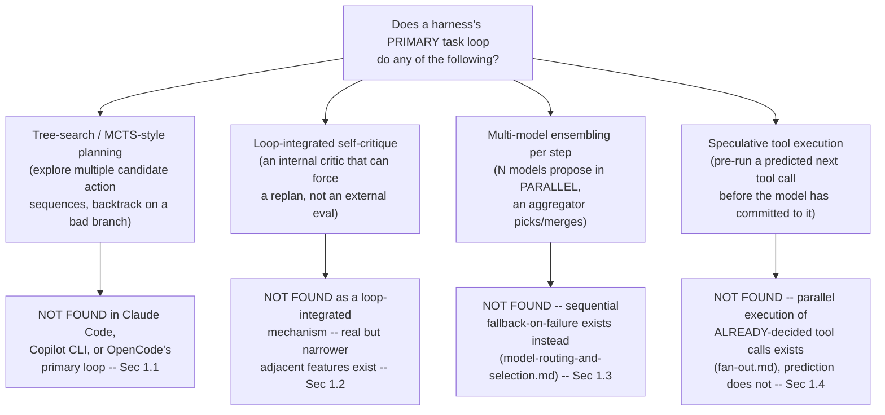
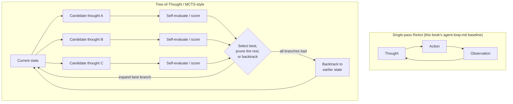
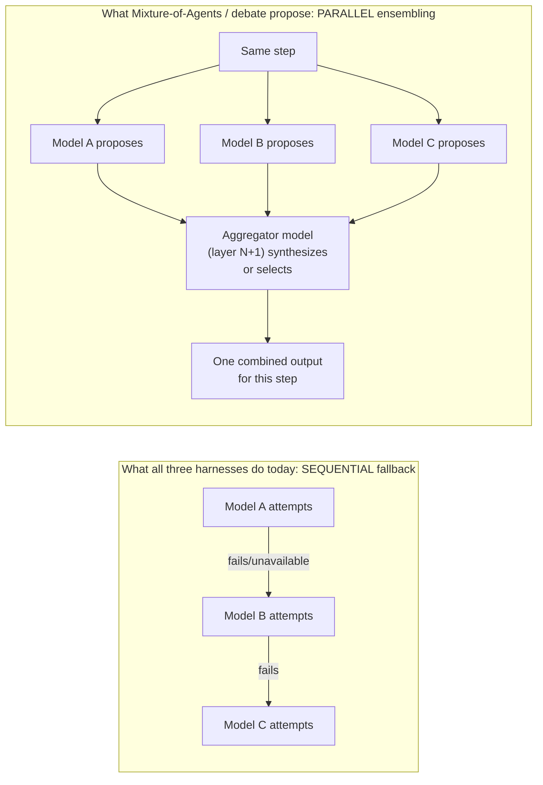

# Advanced/novel planning and execution architectures -- a design-space survey beyond single-pass ReAct

**Scope note -- read this before the rest of the page.** Every other page in
this book is a research-and-report page: it documents a mechanism a real
harness ships, tagged VERIFIED against that harness's own docs/source/
changelog. This page is deliberately a different *kind* of page. Its
starting finding, re-confirmed this session rather than assumed from the
2026-08-01 pages that first noticed it, is that **none of Claude Code,
Copilot CLI, or OpenCode implement tree-search/MCTS-style planning,
loop-integrated self-critique distinct from external evals, multi-model
ensembling per reasoning step, or speculative/predictive tool execution**
inside their primary task-solving agent loop. That is the honest,
citable result of a real search, not a rhetorical setup -- §1 below shows
the work. Because the finding is a *negative* one, the rest of the page
does something this book has not done before: it surveys the actual
design space these four mechanisms occupy in the wider agent-research
literature (arXiv papers, named frameworks), grounds each one in a
directly-fetched source the way [agent-loop.md](agent-loop.md) and
[agent-topology.md](agent-topology.md) ground general concepts in the
Hugging Face course and Anthropic's engineering blog, and then reasons
about *why* the gap plausibly exists and what a from-scratch harness
builder would need to weigh to close it. Everything past §1 that is not a
direct paper citation is tagged BEST CURRENT UNDERSTANDING -- this is
original synthesis, written for a reader trying to *surpass* the three
harnesses this book documents, not a claim about what any of the three
already does.



---

## 1. Re-confirming the gap, precisely

This section exists to do the thing the handoff note asked for explicitly:
make the "gap" claim precise and non-overlapping with what this book's own
23 prior pages already document, rather than a vague "nothing here." Each
of the four sub-claims below was re-checked this session against current
sources, and in two cases (§1.2 and §1.3's closest analogue) the check
surfaced a real, shipped, *adjacent* feature that has to be distinguished
carefully from the mechanism actually being asked about -- getting that
distinction exactly right is most of this section's value.

### 1.1 Tree-search / MCTS-style planning

VERIFIED (re-grepped this session): `github.com/anthropics/claude-code`'s
full `CHANGELOG.md` (5,534 lines, fetched via `gh api
repos/anthropics/claude-code/contents/CHANGELOG.md`) and
`github.com/github/copilot-cli`'s full `changelog.md` (2,979 lines,
fetched the same way) contain no entry naming tree search, Monte Carlo
tree search, best-first search, backtracking-based planning, or a
multi-candidate "beam" of action sequences anywhere in their documented
behavior-change history. A targeted `gh search code` for `"mcts"`,
`"tree search"`, and `"reflexion"` inside `github.com/anomalyco/opencode`
(`dev` branch) returned zero results. OpenCode's own documented agent
taxonomy (Build/Plan/General/Explore/Scout, per
[orchestration.md](orchestration.md) §3) includes a dedicated **Plan**
agent, but that is a single-pass planning *phase* preceding execution,
not a search process that explores multiple candidate plans and
backtracks on a bad one -- a real, but structurally different,
plan/act separation this book already documents elsewhere and does not
re-derive here.

### 1.2 Self-critique / reflection loops -- the one place this check found real, adjacent, shipped features

This is the sub-claim most worth stating carefully, because a naive
search would wrongly conclude "found it." Two real, first-party,
currently-shipped features surfaced this session that use the word
"critique" or perform a structurally similar review-then-decide step:

- VERIFIED (`code.claude.com/docs/en/ultrareview`, fetched this session):
  Claude Code's `/code-review ultra` (aliased `/ultrareview`) launches "a
  fleet of reviewer agents in a remote sandbox to find bugs in your
  branch or pull request," each exploring the diff "with a different
  focus" before results are "independently reproduced and verified,"
  then "combined, deduplicated, and ranked." This is genuinely
  multi-agent and genuinely about catching what a single pass misses.
- VERIFIED (`docs.github.com/en/copilot/concepts/agents/copilot-cli/
  rubber-duck`, fetched this session): Copilot CLI's rubber-duck agent is
  "consulted at high-leverage moments" -- "after planning a non-trivial
  change, but before implementing it," "during mid-implementation on
  complex work," "after writing tests," and reactively "when the main
  agent encounters repeated failures" -- deliberately using "a different
  AI model family" than the one driving the session ("the critic is less
  likely to share the same blind spots, biases, or failure modes as the
  model that produced the work"), with feedback that does **not**
  automatically loop back: "The main agent for the session decides what
  to do with the feedback." GitHub's own documentation explicitly
  characterizes this as "a second opinion," not a reflection loop.
- VERIFIED (`code.claude.com/docs/en/workflows`, already fetched and
  cited in [orchestration.md](orchestration.md) §0/§1.2, cross-referenced
  here rather than re-derived): Claude Code's bundled `/deep-research`
  workflow has "independent agents adversarially review each other's
  findings before they're reported" and "votes on each claim," filtering
  out claims that "didn't survive cross-checking."

Why none of these three counts as the Reflexion-style mechanism this
page is surveying, precisely stated: **Reflexion's own architecture**
(§2.2 below) wires self-generated verbal feedback directly into the
*acting* loop itself -- the critique is not optional, it is not
delegated to a separate model the acting agent may or may not listen to,
and it directly determines whether the same episode is retried with a
revised plan. All three Claude Code/Copilot CLI features above are
structurally different along at least one of those axes: `/ultrareview`
and rubber-duck are triggered at discrete checkpoints or on demand, run
against already-produced work (a diff, a plan, a test file) rather than
being consulted before every single action, and hand a *recommendation*
back to a model that is free to ignore it -- there is no automatic
replan-and-retry the way Reflexion's episodic memory forces one.
`/deep-research`'s voting is scoped to filtering factual claims in a
research report, not to choosing or revising the *next action* in a
coding task. This is also the precise, non-overlapping boundary against
[evals-and-testing-a-harness.md](evals-and-testing-a-harness.md): that
page's evaluator-agent pattern (§2.2 there, Anthropic's own
harness-design blog post) is explicitly an *external* correctness check
run by a harness's *builder* against a finished application, not a
mechanism the harness exposes to itself, live, mid-task, the way this
page's §2.2 describes Reflexion doing.

### 1.3 Multi-model ensembling per step

VERIFIED, cross-referencing [model-routing-and-selection.md](model-routing-and-selection.md)
§1.5/§2.4/§3.5 rather than re-deriving it: every documented multi-model
mechanism found across all three harnesses is **sequential, not
parallel** -- Claude Code's `fallbackModel` chain (up to three backup
models "tried in order" only "when the primary model is overloaded,
unavailable, or returns another non-retryable server error"), Copilot
CLI's `continueOnAutoMode` (reroutes to Auto model selection on a rate
limit, one model active at a time), and OpenCode's documented absence of
any model-switching fallback at all (retried against the *same* model
instead, per [retries.md](retries.md)). Rubber-duck (§1.2) and the
advisor tool's "capability-ranked second-opinion pairing"
([model-routing-and-selection.md](model-routing-and-selection.md) §1.6)
are each a genuine second *model* being consulted, but each is a single
second opinion at a single checkpoint, not N models proposing candidate
next-actions in parallel with an aggregation step choosing or merging
between them the way Mixture-of-Agents (§2.3 below) or multi-agent
debate (§2.3) do. No harness examined here runs two or more models
concurrently on the *same* reasoning step and combines their outputs.

### 1.4 Speculative/predictive tool execution

VERIFIED, cross-referencing [streaming-and-incremental-rendering.md](streaming-and-incremental-rendering.md)
§3.2 rather than re-deriving it: that page already states this book's
sharpest existing negative finding adjacent to this one -- "a strategy
this research found no evidence of in any of the three harnesses
examined in this book" -- but it is stated there about *speculative
JSON parsing* (attempting to parse a still-incomplete tool-call argument
string mid-stream), which is a distinct claim from *speculative tool
execution* (starting to run a tool call the model has not yet finished
deciding to make, before it commits). This page checked the latter
claim independently this session: no changelog entry in either closed-
source harness and no source hit in OpenCode's repository names
predictive pre-execution, tool-call prefetching, or a prediction cache
keyed on observed call sequences. What *does* exist in all three, and
must not be conflated with speculation, is **parallel execution of
already-decided tool calls** -- [fan-out.md](fan-out.md) documents
Claude Code's, Copilot CLI's, and OpenCode's real parallel-dispatch
mechanics (OpenCode's `FiberSet`-based concurrent fork per batched `Task`
call is the most source-precise example) -- but in every one of those
cases the model has already emitted the tool-call requests in the same
turn; nothing here executes a call *before* the model asks for it.

---

## 2. The design space: what the wider literature actually proposes

### 2.1 Tree-of-thought / best-of-N-with-a-verifier / MCTS-style planning



VERIFIED (arXiv:2305.10601, "Tree of Thoughts: Deliberate Problem Solving
with Large Language Models," Yao et al., fetched this session): Tree of
Thoughts "generalizes over the popular Chain of Thought approach" by
treating a **thought** -- "coherent units of text... that serve as
intermediate steps toward problem solving" -- as a node in a search tree
rather than one link in a single linear chain, enabling "deliberate
decision making by considering multiple different reasoning paths and
self-evaluating choices," with explicit support for "looking ahead or
backtracking when necessary to make global choices." The paper's own
headline result -- GPT-4 with chain-of-thought scores 4% on the Game of
24 puzzle, ToT scores 74% on the identical task -- is offered as a
concrete demonstration that exploration-plus-self-evaluation, not just a
longer single chain, is what closes the gap on tasks with pivotal early
decisions and no clean single-pass solution path.

VERIFIED (arXiv:2310.04406, "Language Agent Tree Search Unifies
Reasoning, Acting, and Planning in Language Models," Zhou et al.,
fetched this session): LATS is explicitly presented as "the first
general framework that synergizes" reasoning, acting, and planning by
"drawing inspiration from Monte Carlo tree search in model-based
reinforcement learning" and repurposing one LLM to play three roles at
once inside that search: the **acting agent** proposing candidate
actions, the **value function** scoring how promising a branch is, and
a **self-reflection** mechanism critiquing its own past attempts within
the same search. Crucially for a harness-relevant reading, LATS
incorporates **external environment feedback** during the search rather
than relying purely on the model's own self-judgment, reporting 92.7%
pass@1 on HumanEval with GPT-4 and, on the interactive WebShop web-agent
benchmark, a score with GPT-3.5 "comparable to gradient-based
fine-tuning" while remaining gradient-free.

VERIFIED (arXiv:2407.01476, "Tree Search for Language Model Agents," Koh
et al., fetched this session), read here specifically because it is the
one paper of this set built around *interactive agent tasks* rather than
abstract reasoning puzzles -- the closest published analogue to what a
coding/tool-using harness's own planning step would need: the paper
applies "a best-first tree search algorithm" that lets an agent
"explicitly perform exploration and multi-step planning in interactive
web environments," searching directly in the real environment (not a
simulated rollout) and explicitly supporting **backtracking** -- "agents
can recover from missteps by exploring alternative branches rather than
being locked into initial decisions," a direct structural contrast with
ReAct's commit-and-continue shape. Reported gains: a 39.7% relative
success-rate improvement on VisualWebArena (reaching 26.4%, state of the
art at publication) and 28.0% relative improvement on WebArena (19.2%),
with performance shown to scale further with more test-time search
budget -- the paper frames the approach as "complementary" to existing
agent architectures, not a fundamental redesign, which is the load-bearing
detail for §3's synthesis below.

VERIFIED (arXiv:2203.11171, "Self-Consistency Improves Chain of Thought
Reasoning in Language Models," Wang et al., fetched this session): the
simplest member of this family and the natural floor to compare tree
search against -- rather than one greedy decode, "sample a diverse set
of reasoning paths... and then select the most consistent answer by
marginalizing out the sampled reasoning paths," i.e. majority vote over
independently-sampled full attempts with no intermediate branching or
pruning at all. Reported gains of +17.9 points on GSM8K, +11.0 on
SVAMP, +12.2 on AQuA over greedy chain-of-thought establish that even
this cheapest form of "generate several, then pick" beats single-pass
generation -- the baseline every more elaborate scheme in this section
has to beat to justify its extra cost.

VERIFIED (arXiv:2305.20050, "Let's Verify Step by Step," Lightman et
al., fetched this session): names the **verifier** half of "best-of-N
with a verifier" precisely -- a **process reward model (PRM)**, trained
on step-level human annotations (the paper's own released PRM800K
dataset, 800,000 step-level labels) to score the validity of each
individual reasoning step rather than only the final answer, contrasted
directly against **outcome supervision** (reward only the final
correct/incorrect verdict). The paper's central claim, stated plainly,
is that "process supervision significantly outperforms outcome
supervision" for hard math problems (78% on a MATH test subset for the
process-supervised model), which is the direct justification for why a
tree-search-style planner would want a step-level verifier scoring each
candidate branch rather than only checking whether the final answer
looked right after the fact -- exactly the "self-evaluating choices"
role ToT and LATS both assign to their own value functions above.

### 2.2 Self-critique / reflection loops as an internal correctness mechanism

```mermaid
sequenceDiagram
    participant Env as Environment / tool results
    participant Actor as Actor (LLM, acts)
    participant Eval as Evaluator (scores the trajectory)
    participant Refl as Self-Reflection (LLM, writes verbal critique)
    participant Mem as Episodic memory buffer

    Actor->>Env: attempt trajectory (trial N)
    Env-->>Eval: outcome / scalar or free-form feedback
    Eval-->>Refl: pass/fail signal
    Refl->>Refl: generate verbal reflection\n("what went wrong, what to try differently")
    Refl->>Mem: append reflection text
    Mem-->>Actor: reflection included in context for trial N+1
    Actor->>Env: attempt trajectory (trial N+1, informed by own past failure)
```

VERIFIED (arXiv:2303.11366, "Reflexion: Language Agents with Verbal
Reinforcement Learning," Shinn et al., fetched this session): Reflexion
"reinforce[s] language agents not by updating weights, but instead
through linguistic feedback" -- an agent "verbally reflect[s] on task
feedback signals and maintain[s] their own reflective text in an
episodic memory buffer to induce better decision-making in subsequent
trials." The feedback consumed can be "scalar values or free-form
language" and can come from "external or internally simulated" sources,
and the mechanism is reported to generalize across "decision-making,
programming, and reasoning tasks" -- notably reaching "91% pass@1
accuracy on the HumanEval coding benchmark, surpassing the previous
state-of-the-art GPT-4 that achieves 80%" purely through this
retry-with-reflection loop, with no fine-tuning involved. The
architecturally load-bearing point for this page's own §1.2 boundary-
drawing: the reflection is not an optional second opinion a separate
model is free to ignore -- it is written back into the *same* agent's
own context and *directly shapes the next attempt at the same task*,
which is precisely the property none of §1.2's real, shipped
Claude-Code/Copilot-CLI features exhibit.

BEST CURRENT UNDERSTANDING, UNCONFIRMED (reasoning from LATS's own
stated design, arXiv:2310.04406, rather than a claim independently
verified against LATS's full paper text beyond its abstract): LATS's
self-reflection component is best read as Reflexion's mechanism folded
*inside* a tree search rather than run standalone across whole
independent trials -- where Reflexion reflects once a full episode ends
and retries the whole episode, LATS's reflection can inform pruning
decisions mid-search, at the level of an individual branch rather than
only at the level of a whole completed attempt. This reading is
consistent with LATS's own framing of unifying reasoning, acting, and
planning in one loop, but this page did not fetch LATS's full paper body
to confirm the mechanism at that level of detail this session, so the
claim is offered as reasoned inference from the abstract, not as a
directly-quoted architectural fact.

Multi-agent debate is a related but distinct self-correction mechanism,
worth naming here rather than folding into §2.3, because its stated
purpose is squarely about correctness rather than combining diverse
capabilities: VERIFIED (arXiv:2305.14325, "Improving Factuality and
Reasoning in Language Models through Multiagent Debate," Du et al.,
fetched this session): multiple instances of a language model "propose
answers" and then "engage in iterative critique and debate across
multiple rounds," which the paper reports both "significantly
strengthens mathematical and strategic reasoning" and "reduces
hallucinations and false statements," working with "existing black-box
models" and "identical procedures and prompts across all investigated
tasks" -- i.e. no fine-tuning or architectural access is required, only
the ability to run several independent conversations and feed each
one the others' outputs as debate turns. The paper explicitly frames
its own approach as a "society of minds," complementary to (not a
replacement for) self-consistency and verification-based methods.

### 2.3 Multi-model ensembling per step



VERIFIED (arXiv:2406.04692, "Mixture-of-Agents Enhances Large Language
Model Capabilities," Wang et al., fetched this session): MoA "constructs
a layered MoA architecture wherein each layer comprises multiple LLM
agents," and each agent in a given layer "leverages outputs from the
previous layer as context when generating its own response" -- the
proposer models are genuinely different LLMs, not repeated samples from
one model the way self-consistency (§2.1) is, and the paper's own stated
contrast is exactly this book's own §1.3 distinction: MoA harnesses "the
collective strengths of multiple LLMs" rather than one model's own
repeated attempts at self-correction. Its headline result -- an
open-source-only MoA configuration scoring 65.1% on AlpacaEval 2.0,
above GPT-4 Omni's reported 57.5% on the same benchmark -- is offered as
evidence that combining several *weaker* models' proposals can exceed
one strong model working alone, which is the central argument for why a
harness might want this per-step, not only as a whole-response
technique run once at the end.

The same multi-agent debate paper cited in §2.2 (arXiv:2305.14325) is
also relevant here from the ensembling angle, not only the correctness
angle: its "society of minds" framing is architecturally a form of
per-round ensembling across independent model instances, whether or not
those instances are literally different model *families* -- the paper's
own experiments use several instances of the same underlying model,
which is a real, cited variant of "multi-model" ensembling worth
distinguishing from MoA's cross-family layering: debate ensembles
across *independent samples*, MoA ensembles across *genuinely different
models*, and both differ from self-consistency's ensembling across
*independent samples from one model with no cross-talk between
samples at all* until the final vote.

### 2.4 Speculative/predictive tool execution

```mermaid
sequenceDiagram
    participant Model as LLM (still generating/reasoning)
    participant Spec as Speculator (predicts next tool call)
    participant Tool as Tool runtime / sandbox
    participant Loop as Agent loop

    Model->>Spec: partial trajectory so far
    Spec->>Spec: predict likely next tool call\n(pattern-matched or model-generated)
    Spec->>Tool: pre-execute predicted call speculatively
    Model->>Loop: finishes reasoning, emits actual tool call
    alt prediction matches actual call
        Loop->>Loop: use already-computed result -- latency hidden
    else prediction was wrong
        Tool->>Tool: discard speculative result\n(safe only if side-effect-free)
        Loop->>Tool: execute the real call instead -- normal latency
    end
```

VERIFIED (arXiv:2211.17192, "Fast Inference from Transformers via
Speculative Decoding," Leviathan et al., fetched this session), cited
here as the token-level ancestor of the pattern this section extends to
the tool-call level: "a smaller, efficient draft model generates
multiple token predictions in advance, whilst a larger target model
subsequently validates these candidates in parallel," with the paper's
own stated significance being that this "conceal[s] the latency
inherent in sequential decoding" while provably producing "identical
outputs" to standard decoding (a reported 2x-3x acceleration with no
retraining and no change to the output distribution). This is the exact
shape -- predict ahead, verify cheaply, commit or discard -- that the
tool-execution-level papers below transplant one level up the stack,
from individual tokens to whole tool invocations.

VERIFIED (arXiv:2603.18897, "Act While Thinking: Accelerating LLM Agents
via Pattern-Aware Speculative Tool Execution" [PASTE], fetched via
WebSearch and cross-checked this session): PASTE's own stated insight is
that "although agent requests are semantically diverse, they exhibit
stable application-level control flows (recurring tool-call sequences)
and predictable data dependencies (parameter passing between tools)" --
i.e. across many runs of a similar agent (a coding harness resolving
imports then running tests then checking a build, say), the *sequence*
of tool calls is far more predictable than the content of any single
request, which is what makes prediction tractable at all. The system
"predicts concrete future tool invocations from recurring agent
patterns and executes them speculatively while the LLM is still
generating," reporting a 43.5% reduction in average task completion
time and roughly 1.8x lower observed tool latency. A follow-up, VERIFIED
(arXiv:2604.16469, "B-PASTE: Beam-Aware Pattern-Guided Speculative
Execution for Resource-Constrained LLM Agents," located this session),
extends the same idea from speculating on a single next tool call to
"local branch hypotheses" -- a small beam of plausible next calls rather
than one guess -- under explicit resource constraints, the same
budget-vs-coverage tradeoff §3's synthesis below returns to for tree
search generally.

VERIFIED (arXiv:2607.25816, "Speculate While You Reason: Teaching Agents
to Predict Their Next Tool Call via Joint Agent-Speculator RL," fetched
this session): a materially different design choice worth flagging
against PASTE's pattern-matching approach -- rather than a *separate*
draft model, "a single model operates in dual modes: agent mode (solving
tasks) and speculator mode (predicting next tool calls from partial
trajectories)," trained via "joint agent-speculator reinforcement
learning" that "derives speculation targets from the agent's own
rollouts." The paper reports Hit@1 (the fraction of times the
speculated next call exactly matches the real one) rising from 44.1% to
61.2% on Qwen3-4B and from 48.9% to 66.3% on Qwen3.5-4B after this
training, and states plainly that the approach "fully reuses prefix KV
cache," closing what it calls the "speculator-agent alignment gap" that
a separately-trained draft model would otherwise have. VERIFIED
(arXiv:2607.23933, "SpecBox: Speculative Sandbox Scheduling for
Efficient LLM Agent Serving," fetched this session): applies the same
predict-ahead idea one layer further out, to *infrastructure* rather
than the tool call itself -- "intent-driven prewarming" (keyword
matching plus streaming semantic embeddings on the model's own
in-progress token stream to guess which sandbox a coming tool call will
need) and "context-aware prefetching" (a sandbox dependency graph used
to probabilistically forecast which sandbox environment a later agent
step will need), reporting up to 2.9x lower P99 end-to-end latency and
roughly 45.9% lower peak memory versus always keeping every sandbox
warm. Read together, PASTE/B-PASTE/"Speculate While You Reason"
speculate on *which* tool call comes next, and SpecBox speculates on
*where that call should run* -- two different points in the same
latency-hiding pipeline, both published in 2026 and both, per §1.4,
absent from all three harnesses this book documents as of this session.

---

## 3. Why the gap plausibly exists, and what closing it would cost

Everything in this section is BEST CURRENT UNDERSTANDING, UNCONFIRMED --
reasoned from this book's own prior, verified findings about how Claude
Code, Copilot CLI, and OpenCode are actually built, not stated as fact by
any source fetched this session.

**Cost multiplication is the most direct tension.** Every mechanism in
§2 trades additional model calls for a better answer: ToT/LATS/tree
search spend a multiple of single-pass token cost exploring branches
that get pruned and discarded; self-consistency and multi-agent debate
literally multiply sampling cost by the number of independent attempts;
Mixture-of-Agents multiplies it again by the number of proposer models
per layer. [Auth-and-usage-accounting.md](auth-and-usage-accounting.md)
already documents that all three harnesses meter and bill on exactly
this axis -- Claude Code's per-model OpenTelemetry cost events, Copilot
CLI's premium-request accounting, OpenCode's per-step SQL cost
accumulator -- which means every one of §2's mechanisms, if wired
directly into the default interactive loop, would multiply the metered
cost of ordinary usage by a factor most users did not opt into.
`/ultrareview`'s own documented pricing model (§1.2 -- "Ultrareview is a
premium feature that bills against usage credits rather than your
plan's included usage," roughly $5-$25 per review) is itself indirect,
first-party evidence for this exact tension: the one Claude Code feature
that *does* run a multi-agent, review-style process is explicitly
opt-in, separately billed, and run only on demand -- never folded into
the default per-turn loop the way this page's §2 mechanisms would need
to be to count as "per-step."

**Latency is a second, independent tension specific to an interactive
CLI product, not a batch research benchmark.** Every paper in §2.1-§2.3
is evaluated offline, against a fixed benchmark, where wall-clock time
per task is a reported metric rather than something a human is watching
in real time. [Streaming-and-incremental-rendering.md](streaming-and-incremental-rendering.md)
documents, across all three harnesses, a substantial, sustained
engineering investment specifically in making a *single* model response
feel responsive as it streams -- Claude Code's 100ms delta-coalescing
tuned for CPU cost, its synchronized-terminal-output flicker fixes,
OpenCode's client-side typewriter-pacing algorithm explicitly built to
*decouple perceived reveal rate from network delivery cadence*. A tree
search or a debate round that silently multiplies time-to-first-useful-
output by 3-5x before the user sees anything is in direct tension with
that entire body of documented engineering effort, which is optimized
for a human watching one model think, not for a background batch
process where nobody is watching until it finishes.

**Determinism and debuggability favor the single-path shape these
harnesses already lean toward.** [Permissions-and-sandboxing.md](permissions-and-sandboxing.md)
§1.4 documents Claude Code's auto-mode permission classifier as a
carefully-scoped, single deterministic decision pipeline precisely
because prompt-fatigue and trust boundaries are easier to reason about
with one clear decision path than with several candidate branches being
explored and discarded. A tree-search planner that tries three
approaches, prunes two, and backtracks once already fits awkwardly
against a permission model built around "does this one proposed action
get approved, yes or no" -- every pruned branch that involved a
write-class or shell-class tool call (per
[built-in-tools.md](built-in-tools.md)'s permission-"kind" vocabulary)
would need its own permission decision and its own possible side
effect, unless the search is restricted to read-only exploration, which
is a real design constraint §2.1's papers do not have to solve because
their benchmark environments (math puzzles, sandboxed web pages) rarely
distinguish reversible from irreversible actions the way a real
filesystem and shell do.

**This is the sharpest, most concrete instance of that last point, and
the reason §1.4's finding is probably not an oversight:** speculative
tool execution is only safe to *commit* automatically for
side-effect-free calls. [Built-in-tools.md](built-in-tools.md) already
documents Copilot CLI's own permission-"kind" taxonomy distinguishing
`read`/`url` calls from `write`/`shell` calls precisely along this
axis. Pre-running a predicted `read`-kind tool call (per PASTE/§2.4)
while the model is still reasoning is low-risk -- worst case, the
prediction is wrong and the speculative result is silently discarded,
exactly as speculative decoding discards a rejected draft token.
Pre-running a predicted `write`- or `shell`-kind call before the model
has actually committed to it is a different risk category entirely: a
misprediction there does not just waste compute, it can execute a real
side effect (a file write, a shell command) the model never asked for.
None of the four speculative-tool-execution papers in §2.4 evaluate
against a harness with a permission-gating architecture as granular as
the ones [permissions-and-sandboxing.md](permissions-and-sandboxing.md)
documents across all three products in this book; a from-scratch
harness adopting this pattern would need to restrict speculation to the
`read`/`url` permission kinds as a hard architectural rule, not an
afterthought, before it could safely extend the idea to `write`/`shell`
calls at all.

---

## 4. A sketch for a from-scratch harness that adopted these mechanisms

This section is explicitly speculative design synthesis, written for
the "surpassing existing implementations" end of this book's own stated
learning arc, mapped onto the vocabulary this book has already
established rather than invented fresh. None of it describes an
existing product.

**Tree-search planning as an alternate control-flow layer, not a
wholesale replacement for the ReAct loop.** [Agent-loop.md](agent-loop.md)'s
Thought/Action/Observation while-loop and [orchestration.md](orchestration.md)'s
documented "who holds the plan" mechanisms (Claude Code's Dynamic
workflows' script-held plan, in particular) are architecturally closer
to a scaffold this pattern could slot into than a green-field build
would be: a Workflow-tool-style script already externalizes control flow
outside the model's own turn-by-turn decisions per that page's own
findings, which is exactly the property a tree-search driver needs --
something *outside* the acting model deciding which branch to expand
next, scoring branches (per §2.1's value-function role), and only handing
the winning branch's actions to the permission-gated execution layer
[permissions-and-sandboxing.md](permissions-and-sandboxing.md) already
documents. The 2407.01476 paper's own framing -- tree search as
"complementary" to, not a replacement for, existing agent architectures
-- suggests the right integration point is narrow and selective: reserve
search for specific high-stakes steps (an ambiguous initial plan, a
failed test with several plausible root causes) rather than wrapping
every single tool call in a search, which §3's cost/latency tensions
make prohibitive if applied unconditionally.

**A genuinely loop-integrated critic, distinguished from `/ultrareview`
and rubber-duck by being mandatory and pre-emptive rather than optional
and post-hoc.** [Hooks-lifecycle-extensibility.md](hooks-lifecycle-extensibility.md)
already documents the closest existing scaffold across two harnesses --
Claude Code's `PostToolUse` hook and OpenCode's source-verified
`tool.execute.after` hook function, both of which already run
synchronously after a tool call completes and, per that page's own
findings, can influence what happens next. A Reflexion-style critic
wired through exactly that hook point -- scoring the just-completed
step's result against the task's stated goal, and, on a bad score,
forcing a genuine replan rather than merely logging a warning -- would
close the specific gap §1.2 identifies: unlike `/ultrareview`'s
post-hoc, whole-diff review or rubber-duck's advisory-only second
opinion, a hook-wired critic sits *inside* the loop's own control flow
by construction, the same way the hook mechanism already sits inside
that control flow for permission and audit purposes today.

**Multi-model ensembling as an extension of fan-out's existing parallel-
dispatch machinery, with an aggregation step Mixture-of-Agents already
names.** [Fan-out.md](fan-out.md) already documents genuinely parallel
dispatch mechanics in all three harnesses -- OpenCode's `FiberSet`-based
concurrent fork being the most source-precise -- but every documented
use of that machinery fans out to *sub-tasks*, not to *several models
proposing an answer to the same step*. Reusing the identical dispatch
primitive to launch N models against the same prompt, then routing their
N outputs into one additional aggregator call structured the way MoA's
own layered design does (§2.3), would not require new infrastructure so
much as a new *use* of infrastructure this book's [fan-out.md](fan-out.md)
already shows all three harnesses have.

**Speculative tool execution gated strictly by the permission-kind
boundary §3 already argues is load-bearing.** A from-scratch harness
adopting PASTE's pattern-matching approach (§2.4) would want to mine its
own [session-persistence.md](session-persistence.md)-documented
transcript store for recurring tool-call sequences -- exactly the kind
of durable, structured history OpenCode's SQLite-backed session store
already provides as raw material, per that page's own findings -- to
build the sequence-prediction model PASTE's own paper describes, then
restrict automatic speculative commits to `read`/`url`-kind tool calls
only, falling back to normal (non-speculative) execution for anything
`write`/`shell`-kind until the harness's own permission architecture has
an explicit "speculative dry-run, confirm before any side effect lands"
mode that none of the three products this book documents currently
have a documented equivalent of.

---

## 5. Synthesis

| Mechanism | Canonical source(s) | Found in Claude Code / Copilot CLI / OpenCode's primary loop? | Closest real, shipped, but distinct feature | Where the boundary is drawn |
|---|---|---|---|---|
| Tree-of-thought / best-of-N-with-verifier / MCTS-style planning | ToT (arXiv:2305.10601), LATS (arXiv:2310.04406), Tree Search for LM Agents (arXiv:2407.01476), self-consistency (arXiv:2203.11171), process reward models (arXiv:2305.20050) | Not found in any of the three (§1.1) | OpenCode's single-pass Plan agent (orchestration.md §3) | Plan/act separation, not search-with-backtracking over multiple candidate plans |
| Self-critique / reflection loop, internal | Reflexion (arXiv:2303.11366), multi-agent debate (arXiv:2305.14325), LATS's own reflection component | Not found as a mandatory, loop-integrated mechanism (§1.2) | Claude Code's `/ultrareview`, Copilot CLI's rubber-duck, `/deep-research`'s claim-voting | Checkpoint/on-demand, advisory-only, or scoped to fact-checking a report -- never mandatory, pre-emptive, and directly forcing a replan of the current task |
| Multi-model ensembling per step | Mixture-of-Agents (arXiv:2406.04692), multi-agent debate (arXiv:2305.14325) | Not found (§1.3) | `fallbackModel`/`continueOnAutoMode` sequential fallback (model-routing-and-selection.md); rubber-duck/advisor tool single second opinion | Sequential, one-model-active-at-a-time vs. N models proposing in parallel with an aggregation step |
| Speculative/predictive tool execution | Speculative decoding (arXiv:2211.17192, token-level ancestor), PASTE (arXiv:2603.18897), B-PASTE (arXiv:2604.16469), "Speculate While You Reason" (arXiv:2607.25816), SpecBox (arXiv:2607.23933) | Not found (§1.4) | Parallel execution of already-decided calls (fan-out.md); no speculative JSON-parsing either (streaming-and-incremental-rendering.md §3.2) | Pre-executing a call the model has already emitted vs. pre-executing one the model has not yet committed to |

**The design lesson.** Every mechanism surveyed in §2 is real, published,
and reports genuine gains against the specific benchmarks its own paper
evaluates against -- this page's finding is not "these ideas don't
work," it is "none of the three production coding harnesses this book
documents have adopted them into their default, per-step, interactive
loop," and §3 gives reasoned, harness-architecture-grounded reasons why
that adoption gap is plausible rather than accidental: cost metering
that bills per model call, a UX investment specifically tuned around one
streaming model response rather than a background batch search, a
permission architecture built around single deterministic decisions, and
-- for speculative execution specifically -- a genuine safety
distinction between side-effect-free and side-effect-bearing tool kinds
that the published speculative-execution papers do not have to solve
because their own evaluation environments rarely draw that line as
sharply as a real shell and filesystem do. A builder aiming to actually
surpass these three harnesses, per this book's own stated "zero to hero"
arc, has a concrete, citable place to start: §4's four sketches each
reuse an architectural primitive this book has already documented in
one of the three harnesses (a script-held plan, a post-tool-call hook, a
parallel-dispatch primitive, a durable transcript store) rather than
requiring an entirely new kind of infrastructure -- the gap this page
documents is a gap in *composition*, primarily, not in raw capability
any of the three harnesses lacks outright.

---

## Sources

All fetched fresh this session (2026-08-17) unless noted otherwise.

**Re-confirming the gap (§1) -- authoritative for each harness's own
documented/source-verified/changelog-recorded behavior only:**
- `github.com/anthropics/claude-code` `CHANGELOG.md`, fetched via `gh api
  repos/anthropics/claude-code/contents/CHANGELOG.md` (full 5,534-line
  file), grepped for `reflect`, `critique`, `ensemble`, `speculative`,
  `tree search`, `monte carlo`, `mcts`, `best-of`, `verifier`,
  `self-consist`, and separately for `candidate`/multi-attempt language
  -- covers §1.1, §1.3, §1.4's negative findings and surfaces the
  `/ultrareview` and `/deep-research`-adjacent entries used in §1.2.
- `github.com/github/copilot-cli` `changelog.md`, fetched via `gh api
  repos/github/copilot-cli/contents/changelog.md` (full 2,979-line
  file), grepped the same way -- covers §1.1, §1.3, §1.4's negative
  findings and surfaces the rubber-duck entries used in §1.2.
- `gh search code` against `github.com/anomalyco/opencode` (`dev`
  branch) for `mcts`, `tree search`, `self-critique`, `speculative`,
  `ensemble`, `reflexion` -- all zero results, covering §1.1/§1.3/§1.4
  for OpenCode.
- `code.claude.com/docs/en/ultrareview` -- full page fetched, covers
  §1.2's `/ultrareview` mechanics (fleet review, independent
  verification, dedup/rank, opt-in premium pricing cited in §3).
- `docs.github.com/en/copilot/concepts/agents/copilot-cli/rubber-duck`
  -- fetched, covers §1.2's rubber-duck mechanics (checkpoints,
  cross-model critic, advisory-only feedback, GitHub's own "second
  opinion, not a reflection loop" framing).
- `code.claude.com/docs/en/workflows`, previously fetched and cited in
  [orchestration.md](orchestration.md) §0/§1.2, cross-referenced (not
  re-fetched) for `/deep-research`'s claim-voting/adversarial-review
  mechanics used in §1.2.
- Cross-referenced, not re-derived: [model-routing-and-selection.md](model-routing-and-selection.md)
  §1.5/§2.4/§3.5 (§1.3's sequential-fallback finding),
  [streaming-and-incremental-rendering.md](streaming-and-incremental-rendering.md)
  §3.2 (§1.4's speculative-JSON-parsing negative finding, distinguished
  from speculative tool execution), [fan-out.md](fan-out.md) (§1.4's
  parallel-already-decided-calls finding), and
  [evals-and-testing-a-harness.md](evals-and-testing-a-harness.md) §2.2
  (the external-evaluator-vs-internal-critic boundary drawn in §1.2).

**The design-space survey (§2) -- academic preprints, cited directly for
their own content, general agent-research literature rather than a claim
about any specific harness:**
- arXiv:2305.10601, "Tree of Thoughts: Deliberate Problem Solving with
  Large Language Models," Yao et al. -- §2.1.
- arXiv:2310.04406, "Language Agent Tree Search Unifies Reasoning,
  Acting, and Planning in Language Models" (LATS), Zhou et al. --
  §2.1, §2.2.
- arXiv:2407.01476, "Tree Search for Language Model Agents," Koh et
  al. -- §2.1.
- arXiv:2203.11171, "Self-Consistency Improves Chain of Thought
  Reasoning in Language Models," Wang et al. -- §2.1.
- arXiv:2305.20050, "Let's Verify Step by Step," Lightman et al. --
  §2.1.
- arXiv:2303.11366, "Reflexion: Language Agents with Verbal
  Reinforcement Learning," Shinn et al. -- §2.2.
- arXiv:2305.14325, "Improving Factuality and Reasoning in Language
  Models through Multiagent Debate," Du et al. -- §2.2, §2.3.
- arXiv:2406.04692, "Mixture-of-Agents Enhances Large Language Model
  Capabilities," Wang et al. -- §2.3.
- arXiv:2211.17192, "Fast Inference from Transformers via Speculative
  Decoding," Leviathan et al. -- §2.4 (token-level ancestor, not an
  agent-harness paper -- cited for the general predict-then-verify
  pattern only).
- arXiv:2603.18897, "Act While Thinking: Accelerating LLM Agents via
  Pattern-Aware Speculative Tool Execution" (PASTE) -- §2.4.
- arXiv:2604.16469, "B-PASTE: Beam-Aware Pattern-Guided Speculative
  Execution for Resource-Constrained LLM Agents" -- §2.4.
- arXiv:2607.25816, "Speculate While You Reason: Teaching Agents to
  Predict Their Next Tool Call via Joint Agent-Speculator RL" -- §2.4.
- arXiv:2607.23933, "SpecBox: Speculative Sandbox Scheduling for
  Efficient LLM Agent Serving" -- §2.4.

**§3-§4 (why the gap exists; a from-scratch synthesis sketch)** are this
page's own reasoned synthesis, tagged BEST CURRENT UNDERSTANDING,
UNCONFIRMED throughout, built on the verified findings above plus
cross-references to [auth-and-usage-accounting.md](auth-and-usage-accounting.md),
[permissions-and-sandboxing.md](permissions-and-sandboxing.md),
[built-in-tools.md](built-in-tools.md),
[hooks-lifecycle-extensibility.md](hooks-lifecycle-extensibility.md),
[orchestration.md](orchestration.md), [fan-out.md](fan-out.md), and
[session-persistence.md](session-persistence.md) -- none of those five
pages was re-fetched this session; their prior, already-cited findings
are reused as-is.
