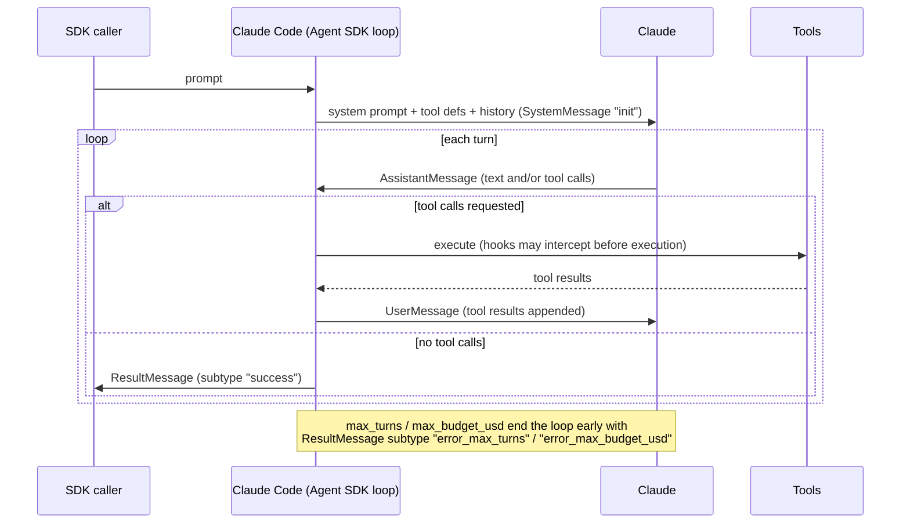
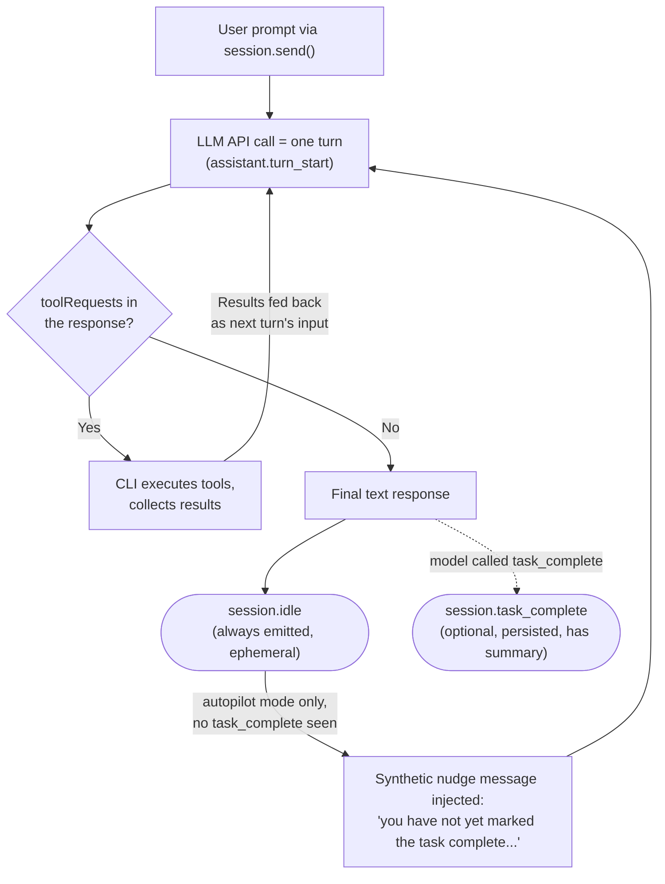
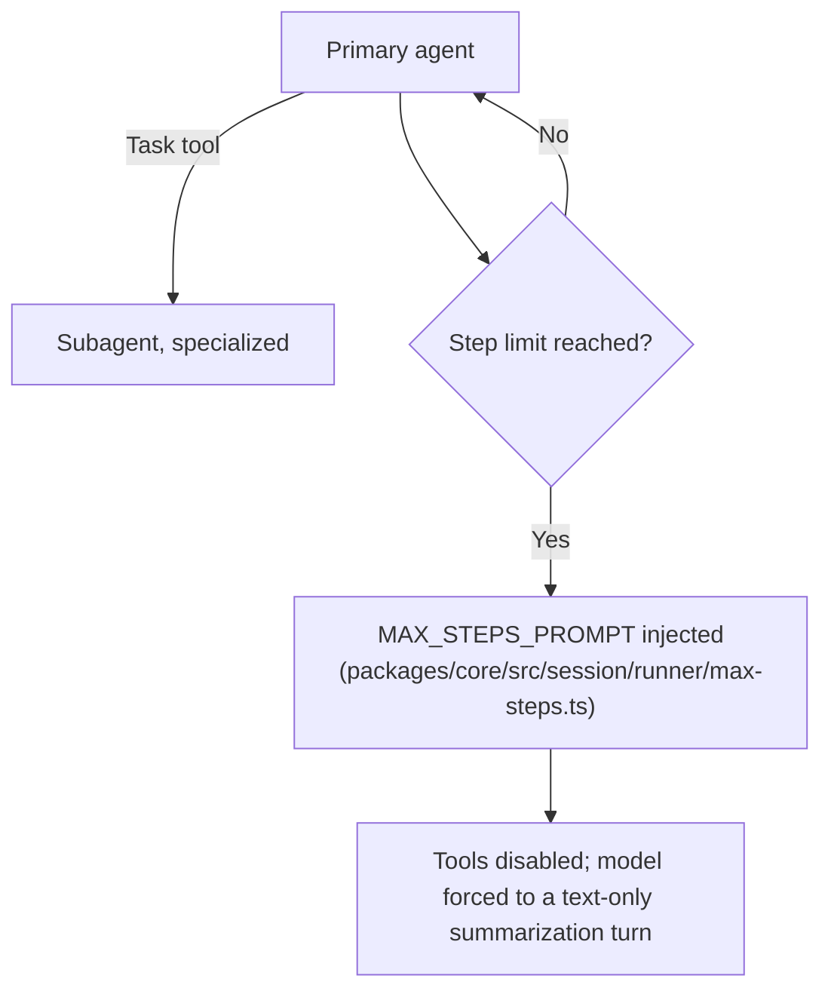

# Agent loop: Claude Code, GitHub Copilot CLI, and OpenCode, and how to verify each

**Scope note.** [agent-loop.md](agent-loop.md) is deliberately general-concepts
only (Thought/Action/Observation, ReAct, stop-and-parse) and holds no
harness sections on purpose. This page is the harness-specific
companion: what Claude Code, Copilot CLI, and OpenCode each
document/implement about their own loop, and -- per AUTHORITY OVERREACH
discipline -- no harness's mechanism is assumed to describe another's.
Added 2026-08-24: a Copilot CLI section, closing a real gap this page
previously left (it originally covered only two of the book's three
target harnesses); the Claude Code and OpenCode sections below are
unchanged from the original 2026-07-30 write.

## 1. Claude Code (Agent SDK docs)

VERIFIED (`code.claude.com/docs/en/agent-sdk/agent-loop`, fetched
2026-07-30): the SDK "runs the same execution loop that powers Claude
Code." The loop-at-a-glance is five stages: **receive prompt** (system
prompt, tool definitions, conversation history all present from the
start; SDK yields a `SystemMessage` subtype `"init"`); **evaluate and
respond** (Claude may respond with text, request tool calls, or both;
SDK yields an `AssistantMessage`); **execute tools** (SDK runs each
requested tool, results feed back to Claude; hooks can intercept
before execution); **repeat** (steps 2-3 cycle; "each full cycle is one
turn"); **return result** (a final text-only `AssistantMessage`
followed by a `ResultMessage` with usage/cost/session ID).

VERIFIED (same page): the stop condition is explicit -- "Turns continue
until Claude produces output with no tool calls, at which point the
loop ends." Two hard caps exist independent of that natural stop:
`max_turns`/`maxTurns` (counts tool-use turns only) and
`max_budget_usd`/`maxBudgetUsd` (spend threshold, and it "covers
subagents: their spend counts toward the total"). Hitting either cap
yields a `ResultMessage` with `subtype: "error_max_turns"` or
`"error_max_budget_usd"` instead of `"success"` -- the loop does not
silently truncate, it reports which limit ended it.

VERIFIED (same page): tool results are appended as a `UserMessage`
"with the tool result content sent back to Claude" -- mechanically
the same append-to-context shape the Hugging Face course describes
generically in [agent-loop.md](agent-loop.md) section 2, now with
Claude-Code-specific naming (`UserMessage`, not "Observation"). The
context window "does not reset between turns within a session";
compaction (summarizing older history) is the documented mechanism for
when it approaches the limit, emitting `subtype: "compact_boundary"`.

VERIFIED (same page): parallel tool execution is real but
selective -- "Read-only tools ... can run concurrently. Tools that
modify state (like Edit, Write, and Bash) run sequentially to avoid
conflicts." Custom tools default to sequential unless annotated
`readOnlyHint`.

**Where to verify further, for Claude Code specifically:** this Agent
SDK page is documentation of a *product surface* (the SDK you can
build on), not published source code -- Claude Code itself is closed
source (per this skill's own SOURCE AUTHORITY rules,
`github.com/anthropics/claude-code` is authoritative only for its
CHANGELOG/README/examples/plugins/Issues, never for internal
implementation). If a claim needs to go deeper than what this docs
page states, the honest answer is "not independently verifiable from a
public source" -- do not fill that gap with OpenCode's or any other
harness's mechanism.

## 2. GitHub Copilot CLI

**Source and authorship note.** Copilot CLI is closed source, and
`docs.github.com/copilot` -- checked this session -- publishes no
dedicated agent-loop page for it (unlike Claude Code's Agent SDK docs
above). The grounding for this section is instead
`github.com/github/copilot-sdk`'s own `docs/features/agent-loop.md` and
`docs/features/session-limits.md` (fetched via `gh api` 2026-08-24) --
the Copilot SDK, a separate, adjacent client-library product this book
already treats cautiously elsewhere (`llm-api-contract.md` §3.2,
`session-persistence.md` §2: consistent-with-but-not-proof-of the CLI's
internal behavior). This particular document is a stronger source than
those two prior citations, though, because it explicitly assigns the
loop's authorship to the CLI rather than to itself: "The **SDK** is a
transport layer -- it sends your prompt to the **Copilot CLI** over
JSON-RPC and surfaces events back to your app. The **CLI** is the
orchestrator that runs the agentic tool-use loop, making one or more
LLM API calls until the task is done." That sentence is treated here as
VERIFIED evidence about the CLI's own loop shape, not the SDK's --
while still flagging, honestly, that no first-party
`docs.github.com`/`github.com/github/copilot-cli` page independently
corroborates it this session.

VERIFIED (`copilot-sdk` `docs/features/agent-loop.md`): a **turn** is
defined precisely as one LLM API call and its consequences -- "1. The
CLI sends the conversation history to the LLM. 2. The LLM responds
(possibly with tool requests). 3. If tools were requested, the CLI
executes them. 4. `assistant.turn_end` is emitted." The model sees the
**full conversation history** on every call (system prompt, user
message, and all prior tool calls/results) -- mechanically the same
append-to-context shape [agent-loop.md](agent-loop.md) describes
generically and [agent-loop-implementations.md](#1-claude-code-agent-sdk-docs)
§1 documents for Claude Code's own `UserMessage`-appended tool results.
The doc states plainly: "each iteration of this loop is exactly one LLM
API call... there are no hidden calls" for planning, evaluation, or
completion-checking -- a specific, falsifiable claim about the absence
of any separate deliberation step, offered as a documented worked
example: a search-heavy question can take four turns (grep/glob, read,
read-more, final no-tool-request answer) before the loop naturally
ends.

VERIFIED (same doc): the loop's natural stop condition is model-driven,
not harness-driven -- "The CLI is purely mechanical: 'model asked for
tools -> execute -> call model again.' The **model** is the
decision-maker for when to stop." A turn with no `toolRequests` in the
response ends the loop and emits `session.idle`.

VERIFIED (same doc): **two separate completion signals** exist, and the
doc is explicit that they carry different guarantees, not synonyms.
`session.idle` is always emitted when the tool-use loop ends, is
ephemeral (not persisted to disk, not replayed on resume), and means
only "the agent has stopped processing" -- a mechanical signal. This is
the recommended "done" signal for a caller (the SDK's `sendAndWait()`
blocks on it). `session.task_complete` is optional -- it requires the
model to explicitly call a `task_complete` tool -- is persisted to the
session's event log, carries an optional `summary` field, and means the
*model itself* considers the overall task fulfilled: a semantic signal
the harness cannot manufacture on the model's behalf.

VERIFIED (same doc): **autopilot mode** (the headless/autonomous mode
this book's [tui-cli-application-architecture.md](tui-cli-application-architecture.md)
§2 documents as one stop on Copilot CLI's mode-cycling `Shift+Tab`
wheel, not re-described here) turns that optional signal into a second,
harness-enforced completion gate. If the tool-use loop ends without the
model having called `task_complete`, the CLI "injects a synthetic user
message nudging the model": *"You have not yet marked the task as
complete using the task_complete tool. If you were planning, stop
planning and start implementing. You aren't done until you have fully
completed the task."* That synthetic message is read by the model as an
ordinary new user turn, which restarts the tool-use loop -- structurally
the same "inject a system-level instruction into the message stream to
force one more model turn" shape OpenCode's step-limit prompt injection
uses below (§3), though the *triggering condition* is the inverse: OpenCode
injects on a step-count ceiling being *reached*, Copilot CLI's autopilot
injects on a specific completion signal being *absent*. The same doc
documents the nudge's own anti-premature-completion guidance (don't call
`task_complete` with open questions, an unresolved error, or remaining
steps), producing what it calls a **two-level completion mechanism** in
autopilot: the model calls `task_complete` and the CLI reports
`session.task_complete`, or the model stops without it and gets nudged
back into the loop. In ordinary interactive mode, per the same doc, the
CLI issues no such nudge and `task_complete` may simply never appear
(conversational Q&A, model discretion, or an interrupted session) --
`session.idle` still fires regardless, because it is mechanical, not
semantic.

VERIFIED (`copilot-sdk` `docs/features/session-limits.md`, fetched via
`gh api` 2026-08-24): Copilot CLI has no documented hard turn-count cap
analogous to Claude Code's `max_turns` (§1 above). What it has instead
is a **soft, spend-denominated** cap -- `sessionLimits.maxAiCredits`,
forwarded by the SDK to the CLI at session creation/resume -- and the
doc is explicit that it is checked *after* a model call returns rather
than before one is dispatched: "Usage is checked after model calls
return, so one response can exceed the configured value before the
runtime blocks the next model call." Hitting it does not silently end
the loop the way Claude Code's `max_budget_usd` cap does; it raises a
`session_limits_exhausted.requested` event that "needs a user decision
before continuing" (resolved via a `session_limits_exhausted.completed`
event carrying the user's chosen action) -- a pause-for-a-decision
mechanism, not a hard stop, and this page cross-references rather than
re-derives [auth-and-usage-accounting.md](auth-and-usage-accounting.md)
as the fuller home for Copilot CLI's broader budget/cost-accounting
picture. Separately, this book's
[hooks-lifecycle-extensibility.md](hooks-lifecycle-extensibility.md) §2
already documents a changelog-verified, *loop-runaway* guard distinct
from both of the above: an `agentStop` hook that always returns "block"
no longer loops indefinitely -- the CLI ends the turn after **8
consecutive blocks** -- cross-referenced here, not repeated, because it
guards the hook-interception layer around the loop rather than the
loop's own turn-counting.

**Where to verify further, for Copilot CLI specifically:** the same
caveat this page states for Claude Code applies here with equal force
-- Copilot CLI itself ships no public source, so `agent-loop.md`'s
description of "the CLI is the orchestrator" is documentation of a
*product surface* (the SDK's own account of CLI behavior), not
independently cross-checkable source code. `github.com/github/copilot-sdk`
does ship real, public source for its own client bindings (TypeScript,
Python, Go, .NET, Java, Rust), but that is the JSON-RPC *client*, not
the CLI process's internal loop implementation -- do not conflate
"the SDK's source is public" with "the CLI's loop is independently
verifiable," and do not assume Claude Code's or OpenCode's own
loop-ending mechanics (below) apply here without a Copilot-specific
citation.

## 3. OpenCode

BEST CURRENT UNDERSTANDING, UNCONFIRMED (`opencode.ai/docs/`, the
top-level docs page, fetched 2026-07-30): this page covers install,
config, and basic usage, and explicitly does not describe loop
mechanics -- confirmed by fetching it directly and finding no such
content, not assumed absent.

VERIFIED (`opencode.ai/docs/agents/`, fetched 2026-07-30): OpenCode
distinguishes **primary agents** ("the main assistants you interact
with directly") from **subagents** ("specialized assistants that
primary agents can invoke for specific tasks"), invoked via a `Task`
tool ("invoke the Task tool"). Tool access is governed by a
permissions framework per agent: "Allow all operations without
approval," an `ask` mode, or "Disable the tool" entirely.

VERIFIED (same page): there is a documented step limit distinct from
Claude Code's turn/budget caps. "When the limit is reached, the agent
receives a special system prompt instructing it to respond with a
summarization of its work" -- i.e. the stop condition is enforced by
injecting a system prompt, not just truncating the stream.

VERIFIED (`github.com/anomalyco/opencode`, `dev` branch, fetched via
`gh api` 2026-07-30 -- flagging per this skill's own caveat that `dev`
is not a stable release tag): the exact prompt text lives in
`packages/core/src/session/runner/max-steps.ts`, exported as
`MAX_STEPS_PROMPT`:

> "CRITICAL - MAXIMUM STEPS REACHED / The maximum number of steps
> allowed for this task has been reached. Tools are disabled until
> next user input. Respond with text only." ... "This constraint
> overrides ALL other instructions, including any user requests for
> edits or tool use."

This is a real, currently-live implementation detail (not a docs
paraphrase) confirming the docs page's claim mechanically: the loop's
hard stop is a hard-coded prompt injected into the same message
stream the model reads, forcing a text-only turn.

**Where the loop implementation actually lives, for further
verification:** `packages/core/src/session/` is the real directory,
confirmed live via `gh api repos/anomalyco/opencode/contents/...` this
session -- specifically `session/runner/` (`index.ts`, `llm.ts`,
`max-steps.ts`, `model.ts`, `to-llm-message.ts`), `session/execution.ts`
and `session/execution/`, `session/compaction.ts`,
`session/run-coordinator.ts`. This session only opened
`max-steps.ts` directly; `runner/index.ts` and `execution.ts` are the
next files to read for the turn-by-turn control flow itself (message
send, tool-call parse, result append) -- BEST CURRENT UNDERSTANDING
that these are the right files, based on their names and directory
position, not yet read this session. Because OpenCode is genuinely
open-source (unlike Claude Code and Copilot CLI), this is the one
harness of the three where "go read the loop" is a literal, actionable
instruction rather than a dead end.

## 4. Comparison

All three document the same shape at the level the Hugging Face course
teaches generically -- evaluate, act, observe, repeat, stop when the
model stops requesting tools or a hard limit is hit. Three concrete
differences, all VERIFIED from each harness's own source above:

- **Stop enforcement mechanism.** Claude Code's hard caps
  (`max_turns`, `max_budget_usd`) end the loop from the *harness side*
  and report a distinct `ResultMessage` subtype -- no further model
  turn happens. OpenCode's step limit ends the loop from *inside the
  model's own next turn*: a system prompt is injected demanding a
  text-only summarization response, so there is one more model call
  after the limit is hit, not zero. Copilot CLI's ordinary stop
  condition is purely model-driven (a turn produces no `toolRequests`,
  the loop ends, `session.idle` fires) with no turn-count cap
  documented at all; its **autopilot** mode adds a conditional
  reinjection mechanism structurally closer to OpenCode's than to
  Claude Code's -- a synthetic user message forces one more model turn
  -- but triggered by the *absence* of an explicit `task_complete`
  signal rather than by a step counter reaching zero.
- **Budget/limit shape.** Claude Code's `max_budget_usd` is a hard,
  pre-emptively-enforced spend cap that ends the loop outright.
  Copilot CLI's nearest analogue, `sessionLimits.maxAiCredits`, is
  softer on two axes at once: it is checked only *after* a model call
  returns (so one call can overshoot it) and, on exhaustion, raises an
  event requiring a user decision rather than silently ending the run.
  OpenCode's step limit is shaped like a turn-count cap rather than a
  spend cap, and (per its own stop-enforcement behavior above) never
  produces a hard stop with zero further model calls the way Claude
  Code's caps do.
- **Verifiability.** Claude Code's and Copilot CLI's loops are each
  knowable only through what their respective companies choose to
  document (the Agent SDK page for Claude Code; the separate Copilot
  SDK's own docs, which explicitly attribute the loop to the CLI, for
  Copilot CLI) -- neither has a public implementation to cross-check
  the claim against. OpenCode's is knowable two ways that can be
  checked against each other: the docs page's claim and the actual
  `max-steps.ts` source, which is what this page did for OpenCode
  specifically.

BEST CURRENT UNDERSTANDING, UNCONFIRMED: whether OpenCode has an
analogue to Claude Code's budget cap (`max_budget_usd`) or to its
read-only-vs-mutating parallel tool execution split -- neither was
seen in the pages/files fetched this session; would need
`session/execution.ts` and the permission-framework docs read directly
before claiming either way. Likewise UNCONFIRMED: whether Copilot CLI
has any hard, harness-side turn-count cap at all distinct from the
soft `maxAiCredits` spend cap and the `agentStop`-hook 8-consecutive-
block guard documented above -- no such cap was found in the Copilot
SDK docs or the CLI's own changelog fetched this session, which is
"not found," not "proven absent."

## Sources

- `code.claude.com/docs/en/agent-sdk/agent-loop` -- fetched 2026-07-30.
  Authoritative for the Claude Code Agent SDK's documented loop
  behavior (stages, message types, turn/budget caps, compaction,
  parallel tool execution). Not a claim about internal implementation
  Anthropic hasn't published.
- `github.com/github/copilot-sdk`, `docs/features/agent-loop.md` and
  `docs/features/session-limits.md`, fetched via `gh api` 2026-08-24.
  Authoritative for the Copilot SDK's own documented description of
  Copilot CLI's tool-use loop (turn definition, `session.idle` vs.
  `session.task_complete`, autopilot's nudge mechanism) and its
  AI-Credits session-limit mechanism. An adjacent-product source, not
  Copilot CLI's own first-party docs -- flagged as such throughout §2
  -- because `docs.github.com/copilot` publishes no dedicated
  agent-loop page for the CLI as of this session's check.
- `github.com/github/copilot-cli` `changelog.md`, fetched via `gh api`
  2026-08-24 -- cross-referenced for the `agentStop`-hook
  8-consecutive-block cap already documented in
  [hooks-lifecycle-extensibility.md](hooks-lifecycle-extensibility.md),
  and checked (with no relevant hits) for any documented hard turn- or
  step-count cap on the main loop itself.
- `opencode.ai/docs/agents/` and `opencode.ai/docs/` -- fetched
  2026-07-30. Authoritative for OpenCode's documented agent/subagent
  model, permissions framework, and the existence of a step limit.
- `github.com/anomalyco/opencode`, `dev` branch, via `gh api` --
  fetched 2026-07-30 (directory listings of `packages/core/src`,
  `packages/core/src/session`, `packages/core/src/session/runner`, and
  the full contents of `max-steps.ts`). Authoritative for OpenCode's
  real implementation, with the standing caveat that `dev` is not a
  stable release tag and may not match the current stable release.
- Hugging Face Agents Course -- see [agent-loop.md](agent-loop.md)'s
  own Sources section; used here only for the shared vocabulary this
  page maps onto, not re-cited as harness-specific evidence.
