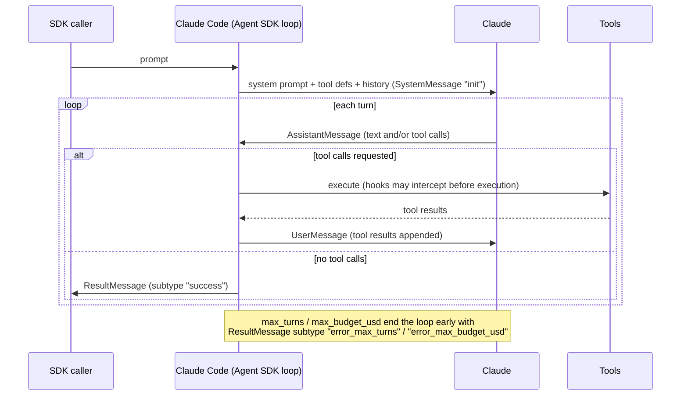
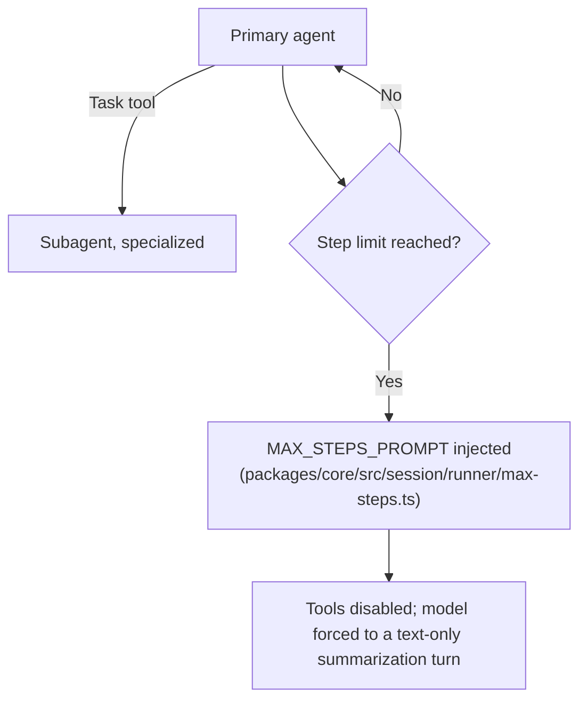

# Agent loop: Claude Code vs. OpenCode, and how to verify each

**Scope note.** [agent-loop.md](agent-loop.md) is deliberately general-concepts
only (Thought/Action/Observation, ReAct, stop-and-parse) and holds no
harness sections on purpose. This page is the harness-specific
companion: what Claude Code and OpenCode each document/implement about
their own loop, and -- per AUTHORITY OVERREACH discipline -- neither
harness's mechanism is assumed to describe the other's.

## 1. Claude Code (Agent SDK docs)

VERIFIED (`code.claude.com/docs/en/agent-sdk/agent-loop`, fetched
2026-07-30): the SDK "runs the same execution loop that powers Claude
Code." The loop-at-a-glance is five stages: **receive prompt** (system
prompt, tool definitions, conversation history all present from the
start; SDK yields a `SystemMessage` subtype `"init"`); **evaluate and
respond** (Claude may respond with text, request tool calls, or both;
SDK yields an `AssistantMessage`); **execute tools** (SDK runs each
requested tool, results feed back to Claude; hooks can intercept
before execution); **repeat** (steps 2-3 cycle; "each full cycle is one
turn"); **return result** (a final text-only `AssistantMessage`
followed by a `ResultMessage` with usage/cost/session ID).

VERIFIED (same page): the stop condition is explicit -- "Turns continue
until Claude produces output with no tool calls, at which point the
loop ends." Two hard caps exist independent of that natural stop:
`max_turns`/`maxTurns` (counts tool-use turns only) and
`max_budget_usd`/`maxBudgetUsd` (spend threshold, and it "covers
subagents: their spend counts toward the total"). Hitting either cap
yields a `ResultMessage` with `subtype: "error_max_turns"` or
`"error_max_budget_usd"` instead of `"success"` -- the loop does not
silently truncate, it reports which limit ended it.

VERIFIED (same page): tool results are appended as a `UserMessage`
"with the tool result content sent back to Claude" -- mechanically
the same append-to-context shape the Hugging Face course describes
generically in [agent-loop.md](agent-loop.md) section 2, now with
Claude-Code-specific naming (`UserMessage`, not "Observation"). The
context window "does not reset between turns within a session";
compaction (summarizing older history) is the documented mechanism for
when it approaches the limit, emitting `subtype: "compact_boundary"`.

VERIFIED (same page): parallel tool execution is real but
selective -- "Read-only tools ... can run concurrently. Tools that
modify state (like Edit, Write, and Bash) run sequentially to avoid
conflicts." Custom tools default to sequential unless annotated
`readOnlyHint`.

**Where to verify further, for Claude Code specifically:** this Agent
SDK page is documentation of a *product surface* (the SDK you can
build on), not published source code -- Claude Code itself is closed
source (per this skill's own SOURCE AUTHORITY rules,
`github.com/anthropics/claude-code` is authoritative only for its
CHANGELOG/README/examples/plugins/Issues, never for internal
implementation). If a claim needs to go deeper than what this docs
page states, the honest answer is "not independently verifiable from a
public source" -- do not fill that gap with OpenCode's or any other
harness's mechanism.

## 2. OpenCode

BEST CURRENT UNDERSTANDING, UNCONFIRMED (`opencode.ai/docs/`, the
top-level docs page, fetched 2026-07-30): this page covers install,
config, and basic usage, and explicitly does not describe loop
mechanics -- confirmed by fetching it directly and finding no such
content, not assumed absent.

VERIFIED (`opencode.ai/docs/agents/`, fetched 2026-07-30): OpenCode
distinguishes **primary agents** ("the main assistants you interact
with directly") from **subagents** ("specialized assistants that
primary agents can invoke for specific tasks"), invoked via a `Task`
tool ("invoke the Task tool"). Tool access is governed by a
permissions framework per agent: "Allow all operations without
approval," an `ask` mode, or "Disable the tool" entirely.

VERIFIED (same page): there is a documented step limit distinct from
Claude Code's turn/budget caps. "When the limit is reached, the agent
receives a special system prompt instructing it to respond with a
summarization of its work" -- i.e. the stop condition is enforced by
injecting a system prompt, not just truncating the stream.

VERIFIED (`github.com/anomalyco/opencode`, `dev` branch, fetched via
`gh api` 2026-07-30 -- flagging per this skill's own caveat that `dev`
is not a stable release tag): the exact prompt text lives in
`packages/core/src/session/runner/max-steps.ts`, exported as
`MAX_STEPS_PROMPT`:

> "CRITICAL - MAXIMUM STEPS REACHED / The maximum number of steps
> allowed for this task has been reached. Tools are disabled until
> next user input. Respond with text only." ... "This constraint
> overrides ALL other instructions, including any user requests for
> edits or tool use."

This is a real, currently-live implementation detail (not a docs
paraphrase) confirming the docs page's claim mechanically: the loop's
hard stop is a hard-coded prompt injected into the same message
stream the model reads, forcing a text-only turn.

**Where the loop implementation actually lives, for further
verification:** `packages/core/src/session/` is the real directory,
confirmed live via `gh api repos/anomalyco/opencode/contents/...` this
session -- specifically `session/runner/` (`index.ts`, `llm.ts`,
`max-steps.ts`, `model.ts`, `to-llm-message.ts`), `session/execution.ts`
and `session/execution/`, `session/compaction.ts`,
`session/run-coordinator.ts`. This session only opened
`max-steps.ts` directly; `runner/index.ts` and `execution.ts` are the
next files to read for the turn-by-turn control flow itself (message
send, tool-call parse, result append) -- BEST CURRENT UNDERSTANDING
that these are the right files, based on their names and directory
position, not yet read this session. Because OpenCode is genuinely
open-source (unlike Claude Code and Copilot CLI), this is the one
harness of the three where "go read the loop" is a literal, actionable
instruction rather than a dead end.

## 3. Comparison

Both document the same shape at the level the Hugging Face course
teaches generically -- evaluate, act, observe, repeat, stop when the
model stops requesting tools or a hard limit is hit. Two concrete
differences, both VERIFIED from each harness's own source above:

- **Stop enforcement mechanism.** Claude Code's hard caps
  (`max_turns`, `max_budget_usd`) end the loop from the *harness side*
  and report a distinct `ResultMessage` subtype -- no further model
  turn happens. OpenCode's step limit ends the loop from *inside the
  model's own next turn*: a system prompt is injected demanding a
  text-only summarization response, so there is one more model call
  after the limit is hit, not zero.
- **Verifiability.** Claude Code's loop is knowable only through what
  Anthropic chooses to document (the Agent SDK page above) -- there is
  no public implementation to cross-check it against. OpenCode's is
  knowable two ways that can be checked against each other: the docs
  page's claim and the actual `max-steps.ts` source, which is what
  this page just did.

BEST CURRENT UNDERSTANDING, UNCONFIRMED: whether OpenCode has an
analogue to Claude Code's budget cap (`max_budget_usd`) or to its
read-only-vs-mutating parallel tool execution split -- neither was
seen in the pages/files fetched this session; would need
`session/execution.ts` and the permission-framework docs read directly
before claiming either way.

## Sources

- `code.claude.com/docs/en/agent-sdk/agent-loop` -- fetched 2026-07-30.
  Authoritative for the Claude Code Agent SDK's documented loop
  behavior (stages, message types, turn/budget caps, compaction,
  parallel tool execution). Not a claim about internal implementation
  Anthropic hasn't published.
- `opencode.ai/docs/agents/` and `opencode.ai/docs/` -- fetched
  2026-07-30. Authoritative for OpenCode's documented agent/subagent
  model, permissions framework, and the existence of a step limit.
- `github.com/anomalyco/opencode`, `dev` branch, via `gh api` --
  fetched 2026-07-30 (directory listings of `packages/core/src`,
  `packages/core/src/session`, `packages/core/src/session/runner`, and
  the full contents of `max-steps.ts`). Authoritative for OpenCode's
  real implementation, with the standing caveat that `dev` is not a
  stable release tag and may not match the current stable release.
- Hugging Face Agents Course -- see [agent-loop.md](agent-loop.md)'s
  own Sources section; used here only for the shared vocabulary this
  page maps onto, not re-cited as harness-specific evidence.
