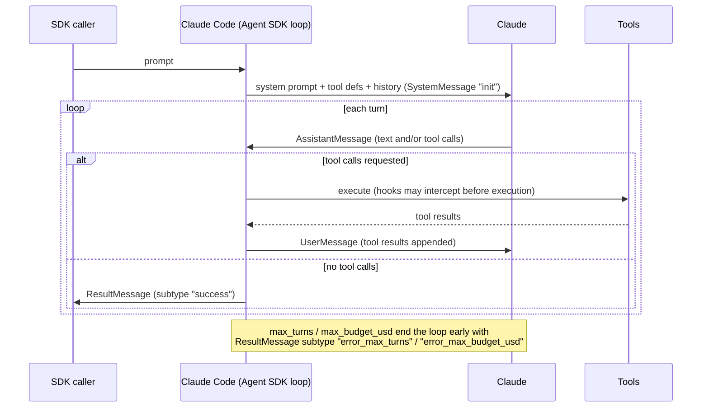
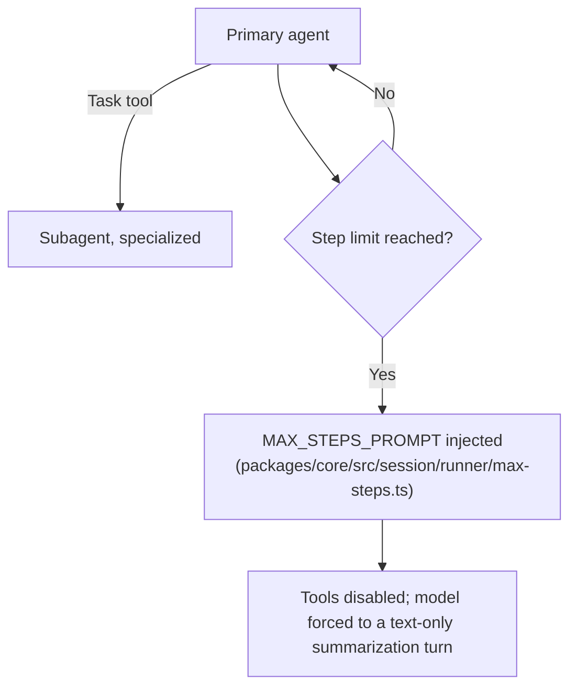

# Agent loop: Claude Code, GitHub Copilot CLI, OpenCode, pi, Hermes Agent, and DeepSeek Harness, and how to verify each

**Scope note.** [agent-loop.md](agent-loop.md) is deliberately general-concepts
only (Thought/Action/Observation, ReAct, stop-and-parse) and holds no
harness sections on purpose. This page is the harness-specific
companion: what Claude Code, Copilot CLI, OpenCode, pi, Hermes Agent,
and DeepSeek Harness each document/implement about their own loop, and
-- per AUTHORITY OVERREACH discipline -- no harness's mechanism is
assumed to describe another's. Added 2026-08-24: a Copilot CLI section,
closing a real gap this page previously left (it originally covered only
two of the book's three target harnesses); the Claude Code and OpenCode
sections below are unchanged from the original 2026-07-30 write. Added
2026-09-01: a pi section (§4), covering a fourth harness already
documented elsewhere in this book (see that section's own opening note
for exactly which pages) but not previously covered on this specific
page. Also added 2026-09-01: a Hermes Agent section (§5), the fifth
harness this book covers, sourced directly from its own public,
open-source Python implementation rather than from documentation of a
closed product -- this page's most directly verifiable harness after
OpenCode and pi. Added 2026-09-01: a DeepSeek Harness section (§6),
covering the sixth harness documented in this book, an open-source
TypeScript agent framework built on the Cordis plugin architecture,
sourced directly from its own public repository's `docs/` and generated
config/event catalogs.

## 1. Claude Code (Agent SDK docs)



VERIFIED (`code.claude.com/docs/en/agent-sdk/agent-loop`, fetched
2026-07-30): the SDK "runs the same execution loop that powers Claude
Code." The loop-at-a-glance is five stages: **receive prompt** (system
prompt, tool definitions, conversation history all present from the
start; SDK yields a `SystemMessage` subtype `"init"`); **evaluate and
respond** (Claude may respond with text, request tool calls, or both;
SDK yields an `AssistantMessage`); **execute tools** (SDK runs each
requested tool, results feed back to Claude; hooks can intercept
before execution); **repeat** (steps 2-3 cycle; "each full cycle is one
turn"); **return result** (a final text-only `AssistantMessage`
followed by a `ResultMessage` with usage/cost/session ID).

VERIFIED (same page): the stop condition is explicit -- "Turns continue
until Claude produces output with no tool calls, at which point the
loop ends." Two hard caps exist independent of that natural stop:
`max_turns`/`maxTurns` (counts tool-use turns only) and
`max_budget_usd`/`maxBudgetUsd` (spend threshold, and it "covers
subagents: their spend counts toward the total"). Hitting either cap
yields a `ResultMessage` with `subtype: "error_max_turns"` or
`"error_max_budget_usd"` instead of `"success"` -- the loop does not
silently truncate, it reports which limit ended it.

VERIFIED (same page): tool results are appended as a `UserMessage`
"with the tool result content sent back to Claude" -- mechanically
the same append-to-context shape the Hugging Face course describes
generically in [agent-loop.md](agent-loop.md) section 2, now with
Claude-Code-specific naming (`UserMessage`, not "Observation"). The
context window "does not reset between turns within a session";
compaction (summarizing older history) is the documented mechanism for
when it approaches the limit, emitting `subtype: "compact_boundary"`.

VERIFIED (same page): parallel tool execution is real but
selective -- "Read-only tools ... can run concurrently. Tools that
modify state (like Edit, Write, and Bash) run sequentially to avoid
conflicts." Custom tools default to sequential unless annotated
`readOnlyHint`.

**Where to verify further, for Claude Code specifically:** this Agent
SDK page is documentation of a *product surface* (the SDK you can
build on), not published source code -- Claude Code itself is closed
source (per this skill's own SOURCE AUTHORITY rules,
`github.com/anthropics/claude-code` is authoritative only for its
CHANGELOG/README/examples/plugins/Issues, never for internal
implementation). If a claim needs to go deeper than what this docs
page states, the honest answer is "not independently verifiable from a
public source" -- do not fill that gap with OpenCode's or any other
harness's mechanism.

## 2. GitHub Copilot CLI

**Source and authorship note.** Copilot CLI is closed source, and
`docs.github.com/copilot` -- checked this session -- publishes no
dedicated agent-loop page for it (unlike Claude Code's Agent SDK docs
above). The grounding for this section is instead
`github.com/github/copilot-sdk`'s own `docs/features/agent-loop.md` and
`docs/features/session-limits.md` (fetched via `gh api` 2026-08-24) --
the Copilot SDK, a separate, adjacent client-library product this book
already treats cautiously elsewhere (`llm-api-contract.md` §3.2,
`session-persistence.md` §2: consistent-with-but-not-proof-of the CLI's
internal behavior). This particular document is a stronger source than
those two prior citations, though, because it explicitly assigns the
loop's authorship to the CLI rather than to itself: "The **SDK** is a
transport layer -- it sends your prompt to the **Copilot CLI** over
JSON-RPC and surfaces events back to your app. The **CLI** is the
orchestrator that runs the agentic tool-use loop, making one or more
LLM API calls until the task is done." That sentence is treated here as
VERIFIED evidence about the CLI's own loop shape, not the SDK's --
while still flagging, honestly, that no first-party
`docs.github.com`/`github.com/github/copilot-cli` page independently
corroborates it this session.


VERIFIED (`copilot-sdk` `docs/features/agent-loop.md`): a **turn** is
defined precisely as one LLM API call and its consequences -- "1. The
CLI sends the conversation history to the LLM. 2. The LLM responds
(possibly with tool requests). 3. If tools were requested, the CLI
executes them. 4. `assistant.turn_end` is emitted." The model sees the
**full conversation history** on every call (system prompt, user
message, and all prior tool calls/results) -- mechanically the same
append-to-context shape [agent-loop.md](agent-loop.md) describes
generically and [agent-loop-implementations.md](#1-claude-code-agent-sdk-docs)
§1 documents for Claude Code's own `UserMessage`-appended tool results.
The doc states plainly: "each iteration of this loop is exactly one LLM
API call... there are no hidden calls" for planning, evaluation, or
completion-checking -- a specific, falsifiable claim about the absence
of any separate deliberation step, offered as a documented worked
example: a search-heavy question can take four turns (grep/glob, read,
read-more, final no-tool-request answer) before the loop naturally
ends.

VERIFIED (same doc): the loop's natural stop condition is model-driven,
not harness-driven -- "The CLI is purely mechanical: 'model asked for
tools -> execute -> call model again.' The **model** is the
decision-maker for when to stop." A turn with no `toolRequests` in the
response ends the loop and emits `session.idle`.

VERIFIED (same doc): **two separate completion signals** exist, and the
doc is explicit that they carry different guarantees, not synonyms.
`session.idle` is always emitted when the tool-use loop ends, is
ephemeral (not persisted to disk, not replayed on resume), and means
only "the agent has stopped processing" -- a mechanical signal. This is
the recommended "done" signal for a caller (the SDK's `sendAndWait()`
blocks on it). `session.task_complete` is optional -- it requires the
model to explicitly call a `task_complete` tool -- is persisted to the
session's event log, carries an optional `summary` field, and means the
*model itself* considers the overall task fulfilled: a semantic signal
the harness cannot manufacture on the model's behalf.

VERIFIED (same doc): **autopilot mode** (the headless/autonomous mode
this book's [tui-cli-application-architecture.md](tui-cli-application-architecture.md)
§2 documents as one stop on Copilot CLI's mode-cycling `Shift+Tab`
wheel, not re-described here) turns that optional signal into a second,
harness-enforced completion gate. If the tool-use loop ends without the
model having called `task_complete`, the CLI "injects a synthetic user
message nudging the model": *"You have not yet marked the task as
complete using the task_complete tool. If you were planning, stop
planning and start implementing. You aren't done until you have fully
completed the task."* That synthetic message is read by the model as an
ordinary new user turn, which restarts the tool-use loop -- structurally
the same "inject a system-level instruction into the message stream to
force one more model turn" shape OpenCode's step-limit prompt injection
uses below (§3), though the *triggering condition* is the inverse: OpenCode
injects on a step-count ceiling being *reached*, Copilot CLI's autopilot
injects on a specific completion signal being *absent*. The same doc
documents the nudge's own anti-premature-completion guidance (don't call
`task_complete` with open questions, an unresolved error, or remaining
steps), producing what it calls a **two-level completion mechanism** in
autopilot: the model calls `task_complete` and the CLI reports
`session.task_complete`, or the model stops without it and gets nudged
back into the loop. In ordinary interactive mode, per the same doc, the
CLI issues no such nudge and `task_complete` may simply never appear
(conversational Q&A, model discretion, or an interrupted session) --
`session.idle` still fires regardless, because it is mechanical, not
semantic.

VERIFIED (`copilot-sdk` `docs/features/session-limits.md`, fetched via
`gh api` 2026-08-24): Copilot CLI has no documented hard turn-count cap
analogous to Claude Code's `max_turns` (§1 above). What it has instead
is a **soft, spend-denominated** cap -- `sessionLimits.maxAiCredits`,
forwarded by the SDK to the CLI at session creation/resume -- and the
doc is explicit that it is checked *after* a model call returns rather
than before one is dispatched: "Usage is checked after model calls
return, so one response can exceed the configured value before the
runtime blocks the next model call." Hitting it does not silently end
the loop the way Claude Code's `max_budget_usd` cap does; it raises a
`session_limits_exhausted.requested` event that "needs a user decision
before continuing" (resolved via a `session_limits_exhausted.completed`
event carrying the user's chosen action) -- a pause-for-a-decision
mechanism, not a hard stop, and this page cross-references rather than
re-derives [auth-and-usage-accounting.md](auth-and-usage-accounting.md)
as the fuller home for Copilot CLI's broader budget/cost-accounting
picture. Separately, this book's
[hooks-lifecycle-extensibility.md](hooks-lifecycle-extensibility.md) §2
already documents a changelog-verified, *loop-runaway* guard distinct
from both of the above: an `agentStop` hook that always returns "block"
no longer loops indefinitely -- the CLI ends the turn after **8
consecutive blocks** -- cross-referenced here, not repeated, because it
guards the hook-interception layer around the loop rather than the
loop's own turn-counting.

**Where to verify further, for Copilot CLI specifically:** the same
caveat this page states for Claude Code applies here with equal force
-- Copilot CLI itself ships no public source, so `agent-loop.md`'s
description of "the CLI is the orchestrator" is documentation of a
*product surface* (the SDK's own account of CLI behavior), not
independently cross-checkable source code. `github.com/github/copilot-sdk`
does ship real, public source for its own client bindings (TypeScript,
Python, Go, .NET, Java, Rust), but that is the JSON-RPC *client*, not
the CLI process's internal loop implementation -- do not conflate
"the SDK's source is public" with "the CLI's loop is independently
verifiable," and do not assume Claude Code's or OpenCode's own
loop-ending mechanics (below) apply here without a Copilot-specific
citation.

## 3. OpenCode



BEST CURRENT UNDERSTANDING, UNCONFIRMED (`opencode.ai/docs/`, the
top-level docs page, fetched 2026-07-30): this page covers install,
config, and basic usage, and explicitly does not describe loop
mechanics -- confirmed by fetching it directly and finding no such
content, not assumed absent.

VERIFIED (`opencode.ai/docs/agents/`, fetched 2026-07-30): OpenCode
distinguishes **primary agents** ("the main assistants you interact
with directly") from **subagents** ("specialized assistants that
primary agents can invoke for specific tasks"), invoked via a `Task`
tool ("invoke the Task tool"). Tool access is governed by a
permissions framework per agent: "Allow all operations without
approval," an `ask` mode, or "Disable the tool" entirely.

VERIFIED (same page): there is a documented step limit distinct from
Claude Code's turn/budget caps. "When the limit is reached, the agent
receives a special system prompt instructing it to respond with a
summarization of its work" -- i.e. the stop condition is enforced by
injecting a system prompt, not just truncating the stream.

VERIFIED (`github.com/anomalyco/opencode`, `dev` branch, fetched via
`gh api` 2026-07-30 -- flagging per this skill's own caveat that `dev`
is not a stable release tag): the exact prompt text lives in
`packages/core/src/session/runner/max-steps.ts`, exported as
`MAX_STEPS_PROMPT`:

> "CRITICAL - MAXIMUM STEPS REACHED / The maximum number of steps
> allowed for this task has been reached. Tools are disabled until
> next user input. Respond with text only." ... "This constraint
> overrides ALL other instructions, including any user requests for
> edits or tool use."

This is a real, currently-live implementation detail (not a docs
paraphrase) confirming the docs page's claim mechanically: the loop's
hard stop is a hard-coded prompt injected into the same message
stream the model reads, forcing a text-only turn.

**Where the loop implementation actually lives, for further
verification:** `packages/core/src/session/` is the real directory,
confirmed live via `gh api repos/anomalyco/opencode/contents/...` this
session -- specifically `session/runner/` (`index.ts`, `llm.ts`,
`max-steps.ts`, `model.ts`, `to-llm-message.ts`), `session/execution.ts`
and `session/execution/`, `session/compaction.ts`,
`session/run-coordinator.ts`. This session only opened
`max-steps.ts` directly; `runner/index.ts` and `execution.ts` are the
next files to read for the turn-by-turn control flow itself (message
send, tool-call parse, result append) -- BEST CURRENT UNDERSTANDING
that these are the right files, based on their names and directory
position, not yet read this session. Because OpenCode is genuinely
open-source (unlike Claude Code and Copilot CLI), this is the one
harness of the three where "go read the loop" is a literal, actionable
instruction rather than a dead end.

## 4. pi

**Source and naming note, resolved this session.** This book's other pi
sections (`llm-api-contract.md` §3.5, `hooks-lifecycle-extensibility.md`,
`permissions-and-sandboxing.md`, `session-persistence.md`,
`configuration.md`, `auth-and-usage-accounting.md`, `built-in-skills.md`,
`context-compression.md` §4, `model-routing-and-selection.md`) cite pi
under two different package spellings, `@earendil-works/pi-ai` and
`@earendil-works/pi-coding-agent`. VERIFIED, fetched 1 September 2026
directly from `github.com/earendil-works/pi` (`main` branch, confirmed
live via `gh api repos/earendil-works/pi` that this -- not a separate
`pi-mono` repository some internal doc links point at -- is the
canonical, non-redirecting repository identity): this is **not** an
error to resolve in favour of one spelling over the other. `pi` is a
monorepo shipping at least three separate, independently-versioned npm
packages under the same `0.84.4` release, each with its own
`package.json` read in full this session: `@earendil-works/pi-ai`
(`packages/ai`, described in its own `package.json` as "Unified LLM API
with automatic model discovery and provider configuration" -- the
wire-protocol layer `llm-api-contract.md` §3.5 documents),
`@earendil-works/pi-agent-core` (`packages/agent`, README: "Stateful
agent with tool execution and event streaming. Built on
`@earendil-works/pi-ai`" -- **the package this section is actually
about**, since it is the one that implements the turn loop), and
`@earendil-works/pi-coding-agent` (`packages/coding-agent`,
`package.json`: "Coding agent CLI with read, bash, edit, write tools and
session management," `bin: { pi: "dist/bundle/cli.js" }` -- the actual
shipped `pi` CLI product, which embeds `pi-agent-core` as a dependency
and layers tools, sessions, settings, and compaction policy on top of
it). Every prior page's citation of either of the two previously-used
names is independently correct for what it was describing; neither
this page nor any prior one has stated the existence of the third,
loop-implementing package, `pi-agent-core`, until now.

```mermaid
sequenceDiagram
    participant App as coding-agent (AgentSession)
    participant Loop as pi-agent-core (agentLoop/runLoop)
    participant LLM as Model (via pi-ai)
    participant Tools as Tools

    App->>Loop: agent.prompt(text) / agentLoop(prompts, context, config)
    Loop->>Loop: emit agent_start, turn_start
    loop each turn
        Loop->>LLM: streamAssistantResponse (context, tools)
        LLM-->>Loop: AssistantMessage (stopReason: toolUse / stop / length / error / aborted)
        alt stopReason is toolUse and no length-truncation
            Loop->>Tools: executeToolCalls (sequential or parallel)
            Tools-->>Loop: ToolResultMessage[]
            Loop->>Loop: emit turn_end; shouldStopAfterTurn? -> agent_end
            Loop->>App: prepareNextTurn hook (compaction check happens here)
            Loop->>Loop: emit turn_start (next turn)
        else stopReason is stop (no tool calls)
            Loop->>App: getFollowUpMessages()
            alt follow-ups queued
                Loop->>Loop: inject as pendingMessages, continue
            else none queued
                Loop->>Loop: emit agent_end
            end
        else stopReason is error or aborted
            Loop->>Loop: emit turn_end, agent_end (immediate)
        end
    end
```

**What constitutes one turn.** VERIFIED, `packages/agent/src/types.ts`
(full file read this session): the `AgentEvent` union's own code comment
states the definition plainly -- "Turn lifecycle - a turn is one
assistant response + any tool calls/results." Mechanically, VERIFIED
from `packages/agent/src/agent-loop.ts` (full file read this session,
the `runLoop()` function): a `turn_start` event is emitted, one
assistant response is streamed via `streamAssistantResponse()` (which
itself emits `message_start`/`message_update`/`message_end` for the
streaming deltas), any `toolCall` content blocks in that response are
then executed (`executeToolCalls()`, sequential or parallel per
`config.toolExecution`, default `"parallel"`), and a `turn_end` event
closes the turn carrying the assistant message and its tool results
together -- the same one-LLM-call-plus-its-tool-execution unit Copilot
CLI's own `agent-loop.md` names a turn as (§2 above), though pi's own
turn additionally brackets the tool execution *inside*
the same `turn_start`/`turn_end` pair rather than treating tool
execution as a step the harness performs between two separate LLM-call
turns.

**The natural stop condition is model-driven, with no documented hard
turn-count or budget cap layered on top of it.** VERIFIED, same file:
the inner loop continues (`hasMoreToolCalls || pendingMessages.length >
0`) for as long as the assistant's message contains tool calls that
were not all flagged `terminate: true`, or steering messages are
queued; once a turn produces no tool calls and no messages are pending,
the outer loop checks `config.getFollowUpMessages()` once more and, if
that returns nothing, breaks and emits `agent_end` -- the same "the
model itself is the decision-maker for when to stop" shape this page's
§2 documents for Copilot CLI, reached here by an unrelated engineering
team. VERIFIED, `packages/agent/src/types.ts`'s `AgentLoopConfig`
interface (read in full): there is no `maxTurns`, `maxBudgetUsd`,
`maxSteps`, or any other numeric cap field anywhere in the type the
low-level loop is configured with -- the loop's only means of an
externally-forced early stop is the `shouldStopAfterTurn` hook, an
arbitrary predicate the *embedding application* supplies (it "returns
true" to end the run "before starting another LLM call," checked
immediately after `turn_end` is emitted, ahead of `prepareNextTurn`).
VERIFIED, `packages/coding-agent/docs/settings.md` and
`packages/coding-agent/docs/usage.md` (both fetched and grepped in
full this session for `turn`, `budget`, `step`, `limit`): pi's own
shipped CLI documents no hard cap analogous to Claude Code's
`max_turns`/`max_budget_usd` (§1) or OpenCode's step-limit (§3). The
nearest neighbouring numeric cap the settings doc names,
`retry.provider.maxRetries` (default `0`), governs provider/SDK-level
HTTP retry attempts *within a single LLM call*, not the number of
turns a run may take -- a different axis entirely, not a loop-ending
mechanism, and the settings doc itself warns raising it above `0` "can
make SDK/provider retries handle out-of-usage-limit errors before Pi
sees them," i.e. it can actively mask rather than enforce a budget
limit. Absence of a documented cap in the docs fetched this session is
"not found," not "proven absent" -- the same epistemic caveat this
page's OpenCode section already applies to its own open questions.

**Compaction's relationship to the loop is the `prepareNextTurn` hook,
not a separate out-of-band check.** VERIFIED,
`packages/coding-agent/docs/compaction.md` (already cited in
[context-compression.md](context-compression.md) §4, cross-referenced
here rather than re-derived): "Pi checks this threshold after tools
finish and their results are appended, before starting the next
assistant response. If the threshold is crossed, Pi compacts inside
the same agent run and resumes with the summary and retained messages.
It skips this between-turn check when the completed tool batch
terminates the run and no queued message requires another response."
VERIFIED, cross-checked against source this session,
`packages/coding-agent/src/core/agent-session.ts` (grepped for
`prepareNextTurn`): the coding-agent layer wires its own compaction
check into the low-level loop by wrapping
`this.agent.prepareNextTurnWithContext`, the exact hook
`packages/agent/src/agent-loop.ts`'s `runLoop()` calls immediately
before emitting the next `turn_start` -- confirming mechanically, not
just by documentation cross-reference, that pi's compaction trigger
point is this hook and not a separate poll loop or timer. Because
`prepareNextTurn` is only reached when the inner loop is about to
continue, the doc's own stated skip condition ("terminates the run and
no queued message requires another response") falls out directly from
the source: a run that is about to emit `agent_end` never reaches the
`prepareNextTurn` call at all.

**A truncated-output edge case with no documented analogue elsewhere in
this book.** VERIFIED, `packages/agent/src/agent-loop.ts`
(`failToolCallsFromTruncatedMessage()`): if an assistant message's
`stopReason` is `"length"` (the model's output was cut off by the
token limit) and that message nonetheless contains tool calls, pi
never executes any of them. A `"length"` stop means "every tool call
in the message may carry truncated arguments" even if a best-effort
streaming JSON-salvage parser made them look syntactically valid and
schema-validate cleanly, so the loop synthesizes an error
`ToolResultMessage` for each one instead, instructing the model in the
error text to "re-issue the tool call with complete arguments" --
letting the model retry on the next turn rather than risking execution
of a write/edit/bash call built from truncated input. This is a
concrete pi-specific safety behavior at the loop level; none of §1-§3
above documents an equivalent stopReason-length-gates-tool-execution
rule for Claude Code, Copilot CLI, or OpenCode, though this page does
not claim any of the three lacks one -- only that no source read for
those sections this book states one.

**Steering and follow-up message queues: a user-initiated reinjection
mechanism, not a limit-triggered one.** VERIFIED,
`packages/coding-agent/docs/usage.md` and
`packages/agent/src/types.ts`: pi's interactive mode lets a user queue
a **steering message** (Enter) or a **follow-up message** (Alt+Enter)
while the agent is still working. A steering message is drained via
`config.getSteeringMessages()` and injected as soon as the current
turn's tool calls finish executing, before the next LLM call --
"tool calls from the current assistant message are not skipped." A
follow-up message is drained via `config.getFollowUpMessages()` only at
the point the agent would otherwise stop (no more tool calls pending
and no steering messages queued), and its presence is precisely what
makes the outer `while (true)` loop in `runLoop()` continue instead of
breaking to `agent_end`. Two independent settings, `steeringMode` and
`followUpMode` (both documented in `settings.md`, both defaulting to
`"one-at-a-time"`, the alternative being `"all"`), control whether a
drain point delivers every queued message at once or only the oldest
one, deferring the rest to the next drain point. Architecturally, this
is the same "inject a message into the stream to produce one more
model turn" move Copilot CLI's autopilot nudge (§2 above) and
OpenCode's `MAX_STEPS_PROMPT` (§3 above) both perform -- but the
*trigger* is categorically different from either: OpenCode injects on
a step-count ceiling being reached and Copilot CLI's autopilot injects
on a completion-signal being absent, both harness-side conditions,
whereas pi's own queues are drained only because a human explicitly
queued something -- there is no threshold or counter behind either
drain point.

**Subagents and a second, separate loop-adjacent runtime worth flagging
as an open question, not a settled fact.** BEST CURRENT UNDERSTANDING,
UNCONFIRMED: `packages/agent/src/harness/` is a real, implemented
subsystem (confirmed via a directory listing this session showing
`agent-harness.ts`, a `session/` subdirectory, and its own test suite,
`vitest.harness.config.ts`) documented at far greater length in
`packages/agent/docs/harness.md` -- a 200KB+ specification for a
durable, crash-recoverable `AgentHarness` built around named "lanes"
(cursors into a shared conversation tree), of which the spec states
directly: "Additional lanes support Slack threads, subagents, and other
parallel work over shared history." This reads as architecturally
comparable to OpenCode's primary/subagent split (§3) at the level of
intent, but this session did not read the harness.md spec in full given
its size, and grepping it found no `maxTurns`/`budget`/step-limit
concept there either. VERIFIED, however, cross-checking actual source
this session: `AgentHarness` is imported only by
`packages/coding-agent/src/server/create-harness.ts` in the shipped CLI
package, while `packages/coding-agent/src/core/agent-session.ts` --
whose own doc comment states it is "shared between all run modes
(interactive, print, rpc)" -- imports `Agent`, not `AgentHarness`, from
`@earendil-works/pi-agent-core`. So the turn loop this section documents
above (`agentLoop()`/`runLoop()`, the simpler of the two) is confirmed
to be what actually drives pi's ordinary interactive, print, and RPC
sessions; `AgentHarness`'s exact deployment surface -- an experimental
alternate server mode, a future replacement, something else -- was not
determined this session and should not be assumed to describe pi's
primary turn loop without a further, dedicated source read of
`packages/coding-agent/src/server/create-harness.ts`'s own caller(s) and
`harness.md` itself.

## 5. Hermes Agent (Nous Research)

**Source and naming note.** Hermes Agent is genuinely open source --
`github.com/NousResearch/hermes-agent` (`main` branch, confirmed as the
repository's default branch this session via `gh api
repos/NousResearch/hermes-agent`), the same canonical repository this
book's [Hooks and lifecycle extensibility](hooks-lifecycle-extensibility.md)
§6 and [Permissions & sandboxing architecture](permissions-and-sandboxing.md)
§6 already introduce architecturally (three entry points -- CLI,
gateway, cron -- funnelled into one `AIAgent` class; seven sandboxed
terminal execution backends) -- not repeated here. Unlike Claude Code's
and Copilot CLI's own sections above, where the honest limit is "this is
what the vendor's docs say, no source exists to check it against," and
closer to OpenCode's and pi's own sections, this section is grounded
directly in Hermes' real, currently-shipping Python source, fetched via
`raw.githubusercontent.com` on 1 September 2026: `agent/conversation_loop.py`
(the loop body itself), `agent/tool_executor.py` and
`agent/tool_dispatch_helpers.py` (tool dispatch and parallelism
planning), `agent/iteration_budget.py`, `agent/verification_stop.py`,
`agent/kanban_stop.py` (stop-condition guards), `hermes_cli/config.py`
and `cli.py` (the config/CLI layer that sets the loop's caps), and
`run_agent.py` (the `AIAgent` class itself, of which
`conversation_loop.py`'s own module docstring states it was "extracted
from `run_agent.AIAgent`" -- `AIAgent.run_conversation()` is now a "thin
forwarder" to the standalone function this section documents).

```mermaid
sequenceDiagram
    participant Caller
    participant Agent as AIAgent.run_conversation()
    participant Loop as conversation_loop while-loop
    participant Provider as Provider adapter
    participant Exec as _execute_tool_calls (segment planner)
    participant Tools as handle_function_call

    Caller->>Agent: run_conversation(user_message)
    Agent->>Loop: forwards (thin wrapper)
    loop each iteration, api_call_count += 1
        Loop->>Loop: iteration_budget.consume() or _budget_grace_call bypass
        Loop->>Provider: api_messages (system + history)
        Provider-->>Loop: assistant_message, finish_reason
        alt tool_calls present
            Loop->>Exec: dispatch batch
            Exec->>Exec: plan parallel/sequential segments
            Exec->>Tools: one call per tool (thread pool for parallel segments)
            Tools-->>Exec: results
            Exec->>Loop: role=tool messages appended
        else finish_reason != tool_calls
            Loop->>Loop: verify-on-stop / kanban-stop nudge?
            alt nudge fires
                Loop->>Loop: append synthetic nudge, continue
            else
                Loop->>Caller: final_response, break
            end
        end
    end
```

### 5.1 The entry point, and a genuine internal vocabulary clash over "turn"

VERIFIED, `agent/conversation_loop.py`'s own module docstring (full file
read this session): `AIAgent.run_conversation()` is "now a thin
forwarder" to `agent.conversation_loop.run_conversation(agent, ...)`, "the
roughly 3,900-line `run_conversation` body that drives one user turn
through the agent (model call, tool dispatch, retries, fallbacks,
compression, post-turn hooks, background memory/skill review nudges)."
One exception exists ahead of the loop entirely: VERIFIED, same file --
"if `agent.api_mode == \"codex_app_server\"`: return
`agent._run_codex_app_server_turn(...)`" hands the entire turn to an
embedded Codex app-server subprocess instead ("terminal/file
ops/patching all run inside Codex. Default Hermes path is bypassed
entirely"), a second, alternate loop implementation this section does
not further investigate.

The loop itself is a single `while` statement: VERIFIED, same file --
`while (api_call_count < agent.max_iterations and
agent.iteration_budget.remaining > 0) or agent._budget_grace_call:`. On
its own this reads as an ordinary "model call, then tool dispatch, then
repeat" ReAct loop of the same shape this page's other four sections
document -- but Hermes' own source is internally inconsistent about what
word names which part of it, a genuinely notable finding once the two
usages are placed side by side. `conversation_loop.py`'s own docstring
(quoted above) calls the *entire* `run_conversation()` call -- everything
inside the `while` loop, however many iterations it takes -- "one user
turn." VERIFIED, however, `hermes_cli/config.py`'s `resolve_turn_limit()`
docstring and code (full file grepped this session): the user-facing
config key is `agent.max_turns`, and its own docstring calls each single
pass through the loop a "turn" -- "Normalize a raw `agent.max_turns` value
into an int iteration cap... The returned int is always >= 1, so loop
conditions like `while api_call_count < agent.max_iterations` behave
correctly." `iteration_budget.py`'s own docstring, a third file, calls
that same single pass an "iteration" instead of a "turn." So within one
codebase, "turn" is used by one module to mean the whole multi-iteration
`run_conversation()` call and by another to mean exactly one
LLM-call-plus-tool-round -- the same word spanning both scopes other
harnesses on this page keep terminologically separate (Claude Code and
Copilot CLI both reserve "turn" for one LLM call plus its tool
execution, §1/§2 above; pi's own `turn_start`/`turn_end` pair does the
same, §4). This is not a claim that either Hermes module is "wrong" --
it is a directly observed naming inconsistency inside the one harness
on this page whose source can actually be read closely enough to notice
it.

### 5.2 One iteration: request assembly, the provider call, and the tool-call gate

VERIFIED, `agent/conversation_loop.py` (grepped and read in section):
each iteration increments `api_call_count`, consumes one unit of
`agent.iteration_budget` (§5.4 below), fires an optional
`agent.step_callback` (an `agent:step` gateway-hook event, cross-referenced
rather than re-derived from
[hooks-lifecycle-extensibility.md](hooks-lifecycle-extensibility.md)),
drains any pending `/steer` message queued mid-call, then assembles
`api_messages` -- system prompt plus history, passed through a context-engine
tier-selection step (`_apply_context_engine_selection`), non-ASCII/surrogate
sanitization, and a prompt-cache plan (`build_prompt_cache_plan`) --
before dispatching to whichever provider adapter the session is
configured for. The repository ships one adapter per major API shape
(`anthropic_adapter.py`, `bedrock_adapter.py`, `gemini_native_adapter.py`,
`codex_responses_adapter.py`, alongside a default OpenAI-compatible
path), confirming multi-provider support is a first-class, source-level
concern rather than a single hard-coded wire format. The response comes
back as an `assistant_message` object carrying a `finish_reason` and,
where present, a `tool_calls` array; VERIFIED, same file -- `if
assistant_message.tool_calls:` is the single branch point separating
"execute the batch and loop again" from "finalize the turn," structurally
the same gate this page's other four sections describe (a turn with no
tool calls ends the loop; one with tool calls does not), reached here,
as with pi (§4), by an unrelated engineering team from an unrelated
codebase.

### 5.3 Tool dispatch: a segment planner over parallel-safe and sequential-barrier runs

VERIFIED, `AIAgent._execute_tool_calls()`'s own docstring in
`run_agent.py` (full method read this session): "The segment planner
splits the batch into maximal contiguous runs of parallel-safe calls
(read-only tools, non-overlapping file targets, opted-in MCP tools)
separated by sequential barriers (interactive, unsafe, or unrecognized
tools). Homogeneous batches keep their original single-path dispatch;
mixed batches execute segment by segment in emission order so safe
subsets still run concurrently while side-effect ordering is
preserved." Mechanically: a batch of one tool call always dispatches via
`_execute_tool_calls_sequential()`; a larger batch is first run through
`agent/tool_dispatch_helpers.py`'s `_plan_tool_batch_segments()`, which
returns an ordered list of `("parallel"|"sequential", calls)` tuples,
and a batch that resolves to exactly one segment keeps the direct
`_execute_tool_calls_concurrent()` or `_execute_tool_calls_sequential()`
path; only a genuinely mixed batch is handed to
`agent/tool_executor.py`'s `execute_tool_calls_segmented()`, which walks
the segments in order, calling the concurrent executor for each
parallel run and the sequential executor for each barrier, with
turn-level bookkeeping (aggregate tool-output budget enforcement,
`/steer` injection) deferred to a single whole-batch pass after every
segment finishes rather than repeated per segment.

The parallel-admission rules themselves are a real, source-verified
engine, not a flat allowlist: VERIFIED, `tool_dispatch_helpers.py` --
`_NEVER_PARALLEL_TOOLS = frozenset({"clarify"})` always forces a
sequential barrier; a fixed `_PARALLEL_SAFE_TOOLS` set (`read_file`,
`search_files`, `web_search`, `web_extract`, `vision_analyze`,
`session_search`, `skill_view`, `skills_list`, `image_generate`, and
three Home-Assistant read tools) is always admitted; and a distinct
path-scoped tier -- `_PATH_SCOPED_READERS = {"read_file",
"search_files"}` and `_PATH_SCOPED_WRITERS = {"write_file", "patch"}` --
is admitted to a parallel run only when the actual file paths targeted
across a batch do not overlap, computed from patch-body file headers
for `patch` calls rather than from a same-named `path=` argument that a
model could spoof, closing "the classic same-block write->read race" the
module's own comment names directly. MCP tools are admitted per-server,
gated on that server's own `supports_parallel_tool_calls: true`
declaration. Concurrent dispatch itself runs on real OS threads: VERIFIED,
`tool_executor.py` -- `execute_tool_calls_concurrent()` submits each
admitted call to a `DaemonThreadPoolExecutor` capped at
`_MAX_TOOL_WORKERS = 8` (further reduced for a batch containing
`image_generate` calls, per a separate configured limit), daemon threads
deliberately chosen because "an interrupted/timed-out batch is abandoned
with `shutdown(wait=False)`, but stdlib `ThreadPoolExecutor` workers are
non-daemon and registered in `concurrent.futures`' atexit hook, which
joins them unconditionally -- so one wedged tool thread would block
interpreter exit forever." Every individual call, whichever path
dispatches it, ultimately reaches `model_tools.handle_function_call()`
(via `_ra().handle_function_call(...)`, wrapped in tool-execution
middleware that this book's [Hooks and lifecycle extensibility](hooks-lifecycle-extensibility.md)
§6 already documents the pre/post-tool-call hook layer around, not
re-derived here); its result is appended to `messages` as a `role:
"tool"` message keyed to the original `tool_call_id`, in the model's
original emission order regardless of which thread finished first, so
the next provider call always sees a strictly alternating,
correctly-paired transcript.

### 5.4 The natural stop condition, and three distinct nudges that can override it

VERIFIED, `agent/conversation_loop.py`: reaching the `else` side of the
tool-call gate (§5.2) -- a response with no tool calls -- reaches a
"finalization" block, and this is where Hermes' own natural stop
condition lives, gated behind up to three independent, source-verified
checks before the loop actually breaks:

1. **Dropped-tool-call recovery.** A code comment names the observed
   trigger directly: "Some providers (observed: claude-opus-4.8 /
   claude-sonnet-4.5 on GitHub Copilot, ~2026-07) return
   `finish_reason=\"tool_calls\"` while the parsed `tool_calls` array is
   empty -- the model signalled it wanted to act but the payload shipped
   no call." When this exact mismatch occurs, Hermes re-prompts instead
   of accepting the narration as a final answer, "bounded to 3
   CONSECUTIVE stalls; the budget resets after any successful tool
   round," via a synthetic assistant/user message pair flagged so
   neither is written to the durable transcript.
2. **Verify-on-stop.** VERIFIED, `agent/verification_stop.py`'s own
   module docstring: "intentionally policy-only. It never runs checks
   itself; it turns the passive verification ledger into a bounded
   follow-up when the model tries to finish immediately after editing
   code without fresh evidence." Opt-in and off by default
   (`verify_on_stop_enabled()`'s own docstring: "The default is `False`
   (opt-in...)", overridable via `HERMES_VERIFY_ON_STOP` or
   `agent.verify_on_stop` in config), it skips turns that touched only
   non-code paths (markdown, README, LICENSE) and otherwise injects a
   synthetic nudge bounded to `max_attempts: int = 2` by the function's
   own default parameter.
3. **Kanban-stop.** VERIFIED, `agent/kanban_stop.py`'s own module
   docstring: kanban-dispatched worker sessions "must end with
   `kanban_complete` or `kanban_block`. Models (especially GLM / Qwen
   families) sometimes narrate the next step (\"Let me write the report
   now\") and stop with `finish_reason=stop` and no tool calls. Hermes
   treats that as a clean exit -> `rc=0` -> dispatcher
   `protocol_violation`." The guard is scoped narrowly --
   `kanban_stop_nudge_enabled()` is "on when `HERMES_KANBAN_TASK` is set
   (dispatcher-spawned worker)" only, not for ordinary interactive or
   gateway sessions -- and bounded to `_DEFAULT_MAX_ATTEMPTS = 2`.

Only once none of these three fires does the loop genuinely end: the
final assistant message is appended, the session is flushed to disk, and
(per the same file) `agent._safe_print(f"Conversation completed after
{api_call_count} OpenAI-compatible API call(s)")` -- an explicit,
human-readable count of exactly how many provider round-trips the
now-completed "turn," in `conversation_loop.py`'s own §5.1 sense of the
word, actually took.

Separately, VERIFIED (same file, both `_final_response` sites read in
full this session): a `finish_reason == "length"` response whose parsed
`tool_calls` nonetheless contains entries is never executed. The code
logs "Truncated tool call arguments detected (`finish_reason={finish_reason!r}`)
-- refusing to execute," discards the call, and returns "Response
truncated due to output length limit" rather than risk running a
write/edit/bash call built from truncated arguments -- the same
stopReason-gates-tool-execution safety rule this page's §4 documents,
independently, for pi's own `failToolCallsFromTruncatedMessage()`. Two
unrelated engineering teams, on two unrelated codebases, converging on
an identical mitigation for the identical failure mode (a
length-truncated response that still parses as a syntactically valid
but semantically incomplete tool call) is, alongside the "model is the
decision-maker for when to stop" convergence this page's §6 already
documents across all five harnesses, a second genuine point of
independent design convergence this page can now cite.

### 5.5 Hard caps: iteration budget, a self-clearing grace call, and a real config-default inconsistency

VERIFIED, `agent/iteration_budget.py` (full file read this session): a
thread-safe `IterationBudget` class wraps a simple lock-guarded counter
-- `consume()` returns `False` once `used >= max_total`, and a separate
`refund()` method exists specifically because "`execute_code`
(programmatic tool calling) iterations are refunded ... so they don't
eat into the budget," a carve-out none of this page's other four
sections documents an equivalent for. Two independent break conditions
sit ahead of the budget check on every iteration: an interrupt request
(`agent._interrupt_requested`) breaks immediately with
`_turn_exit_reason = "interrupted_by_user"`, and a background/auxiliary
aggregate check (`_review_input_budget_exhausted()`) breaks a
detached-review sub-run once its own cumulative token budget crosses a
threshold, "mirroring the iteration-budget exit" per the code's own
comment. The budget check itself has one documented escape hatch:
VERIFIED, `agent/conversation_loop.py` -- when `agent._budget_grace_call`
is `True`, the loop consumes and clears that one-shot flag instead of
calling `iteration_budget.consume()`, guaranteeing exactly one further
iteration runs even though the budget is otherwise exhausted, self-clearing
so the very next check reverts to the ordinary hard stop. This session
found where the flag is declared and consumed
(`agent/agent_init.py`, `agent/conversation_loop.py`) but no call site
that sets it `True` -- **BEST CURRENT UNDERSTANDING, UNCONFIRMED**
regarding what actually arms this grace mechanism (a `/continue`-style
user command, a gateway hook, or some other trigger this session's
files did not surface).

What actually bounds `max_iterations`/`max_turns` by default turns out
to be a genuinely, source-verifiably inconsistent number across the
codebase, not a single settled figure -- worth stating plainly rather
than picking whichever citation sounds most authoritative. VERIFIED,
`hermes_cli/config.py`'s `resolve_turn_limit()` (the function that
normalizes the user-facing `agent.max_turns` config key into the
`agent.max_iterations` value the loop actually checks): "YAML `None` /
`null` / absent value -> `default` (which is itself
`TURN_LIMIT_UNLIMITED` -- max_turns is unlimited by default)," and
`TURN_LIMIT_UNLIMITED = sys.maxsize`; the same module's own comment
states plainly, "max_turns is unlimited unless the user sets an explicit
positive integer cap." `cli.py` independently confirms the live wiring:
"Env var bridge (set by gateway/run.py from config.yaml, or by the user
directly). Empty/unset -> default (unlimited)." Against that, two other
files in the same repository assert a concrete default of 500 that this
session found no code path actually enforcing: `iteration_budget.py`'s
own module docstring states "the parent's cap comes from
`max_iterations` (default 500)," and a defensive `cli.py` fallback reads
`getattr(self.agent, "max_iterations", 500)` for a warning message,
i.e. 500 appears twice as an assumed fallback value but the actual,
normalized, shipped default -- per the one function whose job is
specifically to compute that default -- is unlimited. The same
inconsistency recurs one level down, for subagents: `cli.py`'s own
`DEFAULT_CONFIG` dict sets `"delegation": {"max_iterations": 45, #
Max tool-calling turns per child agent}`, while the example config
shipped in the repository, `cli-config.yaml.example`, comments `#
Max tool-calling turns per child (default: 250)` beside its own
`delegation: max_iterations: 250` line -- two different numbers, both
present in the same repository, each asserted as "the default" in its
own file. None of this page's other four harnesses' sections document
an equivalent internal inconsistency over their own default cap values,
because none of the other three closed-source harnesses expose enough
of their own internals to notice one, and pi's own `AgentLoopConfig`
type (§4) has no default-cap field to be inconsistent about in the
first place.

## 6. DeepSeek Harness (DeepSeek AI)

**Source and naming note.** DeepSeek Harness (repository
`github.com/deepseek-ai/deepseek-harness`, `master` branch, confirmed as the
repository's default branch this session via `gh api repos/deepseek-ai/deepseek-harness`)
is an open-source, TypeScript-based agent framework whose documented design
principle is "Everything is a Plugin" -- the agent loop itself is a Cordis
plugin (`@deepseek-ai/dsh-agent-loop`), swappable from configuration alongside
every other capability. The harness is a developer preview at time of writing
(September 2026); this section is grounded in the repository's own `docs/`
directory and its generated config/event catalogs, fetched directly this
session. The repository ships real, public source for its entire Cordis tree,
making DeepSeek Harness -- alongside OpenCode, pi, and Hermes Agent -- one of
the openly verifiable harnesses on this page.

```mermaid
sequenceDiagram
    participant Caller
    participant Agent as Agent (ctx.agents)
    participant Loop as AgentLoop driver
    participant PreStep as agent/pre-step waterfall
    participant Session as Session log (ctx.sessions)
    participant LLM as Provider (ctx.llm)
    participant Tools as Tool registry (ctx.tools)
    participant TurnStopping as agent/turn-stopping serial

    Caller->>Agent: followup / steer / inject
    Agent->>Loop: inbox wakes driver
    Loop->>Session: turn/start
    Loop->>Loop: claim next-step input + one next-turn message
    Loop->>PreStep:(agent/pre-step) reject | enter(messages, startsRequestSeries?)
    alt step rejected or empty first claim
        Loop->>Session: turn/end (no step)
    else step entered
        Loop->>Session: step/start
        Loop->>Session: user/message (entered batch)
        Loop->>LLM: agent/request → llm/stream waterfalls
        LLM-->>Session: assistant/chunk* (streaming deltas)
        Loop->>Session: assistant/message (assembled)
        alt model request failed
            Loop->>Session: step/end
            Loop->>Loop: agent/request-error waterfall (retry | preserve error)
        else tool calls present
            Loop->>Tools: classify by executionMode (parallel | exclusive)
            loop barriers and bounded rolling pool
                Tools->>Session: tool/call
                Tools->>Tools: pre-execute → execute → post-execute
                Tools->>Session: tool/result
            end
            Loop->>Session: step/end
            opt next-step input pending or tools owe another request
                Loop->>Loop: claim next-step → next step (same turn)
            end
        else no tool calls (natural stop)
            Loop->>Session: step/end
            opt next-step inbox empty
                Loop->>TurnStopping: agent/turn-stopping (serial, no next())
            end
        end
    end
    Loop->>Session: turn/end
```

### 6.1 Turn and step: a two-level loop with an event-sourced session log

VERIFIED (`docs/architecture.md`, fetched 1 September 2026 from
`raw.githubusercontent.com/deepseek-ai/deepseek-harness/master/docs/architecture.md`):
the harness defines two nested units. A **step** is "one model request plus
the tools it calls." A **turn** is "zero or more steps: it opens before its
first input is claimed and closes once nothing is owed." The architecture doc
lays out the concrete flow:

> ```text
> turn/start
>   claim next-step input plus one queued message
>   assemble prompt sections + tool schemas
>   -> agent/pre-step                   reject | enter(messages, startsRequestSeries?)
>      reject, or a first enter rewritten empty -> close the turn with no step
>      step/start
>      append entered messages as user/message
>      derive model history from the log
>      agent/request -> llm/stream -> assistant/chunk* -> assistant/message
>      tool/call* -> tools/pre-execute -> tools/execute -> tools/post-execute -> tool/result*
>      step/end
>      tools owe another request, or next-step input arrived -> claim -> next step
>   -> agent/turn-stopping
> turn/end
> ```

This is a genuine two-level structure that no other harness on this page
documents in the same terms: Claude Code, Copilot CLI, and OpenCode all have
a single "turn" unit (one LLM call + tool execution), and pi's `turn_start`/
`turn_end` pair brackets one LLM call and its tool execution together but
offers no second nesting level. DeepSeek Harness' turn can contain *multiple*
steps within one open `turn/start`/`turn/end` pair, where each step is one
model call plus its tool round, and a subsequent step in the same turn occurs
when "tools owe another request, or next-step input arrived." This makes the
turn a strictly larger unit than the step: a multi-step turn is a sustained
agent engagement that may run several model calls before `agent/turn-stopping`
fires and the turn ends.

VERIFIED (`docs/subsystems/session.md`, fetched this session): the session log
is the single source of truth. Every model-visible fact is an append-only
`SessionEvent`, and `deriveMessages()` projects LLM message history from it
incrementally (each surface node projected once, cached, then rebuilt on a
surface rewrite). The session event vocabulary is merge-extensible via
declaration merging -- plugins add event types without touching the owning
package. The twelve core event variants include `turn/start`, `turn/end`,
`step/start`, `step/end`, `user/message`, `assistant/chunk`, `assistant/message`,
`tool/call`, `tool/result`, `request/header`, `request/context`, and
`session/end-seed`. The `request/header` event logs the full request envelope
(provider, model, reasoning effort, rendered system prompt, assembled tool
schemas) for each loop boundary; every conversation request is a pure function
of the log, and a runtime invariant asserts this ("Model-visible means
logged").

### 6.2 The pre-step gate: rejection, message rewriting, and request-series markers

VERIFIED (`docs/subsystems/core.md`, fetched this session; same content in
`docs/agent-lifecycle.md`): the `agent/pre-step` waterfall is the only
listener chain before request derivation. Its input carries the exclusive
claimed batch (`messages`), the proposed step's coordinates (`turn`, `step`),
and the current turn's cancellation `signal`. A listener returns a
`PreStepDecision`:

- `{ kind: 'reject' }` -- no step opens; a rejected or empty first claim
  still closes a durable turn that spent no step, "so the log records the
  attempt."
- `{ kind: 'enter', messages: UserMessage[] }` -- the step proceeds with
  these (possibly rewritten) messages appended as `user/message` events.
- `{ kind: 'enter', messages: UserMessage[], startsRequestSeries?: true }`
  -- as above, but additionally begins a distinct model-message series,
  logging a fresh `request/header` (reason `series`, or `change` carrying
  `startsSeries: true` when the envelope changed too).

A listener that rebuilds a downstream enter decision must spread it
(`{ ...decision, messages }`) so the `startsRequestSeries` declaration
survives. The `agent/pre-step` decision is "authoritative; listeners
wrapping `next()` preserve downstream messages and `startsRequestSeries`
unless replacement is intentional." This is a more structured interception
mechanism than any other harness on this page documents at the same point in
the loop: Claude Code's hooks can intercept before tool *execution* but not
before model *request*; Copilot CLI's hook layer intercepts at tool-execution
time; OpenCode's `MAX_STEPS_PROMPT` injection and pi's
`shouldStopAfterTurn`/`prepareNextTurn` hooks operate at turn boundaries, not
at a per-step request gate.

### 6.3 The natural stop condition, the turn-stopping checkpoint, and steering reinjection

VERIFIED (`docs/architecture.md` and `docs/agent-lifecycle.md`): once a step
completes with no tool calls (no `tool/call` events), and no next-step input
has arrived in the inbox, the loop reaches `agent/turn-stopping` -- a serial
terminal checkpoint with no `next()`. This is structurally the same
model-driven stop condition this page documents for every other harness: the
model decides when the loop ends by not requesting tools. The difference is
architectural: DeepSeek Harness makes the stop a named, extensible
checkpoint (`agent/turn-stopping`, serial, listeners run once in order and
cannot delegate), where other harnesses simply end the loop without a final
interception point.

VERIFIED (same docs): steering and injected context pass through the same
`agent/pre-step` waterfall after a later claim operation takes their
next-step batch. The `Agent` interface exposes three delivery methods with
distinct inbox targets and wake semantics -- `followup` (queues an ordinary
follow-up turn and wakes the driver), `steer` (submits steering for the
nearest step, waking an idle driver or being consumed at a running driver's
next step boundary), and `inject` (queues model-facing context for the next
pre-step *without* waking the driver). This is architecturally closer to pi's
steering/follow-up/inject queue mechanism (§4 above) than to Copilot CLI's
autopilot nudge (§2) or OpenCode's step-limit injection (§3): all four
inject a message that becomes a model-visible input, but the *origin* of the
injection differs. Copilot CLI's autopilot nudge originates from a
harness-side condition (the model did not call `task_complete`). OpenCode's
`MAX_STEPS_PROMPT` originates from a step-count ceiling being reached.
DeepSeek Harness' steering originates from an explicit user or programmatic
call to `Agent.steer()`, the same "human-initiated reinjection" class as
pi's own steering/follow-up queues.

### 6.4 Tool dispatch: a concurrency-safe classifier with rolling-pool parallelism

VERIFIED (`docs/subsystems/tools.md` and `docs/tool-execution-pipeline.md`,
fetched this session): the tool registry classifies each pending call by
`executionMode` -- `{ kind: 'parallel' }` or `{ kind: 'exclusive' }`. The
agent loop "asks the registry for each pending call's execution mode and uses
it to form exclusive barriers and rolling-pool parallel runs." A tool opts
into concurrency by declaring an `isConcurrencySafe?(args)` method that
returns exactly `true`; "omission, exceptions, non-`true` returns, and
invalid `defineTool` arguments are exclusive." VERIFIED
(`docs/agent-lifecycle.md`): the dispatch loop is "barriers and bounded
rolling pool, reclassify before start" -- parallel-safe calls run concurrently
within their segment, exclusive calls form ordering barriers, and the
reclassification before each start ensures a tool's own `isConcurrencySafe`
predicate is consulted on its actual arguments at dispatch time, not cached.

VERIFIED (`docs/tool-execution-pipeline.md`): beyond the concurrency
classifier, the full tool execution pipeline runs through five stages in
order: `tools/pre-execute` (allow/deny/ask waterfall), registered monotonic
guards (can only reduce permission, never restore it), `tools/execute`
(around-dispatch wrappers for timeout/retry/metrics), `tools/post-execute`
(accept/replace/block/result), and finally `ToolDefinition.finalizeContent`
(a synchronous content-only invariant). This pipeline is the most explicitly
layered tool-dispatch architecture documented on this page: Hermes Agent's
segment planner (§5.3) is closer in spirit but simpler in structure (it
partitions a batch into parallel/sequential segments without the five-stage
waterfall/guard/post/finalize pipeline), and Claude Code's read-only-hint
classifier (§1) is coarser still.

VERIFIED (`docs/config-catalog.md`, the generated config catalog fetched
this session): `@deepseek-ai/dsh-agent-loop`'s `Config` type declares
`maxParallelToolCalls?: number` -- "Maximum parallel-safe calls in flight
per agent step. `1` is serial; omission defaults to
`DEFAULT_MAX_PARALLEL_TOOL_CALLS`." This is the only harness on this page
whose loop config explicitly exposes a tunable parallelism cap by name in a
generated, machine-verified config catalog (the catalog's own generator
cross-checks the runtime schemastery schema against the pasted type
declaration). Neither Claude Code, Copilot CLI, OpenCode, nor pi documents
an equivalent numeric-knob config field for per-step parallelism.

### 6.5 Hard caps and budget enforcement: maxTokens per request, no documented step-count cap, and a max-tokens turn-end reason

VERIFIED (`docs/subsystems/core.md` and `docs/config-catalog.md`): the
`AgentOptions` type (the per-agent creation options surfaced through
`ctx.agents.create()`/`ctx.agents.resume()`) carries `maxTokens?: number` --
"Maximum output tokens for each conversation-model request. When present,
`maxTokens` must be a positive safe integer and caps every
conversation-model request." This is a per-request output-token ceiling,
not a turn-count or spend cap. VERIFIED
(`docs/subsystems/session.md`): the `TurnEndReasonMap` includes
`'max-tokens': { kind: 'max-tokens' }` -- "At least one step reached its
output-token ceiling, even if a plugin continued the turn." The same doc
states: "any `max-tokens` step in a turn makes the whole turn end
`max-tokens` rather than `completed` (the cut-short fact wins over a later
continuation), so a consumer can tell a clean stop from a truncated one."
This is a real, source-verified turn-end signal, but it originates from the
model's output-token limit being hit, not from a harness-side step counter or
budget threshold -- structurally closer to pi's own `stopReason: "length"`
handling (§4) than to Claude Code's `max_turns`/`max_budget_usd` (§1).

VERIFIED (`docs/config-catalog.md`, the complete generated catalog fetched
this session): no loop-level config entry for step count, turn count, or
spend cap exists in `@deepseek-ai/dsh-agent-loop`'s own `Config` type -- the
type's two fields are `maxParallelToolCalls` and `agents` (a list of
startup-created agent specifications). VERIFIED
(`docs/subsystems/session.md`): the full `TurnEndReasonMap` lists five core
reasons -- `completed`, `aborted`, `blocked`, `error`, and `max-tokens` --
none of which is a "step limit reached" or "budget exhausted" harness-side
cap. The map is merge-extensible, so a plugin could add one, but no core
plugin does as of the `master` branch fetched this session. This places DeepSeek
Harness in the same "no documented hard turn-count or budget cap" posture as
pi (§4) and the default-config of Hermes Agent (§5.5), distinct from Claude
Code's explicit `max_turns`/`max_budget_usd` caps (§1) and OpenCode's step
limit (§3).

### 6.6 Compaction: a capability seam, not part of the loop spine

VERIFIED (`docs/subsystems/compaction.md` and `docs/architecture.md`):
compaction in DeepSeek Harness is explicitly "one optional capability, not
part of the agent-loop spine." The architecture doc's own core-packages table
lists `core/agent-loop` as owning "the concrete driver implementing that
interface" and does not include compaction in the spine; the compaction
subsystem doc states plainly: "its vocabulary lives here, not in core.md." A
tokenizer- or template-based backend is a sibling package implementing the
same interface (`ctx.compaction`), and the basic backend
(`@deepseek-ai/dsh-compaction-basic`) is the shipped default.

VERIFIED (`docs/subsystems/compaction.md`): compaction attaches to the loop
through two event-driven hooks, not by modifying the loop body. *Pressure*
compaction runs at the `agent/pre-step` waterfall "before request derivation"
-- the same pre-step gate §6.2 documents as the step-admission checkpoint.
Once pressure qualifies, compaction-basic invokes the optional
`ctx.toolResultPruner` (a deterministic head/middle/tail Unicode-code-point
pruner), remeasures through `ctx.tokenMeter`, and can advance the surface
without requiring a summary. *Overflow recovery* runs through
`agent/request-error` after the failed step closes, and returns a retry
action "only when the surface replacement generation advances, even if later
summary work throws after pruning." VERIFIED (same doc): the compaction
lock brackets the whole operation (`compaction/start` through
`compaction/end`), and a crash mid-compaction leaves a detectable orphaned
lock rather than a falsely-closed bracket; an unmatched start before a newer
`session/end-seed` is stale evidence from a prior lifecycle and is ignored.

VERIFIED (`docs/config-catalog.md`): the basic compaction backend's
`BasicCompactionConfig` exposes `thresholdRatio` (fraction of context window,
default `0.8`), `retainRatio` (recent context fraction, default `0.16`),
`compactionRetries` (extra attempts after first compaction when pressure
remains, default `1`), `maxOverflowRetries` (for canonical context overflow,
default `1`), and per-model overrides via `modelPolicies`. The tool-result
pruner's `ToolResultPruneConfig` declares `thresholdChars` (default `8192`
Unicode code points), `headChars` (default `4096`), and `tailChars` (default
`1024`). These are real, machine-verified config fields from the generated
catalog, not documentation paraphrase.

Architecturally, DeepSeek Harness' compaction mechanism is the most
explicitly separated from the loop of any harness on this page: it is a
swappable capability seam with its own service definition, providers, and
consumers, attached via the same `agent/pre-step` and `agent/request-error`
waterfalls that any other plugin can also listen on. Claude Code documents
compaction as a built-in `compact_boundary` event (§1). OpenCode implements
it in `session/compaction.ts` within the session package. pi wires its
compaction check into the `prepareNextTurn` hook (§4). Hermes Agent does not
have a separate compaction subsystem (§5). DeepSeek Harness goes furthest in
making compaction a first-class extension point rather than an internal
implementation detail.

### 6.7 Subagents: a multi-provider capability seam with continuable conversations

VERIFIED (`docs/subsystems/subagent.md`, fetched this session): subagents are
another capability seam, not part of the loop spine. Unlike bash (which has
one executor), multiple subagent providers may coexist in one context,
registered by name (`ctx.subagents`). The shipped providers include
`dsh-subagent-spawn-in-process`, `dsh-subagent-fork-in-process`,
`dsh-subagent-acp`, `dsh-subagent-codex`, `dsh-subagent-claude-code`, and
`dsh-subagent-dsh-sdk` -- notably including providers that delegate to
*other harnesses* (Codex, Claude Code) as child-agent transports.

Two kinds of subagent exist: **one-shot** (a disposable foreground
delegation with one result, never a durable child handle) and **continuable**
(a durable child Session with at most one process-local Activation, the
period when a reconstructed child Agent is resident). A continuable child
"may execute many FIFO turns and stays resident while descendants it created
are still running." The continuation manager owns activation admission,
direct-parent authorization, the live ownership graph, cold resume, and
child-first disposal. This is architecturally comparable to pi's own
`AgentHarness` with its lane-based subagent mechanism (§4, flagged as an open
question there) and to OpenCode's primary/subagent split (§3), but with a
more explicit provider abstraction: every transport is a named, swappable
`SubagentProvider` the same way every LLM adapter is a named, swappable
provider on `ctx.llm`. VERIFIED (same doc): delegation depth is tracked in
the durable `SessionHeader.delegationDepth` and the merge-extensible runtime
field `AgentOptions.subagentDepth`, and a caller may impose an absolute
`maxDepth` cap that the service validates before starting the child.

This section cross-references rather than re-derives the full subagent
contract; the loop-relevant point is that subagent delegation is a
tool-call-driven operation (the model calls a delegation tool, the tool
layer builds a `SubagentStartRequest`, the service dispatches to the named
provider), so from the parent-agent loop's perspective a subagent is just
another tool call whose result arrives asynchronously -- another step in the
same turn or a subsequent step, not a separate loop.

## 7. Comparison

All six document the same shape at the level the Hugging Face course
teaches generically -- evaluate, act, observe, repeat, stop when the
model stops requesting tools or a hard limit is hit. Concrete
differences, all VERIFIED from each harness's own source above:

- **Stop enforcement mechanism.** Claude Code's hard caps
  (`max_turns`, `max_budget_usd`) end the loop from the *harness side*
  and report a distinct `ResultMessage` subtype -- no further model
  turn happens. OpenCode's step limit ends the loop from *inside the
  model's own next turn*: a system prompt is injected demanding a
  text-only summarization response, so there is one more model call
  after the limit is hit, not zero. Copilot CLI's ordinary stop
  condition is purely model-driven (a turn produces no `toolRequests`,
  the loop ends, `session.idle` fires) with no turn-count cap
  documented at all; its **autopilot** mode adds a conditional
  reinjection mechanism structurally closer to OpenCode's than to
  Claude Code's -- a synthetic user message forces one more model turn
  -- but triggered by the *absence* of an explicit `task_complete`
  signal rather than by a step counter reaching zero. pi's ordinary
  stop condition is likewise purely model-driven (a turn with no tool
  calls, plus no queued follow-up message, ends the loop) and, per its
  own `AgentLoopConfig` type and its CLI's own settings/usage docs, has
  **no documented hard turn-count or budget cap at all** -- closer to
  Copilot CLI's undocumented-cap posture than to Claude Code's or
  OpenCode's, though pi's absence of a cap is source-verified (the
  config type has no such field) rather than merely undocumented on a
  closed product. pi's own reinjection mechanism (steering/follow-up
  message queues) is triggered neither by a harness-side counter
  (OpenCode) nor by an absent completion signal (Copilot CLI) but
  purely by explicit user action -- a third, distinct trigger class for
  the same "inject a message to force one more turn" move. Hermes
  Agent's own ordinary stop condition is likewise model-driven (a
  response with no tool calls reaches "finalization," §5.4) but layers
  on *three* independent, narrowly-scoped nudges before actually
  breaking -- a dropped-tool-call retry (bounded to 3 consecutive
  stalls), an opt-in, off-by-default verify-on-stop nudge for coding
  turns (bounded to 2 attempts), and a kanban-worker-only terminal-tool
  nudge (bounded to 2 attempts, active only under
  `HERMES_KANBAN_TASK`) -- more nudge mechanisms, each individually
  scoped tighter, than any other single harness on this page documents
  in one place. DeepSeek Harness' ordinary stop condition is likewise
  model-driven (a step with no tool calls and no pending next-step
  inbox reaches `agent/turn-stopping`), and, per its own generated
  config catalog and `TurnEndReasonMap`, has **no documented hard
  turn-count or spend cap at all** -- the same no-cap posture as pi and
  the default-config of Hermes Agent. What it uniquely adds among the
  harnesses on this page is a named, extensible stop-checkpoint
  (`agent/turn-stopping`, serial, no `next()`) that any plugin can
  observe, where the other no-cap harnesses (pi, default Hermes Agent)
  simply end the turn without a final interception point.
- **Budget/limit shape.** Claude Code's `max_budget_usd` is a hard,
  pre-emptively-enforced spend cap that ends the loop outright.
  Copilot CLI's nearest analogue, `sessionLimits.maxAiCredits`, is
  softer on two axes at once: it is checked only *after* a model call
  returns (so one call can overshoot it) and, on exhaustion, raises an
  event requiring a user decision rather than silently ending the run.
  OpenCode's step limit is shaped like a turn-count cap rather than a
  spend cap, and (per its own stop-enforcement behavior above) never
  produces a hard stop with zero further model calls the way Claude
  Code's caps do. pi has no analogue at all in this dimension -- its
  nearest numeric cap, `retry.provider.maxRetries`, bounds per-call HTTP
  retries, not turns or spend, and defaults to `0` (disabled). Hermes
  Agent has the shape of a turn-count cap (`agent.max_iterations`,
  incremented per iteration via a thread-safe `IterationBudget`,
  §5.5) closest to OpenCode's step limit among the harnesses on this
  page, but its actual *default* is, source-verified, unlimited
  (`resolve_turn_limit()`'s own `TURN_LIMIT_UNLIMITED = sys.maxsize`
  sentinel applies whenever the user has not set an explicit positive
  `agent.max_turns`) -- closer to pi's own no-cap posture in practice
  than to OpenCode's step limit, which this page's §3 does not document
  as user-configurable to "off." Hermes additionally has a one-shot
  `_budget_grace_call` escape hatch, source-confirmed to force exactly
  one further iteration past an otherwise-exhausted budget, with no
  other harness on this page documenting an equivalent grace mechanism.
  DeepSeek Harness has no turn-count cap and no spend cap in its loop
  config at all, placing it alongside pi and default-config Hermes Agent
  in the no-cap posture. What it does have is a per-request
  `maxTokens` field on `AgentOptions` that caps every
  conversation-model request's output tokens, and a corresponding
  `max-tokens` turn-end reason that propagates the cut-short fact up to
  the turn level -- structurally closer to pi's own `stopReason:
  "length"` handling than to Claude Code's or OpenCode's harness-side
  caps, since it originates from the model's output limit, not from a
  loop-level step counter or budget threshold.
- **Verifiability.** Claude Code's and Copilot CLI's loops are each
  knowable only through what their respective companies choose to
  document (the Agent SDK page for Claude Code; the separate Copilot
  SDK's own docs, which explicitly attribute the loop to the CLI, for
  Copilot CLI) -- neither has a public implementation to cross-check
  the claim against. OpenCode's is knowable two ways that can be
  checked against each other: the docs page's claim and the actual
  `max-steps.ts` source, which is what this page did for OpenCode
  specifically. pi is the most directly verifiable of the four on this
  page's own subject: `packages/agent/src/agent-loop.ts` and
  `types.ts` are the actual, currently-shipping loop implementation
  (not a docs paraphrase), and this page additionally confirmed by
  reading `agent-session.ts`'s own import statement that this is the
  implementation driving pi's real interactive/print/RPC sessions,
  rather than the separate, larger `AgentHarness` specification that
  also lives in the same package. Hermes Agent is verifiable the same
  direct way as pi -- `agent/conversation_loop.py`,
  `agent/tool_executor.py`, `agent/iteration_budget.py`, and the rest
  of §5's sources are the actual, currently-shipping implementation,
  not a docs paraphrase -- with one added wrinkle neither OpenCode nor
  pi's sections exhibit: this page found the codebase's own internal
  documentation (module docstrings, code comments) *disagreeing with
  itself* about default cap values and about what the word "turn"
  scopes over (§5.1, §5.5), a level of scrutiny only possible because
  the source itself, not just one docs page or one file, was read
  closely enough to compare against a second file's claims. DeepSeek
  Harness is verifiable at a different layer than any of the above: its
  loop implementation is a published Cordis plugin
  (`@deepseek-ai/dsh-agent-loop`) in a public repository, and the
  sources this section cites are the repository's own `docs/` directory
  -- including machine-generated config catalogs whose own generator
  cross-checks the runtime schemastery schema against the pasted type
  declarations. The docs are not the implementation source itself (that
  lives under `packages/` in the same repository, not fetched at the
  file level this session), but the generated catalogs are derived from
  that source by a verified-fresh build step (`pnpm run
  verify-config-catalog`), making them one verifiable step removed from
  the implementation rather than a hand-authored paraphrase -- a
  different verifiability profile from both the closed docs of Claude
  Code/Copilot CLI and the directly-read source code of Hermes
  Agent/pi.
- **Turn/tool-execution boundary.** Claude Code, Copilot CLI, and
  OpenCode all treat "one LLM call" as the atomic turn unit, with tool
  execution happening *between* two turns. pi's own `turn_start`/
  `turn_end` pair instead brackets one LLM call *and* the execution of
  every tool call that response contained, as one turn -- a smaller
  but real structural difference in the same overall Action/Observation
  shape. Hermes Agent matches the majority shape (Claude Code/Copilot
  CLI/OpenCode), not pi's: one "iteration" is one provider call, and
  tool execution happens after it, within that same `while`-loop pass,
  before the next iteration's provider call -- it does not bracket the
  call and its tool round under one single named event pair the way
  pi's `turn_start`/`turn_end` does. DeepSeek Harness introduces a
  genuinely different two-level boundary: a **step** is one model call
  plus the tools it calls, and a **turn** is zero or more steps. A
  multi-step turn (where "tools owe another request, or next-step input
  arrived") can chain multiple model calls inside one `turn/start`/
  `turn/end` pair, which no other harness on this page documents.
  Within a multi-step turn, individual steps are separated by
  `step/start`/`step/end` events in the session log and by the
  `agent/pre-step` waterfall at the live level, giving DeepSeek Harness
  the most granular within-turn boundary vocabulary of any harness on
  this page.
- **Parallel tool dispatch granularity.** Claude Code's own documented
  rule is coarse and binary -- read-only tools may run concurrently,
  mutating tools (Edit/Write/Bash) always run sequentially, and a
  custom tool defaults to sequential unless it declares
  `readOnlyHint` (§1). Hermes Agent's own segment planner (§5.3) is
  considerably finer-grained and, unusually, *content-aware*: a batch
  mixing read-only and mutating filesystem tools can still run
  concurrently in part, because path-scoped readers and writers are
  admitted to the same parallel run only when the actual target paths
  in the batch (parsed from patch bodies for `patch` calls, not from a
  spoofable `path=` argument) do not overlap, with a real
  `DaemonThreadPoolExecutor` (cap 8 workers) doing the concurrent
  dispatch. None of Copilot CLI's, OpenCode's, or pi's own sections on
  this page document an equivalently fine-grained, path-overlap-aware
  admission rule for their own within-turn tool-call batches. DeepSeek
  Harness occupies a distinct point in this design space: each tool
  declares `isConcurrencySafe?(args)`, a per-call predicate consulted
  at dispatch time (not a static allowlist), and the loop forms
  "exclusive barriers and rolling-pool parallel runs" governed by a
  tunable `maxParallelToolCalls` config knob. This is coarser than
  Hermes Agent's path-overlap-aware segment planner (two calls to the
  same mutating tool on different paths could run concurrently under
  Hermes but never under DeepSeek Harness, which treats each tool's
  opt-in as all-or-nothing per call), but more expressive than Claude
  Code's static `readOnlyHint` (a DeepSeek Harness tool can return
  `true` for some argument combinations and not others, where a Claude
  Code tool's hint is declared once on the tool definition).

BEST CURRENT UNDERSTANDING, UNCONFIRMED: whether OpenCode has an
analogue to Claude Code's budget cap (`max_budget_usd`) or to its
read-only-vs-mutating parallel tool execution split -- neither was
seen in the pages/files fetched this session; would need
`session/execution.ts` and the permission-framework docs read directly
before claiming either way. Likewise UNCONFIRMED: whether Copilot CLI
has any hard, harness-side turn-count cap at all distinct from the
soft `maxAiCredits` spend cap and the `agentStop`-hook 8-consecutive-
block guard documented above -- no such cap was found in the Copilot
SDK docs or the CLI's own changelog fetched this session, which is
"not found," not "proven absent." Likewise UNCONFIRMED for pi: whether
`AgentHarness` (§4's closing paragraph) ever governs turn-loop
behavior for any real deployment of the CLI, and what its own
lane-based subagent mechanism's turn/step semantics are -- `harness.md`
was not read in full this session given its size. Likewise UNCONFIRMED
for Hermes Agent: what call site, if any, ever sets
`agent._budget_grace_call = True` (§5.5) -- this session found only its
declaration and its one-shot consumption, not its trigger; and what the
`codex_app_server` alternate turn path (§5.1) does internally --
`agent/transports/codex_app_server_session.py` was named in a code
comment but not fetched or read this session. Likewise UNCONFIRMED for
DeepSeek Harness: whether any plugin (including those outside the
`dsh-base` bundle) adds a `TurnEndReasonMap` variant for a turn-count
or spend cap -- the merge-extensible map allows it, but this session
checked only the core harness docs and the generated config catalog,
not every plugin's declaration-merged additions. Also UNCONFIRMED: the
exact value of `DEFAULT_MAX_PARALLEL_TOOL_CALLS` referenced in the
agent-loop config -- the generated catalog quotes the JSDoc default
description but this session did not fetch the runtime constant from
`packages/core/agent-loop/src/index.ts` directly.

## 8. Sources

- `code.claude.com/docs/en/agent-sdk/agent-loop` -- fetched 2026-07-30.
  Authoritative for the Claude Code Agent SDK's documented loop
  behavior (stages, message types, turn/budget caps, compaction,
  parallel tool execution). Not a claim about internal implementation
  Anthropic hasn't published.
- `github.com/github/copilot-sdk`, `docs/features/agent-loop.md` and
  `docs/features/session-limits.md`, fetched via `gh api` 2026-08-24.
  Authoritative for the Copilot SDK's own documented description of
  Copilot CLI's tool-use loop (turn definition, `session.idle` vs.
  `session.task_complete`, autopilot's nudge mechanism) and its
  AI-Credits session-limit mechanism. An adjacent-product source, not
  Copilot CLI's own first-party docs -- flagged as such throughout §2
  -- because `docs.github.com/copilot` publishes no dedicated
  agent-loop page for the CLI as of this session's check.
- `github.com/github/copilot-cli` `changelog.md`, fetched via `gh api`
  2026-08-24 -- cross-referenced for the `agentStop`-hook
  8-consecutive-block cap already documented in
  [hooks-lifecycle-extensibility.md](hooks-lifecycle-extensibility.md),
  and checked (with no relevant hits) for any documented hard turn- or
  step-count cap on the main loop itself.
- `opencode.ai/docs/agents/` and `opencode.ai/docs/` -- fetched
  2026-07-30. Authoritative for OpenCode's documented agent/subagent
  model, permissions framework, and the existence of a step limit.
- `github.com/anomalyco/opencode`, `dev` branch, via `gh api` --
  fetched 2026-07-30 (directory listings of `packages/core/src`,
  `packages/core/src/session`, `packages/core/src/session/runner`, and
  the full contents of `max-steps.ts`). Authoritative for OpenCode's
  real implementation, with the standing caveat that `dev` is not a
  stable release tag and may not match the current stable release.
- Hugging Face Agents Course -- see [agent-loop.md](agent-loop.md)'s
  own Sources section; used here only for the shared vocabulary this
  page maps onto, not re-cited as harness-specific evidence.
- `github.com/earendil-works/pi`, `main` branch, fetched 1 September
  2026 -- confirmed via `gh api repos/earendil-works/pi` as the
  canonical, non-redirecting repository (not the `pi-mono` name some
  internal doc links reference). Full-file reads via `gh api
  repos/earendil-works/pi/contents/<path>`:
  `packages/ai/package.json` and `packages/agent/package.json` and
  `packages/coding-agent/package.json` (resolving the
  `pi-ai`/`pi-agent-core`/`pi-coding-agent` three-package naming);
  `packages/agent/src/agent-loop.ts` and `packages/agent/src/types.ts`
  (the turn-loop implementation itself: turn definition, stop
  conditions, `shouldStopAfterTurn`/`prepareNextTurn` hooks, truncated-
  tool-call handling); `packages/agent/README.md` (the `Agent` class,
  event-sequence walkthrough); `packages/coding-agent/docs/settings.md`
  and `docs/usage.md` (grepped for turn/budget/step-limit config keys,
  and for the steering/follow-up keybindings and `steeringMode`/
  `followUpMode` defaults); `packages/coding-agent/docs/compaction.md`
  (the between-turn compaction-check description, also cited in
  [context-compression.md](context-compression.md) §4); and
  `packages/coding-agent/src/core/agent-session.ts` (grepped for
  `prepareNextTurn`, confirming the compaction-hook wiring, and for its
  own `AgentSession`/`AgentHarness` import statements, confirming which
  loop implementation drives pi's real interactive/print/RPC sessions).
  `packages/agent/docs/harness.md` and the `packages/agent/src/harness/`
  directory were confirmed to exist and were spot-checked (directory
  listing, targeted greps for turn/budget/step-limit terms, the
  "lanes... subagents" quote) but not read in full given the document's
  size (200KB+) -- flagged as an open question in §4's own closing
  paragraph, not treated as fully verified.
- `github.com/NousResearch/hermes-agent`, `main` branch, fetched 1
  September 2026 -- confirmed via `gh api repos/NousResearch/hermes-agent`
  as the repository's default branch (the standing caveat this page
  applies to OpenCode's and pi's own `dev`/`main` branches applies here
  too: `main` is a live branch, not a pinned release tag). Full-file
  reads via `raw.githubusercontent.com/NousResearch/hermes-agent/main/<path>`:
  `agent/conversation_loop.py` (the ~3,900-line `run_conversation`
  function itself: the outer `while` loop condition, the tool-call gate,
  the finalization block's dropped-tool-call/verify-on-stop/kanban-stop
  nudge chain, the `finish_reason=="length"` truncated-tool-call refusal,
  the `codex_app_server` early-return bypass); `agent/tool_executor.py`
  and `agent/tool_dispatch_helpers.py` (the segment planner, the
  path-overlap parallel-admission rules, `_MAX_TOOL_WORKERS = 8`, the
  `DaemonThreadPoolExecutor` rationale, `handle_function_call` as the
  single per-call dispatch site); `agent/iteration_budget.py` (the
  `IterationBudget` class, its `consume()`/`refund()` semantics, and its
  own module docstring's "default 500" claim); `agent/verification_stop.py`
  and `agent/kanban_stop.py` (both modules' own docstrings and their
  `max_attempts`/`_DEFAULT_MAX_ATTEMPTS` constants); `agent/agent_init.py`
  (grepped for `_budget_grace_call`'s declaration); `run_agent.py`
  (grepped and read in section for the `AIAgent` class itself,
  specifically `run_conversation()`'s thin-forwarder body and
  `_execute_tool_calls()`'s own docstring and dispatch logic);
  `hermes_cli/config.py` (`resolve_turn_limit()` and
  `TURN_LIMIT_UNLIMITED`, establishing the real default cap value); and
  `cli.py` and `cli-config.yaml.example` (the `agent.max_turns`/
  `HERMES_MAX_ITERATIONS` wiring and the `delegation.max_iterations`
  45-vs-250 default inconsistency). This book's own
  [Hooks and lifecycle extensibility](hooks-lifecycle-extensibility.md)
  §6 and [Permissions & sandboxing architecture](permissions-and-sandboxing.md)
  §6 are cross-referenced, not re-derived, for Hermes' broader
  architectural introduction (entry points, sandboxed terminal backends).
- `github.com/deepseek-ai/deepseek-harness`, `master` branch, fetched 1
  September 2026 -- confirmed via `gh api repos/deepseek-ai/deepseek-harness`
  as the repository's default branch (the standing caveat this page applies
  to OpenCode's, pi's, and Hermes Agent's own `dev`/`main`/`master` branches
  applies here too: `master` is a live branch, not a pinned release tag; the
  harness is a developer preview at time of writing). Full-file reads via
  `raw.githubusercontent.com/deepseek-ai/deepseek-harness/master/<path>`:
  `docs/architecture.md` (the Cordis-plugin composition model, the core
  packages table, the turn-flow definition, the event-domain taxonomy, and
  the "where new behavior goes" extension-point map);
  `docs/agent-lifecycle.md` (the Mermaid sequence diagram of the turn/step
  lifecycle, the `agent/pre-step`/`agent/turn-stopping`/`agent/request-error`
  event descriptions, the steering/inject delivery routing, and the
  compaction hooks); `docs/subsystems/core.md` (the `Agent` interface and
  `AgentHandle`, `PreStepDecision`, `AgentOptions`, `AgentCancelCause`,
  `agent/*` event vocabulary, and the `AgentRegistry`/`AgentLoop` generated
  Cordis API); `docs/subsystems/session.md` (`SessionEventMap` and all
  twelve core event variants, `TurnEndReasonMap`, `deriveMessages()`,
  `SessionSurface`, the `request/header`/`request/context` events, the
  surface-replacement model, and the session fork API);
  `docs/subsystems/tools.md` (`ToolDefinition` and `isConcurrencySafe`,
  `ToolExecutionMode`, the five-stage tool execution pipeline, `PreToolDecision`,
  `PostToolDecision`, `ToolGuard`, the JSON Schema DSL, and the tool
  presentation UI vocabulary); `docs/tool-execution-pipeline.md` (the Mermaid
  flowchart of the tool dispatch pipeline from model output through
  pre-execute, guards, approval, execute, post-execute, finalizeContent, and
  tools/result); `docs/subsystems/compaction.md` (the compaction capability
  seam, `compaction/*` session events, `CompactionTrigger`, the
  `agent/pre-step` pressure hook and `agent/request-error` overflow-recovery
  hook, tool-result pruning, and the `CompactionEngine` Cordis API);
  `docs/subsystems/subagent.md` (the subagent capability seam, one-shot vs.
  continuable children, `SubagentProvider`, delegation depth, the continuation
  manager, cold resume, and the `SubagentRuntime` Cordis API);
  `docs/config-catalog.md` (the machine-generated, verified-fresh plugin config
  catalog -- specifically `@deepseek-ai/dsh-agent-loop`'s `Config` type with
  `maxParallelToolCalls` and `agents`, `@deepseek-ai/dsh-compaction-basic`'s
  `BasicCompactionConfig` with thresholds and per-model overrides, the
  tool-result pruner's `ToolResultPruneConfig`, and the LLM adapter configs);
  `docs/AGENTS.md` (the documentation standard and tier taxonomy, used only to
  understand the repo's own documentation conventions, not as a harness-specific
  source); and `docs/defensive-patterns.md` (the async-state and disposal
  patterns, cross-referenced rather than re-derived).
