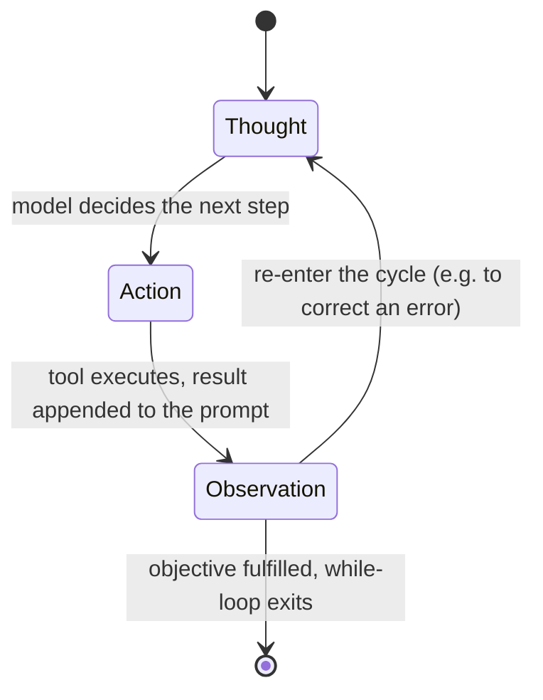

# The agent loop (general agent-engineering concept)

**Scope note.** This is a GENERAL-CONCEPTS page: the shared vocabulary
underlying harness-specific questions, not a claim about how Claude
Code or GitHub Copilot CLI implements anything. Neither harness has a
section here on purpose. If you have not yet read
[agent-topology.md](agent-topology.md), start there first -- it
classifies what kinds of agentic systems exist (reactive vs.
deliberative, single- vs. multi-agent, tool-augmented vs. autonomous)
and where a single agent's Thought/Action/Observation loop sits among
them, before this page grounds that loop's own mechanics. Any statement about a specific harness's loop
(where its stop condition lives, how it formats tool results, what its
turn boundaries are) needs that harness's own docs/repo citation and
belongs on its own topic page. Treating a framework-general course as
evidence about one product's internals would be authority overreach.
For Claude Code's and OpenCode's own documented/verified loop mechanics,
see [agent-loop-implementations.md](agent-loop-implementations.md).

## 1. The loop, as commonly taught

VERIFIED (Hugging Face Agents Course, Unit 1, "Agent steps and
structure", fetched 2026-07-30): the cycle is named
**Thought -> Action -> Observation**, and the course defines each step
in these terms:

- **Thought** -- "The LLM part of the Agent decides what the next step
  should be."
- **Action** -- "The agent takes an action by calling the tools with
  the associated arguments."
- **Observation** -- "The model reflects on the response from the
  tool."

VERIFIED (same page): the control flow is explicitly a loop, described
via a programming analogy -- "the agent uses a **while loop**: the loop
continues until the objective of the agent has been fulfilled." The
page attributes the pattern to the **ReAct cycle**, and notes the loop
is genuinely cyclical rather than one-shot: if an observation reports
an error, the agent can "re-enter the cycle to correct its approach"
instead of stopping.

## 2. Observations are appended to context, not returned to a caller

VERIFIED (Hugging Face Agents Course, Unit 1, "Observations", fetched
2026-07-30): observations are "how an Agent perceives the consequences
of its actions" -- "signals from the environment." The mechanical
sequence the course teaches is: parse the action to identify function
and arguments, execute it, then "Append the result as an Observation."
That append happens **at the end of the prompt**, integrating "the new
information into its existing context, effectively updating its
memory."

This is the single most load-bearing fact for performance work: the
loop's state IS the growing prompt. Each turn's observation is
permanent input for every later turn, so tool-output volume is context
cost, not just I/O cost.

VERIFIED (same page): five observation categories are taught -- system
feedback (errors, status codes), data changes (file/database
modifications), environmental data (metrics, sensor readings), response
analysis (API/computation output), and time-based events.

## 3. How an action gets out of the model: stop-and-parse

VERIFIED (Hugging Face Agents Course, Unit 1, "Actions", fetched
2026-07-30): the course names three agent shapes by action format --
**JSON agent** (action expressed as JSON), **code agent** ("the Agent
writes a code block that is interpreted externally"), and
**function-calling agent**, described as "a subcategory of the JSON
Agent which has been fine-tuned to generate a new message for each
action."

VERIFIED (same page): the **stop-and-parse approach** has three parts
-- the agent emits the action in "a clear, predetermined format (JSON
or code)"; the LLM must "stop generating additional tokens" once the
action is complete; an external parser then reads the action, picks the
tool, and extracts parameters. Completion is signalled in a
format-specific way (a terminal structured action object for JSON
agents; the course's code-agent example uses `print(final_answer)`).

## 4. Why the vocabulary matters for profiling

BEST CURRENT UNDERSTANDING, UNCONFIRMED (reasoning from the verified
material above, not stated as such by any source fetched here): the
three step names map cleanly onto three distinct failure classes worth
separating when reading a real run -- bad Thought (the model chose the
wrong next step given adequate evidence), bad Action (right intent,
wrong tool or wrong arguments), and bad Observation handling (the
result was returned but not integrated, so the agent repeats work).
Keeping them distinct is what makes "the agent was slow" resolvable
into a specific layer rather than a vibe.

## Sources

- Hugging Face Agents Course, Unit 1 --
  `huggingface.co/learn/agents-course/unit1/agent-steps-and-structure`,
  `.../unit1/observations`, `.../unit1/actions`. Fetched 2026-07-30.
  Authoritative for general agent-engineering concepts, terminology,
  and pedagogically taught patterns; framework-general
  (smolagents/LangGraph/LlamaIndex), explicitly NOT a deep dive into
  any specific harness's internals.
- ReAct is named by the course as the origin of the pattern. The
  original ReAct paper (Yao et al.) was NOT fetched this session --
  treat the attribution as the course's claim, not as an independently
  verified reading of the paper.
