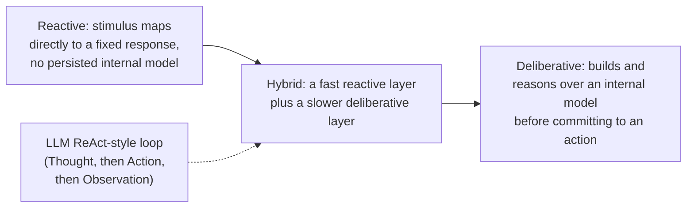
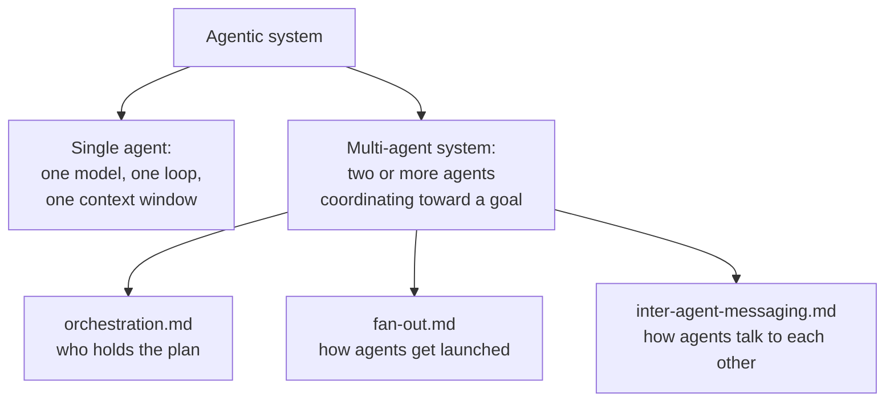
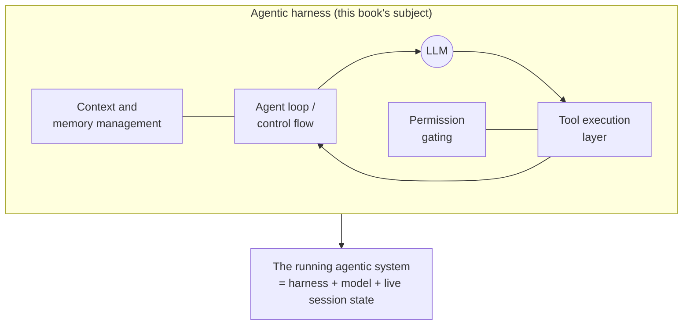

# A topology of agentic systems (general agent-engineering concept)

**Scope note.** This is a GENERAL-CONCEPTS page, and it is deliberately
the first page in this book's own reading order -- it precedes
[agent-loop.md](agent-loop.md). Where agent-loop.md starts from "this is
an agent, and here is the Thought/Action/Observation cycle it runs,"
this page starts one level earlier: what kinds of things get called an
"agentic system" at all, along which axes they differ, and where a
Thought/Action/Observation loop and a multi-agent team even sit inside
that wider space. Like agent-loop.md, no harness gets a full dedicated
section here on purpose -- the axes below are drawn from general
agent-engineering sources, not from Claude Code's, Copilot CLI's, or
OpenCode's own documented internals. The one deliberate exception is
the final section, on where a "harness" sits relative to a bare agentic
system, because that vocabulary is this whole book's own subject and
needed at least one direct, dated check against how each harness
actually uses (or doesn't use) the word.

This page is also explicitly NOT a substitute for
[orchestration.md](orchestration.md), [fan-out.md](fan-out.md), or
[inter-agent-messaging.md](inter-agent-messaging.md). Those three pages
are the *implementation* detail of one single axis surveyed below
(single-agent vs. multi-agent) -- who holds the plan, how agents get
launched, and how they talk to each other, each grounded in a specific
harness's documented or source-verified behaviour. This page is the
conceptual scaffold those three build on, not a competing account of
the same ground.

## 1. What counts as an "agent" -- convergence and real divergence

There is no single industry-wide definition of "agent," and the
disagreement is not cosmetic -- different credible sources draw the
line between "agent" and "not an agent" (a script, a chatbot, a
workflow) in different places, and this book's own vocabulary
(established in agent-loop.md via the Hugging Face course's
Thought/Action/Observation framing) sits at one particular point on
that spectrum, not at all of them.

VERIFIED (Anthropic engineering blog, "Building Effective Agents,"
`anthropic.com/engineering/building-effective-agents`, fetched
2026-08-17): Anthropic draws the line at *autonomy over control flow*,
not at tool use itself. It defines **workflows** as "systems where LLMs
and tools are orchestrated through predefined code paths," and
**agents** as "systems where LLMs dynamically direct their own
processes and tool usage, maintaining control over how they accomplish
tasks." On this definition, a system that calls an LLM inside a fixed
pipeline is a workflow even if that pipeline calls ten tools; a system
only earns the word "agent" once the model itself is choosing which
step comes next. The same post frames the agent's own internal shape
minimally: "Agents can handle sophisticated tasks, but their
implementation is often straightforward. They are typically just LLMs
using tools based on environmental feedback in a loop," with the
model expected to "gain 'ground truth' from the environment at each
step (such as tool call results or code execution) to assess its
progress." Anthropic also frames autonomy as something to add
deliberately rather than by default, advising "finding the simplest
solution possible, and only increasing complexity when needed," since
agentic systems "trade latency and cost for better task performance."

VERIFIED (Claude Code docs, `code.claude.com/docs/en/agent-sdk/overview`,
fetched 2026-08-17): Claude Code's own documentation gives a one-line
working definition consistent with Anthropic's blog post but phrased
around planning specifically: "An agent is an application that
completes a task by planning its own steps and calling tools that read
files, run commands, or edit code." Planning-your-own-steps is doing
the same definitional work here that "dynamically direct their own
processes" does in the blog post.

VERIFIED (Hugging Face Agents Course, Unit 1, "What are agents?",
`huggingface.co/learn/agents-course/unit1/what-are-agents`, fetched
2026-08-17): the course gives a broader, more architecturally explicit
definition -- "An Agent is a system that leverages an AI model to
interact with its environment in order to achieve a user-defined
objective" -- and immediately decomposes it into a **Brain** (the AI
model, which "handles reasoning and planning" and "decides which
Actions to take based on the situation") and a **Body** ("everything
the Agent is equipped to do," i.e. the scope of its tools and
capabilities). Unlike Anthropic's framing, the course does not draw a
sharp line against predefined-path systems; it treats reasoning,
planning, and tool-mediated action as the defining triad regardless of
how much of the control flow is fixed in advance.

These two framings genuinely disagree at the edges: a strictly
turn-by-turn scripted pipeline that calls an LLM to fill in each step's
content would likely fail Anthropic's "workflow, not agent" test while
still satisfying the Hugging Face course's broader "AI model acting on
tools toward an objective" test. Neither is wrong -- they are answering
slightly different questions (Anthropic's post is prescriptive
engineering guidance about *when to reach for* agent-level autonomy;
the course's page is a pedagogical definition meant to cover the whole
space a learner will encounter). This book's own default usage, set by
agent-loop.md, leans toward the Hugging Face framing -- it treats the
ReAct-style Thought/Action/Observation while-loop as the paradigm case
of "agent" -- while still finding Anthropic's workflow/agent boundary
useful whenever a harness page (e.g. [orchestration.md](orchestration.md)'s
treatment of Claude Code's Dynamic workflows tool) needs to describe a
system that mixes fixed and dynamically-directed control flow in the
same run.

## 2. Axis one -- reactive vs. deliberative

VERIFIED (arXiv:2505.10468, "AI Agents vs. Agentic AI: A Conceptual
Taxonomy, Applications and Challenges," `arxiv.org/html/2505.10468v1`,
fetched 2026-08-17): the paper distinguishes reactive from
deliberative behaviour along its own "mechanisms" axis. It characterises
reactive behaviour as basic stimulus-response capacity -- "reactivity
refers to an agent's capacity to respond to changes in its
environment" -- typically paired with "basic learning heuristics" and a
limited planning horizon, in contrast to deliberative or planning-based
behaviour, which it associates with "recursive reasoning capabilities,"
"dynamic task decomposition," and "multi-step reasoning and planning
mechanisms" that support adaptive re-planning as circumstances change.

BEST CURRENT UNDERSTANDING, UNCONFIRMED (not independently verified
against the original texts this session): the reactive/deliberative
vocabulary the 2025 taxonomy paper is drawing on is older than
LLM-based agents -- it is inherited from classical AI and robotics
agent-architecture literature (canonically associated with the
subsumption-architecture line of work on purely reactive robot control,
and with multi-agent-systems textbooks that treat "purely reactive,"
"deliberative," and "hybrid" as the three standard architectural
families). This book did not fetch that original literature directly
this session, so the historical attribution is offered as reasoned
context, not as a verified citation.

Where does the Thought/Action/Observation loop this book grounds in
agent-loop.md sit on this axis? BEST CURRENT UNDERSTANDING, UNCONFIRMED
(reasoning from the verified material above, not stated in those terms
by any source fetched here): a single ReAct-style LLM agent is neither
purely reactive nor purely deliberative in the classical sense. It is
closer to the **hybrid** family -- each Thought step performs a bounded
act of reasoning against the model's current context (a lightweight,
single-step deliberation), but the loop as a whole has no persistent,
explicitly-represented world model that survives outside the context
window the way a classical deliberative planner's internal model would;
its "planning" is re-derived, from scratch, out of the conversation
history at every single step. This is a genuinely different shape from
either extreme, which is part of why the taxonomy paper's newer
"agentic AI" framing (below) had to be introduced rather than the
classical reactive/deliberative pair being sufficient on its own once
LLMs entered the picture.

## 3. Axis two -- single-agent vs. multi-agent systems

VERIFIED (Hugging Face Agents Course, Unit 2.1, "Multi-Agent Systems,"
`huggingface.co/learn/agents-course/unit2/smolagents/multi_agent_systems`,
fetched 2026-08-17): the course frames the split plainly -- "Instead of
relying on a single agent, tasks are distributed among agents with
distinct capabilities" -- and gives two concrete reasons to prefer
several narrow agents over one broad one: focus/performance ("Each
agent is more focused on its core task, thus more performant") and
cost/latency ("Separating memories reduces the count of input tokens
at each step, thus reducing latency and cost"). It also names
modularity, scalability, and robustness as broader architectural
benefits of splitting a system this way, with a designated orchestrator
agent typically coordinating the specialised agents beneath it.

VERIFIED (arXiv:2505.10468, fetched 2026-08-17): the same paper's
central conceptual move is to name this exact split as its top-level
taxonomy distinction, using "AI Agents" for the monolithic case and
"Agentic AI" for the coordinated case. It describes an "AI Agent" as an
"autonomous software entit[y] engineered for goal-directed task
execution within bounded digital environments," operating with "high
autonomy within specific tasks" but confined to a single, isolated
scope of work. It describes "Agentic AI" as a "system of multiple AI
agents collaborating to achieve complex goals," with "multiple,
specialised agents that coordinate, communicate, and dynamically
allocate sub-tasks" under what the paper calls "orchestrated autonomy."
Its comparison table contrasts the two directly on task complexity
(single/specific tasks vs. complex/multi-step tasks), collaboration
(independent operation vs. multi-agent collaboration), and learning
scope (adaptation within one domain vs. adaptation across a wider
range).

Both sources converge on the same underlying claim from different
directions: a multi-agent system is not merely "more agents" as a raw
count, it is a claim about *where responsibility is drawn* -- each
agent gets its own bounded scope, its own context, and (per the Hugging
Face course) frequently its own memory, with a coordination layer
sitting above them to decide who does what and in what order.

This is precisely the boundary this book draws structurally, not just
conceptually: [orchestration.md](orchestration.md) is the page that
answers "who holds the plan once a multi-agent classification applies"
for Claude Code (subagents/skills/agent teams and the Dynamic
workflows tool), Copilot CLI (`/fleet` and its named orchestrator
agent), and OpenCode (its primary-agent/subagent taxonomy);
[fan-out.md](fan-out.md) answers "how do the additional agents actually
get launched" for all three; and
[inter-agent-messaging.md](inter-agent-messaging.md) answers "once
launched, what is the actual wire format they use to talk." None of
those three pages re-derives the single-vs-multi-agent classification
itself -- they assume it, the way this section supplies it. A reader
who wants Claude-Code-specific, Copilot-CLI-specific, or
OpenCode-specific multi-agent mechanics should go to those three pages
next; this page stops at the conceptual boundary they build on.

## 4. Axis three -- tool-augmented vs. fully autonomous

VERIFIED (Anthropic engineering blog, fetched 2026-08-17, same source
as §1): Anthropic's own workflow/agent distinction doubles as a
tool-augmentation/autonomy axis. A tool-augmented *workflow* calls
tools from within a fixed, human-authored code path -- the tools extend
what the system can *do*, but a human (or a static program) still
decides *when* and *in what order* those tool calls happen. A *fully
autonomous agent*, on the same source's terms, hands that ordering
decision to the model itself, with the human's role reduced to
supplying the initial "command from, or interactive discussion with,"
the user, after which "agents plan and operate independently."

VERIFIED (arXiv:2505.10468, fetched 2026-08-17): the taxonomy paper
draws an equivalent line under different names. It describes
"Tool-augmented AI Agents" as systems that "integrate external tools,
APIs, and computation platforms into the agent's reasoning pipeline" --
this is the paper's baseline "AI Agent" category, still confined to a
single bounded task. It reserves a step beyond mere tool augmentation
for its "Agentic AI" category, where "orchestrators [meta-agents]
coordinate the lifecycle of subordinate agents, manage dependencies,
assign roles, and resolve conflicts" -- i.e., autonomy is exercised not
just over individual tool calls but over which *other agents* get
invoked and when.

BEST CURRENT UNDERSTANDING, UNCONFIRMED (reasoning from both verified
sources above, not stated as a single spectrum by either source
directly): read together, "tool-augmented" and "fully autonomous" are
better treated as the two ends of a continuum than as a binary label a
system either has or lacks. A concrete system can sit anywhere along
it: a fixed pipeline that calls one tool at one step is
tool-augmented-but-not-autonomous; a ReAct-style single agent that
picks its own next tool call each turn is meaningfully more autonomous
at the per-step level while still bounded to one task; and a
multi-agent system whose orchestrator itself decides which subordinate
agents to spawn, in what order, is autonomous at a level above
individual tool calls entirely. Anthropic's explicit advice to add
autonomy incrementally, only "when needed," is best read as advice
about *where on this continuum* to land for a given task, not as advice
to pick one of two discrete modes.

## 5. The component decomposition -- "LLM + tools + memory + planning" and its rivals

A separate, cross-cutting question from the three axes above is: once
something qualifies as an agent, what are its *parts*? Credible sources
disagree here too, and the disagreement runs from minimal to
maximal.

VERIFIED (Lilian Weng, "LLM Powered Autonomous Agents,"
`lilianweng.github.io/posts/2023-06-23-agent/`, fetched 2026-08-17):
this widely-cited engineering blog post gives the most decomposed,
four-part architecture in circulation, built around treating the LLM as
the agent's "brain, complemented by several key components":

- **Planning** -- subgoal decomposition ("The agent breaks down large
  tasks into smaller, manageable subgoals") plus "reflection and
  refinement," i.e. the agent learning from its own past mistakes
  within a run.
- **Memory** -- explicitly split into **short-term memory**, realised
  as in-context learning inside the model's finite context window, and
  **long-term memory**, realised as an "external vector store that the
  agent can attend to at query time, accessible via fast retrieval."
- **Tool use** -- the agent "learns to call external APIs for extra
  information that is missing from the model weights," covering
  current information, code execution, and access to proprietary data.

VERIFIED (Hugging Face Agents Course, fetched 2026-08-17, same source
as §1): the course's Brain+Body pair is narrower. Reasoning and
planning are folded into the single "Brain" component rather than
broken out as their own module, and the course does not name a
distinct memory component at all -- it only gestures at contextual
adaptation ("learn from dialogues," "adapt their responses") without
giving memory its own architectural box the way Weng's post does.

VERIFIED (Anthropic engineering blog, fetched 2026-08-17, same source
as §1): Anthropic's framing is the narrowest of the three. It names no
dedicated memory or planning module at all -- an agent is, in its own
words, "typically just LLMs using tools based on environmental feedback
in a loop." Planning is not a separate component here; it is an
emergent property of what the model does inside that loop, and memory
is not named as an architectural element distinct from the
loop's growing conversation history.

| Source | Components named as distinct | Where planning lives | Where memory lives |
|---|---|---|---|
| Lilian Weng, LLM Powered Autonomous Agents | LLM core, Planning, Memory (short/long-term), Tools | Its own module (decomposition + self-reflection) | Its own module, split into context-window short-term and vector-store long-term |
| Hugging Face Agents Course | Brain (AI model), Body (tools/capabilities) | Inside the Brain, undifferentiated from reasoning | Not named as a distinct component |
| Anthropic, Building Effective Agents | LLM, tools, environmental feedback loop | Emergent from the loop, not a named module | Emergent from the loop's context, not a named module |

BEST CURRENT UNDERSTANDING, UNCONFIRMED (this book's own editorial
observation, not a claim made by any source above): this book's
existing pages already reflect the narrow end of this spectrum, not
the broad one, and it is worth being explicit about that choice.
agent-loop.md grounds the loop itself in the narrow Thought/Action/
Observation terms; memory and planning are each given their own
dedicated pages ([memory-management.md](memory-management.md),
[context-compression.md](context-compression.md), and
[instruction-context-budget.md](instruction-context-budget.md)) as
harness-specific *mechanisms layered onto* the loop, rather than being
treated as a fourth and fifth architectural primitive baked into the
loop's own definition the way Weng's four-part diagram treats them.
Both choices are internally consistent -- they are just different
granularities of the same underlying system -- and a reader coming from
material that uses Weng's broader four-module vocabulary should expect
this book's "memory" and "planning" content to appear as separate
topic pages describing concrete harness mechanisms, not as a single
unified architecture section.

## 6. Where a "harness" sits relative to a bare agentic system

Every axis above describes properties of an agentic system in the
abstract. None of them, on their own, distinguishes "the model," "the
code that wraps the model," and "the whole running thing you'd point
at and call an agent" -- and in casual usage the word "agent" gets
applied to all three interchangeably. This book exists specifically to
document the middle layer, so it is worth grounding the word "harness"
itself rather than assuming a shared definition.

VERIFIED (Claude Code docs glossary, `code.claude.com/docs/en/glossary`,
entry "Agentic harness," fetched 2026-08-17): Claude Code's own
documentation gives the most precise definition of the term found this
session, and draws the boundary exactly where this book draws it:
"The tools, context management, and execution environment that turn a
language model into a capable coding agent. Claude Code is the harness;
Claude is the model inside it. The harness supplies file access, shell
execution, permission gating, memory loading, and the loop that chains
actions together." The same glossary separately defines "Agentic loop"
as "the cycle Claude works through for every task: gather context, take
action, verify results, and repeat until done," explicitly naming that
loop as one of the things the harness *supplies*, not something
separate from it. Under this framing, the "agent" in the everyday sense
of "the thing that did the task" is really the harness-plus-model pair
operating together over a live session -- the model alone, without the
harness's file access, permission gating, and loop-chaining, cannot act
on an environment at all, and the harness alone, without a model
sitting inside it, has nothing to direct.

VERIFIED (Anthropic, "A harness for every task: dynamic workflows in
Claude Code," `claude.com/blog/a-harness-for-every-task-dynamic-workflows-in-claude-code`,
fetched 2026-08-17): this post uses "harness" the same way, as a
structural scaffold distinct from the model's own intelligence -- it
describes Claude Code as able to "write its own harness on the fly,
custom-built for the task at hand," contrasted with "the default Claude
Code harness," which "is built for coding." This is the same dynamic
workflows / Workflow tool mechanism [orchestration.md](orchestration.md)
already documents in harness-specific detail (script-held plans,
`agent()`/`pipeline()`, concurrency and total-agent caps); this page
cites the post only for its use of the word "harness" itself, not for
any mechanic beyond what orchestration.md already grounds.

The other two harnesses this book covers do not use the word as
consistently. VERIFIED (OpenCode docs, `opencode.ai/docs/`, fetched
2026-08-17): OpenCode's own current landing page describes the product
in a single sentence -- "OpenCode is an open source AI coding agent" --
and does not use the word "harness" to describe itself anywhere on
that page, despite architecturally performing the identical role
Claude Code's glossary calls a harness (a tool-execution loop, session
management, and a permission layer wrapped around a caller-supplied
model, all independently source-verified elsewhere in this book --
see [permissions-and-sandboxing.md](permissions-and-sandboxing.md) and
[session-persistence.md](session-persistence.md)). This is a genuine,
directly-observed terminology gap, not an inference: a targeted fetch
of OpenCode's own docs turned up "agent," not "harness," as its
self-description. For Copilot CLI, this session did not find the word
"harness" used in a direct fetch of `docs.github.com/copilot` material;
that absence is UNCONFIRMED-as-absent rather than proven, since it
rests on a targeted web search rather than an exhaustive read of every
page in that documentation set.

BEST CURRENT UNDERSTANDING, UNCONFIRMED (this book's own synthesis,
consistent with but not identical to any single source above): the
word "harness" is Claude Code's own preferred term for the
infrastructure layer, adopted by this book as its umbrella term
precisely because it is the most precisely defined one found across
the three products -- but the *concept* it names (a runtime substrate
supplying tool execution, context/memory handling, permission gating,
and loop control around one or more models) is not Claude-Code-specific,
and this book applies it to Copilot CLI and OpenCode by architectural
analogy, not because either product uses the word for itself. This is
also the resolution to the "agent" ambiguity flagged above: when this
book says "agent," in a harness-specific page, it usually means either
(a) the model-plus-loop unit running inside a harness (a Claude Code
subagent, an OpenCode primary/subagent), or (b) the whole running
harness-plus-model system informally, matching how OpenCode's own docs
use the word about the whole product. Which sense is meant should
always be recoverable from context in a given page; if it isn't, that
page has a real ambiguity worth flagging as a documentation gap, not a
license to blend the two silently.

## 7. Putting the axes together

The four classification axes above (reactive/deliberative,
single-agent/multi-agent, tool-augmented/fully-autonomous, and
narrow/broad component decomposition) are independent of each other --
a system's position on one does not fix its position on another. A
single ReAct-style agent sits hybrid-leaning-deliberative on axis one,
single-agent by definition on axis two, somewhere in the
tool-augmented-to-autonomous middle on axis three depending on how much
of its own control flow it directs, and can be described with either
the narrow (Anthropic-style) or broad (Weng-style) component vocabulary
on axis four without changing anything about how it actually behaves --
the axes describe the same system from different angles, not different
systems. A multi-agent orchestration built from several such agents
adds a fifth, compositional question this page deliberately leaves to
[orchestration.md](orchestration.md), [fan-out.md](fan-out.md), and
[inter-agent-messaging.md](inter-agent-messaging.md): once you have more
than one agent, how do you decide who plans, who launches whom, and how
they exchange information -- three questions this page's own
single-agent-vs-multi-agent axis does not itself answer.

With that scaffold in place, [agent-loop.md](agent-loop.md) is the next
page in this book's reading order: it takes the paradigm case
identified here -- a single, hybrid-reactive, tool-augmented,
narrowly-decomposed agent -- and grounds its Thought/Action/Observation
mechanics in detail.

## Sources

- Anthropic engineering blog, "Building Effective Agents,"
  `anthropic.com/engineering/building-effective-agents`. Fetched
  2026-08-17. Authoritative for Anthropic's own workflow/agent
  distinction and design guidance; not treated here as evidence about
  any other vendor's products.
- Claude Code docs, "Agent SDK overview,"
  `code.claude.com/docs/en/agent-sdk/overview`, and glossary,
  `code.claude.com/docs/en/glossary` (entries "Agentic harness" and
  "Agentic loop"). Fetched 2026-08-17. Authoritative for Claude Code's
  own documented terminology and definitions.
- Anthropic, "A harness for every task: dynamic workflows in Claude
  Code,"
  `claude.com/blog/a-harness-for-every-task-dynamic-workflows-in-claude-code`.
  Fetched 2026-08-17. Cited only for its use of the word "harness";
  its Dynamic workflows mechanics are grounded separately in
  orchestration.md.
- Hugging Face Agents Course, Unit 1, "What are agents?"
  (`huggingface.co/learn/agents-course/unit1/what-are-agents`) and Unit
  2.1, "Multi-Agent Systems"
  (`huggingface.co/learn/agents-course/unit2/smolagents/multi_agent_systems`).
  Fetched 2026-08-17. Authoritative for general agent-engineering
  concepts and pedagogically taught vocabulary; framework-general, not
  a claim about any specific harness's internals.
- Lilian Weng, "LLM Powered Autonomous Agents,"
  `lilianweng.github.io/posts/2023-06-23-agent/`. Fetched 2026-08-17.
  A widely-cited independent engineering blog post, not an official
  vendor or course source -- treated here as a named, directly-fetched
  source for one specific, commonly-referenced component decomposition,
  not as a standard-setting authority.
- arXiv:2505.10468, "AI Agents vs. Agentic AI: A Conceptual Taxonomy,
  Applications and Challenges," `arxiv.org/html/2505.10468v1`. Fetched
  2026-08-17. An academic preprint, cited directly for its own
  taxonomy; its reactive/deliberative vocabulary is presented by that
  paper as inherited from older classical AI/robotics literature which
  this book did not independently fetch (flagged in §2 as BEST CURRENT
  UNDERSTANDING on the historical-lineage point only, not on the
  paper's own content).
- OpenCode docs, `opencode.ai/docs/`. Fetched 2026-08-17. Authoritative
  for OpenCode's own documented self-description; checked specifically
  for, and found not to use, the word "harness."
- `docs.github.com/copilot` -- searched, not exhaustively fetched, this
  session for the word "harness"; its absence there is flagged
  UNCONFIRMED-as-absent rather than proven in §6.
