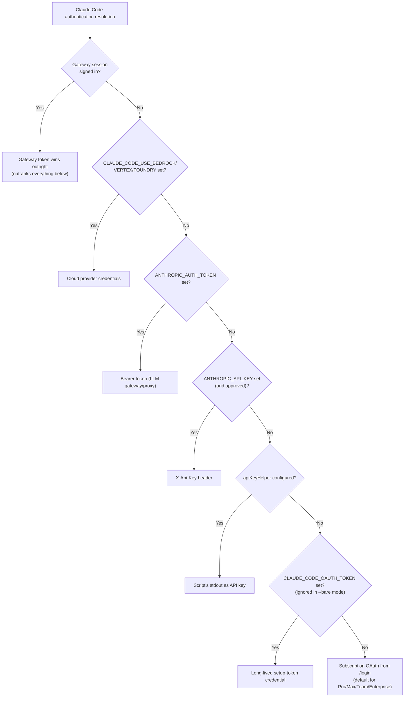
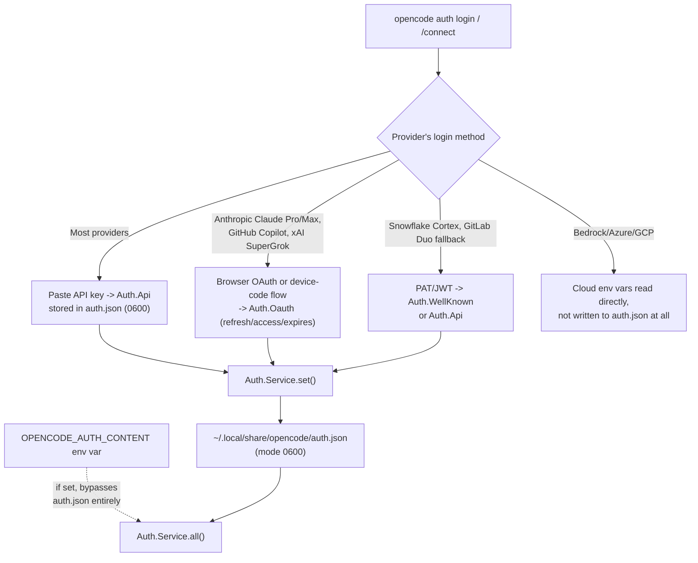
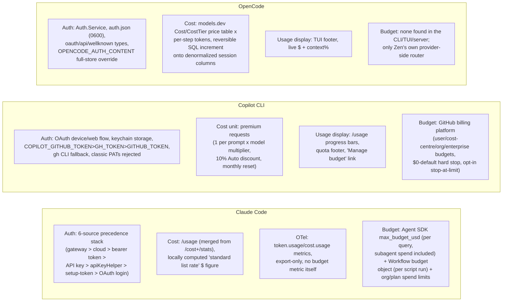

# Auth & usage accounting

This page is the dedicated treatment of a question no prior page in this book has
covered as its main subject: **how a harness proves who is calling the model, how it
counts and prices what that calling costs, and what mechanisms (if any) stop a session
from spending past a limit.** It was prompted by a real, if narrow, prior touchpoint --
Claude Code's Workflow tool exposes a `budget` object (`budget.total`, `budget.spent()`,
`budget.remaining()`) to a workflow script, mentioned only in passing in
[orchestration.md](orchestration.md) and [fan-out.md](fan-out.md) as one property of the
Workflow tool's scripting surface, never as a worked mechanism in its own right. This
page covers that budget object properly, alongside the much larger surface around it:
API-key/OAuth authentication, credential storage and precedence, the accounting of
tokens into a dollar figure, and every harness's own answer (or lack of one) to "what
enforces a spending ceiling."

Three existing pages already carry adjacent material this page cross-references rather
than repeats. [caching.md](caching.md) §1.6/§2.4/§3 already gives the full field-level
breakdown of cache-hit vs. cache-miss token observability (`cache_creation_input_tokens`,
`cache_read_input_tokens`, the OTel GenAI cache attributes, OpenCode's `cacheReadInputTokens`/
`cacheWriteInputTokens`) -- this page assumes those fields exist and focuses on the layer
above them: how a dollar figure and a spend ceiling are built on top of raw token counts.
[agent-loop-implementations.md](agent-loop-implementations.md) §1 already introduced
Claude Code's Agent SDK `max_turns`/`max_budget_usd` caps and their `ResultMessage`
subtypes in the context of the agent loop itself; this page expands that into the fuller
budget-enforcement mechanics (soft-vs-hard-cap semantics, subagent spend attribution, the
`Budget limit reached` failure mode) without re-deriving the loop diagram already there.
[model-routing-and-selection.md](model-routing-and-selection.md) §2.4 already documents
Copilot CLI's four BYOK environment variables in a model-routing context; this page adds
only the auth-specific fact those variables carry (a BYOK session skips GitHub
authentication entirely) rather than re-listing the variables themselves.

Every factual claim below is tagged VERIFIED (fetched this session from a named
authoritative source) or BEST CURRENT UNDERSTANDING, UNCONFIRMED. The three harnesses'
answers to "auth and usage accounting" turn out to differ in kind, not just in detail:
Claude Code has the deepest documented precedence stack and the only harness-native,
in-product spend-cap primitives (Agent SDK `max_budget_usd`, the Workflow tool's own
`budget` object); Copilot CLI's accounting is denominated in "premium requests" rather
than raw dollars, with organization-level budget enforcement living in GitHub's billing
platform rather than in the CLI itself; OpenCode has a fully source-readable, provider-
price-table-driven cost accumulator but, as far as this session's research found, no
user-facing spend ceiling anywhere in the harness proper -- the only budget-enforcement
code in its own repository belongs to OpenCode Zen, the company's own hosted model
gateway, not to a session a user runs locally.

## 1. Claude Code

### 1.1 Authentication methods and the login flow

VERIFIED (`code.claude.com/docs/en/authentication`, fetched this session): running
`claude` for the first time opens a browser window for an OAuth login unless
`ANTHROPIC_API_KEY` is already set in the environment, in which case Claude Code skips
the login prompt entirely and instead asks the user to approve the key. Six account
types authenticate through this same entry point: a Claude Pro or Max subscription, a
Claude for Teams or Enterprise account, a Claude Console account, a cloud provider
(Amazon Bedrock, Google Cloud's Agent Platform, or Microsoft Foundry, selected via an
interactive "3rd-party platform" setup wizard rather than a browser login), and a
self-hosted Claude apps gateway session signed in through corporate SSO. `/logout` clears
the stored credential and also resets first-launch setup state, so the next `claude`
invocation walks through login and setup again. Organizations can pin login further with
two managed-settings keys, `forceLoginMethod` and `forceLoginOrgUUID`: with both set,
Claude Code restricts login to a named Anthropic organization and exits at startup if the
active credential belongs to a different one.

VERIFIED (`code.claude.com/docs/en/authentication`, fetched this session): the enforcement
of these two keys is uneven across the paths a developer can authenticate from --
terminal logins, the VS Code extension, and the Agent SDK enforce both `forceLoginMethod`
and `forceLoginOrgUUID`; `claude setup-token` and `/install-github-app` enforce only
`forceLoginMethod`, deliberately, so a token can still be minted in a different
organization; and gateway sign-in is *selected by* `forceLoginMethod: "gateway"` rather
than restricted by it, since a gateway session never authenticates against an Anthropic
organization at all. Cloud-provider sessions (Bedrock/Vertex/Foundry) authenticate against
the cloud provider directly and are not blocked by either key -- an org restricting those
must do so through its own cloud IAM policy instead. VERIFIED, same source, changelog
detail folded into the docs page itself: as of Claude Code v2.1.212, every login path
enforces `forceLoginMethod`; before that version, only terminal logins did. This dated
claim is independently corroborated by this session's own read of
`anthropics/claude-code`'s `CHANGELOG.md` at v2.1.212: "Changed Enterprise
`forceLoginMethod` to be enforced for VS Code extension, SDK, `setup-token`, and
`install-github-app` logins, not just the terminal." A related, once-broken interaction
was fixed one version earlier: `CHANGELOG.md` v2.1.211 records "Fixed `forceLoginOrgUUID`/
`forceLoginMethod` managed-settings policies blocking third-party provider sessions
(Bedrock, Vertex, Foundry, Mantle) alongside the org pin (regression in 2.1.146)" --
i.e., the org-pin keys had, for a period starting at v2.1.146, incorrectly blocked exactly
the cloud-provider sessions the current docs describe as exempt.

### 1.2 Credential storage and the six-source precedence stack

VERIFIED (`code.claude.com/docs/en/authentication`, "Credential management" section,
fetched this session): Claude Code stores OAuth credentials differently per platform --
the encrypted macOS Keychain on macOS; `~/.claude/.credentials.json` at file mode `0600`
on Linux; `%USERPROFILE%\.claude\.credentials.json`, inheriting the user profile
directory's own access controls, on Windows; and under `$CLAUDE_CONFIG_DIR` instead of the
default location when that environment variable is set on Linux or Windows. The stored
file covers five credential shapes: Claude.ai credentials, Claude API credentials,
Microsoft Foundry Auth, Bedrock Auth, Vertex Auth, and Claude apps gateway session tokens.
`.credentials.json` itself is managed exclusively through `/login`/`/logout`; routing
through a custom endpoint instead uses the separate `ANTHROPIC_BASE_URL` environment
variable.

VERIFIED (same source): when more than one credential source is present, Claude Code
resolves which one wins in a fixed, six-step order --

1. **Cloud provider credentials**, when `CLAUDE_CODE_USE_BEDROCK`, `CLAUDE_CODE_USE_VERTEX`,
   or `CLAUDE_CODE_USE_FOUNDRY` is set.
2. **`ANTHROPIC_AUTH_TOKEN`** (environment variable), sent as an `Authorization: Bearer`
   header -- intended for an LLM gateway or proxy authenticating with bearer tokens.
3. **`ANTHROPIC_API_KEY`** (environment variable), sent as an `X-Api-Key` header --
   intended for direct Anthropic API access. Interactively, the user is prompted once to
   approve or decline this key and the choice is remembered (toggle: "Use custom API key"
   in `/config`); in non-interactive mode (`-p`) the key is always used when present.
4. **`apiKeyHelper`** script output -- a custom command, configured in settings, whose
   stdout is used as the API key. Intended for dynamic or rotating credentials such as a
   short-lived token fetched from a vault.
5. **`CLAUDE_CODE_OAUTH_TOKEN`** (environment variable) -- a long-lived, one-year OAuth
   token minted by `claude setup-token`, intended for CI pipelines and scripts where an
   interactive browser login isn't available. Note: bare mode (`--bare`) does not read this
   variable at all; a bare-mode script must instead authenticate with `ANTHROPIC_API_KEY`
   or `apiKeyHelper`.
6. **Subscription OAuth credentials from `/login`** -- the default for Claude Pro, Max,
   Team, and Enterprise users.

A signed-in Claude apps gateway session sits *outside* this numbered list entirely: it is
a provider selection on the same level as Bedrock/Vertex/Foundry, and it outranks all of
them -- when a gateway session exists, none of steps 2 through 6 above are consulted at
all, even if their environment variables are set. VERIFIED, same source, a documented
practical trap: "If you have an active Claude subscription but also have
`ANTHROPIC_API_KEY` set in your environment, the API key takes precedence once approved.
This can cause authentication failures if the key belongs to a disabled or expired
organization" -- the fix given is `unset ANTHROPIC_API_KEY` and checking `/status`, whose
`Login method` row shows the active subscription account and whose separate `API key` row
only appears while a key is actually in use.



VERIFIED (this session's read of `apiKeyHelper`'s own subsection, `code.claude.com/docs/en/authentication`):
by default the helper is re-invoked after five minutes or on an HTTP 401 response, and
`CLAUDE_CODE_API_KEY_HELPER_TTL_MS` overrides that interval. If the script takes longer
than ten seconds to return a key, Claude Code shows a warning in the prompt bar with the
elapsed time. As of v2.1.208, a script that exits with an error, times out, or prints
nothing surfaces the specific error `Your apiKeyHelper script is failing` within three
attempts; before v2.1.208, the same failure surfaced as a generic 401 after roughly ten
silent retries -- both the "within three attempts" behavior and the version number are
independently corroborated by this session's own read of `anthropics/claude-code`'s
`CHANGELOG.md` at v2.1.208: "Fixed `apiKeyHelper` script failures being hidden behind a
generic 401 after ~10 silent retries; the script's own error is now shown within 3
attempts." The mechanism itself is far older than that fix: `CHANGELOG.md` v0.2.74
records "Added support for refreshing dynamically generated API keys (via
`apiKeyHelper`), with a 5 minute TTL" -- i.e., `apiKeyHelper`'s refresh-on-a-timer design
dates to a very early release and the v2.1.208 change only hardened its failure-reporting,
not its core refresh loop.

VERIFIED (`code.claude.com/docs/en/authentication`, "Renew an expiring login"
subsection, fetched this session): a claude.ai or Claude Console login nearing expiry
triggers a startup warning ("Your login expires in 3 days · run `/login` to renew",
v2.1.203+; the window was five days before v2.1.217). The warning is purely informational
-- authentication keeps working until the login actually expires -- but an *expired*,
unrefreshable login (v2.1.206+) makes every subsequent request fail with `Login expired ·
Please run /login` (before v2.1.206 this surfaced as a generic model error instead), and
`/status` (v2.1.210+) shows a dedicated `Login` row reading `Expired — log in again` before
the first failed request even happens. This matters most for unattended sessions: a
background session in agent view or a Remote Control session that outlives its login
simply stalls until a human re-authenticates.

### 1.3 Cost tracking: `/usage`, its `/cost`/`/stats` predecessors, and the statusline

VERIFIED (`code.claude.com/docs/en/costs`, "Track your costs" section, fetched this
session): the `/usage` command's Session block shows per-model token usage and a dollar
figure for the *current* session --

```text
Total cost:            $0.55
Total duration (API):  6m 20s
Total duration (wall): 6h 33m 10s
Total code changes:    0 lines added, 0 lines removed
Usage by model:
   claude-sonnet-4-6:  1.2k input, 5.3k output, 940.0k cache read, 50.0k cache write ($0.55)
```

Two facts about that dollar figure matter for anyone using it to reason about actual
spend. First, VERIFIED (same source): "Claude Code computes the dollar figure locally
from token counts priced at standard list rates, so it doesn't reflect promotional
pricing or contracted discounts and may differ from your actual bill" -- for
authoritative billing, the docs point to the Usage page in the Claude Console instead.
Second, VERIFIED (same source): these session totals reset when `/clear` starts a new
session; before v2.1.211 they instead kept accumulating across `/clear` for the entire
lifetime of the Claude Code process, so a long-lived terminal session's `/usage` figure
used to silently include every prior, unrelated conversation cleared within it. On a Pro,
Max, Team, or Enterprise plan, `/usage` additionally attributes recent usage to skills,
subagents, plugins, and individual MCP servers as percentages of the total, flags
behaviors (long context, cache misses) accounting for 10% or more of recent usage, and
lets `d`/`w` toggle between a 24-hour and a 7-day window; when the usage-limit endpoint
itself is rate-limited, `/usage` falls back to showing the last snapshot loaded within the
past 60 minutes with a `Showing last-known usage` note, a fallback introduced at v2.1.208
(before that version, a rate-limited request in a session with no prior snapshot always
surfaced a bare error).

VERIFIED (`anthropics/claude-code` `CHANGELOG.md`, fetched this session via `gh api`, at
v2.1.118): "Merged `/cost` and `/stats` into `/usage` -- both remain as typing shortcuts
that open the relevant tab." This resolves what would otherwise be a stale-looking
citation elsewhere in this book: [caching.md](caching.md) documents a `/cost` command
gaining a per-model-and-cache-hit breakdown for subscription users, sourced (per that
page's own citation) to a changelog entry at v2.1.92 -- both facts are correct and
non-conflicting once read in sequence: `/cost` was a real, separate command through at
least v2.1.92, and v2.1.118 folded it and `/stats` into today's single `/usage` surface,
keeping `/cost` typeable as a shortcut into it rather than removing the muscle memory.
This session's own read of the changelog corroborates both endpoints independently:
v2.1.92 records "Added per-model and cache-hit breakdown to `/cost` for subscription
users," and three much earlier entries (v1.0.88 "Fixed incorrect usage tracking in
`/cost`", v0.2.108 "Fixed a regression in `/cost` reporting") show `/cost` had already
existed, and already needed correctness fixes, long before the v2.1.118 merge.

VERIFIED (`code.claude.com/docs/en/costs`, "Manage context proactively" section, fetched
this session): the docs point to `/usage` and to a configurable statusline
(`/docs/en/statusline#context-window-usage`) as the two live ways to watch token usage
continuously rather than only at session end, and note that background functionality --
conversation summarization for `claude --resume`, and status-check commands like
`/usage` itself -- consumes a small amount of tokens (typically under $0.04 per session)
even while idle.

### 1.4 OpenTelemetry cost and usage metrics

VERIFIED (`code.claude.com/docs/en/monitoring-usage`, fetched this session): enabling
`CLAUDE_CODE_ENABLE_TELEMETRY=1` alongside `OTEL_METRICS_EXPORTER` (`otlp`/`prometheus`/
`console`/`none`) exports a fixed set of metrics, independent of and complementary to the
locally-computed `/usage` dollar figure in §1.3:

| Metric | Unit | Key attributes |
|---|---|---|
| `claude_code.session.count` | count | `start_type` (`fresh`/`resume`/`continue`/`agents_view`) |
| `claude_code.token.usage` | tokens | `type` (`input`/`output`/`cacheRead`/`cacheCreation`), `model`, `query_source` (`main`/`subagent`/`auxiliary`), `speed`, `effort`, `agent.name`/`skill.name`/`plugin.name`/`mcp_server.name`/`mcp_tool.name` |
| `claude_code.cost.usage` | USD | `model`, `query_source`, `speed`, `effort`, same name-scoped attributes as above |
| `claude_code.lines_of_code.count` | count | `type` (`added`/`removed`), `model` |
| `claude_code.code_edit_tool.decision` | count | `tool_name`, `decision` (`accept`/`reject`), `source` (`config`/`hook`/`user_permanent`/`user_temporary`/`user_abort`/`user_reject`), `language` |
| `claude_code.commit.count` | count | -- |
| `claude_code.pull_request.count` | count | -- |
| `claude_code.active_time.total` | seconds | `type` (`user` keyboard interactions vs. `cli` tool execution/AI responses) |

Enabling `OTEL_LOGS_EXPORTER=otlp` additionally exports per-request events, the richest
of which is `claude_code.api_request` (attributes: `model`, `cost_usd`, `cost_usd_micros`,
`input_tokens`, `output_tokens`, `cache_read_tokens`, `cache_creation_tokens`), alongside
`claude_code.api_error`, `claude_code.api_refusal`, `claude_code.tool_result`, and
`claude_code.tool_decision`. Every metric and event carries a standard attribute set --
`session.id`, an anonymous `user.id`, `user.email`/`user.account_uuid` when authenticated,
`organization.id`, `app.version`, and any custom tags injected via `OTEL_RESOURCE_ATTRIBUTES`
-- and four separate environment variables gate whether sensitive content is included at
all: `OTEL_LOG_USER_PROMPTS`, `OTEL_LOG_ASSISTANT_RESPONSES`, `OTEL_LOG_TOOL_DETAILS`,
`OTEL_LOG_RAW_API_BODIES`.

One structural fact is worth stating plainly, since it bears directly on §1.5 below:
VERIFIED (same source, read in full this session): **the OpenTelemetry export path itself
carries no budget or spend-limit metric of any kind.** It is cost-and-usage *export
only*; a team wanting to alert or block on spend must build that logic in its own
observability backend against the exported `cost.usage` metric or `cost_usd` event field
-- OpenTelemetry is not itself an enforcement layer.

### 1.5 Budget enforcement: three genuinely distinct mechanisms, at three different layers

Claude Code is the only harness examined in this book with more than one distinct,
harness-native mechanism for capping spend, and the three do not compose into a single
system -- they operate at three different layers (a single Agent SDK query, a single
Workflow-tool script run, and an organization's aggregate plan spend), and confusing them
is a real risk, so each is stated separately below with its own scope.

**1.5.1 -- Agent SDK `max_turns`/`max_budget_usd`, per query.** VERIFIED
(`code.claude.com/docs/en/agent-sdk/agent-loop`, fetched this session in full, expanding
on the brief `ResultMessage`-subtype mention already in
[agent-loop-implementations.md](agent-loop-implementations.md) §1): `max_turns`/
`maxTurns` caps the number of tool-use round trips; `max_budget_usd`/`maxBudgetUsd` caps
spend directly. Both default to unlimited -- "Without limits, the loop runs until Claude
finishes on its own, which is fine for well-scoped tasks but can run long on open-ended
prompts... Setting a budget is a good default for production agents." When either limit
is hit, the SDK yields a final `ResultMessage` with `subtype: "error_max_turns"` or
`"error_max_budget_usd"` rather than `"success"`; both subtypes still carry
`total_cost_usd`, `usage`, `num_turns`, and `session_id`, so a caller can inspect spend and
resume even on a budget-terminated run. Critically, VERIFIED (same source): "The budget
cap covers subagents: their spend counts toward the total." As of v2.1.217, once spend
reaches the cap, spawning another subagent fails outright with `Budget limit reached`,
and Claude Code additionally stops any background subagents still running at that
moment -- this session's own read of `anthropics/claude-code`'s `CHANGELOG.md` corroborates
the version independently: v2.1.217 records "Fixed `--max-budget-usd` not stopping
background subagents: once the cap is reached, new spawns are denied and running
background agents are halted," which reads as the *fix* that made the cap-enforcement
behavior the current docs describe actually correct (implying the cap existed before
v2.1.217 but did not reliably stop already-running background subagents until that
release). One more mechanical detail distinguishes this from a hard token/output cap: the
budget check happens *between turns*, not mid-generation, so a turn already in progress
when the cap is crossed is allowed to finish rather than being cut off mid-response.

**1.5.2 -- The Workflow tool's `budget` object, per workflow run.** VERIFIED
(`code.claude.com/docs/en/workflows`, fetched this session; this is the exact mechanism
the handoff for this page named and no prior page in this book has documented as a
worked mechanism): a running dynamic workflow script -- the JavaScript program Claude
writes to orchestrate `agent()`/`pipeline()` calls at scale, documented in full in
[orchestration.md](orchestration.md) §1.3 and [fan-out.md](fan-out.md) -- has access to a
`budget` object exposing `budget.total` (the configured ceiling), `budget.spent()`
(current usage), and `budget.remaining()` (headroom), so the script itself can
self-regulate rather than relying only on the runtime's own hard caps. The documented
usage pattern is a loop guard: `while (budget.remaining() > 50_000) { const batch = await
agent('Find the next 10 unreviewed specs.'); if (!batch.length) break; }` -- an
open-ended fan-out that would otherwise run until it exhausts its input instead stops
once it is close to its budget. A workflow's actual token/dollar budget is set through the
same natural-language interface used to request the workflow itself (for example,
prompting "use 10k tokens"), not through a separate typed configuration surface -- the
`budget` object is a runtime read/write handle inside the generated script, not a
standalone user-facing setting.

This `budget` object is architecturally distinct from, and must not be confused with, the
Anthropic Messages API's own **task budgets** feature. VERIFIED (`platform.claude.com/docs/en/build-with-claude/task-budgets`,
fetched this session in full): task budgets are a beta, API-level `output_config.task_budget`
parameter (`{type: "tokens", total, remaining?}`) that injects a server-side countdown
marker visible only to the model, so Claude can pace itself and wrap up gracefully as an
agentic loop consumes its token allowance -- and the same page states directly: "Task
budgets are **not supported on Claude Code** or Cowork surfaces. Use task budgets
directly through the Messages API on a supported model." Task budgets are also explicitly
a *soft hint, not a hard cap* at the API level ("Claude may occasionally exceed the
budget if it is in the middle of an action that would be more disruptive to interrupt
than to finish"; the actual enforced ceiling there is `max_tokens`, unrelated to
`task_budget`). Claude Code's own Workflow-tool `budget` object is therefore a
harness-built, harness-only mechanism layered on top of ordinary token accounting, not a
CLI-side exposure of the API's `task_budget` beta feature -- the two share a name and a
countdown-style user experience but are otherwise unrelated code paths on unrelated
products.

VERIFIED (`code.claude.com/docs/en/workflows`, "Cost" and "Behavior and limits"
subsections, fetched this session): independent of the `budget` object a script can read,
the workflow *runtime* itself enforces two fixed, non-configurable hard caps regardless
of what the script does -- up to 16 concurrent agents (fewer on CPU-constrained machines)
and 1,000 agents total per run, explicitly "to prevent runaway loops." A separate,
advisory-only warning (not an enforcement mechanism) fires in the task panel when a
workflow schedules more than 25 agents or its projected token total passes 1.5 million; a
user-chosen size guideline (`unrestricted`/`small`/`medium`/`large`, mapping to agent-count
targets under 5/15/50 respectively, `medium` the default since v2.1.219) replaces the flat
25-agent threshold with that guideline's own count, but the warning never pauses or limits
the run by itself -- a user must act on it via `/workflows`.

**1.5.3 -- Organization- and plan-level spend limits.** VERIFIED
(`code.claude.com/docs/en/costs`, "Manage costs for your organization" section, fetched
this session): which spend-capping controls exist at all depends on how an organization
accesses Claude Code -- on a Claude for Teams or Enterprise plan, usage draws from a
per-seat allowance on a rolling five-hour and weekly window (shared with Claude chat and
Cowork), and once usage credits are turned on to let members continue past that
allowance, an admin can additionally set **spend limits** at the organization, group, or
individual-member level from the claude.ai admin console; on the Claude Console (API)
side, an organization instead sets **workspace spend limits** on the auto-created "Claude
Code" workspace from the Console UI, and on Amazon Bedrock, Google Cloud's Agent
Platform, or Microsoft Foundry, spend is capped entirely through that cloud provider's own
budget-control mechanisms, since Claude Code itself sends no metrics back to Anthropic in
that configuration (per-user attribution there instead requires OpenTelemetry export, a
self-hosted Claude apps gateway, or a third-party LLM gateway such as LiteLLM).

VERIFIED, same source: on Pro and Max plans specifically, "when you reach your spend
limit with usage credits still available, Claude Code prompts you to raise or remove the
limit without leaving the CLI." This session's own read of `anthropics/claude-code`'s
`CHANGELOG.md` corroborates active engineering on this exact prompt: v2.1.216 records
"Improved the spend limit adjustment prompt to show the server's reason when a spend limit
change is rejected."

### 1.6 Cloud-provider authentication as a distinct, credential-and-billing bundle

VERIFIED (`code.claude.com/docs/en/third-party-integrations`, fetched this session):
Amazon Bedrock, Claude Platform on AWS, Google Cloud's Agent Platform, and Microsoft
Foundry are each a bundled choice of *both* authentication mechanism and billing/cost-
tracking surface, not independent axes -- for example, Bedrock authenticates via an API
key or AWS credentials and bills/tracks cost through AWS Cost Explorer, while Foundry
authenticates via an API key or Microsoft Entra ID and tracks cost through Azure Cost
Management. `/status` is the documented way to confirm which of these is actually active,
showing lines such as `API provider: Amazon Bedrock`, a gateway base URL if one is
configured, and `AWS auth skipped` when a gateway is handling AWS authentication on
Claude Code's behalf. An organization can additionally route any of these four providers
through a corporate proxy (`HTTPS_PROXY`/`HTTP_PROXY`) or an LLM gateway
(`ANTHROPIC_BASE_URL`/`ANTHROPIC_BEDROCK_BASE_URL`/`ANTHROPIC_VERTEX_BASE_URL`/
`ANTHROPIC_FOUNDRY_BASE_URL`, each paired with a `CLAUDE_CODE_SKIP_*_AUTH` variable when
the gateway itself handles the cloud provider's native auth) -- the docs name centralized
usage tracking, custom rate limiting, and centralized authentication management as the
reasons to add a gateway in the first place, i.e., the gateway pattern exists specifically
to re-centralize the auth/billing bundle that per-developer cloud-provider credentials
otherwise fragment.

## 2. GitHub Copilot CLI

### 2.1 Authentication methods and credential storage

VERIFIED (`docs.github.com/en/copilot/how-tos/copilot-cli/set-up-copilot-cli/authenticate-copilot-cli`,
fetched this session): Copilot CLI's primary, interactive authentication is an OAuth
device flow, triggered by `/login` (or `copilot login` outside the CLI) -- the CLI
generates a one-time code, directs the user to `github.com/login/device`, and stores the
resulting OAuth token in the operating system's native keychain (Keychain Access on
macOS, Credential Manager on Windows, `libsecret` on Linux). This session's own read of
`github/copilot-cli`'s own `changelog.md` (fetched via `gh api`) shows this flow itself
evolving: v1.0.77 (2026-07-30) "Add[ed] a browser-based (web) OAuth login flow, now the
default for `copilot login` on local interactive terminals (device code remains the
default on remote/headless terminals). Use `--web-flow`/`--device-code` to force a mode,
or pick one in the interactive `/login` command" -- i.e., the device-code flow described
in the docs page above is, as of that release, no longer the universal default on every
terminal type, only on remote/headless ones.

VERIFIED (same authentication doc, fetched this session): for CI/CD, containers, and
other non-interactive environments, three environment variables carry a token instead,
checked in this precedence order (highest to lowest): `COPILOT_GITHUB_TOKEN`, `GH_TOKEN`,
`GITHUB_TOKEN`. The docs warn plainly that "an environment variable silently overrides a
stored OAuth token" -- an unrelated `GITHUB_TOKEN` left set in a CI runner's environment
can therefore quietly redirect a Copilot CLI session away from its logged-in account with
no error surfaced. When none of the three variables and no stored OAuth token exist,
Copilot CLI falls back to a locally installed and already-authenticated GitHub CLI's own
token, as the lowest-priority source of all. VERIFIED, same source: accepted token types
are OAuth tokens, fine-grained personal access tokens, and GitHub App user-to-server
tokens -- **classic personal access tokens are explicitly excluded**. This session's own
read of `github/copilot-cli`'s `changelog.md` corroborates that exclusion being enforced,
not merely undocumented: v1.0.5 (2026-03-13) "Show a clear error when a classic Personal
Access Token (`ghp_`) is set in environment variables instead of silently exiting" -- the
change was specifically about *surfacing* a clear error for a case that previously failed
silently, implying classic PATs were already rejected before this release and only the
failure mode improved. The `COPILOT_GITHUB_TOKEN` variable itself is also independently
dated in the changelog, at v0.0.354 (2025-11-03): "Support for `COPILOT_GITHUB_TOKEN`
environment variable for authentication (takes precedence over `GH_TOKEN`)" -- confirming
both the variable's existence and its documented precedence position were introduced
together at that release, well before the BYOK/enterprise-hardening entries covered in
§2.4 below.

VERIFIED (same authentication doc, fetched this session): bring-your-own-key (BYOK)
configuration -- pointing Copilot CLI at a personal LLM provider's own API key -- does
**not** require GitHub authentication at all; the one documented exception is that
certain features remain unavailable without GitHub credentials regardless of BYOK status:
`/delegate`, the GitHub MCP server, and Code Search. (The four BYOK environment variables
themselves -- `COPILOT_PROVIDER_BASE_URL`, `COPILOT_MODEL`, `COPILOT_PROVIDER_TYPE`,
`COPILOT_PROVIDER_API_KEY` -- are documented in full in
[model-routing-and-selection.md](model-routing-and-selection.md) §2.4, since there they
are being examined as a routing mechanism, not an auth mechanism; this page's only new
fact is the auth-optionality claim itself.) Multiple GitHub accounts are supported
side by side via `/user list` and `/user switch`; `/logout` shows a warning when signed in
via `gh` CLI, a personal access token, an API key, or an environment variable, "since
`/logout` only manages OAuth sessions" -- this session's own changelog read dates that
warning to v1.0.25 (2026-04-13).

A separate, security-relevant storage detail is worth stating precisely: VERIFIED
(`github/copilot-cli`'s `changelog.md`, fetched this session, v1.0.51, 2026-05-20):
"Login prompt more clearly warns when token storage falls back to insecure plain text
config file" -- confirming there is a documented fallback path where, presumably when a
system keychain is unavailable, Copilot CLI stores the token in a plain-text config file
rather than the platform keychain described above, and that this fallback is at least
now surfaced to the user with a warning rather than happening silently. This session's
research did not locate the specific doc page or condition that triggers the fallback
beyond this changelog line, so treat the *trigger condition* itself (as opposed to the
fact that the fallback exists and is now warned-about) as BEST CURRENT UNDERSTANDING,
UNCONFIRMED.

### 2.2 Premium requests: the unit Copilot bills usage in

VERIFIED (`docs.github.com/copilot/concepts/copilot-billing/understanding-and-managing-requests-in-copilot`,
fetched this session): GitHub Copilot denominates usage across all its surfaces,
including the CLI, in **premium requests** rather than raw tokens or dollars. A request
is "any interaction where you prompt Copilot to perform a task," and for agentic
features specifically, "only the prompts you send count as premium requests; actions
Copilot takes autonomously to complete your task, such as tool calls, do not." For
Copilot Chat and Copilot CLI, the rate is one premium request per user prompt,
multiplied by the selected model's own request multiplier (most models documented at 1x;
this session's own changelog read finds the multiplier concept itself dated to v0.0.341,
2025-10-14: "Added each model's premium request multiplier to the `/model` list
(currently, all our supported models are 1x)"). Premium request counters reset on the
1st of each month at 00:00:00 UTC, and unused requests never carry over to the following
month.

VERIFIED (same source): when using **Auto model selection** (documented in full in
[model-routing-and-selection.md](model-routing-and-selection.md) §2.3) in Copilot Chat,
Copilot CLI, or Copilot cloud agent, the model routed to qualifies for a 10% multiplier
discount -- so using Auto is, independent of anything else, a way to reduce premium-
request consumption relative to pinning a specific model by hand.

A real, self-reported billing bug is worth flagging as a concrete instance of premium-
request accounting going wrong in practice: this session's own read of
`github/copilot-cli`'s `changelog.md` finds, at v0.0.346 (2025-10-19): "Fixed a bug where
premium requests were being overcounted for some users... If you were affected, we are
working on refunding your overcharged premium requests!" -- an explicit acknowledgment
that the CLI's own request-counting logic had, for a period, billed some users for more
premium requests than they actually made.

### 2.3 Cost/usage observability in the CLI: `/usage`'s own history

VERIFIED (`github/copilot-cli`'s `changelog.md`, fetched this session via `gh api`):
Copilot CLI's `/usage` command has a long, incrementally hardened history distinct from
Claude Code's `/cost`-then-`/usage` merge in §1.3 -- it was introduced from the start as
`/usage`, not merged in from a differently named predecessor. Its origin, at v0.0.333
(2025-10-02): "Added `/usage` slash command to provide stats about Premium request usage,
session time, code changes, and per-model token use. This information is also printed at
the conclusion of a session." Selected subsequent milestones, each independently dated by
this session's own read of the changelog:

| Version | Date | Change |
|---|---|---|
| v0.0.399 | 2026-01-29 | `/usage` includes token consumption from subagents (e.g., the general-purpose agent) |
| v0.0.404 | 2026-02-05 | `GITHUB_TOKEN` environment variable accessible in agent shell sessions |
| v0.0.368 | 2025-12-10 | PRU (premium request unit) usage rates displayed correctly (bug fix) |
| v1.0.6 | 2026-03-16 | Fixed the remaining-requests widget showing inaccurate quota data for Free-plan users |
| v1.0.15 | 2026-04-01 | Config settings including `storeTokenPlaintext` renamed to camelCase (snake_case still accepted) |
| v1.0.32 | 2026-04-17 | Usage-limit warnings shown at approaching 75% and 90% of the *weekly* limit |
| v1.0.34 | 2026-04-20 | Usage-limit warnings shown at 50% and 95% capacity (a separate, session-scoped threshold pair) |
| v1.0.52 | 2026-05-23 | `/usage` shows quota progress bars for session and weekly limits; AI-credits error messages gain a "Manage budget" link |
| v1.0.55 | 2026-05-28 | Free and Student plan users on token-based billing restricted to Auto model selection only |
| v1.0.57 | 2026-06-01 | Underlying reason (e.g. a GitHub API rate limit) surfaced when SDK auth-token validation fails |
| v1.0.58 | 2026-06-02 | Quota footer shows remaining requests as a rounded percentage |
| v1.0.60 | 2026-06-05 | Cache write tokens shown alongside cache read tokens in `/usage`; a `billing` help topic added |
| v1.0.64 | 2026-06-23 | Pay-as-you-go additional-usage budget shown at launch, refreshed after a rejected request, with a friendly message on limit reached |
| v1.0.66 | 2026-06-30 | Subagent concurrency and depth limits configurable in `/settings` for usage-based billing users |
| v1.0.69 | 2026-07-07 | Warning when static context uses most of the prompt budget; requests blocked when little conversation room remains |
| v1.0.71 | 2026-07-16 | Default maximum subagent nesting depth lowered from 6 to 4 to curb runaway recursive delegation (usage-based billing users can still raise `subagents.maxDepth`, up to 128) |

This progression shows a harness moving, release by release, from a bare stats readout
toward genuine budget-awareness surfaced directly in the CLI's own UI (progress bars,
rounded-percentage quota footers, a dedicated "Manage budget" link, and threshold-based
warnings at both a session and a weekly granularity) without ever exposing a typed,
programmable budget object the way Claude Code's Workflow tool does in §1.5.2 -- every
one of the entries above is a *display or warning* improvement, not an enforcement
primitive the CLI itself acts on.

### 2.4 Budget enforcement: GitHub's billing platform, not the CLI itself

VERIFIED (`docs.github.com/en/copilot/concepts/billing/budgets-for-usage-based-billing`,
fetched this session): unlike Claude Code's in-product `budget` object (§1.5.2) or Agent
SDK cap (§1.5.1), Copilot's actual spend-enforcement mechanism lives in GitHub's own
billing platform, at four configurable levels -- user, cost centre, organization, and
enterprise -- governing access to shared AI credits and metered overage charges
together. **A budget set to $0 USD creates an immediate hard stop**: "A $0 USD budget
blocks the user immediately," and the docs state that accounts created before 22 August
2025 default to exactly this -- a $0 budget for Copilot premium requests -- so that
premium requests over the included allowance are rejected outright unless an
administrator edits or deletes that default budget. A separate toggle, "Stop usage when
budget limit is reached," applies only to cost-centre, organization, and enterprise
budgets (not user-level ones, which "always enforce a hard stop and do not have this
setting") and is **off by default** at those three levels -- without it, "charges
continue to accrue" past the configured limit with only a notification, not a block; the
docs explicitly recommend enabling it on every budget an admin creates. Separately,
VERIFIED (`docs.github.com/copilot/concepts/copilot-billing/understanding-and-managing-requests-in-copilot`,
fetched this session): additional premium requests beyond a plan's included monthly
allowance cost $0.04 each and are billed only if the "Premium request paid usage policy"
is enabled (on by default) and a budget permits it; this per-request overage charge is
what the pay-as-you-go "additional usage budget" surfaced in the CLI at v1.0.64 (§2.3
table) is showing the remaining headroom against.

The practical shape of this is therefore the inverse of Claude Code's: Claude Code puts a
programmable budget primitive inside the harness (the Workflow tool's `budget` object) on
top of an organization-level billing-platform ceiling that exists separately; Copilot CLI
has no comparable in-harness budget primitive at all, and instead surfaces (via `/usage`,
per §2.3) an increasingly detailed *read-out* of a budget/quota state that is entirely
configured and enforced one layer up, in GitHub's billing settings.

## 3. OpenCode

### 3.1 The `Auth.Service`: credential storage, three credential shapes, and provider-specific OAuth flows

VERIFIED (direct source read of `packages/opencode/src/auth/index.ts`, `anomalyco/opencode`,
`dev` branch, fetched this session -- **`dev`-branch caveat**: this may not reflect the
current stable release): OpenCode's authentication is a small, self-contained
`Auth.Service` with exactly four operations (`get`, `all`, `set`, `remove`) backed by a
single JSON file at `Global.Path.data/auth.json`, written with mode `0o600`. The file
stores a keyed record of one of three discriminated credential shapes, defined with an
Effect `Schema.Union`:

- **`Oauth`** -- `{ type: "oauth", refresh, access, expires, accountId?, enterpriseUrl? }`,
  a refresh/access token pair with an expiry timestamp.
- **`Api`** -- `{ type: "api", key, metadata? }`, a bare API key plus optional metadata.
- **`WellKnown`** -- `{ type: "wellknown", key, token }`, a distinct shape from `Api` (a
  named key alongside a token) used for providers whose credential model doesn't fit
  either of the other two.

A module-level constant, `OAUTH_DUMMY_KEY = "opencode-oauth-dummy-key"`, exists alongside
these types, suggesting OAuth-authenticated providers still populate an API-key-shaped
field internally with a placeholder value in code paths that expect one to be present --
BEST CURRENT UNDERSTANDING, UNCONFIRMED, since this session did not trace every call site
that reads this constant. VERIFIED, same source: `Auth.all()` checks a single environment
variable, `OPENCODE_AUTH_CONTENT`, before ever touching the file at all -- if set, its
value is `JSON.parse`d directly and returned as the entire credential set, bypassing
`auth.json` entirely. This is a deliberate, source-confirmed mechanism for injecting
credentials into a container or CI job without ever writing them to disk, distinct from
any of the environment-variable mechanisms documented for the other two harnesses in
§1.2/§2.1 above, since it replaces the *whole* credential store in one shot rather than
supplying a single token.

VERIFIED (`packages/web/src/content/docs/cli.mdx`, `anomalyco/opencode`, `dev` branch,
fetched this session, direct read of the `### auth` section): the CLI-facing surface over
this service is `opencode auth login` (flags `--provider`/`-p` to skip provider
selection, `--method`/`-m` to skip login-method selection), `opencode auth list`/`ls`,
and `opencode auth logout`. The same doc states the load-order fact directly: "When
OpenCode starts up it loads the providers from the credentials file. And if there are any
keys defined in your environments or a `.env` file in your project" -- i.e., `auth.json`
is not the sole source consulted at startup even outside the `OPENCODE_AUTH_CONTENT`
override; environment variables and a project-local `.env` file are also merged in. A
structurally separate command, `opencode mcp auth [name]` (and `opencode mcp auth
list`/`ls`), authenticates specifically with an OAuth-enabled remote MCP server rather
than an LLM provider -- this is the same OAuth-for-MCP-servers surface documented from
the protocol side in [mcp-integration.md](mcp-integration.md) §3, confirmed here from the
CLI-command side as a distinct subcommand family from `opencode auth`.

VERIFIED (OpenCode's provider documentation, fetched this session): the interactive
front door to all of this is `/connect`, and provider-specific login methods vary
considerably in shape -- most providers accept a pasted API key directly; **Anthropic
Claude Pro/Max** offers a subscription option that opens a browser for OAuth login with
no manual API key at all; **GitHub Copilot** (as an LLM provider *for* OpenCode, distinct
from GitHub Copilot CLI as a separate harness) uses the same `github.com/login/device`
device-code flow described for Copilot CLI itself in §2.1; **GitLab Duo** offers OAuth or
a personal access token; **DigitalOcean** supports OAuth with auto-discovery of Inference
Routers or a manual Model Access Key; **xAI** offers three paths (browser OAuth for
SuperGrok subscriptions, device-code for headless environments, or a plain API key for
pay-as-you-go); and **Snowflake Cortex** offers a `SNOWFLAKE$LOCAL_APPLICATION` browser-
OAuth security integration (described as rolling out gradually) alongside a PAT/JWT
fallback. Cloud-native providers (Amazon Bedrock, Azure OpenAI, Google Cloud) instead
read standard cloud-credential environment variables (`AWS_PROFILE`, `AZURE_RESOURCE_NAME`,
`GOOGLE_CLOUD_PROJECT`, etc.) set before OpenCode launches, mirroring the same
credential-bundle pattern documented for Claude Code's cloud providers in §1.6.



### 3.2 Cost/usage accounting: a models.dev-priced, per-message, reversible accumulator

This is the most deeply source-verifiable cost-accounting mechanism examined in this
book, in the sense that every step from a model's own listed price to the number shown
in the TUI's footer is readable in OpenCode's own repository.

VERIFIED (`packages/core/src/models-dev.ts`, `anomalyco/opencode`, `dev` branch, fetched
this session): every catalog model carries an optional `Cost` schema --
`{ input, output, cache_read?, cache_write?, tiers?, context_over_200k? }` -- sourced from
the community-maintained Models.dev catalog (the same catalog OpenCode's own CLI docs cite
in §3.1 as the reason `opencode auth login` can configure "any provider you'd like to
use"). The `tiers` field is itself an array of `CostTier` entries, each pairing an
`input`/`output`/`cache_read`/`cache_write` rate with a `{ type: "context", size }`
condition -- i.e., a single model can carry *context-size-tiered* pricing, and a separate
`context_over_200k` field carries a distinct rate specifically for requests whose context
exceeds 200,000 tokens, independent of the tiers array. This is architecturally identical
in spirit to Claude Code's locally-computed, "standard list rate" `/usage` dollar figure
(§1.3) in that both are client-side estimates built from a static price table rather than
a number returned by the provider's own API -- neither harness's displayed cost figure is
itself authoritative billing data.

VERIFIED (`packages/core/src/session/projector.ts`, same repository/branch, fetched this
session): cost is not computed once at the end of a session -- it is accumulated live,
per model-generation step. A `"step-finish"` event on an assistant message part carries
its own `cost` and `tokens: { input, output, reasoning, cache: { read, write } }` fields
(the `usage()` helper in this file extracts exactly these two fields from the raw part),
and the session projector applies each step's contribution to the session's running
totals with a single atomic, **reversible** SQL update:

```
cost: sql`${SessionTable.cost} + ${value.cost * sign}`
tokens_input: sql`${SessionTable.tokens_input} + ${value.tokens.input * sign}`
... (tokens_output / tokens_reasoning / tokens_cache_read / tokens_cache_write, same pattern)
```

The `sign` parameter (`+1`/`-1`) is what makes this reversible: cross-referencing
[session-persistence.md](session-persistence.md) §3's fully source-verified finding that
OpenCode backs message revert/unrevert with a shadow git repository, a reverted message's
prior cost and token contribution is subtracted back out of the session's rolling totals
through this exact same increment path run with `sign = -1`, rather than requiring a
full recomputation from scratch.

VERIFIED (`packages/core/src/database/migration/20260510033149_session_usage.ts`, same
repository/branch, fetched this session, full file read): this live-accumulation design is
also reflected structurally in the database schema itself -- a dated migration (ID
`20260510033149_session_usage`) adds six denormalized columns directly onto the `session`
table (`cost`, `tokens_input`, `tokens_output`, `tokens_reasoning`, `tokens_cache_read`,
`tokens_cache_write`, each defaulting to `0`), and its own backfill step is worth quoting
because it shows OpenCode's prior accounting shape before this migration: each new
column's initial value is computed as a `SUM` over every existing assistant `message` row
belonging to that session, extracting `$.cost` and `$.tokens.*` out of each message's own
JSON blob via SQLite's `json_extract`. In other words, before this migration, a session's
total cost had to be recomputed by scanning and summing every one of its messages on
every read; after it, the session row itself carries the running total directly, and the
per-message JSON blob (still written on every message, per the migration's own backfill
query reading from it) becomes the source of truth only for the *initial* backfill and
for any future recomputation, not for ordinary reads. This is a materially different
storage shape from anything documented for Claude Code or Copilot CLI in this book, both
of which recompute or fetch their own usage figures fresh (from local transcript scanning
or a remote billing endpoint, respectively) rather than maintaining a live, incrementally
updated running total in a queryable row.

VERIFIED (`packages/tui/src/component/prompt/index.tsx` and
`packages/tui/src/routes/session/subagent-footer.tsx`, same repository/branch, fetched
this session, direct read of the rendering code in both files): the TUI surfaces this
running `session.cost` value directly in its main prompt-bar footer and in its
subagent-focus footer, in each case formatted with `Intl.NumberFormat` as a USD currency
string and joined with a context-window-percentage figure using a `" · "` separator --
for example `12.4k (62%) · $0.42`. The cost segment of that joined string is entirely
omitted (`cost > 0 ? money.format(cost) : undefined`, then `.filter(Boolean)`) once a
session's cost is exactly zero, so a brand-new or fully local/free-model session shows
only the context-window figure until the first billed request lands.

### 3.3 Budget enforcement: none found in the harness proper; a distinct provider-side router in OpenCode Zen only

BEST CURRENT UNDERSTANDING, UNCONFIRMED, but reasoned from a genuinely broad source
search conducted this session (OpenCode's documented config surface, plus a GitHub code
search across the entire `anomalyco/opencode` repository for `budget`, `maxCost`,
`spendLimit`, and `costLimit`): **no session- or user-facing spend ceiling exists
anywhere in the OpenCode CLI, TUI, or server proper.** There is no config key, CLI flag,
or environment variable found this session that stops a session once its accumulated
`cost` (§3.2) crosses a threshold the way Claude Code's Agent SDK `max_budget_usd` (§1.5.1)
or Workflow-tool `budget` object (§1.5.2) do, and no organization-level billing-platform
equivalent to Copilot's budget hierarchy (§2.4) was found documented for OpenCode either.
The cost accounting described in §3.2 is, as far as this session's research could
establish, purely observational: a number the user can watch (in the TUI footer, or by
querying the session's own SQLite row directly), not a number anything in the harness
acts on by refusing further requests.

The one piece of genuine budget-*enforcement* code found in the repository at all belongs
to a clearly separate, adjacent surface: VERIFIED (`packages/console/app/src/routes/zen/util/providerBudgetTracker.ts`,
`anomalyco/opencode`, `dev` branch, fetched this session, direct read): this file
implements a per-provider, per-minute spend tracker with priority tiers, used by
**OpenCode Zen** -- the company's own hosted, curated-model gateway product, referenced
in passing in §3.1 as one of the sign-in options `/connect` offers -- to decide, when
routing a Zen customer's request to one of several *upstream* model providers Zen itself
pays for, whether a given upstream provider still has budget headroom this minute at a
given routing priority ("priority 1 ('always') routes unconditionally, while higher
priorities ('fill') only route while the provider's current-minute spend through that
priority is still under budget," per the file's own header comment). This is backend
infrastructure for OpenCode's own hosted service deciding how to spend *its own* money
across the providers it resells access to -- it has no code path that reaches a local
`opencode` CLI session's own spend, and should not be read as evidence of a user-facing
budget feature. It is included here only because it is the sole "budget" concept the
source actually implements, and omitting it would risk understating what was searched
rather than what was found.

## 4. Synthesis



| Dimension | Claude Code | Copilot CLI | OpenCode |
|---|---|---|---|
| Primary login mechanism | Browser OAuth via `/login` (or API key auto-approval) | OAuth device/web flow via `/login` | `/connect` or `opencode auth login`, per-provider (API key, OAuth, or cloud env vars) |
| Credential storage | OS keychain (macOS) / `.credentials.json` 0600 (Linux/Windows) | OS keychain, with a documented plain-text fallback | `auth.json` 0600, or a full-store env-var override (`OPENCODE_AUTH_CONTENT`) |
| CI/headless auth | `CLAUDE_CODE_OAUTH_TOKEN` (via `claude setup-token`) or `apiKeyHelper` | `COPILOT_GITHUB_TOKEN` > `GH_TOKEN` > `GITHUB_TOKEN` | `.env` file, cloud provider env vars, or `OPENCODE_AUTH_CONTENT` |
| Cost unit shown to the user | USD, locally computed at "standard list rates" | Premium requests (plus a token-based-billing variant for some plans) | USD, locally computed from the models.dev catalog |
| Live usage command | `/usage` (absorbed `/cost`/`/stats` at v2.1.118) | `/usage` (introduced as such from v0.0.333) | TUI prompt-bar/subagent footer (no dedicated slash command found) |
| Machine-readable export | OpenTelemetry metrics/events (export-only, no enforcement) | Not examined this session | None found |
| In-harness spend cap | Agent SDK `max_budget_usd` (per query) + Workflow `budget` object (per script run) | None in the CLI itself | None found |
| Org/platform-level spend cap | Console workspace limits, Team/Enterprise spend limits, cloud-provider budget tools | GitHub billing platform's four-tier budget hierarchy, $0-default hard stop | None documented; only Zen's own internal provider-budget router |

The throughline: Claude Code is the only harness examined here that gives the *harness
layer itself* a programmable, in-product notion of a spending ceiling -- twice over, at
two different granularities (a single Agent SDK query vs. a single Workflow run) -- on
top of a separate, conventional platform-billing spend limit above it. Copilot CLI
inverts that shape: its accounting is denominated in a platform-defined unit (premium
requests) from the start, its CLI-side improvements over many dozens of releases have
all been about *displaying* that accounting more legibly (progress bars, quota
percentages, budget links) rather than adding a CLI-side enforcement primitive, and the
actual stop-spending mechanism lives entirely one layer up, in GitHub's own billing
settings. OpenCode sits at the opposite end from Claude Code on the enforcement axis
specifically: its accounting is the most mechanically transparent of the three --
literally an open-source, per-step, reversible SQL accumulator priced against a public
model-price catalog -- but, as far as this session's research found, nothing in the
harness a user actually runs locally ever refuses a request because that accumulator
crossed a line; the only budget-*enforcement* code in the entire repository belongs to
the company's own hosted product deciding how to spend its own money across upstream
providers, not to the open-source CLI session sitting in front of a user.

## Sources

**Claude Code (authoritative for Claude Code's documented behavior only):**
- `https://code.claude.com/docs/en/authentication` -- fetched this session in full: every
  login method and account type, credential storage locations per OS, the six-source
  authentication precedence stack, `apiKeyHelper` refresh/TTL/failure behavior,
  `forceLoginMethod`/`forceLoginOrgUUID` enforcement scope and per-path exceptions, and
  the expiring-login warning/`/status` row behavior.
- `https://code.claude.com/docs/en/costs` -- fetched this session in full: the `/usage`
  Session block and its exact example output, the "computed locally at standard list
  rates" caveat, the `/clear`-reset-vs-lifetime-accumulation history, organization/plan/
  cloud-provider cost-tracking and spend-limit matrix, agent-team token-cost guidance,
  and background (idle) token usage.
- `https://code.claude.com/docs/en/third-party-integrations` -- fetched this session:
  the deployment-option comparison table (auth mechanism bundled with billing/cost-
  tracking surface per cloud provider), `/status` verification output, and the LLM-
  gateway/corporate-proxy environment-variable set.
- `https://code.claude.com/docs/en/monitoring-usage` -- fetched this session in full: the
  complete OpenTelemetry metric and event catalogue (`claude_code.token.usage`,
  `claude_code.cost.usage`, `claude_code.api_request`, etc.), their attributes, and the
  explicit "no budget/spend-limit metric" finding.
- `https://code.claude.com/docs/en/agent-sdk/agent-loop` -- fetched this session in full:
  `max_turns`/`max_budget_usd` semantics, the subagent-spend-counts-toward-the-cap fact,
  the `error_max_turns`/`error_max_budget_usd` `ResultMessage` subtypes, and the
  between-turns (not mid-generation) budget-check timing.
- `https://code.claude.com/docs/en/workflows` -- fetched this session in full: the
  `budget.total`/`budget.spent()`/`budget.remaining()` object and its documented usage
  pattern, the 16-concurrent/1,000-total-agent runtime caps, the size-guideline system,
  and the advisory large-workflow warning.
- `https://platform.claude.com/docs/en/build-with-claude/task-budgets` -- fetched this
  session in full: the Anthropic Messages API's separate `task_budget` beta feature,
  including its own explicit statement that it is "not supported on Claude Code," used
  here specifically to distinguish it from the Workflow tool's same-named `budget`
  concept.
- `anthropics/claude-code`'s own `CHANGELOG.md` -- fetched this session via `gh api`:
  every dated version claim in §1.1-§1.5 (`forceLoginMethod` enforcement scope at
  v2.1.212, the `forceLoginOrgUUID`/cloud-provider regression fix at v2.1.211,
  `apiKeyHelper` failure-reporting at v2.1.208 and its much earlier v0.2.74 refresh-TTL
  origin, the `/cost`+`/stats`->`/usage` merge at v2.1.118 and `/cost`'s own earlier
  v2.1.92/v1.0.88/v0.2.108 history, the `--max-budget-usd` background-subagent fix at
  v2.1.217 and its origin as an SDK flag at v2.0.28, and the spend-limit-rejection-reason
  UX improvement at v2.1.216). Cited per this project's source-authority rule for
  `github.com/anthropics/claude-code` -- authoritative for its own real behavior-change
  history, not for undocumented internal implementation.

**GitHub Copilot CLI (authoritative for Copilot CLI's documented behavior only):**
- `https://docs.github.com/en/copilot/how-tos/copilot-cli/set-up-copilot-cli/authenticate-copilot-cli` --
  fetched this session: the OAuth device-flow description, the three CI environment
  variables and their precedence, the `gh` CLI fallback, accepted vs. rejected token
  types (classic PATs excluded), BYOK's GitHub-auth-optional status and its three
  exceptions, and credential storage locations.
- `https://docs.github.com/copilot/concepts/copilot-billing/understanding-and-managing-requests-in-copilot` --
  fetched this session: the premium-request definition, the agentic-tool-calls-don't-
  count clarification, per-feature consumption rates, the Auto-selection 10% discount,
  monthly reset behavior, and the $0.04-per-request pay-as-you-go overage rate.
- `https://docs.github.com/en/copilot/concepts/billing/budgets-for-usage-based-billing` --
  fetched this session: the four-level budget hierarchy, the $0-default-budget hard-stop
  behavior and its 22 August 2025 cutover date, and the opt-in, off-by-default "Stop
  usage when budget limit is reached" toggle and its user-level-vs-org-level asymmetry.
- `github/copilot-cli`'s own `changelog.md` -- fetched this session via `gh api`: every
  dated version claim in §2.1-§2.3, including the v1.0.77 web-OAuth-flow-becomes-default
  change, the v0.0.354 origin of `COPILOT_GITHUB_TOKEN`, the v1.0.5 classic-PAT rejection
  hardening, the v0.0.341 premium-request-multiplier origin, the v0.0.346 premium-request
  overcounting bug and refund acknowledgment, the v0.0.333 origin of `/usage` itself, and
  the full v0.0.368-through-v1.0.71 usage/budget-display hardening table in §2.3. Cited
  per this project's source-authority rule for `github.com/github/copilot-cli` --
  authoritative for its own real behavior-change history, not for undocumented internal
  implementation.

**OpenCode (authoritative for OpenCode's own documented behavior AND, for the `dev`
branch specifically, its own real implementation -- `dev`-branch caveat applies
throughout this section, since it is not a stable release tag):**
- `packages/opencode/src/auth/index.ts`, `anomalyco/opencode`, `dev` branch -- fetched
  this session via direct raw-source read: the `Auth.Service` interface, the
  `Oauth`/`Api`/`WellKnown` discriminated union, the `auth.json` file path and `0o600`
  mode, and the `OPENCODE_AUTH_CONTENT` full-store environment-variable override.
- `packages/web/src/content/docs/cli.mdx`, `anomalyco/opencode`, `dev` branch -- fetched
  this session via direct raw-source read: the `opencode auth login`/`list`/`logout`
  command reference (including flags), the startup credential-load-order statement
  (credentials file, then environment, then a project `.env` file), and the separate
  `opencode mcp auth` subcommand family.
- OpenCode's provider documentation -- fetched this session: the per-provider login
  method survey (Anthropic Claude Pro/Max subscription OAuth, GitHub Copilot device
  flow, GitLab Duo, DigitalOcean, xAI's three paths, Snowflake Cortex) and the
  cloud-provider environment-variable pattern.
- `packages/core/src/models-dev.ts`, `packages/core/src/session/projector.ts`, and
  `packages/core/src/database/migration/20260510033149_session_usage.ts`,
  `anomalyco/opencode`, `dev` branch -- fetched this session via direct raw-source read:
  the `Cost`/`CostTier` pricing schema (including the `context_over_200k` surcharge
  field), the `"step-finish"`-event-to-session-row live cost/token accumulation
  mechanism and its `sign`-parameterized reversibility, and the dated migration's own
  backfill query showing the prior per-message-JSON-scan accounting shape it replaced.
- `packages/tui/src/component/prompt/index.tsx` and
  `packages/tui/src/routes/session/subagent-footer.tsx`, `anomalyco/opencode`, `dev`
  branch -- fetched this session via direct raw-source read: the TUI's live
  `session.cost` currency-formatted display, joined with a context-window percentage,
  in both the main prompt bar and the subagent-focus footer.
- `packages/console/app/src/routes/zen/util/providerBudgetTracker.ts`,
  `anomalyco/opencode`, `dev` branch -- fetched this session via direct raw-source read:
  OpenCode Zen's own per-provider, per-minute, priority-tiered budget router, cited here
  specifically to distinguish it from (and rule it out as evidence of) any user-facing
  budget-enforcement feature in the OpenCode CLI/TUI/server proper.
