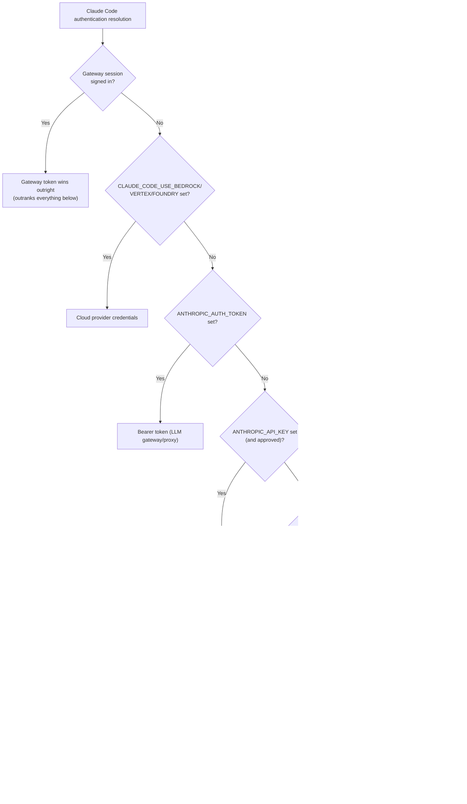
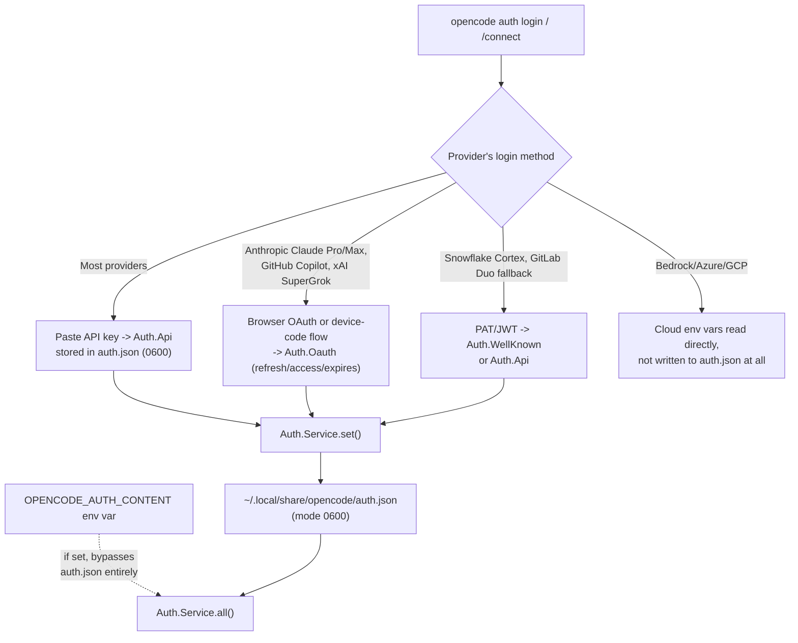
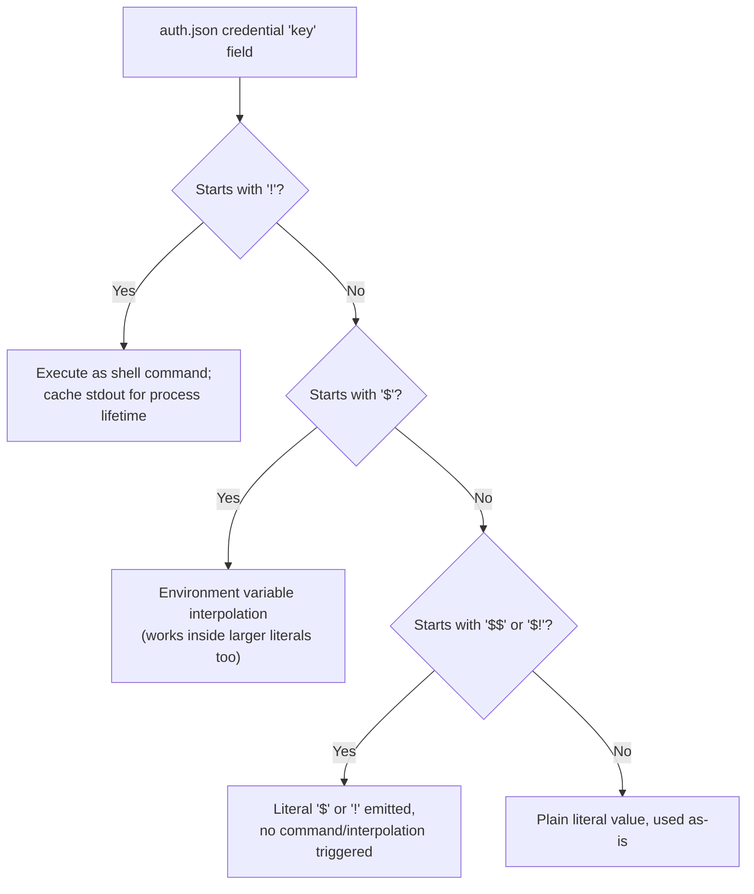
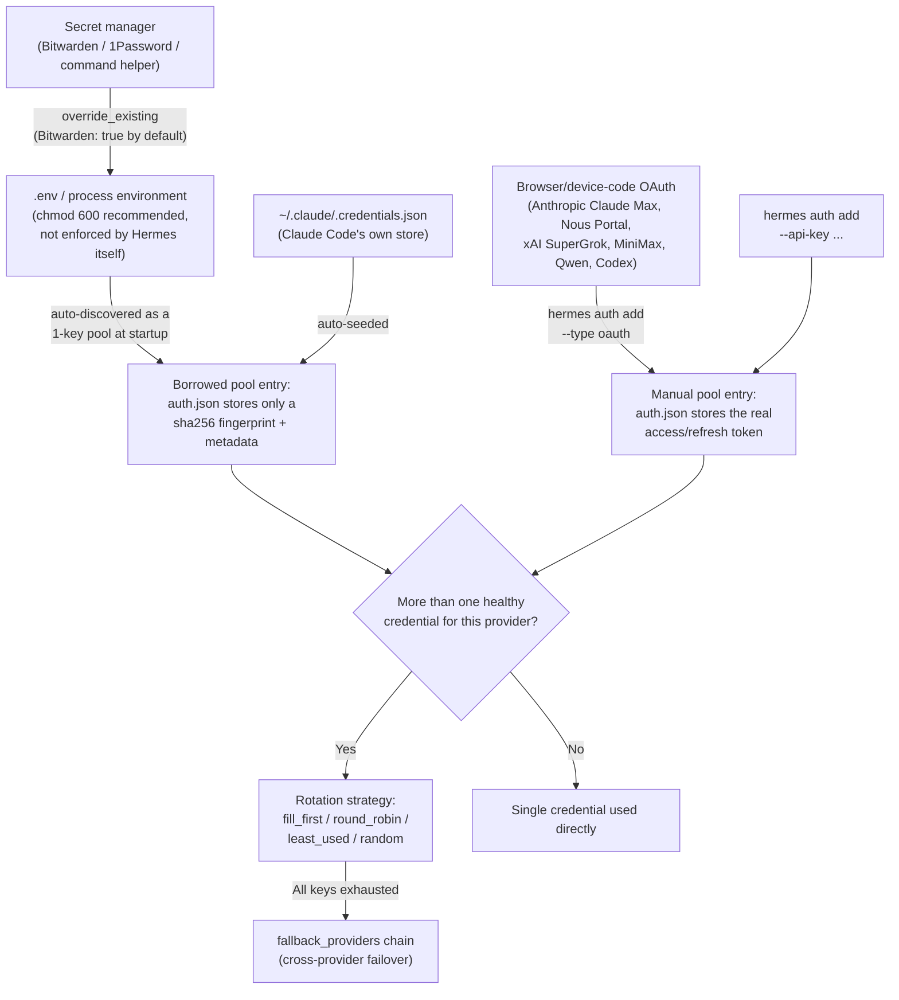
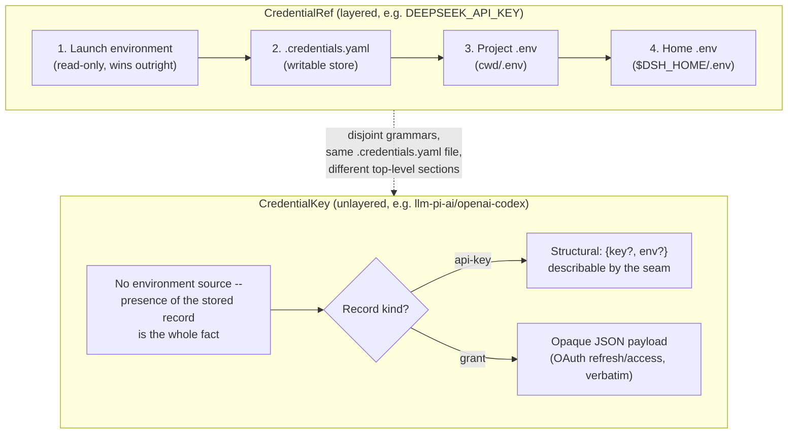
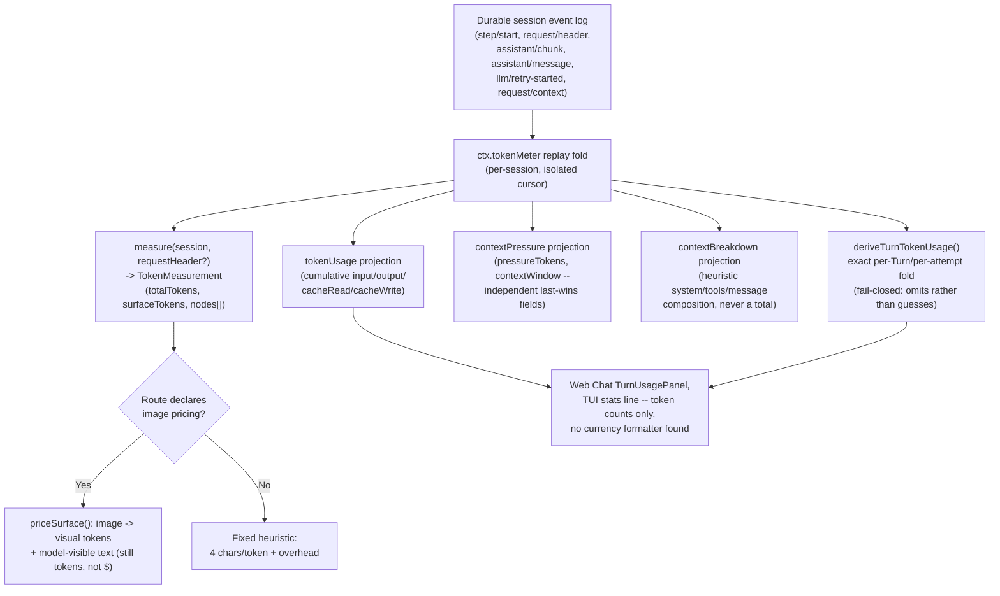
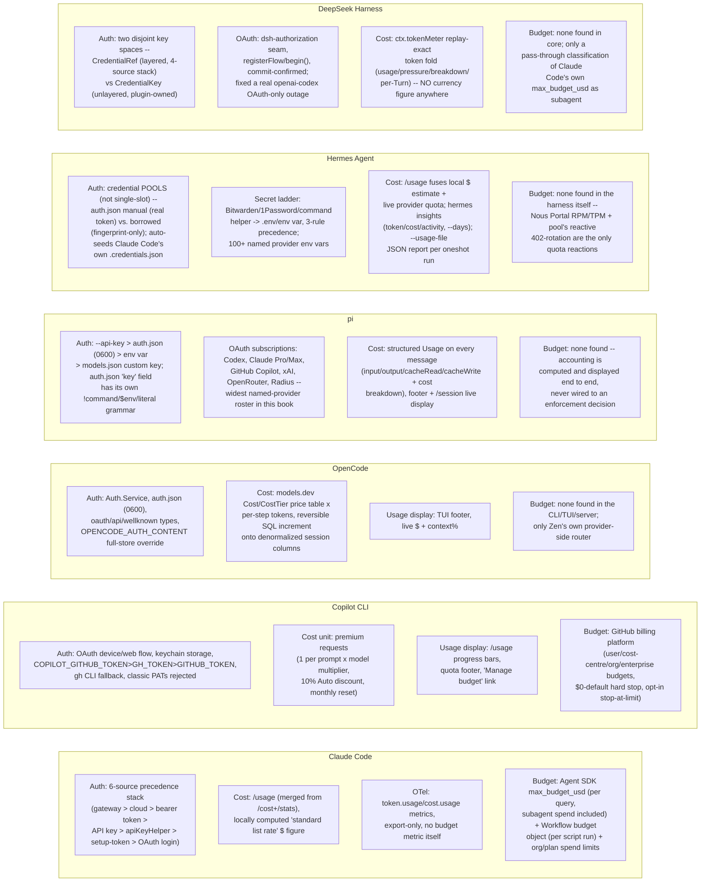

# Auth & usage accounting

This page is the dedicated treatment of a question no prior page in this book has
covered as its main subject: **how a harness proves who is calling the model, how it
counts and prices what that calling costs, and what mechanisms (if any) stop a session
from spending past a limit.** It was prompted by a real, if narrow, prior touchpoint --
Claude Code's Workflow tool exposes a `budget` object (`budget.total`, `budget.spent()`,
`budget.remaining()`) to a workflow script, mentioned only in passing in
[orchestration.md](orchestration.md) and [fan-out.md](fan-out.md) as one property of the
Workflow tool's scripting surface, never as a worked mechanism in its own right. This
page covers that budget object properly, alongside the much larger surface around it:
API-key/OAuth authentication, credential storage and precedence, the accounting of
tokens into a dollar figure, and every harness's own answer (or lack of one) to "what
enforces a spending ceiling."

Three existing pages already carry adjacent material this page cross-references rather
than repeats. [caching.md](caching.md) §1.6/§2.4/§3 already gives the full field-level
breakdown of cache-hit vs. cache-miss token observability (`cache_creation_input_tokens`,
`cache_read_input_tokens`, the OTel GenAI cache attributes, OpenCode's `cacheReadInputTokens`/
`cacheWriteInputTokens`) -- this page assumes those fields exist and focuses on the layer
above them: how a dollar figure and a spend ceiling are built on top of raw token counts.
[agent-loop-implementations.md](agent-loop-implementations.md) §1 already introduced
Claude Code's Agent SDK `max_turns`/`max_budget_usd` caps and their `ResultMessage`
subtypes in the context of the agent loop itself; this page expands that into the fuller
budget-enforcement mechanics (soft-vs-hard-cap semantics, subagent spend attribution, the
`Budget limit reached` failure mode) without re-deriving the loop diagram already there.
[model-routing-and-selection.md](model-routing-and-selection.md) §2.4 already documents
Copilot CLI's four BYOK environment variables in a model-routing context; this page adds
only the auth-specific fact those variables carry (a BYOK session skips GitHub
authentication entirely) rather than re-listing the variables themselves.

Every factual claim below is tagged VERIFIED (fetched this session from a named
authoritative source) or BEST CURRENT UNDERSTANDING, UNCONFIRMED. The three harnesses'
answers to "auth and usage accounting" turn out to differ in kind, not just in detail:
Claude Code has the deepest documented precedence stack and the only harness-native,
in-product spend-cap primitives (Agent SDK `max_budget_usd`, the Workflow tool's own
`budget` object); Copilot CLI's accounting is denominated in "premium requests" rather
than raw dollars, with organization-level budget enforcement living in GitHub's billing
platform rather than in the CLI itself; OpenCode has a fully source-readable, provider-
price-table-driven cost accumulator but, as far as this session's research found, no
user-facing spend ceiling anywhere in the harness proper -- the only budget-enforcement
code in its own repository belongs to OpenCode Zen, the company's own hosted model
gateway, not to a session a user runs locally.

## 1. Claude Code

### 1.1 Authentication methods and the login flow

VERIFIED (`code.claude.com/docs/en/authentication`, fetched this session): running
`claude` for the first time opens a browser window for an OAuth login unless
`ANTHROPIC_API_KEY` is already set in the environment, in which case Claude Code skips
the login prompt entirely and instead asks the user to approve the key. Six account
types authenticate through this same entry point: a Claude Pro or Max subscription, a
Claude for Teams or Enterprise account, a Claude Console account, a cloud provider
(Amazon Bedrock, Google Cloud's Agent Platform, or Microsoft Foundry, selected via an
interactive "3rd-party platform" setup wizard rather than a browser login), and a
self-hosted Claude apps gateway session signed in through corporate SSO. `/logout` clears
the stored credential and also resets first-launch setup state, so the next `claude`
invocation walks through login and setup again. Organizations can pin login further with
two managed-settings keys, `forceLoginMethod` and `forceLoginOrgUUID`: with both set,
Claude Code restricts login to a named Anthropic organization and exits at startup if the
active credential belongs to a different one.

VERIFIED (`code.claude.com/docs/en/authentication`, fetched this session): the enforcement
of these two keys is uneven across the paths a developer can authenticate from --
terminal logins, the VS Code extension, and the Agent SDK enforce both `forceLoginMethod`
and `forceLoginOrgUUID`; `claude setup-token` and `/install-github-app` enforce only
`forceLoginMethod`, deliberately, so a token can still be minted in a different
organization; and gateway sign-in is *selected by* `forceLoginMethod: "gateway"` rather
than restricted by it, since a gateway session never authenticates against an Anthropic
organization at all. Cloud-provider sessions (Bedrock/Vertex/Foundry) authenticate against
the cloud provider directly and are not blocked by either key -- an org restricting those
must do so through its own cloud IAM policy instead. VERIFIED, same source, changelog
detail folded into the docs page itself: as of Claude Code v2.1.212, every login path
enforces `forceLoginMethod`; before that version, only terminal logins did. This dated
claim is independently corroborated by this session's own read of
`anthropics/claude-code`'s `CHANGELOG.md` at v2.1.212: "Changed Enterprise
`forceLoginMethod` to be enforced for VS Code extension, SDK, `setup-token`, and
`install-github-app` logins, not just the terminal." A related, once-broken interaction
was fixed one version earlier: `CHANGELOG.md` v2.1.211 records "Fixed `forceLoginOrgUUID`/
`forceLoginMethod` managed-settings policies blocking third-party provider sessions
(Bedrock, Vertex, Foundry, Mantle) alongside the org pin (regression in 2.1.146)" --
i.e., the org-pin keys had, for a period starting at v2.1.146, incorrectly blocked exactly
the cloud-provider sessions the current docs describe as exempt.

### 1.2 Credential storage and the six-source precedence stack

VERIFIED (`code.claude.com/docs/en/authentication`, "Credential management" section,
fetched this session): Claude Code stores OAuth credentials differently per platform --
the encrypted macOS Keychain on macOS; `~/.claude/.credentials.json` at file mode `0600`
on Linux; `%USERPROFILE%\.claude\.credentials.json`, inheriting the user profile
directory's own access controls, on Windows; and under `$CLAUDE_CONFIG_DIR` instead of the
default location when that environment variable is set on Linux or Windows. The stored
file covers five credential shapes: Claude.ai credentials, Claude API credentials,
Microsoft Foundry Auth, Bedrock Auth, Vertex Auth, and Claude apps gateway session tokens.
`.credentials.json` itself is managed exclusively through `/login`/`/logout`; routing
through a custom endpoint instead uses the separate `ANTHROPIC_BASE_URL` environment
variable.

VERIFIED (same source): when more than one credential source is present, Claude Code
resolves which one wins in a fixed, six-step order --

1. **Cloud provider credentials**, when `CLAUDE_CODE_USE_BEDROCK`, `CLAUDE_CODE_USE_VERTEX`,
   or `CLAUDE_CODE_USE_FOUNDRY` is set.
2. **`ANTHROPIC_AUTH_TOKEN`** (environment variable), sent as an `Authorization: Bearer`
   header -- intended for an LLM gateway or proxy authenticating with bearer tokens.
3. **`ANTHROPIC_API_KEY`** (environment variable), sent as an `X-Api-Key` header --
   intended for direct Anthropic API access. Interactively, the user is prompted once to
   approve or decline this key and the choice is remembered (toggle: "Use custom API key"
   in `/config`); in non-interactive mode (`-p`) the key is always used when present.
4. **`apiKeyHelper`** script output -- a custom command, configured in settings, whose
   stdout is used as the API key. Intended for dynamic or rotating credentials such as a
   short-lived token fetched from a vault.
5. **`CLAUDE_CODE_OAUTH_TOKEN`** (environment variable) -- a long-lived, one-year OAuth
   token minted by `claude setup-token`, intended for CI pipelines and scripts where an
   interactive browser login isn't available. Note: bare mode (`--bare`) does not read this
   variable at all; a bare-mode script must instead authenticate with `ANTHROPIC_API_KEY`
   or `apiKeyHelper`.
6. **Subscription OAuth credentials from `/login`** -- the default for Claude Pro, Max,
   Team, and Enterprise users.

A signed-in Claude apps gateway session sits *outside* this numbered list entirely: it is
a provider selection on the same level as Bedrock/Vertex/Foundry, and it outranks all of
them -- when a gateway session exists, none of steps 2 through 6 above are consulted at
all, even if their environment variables are set. VERIFIED, same source, a documented
practical trap: "If you have an active Claude subscription but also have
`ANTHROPIC_API_KEY` set in your environment, the API key takes precedence once approved.
This can cause authentication failures if the key belongs to a disabled or expired
organization" -- the fix given is `unset ANTHROPIC_API_KEY` and checking `/status`, whose
`Login method` row shows the active subscription account and whose separate `API key` row
only appears while a key is actually in use.



VERIFIED (this session's read of `apiKeyHelper`'s own subsection, `code.claude.com/docs/en/authentication`):
by default the helper is re-invoked after five minutes or on an HTTP 401 response, and
`CLAUDE_CODE_API_KEY_HELPER_TTL_MS` overrides that interval. If the script takes longer
than ten seconds to return a key, Claude Code shows a warning in the prompt bar with the
elapsed time. As of v2.1.208, a script that exits with an error, times out, or prints
nothing surfaces the specific error `Your apiKeyHelper script is failing` within three
attempts; before v2.1.208, the same failure surfaced as a generic 401 after roughly ten
silent retries -- both the "within three attempts" behavior and the version number are
independently corroborated by this session's own read of `anthropics/claude-code`'s
`CHANGELOG.md` at v2.1.208: "Fixed `apiKeyHelper` script failures being hidden behind a
generic 401 after ~10 silent retries; the script's own error is now shown within 3
attempts." The mechanism itself is far older than that fix: `CHANGELOG.md` v0.2.74
records "Added support for refreshing dynamically generated API keys (via
`apiKeyHelper`), with a 5 minute TTL" -- i.e., `apiKeyHelper`'s refresh-on-a-timer design
dates to a very early release and the v2.1.208 change only hardened its failure-reporting,
not its core refresh loop.

VERIFIED (`code.claude.com/docs/en/authentication`, "Renew an expiring login"
subsection, fetched this session): a claude.ai or Claude Console login nearing expiry
triggers a startup warning ("Your login expires in 3 days · run `/login` to renew",
v2.1.203+; the window was five days before v2.1.217). The warning is purely informational
-- authentication keeps working until the login actually expires -- but an *expired*,
unrefreshable login (v2.1.206+) makes every subsequent request fail with `Login expired ·
Please run /login` (before v2.1.206 this surfaced as a generic model error instead), and
`/status` (v2.1.210+) shows a dedicated `Login` row reading `Expired — log in again` before
the first failed request even happens. This matters most for unattended sessions: a
background session in agent view or a Remote Control session that outlives its login
simply stalls until a human re-authenticates.

### 1.3 Cost tracking: `/usage`, its `/cost`/`/stats` predecessors, and the statusline

VERIFIED (`code.claude.com/docs/en/costs`, "Track your costs" section, fetched this
session): the `/usage` command's Session block shows per-model token usage and a dollar
figure for the *current* session --

```text
Total cost:            $0.55
Total duration (API):  6m 20s
Total duration (wall): 6h 33m 10s
Total code changes:    0 lines added, 0 lines removed
Usage by model:
   claude-sonnet-4-6:  1.2k input, 5.3k output, 940.0k cache read, 50.0k cache write ($0.55)
```

Two facts about that dollar figure matter for anyone using it to reason about actual
spend. First, VERIFIED (same source): "Claude Code computes the dollar figure locally
from token counts priced at standard list rates, so it doesn't reflect promotional
pricing or contracted discounts and may differ from your actual bill" -- for
authoritative billing, the docs point to the Usage page in the Claude Console instead.
Second, VERIFIED (same source): these session totals reset when `/clear` starts a new
session; before v2.1.211 they instead kept accumulating across `/clear` for the entire
lifetime of the Claude Code process, so a long-lived terminal session's `/usage` figure
used to silently include every prior, unrelated conversation cleared within it. On a Pro,
Max, Team, or Enterprise plan, `/usage` additionally attributes recent usage to skills,
subagents, plugins, and individual MCP servers as percentages of the total, flags
behaviors (long context, cache misses) accounting for 10% or more of recent usage, and
lets `d`/`w` toggle between a 24-hour and a 7-day window; when the usage-limit endpoint
itself is rate-limited, `/usage` falls back to showing the last snapshot loaded within the
past 60 minutes with a `Showing last-known usage` note, a fallback introduced at v2.1.208
(before that version, a rate-limited request in a session with no prior snapshot always
surfaced a bare error).

VERIFIED (`anthropics/claude-code` `CHANGELOG.md`, fetched this session via `gh api`, at
v2.1.118): "Merged `/cost` and `/stats` into `/usage` -- both remain as typing shortcuts
that open the relevant tab." This resolves what would otherwise be a stale-looking
citation elsewhere in this book: [caching.md](caching.md) documents a `/cost` command
gaining a per-model-and-cache-hit breakdown for subscription users, sourced (per that
page's own citation) to a changelog entry at v2.1.92 -- both facts are correct and
non-conflicting once read in sequence: `/cost` was a real, separate command through at
least v2.1.92, and v2.1.118 folded it and `/stats` into today's single `/usage` surface,
keeping `/cost` typeable as a shortcut into it rather than removing the muscle memory.
This session's own read of the changelog corroborates both endpoints independently:
v2.1.92 records "Added per-model and cache-hit breakdown to `/cost` for subscription
users," and three much earlier entries (v1.0.88 "Fixed incorrect usage tracking in
`/cost`", v0.2.108 "Fixed a regression in `/cost` reporting") show `/cost` had already
existed, and already needed correctness fixes, long before the v2.1.118 merge.

VERIFIED (`code.claude.com/docs/en/costs`, "Manage context proactively" section, fetched
this session): the docs point to `/usage` and to a configurable statusline
(`/docs/en/statusline#context-window-usage`) as the two live ways to watch token usage
continuously rather than only at session end, and note that background functionality --
conversation summarization for `claude --resume`, and status-check commands like
`/usage` itself -- consumes a small amount of tokens (typically under $0.04 per session)
even while idle.

### 1.4 OpenTelemetry cost and usage metrics

VERIFIED (`code.claude.com/docs/en/monitoring-usage`, fetched this session): enabling
`CLAUDE_CODE_ENABLE_TELEMETRY=1` alongside `OTEL_METRICS_EXPORTER` (`otlp`/`prometheus`/
`console`/`none`) exports a fixed set of metrics, independent of and complementary to the
locally-computed `/usage` dollar figure in §1.3:

| Metric | Unit | Key attributes |
|---|---|---|
| `claude_code.session.count` | count | `start_type` (`fresh`/`resume`/`continue`/`agents_view`) |
| `claude_code.token.usage` | tokens | `type` (`input`/`output`/`cacheRead`/`cacheCreation`), `model`, `query_source` (`main`/`subagent`/`auxiliary`), `speed`, `effort`, `agent.name`/`skill.name`/`plugin.name`/`mcp_server.name`/`mcp_tool.name` |
| `claude_code.cost.usage` | USD | `model`, `query_source`, `speed`, `effort`, same name-scoped attributes as above |
| `claude_code.lines_of_code.count` | count | `type` (`added`/`removed`), `model` |
| `claude_code.code_edit_tool.decision` | count | `tool_name`, `decision` (`accept`/`reject`), `source` (`config`/`hook`/`user_permanent`/`user_temporary`/`user_abort`/`user_reject`), `language` |
| `claude_code.commit.count` | count | -- |
| `claude_code.pull_request.count` | count | -- |
| `claude_code.active_time.total` | seconds | `type` (`user` keyboard interactions vs. `cli` tool execution/AI responses) |

Enabling `OTEL_LOGS_EXPORTER=otlp` additionally exports per-request events, the richest
of which is `claude_code.api_request` (attributes: `model`, `cost_usd`, `cost_usd_micros`,
`input_tokens`, `output_tokens`, `cache_read_tokens`, `cache_creation_tokens`), alongside
`claude_code.api_error`, `claude_code.api_refusal`, `claude_code.tool_result`, and
`claude_code.tool_decision`. Every metric and event carries a standard attribute set --
`session.id`, an anonymous `user.id`, `user.email`/`user.account_uuid` when authenticated,
`organization.id`, `app.version`, and any custom tags injected via `OTEL_RESOURCE_ATTRIBUTES`
-- and four separate environment variables gate whether sensitive content is included at
all: `OTEL_LOG_USER_PROMPTS`, `OTEL_LOG_ASSISTANT_RESPONSES`, `OTEL_LOG_TOOL_DETAILS`,
`OTEL_LOG_RAW_API_BODIES`.

One structural fact is worth stating plainly, since it bears directly on §1.5 below:
VERIFIED (same source, read in full this session): **the OpenTelemetry export path itself
carries no budget or spend-limit metric of any kind.** It is cost-and-usage *export
only*; a team wanting to alert or block on spend must build that logic in its own
observability backend against the exported `cost.usage` metric or `cost_usd` event field
-- OpenTelemetry is not itself an enforcement layer.

### 1.5 Budget enforcement: three genuinely distinct mechanisms, at three different layers

Claude Code is the only harness examined in this book with more than one distinct,
harness-native mechanism for capping spend, and the three do not compose into a single
system -- they operate at three different layers (a single Agent SDK query, a single
Workflow-tool script run, and an organization's aggregate plan spend), and confusing them
is a real risk, so each is stated separately below with its own scope.

**1.5.1 -- Agent SDK `max_turns`/`max_budget_usd`, per query.** VERIFIED
(`code.claude.com/docs/en/agent-sdk/agent-loop`, fetched this session in full, expanding
on the brief `ResultMessage`-subtype mention already in
[agent-loop-implementations.md](agent-loop-implementations.md) §1): `max_turns`/
`maxTurns` caps the number of tool-use round trips; `max_budget_usd`/`maxBudgetUsd` caps
spend directly. Both default to unlimited -- "Without limits, the loop runs until Claude
finishes on its own, which is fine for well-scoped tasks but can run long on open-ended
prompts... Setting a budget is a good default for production agents." When either limit
is hit, the SDK yields a final `ResultMessage` with `subtype: "error_max_turns"` or
`"error_max_budget_usd"` rather than `"success"`; both subtypes still carry
`total_cost_usd`, `usage`, `num_turns`, and `session_id`, so a caller can inspect spend and
resume even on a budget-terminated run. Critically, VERIFIED (same source): "The budget
cap covers subagents: their spend counts toward the total." As of v2.1.217, once spend
reaches the cap, spawning another subagent fails outright with `Budget limit reached`,
and Claude Code additionally stops any background subagents still running at that
moment -- this session's own read of `anthropics/claude-code`'s `CHANGELOG.md` corroborates
the version independently: v2.1.217 records "Fixed `--max-budget-usd` not stopping
background subagents: once the cap is reached, new spawns are denied and running
background agents are halted," which reads as the *fix* that made the cap-enforcement
behavior the current docs describe actually correct (implying the cap existed before
v2.1.217 but did not reliably stop already-running background subagents until that
release). One more mechanical detail distinguishes this from a hard token/output cap: the
budget check happens *between turns*, not mid-generation, so a turn already in progress
when the cap is crossed is allowed to finish rather than being cut off mid-response.

**1.5.2 -- The Workflow tool's `budget` object, per workflow run.** VERIFIED
(`code.claude.com/docs/en/workflows`, fetched this session; this is the exact mechanism
the handoff for this page named and no prior page in this book has documented as a
worked mechanism): a running dynamic workflow script -- the JavaScript program Claude
writes to orchestrate `agent()`/`pipeline()` calls at scale, documented in full in
[orchestration.md](orchestration.md) §1.3 and [fan-out.md](fan-out.md) -- has access to a
`budget` object exposing `budget.total` (the configured ceiling), `budget.spent()`
(current usage), and `budget.remaining()` (headroom), so the script itself can
self-regulate rather than relying only on the runtime's own hard caps. The documented
usage pattern is a loop guard: `while (budget.remaining() > 50_000) { const batch = await
agent('Find the next 10 unreviewed specs.'); if (!batch.length) break; }` -- an
open-ended fan-out that would otherwise run until it exhausts its input instead stops
once it is close to its budget. A workflow's actual token/dollar budget is set through the
same natural-language interface used to request the workflow itself (for example,
prompting "use 10k tokens"), not through a separate typed configuration surface -- the
`budget` object is a runtime read/write handle inside the generated script, not a
standalone user-facing setting.

This `budget` object is architecturally distinct from, and must not be confused with, the
Anthropic Messages API's own **task budgets** feature. VERIFIED (`platform.claude.com/docs/en/build-with-claude/task-budgets`,
fetched this session in full): task budgets are a beta, API-level `output_config.task_budget`
parameter (`{type: "tokens", total, remaining?}`) that injects a server-side countdown
marker visible only to the model, so Claude can pace itself and wrap up gracefully as an
agentic loop consumes its token allowance -- and the same page states directly: "Task
budgets are **not supported on Claude Code** or Cowork surfaces. Use task budgets
directly through the Messages API on a supported model." Task budgets are also explicitly
a *soft hint, not a hard cap* at the API level ("Claude may occasionally exceed the
budget if it is in the middle of an action that would be more disruptive to interrupt
than to finish"; the actual enforced ceiling there is `max_tokens`, unrelated to
`task_budget`). Claude Code's own Workflow-tool `budget` object is therefore a
harness-built, harness-only mechanism layered on top of ordinary token accounting, not a
CLI-side exposure of the API's `task_budget` beta feature -- the two share a name and a
countdown-style user experience but are otherwise unrelated code paths on unrelated
products.

VERIFIED (`code.claude.com/docs/en/workflows`, "Cost" and "Behavior and limits"
subsections, fetched this session): independent of the `budget` object a script can read,
the workflow *runtime* itself enforces two fixed, non-configurable hard caps regardless
of what the script does -- up to 16 concurrent agents (fewer on CPU-constrained machines)
and 1,000 agents total per run, explicitly "to prevent runaway loops." A separate,
advisory-only warning (not an enforcement mechanism) fires in the task panel when a
workflow schedules more than 25 agents or its projected token total passes 1.5 million; a
user-chosen size guideline (`unrestricted`/`small`/`medium`/`large`, mapping to agent-count
targets under 5/15/50 respectively, `medium` the default since v2.1.219) replaces the flat
25-agent threshold with that guideline's own count, but the warning never pauses or limits
the run by itself -- a user must act on it via `/workflows`.

**1.5.3 -- Organization- and plan-level spend limits.** VERIFIED
(`code.claude.com/docs/en/costs`, "Manage costs for your organization" section, fetched
this session): which spend-capping controls exist at all depends on how an organization
accesses Claude Code -- on a Claude for Teams or Enterprise plan, usage draws from a
per-seat allowance on a rolling five-hour and weekly window (shared with Claude chat and
Cowork), and once usage credits are turned on to let members continue past that
allowance, an admin can additionally set **spend limits** at the organization, group, or
individual-member level from the claude.ai admin console; on the Claude Console (API)
side, an organization instead sets **workspace spend limits** on the auto-created "Claude
Code" workspace from the Console UI, and on Amazon Bedrock, Google Cloud's Agent
Platform, or Microsoft Foundry, spend is capped entirely through that cloud provider's own
budget-control mechanisms, since Claude Code itself sends no metrics back to Anthropic in
that configuration (per-user attribution there instead requires OpenTelemetry export, a
self-hosted Claude apps gateway, or a third-party LLM gateway such as LiteLLM).

VERIFIED, same source: on Pro and Max plans specifically, "when you reach your spend
limit with usage credits still available, Claude Code prompts you to raise or remove the
limit without leaving the CLI." This session's own read of `anthropics/claude-code`'s
`CHANGELOG.md` corroborates active engineering on this exact prompt: v2.1.216 records
"Improved the spend limit adjustment prompt to show the server's reason when a spend limit
change is rejected."

### 1.6 Cloud-provider authentication as a distinct, credential-and-billing bundle

VERIFIED (`code.claude.com/docs/en/third-party-integrations`, fetched this session):
Amazon Bedrock, Claude Platform on AWS, Google Cloud's Agent Platform, and Microsoft
Foundry are each a bundled choice of *both* authentication mechanism and billing/cost-
tracking surface, not independent axes -- for example, Bedrock authenticates via an API
key or AWS credentials and bills/tracks cost through AWS Cost Explorer, while Foundry
authenticates via an API key or Microsoft Entra ID and tracks cost through Azure Cost
Management. `/status` is the documented way to confirm which of these is actually active,
showing lines such as `API provider: Amazon Bedrock`, a gateway base URL if one is
configured, and `AWS auth skipped` when a gateway is handling AWS authentication on
Claude Code's behalf. An organization can additionally route any of these four providers
through a corporate proxy (`HTTPS_PROXY`/`HTTP_PROXY`) or an LLM gateway
(`ANTHROPIC_BASE_URL`/`ANTHROPIC_BEDROCK_BASE_URL`/`ANTHROPIC_VERTEX_BASE_URL`/
`ANTHROPIC_FOUNDRY_BASE_URL`, each paired with a `CLAUDE_CODE_SKIP_*_AUTH` variable when
the gateway itself handles the cloud provider's native auth) -- the docs name centralized
usage tracking, custom rate limiting, and centralized authentication management as the
reasons to add a gateway in the first place, i.e., the gateway pattern exists specifically
to re-centralize the auth/billing bundle that per-developer cloud-provider credentials
otherwise fragment.

## 2. GitHub Copilot CLI

### 2.1 Authentication methods and credential storage

VERIFIED (`docs.github.com/en/copilot/how-tos/copilot-cli/set-up-copilot-cli/authenticate-copilot-cli`,
fetched this session): Copilot CLI's primary, interactive authentication is an OAuth
device flow, triggered by `/login` (or `copilot login` outside the CLI) -- the CLI
generates a one-time code, directs the user to `github.com/login/device`, and stores the
resulting OAuth token in the operating system's native keychain (Keychain Access on
macOS, Credential Manager on Windows, `libsecret` on Linux). This session's own read of
`github/copilot-cli`'s own `changelog.md` (fetched via `gh api`) shows this flow itself
evolving: v1.0.77 (2026-07-30) "Add[ed] a browser-based (web) OAuth login flow, now the
default for `copilot login` on local interactive terminals (device code remains the
default on remote/headless terminals). Use `--web-flow`/`--device-code` to force a mode,
or pick one in the interactive `/login` command" -- i.e., the device-code flow described
in the docs page above is, as of that release, no longer the universal default on every
terminal type, only on remote/headless ones.

VERIFIED (same authentication doc, fetched this session): for CI/CD, containers, and
other non-interactive environments, three environment variables carry a token instead,
checked in this precedence order (highest to lowest): `COPILOT_GITHUB_TOKEN`, `GH_TOKEN`,
`GITHUB_TOKEN`. The docs warn plainly that "an environment variable silently overrides a
stored OAuth token" -- an unrelated `GITHUB_TOKEN` left set in a CI runner's environment
can therefore quietly redirect a Copilot CLI session away from its logged-in account with
no error surfaced. When none of the three variables and no stored OAuth token exist,
Copilot CLI falls back to a locally installed and already-authenticated GitHub CLI's own
token, as the lowest-priority source of all. VERIFIED, same source: accepted token types
are OAuth tokens, fine-grained personal access tokens, and GitHub App user-to-server
tokens -- **classic personal access tokens are explicitly excluded**. This session's own
read of `github/copilot-cli`'s `changelog.md` corroborates that exclusion being enforced,
not merely undocumented: v1.0.5 (2026-03-13) "Show a clear error when a classic Personal
Access Token (`ghp_`) is set in environment variables instead of silently exiting" -- the
change was specifically about *surfacing* a clear error for a case that previously failed
silently, implying classic PATs were already rejected before this release and only the
failure mode improved. The `COPILOT_GITHUB_TOKEN` variable itself is also independently
dated in the changelog, at v0.0.354 (2025-11-03): "Support for `COPILOT_GITHUB_TOKEN`
environment variable for authentication (takes precedence over `GH_TOKEN`)" -- confirming
both the variable's existence and its documented precedence position were introduced
together at that release, well before the BYOK/enterprise-hardening entries covered in
§2.4 below.

VERIFIED (same authentication doc, fetched this session): bring-your-own-key (BYOK)
configuration -- pointing Copilot CLI at a personal LLM provider's own API key -- does
**not** require GitHub authentication at all; the one documented exception is that
certain features remain unavailable without GitHub credentials regardless of BYOK status:
`/delegate`, the GitHub MCP server, and Code Search. (The four BYOK environment variables
themselves -- `COPILOT_PROVIDER_BASE_URL`, `COPILOT_MODEL`, `COPILOT_PROVIDER_TYPE`,
`COPILOT_PROVIDER_API_KEY` -- are documented in full in
[model-routing-and-selection.md](model-routing-and-selection.md) §2.4, since there they
are being examined as a routing mechanism, not an auth mechanism; this page's only new
fact is the auth-optionality claim itself.) Multiple GitHub accounts are supported
side by side via `/user list` and `/user switch`; `/logout` shows a warning when signed in
via `gh` CLI, a personal access token, an API key, or an environment variable, "since
`/logout` only manages OAuth sessions" -- this session's own changelog read dates that
warning to v1.0.25 (2026-04-13).

A separate, security-relevant storage detail is worth stating precisely: VERIFIED
(`github/copilot-cli`'s `changelog.md`, fetched this session, v1.0.51, 2026-05-20):
"Login prompt more clearly warns when token storage falls back to insecure plain text
config file" -- confirming there is a documented fallback path where, presumably when a
system keychain is unavailable, Copilot CLI stores the token in a plain-text config file
rather than the platform keychain described above, and that this fallback is at least
now surfaced to the user with a warning rather than happening silently. This session's
research did not locate the specific doc page or condition that triggers the fallback
beyond this changelog line, so treat the *trigger condition* itself (as opposed to the
fact that the fallback exists and is now warned-about) as BEST CURRENT UNDERSTANDING,
UNCONFIRMED.

### 2.2 Premium requests: the unit Copilot bills usage in

VERIFIED (`docs.github.com/copilot/concepts/copilot-billing/understanding-and-managing-requests-in-copilot`,
fetched this session): GitHub Copilot denominates usage across all its surfaces,
including the CLI, in **premium requests** rather than raw tokens or dollars. A request
is "any interaction where you prompt Copilot to perform a task," and for agentic
features specifically, "only the prompts you send count as premium requests; actions
Copilot takes autonomously to complete your task, such as tool calls, do not." For
Copilot Chat and Copilot CLI, the rate is one premium request per user prompt,
multiplied by the selected model's own request multiplier (most models documented at 1x;
this session's own changelog read finds the multiplier concept itself dated to v0.0.341,
2025-10-14: "Added each model's premium request multiplier to the `/model` list
(currently, all our supported models are 1x)"). Premium request counters reset on the
1st of each month at 00:00:00 UTC, and unused requests never carry over to the following
month.

VERIFIED (same source): when using **Auto model selection** (documented in full in
[model-routing-and-selection.md](model-routing-and-selection.md) §2.3) in Copilot Chat,
Copilot CLI, or Copilot cloud agent, the model routed to qualifies for a 10% multiplier
discount -- so using Auto is, independent of anything else, a way to reduce premium-
request consumption relative to pinning a specific model by hand.

A real, self-reported billing bug is worth flagging as a concrete instance of premium-
request accounting going wrong in practice: this session's own read of
`github/copilot-cli`'s `changelog.md` finds, at v0.0.346 (2025-10-19): "Fixed a bug where
premium requests were being overcounted for some users... If you were affected, we are
working on refunding your overcharged premium requests!" -- an explicit acknowledgment
that the CLI's own request-counting logic had, for a period, billed some users for more
premium requests than they actually made.

### 2.3 Cost/usage observability in the CLI: `/usage`'s own history

VERIFIED (`github/copilot-cli`'s `changelog.md`, fetched this session via `gh api`):
Copilot CLI's `/usage` command has a long, incrementally hardened history distinct from
Claude Code's `/cost`-then-`/usage` merge in §1.3 -- it was introduced from the start as
`/usage`, not merged in from a differently named predecessor. Its origin, at v0.0.333
(2025-10-02): "Added `/usage` slash command to provide stats about Premium request usage,
session time, code changes, and per-model token use. This information is also printed at
the conclusion of a session." Selected subsequent milestones, each independently dated by
this session's own read of the changelog:

| Version | Date | Change |
|---|---|---|
| v0.0.399 | 2026-01-29 | `/usage` includes token consumption from subagents (e.g., the general-purpose agent) |
| v0.0.404 | 2026-02-05 | `GITHUB_TOKEN` environment variable accessible in agent shell sessions |
| v0.0.368 | 2025-12-10 | PRU (premium request unit) usage rates displayed correctly (bug fix) |
| v1.0.6 | 2026-03-16 | Fixed the remaining-requests widget showing inaccurate quota data for Free-plan users |
| v1.0.15 | 2026-04-01 | Config settings including `storeTokenPlaintext` renamed to camelCase (snake_case still accepted) |
| v1.0.32 | 2026-04-17 | Usage-limit warnings shown at approaching 75% and 90% of the *weekly* limit |
| v1.0.34 | 2026-04-20 | Usage-limit warnings shown at 50% and 95% capacity (a separate, session-scoped threshold pair) |
| v1.0.52 | 2026-05-23 | `/usage` shows quota progress bars for session and weekly limits; AI-credits error messages gain a "Manage budget" link |
| v1.0.55 | 2026-05-28 | Free and Student plan users on token-based billing restricted to Auto model selection only |
| v1.0.57 | 2026-06-01 | Underlying reason (e.g. a GitHub API rate limit) surfaced when SDK auth-token validation fails |
| v1.0.58 | 2026-06-02 | Quota footer shows remaining requests as a rounded percentage |
| v1.0.60 | 2026-06-05 | Cache write tokens shown alongside cache read tokens in `/usage`; a `billing` help topic added |
| v1.0.64 | 2026-06-23 | Pay-as-you-go additional-usage budget shown at launch, refreshed after a rejected request, with a friendly message on limit reached |
| v1.0.66 | 2026-06-30 | Subagent concurrency and depth limits configurable in `/settings` for usage-based billing users |
| v1.0.69 | 2026-07-07 | Warning when static context uses most of the prompt budget; requests blocked when little conversation room remains |
| v1.0.71 | 2026-07-16 | Default maximum subagent nesting depth lowered from 6 to 4 to curb runaway recursive delegation (usage-based billing users can still raise `subagents.maxDepth`, up to 128) |

This progression shows a harness moving, release by release, from a bare stats readout
toward genuine budget-awareness surfaced directly in the CLI's own UI (progress bars,
rounded-percentage quota footers, a dedicated "Manage budget" link, and threshold-based
warnings at both a session and a weekly granularity) without ever exposing a typed,
programmable budget object the way Claude Code's Workflow tool does in §1.5.2 -- every
one of the entries above is a *display or warning* improvement, not an enforcement
primitive the CLI itself acts on.

### 2.4 Budget enforcement: GitHub's billing platform, not the CLI itself

VERIFIED (`docs.github.com/en/copilot/concepts/billing/budgets-for-usage-based-billing`,
fetched this session): unlike Claude Code's in-product `budget` object (§1.5.2) or Agent
SDK cap (§1.5.1), Copilot's actual spend-enforcement mechanism lives in GitHub's own
billing platform, at four configurable levels -- user, cost centre, organization, and
enterprise -- governing access to shared AI credits and metered overage charges
together. **A budget set to $0 USD creates an immediate hard stop**: "A $0 USD budget
blocks the user immediately," and the docs state that accounts created before 22 August
2025 default to exactly this -- a $0 budget for Copilot premium requests -- so that
premium requests over the included allowance are rejected outright unless an
administrator edits or deletes that default budget. A separate toggle, "Stop usage when
budget limit is reached," applies only to cost-centre, organization, and enterprise
budgets (not user-level ones, which "always enforce a hard stop and do not have this
setting") and is **off by default** at those three levels -- without it, "charges
continue to accrue" past the configured limit with only a notification, not a block; the
docs explicitly recommend enabling it on every budget an admin creates. Separately,
VERIFIED (`docs.github.com/copilot/concepts/copilot-billing/understanding-and-managing-requests-in-copilot`,
fetched this session): additional premium requests beyond a plan's included monthly
allowance cost $0.04 each and are billed only if the "Premium request paid usage policy"
is enabled (on by default) and a budget permits it; this per-request overage charge is
what the pay-as-you-go "additional usage budget" surfaced in the CLI at v1.0.64 (§2.3
table) is showing the remaining headroom against.

The practical shape of this is therefore the inverse of Claude Code's: Claude Code puts a
programmable budget primitive inside the harness (the Workflow tool's `budget` object) on
top of an organization-level billing-platform ceiling that exists separately; Copilot CLI
has no comparable in-harness budget primitive at all, and instead surfaces (via `/usage`,
per §2.3) an increasingly detailed *read-out* of a budget/quota state that is entirely
configured and enforced one layer up, in GitHub's billing settings.

## 3. OpenCode

### 3.1 The `Auth.Service`: credential storage, three credential shapes, and provider-specific OAuth flows

VERIFIED (direct source read of `packages/opencode/src/auth/index.ts`, `anomalyco/opencode`,
`dev` branch, fetched this session -- **`dev`-branch caveat**: this may not reflect the
current stable release): OpenCode's authentication is a small, self-contained
`Auth.Service` with exactly four operations (`get`, `all`, `set`, `remove`) backed by a
single JSON file at `Global.Path.data/auth.json`, written with mode `0o600`. The file
stores a keyed record of one of three discriminated credential shapes, defined with an
Effect `Schema.Union`:

- **`Oauth`** -- `{ type: "oauth", refresh, access, expires, accountId?, enterpriseUrl? }`,
  a refresh/access token pair with an expiry timestamp.
- **`Api`** -- `{ type: "api", key, metadata? }`, a bare API key plus optional metadata.
- **`WellKnown`** -- `{ type: "wellknown", key, token }`, a distinct shape from `Api` (a
  named key alongside a token) used for providers whose credential model doesn't fit
  either of the other two.

A module-level constant, `OAUTH_DUMMY_KEY = "opencode-oauth-dummy-key"`, exists alongside
these types, suggesting OAuth-authenticated providers still populate an API-key-shaped
field internally with a placeholder value in code paths that expect one to be present --
BEST CURRENT UNDERSTANDING, UNCONFIRMED, since this session did not trace every call site
that reads this constant. VERIFIED, same source: `Auth.all()` checks a single environment
variable, `OPENCODE_AUTH_CONTENT`, before ever touching the file at all -- if set, its
value is `JSON.parse`d directly and returned as the entire credential set, bypassing
`auth.json` entirely. This is a deliberate, source-confirmed mechanism for injecting
credentials into a container or CI job without ever writing them to disk, distinct from
any of the environment-variable mechanisms documented for the other two harnesses in
§1.2/§2.1 above, since it replaces the *whole* credential store in one shot rather than
supplying a single token.

VERIFIED (`packages/web/src/content/docs/cli.mdx`, `anomalyco/opencode`, `dev` branch,
fetched this session, direct read of the `### auth` section): the CLI-facing surface over
this service is `opencode auth login` (flags `--provider`/`-p` to skip provider
selection, `--method`/`-m` to skip login-method selection), `opencode auth list`/`ls`,
and `opencode auth logout`. The same doc states the load-order fact directly: "When
OpenCode starts up it loads the providers from the credentials file. And if there are any
keys defined in your environments or a `.env` file in your project" -- i.e., `auth.json`
is not the sole source consulted at startup even outside the `OPENCODE_AUTH_CONTENT`
override; environment variables and a project-local `.env` file are also merged in. A
structurally separate command, `opencode mcp auth [name]` (and `opencode mcp auth
list`/`ls`), authenticates specifically with an OAuth-enabled remote MCP server rather
than an LLM provider -- this is the same OAuth-for-MCP-servers surface documented from
the protocol side in [mcp-integration.md](mcp-integration.md) §3, confirmed here from the
CLI-command side as a distinct subcommand family from `opencode auth`.

VERIFIED (OpenCode's provider documentation, fetched this session): the interactive
front door to all of this is `/connect`, and provider-specific login methods vary
considerably in shape -- most providers accept a pasted API key directly; **Anthropic
Claude Pro/Max** offers a subscription option that opens a browser for OAuth login with
no manual API key at all; **GitHub Copilot** (as an LLM provider *for* OpenCode, distinct
from GitHub Copilot CLI as a separate harness) uses the same `github.com/login/device`
device-code flow described for Copilot CLI itself in §2.1; **GitLab Duo** offers OAuth or
a personal access token; **DigitalOcean** supports OAuth with auto-discovery of Inference
Routers or a manual Model Access Key; **xAI** offers three paths (browser OAuth for
SuperGrok subscriptions, device-code for headless environments, or a plain API key for
pay-as-you-go); and **Snowflake Cortex** offers a `SNOWFLAKE$LOCAL_APPLICATION` browser-
OAuth security integration (described as rolling out gradually) alongside a PAT/JWT
fallback. Cloud-native providers (Amazon Bedrock, Azure OpenAI, Google Cloud) instead
read standard cloud-credential environment variables (`AWS_PROFILE`, `AZURE_RESOURCE_NAME`,
`GOOGLE_CLOUD_PROJECT`, etc.) set before OpenCode launches, mirroring the same
credential-bundle pattern documented for Claude Code's cloud providers in §1.6.



### 3.2 Cost/usage accounting: a models.dev-priced, per-message, reversible accumulator

This is the most deeply source-verifiable cost-accounting mechanism examined in this
book, in the sense that every step from a model's own listed price to the number shown
in the TUI's footer is readable in OpenCode's own repository.

VERIFIED (`packages/core/src/models-dev.ts`, `anomalyco/opencode`, `dev` branch, fetched
this session): every catalog model carries an optional `Cost` schema --
`{ input, output, cache_read?, cache_write?, tiers?, context_over_200k? }` -- sourced from
the community-maintained Models.dev catalog (the same catalog OpenCode's own CLI docs cite
in §3.1 as the reason `opencode auth login` can configure "any provider you'd like to
use"). The `tiers` field is itself an array of `CostTier` entries, each pairing an
`input`/`output`/`cache_read`/`cache_write` rate with a `{ type: "context", size }`
condition -- i.e., a single model can carry *context-size-tiered* pricing, and a separate
`context_over_200k` field carries a distinct rate specifically for requests whose context
exceeds 200,000 tokens, independent of the tiers array. This is architecturally identical
in spirit to Claude Code's locally-computed, "standard list rate" `/usage` dollar figure
(§1.3) in that both are client-side estimates built from a static price table rather than
a number returned by the provider's own API -- neither harness's displayed cost figure is
itself authoritative billing data.

VERIFIED (`packages/core/src/session/projector.ts`, same repository/branch, fetched this
session): cost is not computed once at the end of a session -- it is accumulated live,
per model-generation step. A `"step-finish"` event on an assistant message part carries
its own `cost` and `tokens: { input, output, reasoning, cache: { read, write } }` fields
(the `usage()` helper in this file extracts exactly these two fields from the raw part),
and the session projector applies each step's contribution to the session's running
totals with a single atomic, **reversible** SQL update:

```
cost: sql`${SessionTable.cost} + ${value.cost * sign}`
tokens_input: sql`${SessionTable.tokens_input} + ${value.tokens.input * sign}`
... (tokens_output / tokens_reasoning / tokens_cache_read / tokens_cache_write, same pattern)
```

The `sign` parameter (`+1`/`-1`) is what makes this reversible: cross-referencing
[session-persistence.md](session-persistence.md) §3's fully source-verified finding that
OpenCode backs message revert/unrevert with a shadow git repository, a reverted message's
prior cost and token contribution is subtracted back out of the session's rolling totals
through this exact same increment path run with `sign = -1`, rather than requiring a
full recomputation from scratch.

VERIFIED (`packages/core/src/database/migration/20260510033149_session_usage.ts`, same
repository/branch, fetched this session, full file read): this live-accumulation design is
also reflected structurally in the database schema itself -- a dated migration (ID
`20260510033149_session_usage`) adds six denormalized columns directly onto the `session`
table (`cost`, `tokens_input`, `tokens_output`, `tokens_reasoning`, `tokens_cache_read`,
`tokens_cache_write`, each defaulting to `0`), and its own backfill step is worth quoting
because it shows OpenCode's prior accounting shape before this migration: each new
column's initial value is computed as a `SUM` over every existing assistant `message` row
belonging to that session, extracting `$.cost` and `$.tokens.*` out of each message's own
JSON blob via SQLite's `json_extract`. In other words, before this migration, a session's
total cost had to be recomputed by scanning and summing every one of its messages on
every read; after it, the session row itself carries the running total directly, and the
per-message JSON blob (still written on every message, per the migration's own backfill
query reading from it) becomes the source of truth only for the *initial* backfill and
for any future recomputation, not for ordinary reads. This is a materially different
storage shape from anything documented for Claude Code or Copilot CLI in this book, both
of which recompute or fetch their own usage figures fresh (from local transcript scanning
or a remote billing endpoint, respectively) rather than maintaining a live, incrementally
updated running total in a queryable row.

VERIFIED (`packages/tui/src/component/prompt/index.tsx` and
`packages/tui/src/routes/session/subagent-footer.tsx`, same repository/branch, fetched
this session, direct read of the rendering code in both files): the TUI surfaces this
running `session.cost` value directly in its main prompt-bar footer and in its
subagent-focus footer, in each case formatted with `Intl.NumberFormat` as a USD currency
string and joined with a context-window-percentage figure using a `" · "` separator --
for example `12.4k (62%) · $0.42`. The cost segment of that joined string is entirely
omitted (`cost > 0 ? money.format(cost) : undefined`, then `.filter(Boolean)`) once a
session's cost is exactly zero, so a brand-new or fully local/free-model session shows
only the context-window figure until the first billed request lands.

### 3.3 Budget enforcement: none found in the harness proper; a distinct provider-side router in OpenCode Zen only

BEST CURRENT UNDERSTANDING, UNCONFIRMED, but reasoned from a genuinely broad source
search conducted this session (OpenCode's documented config surface, plus a GitHub code
search across the entire `anomalyco/opencode` repository for `budget`, `maxCost`,
`spendLimit`, and `costLimit`): **no session- or user-facing spend ceiling exists
anywhere in the OpenCode CLI, TUI, or server proper.** There is no config key, CLI flag,
or environment variable found this session that stops a session once its accumulated
`cost` (§3.2) crosses a threshold the way Claude Code's Agent SDK `max_budget_usd` (§1.5.1)
or Workflow-tool `budget` object (§1.5.2) do, and no organization-level billing-platform
equivalent to Copilot's budget hierarchy (§2.4) was found documented for OpenCode either.
The cost accounting described in §3.2 is, as far as this session's research could
establish, purely observational: a number the user can watch (in the TUI footer, or by
querying the session's own SQLite row directly), not a number anything in the harness
acts on by refusing further requests.

The one piece of genuine budget-*enforcement* code found in the repository at all belongs
to a clearly separate, adjacent surface: VERIFIED (`packages/console/app/src/routes/zen/util/providerBudgetTracker.ts`,
`anomalyco/opencode`, `dev` branch, fetched this session, direct read): this file
implements a per-provider, per-minute spend tracker with priority tiers, used by
**OpenCode Zen** -- the company's own hosted, curated-model gateway product, referenced
in passing in §3.1 as one of the sign-in options `/connect` offers -- to decide, when
routing a Zen customer's request to one of several *upstream* model providers Zen itself
pays for, whether a given upstream provider still has budget headroom this minute at a
given routing priority ("priority 1 ('always') routes unconditionally, while higher
priorities ('fill') only route while the provider's current-minute spend through that
priority is still under budget," per the file's own header comment). This is backend
infrastructure for OpenCode's own hosted service deciding how to spend *its own* money
across the providers it resells access to -- it has no code path that reaches a local
`opencode` CLI session's own spend, and should not be read as evidence of a user-facing
budget feature. It is included here only because it is the sole "budget" concept the
source actually implements, and omitting it would risk understating what was searched
rather than what was found.

## 4. pi

Sources for this section: VERIFIED, fetched 20 August 2026 directly from
`github.com/earendil-works/pi`'s `packages/coding-agent/docs/providers.md` (in full) and
`packages/coding-agent/docs/session-format.md`/`sessions.md`, cross-referenced against
`packages/ai/README.md`'s "How Auth Resolves"/"Credential Store" sections already fully
cited in [The LLM API contract](llm-api-contract.md) §3.5.

### 4.1 A dual-mode credential store, spanning 29+ named providers

Unlike Claude Code's and Copilot CLI's single-vendor OAuth flow or OpenCode's own
`Auth.Service`, pi's `providers.md` documents the widest *named-provider* login surface
in this book: `/login` offers subscription OAuth for **ChatGPT Plus/Pro (Codex)**,
**Claude Pro/Max**, **GitHub Copilot**, **xAI (Grok/X subscription)**, **OpenRouter**
(a PKCE flow that mints a user-controlled, non-expiring API key billed against
OpenRouter's own credits, rather than a refreshable OAuth token), and **Radius** (a
dynamic gateway whose model catalog itself refreshes independently of the OAuth token).
Tokens land in `~/.pi/agent/auth.json` (`0600` permissions, matching OpenCode's own
`auth.json` convention, §3) and auto-refresh when expired; `/logout` clears them. A
remote/headless login path is explicitly documented for OpenRouter specifically: because
the PKCE flow's browser callback needs a reachable loopback port, an SSH session instead
pastes the final redirect URL or authorization code directly into the login prompt.
Separately, `providers.md` names a full table of 29 API-key-only providers (Anthropic,
OpenAI, DeepSeek, NVIDIA NIM, Google Gemini, Amazon Bedrock, Mistral, Groq, Cerebras,
Cloudflare's two products, xAI, OpenRouter, Vercel AI Gateway, ZAI's two regional
variants, OpenCode's own two hosted products, Hugging Face, Fireworks, Together AI,
Baseten, Kimi For Coding, MiniMax's two regional variants, and Qwen's/Xiaomi's several
region- and plan-scoped variants), each with its own named environment variable and
`auth.json` key -- a materially wider provider roster than this page has found documented
for Claude Code, Copilot CLI, or OpenCode individually, consistent with pi-ai's own
role as a genuinely multi-provider abstraction layer
([llm-api-contract.md](llm-api-contract.md) §3.5).

### 4.2 Credential resolution order, and a `key` field with its own small expression language

`providers.md` states the resolution order for a given provider's credential explicitly,
as an ordered list: **(1)** the CLI's `--api-key` flag, **(2)** an `auth.json` entry
(API key or OAuth token), **(3)** an environment variable, **(4)** a custom-provider key
sourced from `models.json`. This is architecturally the same *shape* of precedence stack
this page documents for Claude Code (§1) and Copilot CLI (§2) -- an explicit-flag,
then-stored-credential, then-environment-variable ordering -- with the CLI flag winning
outright rather than sitting mid-stack the way some of Claude Code's own six-source order
does.

A genuinely distinctive detail is the `key` field's own small resolution grammar inside
`auth.json`, which pi documents as supporting four distinct forms rather than treating
the field as a single string type: a **shell command** (a leading `"!"` runs the whole
value as a command and caches its stdout for the process's lifetime -- the documented
examples pull a credential from macOS Keychain via `security find-generic-password` or
from a password manager via `op read`), **environment interpolation** (`"$ENV_VAR"` or
`"${ENV_VAR}"`, with interpolation also working inside a larger literal string),
**escape sequences** (`"$$"` for a literal `$`, `"$!"` for a literal `!` without
triggering command execution), and a **plain literal** otherwise. This is a materially
richer credential-value language than this page has found documented for any of Claude
Code's, Copilot CLI's, or OpenCode's own credential-storage formats -- closer in spirit
to a password-manager integration than a simple key-value config file.



API-key credentials can additionally carry a provider-scoped `env` object -- named
environment values (e.g. `CLOUDFLARE_ACCOUNT_ID`, `AZURE_OPENAI_*` settings, `PI_CACHE_RETENTION`,
`HTTP_PROXY`/`HTTPS_PROXY`) that are consulted *before* the process environment when
resolving that specific provider's own headers or configuration -- letting one provider's
settings diverge from the ambient shell environment without a separate mechanism.

### 4.3 Usage and cost accounting: a structured `Usage` type on every message, no documented spend cap

[Session & transcript persistence](session-persistence.md) §5.2 already documents the
`Usage` shape pi attaches to every `AssistantMessage`/`ToolResultMessage`/compaction and
branch-summary entry -- `input`/`output`/`cacheRead`/`cacheWrite`/`totalTokens` token
counts alongside a matching `cost` object broken down the same four ways plus a `total` --
not re-derived here. What this page adds is the accounting *policy* around that data
structure: `/session` surfaces the current session's message count, token totals, and
cost live; the interactive footer shows the same figures continuously, with the docs
stating explicitly that displayed totals "include assistant responses, usage reported by
tools, and summary generation" -- i.e. compaction/branch-summarization LLM calls
([context-compression.md](context-compression.md) §4) count toward the session's own
displayed spend, the same inclusive-accounting principle Claude Code's `/usage` applies
to its own subagent spend (§1.3) and a genuinely different choice than simply summing
only the visible conversational turns. `warnings.anthropicExtraUsage` (default `true`)
is pi's one accounting-adjacent settings key found this session: it surfaces a warning
specifically when Anthropic subscription auth (Claude Pro/Max routed through pi, per
§4.1) may draw on paid "extra usage" rather than plan-included quota -- a narrower,
single-provider analog of Copilot CLI's own premium-request quota messaging (§2), scoped
to the one subscription pi's docs flag as having this specific billing subtlety.

No page fetched this session for pi documents an in-harness spend ceiling comparable to
Claude Code's Agent SDK `max_budget_usd`/Workflow `budget` object (§1.4) or an
OTel export pipeline comparable to Claude Code's cost/usage metric catalogue (§1.5) --
pi's own accounting surface is display-only (footer, `/session`, the persisted `Usage`
fields on every message) with no mechanism found this session that halts a session or
refuses a request once cumulative spend crosses any threshold, the same
enforcement-free posture this page's Synthesis table already documents for OpenCode
(§3) and, per this same section's own credential-store finding, for a different reason
than OpenCode's: pi's `pi-ai` layer does compute and report cost per request
([llm-api-contract.md](llm-api-contract.md) §3.5's `finalMessage.usage.cost.total`), the
accounting machinery clearly exists end to end, but nothing found this session wires
that number to an enforcement decision.

## 5. Hermes Agent (Nous Research)

Sources for this section: VERIFIED, fetched this session (1 September 2026) from
`hermes-agent.nousresearch.com/docs/assets/files/llms-full-24b1af8f853f53bfc3223973214a1d73.txt`
-- the docs site's own consolidated LLM-context export, which concatenates every page
under `website/docs/` behind its own `<!-- source: website/docs/... -->` marker; the
individual page paths cited below (`user-guide/features/credential-pools.md`,
`integrations/nous-portal.md`, etc.) identify which marked section of that export each
claim came from, the same standard of directness this page applies to a URL fetched one
page at a time. Hermes Agent is a fifth, independent, self-hosted product built by Nous
Research with no code shared with Claude Code, Copilot CLI, OpenCode, or pi -- see
[Permissions & sandboxing architecture](permissions-and-sandboxing.md) §6 and
[Hooks and lifecycle extensibility](hooks-lifecycle-extensibility.md) §6 for this book's
fuller architectural introduction to the harness itself (three entry points funnelled
into one `AIAgent` class, seven sandboxed terminal execution backends, three distinct
hook systems), not repeated here. On the two axes this page tracks, Hermes turns out to
be the most credential-rich harness examined in this book -- richer even than pi's own
29-plus-provider roster (§4.1) -- while converging with OpenCode and pi on having no
in-harness dollar-denominated spend ceiling at all.

### 5.1 Credential storage: `auth.json`, a layered `.env`/secret-manager ladder, and 100-plus named provider variables

VERIFIED (`user-guide/features/credential-pools.md`, "Storage" and "Auto-Discovery"
sections): Hermes' own credential-and-usage state for LLM providers lives at
`~/.hermes/auth.json`, under a top-level `credential_pool` key keyed by provider name (or
a `custom:` prefix for a user-defined OpenAI-compatible endpoint). Two structurally
different entry shapes coexist inside that same file, a distinction this page has not
found named this precisely for any of Claude Code's, Copilot CLI's, OpenCode's, or pi's
own credential stores: a **manual** entry (added via `hermes auth add`) persists its
actual secret (`access_token`) because Hermes itself is the credential's owner; a
**borrowed** entry (auto-discovered from an environment variable, a secret manager, or
another tool's own config) is, quoted directly, "reference-only at the `auth.json`
boundary. Hermes can use the resolved value in memory for the current run, but it
persists only metadata such as the source ref, label, status, request counters, and a
non-reversible fingerprint." A borrowed credential is therefore never written to disk in
recoverable form at all -- only a `sha256:`-prefixed fingerprint of it is -- while a
manually-added one is. VERIFIED, same page's "Auto-Discovery" table: five distinct
sources are auto-seeded into the pool at startup, and one of them is a direct,
literal cross-harness read -- **Claude Code's own `~/.claude/.credentials.json`** is
listed as an auto-seeded Anthropic credential source, alongside environment variables
(`OPENROUTER_API_KEY`, `ANTHROPIC_API_KEY`), OAuth tokens already in Hermes' own
`auth.json` (Codex or Nous device-code logins), Hermes' own PKCE-OAuth Anthropic login,
and `model.api_key` in `config.yaml` for custom endpoints. This is a materially different
kind of credential-sharing than any of Claude Code's, Copilot CLI's, OpenCode's, or pi's
own auto-discovery mechanisms in this page's earlier sections describe: Hermes reads a
sibling harness's own on-disk credential file directly, by design, as one of several
seed sources for its own pool -- none of the other four harnesses is documented reading
another named harness's credential file this session.

VERIFIED (`user-guide/secrets/index.md`, fetched this session in full): above the
`auth.json`/environment-variable layer sits an optional, composable secret-source ladder
-- Bitwarden Secrets Manager, 1Password (`op://` references), or a user-supplied "command
helper" script that prints `KEY=VALUE` lines -- resolved by a deterministic three-rule
precedence: **(1)** the user's own `.env`/shell value wins by default unless a source
explicitly sets `override_existing: true` (Bitwarden defaults to `true`, "so central
rotation works"); **(2)** a source that maps specific env-var names to specific secret
references outranks a source that injects a whole vault/project implicitly; **(3)**
among same-shape sources, first-registered wins, with a startup warning (never a silent
overwrite) when a later source's claim on an already-claimed variable is skipped. Two
further orchestrator-level knobs -- `secrets.preserve_existing` (a per-variable pin back
to the local `.env`/shell value regardless of any source's `override_existing`) and
profile-aliased secret names (`FOO_<PROFILE>` hydrating the canonical `FOO` for
credential-shaped suffixes) -- exist specifically to let one shared vault serve several
[Hermes profiles](profiles) safely. Beneath all of this, VERIFIED
(`developer-guide/secret-source-plugin.md` referenced from the same page; full guide not
independently fetched this session): third-party secret backends are pluggable via a
`SecretSource` base class and `ctx.register_secret_source()`, with the bundled set
deliberately limited to Bitwarden and 1Password -- Infisical, Proton Pass, HashiCorp
Vault, and OS keystores are named as plugin-repo territory, not core.

VERIFIED (`reference/environment-variables.md`, "LLM Providers" and "Provider Auth
(OAuth)" sections, fetched this session in full): the raw provider roster documented by
named environment variable is the widest this page has sourced for any harness --
comfortably exceeding pi's own 29-provider table (§4.1) -- spanning OpenRouter, Nous
Portal, Vercel AI Gateway, GitHub Copilot (three-variable precedence,
`COPILOT_GITHUB_TOKEN` > `GH_TOKEN` > `GITHUB_TOKEN`, with classic PATs excluded, the
same rule this page documents for Copilot CLI itself in §2.1), z.ai/GLM, Kimi/Moonshot
(plus a separate China-region key), Arcee AI, GMI Cloud, Actual Computer, MiniMax (global
and China-region keys, each explicitly *not* shared with the separate `minimax-oauth`
browser-login path), Kilo Code, Xiaomi MiMo, Upstage, Tencent TokenHub/TokenPlan,
Microsoft Foundry/Azure OpenAI (with a full Entra ID service-principal/workload-identity
variable set for `auth_mode: entra_id`), Hugging Face, Google AI Studio/Vertex (service
account JSON, falling back to `GOOGLE_APPLICATION_CREDENTIALS`, then to `gcloud`'s own
ADC), Anthropic, DashScope/Qwen (plus a Coding-Plan and Token-Plan variant, each with a
mainland-China URL override), DeepSeek, DeepInfra, NovitaAI, Ramp Router, Nebius Token
Factory, NVIDIA NIM, StepFun, Ollama Cloud, xAI, Mistral, AWS Bedrock, OpenCode Zen and
OpenCode Go (Hermes documents *OpenCode's own* billing products as upstream providers it
can route to), and LM Studio for a fully local endpoint. A directly billing-relevant
finding sits in the OAuth subsection specifically: quoted verbatim, **"OAuth against
Anthropic requires a Claude Max plan with purchased extra usage credits -- Hermes routes
as Claude Code, which only draws from the Max plan's extra/overage credits, not the base
Max allowance, and does not work on Claude Pro. Without Max + extra credits, use an API
key instead."** This is the same underlying billing subtlety pi's own
`warnings.anthropicExtraUsage` setting warns about for its own Claude-Pro/Max routing
(§4.3) -- a second harness, independently, naming the exact same Anthropic
extra-usage-credit gotcha as something its own users need to be warned about before
relying on subscription OAuth rather than an API key.



### 5.2 Credential pools and cross-provider fallback: two named, independent resilience layers

VERIFIED (`user-guide/features/credential-pools.md`, fetched this session in full):
Hermes treats "more than one credential for the same provider" as a first-class,
named concept -- a **credential pool** -- rather than the single-slot precedence stacks
this page documents for Claude Code (§1.2), Copilot CLI (§2.1), OpenCode (§3.1), or pi
(§4.2). A pool rotates across keys under a configurable strategy (`fill_first` default,
`round_robin`, `least_used`, `random`, set via `hermes auth` or the
`credential_pool_strategies` config key) and reacts differently to three distinct error
classes: a transient **429** retries the same key once before rotating on a second
consecutive hit; a **402** (billing/quota) rotates to the next key immediately, with a
one-hour default cooldown (provider-supplied `reset_at` timestamps override this
default); and a **401** first attempts an OAuth token refresh before rotating only if
that refresh itself fails, with a five-minute cooldown. This is explicitly the
*first*-tried resilience layer; only once every pool key is exhausted does Hermes fall
through to a **`fallback_model`** -- a different provider:model pair entirely, configured
under the top-level `fallback_providers` list and managed via `hermes fallback` -- the
same "credential pools handle same-provider rotation... this page covers cross-provider
fallback" split the fallback-providers doc states in its own words. Both layers carry
the same practical cost warning this page's other sections raise about mid-session
provider changes: VERIFIED (`user-guide/configuring-models.md`, "Mid-session switches
reset the prompt cache" callout): because provider-side prompt caches are scoped to the
account/key that made the request, a pool rotation or a fallback switch means "the next
message re-reads the entire conversation at full input-token price instead of the cached
(~75-90% discounted) rate" -- a cost consequence of automatic credential/provider
failover this page has not found named this explicitly for Claude Code's, Copilot CLI's,
or OpenCode's own equivalent switching mechanisms. VERIFIED, same credential-pools page:
when the agent spawns subagents via `delegate_task`, the parent's credential pool for a
matching provider is shared automatically with children, giving subagents "the same
rate-limit resilience as the parent, with no extra configuration needed."

### 5.3 Nous Portal: a bundled OAuth-and-subscription-billing product, plus a re-exportable subscription proxy

VERIFIED (`integrations/nous-portal.md`, fetched this session in full): Nous Research's
own Nous Portal is, in this page's own vocabulary, an auth-and-billing bundle in the
same structural sense Claude Code's cloud-provider integrations are (§1.6) -- but wider
in scope, since it bundles non-LLM tool billing alongside model access rather than only
the model call itself. One OAuth login (`hermes setup --portal` or `hermes auth add
nous --type oauth`) both selects Nous as the inference provider and, quoted directly,
"replaces the juggling act of separate accounts, API keys, and billing relationships
across every model lab, search API, image generator, and browser provider you'd
otherwise need to wire up by hand" -- 300-plus catalog models plus a five-backend **Tool
Gateway** (Firecrawl web search/extract, FAL image generation, OpenAI TTS,
Browser-Use cloud browser automation, and Modal cloud terminal sandboxes), all billed
against the one subscription, opt-in per tool rather than all-or-nothing. VERIFIED, same
source: the durable credential on disk is only the OAuth refresh token, stored at
`~/.hermes/auth.json` (config and credentials kept in separate files "by design," the
docs state); Hermes "mints a short-lived JWT from your stored Portal refresh token on
each inference call rather than reusing a long-lived API key," a token-minting design
this page has not found documented for any other harness's own OAuth-backed provider.
If the Portal invalidates that refresh token, Hermes quarantines it locally so a stream
of identical 401s is not replayed, surfacing a single "re-authentication required"
message instead. Billing itself is managed entirely off-CLI, at
`portal.nousresearch.com/manage-subscription`, reachable in one step via `hermes portal
open`; the in-CLI surface for it is the **`/topup`** slash command, which VERIFIED
(`reference/slash-commands.md`, fetched this session) explicitly "replaces the old
`/credits` and `/billing` commands" -- the same pattern this page documents elsewhere of
a harness eventually growing a dedicated pointer from its own CLI to an external,
authoritative billing surface (Claude Code's Console Usage page, §1.3; Copilot CLI's
"Manage budget" link, §2.3).

A second, structurally distinct surface re-exports that same subscription outward:
VERIFIED (`user-guide/features/subscription-proxy.md`, fetched this session in full):
`hermes proxy start` runs a local, OpenAI-compatible HTTP server (default
`127.0.0.1:8645/v1`) that "attaches the right credentials (refreshing them
automatically)" to any external, non-Hermes app's request -- "the proxy ignores the
`Authorization` header from your app and attaches your real Portal credential to the
upstream request." This is explicitly a passthrough with "no transformation, no logging
of request bodies, no agent loop," distinct from the [API server](api-server) (which
runs the full Hermes agent as a backend, gated by a static `API_SERVER_KEY`). The proxy
itself carries no cost-accounting or rate-limiting logic of its own: "Your Portal tier's
RPM/TPM limits apply across the whole proxy. The proxy doesn't fan out or pool -- it's a
single bearer with your full subscription quota," with usage monitoring pushed entirely
to the Portal's own web dashboard rather than surfaced by the proxy process itself, and
the docs' own security note is blunt about exposing it beyond localhost: "anyone on your
network can now use your Portal subscription... the proxy has no auth of its own."

### 5.4 Usage/cost accounting: `/usage`, `hermes insights`, a per-run JSON artifact, and no in-harness spend ceiling

VERIFIED (`reference/slash-commands.md`, fetched this session): `/usage` shows "token
usage, estimated cost breakdown (input/output), context window state, session duration,
and -- when available from the active provider -- an **Account limits** section with
remaining quota / credits pulled live from the provider's API." This single command
fuses two things this page's other sections keep as separate surfaces: a
locally-computed cost estimate (the same architecture Claude Code's §1.3 and OpenCode's
§3.2 both use) and a live-fetched provider-side quota readout (the same kind of figure
Copilot CLI's own `/usage` progress bars display in §2.3) -- Hermes' own `/usage` is, on
this page's own comparative axis, the one command examined in this book that explicitly
attempts both at once, from a single provider-permitting invocation. VERIFIED
(`reference/model-catalog.md`, "Schema" section, fetched this session in full): the cost
figure's own pricing data is deliberately kept out of Hermes' curated model-picker
manifest -- "Pricing and context length are NOT in the manifest. Those come from live
provider APIs (`/v1/models` endpoints, models.dev) at fetch time" -- the same
Models.dev-catalog dependency this page's §3.2 documents OpenCode's own cost accumulator
using, independently arrived at by a second harness with no shared codebase.

VERIFIED (`reference/cli-commands.md`, fetched this session in full): a broader,
time-windowed view lives behind **`hermes insights [--days N] [--source platform]`**
(mirrored as the in-session `/insights [days]` slash command, default 30-day window,
filterable to a `cli`/`telegram`/`discord` source), described as showing "token/cost/
activity analytics" -- the same 24h/7-day-toggle instinct this page documents Claude
Code's own `/usage` applying with its `d`/`w` keys (§1.3), here generalized to an
arbitrary day count. The Models dashboard additionally surfaces a standing "Usage
analytics" panel -- VERIFIED (`user-guide/configuring-models.md`, "The Models page"
section) -- "ranked cards showing every model that ran a session in the selected period,
with token counts, cost, and capability badges," each card carrying a "Use as" shortcut
that reassigns that model to the main or an auxiliary slot in one click.

A genuinely distinctive artifact, not documented this session for any of this page's
other four harnesses, is a per-run machine-readable cost report scoped to a single
non-interactive invocation: VERIFIED (`reference/cli-commands.md`, `--usage-file`
subsection, fetched this session in full): `hermes -z "..." --usage-file /path/report.json`
writes a JSON file after a one-shot run containing `estimated_cost_usd`,
`input_tokens`/`output_tokens`/`cache_read_tokens`/`cache_write_tokens`/
`reasoning_tokens`/`total_tokens`, `api_calls`, `model`, `provider`, `session_id`,
`service_tier`, and `completed`/`failed` flags -- and, quoted directly, "the report is
written **even when the run fails**, so batch pipelines can always account for spend."
This is a lighter-weight cost-observability mechanism than Claude Code's full
OpenTelemetry export pipeline (§1.4) -- a single JSON artifact per run rather than a
continuous metrics/events stream -- and nothing found this session gives Hermes an
OTel-equivalent export path of its own. Separately, VERIFIED (`reference/
cli-commands.md`, `hermes sessions prune` subsection): `--min-cost`/`--max-cost` are
numeric filters (alongside `--min/--max-tokens`, `--min/--max-tool-calls`) for bulk
session deletion after the fact -- `hermes sessions prune --max-cost 0.01
--max-tool-calls 0` deletes "cheap, tool-less runs" -- a retrospective, cost-based
housekeeping filter over *already-ended* sessions, not a mechanism that halts a session
in progress the way Claude Code's Agent SDK `max_budget_usd` or Workflow `budget` object
do (§1.5).

BEST CURRENT UNDERSTANDING, UNCONFIRMED, reasoned from a keyword search conducted this
session across the entire fetched documentation corpus (the ~208-page, roughly 4 MB
consolidated export cited at the top of this section) for `budget`, `spend_limit`,
`cost_limit`, `max_cost` (as a live-session flag rather than the `sessions prune` filter
above), `spending_limit`, and `cost_ceiling`: **no dollar-denominated spend ceiling that
halts an in-progress Hermes session was found anywhere in this corpus.** Every "budget"
match this search actually turned up governs a token, time, or context allowance instead
of currency -- for example a documented "Tool-Result Spillover Budget" and a
`context_timeout_seconds` "inactivity budget" for preflight context compression -- the
same token/time-vs-dollar distinction this page's own intro draws between
[caching.md](caching.md)'s token-observability layer and this page's own dollar-figure
layer. The closest thing to an actual enforcement mechanism this session found is
one layer up, at the provider/platform boundary rather than inside the harness: the
Nous Portal's own RPM/TPM rate limits (§5.3) and the credential pool's reactive
402-billing-error rotation (§5.2) -- both of which respond to a quota *already being
hit* by an upstream provider, rather than the harness itself pre-emptively refusing a
request because a locally-tracked dollar figure crossed a configured line. This lands
Hermes in the same enforcement-free posture this page's Synthesis table already
documents for OpenCode (§3.3) and pi (§4.3), reached here for a fifth harness by an
independent, broad search of its own full documentation corpus rather than a source-code
grep of the kind §3.3 ran against OpenCode's repository -- a narrower evidentiary basis
than that section's own finding, which is why this paragraph is tagged BEST CURRENT
UNDERSTANDING rather than VERIFIED.

## 6. DeepSeek Harness

Sources for this section: VERIFIED, fetched this session (1 September 2026) directly from
`github.com/deepseek-ai/deepseek-harness`'s `master` branch -- `docs/subsystems/credentials.md`,
`docs/subsystems/token-meter.md`, `packages/credentials/credentials/README.md`,
`packages/credentials/credentials-local/README.md`, `packages/credentials/authorization/README.md`,
`packages/llm/token-meter/README.md`, direct raw-source reads of
`packages/llm/llm-pi-ai/src/auth.ts`, `packages/llm/token-meter/src/route-pricing.ts`,
`packages/client/ui-chat/src/client/chat/token-format.ts`, and
`packages/subagent/subagent-claude-code/src/run.ts`, plus eight `.agents/notes/implemented/`
architectural decision records dated between 29 July and 24 August 2026 (named inline below).
DeepSeek Harness is a sixth, independent, Cordis-plugin-architecture product -- see
[Permissions & sandboxing](permissions-and-sandboxing.md) §6 for this book's fuller
architectural introduction, not repeated here. On this page's two axes, DeepSeek Harness turns
out to be architecturally the most elaborate credential design examined in this book -- two
fully disjoint key spaces, a dedicated human-authorization seam, and a documented real-world
cross-tenant-billing bug fixed at the seam level -- while being the only one of the six harnesses
whose own accounting surface stops at the token and never converts that count into a currency
figure at all, even an approximate one.

### 6.1 Two disjoint key spaces: `CredentialRef` (layered, env-var-shaped) and `CredentialKey` (plugin-owned, unlayered)

VERIFIED (`docs/subsystems/credentials.md`, fetched this session in full): the credential seam
(`@deepseek-ai/dsh-credentials`) answers two structurally different questions through two
disjoint types. A `CredentialRef` is a branded, POSIX-style environment-variable name and answers
"what is behind this environment-variable name" -- it is the shape an API key takes, and it
*layers*: `resolve(ref)` walks a fixed source-priority stack and returns the first value found,
never caching across operations, so a rotated key reaches "the very next request without any
restart." A `CredentialKey` (`<scope>/<id>`, the scope naming the *owning plugin*, not the
provider) answers "what credential does this plugin hold for this id" and *does not layer at
all* -- there is no environment a human-obtained OAuth grant could be read from, so presence of
the stored record is the whole fact. VERIFIED (`.agents/notes/implemented/architecture/2026-08-13-credential-records-and-authorization-flows.md`,
quoted): "The key is `<scope>/<id>` where the scope is the owning plugin's registered name, not
the provider's. A user knows `openai-codex`; which adapter family answers for the bytes inside
that record is exactly what a bare provider name loses" -- the `/` deliberately keeps the two
grammars disjoint so a settings-style reference and a plugin-owned grant record can never
collide, and this design assumes one adapter registers a given provider route, an invariant this
book's own [model-routing-and-selection.md](model-routing-and-selection.md) §6.3 documents the
`ctx.llm` registry enforcing (`DUPLICATE_ADAPTER`).

VERIFIED (`docs/subsystems/credentials.md`; `packages/credentials/credentials-local/README.md`,
"Where keys come from" section, fetched this session in full): a `CredentialRef`'s four-source
resolution order, first match wins --

1. **The environment the process was launched in** (`DEEPSEEK_API_KEY=... dsh`) -- read-only,
   outranks everything, because "a per-run override... is this run's explicit intent" and cannot
   be edited from inside the product; writes to a ref shadowed this way are refused rather than
   silently swallowed.
2. **The provider-managed store** (`$DSH_HOME/.credentials.yaml`) -- writable via `set`/`unset`,
   wins over both `.env` layers below it, which is why a key saved through the Models page takes
   effect immediately even when an older key sits in a `.env` file.
3. **The invoking directory's `.env`** (`<cwd>/.env`).
4. **The Harness home's `.env`** (`$DSH_HOME/.env`).

A `CredentialKey` record instead carries one of two shapes, VERIFIED
(`packages/credentials/credentials-local/README.md`'s worked YAML example, and
`.agents/notes/implemented/architecture/2026-08-13-credential-records-and-authorization-flows.md`):
`{ kind: 'api-key', key?, env? }` (structural, so the seam can describe it without exposing the
key) or `{ kind: 'grant', payload }` (opaque JSON, because "a library that owns a token format
keeps owning it" -- an OAuth refresh/access-token pair is stored verbatim, round-trip-checked
against JSON on the way in and the way out, and never interpreted by the store itself).



### 6.2 The credential file, its 0600 boundary, and an honest limit the maintainers name directly

VERIFIED (`packages/credentials/credentials-local/README.md`, fetched this session in full): the
default store is a single versioned YAML document (`refs:` and `records:` sections, `version: 1`)
at `$DSH_HOME/.credentials.yaml`, written under an exclusive writer lock with comments and
untouched-entry formatting preserved across product writes; a live file-watcher reloads it
automatically on external edits. On POSIX, the provider refuses to *load* a file any other user
can read at all ("the error tells you to run `chmod 600`"), checked at both boot and every
reload; Windows has no equivalent mode to inspect, so the check is skipped there rather than
faked. Diagnostics never quote a value: because a YAML parser's own error message would normally
quote the offending source line -- which in this document is the secret itself -- every
diagnostic in this store carries only an error code and position.

VERIFIED, same source, "Known Limitations" and "Who can read the file" sections, quoted
directly: **"the product never hands the agent the file's path... That is discretion, not a
boundary: a deployment that must keep provider keys away from its own agent cannot get there
with file permissions."** The agent's own tool processes run as the same OS user as the harness,
so `0600` stops a different OS user, not the model the harness is driving -- a limitation the
maintainers record as a same-UID gap rather than paper over, with an OS-keychain provider named
explicitly as the deferred, not-yet-shipped answer (`.agents/notes/implemented/architecture/2026-07-30-credential-boundaries-and-atomic-registration.md`
independently corroborates this, describing the same `0600`-stops-other-users-not-the-model limit
and recording a considered-and-withdrawn sandbox read-denial policy that broke confinement for
every host without a stored credential yet). VERIFIED
(`.agents/notes/implemented/architecture/2026-08-04-credentials-yaml-and-user-environment-layer.md`):
this credential document was split out of `$DSH_HOME/.env` specifically because that one file had
"two incompatible jobs" -- a provider-managed secret store that could never be hoisted into
`process.env` (hoisting would make every stored key read back as an unrotatable read-only launch
override) and an ordinary environment file users expected to also carry non-secret values, which
were silently ignored because only the credential provider ever read the document. Splitting it
gave `$DSH_HOME/.env` back its ordinary role (layer 4 in §6.1's stack) while `.credentials.yaml`
became the sole provider-managed store.

### 6.3 OAuth and other human-obtained credentials: the `dsh-authorization` seam, and the `openai-codex` incident it fixed

VERIFIED (`packages/credentials/authorization/README.md`, fetched this session in full):
`@deepseek-ai/dsh-authorization` is the seam that "obtains credentials that configuration cannot
supply, because getting one means a conversation with a human" -- a plugin registers exactly one
flow per `CredentialKey`, declaring a user-facing label and an ordered list of sign-in methods
(`oauth`, `api-key`, etc.); a UI surface calls `begin({key, method, interaction})`, and the flow's
`run()` talks to the human through `notify()`/`prompt()` calls scoped to that one request, never
a registry-wide ambient dialog. One attempt runs per key at a time (`ALREADY_IN_FLIGHT` on a
second concurrent `begin()`); a declined prompt settles the attempt as `cancelled`, the same
outcome as a withdrawn signal, so "the human said no" is distinguished from "the flow broke."
The load-bearing design rule, VERIFIED, quoted: **"the flow owns the write... the seam confirms a
commit it observed during the attempt -- presence alone would let a re-authorization pass a stale
record off as fresh -- and refuses a flow that resolved without one"** (`NOT_COMMITTED`) --
`begin()` reports `authorized` only once `ctx.credentials.modifyRecord()` has actually committed
the new grant and the seam has observed that commit via the `credentials/record-updated` event,
not merely because the flow's promise resolved.

This seam exists because of a real, dated defect. VERIFIED
(`.agents/notes/implemented/architecture/2026-08-13-credential-records-and-authorization-flows.md`,
quoted throughout): before this record/authorization design landed, the harness's credential
plane "could only express one kind of secret: a value behind an environment-variable name" --
which "covers an API key exactly and covers nothing else." The `PiAiAdapter` therefore built its
provider collection with pi-ai's own in-memory-default `CredentialStore` ("empty at every boot,
discarded on every configuration change"), so `openai-codex` -- whose only sign-in method is
OAuth -- failed every request with `Provider is not configured` and had to be
[withheld from the provider directory as a release fix](https://github.com/deepseek-ai/deepseek-harness)
(`.agents/notes/implemented/bug-fix/2026-08-13-oauth-only-providers-withheld.md`, cited by this
same ADR, not independently re-fetched this session), which "removed the broken offer without
adding the capability." The fix landing the same day restored it: as of that ADR, quoted
directly, **"All 38 installed providers offer sign-in: 31 collect a key through pi-ai's own
prompt, six offer that beside a subscription login, and Codex offers only the subscription
login."** Treat "38"/"31"/"6" as a snapshot at that ADR's date rather than a figure this session
independently re-verified against the current provider count.

VERIFIED (direct raw-source read of `packages/llm/llm-pi-ai/src/auth.ts`, fetched this session in
full, 231 lines): `llm-pi-ai` implements exactly three translations between pi-ai's own auth
model and the two harness seams above, each confined to this one adapter package so "another
adapter family can arrive with a different auth model and share the same two seams" --

- **`credentialStoreFrom(ctx)`** builds a pi-ai `CredentialStore` backed by `CredentialKey`
  records scoped to `llm-pi-ai/<providerId>`: `read()`/`list()`/`modify()`/`delete()` each
  translate between pi-ai's `Credential` union (`api_key` / OAuth-shaped) and the harness's
  `{kind: 'api-key', ...} | {kind: 'grant', payload}` record union, field by field for the
  structural half and verbatim (via a `jsonImage()` helper that strips `undefined` members a
  strict JSON validator would otherwise refuse) for the opaque OAuth-grant half.
- **`authContextFrom(ctx)`** answers pi-ai's own ambient-discovery questions: `env(name)` checks
  the harness credential seam *first* (so a key a deployment stored through the Models page is
  visible to a provider's own ambient discovery, not only the process environment) before
  falling back to the launch-environment snapshot; `fileExists(path)` checks the *host process's*
  own filesystem (`~/.aws/credentials`, application-default-credentials paths) rather than the
  workspace's own `ctx.fs` seam, "because the paths it is asked about... are facts about where
  this process runs, not about the project under edit."
- **`registerPiAiFlows`** (named in the ADR, not re-derived from this file) restates pi-ai's own
  `AuthEvent`/`AuthPrompt` vocabulary in the neutral `notice`/`prompt` vocabulary
  `dsh-authorization` defines, and runs pi-ai's own `Models.login()` to actually perform the
  provider-specific OAuth exchange.

VERIFIED (`.agents/notes/implemented/architecture/2026-07-30-credential-boundaries-and-atomic-registration.md`,
quoted): a related, real, dated cross-tenant-billing defect existed before request-level
credential resolution was hardened: "pi-ai handed the SDK `undefined` when a configured
`apiKeyEnv` resolved to nothing, letting pi-ai's own environment discovery authenticate with an
unrelated provider key -- **another tenant, silently billed**." The fix makes a configured
reference that resolves to nothing fail loud instead, with `MISSING_CREDENTIAL` naming the route
and the reference (`.agents/notes/implemented/architecture/2026-07-29-request-level-llm-config-credentials.md`
names the same code, `MISSING_CREDENTIAL`, as the deliberate "request-time actionable failure"
this design chose over a plugin-load-time failure that would leave a route unregistered and
uncatalogued the moment its key went missing). This "one request, one generation" discipline --
resolving a credential fresh per request rather than freezing it into an adapter at plugin load --
is the same architectural axiom this book's own
[model-routing-and-selection.md](model-routing-and-selection.md) §6.1 already documents for
model/route selection generally (a session's resolved config is captured immutably per epoch, not
mutated live by a later settings change); here it additionally prevents exactly the silent-billing
failure mode quoted above.

### 6.4 A distinct, non-billing auth layer: the Web Host's own launch-token session cookie

VERIFIED (`.agents/notes/implemented/architecture/2026-08-24-browser-token-authentication.md`,
fetched this session in full): DeepSeek Harness's Web Host authenticates *browser sessions*
against its own local tool-capable server through a mechanism unrelated to any LLM-provider
credential above -- worth naming precisely so it is not confused with §6.1-6.3's provider-facing
auth. Each Host process generates a random, never-persisted launch token at startup and prints it
once in the root URL's query string; visiting that URL exchanges the token for a signed,
HMAC-verified, `HttpOnly`/`SameSite=Strict` cookie (30-day default absolute lifetime,
`cookieMaxAgeDays`), and every subsequent API Proxy call, Remote unary call, or WebSocket stream
requires that same cookie regardless of endpoint or method name. The HMAC signing secret is
itself a `grant`-kind `CredentialKey` record (`client-connection/browser-session`) stored through
the exact same `ctx.credentials` seam §6.1-6.3 describe -- deleting that record and restarting the
process is the only revocation mechanism, since there is no logout operation. This is a session-
authentication layer protecting *who may drive the harness's own tool-capable Host*, analogous in
kind (a local API/session credential distinct from an LLM-provider key) to Hermes Agent's own
`API_SERVER_KEY`-gated API server or OpenCode's `mcp auth` subcommand family documented elsewhere
on this page (§2.1, §3.1) -- not a mechanism this page's cost/budget questions apply to at all.

### 6.5 Token/cost tracking: a replay-exact, per-token accounting service that never prices a currency figure

VERIFIED (`docs/subsystems/token-meter.md` and `packages/llm/token-meter/README.md`, both fetched
this session in full): `@deepseek-ai/dsh-token-meter` exposes `ctx.tokenMeter`, a per-session
replay fold over the durable event log that answers "how many tokens" at two grains --
`measure(session, requestHeader?)` returns a detached `TokenMeasurement` (`totalTokens`
request-and-response pressure, `surfaceTokens` the route-priced surface-only total, and an
ordered `nodes[]` array, each carrying both a route-priced `tokens` figure and a
route-independent `heuristicTokens` figure for replacement bookkeeping), and
`estimateMessage(message)` prices one message in isolation with a fixed four-characters-per-token
heuristic. A measurement's `baseline.kind` is `'usage'` only when the latest successful provider
call's canonical request envelope matches exactly and its reported total is no lower than the
full route-priced anchor for that same call; any mismatch -- a changed prompt, tool set, provider,
model, or call config -- falls back to `'estimated'`, a complete heuristic re-price of the whole
envelope and surface. Image occurrences are the one case priced exactly rather than heuristically,
and only when the routed adapter declares pricing: VERIFIED (direct raw-source read of
`packages/llm/token-meter/src/route-pricing.ts`, fetched this session in full, 68 lines),
`priceSurface()` converts each image occurrence into `visualTokens` plus the model-visible text
around it via an adapter-supplied `LlmImageRequestPricing.priceImages()` callback -- this is a
token-to-token conversion (an image occurrence priced as an equivalent token count), not a
token-to-dollar one; every route without declared image pricing keeps the plain heuristic.

VERIFIED (`packages/llm/token-meter/README.md`, "Session projections" section; corroborated by
`.agents/notes/implemented/architecture/2026-07-29-projected-token-usage-and-request-context.md`
and `.agents/notes/implemented/feature/2026-08-24-web-per-turn-token-usage.md`, both fetched this
session in full): three durable session projections ride this same fold for UI consumption --
`tokenUsage` (cumulative `uncachedInputTokens`/`outputTokens`/`cacheReadTokens`/`cacheWriteTokens`
across the complete log, with a retry-boundary rule that a later `llm/retry-started` event closes
the prior attempt's usage-replacement scope so a same-step retry contributes a genuinely new
billed attempt rather than double-counting or silently dropping one), `contextPressure`
(`pressureTokens` -- the newest provider-reported prompt size -- and `contextWindow`, the two
kept as independent last-wins fields *by design*, so occupancy is "a user-facing reference figure"
the harness itself never makes decisions from), and `contextBreakdown` (heuristic
system/tools/message composition, explicitly documented as "an approximate composition, never a
total"). A separate, stricter fold, `deriveTurnTokenUsage()`, computes exact per-attempt and
per-Turn totals for Web Chat's `TurnUsagePanel` component and is deliberately fail-closed: VERIFIED
(`.agents/notes/implemented/feature/2026-08-24-web-per-turn-token-usage.md`, quoted): "Every
started attempt must close with safe non-negative integer usage and an exact total... incomplete
or contradictory evidence produces no row" -- a Turn whose evidence cannot support an exact figure
shows nothing rather than an under-counted subtotal that "would be indistinguishable from a
complete bill."

**The load-bearing finding for this page's own comparative question is what this accounting
surface never does.** VERIFIED (direct raw-source read of
`packages/client/ui-chat/src/client/chat/token-format.ts`, fetched this session in full, 98
lines): the one client-side formatting module this session found for token figures implements a
compact scaled-count formatter (`517 / 12.2K / 517K / 1.2M`), an exact-digit-grouped formatter,
and a cache-hit-percentage formatter -- there is no currency-formatting function anywhere in this
file, and this session's broader repository-wide code search (`gh api search/code` for `USD`,
`cost_usd`, and `currency` scoped to `deepseek-ai/deepseek-harness`) found no dollar-denominated
pricing table, no per-token-to-cents conversion, and no cost field on any session, Turn, or
projection type documented in this section's sources. This stands in direct, sourced contrast to
every other harness on this page: Claude Code's `/usage` (§1.3), OpenCode's `models.dev`-priced
accumulator (§3.2), pi's structured `Usage.cost` (§4.3), and Hermes' `/usage`/`hermes insights`
(§5.4) all compute and display a locally-estimated USD figure from token counts, even while
documenting (per their own sections above) that the figure is an approximation and not
authoritative billing data. DeepSeek Harness's own token-meter service goes one step further in
the opposite direction: it never takes that last step at all, tracking and projecting token
counts with a documented, replay-exact accounting discipline while stopping short of pricing them
in any currency, anywhere in the surfaces this session read.



### 6.6 Budget enforcement: none found in core; a documented recognition (not enforcement) of Claude Code's own budget cap when delegating to it

BEST CURRENT UNDERSTANDING, UNCONFIRMED, reasoned from a repository-tree keyword search
conducted this session (the full `master`-branch file tree, filtered for `budget`, `spend`,
`quota`, `ceiling`, and `limit`, excluding test fixtures and build-tooling scripts such as
`scripts/doc-budgets.manifest.json`, which govern documentation word-count budgets, and
`packages/attachment/attachment-local/src/compression-limiter.ts`, which governs image-attachment
byte size, not spend): **no dollar-denominated spend ceiling was found anywhere in DeepSeek
Harness's own core packages.** No config key, CLI flag, or `cordis.yml` field this session found
stops a session once its accumulated token usage (§6.5) crosses an operator-set threshold, and no
config-catalog entry names a "budget" or "spend limit" concept for any of the credential,
token-meter, or LLM-adapter packages read this session. This is the same "core ships the seam, not
the policy" pattern this book's own [model-routing-and-selection.md](model-routing-and-selection.md)
§6.4 and [context-compression.md](context-compression.md) §6 already document DeepSeek Harness
applying to model routing and compaction respectively -- here the pattern extends one step
further, because unlike routing and compaction, this session found no third-party ecosystem
plugin (comparable to `dsh-model-router`, model-routing-and-selection.md §6.5) that fills the
budget-enforcement gap either; the DeepSeek Harness ecosystem's ready worked example on this
specific axis simply was not found this session, which is why this whole finding stays BEST
CURRENT UNDERSTANDING rather than VERIFIED.

One concrete, narrower, VERIFIED fact sits adjacent to this gap rather than closing it. VERIFIED
(direct raw-source read of `packages/subagent/subagent-claude-code/src/run.ts`, fetched this
session in full, 597 lines): DeepSeek Harness ships a subagent backend that delegates to the real
Claude Agent SDK -- i.e., it can run Claude Code itself as one of its own subagents -- and this
file's `sdkFailureCategory()` function classifies the SDK's own `error_max_turns`,
`error_max_budget_usd`, and `error_max_structured_output_retries` `ResultMessage` subtypes
together into one normalized `'limit'` failure category, surfaced to the rest of DeepSeek
Harness's own subagent-lifecycle handling as `ClaudeCodeFailure`. Read together with
[Claude Code's own `max_budget_usd` mechanism](llm-api-contract.md) documented independently in
§1.5.1 above (cited there to `code.claude.com/docs/en/agent-sdk/agent-loop`, not to this file):
this session found no code in `subagent-claude-code`'s own source that itself *sets*
`maxBudgetUsd`/`max_budget_usd` when constructing that subagent's SDK options -- only code that
*recognizes and categorizes* the SDK's own termination reason after the fact. Per this book's
AUTHORITY OVERREACH discipline, this narrow fact is a claim about DeepSeek Harness's own
subagent-classification code, not a second, independent claim about how Claude Code's own budget
cap works (that claim stands on Claude Code's own docs in §1.5.1 alone) -- but it is worth stating
precisely because it is the *only* place in DeepSeek Harness's own source this session found any
concept resembling a dollar-denominated spending limit at all, and it belongs to a sibling
harness's SDK, recognized rather than implemented by DeepSeek Harness itself. No org- or
platform-level billing surface analogous to GitHub's budget hierarchy (§2.4) or the Nous Portal's
subscription billing (§5.3) was found for DeepSeek Harness either -- consistent with the
enforcement-free posture this page's Synthesis already documents for OpenCode, pi, and Hermes, but
narrower still: DeepSeek Harness is the only one of the six harnesses examined in this book that
offers no dollar-denominated cost observability of any kind (§6.5) for a budget-enforcement
mechanism to sit next to in the first place.

---

## 7. Synthesis



| Dimension | Claude Code | Copilot CLI | OpenCode | pi | Hermes Agent | DeepSeek Harness |
|---|---|---|---|---|---|---|
| Primary login mechanism | Browser OAuth via `/login` (or API key auto-approval) | OAuth device/web flow via `/login` | `/connect` or `opencode auth login`, per-provider (API key, OAuth, or cloud env vars) | `/login` -- subscription OAuth (Codex/Claude Pro-Max/GitHub Copilot/xAI/OpenRouter/Radius) or an API-key provider, same command | `hermes model` (full setup wizard, terminal-only) or `hermes auth add <provider>`; `/model` mid-session can only switch, never add a provider | Models page/Settings UI stores a key behind a `CredentialRef`, or a plugin-registered `dsh-authorization` flow runs an OAuth sign-in per `CredentialKey` (e.g. `openai-codex`) |
| Credential storage | OS keychain (macOS) / `.credentials.json` 0600 (Linux/Windows) | OS keychain, with a documented plain-text fallback | `auth.json` 0600, or a full-store env-var override (`OPENCODE_AUTH_CONTENT`) | `~/.pi/agent/auth.json`, `0600`; `key` field supports shell-command execution, env interpolation, escapes, or a plain literal | `~/.hermes/auth.json` `credential_pool` key -- manual entries persist the real token, borrowed entries persist only a `sha256:` fingerprint; `.env` chmod-600 is a documented recommendation, not an enforced mode | `$DSH_HOME/.credentials.yaml`, POSIX `0600` enforced at load (Windows skipped, not faked); `refs:` (API keys) and `records:` (OAuth grants, opaque JSON) as two disjoint sections in one file |
| CI/headless auth | `CLAUDE_CODE_OAUTH_TOKEN` (via `claude setup-token`) or `apiKeyHelper` | `COPILOT_GITHUB_TOKEN` > `GH_TOKEN` > `GITHUB_TOKEN` | `.env` file, cloud provider env vars, or `OPENCODE_AUTH_CONTENT` | Any of 29+ named provider env vars (e.g. `ANTHROPIC_API_KEY`), or `auth.json`; OpenRouter's OAuth flow has a documented paste-the-redirect-URL fallback for SSH | 100+ named provider env vars (widest roster in this book), an optional Bitwarden/1Password/command-helper secret ladder above them, or `auth.json` | Launch-environment `CredentialRef` (read-only, wins outright) or a project/home `.env` fallback layer beneath the managed `.credentials.yaml` |
| Cost unit shown to the user | USD, locally computed at "standard list rates" | Premium requests (plus a token-based-billing variant for some plans) | USD, locally computed from the models.dev catalog | USD, computed and stored per-message by `pi-ai` (`Usage.cost`), including compaction/branch-summary generation cost | USD, priced live from provider APIs/models.dev at fetch time (pricing deliberately excluded from Hermes' own curated model manifest) | Tokens only -- `uncachedInputTokens`/`outputTokens`/`cacheReadTokens`/`cacheWriteTokens`; no currency figure found anywhere in the sources fetched this session |
| Live usage command | `/usage` (absorbed `/cost`/`/stats` at v2.1.118) | `/usage` (introduced as such from v0.0.333) | TUI prompt-bar/subagent footer (no dedicated slash command found) | Interactive footer (continuous) + `/session` (message count, tokens, cost) | `/usage` (cost estimate + live provider "Account limits" in one command) and `/insights`/`hermes insights` (30-day token/cost/activity analytics) | Web Chat's `TurnUsagePanel`/stats line and the TUI status line, both reading `ctx.tokenMeter`'s session projections (token counts and context-occupancy percentage only) |
| Machine-readable export | OpenTelemetry metrics/events (export-only, no enforcement) | Not examined this session | None found | None found on the pages fetched this session | `--usage-file` JSON report per one-shot run (`estimated_cost_usd`, full token breakdown; written even on failure); no OTel-equivalent stream found | `ctx.tokenMeter.measure()`/`deriveTurnTokenUsage()` are programmatic APIs any plugin can read (not a dedicated telemetry export); no OTel-equivalent stream found |
| In-harness spend cap | Agent SDK `max_budget_usd` (per query) + Workflow `budget` object (per script run) | None in the CLI itself | None found | None found -- `warnings.anthropicExtraUsage` warns about paid-extra-usage risk on one specific subscription but enforces nothing | None found in a broad documentation-corpus search; `sessions prune --max-cost` only filters already-ended sessions retrospectively | None found in a repo-tree keyword search; `subagent-claude-code` only *classifies* Claude Code's own `error_max_budget_usd` outcome as a `'limit'` failure, it does not set that cap itself |
| Org/platform-level spend cap | Console workspace limits, Team/Enterprise spend limits, cloud-provider budget tools | GitHub billing platform's four-tier budget hierarchy, $0-default hard stop | None documented; only Zen's own internal provider-budget router | None found -- pi has no org/platform product layer of its own to enforce one | Nous Portal's own RPM/TPM tier limits (external, reactive); billing itself managed entirely off-CLI at `portal.nousresearch.com` | None found -- DeepSeek Harness ships no billing/console product of its own for one to live in |

The throughline: Claude Code is the only harness examined here that gives the *harness
layer itself* a programmable, in-product notion of a spending ceiling -- twice over, at
two different granularities (a single Agent SDK query vs. a single Workflow run) -- on
top of a separate, conventional platform-billing spend limit above it. Copilot CLI
inverts that shape: its accounting is denominated in a platform-defined unit (premium
requests) from the start, its CLI-side improvements over many dozens of releases have
all been about *displaying* that accounting more legibly (progress bars, quota
percentages, budget links) rather than adding a CLI-side enforcement primitive, and the
actual stop-spending mechanism lives entirely one layer up, in GitHub's own billing
settings. OpenCode sits at the opposite end from Claude Code on the enforcement axis
specifically: its accounting is the most mechanically transparent of the three --
literally an open-source, per-step, reversible SQL accumulator priced against a public
model-price catalog -- but, as far as this session's research found, nothing in the
harness a user actually runs locally ever refuses a request because that accumulator
crossed a line; the only budget-*enforcement* code in the entire repository belongs to
the company's own hosted product deciding how to spend its own money across upstream
providers, not to the open-source CLI session sitting in front of a user. pi lands
alongside OpenCode on the enforcement axis -- no spend cap of any kind was found -- but
distinguishes itself sharply on the *auth* axis instead: no other harness in this book
documents as many named subscription-OAuth integrations (six, spanning three unrelated
frontier labs plus two gateway/router products) or as expressive a per-credential
resolution grammar (`auth.json`'s `!command`/`$env`/escape-sequence syntax, §4.2) as pi
does. Read together with [The LLM API contract](llm-api-contract.md) §3.5's own finding
that pi's credential store treats a stored credential as *owning* its provider outright
(never silently falling back to an environment variable after a failed OAuth refresh),
pi's overall posture on this page's two axes is: maximally rich and fail-closed on
*authentication*, while offering nothing at all on *spend enforcement* -- a genuinely
different combination of choices than any of the other three harnesses' own pairings of
those two axes.

Hermes Agent both extends and reframes this book's own auth-richness axis a second time.
It edges out even pi's own 29-provider table on raw named-provider count (100-plus
environment variables documented in a single reference page), but the more structurally
distinctive move is architectural rather than numerical: Hermes is the only harness in
this book to treat "more than one credential for a provider" as a first-class primitive
-- a **pool**, with a named rotation strategy and per-error-class recovery behavior
(429/402/401 handled three different ways) -- rather than the single-slot precedence
stack every other harness on this page resolves down to one winning credential. It is
also the only harness found reading a *named sibling harness's* own credential file by
design (Claude Code's `~/.claude/.credentials.json`, auto-seeded into Hermes' own pool),
and the only one whose credential store distinguishes a persisted secret it owns from a
merely fingerprinted reference to a secret owned elsewhere. On the cost-accounting axis,
Hermes converges with OpenCode on sourcing its dollar figure from live provider
APIs/models.dev rather than a bundled price table, while also being the only harness
whose single `/usage` command fuses a locally-computed estimate with a live
provider-fetched quota in one invocation, and the only one offering a per-run,
machine-readable JSON cost artifact (`--usage-file`) purpose-built for non-interactive
batch pipelines rather than a continuous telemetry stream. On enforcement, though,
Hermes lands in exactly the same place as OpenCode and pi: nothing found this session --
across a full-corpus documentation search rather than OpenCode's own repository grep --
stops an in-progress Hermes session because a locally-tracked dollar figure crossed a
line; the nearest thing to enforcement is a reactive response to a provider already
declining a request (a 402 rotating the credential pool, or the Nous Portal's own
external RPM/TPM ceiling), never a harness-side pre-emptive refusal. Read across all five
harnesses, the pattern this page's two axes reveal holds up under a fifth, independent
data point: rich, structurally novel authentication engineering and a genuine
in-harness spending ceiling appear to be orthogonal design investments that no team
examined in this book has yet made simultaneously -- Claude Code alone builds the latter,
and Hermes joins pi and OpenCode in building extensively toward the former while leaving
the latter to the provider or platform layer above it.

DeepSeek Harness (§6) is a sixth, independent data point that pushes the auth-richness axis
further still while collapsing the cost-observability axis to its floor. Architecturally, its
credential design is the most elaborate examined in this book on a dimension none of the other
five harnesses name this precisely: two genuinely disjoint key spaces -- a layered,
environment-variable-shaped `CredentialRef` for API keys, and an unlayered, plugin-owned
`CredentialKey` for OAuth grants and other human-obtained secrets, addressed as `<scope>/<id>`
specifically so that *which plugin* owns a credential's byte format is never lost the way a bare
provider name would lose it. Its dedicated `dsh-authorization` seam -- one registered flow per
credential, one attempt in flight per key, a write the seam itself confirms was actually
committed before reporting success -- is a purpose-built human-authorization primitive this book
has not found a comparable dedicated abstraction for in Claude Code's, Copilot CLI's, OpenCode's,
pi's, or Hermes' own login surfaces, and it is backed by two real, dated defects the maintainers'
own architectural decision records describe fixing: an entire OAuth-only provider
(`openai-codex`) withheld from the directory for a period because the harness had nowhere to put
a stored OAuth grant, and a cross-tenant-billing bug where a missing configured credential
silently fell through to an unrelated provider's own ambient credential instead of failing loud.
On cost, though, DeepSeek Harness is the clear floor of this page's comparison rather than its
ceiling: its `ctx.tokenMeter` service is a genuinely sophisticated, replay-exact, retry-aware
token accountant -- arguably more rigorously specified than any other harness's own token
counting on this page, with a documented fail-closed discipline for its own per-Turn exactness
claim -- but this session found no code path anywhere in the harness that converts any of those
token counts into a currency figure at all, not even the deliberately-approximate "standard list
rate" style estimate Claude Code, OpenCode, pi, and Hermes each compute locally and label as
non-authoritative. Combined with finding no in-core spend ceiling and no org/platform billing
surface either, DeepSeek Harness ends up in the same enforcement-free bucket as OpenCode, pi, and
Hermes, but for a structurally different reason: the other three at least give a user a dollar
figure to watch even though nothing acts on it, while DeepSeek Harness gives a user only a token
figure, leaving the currency conversion itself -- not merely its enforcement -- to whatever sits
outside the harness the operator has chosen to point it at.

## Sources

**Claude Code (authoritative for Claude Code's documented behavior only):**
- `https://code.claude.com/docs/en/authentication` -- fetched this session in full: every
  login method and account type, credential storage locations per OS, the six-source
  authentication precedence stack, `apiKeyHelper` refresh/TTL/failure behavior,
  `forceLoginMethod`/`forceLoginOrgUUID` enforcement scope and per-path exceptions, and
  the expiring-login warning/`/status` row behavior.
- `https://code.claude.com/docs/en/costs` -- fetched this session in full: the `/usage`
  Session block and its exact example output, the "computed locally at standard list
  rates" caveat, the `/clear`-reset-vs-lifetime-accumulation history, organization/plan/
  cloud-provider cost-tracking and spend-limit matrix, agent-team token-cost guidance,
  and background (idle) token usage.
- `https://code.claude.com/docs/en/third-party-integrations` -- fetched this session:
  the deployment-option comparison table (auth mechanism bundled with billing/cost-
  tracking surface per cloud provider), `/status` verification output, and the LLM-
  gateway/corporate-proxy environment-variable set.
- `https://code.claude.com/docs/en/monitoring-usage` -- fetched this session in full: the
  complete OpenTelemetry metric and event catalogue (`claude_code.token.usage`,
  `claude_code.cost.usage`, `claude_code.api_request`, etc.), their attributes, and the
  explicit "no budget/spend-limit metric" finding.
- `https://code.claude.com/docs/en/agent-sdk/agent-loop` -- fetched this session in full:
  `max_turns`/`max_budget_usd` semantics, the subagent-spend-counts-toward-the-cap fact,
  the `error_max_turns`/`error_max_budget_usd` `ResultMessage` subtypes, and the
  between-turns (not mid-generation) budget-check timing.
- `https://code.claude.com/docs/en/workflows` -- fetched this session in full: the
  `budget.total`/`budget.spent()`/`budget.remaining()` object and its documented usage
  pattern, the 16-concurrent/1,000-total-agent runtime caps, the size-guideline system,
  and the advisory large-workflow warning.
- `https://platform.claude.com/docs/en/build-with-claude/task-budgets` -- fetched this
  session in full: the Anthropic Messages API's separate `task_budget` beta feature,
  including its own explicit statement that it is "not supported on Claude Code," used
  here specifically to distinguish it from the Workflow tool's same-named `budget`
  concept.
- `anthropics/claude-code`'s own `CHANGELOG.md` -- fetched this session via `gh api`:
  every dated version claim in §1.1-§1.5 (`forceLoginMethod` enforcement scope at
  v2.1.212, the `forceLoginOrgUUID`/cloud-provider regression fix at v2.1.211,
  `apiKeyHelper` failure-reporting at v2.1.208 and its much earlier v0.2.74 refresh-TTL
  origin, the `/cost`+`/stats`->`/usage` merge at v2.1.118 and `/cost`'s own earlier
  v2.1.92/v1.0.88/v0.2.108 history, the `--max-budget-usd` background-subagent fix at
  v2.1.217 and its origin as an SDK flag at v2.0.28, and the spend-limit-rejection-reason
  UX improvement at v2.1.216). Cited per this project's source-authority rule for
  `github.com/anthropics/claude-code` -- authoritative for its own real behavior-change
  history, not for undocumented internal implementation.

**GitHub Copilot CLI (authoritative for Copilot CLI's documented behavior only):**
- `https://docs.github.com/en/copilot/how-tos/copilot-cli/set-up-copilot-cli/authenticate-copilot-cli` --
  fetched this session: the OAuth device-flow description, the three CI environment
  variables and their precedence, the `gh` CLI fallback, accepted vs. rejected token
  types (classic PATs excluded), BYOK's GitHub-auth-optional status and its three
  exceptions, and credential storage locations.
- `https://docs.github.com/copilot/concepts/copilot-billing/understanding-and-managing-requests-in-copilot` --
  fetched this session: the premium-request definition, the agentic-tool-calls-don't-
  count clarification, per-feature consumption rates, the Auto-selection 10% discount,
  monthly reset behavior, and the $0.04-per-request pay-as-you-go overage rate.
- `https://docs.github.com/en/copilot/concepts/billing/budgets-for-usage-based-billing` --
  fetched this session: the four-level budget hierarchy, the $0-default-budget hard-stop
  behavior and its 22 August 2025 cutover date, and the opt-in, off-by-default "Stop
  usage when budget limit is reached" toggle and its user-level-vs-org-level asymmetry.
- `github/copilot-cli`'s own `changelog.md` -- fetched this session via `gh api`: every
  dated version claim in §2.1-§2.3, including the v1.0.77 web-OAuth-flow-becomes-default
  change, the v0.0.354 origin of `COPILOT_GITHUB_TOKEN`, the v1.0.5 classic-PAT rejection
  hardening, the v0.0.341 premium-request-multiplier origin, the v0.0.346 premium-request
  overcounting bug and refund acknowledgment, the v0.0.333 origin of `/usage` itself, and
  the full v0.0.368-through-v1.0.71 usage/budget-display hardening table in §2.3. Cited
  per this project's source-authority rule for `github.com/github/copilot-cli` --
  authoritative for its own real behavior-change history, not for undocumented internal
  implementation.

**OpenCode (authoritative for OpenCode's own documented behavior AND, for the `dev`
branch specifically, its own real implementation -- `dev`-branch caveat applies
throughout this section, since it is not a stable release tag):**
- `packages/opencode/src/auth/index.ts`, `anomalyco/opencode`, `dev` branch -- fetched
  this session via direct raw-source read: the `Auth.Service` interface, the
  `Oauth`/`Api`/`WellKnown` discriminated union, the `auth.json` file path and `0o600`
  mode, and the `OPENCODE_AUTH_CONTENT` full-store environment-variable override.
- `packages/web/src/content/docs/cli.mdx`, `anomalyco/opencode`, `dev` branch -- fetched
  this session via direct raw-source read: the `opencode auth login`/`list`/`logout`
  command reference (including flags), the startup credential-load-order statement
  (credentials file, then environment, then a project `.env` file), and the separate
  `opencode mcp auth` subcommand family.
- OpenCode's provider documentation -- fetched this session: the per-provider login
  method survey (Anthropic Claude Pro/Max subscription OAuth, GitHub Copilot device
  flow, GitLab Duo, DigitalOcean, xAI's three paths, Snowflake Cortex) and the
  cloud-provider environment-variable pattern.
- `packages/core/src/models-dev.ts`, `packages/core/src/session/projector.ts`, and
  `packages/core/src/database/migration/20260510033149_session_usage.ts`,
  `anomalyco/opencode`, `dev` branch -- fetched this session via direct raw-source read:
  the `Cost`/`CostTier` pricing schema (including the `context_over_200k` surcharge
  field), the `"step-finish"`-event-to-session-row live cost/token accumulation
  mechanism and its `sign`-parameterized reversibility, and the dated migration's own
  backfill query showing the prior per-message-JSON-scan accounting shape it replaced.
- `packages/tui/src/component/prompt/index.tsx` and
  `packages/tui/src/routes/session/subagent-footer.tsx`, `anomalyco/opencode`, `dev`
  branch -- fetched this session via direct raw-source read: the TUI's live
  `session.cost` currency-formatted display, joined with a context-window percentage,
  in both the main prompt bar and the subagent-focus footer.
- `packages/console/app/src/routes/zen/util/providerBudgetTracker.ts`,
  `anomalyco/opencode`, `dev` branch -- fetched this session via direct raw-source read:
  OpenCode Zen's own per-provider, per-minute, priority-tiered budget router, cited here
  specifically to distinguish it from (and rule it out as evidence of) any user-facing
  budget-enforcement feature in the OpenCode CLI/TUI/server proper.

**pi (authoritative for its own documented behavior; fetched 20 August 2026 from
`github.com/earendil-works/pi`, `main` branch):**
- `packages/coding-agent/docs/providers.md` (via `gh api
  repos/earendil-works/pi/contents/packages/coding-agent/docs/providers.md`, in full) --
  the primary source for all of §4: the six named OAuth-subscription providers and their
  individual flow notes (OpenRouter's PKCE flow and SSH-fallback, Radius's dynamic
  gateway catalog), the 29+-row API-key/environment-variable/`auth.json`-key table, the
  `auth.json` file's `0600` permissions and OAuth-credentials-also-stored-here note, the
  `key` field's four-form resolution grammar (`!command`/`$env`/escapes/literal) with its
  own worked examples, the provider-scoped `env` object and its precedence over the
  process environment, and the final four-item credential-resolution-order list quoted
  in §4.2.
- `packages/coding-agent/docs/session-format.md`/`sessions.md` (cross-referenced,
  already fully cited in [Session & transcript persistence](session-persistence.md)
  §5's own Sources) -- the `Usage` type's structured token/cost fields and the footer's
  "includes assistant responses, usage reported by tools, and summary generation"
  accounting-scope statement, not re-derived here.
- `packages/coding-agent/docs/settings.md` (cross-referenced, already cited in
  [Configuration](configuration.md)'s own pi section) -- the `warnings.anthropicExtraUsage`
  settings key.
- `packages/ai/README.md` (cross-referenced, already fully cited in
  [The LLM API contract](llm-api-contract.md) §3.5's own Sources) -- the credential-store
  fail-closed/owns-its-provider finding and per-message `usage.cost.total` computation,
  not re-derived here.

**Hermes Agent (authoritative for its own documented behavior; fetched this session, 1
September 2026, from Nous Research's own docs site):**
- `https://hermes-agent.nousresearch.com/docs/assets/files/llms-full-24b1af8f853f53bfc3223973214a1d73.txt` --
  fetched this session in full (the docs site's own consolidated LLM-context export,
  concatenating every page under `website/docs/` behind an individual `<!-- source:
  website/docs/... -->` marker per page). Every specific-page citation in §5 identifies
  the marked section of this export the claim was drawn from:
  - `user-guide/features/credential-pools.md` -- §5.1/§5.2's full primary source: the
    manual-vs-borrowed `auth.json` entry distinction and the fingerprint-only storage of
    borrowed secrets, the five-source auto-discovery table (including Claude Code's own
    `~/.claude/.credentials.json` as an auto-seeded Anthropic source), the rotation
    strategies (`fill_first`/`round_robin`/`least_used`/`random`), the per-error-class
    (429/402/401) recovery table and cooldowns, the `hermes auth` CLI subcommands, and
    the subagent credential-pool-sharing behavior.
  - `user-guide/secrets/index.md` -- §5.1's three-rule secret-source precedence ladder
    (`.env`/shell-wins-by-default, mapped-beats-bulk, first-source-wins),
    `override_existing`/`secrets.preserve_existing`/profile-aliasing, and the
    Bitwarden/1Password/command-helper bundled-vs-plugin split.
  - `reference/environment-variables.md` -- §5.1's "LLM Providers" and "Provider Auth
    (OAuth)" sections in full: the 100-plus named provider environment-variable table
    and the verbatim Claude-Max-plus-extra-usage-credits OAuth requirement quote.
  - `integrations/nous-portal.md` -- §5.3's full primary source: the Portal's OAuth
    login flow, the 300+-model catalog and five-backend Tool Gateway, the refresh-token
    storage location and JWT-minting token-handling design, the refresh-token
    quarantine behavior, and the `hermes portal`/`hermes portal open` CLI surface.
  - `user-guide/features/subscription-proxy.md` -- §5.3's local OpenAI-compatible proxy
    server, its credential-attaching passthrough design, its RPM/TPM rate-limit
    inheritance from the Portal tier, and its no-auth-of-its-own LAN-exposure warning.
  - `user-guide/features/fallback-providers.md` -- §5.2's three-layers-of-resilience
    framing (credential pools, primary model fallback, auxiliary task fallback) and the
    `fallback_providers`/`fallback_model` config-key relationship.
  - `user-guide/configuring-models.md` -- §5.1/§5.4's Models-dashboard description,
    the "Usage analytics" ranked-cards panel, and the mid-session-switch
    prompt-cache-reset cost warning.
  - `reference/slash-commands.md` -- §5.3/§5.4's `/usage`, `/topup` (replacing
    `/credits`/`/billing`), and `/insights` command descriptions.
  - `reference/cli-commands.md` -- §5.4's full primary source for `hermes insights`,
    the `--usage-file` JSON usage-report flag and its exact field list, and the
    `hermes sessions prune --min/--max-cost` filter.
  - `reference/model-catalog.md` -- §5.4's finding that pricing/context-length data is
    deliberately excluded from Hermes' own curated model manifest and instead sourced
    live from provider `/v1/models` endpoints and models.dev at fetch time.
  - `user-guide/security.md` -- §5.1's `chmod 600 ~/.hermes/.env` documented
    recommendation (a manual best practice, not a mode enforced by Hermes' own code).
- This session's own keyword search across the same full export (`budget`,
  `spend_limit`, `cost_limit`, `max_cost`, `spending_limit`, `cost_ceiling`) -- the basis
  for §5.4's BEST CURRENT UNDERSTANDING, UNCONFIRMED finding that no dollar-denominated,
  session-halting spend ceiling exists anywhere in Hermes' documented surface.

**DeepSeek Harness (authoritative for its own documented behavior and, for the `master`
branch specifically, its own real implementation; fetched this session, 1 September 2026,
from `github.com/deepseek-ai/deepseek-harness`, `master` branch):**
- `docs/subsystems/credentials.md` (raw source, fetched via `raw.githubusercontent.com`) --
  §6.1's full primary source: the `CredentialRef`/`CredentialKey` two-key-space design, the
  generated `ctx.authorization`/`ctx.credentials`/`ctx.credentialsController` Cordis surface,
  and the `credentials/reference-updated`/`credentials/record-updated` event contracts.
- `packages/credentials/credentials/README.md` -- §6.1's identity/resolution/description
  vocabulary for `CredentialRef`.
- `packages/credentials/credentials-local/README.md` (fetched this session in full) --
  §6.1/§6.2's full primary source: the four-source resolution order, the `.credentials.yaml`
  file format (`refs:`/`records:` sections, `version: 1`), the `0600`-on-POSIX/skipped-on-
  Windows load check, the "never hands the agent the file's path... discretion, not a
  boundary" quote, and the deferred OS-keychain-provider note.
- `packages/credentials/authorization/README.md` (fetched this session in full) -- §6.3's
  full primary source: `registerFlow`/`begin`/`cancel`, the one-attempt-per-key lifecycle,
  the commit-confirmation design ("the flow owns the write"), and the notice/prompt
  interaction vocabulary.
- `packages/llm/llm-pi-ai/src/auth.ts` (raw source, fetched this session in full, 231
  lines) -- §6.3's `credentialStoreFrom`/`authContextFrom` implementation: the three
  pi-ai-to-harness-seam translations, the `env()`-checks-credential-seam-before-launch-
  environment behavior, and the host-filesystem `fileExists()` design.
- `.agents/notes/implemented/architecture/2026-08-04-credentials-yaml-and-user-environment-layer.md`
  (fetched this session in full) -- §6.2's rationale for splitting `$DSH_HOME/.env` into
  the managed `.credentials.yaml` store and the ordinary user `.env` layer.
- `.agents/notes/implemented/architecture/2026-08-13-credential-records-and-authorization-flows.md`
  (fetched this session in full) -- §6.1/§6.3's full primary source for the `<scope>/<id>`
  key design rationale, the `openai-codex` OAuth-only outage and fix, and the "31 collect a
  key... six offer that beside a subscription login... Codex offers only the subscription
  login" provider-count quote.
- `.agents/notes/implemented/architecture/2026-07-29-request-level-llm-config-credentials.md`
  and `.agents/notes/implemented/architecture/2026-07-30-credential-boundaries-and-atomic-registration.md`
  (both fetched this session in full) -- §6.3's "one request, one generation" per-operation
  credential-resolution design, the `MISSING_CREDENTIAL` request-time failure code, and the
  verbatim-quoted cross-tenant-billing defect ("another tenant, silently billed").
- `.agents/notes/implemented/architecture/2026-08-24-browser-token-authentication.md`
  (fetched this session in full) -- §6.4's full primary source: the Web Host's launch-token/
  cookie-exchange design, the HMAC-secret-as-a-`grant`-record mechanism, and the
  delete-the-record-to-revoke-everything design.
- `docs/subsystems/token-meter.md` and `packages/llm/token-meter/README.md` (both fetched
  this session in full) -- §6.5's full primary source: the `ctx.tokenMeter` service
  (`measure()`/`estimateMessage()`), the `TokenMeasurement`/`TokenSurfaceNode` types, the
  `usage`-vs-`estimated` baseline rule, and the `tokenUsage`/`contextPressure`/
  `contextBreakdown` session-projection semantics.
- `packages/llm/token-meter/src/route-pricing.ts` (raw source, fetched this session in
  full, 68 lines) -- §6.5's confirmation that image-occurrence pricing converts to a
  token count, never a currency figure.
- `packages/client/ui-chat/src/client/chat/token-format.ts` (raw source, fetched this
  session in full, 98 lines) -- §6.5's load-bearing negative finding: no currency-
  formatting function exists in this client-side token-display module.
- `.agents/notes/implemented/architecture/2026-07-29-projected-token-usage-and-request-context.md`
  and `.agents/notes/implemented/feature/2026-08-24-web-per-turn-token-usage.md` (both
  fetched this session in full) -- §6.5's `tokenUsage`/`contextPressure` retry-boundary
  design and the fail-closed `deriveTurnTokenUsage()` exactness discipline.
- `packages/subagent/subagent-claude-code/src/run.ts` (raw source, fetched this session in
  full, 597 lines) -- §6.6's full primary source: `sdkFailureCategory()`'s classification
  of Claude Code's own `error_max_budget_usd`/`error_max_turns`/
  `error_max_structured_output_retries` `ResultMessage` subtypes into one `'limit'`
  category, and the absence of any `maxBudgetUsd`-setting code in the same file.
- This session's own repository-tree keyword search (the full `master`-branch file tree,
  filtered for `budget`, `spend`, `quota`, `ceiling`, `limit`) and code search (`gh api
  search/code` for `USD`, `cost_usd`, `currency`) -- the basis for §6.5's and §6.6's
  BEST CURRENT UNDERSTANDING, UNCONFIRMED findings that no currency figure and no
  dollar-denominated spend ceiling exist anywhere in DeepSeek Harness's own core.
