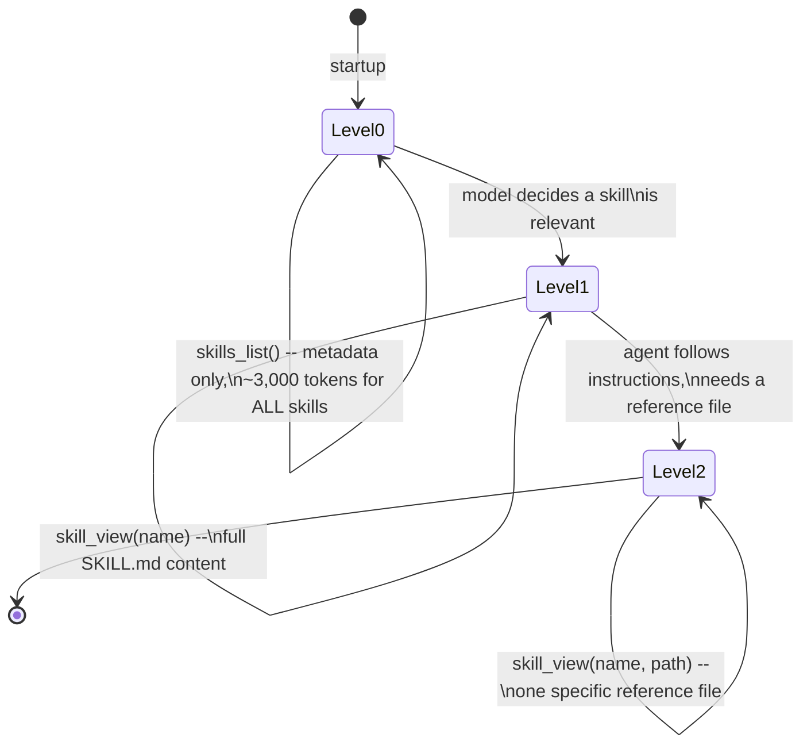
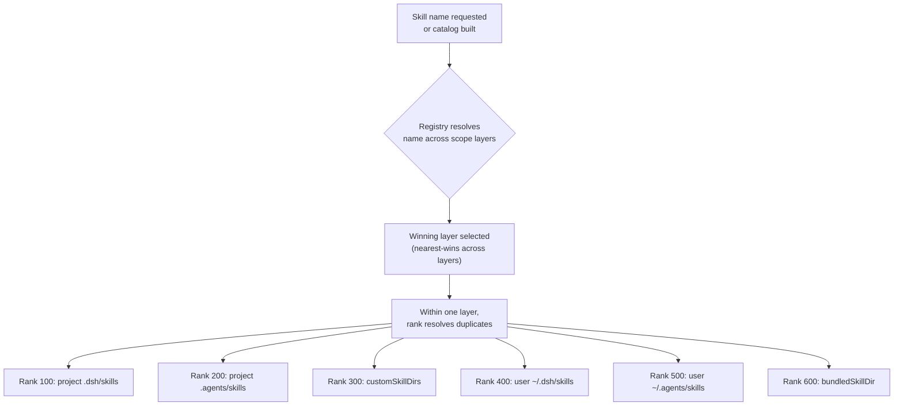
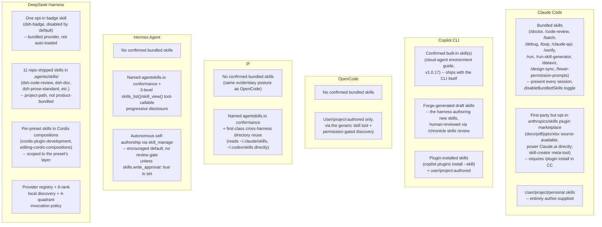

# Built-in skills -- Claude Code, GitHub Copilot CLI, OpenCode, pi, Hermes Agent, and DeepSeek Harness

What ships as a *skill* out of the box in each harness -- as distinct
from a skill a user or repo author writes themselves -- and how each
harness's own product surface (plugin marketplace, cloud agent,
autonomous draft-generation) supplies first-party skill content beyond
what any single user typed. This page is about the *content that
ships*, not the loading mechanics: for the SKILL.md frontmatter
reference, the context-budget economics of when a skill's body loads,
and the invoke-only tier's place in each harness's instruction-loading
hierarchy, see [Instruction context budget](instruction-context-budget.md)
§1.4/§2.3, which already covers that ground in full and is not
duplicated here. For the tool surface a skill can invoke, see
[Built-in tools](built-in-tools.md); for a skill that forks into its
own subagent context (`context: fork`, Copilot's `configure-copilot`),
see [Handoff mechanism](handoff-mechanism.md).

Every claim below is tagged VERIFIED (fetched this session from the
named source) or BEST CURRENT UNDERSTANDING, UNCONFIRMED. Claude Code,
Copilot CLI, OpenCode, pi, Hermes Agent, and DeepSeek Harness are six
separate products from six separate organizations -- nothing confirmed
for one is assumed for another. Sources and fetch dates at the bottom.

---

## 1. Claude Code

Primary sources for this section: `code.claude.com/docs/en/skills` and
`code.claude.com/docs/en/commands`, both fetched 2026-07-30 (VERIFIED),
cross-checked against `anthropics/claude-code`'s own `CHANGELOG.md`
(fetched via `gh api` on 2026-07-31, VERIFIED for its own
behavior-change history) and `anthropics/skills`' own `README.md` and
repository contents (fetched via `gh api` on 2026-07-31, VERIFIED for
that repository's own structure and stated purpose).

Claude Code ships built-in skill content at two genuinely different
levels, and the docs and changelog together make the distinction
sharp: skills bundled into every session by the product itself, and
skills Anthropic maintains and publishes but which a user must opt
into installing.

### 1.1 Bundled skills -- present in every session by default

The skills doc states plainly: "Claude Code includes a set of bundled
skills, such as `/doctor`, `/code-review`, `/batch`, `/debug`,
`/loop`, and `/claude-api`." These are documented as **prompt-based**:
"they give Claude detailed instructions and let it orchestrate the
work using its tools," in contrast to "most built-in commands" which
"instead execute fixed logic directly" -- i.e. a bundled skill is not
special-cased engine code, it is a first-party `SKILL.md` (or
equivalent) that ships inside the Claude Code binary/package itself
and is listed in the skill inventory like any user skill, just at a
level above personal/project/plugin.

The commands reference (marking each row's Purpose column) and the
skills doc together name this set, current as of the versions cited
inline below:

| Bundled skill | What it does |
|---|---|
| `/doctor` | Setup checkup: installation health, unused skills/MCP servers/plugins, slow hooks, newer-version checks, `CLAUDE.md` deduplication, trims checked-in files of content Claude could derive from the codebase. Stays typable even when `disableBundledSkills` is on (v2.1.205+); before that version it was a built-in command, not a bundled skill. |
| `/code-review [effort] [--fix] [--comment] [target]` | Reviews the current diff for correctness bugs and cleanup opportunities; `ultra` triggers a deep cloud review. Runs only when invoked as of v2.1.215 -- before that, Claude could also trigger it autonomously. Renamed from `/simplify` (changelog-traced; `/simplify` later reappeared as a narrower cleanup-only command that itself invokes `/code-review --fix`). |
| `/batch <instruction>` | Orchestrates large-scale changes across a codebase in parallel: decomposes work into independent units, spawns one background subagent per unit in isolated git worktrees, opens pull requests. |
| `/debug [description]` | Enables debug logging for the current session and reads the session debug log to troubleshoot an issue. |
| `/loop [interval] [prompt]` | Runs a prompt repeatedly while the session stays open; self-paces between iterations if no interval is given. |
| `/claude-api [migrate\|managed-agents-onboard]` | Loads Claude API reference material (tool use, streaming, batches, structured outputs) for the project's language; `migrate` upgrades existing Claude API code to a newer model. |
| `/verify` | Builds and runs the app to confirm a code change works, without falling back to tests/type checks. Can record its own recipe to `.claude/skills/verify/SKILL.md`, at which point the recorded project skill *replaces* the bundled one at the repo root. Runs only when invoked as of v2.1.215. |
| `/run` | Launches and drives the app to demonstrate a change working; infers the launch from project type, README, `package.json`, or `Makefile`. |
| `/run-skill-generator` | Records a working launch/build recipe from a clean environment as a per-project skill at `.claude/skills/run-<name>/`, so `/run`/`/verify`/other agents in the repo stop rediscovering it each time. |
| `/dataviz` | Design guidance for charts/graphs/dashboards -- chart-form selection, colour-by-role assignment, colourblind-safe palette validation, accessibility rules. |
| `/design-sync` | Converts the repo's React design system and uploads it to Claude Design so generated designs use the project's real components. |
| `/fewer-permission-prompts` | Scans transcripts for common read-only Bash/MCP calls and writes a prioritized allowlist to project `.claude/settings.json`. |
| `/deep-research <question>` | A bundled **Workflow** rather than a plain skill -- fans out web searches, fetches and cross-checks sources, synthesizes a cited report. Starts only when invoked manually (changelog-confirmed change; Claude previously launched it on its own). |

`/run`, `/verify`, and `/run-skill-generator` all require Claude Code
v2.1.145 or later per the docs' own version note; `/verify`'s
recipe-recording behavior requires v2.1.200 or later.

A small number of built-in *commands* are separately exposed through
the `Skill` tool for programmatic/permission purposes -- `/init`,
`/review`, and `/security-review` -- while others such as `/compact`
are not, per the skills doc's "Restrict Claude's skill access"
section. This is a narrower, permission-surface fact distinct from the
"bundled skill" list above; treat the two lists (bundled skills vs.
commands additionally reachable via the `Skill` tool) as overlapping
but not identical.

### 1.2 The bundled-skill visibility controls

```mermaid
flowchart TD
    S["A skill name is invoked or considered<br/>for auto-invocation"] --> Q1{disableBundledSkills<br/>setting/env var on?}
    Q1 -->|Yes| Q2{Is it /doctor?}
    Q2 -->|Yes| STILL["/doctor stays typable<br/>(v2.1.205+)"]
    Q2 -->|No| HIDDEN["Hidden from model and /<br/>menu -- bundled skills,<br/>workflows, built-in slash<br/>commands all hidden"]
    Q1 -->|No| Q3{skillOverrides entry<br/>for this skill name?}
    Q3 -->|"off"| OFF["Hidden from model + menu"]
    Q3 -->|"name-only"| NAMEONLY["Name listed, description stripped"]
    Q3 -->|"user-invocable-only"| USERONLY["Hidden from model,<br/>menu-invocable only"]
    Q3 -->|absent, i.e. "on"| NORMAL["Description in listing,<br/>full body loads on invoke"]
```

`disableBundledSkills` (a settings key, with `CLAUDE_CODE_DISABLE_BUNDLED_SKILLS`
as its environment-variable equivalent, changelog-confirmed addition)
hides every bundled skill, workflow, and built-in slash command from
the model at once -- `/doctor` is the sole documented exception, kept
typable so the escape hatch to diagnose a broken setup never
disappears. Independently, `skillOverrides` (settings-level, written
automatically by the `/skills` menu into `.claude/settings.local.json`)
controls visibility per skill name at four granularities (`on`,
`name-only`, `user-invocable-only`, `off`) and applies to any skill,
bundled or not -- see [Instruction context budget](instruction-context-budget.md)
for the token-budget mechanics this feeds into (the 1,536-character
description cap, the 1%-of-context-window listing budget, etc.),
which are not repeated here.

### 1.3 First-party skills distributed as an opt-in plugin, not bundled

Distinct from the bundled set above, Anthropic maintains a public
repository, `github.com/anthropics/skills` (165,419 stargazers,
19,668 forks as of the `gh api` fetch this session -- VERIFIED via
direct repository-metadata fetch, not a WebFetch-summarized guess),
containing example and first-party skills grouped into Creative &
Design, Development & Technical, Enterprise & Communication, and a
Document Skills set. The repository's own README states its document
skills are not merely illustrative: "We've also included the document
creation & editing skills that power Claude's document capabilities
under the hood in the `skills/docx`, `skills/pdf`, `skills/pptx`, and
`skills/xlsx` subfolders. These are source-available, not open source,
but we wanted to share these with developers as a reference." The
repository's contents (fetched directly) list these skill folders at
the top level: `algorithmic-art`, `brand-guidelines`, `canvas-design`,
`claude-api`, `doc-coauthoring`, `docx`, `frontend-design`,
`internal-comms`, `mcp-builder`, `pdf`, `pptx`, `skill-creator`,
`slack-gif-creator`, `theme-factory`, `web-artifacts-builder`,
`webapp-testing`, `xlsx`.

The load-bearing distinction for this page: on Claude.ai, the README
states these example skills "are all already available to paid plans"
-- i.e. shipped/enabled by default on that surface. On Claude Code
specifically, they are **not** loaded by default; the README's own
instructions require registering the repository as a plugin
marketplace (`/plugin marketplace add anthropics/skills`) and then
installing a specific plugin bundle (`/plugin install
document-skills@anthropic-agent-skills` or `example-skills@...`)
before Claude Code will see them at all. So "built-in" here means
first-party and officially maintained, not automatically present in
every Claude Code session the way `/doctor` or `/code-review` are --
a meaningfully different sense of "built-in" from §1.1's bundled set,
and the two should not be conflated when answering "does Claude Code
ship a PDF skill." The README's own disclaimer reinforces the same
point from the other direction: "These skills are provided for
demonstration and educational purposes only. While some of these
capabilities may be available in Claude, the implementations and
behaviors you receive from Claude may differ from what is shown in
these skills."

The `skill-creator` folder in that same repository is also
independently referenced from Claude Code's own docs as an installable
plugin (`/plugin install skill-creator@claude-plugins-official`) that
automates writing and grading eval suites for a skill under
construction -- test cases in `evals/evals.json`, per-test-case
isolated subagent runs, `grading.json`/`benchmark.json` output, and a
blind A/B comparison mode between two skill versions. This is a
meta-tool for *authoring* skills, not a skill that does end-user work
itself, and is worth distinguishing from both the bundled set and the
document-skills set above.

All skills across every level in Claude Code -- bundled, plugin-
installed, personal, project -- follow the same underlying `SKILL.md`
format, which the docs describe as an implementation of the "Agent
Skills open standard" (`agentskills.io`), a cross-tool specification
Claude Code "extends... with additional features like invocation
control, subagent execution, and dynamic context injection." The full
frontmatter field reference (`disable-model-invocation`,
`user-invocable`, `allowed-tools`, `paths`, `context: fork`, string
substitutions, etc.) and the loading-economics discussion belong to
[Instruction context budget](instruction-context-budget.md) and are
not restated here.

---

## 2. GitHub Copilot CLI

Sources for this section: `docs.github.com/en/copilot/concepts/agents/about-agent-skills`
and `docs.github.com/en/copilot/how-tos/copilot-cli/customize-copilot/add-skills`,
both fetched 2026-07-31; and `github/copilot-cli`'s own `changelog.md`,
fetched via `gh api` on 2026-07-31. VERIFIED unless flagged otherwise.

### 2.1 A confirmed, changelog-traced built-in skill

Unlike the two concept/how-to docs pages, which describe skills purely
as a user/repo-authored mechanism ("folders of instructions, scripts,
and resources that Copilot can load when relevant... to improve its
performance in specialized tasks" -- with no built-in example named),
the CLI's own changelog directly confirms a first-party bundled skill:
version 1.0.17 (2026-04-03) states "Built-in skills are now included
with the CLI, starting with a guide for customizing Copilot cloud
agent's environment." This is the clearest single confirmation in any
source fetched this session that Copilot CLI ships at least one skill
of its own, independent of anything a user or repository author
writes -- though only that one skill (a cloud-agent-environment
customization guide) is named; whether more built-in skills have
shipped silently since is BEST CURRENT UNDERSTANDING, UNCONFIRMED, not
found in any changelog entry fetched this session.

### 2.2 `configure-copilot` -- a subagent, not a skill, doing adjacent work

Version 1.0.3 (2026-03-09) added a "configure-copilot sub-agent for
managing MCP servers, custom agents, and skills via the task tool."
This is a **subagent** reachable through the task tool, not a skill
in the `SKILL.md` sense -- it is already covered from the subagent-
dispatch angle in [Built-in tools](built-in-tools.md) §2.1 and
[Handoff mechanism](handoff-mechanism.md); it is named again here only
to draw the boundary clearly, since "a built-in thing that manages
skills" and "a built-in skill" are easy to conflate and the changelog
treats them as two different mechanisms.

### 2.3 Forge-generated draft skills -- the harness authoring its own skills

Two separate changelog entries describe Copilot CLI's own tooling
*creating* skill content autonomously rather than shipping it
pre-written: version 1.0.66 (2026-06-30) added "`/chronicle skills
review` for reviewing proposed draft skill changes, with options to
accept, reject, or defer each draft," and version 1.0.70 (2026-07-09)
added "Create draft skills when Forge finds a clear workflow pattern."
Read together, this describes a pipeline distinct from anything found
in either Claude Code's or OpenCode's sourced material this session:
a component named "Forge" (not otherwise documented in any source
fetched this session -- treat its exact scope as BEST CURRENT
UNDERSTANDING, UNCONFIRMED beyond these two changelog lines) detects a
recurring workflow pattern in usage and proposes a draft `SKILL.md` as
a candidate, which a human then accepts, rejects, or defers through
`/chronicle skills review` before it becomes a real, invocable skill.
This is functionally the closest thing to a harness "writing its own
skills" found across all three products in this book; whether Claude
Code or OpenCode have an analogous auto-draft mechanism was not found
in any source fetched for this page and should be treated as an open
question, not ruled out.

### 2.4 SKILL.md format and discovery, Copilot CLI's documented version

Per the add-skills how-to page, a Copilot CLI skill's frontmatter
supports `name` (required, lowercase, hyphens for spaces), `description`
(required), `license` (optional), and `allowed-tools` (optional,
pre-approves tools such as `shell` to avoid repeated confirmation
prompts for that skill). The changelog separately confirms two
frontmatter fields not mentioned on that how-to page at all -- an
`argument-hint` field (added v1.0.64, 2026-06-23) and full honoring of
a `disable-model-invocation` flag (v1.0.74, 2026-07-23) -- a
documentation/changelog gap worth flagging explicitly: the docs page
undersells the actual supported frontmatter surface as of the versions
checked this session.

Discovery locations mirror the ones already documented in
[Instruction context budget](instruction-context-budget.md) §2.3:
project skills in `.github/skills`, `.claude/skills`, or
`.agents/skills`; personal skills in `~/.copilot/skills` or
`~/.agents/skills`; invocation by typing `/skill-name`. Skills are also
independently installable as artifacts through the CLI's own plugin
system -- `copilot plugins install --skill <file, URL, or directory>`,
with `--scope project` to install into the repository -- and the
`copilot skill` subcommand family (`list`, `add`, `remove`) manages
them directly, changelog-confirmed additions layered on top of the
file-discovery mechanism above.

---

## 3. OpenCode

Sources for this section: `opencode.ai/docs/skills`, fetched
2026-07-31. VERIFIED unless flagged otherwise. A repository code search
for `SKILL.md` across `anomalyco/opencode` (via `gh api search/code`,
run this session) returned no results, corroborating the docs' own
framing rather than standing alone as independent proof of absence --
GitHub code search coverage of a `dev`-branch repository is not
guaranteed exhaustive.

### 3.1 No bundled skills -- a purely generic extension point

OpenCode's own skills documentation describes the `skill` tool and the
`SKILL.md` discovery/permission mechanism entirely in terms of content
a user or project author supplies; no example of a skill shipped
inside the OpenCode product itself is named anywhere on the page. Read
alongside the empty code-search result above, treat "OpenCode ships no
built-in skills of its own" as BEST CURRENT UNDERSTANDING -- strongly
supported by the documentation's own framing and consistent with an
empty search, but not a claim any source fetched this session states
in as many words ("we do not bundle any skills" is not a sentence that
appears on the page).

### 3.2 SKILL.md format and mechanism, as documented

A skill's frontmatter requires `name` (1-64 characters, lowercase
alphanumeric with hyphens, matching the regex `^[a-z0-9]+(-[a-z0-9]+)*$`)
and `description` (1-1024 characters); `license`, `compatibility`, and
a string-to-string `metadata` map are optional, and unknown frontmatter
fields are documented as ignored rather than rejected. Discovery walks
two location tiers: project-local, searched by walking up from the
current working directory to the git worktree root (`.opencode/skills/<name>/SKILL.md`,
`.claude/skills/<name>/SKILL.md`, `.agents/skills/<name>/SKILL.md`),
and global (`~/.config/opencode/skills/*/SKILL.md`,
`~/.claude/skills/*/SKILL.md`, `~/.agents/skills/*/SKILL.md`) -- the
same cross-harness directory-sharing pattern already noted for
Copilot CLI in [Instruction context budget](instruction-context-budget.md)
§2.3, extended here to a third harness reading from the same
`.claude/skills` path.

An agent invokes a skill by calling the `skill` tool with a name
argument, e.g. `skill({ name: "git-release" })`, which loads that
skill's content into the conversation. The `permission` block governs
the `skill` key the same way it governs `bash`/`edit`/`task` elsewhere
in OpenCode's model (see [Built-in tools](built-in-tools.md) §3.2):
`allow` loads immediately, `ask` prompts for approval before loading,
and `deny` hides the skill from the agent entirely and rejects access
-- with glob-style wildcard patterns (`internal-*`) supported the same
way as other permission keys, and the whole `skill` key able to be
disabled per agent via `tools: { skill: false }` in an agent's own
configuration.

---

## 4. pi

Sources for this section: VERIFIED, fetched 20 August 2026 directly from
`github.com/earendil-works/pi`'s `packages/coding-agent/docs/skills.md`, in full.

### 4.1 An explicit, named-standard implementation, with a documented, deliberate deviation

pi's docs state its own compliance posture up front, in a way none of Claude Code's,
Copilot CLI's, or OpenCode's own skills documentation states as directly: "Pi implements
the [Agent Skills standard](https://agentskills.io/specification), warning about most
violations but remaining lenient." This is the first harness in this book to name an
external, cross-vendor specification as the thing it is implementing, rather than
describing its own skill mechanism purely in its own terms -- a meaningfully different
framing from Claude Code's and Copilot CLI's own skill docs (§1-§2), which describe their
respective frontmatter/discovery rules without citing an outside standard they are
conforming to. pi's docs also name one **deliberate, explicit deviation** from that
standard rather than silently diverging: the Agent Skills specification requires a
skill's `name` field to match its parent directory name, and pi's docs state plainly
that pi does not enforce this, "because that standard requirement is suboptimal for
shared skill directories used across multiple agent harnesses" -- i.e. the deviation
exists specifically to make cross-harness skill-directory sharing (the same convergence
§4's own closing paragraph below documents for Claude Code/Copilot CLI/OpenCode) work
more smoothly for pi as a fourth participant in that sharing pattern, not out of mere
laxness.

### 4.2 No confirmed bundled skills -- reading like OpenCode's posture, for the same evidentiary reason

pi's own `README.md`/`skills.md` name no skill shipped inside the pi product itself the
way Claude Code names its dozen bundled skills (§1) or Copilot CLI names its cloud-agent
environment guide (§2) -- the docs' own framing ("pi can create skills. Ask it to build
one for your use case") treats skill authorship as something the user or an external
skill repository supplies, not something pi ships pre-loaded. Treat "pi ships no
built-in skills of its own" as **BEST CURRENT UNDERSTANDING** on the same evidentiary
basis §3.1 already applies to OpenCode -- strongly supported by the documentation's own
framing and the absence of any named bundled skill anywhere in the docs fetched this
session, but not a sentence any pi source states in as many words ("we do not bundle any
skills" does not appear verbatim on the page).

### 4.3 Explicit, first-class cross-harness directory reuse -- the deepest documented instance in this book

Where §4's own closing synthesis paragraph below observes that Claude Code's, Copilot
CLI's, and OpenCode's skill-discovery logic *happens* to converge on reading
`.claude/skills` as a shared path, pi's own docs go one step further and document this
as an intentional, named feature with its own worked configuration example -- a
dedicated "Using Skills from Other Harnesses" subsection instructing a reader to add
`~/.claude/skills` and `~/.codex/skills` directly to pi's own `skills` settings array (or
`../.claude/skills` in a project's `.pi/settings.json` for project-level Claude Code
skills). This is the most explicit, first-party-endorsed instance of the cross-harness
skill-portability pattern this book has found anywhere -- not an inferred convergence
from three independently-written discovery-path lists, but a harness's own docs
instructing a user how to point it at a *named competitor's* skill directory. pi's own
discovery locations otherwise follow the same two-tier shape as OpenCode's (§3.2): global
(`~/.pi/agent/skills/`, `~/.agents/skills/`) and project (`.pi/skills/`, and
`.agents/skills/` walked from the cwd up to the git repo root or filesystem root),
plus a packages channel (`skills/` directories or `pi.skills` entries in a pi
package's own `package.json`, cross-referenced against
[packaging-distribution-and-self-update.md](packaging-distribution-and-self-update.md)'s
own pi section for the package-distribution mechanism itself) and repeatable `--skill
<path>` CLI flags that remain additive even alongside `--no-skills`.

A documented discovery-rule asymmetry worth naming precisely: in `~/.pi/agent/skills/`
and `.pi/skills/`, a bare root-level `.md` file with valid skill frontmatter is
discovered as its own individual skill; in `~/.agents/skills/` and project
`.agents/skills/` specifically, root-level `.md` files are *ignored* even with valid
frontmatter, and only nested `.md` files inside a grouping folder are discovered -- a
deliberate difference in how the two directory conventions are walked, not a bug, since
`.agents/skills/` is the shared, cross-tool convention pi is reading defensively rather
than a pi-owned directory it fully controls the contents of.

### 4.4 Frontmatter surface: closest to OpenCode's in size, with one field neither other harness's confirmed set names

pi's documented frontmatter fields are `name` (required, the same 1-64-character
lowercase-hyphenated rule as the other harnesses, minus the parent-directory-match
requirement per §4.1), `description` (required, max 1024 characters), `license`,
`compatibility` (max 500 characters, environment requirements), `metadata` (an arbitrary
key-value map), `allowed-tools` (space-delimited, explicitly marked "experimental," the
same pre-approved-tool-list concept Copilot CLI's own confirmed frontmatter set already
names per §2), and `disable-model-invocation` (`true` hides the skill from the system
prompt entirely, requiring the user to invoke it explicitly via `/skill:name` -- the same
field name and semantics this page's §4's own closing paragraph already found in
Copilot CLI's changelog-only field set, a second, independently-documented instance of
the identical field name and behavior). This puts pi's frontmatter surface in between
OpenCode's smaller confirmed set (§3.2: `name`/`description`/`license`/`compatibility`/
`metadata`, no `allowed-tools` or `disable-model-invocation` named) and Copilot CLI's own
(§2), while remaining well short of Claude Code's much larger field set (§1). Unknown
frontmatter fields are documented as ignored, the same lenient-superset behavior
OpenCode's own docs state (§3.2); a skill declared with a missing `description`,
however, is not loaded at all and produces a warning -- description is the one field
pi's docs treat as load-bearing enough that its absence blocks the skill outright rather
than merely warning and proceeding.

### 4.5 Invocation: `/skill:name`, with an explicit model-reliability caveat

A discovered skill's name/description pair is rendered into the system prompt "in XML
format per the specification" -- progressive disclosure, the same load-only-the-
description-until-needed principle every harness's own skills mechanism in this book
implements. Skills additionally register as `/skill:name` slash commands
(`/skill:brave-search`, with arguments after the command name appended to the skill's own
content as `User: <args>`), togglable globally via `enableSkillCommands` in
`settings.json`. pi's docs name a specific reliability caveat worth quoting directly,
since it bears on how much a skill author should rely on the model reading a skill's
full content unprompted: "the agent uses `read` to load the full SKILL.md (models don't
always do this; use prompting or `/skill:name` to force it)" -- i.e. pi's own docs treat
model-invoked skill loading as probabilistic rather than guaranteed, and name the
explicit slash command as the deterministic fallback when a task genuinely requires the
skill's full content to load, not merely its description.

---

## 5. Hermes Agent (Nous Research)

Source for this section: VERIFIED, fetched 24 August 2026 directly from
`hermes-agent.nousresearch.com/docs/user-guide/features/skills` (WebFetch).
Hermes Agent is a fifth, independent, self-hosted product -- see
[Permissions & sandboxing architecture](permissions-and-sandboxing.md) §6
for this book's fuller architectural introduction to the harness itself,
not repeated here.



### 5.1 A second, independently sourced instance of the `agentskills.io` standard

"Skills are on-demand knowledge documents the agent can load when
needed. They follow a **progressive disclosure** pattern to minimise
token usage and are compatible with the
[agentskills.io](https://agentskills.io/specification) open standard."
This is the **second** independent instance this book has now sourced
of a harness explicitly targeting that named, shared, cross-vendor
specification -- the first being pi (§4.1 above, "Pi implements the
Agent Skills standard, warning about most violations but remaining
lenient"), and a third being LangChain's Deep Agents per this book's
[middleware-composed-agent-harnesses.md](middleware-composed-agent-harnesses.md)
§7. Three independently-built harnesses now cite the identical outside
specification by name, meaningfully strengthening the case that
`agentskills.io` is a real, multi-adopter standardization point rather
than a specification named by only one project.

### 5.2 Loading discipline exposed as named, model-callable tools -- distinctive among every skills mechanism this page has sourced

The loading discipline is explicitly three-leveled and, distinctively
among every skills mechanism this page has sourced so far, exposed
through **named tool calls a model invokes directly** rather than an
implicit framework-side discovery step: **Level 0**, `skills_list()`,
returns "metadata only (~3,000 tokens)" for every installed skill;
**Level 1**, `skill_view(name)`, retrieves one skill's full `SKILL.md`
content; **Level 2**, `skill_view(name, path)`, loads one specific
reference file from that skill's own directory -- "The agent only loads
the full skill content when it actually needs it." Neither Claude
Code's, Copilot CLI's, OpenCode's, nor pi's own progressive-disclosure
mechanism (§1-§4 above) is documented as exposing this loading step as
an explicit tool the model calls by name; each instead treats the
description-then-full-body handoff as an implicit consequence of the
model reading a file or the harness itself deciding what to inject.

### 5.3 Autonomous, in-session skill authorship as an encouraged default behaviour

The `SKILL.md` format itself matches this page's existing convention
almost exactly (YAML frontmatter naming `name`, `description`,
`version`, `platforms`, followed by markdown sections such as "When to
Use," "Procedure," "Pitfalls," and "Verification"), corroborating
[instruction-context-budget.md](instruction-context-budget.md)'s own
independently-observed frontmatter-plus-body shape a further time. What
is genuinely new here relative to every other skills mechanism this
page has sourced -- including Deep Agents' own skills mechanism, which
treats skills as "typically read-only developer-defined resources" --
is **autonomous, in-session skill authorship as a first-class,
encouraged behavior**: the agent uses a `skill_manage` tool (actions
`create`, `patch`, `edit`, `delete`, `write_file`, `remove_file`) to
write its own skills, and the system prompt itself is documented as
actively encouraging this -- "record a non-trivial workflow with
`skill_manage` for future reuse." This stands in sharpest contrast with
this page's own §5's-sibling finding for Copilot CLI (§2): Copilot
CLI's Forge/`/chronicle skills review` pipeline also produces
harness-authored skill drafts, but stages every one for **human
review** before it becomes real, where Hermes' `skill_manage` tool
writes directly, with no equivalent named review gate in the docs
fetched this session -- two genuinely different points on the same
"who authors a new skill" spectrum, not the same mechanism described
in different words.

Skills are invoked as slash commands stackable in a single message
("`/github-pr-workflow /test-driven-development fix issue #123 and open
a PR`" loads both sequentially, with parsing stopping "at the first
token that isn't an installed skill" to avoid misreading arguments
containing forward slashes), and human-approval gating is available via
a `skills.write_approval: true` config key -- an optional, admin-facing
lever that brings Hermes' own default-autonomous posture closer to
Copilot CLI's default-reviewed one, when an operator chooses to enable
it.

---

## 6. DeepSeek Harness (DeepSeek AI)

Sources for this section: VERIFIED, fetched 1 September 2026 directly from
`github.com/deepseek-ai/deepseek-harness` (the `master` branch), via
`gh api` content reads. Files fetched: `README.md`, `docs/subsystems/skills.md`,
`packages/skill/README.md`, `packages/skill/tool-skill/README.md`,
`packages/skill/skill-filesystem/README.md`, `packages/skill/skill-badge/README.md`,
`packages/skill/skill-badge/assets/dsh-badge.md`, the eleven `SKILL.md` files
under `.agents/skills/`, the two `SKILL.md` files under
`packages/preset/agent-presets/presets/cordis/skills/`, and the relevant
Agent Notes under `.agents/notes/implemented/feature/` and
`.agents/notes/implemented/architecture/` (five notes in total).

DeepSeek Harness (abbreviated `dsh`) is an open-source, MIT-licensed agent
harness developed by DeepSeek AI, currently in developer preview with
explicit compatibility-breaking change warnings per its own `README.md`
(VERIFIED). Its architecture is "everything-is-a-plugin" built on the
Cordis framework -- a design choice that shapes its skill system more
deeply than any other harness this page documents, because skills are not
a special-cased surface but one more plugin-provided capability composed
alongside tools, persistence, and all other harness functions through the
same `cordis.yml` composition mechanism.

### 6.1 Three-layers-of-package architecture: registry, provider, consumer

The skill system is not one package but four, each independently
composable, and this split is architecturally load-bearing in a way
none of the other five harnesses' own skill systems mirror:

| Package | npm name | Role | ctx key |
|---|---|---|---|
| `skill/` | `@deepseek-ai/dsh-skill` | Pure provider registry that merges skill catalogs from any number of providers and resolves the winning skill for a name | `ctx.skills` |
| `skill-filesystem/` | `@deepseek-ai/dsh-skill-filesystem` | Discovers skills from project, custom, and user directories and watches them for changes; one implementation of the provider contract | registers on `ctx.skills` |
| `skill-badge/` | `@deepseek-ai/dsh-skill-badge` | Bundles the official "powered by dsh" badge skill as an immutable provider; disabled by default in the shipped CLI composition | registers on `ctx.skills` |
| `tool-skill/` | `@deepseek-ai/dsh-tool-skill` | Publishes the session skill catalog and the model-facing `skill` loader tool | registers on `ctx.tools` |

This table is VERIFIED from `packages/skill/README.md` (the group-level
README). The separation means a deployment can compose the registry and a
remote provider without the filesystem provider, or mount the registry and
filesystem provider without the consumer (in which case skills exist in
`ctx.skills` but no model-facing catalog or `skill` tool is rendered), or
disable the badge provider specifically while keeping everything else --
all by editing the composition rather than the code. The skill-system
Agent Note (`.agents/notes/implemented/feature/2026-07-05-skill-system.md`,
VERIFIED) explicitly names this split: "`dsh-base` loads the registry,
local provider, and consumer as separate rows so its profiles get the
same behavior while embedded or remote providers contribute skills without
changing the registry or consumer."

The registry is *host-held and layered per scope*, the same shape the
tools registry uses: host-plane and repository-plugin registrations land
in the global layer, while a preset's own skill-filesystem registration
lands in that preset's layer. A read merges the global layer with the
viewing scope's chain, and **the nearest layer wins a duplicate name
outright** -- rank order decides only within one layer. This is a
meaningfully different deduplication rule from any other harness this page
documents: in Claude Code, Copilot CLI, OpenCode, and pi, same-name
conflicts are resolved by discovery-path priority or first-wins ordering,
not by a scope-chain shadowing rule inherited from a framework-level
registry pattern. The layered-registry Agent Note
(`.agents/notes/implemented/architecture/2026-08-09-layered-skill-registry.md`,
VERIFIED) owns this design: "rank-pooling across layers was considered
and rejected: ranks were designed to order sources that know about each
other, and under a global pool a later-installed repository plugin could
silently displace a preset's own same-named skill by registration-order
tiebreak, changing a preset's behavior remotely."

### 6.2 Bundled skills -- a single opt-in badge, not a feature suite

DeepSeek Harness is the first harness in this book where "bundled skill"
means something structurally different from "a skill shipped inside the
product that is present in every session." The badge note
(`.agents/notes/archived/feature/2026-08-06-bundled-dsh-badge-skill.md`,
VERIFIED) and the badge package README (VERIFIED) together confirm:

- `@deepseek-ai/dsh-skill-badge` is the one bundled skill shipped with
  the harness. It contributes a single immutable skill named `dsh-badge`
  that provides official "powered by dsh" attribution markup and a
  packaged PNG asset. Its instruction body and PNG live under
  `packages/skill/skill-badge/assets/` (VERIFIED from direct content
  read of `assets/dsh-badge.md`).
- The shipped CLI composition declares `skill-badge` as **disabled by
  default**: "the shipped CLI composition includes the plugin disabled,
  so deployments enable it explicitly" (badge README, VERIFIED). Enabling
  the composition row is the opt-in mechanism; a disabled installation
  advertises no badge skill and gains no model-visible content.
- The badge provider registers at the bundled rank (600), after project
  (100), project-agents (200), custom (300), user-dsh (400), and
  user-agents (500) -- so a user-owned `dsh-badge` definition can
  override it through the ordinary registry precedence contract (badge
  note, VERIFIED).

This is a single, narrow, opt-in attribution skill -- not a skill suite
the way Claude Code's twelve bundled skills (§1) or Copilot CLI's
cloud-agent environment guide (§2) are. The skill-system Agent Note
(VERIFIED) explicitly states the design intent: "the local provider does
not synthesize built-in system skills; deployments supply packaged skills
through configured bundled roots or dedicated providers." And the
materialize-built-in alternative was explicitly rejected: "Materialize
built-in DSH authoring skills under `~/.dsh/skills/.system`. Rejected
because bundled skills do not write user home on startup, and embedded
or remote providers supply configured skills."

### 6.3 Repository-shipped skills in `.agents/skills/` -- first-party but not "bundled" by the CLI's own definition

The repo's own `.agents/skills/` directory contains eleven `SKILL.md`
files, each a first-party skill authored and maintained alongside the
harness source. They are:

| Skill name | Frontmatter `disable-model-invocation` | Frontmatter `user-invocable` | Purpose |
|---|---|---|---|
| `dsh-code-review` | absent (defaults true) | absent (defaults true) | PR review guidance for the deepseek-harness repo itself |
| `dsh-ci-test-reliability` | absent | absent | CI test isolation, flake diagnosis, and reliability guidance |
| `dsh-doc` | absent | absent | Documentation authoring, restructuring, and bilingual alignment |
| `dsh-prose-standard` | absent | absent | Prose review, trimming, and required-coverage judgment |
| `dsh-trim-cot-leakage` | absent | absent | Hunting and fixing reasoning-transcript leakage in prose |
| `dsh-pre-push-checks` | absent | absent | Selecting the smallest test/check set for an outgoing push |
| `dsh-find-simplifications` | absent | absent | Finding dead, duplicated, speculative, or over-built surface area to remove |
| `dsh-archive-agent-notes` | absent | absent | Lifecycle management for the repo's Agent Note corpus |
| `dsh-merging-stacked-prs` | absent | absent | Landing GitHub PR stacks through the official `gh stack merge` flow |
| `dsh-translate-docs` | **true** | **true** | Extended bilingual document workflow; user-explicit invocation only |
| `record-browser-gif` | absent | absent | Recording browser interaction demos as GIFs for PR evidence |

These are VERIFIED from direct content reads of each `SKILL.md` file in
`.agents/skills/`. The critical distinction for this page is that these
skills live under the **project** root `.agents/skills/` path, alongside
the same `.agents/skills/` discovery path Copilot CLI and OpenCode also
read. They are *repository-shipped*, meaning a developer working inside a
clone of the `deepseek-harness` repo itself will discover them through
the project-dsh path at rank 100 -- but they are not "bundled" in the
sense the harness's own architecture uses that word (the `dsh-skill-badge`
provider at rank 600 is the bundled tier, and it is disabled by default).
Someone using a published `dsh` installation on their own project will
not see these skills unless they copy them into their own
`.agents/skills/` or `.dsh/skills/` directory.

Additionally, the repo's `.claude/skills` directory is a **symlink** to
`../.agents/skills` (VERIFIED from the GitHub API response, which
records `type: "symlink"`, `target: "../.agents/skills"`). This makes
these eleven skills also discoverable when Claude Code is used on the
deepseek-harness repo itself -- the same cross-harness directory-sharing
convergence documented in §7's synthesis, realized here as an explicit
repository-maintained symlink rather than a harness-level discovery path.

The Cordis preset at
`packages/preset/agent-presets/presets/cordis/skills/` ships two
additional skills scoped to the `cordis` agent preset:
`cordis-plugin-development` (420-line skill for creating, modifying, and
debugging dynamic Cordis plugins) and `editing-cordis-compositions` (165
lines for authoring and validating `cordis.yml` compositions). These are
VERIFIED from direct content reads. They follow the same `SKILL.md`
format and would be discovered by the skill-filesystem provider when the
`cordis` preset is active in a session whose cwd is the repo root -- but
they live under the Cordis preset's own composition, not the project's
general `.agents/skills/` directory, so they are scoped to that preset's
agent layer rather than the global catalog.

### 6.4 The independent invocation-policy model -- all four quadrants, enforced at every boundary

DeepSeek Harness implements an invocation-control model structurally
different from any other harness this page has sourced. Where Claude
Code's `disableBundledSkills`/`skillOverrides` is a per-skill visibility
toggle, Copilot CLI's `disable-model-invocation` is a single-boolean
hint, and pi's is the same single-boolean pattern, DSH's
`SkillInvocationPolicy` is a **two-dimensional, positive-boolean model
with four deliberate quadrants**, explicitly documented as such in the
invocation-policy Agent Note (VERIFIED):

| `modelInvocable` | `userInvocable` | Effect |
|---|---|---|
| `true` | `true` | Catalog + `skill` tool + `/name` gesture |
| `true` | `false` | Catalog + `skill` tool only; excluded from `/name` |
| `false` | `true` | `/name` gesture only; absent from catalog and `skill` tool |
| `false` | `false` | Neither surface; accessible only through trusted `ctx.skills.get()` callers |

The frontmatter keys are the exact kebab-case forms `disable-model-invocation`
and `user-invocable` -- matching the field names Claude Code and Copilot
CLI also use -- but the *domain model* they project into is different:
the parser rejects the old camel-case spellings outright ("the external
format is the kebab-case Claude skills contract and the repository has no
released compatibility obligation. Failing loud avoids silently preserving
a nonstandard spelling" -- invocation-policy Agent Note, VERIFIED), and
projects them into the typed `{ modelInvocable, userInvocable }` object
rather than leaving them as raw frontmatter values that each consumer
interprets independently.

The model-facing `skill` tool enforces `isModelInvocable` before and
after loading (the policy is rechecked on the loaded definition, so a
policy change between discovery and load cannot expose the body). The
TUI `/name` gesture enforces `isUserInvocable`. The browser `skills/list`
RPC exposes only the intersection of both predicates. Trusted internal
callers can read any skill through `ctx.skills.get()` regardless of
policy, because the registry is policy-neutral -- enforcement is at the
*consuming boundary*, not at the storage boundary. This separation of
policy-neutral registry from consumer-enforced predicates is explicitly
named in the invocation-policy Agent Note (VERIFIED) as a rejection of
both the "keep `list()` model-filtered and add a second user list" and
the "enforce invocation policy inside `ctx.skills.get()`" alternatives.

The one live shipped example of the `modelInvocable: false` /
`userInvocable: true` quadrant is `dsh-translate-docs` (§6.3 above),
which sets `disable-model-invocation: true` and `user-invocable: true`
in its frontmatter. Its own invocation-boundary section states: "Run this
extended workflow only when the user explicitly invokes `dsh-translate-docs`
by name. Never select or load it for ordinary documentation work, from
another skill, or from an inferred translation need." The user-explicit
invocation Agent Note (VERIFIED) names this mechanism directly: its
decision section describes how the pre-step gesture boundary scans
claimed user messages for whitespace-bounded `/name` tokens, loads the
definition, checks `isUserInvocable`, and injects the full rendered
content -- "this is the only entry point for `disable-model-invocation`
skills, which the catalog and the `skill` tool never expose."

### 6.5 Local discovery priority -- six ranked tiers, including the cross-harness `.agents/skills` path



The local filesystem provider scans six ranked tiers (VERIFIED from
`docs/subsystems/skills.md` and `packages/skill/skill-filesystem/README.md`):

| Rank | Source label | Root |
|---|---|---|
| 100 | `project-dsh` | `<projectRoot>/.dsh/skills` |
| 200 | `project-agents` | `<projectRoot>/.agents/skills` |
| 300 | `custom` | `Config.customSkillDirs` |
| 400 | `user-dsh` | `<dshHome>/skills` (skips `.system` child) |
| 500 | `user-agents` | `<agentsHome>/skills` |
| 600 | `bundled` | `Config.bundledSkillDir` when configured |

Lower ranks win duplicate names. The project root is the nearest ancestor
containing `.git`; without one, the supplied cwd is used. When `ctx.fs`
is available, the `.git` probe goes through the filesystem service so
remote or sandboxed workspaces do not fall back to the host filesystem
boundary. The user `~/.dsh/skills` scan skips its `.system` child "so a
system-owned directory is not treated as normal user content" (skills.md,
VERIFIED). The `bundledSkillDir` at rank 600 is the one the badge
provider uses; it can also be set via the `DSH_BUNDLED_SKILL_DIR`
environment variable.

The `.agents/skills` path at ranks 200 and 500 is the same cross-harness
convergence documented for Copilot CLI (§2.4), OpenCode (§3.2), and pi
(§4.3) -- DSH reads from it at both project and user levels. The `.dsh/skills`
path at ranks 100 and 400 is DSH's own primary path, analogous to Claude
Code's `.claude/skills` and OpenCode's `.opencode/skills`. DSH does not
read from `.claude/skills` or `.opencode/skills` by default -- the
`.agents/skills` tier is the shared convergence point, exactly as it is
for the other harnesses that read it.

Skill files are discovered either as directory bundles (`<name>/SKILL.md`)
or flat Markdown files (`<name>.md`). Nested recursive `**/SKILL.md`
discovery is deliberately not supported and the alternative was explicitly
rejected (skill-system Agent Note, VERIFIED: "Rejected. Flat files and
one-level directory bundles cover the configured roots while keeping
duplicate handling and catalog order easy to reason about.").

### 6.6 Frontmatter surface and provider contract

A DSH skill's YAML frontmatter requires `name` (kebab-case, matching the
regex `^[a-z0-9]+(?:-[a-z0-9]+)*$`) and `description`. Optional fields
are `whenToUse`, `metadata` (an arbitrary `Record<string, unknown>`),
`disable-model-invocation` (boolean), and `user-invocable` (boolean).
This is VERIFIED from `docs/subsystems/skills.md`'s "Skill identity"
section and the skill-system Agent Note. Unknown frontmatter fields are
parsed into the `metadata` object (the YAML parser reads the full
frontmatter as an open `Record<string, unknown>`) and then projected
into the typed domain model; only the recognized fields above are
consumed by the registry, while the raw `metadata` is carried through
to consumers without interpretation.

Fields that are specific to other harnesses but not part of DSH's own
contract -- `allowed-tools`, `argument-hint`, `context: fork`, `agent`,
`background`, `hooks`, `paths`, `shell`, string substitutions -- are
neither parsed nor enforced. The skill-system Agent Note (VERIFIED)
names them as deferred: "Forked skill contexts (`context: fork`),
parameter declarations and hints (`arguments` and `argument-hint`), and
per-skill tool constraints (`allowed-tools` and `disallowed-tools`) are
outside the shipped contract. The registry, local provider, and
model-facing tool do not parse, advertise, or enforce these fields."
This is the most explicit "intentionally deferred" statement found for
any cross-harness frontmatter feature across all six harnesses this page
documents.

The `SkillProvider` contract (VERIFIED from `docs/subsystems/skills.md`)
is a typed TypeScript interface: `list()` returns ranked candidates or
an explicit `SkillProviderObservation` carrying a `complete` boolean, and
`get()` loads a full `SkillDefinition` for a previously listed candidate.
The registry is not limited to the filesystem provider; any Cordis
plugin can register its own `SkillProvider` synchronously during `apply()`,
contributing skills from remote registries, embedded data, or any other
source. The runtime `ctx.skills.register()` path adds in-process skills
directly, using a reserved `runtime` provider name.

### 6.7 Session catalog and hot-refresh -- durable, diffed by digest, not by content

The consumer (`dsh-tool-skill`) injects one durable user-role
`<system-reminder>` catalog at the session's first `agent/pre-step` that
observes a non-empty complete view. The catalog renders sorted skill
`name` and capped `description` only; it omits bodies, paths, sources,
providers, and routing hints including `whenToUse`. Descriptions are
whitespace-normalized, XML-escaped, and capped by
`catalogDescriptionMaxLength` (default 500, minimum 3) -- VERIFIED
from `packages/skill/tool-skill/README.md`.

Before each later model step, the consumer applies exact `skill` tool
visibility, computes a digest of the rendered entries between the
`<available_skills>` tags, and compares it against the newest visible
catalog message. A changed digest appends a complete replacement catalog
through `agent.inject()`. An incomplete provider snapshot emits nothing
and preserves the last-good model view. If compaction hides every
historical catalog message, the next complete snapshot re-establishes
the current catalog. An empty catalog (all skills removed) appends an
explicit empty replacement that retires earlier names. This digest-based
diffing is a distinct implementation choice from the simpler
"re-render-and-replace" approach the other harnesses use -- it prevents
whitespace or ordering changes from triggering unnecessary catalog
replacements, a token-saving optimization whose explicit design is
documented in `packages/skill/tool-skill/README.md` (VERIFIED: "the
catalog is a durable projection, diffed by a digest over the published
entries rather than the rendered prose, so the `<system-reminder>`
framing can never force a republish and consumers never re-parse the
`<available_skills>` block").

The model-facing `skill({ name })` tool returns a structured result
containing `<skill_content name="...">`, `<skill_resources>`, and
`<skill_instructions>`, with resource guidance supplied as a directory
path, URL, or opaque provider-managed description. Full skill bodies are
not cached by the registry; each `get()` call re-reads the current file
content from the provider. Body-only edits therefore do not change the
catalog digest and produce no catalog replacement message -- a later
tool call reads the current provider content while earlier tool results
remain as historical facts.

Chokidar-based filesystem watching invalidates the provider catalog when
skills are added, removed, or have their frontmatter changed; resource
subtree edits do not. First-party `write` and `edit` tools synchronously
invalidate a relevant provider so the model observes its own filesystem
mutation without waiting for the host watcher. Missing roots are probed
until they appear. This is VERIFIED from both the skill-filesystem README
and the hot-refresh Agent Note
(`.agents/notes/implemented/feature/2026-07-27-skill-catalog-hot-refresh.md`).

---

## 7. Synthesis -- six different meanings of "built-in"



**"Built-in" splits into at least six distinct claims, and they
should not be collapsed into one.** (1) Shipped and present in every
session automatically -- confirmed for Claude Code's bundled-skill set
and for Copilot CLI's changelog-named cloud-agent guide. (2)
First-party and officially maintained, but requiring explicit opt-in
installation -- Claude Code's `anthropics/skills` plugin-marketplace
content, notably the docx/pdf/pptx/xlsx skills that are simultaneously
already-on by default on Claude.ai and opt-in on Claude Code, a real
per-surface asymmetry within one vendor's own product line, not a
documentation inconsistency. (3) Generated by the harness's own
tooling from observed usage, then held for human review before
becoming real -- Copilot CLI's Forge/`/chronicle skills review`
pipeline; and (4), Hermes' own `skill_manage` tool (§5.3), the harness
authoring new skills **without** a human-review gate by default, a
distinct fourth point on the same spectrum found nowhere else in this
page -- autonomous authorship exists at both a reviewed and an
unreviewed default across the harnesses this page documents. (5)
Repository-shipped but not product-bundled -- DeepSeek Harness's eleven
`.agents/skills/` skills, which a developer working inside the
deepseek-harness repo will discover through the project path, but a user
of a published `dsh` installation on their own project will not see
without copying them. (6) Composition-scoped -- DeepSeek Harness's
per-preset Cordis skills, which exist only in the agent layer of the
preset that mounts them, a scoping mechanism none of the other five
harnesses implement at the skill-discovery level.

**DeepSeek Harness's "bundled" is the narrowest in this book, and
its "first-party" is the most architecturally distributed.** A single
opt-in badge skill is the only product-bundled skill the CLI ships.
Its repository-level skills are plentiful (eleven), but they live under
the project's `.agents/skills/` path and are absent from any other
project. Its preset-level skills are composition-scoped to a specific
agent preset's layer. This three-tier distribution (product-bundled,
repository-shipped, composition-scoped) is genuinely new in this page
and has no direct analogue in any of the other five harnesses' skill
systems.

**The two-dimensional invocation-policy model is unique in this book.**
DeepSeek Harness's `SkillInvocationPolicy` with its four explicit
quadrants (`modelInvocable` × `userInvocable`, each defaulting to
`true`, each enforced at the consuming boundary rather than at the
registry) goes beyond the simpler single-boolean
`disable-model-invocation` toggle Claude Code, Copilot CLI, and pi
implement. The "both-false" quadrant -- a skill accessible only through
trusted `ctx.skills.get()` callers -- has no equivalent in any other
harness this page has sourced. Whether this is a practical improvement
or an over-built surface remains an open question; as of the developer
preview, `dsh-translate-docs` is the only shipped skill using the
model-disabled/user-enabled quadrant, and no shipped skill exercises the
both-disabled quadrant.

**The directory-sharing convergence continues with a sixth participant.**
DeepSeek Harness reads `.agents/skills` at both project (rank 200) and
user (rank 500) levels, joining Claude Code's, Copilot CLI's, OpenCode's,
and pi's own confirmed reads of that same path. Its own primary path is
`.dsh/skills` (ranks 100 and 400), not `.claude/skills` -- but the
deepseek-harness repo itself symlinks `.claude/skills` to
`../.agents/skills`, the most concrete demonstration yet that the
convergence is real and load-bearing even at the repository-maintenance
level. DSH's provider-registry architecture also means a future
provider could read `.claude/skills` or any other external directory as
a custom skill root, without changing the harness -- pi's explicit
cross-harness configuration example (§4.3) is already a live instance
of that pattern, and DSH's `customSkillDirs` configuration at rank 300
provides the same extensibility point in DSH's own vocabulary.

**The `SKILL.md` frontmatter field count now spans an even wider range.**
Claude Code's field set is by far the largest (`context: fork`, `agent`,
`background`, `hooks`, `paths`, `shell`, string substitutions, and more,
per [Instruction context budget](instruction-context-budget.md)). Copilot
CLI's confirmed set is smaller (`name`, `description`, `license`,
`allowed-tools`, plus changelog-only `argument-hint` and
`disable-model-invocation`). pi's sits in between (§4.4: adding
`compatibility`, `metadata`, and its own `disable-model-invocation`).
OpenCode's is smaller still (`name`, `description`, `license`,
`compatibility`, `metadata`). Hermes' own frontmatter (`name`,
`description`, `version`, `platforms`, §5.3) is closest in size to
OpenCode's and pi's. DeepSeek Harness's confirmed set (`name`,
`description`, `whenToUse`, `metadata`, `disable-model-invocation`,
`user-invocable`) is the only one that matches both `disable-model-
invocation` and `user-invocable` as paired kebab-case keys projected
into a two-dimensional typed policy -- the same individual keys appear
elsewhere, but the *domain model* they feed is unique. Notably, the
fields DSH explicitly defers (`allowed-tools`, `argument-hint`,
`context: fork`) are the ones Claude Code and Copilot CLI already ship --
so a skill written against DSH's frontmatter will load on those
harnesses with its DSH-specific fields silently ignored (per those
harnesses' own documented leniency), but will not carry DSH's
invocation-policy semantics, and a skill written against Claude Code's
fuller frontmatter will load on DSH with its extra fields carried as
uninterpreted `metadata` -- cross-harness portability of the *format*
does not guarantee portability of the *behavior*.

---

## Sources

| Source | Fetched | Authoritative for |
|---|---|---|
| `code.claude.com/docs/en/skills` | 2026-07-30 | Claude Code's `SKILL.md` format, Agent Skills open-standard framing, bundled-skill definition, `skillOverrides`, `skill-creator` plugin, dynamic context injection |
| `code.claude.com/docs/en/commands` | 2026-07-30 (this fetch 2026-07-31) | The bundled-skill vs. built-in-command distinction in the commands reference table, per-command purpose descriptions |
| `anthropics/claude-code` `CHANGELOG.md` (via `gh api`) | 2026-07-31 | Claude Code's own bundled-skill behavior-change history: `disableBundledSkills`/`CLAUDE_CODE_DISABLE_BUNDLED_SKILLS`, `/code-review`'s rename from `/simplify` and later background-subagent change, `skillOverrides` shipping, `/simplify` and `/batch`'s original addition as bundled slash commands |
| `anthropics/skills` (`README.md` + repository contents, via `gh api`) | 2026-07-31 | That repository's own stated purpose, structure, star/fork counts, the docx/pdf/pptx/xlsx source-available document skills powering Claude.ai, the plugin-marketplace installation path for Claude Code specifically |
| `docs.github.com/en/copilot/concepts/agents/about-agent-skills` | 2026-07-31 | Copilot's own conceptual definition of an Agent Skill, supported surfaces (cloud agent, code review, CLI, app, VS Code/JetBrains agent mode) |
| `docs.github.com/en/copilot/how-tos/copilot-cli/customize-copilot/add-skills` | 2026-07-31 | Copilot CLI's documented `SKILL.md` frontmatter (`name`, `description`, `license`, `allowed-tools`), discovery locations, `/skill-name` invocation |
| `github/copilot-cli` `changelog.md` (via `gh api`) | 2026-07-31 | Copilot CLI's own behavior-change history: the v1.0.17 built-in skill, `configure-copilot` sub-agent (v1.0.3), Forge draft-skill generation and `/chronicle skills review` (v1.0.66/v1.0.70), `argument-hint` (v1.0.64) and `disable-model-invocation` honoring (v1.0.74) |
| `opencode.ai/docs/skills` | 2026-07-31 | OpenCode's `SKILL.md` frontmatter, discovery paths, `skill` tool invocation, `permission` model for the `skill` key |
| `gh api search/code` against `anomalyco/opencode` | 2026-07-31 | Corroborating (not proving) the absence of any bundled `SKILL.md` in that repository's indexed code |
| `github.com/earendil-works/pi`'s `packages/coding-agent/docs/skills.md` (via `gh api`) | 2026-08-20 | pi's own `agentskills.io` conformance statement and named deviation (§4.1), its no-confirmed-bundled-skills posture (§4.2), the "Using Skills from Other Harnesses" cross-harness directory example (§4.3), its frontmatter field set (§4.4), and its `/skill:name` invocation/reliability caveat (§4.5) |
| `hermes-agent.nousresearch.com/docs/user-guide/features/skills` (WebFetch) | 2026-08-24 | Hermes' own `agentskills.io` conformance statement (§5.1), the `skills_list()`/`skill_view()` tool-callable three-level progressive disclosure (§5.2), the `SKILL.md` frontmatter fields, the `skill_manage` autonomous-authorship tool and its contrast with Copilot CLI's reviewed pipeline (§5.3), the stacked slash-command invocation syntax, and the `skills.write_approval` config key |
| `deepseek-ai/deepseek-harness` `README.md` (via `gh api` content read) | 2026-09-01 | DSH's own product description, developer-preview status, Cordis/everything-is-a-plugin architecture, run instructions |
| `deepseek-ai/deepseek-harness` `docs/subsystems/skills.md` (via `gh api` content read) | 2026-09-01 | DSH's skill subsystem reference: the provider registry, local discovery priority table, `SkillInvocationPolicy`, `SkillSummary`/`SkillCandidate`/`SkillDefinition` type interfaces, session catalog and tool contract, Cordis API surface |
| `deepseek-ai/deepseek-harness` `packages/skill/README.md` (group-level, via `gh api` content read) | 2026-09-01 | The four-package skill capability family: registry, filesystem provider, badge provider, consumer |
| `deepseek-ai/deepseek-harness` `packages/skill/tool-skill/README.md` (via `gh api` content read) | 2026-09-01 | The model-facing skill catalog and loader tool: catalog template, tool result template, `catalogDescriptionMaxLength`, user-explicit invocation, digest-based diffing, KV-cache effect analysis |
| `deepseek-ai/deepseek-harness` `packages/skill/skill-filesystem/README.md` (via `gh api` content read) | 2026-09-01 | The local filesystem provider: six-rank discovery priority, skill format, roots and priority, watching and invalidation, `bundledSkillDir`, `includeDefaultRoots` |
| `deepseek-ai/deepseek-harness` `packages/skill/skill-badge/README.md` and `assets/dsh-badge.md` (via `gh api` content read) | 2026-09-01 | The bundled badge provider: single immutable `dsh-badge` skill, disabled by default, resource base, PNG asset |
| `deepseek-ai/deepseek-harness` `.agents/skills/` (eleven `SKILL.md` files, via `gh api` content read) | 2026-09-01 | The repo-shipped project-level skills: frontmatter fields, invocation-policy settings, purpose descriptions |
| `deepseek-ai/deepseek-harness` `packages/preset/agent-presets/presets/cordis/skills/` (two `SKILL.md` files, via `gh api` content read) | 2026-09-01 | The Cordis-preset-scoped skills: `cordis-plugin-development`, `editing-cordis-compositions` |
| `deepseek-ai/deepseek-harness` `.claude/skills` (directory listing, via `gh api`) | 2026-09-01 | The symlink from `.claude/skills` to `../.agents/skills` that makes repo-level skills discoverable under Claude Code |
| `deepseek-ai/deepseek-harness` `.agents/notes/implemented/feature/2026-07-05-skill-system.md` (via `gh api` content read) | 2026-09-01 | The original skill-system Agent Note: four-package split, local discovery, progressive disclosure, frontmatter parsing, deferred features |
| `deepseek-ai/deepseek-harness` `.agents/notes/implemented/feature/2026-07-28-skill-invocation-policy.md` (via `gh api` content read) | 2026-09-01 | The independent invocation-policy decision: four-quadrant `SkillInvocationPolicy`, kebab-case frontmatter keys, consumer-boundary enforcement, camel-case rejection |
| `deepseek-ai/deepseek-harness` `.agents/notes/implemented/feature/2026-07-27-skill-catalog-hot-refresh.md` (via `gh api` content read) | 2026-09-01 | The skill catalog hot-refresh decision: Chokidar watching, completeness bit, digest-based diffing, body-only edit isolation |
| `deepseek-ai/deepseek-harness` `.agents/notes/implemented/feature/2026-08-08-user-explicit-skill-invocation.md` (via `gh api` content read) | 2026-09-01 | The user-explicit `/name` gesture decision: pre-step injection, `isUserInvocable` check, `renderSkillContent` sharing, peer-product survey |
| `deepseek-ai/deepseek-harness` `.agents/notes/implemented/architecture/2026-08-09-layered-skill-registry.md` (via `gh api` content read) | 2026-09-01 | The layered skill registry decision: host-held + per-scope, nearest-wins shadowing, rank-within-one-layer, cold-session gateway |
| `deepseek-ai/deepseek-harness` `.agents/notes/archived/feature/2026-08-06-bundled-dsh-badge-skill.md` (via `gh api` content read) | 2026-09-01 | The bundled badge-skill decision: one immutable `dsh-badge` provider, disabled by default, rank 600 |

Not consulted this session, and therefore not cited above: direct
inspection of `anomalyco/opencode`'s `dev`-branch source for the
`skill` tool's implementation (the docs page sufficed for documented
behavior); any Claude.ai-specific (as opposed to Claude Code-specific)
skills-settings documentation beyond the one README line quoted in
§1.3; further changelog entries on Copilot CLI's Forge component
beyond the two cited, since no dedicated Forge documentation page was
found or fetched this session.
