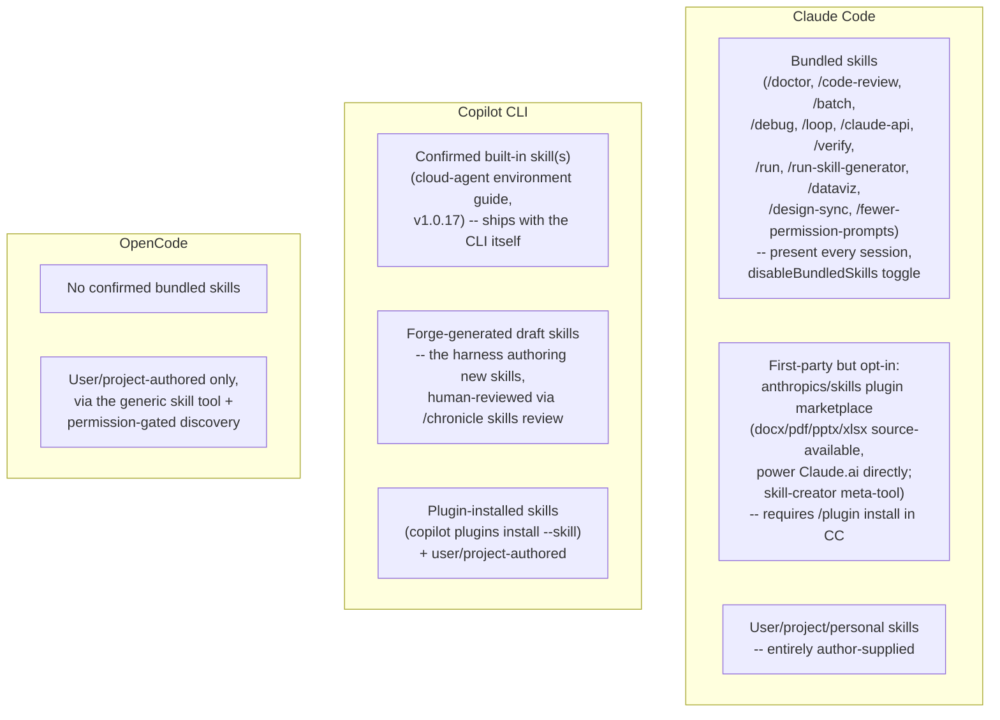

# Built-in skills -- Claude Code, GitHub Copilot CLI, OpenCode

What ships as a *skill* out of the box in each harness -- as distinct
from a skill a user or repo author writes themselves -- and how each
harness's own product surface (plugin marketplace, cloud agent,
autonomous draft-generation) supplies first-party skill content beyond
what any single user typed. This page is about the *content that
ships*, not the loading mechanics: for the SKILL.md frontmatter
reference, the context-budget economics of when a skill's body loads,
and the invoke-only tier's place in each harness's instruction-loading
hierarchy, see [Instruction context budget](instruction-context-budget.md)
§1.4/§2.3, which already covers that ground in full and is not
duplicated here. For the tool surface a skill can invoke, see
[Built-in tools](built-in-tools.md); for a skill that forks into its
own subagent context (`context: fork`, Copilot's `configure-copilot`),
see [Handoff mechanism](handoff-mechanism.md).

Every claim below is tagged VERIFIED (fetched this session from the
named source) or BEST CURRENT UNDERSTANDING, UNCONFIRMED. Claude Code,
Copilot CLI, and OpenCode are three separate products from three
separate organizations -- nothing confirmed for one is assumed for
another. Sources and fetch dates at the bottom.

---

## 1. Claude Code

Primary sources for this section: `code.claude.com/docs/en/skills` and
`code.claude.com/docs/en/commands`, both fetched 2026-07-30 (VERIFIED),
cross-checked against `anthropics/claude-code`'s own `CHANGELOG.md`
(fetched via `gh api` on 2026-07-31, VERIFIED for its own
behavior-change history) and `anthropics/skills`' own `README.md` and
repository contents (fetched via `gh api` on 2026-07-31, VERIFIED for
that repository's own structure and stated purpose).

Claude Code ships built-in skill content at two genuinely different
levels, and the docs and changelog together make the distinction
sharp: skills bundled into every session by the product itself, and
skills Anthropic maintains and publishes but which a user must opt
into installing.

### 1.1 Bundled skills -- present in every session by default

The skills doc states plainly: "Claude Code includes a set of bundled
skills, such as `/doctor`, `/code-review`, `/batch`, `/debug`,
`/loop`, and `/claude-api`." These are documented as **prompt-based**:
"they give Claude detailed instructions and let it orchestrate the
work using its tools," in contrast to "most built-in commands" which
"instead execute fixed logic directly" -- i.e. a bundled skill is not
special-cased engine code, it is a first-party `SKILL.md` (or
equivalent) that ships inside the Claude Code binary/package itself
and is listed in the skill inventory like any user skill, just at a
level above personal/project/plugin.

The commands reference (marking each row's Purpose column) and the
skills doc together name this set, current as of the versions cited
inline below:

| Bundled skill | What it does |
|---|---|
| `/doctor` | Setup checkup: installation health, unused skills/MCP servers/plugins, slow hooks, newer-version checks, `CLAUDE.md` deduplication, trims checked-in files of content Claude could derive from the codebase. Stays typable even when `disableBundledSkills` is on (v2.1.205+); before that version it was a built-in command, not a bundled skill. |
| `/code-review [effort] [--fix] [--comment] [target]` | Reviews the current diff for correctness bugs and cleanup opportunities; `ultra` triggers a deep cloud review. Runs only when invoked as of v2.1.215 -- before that, Claude could also trigger it autonomously. Renamed from `/simplify` (changelog-traced; `/simplify` later reappeared as a narrower cleanup-only command that itself invokes `/code-review --fix`). |
| `/batch <instruction>` | Orchestrates large-scale changes across a codebase in parallel: decomposes work into independent units, spawns one background subagent per unit in isolated git worktrees, opens pull requests. |
| `/debug [description]` | Enables debug logging for the current session and reads the session debug log to troubleshoot an issue. |
| `/loop [interval] [prompt]` | Runs a prompt repeatedly while the session stays open; self-paces between iterations if no interval is given. |
| `/claude-api [migrate\|managed-agents-onboard]` | Loads Claude API reference material (tool use, streaming, batches, structured outputs) for the project's language; `migrate` upgrades existing Claude API code to a newer model. |
| `/verify` | Builds and runs the app to confirm a code change works, without falling back to tests/type checks. Can record its own recipe to `.claude/skills/verify/SKILL.md`, at which point the recorded project skill *replaces* the bundled one at the repo root. Runs only when invoked as of v2.1.215. |
| `/run` | Launches and drives the app to demonstrate a change working; infers the launch from project type, README, `package.json`, or `Makefile`. |
| `/run-skill-generator` | Records a working launch/build recipe from a clean environment as a per-project skill at `.claude/skills/run-<name>/`, so `/run`/`/verify`/other agents in the repo stop rediscovering it each time. |
| `/dataviz` | Design guidance for charts/graphs/dashboards -- chart-form selection, colour-by-role assignment, colourblind-safe palette validation, accessibility rules. |
| `/design-sync` | Converts the repo's React design system and uploads it to Claude Design so generated designs use the project's real components. |
| `/fewer-permission-prompts` | Scans transcripts for common read-only Bash/MCP calls and writes a prioritized allowlist to project `.claude/settings.json`. |
| `/deep-research <question>` | A bundled **Workflow** rather than a plain skill -- fans out web searches, fetches and cross-checks sources, synthesizes a cited report. Starts only when invoked manually (changelog-confirmed change; Claude previously launched it on its own). |

`/run`, `/verify`, and `/run-skill-generator` all require Claude Code
v2.1.145 or later per the docs' own version note; `/verify`'s
recipe-recording behavior requires v2.1.200 or later.

A small number of built-in *commands* are separately exposed through
the `Skill` tool for programmatic/permission purposes -- `/init`,
`/review`, and `/security-review` -- while others such as `/compact`
are not, per the skills doc's "Restrict Claude's skill access"
section. This is a narrower, permission-surface fact distinct from the
"bundled skill" list above; treat the two lists (bundled skills vs.
commands additionally reachable via the `Skill` tool) as overlapping
but not identical.

### 1.2 The bundled-skill visibility controls

```mermaid
flowchart TD
    S["A skill name is invoked or considered<br/>for auto-invocation"] --> Q1{disableBundledSkills<br/>setting/env var on?}
    Q1 -->|Yes| Q2{Is it /doctor?}
    Q2 -->|Yes| STILL["/doctor stays typable<br/>(v2.1.205+)"]
    Q2 -->|No| HIDDEN["Hidden from model and /<br/>menu -- bundled skills,<br/>workflows, built-in slash<br/>commands all hidden"]
    Q1 -->|No| Q3{skillOverrides entry<br/>for this skill name?}
    Q3 -->|"off"| OFF["Hidden from model + menu"]
    Q3 -->|"name-only"| NAMEONLY["Name listed, description stripped"]
    Q3 -->|"user-invocable-only"| USERONLY["Hidden from model,<br/>menu-invocable only"]
    Q3 -->|absent, i.e. "on"| NORMAL["Description in listing,<br/>full body loads on invoke"]
```

`disableBundledSkills` (a settings key, with `CLAUDE_CODE_DISABLE_BUNDLED_SKILLS`
as its environment-variable equivalent, changelog-confirmed addition)
hides every bundled skill, workflow, and built-in slash command from
the model at once -- `/doctor` is the sole documented exception, kept
typable so the escape hatch to diagnose a broken setup never
disappears. Independently, `skillOverrides` (settings-level, written
automatically by the `/skills` menu into `.claude/settings.local.json`)
controls visibility per skill name at four granularities (`on`,
`name-only`, `user-invocable-only`, `off`) and applies to any skill,
bundled or not -- see [Instruction context budget](instruction-context-budget.md)
for the token-budget mechanics this feeds into (the 1,536-character
description cap, the 1%-of-context-window listing budget, etc.),
which are not repeated here.

### 1.3 First-party skills distributed as an opt-in plugin, not bundled

Distinct from the bundled set above, Anthropic maintains a public
repository, `github.com/anthropics/skills` (165,419 stargazers,
19,668 forks as of the `gh api` fetch this session -- VERIFIED via
direct repository-metadata fetch, not a WebFetch-summarized guess),
containing example and first-party skills grouped into Creative &
Design, Development & Technical, Enterprise & Communication, and a
Document Skills set. The repository's own README states its document
skills are not merely illustrative: "We've also included the document
creation & editing skills that power Claude's document capabilities
under the hood in the `skills/docx`, `skills/pdf`, `skills/pptx`, and
`skills/xlsx` subfolders. These are source-available, not open source,
but we wanted to share these with developers as a reference." The
repository's contents (fetched directly) list these skill folders at
the top level: `algorithmic-art`, `brand-guidelines`, `canvas-design`,
`claude-api`, `doc-coauthoring`, `docx`, `frontend-design`,
`internal-comms`, `mcp-builder`, `pdf`, `pptx`, `skill-creator`,
`slack-gif-creator`, `theme-factory`, `web-artifacts-builder`,
`webapp-testing`, `xlsx`.

The load-bearing distinction for this page: on Claude.ai, the README
states these example skills "are all already available to paid plans"
-- i.e. shipped/enabled by default on that surface. On Claude Code
specifically, they are **not** loaded by default; the README's own
instructions require registering the repository as a plugin
marketplace (`/plugin marketplace add anthropics/skills`) and then
installing a specific plugin bundle (`/plugin install
document-skills@anthropic-agent-skills` or `example-skills@...`)
before Claude Code will see them at all. So "built-in" here means
first-party and officially maintained, not automatically present in
every Claude Code session the way `/doctor` or `/code-review` are --
a meaningfully different sense of "built-in" from §1.1's bundled set,
and the two should not be conflated when answering "does Claude Code
ship a PDF skill." The README's own disclaimer reinforces the same
point from the other direction: "These skills are provided for
demonstration and educational purposes only. While some of these
capabilities may be available in Claude, the implementations and
behaviors you receive from Claude may differ from what is shown in
these skills."

The `skill-creator` folder in that same repository is also
independently referenced from Claude Code's own docs as an installable
plugin (`/plugin install skill-creator@claude-plugins-official`) that
automates writing and grading eval suites for a skill under
construction -- test cases in `evals/evals.json`, per-test-case
isolated subagent runs, `grading.json`/`benchmark.json` output, and a
blind A/B comparison mode between two skill versions. This is a
meta-tool for *authoring* skills, not a skill that does end-user work
itself, and is worth distinguishing from both the bundled set and the
document-skills set above.

All skills across every level in Claude Code -- bundled, plugin-
installed, personal, project -- follow the same underlying `SKILL.md`
format, which the docs describe as an implementation of the "Agent
Skills open standard" (`agentskills.io`), a cross-tool specification
Claude Code "extends... with additional features like invocation
control, subagent execution, and dynamic context injection." The full
frontmatter field reference (`disable-model-invocation`,
`user-invocable`, `allowed-tools`, `paths`, `context: fork`, string
substitutions, etc.) and the loading-economics discussion belong to
[Instruction context budget](instruction-context-budget.md) and are
not restated here.

---

## 2. GitHub Copilot CLI

Sources for this section: `docs.github.com/en/copilot/concepts/agents/about-agent-skills`
and `docs.github.com/en/copilot/how-tos/copilot-cli/customize-copilot/add-skills`,
both fetched 2026-07-31; and `github/copilot-cli`'s own `changelog.md`,
fetched via `gh api` on 2026-07-31. VERIFIED unless flagged otherwise.

### 2.1 A confirmed, changelog-traced built-in skill

Unlike the two concept/how-to docs pages, which describe skills purely
as a user/repo-authored mechanism ("folders of instructions, scripts,
and resources that Copilot can load when relevant... to improve its
performance in specialized tasks" -- with no built-in example named),
the CLI's own changelog directly confirms a first-party bundled skill:
version 1.0.17 (2026-04-03) states "Built-in skills are now included
with the CLI, starting with a guide for customizing Copilot cloud
agent's environment." This is the clearest single confirmation in any
source fetched this session that Copilot CLI ships at least one skill
of its own, independent of anything a user or repository author
writes -- though only that one skill (a cloud-agent-environment
customization guide) is named; whether more built-in skills have
shipped silently since is BEST CURRENT UNDERSTANDING, UNCONFIRMED, not
found in any changelog entry fetched this session.

### 2.2 `configure-copilot` -- a subagent, not a skill, doing adjacent work

Version 1.0.3 (2026-03-09) added a "configure-copilot sub-agent for
managing MCP servers, custom agents, and skills via the task tool."
This is a **subagent** reachable through the task tool, not a skill
in the `SKILL.md` sense -- it is already covered from the subagent-
dispatch angle in [Built-in tools](built-in-tools.md) §2.1 and
[Handoff mechanism](handoff-mechanism.md); it is named again here only
to draw the boundary clearly, since "a built-in thing that manages
skills" and "a built-in skill" are easy to conflate and the changelog
treats them as two different mechanisms.

### 2.3 Forge-generated draft skills -- the harness authoring its own skills

Two separate changelog entries describe Copilot CLI's own tooling
*creating* skill content autonomously rather than shipping it
pre-written: version 1.0.66 (2026-06-30) added "`/chronicle skills
review` for reviewing proposed draft skill changes, with options to
accept, reject, or defer each draft," and version 1.0.70 (2026-07-09)
added "Create draft skills when Forge finds a clear workflow pattern."
Read together, this describes a pipeline distinct from anything found
in either Claude Code's or OpenCode's sourced material this session:
a component named "Forge" (not otherwise documented in any source
fetched this session -- treat its exact scope as BEST CURRENT
UNDERSTANDING, UNCONFIRMED beyond these two changelog lines) detects a
recurring workflow pattern in usage and proposes a draft `SKILL.md` as
a candidate, which a human then accepts, rejects, or defers through
`/chronicle skills review` before it becomes a real, invocable skill.
This is functionally the closest thing to a harness "writing its own
skills" found across all three products in this book; whether Claude
Code or OpenCode have an analogous auto-draft mechanism was not found
in any source fetched for this page and should be treated as an open
question, not ruled out.

### 2.4 SKILL.md format and discovery, Copilot CLI's documented version

Per the add-skills how-to page, a Copilot CLI skill's frontmatter
supports `name` (required, lowercase, hyphens for spaces), `description`
(required), `license` (optional), and `allowed-tools` (optional,
pre-approves tools such as `shell` to avoid repeated confirmation
prompts for that skill). The changelog separately confirms two
frontmatter fields not mentioned on that how-to page at all -- an
`argument-hint` field (added v1.0.64, 2026-06-23) and full honoring of
a `disable-model-invocation` flag (v1.0.74, 2026-07-23) -- a
documentation/changelog gap worth flagging explicitly: the docs page
undersells the actual supported frontmatter surface as of the versions
checked this session.

Discovery locations mirror the ones already documented in
[Instruction context budget](instruction-context-budget.md) §2.3:
project skills in `.github/skills`, `.claude/skills`, or
`.agents/skills`; personal skills in `~/.copilot/skills` or
`~/.agents/skills`; invocation by typing `/skill-name`. Skills are also
independently installable as artifacts through the CLI's own plugin
system -- `copilot plugins install --skill <file, URL, or directory>`,
with `--scope project` to install into the repository -- and the
`copilot skill` subcommand family (`list`, `add`, `remove`) manages
them directly, changelog-confirmed additions layered on top of the
file-discovery mechanism above.

---

## 3. OpenCode

Sources for this section: `opencode.ai/docs/skills`, fetched
2026-07-31. VERIFIED unless flagged otherwise. A repository code search
for `SKILL.md` across `anomalyco/opencode` (via `gh api search/code`,
run this session) returned no results, corroborating the docs' own
framing rather than standing alone as independent proof of absence --
GitHub code search coverage of a `dev`-branch repository is not
guaranteed exhaustive.

### 3.1 No bundled skills -- a purely generic extension point

OpenCode's own skills documentation describes the `skill` tool and the
`SKILL.md` discovery/permission mechanism entirely in terms of content
a user or project author supplies; no example of a skill shipped
inside the OpenCode product itself is named anywhere on the page. Read
alongside the empty code-search result above, treat "OpenCode ships no
built-in skills of its own" as BEST CURRENT UNDERSTANDING -- strongly
supported by the documentation's own framing and consistent with an
empty search, but not a claim any source fetched this session states
in as many words ("we do not bundle any skills" is not a sentence that
appears on the page).

### 3.2 SKILL.md format and mechanism, as documented

A skill's frontmatter requires `name` (1-64 characters, lowercase
alphanumeric with hyphens, matching the regex `^[a-z0-9]+(-[a-z0-9]+)*$`)
and `description` (1-1024 characters); `license`, `compatibility`, and
a string-to-string `metadata` map are optional, and unknown frontmatter
fields are documented as ignored rather than rejected. Discovery walks
two location tiers: project-local, searched by walking up from the
current working directory to the git worktree root (`.opencode/skills/<name>/SKILL.md`,
`.claude/skills/<name>/SKILL.md`, `.agents/skills/<name>/SKILL.md`),
and global (`~/.config/opencode/skills/*/SKILL.md`,
`~/.claude/skills/*/SKILL.md`, `~/.agents/skills/*/SKILL.md`) -- the
same cross-harness directory-sharing pattern already noted for
Copilot CLI in [Instruction context budget](instruction-context-budget.md)
§2.3, extended here to a third harness reading from the same
`.claude/skills` path.

An agent invokes a skill by calling the `skill` tool with a name
argument, e.g. `skill({ name: "git-release" })`, which loads that
skill's content into the conversation. The `permission` block governs
the `skill` key the same way it governs `bash`/`edit`/`task` elsewhere
in OpenCode's model (see [Built-in tools](built-in-tools.md) §3.2):
`allow` loads immediately, `ask` prompts for approval before loading,
and `deny` hides the skill from the agent entirely and rejects access
-- with glob-style wildcard patterns (`internal-*`) supported the same
way as other permission keys, and the whole `skill` key able to be
disabled per agent via `tools: { skill: false }` in an agent's own
configuration.

---

## 4. Synthesis -- three different meanings of "built-in"



**"Built-in" splits into at least three distinct claims, and they
should not be collapsed into one.** (1) Shipped and present in every
session automatically -- confirmed for Claude Code's bundled-skill set
and for Copilot CLI's changelog-named cloud-agent guide. (2)
First-party and officially maintained, but requiring explicit opt-in
installation -- Claude Code's `anthropics/skills` plugin-marketplace
content, notably the docx/pdf/pptx/xlsx skills that are simultaneously
already-on by default on Claude.ai and opt-in on Claude Code, a real
per-surface asymmetry within one vendor's own product line, not a
documentation inconsistency. (3) Generated by the harness's own
tooling from observed usage, then held for human review before
becoming real -- Copilot CLI's Forge/`/chronicle skills review`
pipeline, the only confirmed instance of this pattern across all three
harnesses in this book.

**OpenCode is the one harness with no confirmed built-in skill content
of its own at all.** Its skill mechanism reads as a deliberately
generic extension point -- the same `.claude/skills` directories
Claude Code and Copilot CLI also read, layered under its own
`.opencode/skills` and `.agents/skills` paths -- with authoring left
entirely to the user or project, and no analogue found for either
Claude Code's bundled-skill set or Copilot CLI's Forge-driven
auto-drafting.

**The directory-sharing convergence is real and already load-bearing
elsewhere in this book.** All three harnesses' skill-discovery logic
reads `.claude/skills` as one of their own search paths (Copilot CLI
and OpenCode both do so explicitly, per their own docs), meaning a
skill authored for Claude Code is very likely to be picked up
unmodified by the other two without any porting step -- a rare case of
de facto cross-harness portability in a book that otherwise stresses
how little transfers between these three products. The `SKILL.md`
frontmatter itself is not identically shaped across all three,
however: Claude Code's field set is by far the largest (`context: fork`,
`agent`, `background`, `hooks`, `paths`, `shell`, string substitutions,
and more, per [Instruction context budget](instruction-context-budget.md)),
Copilot CLI's confirmed set is smaller (`name`, `description`, `license`,
`allowed-tools`, plus changelog-only `argument-hint` and
`disable-model-invocation`), and OpenCode's is smaller still (`name`,
`description`, `license`, `compatibility`, `metadata`) -- so a skill
written against Claude Code's fuller frontmatter surface may load on
the other two harnesses with unrecognized fields silently ignored
(OpenCode's docs state this explicitly), rather than with equivalent
behavior actually preserved.

---

## Sources

| Source | Fetched | Authoritative for |
|---|---|---|
| `code.claude.com/docs/en/skills` | 2026-07-30 | Claude Code's `SKILL.md` format, Agent Skills open-standard framing, bundled-skill definition, `skillOverrides`, `skill-creator` plugin, dynamic context injection |
| `code.claude.com/docs/en/commands` | 2026-07-30 (this fetch 2026-07-31) | The bundled-skill vs. built-in-command distinction in the commands reference table, per-command purpose descriptions |
| `anthropics/claude-code` `CHANGELOG.md` (via `gh api`) | 2026-07-31 | Claude Code's own bundled-skill behavior-change history: `disableBundledSkills`/`CLAUDE_CODE_DISABLE_BUNDLED_SKILLS`, `/code-review`'s rename from `/simplify` and later background-subagent change, `skillOverrides` shipping, `/simplify` and `/batch`'s original addition as bundled slash commands |
| `anthropics/skills` (`README.md` + repository contents, via `gh api`) | 2026-07-31 | That repository's own stated purpose, structure, star/fork counts, the docx/pdf/pptx/xlsx source-available document skills powering Claude.ai, the plugin-marketplace installation path for Claude Code specifically |
| `docs.github.com/en/copilot/concepts/agents/about-agent-skills` | 2026-07-31 | Copilot's own conceptual definition of an Agent Skill, supported surfaces (cloud agent, code review, CLI, app, VS Code/JetBrains agent mode) |
| `docs.github.com/en/copilot/how-tos/copilot-cli/customize-copilot/add-skills` | 2026-07-31 | Copilot CLI's documented `SKILL.md` frontmatter (`name`, `description`, `license`, `allowed-tools`), discovery locations, `/skill-name` invocation |
| `github/copilot-cli` `changelog.md` (via `gh api`) | 2026-07-31 | Copilot CLI's own behavior-change history: the v1.0.17 built-in skill, `configure-copilot` sub-agent (v1.0.3), Forge draft-skill generation and `/chronicle skills review` (v1.0.66/v1.0.70), `argument-hint` (v1.0.64) and `disable-model-invocation` honoring (v1.0.74) |
| `opencode.ai/docs/skills` | 2026-07-31 | OpenCode's `SKILL.md` frontmatter, discovery paths, `skill` tool invocation, `permission` model for the `skill` key |
| `gh api search/code` against `anomalyco/opencode` | 2026-07-31 | Corroborating (not proving) the absence of any bundled `SKILL.md` in that repository's indexed code |

Not consulted this session, and therefore not cited above: direct
inspection of `anomalyco/opencode`'s `dev`-branch source for the
`skill` tool's implementation (the docs page sufficed for documented
behavior); any Claude.ai-specific (as opposed to Claude Code-specific)
skills-settings documentation beyond the one README line quoted in
§1.3; further changelog entries on Copilot CLI's Forge component
beyond the two cited, since no dedicated Forge documentation page was
found or fetched this session.
