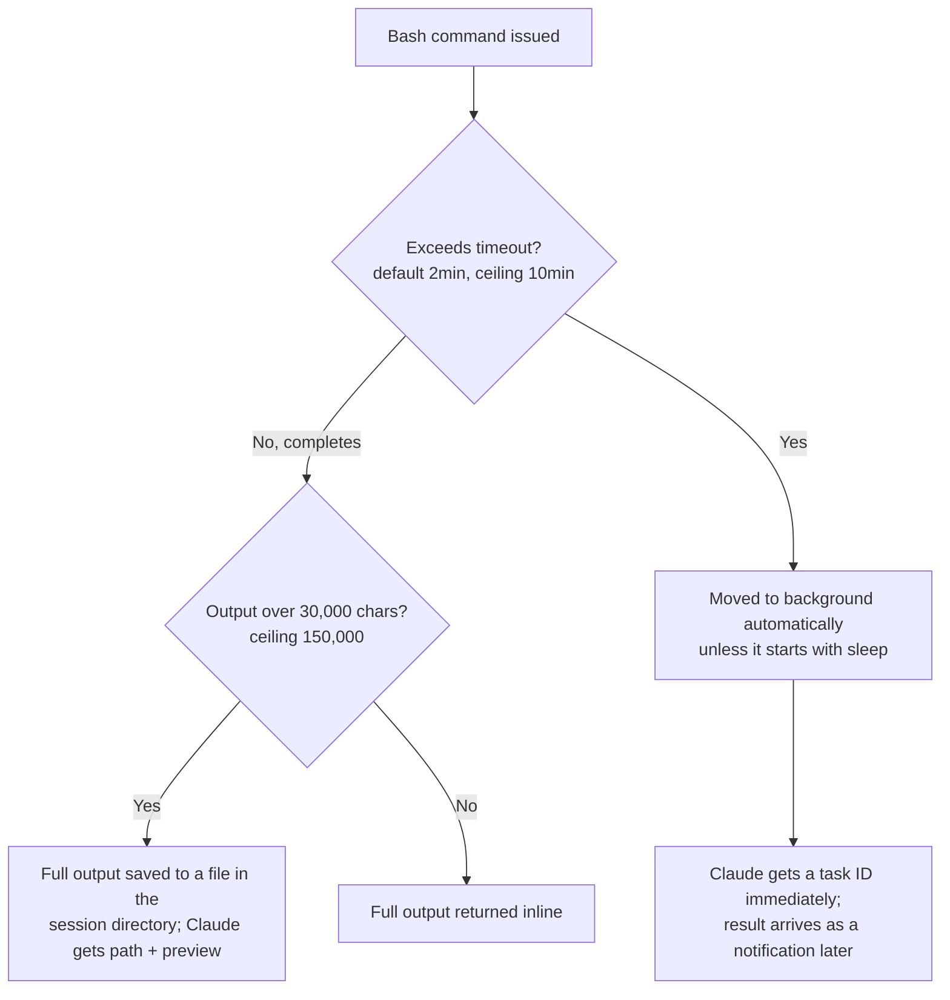
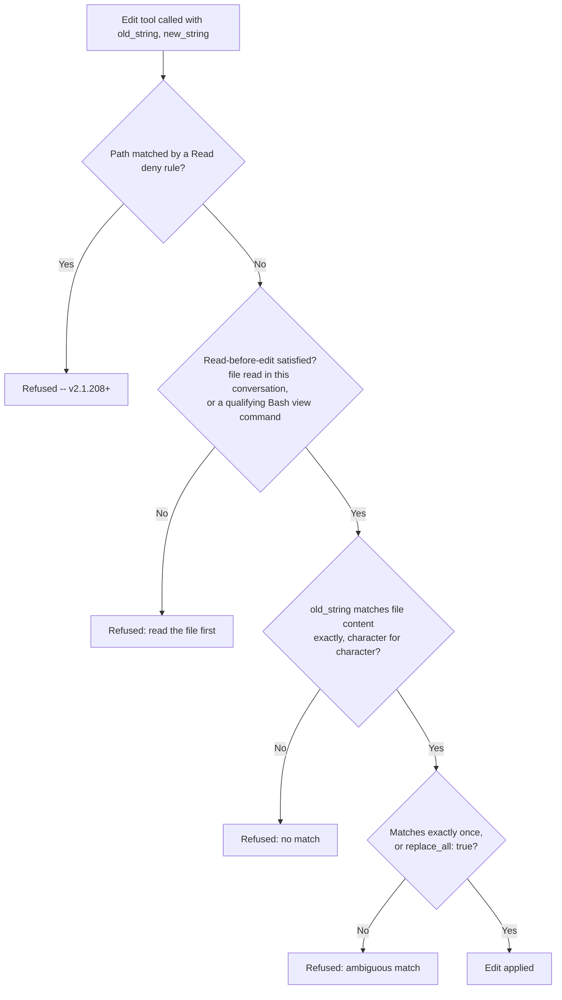
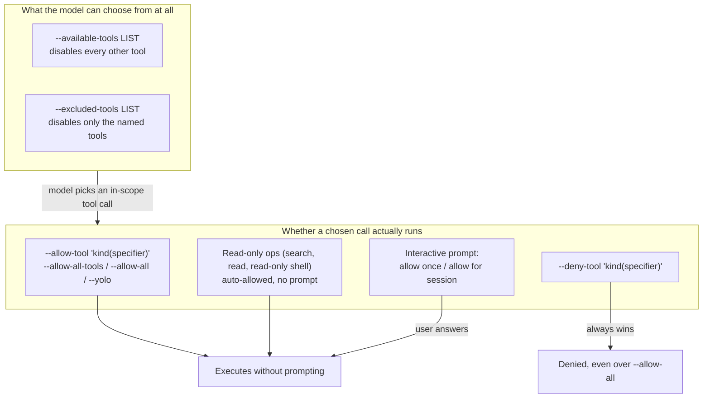
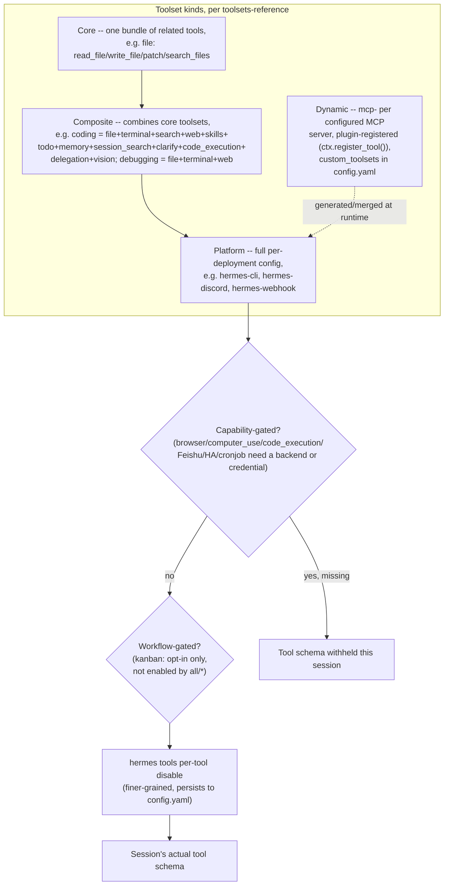

# Built-in tools -- Claude Code, GitHub Copilot CLI, OpenCode

What tools ship with each harness out of the box (no MCP server, no
plugin needed), what each one actually does mechanically, and how each
harness's permission system names and gates them. This page is about
the *tool surface itself* -- for how a subagent gets a subset of that
surface and hands off context, see [Handoff mechanism](handoff-mechanism.md);
for how MCP-provided tools are discovered, loaded, and invoked
alongside the built-ins, see [MCP integration](mcp-integration.md).

Every claim below is tagged VERIFIED (fetched this session from the
named source) or BEST CURRENT UNDERSTANDING, UNCONFIRMED. Claude Code,
Copilot CLI, OpenCode, pi, and Hermes Agent are five separate products
from five separate organizations -- nothing confirmed for one is
assumed for another. Sources and fetch dates at the bottom.

---

## 1. Claude Code

Primary source for this section: `code.claude.com/docs/en/tools-reference`,
fetched 2026-07-30. VERIFIED, and this is the load-bearing source for
the whole section unless another is named inline.

### 1.1 The full built-in tool table

The docs state plainly: "The tool names are the exact strings you use
in permission rules, subagent tool lists, and hook matchers" -- so the
names below are not paraphrase, they are the literal identifiers the
permission system, `--allowedTools`/`--disallowedTools`, a subagent's
`tools`/`disallowedTools` frontmatter, a skill's `allowed-tools`
frontmatter, and a hook's `matcher` field all key off of.

| Tool | What it does | Prompts for permission by default |
|---|---|---|
| `Agent` | Spawns a subagent with its own context window | No |
| `Artifact` | Publishes an HTML/Markdown file as a claude.ai artifact (Pro/Max/Team/Enterprise) | Yes |
| `AskUserQuestion` | Multiple-choice questions to gather requirements | No |
| `Bash` | Executes shell commands | Yes (but a built-in read-only command set skips the prompt) |
| `CronCreate`/`CronDelete`/`CronList` | Schedules, cancels, lists session-scoped recurring/one-shot prompts | No |
| `Edit` | Targeted string-replacement edits to a file | Yes |
| `EndConversation` | Ends the session (abuse-of-last-resort or explicit demo request) | No (and cannot be denied -- see below) |
| `EnterPlanMode`/`ExitPlanMode` | Switches into/out of plan mode | `ExitPlanMode`: Yes |
| `EnterWorktree`/`ExitWorktree` | Creates/switches into, or exits, an isolated git worktree | `EnterWorktree`: Yes for paths outside `.claude/worktrees/` |
| `Glob` | Finds files by name pattern | No |
| `Grep` | Searches file contents (ripgrep-backed) | No |
| `ListMcpResourcesTool`/`ReadMcpResourceTool` | Lists/reads MCP-exposed resources | No |
| `LSP` | Code intelligence via a language server (definitions, references, diagnostics) | No |
| `Monitor` | Runs a background command or WebSocket feed and reports events as they arrive | Yes |
| `NotebookEdit` | Edits a Jupyter notebook cell by `cell_id` | Yes |
| `PowerShell` | Native PowerShell execution (Windows-primary, opt-in elsewhere) | Yes |
| `PushNotification` | Desktop/phone push when a long task finishes | No |
| `Read` | Reads file contents | No |
| `RemoteTrigger` | Manages Routines on claude.ai (`/schedule`) | No |
| `ReportFindings` | Structured code-review findings list | No |
| `ScheduleWakeup` | Reschedules the next iteration of a self-paced `/loop` | No |
| `SendMessage` | Messages an agent-team teammate, or resumes a subagent by ID/name | No |
| `SendUserFile` | Sends a generated file to the user's device (Remote Control / cloud) | No |
| `ShareOnboardingGuide` | Uploads `ONBOARDING.md`, returns a share link | Yes |
| `Skill` | Executes a skill in the main conversation | Yes |
| `TaskCreate`/`TaskGet`/`TaskList`/`TaskUpdate`/`TaskOutput`/`TaskStop` | Session task-list management and background-task control | No |
| `TodoWrite` | Legacy session checklist tool; disabled by default since v2.1.142 in favor of the `Task*` family (`CLAUDE_CODE_ENABLE_TASKS=0` re-enables it) | No |
| `ToolSearch`/`WaitForMcpServers` | Loads deferred MCP tool schemas / waits on a still-connecting MCP server | No |
| `WebFetch` | Fetches a URL, converts to Markdown, runs an extraction prompt through a small model | Yes |
| `WebSearch` | Web search via Anthropic's server-side backend | Yes |
| `Workflow` | Runs a dynamic workflow script orchestrating many background subagents | Yes |
| `Write` | Creates or fully overwrites a file | Yes |

Note the `TodoWrite` -> `TaskCreate`/`TaskGet`/`TaskList`/`TaskUpdate`
migration is itself a documented behavior change (v2.1.142), not a
naming curiosity -- a subagent or hook written against `TodoWrite`
before that version will silently interact with a disabled tool unless
`CLAUDE_CODE_ENABLE_TASKS=0` is set. A second, later, and separate
version boundary applies specifically on top of that migration: per
`tools-reference`'s "Task tool availability" section (re-verified
2026-08-17), as of v2.1.233 the entire family --  `TodoWrite` and all
four `Task*` checklist tools -- is withheld by default on Opus 4.8,
Sonnet 5, Fable 5, Mythos 5, and later versions of those model families
specifically (those models "keep track of multi-step work without a
written checklist," per the docs), re-enabled via
`CLAUDE_CODE_ENABLE_TODO_TOOLS=1`, an `--allowedTools`/`allowedTools`
entry, or a `--tools`/`tools` list; background sessions and Claude Code
on the web get the tools regardless of model. Do not conflate the two
dates: v2.1.142 changed which tool is the *session-wide default*;
v2.1.233 added a *model-conditional* withholding on top of whichever
default applies. `TaskOutput` and `TaskStop` are a third, unrelated use
of the "Task" name -- they control background Bash commands and
background subagents/teammates (§1.3 below), not the checklist; and
`CronCreate`/`CronDelete`/`CronList`'s "scheduled tasks" are a fourth,
also-unrelated concept. See
[Session & transcript persistence](session-persistence.md) §1.2 for
which of `TodoWrite`/`Task*` actually persists to disk (`TodoWrite` does
not, current versions only hold it in the message stream; the `Task*`
family writes per-session state to `~/.claude/tasks/<session-id>/`,
swept under the same `cleanupPeriodDays` retention as the rest of
`~/.claude`) and for a live-reported UI bug where a resumed session's
task-list panel doesn't visually reappear until the next write call.

### 1.2 Permission rule syntax

All five configuration surfaces (`permissions.allow`/`deny` in
settings, `/permissions`, `--allowedTools`/`--disallowedTools`, the
Agent SDK's `allowedTools`/`disallowedTools`, a subagent's `tools`/
`disallowedTools` frontmatter, a skill's `allowed-tools` frontmatter,
and a hook's `if` condition) accept the same `ToolName(specifier)`
rule format, and several tools share a specifier grammar:

| Rule format | Applies to | Grammar |
|---|---|---|
| `Bash(npm run *)` | Bash, Monitor | command pattern matching |
| `PowerShell(Get-ChildItem *)` | PowerShell | command pattern matching |
| `Read(~/secrets/**)` | Read, Grep, Glob, LSP | path pattern matching |
| `Edit(/src/**)` | Edit, Write, NotebookEdit | path pattern matching |
| `Skill(deploy *)` | Skill | skill-name matching |
| `Agent(Explore)` | Agent | subagent-type matching |
| `WebFetch(domain:example.com)` | WebFetch | domain matching |
| `WebSearch` | WebSearch | no specifier -- allow/deny the whole tool |

Tools not in that table (`ExitPlanMode`, `ShareOnboardingGuide`, etc.)
accept only the bare tool name, no specifier. Two cross-tool
interactions worth internalizing: an `Edit(...)` allow rule also
grants read access to the same path (no matching `Read(...)` rule
needed), and, as of v2.1.208, a `Read(...)` deny rule also blocks
`Edit` on that path (including creating a new file there), since
editing requires reading the result back.

`EndConversation` is a deliberate, structural exception to this whole
system: it never prompts, `PreToolUse` hooks never fire for it,
`deny`/`ask` rules naming it have no effect, and neither
`--disallowedTools` nor a `--tools` allowlist can remove it -- except
that a deny rule matching *everything* (`"*"`) also removes it, unless
an allow rule names it explicitly, so Claude Code doesn't strand a
session with it as the only remaining tool. VERIFIED, same source.

### 1.3 Bash: process model, limits, backgrounding



Each command runs in its own process. Working-directory `cd`s carry
over between commands in the main session (never in a subagent
session) as long as the target stays inside the project directory or
an added directory; landing outside resets to the project directory
and appends a `Shell cwd was reset to <dir>` note. Environment
variables set with `export` do **not** persist between commands, but
shell-startup aliases/functions (`~/.zshrc`, `~/.bashrc`, `~/.profile`)
are captured once at session start and applied to every command
thereafter. `CLAUDE_BASH_MAINTAIN_PROJECT_WORKING_DIR=1` disables the
`cd` carry-over entirely.

Timeout override: `BASH_DEFAULT_TIMEOUT_MS`/`BASH_MAX_TIMEOUT_MS`.
Output-length override: `BASH_MAX_OUTPUT_LENGTH` (still capped at
150,000). A command that hits its timeout without finishing is moved
to the background rather than killed, so long builds keep progressing
instead of being cut off -- `run_in_background: true` requests this
proactively for known long-running processes (dev servers, watchers).
`CLAUDE_CODE_DISABLE_BACKGROUND_TASKS=1` turns off all of this.

### 1.4 Edit: the three-gate check



Edit does exact string replacement, never regex or fuzzy matching.
Viewing a file via Bash also satisfies read-before-edit, but only for
`cat`, `head`, `tail`, `sed -n 'X,Yp'`, `grep`, `egrep`, or `fgrep` on
a single file with no pipes/redirects -- piped output or any other Bash
command does not count. As of v2.1.208, a file that changed on disk
after Claude last read it can still be edited if `old_string` still
matches the current content exactly and unambiguously and a fresh read
wouldn't need a permission prompt; the result then notes the file
carries other changes so Claude re-reads before a dependent edit. Note
that the deny-rule check applies to file commands Claude Code
recognizes inside Bash (`cat`, `head`, `tail`, `sed`, `grep`) but not to
an arbitrary subprocess (a Python/Node script) that reads or writes a
file indirectly -- OS-level enforcement covering every process requires
enabling the sandbox (`/docs/en/sandboxing`).

`Write` has a related but simpler gate: overwriting an *existing* path
requires having read it at least once this conversation (new files are
exempt), and viewing via the same qualifying Bash commands satisfies
that too. Partial changes always go through `Edit`, not `Write`.

### 1.5 Read, Glob, Grep, WebFetch, WebSearch, LSP, Monitor

**Read** returns line-numbered content; a whole-file read exceeding
the token limit returns a paginated `PARTIAL view` with `offset`/
`limit` to continue. It transparently handles images (resized/
recompressed for the model's image limits; re-encoded as reduced-
quality JPEG above 500KB post-resize, as of v2.1.196), PDFs (whole if
short, paginated in up to 20-page ranges above 10 pages), and Jupyter
notebooks (all cells with outputs). It only reads files, never
directories -- Claude uses `ls` via Bash for that.

**Glob** supports `**` recursive matching, sorts results by
modification time, caps at 100 files, and does **not** respect
`.gitignore` by default (`CLAUDE_CODE_GLOB_NO_IGNORE=false` changes
that) -- a deliberate asymmetry from Grep.

**Grep** is ripgrep-backed (ripgrep regex syntax, not POSIX grep), has
three output modes (`files_with_matches` default, `content`, `count`),
supports `glob`/`type` scoping and `multiline: true`, and **does**
respect `.gitignore` -- Claude passes a gitignored path directly when it
specifically needs to search one.

**WebFetch** is lossy by design: it converts the fetched page to
Markdown and runs an extraction prompt through a small, fast model, so
Claude typically receives that model's answer to the prompt, not the
raw page; a redirect to a different host is reported rather than
followed automatically. Responses cache for 15 minutes. It prompts on
first reach to a new domain (except a built-in preapproved
documentation-domain set) in default/`acceptEdits` modes; an explicit
`WebFetch(domain:...)` rule in `allow`/`deny`/`ask` overrides the
preapproved set either direction.

**WebSearch** returns titles/URLs only (no page fetch -- that's a
follow-up `WebFetch` call), issues up to eight backend searches per
call internally, supports `allowed_domains`/`blocked_domains` (not
combinable in one call), and is capped at 200 calls per session across
the main conversation and every subagent it spawns combined
(`CLAUDE_CODE_MAX_WEB_SEARCHES_PER_SESSION` raises it; `/clear`
resets the counter).

**LSP** is inactive until a code-intelligence plugin for the language
is installed; once active it auto-reports type errors/warnings after
every edit and answers definition/reference/hover/call-hierarchy
queries on request.

**Monitor** runs a background script or opens a WebSocket and feeds
each output line/message back into the conversation as an event,
without pausing it -- useful for tailing logs, polling CI/PR status, or
watching a directory. It shares Bash's permission rules for the
commands it runs, and a WebSocket source has its own approval prompt
with no "don't ask again" option; Claude Code denies WebSocket targets
resolving to private/link-local/cloud-metadata addresses outright.

### 1.6 What subagents and restricted modes don't get

A subagent's resolved tool set is always intersected with "tools
available to subagents" (documented separately at
`/docs/en/sub-agents#available-tools`) regardless of what its own
`tools` frontmatter lists -- a tool unavailable to subagents is never
granted even if named explicitly. `EndConversation` is never available
to a subagent under any configuration. A `--bare` headless session
loads only shell and file tools, so most of the table above (Agent,
WebFetch, WebSearch, Monitor, the Task family, etc.) is absent there by
construction, not by permission denial.

---

## 2. GitHub Copilot CLI

Sources for this section: `docs.github.com/en/copilot/reference/copilot-cli-reference/cli-programmatic-reference`,
`docs.github.com/en/copilot/how-tos/copilot-cli/use-copilot-cli/allowing-tools`,
and `docs.github.com/copilot/concepts/agents/about-copilot-cli`, all
fetched 2026-07-30; and `github/copilot-cli`'s own `changelog.md`,
fetched via `gh api` on 2026-07-30 (authoritative for its own
behavior-change history, not for anything not stated there). VERIFIED
unless flagged otherwise.

### 2.1 Two different vocabularies: permission "kinds" vs. functional tools

Copilot CLI's own documentation describes its tool surface at two
different levels of granularity, and they should not be conflated.

**Permission *kinds*** -- the six categories the `--allow-tool`/
`--deny-tool`/permission-config system actually reasons about, per the
CLI programmatic reference and the allowing-tools page:

| Kind | Controls |
|---|---|
| `shell` | Executing shell commands |
| `write` | Creating or modifying files |
| `read` | Reading files or directories |
| `url` | Fetching content from a URL |
| `memory` | Storing new facts to Copilot's persistent memory |
| `MCP-SERVER` (per server name) | Invoking tools from that specific MCP server |

**Functional tools actually named in the changelog** -- the concrete
implementation surface behind those kinds, confirmed by name across
many changelog entries rather than by a single reference table:

- **shell tool** -- executes commands; changelog records its default
  timeout being lowered, its environment no longer leaking the
  internal `NODE_ENV` variable, and an interactive variant that
  preserves the parent terminal's color settings.
- **view tool** -- the read-side tool; the changelog fixes a prompt
  that "correctly state[s] the 20KB truncation limit instead of 50KB"
  (i.e. the limit itself dropped from 50KB to 20KB at some point) and
  shows partial content for large single-line files (minified JS,
  large JSON) instead of returning nothing.
- **write/edit tool** -- file modification, gated by the `write`
  permission kind.
- **web-fetch tool** -- fetches URL content; the changelog records it
  rejecting `file://` URLs and suggesting the view tool instead.
- **search tools** -- file/content search (Grep/Glob-equivalent); the
  changelog fixes Windows-style glob pattern handling for them.
- **task tool** -- launches subagents, including built-in ones. The
  changelog documents built-in "explore" and "task" subagents (with a
  setting to disable them), a built-in "configure-copilot" subagent
  reachable via the task tool for managing MCP servers/custom
  agents/skills, and that "task tool subagents can now process
  images." Full mechanics of Copilot CLI's subagent dispatch belong to
  [Handoff mechanism](handoff-mechanism.md), not here.
- **memory tools** -- `store_memory` (included only when memory is
  enabled for the user) and `vote_memory` (throttled per response/
  interaction to prevent runaway voting bursts); back the
  `memory` permission kind and Copilot Memory generally (see
  [Memory management](memory-management.md) for the fuller mechanism).
- **Code Review tool** -- reviews changesets, explicitly bounded ("The
  Code Review tool handles large changesets by ignoring build
  artifacts and limiting to 100 files") and configured to use the same
  model as the current session rather than a fixed default.
- **apply_patch toolchain** -- added specifically "for OpenAI Codex
  models," i.e. Copilot CLI swaps in a different file-editing
  toolchain depending on the underlying model family rather than
  exposing one universal edit tool across every model. BEST CURRENT
  UNDERSTANDING, UNCONFIRMED beyond that one changelog line: which
  other model families get which toolchain variant is not stated.
- **GitHub MCP server** -- built in, no configuration required. Its
  default tool list is deliberately curated to conserve context: "we've
  limited the list of tools available to the default GitHub MCP
  server. In our tests, the model will use the GitHub CLI, `gh` (if
  installed) in lieu of missing MCP tools," with
  `--enable-all-github-mcp-tools` to opt back into the full set. A
  later entry notes that when `gh` is already on `PATH`, the server
  additionally "omits redundant gh-replaceable tools by default,
  reducing token usage" -- so the effective tool list is conditional on
  host environment, not fixed. In Azure DevOps-only repositories the
  server is auto-disabled except for exposing just its `web_search`
  tool rather than being fully disabled.

No confirmed Copilot CLI equivalent of Claude Code's `TodoWrite`/
`Task*` checklist family was found in any source fetched this session
-- task orchestration in Copilot CLI's documented model runs through
the task tool's subagent dispatch (`/delegate`, built-in "explore"/
"task" subagents) rather than a standalone visible-checklist tool.
Treat this as BEST CURRENT UNDERSTANDING, UNCONFIRMED-as-absent, not
proven absent -- a search-engine synthesis (not a direct fetch, so not
citable here) suggested a `todo`/`TodoWrite`-named tool may exist in
some SDK surface; that claim was not corroborated by any page or
changelog entry actually fetched this session, so it is omitted above
rather than asserted.

### 2.2 Permission flags and persistence



The distinction matters: `--available-tools`/`--excluded-tools` shape
what the model is even offered as options, while `--allow-tool`/
`--deny-tool` (and the interactive per-call prompt) shape whether a
call the model already chose to make is permitted to execute. A tool
excluded from awareness never reaches the execution-permission layer
at all.

Specifier syntax mirrors Claude Code's `Tool(specifier)` shape but
with different wildcard rules: `shell(git commit)` matches the exact
command, `shell(git:*)` matches the whole `git` family, `write(README.md)`
matches any file ending in that name, `write(.github/copilot-instructions.md)`
matches that exact path, `url(https://*.github.com)` wildcards a
subdomain, and `url(https://docs.github.com/copilot/*)` restricts to a
path prefix. The docs state explicitly that "wildcards are only
supported for `shell` ... and for `url` at the start of the host name
... or at the end of a path" -- i.e. the wildcard grammar is narrower
than Claude Code's, which allows `**` and mid-string `*` more broadly
across Bash and path rules.

Persistence: session-level flags (`--allow-tool`, `--deny-tool`,
`--available-tools`, `--excluded-tools`) apply only to that invocation
and are never written to disk. Approvals granted interactively during
a session persist to `~/.copilot/permissions-config.json` (location-
scoped, keyed to the repo root or working directory); URL-domain
approvals persist separately to `~/.copilot/settings.json` (global
across sessions). In-session, `/allow-all`/`/yolo` grant broadly and
`/reset-allowed-tools` revokes everything granted so far in that
session. Deny rules take precedence over allow rules unconditionally,
"even when `--allow-all` is set" or a prior approval was saved. Read-
only operations (search, file reads, read-only shell commands) are
auto-allowed regardless of any of the above, matching the "read
required" column pattern seen in Claude Code's own table (§1.1) even
though the two systems are independently implemented.

---

## 3. OpenCode

Sources for this section: `opencode.ai/docs/tools` and
`opencode.ai/docs/permissions/`, both fetched 2026-07-30. VERIFIED
unless flagged otherwise. As with every OpenCode citation elsewhere in
this book, treat anything sourced from the `dev` branch of
`github.com/anomalyco/opencode` as possibly ahead of or behind the
current stable release; the two docs pages cited here are current
documented behavior, not source-code inspection, so that caveat does
not directly apply to this section, but is worth restating since
OpenCode is the one harness in this book whose implementation is
itself inspectable.

### 3.1 Built-in tool list

| Tool | What it does |
|---|---|
| `bash` | Executes shell commands in the project directory as working directory |
| `read` | Reads file contents, whole file or a specific line range for large files |
| `write` | Creates new files or overwrites existing ones |
| `edit` | Modifies existing files via exact string replacement (diff-based, not line-number-based) |
| `grep` | Regex content search across the codebase (ripgrep-backed), with file-pattern filtering |
| `glob` | Finds files by pattern (`**/*.js`, `src/**/*.ts`), results sorted by modification time |
| `lsp` (experimental) | Code intelligence -- go-to-definition, find references, hover info, call hierarchy. Requires `OPENCODE_EXPERIMENTAL_LSP_TOOL=true` |
| `apply_patch` | Applies a patch file with embedded path markers and Add/Update/Move/Delete operations |
| `skill` | Loads a `SKILL.md` file and returns its content into the conversation |
| `todowrite` | Manages the session todo list; disabled for subagents by default |
| `webfetch` | Fetches and reads web page content |
| `websearch` | Web search via Exa AI; requires `OPENCODE_ENABLE_EXA=1` |
| `question` | Asks the user a clarifying question mid-execution |
| `task` | Launches a subagent -- covered in full in [Handoff mechanism](handoff-mechanism.md), not duplicated here |

### 3.2 Permission model

By default, every tool is enabled with no permission gate. The
`permission` field in `opencode.json` (or an agent's own markdown
frontmatter) takes one of three values per tool key: `"allow"` (runs
without approval), `"ask"` (prompts), or `"deny"` (blocked outright).
Documented tool keys accepting this include `read`, `edit` (covers
edit, write, and patch operations together -- there is no separate
`write` permission key the way Claude Code and Copilot CLI both have),
`bash`, `glob`, `grep`, `webfetch`, `websearch`, `task`, `skill`,
`external_directory` (operations touching paths outside the project),
and `doom_loop` (repeated identical tool calls -- a guard against a
model stuck retrying the same failing call).

```json
{
  "permission": {
    "*": "ask",
    "bash": "allow",
    "edit": "deny"
  }
}
```

Wildcard patterns use simple glob-like matching (`*` for zero-or-more
characters, `?` for exactly one) and apply to command or path
arguments -- e.g. `"git *"` for a bash-argument pattern or
`"~/projects/personal/**"` for a path pattern -- as well as to MCP tool
names via a prefix pattern like `"mymcp_*"`. Agent-level overrides,
defined either inline in `opencode.json` or in an agent's own markdown
file (e.g. `~/.config/opencode/agents/review.md`), take precedence
over the global `permission` block -- the same "narrower, more specific
scope wins" shape Claude Code uses for its local/project/user setting
scopes, though the two mechanisms are unrelated implementations.

Notably, OpenCode's `edit` folding write/edit/patch into one permission
key, and its explicit `doom_loop` guard against repeated identical
calls, have no stated counterpart in either Claude Code's or Copilot
CLI's documented permission vocabulary -- BEST CURRENT UNDERSTANDING,
UNCONFIRMED that neither of the other two harnesses has an equivalent
single named guard against that failure mode, since absence from the
sources fetched for this page is not proof of absence in the product.

---

## 4. pi

Sources for this section: VERIFIED, fetched 1 September 2026 directly from
`github.com/earendil-works/pi`, `main` branch -- `packages/coding-agent/docs/usage.md`
(the "Tool Options" and "Design Principles" sections, in full), `packages/coding-agent/docs/index.md`,
and, since no `tools.md` doc page exists in this repo, the source tree itself as the
primary inventory: `packages/coding-agent/src/core/tools/index.ts` (the canonical
`ToolName` union and the four tool-selection helper functions built on it), `bash.ts`,
`powershell.ts`, `read.ts`, `write.ts`, `edit.ts`, `grep.ts`, `find.ts`, `ls.ts` (each
tool's own Typebox input schema and system-prompt-contribution snippet), and
`packages/coding-agent/src/utils/tools-manager.ts` (the `fd`/ripgrep binary-fetch
mechanism behind `find`/`grep`). Also `packages/coding-agent/package.json` and
`packages/ai/package.json` directly (exact npm package names, resolving this book's own
inconsistent spelling -- §4.1 below) and
`packages/coding-agent/examples/extensions/subagent/README.md` (confirming subagent
dispatch is an example extension, not a built-in tool). VERIFIED unless flagged
otherwise; this section does not re-derive pi's permission/sandbox model or its skill
mechanism, both already covered in full elsewhere in this book -- see
[Permissions and sandboxing](permissions-and-sandboxing.md) §5 and
[Built-in skills](built-in-skills.md) §4.

### 4.1 Two distinct npm packages behind one name -- resolving this book's own inconsistent spelling

This book has cited pi under two different package names across its other pages --
`@earendil-works/pi-ai` (named in [LLM API contract](llm-api-contract.md) §3.5,
[configuration.md](configuration.md), [context-compression.md](context-compression.md),
and elsewhere) and `@earendil-works/pi-coding-agent`
(named in [Session & transcript persistence](session-persistence.md) and
[Deterministic orchestration](deterministic-orchestration.md)). Fetched directly from the
repo's own manifests this session, both names are correct -- they are two separate,
independently-described, identically-versioned (0.84.4 as of this fetch) packages in the
same monorepo, not a spelling inconsistency to resolve in favor of one over the other:

- **`@earendil-works/pi-ai`** (`packages/ai/package.json`) describes itself as a "Unified
  LLM API with automatic model discovery and provider configuration" -- this is the
  model/provider-abstraction *library* [LLM API contract](llm-api-contract.md) §3.5
  documents, importable independently of the CLI product.
- **`@earendil-works/pi-coding-agent`** (`packages/coding-agent/package.json`) describes
  itself as a "Coding agent CLI with read, bash, edit, write tools and session
  management," and its `bin` entry (`"pi": "dist/bundle/cli.js"`) is what actually
  installs the `pi` command a user runs (`npm install -g --ignore-scripts
  @earendil-works/pi-coding-agent`, per the repo's own `index.md` quickstart). This is the
  package -- and specifically its bundled tool set -- this section covers.

So a claim about pi's LLM-provider abstraction layer is correctly cited as `pi-ai`; a
claim about the terminal agent product itself (its tools, its TUI, its session format) is
correctly cited as `pi-coding-agent`. Neither name is an error for the other anywhere it
already appears in this book; a future editing pass across pi's sections should keep both
names, picking whichever the specific claim is actually about, rather than collapsing
them into one.

### 4.2 The canonical built-in tool set: eight tools, named as a closed union in source

pi's own `usage.md` states the inventory in one line, in the "Tool Options" section of its
CLI reference: "Built-in tools: `read`, `bash`, `powershell` (Windows), `edit`, `write`,
`grep`, `find`, `ls`." This is corroborated exactly, independently, by the package's own
source: `packages/coding-agent/src/core/tools/index.ts` defines `type ToolName = "read" |
"bash" | "powershell" | "edit" | "write" | "grep" | "find" | "ls"` as a closed union with
no ninth member, and an `allToolNames: Set<ToolName>` built from the identical eight
strings. There is no `tools.md` reference page in the docs tree the way `usage.md`,
`security.md`, or `skills.md` exist as standalone pages -- the CLI reference's one-line
enumeration and the source union are the two citable inventories, and they agree.

| Tool | What it does | Mechanical detail (source-verified) |
|---|---|---|
| `read` | Reads file contents | Schema: `path`, optional 1-indexed `offset`, optional `limit`. Truncates via `truncateHead` against `DEFAULT_MAX_BYTES`/`DEFAULT_MAX_LINES` (from `truncate.ts`) when a whole-file read would exceed them. Also handles images (`processImage`, MIME-sniffed via `detectSupportedImageMimeTypeFromFile`). The system-prompt contribution explicitly tells the model "Use read to examine files instead of cat or sed." |
| `bash` | Executes shell commands | Spawns via Node's `child_process.spawn`, using `getShellConfig`/`getShellEnv` for the resolved shell and environment; a caller-supplied timeout is converted to milliseconds and capped at `MAX_TIMEOUT_MS` (2,147,483,647 ms, i.e. the largest 32-bit signed integer -- effectively ~24.8 days, not a deliberately chosen product ceiling like Claude Code's 10-minute one). Output goes through the same `truncate.ts` byte/line ceilings as `read`. |
| `powershell` | Windows-primary native PowerShell execution | Implemented as a thin wrapper over the same `bash.ts` shell-operations machinery (`PowerShellOperations = BashOperations`, `PowerShellToolInput = BashToolInput`), not a separate execution engine; prepends a UTF-8 console-output fix-up snippet before every command and documents that the model "can inspect `PI_*` environment variables for current model and session details." |
| `edit` | Targeted string-replacement edits | Schema takes an array of `{oldText, newText}` edits per call (not a single pair), each `oldText` required to be exact, unique in the file, and non-overlapping with any other edit in the same call -- diff-based (`computeEditsDiff`/`generateUnifiedPatch` from `edit-diff.ts`), never regex or fuzzy matching, same family of guarantee as Claude Code's Edit (§1.4) and OpenCode's edit (§3.1), independently implemented. |
| `write` | Creates or fully overwrites a file | Schema: `path`, `content`. Recursively creates parent directories (`fs.mkdir(dir, {recursive: true})`) before writing; the system-prompt contribution tells the model to "use write only for new files or complete rewrites." |
| `grep` | Searches file contents | Schema: `pattern` (regex by default, `literal: true` for a literal string), optional `path`, `glob` filter, `ignoreCase`, `context` lines, and `limit` (default 100 matches). Its own system-prompt snippet states it "respects `.gitignore`." Not a JS regex engine wrapping Node's own `fs` reads -- it shells out (`child_process.spawn`) to an actual `ripgrep` (`rg`) binary, resolved and auto-installed by `ensureTool` (§4.3 below) rather than implemented in-process. |
| `find` | Finds files by glob pattern | Schema: `pattern` (glob, e.g. `**/*.spec.ts`), optional `path`, `limit` (default 1000). Its system-prompt snippet likewise states it "respects `.gitignore`." Backed the same way as `grep` -- shells out to an actual `fd` (`sharkdp/fd`) binary via `ensureTool`, not an in-process glob implementation. |
| `ls` | Lists directory contents | Schema: `path`, `limit` (default 500). Plain `fs.readdir`/`fs.stat`-based, no external binary dependency the way `grep`/`find` have. |

Note the naming divergence from both other harnesses in this book: pi's file-finding tool
is named `find` (glob-pattern-driven, functionally the same job as Claude Code's `Glob`
and OpenCode's `glob`), not `glob` -- a naming choice worth remembering when reading pi
source, docs, or `--tools`/`--exclude-tools` flag values, since `find` here has nothing to
do with a `.gitignore`-respecting file listing that happens to share its name with the
POSIX `find` command's argument style; the schema is a single glob string, not POSIX
`find`'s predicate-expression grammar.

### 4.3 Session-start tool selection, not a per-call permission gate

[Permissions and sandboxing](permissions-and-sandboxing.md) §5.2 already documents the
mechanism in full (pi ships no permission-rule engine and no per-call approval prompt at
all, by explicit design) -- restated here only to the extent it bears on *which* of the
eight tools above a given session even has in scope: `--tools`/`-t <list>` allowlists
named built-in, extension, or custom tools; `--exclude-tools`/`-xt <list>` disables named
ones while leaving the rest; `--no-builtin-tools`/`-nbt` disables all eight built-ins while
keeping extension/custom tools active; `--no-tools`/`-nt` disables everything. All four
are fixed for the whole session at launch -- there is no `ask` tier, no runtime toggle, and
no distinction between a read-only and a mutating tool once it is in scope for that
session.

### 4.4 `grep`/`find` shell out to real `ripgrep`/`fd` binaries, auto-fetched on demand

A mechanism with no stated counterpart in Claude Code's or Copilot CLI's own documented
`grep`/glob-equivalent tools (both describe themselves as "ripgrep-backed" without further
elaboration -- see §1.5's Grep and §2.1's search tools): pi's `packages/coding-agent/src/utils/tools-manager.ts`
defines a small tool-management layer (`TOOLS: Record<string, ToolConfig>`) naming `fd`
(`repo: "sharkdp/fd"`) and `rg`/ripgrep (`repo: "BurntSushi/ripgrep"`) as external binaries
pi resolves at runtime -- trying documented system binary names first (`fd`/`fdfind` for
`find`'s backing binary), and, if neither is found on `PATH`, downloading the correct
platform/architecture release asset directly from that project's own GitHub releases into
pi's own bin directory (`getBinDir()`), with a 120-second download timeout and a
`PI_OFFLINE` environment variable that disables the network fetch outright (`PI_OFFLINE=1`
or `=true`/`=yes`). So `grep` and `find` are not JavaScript reimplementations of
ripgrep/fd's matching logic -- they are thin schema/truncation/rendering wrappers
(`grep.ts`, `find.ts`) around `child_process.spawn`-invoked calls to the genuine upstream
binaries, fetched and cached by pi itself the first time either tool is used on a machine
that doesn't already have them installed.

### 4.5 What's absent, by pi's own stated design, and how a user gets it back

`usage.md`'s own "Design Principles" section states the omission list directly, in these
words: "It intentionally does not include built-in MCP, sub-agents, permission popups,
plan mode, to-dos, or background bash. You can build or install those workflows as
extensions or packages, or use external tools such as containers and tmux." Mapped
against this page's own comparison categories:

- **No built-in web-fetch or web-search tool.** No `webfetch`/`websearch`-named tool
  appears anywhere in `packages/coding-agent/src/core/tools/` or in the `ToolName` union;
  the only repo hits for "webfetch"/"websearch" this session were inside
  `packages/ai/src/api/anthropic-messages.ts` (Anthropic's own server-side tool schema,
  which `pi-ai` merely passes through when the underlying model is Claude, not a pi-native
  tool) and one example extension. Treat "pi ships no built-in URL-fetch or web-search
  tool of its own" as VERIFIED-as-absent from the sources fetched this session (the closed
  eight-item `ToolName` union plus the explicit `usage.md` omission list corroborate each
  other), not merely unconfirmed silence.
- **No built-in subagent-dispatch tool.** Every repo hit for "subagent" this session
  resolved to `packages/coding-agent/examples/extensions/subagent/` -- a published,
  install-it-yourself example extension (its own `README.md`: "Delegate tasks to
  specialized subagents with isolated context windows... This tool executes a separate
  `pi` subprocess with a delegated system prompt and tool/model configuration"), installed
  by symlinking its `index.ts`/`agents.ts` into `~/.pi/agent/extensions/subagent/` and
  sample agent definitions into `~/.pi/agent/agents/`. This is the same conclusion
  [Handoff mechanism](handoff-mechanism.md) would need to state for pi were it added there
  (it currently has no pi section) -- pi's subagent dispatch is a first-party-published,
  opt-in extension pattern, not a tool present by default the way Claude Code's `Agent` or
  OpenCode's `task` are.
- **No built-in todo/task-list tool.** "to-dos" is named explicitly in the same omission
  sentence; `extensions.md`'s own example-use-case list even names "Stateful tools (todo
  lists, connection pools)" as something a *user's own extension* would add via
  `pi.registerTool()`, not something the product ships pre-registered.
- **No built-in code-intelligence (LSP) tool.** Absent from both the `ToolName` union and
  every docs page fetched this session -- no confirmed pi equivalent of Claude Code's
  `LSP` (§1.5) or OpenCode's experimental `lsp` tool (§3.1) was found. BEST CURRENT
  UNDERSTANDING, UNCONFIRMED as fully absent from the product (an extension could in
  principle add one via `pi.registerTool()`, same as any other custom tool), but VERIFIED
  absent from the built-in set specifically.
- **No built-in persistent-memory tool.** No memory-store tool comparable to Copilot CLI's
  `store_memory`/`vote_memory` (§2.1) appears in the built-in tool set or in any docs page
  fetched this session for this topic.
- **Skill invocation is not a distinct tool at all.** Per [Built-in skills](built-in-skills.md)
  §4.5, pi loads a skill's full `SKILL.md` content through the ordinary `read` tool (or a
  `/skill:name` slash command as the deterministic fallback when the model doesn't invoke
  `read` on its own) rather than exposing a dedicated `Skill`/`skill`-named tool the way
  Claude Code and OpenCode both do (§1.1, §3.1) -- worth flagging here specifically because
  it means "eight built-in tools, no skill tool among them" is not an omission parallel to
  the ones above; skill content delivery rides on a tool pi already has, not a missing
  ninth one.

Every one of the absences above is explicitly framed by pi's own docs as a deliberate,
extension-addressable design choice -- consistent with the same "keep the core small,
push everything else into extensions/skills/prompt templates/packages" philosophy
[Hooks and lifecycle extensibility](hooks-lifecycle-extensibility.md) §5 and
[Permissions and sandboxing](permissions-and-sandboxing.md) §5.1 already document for pi's
extension and sandboxing posture respectively -- not a set of gaps discovered independently
by this page.

---

## 5. Hermes Agent (Nous Research)

Sources for this section: VERIFIED, fetched 1 September 2026 directly from
`hermes-agent.nousresearch.com/docs/` -- `user-guide/features/tools` (the
conceptual overview and toolset-usage syntax), `reference/tools-reference`
(the authoritative, code-derived per-tool registry this section's tables
are drawn from), and `reference/toolsets-reference` (how tools are bundled,
gated, and selected). Hermes Agent is a sixth, independent, self-hosted
product with no dependency on any harness covered elsewhere on this page --
see [Hooks and lifecycle extensibility](hooks-lifecycle-extensibility.md)
§6 and [Permissions & sandboxing architecture](permissions-and-sandboxing.md)
§6 for this book's fuller architectural introduction and its eight-layer,
"reject 'trust the LLM'" command-approval model, neither repeated here.
This section is scoped narrowly to the tool surface itself: what ships,
how it is organized, and how *availability* (does this tool exist in the
model's schema at all) is decided -- a question distinct from whether an
already-available tool call is then *permitted to execute*, which is
§6's and hooks §6's subject, not this page's.

### 5.1 An order-of-magnitude larger, dynamically-gated surface -- not a fixed table



Where Claude Code, Copilot CLI, OpenCode, and pi each ship a single,
enumerable inventory (§1.1's ~30-row table, §2.1's changelog-confirmed
functional set, §3.1's ~13-tool list, §4.2's closed 8-member `ToolName`
union), Hermes' own `tools-reference` page states its own registry size
directly rather than leaving a reader to count rows: "Quick counts
(current registry): ~86 tools -- 10 browser tools (core) + 2 CDP-gated
browser tools, 4 file tools, 4 Home Assistant tools, 2 terminal tools
(`terminal`, `process`), 12 desktop-GUI tools ... 2 web tools, 5 Feishu
tools, 7 Spotify tools (registered by the bundled spotify plugin), 5
Yuanbao tools, 12 kanban tools (registered when the kanban dispatcher
spawns the agent), 3 project tools (desktop/GUI sessions), 2 Discord
tools, 3 video tools (`video_generate`, `xai_video_edit`,
`xai_video_extend`), and a handful of standalone tools (`memory`,
`clarify`, `delegate_task`, `execute_code`, `cronjob`, `session_search`,
`skill_view`/`skill_manage`/`skills_list`, `text_to_speech`,
`image_generate`, `vision_analyze`, `video_analyze`, `todo`,
`computer_use`, `x_search`)." That count is the harness's own explicit
acknowledgment that its docs state a floor, not a fixed ceiling: "Every
tool belongs to exactly one toolset," and toolsets come in three
documented kinds -- **Core** ("a single logical group of related tools,"
e.g. `file` bundling `read_file`/`write_file`/`patch`/`search_files`),
**Composite** ("combines multiple core toolsets for a common scenario,"
e.g. `coding` or `debugging`), and **Platform** ("a complete tool
configuration for a specific deployment context," e.g. `hermes-cli` is
"the default for interactive CLI sessions") -- plus a fourth, dynamic
category this page's other four harnesses have no documented
counterpart for at this granularity: an `mcp-<server>` toolset is
generated automatically per configured MCP server (a `github` MCP
server entry yields a `mcp-github` toolset "containing all tools that
server exposes"), a plugin can register its own toolset via
`ctx.register_tool()` during initialization, and a user can define
`custom_toolsets` directly in `config.yaml`. `web_search`/`web_extract`
carry an explicit credential-OR list (`EXA_API_KEY` or
`PARALLEL_API_KEY` or `FIRECRAWL_API_KEY` or `KEENABLE_API_KEY`) rather
than a single fixed backend, and browser's two CDP-gated tools
(`browser_cdp`, `browser_dialog`) "only register when a Chrome DevTools
Protocol endpoint is reachable at session start" -- so even within one
session, "which of the ~86 exist in this model's schema right now" is a
runtime-resolved question, not a static list the way Claude Code's or
pi's own tables are.

### 5.2 File and terminal core: read_file/write_file/patch/search_files, terminal/process

The `file` toolset's four tools are named, in their own descriptions,
as deliberate shell-equivalent replacements: `read_file` ("Use this
instead of cat/head/tail in terminal"), `write_file` ("Use this instead
of echo/cat heredoc in terminal"), `patch` ("Use this instead of
sed/awk in terminal"), and `search_files` ("Use this instead of
grep/rg/find/ls in terminal"), and the `terminal` tool's own
description reinforces the same steering from the other direction --
"Do NOT use cat/head/tail -- use read_file. Do NOT use grep/rg/find --
use search_files." This is a stronger, tool-description-level nudge
toward the dedicated file tools over shell equivalents than this page
documents for Claude Code (§1.4's Edit/Write are gated by a
read-before-edit rule, not by a system-prompt instruction discouraging
Bash `cat`), Copilot CLI, or OpenCode.

`read_file` returns `LINE_NUM|CONTENT`-formatted, paginated content
(`offset`/`limit`), truncates reads over roughly 100K characters "on a
line boundary" and returns a `next_offset` to continue, and additionally
parses Jupyter notebooks (`.ipynb`), Word documents (`.docx`), and Excel
workbooks (`.xlsx`) -- a document-format range this page finds no
comparable single-tool breadth for elsewhere (Claude Code's `Read`
handles notebooks and PDFs but not `.docx`/`.xlsx`, per §1.5). A
UTF-16-specific behavior is called out directly in the docs: `read_file`
"detects UTF-16 (BOM or byte-pattern heuristic, either endianness --
common for Windows Notepad files and PowerShell `>` redirects) and
transcodes it to UTF-8 for display instead of flagging the file as
binary," with the result disclosing the conversion and `patch`/
`write_file` re-encoding as UTF-8 on write; files over 10MB or
genuinely binary still get a binary-file refusal. `write_file`
"OVERWRITES the entire file -- use 'patch' for targeted edits," creates
parent directories automatically, and both `write_file` and `patch`
"auto-run syntax checks" on written/patched files (`.py`/`.json`/
`.yaml`/`.toml` and other linted languages), surfacing "only NEW errors
introduced by the write" -- a narrower, noise-suppressing variant of
the auto-lint-after-edit behavior §1.5 documents for Claude Code's LSP
integration, but triggered directly off the write/patch call rather
than off a separately-installed code-intelligence plugin. `patch` itself
does "targeted find-and-replace edits," but unlike Claude Code's `Edit`
(§1.4), OpenCode's `edit` (§3.1), or pi's `edit` (§4.2) -- all three
of which require an exact, character-for-character match -- Hermes'
own docs state `patch` "uses fuzzy matching (9 strategies) so minor
whitespace/indentation differences won't break it," returning a
unified diff; no comparable fuzzy-match tolerance is documented for any
of this page's other four harnesses' own edit tools, all of which are
exact-match-or-refuse by design.

`terminal` executes on a persistent filesystem across calls within a
session and exposes a `background=true` flag plus a
`notify_on_complete=true` option that fires an automatic notification
when a backgrounded command finishes, "no polling needed" -- functionally
adjacent to but more explicit than Claude Code's own automatic-timeout
backgrounding (§1.3, which moves a command to the background only after
it hits its own timeout, rather than on caller request from the start).
A companion `process` tool manages exactly those backgrounded jobs via
an `action` parameter -- `list`, `poll` ("check status + new output"),
`log` (paginated full output), `wait` (block until done or timeout),
`kill`, and `write` (send input to a running process's stdin) -- and
`pty=true` on `terminal` additionally "enables interactive CLI tools
like Codex and Claude Code," i.e. Hermes' own terminal tool is
documented as capable of driving another harness's CLI as a subprocess
inside its own sandboxed session. Tool-result annotation is itself
documented behavior worth flagging: a command killed by a signal gets a
human-readable explanation instead of a bare exit code -- quoted
directly, exit `-9`/`137` becomes "terminated by signal 9: SIGKILL --
often the kernel OOM killer on memory exhaustion, or an explicit `kill
-9`" -- with segfaults, aborts, `SIGTERM`, broken pipes, and
CPU/file-size-limit signals labeled the same way, and the shell's
128-plus-signal-number exit-code convention explicitly hedged with
"usually" since an application can legitimately exit with those same
codes on purpose.

`terminal`'s own backend is itself a configurable seven-way choice --
`local` (default), `docker`, `ssh`, `singularity`/Apptainer, `modal`,
`daytona`, and `vercel_sandbox` -- set via `terminal.backend` in
`~/.hermes/config.yaml`; the Docker backend in particular starts "a
single long-lived container on first use (`docker run -d ... sleep
infinity`)" and "routes every terminal, file, and `execute_code` call
through `docker exec` into that same container," so working-directory
state, installed packages, and files written under `/workspace` all
persist across calls, across `/new`/`/reset`, and across `delegate_task`
subagents, for the lifetime of the Hermes process (or, with
`container_persistent: true`, across Hermes restarts too) -- container
security hardening (read-only root filesystem, all capabilities
dropped, no privilege escalation, a 256-process PID limit, full
namespace isolation) and the approval-system trade-off this enables
("dangerous command approval is skipped for containerised backends
since the container itself constitutes the security boundary") are
[Permissions & sandboxing architecture](permissions-and-sandboxing.md)
§6.2's subject, not re-derived here. A `sudo` call inside a `terminal`
session prompts interactively for a password (cached for the session)
or reads a pre-set `SUDO_PASSWORD` from `~/.hermes/.env`.

### 5.3 Cognition and orchestration tools: todo, clarify, execute_code, delegate_task, memory, session_search, cronjob

Several standalone tools cover jobs this page's other harnesses fold
into subagent dispatch, a checklist tool, or leave uncovered entirely.
`todo` manages a session-scoped task list with call-with-no-parameters
returning the current list, and items may nest via a `parent` field
pointing at another item's `id`, rendered as an indented tree by
surfaces -- structurally closer to Claude Code's now-legacy `TodoWrite`
(§1.1) than to its newer `Task*` family, though independently
implemented. `clarify` asks the user a question mid-execution in one of
three modes -- single-select (up to four choices, plus a fifth,
always-present "Other" free-text option), multi-select (checkboxes,
returns a list), or fully open-ended -- and additionally accepts a
`questions` array of two to five independent questions batched into one
prompt, with per-surface rendering documented separately for desktop
(one card, a single "Confirm and continue" submitting the whole batch),
TUI/CLI (a compact answered/active/pending status list), and messaging
platforms (falls back to asking one at a time); a prompt that times out
mid-batch keeps whatever answers were already locked in, flagged
`"timed_out": true`, rather than discarding the whole exchange. This is
a materially richer, multi-question clarification primitive than
Claude Code's own `AskUserQuestion` (§1.1's one-line table entry) is
documented as offering. `execute_code` runs "a Python script that can
call Hermes tools programmatically," explicitly scoped to cases needing
"3+ tool calls with processing logic between them," filtering large
tool outputs before they reach the model's own context, or conditional
branching -- a code-execution-as-orchestration tool with no named
equivalent in Claude Code's, Copilot CLI's, or OpenCode's own documented
tool tables on this page (pi ships no comparable tool either, per §4.5's
stated omissions, though a user extension could add one).

`delegate_task` is Hermes' subagent-dispatch tool -- "spawn subagents in
isolated contexts; each gets its own conversation, terminal session, and
toolset, and only its final summary returns to you," accepting either a
single `goal` or a `tasks` array for a parallel batch; full dispatch
mechanics belong to [Handoff mechanism](handoff-mechanism.md), not
duplicated here, the same scoping convention §2.1 and §3.1 both already
apply to Copilot CLI's `task` tool and OpenCode's `task` tool
respectively. `memory` ("save important information to persistent
memory that survives across sessions... your memory appears in your
system prompt at session start") is the one standalone
persistent-memory tool this page can name outside of Copilot CLI's
`store_memory`/`vote_memory` pair (§2.1) -- Claude Code and OpenCode
both show "none built in" in this page's own synthesis table below,
relying on MCP memory servers instead; see [Memory
management](memory-management.md) for Hermes' fuller memory mechanism,
not re-derived here. `session_search` ("FTS5-backed retrieval; returns
actual messages from the DB (no LLM calls)") searches the local session
database directly across four call shapes -- discovery (`query`),
scroll (`session_id` + `around_message_id`), read (`session_id` alone),
and browse (no arguments) -- a durable-storage search primitive
structurally distinct from any tool named elsewhere on this page.
`cronjob` is a single "unified scheduled-task manager" tool taking an
`action` of `create`/`list`/`update`/`pause`/`resume`/`run`/`remove`,
supporting skill-backed jobs and running each invocation "in fresh
sessions with no current-chat context" -- the closest Hermes analogue to
Claude Code's own `CronCreate`/`CronDelete`/`CronList` family (§1.1),
collapsed here into one action-parameterized tool rather than three
separately-named ones. Skill-related tool-callable access
(`skill_view`, `skill_manage`, `skills_list`) is already fully documented
in [Built-in skills](built-in-skills.md) §5, including the
progressive-disclosure levels those three tools implement and the
no-review-gate autonomous-authorship point specific to `skill_manage`;
not re-derived here.

### 5.4 Toolset gating is an *availability* question, layered under, not instead of, the approval system

A tool's presence in a given session's schema resolves through several
independent, stacked checks documented across `tools-reference` and
`toolsets-reference`, each answering "does the model even see this
tool" rather than "is this specific call allowed to run" --
the latter question belongs to command-approval (Smart/Manual/Off,
§6.1 of the permissions/sandboxing page) and to `pre_tool_call`
directive hooks (§6.1 of the hooks page), neither re-derived here.
First, **toolset selection** itself: per-session via `hermes chat
--toolsets web,file,terminal`, per-platform via a `toolsets:` list in
`config.yaml`, or interactively via the `hermes tools` curses UI or
in-chat `/tools list`/`/tools disable <name>`/`/tools enable <name>`
commands; `all`/`*` expands to "every registered toolset (built-in +
dynamic + plugin)." Second, **capability gating**: "a handful of tools
have an additional availability check on top of toolset membership and
are not turned on by `all`/`*` alone" -- browser, `computer_use`,
`code_execution`, the Feishu tools, Home Assistant, and `cronjob` are
named explicitly as requiring their own backend or credential (Home
Assistant's four tools specifically "only available when `HASS_TOKEN`
is set," the browser toolset's two CDP-gated tools only when a CDP
endpoint is reachable, `x_search`'s schema "only registered when xAI
credentials ... are configured") -- described in the docs as
"check_fn-gated at runtime," i.e. a tool can be named in an enabled
toolset and still be absent from the model's actual schema for that
session. Third, a **deliberate wildcard exception**: the twelve-tool
`kanban` toolset is "workflow-gated" and stays off even under `all`/`*`
specifically because its tools "mutate shared board state" -- it must
either be named explicitly in a toolset list or the session must be a
dispatcher-spawned worker with the `HERMES_KANBAN_TASK` environment
variable set. Fourth, a **finer-grained, persisted override**: the
`hermes tools` command "operates at the tool level (finer than
toolsets) and persists to `config.yaml`" -- "disabled tools are filtered
out even if their toolset is enabled," so an individual tool can be
turned off independently of whatever toolset(s) would otherwise grant
it. This four-layer availability stack (toolset selection ->
capability gate -> workflow-gate exception -> per-tool disable) has no
single named counterpart on this page: it is a considerably more
granular version of the same "what the model is even offered" layer
§2.2's diagram draws for Copilot CLI's `--available-tools`/
`--excluded-tools` as distinct from execution permission, and of
OpenCode's own always-on-unless-configured default (§3.2) -- but
Hermes is the only one of this page's harnesses to combine
credential/backend auto-detection with an explicit opt-in exception
carved out for one specific, mutation-heavy toolset.

MCP-sourced tools carry their own naming convention, distinct from
every other harness's own MCP-tool naming on this page: "MCP tools
appear with the prefix `mcp__<server>__`" -- e.g. `mcp__github__
create_issue` for a configured `github` MCP server -- compare Claude
Code's dedicated `ListMcpResourcesTool`/`ReadMcpResourceTool` pair
(§1.1, for MCP-exposed *resources* specifically, not tool naming) and
Copilot CLI's `MCP-SERVER`-per-server-name permission *kind* (§2.1, a
permission-system category rather than a literal tool-name prefix);
full MCP loading/discovery mechanics are [MCP
integration](mcp-integration.md)'s subject, not this page's.

### 5.5 Platform toolsets: the same product exposes a different tool surface per deployment context

Because Hermes runs as a CLI, a TUI, a desktop app, and a persistent
multi-platform messaging gateway (Telegram/Discord/Slack/WhatsApp/
Signal/Matrix/Mattermost/email/SMS/BlueBubbles/DingTalk/QQ/WeCom/
WeChat/Feishu/Yuanbao) from the same codebase, `toolsets-reference`
documents a full **Platform Toolsets** table that fixes the complete
tool configuration per deployment target rather than leaving it to
per-session flags alone: `hermes-cli` is the richest, full default
(file, terminal, web, browser, memory, skills, vision, image_gen, todo,
tts, delegation, code_execution, cronjob, session_search, clarify,
computer_use, Home Assistant, and the kanban tools where check_fn-gated
conditions hold); `hermes-acp` ("focused on coding tasks in IDE
context") drops `clarify`, `cronjob`, `image_generate`,
`text_to_speech`, `computer_use`, all four Home Assistant tools, and
the kanban tools; `hermes-api-server` drops `clarify`, `text_to_speech`,
`computer_use`, and the kanban tools while keeping the rest, "suitable
for programmatic access where user interaction isn't possible";
`hermes-discord` adds `discord`/`discord_admin` on top of the
`hermes-cli` baseline; and, at the narrow end,
`hermes-webhook` is a "restricted safe subset -- only `web_search`,
`web_extract`, `vision_analyze`, and `clarify`," explicitly denying
webhook-triggered runs any terminal, file, or browser access at the
tool-surface level rather than relying on a later permission check to
catch a mutating call. `hermes-gateway` is the internal union of every
`hermes-<platform>` toolset, used when the gateway must accept a
message from any configured source. No other harness on this page
documents this granular a per-deployment-surface tool-availability
matrix -- Claude Code's `--bare` headless mode (§1.6) is the closest
comparison this page has sourced, and it is a single restricted mode
against Hermes' dozen-plus named platform toolsets, each independently
tunable.

---

## 6. Synthesis -- the same twelve jobs, five different tool surfaces

```mermaid
flowchart LR
    subgraph Job["Functional job"]
        J1[Shell execution]
        J2[Read file]
        J3[Write/overwrite file]
        J4[Targeted edit]
        J5[Search content]
        J6[Find files by name]
        J7[Fetch a URL]
        J8[Web search]
        J9[Subagent dispatch]
        J10[Session todo/task list]
        J11[Code intelligence]
        J12[Persistent memory]
    end
    subgraph CC["Claude Code"]
        C1[Bash / PowerShell]
        C2[Read]
        C3[Write]
        C4[Edit]
        C5[Grep]
        C6[Glob]
        C7[WebFetch]
        C8[WebSearch]
        C9[Agent]
        C10["TaskCreate/Get/List/Update<br/>(TodoWrite, legacy)"]
        C11[LSP]
        C12["none built in --<br/>MCP memory servers instead"]
    end
    subgraph GH["Copilot CLI"]
        G1[shell tool]
        G2[view tool]
        G3["write/edit tool<br/>(apply_patch for Codex models)"]
        G4["same write/edit tool"]
        G5[search tools]
        G6[search tools]
        G7[web-fetch tool]
        G8["web_search<br/>(via GitHub MCP server)"]
        G9[task tool]
        G10["none confirmed --<br/>task tool orchestration instead"]
        G11["none confirmed"]
        G12["store_memory / vote_memory<br/>(Copilot Memory)"]
    end
    subgraph OC["OpenCode"]
        O1[bash]
        O2[read]
        O3[write]
        O4[edit]
        O5[grep]
        O6[glob]
        O7[webfetch]
        O8["websearch (Exa,<br/>opt-in flag)"]
        O9[task]
        O10[todowrite]
        O11["lsp (experimental,<br/>opt-in flag)"]
        O12["none built in"]
    end
    subgraph PI["pi"]
        P1["bash / powershell"]
        P2[read]
        P3[write]
        P4[edit]
        P5["grep (spawns real<br/>rg binary)"]
        P6["find (spawns real<br/>fd binary)"]
        P7["none built in --<br/>extension only"]
        P8["none built in --<br/>extension only"]
        P9["none built in --<br/>example extension only"]
        P10["none built in --<br/>excluded by design"]
        P11["none built in"]
        P12["none built in"]
    end
    subgraph HM["Hermes Agent"]
        H1[terminal]
        H2[read_file]
        H3[write_file]
        H4["patch<br/>(fuzzy-matched)"]
        H5["search_files<br/>(target=content)"]
        H6["search_files<br/>(target=name)"]
        H7[web_extract]
        H8[web_search]
        H9[delegate_task]
        H10[todo]
        H11["none built in"]
        H12[memory]
    end
    J1 -.-> C1 & G1 & O1 & P1 & H1
    J2 -.-> C2 & G2 & O2 & P2 & H2
    J3 -.-> C3 & G3 & O3 & P3 & H3
    J4 -.-> C4 & G4 & O4 & P4 & H4
    J5 -.-> C5 & G5 & O5 & P5 & H5
    J6 -.-> C6 & G6 & O6 & P6 & H6
    J7 -.-> C7 & G7 & O7 & P7 & H7
    J8 -.-> C8 & G8 & O8 & P8 & H8
    J9 -.-> C9 & G9 & O9 & P9 & H9
    J10 -.-> C10 & G10 & O10 & P10 & H10
    J11 -.-> C11 & G11 & O11 & P11 & H11
    J12 -.-> C12 & G12 & O12 & P12 & H12
```



Hermes' registry runs to roughly 86 tools once every platform-, credential-,
and workflow-gated toolset is counted (§5.1) -- far beyond the twelve
functional jobs this diagram tracks. The twelve above are the jobs every
harness on this page can be compared against directly; browser automation,
scheduled cron jobs, Home Assistant control, desktop-GUI affordances,
Spotify/Discord/messaging-platform actions, and code-execution-as-
orchestration are real parts of Hermes' own surface with no named
counterpart in Claude Code's, Copilot CLI's, OpenCode's, or pi's own
documented tool tables, and are deliberately left off this comparison
diagram rather than force-mapped onto a job column that doesn't fit them.

**Naming and rule-syntax convergence is superficial, and pi mostly opts out of it
entirely.** Claude Code, Copilot CLI, and OpenCode converge on a `kind(specifier)` shape
for scoping rules -- Claude Code's `Bash(npm run *)`, Copilot CLI's `shell(git:*)`,
OpenCode's `"git *"` pattern under a `bash` key -- but the wildcard grammars differ
(Claude Code's is documented as the most permissive, allowing `**` and broader mid-string
`*`; Copilot CLI's docs state wildcards work only for `shell` and at the edges of a `url`;
OpenCode's is a simple `*`/`?` glob). pi has no rule-specifier grammar to compare at all --
its only lever over tool *availability* is the coarse, session-start
`--tools`/`--exclude-tools` allowlist (§4.3), with no per-call pattern matching on command
or path arguments anywhere in its documented surface. Hermes sits closer to pi than to the
first three on this specific axis: its own tool-*availability* levers (toolset selection,
capability gating, the `hermes tools` per-tool disable, §5.4) have no rule-specifier
grammar either -- they select whole tools or toolsets, not commands or paths within a
tool's arguments -- while whether an already-available call is *permitted to execute* is a
separate question this page defers to [Permissions & sandboxing
architecture](permissions-and-sandboxing.md) §6's own three named command-approval modes
(Smart/Manual/Off) and hardline blocklist, a mechanism with its own vocabulary distinct
from any `kind(specifier)` string. A rule string written for one of the first three
harnesses is not portable to another even when it looks similar, and none of them are
expressible in pi's or Hermes' own vocabulary at all.

**The permission *default* differs meaningfully, and pi is the most permissive point on
the whole spectrum.** Claude Code prompts per-tool with documented exceptions (read-only
Bash commands, Read/Grep/Glob for in-scope paths); Copilot CLI auto-allows a documented
read-only set and otherwise prompts, with the same practical shape; OpenCode's stated
default is "by default, all tools are enabled without requiring permission," putting the
burden on the user to opt into `ask`/`deny` via `opencode.json` rather than shipping a
conservative default gate. pi goes one step further than even that: it ships no per-call
prompt *at all*, for any tool, under any configuration -- [Permissions and
sandboxing](permissions-and-sandboxing.md) §5.1 documents this as an explicit design
choice ("no built-in sandbox"), not an oversight, with the session-start allowlist (§4.3)
as pi's one and only static lever. This is a real, sourced product difference, not a
wording nuance: an OpenCode user who never touches the `permission` block, or a pi user
under any configuration whatsoever, has no per-call gate at all on `bash`, `edit`, or
`write`, where the same user on Claude Code or Copilot CLI would see prompts for mutating
operations from first use. Hermes does not sit on this same permissiveness axis at all,
because it separates the two questions this paragraph's other four harnesses mostly
collapse into one: its `toolset`/capability-gating layer (§5.4) governs only which tools
*exist* in a session's schema, while whether an available, mutating call like `terminal`
or `write_file` is then allowed to *run* is a wholly separate command-approval system --
Smart (an auxiliary-LLM risk classifier, the harness's own default), Manual, or Off --
documented in full in [Permissions & sandboxing
architecture](permissions-and-sandboxing.md) §6.1, closer in shape to Claude Code's own
classifier-mediated default than to pi's or OpenCode's simpler allow-by-default stance.

**Task/todo tooling is the least convergent job in the table, and pi is the one harness
that excludes it as a matter of stated principle rather than simply lacking a confirmed
one.** Claude Code's own `TodoWrite` -> `Task*` migration shows the mechanism moving
target even within one harness's history; Copilot CLI shows no confirmed dedicated
checklist tool at all, routing task-shaped work through subagent dispatch instead;
OpenCode keeps a simple standalone `todowrite` tool, explicitly disabled for subagents by
default; pi's own `usage.md` names "to-dos" directly in its list of things "intentionally"
excluded from the built-in tool set, offering `pi.registerTool()`-based extensions as the
sanctioned way to add one back (§4.5). Hermes lands at a third point on the same spectrum:
a standalone `todo` tool ships by default in the `hermes-cli` platform toolset (§5.3),
structurally closer to Claude Code's legacy `TodoWrite` than to its newer `Task*` family,
independently implemented rather than descended from either. Do not assume a "todo list"
concept transfers between these harnesses even when the word appears in more than one of
them.

**Model-conditional tool substitution is a real, sourced pattern -- confirmed for one
harness, not yet found for the other three.** Copilot CLI's `apply_patch` toolchain
swapped in specifically "for OpenAI Codex models" is the clearest confirmed instance in
this book of a harness changing its own built-in tool implementation based on which
underlying model is driving the session, rather than exposing one fixed tool surface
regardless of model. Whether Claude Code, OpenCode, or pi do anything analogous was not
found in any source fetched for this page -- treat as an open question, not a ruled-out
one; pi's `edit`/`grep`/`find` in particular are documented as model-agnostic wrappers
around a fixed diff algorithm and fixed `rg`/`fd` binaries (§4.2, §4.4), which weighs
against an undiscovered model-conditional variant existing there, without ruling one out.
No comparable model-conditional tool substitution was found in any Hermes source fetched
for this page either -- what Hermes does document is a *different* axis of the same
general idea, backend-conditional rather than model-conditional substitution: `terminal`'s
seven interchangeable backends (local/Docker/SSH/Singularity/Modal/Daytona/Vercel
Sandbox, §5.2) and `video_generate`'s single tool whose own description "is rebuilt at
session start to reflect the active backend's actual capabilities" are both configuration-
driven, not driven by which underlying LLM is in the loop.

**pi is the only harness in this book whose entire built-in tool set is a closed,
literally-enumerated union in its own source, not just a documented list -- Hermes sits at
the opposite extreme.** Claude Code's,
Copilot CLI's, and OpenCode's inventories in §1-§3 above are all read from prose
documentation describing an implementation this book did not independently inspect at the
source level for this page; pi's eight-tool `ToolName` union (§4.2) is the one inventory
in this section corroborated by both a docs-page sentence and a TypeScript source
declaration with no room for an undocumented ninth built-in tool to exist unnoticed
alongside it -- a materially stronger form of VERIFIED than "the docs list N tools" alone
provides for the other three harnesses on this specific claim (their own tool
*behavior*, once documented, is equally well-sourced -- it is specifically the
closed-ness of the *inventory* that differs here). Hermes' own `tools-reference` page, by
contrast, states its inventory as an approximate, self-reported count ("~86 tools," §5.1)
rather than a closed enumeration, and several of its own tools are runtime-conditional on
credentials, CDP reachability, or plugin registration (§5.1, §5.4) -- so "how many tools
does this harness ship" is answerable as an exact integer for pi and only as an
order-of-magnitude, session-dependent estimate for Hermes, the two harnesses on this page
occupying opposite ends of that specific measurability spectrum.

---

## Sources

| Source | Fetched | Authoritative for |
|---|---|---|
| `code.claude.com/docs/en/tools-reference` | 2026-07-30; "Task tool availability" section and full tool table re-fetched 2026-08-17 | Claude Code's complete built-in tool list, permission-required column, per-tool behavior sections (Bash, Edit, Read, Glob, Grep, WebFetch, WebSearch, LSP, Monitor, PowerShell, NotebookEdit, Write, Agent, EndConversation), permission rule-format table; the precise v2.1.233 `TodoWrite`/`Task*` model-gating boundary and the `TaskCreate`/`Task*`-vs-`TaskOutput`/`TaskStop`-vs-`CronCreate`/`Cron*` naming-overload point |
| `code.claude.com/docs/en/agent-sdk/todo-tracking` | 2026-08-17 | `TodoWrite`'s message-stream-only persistence framing, the `TodoWrite`-to-`Task*` migration table, `CLAUDE_CODE_ENABLE_TODO_TOOLS`/`CLAUDE_CODE_ENABLE_TASKS` semantics |
| `docs.github.com/en/copilot/reference/copilot-cli-reference/cli-programmatic-reference` | 2026-07-30 | Copilot CLI's permission "kind" taxonomy (shell/write/read/url/memory/MCP-SERVER) and specifier examples |
| `docs.github.com/en/copilot/how-tos/copilot-cli/use-copilot-cli/allowing-tools` | 2026-07-30 | Copilot CLI's `--allow-tool`/`--deny-tool`/`--available-tools`/`--excluded-tools` semantics, persistence to `permissions-config.json`/`settings.json`, `/allow-all`/`/yolo`/`/reset-allowed-tools`, deny-over-allow precedence, read-only auto-allow |
| `docs.github.com/copilot/concepts/agents/about-copilot-cli` | 2026-07-30 | Copilot CLI conceptual overview: shell/file access, Copilot Memory, MCP, custom agents |
| `github/copilot-cli` `changelog.md` (via `gh api`) | 2026-07-30 | its own behavior-change history: shell/view/web-fetch/search/task-tool naming and fixes, memory tools (`store_memory`/`vote_memory`), Code Review tool, `apply_patch` for Codex models, built-in GitHub MCP server's curated default tool list and `--enable-all-github-mcp-tools` |
| `opencode.ai/docs/tools` | 2026-07-30 | OpenCode's complete built-in tool list and per-tool description |
| `opencode.ai/docs/permissions/` | 2026-07-30 | OpenCode's `permission` field, allow/ask/deny values, wildcard syntax, agent-level overrides |
| `github.com/earendil-works/pi`'s `packages/coding-agent/docs/usage.md` (via `gh api`) | 2026-09-01 | pi's one-line built-in-tool enumeration ("Tool Options"), `--tools`/`--exclude-tools`/`--no-builtin-tools`/`--no-tools` flag semantics, and the "Design Principles" omission list (MCP, sub-agents, permission popups, plan mode, to-dos, background bash) |
| `github.com/earendil-works/pi`'s `packages/coding-agent/docs/index.md` (via `gh api`) | 2026-09-01 | pi's quickstart install command, confirming the `@earendil-works/pi-coding-agent` package name as the one that installs the `pi` binary |
| `github.com/earendil-works/pi`'s `packages/coding-agent/package.json` and `packages/ai/package.json` (via `gh api`) | 2026-09-01 | exact npm package names and each package's own one-line self-description, resolving the `pi-ai`-vs-`pi-coding-agent` naming question across this book's pi sections |
| `github.com/earendil-works/pi`'s `packages/coding-agent/src/core/tools/index.ts`, `bash.ts`, `powershell.ts`, `read.ts`, `write.ts`, `edit.ts`, `grep.ts`, `find.ts`, `ls.ts` (via `gh api`) | 2026-09-01 | the closed eight-member `ToolName` union; each tool's own Typebox input schema, truncation behavior, and system-prompt-contribution snippet |
| `github.com/earendil-works/pi`'s `packages/coding-agent/src/utils/tools-manager.ts` (via `gh api`) | 2026-09-01 | the `fd`/ripgrep binary resolution-and-auto-download mechanism behind `find`/`grep`, and `PI_OFFLINE`'s effect on it |
| `github.com/earendil-works/pi`'s `packages/coding-agent/examples/extensions/subagent/README.md` (via `gh api`) | 2026-09-01 | confirming subagent dispatch is a published example extension, not a built-in tool, and its installation mechanism |
| `hermes-agent.nousresearch.com/docs/user-guide/features/tools` | 2026-09-01 | Hermes' own conceptual overview of tools/toolsets, the toolset-usage CLI syntax (`hermes chat --toolsets`, `hermes tools`), tool-result annotation behavior (signal-death explanations, UTF-16 transcoding), terminal backend list and configuration, Docker-backend persistent-container mechanics, container security hardening bullets, and `sudo` handling |
| `hermes-agent.nousresearch.com/docs/reference/tools-reference` | 2026-09-01 | the authoritative, code-derived per-tool registry this section's tables are drawn from: the "~86 tools" quick-count breakdown, every per-toolset tool table and description quoted in §5.2/§5.3 (file, terminal, clarify, code_execution, delegation, cronjob, memory, session_search, todo, vision, web, x_search, browser, computer_use, kanban, project, desktop_ui, discord, spotify, yuanbao, feishu), and the MCP-tool `mcp__<server>__` naming convention |
| `hermes-agent.nousresearch.com/docs/reference/toolsets-reference` | 2026-09-01 | the three-plus-one toolset-kind taxonomy (Core/Composite/Platform/Dynamic) quoted in §5.1, the full Platform Toolsets table (`hermes-cli`, `hermes-acp`, `hermes-api-server`, `hermes-discord`, `hermes-webhook`, `hermes-gateway`, and the rest) quoted in §5.5, the capability-gating and kanban wildcard-exception rules quoted in §5.4, MCP/plugin/custom dynamic-toolset mechanics, and the `hermes tools` per-tool-disable/`config.yaml` persistence statement |

Not consulted this session, and therefore not cited above: any direct
inspection of `github.com/anomalyco/opencode`'s `dev`-branch source for
these specific tools (the docs pages sufficed for documented behavior);
`github/copilot-sdk`'s issue tracker, which a search-engine snippet
(not a direct fetch) suggested might reference a `todo`-named tool
missing from some SDK surface -- worth an actual fetch of that repo's
issues if a future question turns on Copilot CLI's todo/checklist
tooling specifically; pi's `edit-diff.ts`/`file-mutation-queue.ts`
internals beyond what §4.2's table states, and pi's `powershell.ts`
Windows-specific spawn path beyond the UTF-8 console fix-up already
quoted, neither of which this page's own scope (tool inventory, not
full shell-execution mechanics) required fetching further; and, for
Hermes specifically, any direct inspection of its own source (this
section is sourced entirely from its three documented, code-derived
reference pages rather than from `github.com/NousResearch/hermes-agent`
directly, unlike pi's §4 above), and the `user-guide/features/skills`
and `user-guide/features/memory` pages already fully cited by [Built-in
skills](built-in-skills.md) §5 and [Memory
management](memory-management.md)'s own Hermes sections respectively,
not re-fetched here since neither claim needed re-verifying.
