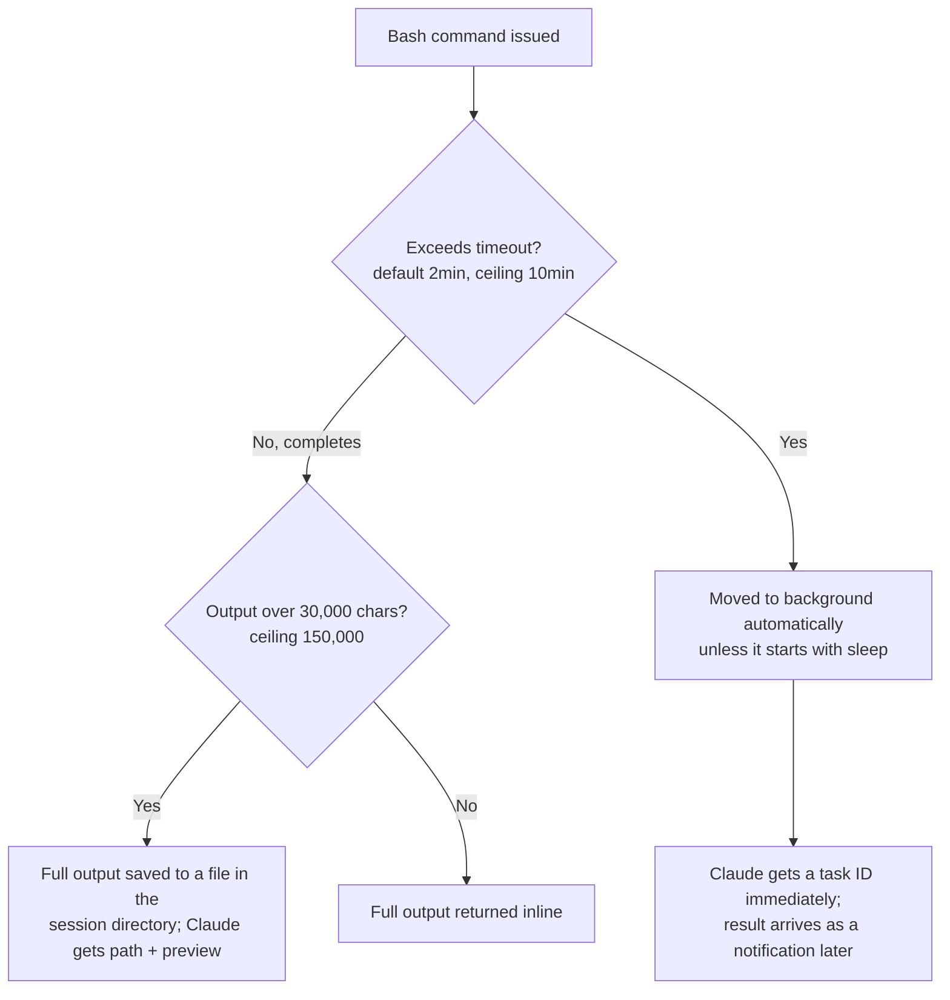
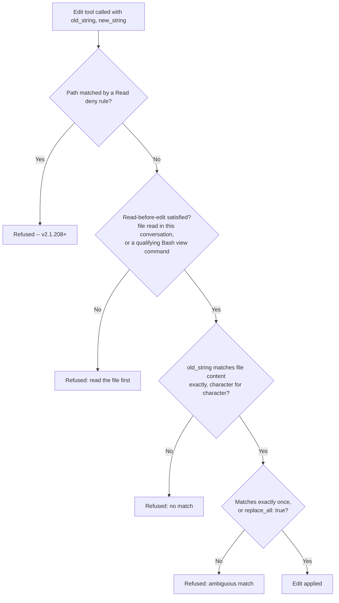
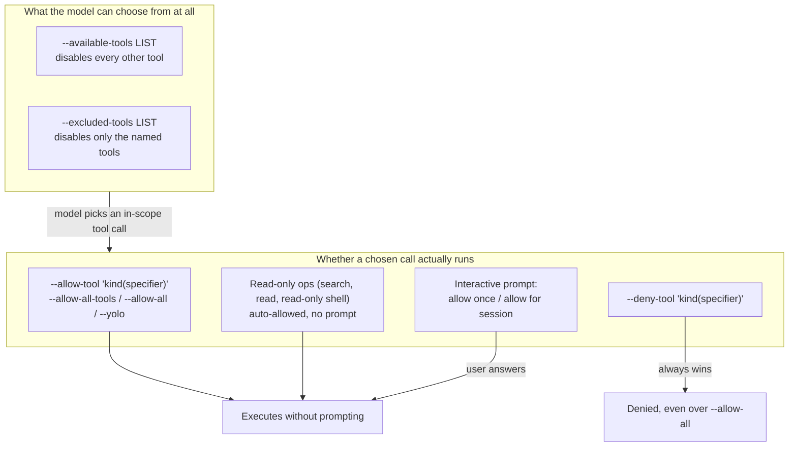

# Built-in tools -- Claude Code, GitHub Copilot CLI, OpenCode

What tools ship with each harness out of the box (no MCP server, no
plugin needed), what each one actually does mechanically, and how each
harness's permission system names and gates them. This page is about
the *tool surface itself* -- for how a subagent gets a subset of that
surface and hands off context, see [Handoff mechanism](handoff-mechanism.md);
for how MCP-provided tools are discovered, loaded, and invoked
alongside the built-ins, see [MCP integration](mcp-integration.md).

Every claim below is tagged VERIFIED (fetched this session from the
named source) or BEST CURRENT UNDERSTANDING, UNCONFIRMED. Claude Code,
Copilot CLI, and OpenCode are three separate products from three
separate organizations -- nothing confirmed for one is assumed for
another. Sources and fetch dates at the bottom.

---

## 1. Claude Code

Primary source for this section: `code.claude.com/docs/en/tools-reference`,
fetched 2026-07-30. VERIFIED, and this is the load-bearing source for
the whole section unless another is named inline.

### 1.1 The full built-in tool table

The docs state plainly: "The tool names are the exact strings you use
in permission rules, subagent tool lists, and hook matchers" -- so the
names below are not paraphrase, they are the literal identifiers the
permission system, `--allowedTools`/`--disallowedTools`, a subagent's
`tools`/`disallowedTools` frontmatter, a skill's `allowed-tools`
frontmatter, and a hook's `matcher` field all key off of.

| Tool | What it does | Prompts for permission by default |
|---|---|---|
| `Agent` | Spawns a subagent with its own context window | No |
| `Artifact` | Publishes an HTML/Markdown file as a claude.ai artifact (Pro/Max/Team/Enterprise) | Yes |
| `AskUserQuestion` | Multiple-choice questions to gather requirements | No |
| `Bash` | Executes shell commands | Yes (but a built-in read-only command set skips the prompt) |
| `CronCreate`/`CronDelete`/`CronList` | Schedules, cancels, lists session-scoped recurring/one-shot prompts | No |
| `Edit` | Targeted string-replacement edits to a file | Yes |
| `EndConversation` | Ends the session (abuse-of-last-resort or explicit demo request) | No (and cannot be denied -- see below) |
| `EnterPlanMode`/`ExitPlanMode` | Switches into/out of plan mode | `ExitPlanMode`: Yes |
| `EnterWorktree`/`ExitWorktree` | Creates/switches into, or exits, an isolated git worktree | `EnterWorktree`: Yes for paths outside `.claude/worktrees/` |
| `Glob` | Finds files by name pattern | No |
| `Grep` | Searches file contents (ripgrep-backed) | No |
| `ListMcpResourcesTool`/`ReadMcpResourceTool` | Lists/reads MCP-exposed resources | No |
| `LSP` | Code intelligence via a language server (definitions, references, diagnostics) | No |
| `Monitor` | Runs a background command or WebSocket feed and reports events as they arrive | Yes |
| `NotebookEdit` | Edits a Jupyter notebook cell by `cell_id` | Yes |
| `PowerShell` | Native PowerShell execution (Windows-primary, opt-in elsewhere) | Yes |
| `PushNotification` | Desktop/phone push when a long task finishes | No |
| `Read` | Reads file contents | No |
| `RemoteTrigger` | Manages Routines on claude.ai (`/schedule`) | No |
| `ReportFindings` | Structured code-review findings list | No |
| `ScheduleWakeup` | Reschedules the next iteration of a self-paced `/loop` | No |
| `SendMessage` | Messages an agent-team teammate, or resumes a subagent by ID/name | No |
| `SendUserFile` | Sends a generated file to the user's device (Remote Control / cloud) | No |
| `ShareOnboardingGuide` | Uploads `ONBOARDING.md`, returns a share link | Yes |
| `Skill` | Executes a skill in the main conversation | Yes |
| `TaskCreate`/`TaskGet`/`TaskList`/`TaskUpdate`/`TaskOutput`/`TaskStop` | Session task-list management and background-task control | No |
| `TodoWrite` | Legacy session checklist tool; disabled by default since v2.1.142 in favor of the `Task*` family (`CLAUDE_CODE_ENABLE_TASKS=0` re-enables it) | No |
| `ToolSearch`/`WaitForMcpServers` | Loads deferred MCP tool schemas / waits on a still-connecting MCP server | No |
| `WebFetch` | Fetches a URL, converts to Markdown, runs an extraction prompt through a small model | Yes |
| `WebSearch` | Web search via Anthropic's server-side backend | Yes |
| `Workflow` | Runs a dynamic workflow script orchestrating many background subagents | Yes |
| `Write` | Creates or fully overwrites a file | Yes |

Note the `TodoWrite` -> `TaskCreate`/`TaskGet`/`TaskList`/`TaskUpdate`
migration is itself a documented behavior change (v2.1.142), not a
naming curiosity -- a subagent or hook written against `TodoWrite`
before that version will silently interact with a disabled tool unless
`CLAUDE_CODE_ENABLE_TASKS=0` is set.

### 1.2 Permission rule syntax

All five configuration surfaces (`permissions.allow`/`deny` in
settings, `/permissions`, `--allowedTools`/`--disallowedTools`, the
Agent SDK's `allowedTools`/`disallowedTools`, a subagent's `tools`/
`disallowedTools` frontmatter, a skill's `allowed-tools` frontmatter,
and a hook's `if` condition) accept the same `ToolName(specifier)`
rule format, and several tools share a specifier grammar:

| Rule format | Applies to | Grammar |
|---|---|---|
| `Bash(npm run *)` | Bash, Monitor | command pattern matching |
| `PowerShell(Get-ChildItem *)` | PowerShell | command pattern matching |
| `Read(~/secrets/**)` | Read, Grep, Glob, LSP | path pattern matching |
| `Edit(/src/**)` | Edit, Write, NotebookEdit | path pattern matching |
| `Skill(deploy *)` | Skill | skill-name matching |
| `Agent(Explore)` | Agent | subagent-type matching |
| `WebFetch(domain:example.com)` | WebFetch | domain matching |
| `WebSearch` | WebSearch | no specifier -- allow/deny the whole tool |

Tools not in that table (`ExitPlanMode`, `ShareOnboardingGuide`, etc.)
accept only the bare tool name, no specifier. Two cross-tool
interactions worth internalizing: an `Edit(...)` allow rule also
grants read access to the same path (no matching `Read(...)` rule
needed), and, as of v2.1.208, a `Read(...)` deny rule also blocks
`Edit` on that path (including creating a new file there), since
editing requires reading the result back.

`EndConversation` is a deliberate, structural exception to this whole
system: it never prompts, `PreToolUse` hooks never fire for it,
`deny`/`ask` rules naming it have no effect, and neither
`--disallowedTools` nor a `--tools` allowlist can remove it -- except
that a deny rule matching *everything* (`"*"`) also removes it, unless
an allow rule names it explicitly, so Claude Code doesn't strand a
session with it as the only remaining tool. VERIFIED, same source.

### 1.3 Bash: process model, limits, backgrounding



Each command runs in its own process. Working-directory `cd`s carry
over between commands in the main session (never in a subagent
session) as long as the target stays inside the project directory or
an added directory; landing outside resets to the project directory
and appends a `Shell cwd was reset to <dir>` note. Environment
variables set with `export` do **not** persist between commands, but
shell-startup aliases/functions (`~/.zshrc`, `~/.bashrc`, `~/.profile`)
are captured once at session start and applied to every command
thereafter. `CLAUDE_BASH_MAINTAIN_PROJECT_WORKING_DIR=1` disables the
`cd` carry-over entirely.

Timeout override: `BASH_DEFAULT_TIMEOUT_MS`/`BASH_MAX_TIMEOUT_MS`.
Output-length override: `BASH_MAX_OUTPUT_LENGTH` (still capped at
150,000). A command that hits its timeout without finishing is moved
to the background rather than killed, so long builds keep progressing
instead of being cut off -- `run_in_background: true` requests this
proactively for known long-running processes (dev servers, watchers).
`CLAUDE_CODE_DISABLE_BACKGROUND_TASKS=1` turns off all of this.

### 1.4 Edit: the three-gate check



Edit does exact string replacement, never regex or fuzzy matching.
Viewing a file via Bash also satisfies read-before-edit, but only for
`cat`, `head`, `tail`, `sed -n 'X,Yp'`, `grep`, `egrep`, or `fgrep` on
a single file with no pipes/redirects -- piped output or any other Bash
command does not count. As of v2.1.208, a file that changed on disk
after Claude last read it can still be edited if `old_string` still
matches the current content exactly and unambiguously and a fresh read
wouldn't need a permission prompt; the result then notes the file
carries other changes so Claude re-reads before a dependent edit. Note
that the deny-rule check applies to file commands Claude Code
recognizes inside Bash (`cat`, `head`, `tail`, `sed`, `grep`) but not to
an arbitrary subprocess (a Python/Node script) that reads or writes a
file indirectly -- OS-level enforcement covering every process requires
enabling the sandbox (`/docs/en/sandboxing`).

`Write` has a related but simpler gate: overwriting an *existing* path
requires having read it at least once this conversation (new files are
exempt), and viewing via the same qualifying Bash commands satisfies
that too. Partial changes always go through `Edit`, not `Write`.

### 1.5 Read, Glob, Grep, WebFetch, WebSearch, LSP, Monitor

**Read** returns line-numbered content; a whole-file read exceeding
the token limit returns a paginated `PARTIAL view` with `offset`/
`limit` to continue. It transparently handles images (resized/
recompressed for the model's image limits; re-encoded as reduced-
quality JPEG above 500KB post-resize, as of v2.1.196), PDFs (whole if
short, paginated in up to 20-page ranges above 10 pages), and Jupyter
notebooks (all cells with outputs). It only reads files, never
directories -- Claude uses `ls` via Bash for that.

**Glob** supports `**` recursive matching, sorts results by
modification time, caps at 100 files, and does **not** respect
`.gitignore` by default (`CLAUDE_CODE_GLOB_NO_IGNORE=false` changes
that) -- a deliberate asymmetry from Grep.

**Grep** is ripgrep-backed (ripgrep regex syntax, not POSIX grep), has
three output modes (`files_with_matches` default, `content`, `count`),
supports `glob`/`type` scoping and `multiline: true`, and **does**
respect `.gitignore` -- Claude passes a gitignored path directly when it
specifically needs to search one.

**WebFetch** is lossy by design: it converts the fetched page to
Markdown and runs an extraction prompt through a small, fast model, so
Claude typically receives that model's answer to the prompt, not the
raw page; a redirect to a different host is reported rather than
followed automatically. Responses cache for 15 minutes. It prompts on
first reach to a new domain (except a built-in preapproved
documentation-domain set) in default/`acceptEdits` modes; an explicit
`WebFetch(domain:...)` rule in `allow`/`deny`/`ask` overrides the
preapproved set either direction.

**WebSearch** returns titles/URLs only (no page fetch -- that's a
follow-up `WebFetch` call), issues up to eight backend searches per
call internally, supports `allowed_domains`/`blocked_domains` (not
combinable in one call), and is capped at 200 calls per session across
the main conversation and every subagent it spawns combined
(`CLAUDE_CODE_MAX_WEB_SEARCHES_PER_SESSION` raises it; `/clear`
resets the counter).

**LSP** is inactive until a code-intelligence plugin for the language
is installed; once active it auto-reports type errors/warnings after
every edit and answers definition/reference/hover/call-hierarchy
queries on request.

**Monitor** runs a background script or opens a WebSocket and feeds
each output line/message back into the conversation as an event,
without pausing it -- useful for tailing logs, polling CI/PR status, or
watching a directory. It shares Bash's permission rules for the
commands it runs, and a WebSocket source has its own approval prompt
with no "don't ask again" option; Claude Code denies WebSocket targets
resolving to private/link-local/cloud-metadata addresses outright.

### 1.6 What subagents and restricted modes don't get

A subagent's resolved tool set is always intersected with "tools
available to subagents" (documented separately at
`/docs/en/sub-agents#available-tools`) regardless of what its own
`tools` frontmatter lists -- a tool unavailable to subagents is never
granted even if named explicitly. `EndConversation` is never available
to a subagent under any configuration. A `--bare` headless session
loads only shell and file tools, so most of the table above (Agent,
WebFetch, WebSearch, Monitor, the Task family, etc.) is absent there by
construction, not by permission denial.

---

## 2. GitHub Copilot CLI

Sources for this section: `docs.github.com/en/copilot/reference/copilot-cli-reference/cli-programmatic-reference`,
`docs.github.com/en/copilot/how-tos/copilot-cli/use-copilot-cli/allowing-tools`,
and `docs.github.com/copilot/concepts/agents/about-copilot-cli`, all
fetched 2026-07-30; and `github/copilot-cli`'s own `changelog.md`,
fetched via `gh api` on 2026-07-30 (authoritative for its own
behavior-change history, not for anything not stated there). VERIFIED
unless flagged otherwise.

### 2.1 Two different vocabularies: permission "kinds" vs. functional tools

Copilot CLI's own documentation describes its tool surface at two
different levels of granularity, and they should not be conflated.

**Permission *kinds*** -- the six categories the `--allow-tool`/
`--deny-tool`/permission-config system actually reasons about, per the
CLI programmatic reference and the allowing-tools page:

| Kind | Controls |
|---|---|
| `shell` | Executing shell commands |
| `write` | Creating or modifying files |
| `read` | Reading files or directories |
| `url` | Fetching content from a URL |
| `memory` | Storing new facts to Copilot's persistent memory |
| `MCP-SERVER` (per server name) | Invoking tools from that specific MCP server |

**Functional tools actually named in the changelog** -- the concrete
implementation surface behind those kinds, confirmed by name across
many changelog entries rather than by a single reference table:

- **shell tool** -- executes commands; changelog records its default
  timeout being lowered, its environment no longer leaking the
  internal `NODE_ENV` variable, and an interactive variant that
  preserves the parent terminal's color settings.
- **view tool** -- the read-side tool; the changelog fixes a prompt
  that "correctly state[s] the 20KB truncation limit instead of 50KB"
  (i.e. the limit itself dropped from 50KB to 20KB at some point) and
  shows partial content for large single-line files (minified JS,
  large JSON) instead of returning nothing.
- **write/edit tool** -- file modification, gated by the `write`
  permission kind.
- **web-fetch tool** -- fetches URL content; the changelog records it
  rejecting `file://` URLs and suggesting the view tool instead.
- **search tools** -- file/content search (Grep/Glob-equivalent); the
  changelog fixes Windows-style glob pattern handling for them.
- **task tool** -- launches subagents, including built-in ones. The
  changelog documents built-in "explore" and "task" subagents (with a
  setting to disable them), a built-in "configure-copilot" subagent
  reachable via the task tool for managing MCP servers/custom
  agents/skills, and that "task tool subagents can now process
  images." Full mechanics of Copilot CLI's subagent dispatch belong to
  [Handoff mechanism](handoff-mechanism.md), not here.
- **memory tools** -- `store_memory` (included only when memory is
  enabled for the user) and `vote_memory` (throttled per response/
  interaction to prevent runaway voting bursts); back the
  `memory` permission kind and Copilot Memory generally (see
  [Memory management](memory-management.md) for the fuller mechanism).
- **Code Review tool** -- reviews changesets, explicitly bounded ("The
  Code Review tool handles large changesets by ignoring build
  artifacts and limiting to 100 files") and configured to use the same
  model as the current session rather than a fixed default.
- **apply_patch toolchain** -- added specifically "for OpenAI Codex
  models," i.e. Copilot CLI swaps in a different file-editing
  toolchain depending on the underlying model family rather than
  exposing one universal edit tool across every model. BEST CURRENT
  UNDERSTANDING, UNCONFIRMED beyond that one changelog line: which
  other model families get which toolchain variant is not stated.
- **GitHub MCP server** -- built in, no configuration required. Its
  default tool list is deliberately curated to conserve context: "we've
  limited the list of tools available to the default GitHub MCP
  server. In our tests, the model will use the GitHub CLI, `gh` (if
  installed) in lieu of missing MCP tools," with
  `--enable-all-github-mcp-tools` to opt back into the full set. A
  later entry notes that when `gh` is already on `PATH`, the server
  additionally "omits redundant gh-replaceable tools by default,
  reducing token usage" -- so the effective tool list is conditional on
  host environment, not fixed. In Azure DevOps-only repositories the
  server is auto-disabled except for exposing just its `web_search`
  tool rather than being fully disabled.

No confirmed Copilot CLI equivalent of Claude Code's `TodoWrite`/
`Task*` checklist family was found in any source fetched this session
-- task orchestration in Copilot CLI's documented model runs through
the task tool's subagent dispatch (`/delegate`, built-in "explore"/
"task" subagents) rather than a standalone visible-checklist tool.
Treat this as BEST CURRENT UNDERSTANDING, UNCONFIRMED-as-absent, not
proven absent -- a search-engine synthesis (not a direct fetch, so not
citable here) suggested a `todo`/`TodoWrite`-named tool may exist in
some SDK surface; that claim was not corroborated by any page or
changelog entry actually fetched this session, so it is omitted above
rather than asserted.

### 2.2 Permission flags and persistence



The distinction matters: `--available-tools`/`--excluded-tools` shape
what the model is even offered as options, while `--allow-tool`/
`--deny-tool` (and the interactive per-call prompt) shape whether a
call the model already chose to make is permitted to execute. A tool
excluded from awareness never reaches the execution-permission layer
at all.

Specifier syntax mirrors Claude Code's `Tool(specifier)` shape but
with different wildcard rules: `shell(git commit)` matches the exact
command, `shell(git:*)` matches the whole `git` family, `write(README.md)`
matches any file ending in that name, `write(.github/copilot-instructions.md)`
matches that exact path, `url(https://*.github.com)` wildcards a
subdomain, and `url(https://docs.github.com/copilot/*)` restricts to a
path prefix. The docs state explicitly that "wildcards are only
supported for `shell` ... and for `url` at the start of the host name
... or at the end of a path" -- i.e. the wildcard grammar is narrower
than Claude Code's, which allows `**` and mid-string `*` more broadly
across Bash and path rules.

Persistence: session-level flags (`--allow-tool`, `--deny-tool`,
`--available-tools`, `--excluded-tools`) apply only to that invocation
and are never written to disk. Approvals granted interactively during
a session persist to `~/.copilot/permissions-config.json` (location-
scoped, keyed to the repo root or working directory); URL-domain
approvals persist separately to `~/.copilot/settings.json` (global
across sessions). In-session, `/allow-all`/`/yolo` grant broadly and
`/reset-allowed-tools` revokes everything granted so far in that
session. Deny rules take precedence over allow rules unconditionally,
"even when `--allow-all` is set" or a prior approval was saved. Read-
only operations (search, file reads, read-only shell commands) are
auto-allowed regardless of any of the above, matching the "read
required" column pattern seen in Claude Code's own table (§1.1) even
though the two systems are independently implemented.

---

## 3. OpenCode

Sources for this section: `opencode.ai/docs/tools` and
`opencode.ai/docs/permissions/`, both fetched 2026-07-30. VERIFIED
unless flagged otherwise. As with every OpenCode citation elsewhere in
this book, treat anything sourced from the `dev` branch of
`github.com/anomalyco/opencode` as possibly ahead of or behind the
current stable release; the two docs pages cited here are current
documented behavior, not source-code inspection, so that caveat does
not directly apply to this section, but is worth restating since
OpenCode is the one harness in this book whose implementation is
itself inspectable.

### 3.1 Built-in tool list

| Tool | What it does |
|---|---|
| `bash` | Executes shell commands in the project directory as working directory |
| `read` | Reads file contents, whole file or a specific line range for large files |
| `write` | Creates new files or overwrites existing ones |
| `edit` | Modifies existing files via exact string replacement (diff-based, not line-number-based) |
| `grep` | Regex content search across the codebase (ripgrep-backed), with file-pattern filtering |
| `glob` | Finds files by pattern (`**/*.js`, `src/**/*.ts`), results sorted by modification time |
| `lsp` (experimental) | Code intelligence -- go-to-definition, find references, hover info, call hierarchy. Requires `OPENCODE_EXPERIMENTAL_LSP_TOOL=true` |
| `apply_patch` | Applies a patch file with embedded path markers and Add/Update/Move/Delete operations |
| `skill` | Loads a `SKILL.md` file and returns its content into the conversation |
| `todowrite` | Manages the session todo list; disabled for subagents by default |
| `webfetch` | Fetches and reads web page content |
| `websearch` | Web search via Exa AI; requires `OPENCODE_ENABLE_EXA=1` |
| `question` | Asks the user a clarifying question mid-execution |
| `task` | Launches a subagent -- covered in full in [Handoff mechanism](handoff-mechanism.md), not duplicated here |

### 3.2 Permission model

By default, every tool is enabled with no permission gate. The
`permission` field in `opencode.json` (or an agent's own markdown
frontmatter) takes one of three values per tool key: `"allow"` (runs
without approval), `"ask"` (prompts), or `"deny"` (blocked outright).
Documented tool keys accepting this include `read`, `edit` (covers
edit, write, and patch operations together -- there is no separate
`write` permission key the way Claude Code and Copilot CLI both have),
`bash`, `glob`, `grep`, `webfetch`, `websearch`, `task`, `skill`,
`external_directory` (operations touching paths outside the project),
and `doom_loop` (repeated identical tool calls -- a guard against a
model stuck retrying the same failing call).

```json
{
  "permission": {
    "*": "ask",
    "bash": "allow",
    "edit": "deny"
  }
}
```

Wildcard patterns use simple glob-like matching (`*` for zero-or-more
characters, `?` for exactly one) and apply to command or path
arguments -- e.g. `"git *"` for a bash-argument pattern or
`"~/projects/personal/**"` for a path pattern -- as well as to MCP tool
names via a prefix pattern like `"mymcp_*"`. Agent-level overrides,
defined either inline in `opencode.json` or in an agent's own markdown
file (e.g. `~/.config/opencode/agents/review.md`), take precedence
over the global `permission` block -- the same "narrower, more specific
scope wins" shape Claude Code uses for its local/project/user setting
scopes, though the two mechanisms are unrelated implementations.

Notably, OpenCode's `edit` folding write/edit/patch into one permission
key, and its explicit `doom_loop` guard against repeated identical
calls, have no stated counterpart in either Claude Code's or Copilot
CLI's documented permission vocabulary -- BEST CURRENT UNDERSTANDING,
UNCONFIRMED that neither of the other two harnesses has an equivalent
single named guard against that failure mode, since absence from the
sources fetched for this page is not proof of absence in the product.

---

## 4. Synthesis -- the same six jobs, three different tool surfaces

```mermaid
flowchart LR
    subgraph Job["Functional job"]
        J1[Shell execution]
        J2[Read file]
        J3[Write/overwrite file]
        J4[Targeted edit]
        J5[Search content]
        J6[Find files by name]
        J7[Fetch a URL]
        J8[Web search]
        J9[Subagent dispatch]
        J10[Session todo/task list]
        J11[Code intelligence]
        J12[Persistent memory]
    end
    subgraph CC["Claude Code"]
        C1[Bash / PowerShell]
        C2[Read]
        C3[Write]
        C4[Edit]
        C5[Grep]
        C6[Glob]
        C7[WebFetch]
        C8[WebSearch]
        C9[Agent]
        C10["TaskCreate/Get/List/Update<br/>(TodoWrite, legacy)"]
        C11[LSP]
        C12["none built in --<br/>MCP memory servers instead"]
    end
    subgraph GH["Copilot CLI"]
        G1[shell tool]
        G2[view tool]
        G3["write/edit tool<br/>(apply_patch for Codex models)"]
        G4["same write/edit tool"]
        G5[search tools]
        G6[search tools]
        G7[web-fetch tool]
        G8["web_search<br/>(via GitHub MCP server)"]
        G9[task tool]
        G10["none confirmed --<br/>task tool orchestration instead"]
        G11["none confirmed"]
        G12["store_memory / vote_memory<br/>(Copilot Memory)"]
    end
    subgraph OC["OpenCode"]
        O1[bash]
        O2[read]
        O3[write]
        O4[edit]
        O5[grep]
        O6[glob]
        O7[webfetch]
        O8["websearch (Exa,<br/>opt-in flag)"]
        O9[task]
        O10[todowrite]
        O11["lsp (experimental,<br/>opt-in flag)"]
        O12["none built in"]
    end
    J1 -.-> C1 & G1 & O1
    J2 -.-> C2 & G2 & O2
    J3 -.-> C3 & G3 & O3
    J4 -.-> C4 & G4 & O4
    J5 -.-> C5 & G5 & O5
    J6 -.-> C6 & G6 & O6
    J7 -.-> C7 & G7 & O7
    J8 -.-> C8 & G8 & O8
    J9 -.-> C9 & G9 & O9
    J10 -.-> C10 & G10 & O10
    J11 -.-> C11 & G11 & O11
    J12 -.-> C12 & G12 & O12
```



**Naming and rule-syntax convergence is superficial.** All three
harnesses converge on a `kind(specifier)` shape for scoping rules --
Claude Code's `Bash(npm run *)`, Copilot CLI's `shell(git:*)`,
OpenCode's `"git *"` pattern under a `bash` key -- but the wildcard
grammars differ (Claude Code's is documented as the most permissive,
allowing `**` and broader mid-string `*`; Copilot CLI's docs state
wildcards work only for `shell` and at the edges of a `url`; OpenCode's
is a simple `*`/`?` glob). A rule string written for one harness is not
portable to another even when it looks similar.

**The permission *default* differs meaningfully.** Claude Code prompts
per-tool with documented exceptions (read-only Bash commands, Read/
Grep/Glob for in-scope paths); Copilot CLI auto-allows a documented
read-only set and otherwise prompts, with the same practical shape;
OpenCode's stated default is the most permissive of the three -- "by
default, all tools are enabled without requiring permission" -- putting
the burden on the user to opt into `ask`/`deny` via `opencode.json`
rather than shipping a conservative default gate. This is a real,
sourced product difference, not a wording nuance: an OpenCode user who
never touches the `permission` block has no per-call gate at all on
`bash`, `edit`, or `write`, where the same user on Claude Code or
Copilot CLI would see prompts for mutating operations from first use.

**Task/todo tooling is the least convergent job in the table.** Claude
Code's own `TodoWrite` -> `Task*` migration shows the mechanism moving
target even within one harness's history; Copilot CLI shows no
confirmed dedicated checklist tool at all, routing task-shaped work
through subagent dispatch instead; OpenCode keeps a simple standalone
`todowrite` tool, explicitly disabled for subagents by default. Do not
assume a "todo list" concept transfers between these harnesses even
when the word appears in more than one of them.

**Model-conditional tool substitution is a real, sourced pattern.**
Copilot CLI's `apply_patch` toolchain swapped in specifically "for
OpenAI Codex models" is the clearest confirmed instance in this book of
a harness changing its own built-in tool implementation based on which
underlying model is driving the session, rather than exposing one
fixed tool surface regardless of model. Whether Claude Code or OpenCode
do anything analogous was not found in any source fetched for this
page -- treat as an open question, not a ruled-out one.

---

## Sources

| Source | Fetched | Authoritative for |
|---|---|---|
| `code.claude.com/docs/en/tools-reference` | 2026-07-30 | Claude Code's complete built-in tool list, permission-required column, per-tool behavior sections (Bash, Edit, Read, Glob, Grep, WebFetch, WebSearch, LSP, Monitor, PowerShell, NotebookEdit, Write, Agent, EndConversation), permission rule-format table |
| `docs.github.com/en/copilot/reference/copilot-cli-reference/cli-programmatic-reference` | 2026-07-30 | Copilot CLI's permission "kind" taxonomy (shell/write/read/url/memory/MCP-SERVER) and specifier examples |
| `docs.github.com/en/copilot/how-tos/copilot-cli/use-copilot-cli/allowing-tools` | 2026-07-30 | Copilot CLI's `--allow-tool`/`--deny-tool`/`--available-tools`/`--excluded-tools` semantics, persistence to `permissions-config.json`/`settings.json`, `/allow-all`/`/yolo`/`/reset-allowed-tools`, deny-over-allow precedence, read-only auto-allow |
| `docs.github.com/copilot/concepts/agents/about-copilot-cli` | 2026-07-30 | Copilot CLI conceptual overview: shell/file access, Copilot Memory, MCP, custom agents |
| `github/copilot-cli` `changelog.md` (via `gh api`) | 2026-07-30 | its own behavior-change history: shell/view/web-fetch/search/task-tool naming and fixes, memory tools (`store_memory`/`vote_memory`), Code Review tool, `apply_patch` for Codex models, built-in GitHub MCP server's curated default tool list and `--enable-all-github-mcp-tools` |
| `opencode.ai/docs/tools` | 2026-07-30 | OpenCode's complete built-in tool list and per-tool description |
| `opencode.ai/docs/permissions/` | 2026-07-30 | OpenCode's `permission` field, allow/ask/deny values, wildcard syntax, agent-level overrides |

Not consulted this session, and therefore not cited above: any direct
inspection of `github.com/anomalyco/opencode`'s `dev`-branch source for
these specific tools (the docs pages sufficed for documented behavior);
`github/copilot-sdk`'s issue tracker, which a search-engine snippet
(not a direct fetch) suggested might reference a `todo`-named tool
missing from some SDK surface -- worth an actual fetch of that repo's
issues if a future question turns on Copilot CLI's todo/checklist
tooling specifically.
