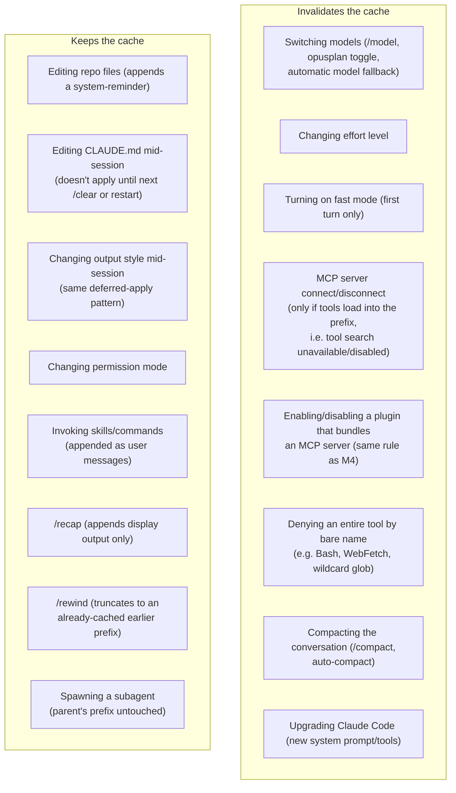
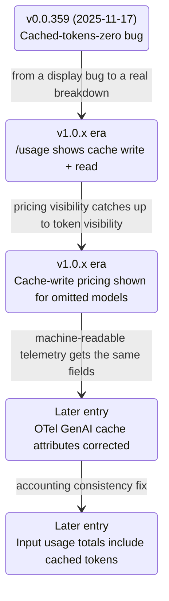
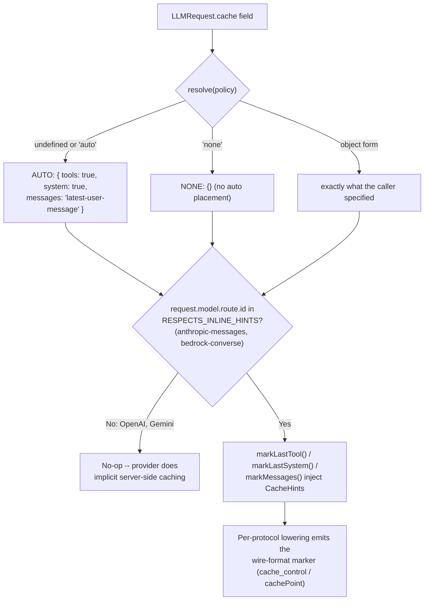
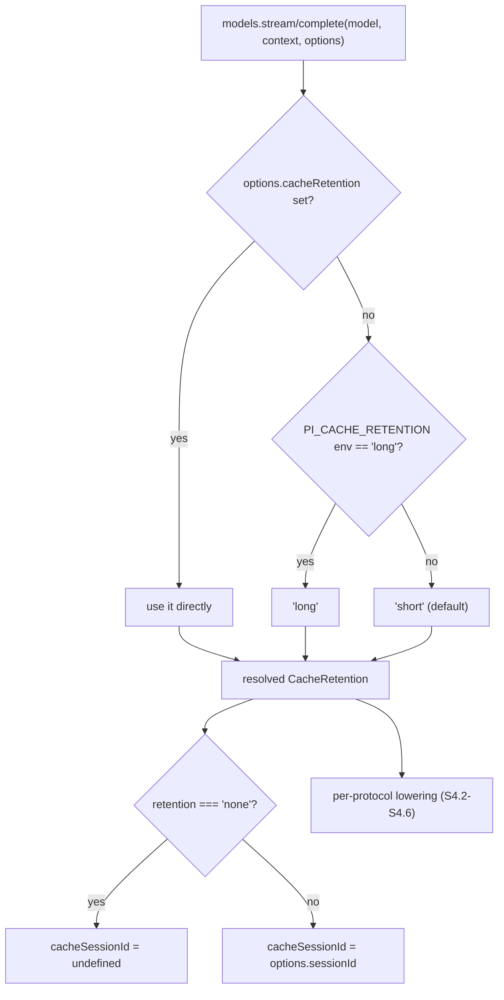
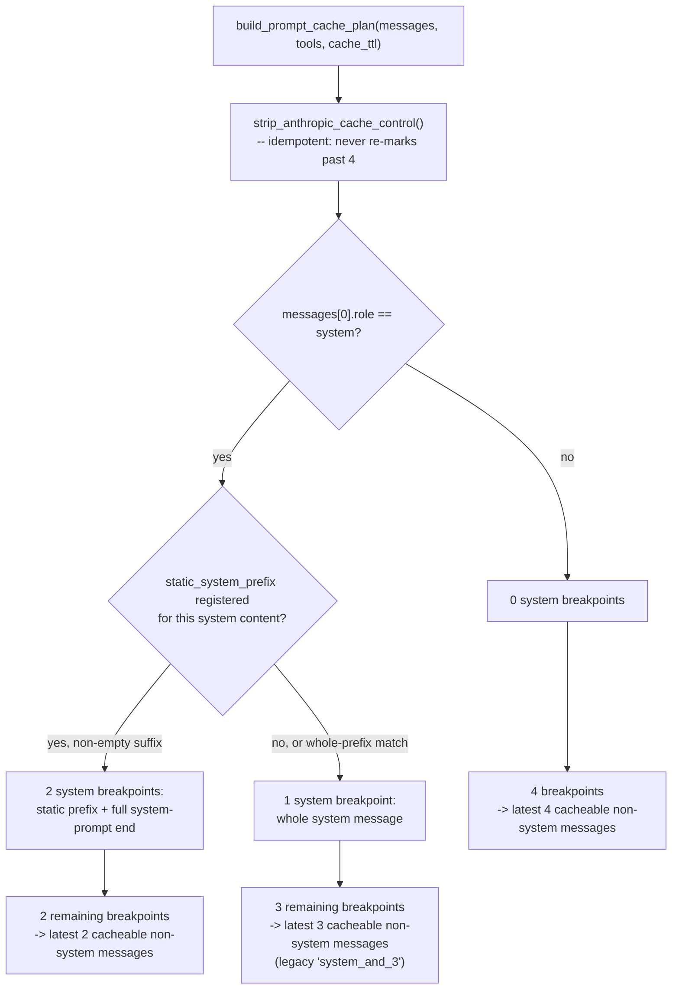
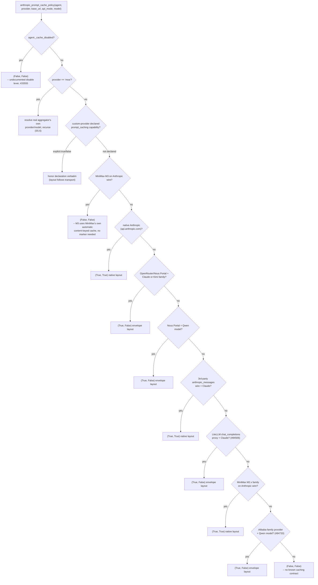

# Prompt/context caching -- Claude Code, GitHub Copilot CLI, OpenCode, pi, and Hermes Agent

**Scope note.** This page is about **server-side prefix reuse** -- the
mechanism that lets a provider (Anthropic, Bedrock, OpenAI, Gemini) skip
recomputing the KV-cache/attention state for a prompt prefix it has already
processed, billing the reuse at a fraction of the standard input-token
rate. It is a distinct axis from
[context-compression.md](context-compression.md) (mid-run **shrinking** of
the conversation to fit a window) and from
[memory-management.md](memory-management.md) (what instruction/memory
content gets **loaded** and when) -- a session can have a perfectly warm
cache and still need compaction, and compaction itself, as shown below, is
itself a cache-reading operation in at least one harness. Where a claim
already lives in one of those pages it is cited by cross-reference rather
than re-derived.

Every claim is tagged VERIFIED (fetched this session, or already verified
and cited in a page linked above) or BEST CURRENT UNDERSTANDING,
UNCONFIRMED. Claude Code, Copilot CLI, OpenCode, pi, and Hermes Agent are
five separate products built on top of (in Claude Code's case,
exclusively) or across (in Copilot CLI's, OpenCode's, pi's, and Hermes
Agent's case) multiple model providers -- nothing confirmed for one
harness, or for the underlying Anthropic/Bedrock API mechanism itself, is
assumed to hold for another harness without its own citation.

---

## 1. Claude Code

Primary source: `code.claude.com/docs/en/prompt-caching`, fetched fresh
this session (2026-07-30) -- a dedicated page devoted entirely to this
mechanism, cross-referenced against `code.claude.com/docs/en/costs`
(also fetched fresh this session) and `github.com/anthropics/claude-code`
`CHANGELOG.md` (fetched fresh this session for this page, superseding the
partial reads cited in earlier pages). VERIFIED unless tagged otherwise.

### 1.1 The mechanism: exact prefix matching over a growing request

Claude Code re-sends the entire conversation on every turn -- there is no
server-side session state the model "remembers" between requests. What
prompt caching does is let the API recognize that most of a new request is
byte-identical to the previous one and skip reprocessing that shared
**prefix**. The docs state the matching rule precisely: "The match is
exact, so a change anywhere in the prefix recomputes everything after it.
There is no per-file or per-segment caching." This is a single linear
prefix match, not a content-addressed cache keyed by individual files or
messages -- a change to anything before a given point invalidates
everything after it, regardless of whether that later content itself
changed.

To maximize how much of each request stays behind a stable prefix, Claude
Code orders the request into three layers, least-volatile first:

| Layer | Content | Changes when |
|---|---|---|
| System prompt | Core instructions, tool definitions, output style | The set of loaded tool definitions changes, or Claude Code is upgraded |
| Project context | CLAUDE.md, auto memory, unscoped rules | Session starts, or after `/clear` or `/compact` |
| Conversation | Messages, responses, tool results | Every turn |

Two settings sit outside the prompt text entirely but are still part of
the cache key: **model** (each model has its own cache -- switching with
`/model` recomputes the entire request with zero cache hits even though
the content is identical) and **effort level** (also independently keyed;
Claude Code shows a confirmation dialog before an effort change that would
invalidate the cache, but skips it when the change resolves to the level
already in effect).

### 1.2 What invalidates the cache -- and what doesn't

Most listed behaviors reduce to the single prefix-match rule in §1.1.
Content that is **appended** after the existing conversation -- skill and
command instructions, plan-mode text, a subagent's returned result --
leaves everything before it cache-hit-eligible, which is why plan mode and
skill loading are explicitly called out in the docs as not disturbing the
cached prefix. Content that changes the **system-prompt or tool-definition
layer** invalidates everything downstream of it, because all later content
now sits behind a different prefix.

Two invalidation triggers deserve their own note because they are easy to
trigger unintentionally mid-session:

- **MCP server connect/disconnect.** Whether this invalidates the cache
  depends entirely on whether that server's tools are **deferred** (the
  default on supported models, via [tool search](mcp-integration.md)) or
  **loaded into the prefix**. Deferred tools only append new content when
  a server connects, so no invalidation. Tools loaded into the prefix --
  which happens when tool search is unavailable/disabled (Google Cloud's
  Agent Platform, a custom `ANTHROPIC_BASE_URL` gateway, or an Azure-hosted
  Microsoft Foundry deployment once Claude Code detects the deployment
  rejects tool search), when a server or tool is marked `alwaysLoad`, or
  under threshold-based loading -- invalidate on any change to that tool
  list. The docs flag that this can happen with **no action from the
  user**: a stdio server's process exiting, an HTTP session expiring, or an
  automatic reconnection after a transient failure all change the tool set
  mid-session.
- **Compacting the conversation.** By design this replaces message history
  with a summary, so the conversation layer's prefix is gone -- but the
  system-prompt layer is reused and project context is reloaded from disk
  (cache-hitting only if CLAUDE.md/memory are unchanged since session
  start). Critically, the summarization request itself is a normal API call
  built from the same system prompt, tools, and history as the live
  conversation plus an appended summarization instruction -- so **while the
  cache is warm, `/compact` reads that prefix from cache and costs a
  fraction of what the context size suggests.** Only after a break longer
  than the cache lifetime (§1.3) does a `/compact` reprocess the full
  history as uncached input -- which the docs state explicitly is why
  `/compact` is most expensive when resuming an old session. This is a
  concrete mechanism-level detail this page adds to
  [context-compression.md](context-compression.md) §1: compaction's own
  cost is itself gated by cache state, not a fixed cost proportional to
  context size.

`/rewind` (see checkpointing) is called out as cache-favorable specifically
*because* it truncates back to a prefix that was already cached at that
point, rather than -- like compaction -- building a new, shorter prefix
from scratch: "Rewinding truncates back to a prefix that is already
cached, rather than building a new one as compaction does."

### 1.3 Cache lifetime (TTL) and where the cache physically lives

The underlying Anthropic API offers two TTLs, and Claude Code selects
between them automatically based on how the session authenticates:

- **Claude subscription (Pro/Max/Team/Enterprise):** requests the
  **one-hour TTL** automatically, so the cache survives breaks of up to an
  hour. If the session has gone over its plan usage limit and is drawing on
  usage credits, Claude Code is billed for that usage, and since cache
  writes cost more at the one-hour TTL, it **automatically drops to the
  five-minute TTL** in that state.
- **API key, Amazon Bedrock, Google Cloud's Agent Platform, Microsoft
  Foundry, or Claude Platform on AWS:** the TTL defaults to the cheaper
  **five minutes**, since usage is billed per token. Setting
  `ENABLE_PROMPT_CACHING_1H=1` opts into the one-hour TTL on these paths.
- **Override:** `FORCE_PROMPT_CACHING_5M=1` forces five minutes regardless
  of authentication -- useful for debugging cache behavior or overriding an
  `ENABLE_PROMPT_CACHING_1H` set in managed settings.
- On Amazon Bedrock specifically, prompt-caching support, minimum
  cacheable prefix length, and one-hour-TTL availability all **vary by
  model** -- the docs point to AWS's own supported-models/regions/limits
  page if cache token counts stay at zero.

Each cache-hitting request resets the TTL timer, so a session stays warm
indefinitely as long as requests keep arriving within the window; only a
gap longer than the TTL forces a full, uncached reprocess on the next
turn. Where the cache **physically lives** depends on the same
authentication path: Anthropic's own infrastructure for API-key/
subscription/Claude-Platform-on-AWS traffic, the cloud provider's own
serving infrastructure for Bedrock/Google Cloud's Agent Platform, and
either Azure or Anthropic infrastructure for Microsoft Foundry depending on
its hosting option. A custom `ANTHROPIC_BASE_URL` or LLM gateway forwards
the cache-control marker along, but whether it actually takes effect
depends on that gateway -- and if the gateway rejects the breakpoint marker
outright, {/* per docs */} Claude Code retries the request without it and
leaves that block permanently uncached for the rest of the conversation.
As of v2.1.211 (per `CHANGELOG.md`), mid-conversation system context that
Claude Code appends (e.g. file-change notices) is cached the same way on
Bedrock/its Mantle endpoint, Google Cloud's Agent Platform, and Microsoft
Foundry as it is on the Claude API; before that version these providers
billed that appended block as uncached input on every request -- a
regression separately confirmed in the changelog: "Fixed a prompt-caching
regression on Bedrock, Vertex, Mantle, and Foundry that billed the
trailing system context block as fresh input tokens on every request."

### 1.4 Cache scope: effectively one machine, one directory

The docs state plainly that "the cache is effectively scoped to one
machine and directory." The system prompt embeds the working directory,
platform, shell, OS version, and auto-memory paths, so two sessions in
different directories -- including different **worktrees of the same
repository** -- build different prefixes and never share a cache entry.
Parallel sessions in the *same* directory build matching prefixes and do
share the cache; sequential sessions share it only if the git-status
snapshot captured at startup (branch, recent commits) still matches. The
underlying API cache is broader than this -- caches are isolated between
organizations, and on some providers between workspaces within an
organization -- but within those boundaries, any two requests with the
same model and prefix hit the same server-side entry. For Agent SDK
callers running a fleet of automated processes across many machines, the
docs point to a separate mechanism (suppressing the per-machine sections of
the system prompt) to let unrelated processes share a cache -- flagged here
as an SDK-specific lever, not a CLI-default behavior.

### 1.5 Subagents and forks: separate caches, one exception

A [subagent](handoff-mechanism.md) starts an entirely separate
conversation with its own system prompt and tool set, so it builds its own
cache from zero hits on its first call. Subagents use the five-minute TTL
**even on a subscription** -- the docs state the automatic one-hour TTL is
specific to the main conversation. The parent's own cache is unaffected;
from the parent's perspective, the subagent's call and returned result are
just appended content. A **fork** (see
[handoff-mechanism.md](handoff-mechanism.md)), by contrast, inherits the
parent's system prompt, tools, and full conversation history exactly, so
its very first request reads the parent's cache -- and the docs note the
compaction summarization call (§1.2) uses this same prefix-sharing
approach.

Separately, `CHANGELOG.md` records a fix specifically for subagent
progress-summary requests missing the cache entirely (a roughly 3x
reduction in `cache_creation` tokens once fixed) -- evidence that even
within a single harness, different internal request types (a subagent's
main turns vs. its progress-summary side-channel) can silently diverge in
whether they hit the shared prefix, until caught and fixed.

### 1.6 Observability: the two token fields, `/usage`, and OpenTelemetry

Every API response reports two fields that make cache performance directly
measurable:

| Field | Meaning |
|---|---|
| `cache_creation_input_tokens` | Tokens written to the cache this turn, billed at the cache-write rate |
| `cache_read_input_tokens` | Tokens served from cache this turn, billed at roughly 10% of the standard input rate |

The docs frame the diagnostic directly: "A high read-to-creation ratio
means caching is working well. If creation stays high turn after turn,
something is changing in your prefix" -- pointing back at §1.2's
invalidation list as the usual cause. `/usage`'s Session block shows this
per-model, e.g. `claude-sonnet-4-6: 1.2k input, 5.3k output, 940.0k cache
read, 50.0k cache write ($0.55)` (verified, `costs` page). On a
Pro/Max/Team/Enterprise plan, `/usage`'s breakdown additionally **flags**
cache misses specifically when they account for 10% or more of recent
usage, alongside a tip to reduce them (cited, `costs` page §"Using the
`/usage` command"). A statusline script reading the `current_usage` object
is the docs' suggested way to watch these fields live, and the
OpenTelemetry exporter reports cache-read and cache-creation tokens
per-user and per-session for organization-wide visibility. `CHANGELOG.md`
adds two dated observability fixes worth flagging as historical
gotchas rather than current bugs: `cache_creation_input_tokens` at one
point reported as `0` when the API reported cache writes only via a nested
`cache_creation` breakdown object (fixed), and `/cost` gained a
per-model-and-cache-hit breakdown for subscription users as a distinct,
later addition.

### 1.7 Why usage climbs in a long session -- caching's cost-side implication

[costs page, cross-referenced] explicitly names prompt caching as one of
the reasons a long-idle session's usage looks disproportionate to recent
activity: "Claude Code re-reads that history at the cached token rate, so
a one-line question in a session that has been open all day still draws
usage for the whole conversation" -- and separately, "your first message
after a break longer than the cache lifetime misses the cache and
reprocesses your full context." On Pro/Max, resuming a large session after
a long break triggers Claude Code's own mitigation: it offers to [resume
from a summary](memory-management.md) so the following requests don't
carry the full uncached history. `CHANGELOG.md` records a targeted nudge
in the same spirit -- v(unspecified, changelog-dated) added "an idle-return
prompt that nudges users returning after 75+ minutes to `/clear`, reducing
unnecessary token re-caching on stale sessions."

### 1.8 Disabling caching and org-wide policy

Six environment variables, settable per-user or in the `env` block of
managed settings for an organization-wide policy:

| Variable | Effect |
|---|---|
| `DISABLE_PROMPT_CACHING` | Disable for all models |
| `DISABLE_PROMPT_CACHING_HAIKU` | Disable for Haiku only |
| `DISABLE_PROMPT_CACHING_SONNET` | Disable for Sonnet only |
| `DISABLE_PROMPT_CACHING_OPUS` | Disable for Opus only |
| `DISABLE_PROMPT_CACHING_FABLE` | Disable for Fable only |
| `ENABLE_PROMPT_CACHING_1H` / `FORCE_PROMPT_CACHING_5M` | TTL override, §1.3 |

`CHANGELOG.md` records a startup warning added when any
`DISABLE_PROMPT_CACHING*` variable is set, and a fix for a related
interaction bug: subscribers who set `DISABLE_TELEMETRY` used to fall back
to the five-minute TTL instead of the subscription's one-hour default
(fixed). `ENABLE_PROMPT_CACHING_1H_BEDROCK` is called out in the changelog
as deprecated but still honored, superseded by the provider-agnostic
`ENABLE_PROMPT_CACHING_1H`. `--exclude-dynamic-system-prompt-sections`
(print-mode flag, per changelog) exists specifically "for improved
cross-user prompt caching" -- stripping per-user/per-machine dynamic
sections so unrelated automated processes on different machines can still
share a cache entry, the CLI-flag counterpart to the SDK-level mechanism
noted in §1.4.

### 1.9 The underlying Anthropic API mechanism (bounded citation)

The Claude Code docs repeatedly point to
`platform.claude.com/docs/en/build-with-claude/prompt-caching` for "the
underlying API mechanism, breakpoints, and pricing" rather than restating
it -- fetched fresh this session, this page is authoritative for the raw
Anthropic Messages API feature that Claude Code (and, independently,
OpenCode's Anthropic protocol adapter, §3.2) both sit on top of, **not**
for Claude-Code-specific behavior, which stays scoped to §1.1-1.8 above.
The mechanism it documents: up to **4 explicit `cache_control` breakpoints**
per request (or one automatic top-level breakpoint that places itself on
the last cacheable block); `"ephemeral"` is currently the only cache type;
a **5-minute TTL** at a 1.25x base-input write cost and 0.1x base-input
read cost, or a **1-hour TTL** (`"ttl": "1h"`) at a 2x write cost with the
same 0.1x read cost; a per-model **minimum cacheable prompt length**
ranging from 512 tokens (Opus 5, Fable 5, Mythos 5) up to 4,096 tokens
(Opus 4.6/4.5, Haiku 3.5/4.5) -- prompts below the minimum are processed
without caching and without an error; cache hits require exact,
byte-for-byte matches of every block up to and including the marked one;
and a documented **20-block lookback window**, meaning a cache read walks
backward from the current breakpoint checking at most 20 prior positions
for a matching entry before giving up, which is why a single trailing
breakpoint stops working once a conversation grows past that window and a
second, earlier breakpoint is needed to keep the older prefix reachable.
Cache invalidation follows a stated **hierarchy, tools -> system ->
messages**: a change at any level invalidates that level and everything
after it, but never anything before it (e.g. toggling web search
invalidates the tools cache but leaves system/messages caches intact).
None of this 4-breakpoint/20-block/hierarchy detail is Claude-Code-specific
prose on the `code.claude.com` pages themselves -- it is cited here from
the Anthropic API page specifically because Claude Code's own docs assume
it as background rather than re-explaining it.

---

## 2. GitHub Copilot CLI

Sources: `docs.github.com/en/enterprise-cloud@latest/copilot/tutorials/
optimize-ai-usage` (fetched fresh this session, 2026-07-30) and
`github.com/github/copilot-cli` `changelog.md` (fetched fresh this session
via `gh api repos/github/copilot-cli/contents/changelog.md`, full 2,898-line
file). VERIFIED unless tagged otherwise. Copilot CLI is closed source --
everything below is inferred from documented behavior and the product's
own changelog, never from an implementation file, the same standing
caveat as [context-compression.md](context-compression.md) §2.

### 2.1 What the docs say the mechanism is

The "Optimizing your AI usage" tutorial states the underlying rationale in
agentic-coding terms directly comparable to Claude Code's own framing:
"the same large context -- system prompt, file contents, tool definitions
-- is sent repeatedly across many turns," and caching lets the model
"store portions of a conversation's context so they don't need to be
reprocessed on every request." Cached tokens are "typically billed at 10%
of the normal input price" -- the same 0.1x multiplier the Anthropic API
documents for its own cache reads (§1.9), though the Copilot CLI page does
not attribute this figure to any specific underlying provider, since
Copilot CLI routes across multiple model families (GPT, Claude, Gemini,
and BYOK/BYOM providers per [built-in-tools.md](built-in-tools.md)).

### 2.2 Cache lifetime: a documented, provider-differentiated TTL

VERIFIED, same page: caches expire "after periods of inactivity -- **24
hours for OpenAI models and 1 hour for most others**." This is a
concretely different TTL structure from both Claude Code (5 minutes/1
hour, chosen by authentication path, §1.3) and the raw Anthropic API
(5 minutes/1 hour, chosen by an explicit `ttl` parameter, §1.9) -- Copilot
CLI's 24-hour figure for OpenAI models has no analog in either of those,
consistent with OpenAI's own implicit prompt-caching mechanism (server-side,
automatic above a token threshold, no client-side breakpoint marker
required) being a genuinely different design from Anthropic/Bedrock's
explicit-breakpoint model. This page does not state what "most others"
covers beyond implying non-OpenAI models default to the shorter window.

### 2.3 What invalidates the cache

The same page names three triggers, structurally close to Claude Code's
list (§1.2) but stated at a coarser grain, without Claude Code's
layer-by-layer breakdown:

1. **Model switching**: "A different model can't reuse another model's
   cache, so the next request rebuilds it from scratch" -- the same
   model-is-part-of-the-cache-key rule as §1.1.
2. **Session inactivity** past the TTL in §2.2.
3. **Configuration changes**: "reasoning effort level, context size, or
   the set of enabled tools and MCP servers during a session invalidates
   the cache" -- context size here plausibly refers to the [context-tier
   selection](context-compression.md) (200K vs. 1M) mechanism documented
   for compaction/truncation in that page; this document did not find a
   source stating explicitly that tier selection and cache invalidation
   share the same enforcement path, so treat that specific link as **BEST
   CURRENT UNDERSTANDING, UNCONFIRMED** even though both are named on the
   same page.

A documented mitigation: Copilot CLI's **auto model selection** feature
"protects your cache" by only switching models "at natural cache
boundaries, when a new session starts or after you run `/compact`, never
mid-task" -- an explicit design choice to avoid the exact mid-task
model-switch cache miss that Claude Code's docs warn about for manual
`/model` switches (§1.1), applied here to an *automatic* selection feature
specifically so it can't silently trigger the same cost spike.

### 2.4 Changelog-traced evolution of cache observability

Reading the changelog oldest-to-newest (it is itself newest-first) shows
cache **observability** maturing as a distinct thread from the caching
mechanism itself, which the changelog never describes in mechanism-level
terms (no breakpoint count, no explicit TTL-parameter equivalent to
Anthropic's `ttl: "1h"`, is ever named):

- **v0.0.359 (2025-11-17).** "Fix a bug where cached tokens were displaying
  as zero at the end of the session" -- the earliest cache-related entry
  found, evidence the feature (or at least its accounting) predates this
  changelog window and was already being actively debugged.
- **(undated in this excerpt, later).** "Show cache write tokens alongside
  cache read tokens in /usage display" -- the CLI's `/usage` surface gains
  the read/write pair, the same two-field breakdown Claude Code's `/usage`
  shows (§1.6).
- **(undated, later still).** "Display cache-write pricing for models that
  omit it" -- a gap-filling fix implying some models' pricing metadata
  didn't originally carry a cache-write rate at all.
- **(undated, later).** "OpenTelemetry GenAI spans now emit
  `gen_ai.usage.cache_read.input_tokens`, `gen_ai.usage.cache_creation.
  input_tokens`, and `gen_ai.usage.reasoning.output_tokens` per the GenAI
  semantic conventions spec (previously used incorrect underscore-separated
  names)" -- a naming-convention correction, not a new capability, but it
  fixes the OTel field names to match the spec Claude Code's own OTel
  export presumably targets too (not independently re-verified against
  Claude Code's own OTel schema this session -- flagged rather than
  assumed identical).
- **(undated, later).** "Ensure input token usage includes cached, update
  token formatting to clarify" -- an accounting-correctness fix, the same
  category of bug as Claude Code's `cache_creation_input_tokens` reporting
  `0` fix (§1.6): both harnesses independently had to patch a case where a
  cache-related token count didn't roll up correctly into a displayed
  total.
- Two further entries confirm cache state is treated as something that
  must **survive** specific operations rather than being casually rebuilt:
  "Resumed sessions reproduce the original attached-file references even
  if those files later change on disk, avoiding prompt-cache resets," and
  a note that custom-agent instructions "are no longer duplicated each
  turn, reducing context window usage" (a token-bloat fix adjacent to, but
  not stated as, a caching fix specifically).

### 2.5 What is not documented

No page or changelog entry fetched this session states Copilot CLI's
equivalent of Anthropic's explicit `cache_control` breakpoint mechanism, a
breakpoint count cap, a lookback-window figure, or per-provider minimum
cacheable-token thresholds. Given that Copilot CLI is a multi-provider
harness (per [built-in-tools.md](built-in-tools.md), routing across GPT,
Claude, Gemini, and BYOK/BYOM models), it is plausible the CLI delegates to
each provider's own native caching behavior (explicit breakpoints on
Anthropic-family models it routes to, implicit server-side caching on
OpenAI/Gemini-family models) the same way OpenCode's `packages/llm`
explicitly branches on provider (§3.2-3.3) -- but this is **BEST CURRENT
UNDERSTANDING, UNCONFIRMED**: no Copilot CLI source is public to verify it
the way OpenCode's is, and no docs page states the provider-dispatch logic
explicitly. Treat it as a plausible architectural inference, not a
confirmed fact.

---

## 3. OpenCode

Source: `github.com/anomalyco/opencode`, `dev` branch, fetched live via
`gh search code` and `gh api` this session (2026-07-30) -- flagging per
this project's standing caveat that `dev` is not a stable release tag and
this code may not reflect the current stable release. Unlike Claude Code
and Copilot CLI, this harness's caching logic is not inferred from
documentation at all in this section -- `opencode.ai/docs/providers/` and
`opencode.ai/docs/config/` were both fetched fresh this session and
**confirmed to contain no mention of prompt caching, `cache_control`,
cache breakpoints, or a `cache` configuration key** (a checked negative
result, not an assumption) -- so everything below comes from
`packages/llm`, the one package in this repository dedicated to the
provider-facing LLM request/response contract.

### 3.1 `cache-policy.ts`: a protocol-neutral policy resolved before lowering

VERIFIED, `packages/llm/src/cache-policy.ts`. Every outbound `LLMRequest`
carries an optional `cache` field of type `CachePolicy` --
`"auto" | "none" | CachePolicyObject` -- resolved once, before the
per-protocol request-body builder runs:

The default (`undefined` or `"auto"`) resolves to
`{ tools: true, system: true, messages: "latest-user-message" }` -- three
breakpoints placed at the **last tool definition**, the **last system
part**, and the **latest user message**. The source comment states the
rationale for the third breakpoint's position directly: "in a tool-use
loop, a single user turn expands into many assistant/tool round-trips, all
sharing that prefix. Caching at that boundary lets every intra-turn API
call hit." This is a materially different framing from Claude Code's
documented layer table (§1.1), which treats the whole conversation as one
growing layer -- OpenCode's `packages/llm` instead explicitly optimizes for
the *sub-turn* structure of a single tool-use loop, anchoring one
breakpoint at the most recent user message specifically so every
subsequent assistant/tool-result exchange within that same turn reads the
same cached prefix rather than only benefiting cache hits turn-to-turn.

The package's own README states the justification in the same terms
Claude Code's docs use independently: "the math justifies the default:
Anthropic's 5-minute cache write is 1.25x base, read is 0.1x, so a single
reuse within 5 minutes already wins" -- the identical pricing figures
verified from the Anthropic API docs in §1.9, cited here as a second,
independent confirmation of those multipliers from a different vantage
point (an implementer's own justifying comment, not just the API's own
pricing page).

`resolve()` is additive, not destructive: a manual `CacheHint` placed on
any individual text/system/tool/tool-result part is preserved through auto
placement -- `markLastTool`/`markLastSystem`/`markMessageAt` each check
`if (existing.cache) return` before writing, so "auto" only **fills gaps**
the caller left empty rather than overwriting explicit choices.

Granular override is available as the object form of `CachePolicy`:
`{ tools?: boolean, system?: boolean, messages?: "latest-user-message" |
"latest-assistant" | { tail: number } }`, plus an independent `ttlSeconds`
override. A one-off completion can opt out entirely with `cache: "none"`
-- the README notes the worst case of leaving auto on for a single-shot
call is harmless, since "one-shot completions below the per-model
minimum-cacheable-token threshold silently no-op on the wire."

### 3.2 Per-protocol lowering: Anthropic Messages and Bedrock Converse

VERIFIED, `packages/llm/src/protocols/anthropic-messages.ts` and
`packages/llm/src/protocols/utils/bedrock-cache.ts` (with shared TTL logic
in `packages/llm/src/protocols/utils/cache.ts`). Both protocols enforce a
hard-coded **4-breakpoint cap per request**
(`ANTHROPIC_BREAKPOINT_CAP` / `BEDROCK_BREAKPOINT_CAP = 4`) -- matching the
Anthropic API's own documented cap in §1.9 exactly, and confirmed in
source comments as a deliberate mirror of the wire-level 400-error limit:
"Anthropic accepts at most 4 explicit `cache_control` breakpoints per
request... Beyond the cap the API returns a 400 -- so the lowering layer
counts emitted markers and silently drops any that exceed it." A shared
`Breakpoints` counter (`{ remaining, dropped }`) threads through the whole
request-lowering pass; when it hits zero, further requested cache markers
are dropped rather than sent, and a dropped count is logged as a warning:
"dropped N cache breakpoint(s); the API allows at most 4 per request."

The budget is allocated in a stated invalidation-hierarchy order -- **tools
-> system -> messages** -- matching the Anthropic API's own documented
hierarchy (§1.9): a source comment states the reasoning explicitly, "Tools
live highest in the cache hierarchy, so when callers over-mark we keep
their tool hints and shed the message-tail ones first." TTL is bucketed by
a shared helper, `ttlBucket(ttlSeconds)`, which returns `"1h"` for any
`ttlSeconds >= 3600` and otherwise `undefined` (meaning the provider's
5-minute default) -- both Anthropic Messages (`EPHEMERAL_1H = { type:
"ephemeral", ttl: "1h" }`) and Bedrock Converse
(`cachePoint: { type: "default", ttl: "1h" }`) apply this identically,
confirmed as one shared function rather than two independently-maintained
thresholds. Bedrock's marker is positional (a `cachePoint` block emitted
immediately after the content to be cached) rather than an attribute on
the content block itself the way Anthropic's `cache_control` field is --
a real wire-format difference the shared `Breakpoints` counter and
`ttlBucket` helper abstract away from the caller.

One schema detail flagged rather than resolved: `CacheHint`'s `type` field
is a union of `"ephemeral"` **and** `"persistent"`
(`packages/llm/src/schema/options.ts`), but both lowering functions
(`cacheControl` in `anthropic-messages.ts`, `block` in
`bedrock-cache.ts`) treat the two identically -- `if (cache?.type !==
"ephemeral" && cache?.type !== "persistent") return undefined` -- with no
branch that changes the emitted wire marker or TTL behavior based on which
value was set. *BEST CURRENT UNDERSTANDING, UNCONFIRMED:* whether
`"persistent"` is a forward-looking schema placeholder for a future
non-ephemeral cache type Anthropic/Bedrock don't yet expose, dead code, or
consumed differently somewhere not searched this session -- no source
fetched this session distinguishes the two at the point where the wire
request is actually built.

### 3.3 OpenAI and Gemini: a deliberate no-op

VERIFIED, `cache-policy.ts`:
`RESPECTS_INLINE_HINTS = Set(["anthropic-messages", "bedrock-converse"])`.
`applyCachePolicy()`'s very first line is
`if (!RESPECTS_INLINE_HINTS.has(request.model.route.id)) return request`
-- for every other protocol, the entire cache-policy pass is skipped
outright rather than emitting a marker that would be ignored. The source
comment names the reason: "Protocols whose wire format ignores inline
cache markers (OpenAI's implicit prefix caching, Gemini's implicit +
out-of-band `CachedContent`). Skip the whole policy pass for these --
emitting hints would be harmless but pointless." The package README states
the same split as a one-line provider-behavior table: OpenAI Chat/
Responses do "implicit caching above 1024 tokens" and Gemini does
"implicit caching on 2.5+; explicit `CachedContent` is out-of-band" -- both
no-ops from `cache: "auto"`'s perspective, confirming OpenCode's own
architecture treats explicit-breakpoint caching (Anthropic/Bedrock) and
implicit automatic caching (OpenAI/Gemini) as two fundamentally different
mechanisms it does not try to unify at the request-construction level,
only at the response-accounting level (§3.4).

### 3.4 Normalized token accounting across providers

VERIFIED, `anthropic-messages.ts` `mapUsage`/`mergeUsage`. Anthropic
reports usage as `input_tokens` (the API's own *non-cached* count),
`cache_creation_input_tokens`, and `cache_read_input_tokens` as separate
fields, streamed incrementally (`message_start` then a final,
authoritative `message_delta`). OpenCode sums these into one inclusive
`inputTokens` figure for its own internal `Usage` type, while separately
preserving the breakdown as `nonCachedInputTokens`, `cacheReadInputTokens`,
and `cacheWriteInputTokens` -- the README states this normalization is
provider-wide: "Normalized cache usage is read back into
`response.usage.cacheReadInputTokens` and `cacheWriteInputTokens` across
every provider." This is the mechanism referenced in
[context-compression.md](context-compression.md) §3.2's overflow-detection
formula (`tokens.total || input+output+cache.read+cache.write`) -- the
compaction-trigger token count and the caching subsystem's own accounting
draw from the same normalized `Usage` fields, source-confirmed here as the
same object rather than two independently-computed totals.

### 3.5 Config surface: none -- this is a programmatic, not user-facing, knob

A discrepancy worth stating as plainly as
[context-compression.md](context-compression.md) §3.6 states its own:
`opencode.ai/docs/providers/` and `opencode.ai/docs/config/` were both
checked this session and **neither documents a user-facing `cache`
configuration key at all**. Unlike `compaction.auto`/`compaction.prune`/
`compaction.reserved`, which are documented (if incompletely) on the
config page, prompt caching in OpenCode appears to be entirely a
programmatic `LLMRequest.cache` field -- set (or left at its `"auto"`
default) by whatever code constructs the request, not something a user
configures in `opencode.json`/`opencode.jsonc`. *BEST CURRENT
UNDERSTANDING, UNCONFIRMED:* this session did not find a call site in
`packages/opencode` that reads a user-facing config value into
`LLMRequest.cache` for ordinary session turns, so whether an end user has
any documented lever to influence caching at all (short of an unlisted
`providerOptions` escape hatch, per the README's three-tier
generation/providerOptions/http override system) is not confirmed either
way from what was searched this session.

---

## 4. pi (`@earendil-works/pi-ai`)

VERIFIED, fetched 1 September 2026 directly from `github.com/earendil-works/pi`, `main`
branch. **A naming clarification this section resolves rather than repeats.** This
repository is a monorepo publishing (at minimum) two separate npm packages under the
`@earendil-works` scope, confirmed from each package's own `package.json` fetched this
session: `packages/ai` publishes `@earendil-works/pi-ai` ("Unified LLM API with automatic
model discovery and provider configuration") -- the provider-abstraction layer this page's
caching mechanics live in, and the same package [llm-api-contract.md](llm-api-contract.md)
§3.5 and [auth-and-usage-accounting.md](auth-and-usage-accounting.md) document from their
own angles -- while `packages/coding-agent` publishes `@earendil-works/pi-coding-agent`
("Coding agent CLI with read, bash, edit, write tools and session management"), the harness
itself, which declares `@earendil-works/pi-ai` as an ordinary version-pinned dependency
(`"@earendil-works/pi-ai": "^0.84.4"` in `packages/coding-agent/package.json`, read this
session). Both spellings this book uses elsewhere (`pi-ai` in
[llm-api-contract.md](llm-api-contract.md)/[auth-and-usage-accounting.md](auth-and-usage-accounting.md)
and `pi-coding-agent` in
[deterministic-orchestration.md](deterministic-orchestration.md)/[session-persistence.md](session-persistence.md))
are independently correct package names for two different, real npm packages in this one
repository -- not an inconsistency to fix, since each citing page names the package
actually relevant to its own topic. This section's own subject -- caching mechanics -- is
`@earendil-works/pi-ai`'s, read directly from `packages/ai/src/api/anthropic-messages.ts`,
`openai-responses.ts`, `openai-completions.ts`, `bedrock-converse-stream.ts`,
`google-generative-ai.ts`, `google-vertex.ts`, `google-shared.ts`, `types.ts`, and
`openai-prompt-cache.ts` (full files, read this session), cross-referenced against
`packages/ai/README.md` and, for the CLI-facing configuration surface,
`packages/coding-agent/docs/models.md`, `providers.md`, `environment-variables.md`,
`settings.md`, `compaction.md`, and `packages/coding-agent/src/core/compaction/compaction.ts`.

### 4.1 `CachePolicy`: one `CacheRetention` enum, one resolver function, copied into four protocols

VERIFIED, `packages/ai/src/types.ts` line 108: `export type CacheRetention = "none" | "short"
| "long"`, documented inline as "Prompt cache retention preference. Providers map this to
their supported values. Default: `short`." Every `StreamOptions`/`SimpleStreamOptions` call
accepts an optional `cacheRetention` field of this type, resolved by a `resolveCacheRetention()`
function that is -- confirmed by reading all four occurrences directly -- byte-for-byte
identical logic, independently copy-pasted (not shared via an import) into
`anthropic-messages.ts`, `openai-responses.ts`, `openai-completions.ts`, and
`bedrock-converse-stream.ts`:

The inline comment on the `PI_CACHE_RETENTION` branch -- "Defaults to `short` and uses
`PI_CACHE_RETENTION` for backward compatibility" -- indicates the environment variable
predates the per-request `cacheRetention` option and is kept as a persistent,
non-per-call override rather than the primary mechanism. Every one of the four protocols
also derives a `cacheSessionId` from the same resolved value with the identical one-line
rule -- `const cacheSessionId = cacheRetention === "none" ? undefined : options?.sessionId`
-- which then threads into whatever provider-specific session/cache-key mechanism that
protocol uses (an Anthropic `x-session-affinity` header, an OpenAI `prompt_cache_key` body
field, or nothing at all for Bedrock, which has no session-scoped cache key of its own).
One `sessionId` option, one `cacheRetention` option, and up to four independently-lowered
wire mechanisms is the architectural shape this whole section documents.

### 4.2 Anthropic Messages: three placement sites, `"stealth mode"` system-prompt duplication, and a cap respected by construction

VERIFIED, `packages/ai/src/api/anthropic-messages.ts`. `getCacheControl(model, cacheRetention,
env)` returns no marker at all when the resolved retention is `"none"`; otherwise it returns
`{ type: "ephemeral", ...(ttl && { ttl }) }`, where `ttl` is set to `"1h"` only when retention
is `"long"` **and** the model's own `compat.supportsLongCacheRetention` is true (default
`true` -- some Anthropic-compatible providers set it `false`). The resulting `cacheControl`
object is placed at exactly three sites in `buildParams()`:

1. **The system prompt.** For an OAuth (Claude subscription) token, the source under a
   comment literally reading `"Stealth mode: Mimic Claude Code's tool naming exactly"`
   constructs **two** system blocks -- a hardcoded `"You are Claude Code, Anthropic's
   official CLI for Claude."` identity string, followed by the caller's own
   `context.systemPrompt` -- and marks **both** with `cache_control`. For a plain API key,
   only the caller's own system prompt is sent, with one `cache_control` marker. This is a
   real, source-confirmed instance of pi's own OAuth path deliberately impersonating Claude
   Code's own system-prompt identity (also renaming tool calls via `toClaudeCodeName()` in
   the same code path) -- flagged here specifically because it means the *number* of
   system-level cache breakpoints pi emits (one or two) depends on which auth mode is active,
   not just on whether caching is enabled.
2. **The last tool definition** (`index === tools.length - 1` inside `convertTools()`),
   gated by `compat.supportsCacheControlOnTools` (default `true`; the source names Fireworks
   as a provider where this is set `false` because it "does not support this field on tools
   and may reject or ignore it").
3. **The last cacheable content block of the last message in the array**, if that message's
   `role` is `"user"` -- specifically the trailing `text`, `image`, or `tool_result` block,
   per a dedicated post-pass in `convertMessages()` under the comment "Add `cache_control` to
   the last user message to cache conversation history."

Because pi places **at most one** breakpoint at each of these three sites regardless of how
many tools or how much conversation history exists, the total emitted `cache_control` count
is bounded at exactly two (OAuth) or one (API key) system-prompt markers plus one tool marker
plus one message marker -- **at most four**, landing exactly on the Anthropic API's own
4-breakpoint cap ([llm-api-contract.md](llm-api-contract.md) §1.9,
[caching.md](caching.md) §1.9) by construction, not by an explicit runtime counter the way
OpenCode's `Breakpoints` object enforces the same cap defensively (§3.2). No source read this
session shows pi counting or dropping breakpoints -- the placement logic itself simply never
produces more than four.

### 4.3 TTL is a caller-declared toggle, not an auth-path inference -- the sharpest contrast with Claude Code

Claude Code (§1.3) infers its TTL automatically from *how the session authenticates*
(subscription -> 1h by default, API key/Bedrock/Vertex/Foundry -> 5m by default). pi instead
exposes `cacheRetention` as an explicit, caller- or environment-declared choice that is
**orthogonal to authentication mode**: an OAuth-authenticated pi session with
`cacheRetention: "short"` (the default) gets the plain 5-minute ephemeral cache with no `ttl`
field at all, and an API-key-authenticated session with `cacheRetention: "long"` gets the
same `ttl: "1h"` marker an OAuth session would. The only persistent, non-per-call way to opt
every request into the long tier is the `PI_CACHE_RETENTION=long` environment variable,
documented in `packages/coding-agent/docs/environment-variables.md`: "Set to `long` for
extended provider prompt caching where supported." A provider- or model-level override in
`models.json` (`compat.supportsLongCacheRetention: false`, documented in
`packages/coding-agent/docs/models.md`) can also refuse the long tier outright regardless of
what the caller or environment variable requests.

### 4.4 OpenAI Responses and Chat Completions: `prompt_cache_key`/`prompt_cache_retention`, an explicit opt-out for GPT-5.6+, and a second, independent Anthropic-flavored path for hybrid providers

VERIFIED, `packages/ai/src/api/openai-responses.ts` and `openai-completions.ts`. Both
protocols build a `prompt_cache_key` body field from `options.sessionId`, clamped to 64
characters by `clampOpenAIPromptCacheKey()` (`packages/ai/src/api/openai-prompt-cache.ts`,
`OPENAI_PROMPT_CACHE_KEY_MAX_LENGTH = 64`) -- OpenAI's own key-based mechanism for routing
repeat requests toward the same cached prefix, distinct from Anthropic's breakpoint-marker
approach. Responses always sends the key whenever retention is not `"none"`; Completions
sends it whenever retention is not `"none"` **and** the endpoint is native OpenAI
(`model.baseUrl.includes("api.openai.com")`), or, for non-native OpenAI-compatible
endpoints, only when retention is `"long"` **and** `compat.supportsLongCacheRetention` --
a narrower condition than the Responses path. Both protocols additionally send
`prompt_cache_retention: "24h"` when retention is `"long"` and the model's
`compat.supportsLongCacheRetention` allows it -- the 24-hour figure matching, independently,
the same OpenAI-model TTL figure Copilot CLI's own docs state (§2.2), here confirmed from a
different vantage point (pi's own request-construction source rather than a Microsoft/GitHub
tutorial page).

A capability found nowhere else in this page: Responses additionally sends
`prompt_cache_options: { mode: "explicit" }` specifically when retention is `"none"` **and**
`compat.supportsExplicitPromptCacheMode` is true -- a flag the source and
`packages/coding-agent/docs/models.md` both describe as gating "`prompt_cache_options`
(OpenAI GPT-5.6+ explicit prompt caching); older OpenAI models reject the parameter." This
means pi can, on capable models, **affirmatively suppress OpenAI's own implicit automatic
caching** when the caller asks for `cacheRetention: "none"` -- a materially different lever
than anything else this page documents: Claude Code and Copilot CLI never address turning off
the underlying provider's own caching at all, and OpenCode's own OpenAI path (§3.3) is a pure
no-op that neither engages nor disables the provider default.

Orthogonally, `openai-completions.ts` implements a **second, independent** caching strategy
gated by a distinct compat flag: when `compat.cacheControlFormat === "anthropic"` (an explicit
per-provider opt-in, documented in `models.md` as "for OpenAI-compatible providers that
expose Anthropic-style prompt caching through `cache_control` markers on text content and
tool definitions"), `applyAnthropicCacheControl()` places `cache_control` markers on the
system/developer message, the last tool definition, and the last user/assistant/tool
message's trailing text block -- the same three-site placement heuristic §4.2 documents for
the real Anthropic Messages protocol, reimplemented against an OpenAI-Chat-Completions-shaped
request body for providers that speak the OpenAI wire format but expose Anthropic-style cache
semantics underneath it. `cacheControlFormat` and the `prompt_cache_key`/
`prompt_cache_retention` mechanism are independent, non-exclusive levers on the same
`OpenAICompletionsCompat` object -- a provider can plausibly need either, both, or neither
depending on which underlying caching model it actually implements.

### 4.5 Amazon Bedrock Converse: eligibility inferred from the model catalog, not requested by the caller

VERIFIED, `packages/ai/src/api/bedrock-converse-stream.ts`. `supportsPromptCaching(model, env)`
returns `true` only when the model's `id`/`name` contains a recognizable Claude reference
(matched against `"claude"`, `"anthropic.claude"`, `"anthropic/claude"` substrings), naming
the concretely supported families in a source comment: "Claude 3.5 Haiku, Claude 3.7 Sonnet,
Claude 4.x models, Claude 5 models." For application inference profiles -- whose ARN does not
embed the model name, making this local detection impossible -- the environment variable
`AWS_BEDROCK_FORCE_CACHE=1` forces eligibility on, documented identically in
`packages/coding-agent/docs/providers.md`. The same source comment separately notes "Amazon
Nova models have automatic caching and don't need explicit cache points" -- an
implicit-vs-explicit split drawn *within* a single cloud provider's own model catalog, echoing
(without being identical to) the cross-vendor Anthropic-explicit/OpenAI-Gemini-implicit split
OpenCode's architecture draws across providers (§3.3). When eligible and retention is not
`"none"`, a `{ cachePoint: { type: CachePointType.DEFAULT, ...(long && { ttl:
CacheTTL.ONE_HOUR }) } }` block is appended after the system-prompt content and again after
the last user message's content -- the same two of §4.2's three Anthropic placement sites
(system, last user message), but **not** the tool-definition site: this session's read of
`convertToolConfig()` (the function building Bedrock's `toolConfig` block) found no
`cachePoint` reference anywhere in it, so Bedrock Converse tool definitions do not receive a
cache breakpoint through this code path -- a confirmed structural omission relative to the
Anthropic Messages protocol's own three-site placement, not merely an unconfirmed gap.

### 4.6 Google Generative AI and Vertex: read-only accounting, zero request-side markers

VERIFIED (checked negative result), `packages/ai/src/api/google-generative-ai.ts`,
`google-vertex.ts`, and `google-shared.ts` (all read in full). None of the three files
constructs any cache-related request field -- the only `cache`-related code in either
provider file is on the **response** side: `cacheRead: chunk.usageMetadata.cachedContentTokenCount
|| 0` and a hardcoded `cacheWrite: 0` (Gemini's API never reports a cache-write count back).
The non-cached input token count is explicitly computed as `promptTokenCount -
cachedContentTokenCount`, meaning a cache hit is visible only as a reduced non-cached-input
figure plus a populated `cacheRead` count in the response usage object -- never as anything
the client sends. This independently confirms, from pi's own source, the same implicit,
automatic, no-client-marker Gemini caching model OpenCode's own source establishes at §3.3
and its README states as a provider-behavior fact ("implicit caching on 2.5+").

### 4.7 Session-affinity headers: a caching-adjacent mechanism, not the cache marker itself

VERIFIED, `types.ts` and `models.md`. Distinct from any `cache_control`/`cachePoint`/
`prompt_cache_key` marker, pi separately supports **session-affinity headers** -- a
routing-level mechanism ensuring repeated requests from the same logical session land on the
same backend replica or shard, which is a precondition for that replica's own server-side
cache to actually be reachable on providers whose caching is tied to a specific served
instance rather than a globally shared cache tier. The source names Fireworks explicitly:
"session affinity for prompt cache routing (requests to the same replica maximize cache
hits)." Three documented header formats, selected by `compat.sessionAffinityFormat`:
`"openai"` (`session_id` + `x-client-request-id`, plus `x-session-affinity` on Chat
Completions specifically), `"openai-nosession"` (omits the underscore-bearing `session_id`
header for servers that reject it), and `"openrouter"` (`x-session-id`). `models.md` states
plainly that none of these header formats affects the `prompt_cache_key` body parameter
itself, which remains governed purely by `cacheRetention` -- the header and the body-level
cache key are two independent levers both threaded from the same underlying `sessionId`
value, not one mechanism wearing two names.

### 4.8 Compaction and branch summaries: an explicit cache opt-out -- the opposite policy from Claude Code

VERIFIED, `packages/coding-agent/src/core/compaction/compaction.ts` (function building the
summarization request options): `cacheRetention: "none"` is set explicitly for every
compaction and branch-summary call, alongside a fresh routing session ID
(`options.sessionId ?? uuidv7()`) when the caller did not already supply one, under the
inline comment "Avoid cache writes for one-off summaries. Reuse caller-supplied routing when
available; callers without a session ID, including branch summaries, receive a fresh routing
ID." `packages/coding-agent/docs/compaction.md` restates this from the user-facing side:
"Compaction and branch-summary requests use fresh routing session IDs and, where supported by
the provider, disable prompt-cache writes because these one-off prompts are unlikely to be
reused." This is a direct, source-confirmed point of contrast with Claude Code's own
documented stance on the identical operation (§1.2): Claude Code's docs describe its own
compaction summarization request as an ordinary API call that **benefits from** reading the
live, still-warm prefix from cache, treating summarization as cache-favorable. pi's
coding-agent takes the opposite design position for the same kind of request -- treating a
summarization prompt as inherently cache-averse because the summary text itself is judged
unlikely to recur -- and deliberately declines to write it into the cache at all. Both are
VERIFIED, for their own harness only; the difference is a genuine design divergence between
two independent engineering teams solving the same problem (what to do with a one-off
summarization call's cache footprint), not an error in either.

### 4.9 Observability: per-model cache-rate metadata, a cost-tier interaction, the Anthropic-only `cacheWrite1h` split, and an opt-in transcript notice

VERIFIED, `types.ts`, `models.md`. Every model's `cost` object carries four required
per-million-token rates -- `input`, `output`, `cacheRead`, `cacheWrite` -- and `models.md`
documents a cost-**tier** mechanism (an alternate full rate set that applies once usage
crosses a threshold) triggering "when total input usage (`input + cacheRead + cacheWrite`)
exceeds `inputTokensAbove`" -- meaning cache-read and cache-write tokens, despite being billed
at a fraction of the base input rate, still count toward the raw token volume that can push a
request into a costlier tier. A `cacheWrite1h` field on the `Usage` type is documented inline
as a "Subset of `cacheWrite` written with 1h retention. Only Anthropic reports this split" --
sourced in `anthropic-messages.ts` from the API's own nested `event.message.usage.cache_creation
?.ephemeral_1h_input_tokens` field, the identical nested breakdown object Claude Code's own
changelog separately records a reporting bug against (§1.6) -- pi's own accounting already
reads this nested field directly rather than only the flat `cache_creation_input_tokens`
count, though no source read this session states pi and Claude Code share any code or ever
compared notes on this; the parallel is this page's own observation from two independent
implementations reading the same upstream API field. On the CLI side,
`packages/coding-agent/docs/settings.md` documents `showCacheMissNotices` (boolean, default
`false`): "Show transcript notices for significant prompt-cache misses and compaction or
branch-summary usage" -- an opt-in visibility feature functionally adjacent to Claude Code's
own `/usage` cache-miss flagging (§1.6), but off by default rather than always-on, and the TUI
footer documented in `usage.md` folds "token/cache usage, cost, context usage" into one
per-session summary line.

### 4.10 The configuration surface, summarized

Taken together: a persistent `PI_CACHE_RETENTION` environment variable, a per-request
`cacheRetention` option (`"none" | "short" | "long"`, default `"short"`), a per-provider or
per-model `compat` override block in `models.json` (`supportsLongCacheRetention`,
`supportsCacheControlOnTools`, `cacheControlFormat`, `sendSessionAffinityHeaders`,
`sessionAffinityFormat`, `supportsExplicitPromptCacheMode`), a Bedrock-specific
`AWS_BEDROCK_FORCE_CACHE` escape hatch, and an opt-in `showCacheMissNotices` UI setting. This
is a documented, user-facing configuration surface that is materially larger and more
explicit than OpenCode's (§3.5, which found none beyond an unlisted `providerOptions` escape
hatch) and shaped differently from both Claude Code's (§1.8: entirely disable-toggle-plus-
TTL-override env vars, no explicit retention enum exposed to the caller) and Copilot CLI's
(§2: no documented configuration surface found at all).

---

## 5. Hermes Agent (Nous Research)

VERIFIED, fetched 1 September 2026. Hermes Agent is a sixth, independent,
self-hosted product with no dependency on any harness covered elsewhere on
this page -- see [Permissions & sandboxing architecture](permissions-and-sandboxing.md)
§6 for this book's fuller architectural introduction, not repeated here.
Three source layers were read this session and are cited separately
because they do not fully agree with one another: the user-facing docs
aggregate at `hermes-agent.nousresearch.com/docs/assets/files/llms-full-*.txt`
(a single concatenated dump of every page under `website/docs/`, each
section preceded by its own `<!-- source: website/docs/... -->` marker,
which this section cites by that per-page path); the dedicated developer
page `website/docs/developer-guide/context-compression-and-caching.md`
(more mechanism-precise than the user-facing page, and itself dated
against the same fetch); and the actual implementation, read in full
directly from `github.com/NousResearch/hermes-agent`, `main` branch, via
`gh api`: `agent/prompt_caching.py` (breakpoint placement), the
`anthropic_prompt_cache_policy()` function inside `agent/agent_runtime_helpers.py`
(route eligibility and layout selection), and `agent/prompt_cache_boundary.py`
(the builder-declared stable-prefix registry). Where the three layers
disagree, §5.1 states the discrepancy explicitly rather than silently
preferring one; where they agree, the source is cited as the more precise
restatement of the same user-facing claim.

### 5.1 Three documented layers, and where they disagree

The user-facing configuration page states plainly: "Hermes turns on
cross-session prompt caching automatically when the active provider
supports it -- no user config needed... For Claude on native Anthropic,
OpenRouter, and Nous Portal, Hermes attaches `cache_control` breakpoints
with the 1-hour TTL (`ttl: "1h"`) on the system prompt and skill blocks,"
and separately: "No knob exists to disable this -- caching is always-on."
The developer-guide caching page, read the same session, states a
different default: "TTL selection: Default is `5m` (5 minutes). Use `1h`
for long-running sessions," and its own `config.yaml` example shows
`prompt_caching: cache_ttl: "5m"`. The actual source resolves this in
favor of the developer page, not the user-facing one: `_build_marker(ttl)`
in `agent/prompt_caching.py` only sets a `"ttl"` key when the caller
explicitly passes `"1h"`, and `build_prompt_cache_plan()`'s own signature
defaults `cache_ttl: str = "5m"` -- the 5-minute tier is the code's actual
default, and 1-hour is an opt-in tier a caller (or the `prompt_caching.cache_ttl:
"1h"` config key) must request, not the out-of-the-box behavior the
user-facing page's prose describes. Second, and more materially: the same
user-facing page's "No knob exists to disable this" is contradicted by
`anthropic_prompt_cache_policy()`'s own opening lines, quoted directly: "If
the operator has set `prompt_caching.cache_ttl` to a falsy value (`false`,
`null`, `"off"`, etc.) in config.yaml, prompt caching is fully disabled --
this early return ensures the disable survives `/model` switches, fallback
re-derivation, and runtime snapshot restoration (#33555)" -- a real,
source-confirmed, undocumented disable lever (`agent._cache_disabled`) that
the user-facing docs state does not exist. Third, the breakpoint layout
itself: the developer-guide page's own prose names a fixed "system_and_3"
strategy (one system breakpoint plus the 3rd-to-last, 2nd-to-last, and
last non-system messages), while the source module's own docstring
describes a **dual** layout gated on whether a caller-registered stable
system prefix exists for the current request -- covered in full in §5.2.
None of these three discrepancies is flagged as an error in either
document; user-facing prose and a developer reference page necessarily
compress and simplify relative to the code that actually ships, and this
section treats the source, fetched directly from the same commit this
session, as authoritative for what currently executes.

### 5.2 The four-breakpoint budget: a stable-prefix-aware layout and a legacy fallback

`agent/prompt_caching.py`'s own module docstring states the mechanism
directly: "The default layout uses 4 cache_control breakpoints: the static
system prefix, the end of the system prompt, and the last 2 non-system
messages. When a static system prefix is unavailable, it falls back to one
system breakpoint plus the last 3 messages. All markers use the same TTL."
`apply_anthropic_cache_control()` -- the function both layouts route
through -- first calls `strip_anthropic_cache_control()` on any message
already carrying a marker, so re-invoking the planner (for example after a
provider failover mid-turn, §5.5) can never accumulate past the 4-marker
budget regardless of how many times it runs. When the first message is
`role == "system"` and a `static_system_prefix` string was supplied that
is an exact prefix of that message's content, `_apply_system_cache_markers()`
splits the system content into two parts on the wire only -- `[{"type":
"text", "text": static_prefix, "cache_control": marker}, {"type": "text",
"text": suffix, "cache_control": marker}]` -- consuming 2 of the 4
breakpoints and leaving 2 for the message array; otherwise the whole
system message gets one marker and 3 remain for messages. The remaining
budget is spent on the most recent messages that `_can_carry_marker()`
judges capable of actually carrying a marker on the destination's wire
layout (empty-content assistant turns and, on some routes, `role: "tool"`
messages are excluded so a breakpoint is never spent on a marker the
provider silently drops, §5.5). This 4-breakpoint cap is the same
Anthropic API ceiling this page documents in §1.9, §3.2 (OpenCode), and
§4.2 (pi) -- Hermes is the third harness on this page, after OpenCode and
pi, to enforce that cap client-side rather than merely inherit whatever
the provider does with an unbounded marker count.

### 5.3 Route eligibility: one function resolving `(should_cache, use_native_layout)` across a dozen wire shapes

`anthropic_prompt_cache_policy()`, read in full from
`agent/agent_runtime_helpers.py`, is the single function deciding, per
request, both *whether* to inject `cache_control` at all and *which* of
two wire layouts to use, returning a `(should_cache, use_native_layout)`
tuple its own docstring defines precisely: "`use_native_layout` -- place
markers on the *inner* content blocks (native Anthropic accepts and
requires this layout); when False markers go on the message envelope
(OpenRouter and OpenAI-wire proxies expect the looser layout)." The
function's branch order, read directly rather than inferred, resolves in
this priority: an `agent._cache_disabled` early return; a `provider ==
"moa"` recursive resolution against the real aggregator (§5.6); an
explicit per-custom-provider `prompt_caching` capability declaration in
`config.yaml` (`get_custom_provider_model_capability()`), honored verbatim
in either direction, "explicit false is authoritative too"; an exclusion
for MiniMax-M3 on the Anthropic wire (that model "rides MiniMax's own
server-side automatic prefix cache... content-keyed, no marker needed," so
a marker would be dead weight, "never observable... nor billable"); native
Anthropic (`(True, True)`); OpenRouter or Nous Portal serving a Claude
**or Kimi/Moonshot** model on the envelope layout (`(True, False)`) --
this Kimi branch is not named anywhere in the user-facing docs read this
session, and its own source comment records the specific empirical payoff
that justified adding it: "Observed within-turn progression with cache
enabled: 1% → 67% → 84% → 97% (#25970)" for `moonshotai/kimi-k2.6` on a
64K-token prompt, against "~1% cache hits" and a full-price re-bill every
turn without the branch; Nous Portal serving a Qwen model (`(True,
False)`); a third-party gateway on the native `anthropic_messages` wire
serving Claude (`(True, True)`); a LiteLLM proxy exposing
`/v1/chat/completions` for a Claude model (`(True, False)`) -- a branch the
function's own comment says was added specifically because the endpoint
"supports Anthropic-style `cache_control` fine; only the provider
detection missed it (#84506)," previously silently re-billing the full
prompt every turn; MiniMax's M2.7/M2.5/M2.1/M2 family on its own
Anthropic-compatible endpoint (`(True, True)`); and finally the
Qwen/Alibaba family (§5.4) on the envelope layout (`(True, False)`), with
an explicit, comment-documented exclusion for DeepSeek models on the same
routes ("OpenCode Zen's relay rejects the Anthropic-style content block
format... causing HTTP 400 (#77217)"). Every branch not matched falls
through to `(False, False)` -- no marker, no cost reduction, and (per the
comments guarding several of these branches) a full-price re-bill of the
entire prompt on every turn, which is precisely the failure mode several
of the branches above were added, with a GitHub issue number, to close.

**A naming caveat this section flags explicitly, not silently.** The
`ALIBABA_FAMILY_PROVIDERS` frozenset in `agent/prompt_caching.py` --
`{"opencode", "opencode-zen", "opencode-go", "alibaba"}` -- and this
page's own §5.3/§5.4 use of the strings "OpenCode Zen" and "OpenCode Go"
refer to `opencode.ai`'s own **model-hosting subscription products**
("OpenCode Zen: pay-as-you-go access to curated models"; "OpenCode Go:
$10/month subscription for open models" -- both fetched this session from
`website/docs/integrations/providers.md`) -- third-party inference
endpoints Hermes Agent can route requests through as one provider choice
among many. This is a distinct entity from the **OpenCode harness**
this page documents in §3 (`packages/llm/src/cache-policy.ts`, the
`sst`/`anomalyco` OpenCode agent CLI): both are published by the same
organization behind `opencode.ai`, but nothing read this session ties
Hermes' own Qwen/Alibaba-family caching branch to the OpenCode harness's
own client-side cache-policy code documented in §3 -- they are two
unrelated pieces of software sharing a brand name, and no claim in this
section about "OpenCode Zen"/"OpenCode Go" routing should be read as a
claim about the OpenCode harness's own caching mechanism.

### 5.4 TTL resolution, and a wire-measured clamp that contradicts the vendor's own published docs

`effective_cache_ttl()` (`agent/prompt_caching.py`) clamps a requested
`"1h"` down to `"5m"` for the whole Alibaba/Qwen family by default --
"Qwen/Alibaba context caching documents an explicit five-minute window
(renewed on hit); the Anthropic `1h` tier is ignored/rejected there" -- a
provider-catalog-level clamp confirmed independently, from the model
catalog rather than the request-construction code, for pi's own Bedrock
path (§4.5) and OpenCode's own provider dispatch (§3.3), though pi's and
OpenCode's own clamps are for different provider families and were not
cross-checked against Hermes' here. What distinguishes Hermes' own
handling is a single named exception carrying an unusually direct piece of
evidence: `MEASURED_1H_PROVIDERS = frozenset({"opencode-go"})`, whose
source comment quotes a controlled A/B measurement verbatim --
"Controlled run: identical request, only the ttl flag varying, read back
after 11 minutes with no intervening call... `qwen3.8-max ttl=1h ->
cache_read 2122 SURVIVED`, `qwen3.8-max ttl=- -> cache_read 0 EXPIRED
<- control`, `glm-5.2 ttl=1h -> cache_read 2092 SURVIVED`, `minimax-m2.5
ttl=1h -> cache_read 0 EXPIRED`" -- and states plainly that this
measurement **contradicts** the reasoning the original blanket clamp was
based on: "Wire measurement on the opencode-go route contradicts the
docs" (Alibaba's own published Qwen documentation). The comment also warns
against a specific measurement trap on that same route: "opencode-go
labels EVERY write `ephemeral_5m_input_tokens` whatever ttl was requested.
That label is NOT evidence of the retention window." A second, narrower
exception nested inside the first, `NO_1H_TIER_MODELS = frozenset({"minimax-m2.5"})`,
denies the 1-hour tier back to that one model on that one measured route
only -- "consulted only for providers already in `MEASURED_1H_PROVIDERS`,"
explicitly scoped so as not to leak into MiniMax-M2.5's own separate,
unrelated Anthropic-compatible route (§5.3), which remains 1h-eligible on
its own terms. This is the only instance on this page of a harness's own
source recording a live wire measurement that overturned a vendor's
published documentation, rather than merely citing that documentation as
given.

### 5.5 Placement mechanics: role-aware markers, a builder-declared sub-message boundary, and failover-safe re-decoration

`_apply_cache_marker()` handles the same three content-type shapes pi's
own `getCacheControl()` placement logic handles (§4.2) -- string content,
list content, empty content -- but branches further on **role** and on
**layout** (native vs. envelope) in ways pi's single-protocol-per-file
design does not need to: a `role: "tool"` message on the native Anthropic
layout gets a top-level marker the transport adapter relocates into the
`tool_result` block, while the same message on an envelope route gets no
marker at all unless its content is a non-empty list (OpenRouter silently
drops a top-level marker on `role: "tool"`, so wasting a breakpoint there
is worse than not marking it). A further, narrower carve-out --
`tool_part_markers=False` -- exists specifically for LiteLLM-style
envelope proxies: `envelope_tool_part_cache_markers_supported()`'s own
docstring explains that such proxies "map content parts verbatim: the
part-level marker lands at `tool_result.content[0]`, which the Anthropic
Messages schema forbids -- a non-retryable HTTP 400 that kills the whole
turn (#89886)," so on a detected LiteLLM route (`_is_litellm_route()`,
matched on a whole delimited `litellm` token in either the provider id or
the base-URL hostname, deliberately avoiding a bare substring match that
would false-positive on a host like `notlitellm.example.com`) tool
messages are excluded from marking entirely and "the breakpoint budget
reallocates to the nearest eligible message instead."

A second mechanism, unrelated to the system-prompt split of §5.2, applies
to **user** messages specifically: `agent/prompt_cache_boundary.py`
implements a process-local, size-and-count-bounded (`_MAX_ENTRIES = 32`,
`_MAX_CHARS = 4 * 1024 * 1024`) LRU registry of "builder-declared stable
prefixes," whose own module docstring frames the problem directly:
"Skill, webhook, and cron builders concatenate a large static scaffold
(activation note + expanded skill body) with a small volatile invocation
tail (ticket payload, timestamps, run context) into one user-message
string. Only the builder knows the exact byte where the volatile tail
begins, so it registers the stable prefix here at construction time" via
`register_stable_prefix()`; `find_stable_prefix()` then returns the
longest registered prefix that is a genuine, non-whitespace-tailed prefix
of a given user message's content, and `_apply_cache_marker()` consults it
before falling back to marking the whole message -- splitting a single
skill-invocation user message into a cached scaffold block and an unmarked
volatile tail so that "a changed ticket ID or timestamp no longer
invalidates the whole skill body" (#81867). This is a materially more
granular placement unit than anything else this page documents: Claude
Code, Copilot CLI, OpenCode, and pi all place breakpoints at
message-boundary granularity; Hermes additionally places one **inside** a
single user message when a builder has registered the boundary.

Finally, `apply_anthropic_cache_control()`'s own idempotence is
deliberate rather than incidental: every call first strips any
pre-existing `cache_control` key (top-level and per-content-part) from a
copy of each marked message before re-marking, specifically so that
"calling this twice (or handing it messages a prior call already marked)
can never accumulate past 4 markers" -- the concrete case named in the
source comment being a mid-turn provider failover (#72626), where a
request already decorated for one provider's cache policy is
re-decorated for a different provider's policy after a stream failure,
and `strip_anthropic_cache_control()`'s own docstring specifies that it
flattens content back to a byte-exact plain string only for the exact
two- and one-part shapes this same module produces, never for organically
multi-part content such as a merged user turn or an imported transcript.

### 5.6 Model-identity cache-key sensitivity, and the mixture-of-agents caching bug this page can now explain precisely

The developer-guide caching page states the general rule directly, as a
named design pattern: "Model identity is part of the cache key:
Provider-side caches are scoped to the model (and account/API key)
serving the request. Any mid-conversation model change -- an explicit
`/model` switch, primary-model fallback, or a credential-pool rotation
onto a different account -- means the next request gets zero cache hits
and re-reads the full conversation at undiscounted input price." This
page's own [Model routing & selection](model-routing-and-selection.md)
§5.3 already documents, from the same user-facing docs, that Hermes'
Mixture-of-Agents feature is designed so this never happens to the *main*
conversation: "MoA is built so the main conversation's prompt cache is
never broken... Selecting a MoA preset is a normal model selection: it
does not mutate past context, swap toolsets, or rebuild the system prompt
mid-conversation," because the acting aggregator's own request looks like
an ordinary turn with the reference models' advisory output appended to
the tail of the latest user message, below the entire cached prefix.
`anthropic_prompt_cache_policy()`'s own source, read this session, shows
precisely why a second, narrower fix was needed to make that guarantee
hold for the **aggregator's own outbound request specifically**: when the
resolved `provider` string is the literal `"moa"` virtual-provider
placeholder, neither its provider id nor its (also placeholder) model
name matches any real caching branch, so the acting aggregator's own
call -- often Claude on OpenRouter -- would silently fall through to
`(False, False)` and lose caching entirely. The fix, read directly, is a
recursive resolution: `anthropic_prompt_cache_policy()` detects
`provider == "moa"`, loads the resolved preset's real aggregator
`provider`/`model` via `resolve_moa_preset()`/`resolve_runtime_provider()`,
and recurses into itself with those real values substituted -- and the
source comment names the regression this closes with a concrete figure:
"measured: 85% cache share solo vs 2% on the identical model via MoA --
tens of millions of re-billed input tokens per benchmark run." This is a
case where two independently-fetched sources -- the user-facing MoA
feature page's forward-looking design claim, and the runtime-helpers
source's own historical-bug-plus-fix comment -- combine into a fuller
account than either alone: the design guarantee the docs state is real
for the current source, and it required a specific, separately-named fix
for the virtual-provider case the general Mixture-of-Agents design
discussion doesn't itself mention.

### 5.7 Mechanisms that are not an Anthropic-style marker at all

Three provider paths named in `website/docs/integrations/providers.md`
and `website/docs/developer-guide/adding-providers.md` use a caching
mechanism structurally different from every `cache_control` breakpoint
discussed above, and this page keeps them distinct rather than folding
them into the same "marker" vocabulary. **xAI Grok**, routed through the
`codex_responses` transport, gets no request-side cache marker at all;
instead, "Hermes automatically enables prompt caching by sending the
`x-grok-conv-id` header with every API request. This routes requests to
the same server within a conversation session, allowing xAI's
infrastructure to reuse cached system prompts and conversation history" --
a session-affinity routing header conceptually adjacent to, but
structurally distinct from, pi's own session-affinity headers (§4.7):
both exist to steer repeat requests toward the same backend replica so
that *replica-local* caching can engage, and neither is itself the cache
marker. **OpenAI Codex/Responses and Meta's Muse Spark** (`api.meta.ai`),
sharing the same `codex_responses` `api_mode`, "auto-sends
`prompt_cache_retention: 24h` for prompt caching," with the source noting
"`api.meta.ai` achieves 93-99% cache hits only on `/v1/responses`" -- the
same `prompt_cache_retention` field name and 24-hour figure this page's
§2.2 (Copilot CLI) and §4.4 (pi) already document for OpenAI models,
independently confirmed here a third time from Hermes' own adding-providers
developer guide. **The Responses API's `previous_response_id`/`conversation`
mechanism**, documented on Hermes' own OpenAI-compatible API server
(`POST /v1/responses`), is caching-*adjacent* rather than a cache marker:
"the server stores full conversation history (including tool calls and
results) so multi-turn context is preserved without the client managing
it" -- server-side conversation-state replay, capped and evicted ("Max 100
stored responses (LRU eviction)," persisted in SQLite so it survives
gateway restarts), a mechanism about *not re-sending history the client
already has*, not about *the provider skipping recomputation of a prefix
it was sent*; the two are easy to conflate and this section keeps them
separate deliberately. Finally, **AWS Bedrock and Azure Foundry** routes
for Claude models get no Hermes-side marker construction at all --
`website/docs/user-guide/configuration.md` states plainly that these
"fall back to the provider's own caching defaults" -- a materially
different design choice from pi's own Bedrock Converse adapter (§4.5),
which builds an explicit `cachePoint` block itself for the same
Claude-on-Bedrock case rather than leaving the whole mechanism to the
provider's own default.

### 5.8 Interaction with memory, compaction, and user-facing observability

Memory injection's own frozen-snapshot design, already documented in this
book's [Memory management](memory-management.md) §5 from the same Hermes
docs page fetched there, exists specifically to protect this page's own
subject matter: MEMORY.md/USER.md content is captured once at session
start "to preserve the LLM's prefix cache for performance" rather than
re-read live every turn, cross-referenced here rather than re-derived.
Several smaller CLI/TUI features are documented, in the same session's
reading of `website/docs/user-guide/cli.md`, as explicitly cache-neutral
by design rather than merely un-mentioned: `!`-prefixed shell mode ("the
command and its output are not added to history, so your context stays
clean and the prompt cache is untouched"), Focus view ("display-only...
prompt caching is completely unaffected"), and status-bar field selection
("no effect on prompt caching or request payloads"). The CLI and TUI both
surface a live `cache_hit` field ("prompt cache hit ratio -- resets on
model switch and compression"), and the web dashboard's Analytics tab
reports a per-day and per-model cache-hit-rate breakdown alongside token
and cost figures -- an observability surface broader in scope (a
persistent, queryable historical dashboard) than any of Claude Code's
`/usage`, Copilot CLI's OTel attributes, OpenCode's normalized `Usage`
type, or pi's `showCacheMissNotices` transcript notices, though none of
those four is itself a persistent multi-day analytics view, so the
comparison is one of *surface*, not of underlying accounting precision.
One interaction this page's pi section documents explicitly (§4.8) --
whether a compaction/summarization call itself is deliberately excluded
from writing to the cache -- is **not confirmed either way for Hermes**
from what was read this session: `agent/context_compressor.py`'s own
summarization request-construction path was not fetched, and neither the
developer-guide caching page nor the context-compression-and-caching page
states a `cache_ttl`/retention choice for that specific call. This is
flagged as an open question rather than assumed silent, precisely because
this page has already found two independent harnesses (Claude Code,
favorable; pi, averse) taking opposite stances on the identical design
question (§4.8).

---

## 6. Synthesis

| Dimension | Claude Code | Copilot CLI | OpenCode | pi | Hermes Agent |
|---|---|---|---|---|---|
| Verifiability | Docs-only; no public implementation | Docs + changelog only; no public implementation | Source-verified (`packages/llm`), `dev` branch (caveat applies) | Source-verified (`packages/ai`), `main` branch | Source-verified (`agent/prompt_caching.py`, `agent_runtime_helpers.py`, `prompt_cache_boundary.py`), `main` branch -- and the one harness on this page whose own docs and source were found to disagree with each other (§5.1) |
| Underlying provider(s) | Anthropic API exclusively (+ Bedrock/Vertex/Foundry as hosting, not model-family, variants) | Multi-provider (GPT, Claude, Gemini, BYOK/BYOM) | Multi-provider, explicit branch per protocol (Anthropic/Bedrock explicit breakpoints; OpenAI/Gemini implicit no-op) | Multi-provider (Anthropic, OpenAI Responses/Completions, Google, Bedrock, plus OpenAI-compatible third parties); explicit per-protocol branch, same shape as OpenCode | Multi-provider (Anthropic-native, OpenRouter, Nous Portal, third-party Anthropic-wire gateways, MiniMax, Qwen/Alibaba, LiteLLM, xAI, OpenAI Codex/Responses, Bedrock, Azure Foundry); one function (§5.3) resolving a dozen-plus named wire shapes rather than a fixed per-protocol branch table |
| Cache-key inputs named | Model, effort level, tool-definition set, plugin/MCP state, request-header flags (fast mode) | Model, reasoning effort, "context size," enabled tools/MCP servers | Model route id (gates whether the policy pass runs at all); breakpoint placement itself is prefix-based, not a separate key | `cacheRetention` (explicit enum, not inferred from auth), `sessionId` (feeds both session-affinity headers and OpenAI's `prompt_cache_key`) | Model + provider + account/credential identity, named explicitly as the cache key by the dev docs (§5.6): any mid-session `/model` switch, fallback, or credential-pool rotation onto a different account is stated to zero out the next request's cache hits |
| Default breakpoint placement | Not client-controlled -- Anthropic API applies its own default policy; Claude Code's contribution is *request ordering* (layer table, §1.1) so a stable prefix exists to cache | Undocumented at this granularity | Explicit, source-defined: last tool def + last system part + latest user message (`cache-policy.ts`) | Explicit, source-defined: system prompt (one or two blocks depending on OAuth "stealth mode") + last tool def + last user message's last block (§4.2) | Explicit, source-defined dual layout (§5.2): static system prefix + system-prompt end + latest 2 non-system messages when a stable prefix is registered, else 1 system breakpoint + latest 3 non-system messages -- the only harness on this page with a documented *sub-message* placement unit (§5.5) |
| Breakpoint cap | Inherited from the Anthropic API (4, §1.9); not itself re-stated as a Claude-Code-specific number | Not documented | Explicit, enforced client-side before the request is sent (`ANTHROPIC_BREAKPOINT_CAP`/`BEDROCK_BREAKPOINT_CAP = 4`), matching the API cap | Respected by construction (at most 4 breakpoints ever placed: 1-2 system + 1 tool + 1 message), not by an explicit runtime counter | Enforced client-side by construction and idempotently: `strip_anthropic_cache_control()` re-runs on every planning pass so re-invoking the planner (e.g. on provider failover) can never exceed 4 (§5.2, §5.5) |
| TTL options | 5m / 1h, chosen automatically by auth path, overridable via env vars | 1h (most models) / 24h (OpenAI models specifically) | 5m default / 1h via `ttlSeconds >= 3600` bucket, per explicit `CacheHint.ttlSeconds` | 5m ("short", default) / 1h (Anthropic/Bedrock "long") or 24h (OpenAI "long"), an explicit `cacheRetention` value orthogonal to auth mode | 5m default / 1h opt-in (`_build_marker`, §5.1) -- Qwen/Alibaba-family models clamped back to 5m regardless of request, except one wire-measured route+model combination (§5.4) |
| Cache-write cost multiplier (Anthropic) | 1.25x (5m) / 2x (1h) of base input -- cited from the API docs, not restated as Claude-Code-specific | Not stated | Cited identically in the package's own README as the design rationale for defaulting caching on | Not independently re-stated as a multiplier in source; `cost.cacheWrite` is a per-model $/M-token rate, not a multiplier formula | Not independently re-stated as a multiplier; the dev docs cite only an aggregate "~75%" input-cost reduction figure for multi-turn conversations, not a per-tier multiplier |
| Cache-read cost multiplier | ~10% of standard input rate (both Claude Code docs and Anthropic API docs state this) | "~10% of the normal input price" | Not independently re-stated as a fixed multiplier in source; consistent with the same underlying API | Not independently re-stated as a fixed multiplier; `cost.cacheRead` is a per-model $/M-token rate | Not independently re-stated as a fixed multiplier; consistent with the same ~75%-reduction figure above rather than a stated per-token discount |
| Observability fields | `cache_creation_input_tokens` / `cache_read_input_tokens`, surfaced in `/usage`, `/cost`, OTel | OTel `gen_ai.usage.cache_read.input_tokens` / `gen_ai.usage.cache_creation.input_tokens`, `/usage` cache write+read display | `cacheReadInputTokens` / `cacheWriteInputTokens` normalized into the shared internal `Usage` type across every provider | `usage.cacheRead` / `usage.cacheWrite` / Anthropic-only `usage.cacheWrite1h`, plus opt-in `showCacheMissNotices` transcript notices and a TUI footer line | Live CLI/TUI `cache_hit` status-bar field (resets on model switch/compression) plus a persistent, multi-day, per-model web-dashboard Analytics view -- the only harness on this page with a queryable historical cache-hit-rate dashboard, not just a per-session figure (§5.8) |
| Compaction/cache interaction | Compaction's own summarization request itself reads the live prefix from cache while warm (§1.2) | Not documented at this level of mechanism | Compaction's overflow-detection formula consumes the same normalized cache-read/cache-write token fields (§3.4/context-compression.md §3.2) | Compaction/branch-summary requests explicitly set `cacheRetention: "none"` to avoid a cache write for a one-off prompt (§4.8) -- the opposite policy from Claude Code's | Not confirmed either way this session (§5.8) -- the summarization request-construction path (`agent/context_compressor.py`) was not fetched, so Hermes' own stance on this specific question is an open item rather than assumed silent |
| User-facing config lever | Five `DISABLE_PROMPT_CACHING*` env vars + two TTL env vars, settable in managed settings org-wide | Not documented (no equivalent env-var table found) | None found on the docs config page; appears to be a programmatic `LLMRequest.cache` field only (§3.5) | `PI_CACHE_RETENTION` env var, per-request `cacheRetention` option, and per-provider/model `compat` fields in `models.json` (§4.10) -- the most explicit documented surface of the four | `prompt_caching.cache_ttl` in `config.yaml` ("5m"/"1h") -- plus an undocumented falsy-value full-disable path (`false`/`null`/`"off"`) confirmed only in source, directly contradicting the user-facing docs' own "no knob exists to disable this" (§5.1) |
| Subagent/fork cache behavior | Subagent: separate cache, 5m TTL even on subscription. Fork: inherits and reads parent's cache | Not documented | Not investigated this session (out of scope of `packages/llm`; would require `packages/opencode`'s subagent/session-forking call sites) | Not investigated this session (out of scope of `packages/ai`; would require `packages/coding-agent`'s own subagent/handoff call sites) | Not investigated this session for `delegate_task` subagents specifically; the one confirmed cross-session-boundary case is Mixture-of-Agents (§5.6), where the acting aggregator's own cache is a fixed, explicitly-patched special case rather than the general subagent path |

**The design lesson.** All four harnesses converge on the same
underlying economic argument -- a cache read costs roughly a tenth of a
fresh input token, so any request that shares a meaningful prefix with a
prior one is worth caching by default -- but they diverge sharply in how
much of the *mechanism* is under the harness's own control versus
inherited wholesale from the model provider. Claude Code sits on exactly
one provider family and spends its own documentation explaining *client-
side discipline* around that provider's cache (request ordering into
stable layers, TTL selection by auth path, a long list of actions users
can take that accidentally break the prefix) rather than the cache
mechanism itself, which it treats as Anthropic's to document. Copilot CLI,
routing across heterogeneous providers, documents only the outward
contract (a 10% read discount, a 24h/1h TTL split by provider family) and
leaves the provider-dispatch mechanism unstated -- consistent with, but not
proven identical to, OpenCode's approach. OpenCode is the one harness of
the three that makes the provider-dispatch decision a literal, readable
`if` in `cache-policy.ts` (explicit breakpoints for Anthropic/Bedrock, a
deliberate no-op for OpenAI/Gemini's implicit caching) -- and it is
notable that OpenCode's own breakpoint-placement heuristic (anchor on the
latest user message specifically to cover an entire tool-use loop's
intra-turn round-trips) is a more granular, source-stated optimization
than anything Claude Code's or Copilot CLI's own docs state about *where*
within a request their own default breakpoint lands. pi is the harness that
pushes the *caller's* control furthest: rather than inferring a TTL from
authentication (Claude Code) or leaving the whole mechanism to a
provider-neutral no-op/breakpoint split with no exposed configuration
(OpenCode), pi exposes `cacheRetention` as an explicit three-value enum a
caller or a persistent environment variable can set independently of how
the session authenticates, and reaches further than any of the other three
by actually toggling a provider's own *implicit* caching off
(`prompt_cache_options: { mode: "explicit" }` on capable OpenAI models when
the caller opts out) rather than only ever adding markers on top of it.
pi's own compaction/branch-summary opt-out (§4.8) is also the one place in
this page's four-harness comparison up to that point where two harnesses
take *opposite* stances on the identical mechanism -- Claude Code treats
its compaction call as cache-favorable and lets it ride the warm prefix,
pi's coding-agent treats the same kind of call as cache-averse and
deliberately declines to write it -- which is itself evidence that "should
a one-off summarization request touch the cache" is a genuine, unresolved
design choice rather than a fact about the underlying API that all correct
implementations must converge on.

**Hermes Agent's own contribution is a different kind of data point than
any of the first four: not a new placement heuristic or a new TTL model,
but the clearest demonstration on this page that a harness's *documented*
caching behavior and its *shipped* caching behavior can diverge, and that
finding this requires reading the source rather than trusting the docs.**
Three separate discrepancies surfaced in §5.1 alone -- a default-TTL
mismatch (1h in the user-facing docs, 5m in both the developer docs and
the code), an "always-on, cannot be disabled" claim the source directly
contradicts with a working `_cache_disabled` flag, and a fixed
"system_and_3" layout description that the source shows is actually one
of two adaptively-chosen layouts. None of this makes Hermes' engineering
worse than the other four harnesses' -- if anything, §5.4's wire-measured
Qwen/Alibaba TTL table and §5.5's builder-declared sub-message cache
boundary are more empirically rigorous than anything a documentation page
alone could convey, and §5.6's traced-and-fixed Mixture-of-Agents caching
regression (a real bug, a measured before/after cache-share figure, and a
recursive-resolution fix, all in one function) is a level of engineering
transparency about a *shipped defect* that none of Claude Code's or
Copilot CLI's changelog-only sourcing on this page can match, since
neither of those two harnesses' implementation is public at all. What it
does establish is a genuine methodological point for this book as a
whole: for a harness with public source, a claim's docs-only citation and
its source-verified citation are not interchangeable, and where the two
were fetched in the same session and disagree, this page's own discipline
requires stating the disagreement rather than picking whichever reads
more cleanly. Hermes is also the harness that pushes route-level dispatch
furthest past OpenCode's and pi's own per-protocol `if`/copy-pasted-resolver
patterns (§3, §4.1): rather than one branch per wire protocol, a single
function threads a dozen-plus named provider/route/model combinations
through one ordered chain of `(should_cache, use_native_layout)` returns,
with several branches -- Kimi-on-OpenRouter, LiteLLM-proxied Claude,
Qwen-on-Nous-Portal -- each traceable in the source to a specific,
GitHub-issue-numbered production regression that the branch exists to
close, rather than to a design document written in advance.

---

## Sources

All fetched fresh 2026-07-30 unless noted otherwise.

**Claude Code (authoritative for its own documented behavior only):**
- `https://code.claude.com/docs/en/prompt-caching` -- the primary source
  for §1: layer ordering, the full invalidate/keep-cache action lists,
  cache lifetime by authentication path, cache scope (machine/directory),
  the two token-count fields, subagent/fork cache behavior, and the
  `DISABLE_PROMPT_CACHING*`/TTL environment variable tables.
- `https://code.claude.com/docs/en/costs` -- "Reduce token usage" section
  naming prompt caching as an automatic cost optimization, the `/usage`
  Session-block example output, and the "Why usage climbs in a long
  session" section's cache-miss/cache-lifetime framing.
- `https://github.com/anthropics/claude-code` `CHANGELOG.md`, fetched fresh
  this session via `gh api repos/anthropics/claude-code/contents/
  CHANGELOG.md` (full file) -- every dated/versioned entry cited in
  §1.3-1.8 (v2.1.211 Bedrock/Mantle/Foundry system-context caching,
  the Bedrock/Vertex/Mantle/Foundry billing regression fix, the
  `cache_creation_input_tokens`-reporting-as-0 fix, the 1h-TTL-silently-
  downgraded fix, `ENABLE_PROMPT_CACHING_1H`/`FORCE_PROMPT_CACHING_5M`
  origin, `ENABLE_PROMPT_CACHING_1H_BEDROCK` deprecation,
  `--exclude-dynamic-system-prompt-sections`, the subagent-progress-summary
  cache-miss fix, the per-model/cache-hit `/cost` breakdown, and the
  75-plus-minute idle-return nudge). Authoritative for its own
  behavior-change history only; this repo ships no implementation source.

**GitHub Copilot CLI (authoritative for its own behavior-change history
only; no implementation source exists in this repo):**
- `https://docs.github.com/en/enterprise-cloud@latest/copilot/tutorials/
  optimize-ai-usage` -- the primary source for §2.1-2.3: the caching
  rationale, the 10%-of-normal-input pricing figure, the 24h(OpenAI)/1h
  (most others) TTL split, the three named invalidation triggers, and the
  auto-model-selection cache-boundary protection.
- `https://github.com/github/copilot-cli` `changelog.md`, fetched fresh
  this session via `gh api repos/github/copilot-cli/contents/
  changelog.md` (full 2,898-line file, grepped for cache-related entries)
  -- the v0.0.359 cached-tokens-zero bug and every subsequent
  cache-observability entry cited in §2.4 (the `/usage` cache write+read
  display, cache-write-pricing-for-omitted-models fix, the OTel GenAI
  cache-attribute naming correction, the input-usage-includes-cached fix,
  and the attached-file/prompt-cache-reset and custom-agent-instruction-
  duplication entries).

**OpenCode (authoritative for its own documented behavior AND, unlike the
two harnesses above, its own real implementation; `dev` branch, not a
stable release tag):**
- `https://github.com/anomalyco/opencode`, `dev` branch, fetched via
  `gh search code` (to locate call sites: `cache_control`, `cacheControl`,
  `ephemeral`) and `gh api` (full file contents) this session -- full
  contents of `packages/llm/src/cache-policy.ts`,
  `packages/llm/src/protocols/anthropic-messages.ts` (cache-related
  sections), `packages/llm/src/protocols/utils/bedrock-cache.ts`,
  `packages/llm/src/protocols/utils/cache.ts`,
  `packages/llm/src/schema/options.ts` (`CacheHint`/`CachePolicy`
  definitions), and `packages/llm/README.md`'s "Caching" section --
  covering §3.1-3.4 in full.
- `https://opencode.ai/docs/providers/` and `https://opencode.ai/docs/
  config/`, fetched fresh this session -- confirmed, as a checked negative
  result rather than an assumption, that neither page documents a
  user-facing prompt-caching configuration surface (§3.5).
- `https://platform.claude.com/docs/en/build-with-claude/prompt-caching`,
  fetched fresh this session -- authoritative for the underlying Anthropic
  Messages API mechanism only (§1.9), cited here because both Claude
  Code's own docs and OpenCode's Anthropic protocol adapter build on this
  exact API surface: the 4-breakpoint cap, the `"ephemeral"` cache type,
  5-minute/1-hour TTL pricing multipliers, per-model minimum cacheable
  prompt lengths, the tools -> system -> messages invalidation hierarchy,
  and the 20-block cache-read lookback window.

**pi (authoritative for its own documented behavior; fetched 1 September 2026 from
`github.com/earendil-works/pi`, `main` branch):**
- `packages/ai/package.json` and `packages/coding-agent/package.json` (via `gh api
  repos/earendil-works/pi/contents/...`) -- confirming the two distinct npm package names
  (`@earendil-works/pi-ai`, `@earendil-works/pi-coding-agent`) and their dependency
  relationship, resolving §4's opening naming clarification.
- `packages/ai/src/types.ts` (full file) -- the `CacheRetention` type definition, the
  `Usage`/`Model.cost` cache fields (`cacheRead`, `cacheWrite`, `cacheWrite1h`), and the
  `AnthropicMessagesCompat`/`OpenAICompletionsCompat`/`OpenAIResponsesCompat`
  cache-related field documentation; covers §4.1, §4.9.
- `packages/ai/src/api/anthropic-messages.ts` (full file) -- `resolveCacheRetention()`,
  `getCacheControl()`, the OAuth "stealth mode" system-prompt duplication, and the three
  `cache_control` placement sites (system, last tool, last user-message block); covers
  §4.2, §4.3.
- `packages/ai/src/api/openai-responses.ts`, `openai-completions.ts`, and
  `openai-prompt-cache.ts` (full files) -- `prompt_cache_key`/`prompt_cache_retention`/
  `prompt_cache_options` construction, the `clampOpenAIPromptCacheKey()` 64-character clamp,
  and the `cacheControlFormat: "anthropic"` Anthropic-style fallback path
  (`applyAnthropicCacheControl()`); covers §4.4.
- `packages/ai/src/api/bedrock-converse-stream.ts` (full file) -- `supportsPromptCaching()`'s
  Claude-family detection and `AWS_BEDROCK_FORCE_CACHE` override, the two `cachePoint`
  placement sites, and the confirmed absence of a `cachePoint` in `convertToolConfig()`;
  covers §4.5.
- `packages/ai/src/api/google-generative-ai.ts`, `google-vertex.ts`, and `google-shared.ts`
  (full files) -- confirmed, as a checked negative result, that no request-side cache field
  is ever constructed for either Google API family; covers §4.6.
- `packages/ai/README.md` (full file, 513+ lines) -- cross-referenced for the session-affinity
  header-format table and the `cacheRetention`/`sessionId` faux-provider example; covers §4.7.
- `packages/coding-agent/docs/models.md`, `providers.md`, `environment-variables.md`,
  `settings.md`, and `compaction.md`, plus `packages/coding-agent/src/core/compaction/
  compaction.ts` (all fetched via `gh api`) -- the `PI_CACHE_RETENTION` environment variable,
  the `compat` field documentation table, the Bedrock prompt-caching provider note, the
  `showCacheMissNotices` setting, and the compaction/branch-summary `cacheRetention: "none"`
  opt-out and its accompanying doc-page prose; covers §4.3, §4.5, §4.8, §4.9, §4.10.

**Hermes Agent (Nous Research; authoritative for its own documented behavior and, unlike
Claude Code and Copilot CLI above, its own real implementation; fetched 1 September 2026):**
- `https://hermes-agent.nousresearch.com/docs/assets/files/llms-full-*.txt` -- a single
  concatenated dump of every page under `website/docs/`, each preceded by its own
  `<!-- source: website/docs/... -->` marker (cited below by that per-page path), fetched
  fresh this session:
  - `user-guide/configuration.md`, "Prompt caching" section -- the always-on framing, the
    stated 1-hour default TTL and "system prompt and skill blocks" placement claim, the
    Qwen Cloud 5-minute cap and xAI/Bedrock/Foundry carve-outs, the "no knob exists to
    disable this" claim, and the `prompt_caching.cache_ttl` config example; covers §5.1,
    §5.3, §5.4, §5.7.
  - `developer-guide/context-compression-and-caching.md`, "Prompt Caching (Anthropic)"
    section -- the `agent/prompt_caching.py` source pointer, the "system_and_3" strategy
    description, the cache-marker format table, the five numbered cache-aware design
    patterns (including the model-identity-as-cache-key rule quoted in §5.6), and the
    CLI startup cache-status banner; covers §5.1, §5.2, §5.6. The same page's dual
    compression-system documentation is cross-referenced, not re-derived, from
    [context-compression.md](context-compression.md).
  - `integrations/providers.md` -- the xAI `x-grok-conv-id` session-pinned caching
    paragraph, the OpenCode Zen/OpenCode Go provider-catalog entries (`opencode.ai`'s own
    model-hosting products, distinct from the OpenCode harness, §5.3), and the Qwen
    Cloud/Bedrock/Azure Foundry provider notes; covers §5.3, §5.4, §5.7.
  - `developer-guide/adding-providers.md` -- the `codex_responses` `api_mode`'s automatic
    `prompt_cache_retention: 24h` for OpenAI Codex, xAI Grok, and Meta Muse Spark
    (`api.meta.ai`), and the "93-99% cache hits only on `/v1/responses`" figure; covers §5.7.
  - `user-guide/features/mixture-of-agents.md`, "Prompt caching" section -- the
    never-breaks-the-main-cache design claim for MoA, cross-referenced from
    [Model routing & selection](model-routing-and-selection.md) §5.3 and reconciled here
    against the source-level regression/fix in §5.6.
  - `user-guide/features/api-server.md` -- the `POST /v1/responses` `previous_response_id`/
    `conversation` server-side conversation-state mechanism and its SQLite-backed,
    100-entry LRU-evicted storage limit, distinguished in §5.7 from an Anthropic-style
    cache marker.
  - `user-guide/cli.md` -- the `!` shell-mode, Focus-view, and status-bar-field
    cache-neutrality statements and the `cache_hit` status-bar field description; covers
    §5.8.
  - `user-guide/features/web-dashboard.md` -- the Analytics tab's per-day and per-model
    cache-hit-rate reporting; covers §5.8.
  - `user-guide/features/memory.md` -- the frozen-snapshot prefix-cache-preservation
    rationale, cross-referenced from [Memory management](memory-management.md) §5 rather
    than re-derived; covers §5.8.
- `https://github.com/NousResearch/hermes-agent`, `main` branch, fetched via `gh api
  repos/NousResearch/hermes-agent/contents/...` this session (full file contents,
  base64-decoded):
  - `agent/prompt_caching.py` -- `PromptCachePlan`, `_apply_cache_marker()`,
    `_apply_system_cache_markers()`, `_build_marker()`, `effective_cache_ttl()` and its
    `ALIBABA_FAMILY_PROVIDERS`/`MEASURED_1H_PROVIDERS`/`NO_1H_TIER_MODELS` frozensets (with
    the wire-measured cache-read A/B table quoted in §5.4), `build_prompt_cache_plan()`,
    `apply_anthropic_cache_control()`, `strip_anthropic_cache_control()`,
    `envelope_tool_part_cache_markers_supported()`, and the module's own docstring
    describing the dual breakpoint layout; covers §5.1, §5.2, §5.4, §5.5.
  - `agent/agent_runtime_helpers.py` -- `anthropic_prompt_cache_policy()` in full (the
    route-eligibility/layout decision function) and `_is_litellm_route()`/
    `_has_litellm_token()`; covers §5.1, §5.3, §5.6.
  - `agent/prompt_cache_boundary.py` -- the builder-declared stable-prefix registry
    (`register_stable_prefix()`, `find_stable_prefix()`) and its own module docstring
    explaining the skill/webhook/cron scaffold-vs-volatile-tail problem it exists to
    solve; covers §5.5.
