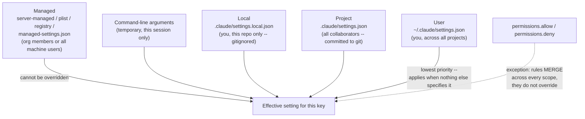
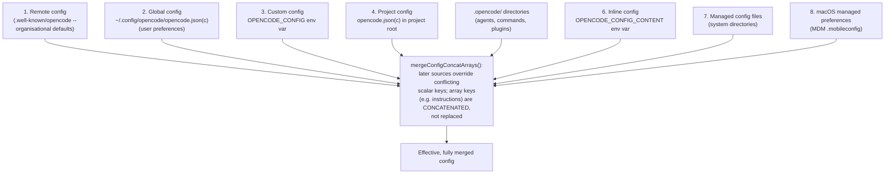
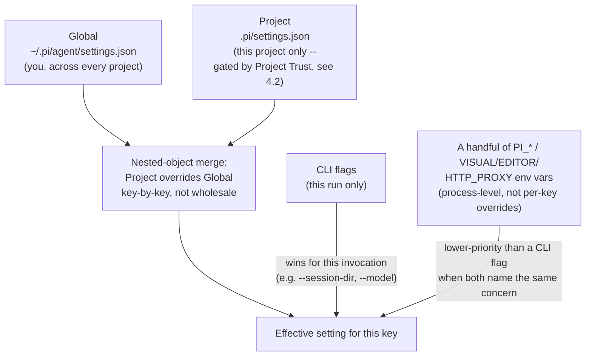

# Configuration -- Claude Code, GitHub Copilot CLI, OpenCode, and pi

**Scope note.** This page is about the **general settings/config-file
system** each harness reads on startup and during a session: where the
config files live, how many scopes exist (user/global, project/repo,
local, managed/enterprise), what order they resolve in when the same
key is set twice, the major key categories those files expose (model
selection, the permission engine, hooks wiring, environment variables,
feature toggles, UI/display), and what CLI flags and environment
variables layer on top. It is a distinct axis from four other pages
that each own their own narrower configuration surface: MCP server
registration and its own config precedence lives in
[mcp-integration.md](mcp-integration.md) §1.1/§2.1; instruction-file
hierarchies (`CLAUDE.md`, `.instructions.md`, `AGENTS.md`) live in
[memory-management.md](memory-management.md) and
[instruction-context-budget.md](instruction-context-budget.md); the
tool-permission *vocabulary* (what a "kind" like `shell`/`write`/`read`
means, which tools prompt by default) lives in
[built-in-tools.md](built-in-tools.md); this page instead covers the
permission-rule *configuration mechanism* itself -- the file format,
scope, and merge behavior that those per-tool rules are written into.

Every claim is tagged VERIFIED (fetched this session) or BEST CURRENT
UNDERSTANDING, UNCONFIRMED. Claude Code, Copilot CLI, OpenCode, and pi
(Earendil Works) are four separate products from four separate
organizations/authors; a configuration behavior confirmed for one is never
assumed to hold for another without its own citation.

---

## 1. Claude Code

Primary source: `code.claude.com/docs/en/settings`, fetched fresh this
session (2026-07-31). Cross-referenced against
`github.com/anthropics/claude-code` `CHANGELOG.md` (fetched fresh this
session via `gh api repos/anthropics/claude-code/contents/
CHANGELOG.md`, full 5,248-line file, grepped for `settings.json`,
`managed-settings`, `config.json`, and individual key names). VERIFIED
unless tagged otherwise.

### 1.1 Scopes and file locations



Four scopes, from the docs' own table: **Managed** (server-managed,
plist/registry, or `managed-settings.json`, affecting either
organisation members or all users of a machine, deployed by IT and
never overridable by the user), **User** (`~/.claude/settings.json`,
`%USERPROFILE%\.claude` on Windows -- applies to you across every
project, not shared with a team), **Project**
(`.claude/settings.json` at the repository root, committed to git,
shared with every collaborator), and **Local**
(`.claude/settings.local.json` at the repository root, gitignored --
you, in this repository only).

The docs state the precedence order in two places, and the two
statements are worth flagging as a real, checked inconsistency in the
fetched source rather than smoothed over: one passage lists
"Managed (highest) -- cannot be overridden" followed by "Command-line
arguments -- temporary session overrides," then Local, Project, User;
a second passage, in the CLI-flags section of the same page, instead
opens with "CLI flags (highest)" followed by Managed. **BEST CURRENT
UNDERSTANDING, UNCONFIRMED reconciliation:** the phrase "cannot be
overridden" attached specifically to Managed settings, combined with
Managed being the only scope both passages agree is never beaten,
suggests Managed acts as an enforced ceiling/floor on the *specific
keys it sets* (a locked-down policy value stays locked down no matter
what a CLI flag requests), while for any key Managed does not touch, a
CLI flag is the most immediate override layered on top of
Local/Project/User. The docs page itself does not state this
reconciliation explicitly -- it is inferred, not fetched verbatim, and
is flagged as such rather than asserted as settled fact.

Exactly one exception to "later scope wins" is stated plainly:
**permission rules merge across scopes rather than override** --
an `allow`/`deny` entry set at the User level and a different entry
set at the Project level are both applied, not one replacing the
other. This is a structurally different merge policy from every other
key category on the page, and it recurs, independently, as a named
design choice in Copilot CLI's own repository-settings merge policy
(§2.3) and in OpenCode's explicit "configuration files are merged
together, not replaced" doc line (§3.1) -- three harnesses, three
independently documented instances of preferring an additive merge
over a scope-wins-outright replacement for at least part of their
config surface.

### 1.2 Major key categories

The settings file is JSON, with an optional
`"$schema": "https://json.schemastore.org/claude-code-settings.json"`
line for editor autocomplete. Keys fall into named clusters
(non-exhaustive, but covering every cluster the docs page itself
groups keys into):

- **Permissions:** `permissions.allow`/`permissions.deny`, arrays of
  rule strings like `"Bash(npm run lint)"` or `"Read(./secrets/**)"`.
- **Environment:** `env`, a flat string map applied to every session
  and to every subprocess Claude Code spawns -- but not to Claude
  Code's own terminal UI (`NO_COLOR`/`FORCE_COLOR` set here reach only
  subprocesses; set them in the launching shell to affect the CLI's
  own interface). Setting a key to `""` overrides an inherited shell
  export with an explicit empty value.
- **Model:** `model` (read once at session start; `/model` switches
  mid-session without a restart), `advisorModel`, `availableModels`,
  `enforceAvailableModels`, `fallbackModel` (up to three fallback
  models tried in order on overload/unavailability -- added v2.1.166,
  per `CHANGELOG.md`, alongside "Claude Code now retries a turn once
  on the fallback model when the API rejects an unexpected
  non-retryable error"; see [retries.md](retries.md) §1.5 for the
  retry-policy half of this key), `effortLevel`.
- **API/authentication:** `apiKeyHelper` (a custom command producing
  the value sent as both `X-Api-Key` and `Authorization: Bearer`),
  `awsAuthRefresh`, `awsCredentialExport`.
- **Hooks:** `hooks` itself, plus `allowedHttpHookUrls`,
  `allowManagedHooksOnly`, `disableAllHooks` -- this page covers only
  where hook *configuration* lives and how it is scoped/merged, not
  hook event semantics or payload shapes.
- **Attribution/git:** `attribution.commit`/`attribution.pr`,
  `includeCoAuthoredBy`.
- **File management:** `cleanupPeriodDays` (default 30; as of a later
  change traced in §1.6, `0` is rejected rather than silently
  disabling transcript persistence), `fileCheckpointingEnabled`,
  `autoMemoryEnabled`, `autoMemoryDirectory`.
- **UI/display:** `tui` (`"fullscreen"`/`"classic"`),
  `axScreenReader`, `autoScrollEnabled`, `spinnerTipsEnabled`,
  `awaySummaryEnabled`, `editorMode` (`"normal"`/`"vim"`),
  `emojiCompletionEnabled`.
- **Agent/subagent:** `agent` (run the main thread itself as a named
  subagent), `disableAgentView`.
- **Feature toggles:** `disableArtifact`/`enableArtifact`,
  `disableBundledSkills`, `disableWorkflows`,
  `disableClaudeAiConnectors`, `fastMode`, `alwaysThinkingEnabled`.
- **MCP server governance:** `allowedMcpServers`/`deniedMcpServers`,
  `allowManagedMcpServersOnly`, `enableAllProjectMcpServers`,
  `disabledMcpjsonServers`/`enabledMcpjsonServers` -- the config
  *keys* live here; discovery/registration mechanics live in
  [mcp-integration.md](mcp-integration.md) §1.1.
- **Auto mode:** a nested `autoMode` object with `environment`,
  `allow`, `soft_deny`, `hard_deny` arrays, each of which can include
  the literal string `"$defaults"` to extend the built-in rule set
  instead of replacing it wholesale, plus a separate top-level
  `autoMode.classifyAllShell` boolean. `CHANGELOG.md` corroborates
  both the extension mechanism ("include `$defaults` in
  `autoMode.allow`... to add custom rules alongside the built-in list
  instead of replacing it") and the classifier-scope flag
  ("`autoMode.classifyAllShell` setting to route all Bash/PowerShell
  commands through the auto-mode classifier instead of only
  arbitrary-code-execution patterns").
- **Marketplace/plugin restriction (managed-only):**
  `strictKnownMarketplaces`, `blockedMarketplaces`,
  `allowedChannelPlugins`.
- **Managed-only:** `allowManagedPermissionRulesOnly`,
  `allowManagedHooksOnly`, `claudeMd`/`claudeMdExcludes` (organisation-
  injected memory -- see [memory-management.md](memory-management.md)
  §1 for the memory-loading mechanics this key feeds),
  `companyAnnouncements`.

### 1.3 CLI flags and environment variables as session-level layers

CLI flags are described as temporary, session-scoped overrides:
`claude --model claude-opus-4-1 --permission-mode ask`,
`claude --effort xhigh --fallback-model claude-haiku-4-5`. Named flags
include `--model`, `--permission-mode` (`ask`/`auto`/`manual`),
`--effort` (`low`/`medium`/`high`/`xhigh`), `--fallback-model`,
`--settings` (load an additional user-scoped settings file --
`CHANGELOG.md` records this combined with `--bare` for
hooks/LSP/plugin-sync-free scripted `-p` calls, "requires
`ANTHROPIC_API_KEY` or an `apiKeyHelper` via `--settings`"),
`--mcp-config`, and `--plugin-dir`/`--plugin-url` for sideloading,
which a managed `disableSideloadFlags` policy can block outright.

Environment variables set in the `env` block of a settings file are
distinct from environment variables set in the *shell* before `claude`
is launched -- the docs' own worked example is instructive:
`NO_COLOR`/`FORCE_COLOR` placed in settings-file `env` only reach
spawned subprocesses, never Claude Code's own rendering, and
`CHANGELOG.md` records this exact boundary being enforced as a fix
("Fixed `NO_COLOR`/`FORCE_COLOR` in settings.json `env` stripping
Claude Code's own UI colors -- they now apply to subprocesses only").
The docs additionally state that certain identity-carrying environment
variables (their own example: `CLAUDE_CODE_REMOTE`,
`CLAUDE_CODE_ACCOUNT_UUID`) are ignored when set via the environment
rather than resolved through Claude Code's own account/session state
-- this specific claim is sourced to the settings docs page only; this
session's grep of `CHANGELOG.md` did not independently turn up a
matching dated entry, so it is presented as VERIFIED-from-docs without
an independent changelog cross-confirmation (contrast with the
`NO_COLOR` fix above, which does have one).

### 1.4 Reload semantics: what applies without a restart

The docs state plainly that Claude Code watches its settings files and
reloads most keys live: `permissions`, `hooks`, and `apiKeyHelper`
reload immediately on edit, while `model` and `outputStyle` require
`/clear` or a full restart to take effect. `CHANGELOG.md` supplies
several dated data points that sharpen and, in places, contradict the
docs' own two-bucket simplicity, worth reading as a history of a
feature that shipped incrementally rather than as a single design
decision:

- A generic **hot-reload symlink bug** class was fixed twice at
  different layers: "Fixed settings changes (such as `/effort` or
  `/model`) failing with ENOENT when `~/.claude/settings.json` is a
  relative symlink under a symlinked `~/.claude`" and, separately,
  "Fixed settings hot-reload not detecting edits to symlinked
  `~/.claude/settings.json`" -- i.e., `/model` reloading live via
  settings-file edits is itself a real, working mechanism the docs'
  own "requires restart" claim does not fully capture; it may be more
  precise to say `model` set via `/model` persists to and reloads from
  `settings.json` live, while the docs' "read once at session start"
  framing describes only the *initial* resolution at boot, not every
  subsequent settings-file edit.
- **`/config` settings persistence** was itself a shipped feature, not
  an assumed default: "`/config` settings (theme, editor mode, verbose,
  etc.) now persist to `~/.claude/settings.json` and participate in
  project/local/policy override precedence."
- **`/model` selection persistence across restarts** was hardened
  separately from the settings-file mechanism above: "selections now
  persist across restarts even when the project pins a different
  model, and the startup header shows when the active model comes from
  a project or managed-settings pin" -- evidence the precedence chain
  in §1.1 is genuinely surfaced to the user at startup, not just
  applied silently.
- **Background/daemon-dispatched sessions did not always inherit live
  settings**, a distinct and later-fixed gap from the interactive-session
  reload path: "Fixed background sessions ignoring `effortLevel`
  changes in settings.json when forked through the daemon" and "Fixed
  background sessions dispatched from `claude agents` booting on a
  stale model from the daemon's environment instead of the model in
  `settings.json`."
- **Malformed-file resilience was hardened incrementally, not shipped
  complete from the start:** "Fixed a malformed hooks entry in
  `settings.json` no longer invalidating the entire file," "Fixed
  invalid legacy enum values in `settings.json` invalidating the
  entire settings file," "Improved settings resilience: an
  unrecognized hook event name in `settings.json` no longer causes the
  entire file to be ignored," and "Fixed crash when `settings.json`
  `env` values are numbers instead of strings" -- four separate,
  dated fixes to the same underlying property (one bad key should not
  silently disable an entire settings file), plus a parse-failure UX
  fix in the VS Code extension specifically ("Added a warning banner
  when `settings.json` files fail to parse, so users know their
  permission rules are not being applied"). Managed settings parse
  even more tolerantly by explicit design, per the docs: invalid
  entries are stripped and recorded as warnings rather than
  invalidating the whole managed-settings file, surfaced via
  `claude doctor`/`/doctor`.
- A genuinely subtle bug class, **permission-rule names colliding with
  JavaScript prototype properties**, was fixed and then apparently
  needed re-fixing one version later: "Fixed permission rules with
  names matching JavaScript prototype properties (e.g. `toString`)
  causing `settings.json` to be silently ignored" appears verbatim at
  both v2.1.97 and v2.1.98 in `CHANGELOG.md`, and the adjacent
  "Fixed managed-settings allow rules remaining active after an admin
  removed them, until process restart" fix appears verbatim at the
  same two consecutive versions as well -- the same paired pattern
  [retries.md](retries.md) §1.4 documents for a backoff-math fix that
  needed a later revert/re-fix, here applied to two configuration-file
  robustness bugs instead of a retry policy.

### 1.5 Migration and structural history, traced through `CHANGELOG.md`

Configuration in Claude Code was not always `settings.json`-centric.
Reading the changelog oldest-to-newest on this specific axis:

- **v1.0.7 and v2.0.8** (oldest entries this session's grep surfaced):
  "Migrated `allowedTools` and `ignorePatterns` from `.claude.json` ->
  `settings.json`," "Deprecated `claude config` commands in favor of
  editing `settings.json`" (v1.0.7), and, later, the deprecated
  `.claude.json` keys (`allowedTools`, `ignorePatterns`, `env`,
  `todoFeatureEnabled`) were removed outright at v2.0.8, "instead,
  configure these in your `settings.json`" -- a full, multi-version
  migration off an older `.claude.json` config file onto today's
  `settings.json`, mirroring (independently) the `.github/copilot/
  config.json` -> `settings.json` rename Copilot CLI's own changelog
  records at a comparable point in its history (§2.6).
- **v2.1.0:** two structural additions land together --
  `respectGitignore` "for per-project control over @-mention file
  picker behavior," and support for "disabling specific agents using
  `Task(AgentName)` syntax in settings.json permissions or the
  `--disallowedTools` CLI flag" -- the latter is a concrete example of
  the permission-rule-string vocabulary (§1.2) being extended to name
  a *subagent*, not only a tool.
  vocabulary extending beyond raw tool names into agent identity.
- **v2.1.49:** "Plugins can ship `settings.json` for default
  configuration" -- config authorship extends beyond the four
  user/project/local/managed scopes in §1.1 to a fifth source, a
  plugin's own bundled defaults, layered presumably beneath explicit
  user/project settings (the changelog entry does not state the exact
  precedence slot this occupies relative to §1.1's five-scope
  diagram; flagged as BEST CURRENT UNDERSTANDING, UNCONFIRMED on that
  specific ordering point).
- **v2.1.75:** "Breaking change: Removed deprecated Windows managed
  settings fallback at `C:\ProgramData\ClaudeCode\managed-settings.json`
  -- use `C:\Program Files\ClaudeCode\managed-settings.json`" --
  corroborated independently by an earlier deprecation notice at
  v2.1.34's era in the same file ("Deprecated Windows managed settings
  path... administrators should migrate"), confirming this was a
  telegraphed removal, not a silent breaking change.
- **v2.1.83:** "Added `managed-settings.d/` drop-in directory alongside
  `managed-settings.json`, letting separate teams deploy independent
  policy fragments that merge alphabetically" -- the managed scope
  itself grows an internal multi-file merge mechanism, distinct from
  (and one layer beneath) the four-scope merge in §1.1.
- **v2.1.92:** "Added `forceRemoteSettingsRefresh` policy setting: when
  set, the CLI blocks startup until remote managed settings are freshly
  fetched, and exits if the fetch fails (fail-closed)" -- a managed-only
  key that changes Claude Code's own startup *availability* semantics
  around config resolution, not just its content.

### 1.6 Cross-reference: what this section deliberately does not cover

Hook *event* semantics (matchers, blocking behavior, payload schemas)
are a large enough surface that this page only covers where their
*configuration* lives (`hooks` key, `allowedHttpHookUrls`,
`allowManagedHooksOnly`, `disableAllHooks`) and how that configuration
is scoped and merged -- not what a hook receives or returns. Likewise,
`.mcp.json`/MCP server config precedence is covered in full in
[mcp-integration.md](mcp-integration.md) §1.1, and the specific
permission-rule *string grammar* (`Bash(npm run lint)`,
`Read(./.env)`) and what tool "kinds" it can target is covered from
the tool-surface side in [built-in-tools.md](built-in-tools.md).

---

## 2. GitHub Copilot CLI

Sources: `docs.github.com/en/copilot/reference/copilot-cli-reference/
cli-config-dir-reference` and `docs.github.com/en/copilot/reference/
copilot-cli-reference/cli-programmatic-reference`, both fetched fresh
this session (2026-07-31), cross-referenced against
`github.com/github/copilot-cli` `changelog.md` (fetched fresh this
session via `gh api repos/github/copilot-cli/contents/changelog.md`,
full 2,898-line file, grepped for `settings.json`, `config.json`,
`COPILOT_HOME`, `/settings`, and individual key names). VERIFIED unless
tagged otherwise. Copilot CLI is closed source -- everything below is
inferred from documented behavior and the product's own changelog,
never from an implementation file, the same standing caveat this
project's other pages apply to Copilot CLI.

### 2.1 Configuration directory layout

Default location: `~/.copilot` (`$HOME/.copilot`), overridable with
`COPILOT_HOME`. The cache directory is separate and follows platform
convention (`~/Library/Caches/copilot` on macOS,
`$XDG_CACHE_HOME/copilot` on Linux, `%LOCALAPPDATA%/copilot` on
Windows). Files and directories inside `~/.copilot`, per the docs:

| Path | Role |
|---|---|
| `settings.json` | Primary user-editable configuration (JSON with comments supported); edit directly or via `/settings` |
| `config.json` | Auto-managed internal application state (auth data, installed-plugin metadata, runtime info) -- do not hand-edit |
| `copilot-instructions.md` | Personal global custom instructions, same mechanism as repo-level instruction files but user-scoped |
| `mcp-config.json` | User-level MCP server definitions; project-level config wins on a name conflict |
| `lsp-config.json` | User-level Language Server Protocol servers (`/lsp`) |
| `permissions-config.json` | Saved tool/directory permission decisions, keyed by project location |
| `agents/`, `skills/`, `hooks/`, `extensions/`, `instructions/` | Personal custom-agent, skill, hook, extension, and additional instruction-file definitions |
| `session-state/`, `command-history-state/`, `session-store.db`, `logs/` | Session/command history and debug logs |
| `ide/`, `mcp-oauth-config/`, `mcp-secrets/`, `installed-plugins/`, `plugin-data/` | Auto-managed integration/plugin state -- do not hand-edit |

### 2.2 `settings.json` key categories

Settings apply in this documented priority order: **built-in defaults
-> MDM managed settings -> user settings (`~/.copilot/settings.json`)
-> repository settings -> local settings -> environment variables ->
command-line flags** -- a six/seven-link chain that, notably, puts
environment variables and CLI flags *above* both repository and local
file-based config, a materially different ordering from Claude Code's
own precedence chain in §1.1 (there, CLI flags are a session-level
override but Managed settings are still the one scope described as
un-overridable regardless of flag). Key categories the docs enumerate:

- **Interface/display:** `theme` (`"default"`/`"github"`/`"dim"`/
  `"high-contrast"`/`"colorblind"`), `renderMarkdown`, `showTimestamps`,
  `scrollbar`, `mouse`.
- **Model/performance:** `model` (`"auto"` for automatic selection),
  `effortLevel`, `stream`, `contextTier` (`"default"`/`"long_context"`).
- **Permissions/security:** `allowedUrls`/`deniedUrls`,
  `sandbox.enabled`, `permissions.disableBypassPermissionsMode`.
- **Agent behaviour:** `askUser`, `stayInAutopilot`,
  `continueOnAutoMode` (see [retries.md](retries.md) §2.2 for this
  key's retry-mitigation role), `subagents.maxDepth` (default 6),
  `subagents.maxConcurrency`, `subagents.disabledSubagents`.
- **History/data:** `commandHistoryMaxSize` (1-1000, default 50),
  `remote`, `remoteExport`.
- **Developer tools:** `hookSearch`, `toolSearch`, `dynamicRetrieval`,
  `skillDirectories`.
- **System integration:** `proxyUrl`, `proxyKerberosServicePrincipal`,
  `bashEnv`, `powershellFlags`, `ide.autoConnect`, `keepAlive`.
- **Customisation:** `hooks` (inline user-level hook definitions),
  `companyAnnouncements`, `pinnedPrompts`, `footer`, `statusLine`.

### 2.3 Repository, local, and managed layers

`.github/copilot/settings.json` is the shared, git-committed
repository config. Its supported-keys list is explicitly bounded, not
open-ended: `companyAnnouncements`, `contextTier`, `deniedUrls`,
`disableAllHooks`, `disabledMcpServers`, `disabledSkills`,
`effortLevel`, `enabledPlugins`, `extraKnownMarketplaces`, `hooks`,
`includeCoAuthoredBy`, `mergeStrategy`, `model`, `respectGitignore` --
and merge policy for these varies per key: "some allow repository
override, whilst others prevent removal of restrictions," a per-key
merge nuance echoing Claude Code's blanket permission-rule merge
exception in §1.1, but implemented here at finer, per-key granularity
rather than as one uniform carve-out. `.github/copilot/
settings.local.json` uses the identical schema and takes precedence
over the committed file, mirroring Claude Code's
`settings.local.json`/`settings.json` local-vs-project split by name
(§1.1) -- and `changelog.md` records the CLI directly reading Claude
Code's own repo-scoped files as an interop measure, not merely an
analogous naming convention: "Read `.claude/settings.json` and
`.claude/settings.local.json` as additional repo config sources," and,
separately, "Plugin commands read `extraKnownMarketplaces` from
project-level `.claude/settings.json` for Claude compatibility" --
Copilot CLI's own settings resolution actively consults a
Claude-Code-authored file on disk when present, a genuine
cross-harness config-compatibility measure this session found no
equivalent of in the other direction (Claude Code's own docs and
changelog, fetched in §1, describe no comparable reading of a Copilot
CLI config file).

A separate allowlist file, `.github/allowed_models.txt`, restricts
which *built-in* models a repository may use (plain-text, one
pattern per line, glob support such as `claude-sonnet-*`, a required
`fallback:` directive) -- BYOK (bring-your-own-key) models are
explicitly never filtered by it.

### 2.4 MDM-managed settings

IT administrators push a device- or org-wide baseline via MDM rather
than per-user config: macOS (`com.github.copilot` plist or
`/Library/Application Support/GitHubCopilot/managed-settings.json`),
Windows (`HKLM\SOFTWARE\Policies\GitHubCopilot` registry or
`%ProgramFiles%\GitHubCopilot\managed-settings.json`), Linux
(`/etc/github-copilot/managed-settings.json`). Supported managed keys:
`allowedMcpServers`/`deniedMcpServers` (deny always wins),
`enabledPlugins`, `extraKnownMarketplaces`, `model`, `permissions`
(including `disableBypassPermissionsMode`), `remoteControl`,
`shellShortcut`, `strictKnownMarketplaces`, `telemetry`. Long-running
sessions **re-fetch managed settings hourly**, letting a policy change
propagate without a restart -- a live-reload guarantee the docs state
for managed config specifically, distinct from (and, per this
session's research, more explicitly documented than) any equivalent
guarantee for Claude Code's own managed-settings refresh cadence in
§1.

### 2.5 CLI flags and environment variables

Flags relevant to configuration and permissions: `-p PROMPT`
(non-interactive), `-s` (suppress decoration), `--no-ask-user`,
`--add-dir=DIRECTORY`, `--allow-all-paths`, `--allow-all`/`--yolo`
(equivalent to `--allow-all-tools --allow-all-paths --allow-all-urls`),
`--allow-all-tools`, `--allow-all-urls`, `--allow-tool=TOOL`,
`--allow-url=URL`, `--deny-tool=TOOL`, `--secret-env-vars=VAR`,
`--model=MODEL`, `--agent=AGENT`, `--share=PATH`/`--share-gist`.
Environment variables: `COPILOT_ALLOW_ALL`, `COPILOT_MODEL`,
`COPILOT_HOME`, and an authentication-token precedence chain --
`COPILOT_GITHUB_TOKEN` (highest), then `GH_TOKEN`, then `GITHUB_TOKEN`
(lowest) -- a three-tier fallback distinct from, but structurally
analogous to, the multi-scope settings precedence chains both this
section and §1.1 otherwise describe. `--config-dir=DIRECTORY` still
works but is documented as legacy in favor of `COPILOT_HOME`,
corroborated by `changelog.md`: "`--config-dir` now propagates
correctly to plugin subcommands; `--config-dir` is deprecated in
favor of `COPILOT_HOME`," and, later, "`COPILOT_HOME` and
`--config-dir` stop loading skills from `~/.agents/skills`" -- a
concrete, dated narrowing of what the legacy flag still does.

### 2.6 Structural and migration history, traced through `changelog.md`

Reading `changelog.md` oldest-to-newest on this axis (it is itself
newest-first):

```mermaid
stateDiagram-v2
    state "0.0.340 (2025-10-13)<br/>~/.copilot/mcp-config.json env-var\nsyntax changes (literal to $-prefixed refs)" as Era1
    state "0.0.342 (2025-10-15)<br/>persistent log_level in ~/.copilot/config" as Era2
    state "0.0.421 (2026-03-03)<br/>repo config: .github/copilot/config.json" as Era3
    state "0.0.422 (2026-03-05)<br/>repo config RENAMED config.json -> settings.json;\nlaunch_messages -> companyAnnouncements" as Era4
    state "1.0.8 (2026-03-18)<br/>hooks definable across settings.json,\nsettings.local.json, config.json" as Era5
    state "1.0.12 (2026-03-26)<br/>reads .claude/settings.json +\nsettings.local.json as extra repo sources" as Era6
    state "1.0.35 (2026-04-23)<br/>~/.copilot/settings.json SPLIT from\ninternal ~/.copilot/config.json" as Era7
    state "1.0.40/44 (2026-05-01/08)<br/>settings dashboard scope tabs;\ninvalid-URL parse hardening" as Era8
    state "1.0.57-1.0.72 (2026-06-01\nthrough 2026-07-20)<br/>/settings unified dialog absorbs\n/theme, /streamer-mode, /experimental" as Era9

    Era1 --> Era2: config gains its first named, persistent key
    Era2 --> Era3: repo-level (not just user-level) config begins
    Era3 --> Era4: repo config renamed to match the user-config filename
    Era4 --> Era5: hooks become definable across all three files
    Era5 --> Era6: cross-harness interop begins (reads Claude's own files)
    Era6 --> Era7: user settings formally separated from internal state
    Era7 --> Era8: dashboard UI and validation hardening
    Era8 --> Era9: settings surface consolidates into one command
```



- **0.0.340 (2025-10-13).** "Changed parsing of environment variables
  in MCP server configuration to treat the value of the `env` section
  as literal values," with a documented, one-time manual-migration
  requirement: existing `~/.copilot/mcp-config.json` entries needed a
  `$` prefix added to each `env` value to keep being treated as
  environment-variable references -- an explicit breaking-change
  migration note for a config *value syntax*, distinct from every
  file-location/rename change below.
- **0.0.342 (2025-10-15).** "Improved debug log collection convenience
  by adding a persistent `log_level` option in `~/.copilot/config`" --
  notably a bare `config` file (not yet `config.json` or
  `settings.json`), the earliest named persistent-config file this
  session's grep of the changelog surfaced.
- **0.0.421 (2026-03-03).** "Support repo-level config via
  `.github/copilot/config.json` for shared project settings like
  marketplaces and launch messages" -- repository-scoped configuration
  is introduced under the `config.json` name.
- **0.0.422 (2026-03-05), one day later.** "Rename repository config
  from `.github/copilot/config.json` to `settings.json`" and, in the
  same release, "Rename `launch_messages` config setting to
  `companyAnnouncements`" -- the repo-config filename settles on
  `settings.json` within 48 hours of its own introduction, and a key
  rename lands in the same release, evidence this period was active,
  fast-iterating config-schema design rather than a stable baseline
  being incrementally extended.
- **1.0.8 (2026-03-18).** "Support defining hooks in `settings.json`,
  `settings.local.json`, and `config.json`" -- three separate files
  named as valid hook-definition sources in the same release, the
  clearest single data point this session found for how loosely
  bounded Copilot CLI's own config-file surface was at this point
  relative to the tighter, single-canonical-file-per-scope model
  Claude Code's docs describe in §1.1.
- **1.0.12 (2026-03-26).** "Read `.claude/settings.json` and
  `.claude/settings.local.json` as additional repo config sources" --
  the cross-harness interop measure already named in §2.3, dated here
  to its introduction.
- **1.0.35 (2026-04-23).** "User settings are now stored in
  `~/.copilot/settings.json`, separate from internal state in
  `config.json`" -- the user-level split (distinct from, and four
  months later than, the repo-level rename at 0.0.422) that produces
  the two-file user-config/internal-state layout §2.1 describes as
  current. This is also the point at which "internal application
  state" as a formally separate concern from "your personal
  configuration settings" becomes an explicit, named design line
  rather than an implicit one.
- **1.0.40 (2026-05-01) through 1.0.44 (2026-05-08).** Dashboard and
  validation maturity: "Add `--repo` and `--local` flags to `/settings`
  and `/model`," "Add Repo and Repo (local) scope tabs to the
  `/settings` dashboard," and "On startup, an invalid `settings.json`
  now shows a warning identifying the offending value instead of
  silently ignoring your settings," plus "Invalid URL entries in
  `settings.json` no longer crash CLI startup and are skipped with a
  warning" -- the same malformed-file-resilience pattern
  [§1.4](#14-reload-semantics-what-applies-without-a-restart) documents
  independently for Claude Code, here dated across a comparable
  multi-release hardening arc rather than a single fix.
- **1.0.57 (2026-06-01) through 1.0.72 (2026-07-20).** The `/settings`
  command itself absorbs what were previously separate, scattered
  slash commands: "Consolidate color palette settings under
  `/settings theme`," "Save custom status line commands in
  `/settings`," "Add `/settings` interactive dialog to browse and edit
  all user settings in one place," culminating in the GitHub Changelog
  blog post this session found via search (not independently fetched,
  named here only as a consistent title match): "Copilot CLI: Configure
  everything from one place with `/settings`" -- a UI consolidation
  distinct from, but running in parallel with, the file-format
  migrations above.

---

## 3. OpenCode

Sources: `opencode.ai/docs/config/` and `opencode.ai/docs/permissions/`,
both fetched fresh this session (2026-07-31); and
`github.com/anomalyco/opencode`, `dev` branch, fetched live via `gh api`
this session -- flagging per this project's standing caveat that `dev`
is not a stable release tag and this code may not reflect the current
stable release. Unlike Claude Code and Copilot CLI, the merge/loading
mechanics in §3.1 and the permission-substitution mechanics in §3.3 are
verified directly from source, not only from documentation.

### 3.1 Config files and merge order



Documented load order, later sources overriding earlier ones on
conflicting scalar keys: remote config (an organisation's
`.well-known/opencode` endpoint), global config
(`~/.config/opencode/opencode.json` or `.jsonc`, JSON-with-comments
supported), a custom config path named by the `OPENCODE_CONFIG`
environment variable, project config (`opencode.json`/`.jsonc` in the
project root), `.opencode` directories (agents/commands/plugins
discovery), inline config supplied directly via the
`OPENCODE_CONFIG_CONTENT` environment variable, managed config files in
system directories, and finally macOS MDM-deployed `.mobileconfig`
managed preferences. The docs state the governing principle directly:
"Configuration files are merged together, not replaced" -- and this
session's source read of `packages/opencode/src/config/config.ts`
(26,924 bytes, full file structure enumerated via `gh api`) confirms
the mechanism by name: `mergeConfigConcatArrays()`, which concatenates
array-valued keys (the docs' own worked example is an `instructions`
array) rather than letting a later source's array wholesale replace an
earlier one's, while still letting later sources override conflicting
*scalar* keys outright. A worked example from the docs: a global
`autoupdate: true` combined with a project-level
`model: "anthropic/claude-sonnet-4-5"` produces both settings present
together in the final resolved config, not one discarding the other.
Global config also transparently migrates a legacy TOML `config` file
to JSON on load, per the source. Project-config loading can be disabled
outright via `OPENCODE_DISABLE_PROJECT_CONFIG`, per the source (not
stated on the public docs page this session fetched).

Config-related source files this session enumerated directly under
`packages/opencode/src/config/` (via `gh api
repos/anomalyco/opencode/contents/...`): `config.ts` (the loader/merge
logic itself), `agent.ts` (agent-mode config, each parsed mode assigned
a `mode: "primary"` designation before merge), `command.ts` (custom
slash-command templates), and `entry-name.ts`.

### 3.2 Major schema keys

Per the docs, non-exhaustively: `model`/`small_model` (`provider/model`
string format, e.g. `"anthropic/claude-sonnet-4-5"`), `provider`
(per-provider timeout/auth config), `shell`, `agent`/`default_agent`/
`subagent_depth`, `command`, `tools` (enable/disable specific tools),
`permission` (§3.3), `theme`/`keybinds`, `server` (port, hostname,
mDNS, CORS), `formatter`, `lsp`, `mcp` (server-integration reference is
covered from the MCP-config-precedence side in
[mcp-integration.md](mcp-integration.md), not duplicated here),
`instructions` (paths/globs -- the instruction-*loading* mechanics this
key feeds are covered in
[instruction-context-budget.md](instruction-context-budget.md) rather
than here), `attachment.image`, `experimental.policies`,
`disabled_providers`/`enabled_providers`.

### 3.3 Variable substitution inside config files

Two placeholder forms, both resolved before the config is parsed, per
the docs and confirmed by name in source
(`ConfigVariable.substitute()`, per this session's fetch of
`config.ts`): `{env:VARIABLE_NAME}` substitutes an environment
variable's value (e.g. `"apiKey": "{env:ANTHROPIC_API_KEY}"`), and
`{file:path/to/file}` inserts a file's contents, resolved relative to
the config directory and supporting relative, absolute, and `~` paths
(e.g. `"instructions": ["{file:./guidelines.md}"]`). The source
distinguishes a "virtual substitution" path (used for remote-config
URLs/headers) from a "path substitution" path (used for file
references) as two separately implemented resolution routines within
the same function, per this session's fetch.

### 3.4 Permission configuration schema

Per `opencode.ai/docs/permissions/`, fetched fresh this session, and
cross-checked directly against source
(`packages/opencode/src/config/config.ts`, which imports
`ConfigPermissionV1` from `@opencode-ai/core/v1/config/permission`).
The `permission` config key resolves every gated action to one of
three states -- `"allow"` (execute without approval), `"ask"` (prompt),
`"deny"` (block) -- across permission categories that include file
operations (`read`, `edit`, `glob`), system access (`bash`, `grep`,
`webfetch`, `websearch`), and advanced categories (`task` for
subagents, `skill` for skill loading, `lsp`, `question`,
`external_directory`, `doom_loop`).

Two configuration shapes are supported: a flat shorthand
(`{"permission": {"*": "ask", "bash": "allow", "edit": "deny"}}`) and a
granular, per-category object with its own internal glob patterns and
last-match-wins evaluation (e.g.
`{"permission": {"bash": {"*": "ask", "git *": "allow", "rm *":
"deny"}}}`), where `*` matches zero or more characters, `?` matches
exactly one, and `~`/`$HOME` expand to the home directory. Two
categories carry their own specific default behavior worth naming
individually: `external_directory` (default `"ask"`) gates access
*outside* the current project working directory, and `doom_loop`
(default `"ask"`) is a repeated-identical-tool-call guard that
triggers once the same call repeats three times -- the same `doom_loop`
guard [built-in-tools.md](built-in-tools.md) §3 names from the
tool-surface side, here shown from the configuration side as an
ordinary, overridable permission key rather than a hardcoded, always-on
behavior.

Per-agent permission overrides merge with, and take precedence over,
the global `permission` block -- `{"agent": {"build": {"permission":
{"edit": "deny", "bash": "allow"}}}}` narrows or loosens specific
categories for one named agent mode without needing to restate the
entire global policy. Beyond the file-based config, this session's
source read of `config.ts` additionally found a live environment-variable
override not documented on the fetched docs page: `Flag.OPENCODE_PERMISSION`,
parsed as JSON and merged over the file-resolved permission object via
`mergeDeep()`, plus a second code path that derives a permission map
directly from a simpler enabled/disabled flag set
(`enabled ? "allow" : "deny"`) before that, too, is merged in via
`mergeDeep(perms, result.permission ?? {})` -- a source-only finding,
not stated in the fetched docs page, flagged as such.

### 3.5 What the docs page explicitly does not expose

`opencode.ai/docs/config/`, checked specifically this session, defines
no `retry`/`maxRetries`/`backoff` key (see [retries.md](retries.md)
§3.6 for that already-documented negative result) -- named again here
only to note the general pattern that some of OpenCode's real,
source-verified runtime behavior (retry policy, some permission
merge/override paths) is not fully surfaced on the public config docs
page, a gap this page's own source-level permission-override finding
in §3.4 adds a second, independent instance of.

---

## 4. pi

Sources for this section: VERIFIED, fetched 24 August 2026 directly from
`github.com/earendil-works/pi`'s `packages/coding-agent/docs/` tree
(`settings.md`, `environment-variables.md`, `usage.md`), the same repository
and branch (`main`) already cited for pi's sections in
[The LLM API contract](llm-api-contract.md) §3.5,
[Permissions & sandboxing architecture](permissions-and-sandboxing.md) §5,
[Model routing / selection](model-routing-and-selection.md) §4,
[Hooks and lifecycle extensibility](hooks-lifecycle-extensibility.md) §5,
[Session & transcript persistence](session-persistence.md), and
[Built-in skills](built-in-skills.md). pi is source-available
(`earendil-works/pi`) but this session again reads only its docs for this
specific page, the same standing caveat those other sections already state.

### 4.1 Two scopes, no managed/enterprise tier, and a stated recursive-merge rule



Per `settings.md`, pi recognizes exactly two settings-file scopes --
**global** (`~/.pi/agent/settings.json`, applying across every project) and
**project** (`.pi/settings.json`, this project only) -- a materially smaller
scope count than Claude Code's four (Managed/User/Project/Local, §1.1),
Copilot CLI's six/seven-link chain (§2.2), or OpenCode's eight-source chain
(§3.1). No managed/MDM/enterprise-policy tier is named anywhere in the
fetched docs, a genuine structural absence (not merely undocumented) worth
setting against the other three harnesses, all of which document some form
of centrally-pushed configuration floor (Claude Code's Managed scope, §1.1;
Copilot CLI's MDM-managed settings, §2.4; OpenCode's managed config files and
macOS `.mobileconfig` preferences, §3.1). The docs state the merge rule
directly with a fully worked example (reproduced in §4.6 below): project
settings override global settings, and **nested objects are merged
key-by-key** rather than one scope's whole object replacing the other's --
`{"compaction": {"reserveTokens": 8192}}` at the project level narrows only
`reserveTokens`, leaving `enabled: true` inherited from the global
`compaction` object untouched. This is a third, independently-arrived-at
instance of the additive-merge-over-wholesale-replacement design choice this
book has now found in all four harnesses examined on this page: Claude
Code's permission-rule union across scopes (§1.1), Copilot CLI's per-key
repo-merge nuance (§2.3), OpenCode's array-concatenating
`mergeConfigConcatArrays()` (§3.1), and pi's own key-by-key nested-object
merge here -- though pi's version operates on arbitrary nested settings
objects generally, not narrowly on permission rules (Claude Code) or
array-valued keys specifically (OpenCode).

### 4.2 Project trust: a config-loading gate layered in front of the project scope

Unlike the other three harnesses' scope models, pi's project scope is not
simply "another file that gets read" -- it is gated by a distinct **Project
Trust** mechanism the docs describe as a startup precondition, not a
permission-engine concern: on interactive startup, pi asks before trusting a
project folder that contains project-local settings, resources, or a
project `.agents/skills` directory, unless a saved decision for that folder
or a parent folder already exists in `~/.pi/agent/trust.json`. Trusting a
project is what actually enables `.pi/settings.json` and `.pi` resources to
load, missing project packages to install, and project extensions to
execute -- so the project half of §4.1's two-scope model is conditionally
present, not unconditionally read the way Claude Code's Project scope or
OpenCode's project config are. Before a trust decision resolves, pi still
loads context files, user/global extensions, and CLI `-e`-supplied
extensions specifically so they remain able to handle the `project_trust`
extension event (cross-referenced, not repeated, against
[hooks-lifecycle-extensibility.md](hooks-lifecycle-extensibility.md) §5's own
pi coverage for that event's payload); project-local extensions and project
settings load only once trust resolves. The same split applies again when a
resumed session's cwd differs from the process's already-resolved trust
state.

Non-interactive modes (`-p`, `--mode json`, `--mode rpc`) never show the
trust prompt at all; absent a saved decision, they fall back to a global
`defaultProjectTrust` setting (`"ask"` by default, `"always"`, or
`"never"`) -- `"ask"` and `"never"` both cause project resources to be
ignored in these modes (the practical difference is UX, not resource
loading), while `"always"` trusts unconditionally. `-a`/`--approve` and
`-na`/`--no-approve` override project trust for a single run of `pi` itself,
and the docs additionally state that `pi config` and package commands
(`pi install`/`pi update`/etc.) run through this identical trust flow with
the same per-invocation `--approve`/`--no-approve` override -- with one
named exception: `pi update` never prompts for or is gated by project trust
at all, regardless of setting. `/trust` in interactive mode persists a
decision to `~/.pi/agent/trust.json` (optionally including the immediate
parent folder), but the docs are explicit that this write does **not**
reload the current session -- a restart is required for the new trust
decision to take effect, a stricter, no-hot-path exception to the general
reload picture in §4.5 below. This whole mechanism is a config-loading
precondition, not pi's permission/sandboxing enforcement layer -- see
[permissions-and-sandboxing.md](permissions-and-sandboxing.md) §5.2 for the
full security-rationale treatment of the same mechanism from the
enforcement-architecture angle, not repeated here.

### 4.3 Major settings-file key clusters

`settings.md` groups `~/.pi/agent/settings.json`/`.pi/settings.json` keys
into named clusters, several of which this page cross-references to their
own dedicated treatment elsewhere rather than re-deriving:

- **Model & Thinking:** `defaultProvider`, `defaultModel`,
  `defaultThinkingLevel`, `hideThinkingBlock`, `showCacheMissNotices`,
  `thinkingBudgets` (per-thinking-level numeric token budgets, natively
  honored by Anthropic/Google/Bedrock and by OpenAI-compatible models only
  when a `compat.thinkingTokenBudgetField`/`supportsThinkingTokenBudget`
  override is set on that model's `models.json` entry) -- the full
  model-selection precedence stack these keys feed into is
  [model-routing-and-selection.md](model-routing-and-selection.md) §4's own
  territory, not repeated here.
- **UI & Display:** `theme`, `externalEditor` (Ctrl+G; takes precedence
  over `$VISUAL`/`$EDITOR`), `quietStartup`, `defaultProjectTrust` (§4.2,
  global-setting-only), `collapseChangelog`, `doubleEscapeAction`
  (`"tree"`/`"fork"`/`"none"`), `treeFilterMode`, `editorPaddingX`,
  `outputPad`, `autocompleteMaxVisible`, `showHardwareCursor`, `tuiMode`
  (`"regular"`/experimental `"fullscreen"`; also settable per-run via
  `--tui-mode`), `fullscreenExitOutput`, `fullscreenScrollbar`.
- **Telemetry and update checks:** `enableInstallTelemetry` (an anonymous
  install/update version ping to `https://pi.dev/api/report-install`;
  distinct from, and does not disable, the separate `pi.dev/api/
  latest-version` update check itself), `enableAnalytics` (opt-in, currently
  asked only during an experimental `PI_EXPERIMENTAL=1` first-time setup),
  `trackingId`. `PI_SKIP_VERSION_CHECK` and `--offline`/`PI_OFFLINE` are the
  corresponding environment-variable/flag-level disables (§4.4) -- a
  three-layer telemetry/update-check surface (settings key, dedicated
  skip-only env var, blanket offline env var/flag) worth setting alongside
  this book's separate, dedicated
  [Observability and self-diagnostics](observability-and-self-diagnostics.md)
  treatment of vendor telemetry generally (that page has no pi section as of
  this writing).
- **Network:** `httpProxy` (global-setting-only, applied as both
  `HTTP_PROXY` and `HTTPS_PROXY`).
- **Warnings:** `warnings.anthropicExtraUsage` (default `true`).
- **Compaction:** `compaction.enabled`, `compaction.reserveTokens` (default
  16384), `compaction.keepRecentTokens` (default 20000) -- the mechanism
  these keys tune is [context-compression.md](context-compression.md)'s own
  pi section, not repeated here; §4.6 below reuses this exact key as the
  worked project-override example.
- **Branch Summary:** `branchSummary.reserveTokens`,
  `branchSummary.skipPrompt` -- tunes the "Summarize branch?" prompt on
  `/tree` navigation, adjacent to but distinct from ordinary compaction.
- **Retry:** `retry.enabled`, `retry.maxRetries` (default 3),
  `retry.baseDelayMs` (default 2000, exponential 2s/4s/8s),
  `retry.provider.timeoutMs`, `retry.provider.maxRetries` (default `0`),
  `retry.provider.maxRetryDelayMs` (default 60000) -- the docs explicitly
  warn against raising `retry.provider.maxRetries` above `0` casually,
  since a provider/SDK-level retry can absorb an out-of-usage-limit error
  before pi's own agent-level retry logic ever observes it, potentially
  blocking the agent until the provider's quota resets; the full retry
  architecture this key cluster configures is
  [retries.md](retries.md)'s own pi section, not repeated here.
- **Message Delivery:** `steeringMode`/`followUpMode` (`"all"` or
  `"one-at-a-time"`, governing how queued Enter/Alt+Enter messages are
  delivered mid-turn), `transport` (`"sse"`/`"websocket"`/
  `"websocket-cached"`/`"auto"`), `httpIdleTimeoutMs`,
  `websocketConnectTimeoutMs`.
- **Terminal & Images:** `terminal.showImages`, `terminal.imageWidthCells`,
  `terminal.clearOnShrink`, `images.autoResize`, `images.blockImages`.
- **Shell:** `shellPath`, `shellCommandPrefix` (prepended to every bash
  command), `npmCommand` (an argv array overriding the package manager
  invocation for all npm operations, including git-package dependency
  installs -- user-scoped npm packages install under `~/.pi/agent/npm/`,
  project-scoped ones under `.pi/npm/`).
- **Tools:** `defaultTools` (a string array of built-in tools enabled at
  startup; an empty array starts with no built-in tools while still keeping
  extension/SDK custom tools enabled; a project-level `defaultTools` array
  replaces, rather than merges with, the global array -- an explicit,
  named exception to §4.1's general nested-object merge rule). `--tools`/
  `-t` imposes a strict allowlist overriding this setting entirely,
  `--no-tools`/`-nt` disables every tool, `--no-builtin-tools`/`-nbt`
  disables only the built-ins while preserving extension/custom tools, and
  `--exclude-tools`/`-xt` filters the resulting list afterward.
- **Sessions:** `sessionDir` (accepts absolute/relative/`~` paths) -- see
  §4.4 for its documented three-way precedence against `--session-dir` and
  `PI_CODING_AGENT_SESSION_DIR`, and
  [session-persistence.md](session-persistence.md)'s own pi section for the
  session-file format this directory holds.
- **Model Cycling:** `enabledModels` (a string array of model patterns for
  `Ctrl+P` cycling, same format as the `--models` CLI flag).
- **Markdown:** `markdown.codeBlockIndent`, `markdown.mermaid`
  (`"off"`/`"final"`/`"streaming"`).
- **Resources:** `packages` (npm/git package sources, string form loading
  every resource a package declares or object form filtering to specific
  named `skills`/`extensions`), `extensions`, `skills`, `prompts`, `themes`
  (each a string array of local paths/directories, glob-pattern-aware, with
  `!pattern` exclusion and `+path`/`-path` exact force-include/exclude),
  `enableSkillCommands` (registers skills as `/skill:name` commands, default
  `true`) -- resource *loading and discovery* semantics for this cluster are
  [built-in-skills.md](built-in-skills.md)'s own pi section's territory, not
  repeated here; this page covers only that they are configuration-file
  keys, scoped and merged the same way as every other cluster on this list.
  Paths in the global settings file resolve relative to `~/.pi/agent`; paths
  in the project settings file resolve relative to `.pi`.

### 4.4 CLI flags and environment variables

`usage.md`'s CLI Reference table documents flag clusters that map onto (and,
for several keys, directly override) the settings clusters in §4.3: **Model
Options** (`--provider`, `--model` -- accepting a bare pattern, a
`provider/id` pair, and an optional `:<thinking-level>` suffix,
`--api-key`, `--thinking`, `--models`, `--list-models`); **Session Options**
(`-c`/`--continue`, `-r`/`--resume`, `--session`, `--fork`, `--session-dir`,
`--no-session`, `--name`/`-n`); **Tool Options** (`--tools`/`-t`,
`--exclude-tools`/`-xt`, `--no-builtin-tools`/`-nbt`, `--no-tools`/`-nt`,
with the seven built-in tools named explicitly: `read`, `bash`, `edit`,
`write`, `grep`, `find`, `ls`); **Resource Options**
(`-e`/`--extension`, `--no-extensions`, `--skill`, `--no-skills`,
`--prompt-template`, `--no-prompt-templates`, `--theme`, `--no-themes`,
`--no-context-files`/`-nc`); and a residual **Other Options** cluster
(`--system-prompt`, `--append-system-prompt`, `--tui-mode`, `--use-theme`,
`--verbose`, `-a`/`--approve`, `-na`/`--no-approve`, `--`, `-h`/`--help`,
`-v`/`--version`). The docs state a general composability rule for the
Resource Options cluster specifically -- `--no-extensions` combined with an
explicit `-e ./my-extension.ts` loads *exactly* that one extension while
ignoring whatever `settings.json` would otherwise have discovered, i.e. the
`--no-*` flags and their positive counterparts are designed to be combined
in the same invocation to override settings-file discovery precisely,
rather than functioning only as blanket on/off switches.

`sessionDir` is the one setting whose CLI-flag/env-var/settings-file
precedence the docs state explicitly and completely, worth naming as a
concrete instance of a documented resolution order that most other
individual keys on this page do not get: `--session-dir` (highest), then
`PI_CODING_AGENT_SESSION_DIR`, then `sessionDir` in `settings.json`
(lowest) -- structurally the same three-tier shape (flag > env var >
settings file) every other harness on this page also uses, but pi's docs
are unusually explicit about naming it for this one key by name.

`environment-variables.md` frames pi's own environment-variable surface as
serving three distinct purposes, worth holding apart rather than treating
as one undifferentiated list: **process configuration** (variables like
`PI_OFFLINE` that configure the pi process itself: `PI_CODING_AGENT_DIR`
overrides the config directory away from `~/.pi/agent` entirely,
`PI_CODING_AGENT_SESSION_DIR` overrides session storage, `PI_PACKAGE_DIR`
overrides the package directory -- called out as useful for Nix/Guix
store paths, `PI_OFFLINE` disables every startup network operation,
`PI_SKIP_VERSION_CHECK` disables only the version check,
`PI_TELEMETRY` overrides the install/update telemetry and
provider-attribution-header behavior independently of the
`enableInstallTelemetry` settings key, `PI_CACHE_RETENTION=long` requests
extended provider prompt-cache retention where supported,
`PI_SHARE_VIEWER_URL` overrides `/share`'s base URL, `PI_HARDWARE_CURSOR`
and `PI_TUI_ESC_TIMEOUT` are terminal-behavior tuning variables, plus the
`VISUAL`/`EDITOR` external-editor fallback pair and the standard
`HTTP_PROXY`/`HTTPS_PROXY` pair); **process markers** (`AI_AGENT=pi`, a
generic marker any tooling can check to detect that pi launched the
process, and `PI_CODING_AGENT=true`, a pi-specific equivalent -- both
inherited by child processes, but explicitly *not* session-specific and
*not* set automatically when pi is embedded via the SDK rather than run as
a CLI); and **bash-tool session variables** (`PI_SESSION_ID`,
`PI_SESSION_FILE`, `PI_PROVIDER`, `PI_MODEL`, `PI_REASONING_LEVEL`,
resolved fresh at the start of each bash-tool invocation -- already
documented from the model-identity angle in
[model-routing-and-selection.md](model-routing-and-selection.md) §4.4, not
repeated here). A `createBashTool()`-based custom bash tool exposes this
same session-variable set by default when registered with pi, injected
before any `spawnHook` runs (so a hook receives them pre-populated in
`ctx.env` and can extend or override them), and `exposeSessionEnvironment:
false` disables the injection -- at which point pi additionally strips any
inherited values for these same variable names, specifically so a nested
pi process does not surface its parent session's stale metadata as if it
were its own.

### 4.5 Reload semantics

The fetched docs state reload behavior for three specific cases rather than
a single blanket rule the way Claude Code's docs attempt a two-bucket
split (§1.4): `/reload` is a dedicated slash command that explicitly
reloads keybindings, extensions, skills, prompts, themes, and context
files together, in one user-invoked action, without a full process
restart -- the most direct, single-command hot-reload mechanism named on
this page for any of the four harnesses. `models.json`
(`~/.pi/agent/models.json`, the custom-model/provider catalog covered in
[model-routing-and-selection.md](model-routing-and-selection.md) §4.3) is
separately documented as reloading live every time `/model` is opened, no
restart required. Against those two positive findings, `/trust`'s own
write to `trust.json` is documented with the opposite property: the
current session is explicitly *not* reloaded, and a restart is required
for a saved trust decision to take effect (§4.2) -- a deliberately named
exception, not an oversight the docs are silent on. Beyond these three
named cases, the fetched pages do not state a general reload policy for
ordinary `settings.json` edits themselves (e.g., whether editing
`compaction.reserveTokens` mid-session takes effect on the next compaction
or requires `/new`/a restart) -- flagged here as an honest documentation
gap, BEST CURRENT UNDERSTANDING, UNCONFIRMED either way, the same shape of
gap §3.5 already flags for OpenCode's own retry/permission-override
surface not being fully exposed on its public docs page.

### 4.6 The worked project-override example, and what it demonstrates about §4.1's merge rule

`settings.md`'s own worked example is directly reusable as concrete
evidence for the nested-object merge rule stated in §4.1:

```json
// ~/.pi/agent/settings.json (global)
{
  "theme": "dark",
  "compaction": { "enabled": true, "reserveTokens": 16384 }
}

// .pi/settings.json (project)
{
  "compaction": { "reserveTokens": 8192 }
}

// Result
{
  "theme": "dark",
  "compaction": { "enabled": true, "reserveTokens": 8192 }
}
```

`theme` is untouched because the project file never mentions it;
`compaction.enabled` survives from the global file even though the project
file's own `compaction` object never restates it; only
`compaction.reserveTokens` is actually overridden. This is the same
*kind* of per-key, non-destructive merge OpenCode's `mergeConfigConcatArrays()`
performs for array-valued keys specifically (§3.1), generalized by pi to
ordinary nested objects -- with the one named, explicit exception already
called out in §4.3: `defaultTools` is documented as replacing wholesale at
the project level rather than merging, so this generalization is not
completely uniform across every key on the settings schema.

---

## 5. Synthesis

| Dimension | Claude Code | Copilot CLI | OpenCode | pi |
|---|---|---|---|---|
| Config file format | JSON, optional `$schema` | JSON with comments | JSON or JSONC | JSON |
| Number of named scopes | 4: Managed, User, Project, Local | Built-in defaults, MDM, user, repo, repo-local, env, CLI flags (7-link documented chain) | 8-source documented chain (remote, global, custom-env-path, project, `.opencode/`, inline-env-content, managed, macOS MDM) | 2: global, project -- no managed/MDM tier documented at all (§4.1) |
| File-location analog across harnesses | `~/.claude/settings.json` (user), `.claude/settings.json` (project), `.claude/settings.local.json` (local) | `~/.copilot/settings.json` (user), `.github/copilot/settings.json` (repo), `.github/copilot/settings.local.json` (repo-local) | `~/.config/opencode/opencode.json` (global), `opencode.json` in project root | `~/.pi/agent/settings.json` (global), `.pi/settings.json` (project) |
| Default merge policy | Later scope overrides earlier, **except permission rules, which merge/union across every scope** | Later scope overrides earlier; repo-settings merge policy is stated to vary **per key** (some allow override, some block removal of restrictions) | Explicit, source-named `mergeConfigConcatArrays()`: scalars override, **array-valued keys (e.g. `instructions`) concatenate rather than replace** | Project overrides global via **key-by-key nested-object merge** (§4.6's worked example), with one named exception: `defaultTools` replaces wholesale rather than merging (§4.3) |
| Documented ordering of CLI flags/env vars relative to file-based scopes | CLI flags positioned as a session override above Local/Project/User; Managed is separately described as never-overridable -- the docs' own two passages order CLI-flags-vs-Managed inconsistently (§1.1, flagged) | Documented explicitly: env vars and CLI flags both rank **above** repo/local file config in the six/seven-link chain | `OPENCODE_CONFIG`/`OPENCODE_CONFIG_CONTENT` are named, ordered links in the same eight-source chain as the file-based scopes, not a separate top/bottom layer | Stated explicitly for exactly one key (`sessionDir`): `--session-dir` > `PI_CODING_AGENT_SESSION_DIR` > settings file (§4.4) -- no equivalent blanket statement found for keys generally |
| Cross-harness config interop found | None found (no evidence Claude Code reads a Copilot- or OpenCode-authored file) | Reads `.claude/settings.json`/`.claude/settings.local.json` as additional repo sources, and reads `extraKnownMarketplaces` from the same file, "for Claude compatibility" (v1.0.12/0.0.421) | None found | `usage.md` documents pi loading `AGENTS.md` **or** `CLAUDE.md` (whichever is present) as its own context-file convention, but this session found no equivalent reading of a Claude Code/Copilot CLI/OpenCode *settings*-schema file the way Copilot CLI reads Claude Code's |
| Permission-config shape | Rule strings in `permissions.allow`/`permissions.deny` arrays (e.g. `"Bash(npm run lint)"`) | Named boolean/URL-list keys (`allowedUrls`, `permissions.disableBypassPermissionsMode`) plus a saved-decision store (`permissions-config.json`) keyed by project location | A dedicated `permission` object per tool-category, `"allow"`/`"ask"`/`"deny"`, with glob-pattern sub-keys, last-match-wins, and per-agent override merge -- the most granular, most fully documented-and-source-verified permission-config schema of the three | No permission-config schema at all -- see [permissions-and-sandboxing.md](permissions-and-sandboxing.md) §5.1's own source-verified negative finding; pi's only comparable gate is the Project Trust ask/always/never tri-state (§4.2), a config-*loading* gate, not a per-tool permission engine |
| Env-var substitution inside config values | Not found as a general config-value mechanism (settings-file `env` block sets variables *for subprocesses*, it does not interpolate `${VAR}` into other keys generally, though managed MCP allowlist entries do support `${VAR}` resolution per a dated changelog fix) | Not found as a general config-value mechanism in the sources this session fetched | `{env:VAR}` and `{file:path}` placeholder syntax, source-confirmed via `ConfigVariable.substitute()` | Not found as a general config-value mechanism in the sources this session fetched |
| Malformed-config resilience | Multiple dated fixes (v2.1.97/98, and others) hardening one-bad-key-should-not-invalidate-the-whole-file; managed settings explicitly strip-and-warn rather than fail closed | Dated hardening arc (1.0.40-1.0.44): invalid values/URLs now warn and skip rather than crash startup | Not directly evidenced in the sources this session fetched (BEST CURRENT UNDERSTANDING, UNCONFIRMED: no equivalent claim found either way) | Not directly evidenced in the sources this session fetched (BEST CURRENT UNDERSTANDING, UNCONFIRMED: no equivalent claim found either way -- pi ships no changelog this session cross-referenced for this page, unlike the two closed-source harnesses' own dated hardening histories) |
| Structural migration history found | `.claude.json` -> `settings.json` (v1.0.7-v2.0.8); Windows managed-settings path change (deprecated ~v2.1.34, removed v2.1.75); `managed-settings.d/` drop-in directory added (v2.1.83) | `.github/copilot/config.json` -> `settings.json` (0.0.421 -> 0.0.422, ~48 hours); user `~/.copilot/settings.json` split from `~/.copilot/config.json` internal state (v1.0.35); `/settings` unified dialog absorbing scattered slash commands (1.0.57-1.0.72) | Legacy TOML `config` file auto-migrated to JSON on load, per source; no further multi-file-format migration history found in the sources fetched this session | Not evidenced in the docs pages fetched this session (no changelog cross-referenced for this specific page) -- BEST CURRENT UNDERSTANDING, UNCONFIRMED either way |
| Config-loading precondition beyond mere scope/precedence | None found -- Local/Project settings are read unconditionally once present | None found -- repo settings are read unconditionally once present | None found -- project config is read unconditionally once present | **Project Trust** (§4.2): the project scope's own settings file is conditionally read at all, gated by an `ask`/`always`/`never` policy and a per-folder `trust.json` decision store -- a structural feature none of the other three harnesses' fetched docs name an equivalent of |

**The design lesson.** All four harnesses converge on the same basic
shape -- a small number of named scopes (user/global and project/repo at
minimum), later scopes generally overriding earlier ones, with at least
one deliberate, explicitly-named exception where the harness prefers an
additive merge over an outright replacement (Claude Code's permission-rule
union across scopes, Copilot CLI's per-key repo-merge nuance, OpenCode's
array-concatenating `mergeConfigConcatArrays()`, pi's key-by-key
nested-object merge). Where they diverge most is in *transparency of that
merge to the person configuring it*: OpenCode is the only one of the four
whose merge function is a named, source-readable routine this session
could inspect directly rather than infer from prose; Claude Code's own
docs contain an internal inconsistency about where CLI flags sit relative
to managed policy that this page flags rather than resolves; Copilot CLI
is the only harness found to actively read a sibling harness's own config
file (`.claude/settings.json`) as a documented interop measure, a
cross-harness config-compatibility decision this research found no
reciprocal or three-way equivalent of; and pi is the outlier on scope
*count* rather than merge mechanics -- the smallest scope surface of the
four (no managed/enterprise tier at all), but the only one of the four to
gate its one non-global scope behind an explicit, independently
config-loading-time trust decision rather than reading it unconditionally.
That last property is worth holding apart from the other three harnesses'
permission engines specifically because it operates one step *earlier* in
the pipeline than any of them: Claude Code, Copilot CLI, and OpenCode all
ask "is this specific tool call allowed" once a project's settings and
resources are already loaded and in effect, while pi asks "should this
project's own settings and resources be allowed to load in the first
place" as a logically prior question -- a genuinely different point in the
startup sequence to place a trust boundary, not merely a differently-named
version of the same permission-prompt idea the other three implement.

---

## Sources

All fetched fresh 2026-07-31 unless noted otherwise.

**Claude Code (authoritative for its own documented behavior only; this
repo ships no implementation source):**
- `https://code.claude.com/docs/en/settings` -- the primary source for
  §1.1-1.4: the four-scope table, the precedence-order statements
  (including the internal inconsistency flagged in §1.1), the full
  key-category listing in §1.2, the CLI-flags list, the `env`-block
  subprocess-only scoping rule, and the stated reload-timing split
  between `permissions`/`hooks`/`apiKeyHelper` (live) and
  `model`/`outputStyle` (restart/`/clear`-gated).
- `https://github.com/anthropics/claude-code` `CHANGELOG.md`, fetched
  fresh this session via `gh api repos/anthropics/claude-code/contents/
  CHANGELOG.md` (full 5,248-line file, grepped for `settings.json`,
  `managed-settings`, `config.json`, `autoMode`, `apiKeyHelper`,
  `awsCredentialExport`, `fallbackModel`, `effortLevel`,
  `CLAUDE_CODE_ACCOUNT_UUID`) -- every dated/versioned entry cited in
  §1.3-1.5 (v1.0.7 and v2.0.8 `.claude.json` migration, v2.1.0
  `respectGitignore`/agent-disabling permission syntax, v2.1.34/v2.1.75
  Windows managed-settings path deprecation/removal, v2.1.49
  plugin-shipped `settings.json`, v2.1.66 `NO_COLOR`/`FORCE_COLOR`
  subprocess-only fix, v2.1.83 `managed-settings.d/`, v2.1.92
  `forceRemoteSettingsRefresh`, v2.1.97/v2.1.98 duplicate
  prototype-property and stale-managed-allow-rule fixes, v2.1.118
  `/model` restart-persistence, v2.1.119 `/config`-settings persistence,
  v2.1.120/v2.1.121/v2.1.122/v2.1.94/v2.1.101 malformed-settings-file
  resilience fixes, v2.1.143/v2.1.144 background-session settings
  inheritance fixes, v2.1.166 `fallbackModel`, v2.1.181 symlinked-
  settings ENOENT and hot-reload fixes).

**GitHub Copilot CLI (authoritative for its own behavior-change history
only; no implementation source exists in this repo):**
- `https://docs.github.com/en/copilot/reference/copilot-cli-reference/
  cli-config-dir-reference` -- the primary source for §2.1-2.4: the
  `~/.copilot` directory layout table, the `settings.json` key
  categories in §2.2, the bounded `.github/copilot/settings.json`
  supported-keys list and its per-key merge-policy note, the
  `.github/allowed_models.txt` format, and the full MDM managed-settings
  key list and hourly-refresh statement in §2.4.
- `https://docs.github.com/en/copilot/reference/copilot-cli-reference/
  cli-programmatic-reference` -- the primary source for §2.5's CLI flag
  and environment-variable lists, including the
  `COPILOT_GITHUB_TOKEN`/`GH_TOKEN`/`GITHUB_TOKEN` precedence chain.
- `https://github.com/github/copilot-cli` `changelog.md`, fetched fresh
  this session via `gh api repos/github/copilot-cli/contents/
  changelog.md` (full 2,898-line file, grepped for `settings.json`,
  `config.json`, `COPILOT_HOME`, `/settings`) -- every dated entry cited
  in §2.3 and §2.6 (0.0.340 MCP-config env-var-syntax migration, 0.0.342
  persistent `log_level` in `~/.copilot/config`, 0.0.421 repo-level
  `config.json` introduced, 0.0.422 repo-config renamed to
  `settings.json` and `launch_messages` renamed to
  `companyAnnouncements`, 1.0.8 hooks definable across three files,
  1.0.12 reading `.claude/settings.json`/`.claude/settings.local.json`
  as repo sources, 1.0.35 user `settings.json` split from `config.json`,
  1.0.40-1.0.44 scope-tab and invalid-config-value hardening, 1.0.57-
  1.0.72 `/settings` consolidation, 1.0.57/1.0.58/1.0.66
  `COPILOT_HOME`/`--config-dir` deprecation-and-narrowing).
- `WebSearch` for "GitHub Copilot CLI config.json settings file
  location model theme," used only to locate the docs pages above and
  the DeepWiki/community pages named in-line as unfetched leads, not
  cited as a source of any factual claim itself.

**OpenCode (authoritative for its own documented behavior AND, unlike
the two harnesses above, its own real implementation; `dev` branch, not
a stable release tag):**
- `https://opencode.ai/docs/config/` -- the primary source for §3.1's
  eight-source load order and merge-preference statement, and §3.2's
  key-category listing.
- `https://opencode.ai/docs/permissions/` -- the primary source for
  §3.4's permission-schema categories, the two config-shape formats,
  glob-pattern rules, the `external_directory`/`doom_loop` defaults,
  and the per-agent override example.
- `https://github.com/anomalyco/opencode`, `dev` branch, fetched via
  `gh api repos/anomalyco/opencode/contents/packages/opencode/src/
  config?ref=dev` (directory listing: `config.ts`, `agent.ts`,
  `command.ts`, `entry-name.ts`) and a direct fetch of `config.ts`'s
  contents -- source-verified `mergeConfigConcatArrays()` (§3.1),
  `ConfigVariable.substitute()` and its virtual-vs-path-substitution
  split (§3.3), the `ConfigPermissionV1` import and the
  `Flag.OPENCODE_PERMISSION`/`mergeDeep()` environment-variable
  permission-override path not found on the public docs page (§3.4),
  and the `OPENCODE_DISABLE_PROJECT_CONFIG` flag (§3.1).

**pi (authoritative for its own documented behavior; fetched 24 August 2026
from `github.com/earendil-works/pi`, `main` branch):**
- `packages/coding-agent/docs/settings.md` (via `gh api
  repos/earendil-works/pi/contents/packages/coding-agent/docs/settings.md`,
  in full) -- the primary source for §4.1's two-scope model and nested-merge
  statement, §4.2's Project Trust settings-side surface
  (`defaultProjectTrust`, `/settings`-editable), §4.3's full key-cluster
  listing (Model & Thinking through Resources), and §4.6's worked
  global/project-merge example, quoted verbatim.
- `packages/coding-agent/docs/environment-variables.md` (fetched the same
  way, in full) -- the primary source for §4.4's three-way
  process-configuration/process-marker/bash-tool-session-variable framing,
  the full `PI_*` variable table, and the `createBashTool()`/`spawnHook`/
  `exposeSessionEnvironment` SDK-level detail.
- `packages/coding-agent/docs/usage.md` (fetched the same way, in full) --
  the primary source for §4.2's fuller Project Trust narrative (the
  pre-trust extension-loading split, non-interactive-mode fallback
  behavior, `pi config`/package-command trust flow, and the `pi update`
  never-prompts exception), and §4.4's complete CLI Reference table (Mode,
  Model, Session, Tool, Resource, and Other Options clusters) plus the
  `/reload` slash-command description cited in §4.5.
- Cross-referenced against, not re-fetched from,
  [The LLM API contract](llm-api-contract.md) §3.5,
  [Permissions & sandboxing architecture](permissions-and-sandboxing.md) §5,
  [Model routing / selection](model-routing-and-selection.md) §4,
  [Hooks and lifecycle extensibility](hooks-lifecycle-extensibility.md) §5,
  [Session & transcript persistence](session-persistence.md), and
  [Built-in skills](built-in-skills.md) for the mechanisms this page's own
  pi section cross-links to rather than repeats.
