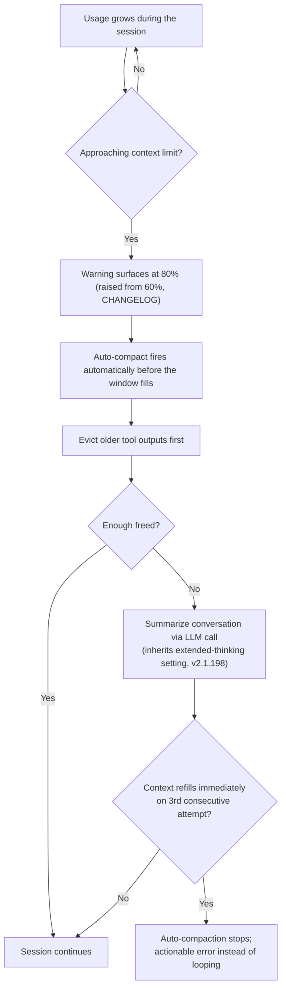
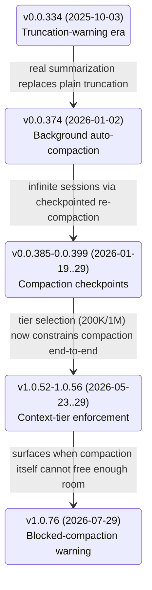
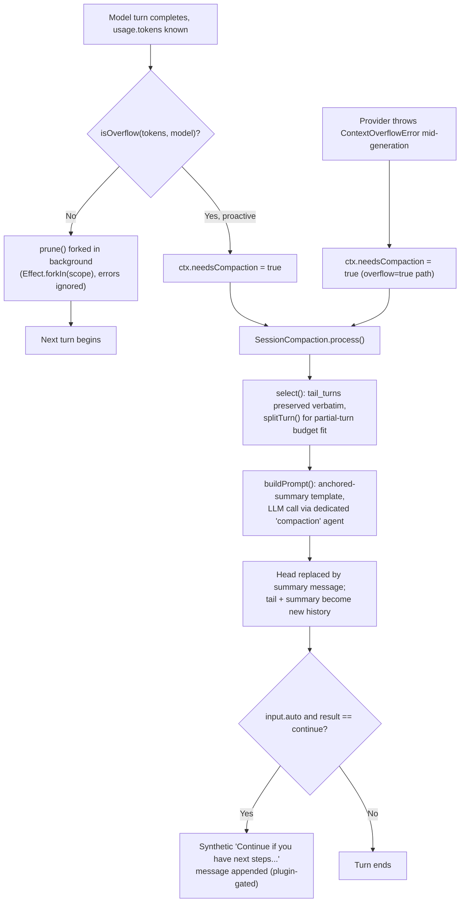
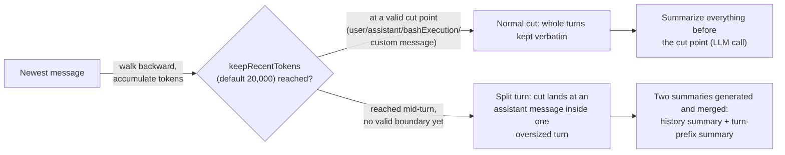
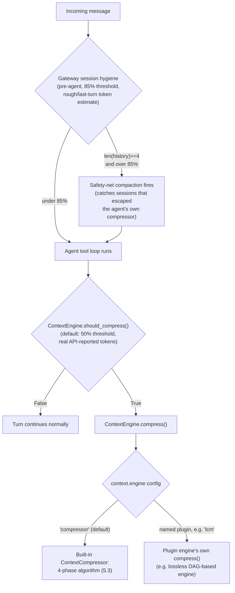
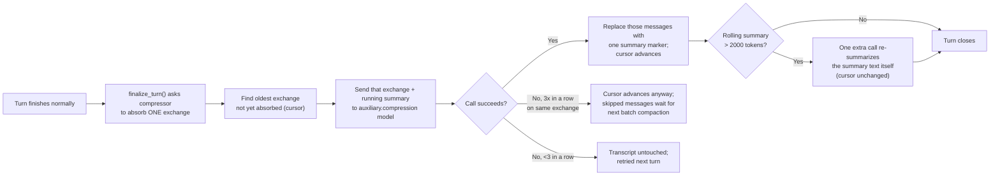
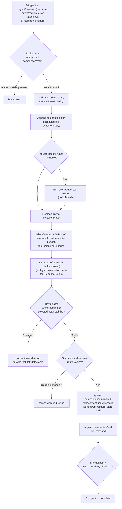

# Context compression -- Claude Code, GitHub Copilot CLI, OpenCode, pi, Hermes Agent, and DeepSeek Harness

**Scope note.** [instruction-context-budget.md](instruction-context-budget.md)
covers the *eagerly-loaded instruction* tier (CLAUDE.md/rules/skill
descriptions, `applyTo:`/`paths:` scoping) and how to keep it small.
[memory-management.md](memory-management.md) §1.7/§2.4 covers
compaction from the *memory-survival* angle -- which instruction/memory
tiers are re-injected from disk afterward. This page is the third
angle: the mid-run compression *mechanism itself* -- what actually
triggers it, what gets evicted vs. summarized vs. kept verbatim, the
exact token thresholds where known, and (for OpenCode specifically,
because it is the one harness of the three whose implementation is
publicly readable) the real source-level algorithm. Where a claim
already lives in one of those two pages, this page cites it rather
than re-deriving it, and adds the compression-specific mechanism that
neither page went into.

Every claim is tagged VERIFIED (fetched this session, or already
verified and cited in a page linked above) or BEST CURRENT
UNDERSTANDING, UNCONFIRMED. Claude Code, Copilot CLI, OpenCode, pi
(Earendil Works), Hermes Agent (Nous Research), and DeepSeek Harness
(DeepSeek AI) are six separate products from six separate
organizations/authors -- nothing confirmed for one is assumed for another.

---

## 1. Claude Code

Sources: `code.claude.com/docs/en/context-window`,
`code.claude.com/docs/en/how-claude-code-works`, and
`code.claude.com/docs/en/model-config`, all fetched fresh this session
(2026-07-30). VERIFIED unless tagged otherwise.

### 1.1 The two-phase mechanism, stated directly

The "How Claude Code works" page states the algorithm in one sentence:
"It clears older tool outputs first, then summarizes the conversation
if needed." That is a genuine two-phase design, not a single
summarization pass -- eviction of bulky, already-consumed tool output is
tried first because it is cheap (no model call, no information loss
for anything the model didn't need to keep referencing) and only
escalates to an LLM summarization call if clearing outputs alone
doesn't free enough room. The community term "microcompaction" for the
eviction phase does **not** appear on either docs page or in
`CHANGELOG.md` (grepped in a prior session) -- treat the *behavior* as
documented, the *name* as unofficial.

### 1.2 What the summary keeps and drops

The interactive context-window page states the summary's actual
contents, not just "a summary": it "keeps: your requests and intent,
key technical concepts, files examined or modified with important code
snippets, errors and how they were fixed, pending tasks, and current
work. It replaces the verbatim conversation: full tool outputs and
intermediate reasoning are gone. Claude can still reference the work
but won't have the exact code it read earlier." That is a fixed
six-part content model (intent, concepts, files+snippets, error
history, pending tasks, current work), not a free-form paraphrase --
structurally comparable in spirit to OpenCode's fixed Markdown template
in §3.4 below, though Claude Code's docs do not publish an equivalent
literal prompt template the way OpenCode's source does.

As of v2.1.198 (per `CHANGELOG.md`, cited previously in
memory-management.md §1.7), "the summarization request inherits the
session's extended thinking configuration" -- the compaction call
reasons with thinking on only if the session already had it on; this
does not change the user's own session settings afterward.

### 1.3 Trigger thresholds -- what is documented and what is not



VERIFIED, `model-config` page: **Sonnet 5 on the Anthropic API always
runs at a 1,000,000-token window** (no `[1m]` suffix needed, no usage
credits required on any plan), and "sessions auto-compact before the
window fills, at about **967K tokens by default**"; `CLAUDE_CODE_AUTO_
COMPACT_WINDOW` overrides that threshold. Two configurations budget the
window at 200K instead and auto-compact at *that* boundary: routing
through an **LLM gateway** (`ANTHROPIC_BASE_URL` pointed at a gateway --
Claude Code can't verify 1M support behind a gateway unless you
explicitly select the `sonnet[1m]` picker entry), and
`CLAUDE_CODE_DISABLE_1M_CONTEXT=1`. Other models supporting extended
context (Fable 5, Opus 4.6+, Sonnet 4.6) have their own
plan-dependent 1M-vs-200K availability, documented in the same page's
"Extended context" table, but the page does not give an equivalent
"~967K" auto-compact figure for those models specifically -- only for
Sonnet 5. Do not generalize the 967K number to other models.

Separately, the earlier-verified **warning threshold** (not the
compaction trigger itself) is a `CHANGELOG.md` entry: "Increased
auto-compact warning threshold from 60% to 80%." No page fetched this
session or previously states an exact universal percentage at which
auto-compaction *itself* fires for the default 200K-class window --
only the Sonnet-5-specific 967K/1M figure above and the warning-UI
percentage are documented. Treat "what % triggers compaction on a
200K-class model" as **not independently confirmed** from a public
source.

### 1.4 Anti-thrash guard and model-fallback interaction

VERIFIED (`CHANGELOG.md`, cited previously): "after context refills
immediately following three consecutive compactions, auto-compaction
stops with an actionable error rather than looping." This is a hard
circuit-breaker on the two-phase mechanism above, distinct from the
warning threshold -- it fires when a single file or tool output is so
large that clearing-then-summarizing can't actually create headroom.

VERIFIED (`model-config` page, "Automatic model fallback" section): the
model-fallback chain also covers compaction -- "Claude Code won't fall
back to a model with a smaller context window than the primary's,
since summarizing there would cut off part of the conversation first.
If every fallback is smaller, compaction shows the original error and
you can retry." So compaction is fallback-chain-aware in a specific
direction: it will never silently summarize with a smaller-windowed
model than the one that filled the window in the first place.

### 1.5 Hooks and observability

`PreCompact` (cited previously, `CHANGELOG.md`) can block compaction by
exiting 2 or returning `{"decision":"block"}`. The Agent SDK's
documented loop (see [agent-loop-implementations.md](agent-loop-implementations.md)
§1) emits a `SystemMessage` / `ResultMessage` stream with a
`compact_boundary` subtype marking where compaction happened in that
stream -- a programmatic signal for anything built on the SDK, distinct
from the interactive CLI's `/compact` UI notice. `/context` is the
live inspection surface for current usage by category, and `/mcp`
breaks out per-MCP-server cost specifically.

### 1.6 Manual levers

`/compact focus on ...` (or a "Compact Instructions" section in
CLAUDE.md) steers what the summary keeps rather than accepting the
automatic pass's guess. `/clear` is a harder lever -- it discards the
conversation instead of summarizing it, recommended "when switching to
unrelated work" since old conversation both crowds out useful content
and costs tokens on every subsequent message even when compacted.
Delegating large reads to a subagent (see
[handoff-mechanism.md](handoff-mechanism.md)) avoids the problem
entirely by keeping bulky file contents in a context window that never
touches the main session's budget -- the context-window walkthrough
page quantifies this concretely for one example (a subagent reading
6,100 tokens of files and returning a 420-token summary).

---

## 2. GitHub Copilot CLI

Source: `github.com/github/copilot-cli` `changelog.md`, fetched fresh
this session via `gh api repos/github/copilot-cli/contents/
changelog.md` (2026-07-30), cross-referenced against
`docs.github.com/en/copilot/how-tos/copilot-cli/use-copilot-cli/overview`
(fetched previously, cited in memory-management.md §2.4). VERIFIED
unless tagged otherwise. Unlike Claude Code and OpenCode, Copilot CLI
is closed source -- everything below is inferred from documented
behavior and the product's own changelog, never from an implementation
file.

### 2.1 A visible evolution, not one static mechanism

Reading the full changelog rather than just the current docs page
shows this is a feature that was *replaced*, not merely refined, and
the dates make the sequence unambiguous (changelog is newest-first;
these are read oldest-to-newest below):



- **v0.0.334 (2025-10-03).** The earliest documented mechanism was
  plain truncation, not summarization: "Added a warning when
  conversation context approaches **≤20% remaining** of the model's
  limit that truncation will soon occur. At this point, we recommend
  you begin a new session." No compaction existed yet -- the
  documented remedy was to start over.
- **v0.0.374 (2026-01-02).** "Add auto-compaction at **95% token
  limit** and `/compact` command" -- the origin of real
  summarization-based compaction, matching the number the current docs
  page still states.
- **v0.0.380 (2026-01-13).** "Auto-compaction runs in background
  without blocking the conversation" -- established as async from the
  start, unlike Claude Code's `/compact`, which the interactive
  walkthrough shows as a foreground step in the timeline.
  **v0.0.384/0.0.385 (2026-01-16/19).** "Enable infinite sessions with
  automatic long-running context management through **compaction
  checkpoints**" and a fix: "Fixed bug causing model call failures
  after compaction in some scenarios" -- evidence the checkpoint
  mechanism was fragile enough early on to fail model calls, since
  fixed.
- **v0.0.386 (2026-01-19).** "Background compaction preserves tool
  call sequences correctly" -- a fix confirming compaction has to
  respect tool-call/tool-result pairing as a structural boundary, the
  same shape of constraint OpenCode's `select()`/`splitTurn()` handle
  explicitly in source (§3.4).
  **v0.0.389 (2026-01-22).** "Messages sent during `/compact` are
  automatically queued" -- a manual compaction does not drop or reject
  concurrent user input, it defers it.
- **v0.0.393/0.0.396/0.0.399 (2026-01-23/27/29).** "Show conversation
  compaction status as timeline messages instead of header indicator,"
  "Simplify compaction timeline entries," "Compaction messages show
  clearer command hints to view checkpoint summaries," and "**Skills
  remain effective after conversation history is compacted**" --
  checkpoints are individually viewable objects in the timeline, and
  skill state is explicitly exempted from whatever gets dropped.
- **v0.0.410 (2026-02-14).** "Reduced memory growth in long sessions by
  evicting transient events after compaction" -- a *second*, later
  eviction pass distinct from the compaction summary itself, targeting
  ephemeral event-log bloat that accumulates even after a session has
  already compacted once.
- **v1.0.26 (2026-04-14).** "Fix truncation logic for **codex
  models**" -- direct evidence that truncation/token-accounting logic
  is at least partly model-family-specific, not one universal
  algorithm across every backend Copilot CLI can route to.
- **v1.0.52/1.0.56 (2026-05-23/29).** "Context window tier selection
  (default ~200K vs 1M tokens) is now enforced end-to-end, so picking a
  tier actually constrains compaction, truncation, and token display,"
  and tier selection "now persists durably in session events and
  survives SDK-only resume paths so tier-derived limits are reapplied
  to request, compaction, and truncation logic without app-level
  repair" -- confirming compaction reads its token budget from the same
  tier setting that governs the rest of the request pipeline, and that
  this used to require app-level repair after resume (now fixed).
- **v1.0.76 (2026-07-29, the day before this page was written).**
  "Restore the early warning when unreclaimable system and tool context
  nears the limit, before **automatic compaction is blocked**." This is
  the newest and most structurally interesting entry: it names a
  failure mode where compaction cannot proceed at all -- when the fixed
  overhead (system prompt plus tool schemas, which compaction cannot
  compress away because they aren't conversation history) alone
  approaches the limit, there is nothing left for compaction to
  reclaim, and the CLI surfaces a warning *before* that state rather
  than silently failing once compaction is already blocked.

### 2.2 What is not documented

**Not found** anywhere in the docs pages or the full changelog: the
internal shape of the summarization algorithm itself (single-shot vs.
staged, whether it re-summarizes-of-a-summary or restarts from the
full original history each compaction, any fixed template analogous to
Claude Code's six-part content model or OpenCode's Markdown template).
The only load-bearing facts are outward behavior: **background**, **95%
trigger**, **checkpointed**, preserves **skills** and **extended
thinking**, evicts **transient events** in a later pass, and (as of
today's entry) can enter a **blocked** state distinguishable from
ordinary compaction. Whether `preCompact` can block compaction the way
Claude Code's `PreCompact` can is likewise **UNCONFIRMED** -- the hook
exists ("Add preCompact hook to run commands before context compaction
starts") but no changelog entry or doc states its return-value
contract.

### 2.3 Observability

VERIFIED (previously cited in memory-management.md §2.4, from the same
changelog): "chat spans after a successful compaction carry
`gen_ai.conversation.compacted=true`, and the summary is emitted as a
`CompactionPart` in `gen_ai.input.messages`" -- a machine-checkable OTel
marker, the closest Copilot CLI equivalent to Claude Code's
`compact_boundary` `ResultMessage` subtype.

---

## 3. OpenCode

Source: `github.com/anomalyco/opencode`, `dev` branch, fetched live via
`gh api` this session (2026-07-30) -- flagging per this project's
standing caveat that `dev` is not a stable release tag and this code
may not reflect the current stable release. This is the one harness of
the three where the compression algorithm is not inferred from
documentation at all -- it is read directly from source. `opencode.ai/docs/config/`
was also fetched this session for the documented config surface.

### 3.1 Two implementations exist in this repository -- flagged, not conflated

VERIFIED, live directory listing and file contents: there are **two**
files named `compaction.ts`, in two different packages, with two
different config schemas:

- `packages/core/src/session/compaction.ts` -- exports a
  `compactIfNeeded`/`compactAfterOverflow` factory (`make()`) built
  around a `ConfigV2.Compaction` schema (`auto`, `buffer`, `keep.tokens`,
  and an unused-by-this-file `prune` field). It is a comparatively
  simple engine: split history into a token-budgeted `head`/`recent`
  pair, summarize `head` with a fixed anchored-summary template
  (`buildPrompt`, detailed in §3.4), replace it.
- `packages/opencode/src/session/compaction.ts` -- registers a full
  Effect-TS `Context.Service` (`@opencode/SessionCompaction`) wired via
  `LayerNode.make(...)` with real dependencies (`Config`, `Session`,
  `Agent`, `Plugin`, `SessionProcessor`, `Provider`, `EventV2Bridge`,
  `RuntimeFlags`), built around a `ConfigV1.Info` schema (`auto`,
  `prune`, `reserved`, plus two fields undocumented on the config page:
  `tail_turns`, `preserve_recent_tokens`). It **imports `buildPrompt`
  from the core package** (`import { buildPrompt } from
  "@opencode-ai/core/session/compaction"`) -- so the two files share
  the summarization *prompt template* but not the same eviction/
  selection/scheduling logic.

This session found no call site instantiating `packages/core`'s
`make()` factory anywhere in `packages/opencode` (a `search/code` query
for its usage returned nothing but the test file for the *other*
implementation). *BEST CURRENT UNDERSTANDING, UNCONFIRMED:* the
`packages/opencode` service is the one actually wired into a running
CLI session (confirmed by its DI registration and by finding its
`prune()` method's real call site in `packages/opencode/src/session/
prompt.ts`, §3.3); whether `packages/core`'s engine is dead code, an
in-progress replacement, or consumed by some other embedding (the SDK,
a headless/server mode) not searched this session is **not
determined**. Everything from §3.2 onward describes the
`packages/opencode` (production) engine unless stated otherwise.

### 3.2 Overflow detection: the token budget

VERIFIED, `packages/opencode/src/session/overflow.ts`:

```
const COMPACTION_BUFFER = 20_000

usable(cfg, model) =
    reserved = cfg.compaction?.reserved ?? min(COMPACTION_BUFFER, model's max output tokens)
    model.limit.input
      ? max(0, model.limit.input - reserved)
      : max(0, model.limit.context - model's max output tokens)

isOverflow(cfg, tokens, model) =
    cfg.compaction?.auto === false        -> false (disabled)
    model.limit.context === 0             -> false (unknown/unbounded)
    else: (tokens.total || input+output+cache.read+cache.write) >= usable(...)
```

So the "usable" budget is the model's input-token limit minus a
**reserved** buffer (config key `compaction.reserved`, default the
smaller of 20,000 tokens or the model's own max-output-tokens figure) --
conceptually the same "leave headroom for the response" idea as
Claude Code's warning/auto-compact split, but expressed as one
subtraction rather than a percentage.

### 3.3 Two independently-scheduled passes, not one



VERIFIED, `packages/opencode/src/session/processor.ts`: compaction has
**two distinct trigger paths**, both setting the same
`ctx.needsCompaction` flag that the streaming loop checks
(`Stream.takeUntil(() => ctx.needsCompaction)`) before deciding whether
`process()`'s result is `"compact"` (vs. `"stop"`/`"continue"`):

1. **Proactive**: after each streamed response, `isOverflow({ tokens:
   usage.tokens, model })` is checked against the token usage the
   provider reported for that turn.
2. **Reactive**: if the provider itself throws
   `SessionV1.ContextOverflowError` mid-generation (a hard overflow,
   not just "approaching" one), the same flag is set -- unless
   `compaction.auto === false` and the errroring message wasn't already
   a summary attempt, in which case it surfaces as a real error instead
   of looping.

Separately, VERIFIED in `packages/opencode/src/session/prompt.ts`:
`compaction.prune({ sessionID })` is invoked as
`.pipe(Effect.ignore, Effect.forkIn(scope))` at the tail of the main
prompt loop -- i.e. **forked as fire-and-forget after every turn**,
independent of whether that turn triggered overflow-based compaction at
all. This is the second, always-on eviction pass, distinct from the
summarization pass triggered by `isOverflow`/`ContextOverflowError`.

### 3.4 `prune()`: eviction-only, no LLM call

VERIFIED, `packages/opencode/src/session/compaction.ts`. A background
sweep with its own constants, independent of the summarization budget
in §3.2:

```
PRUNE_MINIMUM = 20_000   // only commit if total prunable exceeds this
PRUNE_PROTECT = 40_000   // always keep at least this many tokens of recent tool output
TOOL_OUTPUT_MAX_CHARS = 2_000
PRUNE_PROTECTED_TOOLS = ["skill"]   // never pruned regardless of age
```

The algorithm walks backward through session messages, counting only
completed tool-call output tokens, skipping the two most recent user
turns entirely (`turns < 2` guard) and stopping the walk the instant it
hits a prior summarized/compacted assistant message (so it never
re-prunes past an earlier compaction boundary). Anything within the
most recent `PRUNE_PROTECT` (40,000) tokens of tool output is left
alone; anything older is marked (`part.state.time.compacted =
Date.now()`) -- which erases its displayed output content -- but **only
if** the total amount found to prune exceeds `PRUNE_MINIMUM` (20,000)
tokens, i.e. a not-worth-it floor so a small amount of old output isn't
churned for negligible savings. This runs with no model call at all --
it is pure eviction, gated by `compaction.prune` (a boolean, default
`false` per `opencode.ai/docs/config/`).

### 3.5 `process()`: the summarization pass, in detail

VERIFIED, same file, plus `packages/opencode/src/config/compaction.ts`
(the `ConfigV1.Info` schema) and `packages/core/src/session/
compaction.ts` (the shared `buildPrompt`):

- **Tail preservation.** Messages are grouped into `turns` (one per
  user message, spanning to the next user message). The most recent
  `tail_turns` turns (config key `compaction.tail_turns`, default
  **2**, undocumented on the current config page) are kept verbatim if
  they fit a token budget, `preserveRecentBudget`: the config override
  `compaction.preserve_recent_tokens` (also undocumented on the config
  page) if set, else `min(8000, max(2000, floor(usable_context *
  0.25)))` -- i.e. **25% of the usable context window by default,
  clamped to a [2,000, 8,000]-token range**.
- **Partial-turn splitting.** If the most recent turns don't fit the
  budget as whole units, `splitTurn()` walks forward within the
  oldest-still-considered turn to find a message index where the
  *remaining* slice fits the leftover budget -- turns can be split
  mid-way rather than kept or dropped all-or-nothing.
- **Everything before the kept tail** (`head`) is what actually gets
  summarized away.
- **The prompt is a fixed, anchored-summary Markdown template**
  (`buildPrompt`, shared with the `core` package): six required
  sections -- **Objective**, **Important Details**, **Work State**
  (with **Completed**/**Active**/**Blocked** subsections), **Next
  Move**, and **Relevant Files** -- with an explicit rule set: "Keep
  every section, even when empty," "Use terse bullets, not prose
  paragraphs," "Preserve exact file paths, symbols, commands, error
  strings, URLs, and identifiers when known," and "Do not mention the
  summary process or that context was compacted."
- **Anchored, not from-scratch.** `completedCompactions()` scans
  history for prior compaction pairs and takes the *latest* one's
  summary text as an anchor. If one exists, the prompt instructs the
  model to "Update the anchored summary below using the conversation
  history above. Preserve still-true details, remove stale details,
  and merge in the new facts" -- rather than regenerating a full
  summary from the original conversation every time. This is a
  concrete, source-verified answer to a question Claude Code's own
  docs leave open (§1.2): OpenCode's second-and-later compactions are
  demonstrably incremental updates to a running note, not
  re-summarizations of the full original history.
- **Compaction runs as a real message, through a real agent.** The
  summarization call is dispatched through a dedicated **`compaction`
  agent** (`agents.get("compaction")`, which can carry its own
  `model:` distinct from the session's own model), and its result is
  stored as an ordinary assistant message in the session (`mode:
  "compaction"`, `summary: true`) with a `compaction` part attached to
  the parent user message -- i.e. compaction is not a side-channel
  operation invisible to the message store, it is inspectable session
  history like any other turn, with its own token/cost accounting
  fields (seeded at `cost: 0`).
- **Overflow-specific handling.** When triggered by the reactive
  `ContextOverflowError` path (§3.3) rather than proactive `isOverflow`,
  `process()` additionally looks backward for the most recent
  replayable user message, strips media attachments from it (media is
  often the actual cause of a hard overflow), and appends a synthetic
  explanatory message telling the model the attachments were dropped
  because they were too large.
- **Hard failure, not an infinite loop.** If the summarization prompt
  itself doesn't fit under `context - summaryOutput` even after
  selection (`Token.estimate(summaryPrompt) > context - summaryOutput`
  check in the `core` engine's parallel logic; the V1 engine's
  equivalent failure path raises `SessionV1.ContextOverflowError` with
  message "Session too large to compact - context exceeds model limit
  even after stripping media" or "...too large to compact - exceeds
  model context limit" for the replay case), `processor.message.error`
  is set and the turn ends with `"stop"` -- an explicit abort,
  analogous in *purpose* (don't loop forever) to Claude Code's
  three-strikes thrash guard, but a different concrete
  mechanism (single hard-fail vs. a counted retry limit).
- **Auto-continue nudge.** If the compaction that just ran was
  triggered automatically (`input.auto`) and succeeded, a synthetic
  user message is appended -- "Continue if you have next steps, or stop
  and ask for clarification if you are unsure how to proceed" -- gated
  by a plugin hook (`experimental.compaction.autocontinue`) that a
  plugin can disable (`{ enabled: false }`).
- **Events and instrumentation.** Every stage runs as a named
  Effect-TS span (`SessionCompaction.prune`, `.process`, `.select`,
  `.estimate`) and publishes its own typed events
  (`SessionCompactionEvent`: `Started`, `Ended`, and a
  session-level `Compacted` event) -- OpenCode's own equivalent of
  Claude Code's `compact_boundary` subtype and Copilot CLI's OTel
  `gen_ai.conversation.compacted` marker, verified from source rather
  than inferred.

### 3.6 Config surface -- documented vs. actually consumed

VERIFIED discrepancy, worth stating plainly rather than smoothing over:
`opencode.ai/docs/config/` documents exactly three `compaction` keys --
`auto` (default `true`), `prune` (default `false`), and `reserved` (a
token buffer) -- with this example:

```json
{
  "compaction": {
    "auto": true,
    "prune": false,
    "reserved": 10000
  }
}
```

The live `dev`-branch schema (`packages/opencode/src/config/
compaction.ts`, a `Schema.Class` named `ConfigV1.Compaction`) confirms
`auto`, `prune`, and `reserved` are real fields, but also declares
**two more that do not appear on the docs page**: `tail_turns` and
`preserve_recent_tokens` (both consumed directly in
`compaction.ts`/`overflow.ts` as shown in §3.2/§3.5). *BEST CURRENT
UNDERSTANDING, UNCONFIRMED:* whether this is a simple documentation gap
on a fast-moving product, or whether `tail_turns`/`preserve_recent_tokens`
are considered internal/unstable and intentionally left undocumented --
no source fetched this session states either way. Do not assume the
config page's three keys are the complete tunable surface.

---

## 4. pi

Sources for this section: VERIFIED, fetched 20 August 2026 directly from
`github.com/earendil-works/pi`'s `packages/coding-agent/docs/compaction.md`, in full,
cross-referenced against `packages/coding-agent/docs/extensions.md`'s
`session_before_compact`/`session_compact`/`session_compact_failed`/`session_before_tree`
event definitions and `packages/coding-agent/docs/custom-provider.md`'s overflow-detection
section.

### 4.1 Two named mechanisms sharing one summary format, not one mechanism with two names

pi's docs draw the same eviction-vs-summarization distinction the other three harnesses
draw, but shape it around two entirely separate *triggers* rather than two phases of one
pipeline: **compaction** (fired by the context-token threshold, or manually via
`/compact [instructions]`) and **branch summarization** (fired by `/tree` navigation,
covered from the session-tree-navigation angle in
[session-persistence.md](session-persistence.md) §5.3, not repeated here). `compaction.md`
states directly that "both use the same structured summary format and track file
operations cumulatively," and both use "fresh routing session IDs" for the summarization
call itself and, "where supported by the provider, disable prompt-cache writes because
these one-off prompts are unlikely to be reused" -- a cache-hygiene detail with its own
cross-reference in [caching.md](caching.md)'s own pi section. Unlike Claude Code's single
evict-then-summarize pipeline (§1.1) or OpenCode's `prune()`/`process()` pair triggered by
one overflow check (§3.3), pi's two mechanisms are triggered by unrelated user actions
(context pressure vs. tree navigation) that happen to converge on the same output shape.

### 4.2 Trigger and cut-point selection: turn-boundary-first, with an explicit split-turn fallback

Auto-compaction triggers when `contextTokens > contextWindow - reserveTokens`, with
`reserveTokens` defaulting to **16,384** tokens (configurable in
`~/.pi/agent/settings.json` or a project's own `.pi/settings.json`) -- the same
"leave headroom for the response" shape as OpenCode's `reserved` config key (§3.2) and
Claude Code's `967K`-of-`1M` auto-compact margin (§1.3), expressed here as a flat
subtraction rather than a percentage. The cut-point search then walks backward from the
newest message, accumulating token estimates until `keepRecentTokens` (default
**20,000**, same two config locations) is reached -- a fixed-token retention budget
directly comparable to OpenCode's `preserveRecentBudget` (§3.5), though pi's default is a
flat constant rather than OpenCode's `25%-of-usable-context-clamped-to-[2000,8000]`
formula.



**Valid cut points are user messages, assistant messages, `BashExecution` messages, and
custom messages (`custom_message`/`branch_summary`) -- never a tool result**, because a
tool result must stay paired with the tool call that produced it; this is the same
structural constraint Copilot CLI's changelog names explicitly ("background compaction
preserves tool call sequences correctly," §2.1) and OpenCode's `select()`/`splitTurn()`
enforce in source (§3.5), independently arrived at by three unrelated teams. When a
*single* turn (one user message plus everything the assistant does in response, up to
the next user message) exceeds `keepRecentTokens` on its own, pi calls this a **split
turn**: the cut lands mid-turn at an assistant message, `isSplitTurn` is set, and pi
generates *two* summaries rather than one -- a history summary (of everything before the
oversized turn, if any) and a turn-prefix summary (of the early part of the oversized
turn itself) -- then merges them into the final `CompactionEntry`. Neither of the other
three harnesses' documented or source-read compaction logic names an equivalent
two-summary merge step for a single oversized turn specifically; OpenCode's `splitTurn()`
(§3.5) instead finds a message index within the oldest-still-considered turn where the
*remaining* slice fits the leftover budget, a conceptually adjacent but mechanically
different answer to the same "one turn is too big to cut cleanly" problem.

On repeated compactions, the newly summarized span starts at the *previous* compaction's
own kept boundary (`firstKeptEntryId`), not at the compaction entry itself -- so messages
that survived an earlier compaction get folded into the next summarization pass too,
rather than being permanently exempt once kept once. pi also recalculates `tokensBefore`
from the freshly rebuilt session context immediately before writing the new
`CompactionEntry`, so the recorded pre-compaction token count reflects the actual context
being replaced at that moment, not a stale earlier estimate.

### 4.3 The summary itself: a fixed template, explicitly *not* stated to be anchored/incremental

The structured summary format is a fixed Markdown skeleton with six required sections --
**Goal**, **Constraints & Preferences**, **Progress** (with **Done**/**In Progress**/
**Blocked** subsections), **Key Decisions**, **Next Steps**, and **Critical Context** --
closed out by a `<read-files>`/`<modified-files>` pair of tagged blocks listing every file
read or modified across the summarized span. This is the same *kind* of fixed,
multi-section content model as Claude Code's six-part keeps/drops list (§1.2) and
OpenCode's six-section anchored-summary template (§3.5) -- three independently-designed
harnesses converging on "a summary is a structured document with named sections, not
free prose" as the right shape for this kind of compression. Before summarization,
messages are serialized to a fixed line-prefixed text format (`serializeConversation()`)
that renders assistant tool calls as a single terse line (`read(path="foo.ts");
edit(path="bar.ts", ...)`) rather than the full tool-call JSON, explicitly "to prevent the
model from treating it as a conversation to continue" rather than a document to
summarize; tool results are truncated to 2,000 characters during this serialization step
specifically, since `read`/`bash` tool output is named as the typical largest contributor
to a summarization request's own token budget.

One structural difference from OpenCode is worth flagging precisely, because it inverts
that harness's own finding: OpenCode's `process()` is VERIFIED anchored/incremental --
each later compaction updates the *text* of the prior compaction's own summary rather
than resummarizing from the full original history (§3.5). pi's compaction docs describe
passing "the previous summary as iterative context when present" into the generation
call, which reads as the same intent, but §4.2's own finding that "the summarized span
starts at the previous compaction's kept boundary" describes *which messages get
re-read*, not whether the summary *text itself* is edited-in-place versus regenerated
from scratch with the old summary as a reference. No source fetched this session states
which of those two the underlying LLM call actually produces -- **BEST CURRENT
UNDERSTANDING, UNCONFIRMED**: treat pi's compaction as "incremental in spirit" (the
previous summary is always supplied as context) without asserting it is mechanically
anchored in OpenCode's specific verified sense (an in-place text update rather than a
fresh generation that happens to be shown the old text).

### 4.4 Extension hooks: cancel, replace, or fully author the summary yourself

`session_before_compact` fires before either auto-compaction or `/compact` and can return
`{ cancel: true }` to abort the compaction outright, or a full replacement
`{ compaction: { summary, firstKeptEntryId, tokensBefore, usage?, details? } }` object
that pi writes verbatim instead of running its own summarization call -- the extension
receives the same `preparation` object pi's own logic would have used (`messagesToSummarize`,
`turnPrefixMessages` for a split turn, `previousSummary`, extracted `fileOps`, and the
event's own `reason` field distinguishing `"manual"` (`/compact`)/`"threshold"`/`"overflow"`
triggers, plus a `willRetry` flag for the overflow-recovery case described in §4.5). A
companion `serializeConversation`/`convertToLlm` export lets an extension reuse pi's own
message-to-text conversion to build a custom summary with a *different* model entirely
(the documented worked example runs the summarization call against a cheaper or
differently-tuned model than the session's own). A sibling `session_before_tree` hook
offers the identical cancel-or-replace contract for branch summarization specifically.
`session_compact_failed` fires on any failed or aborted compaction (manual or automatic)
and is framed explicitly as a telemetry pairing point -- matching failures back to the
`session_before_compact` attempt that produced them -- the closest pi analog to Claude
Code's `compact_boundary` `ResultMessage` subtype (§1.5) and OpenCode's typed
`Compaction.Started`/`Ended`/`Compacted` events (§3.5), though expressed as a pair of
ordinary extension events rather than a dedicated telemetry schema.

### 4.5 Overflow recovery is a *separate* code path from ordinary threshold compaction, and interacts with retries specifically

`custom-provider.md`'s own guidance for implementing a custom LLM provider names a
recovery sequence distinct from §4.2's proactive threshold check: when a request fails
because it exceeds the model's context window, pi detects the overflow from the finalized
assistant message's `stopReason === "error"` plus an `errorMessage` matching one of pi's
known overflow patterns (`packages/ai/src/utils/overflow.ts`), then (1) drops the failed
assistant message from live context, (2) runs compaction, and (3) retries the request
**once**. This is the same *kind* of reactive, error-triggered compaction path OpenCode's
`ContextOverflowError` handling implements (§3.3's "reactive" branch), but pi's docs are
explicit that this path must be kept structurally separate from ordinary transport-level
retry-with-backoff: a custom-provider author normalizing their own overflow error message
is warned specifically not to let that normalization also catch rate-limit or throttling
errors, "Rewriting rate-limit or throttling errors (`rate limit`, `too many requests`)
would falsely trigger compaction instead of pi's normal retry-with-backoff path" -- i.e.
pi maintains (per this same-session finding) two genuinely distinct recovery mechanisms
for two distinct failure classes, an architecture worth cross-referencing against
[retries.md](retries.md)'s own pi section for the retry-with-backoff half of this split,
which this page does not cover.

### 4.6 Settings surface

```json
{
  "compaction": {
    "enabled": true,
    "reserveTokens": 16384,
    "keepRecentTokens": 20000
  }
}
```

All three keys are documented directly (no OpenCode-style docs/source gap found this
session): `enabled` (default `true`, disables auto-compaction entirely when `false` --
manual `/compact` still works) and the two threshold/budget values from §4.2. Unlike
Copilot CLI's undocumented internal algorithm (§2.2) or OpenCode's two-implementation
ambiguity (§3.1), pi's own compaction implementation is singular and its full tunable
surface (per the docs fetched this session) matches what the source-level description in
`compaction.md` actually consumes -- no undocumented-but-consumed config key comparable to
OpenCode's `tail_turns`/`preserve_recent_tokens` gap (§3.6) was found in the pi docs
fetched this session, though this book has not independently cross-checked pi's own
source to rule one out the way it did for OpenCode.

---

## 5. Hermes Agent

Sources for this section: VERIFIED, fetched 1 September 2026 directly
from `github.com/NousResearch/hermes-agent` (`main` branch, via `gh api
repos/NousResearch/hermes-agent/contents/<path>`, full files) --
`docs/micro-compaction.md`, `website/docs/developer-guide/
context-compression-and-caching.md`, and `website/docs/developer-guide/
context-engine-plugin.md`. This session read Hermes' own documentation,
not the Python source files those docs name (`agent/context_compressor.py`,
`agent/context_engine.py`, `agent/prompt_caching.py`, `gateway/run.py`,
`run_agent.py`) directly -- but, exactly as with pi's own compaction docs
in §4, these pages quote exact method names, config keys, formulas, and
literal telemetry-JSON output at source-level precision, so this section
is docs-verified rather than source-verified in the stricter sense this
page reserves for OpenCode's own directly-read TypeScript (§3). See
[Permissions & sandboxing architecture](permissions-and-sandboxing.md)
§6 for this book's fuller architectural introduction to Hermes Agent
itself, not repeated here; [model-routing-and-selection.md](model-routing-and-selection.md)
§5.1/§5.2 documents the `auxiliary.compression` model slot and its own
independent fallback chain, and [memory-management.md](memory-management.md)
§5 documents Hermes' persistent-memory files (`MEMORY.md`/`USER.md`) --
neither repeated here.

### 5.1 Two independently-thresholded layers, and a pluggable engine underneath the primary one



Hermes runs compaction from **two separate vantage points with two
separate thresholds**, not one system with one trigger. **Gateway
session hygiene** (`gateway/run.py`, "Session hygiene: auto-compress")
runs *before* the agent processes a message, at a **fixed 85%** of the
model's context length, preferring "actual API-reported tokens from
[the] last turn" but falling back to a rough character-based estimate
when those aren't available; it fires "only when `len(history) >= 4`
and compression is enabled," and its own docs state its purpose
directly: "catch sessions that escaped the agent's own compressor" --
explicitly a safety net for sessions that grow between turns with no
agent in the loop at all, named example being "overnight accumulation
in Telegram/Discord." The **agent `ContextCompressor`** (50% default,
independently configurable) is "the primary compression system" and
runs *inside* the agent's own tool loop, where it has access to
"accurate, API-reported token counts" rather than the gateway's rougher
estimate; the docs are explicit that the gateway threshold is
deliberately set higher than the agent's own -- "Setting it at 50%
(same as the agent) caused premature compression on every turn in long
gateway sessions." No other harness this page has sourced documents two
independently-thresholded compaction layers running from two different
positions in the request pipeline (pre-agent vs. in-loop) the way
Hermes does; OpenCode's own `prune()`/`process()` split (§3.3) is the
closest structural analog, but both of OpenCode's passes run inside the
same session/processor code path, not one of them ahead of the agent
loop entirely.

Underneath the primary layer, Hermes' context management is itself
**pluggable**: the agent's compaction responsibilities are defined by a
`ContextEngine` abstract base class (`agent/context_engine.py`), and
the built-in `ContextCompressor` described in §5.2-§5.4 below is stated
explicitly as just "the default implementation" -- a plugin can replace
it wholesale via `context.engine: "<name>"` in `config.yaml` (default
`"compressor"`), with a named worked example in the docs of a
"Lossless Context Management" (LCM) engine that "builds a knowledge DAG
instead of lossy summarization." Resolution order is `plugins/
context_engine/<name>/` directory discovery, then the general plugin
system's `register_context_engine()`, then fall-through to the built-in
engine; plugin engines are "never auto-activated" -- a user must
explicitly name one. A replacement engine must implement `should_compress()`
and `compress()` (returning a valid message list) and maintain a fixed
set of class attributes the host reads directly for display/logging
(`last_prompt_tokens`, `threshold_tokens`, `context_length`,
`compression_count`, etc.), and may optionally implement
`on_session_start`/`on_session_end`/`on_session_reset`, `update_model()`,
and `get_tool_schemas()`/`handle_tool_call()` to expose agent-callable
tools of its own (the docs' example is an `lcm_grep` tool searching the
engine's own knowledge graph). This is a materially larger swap-out
surface than any hook this page has documented for the other four
harnesses: OpenCode's `experimental.session.compacting` plugin hook
(§3.5) intercepts one point inside a fixed pipeline, where Hermes' ABC
lets a plugin own the compaction *policy* end to end, including which
tokens are counted and when compaction fires at all -- while still
inheriting one piece of the built-in policy by contract: the resolved
`compression.model_thresholds` per-model-override map (§5.2) is assigned
to `engine.model_thresholds` before the first `update_model()` call, and
only an engine that itself overrides `update_model()` may ignore it.
Two further, orthogonal, no-op-by-default hooks -- `select_context()`
(replace which messages enter *one* outbound provider request without
touching persisted history; the only verb that can swap request content,
since the ordinary `pre_llm_call` plugin hook is injection-only by
design) and `on_turn_complete()` (post-turn observation) -- exist
specifically for engines that need per-request selection/retrieval
behavior distinct from compaction itself, and are explicitly
distinguished in the docs from a **memory provider** plugin (this book's
[memory-management.md](memory-management.md) §5 territory), which
observes turns without owning compaction policy at all.

### 5.2 Trigger thresholds: a percentage-of-window default, per-model overrides, and a provider-route-specific autoraise

VERIFIED, `context-compression-and-caching.md`'s "Parameter Details"
table and worked example. Compaction fires when `prompt_tokens >=
threshold × context_length`, with `threshold` defaulting to **0.50** --
and the docs state explicitly, in a callout, that `context_length` here
is always "the **main agent model's** context window -- never the
auxiliary/summary model's," specifically to head off the coincidental
reading that a ~131K threshold on a 262,144-token model at the default
50% has anything to do with "128K"-class auxiliary-model windows. A
worked example for a 200K-context model: `threshold_tokens = 200,000 ×
0.50 = 100,000`; in **legacy** tail mode, `tail_token_budget =
threshold_tokens × target_ratio (0.20) = 20,000`; and summary length is
budgeted separately as `max_summary_tokens = min(context_length × 0.05,
12,000)`, floored at 2,000, scaling from a `content_tokens × 0.20`
formula (the docs' own `_SUMMARY_RATIO` constant) for how much is being
compressed. A **default 50% trigger** is the most conservative (earliest-firing)
threshold this page has sourced for any of the five harnesses -- well
below Claude Code's ~96.7% (967K-of-1M) Sonnet-5 figure (§1.3), Copilot
CLI's 95% (§2.1), and comparable in spirit to, but numerically
independent of, OpenCode's input-minus-reserved `usable()` budget (§3.2)
and pi's flat `contextWindow - reserveTokens` subtraction (§4.2) --
though it is fully user-configurable, unlike any fixed percentage the
other four document.

`compression.model_thresholds` lets the trigger vary **by active
model**: keys are substring-matched against the model name, "the
**longest matching key** wins" (e.g. `glm-5.2-1M` beats `glm-5.2` for
model `glm-5.2-1M`), the map is re-resolved on every `/model` switch,
and a **small-context floor** applies on top of any override, raise-only:
models with context windows below 512K are floored at **0.75**, so an
override attempting to go lower is silently raised back to the floor
while an override above it (e.g. `0.80`) is honored as given. None of
Claude Code, Copilot CLI, OpenCode, or pi's docs fetched across this
page's coverage document a comparable per-model, substring-resolved,
floor-clamped threshold override surface -- this is a materially more
granular trigger-configuration mechanism than this page has found
documented for any of the other four harnesses.

A **provider-route-specific autoraise** compounds this further: the
ChatGPT Codex OAuth backend "hard-caps gpt-5.5 at a 272K context window"
even though the identical model slug exposes 1.05M tokens on OpenAI's
direct API/OpenRouter and 400K on GitHub Copilot -- so at the global
50% default, compaction on that one specific route would fire at ~136K,
"half the window the model can actually use." When the active route is
Codex OAuth (`provider: openai-codex`) and the model is gpt-5.5, Hermes
raises the trigger for that route specifically to **85%** (~231K) and
shows a one-time notice (tracked by a marker file under `$HERMES_HOME`
so repeated session inits don't re-emit it); `compression.codex_gpt55_
autoraise: false` opts back down to the global value, and
`..._autoraise_notice: false` keeps the raise but silences the banner.
A related, separately opt-in mechanism -- `-900k` picker variants of the
gpt-5.4/gpt-5.6 (Sol/Terra/Luna) families -- lets a user explicitly
select the Codex backend's actually-larger (~911K, live-verified August
2026) input limit per the docs, at the cost of "much faster
subscription-usage burn," with the base (non-`-900k`) slugs keeping the
autoraised 85% default specifically because a smaller window benefits
more from the higher trigger. Separately from all of the above, the
**gateway session-hygiene** layer (§5.1) keeps its own fixed 85%
threshold regardless of any of these per-model/per-route resolutions.

### 5.3 The built-in engine's four-phase algorithm, and what "iterative" means here

VERIFIED, `context-compression-and-caching.md`'s "Compression Algorithm"
section, describing `ContextCompressor.compress()` directly:

- **Phase 1 -- prune old tool results (cheap, no LLM call).** Tool
  results over 200 characters, outside the protected tail, are replaced
  with a fixed marker string ("`[Old tool output cleared to save
  context space]`") before any summarization is attempted -- the same
  cheap-eviction-first idea Claude Code's two-phase mechanism (§1.1) and
  OpenCode's separately-scheduled `prune()` (§3.4) both implement, here
  folded into phase 1 of a single method rather than run as an
  independently-scheduled background service.
- **Phase 2 -- determine boundaries.** `protect_first_n` (hardcoded at
  3: system prompt plus the first exchange) is always kept; the tail is
  protected by walking backward from the end accumulating tokens until
  a budget is exhausted, falling back to a fixed `protect_last_n` count
  (default 20) if the token budget would protect fewer messages than
  that floor; and `_align_boundary_backward()` walks past consecutive
  tool results to find the parent assistant message so a
  `tool_call`/`tool_result` pair is never split across the cut --
  the same structural constraint Copilot CLI's changelog, OpenCode's
  `select()`/`splitTurn()`, and pi's valid-cut-point rules (§4.2) each
  independently enforce, now confirmed a fourth, independent time.
- **Phase 3 -- generate a structured summary.** The middle turns are
  sent to the `auxiliary.compression` model (see
  [model-routing-and-selection.md](model-routing-and-selection.md)
  §5.1/§5.2 for that slot's own fallback chain) in a single
  `call_llm(task="compression")` call, against a **fixed seven-section
  Markdown template**: `## Goal`, `## Constraints & Preferences`,
  `## Progress` (with `### Done`/`### In Progress`/`### Blocked`
  subsections), `## Key Decisions`, `## Relevant Files`, `## Next
  Steps`, and `## Critical Context`. This is the fifth independently
  documented harness on this page converging on "a fixed, named-section
  document, not free prose" as the right summary shape (compare Claude
  Code's six-part keeps/drops list, §1.2; OpenCode's six-section
  template, §3.5; pi's six-section template plus separate
  `<read-files>`/`<modified-files>` tags, §4.3) -- and Hermes' own
  template is the one of the five that folds file tracking into a named
  `## Relevant Files` section directly rather than a separate tagged
  block, structurally closer to OpenCode's own choice than to pi's.
  A callout in the docs flags a specific, explicitly named failure
  mode here: **the summary model's own context window must be at least
  as large as the main model's**, because the entire middle section is
  sent in one call; if it is smaller, the API returns a context-length
  error, `_generate_summary()` catches it, logs a warning, and returns
  `None` -- and the compressor then "drops the middle turns **without a
  summary**, silently losing conversation context," which the docs
  themselves call "the most common cause of degraded compaction
  quality." No other harness's docs fetched across this page's five
  sections state an equivalent silent-data-loss failure path this
  explicitly; the closest analog is the *opposite* response -- Claude
  Code's model-fallback logic (§1.4) refuses to summarize with a
  smaller-windowed fallback model rather than attempting it and
  discarding the result on failure.
- **Phase 4 -- assemble compressed messages.** The final list is head
  messages (with a note appended to the system prompt, but only on the
  *first* compaction) plus a summary message (its role chosen
  specifically to avoid a consecutive-same-role violation) plus the
  unmodified tail; `_sanitize_tool_pairs()` then repairs any
  `tool_call`/`tool_result` pair orphaned by the cut -- removing a tool
  result whose call was removed, and injecting a stub result for a tool
  call whose result was removed -- a post-hoc repair step rather than a
  purely preventative alignment rule.

**Iterative re-compression is VERIFIED and stated unambiguously**: "on
subsequent compressions, the previous summary is passed to the LLM with
instructions to **update** it rather than summarize from scratch,"
moving items from "In Progress" to "Done," adding new progress, and
removing obsolete information, with the compressor instance's own
`_previous_summary` field holding the text between calls. This is the
same anchored/incremental behavior OpenCode's `process()` is VERIFIED
to implement (§3.5), and it resolves -- for Hermes specifically, not by
extension to pi -- the exact ambiguity this page flags as open for pi's
own docs in §4.3 (which state a previous summary is passed in as
"iterative context" without saying whether the summary text itself is
edited in place or freshly regenerated): Hermes' own docs state the
update-in-place framing directly.

### 5.4 Tail retention: a `legacy` verbatim mode, and a `lean` default that trades verbatim tail for a denser summary

`tail_mode` (default **`lean`**, alternative **`legacy`**) governs what
survives verbatim versus what gets folded into the summary instead. In
`legacy` mode the tail is a `target_ratio`-sized (default 0.20) verbatim
window that can run "~100K+ tokens on big-window models." In `lean`
mode, the verbatim tail is deliberately **clamped small** -- "2.5% ×
context window (10K floor, 25K cap)" -- and continuity is instead
carried inside the summary itself, produced by "exactly one auxiliary
LLM call per attempt": a detailed, identifier-preserving session log; a
"mechanically extracted anchor index (PR numbers, SHAs, paths, error
strings -- regex, never paraphrased)," i.e. extracted by pattern match
rather than left to the summarizing model's own paraphrase; every real
user message quoted verbatim on a newest-first budget; and a
`session_search` recovery pointer so the agent can re-access anything
that was summarized away rather than losing it outright. Oversized
regions are "evenly sampled into the summarizer input (with explicit
elision markers)" rather than triggering additional calls, and old tool
results that do fall inside the lean tail are separately "demoted to
one-line stubs carrying a recovery pointer" -- a second stub mechanism
distinct from Phase 1's outright clearing. The docs cite a measured
result on 500K-token real sessions: "~49K retained vs ~162K, with
higher recall when paired with recovery" (`evals/compaction/results/`).
No other harness's docs fetched for this page describe a regex-extracted
"anchor index" or a summary-embedded pointer back into a full-text
recovery search the way Hermes' `lean` mode does -- this is a
genuinely distinctive content-preservation design this page has not
found documented for Claude Code, Copilot CLI, OpenCode, or pi.
Independent of tail mode, `min_tail_user_messages` (default 1)
guarantees that many *real, actionable* user messages survive verbatim
in the tail regardless of the token budget -- "the guarantee wins over
the tail token budget -- the tail may exceed the budget when the anchor
pulls the cut back" -- while blank platform echoes, compaction handoffs,
and synthetic continuation rows never count toward that guarantee; and
`protect_last_n` (default 20) remains the hard floor beneath the
token-budgeted walk described in §5.3's Phase 2.

### 5.5 Micro-compaction: an opt-in, per-turn, amortized alternative to batch compaction



Micro-compaction (`compression.micro_compact`, **off by default**) is
explicitly framed by Hermes' own docs as paying "the same bill in
instalments" rather than as a distinct compression strategy: after
every completed turn (or every `micro_compact_every_n_turns` turns,
default and floor **1** -- values below 1 are clamped rather than
silently disabling the feature), `finalize_turn` asks the compressor to
absorb exactly **one exchange** (one full turn: an assistant message
plus its tool results and any follow-up assistant iterations, up to the
next user message) into a single **running rolling summary**, tracked
by an in-memory cursor (the index of the first not-yet-absorbed
message) that, if lost (a fresh process, a resumed session), is
recovered by scanning the transcript for the last summary marker and
resuming just after it -- "the transcript itself is the source of
truth." Two guarantees are stated as deliberate, asymmetric design
choices rather than incidental behavior: **user messages are never
compacted** at all, because an exchange is defined to start at the
*assistant* message and walks straight past user turns to find one --
and the docs give the actual reasoning, not just the rule: assistant
narration ("it read this file, it ran that command, it got this
result") survives summarizing with little loss, while a user
instruction is "the intent everything else is derived from, and
[cannot] be reconstructed from the work that followed" -- paraphrasing
an instruction like "use the existing retry helper, don't add a new
one" is named directly as how an agent "ends up confidently doing the
thing you told it not to, six turns later." The **head** (system prompt
plus opening messages) and the **tail** (a token-budgeted window of the
most recent messages) are separately protected and untouched by
micro-compaction, which "only ever works in the middle." This explicit,
stated rationale for treating user vs. assistant content asymmetrically
is more direct than any equivalent design justification this page has
sourced for the other four harnesses' own compaction content models.

Because a pile of per-exchange summaries would itself grow forever,
only **one** rolling summary exists, merged into on each pass ("fold in
the new material's decisions, requirements, file paths and open
questions, drop details that are no longer relevant, and preserve the
existing structure," with an explicit instruction to replace any
credentials encountered with `[REDACTED]`); only the newest summary
marker is kept in the transcript, with earlier markers dropped as
strictly redundant. When the rolling summary itself crosses a token
threshold (`micro_compact_defrag_threshold_tokens`, default 2,000), the
next pass **defrags**: a further auxiliary call re-summarizes the
summary text itself into a fresh, more compact version, without moving
the cursor or touching any transcript messages -- so the "your messages
are never compacted" guarantee holds through defrag as well. Because
Hermes' ordinary session flush is append-only, each committed pass also
calls `archive_and_compact`, which atomically soft-archives the active
rows and inserts the compacted set, stamping the originals as
already-persisted so the append-only flush that follows skips them; a
failure at this database step is logged and the session continues
(a resume would double-load the summary and the messages it replaced
until the next batch compaction cleans it up). On repeated failure of
the *same* exchange (three consecutive attempts), the cursor is
advanced past it anyway rather than retrying it on every future turn
forever -- a per-exchange thrash guard comparable in spirit to Claude
Code's three-consecutive-compaction circuit breaker (§1.4), but scoped
to one stuck exchange rather than the whole session, and resolved by
skipping forward rather than by surfacing an actionable error.

Micro-compaction explicitly **defers rather than replaces** batch
compaction (§5.3): threshold-based compaction still fires if the window
fills anyway, and both mechanisms share the same summary-marker format,
so they interoperate; in practice, keeping occupancy low continuously
means the batch path fires "much less often." The docs are unusually
candid that this is a real trade rather than a free win: "each pass is
a real call to the compression model," it runs synchronously at the end
of a turn (the answer has already streamed, but the turn does not close
until the pass finishes), and -- most importantly -- **each pass
rewrites already-sent history**, which "breaks the provider prompt-cache
prefix every turn" rather than only once per batch compaction. The docs
name this as "the strongest argument against" enabling the feature at
all, and explicitly contrast it with the (separate, always-on) proactive
tool-result prune gated behind `compression.proactive_prune_min_reclaim_
tokens` (default 4,096) -- a reclaim-size floor whose own config comment
frames its purpose as "one big episodic break instead of a tiny break
every tool iteration"; micro-compaction has no equivalent reclaim-size
gate of its own (a pass commits whatever the one absorbed exchange
happens to save, however small), only the frequency dial
`micro_compact_every_n_turns`. This reclaim-size gate on the proactive
prune is named only in `micro-compaction.md`, not in
`context-compression-and-caching.md`'s own Phase 1 description (§5.3) --
the two documents describe what reads as the same underlying tool-result
pruning pass, but this session did not independently confirm from the
Python source that `proactive_prune_min_reclaim_tokens` gates precisely
the Phase 1 mechanism rather than a related, separate pass, so treat
that specific identification as **BEST CURRENT UNDERSTANDING,
UNCONFIRMED** even though both quoted claims individually are VERIFIED
from their respective pages. The docs recommend a small, fast,
non-reasoning model for the `auxiliary.compression` slot specifically
for micro-compaction, because a pass runs every turn (latency is felt
repeatedly) and a reasoning model "will spend reasoning tokens on"
what is "mechanical work," for no benefit to the output -- one measured
illustration cited is a 7B 4-bit local instruct model averaging ~31
seconds per pass against a large remote MoE reasoning model that ran
"noticeably slower still." The metric the docs say actually matters is
**occupancy** (`tokens_after` as a percentage of the compaction
threshold), not raw tokens saved -- a session holding steady around 40%
has headroom, one climbing through 90% is about to stall -- and a
worked real-session example (a 3.5-hour, ~75K-token, 400K-window
session with a 320K threshold) shows occupancy flattening to ~22% with
no batch compaction ever firing across the whole session. Every pass
emits one content-free JSON telemetry line (counts only, no transcript
text: `tokens_before`, `tokens_after`, `occupancy_pct`,
`tokens_saved_total`, `passes_total`, `duration_ms`, etc.), and the
whole call in `finalize_turn` is wrapped so that any exception is
logged and swallowed -- a failed pass leaves the conversation unchanged
and the turn completes normally regardless, making micro-compaction
best-effort throughout rather than something that can break a session.

### 5.6 Provider-native server-side compaction: a compaction owner outside Hermes' own code, for two specific routes

For two specific model/route combinations, Hermes' own compressor is
**not** the thing shrinking context, and its docs describe both cases
directly. On **Codex app-server threads** (`api_mode: codex_app_server`
-- sessions run through the `codex` CLI/agent runtime), "the codex agent
owns the backing thread context, so Hermes' auxiliary summarizer cannot
shrink it"; rewriting Hermes' own local transcript mirror would leave
the real thread growing unbounded until a hard context reset, so
compaction instead goes through the app-server's own mechanism: manual
`/compress` asks the app-server to compact the thread
(`thread/compact/start`) and waits for that turn to complete, while
automatic behavior is controlled by `compression.codex_app_server_auto`
-- `native` (default: the app-server decides when to compact and Hermes
just records the resulting events/counters), `hermes` (Hermes' own
threshold initiates app-server compaction instead), or `off` (disables
Hermes-initiated automatic compaction on this runtime entirely, though
Codex may still compact natively). Hermes' local transcript is
explicitly never rewritten on this runtime -- `state.db` records the
compaction boundary while the visible transcript stays intact.

Separately, for the **gpt-5.6 family specifically, and only on the
direct OpenAI API or a ChatGPT Codex-subscription OAuth route**,
OpenAI's own Responses API supports server-side compaction: a request
carrying `context_management: [{type: "compaction", compact_threshold:
N}]` causes the server, once the rendered input crosses `N` tokens, to
prune older context into an opaque, encrypted `compaction` output item;
Hermes captures that item in the assistant message's existing replay
sidecar and resends it on subsequent turns, "standing in for the pruned
history -- long-horizon recall without a client-side summary pass," and
the mechanism is stated to be ZDR-friendly (`store: false`, no
`previous_response_id`). Opt-in via `compression.codex_responses_
native: true`; the gate is deliberately narrow and re-checked on every
request -- other models fail server-side when the field is present
(the docs report gpt-5.1/5.2 returning HTTP 500 or stalling the stream,
"live-verified Aug 2026," with no structured rejection to downgrade
gracefully on), and only `api.openai.com` or the ChatGPT Codex OAuth
backend ever see the field at all (xAI, GitHub/Copilot, OpenRouter,
relays, and local servers never do). Hermes' own local compressor
"stays armed as the fallback owner": the native threshold is clamped
roughly 8,000 tokens below the local trigger so the server compacts
first, and a structured provider rejection of the field disables native
compaction for that session and retries the request without it.
`compression.codex_responses_compact_threshold` defaults to `null`,
which derives the native threshold from the resolved local trigger
minus that 8,192-token safety margin (e.g. a 765,000 local trigger
selects 756,808 as the native threshold); a positive integer instead
fixes an absolute value that only clamps downward when required, and
automatic mode falls back to 200,000 if no usable local trigger exists
at all. None of Claude Code, Copilot CLI, OpenCode, or pi's docs fetched
across this page's coverage document a compaction mechanism that runs
entirely on the model provider's own infrastructure, with the harness
reduced to capturing and relaying an opaque provider-produced artifact
rather than performing the compression itself -- this is a genuinely
new compaction-ownership pattern relative to the rest of this page's
coverage, and the first place on this page where "compaction" names
something happening outside any of the five harnesses' own code
entirely.

### 5.7 No intermediate pressure warnings, by explicit design choice

VERIFIED: Hermes' own `run_agent.py` iteration-budget logic states,
in its own words per the docs, that intermediate context-pressure
warnings "have been removed" and gives the reason directly: "No
intermediate pressure warnings -- they caused models to 'give up'
prematurely on complex tasks." Compression fires at the configured
threshold (§5.2) with no prior warning step at all; the gateway
session-hygiene layer (§5.1, fixed 85%) is the only other, structurally
separate, safety net. This is a stated, considered removal rather than
a feature that was never built, and it stands in direct contrast to
Claude Code's own documented 80% warning UI ahead of its auto-compact
threshold (§1.3) -- two harnesses' own docs giving opposite answers,
for stated reasons, to the same "should the model be told it is
approaching the limit" design question.

### 5.8 Settings surface, and session-identity continuity across a compaction

```yaml
compression:
  enabled: true                         # default: true
  threshold: 0.50                       # default: 0.50 (fraction of main model's window)
  # model_thresholds:                   # per-model overrides, substring/longest-match
  #   "glm-5.2": 0.40
  target_ratio: 0.20                    # legacy tail_mode budget fraction
  tail_mode: lean                       # lean | legacy (default: lean)
  protect_last_n: 20                    # default: 20
  min_tail_user_messages: 1             # default: 1
  codex_gpt55_autoraise: true           # default: true
  codex_gpt55_autoraise_notice: true    # default: true
  codex_app_server_auto: native         # native | hermes | off
  codex_responses_native: false         # default: false (opt-in)
  codex_responses_compact_threshold: null
  in_place: true                        # default: true
  idle_compact_after_seconds: 0         # default: 0 (disabled)
  micro_compact: false                  # default: false (opt-in)
  micro_compact_every_n_turns: 1        # default/floor: 1
  micro_compact_defrag_threshold_tokens: 2000
  proactive_prune_min_reclaim_tokens: 4096

auxiliary:
  compression:
    model: null        # default: auto-detect
    provider: auto      # "auto", "openrouter", "nous", "main", etc.
    base_url: null

context:
  engine: "compressor"  # default built-in; or a plugin's own name (§5.1)
```

Every key above is documented directly against the built-in
`ContextCompressor`/gateway-hygiene behavior described in §5.1-§5.7,
with one exception worth flagging on its own: `in_place` (default
`true`) governs whether a batch compaction **rewrites the live message
list on the same session id** -- the system prompt rebuilt, the
summarized middle swapped in, and the pre-compaction turns
soft-archived under that same id (`active=0, compacted=1` in the
session store, still searchable via `session_search` and recoverable,
never deleted) -- versus the legacy behavior (`in_place: false`) where
each compaction instead commits a brand-new session id linked to the
previous one via `parent_session_id`. The docs state that the in-place
default "eliminated the session-rotation bug cluster (lost `/goal`
state, orphaned sessions, search gaps across boundaries)," and that
downstream consumers (the gateway) observe the *mode* rather than
diffing session ids -- a `session:compress` event carries `in_place`
and `old_session_id` (empty string in in-place mode) directly. None of
Claude Code, Copilot CLI, OpenCode, or pi's docs fetched across this
page frame "does compaction rotate the conversation's own identity" as
an explicit, named, historically-motivated config choice the way
Hermes' own docs do here.

---

## 6. DeepSeek Harness

Sources for this section: VERIFIED, fetched 1 September 2026 directly
from `github.com/deepseek-ai/deepseek-harness` (`master` branch, via `gh
api repos/deepseek-ai/deepseek-harness/contents/<path>`, full files) --
`docs/subsystems/compaction.md`, `docs/subsystems/spill.md`,
`packages/compaction/compaction-basic/README.md`,
`packages/compaction/compaction-tool-result-pruner/README.md`,
`packages/compaction/README.md`,
`packages/compaction/command-compact/README.md`,
`packages/spill/spill-policy/README.md`,
`packages/llm/token-meter/README.md`, and the source files
`packages/compaction/compaction-basic/src/index.ts`,
`packages/compaction/compaction-basic/src/region.ts`,
`packages/compaction/compaction-basic/src/summarizer.ts`,
`packages/compaction/compaction-basic/src/config.ts`,
`packages/compaction/compaction-basic/src/types.ts`,
`packages/compaction/compaction-tool-result-pruner/src/types.ts`,
`packages/compaction/compaction-tool-result-pruner/src/config.ts`. This
session read both the docs *and* the TypeScript source directly -- unlike
pi or Hermes, DeepSeek Harness is fully open source, and this section
cites by function name and source-verified behavior wherever the docs
leave a mechanism implicit, the same posture as OpenCode's own
source-verified section (§3). The harness is a developer preview; `master`
is not a tagged stable release.

### 6.1 A capability-seam architecture: compaction is one swappable plugin, not part of the loop spine

DeepSeek Harness (abbreviated "dsh" throughout its own codebase and
docs) is architecturally distinct from every other harness this page
covers: its entire product, including compaction, is composed from
**Cordis plugins** at boot time, with no privileged core to patch.
VERIFIED, `docs/architecture.md`: "Every part of the product is a
plugin, including the model adapter, the tool registry, the session log,
and the agent loop itself, so each is replaceable from configuration."
Compaction is **explicitly not part of the agent-loop spine** -- its
docs state directly that "the vocabulary lives here, not in core.md" and
that a "tokenizer- or template-based backend is a sibling package
implementing the same interface."

The compaction capability is split on a **capability seam** with three
separate roles, mirroring the same three-role split the architecture
uses for bash, filesystem, and every other swappable capability:

- **Service Definition** (`dsh-compaction`, `ctx.compaction`): the
  abstract `CompactionEngine` base class declaring `compactIfNeeded()`,
  `compactNow()`, and `compactRegion()`, plus the `compaction/*` session
  event vocabulary and the `CompactionResult` type.
- **Service Provider** (`dsh-compaction-basic`): the shipped default
  implementation, registering itself as `ctx.compaction`. A
  tokenizer- or template-based alternative would be a sibling package
  implementing the same seam.
- **Consumer** (`dsh-command-compact`): the `/compact` command that
  calls `compactNow()` on whatever backend is loaded.

Both the abstract seam and the basic backend consume a further optional
companion service: `ctx.toolResultPruner`
(`dsh-compaction-tool-result-pruner`) for deterministic tool-output
trimming (§6.4), and a separate, orthogonal spill-storage seam
(§6.7) for proactive oversized-output offloading that runs before
compaction is even triggered. The token measurement that decides *when*
to compact is yet another separate service (`ctx.tokenMeter`,
`dsh-token-meter`, §6.2) -- not owned by the compaction backend at all.

This is a different factoring from any of the other five harnesses:
Hermes Agent also offers a pluggable `ContextEngine` ABC (§5.1), but
that ABC owns both the *trigger policy* and the *compression
algorithm*; DeepSeek Harness separates those into two services -- the
measurement fold in `ctx.tokenMeter` versus the compaction engine in
`ctx.compaction` -- and inserts the optional pruner *between* the
trigger decision and the summarization call, so a backend can skip the
LLM call entirely when pruning alone relieves pressure (§6.4).

### 6.2 The singleton token meter: one measurement fold prices every decision

VERIFIED, `packages/llm/token-meter/README.md` and
`packages/compaction/compaction-basic/README.md`: the
`ctx.tokenMeter` service advances one **isolated replay fold** per
session from the durable event log, and "several plugins should agree on
one replay-based measurement -- compaction planning, occupancy UIs, and
pressure checks all read the same fold." The meter is not part of the
compaction package at all; compaction consumes it via dependency
injection (`BasicCompactionEngine` declares `static inject = ['llm',
'tokenMeter', 'sessions']`, VERIFIED from source).

The measurement operates at the **durable log** level -- not against a
live streaming buffer or a provider-side token-count response (though
provider-reported usage is reused as an *anchor* when its canonical
envelope matches exactly). Text and undeclared-image routes use a fixed
heuristic of approximately four characters per token plus structural
overhead; routes whose adapter declares request-image pricing carry
provider-exact visual tokens. This is the same *kind* of split
(between a heuristic default and an anchor-of-opportunity for
provider-reported counts) that pi's `providers/` tokenization and
OpenCode's own token-estimation logic implement, but dsh makes the
separation architecturally explicit: `contextBreakdown` projections carry
heuristic figures explicitly labeled as estimates that "will not sum to
`projectedTokens`," while `measure()` returns **both** route-priced
`tokens` and route-independent `heuristicTokens` per node -- the later
used for the shadow-price protocol (§6.3) so the O(1) projection fold
stays deterministic across route changes, the former used for the
shrink-comparison check (§6.5) that asks the real question: "does the
replacement lower the next request's pressure on this specific route?"

### 6.3 The log-recorded bracket: a transaction, not just a pass



VERIFIED, `packages/compaction/compaction-basic/src/region.ts` and
`docs/subsystems/compaction.md`: every compaction, regardless of
trigger, runs through one shared **bracket-first transaction** whose
steps are ordered deliberately:

1. **Validate the surface span and the durable lock.** An unmatched
   `compaction/start` with no later `compaction/end` is the
   compaction lock. An unmatched start that precedes a newer
   `session/end-seed` is stale evidence from a prior lifecycle and is
   ignored; one *after* that boundary means compaction is active.
2. **Append `compaction/start` synchronously**, before any async work
   yields. This is the lock -- a crash mid-operation produces a
   detectable orphaned start rather than a falsely-released end.
3. **Run the optional pruner, then remeasure** (§6.4).
4. **Select the compactable range** (§6.5).
5. **Summarize** through the `summarize()` hook (§6.6).
6. **Revalidate stability.** Automatic compaction requires the
   *whole surface* to be unchanged (`assertWholeSurfaceUnchanged`);
   manual `/compact` requires only the *selected span* to be stable
   (`assertSelectedSpanStable`) -- context injected between the start
   and end markers is allowed and survives the checkpoint.
7. **Reject a summary that does not shrink its source.** The framed
   summary's route-priced token cost must be strictly less than the
   shadowed span's route-priced token cost. A non-shrinking summary
   is not a "better summary" -- it is a bug, and the transaction
   aborts.
8. **Append `compaction/summary` plus the replacement `user/message`.**
   The replacement uses `surfaceOp: { op: 'replace', start, end }` --
   the *only* surface mutation compaction performs. The summary is
   framed inside `<compacted-summary>` tags (§6.6).
9. **Append `compaction/end`** (releases the lock). A failed close
   *deliberately* leaves a blocking orphan so the next attempt
   detects that the previous one did not finish cleanly.

The three `compaction/*` events are **log-only** -- they never reach
the model. Only the replacement `user/message` (carrying the
`<compacted-summary>` content) is model-visible. `SurfaceEventType` is
not extended by compaction at all; the docs state explicitly that "the
summary itself rides on a separate `user/message` with `surfaceOp: { op:
'replace', start, end }`," and an [Agent
Note](../../.agents/notes/implemented/feature/2026-06-18-compaction-capability-seam.md)
owns the rationale for reusing `user/message` rather than introducing a
new surface event type.

### 6.4 Tool-result pruning: a separate, optional, deterministic companion that can skip the LLM call entirely

VERIFIED, `packages/compaction/compaction-tool-result-pruner/README.md`
and its `src/config.ts`/`src/types.ts` source: the pruner
(`ctx.toolResultPruner`) is an **optional, loadable companion** to the
compaction backend -- the backend calls `ctx.get('toolResultPruner')` and
proceeds without it when the key is absent. When it is loaded, the
backend invokes `pruneSession()` *after* a compaction trigger qualifies
but *before* selecting a summary range, then remeasures through the
token meter; if the remeasured total now falls below threshold, the
entire summarization pass is skipped. This is the same *kind* of
pruning-first optimization Claude Code's two-phase mechanism (§1.1) and
Hermes' Phase 1 (§5.3) both implement, but with a significant
difference: the pruner is **model-free and deterministic** -- it
replaces each over-budget tool result with a bounded head/tail pair
joined by a fixed marker string (`\n\n[... tool result middle pruned
...]\n\n`), using Unicode code point slicing with fixed character
budgets (default `thresholdChars: 8192`, `headChars: 4096`, `tailChars:
1024`), and it runs only when compaction is already triggered -- "a
below-pressure conversation is never touched."

The pruner is not only cheaper than a summarization call (no LLM call
at all), it is also *sufficient by itself* in many real sessions where
tool output dominates the token budget. The pruner's output is strictly
smaller than its input by construction (the sum of head + marker + tail
must fit within `thresholdChars`), and it preserves the original event
in the append-only log -- the replacement cites it through
`sourceEventSeqs` so replay recovers the exact input. Each replacement
is immediately preceded by a `compaction/prune` **shadow-price event**
that prices the replaced range through the token meter so pure
projection consumers can subtract it without per-node state.

This "shadow-price protocol" is worth calling out as a genuinely
distinct mechanism from any of the other five harnesses' own pruning
approaches: Claude Code's eviction and Hermes' Phase-1 prune both
replace content in-place with no separate accounting event; OpenCode's
`prune()` marks messages with `compacted = Date.now()` but does not emit
a priced replacement event alongside; pi does not document an
eviction-only pass at all. DeepSeek Harness' shadow-price protocol
exists specifically to keep the token-meter's O(1) projection fold
in agreement with its own append-only history, without requiring a
full re-scan of the session log on every measurement -- a design choice
rooted in the same "measurements replay the durable session log, so they
are deterministic and cost no model calls" commitment that the token
meter's own docs state as its core invariant.

### 6.5 Range selection: head-anchored, priced-tail retention, and tool-pairing boundaries

VERIFIED, `packages/compaction/compaction-basic/src/region.ts`,
`selectCompactableRange()`: the algorithm walks backward from the end
of the priced surface, accumulating per-node `tokens` (route-priced)
until `retainTokens` is reached. This determines the first node that
falls *outside* the retained tail. It then walks backward further to
find the nearest `toolPairingBalancedBefore()` boundary, so the cut
never splits an assistant tool-call/result pair -- the same structural
constraint independently enforced by Copilot CLI's changelog (§2.1),
OpenCode's `select()`/`splitTurn()` (§3.5), pi's valid-cut-point rules
(§4.2), and Hermes' `_align_boundary_backward()` (§5.3), now confirmed
a sixth, independent time. If the walk reaches the very first surface
node, there is no compactable range and the function returns `null`.

The retained-tail budget `retainTokens` is resolved from the
conversation's active model route. VERIFIED,
`packages/compaction/compaction-basic/src/config.ts`:
`resolveCompactSpec()` computes `thresholdTokens = floor(contextWindow ×
thresholdRatio)` and `retainTokens = floor(contextWindow × retainRatio)`
(or the absolute `retainTokens` override when set). Defaults are
`thresholdRatio: 0.8` and `retainRatio: 0.16`, meaning compaction
triggers at 80% of the routed model's context window and keeps the
newest 16% verbatim -- between Copilot CLI's 95% (§2.1) and Hermes'
50% (§5.2) on the aggressiveness spectrum, and using a ratio rather
than a flat subtraction (like pi's `keepRecentTokens: 20000`) or a
clamped formula (like OpenCode's `25%-of-usable-[2000,8000]`).

A meaningful difference from the other five harnesses: the retention
budget is expressed as a **fraction of the model's context window**, not
as a number of recent turns or messages -- the `selectCompactableRange`
function accumulates *tokens*, not turns. The cut boundary is the
position in the surface where that token budget is exhausted, adjusted
outward for tool-pairing balance. This is conceptually closest to pi's
`keepRecentTokens` walk (§4.2) and Hermes' `tail_token_budget`
(§5.2), and furthest from OpenCode's `tail_turns` (§3.5) which is
counted in turns rather than tokens.

**Exact provider/model overrides** via `modelPolicies` let the trigger
and retention vary per route: each entry is an exact `{ provider, model
}` match (not a substring match like Hermes' `model_thresholds`),
duplicate targets fail plugin load, and an override can set any subset
of the shared policy fields. The top-level `auto: true` (default)
enables both the automatic `agent/pre-step` pressure listener and the
`agent/request-error` overflow-recovery listener; setting it to `false`
disables both, leaving only manual `/compact` and programmatic
`compactRegion()`.

### 6.6 Summarization: a KV-cache-reusing one-shot, with an explicit incremental-update instruction

VERIFIED, `packages/compaction/compaction-basic/src/summarizer.ts`:
the default `summarize()` implementation runs a single `ctx.llm.stream()`
call whose input is the conversation's own **system prompt, tool schemas,
and shadowed-region messages** replayed byte-for-byte from the last
routed request, followed by one final user message containing the
compaction instruction. The docs state the reason directly:
"Replaying the last routed request's system prompt, tools, and
shadowed-region messages byte-for-byte makes the auxiliary call a
genuine prefix of the conversation, so only the trailing instruction and
the summary output are uncached." This is a verifiable, source-confirmed
claim about KV-cache alignment that none of the other five harnesses'
fetched sources state this explicitly for their own summarization calls,
though Hermes' docs describe a similar prefix-replay strategy
implicitly. The call sets `GenerateOptions.purpose: 'compaction'`; only
returned text enters the checkpoint (reasoning and tool calls in the
output are rejected; image output fails with `UNSUPPORTED_CONTENT`).

The summarization model resolves in a specific, layered fallback:
(1) the explicitly configured `summarizationProvider`/`summarizationModel`
pair, (2) the latest logged request target (from the durable
`request/header`), (3) the `AgentOptions` pair -- all three checked in
`summarizeWithLlm()` in that order. If none resolves, compaction fails
with a clear error ("set both BasicCompactionConfig summarization
fields, route one request, or set both AgentOptions fields"). The
summarization call does **not** run through the loop-only
`agent/request` extension point -- it bypasses the normal request
pipeline and calls the LLM adapter directly.

The **compaction instruction** (the literal `COMPACTION_INSTRUCTION`
constant in `summarizer.ts`) is a fixed Markdown template requiring
exactly eight sections -- the most sections of any harness on this page:

1. **Primary Request and Intent** -- "the user's original and evolving
   goals; quote verbatim where the exact wording matters"
2. **Key Technical Concepts** -- "technologies, frameworks, patterns,
   and conventions in play"
3. **Files and Code** -- "exact path: why it matters, key changes or
   snippets"
4. **Errors and Fixes** -- "error: how it was resolved, plus any
   related user feedback"
5. **Pending Jobs** -- "explicitly requested work not yet completed"
6. **Current Work** -- "precisely what was in progress at this
   checkpoint"
7. **Next Step** -- "the single next action, directly in line with the
   most recent request, or '(none)'"
8. **Critical Context** -- "decisions and their rationale, constraints,
   user preferences, open questions, data needed to continue"

Plus explicit rules: preserve exact identifiers, capture user feedback
faithfully (especially corrections), do not mention the compaction
process, and -- critically -- **"If the conversation already contains a
`<compacted-summary>` block, it is a PRIOR checkpoint. Do not copy it
forward verbatim: preserve still-true facts, drop stale ones, and merge
newer information into a single consolidated summary under the same
structure."** That is a VERIFIED anchored/incremental instruction,
resolved in the same sense as OpenCode's `buildPrompt` anchor (§3.5)
and Hermes' own "update it rather than summarize from scratch" (§5.3):
each later compaction receives the prior `<compacted-summary>` block as
part of its replayed input and is explicitly told *not* to copy it
verbatim, but to merge it into a fresh, consolidated summary. This
resolves the exact ambiguity this page flags as open for pi (§4.3): for
DeepSeek Harness, the compaction instruction itself states the
incremental-update expectation directly.

The replacement user message frames the summary with a **checkpoint
preamble** ("This is an automatically generated checkpoint condensing an
earlier span of the conversation to free up context. Treat the captured
context as established background and build on it without restating it.
Continue the task directly from the messages that follow, without
acknowledging this checkpoint.") and wraps the summary inside
`<compacted-summary>`/`</compacted-summary>` tags -- a tagged
artifact the model can detect on subsequent passes for incremental
merging. No other harness on this page uses this specific
tag-wrapped-and-preamble-framed format; Claude Code's six-part
keeps/drops list (§1.2), OpenCode's six-section template (§3.5), pi's
six-section-plus-tagged-files template (§4.3), and Hermes'
seven-section template (§5.3) all produce a summary message but do not
wrap it in a detectable tag pair whose presence the compaction
instruction itself checks.

### 6.7 Spill storage: proactive oversized-output offloading before compaction is triggered

Orthogonal to both pruning and compaction, DeepSeek Harness ships a
**spill-storage seam** that runs at tool-execution time, *before* any
compaction decision. VERIFIED, `packages/spill/spill-policy/README.md`
and `packages/spill/spill/README.md`: the `dsh-spill-policy` plugin (a
`tools/post-execute` listener) caps how much plain-text tool result the
model sees: when a final result exceeds `maxInlineBytes` (configurable,
in UTF-8 bytes; omitted = disabled), it saves the full text through
`ctx.spillStore` and replaces the model-facing result with a bounded
head/tail preview plus the backend's locator and a `retrievalHint`
instructing the model how to re-access the full text (e.g. "Use `read`
with offset/limit, or `grep` this path to search within it"). The local
backend (`dsh-spill-local`) writes to a private, 0700-permission
directory under a `sha256(sessionId)` session subdirectory with
exclusive owner-only (`0o600`) file creation -- a security discipline
the docs state explicitly: "a planted symlink cannot redirect it."

Spill runs **before** compaction is triggered and is **best-effort**:
a save failure keeps the original inline result rather than turning a
successful tool call into an error. The model-facing replacement is at
most `maxInlineBytes` UTF-8 bytes and stays in history until compaction
replaces it; the full spill text is never resent to the model. The same
cap also bounds the durable-log copy of `run_code` sub-call results, so
"replay and UIs never grow unbounded either."

No other harness on this page documents an equivalent *proactive*
spill-to-disk mechanism that runs at tool-result time before any
compaction trigger. Hermes' lean tail mode (§5.4) re-accesses
summarized-away content via `session_search`, but that is a
*retroactive* recovery pointer into the session transcript -- not an
eager write of oversized output to a retrievable file before it ever
enters the conversation context. pi's `<read-files>`/`<modified-files>`
tagged blocks (§4.3) list every file read or modified, but as part of
the summary, not as an out-of-band storage mechanism. DeepSeek Harness'
spill is the first mechanism on this page that removes content from the
model's view *at the point of production* and gives the model an
explicit retrieval path back to it.

### 6.8 Two trigger paths: step-boundary pressure and context-overflow recovery

VERIFIED, `packages/compaction/compaction-basic/src/index.ts`:
`_registerAutomaticCompaction()` installs two Cordis event listeners when
`config.auto` is true:

1. **Step-boundary pressure** (`agent/pre-step` waterfall listener):
   before request derivation, prices the latest durable routed request
   envelope through `ctx.tokenMeter`. When `measurement.totalTokens >=
   spec.thresholdTokens` (i.e. the measured total crosses the resolved
   `floor(contextWindow × thresholdRatio)`), it prunes (if the pruner
   is available), remeasures, and -- if still above threshold --
   selects and summarizes the oldest balanced span while keeping a
   priced recent tail. The `compactIfNeeded` call is
   dynamically dispatched so subclass overrides on `compactIfNeeded` are
   honored at event time. A `TargetPressureConfigError` (e.g. an
   adapter that returns no context capacity for a valid route) is
   warned **once** per exact target key and then suppressed; the turn
   continues with full history.

2. **Context-overflow recovery** (`agent/request-error` listener):
   when a provider returns `CONTEXT_WINDOW_EXCEEDED` (a constant
   `CONTEXT_WINDOW_EXCEEDED_CODE` imported from `dsh-llm`; both
   DeepSeek adapters normalize recognized context-limit failures to
   this code), the listener bypasses the normal threshold and
   retention policy: it calls `pruneSession()` (if available), then
   `selectCompactableRange(session, measurement, 0)` -- a **zero**
   retain-tokens argument allowing one maximal balanced head reduction.
   If the surface's `replaceGeneration` advanced (even if later summary
   work threw after a prune landed), the listener authorizes a retry
   (`{ kind: 'retry' }`). The overflow-retry count is tracked per-agent
   and reset on successful responses (`assistant/message` events) and
   when the agent goes idle; it is capped at `maxOverflowRetries`
   (default 1).

The **pressure** path also supports **convergence retries**: when a
single compaction attempt does not relieve enough pressure
(`measurement.totalTokens` is still above `thresholdTokens`), the loop
re-selects a new range and summarizes again, up to
`compactionRetries + 1` total attempts. If pressure remains above
threshold after all attempts, compaction throws an error ("still above
threshold after N compaction attempts") -- a documented failure mode
that the auto-listener catches and logs as a warning before continuing
the turn with full over-budget history. This is a bounded multi-attempt
loop with an explicit cap, distinct from Claude Code's three-strikes
circuit breaker (§1.4) which counts *consecutive refills* rather than
*consecutive compaction attempts*, and from OpenCode's single-shot abort
(§3.5) which makes no further attempt if the first summary doesn't
shrink enough.

### 6.9 The summarize() subclass hook and the summary-failure contract

VERIFIED, `packages/compaction/compaction-basic/README.md` and
`src/summarizer.ts`: `summarize()` is the **sole subclass
customization hook**. A template- or remote-summarizer subclass can
override it while "pressure, retention, cited source events, shrink
validation, and shadowed-token accounting stay on the token meter."
The default implementation (`summarizeWithLlm`) produces a
`SummaryResult` that carries both the safe text-only summary blocks and
the complete raw provider output (with an `llmStreamCall: true` marker
when the result was produced by exactly one call through the LLM seam --
a reconstructability guarantee the `compaction/summary` event records).

A summarization call that reaches `maxTokens` produces a
`MAX_TOKENS` error ("summarization truncated at the token cap
(incomplete checkpoint)"), which the transaction treats as a failed
summary -- the surface stays at its pre-attempt state, the
`compaction/end` event records the error, and the session continues with
full over-budget history. This is the same "fail-safe, don't use a
truncated summary" posture OpenCode's hard-abort implements (§3.5),
and opposite in spirit from Hermes' silent-drop-when-model-is-too-small
(§5.3) where the middle turns disappear with no summary at all.

### 6.10 Manual compaction: idle-only, queued by the agent loop itself

VERIFIED, `packages/compaction/command-compact/README.md` and
`packages/compaction/compaction-basic/src/region.ts`: `/compact` calls
`compactNow()`, which uses `owner: null` (a standalone bracket, not an
open-turn owner) and `stability: 'selected-span'` (not
`'whole-surface'`). The mathematical consequence of `selected-span`
stability is that context *injected between* the `compaction/start` and
`compaction/end` markers survives the checkpoint -- only the selected
span must remain stable, and the manual path revalidates only its
selected positional span. The auto path, by contrast, uses
`stability: 'whole-surface'` because it runs mid-turn and any surface
change invalidates the summary.

`compactNow()` runs through `agent.runMaintenance()`, which reserves
idle admission -- if the agent is mid-turn or an already-accepted
waking prompt has right of way, the call throws `ManualCompactionError`
with code `'busy'`. The command reports this as "Compaction is
unavailable because this process has an active compaction, or the agent
is not idle." The agent loop's own FIFO accepts prompts submitted while
compaction runs and starts them only after the compaction's durability
checkpoint and admission release -- they are not lost or reordered.

Expected manual failures use a closed set of `ManualCompactionErrorCode`
values: `busy`, `cancelled`, `changed` (span mutated mid-compaction),
`summary` (summary did not shrink), `commit` (partial mutation), and
`persistence` (in-memory bracket closed but flush failed). Both
`changed` and `summary` leave the conversation surface unchanged but
still persist the failed attempt in the log -- a deliberate choice, so
a manual-failure audit trail is always available in the session events.

### 6.11 Config surface

```yaml
- name: '@deepseek-ai/dsh-compaction-basic'
  config:
    thresholdRatio: 0.8          # default: 0.8
    retainRatio: 0.16            # default: 0.16; mutually exclusive with retainTokens
    # retainTokens: 1024         # absolute budget; mutually exclusive with retainRatio
    summarizationProvider: ''    # default: '' (inherit from routed request)
    summarizationModel: ''       # default: '' (inherit from routed request)
    maxTokens: 8192              # default: 8192
    compactionRetries: 1         # default: 1 (extra attempts after the first)
    maxOverflowRetries: 1        # default: 1; 0 disables overflow recovery
    modelPolicies: []            # default: []; exact {provider, model, ...partialPolicy} overrides
    auto: true                   # default: true (both pressure and overflow listeners)
```

```yaml
- name: '@deepseek-ai/dsh-compaction-tool-result-pruner'
  config:
    thresholdChars: 8192         # default: 8192 Unicode code points
    headChars: 4096              # default: 4096
    tailChars: 1024              # default: 1024
```

```yaml
- name: '@deepseek-ai/dsh-spill-policy'
  config:
    maxInlineBytes: 50000        # default: omitted (disabled); UTF-8 byte cap on inline tool results
```

Every key above is documented directly in the shipped README.md for its
package, and the source-verified config-resolution functions confirm the
types and defaults match. Misconfiguration (unknown keys, both
retention forms together, `retainTokens` ≥ `thresholdTokens`, duplicate
model-policy targets) fails fast at plugin load rather than silently at
runtime -- VERIFIED, `src/config.ts`'s `resolveConfig()` validates and
detaches all defaults before any compaction runs.

---

## 7. Synthesis

| Dimension | Claude Code | Copilot CLI | OpenCode | pi | Hermes Agent | DeepSeek Harness |
|---|---|---|---|---|---|---|
| Verifiability | Docs-only; no public implementation | Docs + changelog only; no public implementation | Source-verified, `dev` branch (caveat applies) | Docs-only, but source-available (this session read the docs, not the TypeScript source itself, so treat as docs-verified rather than source-verified) | Docs-only, but source-available (this session read the docs, which name and quote Python source files/methods precisely, but did not read that source directly -- docs-verified, same posture as pi) | **Source-verified** (`master` branch, developer preview) -- this session read both the docs AND the TypeScript source files directly, citing function names and line-level behavior the way §3 does for OpenCode |
| Documented shape | Two-phase: evict tool outputs, then summarize if still needed | Background, checkpointed; internal algorithm undocumented | Two *independently scheduled* mechanisms: background eviction-only `prune()` + on-demand summarizing `process()` | Two *independently triggered* mechanisms sharing one summary format: threshold/manual compaction, and `/tree`-navigation branch summarization | **Two independently-thresholded layers** (85% pre-agent gateway hygiene, 50%-default in-loop `ContextCompressor`) around a **pluggable** `ContextEngine` ABC, whose default implementation is itself a 4-phase algorithm (prune, bound, summarize, assemble); plus an optional, opt-in, per-turn micro-compaction path that defers rather than replaces it | **Capability-seam architecture**: swappable `CompactionEngine` ABC (`compactIfNeeded`/`compactNow`/`compactRegion`), shipped `BasicCompactionEngine` default, optional `ToolResultPruner` companion, separate `SpillStore` seam for proactive output offloading, and a singleton `TokenMeter` that owns measurement independently -- four separate Cordis plugins composing one compaction capability, not one monolithic engine |
| Trigger | ~967K tokens default for Sonnet 5's 1M window (`CLAUDE_CODE_AUTO_COMPACT_WINDOW`); 200K-class threshold not documented as a %; 80% warning UI | 95% of token limit (origin entry, still matches docs) | `usable(cfg, model)` = input limit minus a reserved buffer (default min(20K, max-output)); checked proactively per-turn and reactively on a provider overflow error | `contextTokens > contextWindow - reserveTokens` (default `reserveTokens` 16,384); a separate reactive overflow-error path also exists (§4.5), structurally distinct from ordinary retry-with-backoff | `prompt_tokens >= threshold × context_length`, default `threshold` **0.50** of the *main* model's window -- the earliest-firing default this page has sourced -- with a substring-matched, longest-match-wins, floor-clamped (`0.75` below 512K) per-model override map, plus a route-specific 85% autoraise for gpt-5.5 on Codex OAuth (§5.2) | `measurement.totalTokens >= floor(contextWindow × thresholdRatio)`, default `thresholdRatio` **0.80** (80%), resolved per routed model via exact `{provider, model}` overrides in `modelPolicies`; a separate `CONTEXT_WINDOW_EXCEEDED` overflow-recovery path bypasses the threshold and retains zero tail, with its own retry cap (`maxOverflowRetries`, default 1) |
| Eviction-only pass | Implicit first phase of the same mechanism ("clears older tool outputs first") | "Evicting transient events after compaction" -- a later, separate pass per changelog | Explicit separate service method (`prune()`), forked fire-and-forget every turn, own thresholds (`PRUNE_PROTECT`=40K, `PRUNE_MINIMUM`=20K), exempts `skill` tool output | None documented -- pi's only two mechanisms are the two summarization paths in the row above; no fire-and-forget eviction-only pass distinct from compaction itself was found in the docs fetched this session | Phase 1 of the built-in compressor: tool results over 200 chars outside the tail replaced with a fixed marker string, no LLM call; a separately-named "proactive prune" gated behind a reclaim-size floor (`proactive_prune_min_reclaim_tokens`, default 4,096) is described in the micro-compaction doc specifically -- BEST CURRENT UNDERSTANDING, UNCONFIRMED that this is the identical Phase 1 mechanism rather than a related, separate pass (§5.5) | **Two separate eviction mechanisms at two different points in the pipeline**: (1) the optional `ToolResultPruner` companion (`ctx.toolResultPruner`, configurable Unicode-point budgets: `thresholdChars: 8192`/`headChars: 4096`/`tailChars: 1024`) runs *after* a compaction trigger qualifies but *before* summarization; (2) the orthogonal `SpillStore` seam (`ctx.spillStore`, `maxInlineBytes` cap) runs at tool-execution time *before* any compaction decision, proactively offloading oversized output to disk. Neither makes an LLM call; both can relieve enough pressure to skip summarization entirely |
| Summarization content model | Fixed six-part list (intent, concepts, files+snippets, errors+fixes, pending tasks, current work) | Undocumented internally | Fixed six-section Markdown template (Objective, Important Details, Work State [Completed/Active/Blocked], Next Move, Relevant Files) with explicit terse-bullet/preserve-identifiers rules | Fixed six-section Markdown template (Goal, Constraints & Preferences, Progress [Done/In Progress/Blocked], Key Decisions, Next Steps, Critical Context) plus tagged `<read-files>`/`<modified-files>` blocks; shared verbatim between compaction and branch summarization | Fixed **seven-section** Markdown template (Goal, Constraints & Preferences, Progress [Done/In Progress/Blocked], Key Decisions, **Relevant Files**, Next Steps, Critical Context) -- the one harness of the five folding file tracking into a named section rather than a separate tagged block; a distinct `lean` tail mode additionally carries a regex-extracted "anchor index" and a `session_search` recovery pointer alongside the summary (§5.4), found nowhere else on this page | Fixed **eight-section** Markdown template (Primary Request and Intent, Key Technical Concepts, Files and Code, Errors and Fixes, Pending Jobs, Current Work, Next Step, Critical Context) -- the most sections of any harness on this page -- wrapped in `<compacted-summary>` tags and framed by a checkpoint preamble. The tag pair is detectable by subsequent compaction passes; the instruction explicitly tells the model to merge prior checkpoints rather than copy them verbatim |
| Incremental vs. from-scratch re-summarization | Not stated either way in docs fetched | Not stated | VERIFIED anchored/incremental: later compactions update the prior summary text rather than resummarizing full history | Docs state the previous summary is passed "as iterative context" into each new summarization call, but do not state whether the summary text itself is edited in place or freshly generated with the old text as a reference -- BEST CURRENT UNDERSTANDING, UNCONFIRMED as strictly anchored in OpenCode's specific verified sense | VERIFIED anchored/incremental, stated unambiguously: "the previous summary is passed to the LLM with instructions to update it rather than summarize from scratch" -- resolving, for Hermes specifically, the exact ambiguity pi's own docs leave open in the column to its left | VERIFIED anchored/incremental via tagging: prior `<compacted-summary>` blocks remain in the replayed input on subsequent passes; the compaction instruction states "Do not copy it forward verbatim: preserve still-true facts, drop stale ones, and merge newer information into a single consolidated summary under the same structure" (§6.6) |
| Split-turn handling | Not named as a distinct case in docs fetched | Not named as a distinct case | `splitTurn()` finds a message index within the oldest-still-considered turn where the remaining slice fits the leftover budget | Named explicitly as `isSplitTurn`; generates and merges *two* summaries (a history summary and a turn-prefix summary) rather than finding one split index -- the only harness in this book's coverage that produces two summarization calls for one oversized turn | Not named as a distinct case in the docs fetched this session; boundary alignment (`_align_boundary_backward()`) prevents a cut from splitting one `tool_call`/`tool_result` pair, the same constraint independently enforced by name in Copilot CLI, OpenCode, and pi, but no oversized-single-turn special case is documented | Region boundaries enforce tool-call/result pairing (`toolPairingBalancedBefore`/`toolPairingBalancedAfter`), but do **not** preserve whole turns: "Region boundaries preserve tool-call/result pairing but not whole turns, allowing early closed steps of one oversized turn to compact" (§6.1). No two-summary merge for oversized single turns is documented |
| Thrash/failure guard | 3-consecutive-refill circuit breaker -> actionable error | Newest entry (v1.0.76): "automatic compaction blocked" state + early warning when unreclaimable overhead nears the limit | Hard single-shot abort (`ContextOverflowError`) when the summarization prompt itself won't fit, no retry counter | Reactive overflow path retries the request exactly **once** after compacting (§4.5); no documented multi-attempt thrash counter comparable to Claude Code's three-strikes guard was found | Two distinct guards, at two layers: a **silent-drop** failure mode when the summary model's own context window is smaller than the main model's (drops the middle turns with no summary at all, named in the docs as "the most common cause of degraded compaction quality," §5.3) -- the opposite response from Claude Code's own refusal-to-shrink-with-a-smaller-model behavior -- and, for micro-compaction specifically, a per-exchange 3-consecutive-failure skip-forward (§5.5) | **Bounded convergence loop** for pressure compaction: up to `compactionRetries + 1` total attempts; if pressure remains above threshold after all attempts, the auto-listener logs a warning and proceeds with full over-budget history. Summarization truncation at `maxTokens` is treated as a failed summary (surface unchanged). Overflow recovery has a separate `maxOverflowRetries` cap (default 1). A failed `compaction/end` deliberately leaves a blocking orphan lock so the next attempt detects the previous failure |
| Pre-compaction hook | `PreCompact`, can block (exit 2 / `{"decision":"block"}`) | `preCompact` exists; blocking capability unconfirmed | Plugin hook `experimental.session.compacting` can inject context or replace the prompt entirely; `experimental.compaction.autocontinue` gates the post-compaction nudge | `session_before_compact` extension event can cancel (`{cancel: true}`) or fully replace the compaction with a custom `{summary, firstKeptEntryId, tokensBefore, usage?, details?}` object, including one authored by an entirely different model; a sibling `session_before_tree` hook offers the identical contract for branch summarization | No single pre-compaction hook analog documented; instead a formal `ContextEngine` ABC lets a plugin replace `should_compress()`/`compress()` wholesale (own tools, own policy, own lifecycle), plus two narrower orthogonal hooks -- `select_context()` (per-request message replacement) and `on_turn_complete()` (post-turn observation) -- a larger, class-based swap-out surface than any single hook point documented for the other four harnesses (§5.1) | No single pre-compaction hook; instead the `summarize()` method is the **sole subclass hook** -- a replacement engine inherits pressure, retention, validation, and shadow-price accounting from the `BasicCompactionEngine` base class while replacing only the summarization strategy (template, remote, tokenizer-based). The entire `CompactionEngine` ABC can also be swapped out wholesale (a different package registers as `ctx.compaction`), and the `ToolResultPruner` and `SpillStore` are independently loadable/unloadable Cordis plugins -- a composable, multi-seam swap surface rather than a single hook point |
| Post-compaction continuation | No documented auto-nudge; user's next message resumes naturally | Not documented | Explicit synthetic "Continue if you have next steps..." message appended when the triggering compaction was automatic | Not documented as an auto-nudge in the pages fetched this session | Not documented as an auto-nudge in the pages fetched this session | No auto-nudge; the checkpoint preamble tells the model to "Continue the task directly from the messages that follow, without acknowledging this checkpoint" |
| Observability marker | `compact_boundary` `ResultMessage` subtype (Agent SDK) | OTel `gen_ai.conversation.compacted=true` + `CompactionPart` | Typed events (`Compaction.Started`/`Compaction.Ended`/`Compacted`) via Effect-TS spans | `session_compact`/`session_compact_failed` extension events, explicitly framed by the docs as a telemetry-pairing point (matching a failure back to its originating attempt) rather than a dedicated schema | Content-free JSON telemetry line per micro-compaction pass (`occupancy_pct`, `tokens_before/after`, `tokens_saved_total`, `passes_total`, `duration_ms`, counts only, no transcript text), plus a `session:compress` event carrying `in_place`/`old_session_id` for the batch path (§5.8) | **Three durable session events** (`compaction/start`, `compaction/summary`, `compaction/end`) plus per-prune `compaction/prune` shadow-price events -- all log-only, never model-visible. `compaction/summary` carries the full summary content, shadowed range/seqs, token count, and the summarization call's provider/model/usage envelope. The `compaction/start`/`end` pair is a lock bracket; an unmatched start is a detectable orphan. Manual attempts log failures with `ManualCompactionErrorCode` |
| Model-fallback interaction | Won't fall back to a smaller-context model during compaction | Context-tier (200K/1M) selection "enforced end-to-end" across compaction/truncation/token display | Compaction reads the same `usable()` budget the overflow check uses; no documented model-fallback-during-compaction behavior found | Not documented; pi's overflow-recovery path (§4.5) retries on the *same* model rather than falling back to a different one, per the pages fetched this session | The `auxiliary.compression` model slot carries its own independent fallback chain (see [model-routing-and-selection.md](model-routing-and-selection.md) §5.1/§5.2), separate from the main chat model's own fallback chain -- a per-task fallback surface none of the other four harnesses document for their own compaction/summarization model specifically | Summarization model resolves in a three-step fallback: (1) configured `summarizationProvider`/`summarizationModel`, (2) latest logged request target, (3) `AgentOptions` pair. The summarization call bypasses the `agent/request` extension point entirely -- it does not participate in the normal request pipeline or its fallback chain. No documented refusal-to-use-a-smaller-model guard; a `maxTokens` truncation is treated as a failed summary |
| Provider-owned compaction | Not documented | Not documented | Not documented | Not documented | For two specific routes (Codex app-server threads; gpt-5.6 on direct OpenAI/Codex-OAuth Responses API), compaction runs on the **provider's own infrastructure** and Hermes only observes or relays an opaque result (§5.6) -- a compaction-ownership pattern this page has not found documented for any of the other four harnesses | Not documented; overflow classification is adapter-maintained ("both DeepSeek adapters normalize recognized context-limit failures to `CONTEXT_WINDOW_EXCEEDED`"), but the compaction itself always runs client-side through the `ctx.llm.stream()` seam |
| Proactive output offloading | Not documented | Not documented | Not documented | Not documented | `lean` tail mode carries a `session_search` recovery pointer and regex-extracted anchor index (§5.4) -- retroactive recovery | **Spill-to-disk** (`ctx.spillStore`): oversized plain-text tool results are saved to a private session-scoped file and replaced with a bounded head/tail preview + retrieval guidance *at tool-execution time*, before any compaction decision. The model can re-access the full text via `read`/`grep` on the spill path. Best-effort: a save failure keeps the original inline. This is the first mechanism on this page that removes content from the model's view at the point of production, not after compaction is triggered (§6.7) |

**The design lesson.** All six harnesses converge on the same
two-part shape once you look past terminology -- cheap eviction of
material the model no longer needs verbatim, escalating to an LLM
re-summarization pass only when eviction alone can't free enough room
-- but they diverge on how much of that shape is actually inspectable,
and pi complicates the "eviction-then-summarization" framing slightly by
not documenting a separate eviction-only pass at all: everything this
page found for pi routes through one of its two summarization mechanisms
(compaction or branch summarization), with no OpenCode-style `prune()`
equivalent quietly trimming old tool output in the background. DeepSeek
Harness adds a third complication: its eviction happens at *two different
points in the pipeline* -- the `SpillStore` seam runs at tool-execution
time *before* any compaction trigger, while the `ToolResultPruner` runs
*after* a trigger qualifies but *before* summarization -- which makes the
"eviction then summarization" timeline genuinely three-phase when both
are mounted, with the pruning-then-remeasure step capable of skipping
the LLM call entirely, a structural savings none of the other five
harnesses document at the same pipeline position. Claude Code and
Copilot CLI describe the *outward contract* (what categories of
content the summary keeps, what threshold fires it, what survives)
without publishing the *mechanism* that produces it; OpenCode and
DeepSeek Harness are the two harnesses where the eviction floor, the
token-budget math, the literal summarization prompt, and the
anchored-vs-from-scratch question are all directly readable in a source
file rather than inferred from behavior; pi and Hermes Agent both sit
between the two postures -- their own docs describe the mechanism in
genuine algorithmic detail (cut-point rules, fixed summary templates,
settings keys, hook/plugin contracts) without this session having
cross-checked either description against the underlying TypeScript or
Python source the way it did for OpenCode and DeepSeek Harness, so
treat both pi's and Hermes' entries in this table as docs-verified
rather than source-verified even though the documentation itself reads
at source-level precision in both cases. Hermes specifically complicates
the "one compaction system per harness" framing further than any of the
other five: where Claude Code, Copilot CLI, OpenCode, pi, and (in a
different way) DeepSeek Harness each document one compaction mechanism
(or, for OpenCode/pi, one pair of mechanisms), Hermes' own docs
describe as many as five overlapping or alternative compaction paths for
a single session -- gateway session hygiene, the built-in
`ContextCompressor`'s four phases, an entirely swappable `ContextEngine`
plugin, opt-in micro-compaction layered on top of all of it, and, for
two narrow provider/route combinations, a provider-owned mechanism
Hermes merely observes -- and is explicit in its own docs, more than
any of the other five, about the concrete cost trade-off of choosing
between them (a broken prompt-cache prefix every turn versus one long
stall per batch compaction, stated plainly as "a trade of one cost for
another, not a saving"). DeepSeek Harness' capability-seam architecture
takes the composability in a different direction: where Hermes
centralizes the plug-in surface around one ABC, DeepSeek Harness
decomposes the *entire* compaction capability into four independently
loadable Cordis plugins (meter, pruner, compaction engine, spill store)
that compose at boot time and can each be swapped independently -- the
measurement service is not part of the compaction package at all, the
pruner is an optional companion the backend discovers at runtime, and
the spill store runs on a separate seam that firewalls off large tool
output before compaction is even aware of it. That asymmetry should
shape how confidently anything gets asserted about *why* a given harness
dropped a specific piece of context: for Claude Code and Copilot CLI,
"the docs/changelog say this is what's preserved" is the ceiling of what
can honestly be claimed; for OpenCode and DeepSeek Harness, the actual
selection and prompt-construction logic can be cited by function name
and line-level behavior, with the standing caveat that OpenCode was read
on the `dev` branch and DeepSeek Harness on `master` (a developer
preview), neither a tagged release; for pi and for Hermes Agent, the
docs themselves already operate at that level of detail (naming the
exact settings keys, the exact section headings, the exact hook/event
shapes), which is unusual among this book's closed-and-partially-open
harnesses and worth treating as a genuinely distinct third position on
the verifiability spectrum, not merely "docs-only" in the same sense as
Claude Code's or Copilot CLI's sections above.

---

## Sources

All fetched 2026-07-30 unless noted otherwise (memory-management.md's §1.7/§2.4
sources, and agent-loop-implementations.md's Claude-Code-SDK source, were fetched in
a prior session and are cited above by cross-reference rather than
re-fetched; §4's pi section was added 2026-08-20; §5's Hermes Agent
section was added 2026-09-01; §6's DeepSeek Harness section was added
2026-09-01).

**Claude Code (authoritative for its own documented behavior only):**
- `https://code.claude.com/docs/en/context-window` -- the interactive
  context-window walkthrough's "What survives compaction" table (cited
  previously) plus, fetched fresh this session, the "What the timeline
  shows" and embedded-component summary-content description (the
  six-part keeps/drops list) and the subagent token-savings example.
- `https://code.claude.com/docs/en/how-claude-code-works` -- "When
  context fills up" section, stating the two-phase evict-then-summarize
  mechanism verbatim, and the thrash-guard cross-reference.
- `https://code.claude.com/docs/en/model-config` -- Sonnet 5's 967K
  default auto-compact threshold, `CLAUDE_CODE_AUTO_COMPACT_WINDOW`,
  the LLM-gateway and `CLAUDE_CODE_DISABLE_1M_CONTEXT` exceptions, and
  the model-fallback-vs-compaction interaction.
- `https://github.com/anthropics/claude-code` `CHANGELOG.md` (fetched in
  a prior session, cited here by reference) -- 60%->80% warning
  threshold, three-consecutive-compaction thrash guard, `PreCompact`
  blocking, extended-thinking inheritance in summarization (v2.1.198).
  Authoritative for its own behavior-change history only; this repo
  ships no implementation source.

**GitHub Copilot CLI (authoritative for its own behavior-change history
only; no implementation source exists in this repo):**
- `https://github.com/github/copilot-cli` `changelog.md`, fetched fresh
  this session via `gh api repos/github/copilot-cli/contents/
  changelog.md` (full file, 2,890 lines) -- the v0.0.334 truncation-era
  entry, v0.0.374 auto-compaction origin, v0.0.380/384/385/386/389/393/
  396/399/410 checkpoint-and-eviction sequence, v1.0.26 codex-model
  truncation fix, v1.0.52/1.0.56 context-tier enforcement, and the
  v1.0.76 (2026-07-29) blocked-compaction warning entry.
- `https://docs.github.com/en/copilot/how-tos/copilot-cli/use-copilot-cli/overview`
  (fetched in a prior session, cited by reference) -- the current 95%
  auto-compaction trigger and `/compact`/`/context`/`/usage` commands.

**OpenCode (authoritative for its own documented behavior AND, unlike
the two harnesses above, its own real implementation; `dev` branch,
not a stable release tag):**
- `https://github.com/anomalyco/opencode`, `dev` branch, fetched via
  `gh api` this session -- full contents of
  `packages/opencode/src/session/compaction.ts`,
  `packages/opencode/src/session/overflow.ts`,
  `packages/opencode/src/config/compaction.ts`,
  `packages/core/src/session/compaction.ts`,
  `packages/core/src/config/compaction.ts`,
  `packages/core/src/config/tool-output.ts`, plus targeted greps of
  `packages/opencode/src/session/processor.ts` and
  `packages/opencode/src/session/prompt.ts` for the `isOverflow`/
  `prune()` call sites, and repository code-search queries confirming
  `prune()`'s only production call site and the absence of a found call
  site for `packages/core`'s `make()` factory.
- `https://opencode.ai/docs/config/`, fetched fresh this session --
  the documented `compaction.auto`/`compaction.prune`/
  `compaction.reserved` config surface, checked directly against the
  source schema to surface the `tail_turns`/`preserve_recent_tokens`
  documentation gap in §3.6.
- `https://opencode.ai/docs/` -- fetched fresh this session; confirmed
  it contains no compaction-specific content (a negative result,
  established by fetching rather than assumed).

**pi (authoritative for its own documented behavior; fetched 20 August 2026 from
`github.com/earendil-works/pi`, `main` branch; this session read the docs, not pi's own
TypeScript source, for this page specifically -- see §7's verifiability note):**
- `packages/coding-agent/docs/compaction.md` (via `gh api
  repos/earendil-works/pi/contents/packages/coding-agent/docs/compaction.md`, in full) --
  §4.1's compaction-vs-branch-summarization split and shared-format statement, §4.2's
  trigger formula, cut-point rules, and split-turn two-summary merge, §4.3's fixed
  six-section summary template and `serializeConversation()` tool-call/tool-result
  serialization behavior, §4.4's `session_before_compact`/`session_compact`/
  `session_compact_failed`/`session_before_tree` extension-event contracts, and §4.6's
  full `compaction` settings-key table.
- `packages/coding-agent/docs/custom-provider.md` (fetched the same way) -- §4.5's
  overflow-detection sequence (`stopReason === "error"` plus a recognized `errorMessage`
  pattern, drop-compact-retry-once) and its explicit warning against conflating overflow
  normalization with pi's separate retry-with-backoff path, cross-referenced against
  [retries.md](retries.md)'s own pi section.

**Hermes Agent (authoritative for its own documented behavior; fetched 1 September 2026
from `github.com/NousResearch/hermes-agent`, `main` branch, via `gh api
repos/NousResearch/hermes-agent/contents/<path>`, full files; this session read the docs,
not Hermes' own Python source, for this page specifically -- see §7's verifiability
note):**
- `docs/micro-compaction.md` -- §5.5 in full: the amortized per-turn absorption
  mechanism, the cursor and its transcript-scan recovery, the user-messages-never-
  compacted guarantee and its stated rationale, the rolling-summary/defrag mechanism,
  the `archive_and_compact` session-database staying-in-step behavior, the
  three-consecutive-failure skip-forward guard, the batch-compaction defer-not-replace
  relationship, the `proactive_prune_min_reclaim_tokens` cache-cost gate, the
  compression-model-choice guidance, and the telemetry/measurement examples.
- `website/docs/developer-guide/context-compression-and-caching.md` -- §5.1's dual
  gateway-hygiene/agent-compressor layering and the `ContextEngine`/`ContextCompressor`
  relationship overview, §5.2's full trigger-threshold formula, `model_thresholds`
  resolution rules, small-context floor, and the Codex gpt-5.5 autoraise/`-900k`-variant
  mechanics, §5.3's four-phase compression algorithm and the summary-model-context-length
  silent-failure warning, §5.4's `tail_mode` (`lean`/`legacy`) mechanics and measured
  retention figures, and §5.6's Codex app-server and native-Responses-API server-side
  compaction mechanisms.
- `website/docs/developer-guide/context-engine-plugin.md` -- §5.1's `ContextEngine` ABC
  contract (required/optional methods, class attributes, lifecycle, `select_context()`/
  `on_turn_complete()` hooks and their explicit distinction from a memory-provider
  plugin), cross-referenced against [memory-management.md](memory-management.md) §5.

**DeepSeek Harness (authoritative for its own documented behavior AND its own real
implementation; fetched 1 September 2026 from
`github.com/deepseek-ai/deepseek-harness`, `master` branch, via `gh api
repos/deepseek-ai/deepseek-harness/contents/<path>`, full files; this session read
both the docs AND the TypeScript source directly -- source-verified, same posture as
§3's OpenCode coverage; `master` is a developer preview, not a tagged stable release):**
- `docs/subsystems/compaction.md` -- §6.1's capability-seam architecture
  (Service Definition / Service Provider / Consumer split), the `compaction/*` session
  event vocabulary (`compaction/start`/`compaction/summary`/`compaction/end`),
  `CompactionResult` and `CompactionTrigger` types, the `compactCheckpointSource`
  constructor, the `toolPairingBalancedBefore`/`toolPairingBalancedAfter` boundary
  checks, and the `ToolResultPruner` service contract (`measureContent`/`pruneContent`/
  `pruneSession`).
- `docs/subsystems/spill.md` -- §6.7's spill-storage seam
  (`SpillStore`/`saveText`/`SpillLocator`/`SpillRef`), the `dsh-spill-local` backend's
  private 0700 directory and exclusive 0o600 file creation, and the `dsh-spill-policy`
  consumer's `maxInlineBytes` cap and head/tail preview.
- `packages/compaction/compaction-basic/README.md` -- the shipped default backend's
  complete contract: automatic pressure triggering at `thresholdRatio` (0.8 default),
  `retainRatio` (0.16 default), `maxTokens` (8192 default), `compactionRetries` (1),
  `maxOverflowRetries` (1), per-model `modelPolicies` overrides, the `summarize()`
  subclass hook, the KV-cache-reusing summarization strategy, the checkpoint preamble
  and `<compacted-summary>` framing, and the eight-section compaction instruction.
- `packages/compaction/compaction-basic/src/index.ts` -- `BasicCompactionEngine` class
  (DI declaration `static inject = ['llm', 'tokenMeter', 'sessions']`),
  `_registerAutomaticCompaction()` method registering the `agent/pre-step` pressure
  listener and `agent/request-error` overflow-recovery listener, the bounded
  convergence loop with `compactionRetries`, the overflow-retry cap with
  `maxOverflowRetries`, and the `compactIfNeeded`/`compactNow`/`compactRegion`
  dispatch.
- `packages/compaction/compaction-basic/src/region.ts` -- `selectCompactableRange()`
  (backward-walk token accumulation and tool-pairing boundary adjustment),
  `compactSurfaceRegion()` (the bracket-first transaction with `compaction/start` lock,
  `assertWholeSurfaceUnchanged`/`assertSelectedSpanStable` revalidation, shrink-check
  comparison, and `surfaceOp: { op: 'replace', start, end }` commit),
  `buildSummarizationInput()` (prefix replay for KV-cache alignment).
- `packages/compaction/compaction-basic/src/summarizer.ts` -- `COMPACTION_INSTRUCTION`
  constant (the literal eight-section template including the incremental-merge directive
  for prior `<compacted-summary>` blocks), `CHECKPOINT_PREAMBLE`,
  `SUMMARY_OPEN_TAG`/`SUMMARY_CLOSE_TAG`, `summarizeWithLlm()` (three-step model
  fallback, `purpose: 'compaction'`, text-only projection, `MAX_TOKENS` error
  handling), and `frameSummary()`.
- `packages/compaction/compaction-basic/src/config.ts` -- `resolveConfig()`,
  `resolveTargetPolicy()`, `resolveCompactSpec()` (threshold/retain/resolution
  math and all validation), `DEFAULT_THRESHOLD_RATIO` (0.8) and
  `DEFAULT_RETAIN_RATIO` (0.16).
- `packages/compaction/compaction-basic/src/types.ts` -- `BasicCompactionConfig`,
  `CompactionPolicyConfig`, `ModelCompactPolicyConfig`, `ResolvedConfig`,
  `ResolvedTargetPolicy`, `ResolvedCompactSpec`, `ResolvedRetention`.
- `packages/compaction/compaction-tool-result-pruner/README.md` -- the optional
  companion's contract: `thresholdChars`/`headChars`/`tailChars` budgets,
  Unicode code point slicing, `PRUNE_MARKER`, shadow-price protocol.
- `packages/compaction/compaction-tool-result-pruner/src/config.ts` -- `PRUNE_MARKER`,
  `DEFAULTS`, `codePointLength()`, `resolveConfig()`.
- `packages/compaction/compaction-tool-result-pruner/src/types.ts` --
  `ToolResultPruneConfig`, `PrunedEntry`, `PruneResult`.
- `packages/compaction/command-compact/README.md` -- the `/compact` command contract,
  `ManualCompactionErrorCode` closed set, idle-only admission, queued-prompt behavior.
- `packages/spill/spill-policy/README.md` -- §6.7's `maxInlineBytes` cap,
  head/tail preview, retrieval guidance, best-effort failure behavior, and the
  durable-log copy boundary.
- `packages/llm/token-meter/README.md` -- §6.2's singleton measurement service, the
  isolated replay fold, `measure()`/`estimateMessage()`, route-priced vs. heuristic
  tokens, the shadow-price protocol, and the `contextBreakdown` projection caveats.

