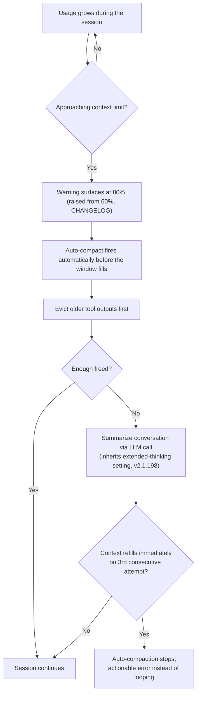
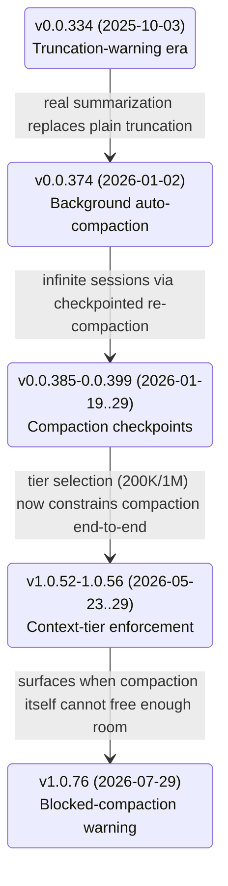
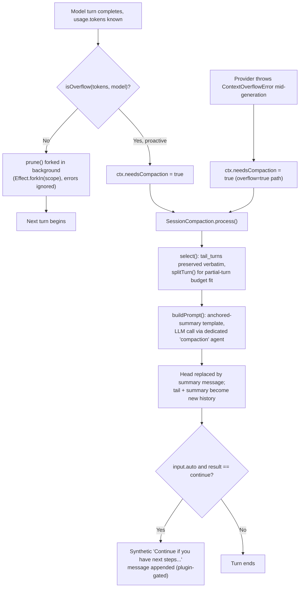

# Context compression -- Claude Code, GitHub Copilot CLI, and OpenCode

**Scope note.** [instruction-context-budget.md](instruction-context-budget.md)
covers the *eagerly-loaded instruction* tier (CLAUDE.md/rules/skill
descriptions, `applyTo:`/`paths:` scoping) and how to keep it small.
[memory-management.md](memory-management.md) §1.7/§2.4 covers
compaction from the *memory-survival* angle -- which instruction/memory
tiers are re-injected from disk afterward. This page is the third
angle: the mid-run compression *mechanism itself* -- what actually
triggers it, what gets evicted vs. summarized vs. kept verbatim, the
exact token thresholds where known, and (for OpenCode specifically,
because it is the one harness of the three whose implementation is
publicly readable) the real source-level algorithm. Where a claim
already lives in one of those two pages, this page cites it rather
than re-deriving it, and adds the compression-specific mechanism that
neither page went into.

Every claim is tagged VERIFIED (fetched this session, or already
verified and cited in a page linked above) or BEST CURRENT
UNDERSTANDING, UNCONFIRMED. Claude Code, Copilot CLI, and OpenCode are
three separate products from three separate organizations -- nothing
confirmed for one is assumed for another.

---

## 1. Claude Code

Sources: `code.claude.com/docs/en/context-window`,
`code.claude.com/docs/en/how-claude-code-works`, and
`code.claude.com/docs/en/model-config`, all fetched fresh this session
(2026-07-30). VERIFIED unless tagged otherwise.

### 1.1 The two-phase mechanism, stated directly

The "How Claude Code works" page states the algorithm in one sentence:
"It clears older tool outputs first, then summarizes the conversation
if needed." That is a genuine two-phase design, not a single
summarization pass -- eviction of bulky, already-consumed tool output is
tried first because it is cheap (no model call, no information loss
for anything the model didn't need to keep referencing) and only
escalates to an LLM summarization call if clearing outputs alone
doesn't free enough room. The community term "microcompaction" for the
eviction phase does **not** appear on either docs page or in
`CHANGELOG.md` (grepped in a prior session) -- treat the *behavior* as
documented, the *name* as unofficial.

### 1.2 What the summary keeps and drops

The interactive context-window page states the summary's actual
contents, not just "a summary": it "keeps: your requests and intent,
key technical concepts, files examined or modified with important code
snippets, errors and how they were fixed, pending tasks, and current
work. It replaces the verbatim conversation: full tool outputs and
intermediate reasoning are gone. Claude can still reference the work
but won't have the exact code it read earlier." That is a fixed
six-part content model (intent, concepts, files+snippets, error
history, pending tasks, current work), not a free-form paraphrase --
structurally comparable in spirit to OpenCode's fixed Markdown template
in §3.4 below, though Claude Code's docs do not publish an equivalent
literal prompt template the way OpenCode's source does.

As of v2.1.198 (per `CHANGELOG.md`, cited previously in
memory-management.md §1.7), "the summarization request inherits the
session's extended thinking configuration" -- the compaction call
reasons with thinking on only if the session already had it on; this
does not change the user's own session settings afterward.

### 1.3 Trigger thresholds -- what is documented and what is not



VERIFIED, `model-config` page: **Sonnet 5 on the Anthropic API always
runs at a 1,000,000-token window** (no `[1m]` suffix needed, no usage
credits required on any plan), and "sessions auto-compact before the
window fills, at about **967K tokens by default**"; `CLAUDE_CODE_AUTO_
COMPACT_WINDOW` overrides that threshold. Two configurations budget the
window at 200K instead and auto-compact at *that* boundary: routing
through an **LLM gateway** (`ANTHROPIC_BASE_URL` pointed at a gateway --
Claude Code can't verify 1M support behind a gateway unless you
explicitly select the `sonnet[1m]` picker entry), and
`CLAUDE_CODE_DISABLE_1M_CONTEXT=1`. Other models supporting extended
context (Fable 5, Opus 4.6+, Sonnet 4.6) have their own
plan-dependent 1M-vs-200K availability, documented in the same page's
"Extended context" table, but the page does not give an equivalent
"~967K" auto-compact figure for those models specifically -- only for
Sonnet 5. Do not generalize the 967K number to other models.

Separately, the earlier-verified **warning threshold** (not the
compaction trigger itself) is a `CHANGELOG.md` entry: "Increased
auto-compact warning threshold from 60% to 80%." No page fetched this
session or previously states an exact universal percentage at which
auto-compaction *itself* fires for the default 200K-class window --
only the Sonnet-5-specific 967K/1M figure above and the warning-UI
percentage are documented. Treat "what % triggers compaction on a
200K-class model" as **not independently confirmed** from a public
source.

### 1.4 Anti-thrash guard and model-fallback interaction

VERIFIED (`CHANGELOG.md`, cited previously): "after context refills
immediately following three consecutive compactions, auto-compaction
stops with an actionable error rather than looping." This is a hard
circuit-breaker on the two-phase mechanism above, distinct from the
warning threshold -- it fires when a single file or tool output is so
large that clearing-then-summarizing can't actually create headroom.

VERIFIED (`model-config` page, "Automatic model fallback" section): the
model-fallback chain also covers compaction -- "Claude Code won't fall
back to a model with a smaller context window than the primary's,
since summarizing there would cut off part of the conversation first.
If every fallback is smaller, compaction shows the original error and
you can retry." So compaction is fallback-chain-aware in a specific
direction: it will never silently summarize with a smaller-windowed
model than the one that filled the window in the first place.

### 1.5 Hooks and observability

`PreCompact` (cited previously, `CHANGELOG.md`) can block compaction by
exiting 2 or returning `{"decision":"block"}`. The Agent SDK's
documented loop (see [agent-loop-implementations.md](agent-loop-implementations.md)
§1) emits a `SystemMessage` / `ResultMessage` stream with a
`compact_boundary` subtype marking where compaction happened in that
stream -- a programmatic signal for anything built on the SDK, distinct
from the interactive CLI's `/compact` UI notice. `/context` is the
live inspection surface for current usage by category, and `/mcp`
breaks out per-MCP-server cost specifically.

### 1.6 Manual levers

`/compact focus on ...` (or a "Compact Instructions" section in
CLAUDE.md) steers what the summary keeps rather than accepting the
automatic pass's guess. `/clear` is a harder lever -- it discards the
conversation instead of summarizing it, recommended "when switching to
unrelated work" since old conversation both crowds out useful content
and costs tokens on every subsequent message even when compacted.
Delegating large reads to a subagent (see
[handoff-mechanism.md](handoff-mechanism.md)) avoids the problem
entirely by keeping bulky file contents in a context window that never
touches the main session's budget -- the context-window walkthrough
page quantifies this concretely for one example (a subagent reading
6,100 tokens of files and returning a 420-token summary).

---

## 2. GitHub Copilot CLI

Source: `github.com/github/copilot-cli` `changelog.md`, fetched fresh
this session via `gh api repos/github/copilot-cli/contents/
changelog.md` (2026-07-30), cross-referenced against
`docs.github.com/en/copilot/how-tos/copilot-cli/use-copilot-cli/overview`
(fetched previously, cited in memory-management.md §2.4). VERIFIED
unless tagged otherwise. Unlike Claude Code and OpenCode, Copilot CLI
is closed source -- everything below is inferred from documented
behavior and the product's own changelog, never from an implementation
file.

### 2.1 A visible evolution, not one static mechanism

Reading the full changelog rather than just the current docs page
shows this is a feature that was *replaced*, not merely refined, and
the dates make the sequence unambiguous (changelog is newest-first;
these are read oldest-to-newest below):



- **v0.0.334 (2025-10-03).** The earliest documented mechanism was
  plain truncation, not summarization: "Added a warning when
  conversation context approaches **≤20% remaining** of the model's
  limit that truncation will soon occur. At this point, we recommend
  you begin a new session." No compaction existed yet -- the
  documented remedy was to start over.
- **v0.0.374 (2026-01-02).** "Add auto-compaction at **95% token
  limit** and `/compact` command" -- the origin of real
  summarization-based compaction, matching the number the current docs
  page still states.
- **v0.0.380 (2026-01-13).** "Auto-compaction runs in background
  without blocking the conversation" -- established as async from the
  start, unlike Claude Code's `/compact`, which the interactive
  walkthrough shows as a foreground step in the timeline.
  **v0.0.384/0.0.385 (2026-01-16/19).** "Enable infinite sessions with
  automatic long-running context management through **compaction
  checkpoints**" and a fix: "Fixed bug causing model call failures
  after compaction in some scenarios" -- evidence the checkpoint
  mechanism was fragile enough early on to fail model calls, since
  fixed.
- **v0.0.386 (2026-01-19).** "Background compaction preserves tool
  call sequences correctly" -- a fix confirming compaction has to
  respect tool-call/tool-result pairing as a structural boundary, the
  same shape of constraint OpenCode's `select()`/`splitTurn()` handle
  explicitly in source (§3.4).
  **v0.0.389 (2026-01-22).** "Messages sent during `/compact` are
  automatically queued" -- a manual compaction does not drop or reject
  concurrent user input, it defers it.
- **v0.0.393/0.0.396/0.0.399 (2026-01-23/27/29).** "Show conversation
  compaction status as timeline messages instead of header indicator,"
  "Simplify compaction timeline entries," "Compaction messages show
  clearer command hints to view checkpoint summaries," and "**Skills
  remain effective after conversation history is compacted**" --
  checkpoints are individually viewable objects in the timeline, and
  skill state is explicitly exempted from whatever gets dropped.
- **v0.0.410 (2026-02-14).** "Reduced memory growth in long sessions by
  evicting transient events after compaction" -- a *second*, later
  eviction pass distinct from the compaction summary itself, targeting
  ephemeral event-log bloat that accumulates even after a session has
  already compacted once.
- **v1.0.26 (2026-04-14).** "Fix truncation logic for **codex
  models**" -- direct evidence that truncation/token-accounting logic
  is at least partly model-family-specific, not one universal
  algorithm across every backend Copilot CLI can route to.
- **v1.0.52/1.0.56 (2026-05-23/29).** "Context window tier selection
  (default ~200K vs 1M tokens) is now enforced end-to-end, so picking a
  tier actually constrains compaction, truncation, and token display,"
  and tier selection "now persists durably in session events and
  survives SDK-only resume paths so tier-derived limits are reapplied
  to request, compaction, and truncation logic without app-level
  repair" -- confirming compaction reads its token budget from the same
  tier setting that governs the rest of the request pipeline, and that
  this used to require app-level repair after resume (now fixed).
- **v1.0.76 (2026-07-29, the day before this page was written).**
  "Restore the early warning when unreclaimable system and tool context
  nears the limit, before **automatic compaction is blocked**." This is
  the newest and most structurally interesting entry: it names a
  failure mode where compaction cannot proceed at all -- when the fixed
  overhead (system prompt plus tool schemas, which compaction cannot
  compress away because they aren't conversation history) alone
  approaches the limit, there is nothing left for compaction to
  reclaim, and the CLI surfaces a warning *before* that state rather
  than silently failing once compaction is already blocked.

### 2.2 What is not documented

**Not found** anywhere in the docs pages or the full changelog: the
internal shape of the summarization algorithm itself (single-shot vs.
staged, whether it re-summarizes-of-a-summary or restarts from the
full original history each compaction, any fixed template analogous to
Claude Code's six-part content model or OpenCode's Markdown template).
The only load-bearing facts are outward behavior: **background**, **95%
trigger**, **checkpointed**, preserves **skills** and **extended
thinking**, evicts **transient events** in a later pass, and (as of
today's entry) can enter a **blocked** state distinguishable from
ordinary compaction. Whether `preCompact` can block compaction the way
Claude Code's `PreCompact` can is likewise **UNCONFIRMED** -- the hook
exists ("Add preCompact hook to run commands before context compaction
starts") but no changelog entry or doc states its return-value
contract.

### 2.3 Observability

VERIFIED (previously cited in memory-management.md §2.4, from the same
changelog): "chat spans after a successful compaction carry
`gen_ai.conversation.compacted=true`, and the summary is emitted as a
`CompactionPart` in `gen_ai.input.messages`" -- a machine-checkable OTel
marker, the closest Copilot CLI equivalent to Claude Code's
`compact_boundary` `ResultMessage` subtype.

---

## 3. OpenCode

Source: `github.com/anomalyco/opencode`, `dev` branch, fetched live via
`gh api` this session (2026-07-30) -- flagging per this project's
standing caveat that `dev` is not a stable release tag and this code
may not reflect the current stable release. This is the one harness of
the three where the compression algorithm is not inferred from
documentation at all -- it is read directly from source. `opencode.ai/docs/config/`
was also fetched this session for the documented config surface.

### 3.1 Two implementations exist in this repository -- flagged, not conflated

VERIFIED, live directory listing and file contents: there are **two**
files named `compaction.ts`, in two different packages, with two
different config schemas:

- `packages/core/src/session/compaction.ts` -- exports a
  `compactIfNeeded`/`compactAfterOverflow` factory (`make()`) built
  around a `ConfigV2.Compaction` schema (`auto`, `buffer`, `keep.tokens`,
  and an unused-by-this-file `prune` field). It is a comparatively
  simple engine: split history into a token-budgeted `head`/`recent`
  pair, summarize `head` with a fixed anchored-summary template
  (`buildPrompt`, detailed in §3.4), replace it.
- `packages/opencode/src/session/compaction.ts` -- registers a full
  Effect-TS `Context.Service` (`@opencode/SessionCompaction`) wired via
  `LayerNode.make(...)` with real dependencies (`Config`, `Session`,
  `Agent`, `Plugin`, `SessionProcessor`, `Provider`, `EventV2Bridge`,
  `RuntimeFlags`), built around a `ConfigV1.Info` schema (`auto`,
  `prune`, `reserved`, plus two fields undocumented on the config page:
  `tail_turns`, `preserve_recent_tokens`). It **imports `buildPrompt`
  from the core package** (`import { buildPrompt } from
  "@opencode-ai/core/session/compaction"`) -- so the two files share
  the summarization *prompt template* but not the same eviction/
  selection/scheduling logic.

This session found no call site instantiating `packages/core`'s
`make()` factory anywhere in `packages/opencode` (a `search/code` query
for its usage returned nothing but the test file for the *other*
implementation). *BEST CURRENT UNDERSTANDING, UNCONFIRMED:* the
`packages/opencode` service is the one actually wired into a running
CLI session (confirmed by its DI registration and by finding its
`prune()` method's real call site in `packages/opencode/src/session/
prompt.ts`, §3.3); whether `packages/core`'s engine is dead code, an
in-progress replacement, or consumed by some other embedding (the SDK,
a headless/server mode) not searched this session is **not
determined**. Everything from §3.2 onward describes the
`packages/opencode` (production) engine unless stated otherwise.

### 3.2 Overflow detection: the token budget

VERIFIED, `packages/opencode/src/session/overflow.ts`:

```
const COMPACTION_BUFFER = 20_000

usable(cfg, model) =
    reserved = cfg.compaction?.reserved ?? min(COMPACTION_BUFFER, model's max output tokens)
    model.limit.input
      ? max(0, model.limit.input - reserved)
      : max(0, model.limit.context - model's max output tokens)

isOverflow(cfg, tokens, model) =
    cfg.compaction?.auto === false        -> false (disabled)
    model.limit.context === 0             -> false (unknown/unbounded)
    else: (tokens.total || input+output+cache.read+cache.write) >= usable(...)
```

So the "usable" budget is the model's input-token limit minus a
**reserved** buffer (config key `compaction.reserved`, default the
smaller of 20,000 tokens or the model's own max-output-tokens figure) --
conceptually the same "leave headroom for the response" idea as
Claude Code's warning/auto-compact split, but expressed as one
subtraction rather than a percentage.

### 3.3 Two independently-scheduled passes, not one



VERIFIED, `packages/opencode/src/session/processor.ts`: compaction has
**two distinct trigger paths**, both setting the same
`ctx.needsCompaction` flag that the streaming loop checks
(`Stream.takeUntil(() => ctx.needsCompaction)`) before deciding whether
`process()`'s result is `"compact"` (vs. `"stop"`/`"continue"`):

1. **Proactive**: after each streamed response, `isOverflow({ tokens:
   usage.tokens, model })` is checked against the token usage the
   provider reported for that turn.
2. **Reactive**: if the provider itself throws
   `SessionV1.ContextOverflowError` mid-generation (a hard overflow,
   not just "approaching" one), the same flag is set -- unless
   `compaction.auto === false` and the errroring message wasn't already
   a summary attempt, in which case it surfaces as a real error instead
   of looping.

Separately, VERIFIED in `packages/opencode/src/session/prompt.ts`:
`compaction.prune({ sessionID })` is invoked as
`.pipe(Effect.ignore, Effect.forkIn(scope))` at the tail of the main
prompt loop -- i.e. **forked as fire-and-forget after every turn**,
independent of whether that turn triggered overflow-based compaction at
all. This is the second, always-on eviction pass, distinct from the
summarization pass triggered by `isOverflow`/`ContextOverflowError`.

### 3.4 `prune()`: eviction-only, no LLM call

VERIFIED, `packages/opencode/src/session/compaction.ts`. A background
sweep with its own constants, independent of the summarization budget
in §3.2:

```
PRUNE_MINIMUM = 20_000   // only commit if total prunable exceeds this
PRUNE_PROTECT = 40_000   // always keep at least this many tokens of recent tool output
TOOL_OUTPUT_MAX_CHARS = 2_000
PRUNE_PROTECTED_TOOLS = ["skill"]   // never pruned regardless of age
```

The algorithm walks backward through session messages, counting only
completed tool-call output tokens, skipping the two most recent user
turns entirely (`turns < 2` guard) and stopping the walk the instant it
hits a prior summarized/compacted assistant message (so it never
re-prunes past an earlier compaction boundary). Anything within the
most recent `PRUNE_PROTECT` (40,000) tokens of tool output is left
alone; anything older is marked (`part.state.time.compacted =
Date.now()`) -- which erases its displayed output content -- but **only
if** the total amount found to prune exceeds `PRUNE_MINIMUM` (20,000)
tokens, i.e. a not-worth-it floor so a small amount of old output isn't
churned for negligible savings. This runs with no model call at all --
it is pure eviction, gated by `compaction.prune` (a boolean, default
`false` per `opencode.ai/docs/config/`).

### 3.5 `process()`: the summarization pass, in detail

VERIFIED, same file, plus `packages/opencode/src/config/compaction.ts`
(the `ConfigV1.Info` schema) and `packages/core/src/session/
compaction.ts` (the shared `buildPrompt`):

- **Tail preservation.** Messages are grouped into `turns` (one per
  user message, spanning to the next user message). The most recent
  `tail_turns` turns (config key `compaction.tail_turns`, default
  **2**, undocumented on the current config page) are kept verbatim if
  they fit a token budget, `preserveRecentBudget`: the config override
  `compaction.preserve_recent_tokens` (also undocumented on the config
  page) if set, else `min(8000, max(2000, floor(usable_context *
  0.25)))` -- i.e. **25% of the usable context window by default,
  clamped to a [2,000, 8,000]-token range**.
- **Partial-turn splitting.** If the most recent turns don't fit the
  budget as whole units, `splitTurn()` walks forward within the
  oldest-still-considered turn to find a message index where the
  *remaining* slice fits the leftover budget -- turns can be split
  mid-way rather than kept or dropped all-or-nothing.
- **Everything before the kept tail** (`head`) is what actually gets
  summarized away.
- **The prompt is a fixed, anchored-summary Markdown template**
  (`buildPrompt`, shared with the `core` package): six required
  sections -- **Objective**, **Important Details**, **Work State**
  (with **Completed**/**Active**/**Blocked** subsections), **Next
  Move**, and **Relevant Files** -- with an explicit rule set: "Keep
  every section, even when empty," "Use terse bullets, not prose
  paragraphs," "Preserve exact file paths, symbols, commands, error
  strings, URLs, and identifiers when known," and "Do not mention the
  summary process or that context was compacted."
- **Anchored, not from-scratch.** `completedCompactions()` scans
  history for prior compaction pairs and takes the *latest* one's
  summary text as an anchor. If one exists, the prompt instructs the
  model to "Update the anchored summary below using the conversation
  history above. Preserve still-true details, remove stale details,
  and merge in the new facts" -- rather than regenerating a full
  summary from the original conversation every time. This is a
  concrete, source-verified answer to a question Claude Code's own
  docs leave open (§1.2): OpenCode's second-and-later compactions are
  demonstrably incremental updates to a running note, not
  re-summarizations of the full original history.
- **Compaction runs as a real message, through a real agent.** The
  summarization call is dispatched through a dedicated **`compaction`
  agent** (`agents.get("compaction")`, which can carry its own
  `model:` distinct from the session's own model), and its result is
  stored as an ordinary assistant message in the session (`mode:
  "compaction"`, `summary: true`) with a `compaction` part attached to
  the parent user message -- i.e. compaction is not a side-channel
  operation invisible to the message store, it is inspectable session
  history like any other turn, with its own token/cost accounting
  fields (seeded at `cost: 0`).
- **Overflow-specific handling.** When triggered by the reactive
  `ContextOverflowError` path (§3.3) rather than proactive `isOverflow`,
  `process()` additionally looks backward for the most recent
  replayable user message, strips media attachments from it (media is
  often the actual cause of a hard overflow), and appends a synthetic
  explanatory message telling the model the attachments were dropped
  because they were too large.
- **Hard failure, not an infinite loop.** If the summarization prompt
  itself doesn't fit under `context - summaryOutput` even after
  selection (`Token.estimate(summaryPrompt) > context - summaryOutput`
  check in the `core` engine's parallel logic; the V1 engine's
  equivalent failure path raises `SessionV1.ContextOverflowError` with
  message "Session too large to compact - context exceeds model limit
  even after stripping media" or "...too large to compact - exceeds
  model context limit" for the replay case), `processor.message.error`
  is set and the turn ends with `"stop"` -- an explicit abort,
  analogous in *purpose* (don't loop forever) to Claude Code's
  three-strikes thrash guard, but a different concrete
  mechanism (single hard-fail vs. a counted retry limit).
- **Auto-continue nudge.** If the compaction that just ran was
  triggered automatically (`input.auto`) and succeeded, a synthetic
  user message is appended -- "Continue if you have next steps, or stop
  and ask for clarification if you are unsure how to proceed" -- gated
  by a plugin hook (`experimental.compaction.autocontinue`) that a
  plugin can disable (`{ enabled: false }`).
- **Events and instrumentation.** Every stage runs as a named
  Effect-TS span (`SessionCompaction.prune`, `.process`, `.select`,
  `.estimate`) and publishes its own typed events
  (`SessionCompactionEvent`: `Started`, `Ended`, and a
  session-level `Compacted` event) -- OpenCode's own equivalent of
  Claude Code's `compact_boundary` subtype and Copilot CLI's OTel
  `gen_ai.conversation.compacted` marker, verified from source rather
  than inferred.

### 3.6 Config surface -- documented vs. actually consumed

VERIFIED discrepancy, worth stating plainly rather than smoothing over:
`opencode.ai/docs/config/` documents exactly three `compaction` keys --
`auto` (default `true`), `prune` (default `false`), and `reserved` (a
token buffer) -- with this example:

```json
{
  "compaction": {
    "auto": true,
    "prune": false,
    "reserved": 10000
  }
}
```

The live `dev`-branch schema (`packages/opencode/src/config/
compaction.ts`, a `Schema.Class` named `ConfigV1.Compaction`) confirms
`auto`, `prune`, and `reserved` are real fields, but also declares
**two more that do not appear on the docs page**: `tail_turns` and
`preserve_recent_tokens` (both consumed directly in
`compaction.ts`/`overflow.ts` as shown in §3.2/§3.5). *BEST CURRENT
UNDERSTANDING, UNCONFIRMED:* whether this is a simple documentation gap
on a fast-moving product, or whether `tail_turns`/`preserve_recent_tokens`
are considered internal/unstable and intentionally left undocumented --
no source fetched this session states either way. Do not assume the
config page's three keys are the complete tunable surface.

---

## 4. Synthesis

| Dimension | Claude Code | Copilot CLI | OpenCode |
|---|---|---|---|
| Verifiability | Docs-only; no public implementation | Docs + changelog only; no public implementation | Source-verified, `dev` branch (caveat applies) |
| Documented shape | Two-phase: evict tool outputs, then summarize if still needed | Background, checkpointed; internal algorithm undocumented | Two *independently scheduled* mechanisms: background eviction-only `prune()` + on-demand summarizing `process()` |
| Trigger | ~967K tokens default for Sonnet 5's 1M window (`CLAUDE_CODE_AUTO_COMPACT_WINDOW`); 200K-class threshold not documented as a %; 80% warning UI | 95% of token limit (origin entry, still matches docs) | `usable(cfg, model)` = input limit minus a reserved buffer (default min(20K, max-output)); checked proactively per-turn and reactively on a provider overflow error |
| Eviction-only pass | Implicit first phase of the same mechanism ("clears older tool outputs first") | "Evicting transient events after compaction" -- a later, separate pass per changelog | Explicit separate service method (`prune()`), forked fire-and-forget every turn, own thresholds (`PRUNE_PROTECT`=40K, `PRUNE_MINIMUM`=20K), exempts `skill` tool output |
| Summarization content model | Fixed six-part list (intent, concepts, files+snippets, errors+fixes, pending tasks, current work) | Undocumented internally | Fixed six-section Markdown template (Objective, Important Details, Work State [Completed/Active/Blocked], Next Move, Relevant Files) with explicit terse-bullet/preserve-identifiers rules |
| Incremental vs. from-scratch re-summarization | Not stated either way in docs fetched | Not stated | VERIFIED anchored/incremental: later compactions update the prior summary text rather than resummarizing full history |
| Thrash/failure guard | 3-consecutive-refill circuit breaker -> actionable error | Newest entry (v1.0.76): "automatic compaction blocked" state + early warning when unreclaimable overhead nears the limit | Hard single-shot abort (`ContextOverflowError`) when the summarization prompt itself won't fit, no retry counter |
| Pre-compaction hook | `PreCompact`, can block (exit 2 / `{"decision":"block"}`) | `preCompact` exists; blocking capability unconfirmed | Plugin hook `experimental.session.compacting` can inject context or replace the prompt entirely; `experimental.compaction.autocontinue` gates the post-compaction nudge |
| Post-compaction continuation | No documented auto-nudge; user's next message resumes naturally | Not documented | Explicit synthetic "Continue if you have next steps..." message appended when the triggering compaction was automatic |
| Observability marker | `compact_boundary` `ResultMessage` subtype (Agent SDK) | OTel `gen_ai.conversation.compacted=true` + `CompactionPart` | Typed events (`Compaction.Started`/`Compaction.Ended`/`Compacted`) via Effect-TS spans |
| Model-fallback interaction | Won't fall back to a smaller-context model during compaction | Context-tier (200K/1M) selection "enforced end-to-end" across compaction/truncation/token display | Compaction reads the same `usable()` budget the overflow check uses; no documented model-fallback-during-compaction behavior found |

**The design lesson.** All three harnesses converge on the same
two-part shape once you look past terminology -- cheap eviction of
material the model no longer needs verbatim, escalating to an LLM
re-summarization pass only when eviction alone can't free enough room
-- but they diverge on how much of that shape is actually inspectable.
Claude Code and Copilot CLI describe the *outward contract* (what
categories of content the summary keeps, what threshold fires it, what
survives) without publishing the *mechanism* that produces it; OpenCode
is the one harness where the eviction floor, the token-budget math, the
literal summarization prompt, and the anchored-vs-from-scratch question
are all directly readable in a source file rather than inferred from
behavior. That asymmetry should shape how confidently anything gets
asserted about *why* a given harness dropped a specific piece of
context: for Claude Code and Copilot CLI, "the docs/changelog say this
is what's preserved" is the ceiling of what can honestly be claimed;
for OpenCode, the actual selection and prompt-construction logic can be
cited by function name and line-level behavior -- with the standing
caveat that it was read on the `dev` branch, not a tagged release.

---

## Sources

All fetched 2026-07-30 (memory-management.md's §1.7/§2.4 sources, and
agent-loop-implementations.md's Claude-Code-SDK source, were fetched in
a prior session and are cited above by cross-reference rather than
re-fetched).

**Claude Code (authoritative for its own documented behavior only):**
- `https://code.claude.com/docs/en/context-window` -- the interactive
  context-window walkthrough's "What survives compaction" table (cited
  previously) plus, fetched fresh this session, the "What the timeline
  shows" and embedded-component summary-content description (the
  six-part keeps/drops list) and the subagent token-savings example.
- `https://code.claude.com/docs/en/how-claude-code-works` -- "When
  context fills up" section, stating the two-phase evict-then-summarize
  mechanism verbatim, and the thrash-guard cross-reference.
- `https://code.claude.com/docs/en/model-config` -- Sonnet 5's 967K
  default auto-compact threshold, `CLAUDE_CODE_AUTO_COMPACT_WINDOW`,
  the LLM-gateway and `CLAUDE_CODE_DISABLE_1M_CONTEXT` exceptions, and
  the model-fallback-vs-compaction interaction.
- `https://github.com/anthropics/claude-code` `CHANGELOG.md` (fetched in
  a prior session, cited here by reference) -- 60%->80% warning
  threshold, three-consecutive-compaction thrash guard, `PreCompact`
  blocking, extended-thinking inheritance in summarization (v2.1.198).
  Authoritative for its own behavior-change history only; this repo
  ships no implementation source.

**GitHub Copilot CLI (authoritative for its own behavior-change history
only; no implementation source exists in this repo):**
- `https://github.com/github/copilot-cli` `changelog.md`, fetched fresh
  this session via `gh api repos/github/copilot-cli/contents/
  changelog.md` (full file, 2,890 lines) -- the v0.0.334 truncation-era
  entry, v0.0.374 auto-compaction origin, v0.0.380/384/385/386/389/393/
  396/399/410 checkpoint-and-eviction sequence, v1.0.26 codex-model
  truncation fix, v1.0.52/1.0.56 context-tier enforcement, and the
  v1.0.76 (2026-07-29) blocked-compaction warning entry.
- `https://docs.github.com/en/copilot/how-tos/copilot-cli/use-copilot-cli/overview`
  (fetched in a prior session, cited by reference) -- the current 95%
  auto-compaction trigger and `/compact`/`/context`/`/usage` commands.

**OpenCode (authoritative for its own documented behavior AND, unlike
the two harnesses above, its own real implementation; `dev` branch,
not a stable release tag):**
- `https://github.com/anomalyco/opencode`, `dev` branch, fetched via
  `gh api` this session -- full contents of
  `packages/opencode/src/session/compaction.ts`,
  `packages/opencode/src/session/overflow.ts`,
  `packages/opencode/src/config/compaction.ts`,
  `packages/core/src/session/compaction.ts`,
  `packages/core/src/config/compaction.ts`,
  `packages/core/src/config/tool-output.ts`, plus targeted greps of
  `packages/opencode/src/session/processor.ts` and
  `packages/opencode/src/session/prompt.ts` for the `isOverflow`/
  `prune()` call sites, and repository code-search queries confirming
  `prune()`'s only production call site and the absence of a found call
  site for `packages/core`'s `make()` factory.
- `https://opencode.ai/docs/config/`, fetched fresh this session --
  the documented `compaction.auto`/`compaction.prune`/
  `compaction.reserved` config surface, checked directly against the
  source schema to surface the `tail_turns`/`preserve_recent_tokens`
  documentation gap in §3.6.
- `https://opencode.ai/docs/` -- fetched fresh this session; confirmed
  it contains no compaction-specific content (a negative result,
  established by fetching rather than assumed).
