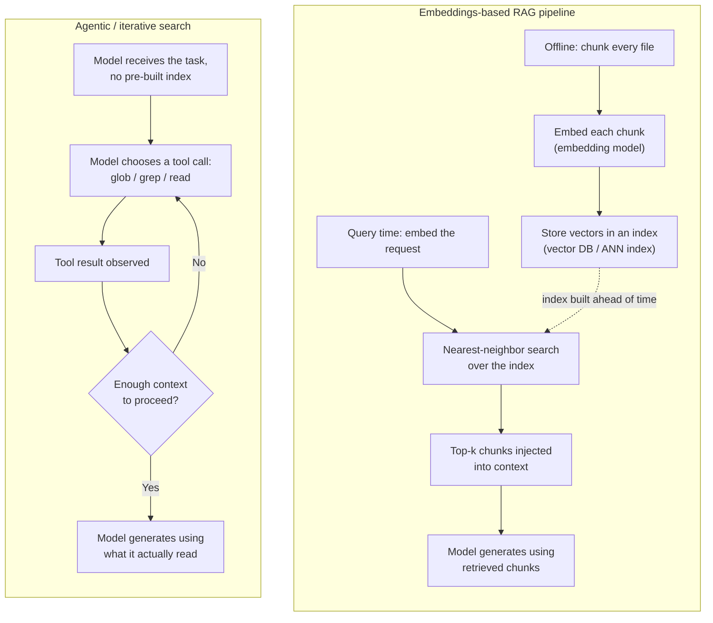
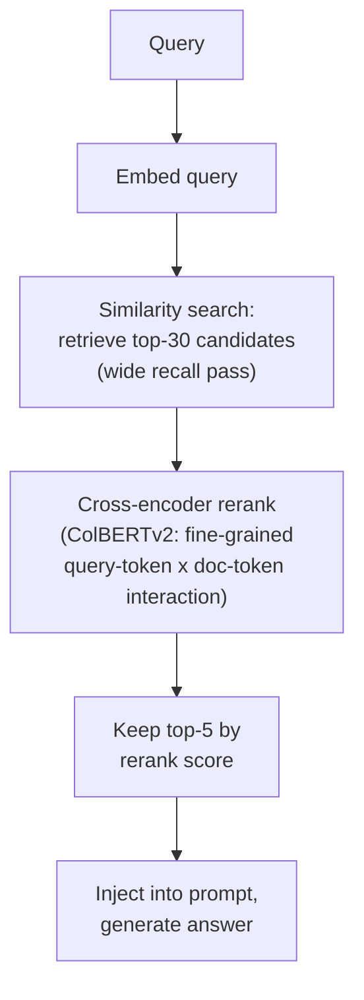
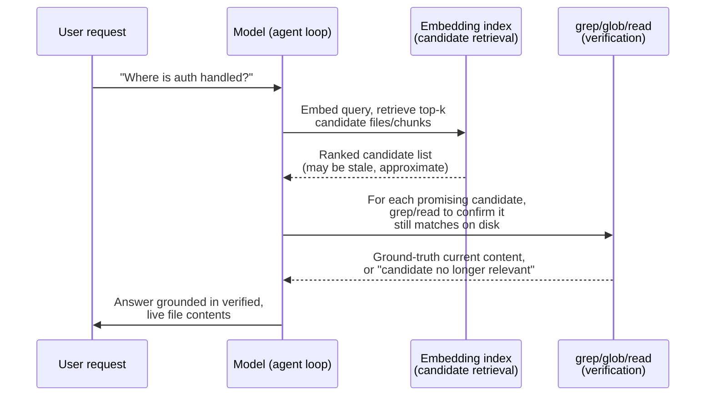

# Context retrieval / RAG vs. agentic search as a design space

**Scope note.** This page is about a question none of the book's other
context-management pages actually answer: when a codebase is too large
to ever fit in a context window, how does a harness decide *what to
pull in* in the first place? [Instruction context budget](instruction-context-budget.md)
covers the eagerly-loaded instruction tier (CLAUDE.md/rules/skill
descriptions) and how to keep it small; [Context compression](context-compression.md)
covers what happens to a conversation's own history once the window is
already full (eviction, summarization); [Built-in tools](built-in-tools.md)
inventories the concrete tools (`Grep`/`Glob`, Copilot's search tools,
OpenCode's `grep`/`glob`) without asking why those tools and not a
retrieval index. This page is the missing layer underneath all three:
the initial-discovery problem -- finding the handful of files, out of
possibly hundreds of thousands, that a given turn actually needs -- and
it treats that as a genuine two-strategy design space (embeddings-based
retrieval-augmented generation vs. agentic/iterative search) rather
than a settled question.

Every claim below is tagged VERIFIED (fetched this session from a
named source) or BEST CURRENT UNDERSTANDING, UNCONFIRMED. Claude Code,
Copilot CLI, OpenCode, and pi are four separate products from four
separate organizations (or, for pi, an independent individual
maintainer rather than an organization at all) -- nothing confirmed for
one is assumed for another. A prior pass through this book noticed,
only in passing, that all three harnesses covered at the time rely on
agentic search rather than embeddings; this page re-verifies that
finding fresh (docs, changelogs, and OpenCode's own source and issue
tracker, all re-checked this session) and gives it the dedicated
treatment it didn't get the first time, then extends the same
re-verification to pi (§5), added to this page in a later pass.

---

## 1. The design space, in general terms

### 1.1 Two competing retrieval philosophies

**Retrieval-augmented generation (RAG)**, in its original and still
most-cited formulation, is VERIFIED from `arxiv.org/abs/2005.11401`
(Lewis, Perez, Piktus, Petroni, Karpukhin, Goyal, Küttler, Lewis, Yih,
Rocktäschel, Riedel, and Kiela, "Retrieval-Augmented Generation for
Knowledge-Intensive NLP Tasks," fetched this session): a generative
model (parametric memory) is paired with a dense vector index over a
corpus (non-parametric memory) accessed through a pre-trained neural
retriever, so that at inference time the model's output is grounded in
passages retrieved by nearest-neighbor search over embeddings, rather
than relying solely on what the model memorized during training. For a
codebase, the direct analogue is: chunk every file, embed each chunk
into a vector, store the vectors in an index, and at query time embed
the user's request and retrieve the top-*k* nearest chunks by cosine
similarity (or a related metric) before ever invoking the model on the
actual task.

**Agentic (iterative) search**, by contrast, gives the model itself a
small set of discovery tools -- typically a filename-glob tool, a
content-grep tool, and a file-read tool -- and lets it decide, turn by
turn, what to look for next based on what it has already seen: read a
file, notice an import, grep for that symbol elsewhere, follow a
reference, refine the query, stop once it has enough. There is no
pre-built index and no embedding step; retrieval and reasoning are
interleaved rather than separated into a pipeline stage that runs
before the model ever sees the task. Hugging Face's agents course
draws exactly this distinction under the name "Agentic RAG," and its
framing is useful vocabulary independent of any one harness: VERIFIED,
`huggingface.co/learn/agents-course/en/unit3/agentic-rag/agentic-rag`
(fetched this session) -- classic RAG "solves this problem by finding
and retrieving relevant information from your data and forwarding
that to the LLM" as a fixed, automatic pipeline, whereas in an
agent-controlled version "instead of answering the question on top of
documents automatically, [the agent] can decide to use any other tool
or flow to answer the question," i.e. the agent has discretionary
control over which retrieval strategy (or non-retrieval tool) to
invoke, rather than a predetermined retrieve-then-generate sequence
always firing first. This is a *general* agent-engineering concept,
authoritative for the shared vocabulary, not a claim about what any of
this book's four harnesses specifically implement -- that comes in
§2-5.

### 1.2 Why this specific debate has a live literature behind it

The tradeoff is not purely theoretical. VERIFIED,
`arxiv.org/abs/2602.23368` ("Keyword search is all you need:
Achieving RAG-level performance without vector databases using
agentic tool use," Amazon Science, presented at AAAI 2026, fetched
this session): the paper's central finding is that tool-based keyword
search inside an agentic loop can attain over 90% of the performance
of a traditional embeddings-based RAG pipeline on knowledge-intensive
tasks, without any vector database at all, arguing the simplicity,
cost, and freshness advantages of keyword-plus-agency outweigh the
recall advantages of dense retrieval for a meaningful class of tasks.
That is an empirical result about general knowledge-intensive
question answering, not about source-code search specifically --
citing it here as adjacent, credible evidence that the RAG-vs-agentic
tradeoff this page investigates for code has a real, actively
published counterpart outside the code-agent world, not as a
harness-specific finding. BEST CURRENT UNDERSTANDING, UNCONFIRMED: how
closely code retrieval's precision/recall profile matches the paper's
benchmark domain is not established by anything fetched this session.

Anthropic's own engineering blog frames the same tension from the
opposite direction -- as a question of *when* context gets pulled in,
not just *how*. VERIFIED, `anthropic.com/engineering/effective-context-engineering-for-ai-agents`
(fetched this session): the post contrasts "pre-processing all
relevant data up front" against a "just in time" strategy in which
"agents...maintain lightweight identifiers (file paths, stored
queries, web links, etc.) and use these references to dynamically
load data into context at runtime using tools," explicitly naming the
tradeoff -- "runtime exploration is slower than retrieving pre-computed
data" -- and citing Claude Code itself as an example of a genuinely
*hybrid* system on this specific axis: a small, always-loaded
CLAUDE.md file (pre-processed, always in context) paired with grep as
the just-in-time mechanism for everything else. The post's closing
guidance is a pragmatic non-verdict rather than a universal rule:
"do the simplest thing that works will likely remain our best advice
for teams building agents." Note what this source does *not* say: two
separate WebFetch passes over the same page this session found no
sentence directly comparing embeddings-based search against agentic
search on accuracy, maintenance burden, or transparency the way some
secondary blog summaries (not fetched as primary sources for this
page) paraphrase it as saying -- the only explicit, directly quotable
tradeoff in the primary text is the speed-vs-thoroughness one above.
Treat any stronger claim attributed to this post as UNCONFIRMED by
this session's own reading of it.

### 1.3 A sourcing note on what follows (§1.4-§1.11)

Sections 1.4-1.11 below deepen this page's general-RAG background
using eleven Hugging Face `learn/cookbook` notebooks, all fetched in
full this session (24 August 2026). Before using them, it is worth
making the grounding-discipline call explicit rather than silently
picking a side, since `resources/grounding-discipline.md` names only
two specific paths -- `huggingface.co/learn/agents-course` and
`huggingface.co/learn/context-course` -- as authorized "general
agent-engineering concepts" sources, and `learn/cookbook` is a third,
unlisted path in the same `huggingface.co/learn/` namespace. Read
strictly, that enumeration could be taken as a closed whitelist that
excludes cookbook notebooks entirely. This page reads it the other
way, for a reason already load-bearing elsewhere on this same page:
§1.1-§1.2 already cite `arxiv.org/abs/2005.11401` (Lewis et al.) and
`arxiv.org/abs/2602.23368` (Amazon Science) as general background, and
neither URL is Hugging Face content at all -- both are licensed under
the grounding file's separate, broader clause covering "Anthropic/
GitHub engineering blogs, the MCP spec, and other named official
pages -- authoritative for whatever they themselves document." The
two named `learn/` paths are best read as *examples* clarifying that
general-purpose HF course content counts as shared vocabulary, not as
an exhaustive list foreclosing every other official HF page. Under
that reading, the eleven `learn/cookbook` notebooks -- first-party
Hugging Face documentation-adjacent content, authored and hosted the
same way as the two explicitly named course paths -- qualify for
exactly the same treatment this page already gives Lewis et al.: cited
as general LLM-application background establishing vocabulary and
technique taxonomy, VERIFIED for what was actually read this session,
and **never** as a claim about Claude Code, Copilot CLI, OpenCode, or
pi's own behavior (none of the eleven notebooks mentions any of the
four by name, and none was fetched with that intent). Decision, stated
plainly: cite them, under that constraint. If a future editor judges
this reasoning wrong, the fix is to tighten
`resources/grounding-discipline.md`'s own wording, not to silently
diverge from what this page states here.

### 1.4 Naive RAG baseline and the advanced-RAG refinements it is measured against

The plainest possible RAG implementation and a deliberately more
sophisticated one are documented back to back in Hugging Face's own
cookbook, and reading them together gives the "naive vs. advanced RAG"
taxonomy referenced informally elsewhere in this book concrete,
citable shape. VERIFIED, `huggingface.co/learn/cookbook/en/rag_zephyr_langchain`
(fetched this session): the baseline pattern is a single-stage
pipeline -- documents split with a `RecursiveCharacterTextSplitter`
into 512-character chunks with 30-character overlap, embedded with
`BAAI/bge-base-en-v1.5`, indexed in a FAISS vector store, and queried
via `as_retriever(search_kwargs={'k': 4})`, so the top-4
nearest-neighbor chunks by embedding similarity are concatenated
directly into the generation prompt with no intermediate refinement
step. The notebook frames RAG's core value proposition as avoiding
model fine-tuning and the "model shift" that comes with retraining,
instead retrieving context dynamically so the underlying LLM can be
swapped freely.

VERIFIED, `huggingface.co/learn/cookbook/en/advanced_rag` (fetched
this session): the "advanced" variant differs from that baseline in
two structurally distinct ways, not merely a parameter tweak. First,
chunking is markdown-structure-aware and token-counted rather than
character-counted -- a recursive splitter applies "a given list of
separators sorted from the most important to the least important
separator" (so a document's own heading hierarchy determines where
splits happen before falling back to generic separators), and chunk
length is measured in tokens to match the embedding model's actual
input-length constraint rather than an arbitrary character count.
Second, and more consequentially, retrieval becomes a genuine two-stage
process: an initial embedding-similarity pass retrieves 30 candidate
chunks (a wide net), and a `ColBERTv2` cross-encoder --  "a cross-encoder
that computes more fine-grained interactions between the query tokens
and each document's tokens" -- then reranks that candidate set down to
the 5 chunks that actually reach the prompt. The notebook is explicit
that this pipeline has many independently tunable stages and that
"tuning the system properly will yield significant performance gains,"
framing advanced RAG as a family of composable refinements over the
naive baseline rather than a single fixed alternative architecture.

Cross-encoder reranking as the differentiator between naive and
advanced RAG matters for this page's own harness-level findings
precisely because it is a *refinement of the embeddings-based pipeline
itself*, not a move toward agentic search -- none of the naive/advanced
distinction bears on the RAG-vs-agentic-search axis §1.1 introduces;
it is orthogonal background explaining that "RAG" is not one fixed
technique even before the agentic alternative enters the picture.

### 1.5 Vector-database-specific indexing and retrieval patterns

Three of the eleven notebooks each wire the same conceptual RAG
pipeline to a different vector-store product, and the differences
between them are informative about what "the vector database" actually
varies across real deployments -- deployment topology, similarity
metric, and whether the store is dedicated to vectors at all.

VERIFIED, `huggingface.co/learn/cookbook/en/rag_with_hf_and_milvus`
(fetched this session): the notebook embeds chunks with
`BAAI/bge-small-en-v1.5` (384 dimensions) and indexes them in Milvus,
demonstrating three separate deployment modes on the same API surface
-- Milvus Lite (a local embedded file, `./hf_milvus_demo.db`, for small
datasets), a full Milvus server ("if you have a large amount of data,
say more than a million vectors, you can set up a more performant
Milvus server"), or Zilliz Cloud as a managed option -- an Inner
Product similarity metric, strong consistency configured at collection
creation, dynamic (non-schema-declared) JSON fields for arbitrary
metadata, and top-3 retrieval.

VERIFIED, `huggingface.co/learn/cookbook/en/rag_with_hugging_face_gemma_elasticsearch`
(fetched this session): the notebook demonstrates two alternative
places embedding computation can happen -- "ES-hosted" vectorization,
where the embedding model is deployed inside Elasticsearch itself via
Eland and runs as part of an ingest pipeline so "your clients don't
have to implement it" (at the cost of requiring dedicated ML nodes),
versus client-side vectorization with Sentence Transformers before
data ever reaches the cluster. Both paths index into a `dense_vector`
field mapping and query via k-nearest-neighbor search (k=10, cosine
similarity). Worth flagging precisely for accuracy: this specific
notebook's search configuration is pure vector *k*NN, not a
BM25-plus-vector hybrid query, even though Elasticsearch as a product
is widely capable of hybrid lexical-plus-dense retrieval -- the
notebook does not exercise that capability, so citing it as a hybrid
example would overstate what was actually read this session.

VERIFIED, `huggingface.co/learn/cookbook/en/rag_with_hugging_face_gemma_mongodb`
(fetched this session): embeddings here are `gte-large` (1024
dimensions), indexed via a MongoDB Atlas Vector Search index
(`"numDimensions": 1024, "similarity": "cosine", "type": "vector"`)
and queried through MongoDB's aggregation-pipeline query syntax rather
than a separate vector-database client. The notebook's own framing is
the structurally interesting point: "MongoDB acts as both an
operational and a vector database," i.e. this pattern demonstrates
consolidating the application's primary document store and its
retrieval index into one product, rather than the two-system
split (application database plus dedicated vector store) the Milvus
and Elasticsearch notebooks both assume.

Taken together, these three notebooks demonstrate that "the vector
database" in a RAG pipeline is a genuinely variable component along
at least three axes -- deployment topology (embedded/local vs.
server vs. managed-cloud), where the embedding step physically runs
(client-side vs. store-hosted), and whether the vector index is a
dedicated product or a capability layered onto an existing operational
database -- independent of the naive-vs-advanced retrieval-sophistication
axis §1.4 covers.

### 1.6 Semantic caching as a retrieval-adjacent optimization

VERIFIED, `huggingface.co/learn/cookbook/en/semantic_cache_chroma_vector_database`
(fetched this session): semantic caching is a distinct technique from
retrieval itself, aimed at a production cost/latency problem rather
than a relevance problem -- the notebook frames naive single-query RAG
pipelines as becoming "insufficient when attempting to transition one
of these models to production, where they might encounter from tens
to thousands of recurrent requests," and a semantic cache intercepts
requests that are similar in *meaning*, not just identical in text,
before they ever reach the retrieval step. The notebook's own
architecture: incoming questions are embedded with a
`SentenceTransformer`, compared against a FAISS in-memory index of
previously-seen query embeddings using Euclidean distance, and a
cache hit fires when that distance falls below a configured threshold
(0.35 in the notebook's own worked example -- a rephrased version of a
cached question, "Write in 20 words what is a Sydenham chorea" against
an original "Briefly explain me what is a Sydenham chorea," produced a
distance of 0.228, still under threshold, and returned the cached
answer rather than re-querying the underlying ChromaDB vector store).
Cached responses persist across sessions in a JSON file, with FIFO
eviction once a configured maximum size is reached. Architecturally,
the cache sits *between the user query and the vector-database
retrieval step, not between the user and the LLM* -- the notebook's own
stated reasoning is that semantically similar questions require
identical retrieved context even when the desired response wording
differs, so short-circuiting at the retrieval boundary is the more
general optimization point. The notebook reports informal, tutorial-scale
figures (roughly 50% latency reduction in small deployments, claimed
"90-95%" in larger systems with clustered repeat queries) -- flagged
here explicitly as the notebook's own unverified, non-benchmarked
claim, not an independently confirmed figure.

### 1.7 Structured generation as a retrieval-adjacent reliability technique

VERIFIED, `huggingface.co/learn/cookbook/en/structured_generation`
(fetched this session): this notebook is not about retrieval directly,
but about a reliability technique that becomes necessary once a RAG
pipeline's output needs to be machine-parseable -- specifically, the
notebook's own worked example is "a RAG system that not only provides
an answer, but also highlights the supporting snippets that this
answer is based on," which requires the model to emit both an answer
string and structured citation metadata in one response. Two
approaches are contrasted. Prompting-based structuring (instructing
the model in natural language to emit valid JSON) is shown to be
fragile: output quality degrades and becomes unparseable as sampling
temperature rises or a less capable model is substituted. Grammar-
constrained (structured) decoding, demonstrated via the `Outlines`
library against a Pydantic schema, is the more robust alternative --
the notebook describes it as "constrained decoding where we force the
LLM to only output tokens that conform to a set of rules," implemented
mechanically as a logit bias: "Outlines works by applying a bias on
the logits to force selection of only the ones that conform to your
constraint." This converts schema conformance from a probabilistic,
prompt-quality-dependent property into a guaranteed one, regardless of
model size or temperature -- the notebook's own framing is that this
turns structured generation from "a convenience feature into a
reliability mechanism" for any pipeline (RAG or otherwise) that needs
to hand a model's output to downstream code without a parsing-failure
path.

### 1.8 Retrieval over unstructured and mixed-format data

VERIFIED, `huggingface.co/learn/cookbook/en/rag_with_unstructured_data`
(fetched this session): the naive chunking strategies described in
§1.4 (fixed character counts with overlap) assume the source is
already clean, undifferentiated text. This notebook demonstrates the
preprocessing problem that arises when source documents mix content
types (titles, tables, narrative prose, list items) inside PDFs, HTML,
or other real-world formats: rather than splitting on raw character
counts, the `Unstructured` library first *partitions* each document
into typed elements -- "Unstructured partitions all types of documents
in a uniform manner, and returns json with document elements," each
carrying a type (`NarrativeText`, `Title`, `Table`, etc.) and source
metadata. Chunking then respects those element boundaries rather than
cutting across them, explicitly "to avoid a situation where unrelated
pieces of text end up in the same element" -- individual elements are
only split further if they exceed a maximum chunk size, and multiple
small elements (such as consecutive list items) may be combined if
they fit within it. The rest of the pipeline is otherwise familiar:
`BAAI/bge-base-en-v1.5` embeddings, a ChromaDB vector store, LangChain
orchestration. The general point this contributes to the background
this page is building: chunking strategy is not one problem but two --
how large a chunk should be (§1.4's character-vs-token axis) and what
counts as a coherent *unit* to chunk in the first place, which depends
on the source format's own internal structure and is invisible to a
naive fixed-length text splitter.

### 1.9 Knowledge-graph RAG: graph traversal as an alternative and complementary retrieval strategy

VERIFIED, `huggingface.co/learn/cookbook/en/rag_with_knowledge_graphs_neo4j`
(fetched this session): every retrieval mechanism covered so far in
§1.4-1.8 is a variant of nearest-neighbor search over a flat set of
embedded chunks. This notebook demonstrates a structurally different
retrieval substrate -- a property graph, built in Neo4j from synthetic
research data with typed entities (`Researcher`, `Article`, `Topic`)
connected by typed relationships (`Researcher -[PUBLISHED]-> Article`,
`Article -[IN_TOPIC]-> Topic`), populated via Cypher statements parsed
from CSV. The notebook's own stated rationale for the graph
representation itself: "the inherent expressiveness of graphs allows
for richer semantic understanding, while providing the flexibility to
accommodate new entity types and relationships without being
constrained by a fixed schema" -- a schema-flexibility argument
distinct from anything a fixed vector-index dimensionality choice
offers. Retrieval over that graph is demonstrated two ways in the same
notebook: a vector-similarity pass (OpenAI embeddings over article
topics/titles/abstracts, ranked by cosine distance, functionally
identical in kind to §1.5's vector-DB patterns) and a graph-traversal
pass via `GraphCypherQAChain`, which has the LLM itself translate a
natural-language question into a Cypher query "from user input
(natural language) applying in-context learning," then executes that
query against the graph to traverse multi-hop relationships directly
(for example, finding co-authorship chains a single-hop similarity
search cannot express). The notebook's own stated differentiator is
explicit: graph traversal contributes "multi-hop connectivity and
contextual understanding of information to enhance reasoning and
explainability" that "vector similarity cannot accomplish
independently" -- i.e. the two retrieval strategies are complementary
rather than competing, addressing different query shapes (semantic
similarity vs. relationship-chain inference) within the same system.

### 1.10 A retrieval-agent counter-example, and why it sharpens rather than complicates §1.1's distinction

VERIFIED, `huggingface.co/learn/cookbook/en/rag_llamaindex_librarian`
(fetched this session): this notebook's title and premise (a
conversational "librarian" over a personal ebook collection) might
suggest an agentic retrieval system in the sense §1.1 defines via the
Hugging Face agents-course source -- a model with discretionary control
over retrieval strategy. Reading it in full this session found the
opposite: the notebook builds a fixed, three-phase, non-agentic
pipeline using LlamaIndex's own stated structure -- "Loading, in which
you tell LlamaIndex where your data lives and how to load it; Indexing,
in which you augment your loaded data to facilitate querying, e.g.
with vector embeddings; Querying, in which you configure an LLM to act
as the query interface for your indexed data" -- implemented
concretely as `SimpleDirectoryReader` loading `.epub` files, a
`VectorStoreIndex` built over Hugging Face embeddings, and an
Ollama-hosted Llama 2 model generating from retrieved passages. There
is no tool-use, function-calling, or iterative reasoning loop anywhere
in the notebook; the model does not decide whether or how to retrieve,
it simply consumes whatever the fixed query engine hands it. This is
worth stating explicitly as a negative finding rather than skipping
it: "built with an agent-oriented framework" (LlamaIndex is broadly
marketed around agent construction) is not the same property as
"performs agentic retrieval" in the discretionary-control sense this
page's own vocabulary depends on, and this notebook is a clean,
directly-read example of the former without the latter -- reinforcing,
not blurring, the naive-RAG-vs-agentic-RAG line §1.1 already draws from
the agents-course source.

### 1.11 RAG evaluation methodology

VERIFIED, `huggingface.co/learn/cookbook/en/rag_evaluation` (fetched
this session): evaluating a RAG pipeline is presented as a
categorically harder problem than evaluating a plain LLM's output,
because a RAG system has many independently tunable components --
"RAG systems are complex, with many parameters... that won't be
efficient if evaluated qualitatively," and "changing anything is
useless if you cannot monitor the impact of your changes on the
system's performance" -- so the notebook builds a benchmarking harness
that systematically varies chunk size, embedding model, and reranking
configuration and measures the effect of each change, rather than
eyeballing individual outputs. Two distinct evaluation moments are
demonstrated. First, synthetic question/answer-pair generation is
itself filtered through three LLM-scored criteria before being trusted
as a test set: groundedness (the answer is actually derivable from the
source passage), relevance (the generated question meaningfully
relates to the passage it was derived from), and standalone quality
(the question is comprehensible without needing the source passage for
context). Second, end-to-end system performance is scored via
LLM-as-judge -- GPT-4 grading each answer on a 1-5 rubric scale, with
the notebook stressing rubric precision as a methodological
requirement rather than a nicety: "if instead you give the judge LLM a
vague scale to work with, the outputs will not be consistent enough."
Of the full space of possible RAG metrics, the notebook deliberately
narrows to one for its own comparative benchmarking: "we choose to
focus only on Answer Correctness since it is the best end-to-end
metric of our system's performance," treating the many other candidate
metrics as diagnostic rather than as the headline comparison figure
across configurations.

---

## 2. Claude Code

Sources for this section, all fetched fresh this session:
`code.claude.com/docs/en/large-codebases`; `claude.com/blog/how-claude-code-works-in-large-codebases-best-practices-and-where-to-start`;
`github.com/anthropics/claude-code`'s `CHANGELOG.md` (full file, via
`gh api`); and, as a secondary but directly-fetched source for a
specific attributed quote, `vadim.blog/claude-code-no-indexing/`.
Cross-references [Built-in tools](built-in-tools.md) §1.5 for `Grep`/
`Glob`/`Read`'s own mechanics rather than repeating them here.

### 2.1 A documented reversal, not a default that was never tried

Claude Code's own product blog states the design decision directly and
in contrast to embeddings-based competitors. VERIFIED,
`claude.com/blog/how-claude-code-works-in-large-codebases-best-practices-and-where-to-start`
(fetched this session): Claude Code uses "agentic search" that
"traverses the file system, reads files, uses grep to find exactly
what it needs, and follows references across the codebase," and the
post names the alternative it is explicitly rejecting: "RAG-powered
AI coding tools work by embedding the entire codebase and retrieving
relevant chunks at query time. At large scale, those systems can fail
because embedding pipelines can't keep up with active engineering
teams... By the time a developer queries the index, it reflects the
codebase as it previously existed weeks, days, or even hours before."
The stated advantage of the agentic alternative is freshness by
construction: "There's no embedding pipeline or centralised index to
maintain as thousands of engineers commit new code. Each developer's
instance works from the live codebase." This session's own WebFetch
pass over that post found no discussion of a hybrid retrieval strategy
anywhere in it -- the only supplementary precision mechanism it
mentions is LSP-based symbol navigation (cross-referenced in
[Built-in tools](built-in-tools.md) §1.5's `LSP` entry), not embeddings
of any kind.

This was not the original design. A secondary source fetched directly
this session, `vadim.blog/claude-code-no-indexing/`, attributes a
Hacker News comment to Boris Cherny (credited there as Claude Code's
creator, Principal Software Engineer at Anthropic): "Early versions of
Claude Code used RAG + a local vector db, but we found pretty quickly
that agentic search generally works better," with an unnamed Claude
engineer quoted in the same thread as saying "In our testing we found
that agentic search outperformed [it] by a lot, and this was
surprising." Flag the provenance precisely: this is a secondary blog's
report of an on-the-record public statement, not Anthropic's own docs
or changelog, and this session could not independently load the
underlying Hacker News/X thread directly (the X post URL returned an
HTTP 402 paywall response when fetched). Treat the *substance* --
Claude Code shipped RAG+vector-DB early on and deliberately removed it
in favor of agentic search after finding it underperformed -- as
credibly sourced but one level removed from primary, not as a
docs-grade VERIFIED fact the way the current blog post's own words are.
Consistent with that account, this session's own keyword search of the
full `CHANGELOG.md` (5,534 lines, fetched via `gh api` this session)
for "embed," "vector," "semantic," and "RAG" found zero entries
describing a code-search embedding feature -- every "embed" hit is an
unrelated usage (an embedded ripgrep/`bfs`/`ugrep` binary bundled with
native builds, an embedded build timestamp, embedded shell commands in
a doc string). There is no trace in the current product's own
behavior-change history of a vector-search code-discovery feature
existing, being toggled, or being deprecated within the window this
changelog covers -- consistent with the removal having happened before
this changelog's own history begins, not with the feature being active
today under an unindexed name.

### 2.2 What actually ships instead, and where RAG is left as an opt-in seam

The current documented strategy is exactly `Grep`/`Glob`/`Read`
(mechanics in [Built-in tools](built-in-tools.md) §1.5), an `Agent`-
spawned Explore subagent for deep, context-isolated investigation
(cross-referenced in [Handoff mechanism](handoff-mechanism.md)), and,
where installed, an LSP-backed code-intelligence plugin for
definition/reference lookups that substitute for a grep-then-read
round trip. VERIFIED, `code.claude.com/docs/en/large-codebases`
(fetched this session): the monorepo/large-codebase guide's toolkit is
per-directory `CLAUDE.md` layering, `claudeMdExcludes`, `Read` deny
rules for generated/vendored code, code-intelligence (LSP) plugins,
sparse-checkout worktrees (`worktree.sparsePaths`), `additionalDirectories`/
`--add-dir` for cross-package access, and per-directory skills -- a
whole page dedicated to "how do you keep Claude Code usable at scale,"
and every lever on it is a *scoping* or *exclusion* mechanism (narrow
what's visible) rather than a *ranking* mechanism (retrieve the most
relevant chunks from everything). No embeddings, vector index, or
semantic-search feature appears anywhere on that page.

The same page contains the one place this session found Claude Code's
own documentation acknowledging embeddings-based retrieval as a live
option at all -- and it is explicitly not something Claude Code builds
or maintains itself. Under "Centralize conventions when layering stops
scaling," the guide's advice for organizations at the largest scale is:
"MCP servers: if your organization already runs a code search or RAG
index over the repository, expose it as an MCP tool so Claude queries
it instead of reading files directly." That sentence is worth reading
carefully: Claude Code's own maintainers know a codebase can be large
enough that grep-driven exploration stops being the right tool, and
their answer is not "we will build you a RAG index" but "bring your
own, and we'll let the agent call it like any other tool." This is a
real, sourced, structural fact about the design space this page is
surveying -- the seam for a hybrid exists (an MCP-exposed retrieval
tool sits in the same tool-call loop as `Grep`/`Glob`, so nothing stops
the model from choosing whichever fits a given query) but building and
operating the embeddings side of that hybrid is left entirely to the
user, not shipped as a default. See §5.2 for how this bears on the
"is a hybrid the actual ceiling" question the rest of this page builds
toward.

---

## 3. GitHub Copilot CLI

Sources for this section, fetched fresh this session:
`github.com/github/copilot-cli`'s `changelog.md` (full file, 2,979
lines, via `gh api`); `github.blog/news-insights/product-news/copilot-new-embedding-model-vs-code/`,
fetched specifically to test its scope. Cross-references
[Built-in tools](built-in-tools.md) §2.1 for the "search tools" entry
and [Instruction context budget](instruction-context-budget.md) §2.3
for the `dynamicRetrieval` finding this section re-examines with a
narrower, code-search-specific lens.

### 3.1 Copilot CLI's own code-discovery tools are grep/glob-equivalent, not embeddings-based

As documented in [Built-in tools](built-in-tools.md) §2.1, Copilot
CLI's functional "search tools" are file/content search fixed by the
changelog to Grep/Glob-equivalent behavior -- the only fix ever
recorded against them in the full changelog is "fixes Windows-style
glob pattern handling," a maintenance detail consistent with a
literal-pattern search tool, not a retrieval-ranking one. This
session's own keyword search of the full changelog for "embed,"
"vector," "semantic," and "RAG" (VERIFIED, `gh api` fetch this
session) found no entry describing an embeddings- or vector-index-based
mechanism for searching the repository's *source code*. The two hits
that do involve embeddings are both scoped elsewhere, and distinguishing
them precisely matters for this page's claim:

- Line 548 (`v1.0.66` era): "Add persisted `dynamicRetrieval` setting
  (and `--dynamic-retrieval skills=<on|off>` flag) to enable or disable
  embeddings-based retrieval of skills" -- this retrieves **skill and
  MCP instruction text** per turn (first introduced, per
  [Instruction context budget](instruction-context-budget.md) §2.3, as
  "experimental embedding-based dynamic retrieval of MCP and skill
  instructions per turn" at v1.0.5), not source files. It is a real,
  shipped, embeddings-based retrieval mechanism inside Copilot CLI --
  but its retrieval corpus is the set of installed skills'/MCP servers'
  own instruction documents, a bounded and comparatively small corpus
  the CLI itself controls the freshness of, not the user's codebase.
  Conflating this with "Copilot CLI does RAG over your code" would be
  an overreach this page deliberately avoids.
- The other embedding-adjacent hits (`gen_ai.usage.*` OpenTelemetry
  "semantic conventions," "semantic mascot theme colors," heredocs
  described as "embedded documents," "embedding shell commands
  inline," Windows path device-prefix "credential-leak vector") are
  all unrelated uses of the words "embed"/"semantic"/"vector" -- noted
  here explicitly so a future search of this same changelog isn't
  fooled by them the way a naive grep could be.

So the finding for Copilot CLI's own code discovery specifically is the
same as Claude Code's: no confirmed embeddings-based or vector-index
retrieval mechanism over the repository's source files, in any
changelog entry or docs page fetched this session. The CLI's one real
embeddings-based retrieval feature exists, but retrieves a different
and much smaller corpus (skill/MCP instruction text), which is exactly
the finding [Instruction context budget](instruction-context-budget.md)
§2.3 already logged under a different heading -- this page's
contribution is confirming, on a fresh read scoped specifically to
code search, that the two should not be merged into one claim.

### 3.2 A GitHub embeddings feature exists -- for a different product surface

The clearest AUTHORITY OVERREACH trap in this whole topic is GitHub's
own, real, and substantial embeddings-based code-search feature --
which belongs to a different product than the one this book tracks.
VERIFIED, `github.blog/news-insights/product-news/copilot-new-embedding-model-vs-code/`
(fetched and specifically interrogated for scope this session): the
post is explicit that the feature "makes code search in VS Code faster,
lighter on memory, and far more accurate" and powers "context retrieval
for GitHub Copilot chat along with agent, edit, and ask mode" **inside
VS Code**. This session's fetch of that page found no mention of
GitHub Copilot CLI anywhere in it. The independent product-surface
distinction matters structurally, not just terminologically: GitHub
ships at least two separate Copilot surfaces (the IDE extension
family, and the standalone CLI this book tracks), and this page's
finding is scoped to the CLI only -- it says nothing about, and does
not contradict, whatever embeddings-based retrieval GitHub Copilot's
VS Code surface does for its own chat/agent modes. Treat "GitHub
Copilot uses embeddings for code search" as true of at least one
GitHub product and unconfirmed-and-likely-false of Copilot CLI
specifically, per every source fetched for this page.

---

## 4. OpenCode

Sources for this section, fetched fresh this session: `opencode.ai/docs/tools`
and `opencode.ai/docs/permissions/` (re-checked, cross-referenced
against [Built-in tools](built-in-tools.md) §3.1); and, live via `gh
api` against `github.com/anomalyco/opencode`, issues #2584, #5909, and
#27586 plus their comments (`dev`-branch repository -- the caveat that
its issue tracker reflects live, ongoing development, not a snapshot
tied to any tagged release, applies as usual).

### 4.1 The documented and source-confirmed tool surface has no retrieval index

As already established in [Built-in tools](built-in-tools.md) §3.1,
OpenCode's built-in code-discovery tools are `grep` (ripgrep-backed
regex content search with file-pattern filtering) and `glob`
(pattern-based file finding, results sorted by modification time), plus
an experimental, opt-in `lsp` tool gated behind
`OPENCODE_EXPERIMENTAL_LSP_TOOL=true`. Neither `opencode.ai/docs/tools`
nor `opencode.ai/docs/permissions/` (both re-fetched this session)
mentions an embedding model, a vector store, or a semantic-search tool
anywhere in the documented tool or permission surface. Of the three
harnesses covered in this page's original pass, this is the one whose
implementation is itself inspectable (pi, covered in §5 below, is a
second, later-added harness in this book whose implementation is
likewise open-source and directly inspected), and a
`dev`-branch source review for a different topic
([Context compression](context-compression.md) §3) already confirmed
this book's standing familiarity with that codebase's actual tool and
session machinery without turning up any retrieval-index component
there either -- consistent with, not contradicted by, this session's
fresh docs-level check.

### 4.2 Repeated, unresolved feature requests -- and the ecosystem filling the gap itself

Unlike Claude Code and Copilot CLI, where the absence of embeddings-
based code retrieval is a design decision stated (Claude Code) or
inferable from a silent changelog (Copilot CLI), OpenCode's own public
issue tracker shows the absence being actively contested by its users,
repeatedly, over time -- and closed each time without the feature
landing. VERIFIED, live `gh api` fetches this session:

- **Issue #2584**, "Have you considered using embedding models?"
  proposes exactly the hybrid this page's framing later interrogates:
  "opencode could first ask the embedding model which part of the code
  responds better to the prompt, and then send these pieces of code to
  the LLM." Closed by the repository's inactivity-bot after 90 days
  with no maintainer commitment either way.
- **Issue #5909**, "Vector Database," asks whether anyone has
  integrated a vector database tool with OpenCode "because... other
  systems work better when they are able to search the codebase using
  a vector search." Also closed by the inactivity-bot, with no
  maintainer response in the thread confirming or ruling out a native
  feature.
- **Issue #27586**, "[FEATURE]: RAG & Embedding Search Capability...",
  proposes a specific local vector store (ChromaDB/LanceDB),
  background chunk-and-embed indexing, and top-*k* context injection.
  Also closed as a stale duplicate.

What is genuinely informative here is not the requests themselves but
the comment threads underneath them, which show real users building
the hybrid OpenCode's core team hasn't shipped, entirely outside the
core project: one commenter built and shared
`github.com/MrDoe/OpenCodeRAG`, a plugin adding RAG; another pointed to
`github.com/Davidyz/VectorCode`'s MCP-server integration; a third
recommended `chunkhound`; and a fourth described, in detail, a
self-built hybrid retrieval plugin combining local Ollama-generated
embeddings stored via SQLite's `sqlite-vec` extension with FTS5
full-text search and identifier boosting, reporting (their own words,
an informal, non-peer-reviewed claim this session has no way to
verify) "around 98% retrieval accuracy in my benchmarks," and noting
explicitly that "pure vector search alone isn't great for code because
you miss exact function names and import paths" -- i.e. a from-scratch,
user-built confirmation of the same hybrid-precision intuition this
page's §5 develops formally, arrived at independently by someone
patching around OpenCode's gap rather than reading any harness's design
documentation. BEST CURRENT UNDERSTANDING, UNCONFIRMED: whether
OpenCode's maintainers have an internal position on why this stays a
community-plugin space rather than a core feature (a Claude-Code-style
staleness/simplicity argument, a resourcing decision, or something
else) -- no maintainer comment stating a rationale was found on any of
the three issues fetched this session, so the silence itself is the
only confirmed fact, not a reason.

---

## 5. pi

Sources for this section, all fetched fresh this session (1 September
2026): `github.com/earendil-works/pi`'s `packages/coding-agent/src/core/tools/index.ts`,
`grep.ts`, and `find.ts` (raw fetch, `main` branch); `packages/ai/package.json`
and `packages/coding-agent/package.json` (raw fetch); the full
`packages/coding-agent/CHANGELOG.md` (5,625 lines, raw fetch);
`packages/coding-agent/docs/usage.md` and `docs/index.md` (raw fetch);
Mario Zechner's own blog post `mariozechner.at/posts/2025-11-30-pi-coding-agent/`
(re-fetched this session and quote-checked against its raw HTML, not
just a summarized pass -- already used elsewhere in this book, per
[Permissions and sandboxing](permissions-and-sandboxing.md) §5); and,
via `gh api` against `github.com/earendil-works/pi`'s issue tracker,
a keyword search for "embedding"/"vector"/"RAG"/"semantic search" and
full-thread fetches of issues #1255, #2787, and #1182, plus
`gh api users/badlogic` to independently confirm that GitHub identity.
Cross-references [LLM API contract](llm-api-contract.md) §3.5,
[Hooks/lifecycle/extensibility](hooks-lifecycle-extensibility.md),
[Permissions and sandboxing](permissions-and-sandboxing.md), [Session
persistence](session-persistence.md), [Configuration](configuration.md),
[Auth and usage accounting](auth-and-usage-accounting.md), [Built-in
skills](built-in-skills.md), [Context compression](context-compression.md),
and [Model routing and selection](model-routing-and-selection.md), all
of which already document pi from other angles but not this one.

### 5.1 Resolving the package/repo naming question first

Before anything else: this book's own prior pi sections cite the
package as both `@earendil-works/pi-ai` ([LLM API contract](llm-api-contract.md)
§3.5) and `@earendil-works/pi-coding-agent` ([Session persistence](session-persistence.md),
[deterministic orchestration](deterministic-orchestration.md)), and
this request flagged that as a possible inconsistency worth resolving
from source rather than trusting either citation. VERIFIED, directly
from `github.com/earendil-works/pi`'s own repository tree and both
packages' `package.json` files (fetched this session): `pi` is a
monorepo (npm workspaces, root `package.json`) containing at least nine
sub-packages under `packages/` -- `agent`, `ai`, `client`, `coding-agent`,
`evals`, `protocol`, `server`, `session-backends`, `telemetry`, `tui`.
Two of those are the packages this book's prior sections actually cite,
and they are two genuinely different, both-correct npm publications,
not a spelling error: `packages/ai/package.json` names the published
package `@earendil-works/pi-ai` (version `0.84.4` at fetch time,
described in its own `package.json` as "Unified LLM API with automatic
model discovery and provider configuration," authored by Mario Zechner,
exposing a `pi-ai` CLI bin), while `packages/coding-agent/package.json`
names the published package `@earendil-works/pi-coding-agent` (same
`0.84.4` version at fetch time, described as "Coding agent CLI with
read, bash, edit, write tools and session management," exposing the
`pi` CLI bin). `pi-coding-agent` depends on `pi-ai` directly (`"@earendil-works/pi-ai": "^0.84.4"`
in its own dependency list) among four other same-monorepo siblings
(`pi-agent-core`, `pi-client`, `pi-protocol`, `pi-tui`). So: `pi-ai` is
the model-agnostic LLM API client layer (correctly the subject of
[LLM API contract](llm-api-contract.md) §3.5, which is specifically
about that contract layer), and `pi-coding-agent` is the actual
terminal coding-agent harness built on top of it (correctly the
subject of every other pi section in this book, which are about the
harness's behavior, not its LLM API plumbing) -- both spellings already
in this book are correct for what they each individually describe; the
apparent inconsistency dissolves once the citation is read at the
package-scoped level rather than treated as one undifferentiated "pi"
package. One further historical wrinkle, found while reading the
changelog for §5.3 below and worth recording here rather than treating
as noise: an entry dated `[0.24.1] - 2025-12-19` still refers to the
package as `@mariozechner/pi-coding-agent` and links its own issue
tracker at `github.com/badlogic/pi-mono` -- VERIFIED evidence that the
project was itself renamed at some point between that release and this
session's fetch, from author Mario Zechner's personal npm scope and a
`badlogic/pi-mono` repository to the `earendil-works` organization
scope and repository this book (correctly) already cites everywhere
else. BEST CURRENT UNDERSTANDING, UNCONFIRMED: the exact release or
date the rename completed -- no changelog entry announcing the rename
itself was found in this session's keyword pass.

### 5.2 The built-in tool surface: `grep` and `find`, no retrieval index anywhere in it

VERIFIED, directly from `packages/coding-agent/src/core/tools/index.ts`
(fetched this session): pi's entire built-in tool surface is a closed,
named enumeration of exactly eight tools -- `type ToolName = "read" |
"bash" | "powershell" | "edit" | "write" | "grep" | "find" | "ls"`, with
a matching `allToolNames` set and factory functions (`createTool`,
`createToolDefinition`, `createAllTools`) that switch over precisely
those eight names and throw `Unknown tool name` for anything else. Two
of those eight are the code-discovery tools of interest to this page,
and both are unambiguously agentic/iterative, not retrieval-index-based.
VERIFIED, directly from `grep.ts`'s own schema and system-prompt
contribution (fetched this session): the `grep` tool takes a `pattern`
(regex or literal string), an optional `path`, an optional `glob` filter,
`ignoreCase`, `literal`, `context`, and `limit` parameters, is described
to the model as "Search file contents for patterns (respects
.gitignore)," and its own `GrepOperations` interface documents its
actual implementation as "Default: local filesystem plus ripgrep" --
i.e. it shells out to (or wraps) ripgrep against files on disk at call
time, the same mechanism [Built-in tools](built-in-tools.md) documents
for Claude Code's, Copilot CLI's, and OpenCode's own grep-equivalents.
VERIFIED, directly from `find.ts`'s own schema (fetched this session):
the `find` tool's `pattern` parameter is described as "Glob pattern to
match files, e.g. '*.ts', '**/*.json', or 'src/**/*.spec.ts'," making it
the direct functional equivalent of Claude Code's `Glob`, Copilot CLI's
file-search tool, and OpenCode's `glob`. Neither tool file, nor any of
the other six (`read.ts`, `write.ts`, `edit.ts`, `bash.ts`, `powershell.ts`,
`ls.ts`), contains any reference to an embedding model, a vector index,
or a similarity-ranked result set -- both `grep` and `find` return
literal, exact matches against the live filesystem, ranked (if at all)
only by match order or a caller-supplied `limit`, never by a computed
relevance score. A separate `search` module does exist in the
sibling `packages/agent/src/search/` directory, but VERIFIED, directly
from its own `index.ts` (fetched this session), its `SessionSearch`
interface searches *stored session transcripts* (`sessionId`/`entryId`
hits over prior conversation entries, e.g. for a fullscreen-transcript
search-as-you-type feature the changelog documents elsewhere) -- an
entirely different retrieval target from the codebase itself, and
worth flagging by name precisely so a future search of this same
package for "search" isn't misread as evidence of code-level retrieval.

### 5.3 No embeddings/vector dependency in either package's own dependency graph, and no such feature in 5,625 lines of changelog

VERIFIED, directly from `packages/ai/package.json` and
`packages/coding-agent/package.json` (fetched this session): neither
package's `dependencies` list contains any embedding-model client,
vector-database client, or ANN-index library. `pi-ai`'s dependencies
are entirely LLM-provider SDKs and low-level HTTP/proxy plumbing
(`@anthropic-ai/sdk`, `@aws-sdk/client-bedrock-runtime`, `@google/genai`,
`openai`, `@smithy/node-http-handler`, `http-proxy-agent`,
`https-proxy-agent`, `partial-json`, `typebox`); `pi-coding-agent`'s
dependencies are its own monorepo siblings plus terminal/CLI/file
utilities (`chalk`, `cross-spawn`, `diff`, `highlight.js`, `ignore`,
`minimatch`, `semver`, `undici`, `yaml`, `@silvia-odwyer/photon-node`
for image processing). No `faiss`, `chromadb`, `hnswlib`,
`@xenova/transformers`, `sqlite-vec`, or any comparably-named package
appears in either dependency list. VERIFIED, keyword search of the full
`packages/coding-agent/CHANGELOG.md` (5,625 lines, raw-fetched this
session) for "embed," "vector," "semantic," "RAG," and "retriev": every
hit is unrelated to code-search retrieval -- an RPC `clear_queue`
feature described as letting callers "retrieve and clear queued
steering and follow-up messages," an inherited Bedrock ARN fix
preferring "the ARN's embedded region," HTML export escaping "embedded
image data," OSC 133 "semantic zone markers" for terminal prompt
navigation, editor-paste handling of "embedded escape sequences," and
`ModelRegistry`'s model/API-key "discovery" (a naming collision with
retrieval vocabulary, not a retrieval feature). No entry in this
harness's own recorded behavior-change history describes an embedding-
or vector-index-based code-search feature ever existing, being added,
or being removed -- the same negative-evidence pattern §2.1
found for Claude Code's changelog and §3.1
found for Copilot CLI's, but for pi found across its *entire* public
history rather than only the window a changelog happens to cover,
since `pi`'s changelog runs back to its earliest tagged releases
(the `[0.24.1]` entry cited in §5.1 above is itself deep in that
history, not near the top).

### 5.4 A stated design philosophy of explicit minimalism, and no MCP seam either

Unlike Claude Code's blog (§2.1), which argues against embeddings *on
freshness/maintenance grounds specifically*, pi's own creator states a
broader, harness-wide minimalism philosophy that subsumes the
retrieval question without addressing it by name. VERIFIED, directly
from the raw HTML of `mariozechner.at/posts/2025-11-30-pi-coding-agent/`
(fetched and quote-checked this session, not summarized): "My
philosophy in all of this was: if I don't need it, it won't be built.
And I don't need a lot of things." Applied concretely to the tool
surface itself, the same post states pi ships four tools by default
(`read`, `write`, `edit`, `bash`) with `grep`, `find`, and `ls` as
additional, off-by-default "read-only tools... if you want to restrict
the agent from modifying files or running arbitrary commands," and
states plainly: "As it turns out, these four tools are all you need
for an effective coding agent. Models know how to use bash and have
been trained on the read, write, and edit tools with similar input
schemas." (This session's direct source-fetch in §5.2 above found a
`powershell` tool alongside the seven this blog post names, which post-dates
the November 2025 post -- a minor drift between the earliest published
philosophy and the current tool count that this page flags for
precision rather than treating the blog post as still literally
current on tool count; the *no-embeddings-tool* finding, which is
what this page cares about, is unaffected by that drift and independently
confirmed straight from today's source in §5.2.) The post explicitly
frames this against competitors' tool surfaces by name -- "Compare this
to Claude Code's tool definitions or opencode's tool definitions... pi's
system prompt and tool definitions together come in below 1000 tokens"
-- arguing minimal token footprint as a deliberate design goal, not
merely an absence of a specific feature.

Pi's own docs go further than either Claude Code's or Copilot CLI's in
one specific, structurally relevant way: unlike Claude Code's
documented MCP-as-bring-your-own-RAG-index seam (§2.2 above),
pi does not ship MCP support at all, by explicit design choice.
VERIFIED, directly from `packages/coding-agent/docs/usage.md` (fetched
this session): "It intentionally does not include built-in MCP,
sub-agents, permission popups, plan mode, to-dos, or background bash.
You can build or install those workflows as extensions or packages, or
use external tools such as containers and tmux." So the specific
hybrid-extension-point this page's §6.2 examines for the other three
harnesses -- an MCP server exposing a pre-built retrieval index as a
callable tool -- has no ready-made seam in pi at all; the only
documented path to a pi-side embeddings-based retrieval capability
would be pi's own TypeScript "extension" mechanism ([Hooks/lifecycle/extensibility](hooks-lifecycle-extensibility.md)
documents its `extensions.md`-defined tool/command/event surface),
authoring a genuinely custom tool from scratch rather than wiring in an
existing MCP-exposed index the way Claude Code's guide describes --
consistent with, though not identical in kind to, OpenCode's own
gap-filled-by-third-parties situation (§4.2), except that, per §5.5
below, pi's case comes with a directly on-record maintainer reaction to
exactly such an attempt, not merely silence.

### 5.5 The maintainer's own on-record rejection of an embeddings/RAG contribution

Unlike any of the other three harnesses, where this page found silence
rather than a stated argument against the specific hybrid shape (§6.2's
point 4), pi's public issue tracker contains a direct, first-party,
on-record instance of its own creator rejecting exactly this kind of
contribution -- worth reporting precisely rather than folding
uncritically into "pi has no embeddings," because the target was
cross-session *memory* recall, not source-code discovery specifically,
and the register of the response is personal rather than a written
engineering rationale. VERIFIED, `gh api` issue search and full-thread
fetch against `github.com/earendil-works/pi` this session: issue #1255,
"Adopt OpenClaw Memory/RAG Architecture," proposed replacing an
existing thin CLI wrapper with a full embeddings/vector architecture --
a `MemorySearchManager` interface, a SQLite-plus-`sqlite-vec` backend
with configurable chunking, hybrid vector-plus-BM25 search with
tunable weights, file-watching auto-sync, past-session-transcript
indexing, and a pluggable `EmbeddingProvider` abstraction (OpenAI
`text-embedding-3-small`, Gemini `text-embedding-004`, or a local GGUF
model via `node-llama-cpp`). A contributor (`jasonkneen`) implemented
a substantial portion of it as a new `@mariozechner/pi-memory` package
(core types, three embedding providers, SQLite schema with FTS5 and
vector tables, file watching, embedding cache) and posted a detailed
progress update. The issue's only other comment, from GitHub user
`badlogic` -- VERIFIED, `gh api users/badlogic`, this session: `name`
field resolves to "Mario Zechner," `blog` field resolves to
`mariozechner.at`, i.e. the same person already cited by name
throughout this section and elsewhere in this book as pi's creator --
reads in full: "Good job, you are now forever banned from all my
repositories!" The issue was then closed. A related issue, #2787
("memory-first extension destroys interactive sessions with irrelevant
results," reporting that a memory-recall extension was injecting
0.98-confidence-scored but irrelevant embedding-search hits into every
turn and consuming "80%+ of available context window"), drew the same
maintainer's one-word reply, "you are banned," though that thread's
closure is entangled with a contemporaneous "OSS weekend" contributor-
gating policy auto-closing the issue first, so the ban there cannot be
cleanly isolated as a response to the memory/RAG content specifically
the way #1255's can. Treat the *substance* -- pi's own creator has, at
least once, responded to a fully-implemented embeddings/vector/hybrid-search
memory contribution with outright personal rejection rather than a
written technical counter-argument -- as VERIFIED for that one
instance, and BEST CURRENT UNDERSTANDING, UNCONFIRMED as a
generalizable "this is why pi will never ship embeddings for code
search either": the proposed architecture targeted cross-session
memory/knowledge recall, a different retrieval target from the
codebase-file discovery this page is scoped to, and no comment in
either thread states a technical reason (staleness, cost, complexity,
or otherwise) as opposed to a purely personal one.

Separately, and in a calmer register that lines up cleanly with
OpenCode's third-party-plugin pattern (§4.2): issue #1182, "Sharing my
memory extension - pi-hippocampus," is a contributor (`lebonbruce`)
announcing a standalone, non-core extension implementing exactly the
same category of capability -- "uses vector search so it actually
understands what you're asking (not just keyword matching)," with a
"forgetting curve" for relevance decay -- explicitly filed not as a
proposed core change ("I'm not proposing changes to pi-mono itself.
This is a standalone extension that lives in its own repo") but as a
show-and-tell, and redirected by another commenter to the project's
Discord for a community-extensions channel rather than merged or
rejected. This is the calibrated version of the same finding: pi's
ecosystem does build embeddings-based retrieval capability, same as
OpenCode's community plugins in §4.2, but it lives entirely outside
the core project as an installable extension, never as a built-in
feature, and at least once (per #1255) meets active hostility rather
than mere disinterest when pitched as a core-repository change instead
of a standalone package.

The finding for pi, stated at the same precision as §2-4's closing
lines: no embeddings-based or vector-index retrieval mechanism for code
discovery exists anywhere in pi's own source, dependency graph, or
changelog, per every artifact fetched this session; its two
code-discovery tools (`grep`, `find`) are agentic, iterative,
ripgrep/glob-pattern tools structurally identical in kind to the other
three harnesses' equivalents; and pi is the one harness of the four
whose own creator has both stated, in his own words, an explicit
minimalism rationale extending to declining even the MCP integration
surface the others use as their nearest thing to a documented hybrid
seam, and personally, on the record, rejected a fully-built
embeddings/RAG contribution when it targeted the core repository
rather than a standalone extension.

---

## 6. Synthesis and the hybrid-as-ceiling question

### 6.1 Convergence, restated precisely

| Dimension | Claude Code | Copilot CLI | OpenCode | pi |
|---|---|---|---|---|
| Primary code-discovery mechanism | Agentic: `Grep`/`Glob`/`Read`, optional LSP plugin, Explore subagent | Agentic: grep/glob-equivalent "search tools," `view` | Agentic: `grep`/`glob`, optional experimental `lsp` | Agentic: `grep`/`find`, `ls`, `read` |
| Ever shipped embeddings/vector code search? | Yes, early versions, per a secondary-sourced but credible attributed quote -- deliberately removed | No confirmed instance in any doc/changelog fetched | No -- never shipped, repeatedly requested, never landed | No confirmed instance anywhere in its full changelog history |
| Any embeddings-based retrieval mechanism at all? | None found for code; none found for anything else either, in sources fetched this session | Yes -- `dynamicRetrieval`, scoped to skill/MCP **instruction text**, not source code | None found anywhere in docs or source | None found anywhere in source, dependency graph, or changelog |
| Stated rationale against embeddings-for-code | Explicit, in Claude Code's own blog: staleness ("reflects the codebase as it previously existed... hours before"), maintenance burden of a "centralised index" | Not stated (no changelog entry frames a decision either way) | Not stated by any maintainer found in this session's issue search | Not named specifically, but subsumed under a stated harness-wide minimalism philosophy ("if I don't need it, it won't be built") |
| Documented hybrid extension point | Yes -- bring-your-own RAG/code-search index exposed as an MCP tool (`large-codebases` guide) | Not found | Not found in official docs; exists only as third-party plugins outside the core project | None -- pi ships no MCP support at all by explicit design choice, so not even Claude Code's seam exists; a hybrid would require a from-scratch custom extension |

The finding this page was asked to re-verify holds, precisely stated:
**none of the four harnesses ships embeddings-based retrieval as its
primary or default code-discovery strategy today.** All four converge
on agentic, tool-driven, iterative search as the mechanism the model
itself drives turn by turn. That convergence is not superficial or
coincidental for at least one harness -- Claude Code's own product blog
names the failure mode (index staleness under active development) it
is a deliberate reaction against, and its early-version history (per
the Cherny attribution in §2.1) shows this was a reversal from a real,
shipped alternative, not a path never tried. pi's is the most
categorical convergence of the four: not merely undocumented or
silently absent, but ruled out by a named, general design philosophy
that also excludes the one integration seam (MCP) the other harnesses
either ship (Claude Code) or lack only by omission rather than by
stated principle (Copilot CLI, OpenCode).

### 6.2 Is embeddings-for-candidates + agentic-search-for-verification the ceiling nobody built?

Frame the hybrid precisely, since "hybrid" is doing a lot of work in
the question this page was asked to interrogate: embeddings would
serve as a **recall** mechanism over a corpus too large for any
iterative grep/glob strategy to explore exhaustively (a search-space
narrowing step -- "these 40 files out of 400,000 are plausibly
relevant"), and agentic search would serve as the **precision and
freshness** mechanism applied only to that narrowed candidate set --
reading, grepping, and verifying that a candidate still matches the
live repository state before trusting it, rather than trusting the
embedding's similarity score alone. This is exactly the shape the
OpenCode community plugin author in §4.2 arrived at independently
("pure vector search alone isn't great for code because you miss exact
function names and import paths" -- addressed by combining vector
similarity with FTS5/BM25-style exact matching), and it is close in
spirit, though not identical in implementation, to what
`sourcegraph.com`'s Cody product is reported to do in production:
BEST CURRENT UNDERSTANDING, UNCONFIRMED (not one of this book's four
harnesses, not independently fetched from Sourcegraph's own
documentation this session, only from secondary search-result
summaries) -- Cody's context retrieval is described as combining code
search, code-graph traversal (SCIP), ranking, and vector embeddings as
parallel strategies dispatched per query type, rather than picking one
philosophy exclusively. Cited here strictly as an external comparator
establishing that a multi-strategy hybrid is a real, shipped pattern
somewhere in the broader coding-agent market -- never as evidence about
what Claude Code, Copilot CLI, OpenCode, or pi themselves do, per this
page's own AUTHORITY OVERREACH discipline.

Given that, is the hybrid a genuine technical ceiling none of the four
examined harnesses has reached, or a deliberate simplicity choice they
declined to spend engineering effort on? The evidence gathered this
session points more toward the latter, argued as follows (BEST CURRENT
UNDERSTANDING, UNCONFIRMED as a unified conclusion, though each
supporting fact above is independently sourced) -- with pi as a partial
exception noted in point 4 below, since its case includes something
closer to an actual stated (if personally, not technically, framed)
rejection rather than pure silence:

1. **The hybrid is demonstrably buildable with off-the-shelf parts.**
   The OpenCode community plugin described in §4.2 (local Ollama
   embeddings, `sqlite-vec`, FTS5, file-change-triggered
   reindexing "via lifecycle events so the index auto updates as files
   change") is a working existence proof that the staleness objection
   Claude Code's blog raises against embeddings is an engineering
   problem with known mitigations (incremental reindexing on file
   change), not an unsolvable one -- it just isn't free, and someone
   has to own running it.
2. **Claude Code's own team has already named the ceiling and chosen
   not to own the cost of raising it themselves.** The
   `large-codebases` guide's MCP-as-RAG-seam sentence (§2.2) is direct
   evidence that Anthropic's own engineers recognize grep-driven
   agentic search has a scale at which it stops being sufficient
   ("if your organization already runs a code search or RAG index over
   the repository") -- their answer is an integration point, not a
   built-in feature, which reads as a considered scope decision (don't
   build and operate a retrieval index as a product, let organizations
   with one plug it in) rather than a belief that the hybrid has no
   value.
3. **The staleness/maintenance argument is a real cost, not a
   strawman, but it is a cost specific to *shipping and operating* the
   index as a first-party feature across every user's codebase, not a
   cost inherent to the retrieval technique itself.** A harness vendor
   who ships embeddings-based retrieval by default takes on
   responsibility for keeping millions of users' indexes fresh, secure
   (an embedding of proprietary code is still a derived artifact of
   that code, a privacy-surface concern Claude Code's blog and the
   community threads both gesture at), and performant at every
   codebase size -- a materially larger operational commitment than
   shipping a stateless `grep` wrapper that reads whatever is on disk
   right now. Declining to build that is a legible product-scoping
   decision under this reading, distinguishable from a claim that the
   hybrid wouldn't work.
4. **Three of the four harnesses' own docs, changelogs, or (for
   OpenCode) source and issue tracker contain no stated engineering
   reason the hybrid specifically -- as opposed to embeddings alone --
   was rejected; pi's case is the one partial exception, and it is
   worth being precise about what it is an exception to.** Claude
   Code's blog argues against replacing agentic search with
   embeddings; it does not address augmenting agentic search with
   embeddings for the initial candidate-narrowing step, which is the
   actual shape of the hybrid this page is examining. That silence is
   worth flagging precisely, not smoothing over: the strongest
   documented critique found this session targets
   embeddings-as-sole-strategy, and this page found no source, from
   Claude Code, Copilot CLI, or OpenCode, that directly argues against
   embeddings-as-a-narrowing-step-before-agentic-verification. pi
   supplies something adjacent but not identical to the missing
   argument: §5.5's issue #1255 is a directly on-record instance of
   pi's own creator rejecting a fully-implemented embeddings/vector
   hybrid contribution outright -- but the register is personal ("you
   are now forever banned"), not a written technical rationale, and the
   target was cross-session memory recall, not the codebase-file
   discovery this page is scoped to. So even pi's exception does not
   supply a stated *technical* counter-argument to the specific
   candidate-narrowing-then-verify shape this page examines; it supplies
   evidence that the *appetite* to build it inside the core project is
   actively, personally absent, which is a different and stronger
   claim than silence but not the same claim as "the hybrid was
   considered and found technically wanting." The absence of a written
   technical argument, across all four harnesses, is consistent with
   the hybrid being an unexamined option that fell outside each team's
   chosen scope, but it is not itself proof that any of the four teams
   considered and rejected it for a stated technical reason -- treat
   "nobody has built this because nobody decided it's not worth it, as
   opposed to nobody having thought about it," as the honest,
   unresolved edge of this page's own investigation, pi included.

The most defensible summary, holding the tags apart rather than
blending them: it is VERIFIED that none of Claude Code, Copilot CLI,
OpenCode, or pi ships an embeddings-based hybrid for code discovery
today, and VERIFIED that a structurally similar hybrid is both
requested by real users (OpenCode's issue tracker, and pi's own
community extensions for the adjacent memory-recall case) and
buildable with existing techniques (the community plugins, and Cody's
reported multi-strategy architecture as an external, non-harness
comparator). It is BEST CURRENT UNDERSTANDING, UNCONFIRMED that this
specific hybrid represents an actual engineering ceiling any of the
four harnesses has hit and failed to clear, versus a scope boundary
each team drew around "own and operate a retrieval index" that a
bring-your-own-index MCP integration (Claude Code), a third-party
plugin ecosystem (OpenCode), or an explicit, personally-enforced
core-minimalism boundary (pi) was judged to satisfy well enough not to
justify building in-house. A from-scratch harness attempting to
"surpass existing implementations" on this specific axis would be
building in a space where the demand is documented, the components
exist, and the reason no incumbent has assembled them into a
first-party feature is legible as a deliberate scope choice rather
than a proven dead end -- which is exactly the kind of gap this book's
[Advanced/novel planning and execution architectures](advanced-planning-and-execution-architectures.md)
page treats as the place "surpassing" would have to start, applied here
to retrieval rather than planning.

---

## Sources

| Source | Fetched | Authoritative for |
|---|---|---|
| `https://arxiv.org/abs/2005.11401` (Lewis et al., "Retrieval-Augmented Generation for Knowledge-Intensive NLP Tasks") | This session | The original RAG architecture: parametric generator + dense-vector non-parametric retriever, general concept only |
| `https://huggingface.co/learn/agents-course/en/unit3/agentic-rag/agentic-rag` | This session | General agent-engineering vocabulary distinguishing fixed-pipeline RAG from agent-controlled ("Agentic RAG") retrieval; not authoritative for any specific harness |
| `https://arxiv.org/abs/2602.23368` (Amazon Science, "Keyword search is all you need," AAAI 2026) | This session | An external empirical data point on agentic keyword search vs. RAG performance on knowledge-intensive tasks generally; not a code-specific or harness-specific finding |
| `https://www.anthropic.com/engineering/effective-context-engineering-for-ai-agents` | This session (fetched twice, targeted re-reads) | Anthropic's own "just in time" vs. pre-processed context framing, the explicit Claude Code CLAUDE.md+grep hybrid example, and the "do the simplest thing that works" guidance -- an Anthropic blog post, not `code.claude.com/docs`, cited within its own actual stated content only |
| `https://huggingface.co/learn/cookbook/en/rag_zephyr_langchain` | This session (24 Aug 2026) | General background only, per §1.3's grounding-discipline call: naive/single-stage RAG baseline (RecursiveCharacterTextSplitter, FAISS, top-k similarity retrieval); not authoritative for any harness |
| `https://huggingface.co/learn/cookbook/en/advanced_rag` | This session (24 Aug 2026) | General background only: naive-vs-advanced RAG taxonomy, markdown/token-aware chunking, two-stage retrieve-then-rerank with ColBERTv2; not authoritative for any harness |
| `https://huggingface.co/learn/cookbook/en/rag_with_hf_and_milvus` | This session (24 Aug 2026) | General background only: Milvus deployment-topology patterns (embedded/server/managed) as one axis of vector-DB variation; not authoritative for any harness |
| `https://huggingface.co/learn/cookbook/en/rag_evaluation` | This session (24 Aug 2026) | General background only: RAG evaluation methodology -- groundedness/relevance/standalone filtering of synthetic test sets, LLM-as-judge scoring, Answer Correctness as the chosen end-to-end metric; not authoritative for any harness |
| `https://huggingface.co/learn/cookbook/en/rag_with_hugging_face_gemma_elasticsearch` | This session (24 Aug 2026) | General background only: Elasticsearch-hosted vs. client-side embedding computation, dense_vector kNN retrieval (this notebook's own query is pure vector search, not BM25-hybrid); not authoritative for any harness |
| `https://huggingface.co/learn/cookbook/en/rag_with_hugging_face_gemma_mongodb` | This session (24 Aug 2026) | General background only: MongoDB Atlas Vector Search as an operational-database-plus-vector-index consolidation pattern; not authoritative for any harness |
| `https://huggingface.co/learn/cookbook/en/rag_llamaindex_librarian` | This session (24 Aug 2026) | General background only: a directly-read negative example distinguishing "built with an agent-oriented framework" from genuinely agentic (discretionary-retrieval) RAG; not authoritative for any harness |
| `https://huggingface.co/learn/cookbook/en/semantic_cache_chroma_vector_database` | This session (24 Aug 2026) | General background only: semantic caching as a retrieval-adjacent latency/cost optimization (FAISS query-embedding cache, Euclidean-distance threshold, cache positioned before vector-DB retrieval); not authoritative for any harness |
| `https://huggingface.co/learn/cookbook/en/structured_generation` | This session (24 Aug 2026) | General background only: grammar-constrained decoding (Outlines, logit bias against a Pydantic schema) as a retrieval-adjacent reliability technique for machine-parseable RAG output; not authoritative for any harness |
| `https://huggingface.co/learn/cookbook/en/rag_with_unstructured_data` | This session (24 Aug 2026) | General background only: element-aware partitioning (Unstructured library) as a chunking strategy for mixed-format source documents, distinct from fixed-length text splitting; not authoritative for any harness |
| `https://huggingface.co/learn/cookbook/en/rag_with_knowledge_graphs_neo4j` | This session (24 Aug 2026) | General background only: knowledge-graph RAG (Neo4j, Cypher traversal via GraphCypherQAChain) as a multi-hop-reasoning complement to vector-similarity retrieval; not authoritative for any harness |
| `https://code.claude.com/docs/en/large-codebases` | This session | Claude Code's documented large-codebase toolkit (per-directory CLAUDE.md, exclusions, code intelligence, sparse worktrees, per-directory skills) and its MCP-as-bring-your-own-RAG-index sentence |
| `https://claude.com/blog/how-claude-code-works-in-large-codebases-best-practices-and-where-to-start` | This session | Claude Code's own stated rationale for agentic search over embeddings-based RAG (staleness, index-maintenance argument), explicitly framed against RAG-powered competitors |
| `https://vadim.blog/claude-code-no-indexing/` | This session | A secondary source's direct quote, attributed to Boris Cherny via Hacker News, describing Claude Code's early RAG+vector-db implementation and its removal -- cited as a secondary, not primary, attribution |
| `github.com/anthropics/claude-code` `CHANGELOG.md` (via `gh api`, full 5,534-line file) | This session | Confirms the absence of any embedding/vector/semantic/RAG code-search feature anywhere in Claude Code's own recorded behavior-change history; authoritative for its own behavior-change history only, not implementation |
| `github.com/github/copilot-cli` `changelog.md` (via `gh api`, full 2,979-line file) | This session | Confirms Copilot CLI's "search tools" are grep/glob-equivalent with no embeddings feature, and precisely scopes the one real embeddings-based retrieval feature found (`dynamicRetrieval`) to skill/MCP instruction text, not source code |
| `https://github.blog/news-insights/product-news/copilot-new-embedding-model-vs-code/` | This session | Confirms GitHub's real embeddings-based code-search feature is scoped to GitHub Copilot in VS Code, with no stated applicability to Copilot CLI -- the AUTHORITY OVERREACH boundary this page relies on in §3.2 |
| `https://opencode.ai/docs/tools` and `https://opencode.ai/docs/permissions/` | This session (re-checked) | Confirms OpenCode's documented tool/permission surface contains no embedding, vector-store, or semantic-search tool |
| `github.com/anomalyco/opencode` issues #2584, #5909, #27586 and their comments (via `gh api`, `dev`-branch repository) | This session | Confirms OpenCode has never shipped a native embeddings/RAG code-search feature despite repeated user requests, and documents the third-party plugin ecosystem (OpenCodeRAG, VectorCode, `chunkhound`, an unnamed commenter's Ollama+`sqlite-vec`+FTS5 plugin) that has filled the gap outside the core project |
| `github.com/earendil-works/pi`'s `packages/coding-agent/src/core/tools/index.ts`, `grep.ts`, `find.ts` (raw fetch, `main` branch) | This session (1 Sept 2026) | Confirms pi's complete built-in tool surface is exactly eight named tools (`read`, `bash`, `powershell`, `edit`, `write`, `grep`, `find`, `ls`), with `grep` (ripgrep-backed) and `find` (glob-pattern) as its agentic code-discovery tools and no embeddings/vector tool anywhere in the enumeration |
| `github.com/earendil-works/pi`'s `packages/ai/package.json` and `packages/coding-agent/package.json` (raw fetch) | This session (1 Sept 2026) | Confirms the exact published npm package names (`@earendil-works/pi-ai` v0.84.4, `@earendil-works/pi-coding-agent` v0.84.4) resolving this book's own prior spelling inconsistency, and confirms neither package's dependency graph includes any embedding-model or vector-database client |
| `github.com/earendil-works/pi`'s `packages/coding-agent/CHANGELOG.md` (raw fetch, full 5,625-line file) | This session (1 Sept 2026) | Confirms no entry in pi's entire recorded behavior-change history describes an embedding/vector/semantic/RAG code-search feature ever existing, being added, or being removed |
| `github.com/earendil-works/pi`'s `packages/coding-agent/docs/usage.md` and `docs/index.md` (raw fetch) | This session (1 Sept 2026) | Confirms pi's own stated design scope explicitly excludes built-in MCP support ("It intentionally does not include built-in MCP, sub-agents, permission popups, plan mode, to-dos, or background bash"), removing even Claude Code's bring-your-own-RAG-via-MCP seam as an option for pi |
| `mariozechner.at/posts/2025-11-30-pi-coding-agent/` (re-fetched and quote-checked against raw HTML) | This session (1 Sept 2026) | Pi creator Mario Zechner's own stated minimalism design philosophy ("if I don't need it, it won't be built") and tool-count rationale ("these four tools are all you need for an effective coding agent") |
| `github.com/earendil-works/pi` issues #1255, #2787, #1182 and their comments, plus `gh api users/badlogic` (via `gh api`) | This session (1 Sept 2026) | Confirms a directly on-record instance of pi's own creator (GitHub user `badlogic`, independently confirmed as Mario Zechner) rejecting a fully-implemented embeddings/vector/hybrid-search memory contribution to the core repository, and documents a calmer, OpenCode-like pattern of the same capability existing only as standalone third-party extensions |

Not consulted this session, and therefore not cited above as a
harness-specific source: `sourcegraph.com`'s own documentation for
Cody's multi-strategy retrieval architecture (used only as an
externally-reported, non-fetched comparator in §6.2, explicitly flagged
as such); the underlying Hacker News thread or X/Twitter post
attributed to Boris Cherny (the X URL returned an HTTP 402 response
when fetched directly this session); any of the three community
plugins named in §4.2 (OpenCodeRAG, VectorCode, `chunkhound`) beyond
what their names and one-line descriptions state in the GitHub issue
comments citing them; for pi, the `@mariozechner/pi-memory` package
referenced in issue #1255 (its name and description only, not its own
source, since the contribution was rejected before any merge); and
`pi.dev`'s own marketing site, beyond the `docs/index.md` install
instructions it mirrors.
