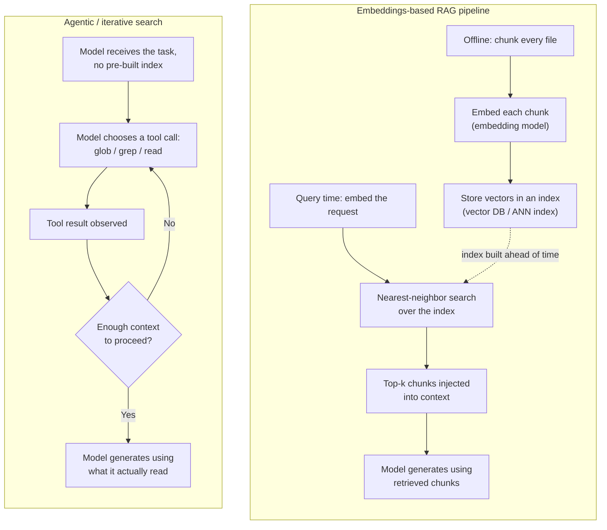
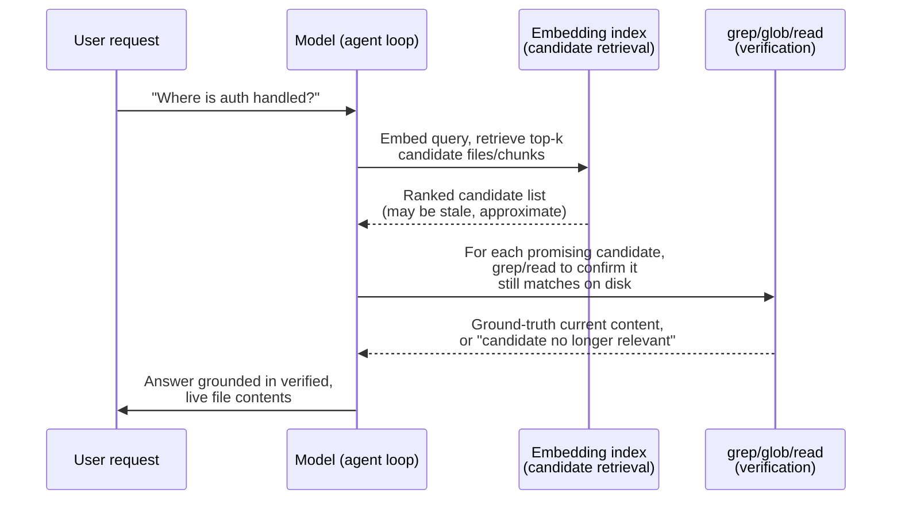

# Context retrieval / RAG vs. agentic search as a design space

**Scope note.** This page is about a question none of the book's other
context-management pages actually answer: when a codebase is too large
to ever fit in a context window, how does a harness decide *what to
pull in* in the first place? [Instruction context budget](instruction-context-budget.md)
covers the eagerly-loaded instruction tier (CLAUDE.md/rules/skill
descriptions) and how to keep it small; [Context compression](context-compression.md)
covers what happens to a conversation's own history once the window is
already full (eviction, summarization); [Built-in tools](built-in-tools.md)
inventories the concrete tools (`Grep`/`Glob`, Copilot's search tools,
OpenCode's `grep`/`glob`) without asking why those tools and not a
retrieval index. This page is the missing layer underneath all three:
the initial-discovery problem -- finding the handful of files, out of
possibly hundreds of thousands, that a given turn actually needs -- and
it treats that as a genuine two-strategy design space (embeddings-based
retrieval-augmented generation vs. agentic/iterative search) rather
than a settled question.

Every claim below is tagged VERIFIED (fetched this session from a
named source) or BEST CURRENT UNDERSTANDING, UNCONFIRMED. Claude Code,
Copilot CLI, and OpenCode are three separate products from three
separate organizations -- nothing confirmed for one is assumed for
another. A prior pass through this book noticed, only in passing, that
all three rely on agentic search rather than embeddings; this page
re-verifies that finding fresh (docs, changelogs, and OpenCode's own
source and issue tracker, all re-checked this session) and gives it
the dedicated treatment it didn't get the first time.

---

## 1. The design space, in general terms

### 1.1 Two competing retrieval philosophies

**Retrieval-augmented generation (RAG)**, in its original and still
most-cited formulation, is VERIFIED from `arxiv.org/abs/2005.11401`
(Lewis, Perez, Piktus, Petroni, Karpukhin, Goyal, Küttler, Lewis, Yih,
Rocktäschel, Riedel, and Kiela, "Retrieval-Augmented Generation for
Knowledge-Intensive NLP Tasks," fetched this session): a generative
model (parametric memory) is paired with a dense vector index over a
corpus (non-parametric memory) accessed through a pre-trained neural
retriever, so that at inference time the model's output is grounded in
passages retrieved by nearest-neighbor search over embeddings, rather
than relying solely on what the model memorized during training. For a
codebase, the direct analogue is: chunk every file, embed each chunk
into a vector, store the vectors in an index, and at query time embed
the user's request and retrieve the top-*k* nearest chunks by cosine
similarity (or a related metric) before ever invoking the model on the
actual task.

**Agentic (iterative) search**, by contrast, gives the model itself a
small set of discovery tools -- typically a filename-glob tool, a
content-grep tool, and a file-read tool -- and lets it decide, turn by
turn, what to look for next based on what it has already seen: read a
file, notice an import, grep for that symbol elsewhere, follow a
reference, refine the query, stop once it has enough. There is no
pre-built index and no embedding step; retrieval and reasoning are
interleaved rather than separated into a pipeline stage that runs
before the model ever sees the task. Hugging Face's agents course
draws exactly this distinction under the name "Agentic RAG," and its
framing is useful vocabulary independent of any one harness: VERIFIED,
`huggingface.co/learn/agents-course/en/unit3/agentic-rag/agentic-rag`
(fetched this session) -- classic RAG "solves this problem by finding
and retrieving relevant information from your data and forwarding
that to the LLM" as a fixed, automatic pipeline, whereas in an
agent-controlled version "instead of answering the question on top of
documents automatically, [the agent] can decide to use any other tool
or flow to answer the question," i.e. the agent has discretionary
control over which retrieval strategy (or non-retrieval tool) to
invoke, rather than a predetermined retrieve-then-generate sequence
always firing first. This is a *general* agent-engineering concept,
authoritative for the shared vocabulary, not a claim about what any of
this book's three harnesses specifically implement -- that comes in
§2-4.

### 1.2 Why this specific debate has a live literature behind it

The tradeoff is not purely theoretical. VERIFIED,
`arxiv.org/abs/2602.23368` ("Keyword search is all you need:
Achieving RAG-level performance without vector databases using
agentic tool use," Amazon Science, presented at AAAI 2026, fetched
this session): the paper's central finding is that tool-based keyword
search inside an agentic loop can attain over 90% of the performance
of a traditional embeddings-based RAG pipeline on knowledge-intensive
tasks, without any vector database at all, arguing the simplicity,
cost, and freshness advantages of keyword-plus-agency outweigh the
recall advantages of dense retrieval for a meaningful class of tasks.
That is an empirical result about general knowledge-intensive
question answering, not about source-code search specifically --
citing it here as adjacent, credible evidence that the RAG-vs-agentic
tradeoff this page investigates for code has a real, actively
published counterpart outside the code-agent world, not as a
harness-specific finding. BEST CURRENT UNDERSTANDING, UNCONFIRMED: how
closely code retrieval's precision/recall profile matches the paper's
benchmark domain is not established by anything fetched this session.

Anthropic's own engineering blog frames the same tension from the
opposite direction -- as a question of *when* context gets pulled in,
not just *how*. VERIFIED, `anthropic.com/engineering/effective-context-engineering-for-ai-agents`
(fetched this session): the post contrasts "pre-processing all
relevant data up front" against a "just in time" strategy in which
"agents...maintain lightweight identifiers (file paths, stored
queries, web links, etc.) and use these references to dynamically
load data into context at runtime using tools," explicitly naming the
tradeoff -- "runtime exploration is slower than retrieving pre-computed
data" -- and citing Claude Code itself as an example of a genuinely
*hybrid* system on this specific axis: a small, always-loaded
CLAUDE.md file (pre-processed, always in context) paired with grep as
the just-in-time mechanism for everything else. The post's closing
guidance is a pragmatic non-verdict rather than a universal rule:
"do the simplest thing that works will likely remain our best advice
for teams building agents." Note what this source does *not* say: two
separate WebFetch passes over the same page this session found no
sentence directly comparing embeddings-based search against agentic
search on accuracy, maintenance burden, or transparency the way some
secondary blog summaries (not fetched as primary sources for this
page) paraphrase it as saying -- the only explicit, directly quotable
tradeoff in the primary text is the speed-vs-thoroughness one above.
Treat any stronger claim attributed to this post as UNCONFIRMED by
this session's own reading of it.

---

## 2. Claude Code

Sources for this section, all fetched fresh this session:
`code.claude.com/docs/en/large-codebases`; `claude.com/blog/how-claude-code-works-in-large-codebases-best-practices-and-where-to-start`;
`github.com/anthropics/claude-code`'s `CHANGELOG.md` (full file, via
`gh api`); and, as a secondary but directly-fetched source for a
specific attributed quote, `vadim.blog/claude-code-no-indexing/`.
Cross-references [Built-in tools](built-in-tools.md) §1.5 for `Grep`/
`Glob`/`Read`'s own mechanics rather than repeating them here.

### 2.1 A documented reversal, not a default that was never tried

Claude Code's own product blog states the design decision directly and
in contrast to embeddings-based competitors. VERIFIED,
`claude.com/blog/how-claude-code-works-in-large-codebases-best-practices-and-where-to-start`
(fetched this session): Claude Code uses "agentic search" that
"traverses the file system, reads files, uses grep to find exactly
what it needs, and follows references across the codebase," and the
post names the alternative it is explicitly rejecting: "RAG-powered
AI coding tools work by embedding the entire codebase and retrieving
relevant chunks at query time. At large scale, those systems can fail
because embedding pipelines can't keep up with active engineering
teams... By the time a developer queries the index, it reflects the
codebase as it previously existed weeks, days, or even hours before."
The stated advantage of the agentic alternative is freshness by
construction: "There's no embedding pipeline or centralised index to
maintain as thousands of engineers commit new code. Each developer's
instance works from the live codebase." This session's own WebFetch
pass over that post found no discussion of a hybrid retrieval strategy
anywhere in it -- the only supplementary precision mechanism it
mentions is LSP-based symbol navigation (cross-referenced in
[Built-in tools](built-in-tools.md) §1.5's `LSP` entry), not embeddings
of any kind.

This was not the original design. A secondary source fetched directly
this session, `vadim.blog/claude-code-no-indexing/`, attributes a
Hacker News comment to Boris Cherny (credited there as Claude Code's
creator, Principal Software Engineer at Anthropic): "Early versions of
Claude Code used RAG + a local vector db, but we found pretty quickly
that agentic search generally works better," with an unnamed Claude
engineer quoted in the same thread as saying "In our testing we found
that agentic search outperformed [it] by a lot, and this was
surprising." Flag the provenance precisely: this is a secondary blog's
report of an on-the-record public statement, not Anthropic's own docs
or changelog, and this session could not independently load the
underlying Hacker News/X thread directly (the X post URL returned an
HTTP 402 paywall response when fetched). Treat the *substance* --
Claude Code shipped RAG+vector-DB early on and deliberately removed it
in favor of agentic search after finding it underperformed -- as
credibly sourced but one level removed from primary, not as a
docs-grade VERIFIED fact the way the current blog post's own words are.
Consistent with that account, this session's own keyword search of the
full `CHANGELOG.md` (5,534 lines, fetched via `gh api` this session)
for "embed," "vector," "semantic," and "RAG" found zero entries
describing a code-search embedding feature -- every "embed" hit is an
unrelated usage (an embedded ripgrep/`bfs`/`ugrep` binary bundled with
native builds, an embedded build timestamp, embedded shell commands in
a doc string). There is no trace in the current product's own
behavior-change history of a vector-search code-discovery feature
existing, being toggled, or being deprecated within the window this
changelog covers -- consistent with the removal having happened before
this changelog's own history begins, not with the feature being active
today under an unindexed name.

### 2.2 What actually ships instead, and where RAG is left as an opt-in seam

The current documented strategy is exactly `Grep`/`Glob`/`Read`
(mechanics in [Built-in tools](built-in-tools.md) §1.5), an `Agent`-
spawned Explore subagent for deep, context-isolated investigation
(cross-referenced in [Handoff mechanism](handoff-mechanism.md)), and,
where installed, an LSP-backed code-intelligence plugin for
definition/reference lookups that substitute for a grep-then-read
round trip. VERIFIED, `code.claude.com/docs/en/large-codebases`
(fetched this session): the monorepo/large-codebase guide's toolkit is
per-directory `CLAUDE.md` layering, `claudeMdExcludes`, `Read` deny
rules for generated/vendored code, code-intelligence (LSP) plugins,
sparse-checkout worktrees (`worktree.sparsePaths`), `additionalDirectories`/
`--add-dir` for cross-package access, and per-directory skills -- a
whole page dedicated to "how do you keep Claude Code usable at scale,"
and every lever on it is a *scoping* or *exclusion* mechanism (narrow
what's visible) rather than a *ranking* mechanism (retrieve the most
relevant chunks from everything). No embeddings, vector index, or
semantic-search feature appears anywhere on that page.

The same page contains the one place this session found Claude Code's
own documentation acknowledging embeddings-based retrieval as a live
option at all -- and it is explicitly not something Claude Code builds
or maintains itself. Under "Centralize conventions when layering stops
scaling," the guide's advice for organizations at the largest scale is:
"MCP servers: if your organization already runs a code search or RAG
index over the repository, expose it as an MCP tool so Claude queries
it instead of reading files directly." That sentence is worth reading
carefully: Claude Code's own maintainers know a codebase can be large
enough that grep-driven exploration stops being the right tool, and
their answer is not "we will build you a RAG index" but "bring your
own, and we'll let the agent call it like any other tool." This is a
real, sourced, structural fact about the design space this page is
surveying -- the seam for a hybrid exists (an MCP-exposed retrieval
tool sits in the same tool-call loop as `Grep`/`Glob`, so nothing stops
the model from choosing whichever fits a given query) but building and
operating the embeddings side of that hybrid is left entirely to the
user, not shipped as a default. See §5.2 for how this bears on the
"is a hybrid the actual ceiling" question the rest of this page builds
toward.

---

## 3. GitHub Copilot CLI

Sources for this section, fetched fresh this session:
`github.com/github/copilot-cli`'s `changelog.md` (full file, 2,979
lines, via `gh api`); `github.blog/news-insights/product-news/copilot-new-embedding-model-vs-code/`,
fetched specifically to test its scope. Cross-references
[Built-in tools](built-in-tools.md) §2.1 for the "search tools" entry
and [Instruction context budget](instruction-context-budget.md) §2.3
for the `dynamicRetrieval` finding this section re-examines with a
narrower, code-search-specific lens.

### 3.1 Copilot CLI's own code-discovery tools are grep/glob-equivalent, not embeddings-based

As documented in [Built-in tools](built-in-tools.md) §2.1, Copilot
CLI's functional "search tools" are file/content search fixed by the
changelog to Grep/Glob-equivalent behavior -- the only fix ever
recorded against them in the full changelog is "fixes Windows-style
glob pattern handling," a maintenance detail consistent with a
literal-pattern search tool, not a retrieval-ranking one. This
session's own keyword search of the full changelog for "embed,"
"vector," "semantic," and "RAG" (VERIFIED, `gh api` fetch this
session) found no entry describing an embeddings- or vector-index-based
mechanism for searching the repository's *source code*. The two hits
that do involve embeddings are both scoped elsewhere, and distinguishing
them precisely matters for this page's claim:

- Line 548 (`v1.0.66` era): "Add persisted `dynamicRetrieval` setting
  (and `--dynamic-retrieval skills=<on|off>` flag) to enable or disable
  embeddings-based retrieval of skills" -- this retrieves **skill and
  MCP instruction text** per turn (first introduced, per
  [Instruction context budget](instruction-context-budget.md) §2.3, as
  "experimental embedding-based dynamic retrieval of MCP and skill
  instructions per turn" at v1.0.5), not source files. It is a real,
  shipped, embeddings-based retrieval mechanism inside Copilot CLI --
  but its retrieval corpus is the set of installed skills'/MCP servers'
  own instruction documents, a bounded and comparatively small corpus
  the CLI itself controls the freshness of, not the user's codebase.
  Conflating this with "Copilot CLI does RAG over your code" would be
  an overreach this page deliberately avoids.
- The other embedding-adjacent hits (`gen_ai.usage.*` OpenTelemetry
  "semantic conventions," "semantic mascot theme colors," heredocs
  described as "embedded documents," "embedding shell commands
  inline," Windows path device-prefix "credential-leak vector") are
  all unrelated uses of the words "embed"/"semantic"/"vector" -- noted
  here explicitly so a future search of this same changelog isn't
  fooled by them the way a naive grep could be.

So the finding for Copilot CLI's own code discovery specifically is the
same as Claude Code's: no confirmed embeddings-based or vector-index
retrieval mechanism over the repository's source files, in any
changelog entry or docs page fetched this session. The CLI's one real
embeddings-based retrieval feature exists, but retrieves a different
and much smaller corpus (skill/MCP instruction text), which is exactly
the finding [Instruction context budget](instruction-context-budget.md)
§2.3 already logged under a different heading -- this page's
contribution is confirming, on a fresh read scoped specifically to
code search, that the two should not be merged into one claim.

### 3.2 A GitHub embeddings feature exists -- for a different product surface

The clearest AUTHORITY OVERREACH trap in this whole topic is GitHub's
own, real, and substantial embeddings-based code-search feature --
which belongs to a different product than the one this book tracks.
VERIFIED, `github.blog/news-insights/product-news/copilot-new-embedding-model-vs-code/`
(fetched and specifically interrogated for scope this session): the
post is explicit that the feature "makes code search in VS Code faster,
lighter on memory, and far more accurate" and powers "context retrieval
for GitHub Copilot chat along with agent, edit, and ask mode" **inside
VS Code**. This session's fetch of that page found no mention of
GitHub Copilot CLI anywhere in it. The independent product-surface
distinction matters structurally, not just terminologically: GitHub
ships at least two separate Copilot surfaces (the IDE extension
family, and the standalone CLI this book tracks), and this page's
finding is scoped to the CLI only -- it says nothing about, and does
not contradict, whatever embeddings-based retrieval GitHub Copilot's
VS Code surface does for its own chat/agent modes. Treat "GitHub
Copilot uses embeddings for code search" as true of at least one
GitHub product and unconfirmed-and-likely-false of Copilot CLI
specifically, per every source fetched for this page.

---

## 4. OpenCode

Sources for this section, fetched fresh this session: `opencode.ai/docs/tools`
and `opencode.ai/docs/permissions/` (re-checked, cross-referenced
against [Built-in tools](built-in-tools.md) §3.1); and, live via `gh
api` against `github.com/anomalyco/opencode`, issues #2584, #5909, and
#27586 plus their comments (`dev`-branch repository -- the caveat that
its issue tracker reflects live, ongoing development, not a snapshot
tied to any tagged release, applies as usual).

### 4.1 The documented and source-confirmed tool surface has no retrieval index

As already established in [Built-in tools](built-in-tools.md) §3.1,
OpenCode's built-in code-discovery tools are `grep` (ripgrep-backed
regex content search with file-pattern filtering) and `glob`
(pattern-based file finding, results sorted by modification time), plus
an experimental, opt-in `lsp` tool gated behind
`OPENCODE_EXPERIMENTAL_LSP_TOOL=true`. Neither `opencode.ai/docs/tools`
nor `opencode.ai/docs/permissions/` (both re-fetched this session)
mentions an embedding model, a vector store, or a semantic-search tool
anywhere in the documented tool or permission surface. This is the one
harness of the three whose implementation is itself inspectable, and a
`dev`-branch source review for a different topic
([Context compression](context-compression.md) §3) already confirmed
this book's standing familiarity with that codebase's actual tool and
session machinery without turning up any retrieval-index component
there either -- consistent with, not contradicted by, this session's
fresh docs-level check.

### 4.2 Repeated, unresolved feature requests -- and the ecosystem filling the gap itself

Unlike Claude Code and Copilot CLI, where the absence of embeddings-
based code retrieval is a design decision stated (Claude Code) or
inferable from a silent changelog (Copilot CLI), OpenCode's own public
issue tracker shows the absence being actively contested by its users,
repeatedly, over time -- and closed each time without the feature
landing. VERIFIED, live `gh api` fetches this session:

- **Issue #2584**, "Have you considered using embedding models?"
  proposes exactly the hybrid this page's framing later interrogates:
  "opencode could first ask the embedding model which part of the code
  responds better to the prompt, and then send these pieces of code to
  the LLM." Closed by the repository's inactivity-bot after 90 days
  with no maintainer commitment either way.
- **Issue #5909**, "Vector Database," asks whether anyone has
  integrated a vector database tool with OpenCode "because... other
  systems work better when they are able to search the codebase using
  a vector search." Also closed by the inactivity-bot, with no
  maintainer response in the thread confirming or ruling out a native
  feature.
- **Issue #27586**, "[FEATURE]: RAG & Embedding Search Capability...",
  proposes a specific local vector store (ChromaDB/LanceDB),
  background chunk-and-embed indexing, and top-*k* context injection.
  Also closed as a stale duplicate.

What is genuinely informative here is not the requests themselves but
the comment threads underneath them, which show real users building
the hybrid OpenCode's core team hasn't shipped, entirely outside the
core project: one commenter built and shared
`github.com/MrDoe/OpenCodeRAG`, a plugin adding RAG; another pointed to
`github.com/Davidyz/VectorCode`'s MCP-server integration; a third
recommended `chunkhound`; and a fourth described, in detail, a
self-built hybrid retrieval plugin combining local Ollama-generated
embeddings stored via SQLite's `sqlite-vec` extension with FTS5
full-text search and identifier boosting, reporting (their own words,
an informal, non-peer-reviewed claim this session has no way to
verify) "around 98% retrieval accuracy in my benchmarks," and noting
explicitly that "pure vector search alone isn't great for code because
you miss exact function names and import paths" -- i.e. a from-scratch,
user-built confirmation of the same hybrid-precision intuition this
page's §5 develops formally, arrived at independently by someone
patching around OpenCode's gap rather than reading any harness's design
documentation. BEST CURRENT UNDERSTANDING, UNCONFIRMED: whether
OpenCode's maintainers have an internal position on why this stays a
community-plugin space rather than a core feature (a Claude-Code-style
staleness/simplicity argument, a resourcing decision, or something
else) -- no maintainer comment stating a rationale was found on any of
the three issues fetched this session, so the silence itself is the
only confirmed fact, not a reason.

---

## 5. Synthesis and the hybrid-as-ceiling question

### 5.1 Convergence, restated precisely

| Dimension | Claude Code | Copilot CLI | OpenCode |
|---|---|---|---|
| Primary code-discovery mechanism | Agentic: `Grep`/`Glob`/`Read`, optional LSP plugin, Explore subagent | Agentic: grep/glob-equivalent "search tools," `view` | Agentic: `grep`/`glob`, optional experimental `lsp` |
| Ever shipped embeddings/vector code search? | Yes, early versions, per a secondary-sourced but credible attributed quote -- deliberately removed | No confirmed instance in any doc/changelog fetched | No -- never shipped, repeatedly requested, never landed |
| Any embeddings-based retrieval mechanism at all? | None found for code; none found for anything else either, in sources fetched this session | Yes -- `dynamicRetrieval`, scoped to skill/MCP **instruction text**, not source code | None found anywhere in docs or source |
| Stated rationale against embeddings-for-code | Explicit, in Claude Code's own blog: staleness ("reflects the codebase as it previously existed... hours before"), maintenance burden of a "centralised index" | Not stated (no changelog entry frames a decision either way) | Not stated by any maintainer found in this session's issue search |
| Documented hybrid extension point | Yes -- bring-your-own RAG/code-search index exposed as an MCP tool (`large-codebases` guide) | Not found | Not found in official docs; exists only as third-party plugins outside the core project |

The finding this page was asked to re-verify holds, precisely stated:
**none of the three harnesses ships embeddings-based retrieval as its
primary or default code-discovery strategy today.** All three converge
on agentic, tool-driven, iterative search as the mechanism the model
itself drives turn by turn. That convergence is not superficial or
coincidental for at least one harness -- Claude Code's own product blog
names the failure mode (index staleness under active development) it
is a deliberate reaction against, and its early-version history (per
the Cherny attribution in §2.1) shows this was a reversal from a real,
shipped alternative, not a path never tried.

### 5.2 Is embeddings-for-candidates + agentic-search-for-verification the ceiling nobody built?

Frame the hybrid precisely, since "hybrid" is doing a lot of work in
the question this page was asked to interrogate: embeddings would
serve as a **recall** mechanism over a corpus too large for any
iterative grep/glob strategy to explore exhaustively (a search-space
narrowing step -- "these 40 files out of 400,000 are plausibly
relevant"), and agentic search would serve as the **precision and
freshness** mechanism applied only to that narrowed candidate set --
reading, grepping, and verifying that a candidate still matches the
live repository state before trusting it, rather than trusting the
embedding's similarity score alone. This is exactly the shape the
OpenCode community plugin author in §4.2 arrived at independently
("pure vector search alone isn't great for code because you miss exact
function names and import paths" -- addressed by combining vector
similarity with FTS5/BM25-style exact matching), and it is close in
spirit, though not identical in implementation, to what
`sourcegraph.com`'s Cody product is reported to do in production:
BEST CURRENT UNDERSTANDING, UNCONFIRMED (not one of this book's three
harnesses, not independently fetched from Sourcegraph's own
documentation this session, only from secondary search-result
summaries) -- Cody's context retrieval is described as combining code
search, code-graph traversal (SCIP), ranking, and vector embeddings as
parallel strategies dispatched per query type, rather than picking one
philosophy exclusively. Cited here strictly as an external comparator
establishing that a multi-strategy hybrid is a real, shipped pattern
somewhere in the broader coding-agent market -- never as evidence about
what Claude Code, Copilot CLI, or OpenCode themselves do, per this
page's own AUTHORITY OVERREACH discipline.

Given that, is the hybrid a genuine technical ceiling none of the three
examined harnesses has reached, or a deliberate simplicity choice they
declined to spend engineering effort on? The evidence gathered this
session points more toward the latter, argued as follows (BEST CURRENT
UNDERSTANDING, UNCONFIRMED as a unified conclusion, though each
supporting fact above is independently sourced):

1. **The hybrid is demonstrably buildable with off-the-shelf parts.**
   The OpenCode community plugin described in §4.2 (local Ollama
   embeddings, `sqlite-vec`, FTS5, file-change-triggered
   reindexing "via lifecycle events so the index auto updates as files
   change") is a working existence proof that the staleness objection
   Claude Code's blog raises against embeddings is an engineering
   problem with known mitigations (incremental reindexing on file
   change), not an unsolvable one -- it just isn't free, and someone
   has to own running it.
2. **Claude Code's own team has already named the ceiling and chosen
   not to own the cost of raising it themselves.** The
   `large-codebases` guide's MCP-as-RAG-seam sentence (§2.2) is direct
   evidence that Anthropic's own engineers recognize grep-driven
   agentic search has a scale at which it stops being sufficient
   ("if your organization already runs a code search or RAG index over
   the repository") -- their answer is an integration point, not a
   built-in feature, which reads as a considered scope decision (don't
   build and operate a retrieval index as a product, let organizations
   with one plug it in) rather than a belief that the hybrid has no
   value.
3. **The staleness/maintenance argument is a real cost, not a
   strawman, but it is a cost specific to *shipping and operating* the
   index as a first-party feature across every user's codebase, not a
   cost inherent to the retrieval technique itself.** A harness vendor
   who ships embeddings-based retrieval by default takes on
   responsibility for keeping millions of users' indexes fresh, secure
   (an embedding of proprietary code is still a derived artifact of
   that code, a privacy-surface concern Claude Code's blog and the
   community threads both gesture at), and performant at every
   codebase size -- a materially larger operational commitment than
   shipping a stateless `grep` wrapper that reads whatever is on disk
   right now. Declining to build that is a legible product-scoping
   decision under this reading, distinguishable from a claim that the
   hybrid wouldn't work.
4. **None of the three harnesses' own docs, changelogs, or (for
   OpenCode) source and issue tracker contain a stated engineering
   reason the hybrid specifically -- as opposed to embeddings alone --
   was rejected.** Claude Code's blog argues against replacing agentic
   search with embeddings; it does not address augmenting agentic
   search with embeddings for the initial candidate-narrowing step,
   which is the actual shape of the hybrid this page is examining.
   That silence is worth flagging precisely, not smoothing over: the
   strongest documented critique found this session targets
   embeddings-as-sole-strategy, and this page found no source, from
   any of the three harnesses, that directly argues against
   embeddings-as-a-narrowing-step-before-agentic-verification. The
   absence of that specific argument is consistent with the hybrid
   being an unexamined option that fell outside each team's chosen
   scope, but it is not itself proof that any of the three teams
   considered and rejected it for a stated reason -- treat "nobody has
   built this because nobody decided it's not worth it, as opposed to
   nobody having thought about it," as the honest, unresolved edge of
   this page's own investigation.

The most defensible summary, holding the tags apart rather than
blending them: it is VERIFIED that none of Claude Code, Copilot CLI, or
OpenCode ships an embeddings-based hybrid for code discovery today, and
VERIFIED that a structurally similar hybrid is both requested by real
users (OpenCode's issue tracker) and buildable with existing
techniques (the community plugins, and Cody's reported multi-strategy
architecture as an external, non-harness comparator). It is BEST
CURRENT UNDERSTANDING, UNCONFIRMED that this specific hybrid represents
an actual engineering ceiling any of the three harnesses has hit and
failed to clear, versus a scope boundary each team drew around "own
and operate a retrieval index" that a bring-your-own-index MCP
integration (Claude Code) or a third-party plugin ecosystem (OpenCode)
was judged to satisfy well enough not to justify building in-house. A
from-scratch harness attempting to "surpass existing implementations"
on this specific axis would be building in a space where the demand is
documented, the components exist, and the reason no incumbent has
assembled them into a first-party feature is legible as a deliberate
scope choice rather than a proven dead end -- which is exactly the kind
of gap this book's [Advanced/novel planning and execution architectures](advanced-planning-and-execution-architectures.md)
page treats as the place "surpassing" would have to start, applied here
to retrieval rather than planning.

---

## Sources

| Source | Fetched | Authoritative for |
|---|---|---|
| `https://arxiv.org/abs/2005.11401` (Lewis et al., "Retrieval-Augmented Generation for Knowledge-Intensive NLP Tasks") | This session | The original RAG architecture: parametric generator + dense-vector non-parametric retriever, general concept only |
| `https://huggingface.co/learn/agents-course/en/unit3/agentic-rag/agentic-rag` | This session | General agent-engineering vocabulary distinguishing fixed-pipeline RAG from agent-controlled ("Agentic RAG") retrieval; not authoritative for any specific harness |
| `https://arxiv.org/abs/2602.23368` (Amazon Science, "Keyword search is all you need," AAAI 2026) | This session | An external empirical data point on agentic keyword search vs. RAG performance on knowledge-intensive tasks generally; not a code-specific or harness-specific finding |
| `https://www.anthropic.com/engineering/effective-context-engineering-for-ai-agents` | This session (fetched twice, targeted re-reads) | Anthropic's own "just in time" vs. pre-processed context framing, the explicit Claude Code CLAUDE.md+grep hybrid example, and the "do the simplest thing that works" guidance -- an Anthropic blog post, not `code.claude.com/docs`, cited within its own actual stated content only |
| `https://code.claude.com/docs/en/large-codebases` | This session | Claude Code's documented large-codebase toolkit (per-directory CLAUDE.md, exclusions, code intelligence, sparse worktrees, per-directory skills) and its MCP-as-bring-your-own-RAG-index sentence |
| `https://claude.com/blog/how-claude-code-works-in-large-codebases-best-practices-and-where-to-start` | This session | Claude Code's own stated rationale for agentic search over embeddings-based RAG (staleness, index-maintenance argument), explicitly framed against RAG-powered competitors |
| `https://vadim.blog/claude-code-no-indexing/` | This session | A secondary source's direct quote, attributed to Boris Cherny via Hacker News, describing Claude Code's early RAG+vector-db implementation and its removal -- cited as a secondary, not primary, attribution |
| `github.com/anthropics/claude-code` `CHANGELOG.md` (via `gh api`, full 5,534-line file) | This session | Confirms the absence of any embedding/vector/semantic/RAG code-search feature anywhere in Claude Code's own recorded behavior-change history; authoritative for its own behavior-change history only, not implementation |
| `github.com/github/copilot-cli` `changelog.md` (via `gh api`, full 2,979-line file) | This session | Confirms Copilot CLI's "search tools" are grep/glob-equivalent with no embeddings feature, and precisely scopes the one real embeddings-based retrieval feature found (`dynamicRetrieval`) to skill/MCP instruction text, not source code |
| `https://github.blog/news-insights/product-news/copilot-new-embedding-model-vs-code/` | This session | Confirms GitHub's real embeddings-based code-search feature is scoped to GitHub Copilot in VS Code, with no stated applicability to Copilot CLI -- the AUTHORITY OVERREACH boundary this page relies on in §3.2 |
| `https://opencode.ai/docs/tools` and `https://opencode.ai/docs/permissions/` | This session (re-checked) | Confirms OpenCode's documented tool/permission surface contains no embedding, vector-store, or semantic-search tool |
| `github.com/anomalyco/opencode` issues #2584, #5909, #27586 and their comments (via `gh api`, `dev`-branch repository) | This session | Confirms OpenCode has never shipped a native embeddings/RAG code-search feature despite repeated user requests, and documents the third-party plugin ecosystem (OpenCodeRAG, VectorCode, `chunkhound`, an unnamed commenter's Ollama+`sqlite-vec`+FTS5 plugin) that has filled the gap outside the core project |

Not consulted this session, and therefore not cited above as a
harness-specific source: `sourcegraph.com`'s own documentation for
Cody's multi-strategy retrieval architecture (used only as an
externally-reported, non-fetched comparator in §5.2, explicitly flagged
as such); the underlying Hacker News thread or X/Twitter post
attributed to Boris Cherny (the X URL returned an HTTP 402 response
when fetched directly this session); any of the three community
plugins named in §4.2 (OpenCodeRAG, VectorCode, `chunkhound`) beyond
what their names and one-line descriptions state in the GitHub issue
comments citing them.
