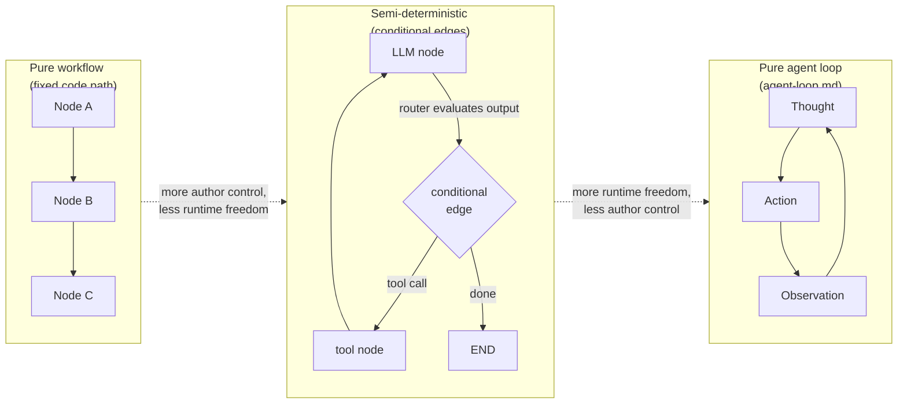
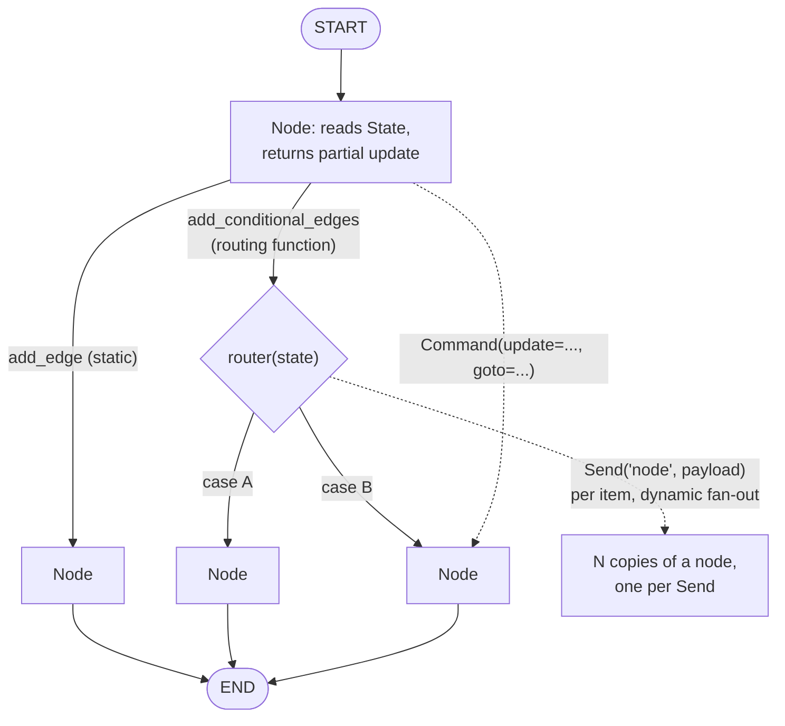
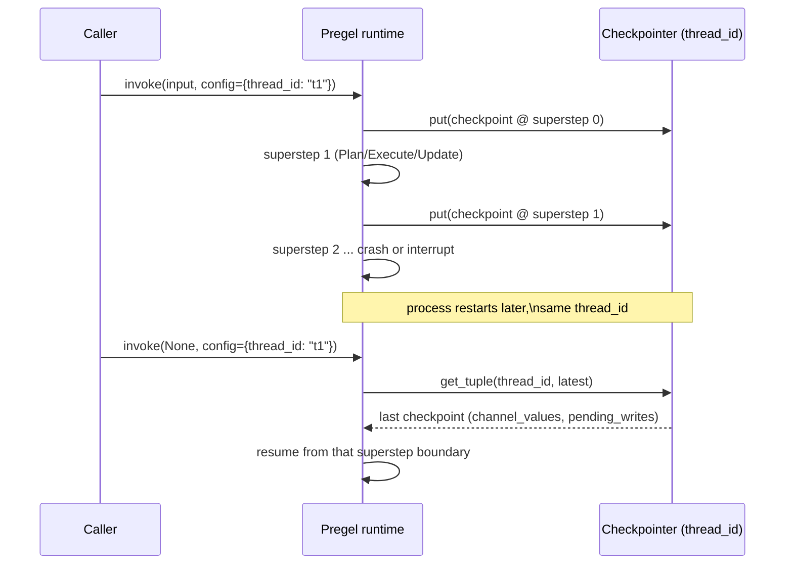
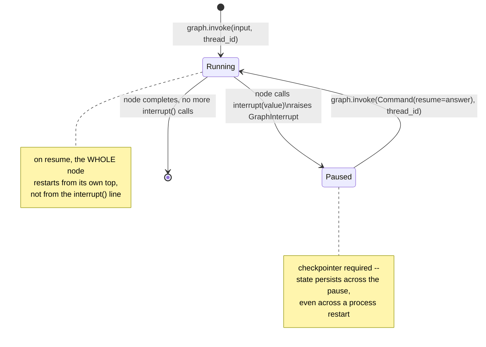
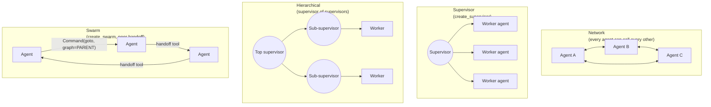
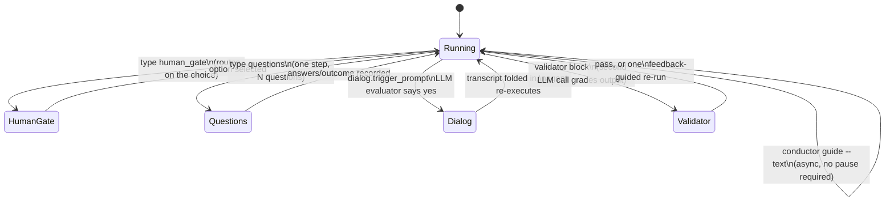
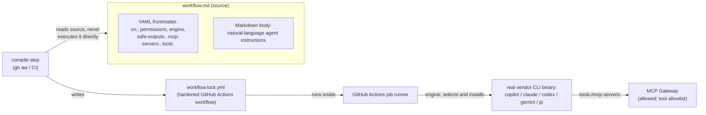
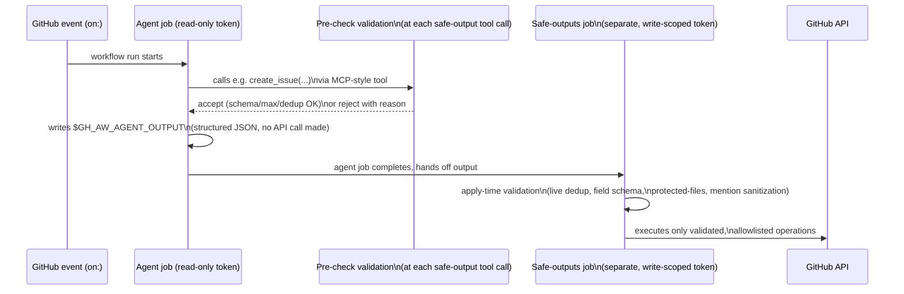

# Deterministic orchestration: LangGraph, Microsoft Conductor, and the graph/workflow-as-harness design space

**Scope note.** Every other page in this book documents an *interactive
coding-assistant CLI* -- Claude Code, GitHub Copilot CLI, OpenCode, and
(where cited) DeepSeek Harness and pi: a program a human runs in a
terminal, that itself runs a Thought/Action/Observation loop
([agent-loop.md](agent-loop.md)) turn by turn, with the LLM deciding at
each step what happens next. This page instead documents a different
*category* of thing: a **deterministic orchestrator** -- software whose
job is to run a multi-agent pipeline along a control-flow graph an author
fixes in advance, rather than a single LLM deciding turn by turn what
happens next. Three independently-built, independently-sourced instances of
that category are documented here side by side, specifically so their
points of genuine agreement and genuine divergence are visible in one
place rather than scattered across three separate pages:

- **LangGraph** (`github.com/langchain-ai/langgraph`) -- a **library**,
  Python and JavaScript/TypeScript, for *building* stateful, long-running
  agents and multi-step LLM pipelines, where the developer authors the
  control-flow graph directly in code (`StateGraph`, nodes, edges).
  VERIFIED (`github.com/langchain-ai/langgraph`, fetched this session):
  the project's own README describes it as "a low-level orchestration
  framework for building, managing, and deploying long-running, stateful
  agents," naming four pillars -- **durable execution** ("build agents
  that persist through failures and can run for extended periods,
  automatically resuming from exactly where they left off"),
  **human-in-the-loop** ("seamlessly incorporate human oversight by
  inspecting and modifying agent state at any point during execution"),
  **comprehensive memory** (short-term working memory plus persistent
  long-term storage), and **production deployment** (via the separate,
  adjacent LangSmith Deployment platform, named but not itself
  investigated in this page since it is a hosted product surface, not a
  harness-internals mechanism).
- **Conductor** (`github.com/microsoft/conductor`) -- a **CLI tool**,
  Python 3.12+, for *defining and running* multi-agent workflows from a
  plain YAML file, with no code authored at all. VERIFIED (fetched via
  `gh api repos/microsoft/conductor` and its README this session, to
  confirm this is a real, actively-maintained, distinct Microsoft project
  -- not to be confused with Netflix's unrelated, much older, Java-based
  *Conductor* workflow-orchestration engine, a different product this
  page does not otherwise touch): the repo's own README states its
  purpose plainly -- "Conductor makes multi-agent workflows -- code
  review pipelines, research-then-synthesize flows, plan-then-implement
  loops -- **repeatable, deterministic, and version-controlled**,"
  further stated as "Deterministic -- Routing uses Jinja2 templates and
  expression evaluation. First matching condition wins. No LLM in the
  orchestration loop, no tokens spent deciding what runs next." Sections
  8-13 below document Conductor's own architecture from its own
  docs/CLI-reference/design-doc sources, fetched fresh this session
  (24 August 2026), the same way sections 1-7 already document
  LangGraph's.
- **GitHub Agentic Workflows** (`github.com/github/gh-aw`, official docs
  at `docs.github.com/en/copilot/concepts/agents/about-github-agentic-workflows`
  and the dedicated reference site `github.github.com/gh-aw`) -- a
  GitHub-first-party product, in Technical Preview at the time of this
  writing, for authoring a workflow as a single Markdown file (YAML
  frontmatter plus a natural-language instruction body) that a build step
  compiles into "a hardened `.lock.yml` GitHub Actions workflow file,"
  which then runs as an ordinary GitHub Actions job -- **GitHub Actions
  itself is the execution runtime**, not a separate CLI process or hosted
  server the way Conductor and LangGraph's own deployment story are.
  VERIFIED (all three sources above, fetched this session, 24 August
  2026): a workflow's `engine:` frontmatter property selects which
  vendor's own real coding-agent CLI actually runs as that job's inference
  step -- the gh-aw project's own reference page for engines names five
  built-in values, and for each one states plainly that the *actual
  vendor CLI binary* is installed and executed, not a bare model API call:
  `copilot` (the GitHub Copilot CLI), `claude` (Claude Code), `codex`
  (OpenAI Codex CLI), `gemini` (Google Gemini CLI), and `pi` (the
  `@earendil-works/pi-coding-agent` npm package -- this book's own
  already-documented **pi** harness, named here as a sixth engine choice
  independently of Conductor's own, differently-scoped provider list).
  Sections 14-16 below document this third instance's own architecture,
  fetched fresh this session the same way sections 1-13 already document
  LangGraph's and Conductor's -- pursued specifically because it turned
  out to hold one genuinely new mechanism (its **safe-outputs** job/credential-boundary
  separation, section 15) this page's existing LangGraph and Conductor
  material had not yet named, not merely a third re-implementation of
  sections 1-13's already-catalogued shapes.

Because all three are *substrates* other people's agent pipelines get
built on top of -- rather than a finished, opinionated terminal product
with its own permission model, TUI, or MCP client the way Claude Code,
Copilot CLI, and OpenCode are -- most of this book's per-harness topic
pages (permissions-and-sandboxing.md, tui-cli-application-architecture.md,
packaging-distribution-and-self-update.md) simply do not have a
LangGraph-, Conductor-, or GitHub-Agentic-Workflows-shaped answer: those
are decisions a pipeline *built on* any of the three substrates would
make, not decisions the substrate itself makes. (Conductor is a partial
exception worth flagging up front: because it ships as a standalone
installable CLI with its own Fleet Manager TUI, update mechanism, and
multi-run process model -- section 11 below -- some of
packaging-distribution-and-self-update.md's and
tui-cli-application-architecture.md's questions *do* have a real,
sourced Conductor answer where they have none for LangGraph or GitHub
Agentic Workflows, a genuine structural difference among the three
instances noted throughout rather than smoothed over. GitHub Agentic
Workflows is a second, differently-shaped partial exception in the other
direction: it has no CLI/TUI of its own at all -- a workflow's entire
operational surface is whatever GitHub Actions' own run logs, checks UI,
and `gh` CLI already provide -- so this page makes no claim about a
GitHub-Agentic-Workflows-specific persistence/checkpoint or fleet-supervision
mechanism the way sections 3 and 11 do for LangGraph and Conductor
respectively; that gap is left as an honest scope limitation, not a
verified negative finding, since it was not specifically investigated
this session.) This page is scoped to the topics where at least one of
the three genuinely does supply a directly comparable, sourced mechanism
-- orchestration/control-flow, persistence, human-in-the-loop, fault
tolerance, and multi-agent coordination -- and to naming the general
concepts this book had not yet covered anywhere before this page existed:
**deterministic, graph-or-workflow-encoded orchestration as an
alternative execution paradigm to the single LLM-driven while-loop**
(section 1), **the deterministic orchestrator as a product that can sit
one layer above other harnesses this book documents rather than only
above raw model APIs** (section 8.1, now doubly-sourced by section 14.1's
GitHub Agentic Workflows finding), **fleet-level supervision of many
concurrently running pipeline instances as a distinct operational concern
from any single run's own persistence** (section 11), and, new as of
this revision, **job/credential-boundary capability separation as a
structurally stronger alternative to an in-process permission gate for
enforcing the deterministic/probabilistic boundary** (section 15). All
three sit in the same conceptual family as
[agent-loop.md](agent-loop.md) and
[multi-agent-coordination-design-space.md](multi-agent-coordination-design-space.md)
(both GENERAL-CONCEPTS pages), but were not previously named as their own
axes anywhere in this book.

---

## 1. The general concept: "workflows" vs. "agents" as a deliberate axis, not a spectrum LangGraph merely occupies

Every prior page in this book that talks about control flow --
[agent-loop.md](agent-loop.md)'s Thought/Action/Observation while-loop,
[orchestration.md](orchestration.md)'s turn-by-turn subagent dispatch,
[advanced-planning-and-execution-architectures.md](advanced-planning-and-execution-architectures.md)'s
survey of planning mechanisms -- treats "the LLM decides what happens
next, one step at a time" as the default shape of an agent, with more
deterministic alternatives (Claude Code's Dynamic workflows script,
Copilot CLI's `/fleet` dependency graph) appearing as a harness-specific
escape hatch from that default. LangGraph's own documentation names this
same tension directly, as a first-class design choice rather than a fixed
default plus exceptions. VERIFIED (`docs.langchain.com/oss/langgraph/workflows-agents`,
raw source fetched this session from
`raw.githubusercontent.com/langchain-ai/docs/main/src/oss/langgraph/workflows-agents.mdx`):
"Workflows have predetermined code paths and are designed to operate in
a certain order. Agents are dynamic and define their own processes and
tool usage." The same page's worked examples build both ends of that
axis in the identical graph-authoring vocabulary -- a fixed prompt-chain
(`generate_joke` -> `improved_joke` -> `final_joke`, wired with plain
`add_edge` calls in a strict sequence) sits next to a fully autonomous
tool-calling agent (an LLM node wired back to itself via a conditional
edge until it stops calling tools) in the same document, built from the
same `StateGraph` primitive, differing only in how much of the control
flow the graph author fixes in advance versus leaves to a conditional
edge's own routing function evaluating the LLM's output at runtime.



BEST CURRENT UNDERSTANDING, UNCONFIRMED (this page's own synthesis, not
stated in exactly these terms by the source above): read against this
book's own prior work, LangGraph's "workflows vs. agents" framing is the
same underlying axis
[multi-agent-coordination-design-space.md](multi-agent-coordination-design-space.md)
section 1 draws for *coordination* decisions (single-planner fiat vs.
peer consensus vs. market bidding) -- a spectrum of how much
decision-making authority is fixed by the system's author ahead of time
versus delegated to a runtime LLM judgment call -- but applied one level
lower, to the *control-flow graph itself* rather than to which agent
handles a task. None of Claude Code, Copilot CLI, or OpenCode's
documented primary loops expose this as a *named, continuous* axis the
way LangGraph's docs do; each instead ships one or two fixed points on
it (an LLM-driven turn loop as the default, plus a separate deterministic
escape hatch -- Claude Code's Dynamic workflows script,
[orchestration.md](orchestration.md) section 1.2; Copilot's `/fleet`
dependency-based scheduling, section 2.2 of the same page) rather than a
single graph-authoring primitive that can encode any point on the line
in the same vocabulary. That -- not any single mechanism -- is the
concept this page adds that no prior page in this book named explicitly.

A second, structurally distinct general concept LangGraph's own
documentation surfaces is the **execution engine underneath the graph**.
Every harness this book has examined so far ([agent-loop-implementations.md](agent-loop-implementations.md))
executes its loop as a single logical thread of turns -- one step
completes, produces output, and the next step begins, with parallelism
(where it exists at all, per [fan-out.md](fan-out.md)) confined to
*within* a single turn's batch of tool calls. VERIFIED
(`docs.langchain.com/oss/langgraph/pregel` -- the LangGraph runtime
overview page, raw source fetched this session): LangGraph's runtime,
named `Pregel`, is explicitly "named after Google's Pregel algorithm,
which describes an efficient method for large-scale parallel computation
using graphs," and organizes execution as repeated **supersteps**, each
with three phases -- "**Plan**: Determine which actors to execute in
this step... **Execution**: Execute all selected actors in parallel,
until all complete, or one fails, or a timeout is reached... **Update**:
Update the channels with the values written by the actors in this
step," repeating "until no actors are selected for execution, or a
maximum number of steps is reached." This is the **Bulk Synchronous
Parallel (BSP)** model, and it is a genuinely different loop-execution
paradigm from the ones this book's `agent-loop.md`/`agent-loop-implementations.md`
pair documents: rather than one sequential thread of turns, an entire
*wavefront* of independently-triggered graph nodes executes in parallel
within a single superstep, and the graph's own topology (which nodes
subscribe to which channels) -- not an LLM's own decision to batch tool
calls -- determines what runs concurrently.

### 1.1 Where Conductor sits on the same axis

Conductor occupies the *fixed* end of section 1's workflow-vs-agent axis
about as firmly as any system this book has examined, and says so in its
own voice rather than this page inferring it: VERIFIED (Conductor README,
quoted in full at the top of this page) its routing is "Deterministic --
... First matching condition wins. No LLM in the orchestration loop, no
tokens spent deciding what runs next." That "first matching condition
wins" phrase is doing real work: VERIFIED (`docs/workflow-syntax.md`'s
own Routes section, fetched this session) -- "Routes define workflow
control flow. Routes are evaluated in order, and the first matching route
is taken" -- a plain sequential-scan router, evaluated against either a
Jinja2 template (`when: "{{ agent.output.status == 'success' }}"`) or a
legacy `simpleeval` expression (`when: "status == 'success'"`), the same
two-syntax-family split section 2 below documents for individual field
values throughout Conductor's YAML. Structurally this is the *same*
routing-function-decides-the-edge mechanic as LangGraph's
`add_conditional_edges`, just authored as YAML list order rather than a
Python dict literal -- one more confirmation, alongside Claude Code's
Dynamic workflows script and Copilot's `/fleet` dependency graph (already
cited in section 1's own body above), that "author-code/config fixes the
path" keeps getting independently reinvented by systems that never read
each other's source. Where Conductor differs from LangGraph is the
*authoring surface* the fixed path is expressed in at all: LangGraph's
`StateGraph` is a Python/JS object graph, built and mutated by running
code, that happens to also be inspectable; Conductor's workflow is a
**plain YAML text file**, with no code execution involved in defining the
topology whatsoever -- a distinction with real consequences documented
in section 8 below (git-diffability, a dedicated static `conductor
validate` pass with no network access, and a CLI-native way to run the
exact same workflow file identically in CI and on a laptop) that neither
this page's LangGraph sections nor any of this book's per-CLI pages had
previously had reason to name as its own design axis: **whether the fixed
control-flow path is itself expressed in the host programming language,
or in a wholly declarative, non-executable format the host language only
interprets.** Claude Code's Dynamic workflows script (a `.js`/`.ts` file)
and LangGraph's `StateGraph` both sit on the code side of that split;
Copilot's `/fleet` dependency graph and Conductor's YAML both sit on the
declarative side -- a genuine second axis this page did not previously
distinguish from the workflow-vs-agent axis itself, because the two
happened to co-vary in every example examined until Conductor's own
worked examples in section 8 below.

---

## 2. The graph API: `StateGraph`, state/reducers/channels, nodes, edges, `Command`, `Send`



VERIFIED (`docs.langchain.com/oss/python/langgraph/graph-api`, fetched
this session): `StateGraph` is "the primary graph class, parameterised by
a user-defined `State` object," and orchestrates a workflow through
three components -- **State** (the shared data structure), **Nodes**
(the logic functions), and **Edges** (the routing functions) -- with the
pattern stated directly as "nodes do the work, edges tell what to do
next." The `State` schema (a `TypedDict`, `dataclass`, or Pydantic
`BaseModel`) can additionally be split into an `InputState` (constrains
what a caller may pass in), an `OutputState` (constrains what a caller
sees back), an internal `OverallState` (every channel the graph actually
uses), and a `PrivateState` (scoped to inter-node communication a caller
never sees) -- a finer-grained visibility model than any of this book's
three primary CLI harnesses expose for their own session state
([session-persistence.md](session-persistence.md) documents Claude
Code's/Copilot's/OpenCode's session stores as effectively one
undifferentiated transcript, not a schema with input/output/private
tiers). Each state key has its own **reducer**: "the default reducer
replaces values; custom reducers combine left (current state) and right
(node update) arguments" -- `new_value = reducer(left=current_state[key],
right=node_update[key])`, declared via `Annotated[list[str], my_reducer]`,
with a built-in `add_messages` reducer that deserialises chat messages
and tracks IDs for in-place updates rather than blind appends. Nodes are
plain functions receiving `state` (and optionally `config`/`runtime`)
and returning a *partial* update, internally wrapped as a
`RunnableLambda`. Edges come in two kinds: static (`add_edge(source,
target)`) and dynamic (`add_conditional_edges(node, routing_function,
{output: node_name})`), with `START`/`END` as the graph's fixed
entry/exit sentinels. The whole graph "MUST" be compiled
(`.compile(checkpointer=..., breakpoints=...)`) before it can be
invoked, and compilation is where a checkpointer (section 4 below) gets
attached.

Two further primitives sit alongside plain edges and are worth
naming precisely, since they recur in the Synthesis section below:
**`Command`** lets a node return a combined state update *and* an
explicit next-node jump in one object -- `Command(update={"key":
"value"}, goto="next_node")` -- including a `graph=Command.PARENT`
variant that targets the *enclosing* graph rather than the node's own
subgraph (central to the multi-agent handoff pattern in section 8), and
a `resume` parameter used specifically to supply the value a paused
`interrupt()` call is waiting on (section 6). **`Send`** solves a
different problem -- fan-out where the number of downstream branches
isn't known until runtime: a routing function can return a list of
`Send("node_name", {"key": value})` objects, one per item to process,
each invoking the same node with a different payload; this is
LangGraph's map-reduce primitive, directly comparable to
[fan-out.md](fan-out.md)'s already-documented dispatch mechanics across
Claude Code, Copilot CLI, and OpenCode (section 7 below draws that
comparison out). LangGraph's docs give a genuinely separate, lighter-weight
**Functional API** as an alternative to authoring a `StateGraph`
directly: VERIFIED (`docs.langchain.com/oss/langgraph/functional-api`
family, via search-corroborated fetch this session): `@entrypoint` marks
a plain function as a workflow's starting point (handling durable
execution and interrupts internally), and `@task` marks a discrete,
independently-checkpointed unit of work callable from inside an
entrypoint, with control flow expressed in ordinary Python/JS rather than
an explicit node/edge graph -- state is scoped to the function call
rather than declared as a shared schema, checkpoints are written once
per `@entrypoint` execution rather than once per graph superstep, and a
resumed run restarts from the *beginning of the entrypoint*, not the
node, where execution stopped. Both APIs compile down to the same
underlying `Pregel` runtime, so they interoperate inside one application
rather than being mutually exclusive choices.

---

## 3. Persistence and durable execution: checkpointers, threads, time travel, forking



VERIFIED (`docs.langchain.com/oss/python/langgraph/checkpointers`,
fetched this session): a checkpointer, once attached at `.compile(checkpointer=...)`,
"saves a checkpoint of the graph state at every superstep," and every
checkpoint is addressed by a composite key -- **`thread_id`** (one
conversation or execution sequence), **`checkpoint_ns`** (empty string
for the parent graph, `"node_name:uuid"` for a subgraph, disambiguating
nested graphs sharing a thread), and **`checkpoint_id`** (a ULID
identifying one specific superstep snapshot). A `CheckpointTuple` bundles
`config` (those three identifiers), `checkpoint` itself (`channel_values`,
`channel_versions`, `versions_seen`), `metadata` (`source`, `writes`,
`step`), a `parent_config` pointer to the prior checkpoint (`null` at the
first), and `pending_writes` -- per-task outputs that let a crashed
superstep recover *without re-executing nodes that already finished*, a
mechanism directly analogous to what
[retries.md](retries.md) documents as sub-turn-granularity retry recovery
in the three CLI harnesses, but implemented at the checkpoint layer
rather than the transport layer. Built-in backends span `InMemorySaver`
(dev/test), `SqliteSaver`/`AsyncSqliteSaver`, and `PostgresSaver`/`AsyncPostgresSaver`
(the documented production-grade choice), plus a third-party Azure
`CosmosDBSaver`. Three state-access methods matter for how a caller
actually uses this: `get_state(config)` returns the latest (or a
specific, `checkpoint_id`-addressed) `StateSnapshot`; `get_state_history(config)`
returns every `StateSnapshot` for a thread, newest first, letting a
caller inspect the whole run's trajectory; and `update_state(config,
values, as_node=None)` writes a *new* checkpoint with modified state,
routed through each channel's reducer (so reducer-backed channels
accumulate rather than overwrite), without touching any prior checkpoint.
**Time travel**: re-invoking the graph with an earlier `checkpoint_id` in
`config` replays every node *before* that checkpoint as already-done and
re-executes only what comes after. **Forking**: calling `update_state()`
against a past checkpoint and then invoking from there creates a new
branch while the original checkpoint chain stays intact -- explicitly a
non-destructive fork, not an in-place rewrite.

### 3.1 Cross-reference: how this compares to the three CLI harnesses' own session stores

This is the single area of overlap with this book's existing pages that
maps almost mechanism-for-mechanism, and is worth drawing out precisely
rather than only gesturing at. [session-persistence.md](session-persistence.md)
already documents OpenCode's fully source-verified migration to a SQLite
(`opencode.db`, Drizzle ORM, WAL mode) session store with a self-timestamping
`ses_`/`msg_`-prefixed ID scheme, and a `Session.fork({sessionID,
messageID?})` operation whose own §4.3 pins down a precise, and
precisely *different*, boundary convention from DeepSeek Harness's own
`fork()`: OpenCode's `messageID` parameter is "an **exclusive** upper
bound, not an inclusive one," while DeepSeek Harness's `fork()` "accepts
... an optional **inclusive** boundary." LangGraph's own time-travel/fork
mechanism is a *third*, independently-arrived-at design point on that
same "which exact point does a fork cut at" question: because
`update_state()` writes a wholly new checkpoint downstream of the
checkpoint it targets (rather than truncating a message list at an
index), the inclusive/exclusive framing doesn't directly apply the same
way -- the target checkpoint's own state is fully inherited into the new
branch, then the *update* is layered on top of it, which behaves like an
inclusive cut for read purposes (the forked branch sees everything the
target checkpoint saw) while remaining structurally a *new write*, not a
slice of an existing log the way OpenCode's exclusive-messageID cut or
DeepSeek's inclusive-sequence-number cut both are. Claude Code's own
`/rewind` file-snapshot checkpointing ([session-persistence.md](session-persistence.md),
its own §1.3-equivalent material) is the closest *product-level* analogue
among the three CLIs -- a mechanism parallel to, not part of, the main
transcript, restoring a prior point without deleting the record of what
happened after it -- but Claude Code's mechanism checkpoints file-system
state, where LangGraph's checkpoints the graph's own typed `State`
object; the two are addressing different resources (workspace files vs.
in-memory application state) even though both are aimed at the same
user-facing "go back to an earlier point and branch" need. Read
together, this book now has four independently-designed
fork/time-travel mechanisms (OpenCode, DeepSeek Harness, Claude Code's
`/rewind`, and LangGraph) that converge on the same shape -- a
non-destructive branch from a named historical point -- while disagreeing
on where exactly the cut boundary sits and what unit of state it
operates over, which is itself evidence this is a recurring, independently-rediscovered
requirement rather than one team's idiosyncratic feature.

---

## 4. Human-in-the-loop: `interrupt()`, `GraphInterrupt`, and resuming via `Command`



VERIFIED (`docs.langchain.com/oss/python/langgraph/interrupts` and
corroborating search-fetched summary this session): `interrupt()` "pauses
graph execution and surfaces a value to the client, which can communicate
context or request input required to resume execution." Mechanically,
"the first invocation of this function raises a `GraphInterrupt`
exception, halting execution, with the provided value included with the
exception and sent to the client." A caller resumes by re-invoking the
graph with a `Command(resume=<value>)`, at which point that value becomes
`interrupt()`'s own return value inside the node, as though the call had
simply returned normally. "You must use a checkpointer for `interrupt()`
to work" -- exactly the durable-execution dependency section 3 already
establishes, since the pause has to survive as a *persisted* state, not
merely an in-process suspended coroutine. The single sharpest edge case,
worth stating precisely because it is easy to get wrong: "the runtime
restarts the entire node from the beginning" on resume, "it does not
resume from the exact line where interrupt was called" -- so any code
that ran earlier in that same node (an API call, a side-effecting write)
re-executes too, unless the author has explicitly separated pre-interrupt
side effects into an already-checkpointed prior node or `@task`.

Read against this book's own hooks/permissions vocabulary, `interrupt()`
is structurally closer to a **blocking breakpoint tied to persisted
state** than to the event-callback hooks
[hooks-lifecycle-extensibility.md](hooks-lifecycle-extensibility.md)
documents for Claude Code (`PreToolUse` et al., exit-code-signaled
allow/deny), Copilot CLI (its 14-event dual-cased hook surface), or
OpenCode (`tool.execute.before`/`.after`). Those three CLIs' hooks are
*synchronous, in-process* callbacks a running turn waits on for a bounded
time before continuing or aborting; LangGraph's `interrupt()` instead
suspends the *entire run* indefinitely, persists it via the same
checkpointer that backs ordinary durable execution, and resumes only on
an explicit external `Command(resume=...)` call that may arrive minutes,
hours, or (in principle, since the state is durably checkpointed) days
later, from an entirely different process. The permission-prompt UX
[permissions-and-sandboxing.md](permissions-and-sandboxing.md) documents
for all three CLIs (a durable Bash-rule approval, a session-only file-edit
approval) is the closest *product-level* analogue -- "pause and ask a
human" -- but implemented as a first-class, checkpoint-backed graph
primitive in LangGraph rather than as a permission-classifier decision
gate layered onto an already-running tool call.

---

## 5. Fault tolerance: per-node retries, timeouts, and error handlers

VERIFIED (`raw.githubusercontent.com/langchain-ai/docs/main/src/oss/langgraph/fault-tolerance.mdx`,
fetched this session; requires `langgraph>=1.2` per that page for the
per-node timeout/error-handler mechanics specifically): LangGraph gives
"three composable mechanisms" for a failing node -- **retries**
(`RetryPolicy(max_attempts=3)` passed to `add_node(..., retry_policy=...)`,
matched against exception type, with a documented default exclusion list
-- `ValueError`, `TypeError`, `ArithmeticError`, `ImportError`,
`LookupError`, `NameError`, `SyntaxError`, `RuntimeError`,
`ReferenceError`, `StopIteration`/`StopAsyncIteration`, and `OSError` are
*not* retried by default, while HTTP-library exceptions retry only on 5xx
status codes and a `NodeTimeoutError` is retryable by default);
**timeouts** (capping how long one attempt may run, raising
`NodeTimeoutError` on expiry); and **error handling** (a recovery
function that runs only after retries are exhausted, itself able to
return a state update plus a `Command`-style `goto` to route around the
failure rather than letting the exception bubble up). These compose in a
fixed order -- exception -> retry policy decision -> (if exhausted)
error handler -> (if none) exception propagates -- and `set_node_defaults()`
(`setNodeDefaults` in JS) lets an author configure this once for every
node rather than repeating it on each `add_node` call.

This is directly comparable to, and one level more granular than,
[retries.md](retries.md)'s already-documented per-request retry policies:
Claude Code's 10-attempt default with `CLAUDE_CODE_MAX_RETRIES`,
Copilot CLI's changelog-traced per-subsystem hardenings, and OpenCode's
two-layer bounded-transport-retry-wrapped-by-uncapped-turn-retry
architecture (`packages/llm/src/route/executor.ts` under
`packages/opencode/src/session/retry.ts`) all scope retry policy to *a
single outbound model-provider request* or, at the outer OpenCode layer,
*a whole session turn*. LangGraph's `RetryPolicy` instead scopes to *a
single graph node* -- which may or may not itself be an LLM call; a node
could just as easily be a database write, an HTTP fetch, or a pure
Python function, and the same retry/timeout/error-handler machinery
applies uniformly regardless. BEST CURRENT UNDERSTANDING, UNCONFIRMED:
this reflects LangGraph's own graph-as-explicit-state-machine framing
from section 1 -- because *every* step is a named node in an author-visible
graph, fault tolerance can be attached at the same granularity the author
already reasons about the workflow in, whereas a CLI harness's turn loop
has no equivalently fine-grained, author-addressable unit smaller than
"one model call" or "one whole turn" to attach a retry policy to.

---

## 6. Multi-agent patterns: network, supervisor, hierarchical, and swarm



VERIFIED (`github.com/langchain-ai/langgraph-supervisor-py`, fetched this
session): the supervisor pattern is implemented via `create_supervisor()`,
which "accepts agents, a language model, custom prompts, and configuration
options" and returns a compilable `StateGraph`; a `create_handoff_tool()`
helper auto-generates transfer tools (default-prefixed, e.g.
`delegate_to_research_expert`) that the supervisor's own LLM calls to
route work, and each such handoff tool's return statement is a `Command`
with `goto=agent_name` and `graph=Command.PARENT` -- transferring control
to a named worker in the *parent* graph while carrying message context
along with it. Two message-history modes govern what the supervisor sees
back: `output_mode="full_history"` (a worker's entire message thread
returns) versus `output_mode="last_message"` (only the worker's final
response re-enters the supervisor's own history) -- a direct, explicit
authoring choice about context-budget cost per handoff, comparable to
this book's own [context-compression.md](context-compression.md) and
[instruction-context-budget.md](instruction-context-budget.md) concerns
about what a subagent's output re-injects into a caller's context.

VERIFIED (`github.com/langchain-ai/langgraph-swarm-py`, fetched this
session): the **swarm** pattern uses the identical `Command(goto=,
graph=Command.PARENT)` handoff mechanism as the supervisor pattern's own
handoff tools, but with no central router evaluating or approving the
transfer -- "agents equipped with handoff tools autonomously select
their successors," built via `create_swarm()` rather than
`create_supervisor()`. A dedicated `"active_agent"` state key persists
across turns specifically so a multi-turn conversation resumes with
whichever agent was last active, rather than restarting at a fixed entry
agent every turn -- "the system remembers which agent was last active,
ensuring that on subsequent interactions, the conversation resumes with
that agent." The **network** and **hierarchical** patterns named in the
diagram above are the two shapes bracketing supervisor on either side:
network removes the supervisor entirely (any agent's own conditional
edges can target any other agent directly, the least centralized point),
while hierarchical composes multiple supervisor subgraphs under a
top-level supervisor (a supervisor of supervisors, the most centralized,
multi-tier point) -- both documented across the LangGraph ecosystem's own
multi-agent guides and the `langgraph-supervisor-py`/`langgraph-swarm-py`
package pair fetched this session, with subgraphs (a compiled `StateGraph`
embedded as a single node inside a larger one, sharing the
`checkpoint_ns` namespacing from section 3) as the general composition
primitive underlying all four named shapes.

### 6.1 Cross-reference: mapping LangGraph's four named patterns onto this book's own topology axis

[multi-agent-coordination-design-space.md](multi-agent-coordination-design-space.md)
section 2 already grounds a four-shape topology taxonomy -- centralized,
decentralized/flat, hierarchical/layered, and shared-message-pool -- in
arXiv:2402.01680's own survey vocabulary, and section 2.1 places Claude
Code, Copilot CLI, and OpenCode's own mechanisms on that map. LangGraph's
first-party naming maps onto that same taxonomy almost exactly, which is
itself a useful confirmation that the taxonomy is describing something
real rather than an artifact of that one survey's own vocabulary:
LangGraph's **supervisor** is that page's **centralized** shape, its
**network** is that page's **decentralized/flat** shape, its
**hierarchical** pattern is that page's own **hierarchical/layered**
shape by name as well as by structure, and its **swarm** is the closest
thing in this entire book -- across LangGraph or any of the three CLI
harnesses -- to a *pure* decentralized peer-to-peer topology with no
residual hub at all: where
[multi-agent-coordination-design-space.md](multi-agent-coordination-design-space.md)
section 2.1 found Claude Code's agent teams to be "the one genuinely
mixed case among all three harnesses examined... a hierarchical
structure" with "a real decentralized/peer-to-peer edge grafted onto"
it (teammates message each other directly via `SendMessage`, but a lead
still owns planning and shutdown), LangGraph's swarm pattern has *no*
lead at all -- `active_agent` state tracks who currently holds the
conversation, but no node in the graph plays the supervisor's
approval-gating role Claude Code's lead still plays for
`plan_approval_response`. That page found no harness anywhere in this
book implementing a genuinely flat, hub-free peer topology; LangGraph's
swarm pattern is the first one this book has now sourced that actually
does, and is worth folding into that page's own comparison table as a
fifth column the next time that page is materially revised (not done
here, per this page's own scope -- see the note in section 7 below,
"Why this page does not edit the pages in that table," for the reasoning
behind why this page does not itself edit that one).

`Send`'s dynamic map-reduce fan-out (section 2 above) is likewise
directly comparable to [fan-out.md](fan-out.md)'s already-documented
dispatch mechanics: OpenCode's `FiberSet`-based concurrent `Task`
dispatch (each batched tool call forked as an independent Effect fiber,
joined via `FiberSet.awaitEmpty`) and Claude Code's parallel subagent
dispatch both parallelize a *fixed* number of already-decided tool/agent
calls within one turn -- the LLM decided, in that turn, exactly how many
subagents to launch and with what arguments. `Send`'s fan-out is decided
by a **routing function's own code**, not by an LLM's tool-choice output,
executed as a wavefront within one Pregel superstep (section 1's BSP
model) rather than as a batch of tool-use content blocks inside one
model response -- the same "author-code-decided vs. LLM-decided"
distinction section 1 draws for control flow in general applies
identically to fan-out specifically.

---

## 7. Synthesis: LangGraph against this book's existing harness pages

| LangGraph mechanism (this page) | Closest match in this book | What's the same | What's genuinely different |
|---|---|---|---|
| `StateGraph` + `Command`/conditional edges (S2) | Claude Code's Dynamic workflows script, `agent()`/`pipeline()` ([orchestration.md](orchestration.md) 1.2); Copilot's `/fleet` dependency-scheduling (2.2) | The plan lives in author-written code/graph structure, not in a persuadable LLM's turn-by-turn judgment | LangGraph's graph is the *only* control-flow primitive the whole product is built around, with a uniform node/edge/state vocabulary; the CLIs' deterministic modes are opt-in escape hatches alongside a default LLM-driven loop |
| Pregel/BSP superstep execution (S1) | [agent-loop.md](agent-loop.md)/[agent-loop-implementations.md](agent-loop-implementations.md)'s sequential turn loop; [fan-out.md](fan-out.md)'s within-turn parallel tool execution | Both eventually run several things "at once" for one logical step | BSP parallelizes across an entire wavefront of graph nodes determined by topology, not a batch of tool calls an LLM chose to emit in one turn |
| Checkpointer / `thread_id` / time travel / `update_state` fork (S3) | [session-persistence.md](session-persistence.md)'s OpenCode SQLite store + exclusive-cutoff `Session.fork`, Claude Code's `/rewind`, DeepSeek Harness's inclusive-boundary `fork()` | All four independently converge on "non-destructive branch from a named historical point" | Different unit of state (typed graph `State` vs. message-log slice vs. workspace file snapshot) and different cut semantics (new-write-on-top-of-inherited-state vs. exclusive/inclusive log slicing) |
| `interrupt()` / `GraphInterrupt` / `Command(resume=)` (S4) | [permissions-and-sandboxing.md](permissions-and-sandboxing.md)'s approval-prompt UX; [hooks-lifecycle-extensibility.md](hooks-lifecycle-extensibility.md)'s `PreToolUse`-style hooks | Both pause a running agent for a human decision | LangGraph suspends and durably checkpoints the *whole run* indefinitely across processes; CLI hooks are bounded, in-process, per-tool-call synchronous callbacks |
| Per-node `RetryPolicy`/`NodeTimeoutError`/error handler (S5) | [retries.md](retries.md)'s per-request retry policies across all three CLIs | Same retry/backoff/exception-matching vocabulary | Scoped to one arbitrary graph node (LLM call, HTTP fetch, DB write, or pure function alike), not to one outbound model-provider request or one whole turn |
| `create_supervisor`/`create_handoff_tool`/`Command.PARENT` (S6) | [handoff-mechanism.md](handoff-mechanism.md)'s `SendMessage`/`Task`/`session.create(parentID)`; [orchestration.md](orchestration.md)'s hub/worker dispatch | Both move control and context from one agent to a named other | LangGraph's handoff moves control (`goto`) and state (`update`) atomically in one typed object; the CLIs separate "which agent runs next" (the LLM's own tool choice) from "what data crosses the boundary" (a message/spawn payload) |
| `create_swarm`/`active_agent`, network pattern (S6) | [multi-agent-coordination-design-space.md](multi-agent-coordination-design-space.md)'s topology taxonomy; Claude Code's hybrid agent-teams hub-plus-peer-edges | Both are named points on the same centralized/decentralized/hierarchical map | Swarm is the first genuinely hub-free peer topology this book has sourced anywhere -- no lead agent retains an approval-gating role at all |
| `Send` dynamic fan-out (S2, S6) | [fan-out.md](fan-out.md)'s OpenCode `FiberSet`/Claude Code parallel subagents | Both parallelize multiple dispatches for one logical step | Decided by a routing function's own code ahead of the call, not by an LLM choosing how many tool calls to emit in one turn |

**Why this page does not edit the pages in that table.** Per this book's
own LAZY-authoring discipline, a settled page only gets rewritten for a
real reason -- new information, a correction, or a harness update since
it was last written -- and every comparison above is additive context
*about LangGraph*, not a correction to any existing claim about Claude
Code, Copilot CLI, or OpenCode. The cross-references point outward from
this page into the existing ones, in the same one-directional style
[multi-agent-coordination-design-space.md](multi-agent-coordination-design-space.md)
itself already uses toward [orchestration.md](orchestration.md)/[fan-out.md](fan-out.md)/[inter-agent-messaging.md](inter-agent-messaging.md),
rather than requiring every page a new page touches to be revised in
lockstep. A future page revision that wants LangGraph as an explicit
fourth or fifth column in one of those pages' own comparison tables (the
way DeepSeek Harness was folded into several existing pages' Synthesis
sections as a new column) remains open follow-up work, not something
this page's own writing implies has already happened.

**The one-sentence framing worth carrying forward.** LangGraph is not a
competitor to Claude Code, Copilot CLI, or OpenCode in the sense this
book's other pages compare those three against each other -- it is the
kind of substrate a fourth category of "harness" (a custom-built,
developer-owned agent application, as opposed to a general-purpose
interactive coding assistant) would be built *on top of*, and its own
documented design choices -- graph-as-explicit-state-machine, BSP
superstep execution, checkpoint-addressed durable state, and named
multi-agent topologies as a first-class authoring vocabulary -- are best
read as an existence proof that every coordination and persistence
mechanism this book has found scattered piecemeal across three
production CLIs can also be unified into one small set of primitives a
single developer authors directly, at the cost of giving up the
turn-key, no-code-required experience those three products are built to
provide. Sections 8-13 below turn to Conductor -- a second instance of
the same deterministic-orchestrator category, built independently, that
gives up considerably less of that turn-key experience than LangGraph
does, precisely because it chooses the declarative-YAML side of section
1.1's authoring-surface axis instead of the code-graph side.

---

## 8. Conductor's authoring surface: a declarative YAML workflow, not a code-built graph

```mermaid
flowchart LR
    subgraph YAML["workflow.yaml"]
        WF["workflow: {name, entry_point, limits, runtime}"]
        AG["agents: [{name, type, prompt/command, output, routes}]"]
        PA["parallel: / for_each:"]
        OUT["output: {...}"]
    end
    CLI["conductor CLI\n(validate / run / resume / replay)"] -->|parses, never executes YAML as code| YAML
    YAML -->|interpreted by| ENGINE["Conductor engine\n(Jinja2 render + simpleeval route match)"]
    ENGINE -->|dispatches per agents[].type| PROV["Provider\n(copilot / claude / openai /\nclaude-agent-sdk / hermes / aca)"]
```

VERIFIED (`docs/workflow-syntax.md`, fetched this session): a Conductor
workflow is one YAML file with a top-level `workflow:` block (`name`,
`description`, `entry_point`, `metadata`, `instructions`, `limits`,
`hooks`, `context_mode`, `runtime`), an `agents:` list, optional
`parallel:`/`for_each:` groups, and a top-level `output:` mapping. Every
list item under `agents:` declares a `type` -- `agent` (the default,
provider-backed), `human_gate`, `questions`, `script`, `workflow`
(sub-workflow), `wait`, `set`, or `terminate` -- and each type carries its
own **restrictions table** enumerated directly in the docs (e.g. a
`script` step is rejected if it declares `prompt`, `model`, `tools`, or
`validator`; a `terminate` step is rejected if it declares `routes` at
all, since reaching it ends execution immediately with no route
evaluated). This is a materially different node vocabulary from
LangGraph's: where a LangGraph node is *any* Python/JS function returning
a partial state update, with no built-in taxonomy of "kinds" of node,
Conductor's schema hard-codes eight named step kinds, each with its own
enforced field allowlist checked at `conductor validate` time, before any
provider is ever called. **`conductor validate`** itself (VERIFIED,
`docs/cli-reference.md`) is a fully offline static-analysis pass --
"Never touches the network" is stated explicitly for it, in contrast to
`conductor run`/`resume`, which acquire remote plugin/skill sources up
front -- catching "stale template references, missing inputs, and
undeclared dependencies before runtime" per the README's own Features
list, a design-time verification step with no equivalent named anywhere
in LangGraph's own documentation (LangGraph's closest analogue is simply
`.compile()` raising at graph-construction time if the Python object
graph itself is malformed, a code-level check rather than a dedicated
external-tool validation pass over a text artifact).

### 8.1 A genuinely new general concept: the orchestrator as a layer above other harnesses this book documents

VERIFIED (Conductor README's own **Providers** table, fetched this
session): Conductor supports six interchangeable "providers" behind one
workflow schema -- **Copilot**, **OpenAI**, **Claude** (the plain
Anthropic Messages API), **Claude Agent SDK** (experimental), **Hermes**
(NousResearch, experimental, multi-provider model access with no native
MCP tool support), and **ACA** (experimental, Azure Container Apps
sandboxed execution) -- with a documented per-provider feature matrix
(pricing model: subscription vs. pay-per-token vs. subscription-plus-compute;
tool support: MCP via stdio/built-in/always-forwarded/none; streaming:
yes for five of six, no for Hermes). Two of those six rows are not "a
model API" at all: `claude-agent-sdk` and `copilot` mean Conductor is
dispatching each workflow step through the *same Agent SDK layer Claude
Code itself is built on* (cross-reference
[agent-loop-implementations.md](agent-loop-implementations.md)'s own
documentation of that SDK) or through the Copilot CLI's own underlying
SDK, respectively -- not a bare chat-completions call. VERIFIED
(`docs/workflow-syntax.md`'s Session Continuity section): the
`claude-agent-sdk` provider specifically is stated to load `CLAUDE.md`
and `.claude/settings*.json` (including hooks) "from wherever it runs,"
and its own working-directory warning names this explicitly as a
*trust-boundary* concern -- "pointing `working_dir` at an untrusted
checkout means running that checkout's instructions" -- which only makes
sense if the underlying execution really is a `claude` CLI subprocess
inheriting that CLI's full memory-management.md/hooks-lifecycle-extensibility.md
instruction-loading and hook-execution behavior, not a raw model call.
This is the one genuinely new general concept this page did not
previously have language for: **a deterministic orchestrator can sit one
layer above a complete interactive-CLI harness this book documents in
its own right (Claude Code's Agent SDK, the Copilot CLI's SDK), wrapping
that harness's own loop as a single step in a larger fixed graph**,
rather than only sitting above a bare model-provider API the way
LangGraph's own documented model integrations do. LangGraph is nominally
provider-agnostic too (via LangChain's model wrappers), but nothing in
this page's LangGraph sections names an equivalent of wrapping *another
complete agent CLI's own SDK, hooks, and instruction-file conventions* as
one node's execution substrate -- Conductor's `claude-agent-sdk`/`copilot`
providers are the first sourced instance in this book of one harness
category (a deterministic orchestrator) literally composing with another
(an interactive coding-assistant CLI) as a first-class, documented
integration point, rather than the two only being comparable in the
abstract the way this page's synthesis tables elsewhere treat them.

### 8.2 Routing, typed outputs, and structured-output repair

Section 1.1 above already establishes Conductor's first-match-wins
routing as the same routing-function-decides-the-edge mechanic as
LangGraph's conditional edges, authored in YAML rather than code. Two
further mechanics are worth naming precisely because they recur through
the rest of this page's Conductor sections. VERIFIED
(`docs/workflow-syntax.md`, Field Constraints and `max_parse_recovery_attempts`
subsections): an agent step's `output:` schema (`type`, `enum`,
`pattern`, `minimum`/`maximum`, `minLength`/`maxLength`, `nullable`,
`required`) both instructs the model to return matching JSON *and* drives
a validation pass; on either a JSON-syntax failure or a schema-shape
failure, Conductor sends "a correction prompt... in the same session
asking the model to fix its response," bounded by
`max_parse_recovery_attempts` (provider defaults: Copilot 5, Claude 2,
Hermes 3), with one documented conservative normalization step -- a
single-value object wrapper under the field's own name or a generic
`value`/`result` key is unwrapped automatically, while an ambiguous or
differently-shaped wrapper is re-prompted rather than guessed at. This is
a **shipped, provider-normalized structured-output-repair loop**, one
level more specific than LangGraph's own generic per-node `RetryPolicy`
(section 5) since it targets *shape* failures rather than *exception*
failures specifically, and closer to (though independently arrived at
from) this book's own tool-schema-and-interface-design.md discussion of
strict-mode grammar-constrained sampling as one way to close the same
type-coercion failure class Anthropic's own docs name. VERIFIED
(same source): `output_mode: raw` opts a step out of the entire JSON
pipeline -- "no schema instructions are injected, no parse-recovery loop
runs" -- specifically because large Markdown/prose responses containing
triple-backtick code fences tend to confuse JSON extraction, a concrete,
sourced failure mode this book had not previously documented for any of
its three primary CLI harnesses' own structured-output paths.

---

## 9. Conductor's human-in-the-loop surface: four distinct primitives, not one



Section 4 above documents LangGraph's `interrupt()` as a single,
author-placed pause point whose one resume value re-enters the paused
node from its own top. Conductor ships **four separate, independently
named** primitives that each cover one slice of the same general
human-in-the-loop territory `interrupt()` covers alone in LangGraph --
worth enumerating precisely rather than treating as one mechanism under
four names, because their trigger conditions, cardinality, and resume
semantics all differ:

- **`human_gate`** -- VERIFIED (`docs/workflow-syntax.md`): a step type
  presenting an `options:` list, whose selected `option.name` then drives
  `routes: [{to: ..., when: "{{ approval_gate.choice == '...' }}"}]` --
  the choice *changes where the workflow goes*. Gate prompts render as
  Markdown (Rich in the terminal, styled HTML with auto-linkified file
  paths and GFM tables in the web dashboard), and an option may declare
  `prompt_for: <field>` to additionally collect free text, stored under
  `additional_input`.
- **`questions`** -- VERIFIED (same source): a distinct step type for
  asking a **set** of questions inside one step, explicitly justified in
  the docs against the "obvious alternative" of looping a `human_gate`
  back through a `set` step -- rejected because "a workflow step cannot
  be un-executed and a concatenated transcript has no addressable
  per-question answer to overwrite," and because that alternative costs 2
  iterations against `limits.max_iterations` per question where
  `questions` costs 1 for the whole set. The docs draw the line
  precisely: "**Use a gate when the choice changes where the workflow
  goes; use `questions` when you just need the answers recorded.**" It
  supports per-question `allow_back`/`allow_skip`/`allow_skip_all`/`allow_abort`
  navigation, a closing review screen before the last question can end
  the node, and partial-answer survival across a checkpoint (`answers` is
  a keyed dict specifically so revisiting an earlier question overwrites
  rather than appends). No equivalent of a *multi-question, navigable*
  HITL primitive exists anywhere in this page's LangGraph sections --
  `interrupt()` is a single value in, single value out per call, and a
  multi-question loop built from repeated `interrupt()` calls would need
  the author to hand-write the same back/skip/review bookkeeping
  `questions` gives for free.
- **Dialog mode** -- VERIFIED (`docs/workflow-syntax.md`'s Dialog Mode
  section): a regular `agent`-type step may declare
  `dialog.trigger_prompt`, evaluated by a *second, dedicated LLM call*
  ("an LLM evaluator examines the agent's output against user-defined
  criteria and decides whether to initiate a dialog") -- the pause is
  **conditional and machine-judged**, not unconditionally placed by the
  author's own code the way every `interrupt()` call in LangGraph is.
  When triggered, a human is offered "Discuss" (multi-turn conversation,
  after which the agent re-executes with the transcript as added context)
  or "Do your best and continue" (skip). This is a structurally new HITL
  shape relative to both LangGraph's `interrupt()` and Conductor's own
  `human_gate`: the decision of *whether* a human is needed at all is
  itself delegated to a model, not hard-coded into the graph's topology.
- **`validator`** -- VERIFIED (same source): a second LLM call that grades
  a completed agent's output against an author-written `criteria` rubric,
  returning `{"passed": bool, "issues": [...]}"`; on failure the primary
  agent re-runs exactly once with a `## Validation feedback` section
  appended, and the second output is taken as final regardless of outcome
  ("there is no second validation loop"). The validator call is
  explicitly **fail-open** -- "if the validator call errors or returns
  unparseable output, it is treated as a pass... so a flaky grader never
  blocks the workflow." This is worth flagging against a specific prior
  negative finding in this book: [advanced-planning-and-execution-architectures.md](advanced-planning-and-execution-architectures.md)
  re-confirmed this session that none of Claude Code, Copilot CLI, or
  OpenCode implement "a loop-integrated self-critique mechanism" in their
  primary task loop, citing Reflexion (arXiv:2303.11366) as the academic
  lineage for exactly this shape. Conductor's `validator` block is a
  **shipped, first-class instance of that same Reflexion-family
  grade-then-single-retry pattern**, in a real, documented, YAML-declared
  step type -- not present in either of the three interactive CLIs that
  page surveyed, and not named as a dedicated step type anywhere in this
  page's own LangGraph sections either (a LangGraph author could build
  the same grade-and-retry shape from ordinary nodes and a conditional
  edge, but LangGraph's own docs, as fetched this session, do not name it
  as a first-class primitive the way `validator:` is named here).

Finally, **`conductor guide`** -- VERIFIED (`docs/cli-reference.md`) --
sends "mid-run guidance text... to a workflow running with `--web` or
`--web-bg`, without stopping it first," applied "at the next step
boundary... or immediately if an agent is currently paused... in which
case the agent resumes with the guidance applied." This is a fifth,
categorically different mechanic from all four above: it requires **no
pause point at all** -- a running, non-interrupted workflow can be
steered from an entirely separate CLI invocation (`conductor guide --text
"Prefer Python 3.12 examples"`), auto-discovering the one running
background workflow's dashboard port from `~/.conductor/runs/` when only
one is live. Nothing in this page's LangGraph sections has an equivalent:
`Command(resume=...)` only ever answers a `GraphInterrupt` a node itself
raised: there is no LangGraph-documented channel for injecting guidance
into a run that is not currently paused at all. BEST CURRENT
UNDERSTANDING, UNCONFIRMED: this gap plausibly follows directly from
section 1's own framing -- LangGraph's Pregel runtime processes one
superstep at a time with no persistent out-of-band control channel
distinct from the checkpointer/interrupt pair, where Conductor's web
dashboard already exists as a long-lived HTTP+WebSocket server per run
(`POST /api/guidance`, section 11 below), so a "steer without pausing"
feature is a comparatively small addition once that server already
exists for other reasons (Stop/Kill/gate-respond), rather than evidence
LangGraph's *design* forecloses the feature -- an equally plausible
future LangGraph addition, not something this page finds it structurally
incapable of.

---

## 10. Fault tolerance and budget: per-agent retry, timeouts, and two-mode cost enforcement

VERIFIED (`docs/workflow-syntax.md`'s Retry Policy subsection): an
agent-level `retry:` block (`max_attempts` 1-10, `backoff`
exponential/fixed, `delay_seconds`, `retry_on` error categories --
`provider_error`/`timeout` by default) governs retrying that one step on
a transient failure, with a documented, precisely-specified interaction
between `delay_seconds` and an internal 30-second backoff cap ("the
effective cap is `max(30, delay_seconds)`," so a `delay_seconds` at or
above 30 makes `backoff: exponential` "degenerate into a fixed wait on
every attempt"). This is Conductor's own direct analogue of LangGraph's
per-node `RetryPolicy`/`NodeTimeoutError` (section 5) and of
[retries.md](retries.md)'s already-documented per-request policies across
Claude Code/Copilot CLI/OpenCode -- the same retry/backoff/exception-category
vocabulary reinvented a fourth time, scoped once again to one
already-named unit of work (here, one Conductor agent step) rather than
to one whole LLM turn.

**Budget enforcement** is the more genuinely distinguishing mechanic.
VERIFIED (`docs/workflow-syntax.md`'s Limits and Safety /Cost Budget
subsections): `workflow.limits.budget_usd` caps cumulative cost, gated by
an explicit **`budget_mode`** switch -- `audit` (default: "emits a
`budget_exceeded` event and logs a warning on first overshoot, but the
workflow continues -- use this to discover cost profiles before
enforcing") versus `enforce` ("saves a checkpoint, and stops the workflow
with `BudgetExceededError`"). The docs name a documented **graduation
path** explicitly: run unbounded to observe cost, add `budget_usd` in
`audit` mode, then flip to `enforce` once the cost profile is understood
-- a staged-rollout discipline this book has not previously seen named as
its own recommended practice for any of Claude Code's Agent SDK
`max_budget_usd`, its Workflow tool's `budget.total`/`budget.spent()`
object, or Copilot CLI's GitHub-platform spend limits (all catalogued in
[auth-and-usage-accounting.md](auth-and-usage-accounting.md) §1.4/§2.2,
none of which document an audit-vs-enforce staged mode of their own).
Sub-workflow spend merges into the parent's budget automatically. Pricing
itself resolves through a four-tier precedence (a workflow-declared
`cost.pricing` override, a provider-supplied live pricing hook -- the
Copilot provider is named as deriving pricing "from the SDK's per-model
billing metadata, so newly released models are priced without a table
update" -- a built-in `DEFAULT_PRICING` table, or "unpriced," surfaced
explicitly in the run summary as e.g. `Total: ~$0.4200 (2 agents
unpriced: model-a, model-b)` rather than silently omitted).

---

## 11. Fleet-level supervision: run records, the Fleet Manager TUI, and async mid-run guidance

```mermaid
flowchart TB
    subgraph Runs["~/.conductor/runs/*.json (run records)"]
        R1["run_id, mode: fg", ]
        R2["run_id, mode: fg-web, port"]
        R3["run_id, mode: bg, port"]
    end
    CLI1["conductor run"] --> R1
    CLI2["conductor run --web"] --> R2
    CLI3["conductor run --web-bg"] --> R3
    STOP["conductor stop /\nfleet k / K"] -->|1. POST /api/kill\n(graceful, checkpoints)| R2
    STOP -->|2. SIGTERM / CTRL_BREAK_EVENT| R1
    STOP -->|3. SIGKILL / TerminateProcess| R1
    GUIDE["conductor guide --text\nfleet g (gate) / Guide button"] -->|POST /api/guidance\nno pause required| R3
    FLEET["conductor fleet\n(Textual TUI)"] -->|reads run records + JSONL event logs| Runs
    FLEET -->|w: opens| DASH["Web dashboard (per run)"]
```

Section 8.1 above already argues that Conductor can wrap an entire other
harness's own SDK as one workflow step. This section documents the
companion finding this page's LangGraph sections have no equivalent for
at all: Conductor is not scoped to running *one* workflow instance at a
time the way this page's other subject is (and the way Claude Code,
Copilot CLI, and OpenCode's own single-session process models are,
per [session-persistence.md](session-persistence.md)) -- it ships
first-class supervision of a **fleet** of concurrently running instances
as part of the open-source CLI itself, not deferred to a hosted platform.

VERIFIED (`docs/fleet.md`, fetched this session): every `conductor run`
(and `resume`) invocation writes a JSON **run record** to
`~/.conductor/runs/<run_id>.json`, keyed by run ID rather than by port
("a foreground run has no port"), recording its mode (`fg`/`fg-web`/`bg`),
PID, workflow path, and dashboard port when it has one -- and `conductor
stop`, `conductor fleet list`, and the Fleet Manager TUI all read this one
shared store, fixing a specifically-named prior bug where a plain
`conductor run` (no `--web-bg`) was invisible to `stop` entirely. VERIFIED
(`docs/cli-reference.md`'s `conductor stop` section): stopping escalates
through a three-rung ladder, confirming each rung before advancing -- (1)
"ask the dashboard to cancel" via `POST /api/kill`, "the graceful rung,
which lets the run write a checkpoint," (2) a platform signal (`SIGTERM`
on POSIX, `CTRL_BREAK_EVENT` on Windows), (3) forceful termination
(`SIGKILL`/`TerminateProcess`) -- with an explicit **identity-confirmation
guard** against PID reuse: a PID-directed rung only proceeds once the
dashboard itself confirms it still owns that PID, and a *mismatched* PID
refuses even with `--force` ("a positive mismatch means the PID
demonstrably belongs to something else... no flag lifts that"), where
`--force` only overrides *unconfirmable* liveness, not a confirmed
mismatch. A further, specifically named **self-exclusion** mechanism
(`CONDUCTOR_RUN_ID`/`CONDUCTOR_SELF_RUN_ID` env vars, checked first)
stops a workflow's own `conductor stop` invocation -- run from inside its
own agent's Bash tool -- from ever targeting the very run it is executing
inside, "because nothing about a PID-file entry says 'this is the
workflow driving you.'"

The **Fleet Manager** (`conductor fleet`, VERIFIED `docs/fleet.md`) is an
optional Textual TUI over the same run-record store, explicitly framed
against the web dashboard as **"TUI = breadth. Web dashboard = depth"** --
a Runs screen (every live run, flat, sorted by recency, deliberately not
grouped by workflow definition "per the design's own prior-art lesson
(Prefect)"), a Run-detail drill-down (per-agent status/tokens/cost, "not
a DAG" by design), a Step-detail drill-down (a single step's input/output/
activity stream, loaded once and reloaded only on demand, "never on a
timer" -- "a drill-down that refreshed underneath the reader would move
the text they were mid-way through"), a Providers screen (installed
providers/credentials/model capabilities, "offline by default"), a
Registries screen (section 12 below), a New-run form generated from a
workflow's own declared `input:` schema, and a History screen enumerated
directly from retained JSONL event logs rather than run records (since a
completed run's record is already removed) -- with a named, carefully
reasoned **Resume affordance gated strictly on whether a checkpoint
correlates to that row**, never on the row's own outcome label: "an
`unknown` row with a periodic checkpoint offers Resume, while a `failed`
row from an explicit `type: terminate` does not, because that step writes
no checkpoint by design." Status itself is a five-value explicit state
machine (`running` / `at-gate` / `paused` / `completed` / `failed`), with
`at-gate` rendered as "a persistent badge... never a transient
notification" plus a debounced terminal-bell/OSC-9 alert on the
transition into `at-gate` or `failed` specifically -- named in the design
notes, quoted directly, as *"Terminal bell / OSC 9 is the whole
feature"* for anything beyond that persistent badge, an explicitly
minimal single-user notification model rather than an omission.

**This is a genuinely new general concept for this book, not a renamed
LangGraph mechanism.** Nothing in this page's LangGraph sections, sourced
from `docs.langchain.com`/`langchain-ai/docs` this session, documents an
open-source, CLI-native mechanism for discovering, listing, and safely
signalling *every currently running instance of any graph* on a machine
-- LangGraph's own README names a separate, adjacent, hosted "production
deployment" pillar (LangSmith Deployment) as where that concern would
live, explicitly flagged in this page's own opening scope note as "named
but not itself investigated... since it is a hosted product surface, not
a harness-internals mechanism." Conductor's Fleet Manager is the same
general *concern* -- operating many concurrent pipeline runs safely --
answered instead as a feature of the free, open-source CLI itself, with
no hosted-platform dependency. Whether that reflects a considered product
decision on LangChain's part (multi-run supervision belongs to a
deployment platform, not a library) or simply a gap this book has not yet
found a citation closing is left as BEST CURRENT UNDERSTANDING,
UNCONFIRMED -- the negative finding itself (no such mechanism documented
for LangGraph as a library) is what is VERIFIED here, not a claim that
LangGraph could never have one.

---

## 12. Workflow registry, sub-workflows, plugins, and skills

VERIFIED (`docs/workflow-syntax.md`'s Sub-Workflow Steps section): a
`type: workflow` step references another workflow YAML file wholesale --
"the sub-workflow runs as a black box -- its internal agents are not
visible to the parent" -- via one of three reference forms: a local file
path, a **configured registry reference** (`qa-bot@team#v1.2.3`), or an
**ad-hoc GitHub reference** fetched directly with no registry
pre-configured (`analysis@myorg/team-a#main`). Sub-workflows support
recursive composition up to a global `MAX_SUBWORKFLOW_DEPTH = 10`, and a
`for_each` group may fan a sub-workflow out once per item, each iteration
carrying its own `input_mapping`. This is the closest Conductor mechanic
to LangGraph's own subgraph composition (section 6), with the same
black-box opacity property, authored instead as a file reference in YAML
rather than a compiled `StateGraph` embedded as a node object.

The **registry** reference form is worth a precise, honestly-flagged
sourcing note: VERIFIED (`docs/cli-reference.md`'s `conductor registry`
section) the command surface is real and shipped -- `conductor registry
add|remove|list|show|set-default|update`, a `registries.toml` config
file, and a `<workflow>[@<registry>][#<ref>]` reference syntax that
`conductor run` accepts directly, with pinned-SHA vs. floating-tag/branch
resolution semantics documented and worked examples given. The *design
rationale* document this CLI surface implements,
`docs/design/registry.md`, carries a **`Status: Proposed`** header at its
own top even though the CLI reference documents the identical reference
syntax and command set as already live -- a discrepancy this page flags
plainly rather than silently resolving in either direction: the design
doc's header is very likely simply stale relative to the shipped feature
(the CLI reference's own worked examples match the design doc's proposed
syntax character-for-character), but this page has not fetched a commit
history or release-notes entry that would let it state that with full
confidence, so it is held as BEST CURRENT UNDERSTANDING, UNCONFIRMED
rather than folded silently into the VERIFIED claim about the CLI surface
itself. Either way, the general concept is worth naming: **a workflow
registry treats the shareable pipeline *definition* itself as a
versioned, pull-based distributable artifact** -- pinned-SHA vs.
floating-ref semantics, a per-registry `index.yaml` manifest, an explicit
non-goal list ("no SemVer ranges," "no `conductor publish` command --
publishing is just `git push` + tag") -- a packaging concern this book
has so far only documented for a harness's own *binary/install* channel
([packaging-distribution-and-self-update.md](packaging-distribution-and-self-update.md))
or for MCP servers/skills/plugins as trust-and-discovery objects
([mcp-supply-chain-trust.md](mcp-supply-chain-trust.md),
[built-in-skills.md](built-in-skills.md)), never before for the
*orchestration graph/workflow definition itself* as the distributed unit.
LangGraph's own documentation, as fetched this session, names no
equivalent -- a compiled `StateGraph` is Python/JS source living in
whatever package-distribution channel the surrounding application
already uses, with no orchestrator-native registry, versioning, or `@ref`
resolution syntax of its own.

Conductor's **skills** and **plugins** mechanics (VERIFIED,
`docs/workflow-syntax.md`) are worth a brief, bounded cross-reference
rather than full treatment here, since they largely reuse rather than
extend concepts this book has already documented in depth: a Conductor
skill is explicitly "the same format the GitHub Copilot CLI and
Anthropic Claude Code use" (cross-reference
[built-in-skills.md](built-in-skills.md)/[instruction-context-budget.md](instruction-context-budget.md)),
with Conductor adding its own stricter frontmatter-must-parse validation
where "both the Copilot CLI and Claude Code **silently skip** a skill
whose frontmatter fails to parse" -- a small, concretely sourced hardening
Conductor applies on top of a convention it did not invent. A Conductor
**plugin** bundles skills, subagents, and MCP servers together (mirroring
the Copilot CLI's own `extraKnownMarketplaces`/`enabledPlugins` split,
named explicitly as the precedent), deconstructed component-by-component
per provider rather than handed to the underlying SDK as one opaque unit,
specifically because "both native SDKs have a whole-plugin option, and
both are all-or-nothing" in ways that would otherwise put the two
providers in opposition against each other on the same declared
`agents: false`/`mcp: false` toggle.

---

## 13. Cross-instance synthesis: what Conductor adds, and what it just renames

| Concept | LangGraph's version | Conductor's version | Verdict |
|---|---|---|---|
| Fixed control-flow authoring | `StateGraph` built in Python/JS code | Plain YAML file, `conductor validate` as an offline static check | **New axis, not a renaming** -- section 1.1's code-vs-declarative split, previously uncollapsed from the workflow-vs-agent axis itself |
| Conditional routing | `add_conditional_edges(node, fn, {out: next})` | `routes:` list, Jinja2/`simpleeval` `when:`, first match wins | **Same concept, renamed** -- both are a routing function evaluated against the just-produced output |
| Provider abstraction | LangChain model wrappers (bare model APIs) | Six named "providers," two of which (`copilot`, `claude-agent-sdk`) wrap *another complete harness's own SDK* | **New concept** -- section 8.1's orchestrator-above-a-harness composition, no LangGraph equivalent found |
| Durable persistence | Checkpointer attached at `.compile()`, writes every superstep unconditionally once attached | Checkpoint-on-failure only by default; `runtime.checkpoint.every_agent`/`every_seconds` is an explicit, throttleable opt-in for periodic saves | **Same concept, different default posture** -- LangGraph treats persistence as binary (none, or every superstep); Conductor treats it as a tunable cost even once "on" |
| Human-in-the-loop | One primitive, `interrupt()`/`Command(resume=)`, author-placed, single value in/out | Four named primitives (`human_gate`, `questions`, dialog mode, `validator`) plus a fifth non-pausing channel (`conductor guide`) | **New concepts, mostly** -- `human_gate` is `interrupt()` renamed; `questions`' multi-item navigable cardinality, dialog mode's LLM-judged trigger, `validator`'s shipped Reflexion-style retry, and `guide`'s no-pause-required steering are each a genuinely distinct shape section 9 documents in turn |
| Fault tolerance | Per-node `RetryPolicy`/`NodeTimeoutError`/error handler | Per-agent `retry:` block, same vocabulary; plus a provider-normalized `max_parse_recovery_attempts` structured-output-repair loop | **Mostly renamed**, with the parse-recovery loop as a genuinely more specific addition (shape failures, not just exceptions) |
| Cost/budget | Not part of LangGraph's own documented surface (a LangSmith/deployment-platform concern per this page's own scope note) | `budget_usd` + explicit `audit`/`enforce` staged-rollout mode, four-tier pricing resolution | **New relative to LangGraph specifically**, though comparable in shape to this book's own auth-and-usage-accounting.md findings for the three CLIs |
| Multi-run supervision | Not documented for the library itself (LangSmith Deployment, out of scope) | Run records, an escalating stop ladder with PID-reuse identity guards, and the Fleet Manager TUI, all in the open-source CLI | **New concept** -- section 11, no equivalent found for LangGraph-as-a-library anywhere this session |
| Workflow/graph distribution | Ordinary source-code packaging (whatever the host app already uses) | A dedicated registry (`@registry#ref`), pinned/floating refs, an `index.yaml` manifest | **New concept** -- section 12, treating the pipeline definition itself as a versioned distributable artifact |
| Sub-pipeline composition | Compiled subgraph embedded as a node, shared `checkpoint_ns` | `type: workflow` step referencing another YAML file (local/registry/ad-hoc-GitHub), recursion capped at depth 10 | **Same concept, renamed**, modulo the file-reference-vs-embedded-object authoring difference already covered by the code-vs-declarative axis |

**The plain verdict the user's question asked for.** Most of what
Conductor does at the level of individual mechanics -- conditional
routing, per-node retry, sub-pipeline composition, durable checkpointing
-- is the same small set of ideas this page's LangGraph sections already
named, independently reinvented under different vocabulary and a
different authoring surface; that repetition is itself useful evidence
(a third and fourth independently-arrived-at instance, after this book's
own three-CLI findings, of the same recurring shapes), but it would be
padding to present it as new. Three things in Conductor's own design are
not simply LangGraph-again, however, and are the reason this page folded
Conductor into a generalized page rather than writing a disconnected
third one: **the orchestrator-above-a-harness composition** (section
8.1, Conductor's `claude-agent-sdk`/`copilot` providers), **fleet-level
multi-run supervision as a first-class open-source CLI feature** (section
11), and **the workflow-definition-as-a-versioned-registry-distributed-artifact
model** (section 12). Human-in-the-loop (section 9) sits in between --
mostly a finer-grained taxonomy of the same underlying pause/resume
concept LangGraph's `interrupt()` already covers, but with `questions`'
navigable multi-item cardinality, dialog mode's LLM-judged trigger
condition, and `conductor guide`'s no-pause-required steering channel
each contributing a shape this book had not previously sourced anywhere.

---

## 14. GitHub Agentic Workflows' authoring surface: Markdown compiled to a hardened GitHub Actions workflow



VERIFIED (`docs.github.com/en/copilot/concepts/agents/about-github-agentic-workflows`
and `github.com/github/gh-aw`, both fetched this session, 24 August
2026): a GitHub Agentic Workflow is authored as a single Markdown file
with two parts -- a YAML frontmatter block that "configures when the
workflow runs, what permissions it has, and what write operations are
allowed," and a Markdown body containing the natural-language
instructions that steer the agent's behaviour. Authoring finishes with a
compile step that turns this source file into a **hardened `.lock.yml`
GitHub Actions workflow file**; both the source Markdown and the compiled
lock file are committed to the repository's default branch, and it is the
compiled lock file -- not the authored Markdown -- that GitHub Actions
actually executes. This is a fourth, previously undistinguished position
on section 1.1's own code-vs-declarative authoring-surface axis: LangGraph
sits on the code side (`StateGraph` built by running Python/JS), Conductor
sits on the declarative side with its YAML **interpreted directly** at
run time (`conductor validate`/`run` parse the same file that executes,
with no separate build artifact), and GitHub Agentic Workflows sits on
the declarative side too but adds a **compile step that produces a
different, executable declarative artifact** from the authored one -- the
Markdown-plus-frontmatter source is never itself the thing GitHub Actions
runs, closer to a source-language/compiled-artifact split than either of
this page's other two instances draws. Triggering reuses GitHub Actions'
own native `on:` vocabulary unchanged (issue/PR events, `schedule:`,
`workflow_dispatch`, etc.), so -- unlike Conductor's CLI-invoked
foreground/web/background run modes (section 11) or a LangGraph
application's own caller-decided invocation -- a GitHub Agentic Workflow
is, by default, **event-driven repository automation with no separate
process or dashboard of its own**: its entire operational surface is
whatever GitHub Actions' own run logs, job summaries, and checks UI
already provide.

### 14.1 The `engine:` property: dispatching a step through another complete harness's own real CLI, extended to a fifth and sixth instance

Section 8.1 above named, as a new general concept for this page, that "a
deterministic orchestrator can sit one layer above a complete
interactive-CLI harness this book documents in its own right... rather
than only sitting above a bare model-provider API" -- sourced there only
for Conductor's `claude-agent-sdk`/`copilot` providers. VERIFIED
(`github.github.com/gh-aw/reference/engines/`, fetched this session): a
GitHub Agentic Workflow's `engine:` frontmatter property is the same
concept, independently reinvented and, on the evidence fetched this
session, even more literally so -- the reference page's own five built-in
values each name the real vendor CLI installed and run as that job's
inference step, not an API wrapper around it: `copilot` (the GitHub
Copilot CLI), `claude` (Claude Code), `codex` (OpenAI Codex CLI),
`gemini` (Google Gemini CLI), and `pi` (the `@earendil-works/pi-coding-agent`
npm package -- this book's own already-documented **pi** harness, its
first appearance as a component *wrapped by* a deterministic orchestrator
rather than examined on its own terms). A sixth, non-flat form -- a
nested `engine: {id: ...}` referencing an imported Markdown engine
definition -- is the project's own extension point for a vendor CLI it
does not ship built-in support for. Read together with section 8.1,
GitHub Agentic Workflows is now this book's **second** independently-sourced
confirmation that "orchestrator wraps a complete other harness's own CLI
as one workflow step" is a real, recurring architectural choice rather
than one project's idiosyncratic design -- and the first sourced instance
of **pi** specifically being wrapped this way by anything else this book
documents. MCP tool access is declared in a workflow's own `mcp-servers:`
block (a per-server `container:`/`allowed:` shape, cross-reference
[mcp-integration.md](mcp-integration.md)), gated by "the MCP gateway's
`allowed:` filter" as, per the reference page's own framing, "the sole
effective tool boundary" -- i.e. tool-level enforcement here is a single
allowlist evaluated by a gateway process sitting in front of whichever
engine is running, rather than each of the five-plus vendor CLIs'
own native permission systems (`permissions-and-sandboxing.md`'s own
per-harness enforcement architectures) being separately configured
per workflow.

---

## 15. Safe outputs: a job/credential-boundary capability separation, not an in-process permission gate



Chapter 16 of the externally-reviewed handbook that prompted this
research pass (`danielmeppiel.github.io/agentic-sdlc-handbook`, "The
Deterministic/Probabilistic Boundary") names a general governance
principle -- "the model proposes; the gate disposes" -- and cites GitHub
Agentic Workflows' `safe-outputs:` block as one worked example of it.
That handbook is itself out of scope for this wiki-book (it is a
methodology/process guide for running an organisation's software delivery
lifecycle around AI agents -- team structure, governance, business case
-- not a documented account of any specific harness's internals; see this
page's own Sources section for the note on why it is cited only as a
pointer, never as the grounding for a mechanism claim). The mechanism
itself, independently verified this session directly against GitHub's own
primary documentation
(`docs.github.com/en/copilot/concepts/agents/about-github-agentic-workflows`
and, in full schema-level detail, `github.github.com/gh-aw/reference/safe-outputs/`),
turns out to be a genuinely new general concept for this page -- not
covered by anything in LangGraph's or Conductor's own sections above, nor
by [permissions-and-sandboxing.md](permissions-and-sandboxing.md)'s
per-harness enforcement architectures anywhere else in this book.

VERIFIED (`github.github.com/gh-aw/reference/safe-outputs/`, fetched this
session): the agent's own job runs under a GitHub Actions token scoped to
**read-only permissions** (`contents: read`, `issues: read`,
`pull-requests: read`, and so on -- "no write permissions" at all), and
the agent never calls a write-capable GitHub API directly. Instead, a
`safe-outputs:` frontmatter block declares which structured actions the
workflow may request -- 30-plus built-in handler types are named in the
reference docs, grouped into Issues & Discussions (`create-issue`,
`update-issue`, `close-issue`, `link-sub-issue`, `create-discussion`,
etc.), Pull Requests (`create-pull-request`, `add-reviewer`,
`submit-pull-request-review`, `resolve-pull-request-review-thread`,
etc.), Labels/Assignments/Metadata (`add-comment`, `add-labels`,
`assign-to-agent` -- itself notably able to hand a task to the Copilot
coding agent as a distinct write action -- `set-issue-field`, etc.),
Projects/Releases/Assets, Security/Workflows (`dispatch-workflow`,
`create-code-scanning-alert`), and three System types (`noop`,
`missing-tool`, `missing-data`) that are auto-enabled specifically so an
agent has a way to say "I found nothing to do" or "I need a capability I
was not given" as a first-class structured output rather than silence or
free text. When a workflow declares no `safe-outputs:` section at all (or
only system types), `create-issue` is auto-injected with conservative
defaults (`max: 1`, a workflow-ID label and title prefix) -- the same
"if you didn't opt out, you get the smallest useful default" posture this
book has already seen in other harnesses' own safety-default choices
([permissions-and-sandboxing.md](permissions-and-sandboxing.md)'s
approval-mode defaults), reapplied here at the level of *which structured
outputs exist at all* rather than *whether a given tool call needs
approval*.

Validation happens at two structurally separate points, which is the
crux of why this is a different enforcement shape from anything else on
this page. **Pre-check validation** happens synchronously, inside the
still-running (read-only) agent job, the moment the agent calls a
safe-output tool: per-handler `max` counts are enforced immediately,
required fields are checked, a `deduplicate-by-title` option can drop an
obviously-repeated request on the spot (returning the agent a
`duplicate_dropped` response so it can move on rather than stalling), and
label operations run `blocked` glob patterns before `allowed` ones so a
denial always wins a conflict. **Apply-time validation** then happens in
a wholly **separate GitHub Actions job**, holding a separately-scoped,
write-capable token (`issues: write`, `pull-requests: write`,
`contents: write`, etc., only for the specific handlers a workflow
actually declared), which receives the agent's accumulated structured
output via the `$GH_AW_AGENT_OUTPUT` environment variable and re-validates
against the live repository state before calling any GitHub API at all --
re-checking deduplication against real open/recently-closed issues,
validating custom project-field names/values against the repository's
actual schema, checking whether a proposed pull request touched anything
in a `protected-files` list, sanitising `@mentions` against an
allowed-mentions list with a `max-bot-mentions` spam ceiling, and
resolving `allowed-domains`/`allowed-github-references` allowlists that
strip non-matching URLs or repository references from the agent's own
free-text output before it is ever posted anywhere. A `staged: true` flag
on an individual handler (documented for `create-check-run`) instead
routes that handler's output to the workflow's own step summary as a
human-reviewable preview, making zero live API calls at all -- a
dry-run affordance with no clean equivalent named for LangGraph's
`interrupt()` or Conductor's `human_gate`/`validator` (section 9), both
of which pause a live run for a decision rather than simply refusing to
act while still completing the run). Finally, `jobs:`/`actions:` keys let
an author register arbitrary post-processing jobs, or mount SHA-pinned
third-party GitHub Actions, as additional MCP-style tools -- extending
the same read/validate/write-separately discipline to write operations
against services outside GitHub entirely (Slack, Discord, Notion, Jira,
arbitrary APIs), rather than confining the safe-outputs pattern to
GitHub's own object model.

**Why this is a new concept and not a renaming of anything already on
this page.** Every enforcement mechanism this page and
[permissions-and-sandboxing.md](permissions-and-sandboxing.md) have
previously documented -- Claude Code's auto-mode classifier, OpenCode's
`Permission.Service`, Copilot CLI's approval prompts, Conductor's
`human_gate`/`validator` (section 9), even LangGraph's `interrupt()`
(section 4) -- gates a decision *inside one running, credential-holding
process*: the process that can see the proposed action is the same
process that, once approved, is trusted to execute it. Safe outputs
instead removes the write credential from the inference-holding process
**entirely, at the job-boundary level** -- the agent job's own token is
incapable of a write API call regardless of what the model outputs or
what prompt injection it may have been steered by, because the
capability simply is not present in that job's scope, only in a
downstream job's. This is the *strong-form* end of the "supervised
execution"/"capability-based enforcement via substrate design, not
contractual discipline" idea the (out-of-scope-as-a-primary-source, but
directly quoted here since the phrase is precise) handbook chapter itself
names -- and it is stronger than anything in this book's own
advanced-planning-and-execution-architectures.md synthesis sketch, which
reused "`PostToolUse`/`tool.execute.after` hooks" (an in-process,
post-hoc veto) rather than a two-job, two-credential-scope pipeline
separation. It is also a different concern from Conductor's `validator`
block (section 9): `validator` re-grades a completed *response's
quality* within the same run and is explicitly fail-open on a grading
error; safe outputs instead gates *authorization and shape*, is
enforced independently of the agent's own request, and a validation
failure there simply means the proposed action is never applied at all --
the two mechanisms are complementary answers to different questions
("was this good?" versus "was this ever allowed to happen?"), not two
implementations of the same idea.

---

## 16. Third-instance synthesis: what GitHub Agentic Workflows adds beyond LangGraph and Conductor

| Concept | LangGraph | Conductor | GitHub Agentic Workflows | Verdict |
|---|---|---|---|---|
| Authoring surface | `StateGraph` built in code | Plain YAML, interpreted directly at run time | Markdown + YAML frontmatter, **compiled** into a separate executed `.lock.yml` | **New position on section 1.1's axis** -- source and executed artifact are not the same file |
| Execution substrate | Caller-embedded library, any host process | Standalone CLI process, own run-record store | **GitHub Actions itself is the runtime** -- no separate CLI/server at all | **New concept** -- no dedicated process or dashboard exists because none is needed |
| Wrapping another documented harness as one step | Not found (LangChain model wrappers are bare-API only) | `claude-agent-sdk`/`copilot` providers (section 8.1) | `engine:` installs and runs the real Claude Code/Copilot/Codex/Gemini/**pi** CLI directly (section 14.1) | **Same concept as Conductor's, independently reinvented, extended to a sixth wrapped harness (pi)** |
| Deterministic/probabilistic boundary enforcement | Not documented as a first-class primitive | `validator` (Reflexion-style grade + single fail-open retry, same run) | **`safe-outputs:`** -- read-only agent job, separate write-scoped job, two-stage pre-check/apply-time validation | **New concept** -- a job/credential-boundary separation, not an in-process gate; complementary to, not a renaming of, `validator` |
| Human review without pausing the run | Not found | `conductor guide` (async steering into a live run) | `staged: true` (dry-run preview into a step summary, no live run to steer) | **Related but distinct** -- Conductor's mechanism steers a run still in flight; GitHub Agentic Workflows' mechanism completes the run while withholding only the side effect |
| Multi-run/fleet supervision | Not documented (LangSmith Deployment, out of scope) | Run records, stop ladder, Fleet Manager TUI (section 11) | Not investigated this session -- GitHub Actions' own run history is the only surface found | **Scope gap, not a verified negative finding** |
| Workflow/graph distribution | Ordinary source-code packaging | Dedicated registry, `@registry#ref` (section 12) | Ordinary Git/GitHub repository distribution of the `.md` source and `.lock.yml` artifact | **Same concept as LangGraph's, not Conductor's** -- no dedicated registry layer found |

**The plain verdict.** GitHub Agentic Workflows sits closest to Conductor
of this page's three instances -- both wrap a complete other harness's
own CLI as a dispatchable step (section 14.1 now doubly-sourcing section
8.1's finding), and both are declarative-YAML-authored rather than
code-built. Its one genuinely new contribution to this page, worth the
research pass on its own, is **safe outputs**: a structural, job-boundary
capability-separation pattern for the deterministic/probabilistic
boundary that is strictly stronger than any in-process permission gate
this book has sourced anywhere -- Claude Code's, Copilot CLI's, and
OpenCode's own permission architectures included -- because the
write-capable credential is simply never present in the process that
holds the model's own output.

---

## Sources

All fetched this session (24 August 2026) unless noted otherwise.

- `github.com/langchain-ai/langgraph` -- project README, fetched via
  WebFetch. Source for the framework's own self-description ("low-level
  orchestration framework"), its four named pillars (durable execution,
  human-in-the-loop, memory, deployment), and its stated design lineage
  (Pregel, Apache Beam, NetworkX).
- `docs.langchain.com/oss/python/langgraph/graph-api` -- fetched via
  WebFetch. Source for `StateGraph`, `State`/`InputState`/`OutputState`/
  `PrivateState`, reducers, node/edge mechanics, `Command`, `Send`,
  `START`/`END`, and `.compile()`, cited throughout section 2.
- `raw.githubusercontent.com/langchain-ai/docs/main/src/oss/langgraph/pregel.mdx`
  -- fetched directly via `curl` after resolving that LangGraph's docs
  source moved to the separate `langchain-ai/docs` repository (the
  `langchain-ai/langgraph` repo's own `docs/docs/concepts/*.md` paths
  used in older material no longer exist on `main`). Source for the
  Pregel/BSP runtime model, actors, channels (`LastValue`, `Topic`,
  `BinaryOperatorAggregate`, `DeltaChannel`), and the Plan/Execution/Update
  superstep cycle, cited in sections 1 and 2.
- `raw.githubusercontent.com/langchain-ai/docs/main/src/oss/langgraph/workflows-agents.mdx`
  -- fetched via `curl`. Source for the "workflows have predetermined
  code paths... agents are dynamic and define their own processes"
  framing central to section 1.
- `docs.langchain.com/oss/python/langgraph/checkpointers` -- fetched via
  WebFetch. Source for `CheckpointTuple`, `thread_id`/`checkpoint_ns`/
  `checkpoint_id` namespacing, built-in checkpointer backends,
  `get_state`/`get_state_history`/`update_state`, and time-travel/forking
  semantics, cited in section 3.
- `docs.langchain.com/oss/python/langgraph/interrupts` -- fetched via
  WebFetch. Source for `interrupt()`, `GraphInterrupt`, `Command(resume=)`,
  the checkpointer dependency, and the node-restarts-from-the-top-on-resume
  caveat, cited in section 4.
- `raw.githubusercontent.com/langchain-ai/docs/main/src/oss/langgraph/fault-tolerance.mdx`
  -- fetched via `curl`. Source for `RetryPolicy`, the default
  exception-exclusion list, `NodeTimeoutError`, `error_handler`, and
  `set_node_defaults`/`setNodeDefaults`, cited in section 5 (explicitly
  flagged there as requiring `langgraph>=1.2` per that page's own stated
  version gate).
- `github.com/langchain-ai/langgraph-supervisor-py` -- fetched via
  WebFetch. Source for `create_supervisor()`, `create_handoff_tool()`,
  the `Command(goto=, graph=Command.PARENT)` handoff mechanism, and the
  `full_history`/`last_message` output modes, cited in section 6.
- `github.com/langchain-ai/langgraph-swarm-py` -- fetched via WebFetch.
  Source for `create_swarm()`, the shared handoff-tool mechanism reused
  from the supervisor package, and the `"active_agent"` persisted state
  key, cited in section 6.
- Functional API (`@entrypoint`/`@task`) mechanics in section 2 were
  corroborated via WebSearch summarising `docs.langchain.com/oss/python/langgraph/functional-api`
  and the `langchain-ai/langgraph` repo's own `functional_api.md` concept
  doc; not independently re-fetched in full this session the way the
  Graph API page was, so held to a slightly lower confidence than the
  directly-fetched sections above, though the claims are narrow and
  consistent across every independent summary found.
- This book's own prior pages, re-read for cross-reference rather than
  re-fetched from any external source this session:
  [agent-loop.md](agent-loop.md), [agent-loop-implementations.md](agent-loop-implementations.md),
  [orchestration.md](orchestration.md), [fan-out.md](fan-out.md),
  [handoff-mechanism.md](handoff-mechanism.md),
  [multi-agent-coordination-design-space.md](multi-agent-coordination-design-space.md),
  [session-persistence.md](session-persistence.md), [retries.md](retries.md),
  [hooks-lifecycle-extensibility.md](hooks-lifecycle-extensibility.md),
  [permissions-and-sandboxing.md](permissions-and-sandboxing.md),
  [context-compression.md](context-compression.md), and
  [instruction-context-budget.md](instruction-context-budget.md) -- every
  cross-harness claim in this page's section 7 table is a pointer into
  one of these, not a new claim researched fresh about Claude Code's,
  Copilot CLI's, OpenCode's, or DeepSeek Harness's own behavior.

### Conductor sources (sections 8-13, all fetched this session, 24 August 2026)

- `gh repo view microsoft/conductor` / `gh api repos/microsoft/conductor` --
  fetched via `gh` to confirm the repository is real, distinct, actively
  maintained (`pushedAt` within days of this session), and correctly
  identified (Python, `microsoft` org, description matching the README) --
  the verification step this page's opening scope note names explicitly,
  specifically to rule out confusion with Netflix's unrelated, older,
  Java-based *Conductor* workflow-orchestration engine.
- `github.com/microsoft/conductor` README (`gh api repos/microsoft/conductor/readme`,
  base64-decoded) -- source for the project's own "repeatable,
  deterministic, and version-controlled" framing, the "no LLM in the
  orchestration loop" quote, the Features list (parallel execution,
  sub-workflow composition, script/set/terminate steps, dialog mode,
  reasoning effort, workspace instructions, human-in-the-loop, safety
  limits, web dashboard, Fleet Manager, validation), the Providers
  feature-comparison table (section 8.1), and the Web Dashboard/Fleet
  Manager overview quoted in sections 9 and 11.
- `docs/workflow-syntax.md` (`gh api repos/microsoft/conductor/contents/docs/workflow-syntax.md`,
  base64-decoded, ~2,600 lines, read in full) -- the primary source for
  sections 8, 8.2, 9, 10, and 12: the `workflow:`/`agents:`/`parallel:`/
  `for_each:`/`output:` schema, all eight `agents[].type` values and each
  one's own restrictions table, Routes/first-match-wins semantics (section
  1.1), Field Constraints and `max_parse_recovery_attempts`, Human Gates/
  Questions/Dialog Mode/Validator (section 9), Limits and Safety/Cost
  Budget/Periodic Checkpoints (section 10), Session Continuity
  (`session_key`), Sandbox Configuration (the experimental `aca`
  provider), Sub-Workflow Steps/registry-and-ad-hoc-GitHub reference forms
  (section 12), and the Skills/Plugins sections (section 12).
- `docs/fleet.md` (same fetch method, read in full) -- the primary source
  for section 11: the run-record mechanism, the `conductor stop`
  escalation ladder as restated from the Fleet Manager's own perspective,
  the TUI's screen inventory (Runs/Run detail/Step detail/Providers/
  Registries/New run/History), its five-value status vocabulary, the
  gates-display-vs-resolve distinction by run mode, and the "TUI = breadth,
  dashboard = depth" framing quoted directly.
- `docs/cli-reference.md` (same fetch method, read in full) -- source for
  `conductor stop`'s identity/`--force`/self-exclusion mechanics (quoted
  directly in section 11), `conductor guide`'s options/auto-discovery/
  exit-code table (section 9's closing paragraphs), `conductor checkpoint
  list`, and the `conductor registry` command surface (subcommands,
  reference syntax, worked examples) cited in section 12.
- `docs/design/registry.md` (same fetch method, read in full) -- source
  for the registry design rationale, the `registries.toml`/`index.yaml`
  shape, the pinned-SHA-vs-floating-ref semantics, and the stated v1
  non-goals (no SemVer ranges, no `conductor publish`), cited in section
  12 alongside the explicit note on its own stale-looking `Status:
  Proposed` header versus the CLI reference's already-shipped command
  surface.
- `docs/parallel-execution.md` and `docs/dynamic-parallel.md` (same fetch
  method, fetched and skimmed for consistency with `workflow-syntax.md`'s
  own Parallel Groups section; no additional claims in this page rest on
  content found only in these two files rather than corroborated in
  `workflow-syntax.md` itself).

### GitHub Agentic Workflows sources (sections 14-16, all fetched this
session, 24 August 2026)

- `danielmeppiel.github.io/agentic-sdlc-handbook` -- the handbook that
  prompted this research pass. Its table of contents/landing page, and
  chapters 4, 11, 12, 14, 15, 16, 17, and 19 (`ch04-the-reference-architecture.html`,
  `ch11-the-runtime-machine.html`, `ch12-the-instrumented-codebase.html`,
  `ch14-the-load-lifecycle.html`, `ch15-attention-and-context-economy.html`,
  `ch16-deterministic-probabilistic-boundary.html`,
  `ch17-multi-agent-orchestration.html`,
  `ch19-architectural-patterns-rosetta-stone.html`), plus
  `appendix-a-cross-harness-reference.html`, were all fetched and read
  this session to judge the handbook's own scope. Verdict, recorded here
  rather than as a page of its own per this book's own precedent for
  ruled-out sources: the handbook is overwhelmingly an **organisational
  methodology/process guide** (governance, business case, team
  structures, an original "PROSE" authoring-discipline framework, and
  narrative case studies) for running a software delivery lifecycle
  around AI agents -- not a documented account of any specific harness's
  internals -- and is therefore out of scope as a *primary* source
  anywhere in this wiki-book. Its Part III "Practitioner" chapters do
  name real cross-harness observations (config-file conventions across
  Copilot/Claude Code/Cursor/Codex-CLI/OpenCode in chapters 11 and
  Appendix A; an eager/lazy/dispatcher-mediated "Load Lifecycle" framing
  in chapter 14; a context-window-vs-attention distinction citing
  "Lost in the Middle" and Anthropic's needle-in-a-haystack evals in
  chapter 15; an original Gang-of-Four/distributed-systems pattern-naming
  vocabulary in chapter 19), but every one of those observations either
  restates, in the handbook's own single-author vocabulary, a mechanism
  this book already documents more precisely from primary vendor
  sources (memory-management.md/instruction-context-budget.md/configuration.md's
  own directly-sourced config-file-hierarchy coverage; caching.md/fan-out.md/
  packaging-distribution-and-self-update.md/observability-and-self-diagnostics.md's
  own coverage of the mechanisms chapter 19's Rosetta Stone renames), or
  names a harness this book does not yet track (Cursor, OpenAI Codex CLI)
  only in passing, with no primary-source verification of its own claims
  about either -- flagged here as real, narrower follow-up work, not
  pursued in this pass, the same way this book has previously flagged
  "Deep Agents Code" as out-of-scope-but-real follow-up on
  middleware-composed-agent-harnesses.md. The one exception -- the sole
  claim that led to genuinely new, book-worthy content -- was chapter 16's
  citation of GitHub Agentic Workflows' `safe-outputs:` mechanism as a
  worked example of its own "model proposes, gate disposes" governance
  principle; that mechanism was independently re-verified in full against
  GitHub's own primary documentation (the three sources immediately below)
  before anything about it was written into sections 14-16 above -- the
  handbook itself is cited in section 15 only for its own precise phrase
  ("the model proposes; the gate disposes"), never as the grounding for
  any mechanism claim about GitHub Agentic Workflows itself.
- `docs.github.com/en/copilot/concepts/agents/about-github-agentic-workflows`
  -- fetched via WebFetch. Source for the Markdown-plus-frontmatter
  authoring format, the compile-to-`.lock.yml` step, the multi-engine
  (`copilot`/`claude`/`codex`/`gemini`) execution model, and native
  GitHub Actions `on:` triggering, cited in section 14.
- `github.com/github/gh-aw` -- the project's own README, fetched via
  WebFetch. Corroborating source for the built-in-engines list ("GitHub
  Copilot, Claude Code, OpenAI Codex, Google Gemini, and Pi") and the
  existence of a companion MCP Gateway product, cited in sections 14 and
  14.1.
- `github.github.com/gh-aw/reference/engines/` -- fetched via WebFetch.
  Primary source for exactly what each `engine:` value runs (confirming
  each installs and executes the real vendor CLI binary, not a bare API
  call), the nested `engine: {id: ...}` custom-engine form, and the
  `mcp-servers:`/`allowed:` gateway-level tool-boundary framing, cited in
  section 14.1.
- `github.github.com/gh-aw/reference/safe-outputs/` -- fetched via
  WebFetch. The primary, most detailed source for section 15: the full
  `safe-outputs:` YAML schema, the 30-plus built-in handler-type catalogue
  across six categories, the auto-injected `create-issue` default, the
  two-stage pre-check-vs-apply-time validation architecture, the
  read-only-agent-job/write-scoped-separate-job permission split and the
  `$GH_AW_AGENT_OUTPUT` handoff, `staged: true` preview mode, and the
  allowlist/blocklist/deduplication/mention-sanitization mechanics.
- A supplementary WebSearch this session (query: `GitHub Agentic
  Workflows "safe-outputs" documentation`) was used only to locate the
  primary docs above and confirm the feature is real and officially
  documented at both `docs.github.com` and `github.github.com/gh-aw`
  before any of those pages were fetched in full -- not itself cited for
  any specific mechanism claim.
