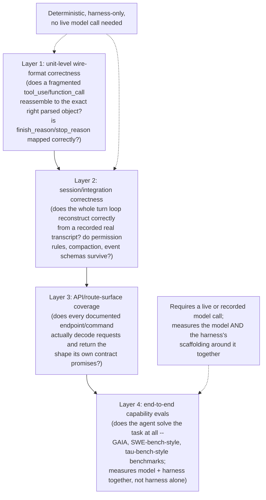
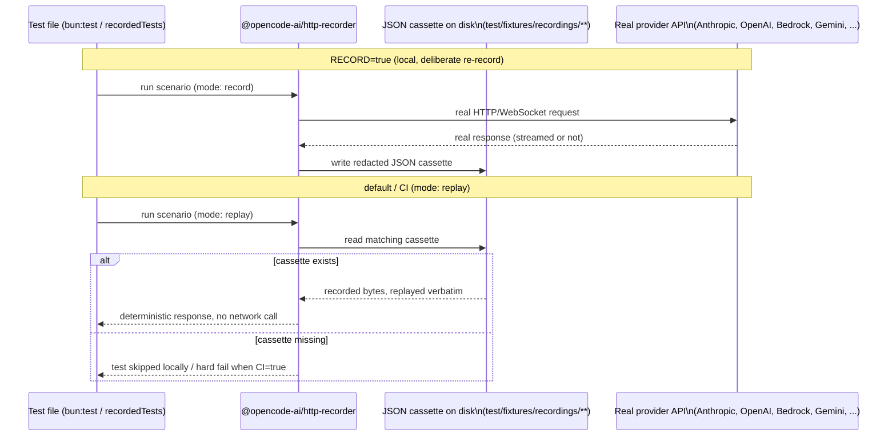
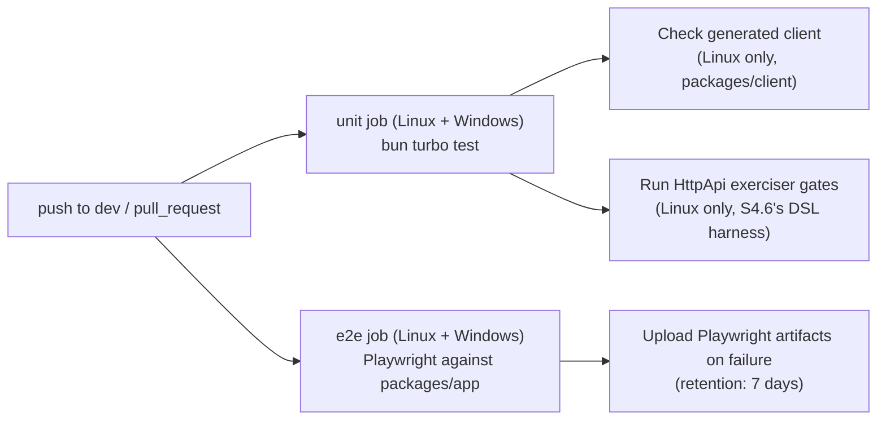

# Evals and testing a harness -- validating that a from-scratch harness actually works

**Scope note.** Every other page in this book describes a mechanism a
harness *has*; this page describes how a builder would know that
mechanism actually *works*, and keeps working after the next change. It
deliberately separates two questions that get conflated constantly in
public discussion of "agent evals": whether the **model** is capable
(can it plan, use tools sensibly, solve the task) versus whether the
**harness** is correct (does it reassemble a streamed tool call byte-for-
byte, does a permission rule actually block what it claims to block,
does a compacted transcript still round-trip). A capability benchmark
run against Claude Opus inside Claude Code and the same model inside a
different harness can produce different scores for reasons that have
nothing to do with the model -- Anthropic's own engineering writing
says this plainly (§2.2 below) -- which is precisely why a harness
needs its own, harness-scoped test suite distinct from any end-to-end
capability benchmark. This page does not re-derive the wire-level
contract a tool-call-parsing test is actually checking --
[llm-api-contract.md](llm-api-contract.md) §1.5/§2.3 already grounds
the `input_json_delta`/`function_call_arguments.delta` accumulate-then-
parse discipline, and
[streaming-and-incremental-rendering.md](streaming-and-incremental-rendering.md)
§3.1-§3.2 already shows, from OpenCode's own source, exactly which
layer of a harness holds a still-partial argument string in memory and
when it gets parsed. This page picks up one level higher: what
automated, repeatable check would actually catch a regression in that
mechanism before a user does.

Every claim below is tagged VERIFIED (fetched or read from source this
session, source named) or BEST CURRENT UNDERSTANDING, UNCONFIRMED.
Claude Code and Copilot CLI are both closed source, so -- as with every
other topic this book has covered for them -- their own `CHANGELOG.md`s
are read as a *history of shipped behavior*, not a specification, and
neither repository ships an internal test suite to inspect. OpenCode is
different on this exact topic in a way no other page in this book has
been able to say yet: its repository does not just implement the
mechanism, it ships the actual regression-test source code that
protects it, down to the literal expected-event-array assertions on a
tool-call reassembly function. That asymmetry shapes this page's
structure -- OpenCode's section is the only one grounded in real test
code rather than inferred from documentation or a changelog.

---

## 1. General concepts: what "testing a harness" decomposes into

VERIFIED, `huggingface.co/learn/agents-course/bonus-unit2/monitoring-and-evaluating-agents-notebook`,
fetched fresh this session -- authoritative for general, framework-neutral
agent-evaluation vocabulary and pedagogy, not for any specific harness's
own practice (per this book's standing authority-overreach guard on
this source). The course draws a foundational split between **online
evaluation** ("live feedback" -- monitoring an agent in production,
tracking cost, latency, and real user responses as they happen) and
**offline evaluation** ("systematic checks before or during
development" -- controlled, pre-deployment quality checks run against a
fixed dataset rather than live traffic). It also names a **trace** as
the complete recorded sequence of an agent's steps, with sub-spans for
individual tool calls and model invocations -- the same execution
record this book's [session-persistence.md](session-persistence.md)
covers as durable storage and
[streaming-and-incremental-rendering.md](streaming-and-incremental-rendering.md)
covers as a live event stream, here treated instead as the *unit of
inspection* an evaluator reads after the fact.

The course's own regression-testing methodology, read directly from the
fetched page: populate a dataset of input/output pairs representing
expected behavior; run the agent against every item in that dataset;
record each output and link it back to its originating test case;
compare results across configurations (a different model, a different
tool set, a changed prompt); and visualize the comparisons side by side
to spot where a change moved the needle. **LLM-as-a-judge** -- using a
second model to score an output against stated criteria -- is named as
the mechanism that lets this comparison run unattended rather than
requiring a human to read every trace. The course's own capstone (Unit
4, not re-fetched in full this session but referenced by the same
source material) has a learner build an agent and score it against a
subset of the **GAIA** benchmark, a concrete example of the fourth,
outermost layer in this page's diagram: a benchmark that scores an
agent's ability to actually complete real tasks, not any one harness
mechanism in isolation.

This general vocabulary maps cleanly onto the four-layer pyramid this
page's diagram draws, but the mapping itself -- which layer a given
piece of harness-specific evidence actually belongs to -- is this
page's own synthesis, not a claim from the Hugging Face course, which
does not discuss Claude Code, Copilot CLI, or OpenCode by name at all.

---

## 2. Claude Code

Claude Code is closed source; no test suite exists in
`github.com/anthropics/claude-code` to read. Two of Anthropic's own
engineering blog posts, however, document real, first-party guidance on
evaluating agent behavior -- read as Anthropic's own stated practice,
not merely third-party advice, since both are published directly under
`claude.com`/`anthropic.com`'s own engineering domains.

### 2.1 Anthropic's published evals guidance for agents built on the Claude Agent SDK

VERIFIED, `claude.com/blog/building-agents-with-the-claude-agent-sdk`,
fetched fresh this session. The post states its central testing
directive plainly: "If your agent's performance varies as you add
features, build a representative test set for programmatic evaluations
(or evals) based on customer usage" -- i.e. the recommended dataset for
an eval suite is drawn from real observed usage, not authored
speculatively, and the post frames this as a release-gating discipline
rather than a one-off exercise: don't ship a prompt or model change "on
vibes," score it against the eval dataset first, and keep a scheduled
evaluation run watching for regressions the eval set itself did not
predict. Three concrete verification methods are named, each with an
explicit tradeoff called out:

- **Rules-based feedback** -- "the best form of feedback is providing
  clearly defined rules for an output, then explaining which rules
  failed and why," with code linting given as the canonical example.
  This is the same category Layer 1 of this page's pyramid names --
  deterministic, mechanical, no model-judgment involved.
- **Visual feedback** -- screenshots or renders, for verifying UI
  generation and other visually-checkable tasks, a check that has no
  clean textual assertion to write against.
- **LLM as judge** -- a second model scoring output against fuzzy
  criteria, with an explicit caution attached: the post states this
  "is generally not a very robust method, and can have heavy latency
  tradeoffs" -- a real, first-party caveat on the exact technique the
  Hugging Face course in §1 recommends more unreservedly, worth reading
  side by side as two sources disagreeing in emphasis on the same
  method's reliability.

The post also frames failure-mode diagnosis as a design question, not
only a testing one: does the agent misunderstand the task (a missing-
information problem), does it fail the same way repeatedly (evidence
that a formal, rules-based check is needed rather than more prompting),
and can it recover from its own errors -- questions that shape what an
eval dataset should even be checking for, prior to writing any
assertions.

### 2.2 The evaluator-agent pattern, and why harness design is inseparable from capability evals

VERIFIED, `anthropic.com/engineering/harness-design-long-running-apps`,
fetched fresh this session. This post's central, explicitly stated
claim is the reason this page opened with the model-versus-harness
distinction: capability evaluations on multi-step tasks are, in the
post's own words, deeply influenced by harness design, not just the
underlying model -- "the infrastructure around the model" is described
as "just as critical as the model itself" to a measured capability
score. The post's own concrete testing mechanism is a dedicated
**evaluator agent** distinct from the agent doing the work: for a DAW
(audio workstation) build example, the evaluator used Playwright to
exercise the built application through its actual UI, and identified
real functional gaps that way -- non-functional audio recording, missing
clip-manipulation features -- rather than by reading source code or
trusting the builder agent's own self-report.

The post frames the evaluator's own correctness as a design problem in
its own right, not a solved given: rather than reaching for standardized
external benchmarks, it describes hand-authored, criteria-based grading
rubrics (four named criteria for frontend work -- design quality,
originality, craft, and functionality -- explicitly built to convert
"subjective judgements into concrete, gradable terms" an evaluator agent
can apply consistently) and, for full-stack work, grading against a
**sprint contract** -- an agreed specification of testable behaviors
fixed *before* implementation begins, so the evaluator has a stable
target rather than grading against a moving or retroactively-justified
standard. The post's own description of tuning this evaluator is
manual and iterative, not itself automated: "read the evaluator's logs,
find examples where its judgment diverged from mine, and update the
[evaluator's] prompt to solve for those issues" -- i.e. even a
purpose-built evaluator agent needs its own review-and-correct loop
before its verdicts can be trusted, a recursive version of exactly the
verification problem this whole page is about.

### 2.3 Headless mode as documented scaffolding for building an external eval/CI harness

VERIFIED, `code.claude.com/docs/en/headless`, fetched fresh this
session. Nothing on this page describes an eval framework Anthropic
ships, but several documented features are explicitly framed around
making Claude Code's own output deterministic and machine-checkable --
i.e. this is the raw material a builder would use to construct the
Layer 1-3 checks this page's pyramid names, aimed at Claude Code itself
rather than at a project Claude Code is working on:

- **`--bare` mode** is documented as skipping auto-discovery of hooks,
  skills, plugins, MCP servers, auto memory, and CLAUDE.md entirely,
  with the docs stating outright: "Bare mode is useful for CI and
  scripts where you need the same result on every machine" -- a
  directly-named determinism guarantee, since a hook or MCP server
  picked up incidentally from a teammate's `~/.claude` or a project's
  `.mcp.json` is exactly the kind of environment-dependent variable
  that would make a CI-run eval non-reproducible. The docs flag it as
  "the recommended mode for scripted and SDK calls" and note it will
  become `-p`'s default in a future release.
- **`--output-format json`** returns "structured JSON with result,
  session ID, and metadata," including `total_cost_usd` and a
  per-model cost breakdown the docs describe as lettings "scripted
  callers track spend per invocation" -- directly useful for an eval
  harness that wants to log cost alongside correctness per test case,
  the same per-case bookkeeping the Hugging Face course's methodology
  in §1 calls for.
- **`--output-format json` combined with `--json-schema`** validates
  the response against a caller-supplied JSON Schema and surfaces the
  result in a `structured_output` field -- the docs are explicit that
  an invalid schema itself is now a hard error (`Error: --json-schema
  is not a valid JSON Schema`), a changelog-traced hardening from
  v2.1.205 onward (before that version, the docs state, "Claude Code
  silently ignored an invalid schema and returned unstructured text");
  this is precisely the kind of schema-validated, assertion-friendly
  output shape an automated correctness check over many test prompts
  would want to diff against expected values.
- The **`system/init` event's `plugin_errors` and `mcp_server_errors`
  fields** are the one place this page found explicit, first-party CI
  language on `code.claude.com/docs` itself: the docs' own subsection
  is titled "Fail CI when a plugin or MCP server doesn't load," and
  states the field is "omitted when there are no errors, so a CI gate
  can fail on a non-empty array" -- a documented, load-bearing
  CI-integration contract, not a side effect a builder would have to
  discover by trial and error.
- The docs close by pointing to dedicated **GitHub Actions** and
  **GitLab CI/CD** pages for wiring the Agent SDK into pipeline
  automation directly, named as the intended next step past ad hoc
  `-p` scripting -- this page did not re-fetch either of those pages
  this session, so their own content is not claimed here beyond their
  existence as documented integration points.

### 2.4 The changelog's own "regression" vocabulary, read as proxy evidence

VERIFIED, `github.com/anthropics/claude-code` `CHANGELOG.md`, fetched
fresh this session via `gh api repos/anthropics/claude-code/contents/
CHANGELOG.md` (full 5,248-line file), grepped for `regression`. The
changelog uses that exact word, paired with the specific version that
introduced the bug, dozens of times across its history -- a small,
representative sample: "Fixed plugins enabled via the `--settings` CLI
flag not loading (regression since v2.1.181)," "Fixed a prompt-caching
regression on Bedrock, Vertex, Mantle, and Foundry that billed the
trailing system context block as fresh input tokens on every request,"
"Fixed a startup regression (~120ms per launch in fresh environments,
introduced in 2.1.169)," and "Fixed a regression where the context
window blocking limit was calculated too aggressively, blocking users
at ~65% context usage instead of the intended ~98%." Read plainly, this
dated, versioned self-tagging is the *only* externally visible evidence
this page found of Anthropic's own internal fix-verify discipline for
Claude Code, since the repository ships no test suite to inspect
directly (the same standing limitation every other page in this book
notes for Claude Code's internals). It should be read carefully for
what it does and does not prove: it demonstrates that regressions are
identified, attributed to a specific prior version, and fixed on a
sustained, ongoing basis -- consistent with an internal regression-test
suite existing and being extended after each escaped bug, per the
usual "add a test for the bug you just fixed" discipline -- but the
changelog itself never states that such a suite exists, its shape, or
its coverage; that inference is BEST CURRENT UNDERSTANDING, UNCONFIRMED,
not a fact this page can cite the changelog as directly asserting.

---

## 3. GitHub Copilot CLI

Copilot CLI is likewise closed source, with no test suite to inspect in
`github.com/github/copilot-cli`. Unlike Claude Code, this page found no
equivalent first-party engineering blog post from GitHub describing an
evals methodology for the CLI specifically -- a real, flagged gap
relative to §2.1/§2.2's two Anthropic posts, not merely an omission in
this page's own research.

### 3.1 Documented non-interactive/programmatic execution

VERIFIED, `docs.github.com/en/copilot/reference/copilot-cli-reference/
cli-programmatic-reference`, fetched fresh this session. The page names
its own intended audience directly: "scripts, CI/CD pipelines, and
automation workflows." The core primitive is `-p PROMPT` ("Execute a
prompt in non-interactive mode. The CLI runs the prompt and exits when
done"), with `-s` documented as suppressing "stats and decoration,
outputting only the agent's response. Ideal for piping output in
scripts" -- the same script-friendly-output goal Claude Code's `-p`
mode serves, though the two harnesses arrived at it via different flag
vocabularies (`--output-format text` vs. Copilot's default `-p` output
plus `-s` to strip decoration). Two session-capture flags are also
documented -- `--share=PATH` ("Export the session transcript to a
markdown file after non-interactive completion") and `--share-gist`
("Publish the session transcript as a secret GitHub gist after
completion") -- both directly useful for the kind of trace-capture-per-
test-case §1's general methodology calls for, since a Markdown
transcript export is a durable, reviewable artifact per invocation.
Environment variables `COPILOT_ALLOW_ALL`, `COPILOT_MODEL`, and
`COPILOT_GITHUB_TOKEN` are documented as the automation-configuration
surface. **A genuine gap found on this specific page**: it documents
none of `--output-format json`/JSONL, structured-response parsing, or
exit-code/error-handling behavior -- despite the CLI's own changelog
(§3.2 below) confirming a JSON output flag exists; this docs page is
simply narrower in scope than Claude Code's equivalent headless-mode
page, not evidence the feature itself is undocumented anywhere.

### 3.2 Changelog-traced scaffolding for external, script-driven verification

VERIFIED, `github.com/github/copilot-cli` `changelog.md`, fetched fresh
this session via `gh api repos/github/copilot-cli/contents/
changelog.md` (full 2,898-line file), grepped for `regression`,
`benchmark`, `test suite`, `non-interactive`, `headless`,
`--output-format`, and `programmatic`. Several dated entries build up
exactly the kind of scriptable, assertion-friendly surface §2.3 already
documents for Claude Code, arrived at independently and on a different
timeline:

- **v0.0.422 (2026-03-05)**: "Add --output-format json flag to emit
  JSONL in prompt mode for programmatic integrations" -- the direct
  Copilot CLI analogue of Claude Code's `--output-format json`/
  `stream-json`, confirming machine-parseable output is a real,
  shipped CLI feature even though the docs page checked in §3.1 does
  not mention it.
- **v1.0.16 (2026-04-02)**: "Add PermissionRequest hook to allow
  scripts to programmatically approve or deny tool permission
  requests" -- a scripted-approval mechanism an automated test harness
  could use to drive a Copilot CLI session through a fixed,
  reproducible permission-decision path without a human at the
  keyboard, the same non-interactive-determinism goal Claude Code's
  `--bare`/`--allowedTools` flags serve.
- **v1.0.33 (2026-04-20)**: "Non-interactive mode waits for all
  background agents to finish before exiting" -- a correctness fix
  directly relevant to any test harness driving Copilot CLI
  programmatically: before this version, a script capturing `-p`
  output could plausibly race a still-running background agent and
  observe an incomplete result, exactly the kind of flaky-test hazard
  a CI-oriented eval suite would need to be immune to.
- **v1.0.69 (2026-07-07)**: "Add auto allow-all mode that auto-approves
  requests an LLM judge evaluates as acceptable" -- a genuinely
  interesting, source-confirmed instance of "LLM as judge" (the exact
  technique named in both §1 and §2.1) being used operationally
  *inside* the harness's own permission-decision pipeline, not as an
  external eval technique applied to the harness from outside. This is
  a different use of the same mechanism from anything else on this
  page and should not be conflated with an evals practice for
  validating Copilot CLI itself -- it is the harness using an LLM
  judge on live traffic, not a test author using one to score a
  recorded eval run.

### 3.3 The changelog's own regression vocabulary

The same `regression`-tagged, dated bug-fix pattern §2.4 documents for
Claude Code recurs here on an independent timeline: "Fix a regression
that caused 'Invalid session id' errors for agent shell calls," "Fixed
timeline entry regression where read_agent and other tools showed
incorrect content," "Fixed a regression where calling `/model` with an
argument did not work properly," and "Moved Kitty protocol support
behind the `COPILOT_KITTY` environment variable due to observed
regressions" (the last explicitly cross-referencing two GitHub Issues,
#257 and #259, as the source of the observed regression reports). The
same caveat from §2.4 applies identically: this is proxy evidence of an
ongoing internal fix-verify discipline, not a confirmed description of
any specific internal test-suite architecture, since -- as with Claude
Code -- no implementation source exists in this repository to check
that inference against.

---

## 4. OpenCode

VERIFIED throughout this section, `github.com/anomalyco/opencode`,
`dev` branch (not a stable release tag, per this project's standing
flag), located via `gh search code`/`gh api .../git/trees` and read in
full via `curl` against `raw.githubusercontent.com` this session. This
is the one harness in this book where "how would you test this" has a
literal, source-read answer rather than an inferred or documented one
-- the repository's own `git` tree lists hundreds of `*.test.ts` files
spread across every package (`packages/core/test/`, `packages/llm/
test/`, `packages/app/src/**/*.test.ts`, `packages/httpapi-codegen/
test/`, and more), and this section reads a representative, directly
relevant slice of that suite rather than claiming to have read all of
it.

### 4.1 The record/replay cassette architecture

VERIFIED, `packages/http-recorder/README.md` (full file read this
session). The package's own one-line purpose statement: "Record real
Effect HTTP and WebSocket traffic once, then replay it from
deterministic JSON cassettes," recommended explicitly for "provider
integrations, retries, polling, multi-step flows, and any test where
hand-written HTTP mocks hide too much of the real request shape" -- a
direct, stated rejection of the alternative (a developer hand-writing a
fake response body) on the grounds that a hand-written mock tends to be
simpler and rounder than what a real API actually returns, hiding the
exact edge cases (odd chunk boundaries, provider-specific field
ordering, real error payloads) a tool-call-parsing test most needs to
catch. The README's own stated CI-safety discipline is exactly the
detail that makes this suite trustworthy as a regression gate rather
than a source of silent false negatives: "When `CI=true`, missing
cassettes fail instead of recording" -- i.e. a CI run can never
silently fall back to live-recording mode and never silently skip a
test because its cassette went missing; a missing cassette in CI is a
hard failure demanding a deliberate, human-triggered re-record.
`packages/llm/test/recorded-test.ts` (full file read this session)
implements the harness consuming this package for the LLM-protocol
suite specifically: a `mode` derived from `process.env.RECORD ===
"true"`, secret redaction merged from both a group-level and a
per-case `RecorderOptions` (headers, allowed request/response headers,
query parameters, and JSON fields can each be independently redacted or
allow-listed before a cassette is ever written to disk), and
`packages/llm/test/recorded-utils.ts` (full file read this session)
supplying an env-var-driven test-selection mechanism --
`RECORDED_PREFIX`, `RECORDED_PROVIDER`, `RECORDED_TAGS`, and
`RECORDED_TEST` -- letting a maintainer re-run or re-record just the
Anthropic-tagged subset, or just one named scenario, rather than the
entire provider matrix on every local iteration.

### 4.2 The golden-scenario regression matrix: one scenario, run against ~18 provider/model targets

VERIFIED, `packages/llm/test/provider/golden.recorded.test.ts` (full
223-line file read this session), `packages/llm/test/recorded-golden.ts`
(full file), and `packages/llm/test/recorded-scenarios.ts` (opening
~140 lines read in full). This is the file most directly answering the
handoff's own framing of this topic -- "benchmark-style correctness
checks on tool-call parsing." A single shared scenario generator,
`weatherToolLoopRequest`/`goldenWeatherToolLoopRequest` (a fixed system
prompt instructing the model to call a `get_weather` tool exactly once,
then reply with an exact scripted sentence, "Paris is sunny"), and a
shared driver, `runWeatherToolLoop`, which runs an actual multi-step
tool loop (dispatching the real `weatherRuntimeTool` handler against
the model's `tool-call` events, feeding results back as `Message.tool`
entries, capped at 10 steps) are each defined **once** and then reused
identically across a declared list of concrete provider/model targets
in `golden.recorded.test.ts`: OpenAI Chat (`gpt-4o-mini`), OpenAI
Responses (`gpt-5.5`, both HTTP and WebSocket transports), Anthropic
(Haiku 4.5 and Opus 4.7), Gemini 2.5 Flash, xAI (Grok 3 Mini and Grok
4.3), Cloudflare AI Gateway and Cloudflare Workers AI (each in a
plain-text and a tools-capable model variant), and four OpenAI-
compatible third-party endpoints reached through `openai-compatible-
chat.ts` -- DeepSeek, TogetherAI, Groq, and three separate OpenRouter-
routed models (GPT-4o-mini, GPT-5.5, and Claude Opus 4.7 all proxied
through OpenRouter specifically). Each target declares which named
scenario IDs it exercises (`text`, `tool-call`, `tool-loop`,
`image-tool-result`, `reasoning`, `reasoning-continuation`) via a
shared `ScenarioInput` type, a `requires` list of environment variables
that gate whether the scenario can even attempt a live re-record, and
an optional `tags` array (`"flagship"` marking the more expensive
frontier-model variants of a given provider) that the env-var selection
mechanism in §4.1 can filter on. The practical effect: the identical
logical question -- "does a tool call survive a full request/response/
tool-execution/continuation round trip, parsed correctly, for this
specific protocol implementation" -- is asked against every protocol
family this book's [llm-api-contract.md](llm-api-contract.md) §3.3
documents (`anthropic-messages.ts`, `openai-chat.ts`, `openai-
responses.ts`, `gemini.ts`, plus the `openai-compatible-chat.ts` reuse
path), turning a single authored scenario into a genuine cross-protocol
regression matrix rather than one test per protocol independently
authored and prone to drifting out of parity with each other.

### 4.3 Unit-level correctness tests on the reassembly algorithm itself

VERIFIED, `packages/llm/test/tool-stream.test.ts` (full 99-line file
read this session) -- the layer directly underneath §4.2's live-request-
shaped tests, and the one most precisely answering "correctness checks
on tool-call parsing" in the narrowest possible sense: pure,
deterministic unit tests on `ToolStream`, the module
[llm-api-contract.md](llm-api-contract.md) §3.3 already names as the
per-protocol fragment-accumulation logic. One test drives
`ToolStream.appendOrStart` across **two separate calls** with
OpenAI-shaped delta fragments split mid-JSON-string
(`'{"query"'` then `':"weather"}'`), asserting the exact
`tool-input-start`/`tool-input-delta` event sequence produced by each
call individually and the final `tool-input-end`/`tool-call` event
(with `input` already parsed to `{ query: "weather" }`) produced once
`ToolStream.finish` is called -- a literal, assertion-backed
demonstration of surviving a chunk boundary landing mid-string, the
exact scenario this book's other pages (llm-api-contract.md §1.5's
"partial JSON strings" warning, and a real, changelog-confirmed Claude
Code bug fixed in v2.1.92 per
[streaming-and-incremental-rendering.md](streaming-and-incremental-rendering.md)
§1.2) discuss only in the abstract or via a dated bug-fix log entry.
Further cases assert: `ToolStream.appendExisting` against a tool the
stream never saw a start event for correctly fails with a named
`LLMError` ("missing tool") rather than silently producing a malformed
result; `ToolStream.finishWithInput` correctly discards accumulated
deltas in favor of an authoritative final-input override without
losing the tool's identity or name; and `ToolStream.finishAll` correctly
preserves a `providerExecuted: true` flag on a hosted tool call (the
same server-executed-tool passthrough
[llm-api-contract.md](llm-api-contract.md) §3.3 documents) while
clearing every pending tool from the stream's internal state at once.
These are the kind of tests that need no network access, no API key,
and run in milliseconds -- deliberately the cheapest, fastest-feedback
layer of this whole page's pyramid, sitting directly below §4.2's
recorded, protocol-shaped scenarios.

### 4.4 Event-serialization regression tests, including a schema-backward-compatibility check

VERIFIED, `packages/core/test/session-runner-tool-events.test.ts` (full
136-line file read this session). This file tests the layer
[streaming-and-incremental-rendering.md](streaming-and-incremental-rendering.md)
§3.1 already documents from source (`publish-llm-event.ts`'s
republishing of `LLMEvent`s onto the session's own `SessionEvent` bus),
specifically for correctness of the *serialized* event shape rather
than the accumulation logic itself. One test confirms a local tool's
successful result containing a base64-encoded image is serialized
**exactly once** rather than duplicated across the event's `content`
and (legacy) `result` fields -- asserted by literally counting the
number of times the base64 string appears in the serialized JSON
(`serialized.split(base64)).toHaveLength(2)`, i.e. exactly one
occurrence) and asserting the modern field lacks a redundant `result`
property entirely. A second test confirms the opposite for a
**provider-executed** tool result, which deliberately *does* retain its
compatibility `result` field -- directly testing the same local-vs-
provider-executed divergence this book's other pages document as a
real architectural fork. A third test confirms a binary-read failure
emits a `tool.failed` event and never a spurious `tool.success` event.
The most notable single test in the file, from a pure
regression-engineering standpoint: **"old success event data containing
result still decodes"** -- it hand-constructs a payload shaped like an
*older* version of this same event schema (carrying a `result` field a
newer schema version no longer requires) and asserts
`Schema.decodeUnknownSync` still accepts it. This is a literal,
automated backward-compatibility regression test protecting exactly the
failure mode a durable, on-disk event/session-persistence format (this
book's own [session-persistence.md](session-persistence.md) documents
OpenCode's SQLite-backed message/event storage) would otherwise be
vulnerable to silently breaking on the next schema change.

### 4.5 Integration-level tests: the whole session loop against a recorded real transcript

VERIFIED, `packages/core/test/session-runner-recorded.test.ts` (opening
~80 lines of a 193-line file read this session). This test sits one
full layer above both §4.2 (a request/response round trip in isolation)
and §4.3-§4.4 (pure unit tests on individual functions): it wires
together real, non-mocked instances of the actual production dependency
graph -- `SessionRunner`, `SessionRunnerLLM`, `SessionProjector`,
`SessionExecution`, a real SQLite-backed `Database` layer, a real
`ToolRegistry`/`ToolOutputStore` -- alongside a small number of
deliberately mocked peripheral services (`PermissionV2.Service` mocked
to `Effect.die("unused")` on every method, confirming this specific
test path never needs a permission decision; `SkillGuidance` and
`ReferenceGuidance` both mocked to return an empty `SystemContext`,
keeping the test's system prompt minimal and deterministic) and drives
the whole assembly against a **recorded** OpenAI Chat cassette
(`session-runner/openai-chat-streams-text.json`, using the identical
`HttpRecorder`/cassette mechanism §4.1 documents, gated the same way on
`process.env.RECORD === "true"`). The practical effect: this is the
test that would catch a bug in how the session layer *itself*
reconstructs a message from a real streamed transcript, as distinct
from a bug in the lower-level LLM-client parsing §4.2/§4.3 already
cover in isolation -- the same "session/integration correctness" layer
this page's opening pyramid names as Layer 2, here shown to be a real,
source-verified test class in OpenCode specifically rather than a
theoretical category.

### 4.6 Route-coverage: a dedicated DSL-driven HTTP API exerciser

VERIFIED, `packages/opencode/test/server/httpapi-exercise/index.ts`
(header comment and opening ~90 lines of a 1,802-line file read this
session) and `packages/opencode/test/server/httpapi-exercise/dsl.ts`
(first 80 lines of a 210-line file read this session). The file's own
header comment states its purpose and explicitly distinguishes it from
ordinary unit testing: "The goal is not to be a normal unit test file.
This is a route-coverage harness: every public route should have a
small scenario that proves the route decodes requests, uses the right
instance context, mutates storage when expected, and returns the
expected response shape." The DSL itself (`http.protected.get/post/...`
chained with `.seeded(...)`, `.at(...)`, `.json(...)`/`.jsonEffect(...)`,
`.mutating()`, `.stream()`, and an auth-policy selector --
`.protected()`/`.public()`/`.publicBypass()`) declares one scenario per
documented HTTP API route against a real, in-process server instance
backed by a `TestLLMServer` fake rather than a live model, with the
comment's own stated safety discipline: the script "intentionally
isolates `OPENCODE_DB` before importing modules that touch storage,"
since scenarios "may create/delete sessions and reset the database
after each run," explicitly warning this "must never point at a
developer's real session database." This is a genuinely distinct
correctness layer from §4.2-§4.5: none of the earlier tests check
whether the *documented public API surface itself* -- the same
Server-Sent-Events/HTTP layer
[inter-agent-messaging.md](inter-agent-messaging.md) documents carrying
live session events -- actually round-trips correctly end to end for
every route, only whether the LLM-protocol or session-execution layers
underneath it behave correctly in isolation.

### 4.7 The CI pipeline gluing these layers together

VERIFIED, `.github/workflows/test.yml` (full 151-line file read this
session). Two top-level jobs run on every push to `dev` and every pull
request, each matrixed across Linux and Windows runners
(`blacksmith-4vcpu-ubuntu-2404`/`blacksmith-4vcpu-windows-2025`):

The **`unit`** job runs `GITHUB_ACTIONS=false bun turbo test` -- the
single command that fans out across every package's own `*.test.ts`
suite (§4.2-§4.5's files among them) via Turborepo's own task
orchestration, with a Windows-specific env override
(`OPENCODE_EXPERIMENTAL_DISABLE_FILEWATCHER: true` on Windows only)
flagging a real, cross-platform filesystem-watcher difference the suite
has to route around. Two further steps run **Linux-only**, after the
main unit-test step: `bun run check:generated` inside
`packages/client` (protecting the generated API client against drifting
out of sync with its own source schema -- a codegen-freshness
regression class distinct from anything in §4.1-§4.6) and `bun run
test:httpapi` inside `packages/opencode` -- the literal command that
invokes §4.6's route-coverage exerciser as its own, separately timed
CI gate rather than folding it into the ordinary `bun turbo test` run.
A wholly separate **`e2e`** job installs Playwright (with its own
browser-binary cache keyed on the pinned Playwright version read
directly out of `package.json`) and runs `bun --cwd packages/app
test:e2e:local` against the web/desktop app surface specifically,
uploading a `playwright-report`/`test-results` artifact "if-no-files-
found: ignore" but always attempted (`if: always()`) so a failing run's
traces survive the job for later inspection -- the practical, CI-level
implementation of exactly the trace-capture-per-test-case discipline
§1's general methodology names.

---

## 5. Synthesis

| Layer (per this page's own pyramid) | Claude Code | Copilot CLI | OpenCode |
|---|---|---|---|
| Unit-level wire-format/tool-call-parsing correctness | Not source-visible; changelog shows dated reassembly *bugs* fixed (v2.1.92, v2.1.94, cross-referenced from streaming-and-incremental-rendering.md §1.2), not a visible test | Not source-visible; no equivalent changelog entries found this session | Source-verified: `tool-stream.test.ts`'s `ToolStream` unit tests, asserting exact event sequences across a deliberately split-mid-string chunk boundary (§4.3) |
| Session/integration correctness | Not source-visible | Not source-visible | Source-verified: `session-runner-tool-events.test.ts` (event-serialization + schema-backward-compatibility, §4.4) and `session-runner-recorded.test.ts` (whole-loop-against-a-recorded-transcript, §4.5) |
| Cross-provider/protocol regression matrix | Not applicable in the same sense (single first-party model provider) | Not applicable in the same sense | Source-verified: one shared golden scenario (`weatherToolLoopRequest`) run against ~18 provider/model targets spanning every protocol family llm-api-contract.md §3.3 documents (§4.2), using deterministic VCR-style recorded cassettes (§4.1) |
| API/route-surface coverage | Not source-visible | Not source-visible | Source-verified: a dedicated DSL-driven `httpapi-exercise` route-coverage harness, its own separately-timed CI gate (§4.6-§4.7) |
| First-party published evals *guidance* | Two Anthropic engineering posts: representative-test-set/gate-releases-on-evals discipline, three verification methods (§2.1), the evaluator-agent/criteria-rubric/sprint-contract pattern (§2.2) | None found this session -- a real, flagged gap relative to Claude Code | None found as separate published guidance; the test suite itself is the artifact, not a companion essay about testing philosophy |
| Documented scaffolding for external, script-driven verification | `--bare` determinism, `--output-format json`+`--json-schema`, `system/init`'s CI-gating `plugin_errors`/`mcp_server_errors` fields (§2.3) | `-p`/`-s` scripting mode, `--share`/`--share-gist` transcript export, changelog-confirmed `--output-format json` (v0.0.422), `PermissionRequest` hook (v1.0.16), non-interactive background-agent wait-to-completion fix (v1.0.33) (§3.1-§3.2) | The record/replay cassette package itself (`@opencode-ai/http-recorder`) is both the scaffolding and the thing being scaffolded around -- a first-party, in-repo testing tool, not merely a documented CLI flag surface |
| Changelog's own regression-fix vocabulary (proxy evidence only) | Extensive, dated, version-attributed (§2.4) | Extensive, dated, version-attributed (§3.3) | Present in commit history generally but not this page's focus, since actual test source is directly readable instead |

**The design lesson.** The single clearest, most load-bearing fact this
page's research turned up is the asymmetry itself: two harnesses ship
no way to check their own correctness claims from the outside beyond a
changelog's own honesty about dated regressions, while the third ships
the literal assertions. That asymmetry is a direct consequence of this
book's own standing open-source/closed-source split (documented on
every other page touching Claude Code's or Copilot CLI's internals),
not evidence that either team tests less rigorously in private --
Anthropic's own two engineering posts (§2.1-§2.2) are, if anything,
unusually candid public evidence of a real internal evals discipline,
just one this page cannot verify the shape of the way it can verify
OpenCode's `ToolStream` test or its golden-scenario matrix line by
line. For a builder validating a from-scratch harness, the concrete,
transferable pattern this page's research actually supports is
OpenCode's own four-layer shape, independent of which harness inspired
it: (1) fast, deterministic unit tests on the fragment-accumulation
algorithm itself, needing no network access; (2) a small number of
integration tests that wire the real session loop against a recorded,
not live, transcript; (3) a shared "golden scenario" authored once and
replayed against every protocol/provider target the harness supports,
so protocol implementations cannot silently drift out of parity with
each other; and (4) a separate, explicit route/API-coverage pass
distinct from all of the above, because none of the first three layers
actually proves the documented public surface itself behaves as
promised. Layer 4 of this page's opening pyramid -- end-to-end
capability evals such as GAIA (§1) -- sits outside and above all four
of these, and, per Anthropic's own harness-design post (§2.2), scores a
combination of the model and the harness together; a from-scratch
harness builder who only ever runs that outermost layer has no way to
tell which of the two moved a score, which is the whole reason the
inner four layers need to exist as their own, harness-scoped discipline
first.

**A brief, bounded closing note.** This project's own `CLAUDE.md` states
plainly, as of this writing, that AIrchon itself -- the project this
wiki-book lives in -- "has no scripts, no `node:test` suite, and no
evals harness" of its own, on the grounds that `airchon-mentor` and
`airchon-author` are prose/research-driven rather than deterministic-
probe-driven the way a tool like AgentXRay's own `xray` skill family
is. That is a statement about this project's own tooling, not a claim
about any of the three harnesses this page researches -- it is
mentioned here only because the handoff note that prompted this page
named it explicitly as context, and it is worth being honest that this
book's own authoring process is closer to §2.1-§2.2's manual,
iterative evaluator-tuning loop than to §4's automated, assertion-backed
suite.

---

## Sources

All fetched or read fresh this session (2026-08-01) unless noted
otherwise.

**General agent-evaluation concepts (authoritative for framework-neutral
vocabulary and pedagogy, not for any specific harness):**
- `https://huggingface.co/learn/agents-course/bonus-unit2/monitoring-and-evaluating-agents-notebook`
  -- online vs. offline evaluation, traces, dataset-driven regression
  methodology, LLM-as-a-judge, the GAIA benchmark reference; covers §1
  in full.

**Claude Code (Anthropic's own engineering blogs are authoritative for
Anthropic's own stated practice and guidance; `code.claude.com/docs` is
authoritative for the Agent SDK/CLI's documented behavior; no
implementation source or test suite exists in
`github.com/anthropics/claude-code` to inspect directly):**
- `https://claude.com/blog/building-agents-with-the-claude-agent-sdk`
  -- representative-test-set/gate-on-evals guidance, the three
  verification methods (rules-based, visual, LLM-as-judge); covers §2.1
  in full.
- `https://www.anthropic.com/engineering/harness-design-long-running-apps`
  -- the evaluator-agent pattern, criteria-based grading rubrics, the
  sprint-contract concept, the harness-design-affects-capability-scores
  claim; covers §2.2 in full.
- `https://code.claude.com/docs/en/headless` -- `--bare` mode,
  `--output-format json`/`stream-json`, `--json-schema` validation and
  its v2.1.205 hardening, the `system/init` event's
  `plugin_errors`/`mcp_server_errors` CI-gating fields, the GitHub
  Actions/GitLab CI/CD pointers; covers §2.3 in full.
- `https://github.com/anthropics/claude-code` `CHANGELOG.md`, fetched
  via `gh api repos/anthropics/claude-code/contents/CHANGELOG.md` (full
  5,248-line file, grepped for `regression`) -- the dated,
  version-attributed regression-fix entries cited in §2.4.

**GitHub Copilot CLI (`docs.github.com/copilot` is authoritative for its
own documented behavior; no engineering-blog equivalent to Claude
Code's was found this session; no implementation source or test suite
exists in `github.com/github/copilot-cli` to inspect directly):**
- `https://docs.github.com/en/copilot/reference/copilot-cli-reference/cli-programmatic-reference`
  -- `-p`/`-s` non-interactive mode, `--share`/`--share-gist`
  transcript export, the documented automation environment variables,
  and the confirmed absence of JSON-output documentation on this
  specific page; covers §3.1 in full.
- `https://github.com/github/copilot-cli` `changelog.md`, fetched via
  `gh api repos/github/copilot-cli/contents/changelog.md` (full
  2,898-line file, grepped for `regression`, `benchmark`, `test suite`,
  `non-interactive`, `headless`, `--output-format`, `programmatic`) --
  v0.0.422, v1.0.16, v1.0.33, and v1.0.69 entries cited in §3.2, and the
  dated regression-fix entries cited in §3.3.

**OpenCode (authoritative for its own documented behavior AND, unlike
the two harnesses above, its own real implementation and test source;
`dev` branch, not a stable release tag):**
- `https://github.com/anomalyco/opencode`, `dev` branch, located via
  `gh search code` and `gh api repos/anomalyco/opencode/git/trees/dev?recursive=true`
  (full repository file-tree listing) and read via `curl` against
  `raw.githubusercontent.com` this session -- full contents of
  `packages/http-recorder/README.md` (§4.1), `packages/llm/test/
  recorded-test.ts`, `packages/llm/test/recorded-utils.ts`,
  `packages/llm/test/recorded-runner.ts`, `packages/llm/test/
  recorded-golden.ts` (§4.1-§4.2), `packages/llm/test/provider/
  golden.recorded.test.ts` (full file) and the opening portion of
  `packages/llm/test/recorded-scenarios.ts` (§4.2), the full contents of
  `packages/llm/test/tool-stream.test.ts` (§4.3), the full contents of
  `packages/core/test/session-runner-tool-events.test.ts` (§4.4), the
  opening portion of `packages/core/test/session-runner-recorded.test.ts`
  (§4.5), the header comment and opening portion of `packages/opencode/
  test/server/httpapi-exercise/index.ts` and the opening portion of
  `packages/opencode/test/server/httpapi-exercise/dsl.ts` (§4.6), and
  the full contents of `.github/workflows/test.yml` (§4.7) -- covering
  §4 in full.
