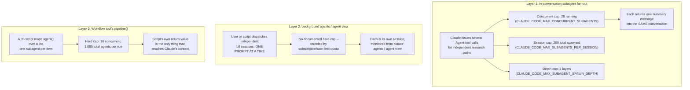
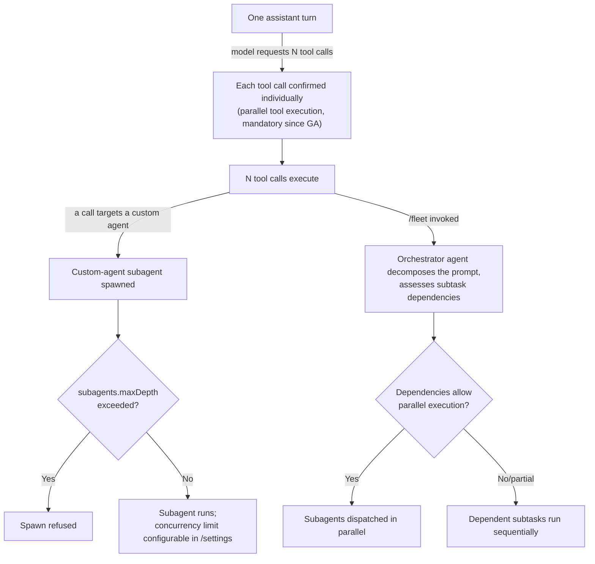
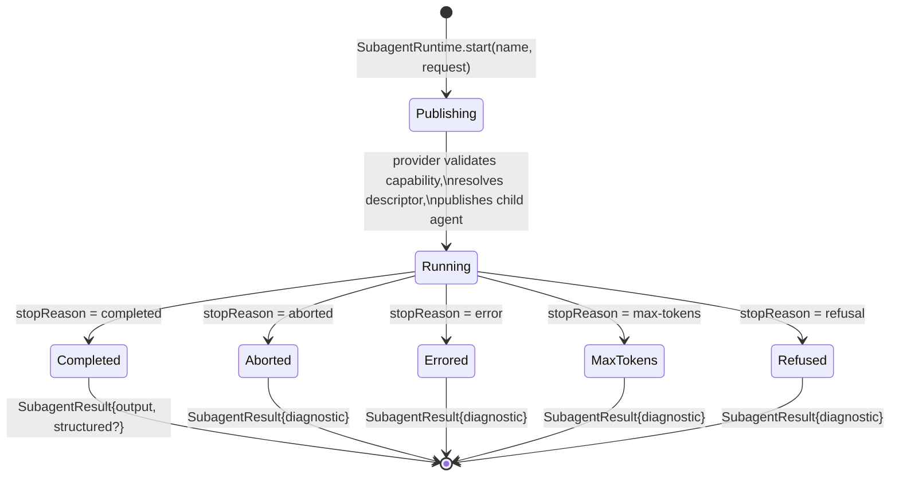
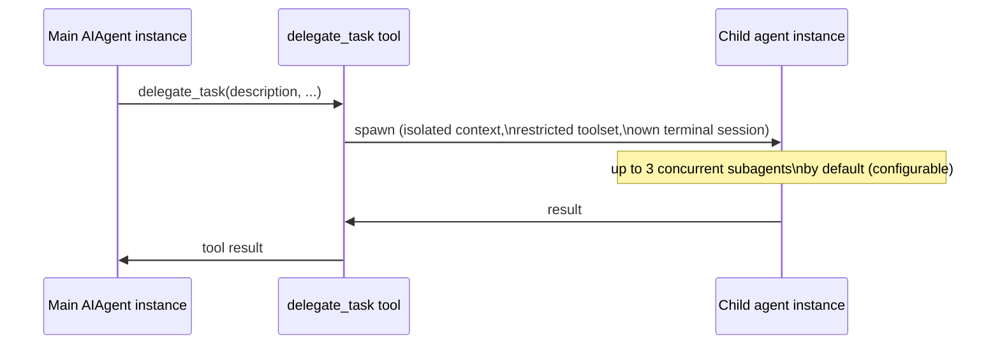

# Fan-out -- launching several agents at once

**Scope note.** [handoff-mechanism.md](handoff-mechanism.md) covers what
crosses the boundary once one agent hands work to one other agent, and
[orchestration.md](orchestration.md) covers who holds the plan once a task
needs several agents working together. This page asks the question both of
those deliberately deferred: how does a harness actually *launch* several
agents (or, one level down, several tool calls) at the same time, what
numeric or structural ceiling bounds how many can run at once, what the
concrete dispatch mechanism looks like underneath the model's own request,
and how the fanned-out results rejoin the turn that launched them. The
general Thought/Action/Observation loop in [agent-loop.md](agent-loop.md)
frames one step as one Action; fan-out is the case where a single step's
Action is actually N independent actions issued together, and each of the
five products researched here answers "what happens to those N actions"
differently -- at more than one layer, in most of the five cases.

---

## 1. Claude Code

Sources for this section: `code.claude.com/docs/en/sub-agents` and
`code.claude.com/docs/en/agent-view`, both fetched 2026-07-31. VERIFIED
unless tagged otherwise. Claude Code turns out to have **three
structurally distinct fan-out mechanisms**, not one, each with its own
concurrency ceiling and its own answer to "how do the results rejoin the
conversation."



### 1.1 In-conversation subagent fan-out -- the "Run parallel research" pattern

VERIFIED (`code.claude.com/docs/en/sub-agents`): the docs name this
pattern directly under "Run parallel research" -- "For independent
investigations, spawn multiple subagents to work simultaneously," with a
worked example: "Research the authentication, database, and API modules
in parallel using separate subagents. Each subagent explores its area
independently, then Claude synthesizes the findings. This works best when
the research paths don't depend on each other." The docs immediately warn
about the cost of over-using this: "When subagents complete, their
results return to your main conversation. Running many subagents that
each return detailed results can consume significant context."

Three independently configured numeric limits bound how far this can
scale, each with its own environment variable and its own failure mode:

| Limit | Default | Env var | Behavior at the limit |
|---|---|---|---|
| Concurrent subagent limit | 20 running at once (requires v2.1.217+) | `CLAUDE_CODE_MAX_CONCURRENT_SUBAGENTS` | Spawning another with the Agent tool fails with `Concurrent subagent limit reached`, and the error tells Claude not to retry; succeeds again once the running count drops. Sessions with [ultracode](orchestration.md) active are exempt entirely |
| Session subagent limit | 200 spawned total over a session (requires v2.1.212+) | `CLAUDE_CODE_MAX_SUBAGENTS_PER_SESSION` | The Agent tool fails with `Subagent spawn limit reached` and the error tells Claude to finish the remaining work with its own tools; `/clear` resets the counter (unless a still-running workflow carries budget across the clear) |
| Nesting depth limit | 3 layers below main (default raised to 3 as of v2.1.219; was 1 on v2.1.217-218, and unconfigurable at 5 layers on v2.1.172-216) | `CLAUDE_CODE_MAX_SUBAGENT_SPAWN_DEPTH` | Every subagent except a fork loses the `Agent` tool entirely once depth is reached; a fork at the limit keeps the tool listed but it errors instead of spawning |

The concurrent limit's own subtlety, stated directly in the docs: "The
limit blocks only subagents Claude spawns with the Agent tool, but other
runs occupy the same slots" -- an in-session fork started with `/subtask`
takes a slot without ever being blocked by the limit, and *resuming* a
subagent that already finished takes a fresh slot without checking the
limit either, "so resumes can push the running count past it." Agents a
[Workflow](orchestration.md) spawns, or teammates in an [agent
team](handoff-mechanism.md#15-agent-teams----peer-to-peer-handoff-not-parent-to-child),
follow their own separate limits rather than this one.

**What actually lets several Agent-tool calls proceed without serializing
the turn:** background execution, default since v2.1.198. VERIFIED: "Background subagents run concurrently
while you continue working," in contrast to foreground subagents, which
"block the main conversation until complete." Because Claude runs a
subagent in the foreground only "when it needs the result before
continuing," the ordinary shape of the "Run parallel research" pattern is
several Agent-tool calls issued as background tasks, each occupying one
concurrent-subagent slot, none of them blocking Claude from continuing to
work or from issuing the next one -- up to the 20-slot ceiling above. A
background subagent that hits a permission-gated tool call surfaces that
prompt "in your main session and names the subagent that is asking"
rather than pausing invisibly.

### 1.2 A second, coarser layer -- background agents (`claude agents`)

VERIFIED (`code.claude.com/docs/en/agent-view`, fetched 2026-07-31): this
is a structurally different fan-out mechanism from 1.1, explicitly called
out on the sub-agents page itself: "Subagents work within a single
session. To run many independent sessions in parallel and monitor them
from one place, see background agents." Where section 1.1's subagents are
children of one conversation and report back into that same context,
background agents are "independent Claude Code sessions that run without
a terminal attached... Each session uses your subscription quota
independently."

**Launch mechanics are explicitly one-at-a-time, not batched:** "Every
prompt you enter here starts its own new session. Typing another prompt
and pressing Enter launches a second session alongside the first rather
than sending a follow-up to it." Three documented launch paths: typing
directly into the agent-view dispatch input; `claude --bg "<prompt>"`
from the shell; and `/bg <prompt>` or `/fork <prompt>` from inside an
already-running interactive session. None of these accept a list of
prompts to dispatch as a single batch -- fanning out ten background agents
means issuing ten separate dispatches.

**No documented hard concurrency cap** exists at this layer -- the
constraint is economic, not architectural, and the docs state the cost
explicitly: "Rate limits apply: background sessions consume your
subscription usage the same as interactive sessions, so running ten
agents in parallel uses quota roughly ten times as fast as running one."
Monitoring is centralized in the `claude agents` view: sessions are
grouped by state (Pinned, Ready for review, Needs input, Working,
Completed) with a colored/animated icon per row, a Haiku-generated
one-line summary, and a `#N` pull-request label when a session has opened
one. `Space` opens a peek panel to read and reply without attaching;
`Enter`/`→` attaches the full interactive session; from the shell,
`claude logs <id>`, `claude attach <id>`, and `claude agents --json`
retrieve results without the TUI.

### 1.3 A third, scripted layer -- the Workflow tool's `pipeline()`

Already documented in full in [orchestration.md](orchestration.md)
section 1.2 (script model, `meta` block, distribution, resumability);
this page's own angle is narrower -- the launch mechanics specifically.
`pipeline()` fans a callback out across a list, spawning one subagent per
list item, and the runtime -- not the model, not the script -- enforces
the concurrency ceiling directly: **up to 16 concurrent agents** (fewer
on CPU-constrained machines) and a hard **1,000-agents-total-per-run**
cap "to prevent runaway loops." Unlike layer 1.1's model-issued batching
or layer 1.2's one-prompt-at-a-time dispatch, a workflow script's
`pipeline()` call is a single piece of code that the runtime executes
outside any model turn, throttling item-by-item dispatch against the
16-concurrent ceiling itself rather than relying on Claude to stay under
it.

---

## 2. GitHub Copilot CLI

Sources for this section: `github.com/github/copilot-cli`'s own
`changelog.md` (fetched via `gh api` 2026-07-31 -- authoritative for its
real behavior-change history per this project's SOURCE AUTHORITY rules)
and `docs.github.com/en/copilot/concepts/agents/copilot-cli/fleet`
(fetched 2026-07-31). VERIFIED unless tagged otherwise. Copilot CLI's
fan-out story is unusually well-documented as a *history* -- the
changelog traces the exact versions at which parallel dispatch went from
optional, to mandatory, to subagent-aware, to rate-limited by
configuration.



### 2.1 The substrate: parallel tool calls within one assistant turn

VERIFIED (`changelog.md`, version **0.0.349, 2025-10-22**): "The model can
now call multiple tools in parallel. Each tool must be confirmed in
advance. This behavior can be disabled with the
`--disable-parallel-tools-execution` flag." This predates custom agents
entirely (custom agents and `/delegate` shipped six days later, in
0.0.353) -- the foundational fan-out primitive in Copilot CLI is not
subagent-specific at all, it is the model's ability to request several
tool calls in one turn, each individually confirmed and then executed.
This opt-out flag persisted through the CLI's beta period and was removed
outright at general availability: VERIFIED (`changelog.md`, version
**0.0.418, 2026-02-25**, the same release the GitHub changelog announces
as GA): "Remove `--disable-parallel-tools-execution` flag and
`parallel_tool_execution` config option" -- parallel tool calling became a
fixed, non-optional default at GA rather than a configurable behavior.
Every higher-level fan-out mechanism below (`/fleet`, custom-agent
delegation) is built on top of this same substrate: a model turn that
requests several tool calls, each dispatched once confirmed.

### 2.2 Subagent fan-out: custom agents plus numeric depth/concurrency limits

Custom agents (the local `.agent.md` delegation mechanism documented in
[handoff-mechanism.md](handoff-mechanism.md) section 2.1) shipped in
**0.0.353, 2025-10-28**. Numeric limits on how far subagent spawning could
fan out arrived considerably later and evolved in four traceable steps:

- **1.0.22, 2026-04-09**: "Add sub-agent depth and concurrency limits to
  prevent runaway agent spawning" -- the original introduction of both
  caps as a real, enforced mechanism, though the changelog entry itself
  does not state the numeric defaults.
- **1.0.62, 2026-06-13**: "Nested subagents respect concurrency limits
  without blocking terminal input" -- a fix, implying the earlier
  behavior let a subagent hitting the concurrency ceiling stall the
  terminal itself, not just the spawn attempt.
- **1.0.66, 2026-06-30**: "Configure subagent concurrency and depth
  limits in /settings (usage-based billing users)" -- the limits became
  user-adjustable through the settings UI, gated to usage-based billing
  accounts.
- **1.0.71, 2026-07-16**: "Lower the default maximum sub-agent nesting
  depth from 6 to 4 to curb runaway recursive sub-agent delegation.
  Usage-based billing users can still adjust `subagents.maxDepth` (up to
  128)." This is the one entry that names both a concrete default
  transition (6 -> 4) and the actual config key, `subagents.maxDepth`.

**BEST CURRENT UNDERSTANDING, UNCONFIRMED:** no changelog entry found
this session states a concrete default *number* for the concurrency
limit itself (only that a configurable limit exists, per 1.0.22 and
1.0.66) -- this is a real, documented, user-configurable mechanism, but
Copilot CLI's own changelog does not give the same kind of "20 concurrent"
concrete default that Claude Code's docs state outright for its
equivalent limit (section 1.1 above). Treat this as an honest gap, not an
assumption that the default is unlimited.

### 2.3 `/fleet` -- conditional parallel dispatch atop the same substrate

Rollout, traced through the changelog: **0.0.411, 2026-02-17** --
"SDK APIs for plan mode, autopilot, fleet, and workspace files" and
"Autopilot mode and /fleet command now available to all users"; refined
two days later at **0.0.412, 2026-02-19** -- "/fleet mode dispatches more
subagents in parallel for faster execution" and "/fleet orchestrator
validates subagent work."

VERIFIED (`docs.github.com/en/copilot/concepts/agents/copilot-cli/fleet`,
fetched 2026-07-31, current docs rather than changelog history): "Where
possible, the orchestrator agent will run the subagents in parallel,
allowing the whole task to be completed more quickly" -- but this is
conditional, not automatic: "Whether parts of a large task can be worked
on in parallel will be determined by the dependencies between the
subtasks," and the orchestrator (the main Copilot agent) "will assess,
based on the nature of the subtasks and their dependencies, whether these
can be efficiently executed by subagents." The documented cost
trade-off, quoted directly: "Each subagent can interact with the LLM
independently of the main agent, so splitting work up into smaller tasks
that are run by subagents may result in more LLM interactions than if
the work was handled by the main agent. Using `/fleet` in a prompt may
therefore cause more GitHub AI Credits to be consumed." See
[orchestration.md](orchestration.md) section 2.2 for the full
decomposition mechanics and the separate SDK-level "Fleet mode" runtime
detail (SQL-backed todo state machine) presented there as background, not
CLI-confirmed internals.

**Checked directly this session and confirmed absent:** neither the
CLI's own `/fleet` docs page nor the separate SDK Fleet-mode page states a
concurrency cap or a batching mechanism for how many subagents `/fleet`
dispatches at once -- fetched fresh this session with that specific
question, and the answer both times was that the documentation "does not
specify concrete mechanics for parallel sub-agent launching, including
concurrency limits." This is a genuine documentation gap, not an
inference; whatever numeric ceiling exists (if any) for `/fleet`
specifically is not stated in either page.

### 2.4 A third, coarser layer -- multiple concurrent sessions

Traced through the changelog, this is Copilot CLI's own analogue to
Claude Code's background-agent layer (section 1.2 above), dispatching
whole independent sessions rather than in-conversation subagents:
**1.0.10, 2026-03-20** -- "Add experimental support for multiple
concurrent sessions"; **1.0.72, 2026-07-20** -- "The Sessions sidebar is
now navigable with the keyboard and mouse (arrows open and focus it and
move the selection, and Enter or a click switches to a session; press n
to spawn a session or x twice to close one from the keyboard)"; and, most
recently, **1.0.76, 2026-07-29** -- "New Sessions sidebar for managing
multiple concurrent sessions: switch between them, spawn new ones, and
see their status at a glance. Turn it on with experimental mode
(`/experimental on`)," alongside a related "Split-view sidebar" entry the
same release. BEST CURRENT UNDERSTANDING, UNCONFIRMED: the 1.0.76 entry
reads as either a rewrite or a further iteration of the sidebar already
present since 1.0.72 rather than a wholly new feature, but the changelog
text alone does not resolve which; either way, as of 1.0.77 (2026-07-30,
the latest entry checked this session) this layer is still labeled
experimental, gated behind `/experimental on`. Unlike Claude Code's
`agent-view` docs page (section 1.2), no dedicated Copilot CLI docs page
describing this layer's launch mechanics, quota cost, or concurrency
ceiling was found or fetched this session -- treat the comparison as
real-but-asymmetric in documentation depth, not as evidence the
underlying mechanism itself differs.

---

## 3. OpenCode

Sources for this section: `github.com/anomalyco/opencode`, `dev` branch,
fetched via `gh api` 2026-07-31 (`packages/opencode/src/tool/task.txt`,
`packages/opencode/src/tool/task.ts`, `packages/opencode/src/session/processor.ts`,
`packages/opencode/src/session/llm/native-runtime.ts`, `packages/llm/src/tool-runtime.ts`,
`packages/opencode/src/config/config.ts`) and `opencode.ai/docs/`,
fetched 2026-07-31. Per this project's standing caveat, `dev` is not a
stable release tag and may not match the current stable release. This is
the one harness where the fan-out dispatch mechanism is directly readable
in live implementation source, one layer deeper than either of the other
two harnesses' own documentation goes.

```mermaid
sequenceDiagram
    participant LLM as Provider stream (one assistant turn)
    participant Runtime as native-runtime.ts stream()
    participant Fiber as FiberSet (per-call fibers)
    participant Dispatch as ToolRuntime.dispatch
    participant Task as TaskTool.execute

    LLM->>Runtime: tool-call event #1 (task, subagent A)
    Runtime->>Fiber: FiberSet.run(dispatch#1, startImmediately: true)
    LLM->>Runtime: tool-call event #2 (task, subagent B)
    Runtime->>Fiber: FiberSet.run(dispatch#2, startImmediately: true)
    Note over Fiber: #1 and #2 run as INDEPENDENT fibers,<br/>neither waits for the other to start or finish
    Fiber->>Dispatch: dispatch#1 -> Task.execute
    Fiber->>Dispatch: dispatch#2 -> Task.execute
    Dispatch->>Task: sessions.create(parentID) x2 -- two real child sessions
    Task-->>Dispatch: each settles independently (foreground blocks on its own child; background forks a notify)
    Dispatch-->>Runtime: tool-result events queued as each fiber settles
    Runtime->>Runtime: FiberSet.awaitEmpty(settlements) -- barrier: waits for ALL forked fibers
    Runtime-->>LLM: results queue closes; turn's tool-execution phase ends
```

### 3.1 The prompted convention: batch multiple Task calls in one message

VERIFIED, quoted directly from the Task tool's own bundled
model-facing description text (`packages/opencode/src/tool/task.txt`,
fetched fresh this session): "Launch multiple agents concurrently
whenever possible, to maximize performance; to do that, use a single
message with multiple tool uses." This is instruction, not enforcement --
OpenCode's fan-out story starts from asking the model to batch several
`task` tool calls into one assistant message rather than issuing them one
turn at a time, with no scripted or config-driven alternative analogous
to Claude Code's Workflow `pipeline()` or Copilot CLI's `/fleet`
decomposition step found in the docs or source read this session (see
[orchestration.md](orchestration.md) section 3.3 for the same
observation from the coordination-layer angle).

### 3.2 What actually executes concurrently underneath: independent Effect fibers, not a queue

This is where OpenCode's fan-out mechanism stops being merely a prompted
convention and becomes a verifiable implementation detail. `native-runtime.ts`'s
`stream()` function (`packages/opencode/src/session/llm/native-runtime.ts`,
fetched fresh this session) processes the provider's own event stream for
one assistant turn; every non-provider-executed `tool-call` event in that
stream -- there is one such event per tool call the model requested in
that turn, whether it is a `Read`, a `Bash`, or a `task` call -- is routed
through this exact pipeline:

```javascript
Stream.flatMap((event) =>
  event.type !== "tool-call" || event.providerExecuted
    ? Stream.make(event)
    : Stream.make(event).pipe(
        Stream.concat(
          Stream.fromEffectDrain(
            ToolRuntime.dispatch(tools, event).pipe(
              Effect.flatMap((dispatched) => Queue.offerAll(results, dispatched.events)),
              Effect.catchCause((cause) => Queue.failCause(results, cause)),
              Effect.asVoid,
              FiberSet.run(settlements, { startImmediately: true }),
            ),
          ),
        ),
      ),
),
```

`FiberSet.run(settlements, { startImmediately: true })` forks the
dispatch into its own Effect fiber the instant the `tool-call` event is
seen, rather than awaiting it before the stream processes the next event.
Concretely: if a model turn contains three `task` tool-call events
(three subagent dispatches batched into one message, per section 3.1's
convention), the runtime forks three independent fibers back-to-back as
each event arrives, none blocking on the others' start or completion --
genuine concurrent dispatch, not a hidden queue that serializes them. The
overall stream only finishes once `FiberSet.awaitEmpty(settlements)`
resolves (visible in the same file, chained after the provider stream via
`Stream.concat`), which is the barrier point: the assistant turn's
tool-execution phase does not end, and the loop cannot advance to the
model's next turn, until *every* forked dispatch -- however many the
model batched into that turn -- has settled and closed the shared results
queue.

**What `ToolRuntime.dispatch` (`packages/llm/src/tool-runtime.ts`, fetched
fresh this session) does per call** is deliberately generic: decode the
tool's input against its schema, call the tool's own `execute` handler,
encode the result, and translate any failure into a `tool-error` /
`tool-result` event pair. For a `task` call specifically, `execute` is
`TaskTool`'s own `run` function (`packages/opencode/src/tool/task.ts`,
fetched fresh this session, content consistent with the mechanics already
documented in [handoff-mechanism.md](handoff-mechanism.md) section 3):
each independently-forked fiber calls `sessions.create({ parentID:
ctx.sessionID, agent: next.name, permission: [...] })` on its own,
producing genuinely separate child session rows rather than one shared
in-memory context split three ways. In foreground mode (the default),
each fiber's own call to `Effect.raceFirst(background.wait(...),
background.waitForPromotion(...))` blocks that fiber -- and only that
fiber -- until its own child session finishes; in the experimental
background mode (`OPENCODE_EXPERIMENTAL_BACKGROUND_SUBAGENTS=true`), each
fiber instead forks a `notify()` continuation that injects a synthetic
`<task id="..." state="completed">` message back into the parent session
once its own child finishes, independent of the other fibers' timing.

### 3.3 Depth and permission checks apply per call, not once per batch

Because each `task` tool-call event is dispatched as its own independent
fiber calling `TaskTool.run` from scratch, the depth check documented in
[handoff-mechanism.md](handoff-mechanism.md) section 3.2 -- walking the
`parentID` chain and rejecting with `Subagent depth limit reached (N)`
once `cfg.subagent_depth ?? 1` is reached -- and the permission derivation
(`deriveSubagentSessionPermission`, inheriting only the parent's *deny*
rules) are both re-evaluated independently for every fanned-out call, not
computed once for the batch and reused. Fanning out three subagents in
one message therefore means three independent depth-chain walks and
three independent permission derivations, not a single shared check
amortized across the batch.

A related but distinct guard surfaced while reading `processor.ts`
(`packages/opencode/src/session/processor.ts`, fetched fresh this
session): `DOOM_LOOP_THRESHOLD = 3`, checked after every `tool-call`
event by comparing the three most recent parts on the assistant message
against the current call's name and input, and triggering a `doom_loop`
permission ask when they match. This is a **repeated-identical-call
guard**, already documented from the coordination-layer angle in
[built-in-tools.md](built-in-tools.md), not a concurrency limiter -- it
fires on the same tool being called with the same input three times in a
row on one message, which is orthogonal to how many *different* tool
calls (including several distinct `task` calls) a single message can
batch together.

**BEST CURRENT UNDERSTANDING, UNCONFIRMED:** no numeric ceiling on how
many tool calls -- and therefore how many `task`/subagent dispatches --
can be batched into a single assistant message was found in
`config.ts` (`packages/opencode/src/config/config.ts`, fetched fresh this
session and searched directly for `max_concurrent`/`maxConcurrent`
config keys, none found) or in the `opencode.ai/docs/` pages fetched this
session. The `FiberSet`-based dispatch mechanism itself appears
architecturally unbounded (`FiberSet.run` forks unconditionally on every
non-provider-executed `tool-call` event), which is consistent with, but
does not by itself prove, an absence of any enforced cap -- a
configuration surface for this may exist elsewhere in the codebase not
read this session.

---

## 4. DeepSeek Harness

Sources for this section: VERIFIED, fetched 20 August 2026 directly from
`deepseek-ai/deepseek-harness` (`master` branch, developer preview -- see
[Hooks and lifecycle extensibility](hooks-lifecycle-extensibility.md) §4
for this book's fuller introduction to the harness itself, not repeated
here), `docs/subsystems/subagent.md` and `docs/glossary.md`.

### 4.1 Two distinct spawning paths: one-shot delegation vs. continuable children

DeepSeek Harness exposes two structurally distinct subagent-spawning
mechanisms, not one. **One-shot delegation** (`SubagentRuntime.start(name,
request)`) validates the requested capability against a named provider,
resolves a durable descriptor, and publishes a child agent that the
provider owns until the run settles; failures after publication settle
through the returned `SubagentRun` handle rather than throwing
synchronously. **Continuable children** (`SubagentRuntime.startContinuable(spec)`)
instead reserve a stable child identity up front, snapshot configuration,
and submit an initial prompt, resolving as soon as the child's inbox
*accepts* the message -- explicitly "without waiting for the turn to start
or for the message to reach the Session log," a deliberately weak
completion guarantee that decouples the parent's dispatch call from the
child's actual execution timeline.



A completed one-shot run returns a `SubagentResult` carrying `output`
(final assistant content), `structured` (a schema-validated result, when
one was requested), `diagnostic` (provider-authored failure detail, capped
at 4096 UTF-8 bytes), and a `stopReason` drawn from a fixed enumeration:
`completed`, `aborted`, `error`, `max-tokens`, `refusal`.

### 4.2 Context inheritance is a per-provider descriptor, and it is explicitly not authority inheritance

Context inheritance is governed per-provider by an `inheritsParentContext`
descriptor: **fork** providers (`true`) give the child "a balanced
completed-turn prefix of the parent's log" as a session seed, so the child
can see prior dialogue; **spawn** and **ACP** providers (`false`) give the
child no prior context at all. The docs draw a sharp, explicitly stated
line that this inherited-*context* flag says nothing about inherited
*authority*: "inheritance of context says nothing about tool registration,
injected services, or authority inheritance" -- every child agent gets "a
new flat scope rather than inheriting parent registrations," meaning a
child that can see the parent's prior conversation still starts with none
of the parent's tool grants unless those are separately re-registered for
it. This context-vs-authority split is worth naming explicitly against the
rest of this page: none of Claude Code's, Copilot CLI's, or OpenCode's own
sections above draw this exact distinction as sharply -- a fork-style
child's *visibility* into the parent's history and its *permissions* are,
in DeepSeek's own architecture, two entirely independent decisions, not one
bundled "inherit or don't" choice.

**This mechanism is a different thing from [Session &
transcript persistence](session-persistence.md) §4's `fork()`**, even
though both use the word "fork" and both originate from the same harness:
`inheritsParentContext` governs what a *newly spawned subagent* sees at
creation time (a one-time seed at dispatch), while `Session.fork()`
(documented on that page) creates an entirely new, independently addressable
*session* from an arbitrary earlier point in an existing session's own
history, unrelated to subagent dispatch at all. Conflating the two would be
a real error this page takes care not to make.

### 4.3 Concurrency: a stated qualitative guard, no numeric ceiling

On concurrency, the docs decline to state a global or per-agent numeric
cap; the only stated constraint is qualitative -- "a shared capacity
controller may delay an operation but must not couple its settlement or
cleanup to a sibling" -- meaning backpressure is a provider's own concern,
and one child's failure or delay is architecturally forbidden from
cascading into another sibling's lifecycle. This is a real, checked-this-
session absence finding (not merely an unread doc), and it lands directly
alongside §3.3's own prior finding on *this same page* that OpenCode's
`FiberSet`-based concurrent subagent dispatch likewise carries no
documented hard cap -- two independently-built, fully source-available
harnesses agreeing, in their own respective docs/source, that "no global
cap, provider-owned backpressure instead" is a workable production design,
not merely an oversight neither team got around to fixing.

This book's own search of DeepSeek's docs did not turn up a "Ralph
loop"/"Ralph round" workflow despite that terminology appearing in
`docs/glossary.md` (fetched separately this session, where it is described
as "a fresh-agent workflow toward an immutable objective, composed from
subagent primitives rather than functioning as a generic scheduler," with a
"Ralph round" as one fresh child session within that loop) -- the glossary
entry is VERIFIED, but this session's dedicated fetch of
`docs/subsystems/subagent.md` did not surface the mechanics behind it, so
its actual scheduling/composition logic is left as an open follow-up rather
than guessed at here.

### 4.4 Using the no-global-cap finding as a reasoning aid for Claude Code's own undocumented ceiling -- BEST CURRENT UNDERSTANDING, UNCONFIRMED

§4.3 above confirms DeepSeek's docs decline to state a global subagent
concurrency cap, on top of this page's own §3.3 finding that OpenCode's
`FiberSet`-based dispatch also carries none. Two independently-built,
fully source-available harnesses agreeing that "no global cap,
provider/runtime-owned backpressure instead" is workable is a real,
VERIFIED data point about that specific design choice at least twice over.
**BEST CURRENT UNDERSTANDING, UNCONFIRMED:** this raises the odds that
Claude Code's own undocumented ceiling (if any exists at all beyond the
documented concurrent/session/depth caps already covered in §1 above) is
similarly provider/session-owned rather than a single hardcoded global
number -- but this book has not found, and does not claim to have found,
Claude Code source or docs confirming that either way. Nothing in DeepSeek's
or OpenCode's own design should be read as evidence about what Claude
Code's closed-source engineering team actually implemented; it is offered
only as a concrete illustration that the "no hard global cap" design is a
real, workable choice at least two independent teams have made deliberately,
not an inherently unsafe gap.

---

## 5. Hermes Agent (Nous Research)

Source for this section: VERIFIED, fetched 24 August 2026 directly from
`hermes-agent.nousresearch.com/docs/user-guide/features/overview` and
`.../user-guide/bot-mode` (both WebFetch). Hermes Agent is a fifth,
independent, self-hosted product -- see
[Permissions & sandboxing architecture](permissions-and-sandboxing.md)
§6 for this book's fuller architectural introduction to the harness
itself, not repeated here.

### 5.1 `delegate_task`: isolated context, restricted toolset, and a *separate terminal session* per subagent



"The `delegate_task` tool spawns child agent instances with isolated
context, restricted toolsets, and their own terminal sessions. Run 3
concurrent subagents by default (configurable) for parallel
workstreams." This is the same isolated-context/final-report delegation
shape this page documents across Claude Code, Copilot CLI, OpenCode,
and DeepSeek Harness (§1-§4 above) -- every harness this book has now
examined reinvents "spawn an isolated worker, get back a result, don't
pollute the parent's context" independently, and Hermes' concrete
concurrency default (3, configurable) is a numeric ceiling stated
plainly where OpenCode's and DeepSeek's own dispatch mechanisms (§3-§4)
are documented as carrying none. The distinctive detail here is that
**each subagent gets its own terminal session**, not merely an isolated
message-context window -- a Hermes subagent can hold a genuinely
separate shell/container state from its parent, not just a separate
conversation transcript. VERIFIED (`docs.../developer-guide/architecture`,
per this book's [permissions-and-sandboxing.md](permissions-and-sandboxing.md)
§6 sourcing): the implementation lives in a named module,
`delegate_tool.py`, described as enabling "hierarchical task
decomposition within the conversation loop" -- named and located, but
not independently source-read this session, so the exact isolation
mechanics (whether restart, fresh context, or a forked snapshot) are
held to **BEST CURRENT UNDERSTANDING, UNCONFIRMED** beyond what the
Features Overview quote states directly.

### 5.2 Bot Mode: named specialist profiles coordinating in a shared group chat

"Bot Mode transforms Hermes profiles into named specialists with
distinct roles, models, memory, and skills," each "fundamentally... a
Hermes profile -- isolated config, memory, skills, credentials, and
chat history" stored at `~/.hermes/profiles/<name>/`. This is a
genuinely different multi-agent coordination shape from anything this
page's other four harnesses document: not a supervisor/subagent
hierarchy (Claude Code's, Copilot CLI's, and OpenCode's own §1-§3), not
DeepSeek's flat one-shot/continuable dispatch (§4), but **independent
peer agents deciding per-turn whether to speak at all**, inside a
shared, human-visible group-chat surface. In group interactions, bots
participate through "up to three serial rounds of member turns," and
participation is voluntary per turn -- "not every Bot replies to every
message" -- with an escalation channel for flagging a human: "`@user` --
the group row shows a needs you badge when that happens." This is
closer in shape to a Slack/Discord multi-bot channel than to any fan-out
mechanic documented elsewhere on this page, and this book's own
[multi-agent-coordination-design-space.md](multi-agent-coordination-design-space.md)
-- a GENERAL-CONCEPTS page surveying topology/blackboard/consensus/market-based
coordination patterns in the abstract -- has not previously sourced this
specific "voluntary peer participation in a shared, human-visible
channel" shape from any of Claude Code, Copilot CLI, or OpenCode; it is
named here as a genuinely new data point for that page's own map,
without this page attempting to re-derive that page's own topology
vocabulary. The dedicated Bot Mode documentation page, fetched
separately from the `delegate_task` overview, explicitly declined to
connect Bot Mode to `delegate_task`/parallel-subagent workstreams -- a
real, source-confirmed absence of a documented link between the two
features, not an assumption this page is making on the harness's
behalf. Configuration requires only `name`, `title`, and `description`
at minimum, with an "Advanced disclosure" surface for pinning specific
models/providers, defining a custom `SOUL.md` persona per bot (cross-referenced
to [memory-management.md](memory-management.md) §3.4's fuller `SOUL.md`
treatment), and toggling individual skills/toolsets/MCP servers and
credential sharing per bot -- reinforcing the same "platform-agnostic
core" finding this book's [permissions-and-sandboxing.md](permissions-and-sandboxing.md)
§6 names for Hermes' shared `AIAgent` class: "Because Bots are profiles,
everything has a terminal equivalent" -- a Bot's entire configuration
surface is reachable and reproducible from the plain CLI, not a
GUI-only feature bolted on separately.

---

## 6. Synthesis

| Dimension | Claude Code (in-conversation subagents) | Claude Code (background agents) | Claude Code (Workflow `pipeline()`) | Copilot CLI (custom-agent + `/fleet`) | OpenCode (`Task` fan-out) | DeepSeek Harness (`SubagentRuntime`) | Hermes Agent (`delegate_task` + Bot Mode) |
|---|---|---|---|---|---|---|---|
| Launch unit | Several `Agent`-tool calls, model-issued | One prompt per dispatch, user/script-issued | One `pipeline()` call in a script, runtime-driven | Several tool calls in one turn (mandatory since GA); `/fleet` decomposes further | Several `task` tool calls batched into one assistant message (prompted convention) | `SubagentRuntime.start()` (one-shot) or `.startContinuable()` (weak-completion-guarantee dispatch), per call | One `delegate_task` tool call per child; Bot Mode's own group-chat participation is a per-turn, per-bot voluntary decision, not a launch call at all |
| Concurrency ceiling | 20 running (`CLAUDE_CODE_MAX_CONCURRENT_SUBAGENTS`), documented default | None documented -- bounded by subscription/rate-limit quota | 16 concurrent, runtime-enforced, hard cap | Configurable via `/settings`, no documented default number found | None found; `FiberSet` dispatch appears architecturally unbounded | None documented; only a qualitative guard ("a shared capacity controller may delay... but must not couple... to a sibling") | 3 concurrent, configurable -- a stated numeric default, unlike OpenCode's and DeepSeek's own undocumented ceilings |
| Total-count ceiling | 200 per session (`CLAUDE_CODE_MAX_SUBAGENTS_PER_SESSION`) | None documented | 1,000 agents per run, hard cap | `subagents.maxDepth` bounds nesting (128 max for usage-based billing), not total count | None found | None found | None found on pages fetched |
| Actual dispatch mechanism | Background execution by default (v2.1.198+); each Agent-tool call proceeds without blocking the turn | One-at-a-time manual/scripted dispatch, no batch API | Runtime executes script's `pipeline()` loop directly, throttled by the runtime itself | Parallel tool execution at the assistant-turn level (mandatory since 0.0.418); `/fleet`'s own parallel dispatch mechanics undocumented beyond "the orchestrator will run subagents in parallel" | Provider stream's `tool-call` events each forked as an independent Effect fiber via `FiberSet.run(..., startImmediately: true)` -- source-verified, not just documented | Provider validates capability, resolves a durable descriptor, publishes the child; `startContinuable()` resolves on inbox-accept, not on completion | `delegate_task` spawns a child with its own terminal session (one of Hermes' seven backends); Bot Mode dispatch is a per-turn broadcast to all profiles in the group, each independently deciding whether to respond |
| Join / barrier semantics | Results return individually as background-completion notifications; no single "wait for all" primitive documented | Independent sessions, each polled/attached separately; no cross-session join | Runtime tracks each agent's result as the run progresses; script's own `await`s determine ordering | Undocumented beyond "output... incorporated into the parent agent's response" | `FiberSet.awaitEmpty(settlements)` is an explicit, source-verified barrier: the turn's tool-execution phase does not end until every forked call settles | `SubagentRun` handle settles independently per one-shot call; no cross-agent join primitive documented | `delegate_task` returns its result as an ordinary tool result to the parent; Bot Mode caps group turns at "up to three serial rounds" rather than a join barrier |
| Context inheritance at spawn | Documented separately in [handoff-mechanism.md](handoff-mechanism.md) (forks vs. named subagents) | N/A | N/A | Undocumented on the pages fetched | Per-call, source-verified (§3.2-3.3 above) | Explicit per-provider `inheritsParentContext` descriptor: `true` for fork providers (parent-log seed), `false` for spawn/ACP providers -- context inheritance explicitly decoupled from authority/tool-grant inheritance | Isolated context per `delegate_task` child (stated directly, not itemized into a descriptor); model/provider/credentials inherit automatically from the parent when set to `"auto"` (cross-referenced, not repeated, against [model-routing-and-selection.md](model-routing-and-selection.md) §5) |
| Per-call depth/permission re-check | Depth limit checked at spawn time per call; concurrent-slot check per call | N/A -- independent sessions | N/A -- workflow agents run in a fixed `acceptEdits` posture set once per run | Depth/concurrency limits configurable, but whether checked per-call or per-batch is undocumented | Source-verified: depth chain walk and permission derivation both re-run independently per fiber, not shared across the batch | Every child gets "a new flat scope rather than inheriting parent registrations" -- authority is never inherited regardless of the context-inheritance descriptor | `delegate_task` children get a "restricted toolset" per spawn, per the Features Overview quote; the exact re-check granularity is not itemized beyond that in the one docs page fetched |
| Verifiability | Docs-only (closed source) | Docs-only | Docs-only, but unusually mechanistic (concrete numeric caps) | Changelog-traced version history (real, dated, but implementation itself unpublished) | Docs **and** live `dev`-branch source for the actual concurrency primitive, cross-checked this session | Docs-only (`docs/subsystems/subagent.md`), but unusually mechanistic and explicit about what is deliberately left unstated | Docs-only; a named implementation module (`delegate_tool.py`) is pointed to but not independently source-read this session |

**The design lesson.** All five products let a single turn request
several independent workers, but only OpenCode's mechanism is checkable
all the way down to the actual concurrency primitive: Claude Code and
Copilot CLI both describe fan-out from the outside (a documented pattern,
a changelog entry, a numeric cap in a docs table) because both are closed
products with no implementation to read; OpenCode's `FiberSet`-based
dispatch shows that "launch multiple agents concurrently" is not merely
advisory language in a tool's prompt text but a real architectural
property of the runtime's event-stream processing, independent of
whether the model actually chooses to batch its calls; DeepSeek Harness
sits in between -- its own docs are unusually explicit and mechanistic for
a documentation-only source, naming exactly which guarantees it declines
to make (a numeric cap, a specific scheduling algorithm for its own
"Ralph round" workflow) rather than leaving them simply unaddressed.
Three further asymmetries matter for anyone building against more than
one of these products. First, **the "coarser" layer exists on two of five
products in different states of documentation maturity**: Claude Code's
background agents (`claude agents`) and Copilot CLI's Sessions sidebar
solve the same problem -- dispatching and monitoring many independent
whole sessions, rather than subagents inside one conversation -- but
Claude Code documents the launch mechanics, the quota cost, and the
monitoring UI in one dedicated docs page, while Copilot CLI's equivalent
is traceable only through changelog entries and is still labeled
experimental as of the most recent entry checked this session; neither
OpenCode nor DeepSeek Harness shows evidence of an equivalent layer in
what was checked. Second, **the numeric ceiling that actually exists is
asymmetric across products**: Claude Code states concrete defaults for
all three of its own fan-out layers (20/200 concurrent-and-total for
subagents, 16/1,000 for workflows); Copilot CLI confirms a configurable
concurrency limit exists for subagents but never states its default
number, and confirms no cap at all is documented for `/fleet`'s own
parallel dispatch; OpenCode's `Task`-tool fan-out and DeepSeek's
`SubagentRuntime` both have no concurrency ceiling found anywhere in
their respective config surfaces or docs read this session -- for
OpenCode, the model's own tool-call batching, gated only by the
`doom_loop` repeated-identical-call guard, is the only thing standing
between "launch multiple agents concurrently whenever possible" and an
unbounded fan-out; for DeepSeek, the stated design intent is explicitly
that a provider-owned "shared capacity controller" absorbs this role
instead of a hardcoded number, a deliberate architectural choice rather
than a gap in the documentation. Third, **DeepSeek Harness is the only
one of the five to draw context-inheritance and authority-inheritance
apart as two independently governed axes of the spawn decision** --
Claude Code's fork-vs-named-subagent split ([handoff-mechanism.md](handoff-mechanism.md))
and OpenCode's `Task`-tool dispatch (§3 above) both make a single
context-scoped decision at spawn time without a comparably explicit
statement that tool/service authority is a *separate* knob; DeepSeek's
`inheritsParentContext` descriptor is paired with an explicit,
docs-stated guarantee that authority is never carried over regardless of
that descriptor's value -- a genuinely sharper articulation of a design
question the other three harnesses' own documentation leaves implicit.
**Hermes Agent adds a fourth axis this page had not previously sourced
from any harness**: `delegate_task`'s own numeric default (3 concurrent,
configurable) is a stated ceiling where OpenCode's and DeepSeek's
dispatch mechanisms document none, and its Bot Mode coordination pattern
(§5.2) is not a fan-out mechanism in the sense every other row of this
table describes at all -- there is no launch call, no join
barrier, and no result that "rejoins" a parent turn, only independent
peer profiles each deciding per-turn whether to speak in a shared,
persistent channel. Naming that distinction precisely matters: Hermes is
the one harness in this book with *both* a conventional,
launch-call-and-rejoin fan-out mechanism (`delegate_task`) *and* a second,
structurally unrelated multi-agent pattern that this page's own
dimension-by-dimension table cannot cleanly score, because the questions
the table asks ("what's the launch unit," "what's the join barrier")
presuppose a shape Bot Mode does not have.

---

## Sources

All fetched 2026-07-31.

**Claude Code (authoritative for Claude Code's documented behavior only):**
- `https://code.claude.com/docs/en/sub-agents` -- the "Run parallel
  research" pattern, the concurrent/session/depth limit tables and their
  environment variables and version history, foreground-vs-background
  execution semantics, what happens when each limit is hit.
- `https://code.claude.com/docs/en/agent-view` -- background agents:
  what they are, the explicit one-prompt-per-dispatch launch mechanics
  and the three launch paths, the absence of a documented hard
  concurrency cap and the quota-cost warning, the monitoring UI (session
  states, peek panel, attach, shell commands).
- Cross-referenced without re-fetching this session: `code.claude.com/docs/en/workflows`,
  already fetched and cited in full in [orchestration.md](orchestration.md)
  section 1.2, for the `pipeline()` concurrency/total-agent caps quoted
  concisely in section 1.3 above.

**GitHub Copilot CLI (authoritative for Copilot CLI's documented and
real changelog-traced behavior):**
- `https://github.com/github/copilot-cli`, `changelog.md`, fetched via
  `gh api repos/github/copilot-cli/contents/changelog.md` -- the full
  version history cited in section 2: parallel tool execution's
  introduction (0.0.349) and its opt-out flag's removal at GA (0.0.418),
  custom agents' introduction (0.0.353), `/fleet`'s rollout (0.0.411) and
  refinement (0.0.412), the subagent depth/concurrency limit's
  introduction (1.0.22), configurability (1.0.66), a related bug fix
  (1.0.62), and the nesting-depth default change plus `subagents.maxDepth`
  config key (1.0.71), and the multiple-concurrent-sessions feature's
  introduction (1.0.10) and sidebar evolution (1.0.72, 1.0.76). Per this
  project's SOURCE AUTHORITY rules, this repo's CHANGELOG is authoritative
  for real, dated behavior-change history; it is not a substitute for
  published implementation, which this repo does not ship.
- `https://docs.github.com/en/copilot/concepts/agents/copilot-cli/fleet` --
  the current, non-changelog description of `/fleet`'s conditional
  parallelism, the orchestrator-agent framing, the dependency-based
  decomposition step, and the documented LLM-call-count/cost trade-off;
  fetched fresh this session and confirmed to state no concurrency cap or
  batching mechanic for `/fleet`'s own dispatch.

**OpenCode (authoritative for OpenCode's documented behavior AND its own
real implementation; `dev`-branch caveat applies to every source-code
citation below):**
- `https://opencode.ai/docs/` -- checked this session specifically for a
  documented multi-session dashboard/monitoring feature analogous to
  Claude Code's agent view or Copilot CLI's Sessions sidebar; none found
  in the docs index or its linked topic list.
- `https://github.com/anomalyco/opencode`, `dev` branch, via `gh api`,
  all fetched fresh this session:
  - `packages/opencode/src/tool/task.txt` -- the Task tool's own
    model-facing usage note instructing concurrent batching ("use a
    single message with multiple tool uses").
  - `packages/opencode/src/tool/task.ts` -- `TaskTool.run`'s full
    implementation: per-call `sessions.create({ parentID })`, the
    `subagent_depth` chain-walk check, `deriveSubagentSessionPermission`
    call, foreground `Effect.raceFirst` blocking vs. experimental
    background `notify()`/synthetic-message injection.
  - `packages/opencode/src/session/llm/native-runtime.ts` -- the exact
    `stream()` pipeline dispatching each `tool-call` event via
    `FiberSet.run(settlements, { startImmediately: true })` and joining
    via `FiberSet.awaitEmpty(settlements)`, the concrete evidence that
    fan-out is a real concurrent-fiber architecture, not a queue.
  - `packages/llm/src/tool-runtime.ts` -- `ToolRuntime.dispatch`, the
    generic per-call decode/execute/encode pipeline every tool call
    (including `task`) goes through.
  - `packages/opencode/src/session/processor.ts` -- the `DOOM_LOOP_THRESHOLD`
    repeated-identical-call guard, checked and distinguished here from a
    concurrency limiter.
  - `packages/opencode/src/config/config.ts` -- searched directly for
    `max_concurrent`/`maxConcurrent` config keys; none found, supporting
    (not proving) the absence of a documented numeric concurrency ceiling
    for `Task` fan-out.

**DeepSeek Harness (authoritative for its own documented behavior; fetched
20 August 2026, `master` branch of `deepseek-ai/deepseek-harness`,
developer preview at time of fetch -- see [Hooks and lifecycle
extensibility](hooks-lifecycle-extensibility.md) §4's Sources for the full
repository-metadata citation, not repeated here):**
- `docs/subsystems/subagent.md` -- §4's full subagent-dispatch treatment:
  `SubagentRuntime.start()`/`startContinuable()`, the `inheritsParentContext`
  per-provider descriptor and its explicit context-vs-authority split, the
  `SubagentResult`/`stopReason` shape, and the qualitative
  no-numeric-cap/provider-owned-backpressure concurrency statement.
- `docs/glossary.md` -- the "Ralph loop"/"Ralph round" terminology named
  but not mechanically documented, flagged in §4.3 as an open follow-up
  rather than guessed at.

**Hermes Agent (authoritative for its own documented behavior; fetched 24 August
2026 from `hermes-agent.nousresearch.com/docs/`):**
- `hermes-agent.nousresearch.com/docs/user-guide/features/overview` (WebFetch)
  -- §5.1's `delegate_task` tool description and its 3-concurrent-subagent
  default, cross-referenced against the same page's own separately-cited
  Context Files/Checkpoints material already used in
  [memory-management.md](memory-management.md) §3.5.
- `hermes-agent.nousresearch.com/docs/user-guide/bot-mode` (WebFetch) --
  §5.2's full Bot-Mode-as-named-profile model, the up-to-three-serial-rounds
  group-chat mechanic, the `@user` escalation badge, bot configuration
  fields, and the "everything has a terminal equivalent" closing statement,
  alongside its explicit non-coverage of `delegate_task`/parallel
  workstreams.
