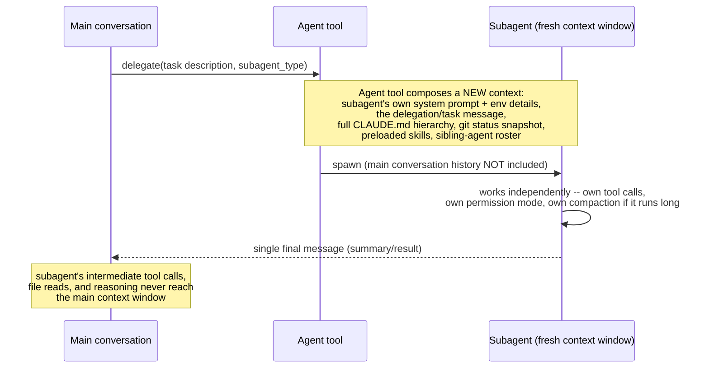
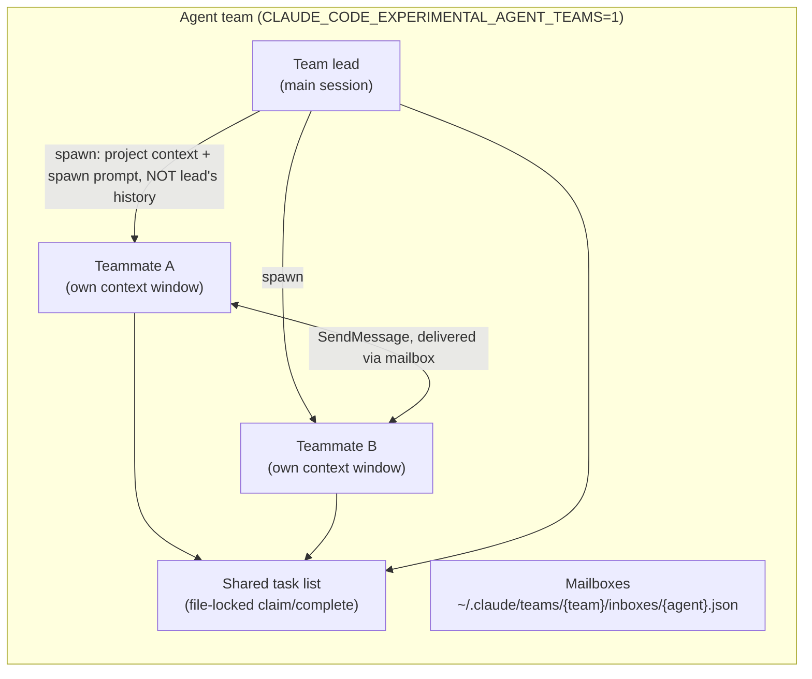
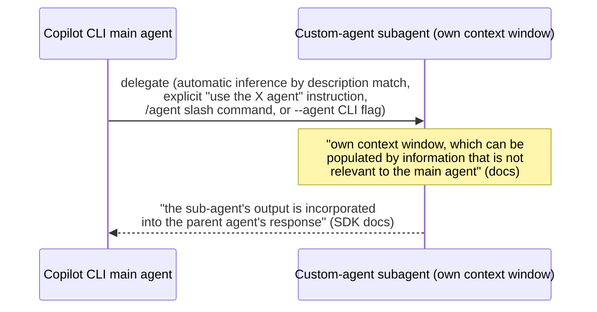
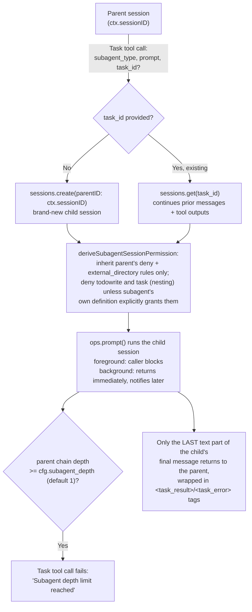
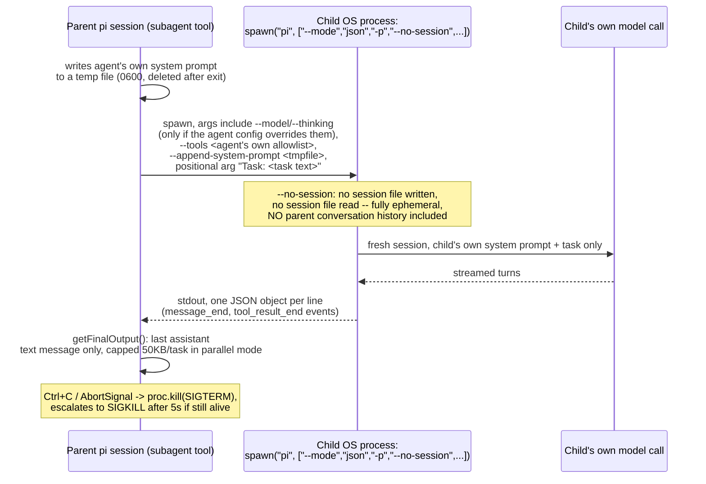
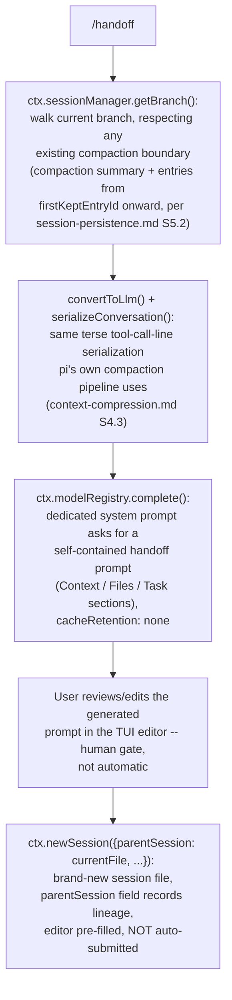

# Handoff mechanism -- agent-to-agent context transfer

**Scope note.** This page is the agent-to-agent companion to two pages
that already cover adjacent ground: [memory-management.md](memory-management.md)
sections 1.7/2.4 document what survives *compaction* (the context-window
boundary within a single agent's own session), and
[agent-loop-implementations.md](agent-loop-implementations.md) already
covers Claude Code's Agent SDK turn loop and OpenCode's step-limit
prompt injection. This page asks a different question: when one agent
hands work to *another* agent instance -- a subagent, a teammate, a
custom agent, a cloud agent -- what exactly crosses that boundary? Does
the new agent see the parent's conversation or start cold? What does it
hand back: a full transcript, a summary, a file, a pull request link?
Is the boundary a new context window inside the same process, a new
session record, or a different machine entirely? Every harness answers
these differently, and the differences are load-bearing for anyone
designing a multi-agent workflow that has to survive contact with any
one of these three products.

---

## 1. Claude Code

Sources for this section: `code.claude.com/docs/en/sub-agents` and
`code.claude.com/docs/en/agent-teams`, both fetched 2026-07-30. VERIFIED
unless tagged otherwise.

### 1.1 Subagents (the `Agent` tool, née `Task`)



Claude Code's own docs state the mechanism plainly: "Each subagent runs
in its own context window with a custom system prompt, specific tool
access, and independent permissions... it delegates to that subagent,
which works independently and returns results." The motivating use case
named directly in the docs is a side task that "would flood your main
conversation with search results, logs, or file contents you won't
reference again" -- the subagent absorbs that volume in its own window
and "returns only the summary."

**What a non-fork subagent's initial context actually contains,**
enumerated by the docs under "What loads at startup": its own system
prompt plus environment details Claude Code appends (not the full
Claude Code system prompt); the delegation/task message Claude writes
when handing off the work; every level of the CLAUDE.md hierarchy the
main conversation loads (user, project, local, managed -- see
[memory-management.md](memory-management.md) section 1.2); a git-status
snapshot taken at the start of the *parent* session; the full content of
any skill named in the subagent's `skills` frontmatter field; and, as of
v2.1.206, a "sibling roster" system reminder listing `main` and every
other named agent in the session as valid `SendMessage` targets (present
only when the subagent's tools include `SendMessage`). The built-in
**Explore** and **Plan** subagents are the sole exception: they skip
CLAUDE.md and git status entirely, to keep research fast and cheap.

**What explicitly does *not* reach a non-fork subagent:** the main
conversation's message history (this is the headline fact -- "It
doesn't see your conversation history, the skills you've already
invoked, or the files Claude has already read"); the main session's
output style; the main session's auto memory (a subagent gets its own
persistent-memory directory only if its `memory` frontmatter field is
set -- see memory-management.md 1.5); and the main session's context
window *size*, since a subagent's window is sized by whatever model it
runs on, which can differ from the parent's model via the `model`
frontmatter field or a per-invocation override.

**What the subagent hands back:** by design, one thing -- a final
result. The docs' framing throughout is "returns only the summary" /
"returns results," and the practical corollary the docs warn about
directly: "Running many subagents that each return detailed results can
consume significant context" in the main conversation, so a subagent
that fails to compress its own findings defeats the entire mechanism.

### 1.2 Resuming a subagent -- a stateful handoff, not a one-shot

A subagent invocation is not necessarily disposable. When a subagent
(other than the one-shot built-ins Explore/Plan) completes, Claude
receives its **agent ID**, and Claude can address that same agent again
via the `SendMessage` tool using the ID or the agent's name as the `to`
field. A resumed subagent "retain[s] their full conversation history,
including all previous tool calls, results, and reasoning" and "picks
up exactly where it stopped rather than starting fresh" -- a materially
different handoff shape from the first invocation, which started cold.
`SendMessage` checks (as of v2.1.199) that a name still refers to the
same agent it reached earlier in the conversation, refusing delivery to
a re-spawned agent that reused the name; Claude can still reach the
original by its ID. Subagent transcripts live independently at
`~/.claude/projects/{project}/{sessionId}/subagents/agent-{agentId}.jsonl`,
are unaffected when the *main* conversation compacts, persist across a
`claude --resume` of the same session, and are deleted after
`cleanupPeriodDays` (30 days by default) -- so a subagent handoff has its
own, separate compaction and retention lifecycle from the parent.

One boundary that survives every handoff path, stated explicitly in the
docs: a subagent treats messages from the agent that launched it as
"normal task direction, including mid-task course corrections," but "no
message from any agent counts as your approval for a pending permission
prompt, and no agent message can change a subagent's permission
settings, `CLAUDE.md`, or configuration" -- only the permission system or
the human's own messages grant that.

### 1.3 Forks -- the opposite handoff shape

A **fork**, invoked with `/subtask` (or `/fork` on older versions, see
the docs' own version note), is the deliberate inverse of a named
subagent: it "inherits the entire conversation so far instead of
starting fresh," sharing the same system prompt, tools, model, and
message history as the main session -- "you can hand it a side task
without re-explaining the situation." Only the fork's *tool calls* stay
out of the main context; its final result still comes back the same
way a subagent's does. Because a fork's system prompt and tool
definitions are identical to the parent's, its first request reuses the
parent's prompt cache, making it cheaper to spawn than a fresh named
subagent for a task that needs the same background. A fork cannot spawn
further forks, and (per the depth-limit note in section 1.4) it is the
one subagent type that keeps the `Agent` tool listed even at the depth
limit -- though invoking it there just returns an error rather than
spawning.

### 1.4 Concurrency, depth, and session-wide limits

Three independently-configured limits bound subagent handoff:

| Limit | Default | Env var | What it governs |
|---|---|---|---|
| Nesting depth | 3 layers below main | `CLAUDE_CODE_MAX_SUBAGENT_SPAWN_DEPTH` | How many subagent-of-a-subagent layers are allowed; at the limit, every subagent except a fork loses the `Agent` tool entirely |
| Session spawn total | 200 per session | `CLAUDE_CODE_MAX_SUBAGENTS_PER_SESSION` | Total subagents Claude may spawn with the `Agent` tool over a whole session (no upper bound if raised, but cannot be disabled); `/clear` resets the counter |
| Concurrent running | 20 | `CLAUDE_CODE_MAX_CONCURRENT_SUBAGENTS` | How many subagents may be running at once; spawning past this fails with `Concurrent subagent limit reached` until the count drops |

Subagents run in the **background** by default as of v2.1.198 (Claude
runs one in the foreground only when it needs the result immediately);
background subagents get a smaller built-in tool set than foreground
ones (forks are exempt from this filter) and surface their own
permission prompts in the main session, naming which subagent is
asking.

### 1.5 Agent teams -- peer-to-peer handoff, not parent-to-child



Agent teams (`CLAUDE_CODE_EXPERIMENTAL_AGENT_TEAMS=1`, disabled by
default, experimental) are architecturally distinct from subagents in
exactly the dimension this page cares about: "Unlike subagents, which
run within a single session and can only report back to the main
agent, you can also interact with individual teammates directly without
going through the lead," and "teammates message each other directly." A
teammate's handoff-in is the same shape as a subagent's -- "it loads the
same project context as a regular session: CLAUDE.md, MCP servers, and
skills. It also receives the spawn prompt from the lead. The lead's
conversation history does not carry over" -- but the handoff-out is
peer-to-peer rather than child-to-parent: messages are delivered
automatically via a per-agent mailbox JSON file, idle notifications fire
automatically when a teammate stops, and a shared, file-locked task list
lets teammates self-claim work rather than waiting for the lead to
assign it.

A second, structured handoff protocol exists for **plan approval**:
when a teammate spawned with a plan-approval requirement finishes
planning, "it sends a plan approval request to the lead. The lead
reviews the plan and either approves it or rejects it with feedback,"
and a rejected teammate "stays in plan mode, revises based on the
feedback, and resubmits" -- a request/response handoff distinct from
ordinary task messages, and the one case where "the lead session grants
teammate plan approvals without a separate prompt to you." Shutdown is
a third structured handoff: "The lead sends a shutdown request. The
teammate can approve, exiting gracefully, or reject with an
explanation."

The same permission-relay restriction from subagents applies here,
stated even more explicitly for the peer case: "When one agent sends
another a message over `SendMessage`, the receiving agent is told it
came from another Claude session, not from you. A teammate cannot
approve a permission prompt or supply consent on your behalf, and a
teammate that was denied an action cannot relay it to another teammate
to bypass the check." Documented limitations that matter for anyone
relying on this mechanism: no nested teams (a teammate cannot spawn its
own teammates -- "Only the lead can manage the team"); no session
resumption for in-process teammates (`/resume`/`/rewind` do not restore
them, so a resumed lead may address teammates that no longer exist);
and teammates spawned from a subagent *definition* file inherit that
definition's `tools` allowlist and `model` with the body appended as
additional system-prompt instructions, but explicitly do **not** apply
that definition's `skills` or `mcpServers` fields -- a teammate loads
skills/MCP from project and user settings like an ordinary session, not
from the subagent file's own frontmatter.

---

## 2. GitHub Copilot CLI

Sources for this section: `docs.github.com/en/copilot/how-tos/copilot-cli/customize-copilot/create-custom-agents-for-cli`,
`docs.github.com/en/copilot/how-tos/copilot-cli/use-copilot-cli/delegate-tasks-to-cca`,
`docs.github.com/en/copilot/reference/custom-agents-configuration`, and
`docs.github.com/en/copilot/how-tos/copilot-sdk/features/custom-agents`,
all fetched 2026-07-30. VERIFIED unless tagged otherwise. Two adjacent,
explicitly out-of-scope surfaces are checked for AUTHORITY OVERREACH
below: VS Code Copilot Chat's `handoffs` frontmatter field, and the
Copilot SDK's "Fleet mode."

### 2.1 Local custom-agent delegation (subagents)



Custom agents are Markdown files with a `.agent.md` extension,
discovered in three locations with a documented precedence: project
scope `.github/agents/`, an organization-wide `{org}/.github` repository,
and user scope `~/.copilot/agents/` -- "if you have custom agents with
the same name in both locations, the one in your home directory will be
used, rather than the one in the repository." The frontmatter fields
documented on the CLI-specific creation page are minimal by the CLI's
own account: `name` (drives the generated filename), `description`
(what expertise the agent has and when to use it), free-text
instructions in the markdown body, and an optional `tools` restriction
-- "by default, custom agents have access to all tools," and a `tools`
key is only written into the file if you restrict access. The broader
`custom-agents-configuration` reference page, which the docs state
applies to "GitHub.com, the Copilot CLI, and supported IDEs (unless
otherwise noted)," documents a larger field set including `target`,
`model`, `disable-model-invocation`, `user-invocable`, `mcp-servers`,
and `metadata` -- but two of those are explicitly flagged as **not**
applying to IDE custom agents (`mcp-servers`, `metadata`), and the page
does not state which of the remaining fields the CLI itself actually
honors versus merely tolerates; treat the CLI's own creation-flow
documentation (the minimal set above) as the floor of what is confirmed
CLI behavior.

Invocation is documented four ways: **automatic** ("Copilot ... may
choose to use one of your custom agents, if Copilot determines that the
agent's expertise is a good fit for the task"), **explicit natural-
language instruction** ("Use the security-auditor agent on all files in
..."), the **`/agent` slash command** (lists available custom agents
interactively), and **programmatic** invocation via `copilot --agent
<name> --prompt "..."`.

**What crosses the boundary, and the honest documentation gap.** The
CLI's own page states the subagent "has its own context window, which
can be populated by information that is not relevant to the main
agent," and frames the value proposition identically to Claude Code's --
"especially for larger tasks, parts of the work can be offloaded to
custom agents, without cluttering the main agent's context window." The
Copilot SDK's separate custom-agents page (a different, more general
product surface than the CLI specifically) adds that "lifecycle events
(`subagent.started`, `subagent.completed`, etc.) stream back to the
parent session" and that "the sub-agent's output is incorporated into
the parent agent's response." **Not found on either page, after direct
fetch:** an explicit statement of whether a subagent inherits the
parent conversation's message history or starts genuinely fresh, and
whether the subagent's own transcript persists after it returns.
BEST CURRENT UNDERSTANDING, UNCONFIRMED: given the shared "own context
window" framing across both the CLI and SDK pages and the explicit
"not... cluttering the main agent's context window" motivation, a fresh
or near-fresh start (analogous to Claude Code's non-fork subagent) is
the more consistent reading -- but this is inference from framing, not
a documented guarantee, and should not be relied on for anything that
needs the opposite (a fork-like full-history handoff) to work.

### 2.2 `/delegate` -- handoff to a different machine entirely

```mermaid
sequenceDiagram
    participant User as Local Copilot CLI session
    participant Local as Your working directory
    participant Cloud as Copilot coding agent (GitHub cloud)

    User->>Local: /delegate <task description>
    Local->>Local: prompts to commit unstaged changes as a checkpoint<br/>on a new branch
    Local->>Cloud: hand off branch + task description
    Cloud-->>User: link to the pull request and agent session on GitHub
    Note over Cloud: works independently -- opens a draft PR,<br/>makes changes in the background,<br/>requests review
    Note over User: local session keeps running;<br/>work persists even if the local machine shuts down
```

`/delegate` (or a `&`-prefixed prompt) is a categorically different
handoff from the local custom-agent case above: it moves the task off
your machine onto GitHub's infrastructure, running Copilot **coding
agent** (the cloud agent, a separate product surface from the CLI
itself). The documented sequence: Copilot asks you to commit any
unstaged changes as a checkpoint on a newly created branch, which
becomes the cloud agent's starting point; the cloud agent then "opens a
draft pull request, make[s] changes in the background, and request[s] a
review from you"; what returns to your local session is "a link to the
pull request and agent session on GitHub," not a live transcript or
progress stream. Critically, your local CLI session is not blocked --
"you can shut down your machine, and the remote work persists on
GitHub" -- which is the opposite lifecycle from the local custom-agent
handoff in 2.1, where the subagent's lifetime is bound to the parent
CLI process.

### 2.3 A genuinely different product's handoff feature -- named `handoffs`, and out of scope here

Researching this topic surfaces a Copilot feature literally named
"handoffs" that is worth naming precisely so it is not confused with
anything above: VS Code's Copilot Chat custom agents (`code.visualstudio.com/docs/agent-customization/custom-agents`,
fetched 2026-07-30 -- a **different product surface from Copilot CLI**,
per this skill's AUTHORITY OVERREACH discipline) support a `handoffs`
frontmatter array with `label`, `agent`, `prompt`, `send`, and `model`
fields. "After a chat response completes, handoff buttons appear that
let users move to the next agent with relevant context and a pre-filled
prompt" -- this is a **user-triggered, UI-button-mediated** handoff for
"guided sequential workflows," not a model-initiated delegation; the
`send` field only controls whether the pre-filled prompt auto-submits
once the human clicks the button.

This feature does **not** reach Copilot CLI. `github.com/github/copilot-cli`
issue #1377 ("Syntax Parity: Support VS Code Custom Agent definitions
(e.g., handoffs) in Copilot CLI," open at time of fetch, checked via
`gh api` 2026-07-30) reports directly: "The Copilot CLI currently fails
to parse valid VS Code custom agent definitions (e.g., the handoffs
field), resulting in 'malformed frontmatter' errors" and "'unknown field
ignored: handoffs.'" Separately, the `custom-agents-configuration`
reference page states the same field "from VS Code and other IDE custom
agents [is] currently not supported for Copilot cloud agent on
GitHub.com" either. So `handoffs` is real, but scoped to one Copilot
surface (VS Code/IDE Copilot Chat) that this project does not track as
a harness, and is confirmed absent from the two surfaces this project
does track (CLI: parse error/ignored field; cloud agent: explicitly
unsupported).

One further named mechanism surfaced here and resolved in a later
session: the Copilot SDK's custom-agents page mentions "Fleet mode" for
"dispatching multiple sub-agents in parallel." This page originally
flagged whether Fleet mode was CLI-facing at all as unconfirmed. It is:
`docs.github.com/en/copilot/concepts/agents/copilot-cli/fleet`, fetched
2026-07-31, documents a CLI-native `/fleet` slash command built on the
same pattern, with an explicitly named "orchestrator agent" role. See
[orchestration.md](orchestration.md) section 2.2 for the full mechanism
(prompt decomposition, conditional parallelism, the documented
LLM-call-count cost trade-off, and the separate SDK-level Fleet-mode
runtime detail (SQL-backed todo state machine) presented there as
background on the underlying pattern, not confirmed CLI-internal
behavior).

---

## 3. OpenCode

Sources for this section: `github.com/anomalyco/opencode`, `dev`
branch, fetched via `gh api` 2026-07-30 (`packages/opencode/src/tool/task.ts`,
`packages/opencode/src/tool/task.txt`, `packages/opencode/src/agent/subagent-permissions.ts`),
and `opencode.ai/docs/keybinds/`, fetched 2026-07-30. Per this skill's
standing caveat, `dev` is not a stable release tag and may not match the
current stable release -- flagged inline where it matters. This is the
one harness of the three where the handoff mechanism is directly
readable in real, currently-live source rather than only documented
behavior, and that source is considerably more precise than either
harness's own docs pages about what actually crosses the boundary.



### 3.1 A subagent is a real, persisted child session, not just a context copy

The `TaskTool` implementation (`packages/opencode/src/tool/task.ts`, `dev`
branch) makes the handoff mechanism unusually concrete: dispatching to a
subagent literally calls `sessions.create({ parentID: ctx.sessionID,
title: ..., agent: next.name, permission: [...] })` -- the subagent gets
its own row in the same session store the primary agent's own session
lives in, linked to its parent by `parentID`, not an ephemeral in-memory
context copy. This is directly corroborated by the TUI: `opencode.ai/docs/keybinds/`
documents dedicated navigation keybinds for exactly this parent/child
session tree -- `session_child_first` (`<leader>down`), `session_child_cycle`
(`right`), `session_child_cycle_reverse` (`left`), and `session_parent`
(`up`) -- with a documented note that these "intentionally do not use
the leader key by default," unlike most other bound actions, implying
they are meant to be used often enough to warrant bare arrow keys.

**Fresh by default, resumable on request.** The `Parameters` schema
accepts an optional `task_id`: "This should only be set if you mean to
resume a previous task (you can pass a prior task_id and the task will
continue the same subagent session as before instead of creating a
fresh one)." The tool's own bundled description text
(`packages/opencode/src/tool/task.txt`) states the default case
explicitly: "Each agent invocation starts with a fresh context unless
you provide task_id to resume the same subagent session (which continues
with its previous messages and tool outputs)." When resuming,
`sessions.get(SessionID.make(params.task_id))` looks up the existing
child session row rather than creating a new one -- structurally
identical in spirit to Claude Code's `SendMessage`-to-agent-ID resume
path (section 1.2 above), though the two are independent implementations
on different products.

### 3.2 Permission handoff is a strict subset, not an inheritance

`deriveSubagentSessionPermission` (`packages/opencode/src/agent/subagent-permissions.ts`)
is the exact function computing what permission ruleset a spawned child
session gets, and its own doc comment states the policy precisely:
"Combines: 1. The parent session's deny rules and external_directory
rules. Parent agent restrictions only govern that agent; the subagent's
own permissions determine its capabilities. 2. Default `todowrite` and
`task` denies if the subagent's own ruleset doesn't already permit
them." Concretely: a child session does **not** inherit the parent's
*allow* rules at all -- only the parent's *deny* rules and its
`external_directory` rules carry over; everything else about what the
subagent can do comes from the subagent's own agent definition. And
unless a subagent's own definition explicitly lists permission for
`todowrite` or `task`, both are denied by default -- the second of
these is the mechanism enforcing the nesting-depth story below (an
un-configured subagent cannot spawn its own subagents at all, regardless
of the numeric depth limit).

**Nesting depth**, read directly from `task.ts`: the tool walks the
`parentID` chain from the current session upward, counting depth, and
rejects the call with `Subagent depth limit reached (N)` once depth
reaches `cfg.subagent_depth ?? 1` -- i.e. the *default* configuration
permits only one layer of subagent (no subagent-of-a-subagent) unless a
project's config explicitly raises `subagent_depth`. This is a real,
numeric, source-level default; whether the currently-shipped stable
release uses the same default is unconfirmed (the `dev`-branch caveat).

### 3.3 Foreground vs. background handoff, and what actually returns

Foreground is the documented default in the tool's own bundled
description text: "Foreground is the default; use it when you need the
result before continuing." In foreground mode the calling turn blocks
(`Effect.raceFirst` against the child session's completion or its
promotion to background) until the child session finishes, fails, or is
cancelled. Background mode is explicitly gated behind an experimental
flag -- `runInBackground && !flags.experimentalBackgroundSubagents`
fails immediately with an error naming
`OPENCODE_EXPERIMENTAL_BACKGROUND_SUBAGENTS=true` as the required
setting -- and when active, a background subagent's completion is
delivered back to the parent as a **synthetic injected text message**
(`ops.prompt(...)` with `parts: [{ type: "text", synthetic: true, text:
renderOutput(...) }]`) carrying `<task id="..." state="completed">` or
`state="error"` tags -- i.e. the parent doesn't poll; the harness itself
writes a new message into the parent's own session once the child
finishes, exactly the same "automatic notification" shape Claude Code
documents for its own background subagents (section 1.4) and agent
teams (section 1.5), independently arrived at.

**What crosses back either way is deliberately narrow.** The
implementation extracts only `result.parts.findLast((item) => item.type
=== "text")?.text` -- the last text part of the child session's final
message, nothing else -- and the tool's own description text is explicit
about the consequence for the calling model: "the result returned by
the agent is not visible to the user. To show the user the result, you
should send a text message back to the user with a concise summary of
the result." The output includes the child's `task_id` specifically so
the calling agent can resume that exact subagent session later (section
3.1) rather than starting over.

**Concurrency** is a documented usage pattern in the tool's own bundled
description text rather than a hard API limit: "Launch multiple agents
concurrently whenever possible, to maximize performance; to do that, use
a single message with multiple tool uses" -- i.e. OpenCode's model is
expected to fan out several `Task` tool calls in one turn, each creating
its own independent child session, rather than being throttled by a
harness-enforced concurrent-subagent cap the way Claude Code documents
one (section 1.4). BEST CURRENT UNDERSTANDING, UNCONFIRMED: whether
OpenCode enforces any numeric concurrent-subagent ceiling elsewhere in
`packages/core/src/session/` -- not seen in the files read this session,
and the docs page (`opencode.ai/docs/agents/`) does not state one either
per the direct fetch performed while researching [agent-loop-implementations.md](agent-loop-implementations.md).

---

## 4. pi

Sources for this section: VERIFIED, fetched 1 September 2026 directly from
`github.com/earendil-works/pi`, `main` branch, via `gh api`: the two packages'
own `package.json` files (`packages/coding-agent/package.json`,
`packages/ai/package.json`), `packages/coding-agent/docs/docs.json` (the full
navigation table of contents) and `packages/coding-agent/docs/sdk.md` in full,
and, most load-bearingly, two of pi's own first-party **example extensions**
shipped in the same repository: `packages/coding-agent/examples/extensions/subagent/`
(`README.md`, `index.ts`, in full) and
`packages/coding-agent/examples/extensions/handoff.ts` (in full).

### 4.0 A naming correction this book can now make with confidence: two real, distinct packages, not an inconsistency to resolve

This book's own prior pi sections cite two different package names --
`@earendil-works/pi-coding-agent` (session-persistence.md, configuration.md,
permissions-and-sandboxing.md, hooks-lifecycle-extensibility.md, built-in-skills.md,
auth-and-usage-accounting.md, model-routing-and-selection.md) and
`@earendil-works/pi-ai` (llm-api-contract.md §3.5) -- and the task that produced
this section asked whether that split is itself an error. It is not: fetching
each package's own `package.json` directly this session confirms both names are
real, independently published npm packages living side by side in the same
`pi` monorepo (`github.com/earendil-works/pi`, whose own root `package.json`
names itself `"pi-monorepo"` with `packages/*` as a workspace glob).
`packages/coding-agent/package.json` names itself `@earendil-works/pi-coding-agent`,
version `0.84.4`, `"description": "Coding agent CLI with read, bash, edit, write
tools and session management"`, with a `bin: { pi: "dist/bundle/cli.js" }` entry --
this is **the harness itself**, the actual `pi` binary this book documents
elsewhere as the subject of its own sections. `packages/ai/package.json` names
itself `@earendil-works/pi-ai`, same version, `"description": "Unified LLM API
with automatic model discovery and provider configuration"` -- a lower-level,
separately-published library `pi-coding-agent` depends on for exactly the
wire-protocol-normalization work [llm-api-contract.md](llm-api-contract.md) §3.5
documents, and which (per that page's own finding) DeepSeek Harness also
consumes independently as one of its own swappable `ctx.llm` providers
(`llm-pi-ai`). So: this page's own subject -- the harness whose handoff
mechanism (or lack of one) is described below -- is properly named `pi`
(`@earendil-works/pi-coding-agent`); `pi-ai` is a real but structurally
separate package this harness happens to be built on, not a second spelling of
the same thing.

### 4.1 The headline finding: no native, built-in subagent or multi-agent handoff mechanism ships in the product at all

Unlike every other harness this page documents, pi's own shipped product has
**no first-class subagent-dispatch tool, no `/delegate`-style cloud handoff, and
no documented multi-agent or agent-team primitive**. This is a checked absence,
not an unread gap: `docs.json`'s full navigation tree -- every page pi's own
documentation site links, fetched and read in full this session -- lists
Quickstart, Using Pi, Providers, Security, Containerization, Settings,
Keybindings, Sessions, Compaction, Extensions, Skills, Prompt Templates,
Themes, Pi Packages, Custom Models, Custom Providers, Session Format, SDK, RPC
Mode, JSON Event Stream Mode, TUI Components, four platform-setup pages, and
Development -- no page named `subagent`, `agent`, `delegate`, `task`, or
`team` appears anywhere in that list, and none of the pages that do appear
(`sessions.md`, `extensions.md`, `sdk.md`) documents a built-in tool or slash
command for spawning another agent instance. pi is, architecturally, a
**single-agent** harness by design -- "a minimal terminal coding harness ...
designed to stay small at the core," per its own docs index -- where Claude
Code, Copilot CLI, OpenCode, DeepSeek Harness, and Hermes Agent (per
[Fan-out (subagent dispatch)](fan-out.md) §1-§5) all ship a native dispatch
primitive as part of the product itself.

What pi *does* ship, and what this section covers instead, are two things:
first, ordinary session-to-session operations that are pi's real analogue to
"handoff" in the cross-session (not cross-agent) sense -- `/fork`, `/clone`,
and `/tree` branch navigation, already documented in full from the session-format
angle in [session-persistence.md](session-persistence.md) §5.3 and not
re-derived here; second, and the more substantial finding for this page
specifically, two of pi's own **first-party example extensions** -- shipped in
the same repository, written by the same team, but **not loaded by default** --
that between them demonstrate exactly the two shapes this book's other harness
sections document as built-in features: a subagent-dispatch tool, and a
deliberate, LLM-mediated context handoff between sessions. Both are read from
source this session, not merely described in prose documentation, which makes
them unusually precise data points about *how* such a mechanism would have to
be built on top of pi's own SDK, even though neither ships active out of the
box. The `subagent/` example's own README states the installation requirement
plainly: it must be manually symlinked into `~/.pi/agent/extensions/subagent/`
(plus its sample agent definitions into `~/.pi/agent/agents/`) before it does
anything at all -- a materially different starting posture from, say,
Claude Code's `Agent` tool or OpenCode's `task` tool, both always present.

### 4.2 The `subagent/` example: a genuinely separate OS process per delegated task, not an in-process child session



VERIFIED, read in full from `index.ts`: the tool's `execute()` builds a child
invocation as `spawn(<resolved pi binary>, ["--mode", "json", "-p",
"--no-session", ...])` for every delegated task -- one real, separate OS
process per task, not a shared in-memory context split several ways the way
OpenCode's `Task` tool or Claude Code's Agent tool are (both create child
*sessions* inside the same running process or, for Claude Code, an entirely
closed-source equivalent). `getPiInvocation()` resolves the exact binary to
re-invoke: the current script path via `process.argv[1]` when running from a
real file (falling back to a bare `pi` on `PATH` when running from a bundled
Bun virtual filesystem path), so the child runs the *same installed pi
version* as the parent, not a hardcoded or potentially stale second copy.

**What crosses at spawn time is deliberately narrow, and is a "spawn," not a
"fork," in this book's own DeepSeek Harness vocabulary
([Fan-out](fan-out.md) §4.2's `inheritsParentContext` descriptor).**
`--no-session` means the child process never reads the parent's own session
file and never writes one of its own -- there is no session-level context
inheritance at all. The only things that cross the process boundary at launch
are: the task text itself, wrapped as a positional argument (`Task: ${task}`);
the agent's own system prompt, sourced from that agent's markdown-with-YAML-
frontmatter definition file and written out to a private (mode `0600`) temp
file passed via `--append-system-prompt`, deleted again once the child exits;
the agent's own `tools:` allowlist, passed as `--tools`; and the model/thinking
level, which the code computes as `inheritsDispatchConfig = !agent.model` --
**only when the agent definition itself omits a `model:` field** does the
child inherit the *dispatching session's* current model and thinking level as
its own defaults (`ctx.model`/`ctx.thinkingLevel`, read directly off the tool's
own `execute(...,ctx)` context parameter); an agent with its own `model:` field
always overrides that inheritance. Nothing about the parent's own prior
conversation, its AGENTS.md-derived context, or its own tool-call history
crosses at all -- confirmed by the fact that no message array, transcript
path, or session identifier appears anywhere among the constructed CLI
arguments.

**What crosses back is narrowed the same way this book's other four harnesses
narrow it.** `getFinalOutput()` walks the child's own JSON-event-stream output
(parsed line-by-line as pi's own documented JSON event stream mode,
`--mode json`) backward for the last `assistant`-role message and returns only
its text content to the model that dispatched the task; the full message
array is retained only in the tool result's own `details` field (used for the
TUI's expanded view), not surfaced to the calling model. In parallel mode
specifically, each task's model-visible output is hard-capped at 50 KB
(`PER_TASK_OUTPUT_CAP`), with a truncation notice appended when a result
exceeds it and the full text preserved only in `details` -- the same
"summary, not the raw transcript, crosses back" discipline
[fan-out.md](fan-out.md) documents for every other harness's own dispatch
mechanism, independently re-derived here in a third-party example built
entirely on pi's own public SDK surface.

**Three dispatch modes, one shared execution primitive, and concrete,
code-enforced numeric ceilings -- unusually concrete for an *example*, where
this book's coverage of built-in mechanisms sometimes has to settle for a
documented default rather than a read line of code.** *Single* mode
(`{agent, task}`) runs one child process and returns its output directly.
*Parallel* mode (`{tasks: [...]}`) fans out across up to **8** tasks total,
capped at **4 concurrent** (`MAX_PARALLEL_TASKS`/`MAX_CONCURRENCY`, enforced by
`mapWithConcurrencyLimit`'s own worker-pool loop, not merely documented as a
convention the model is asked to respect) with live per-task streaming status
surfaced through the tool's own `onUpdate` callback. *Chain* mode
(`{chain: [...]}`) runs tasks strictly sequentially, substituting a literal
`{previous}` placeholder in each step's task text with the prior step's final
output text, and stops immediately at the first step whose `stopReason` is
`"error"`/`"aborted"` or whose exit code is non-zero, reporting exactly which
step failed. Abort propagation is real process control, not a cooperative
flag: the tool's own `AbortSignal` is wired to `proc.kill("SIGTERM")`, with a
5-second escalation to `proc.kill("SIGKILL")` if the child has not exited by
then -- confirmed directly in `index.ts`, matching the README's own "Ctrl+C
propagates to kill subagent processes" claim.

**No nesting-depth guard was found anywhere in the two files read this
session -- a genuine, checked absence, not an unread gap, and one this example
does not compensate for the way this book's other harnesses' own dispatch
mechanisms do.** Neither `index.ts` nor `agents.ts` threads any depth counter,
generation number, or environment variable through the spawned child's
argument list or environment -- there is nothing analogous to Claude Code's
`CLAUDE_CODE_MAX_SUBAGENT_SPAWN_DEPTH`, OpenCode's `cfg.subagent_depth` chain
walk, or DeepSeek's `inheritsParentContext`-adjacent authority split
([Fan-out](fan-out.md) §1.4/§3.2/§4.2). In practice, none of the four shipped
sample agents (`scout`, `planner`, `reviewer`, `worker`) lists the `subagent`
tool itself in its own `tools:` frontmatter, so the shipped configuration
never actually recurses -- but that is a property of *this specific agent
roster's own configuration*, not an enforced ceiling in the tool's code. BEST
CURRENT UNDERSTANDING, UNCONFIRMED: a user who authored a fifth agent
definition that did list `subagent` among its own `tools:` would, on the
evidence read this session, be able to construct unbounded recursive
delegation with no built-in circuit breaker at all -- this is inference from
a confirmed code-level absence, not a claim that pi's maintainers intend this
as safe or unsafe.

**A trust gate sits in front of one specific case: project-local agent
definitions.** `agentScope` defaults to `"user"` (only `~/.pi/agent/agents/*.md`
loads); enabling `"project"`/`"both"` to pull in repo-controlled
`.pi/agents/*.md` definitions triggers, in interactive mode, an explicit
confirmation prompt naming the requested agents and their source directory --
"Project agents are repo-controlled. Only continue for trusted repositories" --
*unless* the project is already marked trusted, in which case the prompt is
skipped. This reuses the same project-trust concept
[permissions-and-sandboxing.md](permissions-and-sandboxing.md)'s own pi section
documents for pi's core security model, applied here specifically to the
question of which *agent system prompts* a delegated task is allowed to run
under, not repeated in full on this page.

### 4.3 The `handoff.ts` example: a fundamentally different shape -- a new session, not a spawned agent



This is a categorically different mechanism from §4.2's `subagent/` example,
and worth naming precisely because it is the one example in pi's own
repository literally named "handoff." Its own doc comment states the design
intent directly: "Instead of compacting (which is lossy), handoff extracts
what matters for your next task and creates a new session with a generated
prompt." Mechanically, `/handoff <goal>` (1) reads the *current session's*
active branch via `ctx.sessionManager.getBranch()`, honoring whatever
compaction boundary already exists on that branch exactly the way
[session-persistence.md](session-persistence.md) §5.2's `buildContextEntries()`
does -- if the branch was already compacted, the gathered messages are the
prior compaction summary plus every entry from `firstKeptEntryId` onward, not
the full original history; (2) serializes that message list with the same
`convertToLlm`/`serializeConversation` helpers
[context-compression.md](context-compression.md) §4.3 documents pi's own
compaction pipeline using internally (imported directly from
`@earendil-works/pi-coding-agent`'s own exports, not reimplemented); (3) sends
that serialized conversation plus the user's stated `goal` to the model via a
direct `ctx.modelRegistry.complete()` call (not a queued session prompt),
under a dedicated system prompt instructing it to produce a self-contained
"Context" + "Files involved" + "Task" document rather than a running summary;
(4) hands the model's output to the user in the TUI's own editor for review
and revision -- an explicit human-in-the-loop gate this page's other
mechanisms (subagent dispatch, forks, plain compaction) do not have; and only
then (5) calls `ctx.newSession({ parentSession: currentSessionFile, withSession:
... })`, which creates an entirely new session file recording the originating
file's path in its own `parentSession` header field -- the same one piece of
cross-file lineage `/fork` records, per
[session-persistence.md](session-persistence.md) §5.3 -- with the generated
prompt pre-filled in the new session's editor rather than auto-submitted.

Set next to `/fork` (verbatim history up to a chosen point, no model call
involved) and ordinary compaction (automatic, not goal-directed, replaces
history in place rather than starting a new file), `/handoff` is a third,
genuinely distinct position on the same "what carries a conversation across a
boundary" question this page's other sections ask of every harness: **it is
the only mechanism in this book's coverage, across any of the harnesses
researched, where an LLM call itself decides what crosses a session boundary,
under explicit human review, specifically to avoid the lossiness of automatic
compaction while still not carrying the full verbatim transcript forward.**
Like §4.2, this ships only as an example a user must install themselves
(`pi.registerCommand("handoff", ...)`, loaded the same way any other extension
is, via `~/.pi/agent/extensions/`), not as an active default.

### 4.4 What this leaves out relative to this book's other harness sections, stated plainly

Because both mechanisms above are examples, not core product behavior, this
section cannot state a numeric session-total or concurrent-session ceiling
analogous to Claude Code's `CLAUDE_CODE_MAX_SUBAGENTS_PER_SESSION`, nor a
peer-to-peer agent-team shape analogous to Claude Code's own agent teams
(§1.5) or Hermes' Bot Mode ([Fan-out](fan-out.md) §5.2) -- pi's own docs and
source, read in full for the pages/files listed in this section's Sources, do
not describe either. What this section *can* state with confidence, because
it was read from source rather than inferred: pi's shipped product ships no
built-in equivalent at all, and the two most complete third-party-facing
demonstrations of what such a mechanism would look like on top of pi's own
SDK -- one process-isolated and code-enforced-numeric, one session-isolated
and human-gated -- arrive at two structurally different answers to "what
crosses," neither of which resembles a straightforward copy of any other
harness's own design in this book.

---

## 5. Synthesis

| Dimension | Claude Code (subagent) | Claude Code (agent team) | Copilot CLI (custom agent) | Copilot CLI (`/delegate`) | OpenCode (Task tool) | pi (`subagent` example extension) |
|---|---|---|---|---|---|---|
| Default context on handoff-in | Fresh: own system prompt + CLAUDE.md + git snapshot + preloaded skills; NOT main history | Fresh: project context (CLAUDE.md/MCP/skills) + spawn prompt; NOT lead's history | "Own context window"; history-inheritance undocumented (BEST CURRENT UNDERSTANDING: likely fresh, by inference from framing) | N/A -- moves to a different machine/product entirely | Fresh child session by default (verified in source) | Fresh, source-verified: a genuinely separate OS process (`--no-session`), no parent history, only the task text + agent's own system-prompt file + tools/model |
| Resumable / stateful continuation | Yes -- `SendMessage` to agent ID/name, full prior tool calls + reasoning retained | Yes -- mailbox messaging, teammate stays addressable while running | Undocumented | N/A -- cloud PR/session persists on GitHub, not a "resume" in the local sense | Yes -- `task_id` parameter re-enters the exact same child session | No -- `--no-session` writes no session file at all; every dispatch is one-shot |
| What returns to the caller | One final summary message; intermediate work never reaches main context | Messages via mailbox + idle notification; shared task-list state | "Sub-agent output... incorporated into the parent agent's response" (SDK page) | A PR link + agent-session link, not a transcript | Only the last text part of the child's final message, explicitly not user-visible until re-summarized | Only the child's last assistant text message (`getFinalOutput()`), capped 50 KB/task in parallel mode; full messages retained only in tool-result `details` |
| Peer-to-peer vs. parent-child | Parent-child only ("can only report back to the main agent") | Peer-to-peer, direct teammate-to-teammate messaging | Parent-child (subagent reports to the invoking agent) | Parent (local) to a wholly separate cloud product | Parent-child, navigable as a session tree in the TUI | Parent-child, strictly one-shot; a child cannot address its parent except via its own stdout |
| Nesting/depth limit | 3 layers by default, `CLAUDE_CODE_MAX_SUBAGENT_SPAWN_DEPTH` | None -- explicitly "no nested teams," only the lead manages the team | Undocumented | N/A | 1 layer by default, `subagent_depth` config key (source-verified) | None found in source at all -- no depth counter threaded through spawn args or env; recursion is possible in principle if a user's own agent config lists `subagent` in its own `tools:` (none of the four shipped sample agents do) |
| Concurrency limit | 20 concurrent, `CLAUDE_CODE_MAX_CONCURRENT_SUBAGENTS` | No documented numeric cap; token cost scales with active teammates | Undocumented | N/A (cloud-side, out of local control) | No enforced cap found; model is *encouraged* to fan out multiple Task calls per turn | 8 total / 4 concurrent, code-enforced (`MAX_PARALLEL_TASKS`/`MAX_CONCURRENCY`), not merely a prompted convention |
| Permission handoff | Inherits parent's mode except `bypassPermissions`/`acceptEdits` take precedence; approval never relayable between agents | Starts at lead's mode; a denied action can't be relayed peer-to-peer either | Undocumented | N/A | Inherits only parent's *deny* + `external_directory` rules; `todowrite`/`task` denied by default unless the subagent's own definition grants them (source-verified) | Each child's `--tools` comes solely from that agent's own frontmatter, never from the parent's own grants; project-local agent definitions require an explicit `agentScope` opt-in plus a trust-confirmation prompt |
| Foreground/background | Background by default since v2.1.198; permission prompts surface in main session naming the subagent | In-process teammates' own subagents forced foreground (documented limitation) | Undocumented | Always "background" relative to the local session -- local session is never blocked | Foreground is the documented default; background is experimental and flag-gated (`OPENCODE_EXPERIMENTAL_BACKGROUND_SUBAGENTS`) | Foreground from the dispatching tool call's own perspective (it awaits the child process), with live streaming of partial output via `onUpdate`; `AbortSignal` propagates `SIGTERM`, escalating to `SIGKILL` after 5s |
| Verifiability | Docs-only (closed-source product); no implementation to cross-check | Docs-only, and explicitly marked experimental/subject to change | Docs-only across CLI + SDK pages, with a confirmed documentation gap on history inheritance | Docs-only | Docs **and** live `dev`-branch source, cross-checked against each other this session | Source-verified, but the source is a first-party *example extension*, not core product code -- no native mechanism exists to verify at all |

**The design lesson.** All three products converge on the same
motivating idea -- keep bulk exploratory or side-task output out of the
orchestrating agent's own context window -- but diverge sharply on two
axes that matter for anything built to survive contact with more than
one harness. First, **isolation direction**: Claude Code offers both a
context-isolated subagent (default) and a context-inheriting fork
(opt-in), plus a third, peer-to-peer agent-team shape that breaks the
parent-child assumption entirely; OpenCode's Task tool is context-
isolated by default with an explicit, source-verified resume path back
into the same session; Copilot CLI's local custom-agent isolation
direction is the one genuinely undocumented data point across all three
products researched this session. Second, **what "return" means**:
Claude Code and OpenCode both narrow the return payload to a single
final message/summary and make that narrowing an explicit design
constraint the calling model is told about in its own tool description
("results returned... is not visible to the user" -- OpenCode; "Running
many subagents that each return detailed results can consume
significant context" -- Claude Code); Copilot CLI's `/delegate` breaks
this pattern entirely by handing off to a different product surface
altogether, returning a pull-request link rather than any conversational
result at all. A workflow that assumes "handoff always means summary
comes back into this conversation" will work on Claude Code subagents
and OpenCode's Task tool, but will not describe what `/delegate` does on
Copilot CLI, nor Claude Code's own agent teams once teammates start
talking to each other directly.

**pi complicates this table in a different direction from the other four
harnesses: it is the one product in this book's coverage with no native
handoff mechanism to compare in the first place.** Every row of the table
above that mentions pi describes a first-party *example extension* --
genuinely written and shipped by pi's own maintainers, read from real source
this session rather than inferred, but explicitly opt-in and inactive by
default (§4.1's own docs.json scan found no subagent/delegate/team page at
all in pi's published documentation tree). Where Claude Code, Copilot CLI,
and OpenCode each answer "what crosses the boundary" as a property of the
product itself, pi's own answer is "nothing, unless you install one of two
optional example extensions that answer the question two structurally
different ways" -- §4.2's `subagent/` example lands closest to OpenCode's
Task tool (process-isolated, one-shot, code-enforced numeric concurrency
ceiling, no depth guard at all), while §4.3's `/handoff` example is not a
subagent-dispatch mechanism in this table's sense at all -- no spawn, no
return, no concurrency, no depth -- but a third, genuinely new answer to this
page's opening question, standing alongside Claude Code's fork/subagent split
and Copilot CLI's local/cloud split as a third harness-family's own take on
"what should carry a conversation across a boundary": an LLM-generated,
human-reviewed extraction into a brand-new session, explicitly designed as a
less-lossy alternative to automatic compaction rather than as agent-to-agent
delegation. A workflow built to survive contact with pi specifically cannot
assume *any* subagent-style handoff exists unless the target installation has
deliberately added one of these two examples -- the one genuinely new
finding this page's research into pi contributes to the cross-harness
picture.

---

## Sources

All fetched 2026-07-30 except §4 (pi), fetched 1 September 2026 -- see its
own dedicated bullet block below.

**Claude Code (authoritative for Claude Code's documented behavior only):**
- `https://code.claude.com/docs/en/sub-agents` -- subagent definition
  format, scopes and precedence, frontmatter fields, what loads at
  subagent startup, resume via `SendMessage` and agent ID, forks
  (`/subtask`), nesting-depth/session/concurrency limits, output
  scanning, background vs. foreground execution.
- `https://code.claude.com/docs/en/agent-teams` -- team lead/teammate
  architecture, mailbox messaging, shared task list, plan-approval and
  shutdown handoff protocols, permission-relay restrictions, documented
  limitations (no nested teams, no session resumption for in-process
  teammates).

**GitHub Copilot CLI (authoritative for Copilot CLI's documented behavior only):**
- `https://docs.github.com/en/copilot/how-tos/copilot-cli/customize-copilot/create-custom-agents-for-cli` -- `.agent.md` discovery locations, minimal documented frontmatter, the four invocation paths (automatic, explicit, `/agent`, `--agent`).
- `https://docs.github.com/en/copilot/how-tos/copilot-cli/use-copilot-cli/delegate-tasks-to-cca` -- `/delegate` mechanics: checkpoint commit, cloud agent branch/PR workflow, non-blocking local session.
- `https://docs.github.com/en/copilot/reference/custom-agents-configuration` -- the fuller frontmatter field set (`target`, `model`, `disable-model-invocation`, `user-invocable`, `mcp-servers`, `metadata`) and its explicit cross-surface scope note (GitHub.com, Copilot CLI, supported IDEs, "unless otherwise noted"); the `handoffs`/`argument-hint` non-support note for Copilot cloud agent.
- `https://docs.github.com/en/copilot/how-tos/copilot-sdk/features/custom-agents` -- SDK-level sub-agent orchestration: automatic inference-based delegation, `subagent.started`/`subagent.completed` lifecycle events, "Fleet mode" (named but not detailed in content fetched). A different, broader product surface than the CLI specifically -- not assumed to describe CLI-internal behavior beyond what the CLI's own pages state.

**Adjacent surface, explicitly out of this project's harness scope, checked only to avoid AUTHORITY OVERREACH:**
- `https://code.visualstudio.com/docs/agent-customization/custom-agents` -- VS Code Copilot Chat's `handoffs` frontmatter (`label`/`agent`/`prompt`/`send`/`model`), a user-triggered, UI-button-mediated handoff between custom chat agents. Authoritative for VS Code Copilot Chat only, never for Copilot CLI.
- `https://github.com/github/copilot-cli` issue #1377 (via `gh api repos/github/copilot-cli/issues/1377`) -- confirms Copilot CLI currently fails to parse the VS Code `handoffs` field ("malformed frontmatter," "unknown field ignored: handoffs"), i.e. that this feature does not reach the CLI today. Authoritative for its own reported-issue history per this project's SOURCE AUTHORITY rules for `github.com/github/copilot-cli`.

**OpenCode (authoritative for OpenCode's documented behavior AND, uniquely among the three, its own real implementation):**
- `https://opencode.ai/docs/keybinds/` -- `session_child_first`, `session_child_cycle`, `session_child_cycle_reverse`, `session_parent` keybinds confirming a user-navigable parent/child session tree.
- `https://github.com/anomalyco/opencode`, `dev` branch, via `gh api` -- `packages/opencode/src/tool/task.ts` (full `TaskTool` implementation: child-session creation via `sessions.create({ parentID })`, `task_id` resume path, depth-limit check against `cfg.subagent_depth`, foreground/background execution, synthetic background-completion injection, last-text-part return extraction), `packages/opencode/src/tool/task.txt` (the tool's own model-facing description text, quoted directly above), `packages/opencode/src/agent/subagent-permissions.ts` (`deriveSubagentSessionPermission`, the exact deny-rule-only inheritance policy). Standing caveat: `dev` is not a stable release tag and may not match the current stable release -- flagged wherever a source-level default (e.g. `subagent_depth`'s default of `1`) is stated.

**pi (authoritative for its own documented and source-read behavior; fetched
1 September 2026 from `github.com/earendil-works/pi`, `main` branch, via
`gh api`):**
- `packages/coding-agent/package.json` and `packages/ai/package.json` --
  §4.0's package-name resolution: `@earendil-works/pi-coding-agent` (the
  harness itself, `bin: pi`) versus the separately-published
  `@earendil-works/pi-ai` (the lower-level LLM API library it depends on),
  resolving the two-spellings question this section was asked to check.
- `packages/coding-agent/docs/docs.json` -- the full documentation
  navigation tree, read in full to establish §4.1's confirmed absence of any
  subagent/delegate/team documentation page.
- `packages/coding-agent/docs/sdk.md` -- the SDK's own "Build custom tools
  that spawn sub-agents" use-case framing (named as a possibility, not
  backed by a worked example in this repository as of this fetch, per a
  directory listing of `examples/sdk/`), `createAgentSession()`/
  `AgentSessionRuntime` API surface, and the SDK-vs-RPC-mode tradeoff
  discussion.
- `packages/coding-agent/examples/extensions/subagent/README.md` and
  `index.ts` (both in full) -- §4.2's full `subagent` example-extension
  treatment: the `spawn("pi", ["--mode","json","-p","--no-session",...])`
  child-process mechanism, `getPiInvocation()`'s binary resolution, the
  system-prompt-temp-file/`--tools`/`--model`/`--thinking` argument
  construction and the `inheritsDispatchConfig` model-inheritance rule,
  `getFinalOutput()`'s last-text-only return narrowing and the 50 KB
  per-task parallel-mode cap, single/parallel/chain dispatch modes and their
  code-enforced `MAX_PARALLEL_TASKS`/`MAX_CONCURRENCY` limits, `AbortSignal`
  to `SIGTERM`/`SIGKILL` propagation, the confirmed absence of any
  nesting-depth guard in either file, and the `agentScope`/project-trust
  confirmation gate for repo-controlled agent definitions.
- `packages/coding-agent/examples/extensions/handoff.ts` (in full) -- §4.3's
  full `/handoff` example-extension treatment: `getHandoffMessages()`'s
  compaction-boundary-aware branch gathering, the `convertToLlm`/
  `serializeConversation` reuse, the dedicated context-transfer system
  prompt and direct `ctx.modelRegistry.complete()` call, the human-editable
  review step, and `ctx.newSession({ parentSession, ... })`'s new-file-plus-
  lineage-field mechanics.
