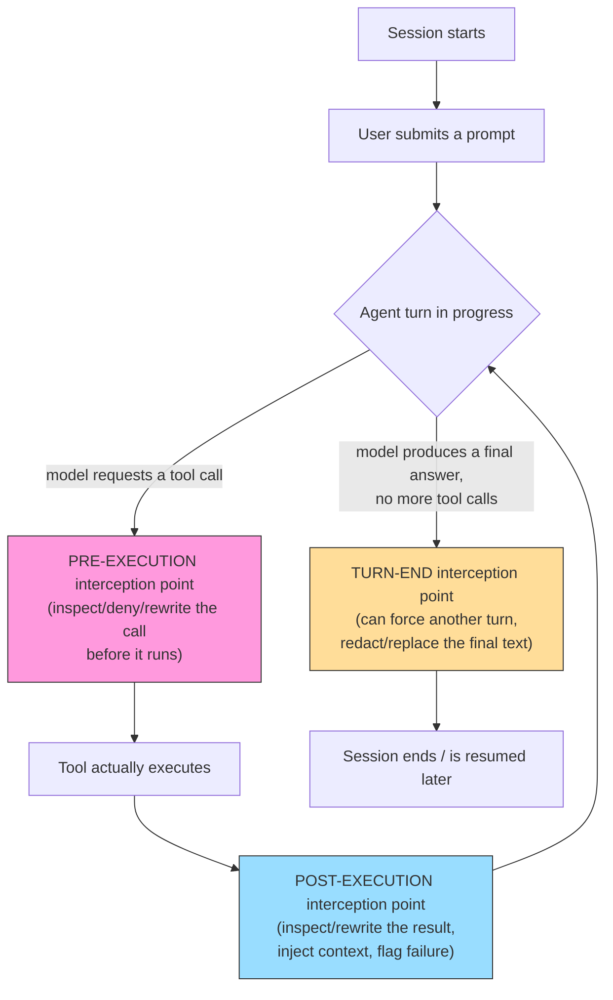
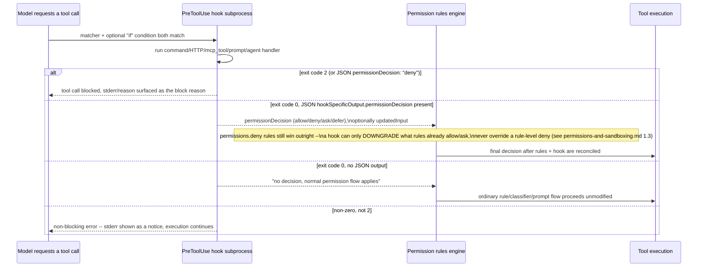
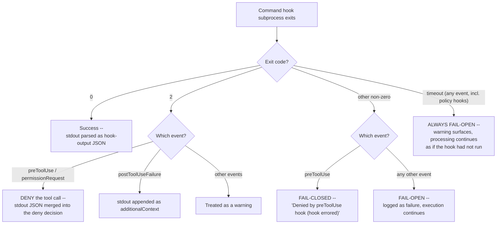
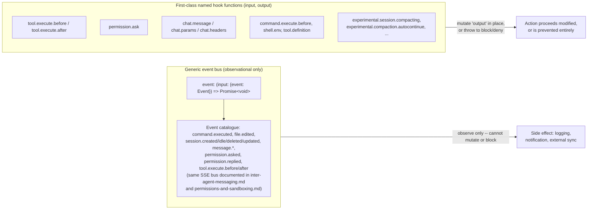
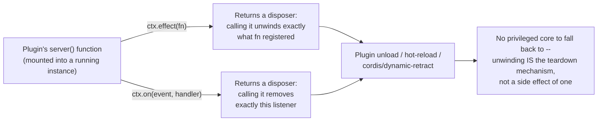
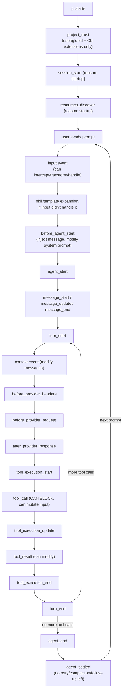
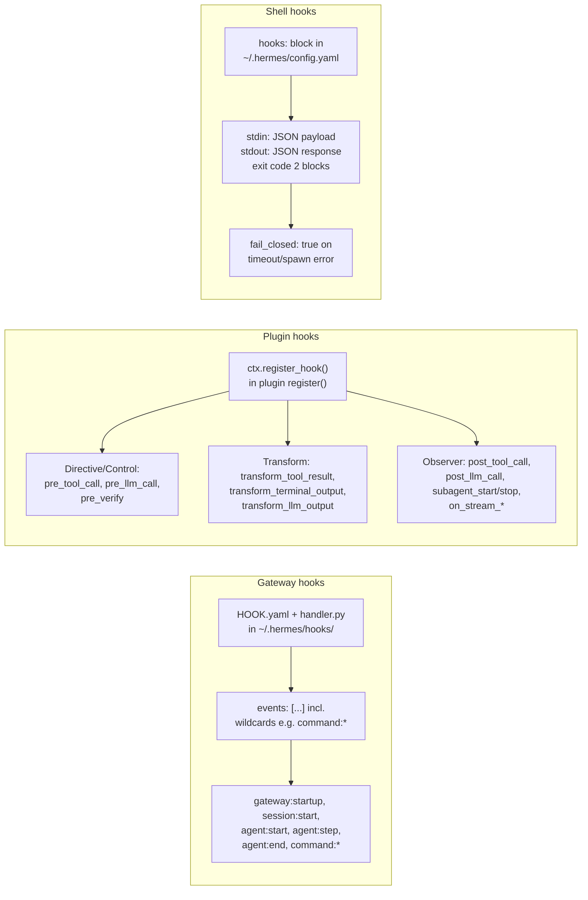
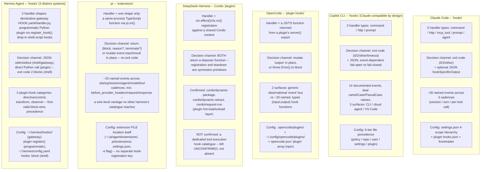

# Hooks and lifecycle extensibility

**Scope note.** [inter-agent-messaging.md](inter-agent-messaging.md) §1.6
already names three specific Claude Code hooks (`TeammateIdle`,
`TaskCreated`, `TaskCompleted`) purely as the messaging layer's own
extensibility point, and [permissions-and-sandboxing.md](permissions-and-sandboxing.md)
§1.3 touches `PreToolUse`'s precedence relative to permission rules
(rules always win over what a hook returns) as one enforcement layer
among several. [configuration.md](configuration.md) §2 covers only
*where* hook configuration lives (the `hooks` key, `allowedHttpHookUrls`,
`allowManagedHooksOnly`, `disableAllHooks`) and explicitly defers "hook
event semantics or payload shapes" to a page like this one. None of
those three pages is the dedicated treatment. This page is that
treatment: the full event catalogue each harness exposes, the exact
input/output contract and blocking/mutation semantics for each event,
where the configuration lives, and a changelog-traced history of how
each system got to its current shape. Hooks (Claude Code's own term),
hooks (Copilot CLI's own term, deliberately compatible with Claude
Code's), plugins (OpenCode's umbrella term, of which lifecycle hooks
are one part), plugins again (DeepSeek Harness's own term, mounted
into a shared Cordis context rather than loaded as an OpenCode-style
module -- §4 below), extensions (pi's own term, in-process
TypeScript modules -- §5 below), and hooks once more (Hermes Agent's own
term for three genuinely distinct dispatch systems -- §6 below) are,
across all six products, **the mechanism a harness exposes for
user-side code to sit directly inside the control flow of the agent
loop** -- not alongside it the way an MCP tool adds a capability the
model chooses to invoke, and not as inert content the way a skill or a
memory file is. A hook runs whether or not the model "wants" it to, at a
point the harness itself defines, and it can, in every harness covered
here, change what happens next: deny a tool call, rewrite its arguments,
inject text into the conversation, or force another turn.

Every claim below is tagged VERIFIED (fetched this session, source
named) or BEST CURRENT UNDERSTANDING, UNCONFIRMED. Claude Code, Copilot
CLI, OpenCode, DeepSeek Harness, pi, and Hermes Agent are six separate
products; a hook event, exit-code convention, or configuration key
confirmed for one is never assumed to hold for another without its own
citation -- this matters more than usual on this topic because Copilot
CLI's own hooks reference *explicitly* documents partial
format-compatibility with Claude Code's hooks (shared PascalCase event
names, a Claude-tool-name mapping table, even reading
`.claude/settings.json` hook entries directly), and Hermes' own shell
hooks independently converge on Claude Code's exit-code-2 convention
(§6.3) -- both real findings, but neither licenses assuming more overlap
than is actually documented anywhere else.

This is a **generic, pedagogical sketch**, not any one harness's literal
architecture -- it names the three interception shapes (pre-execution,
post-execution, turn-end) that recur, in one naming convention or
another, in all three products covered below, and gives the reader a
map to place each harness's own, differently-named event catalogue
against. Nothing in this diagram should be cited as a fact about a
specific harness; each harness's own section below is the grounded
account.

---

## 1. Claude Code

Primary source: `code.claude.com/docs/en/hooks`, fetched fresh this
session -- a full hooks-reference page covering the event catalogue,
input/output schemas, configuration structure, and security guidance.
Cross-referenced against `github.com/anthropics/claude-code`
`CHANGELOG.md`, fetched fresh this session via `gh api
repos/anthropics/claude-code/contents/CHANGELOG.md` (full 5,248-line
file, grepped for `hook`). VERIFIED unless tagged otherwise.

### 1.1 What a hook is, and the three firing cadences

Claude Code's own framing: hooks are "user-defined shell commands, HTTP
endpoints, LLM prompts, or agent calls that execute automatically at
specific points" in the harness's lifecycle, receiving JSON context on
stdin (or as an HTTP POST body) and communicating decisions back via
exit codes and JSON output. The docs group events into three cadences:
**once per session** (`SessionStart`, `SessionEnd`), **once per turn**
(`UserPromptSubmit`, `Stop`, `StopFailure`), and **per tool call inside
the agentic loop** (`PreToolUse`, `PostToolUse`, `PostToolUseFailure`,
`PermissionRequest`, `PermissionDenied`).

### 1.2 The full event catalogue

Beyond the cadence-grouped core, the reference page names a much larger
set of events, several of which correspond to mechanisms this book
documents elsewhere and are cross-referenced rather than re-derived
here: `UserPromptExpansion`, `PostToolBatch`, `Notification`,
`MessageDisplay`, `SubagentStart`, `SubagentStop`, `TaskCreated`,
`TaskCompleted`, `TeammateIdle` (all three of the latter already covered
for the messaging layer in [inter-agent-messaging.md](inter-agent-messaging.md)
§1.6), `PreCompact`, `PostCompact` (the compaction-blocking half of
`PreCompact` is already noted in [context-compression.md](context-compression.md)
§1.5 and [memory-management.md](memory-management.md); this page adds
the sibling `PostCompact` event and both events' place in the fuller
catalogue), `CwdChanged`, `FileChanged`, `WorktreeCreate`,
`WorktreeRemove`, `InstructionsLoaded` (covered for load-time visibility
in [instruction-context-budget.md](instruction-context-budget.md)
§"Verify what loaded"), `ConfigChange` (its configuration-scope
implications are covered in [configuration.md](configuration.md) §2),
`Elicitation`, `ElicitationResult` (their MCP-specific use is noted in
[mcp-integration.md](mcp-integration.md)), `Setup`, and, per the
CHANGELOG's most recent (v2.1.219) entry, `DirectoryAdded`, which "fires
after `/add-dir` or the SDK `register_repo_root` control request
registers a new working directory mid-session."

### 1.3 Common input fields and per-event input shape

Every hook invocation receives a common envelope on top of whatever
event-specific fields it adds: `session_id`, `prompt_id` (a UUID),
`transcript_path` (the JSONL transcript this book covers in
[session-persistence.md](session-persistence.md)), `cwd`,
`permission_mode` (one of `default`/`plan`/`acceptEdits`/`auto`/
`dontAsk`/`bypassPermissions` -- the same mode vocabulary documented in
[permissions-and-sandboxing.md](permissions-and-sandboxing.md) §1.1),
`effort` (`{level: "low"|"medium"|"high"|"xhigh"|"max"}`, and per the
CHANGELOG's v2.1.133 entry, also exposed to the hook's own subprocess
environment as `$CLAUDE_EFFORT`), `hook_event_name`, and, for subagent
contexts, `agent_id`/`agent_type`. Tool-scoped events additionally carry
`tool_input` (with `file_path` guaranteed absolute for Read/Edit/Write,
per a fix noted in the CHANGELOG); `PostToolUse`/`PostToolUseFailure`
additionally carry `duration_ms` (the CHANGELOG specifies this excludes
permission-prompt and `PreToolUse`-hook time, i.e. it measures the tool
call itself); `Stop`/`SubagentStop` additionally carry
`background_tasks` and `session_crons` fields (added per the
CHANGELOG); `SessionStart` input is matched against a `source` value of
`startup`/`resume`/`clear`/`compact`/`fork`.

### 1.4 Exit-code and JSON-output decision semantics

The documented rule is blunt and, per the docs' own framing, a common
source of confusion: **only exit code 2 blocks anything.** Exit code 0
means stdout JSON, if present, is parsed and processed; any other
non-zero exit code is a non-blocking error whose stderr is surfaced as
a notice while execution continues regardless. The common JSON output
schema shared across all hook types (command, HTTP, MCP-tool, prompt,
agent) includes `continue` (a boolean; `false` halts with a
`stopReason` message), `suppressOutput`, `systemMessage`,
`terminalSequence` (OSC escape sequences for desktop notifications --
added because hooks run with no controlling terminal, see §1.7),
top-level `decision: "block"` with a `reason` (used by
`UserPromptSubmit`, `UserPromptExpansion`, `PostToolUse`,
`PostToolUseFailure`, `PostToolBatch`, `Stop`, `SubagentStop`,
`ConfigChange`, `PreCompact`), and a `hookSpecificOutput` object whose
shape varies per event: `PreToolUse` carries `permissionDecision`
(`allow`/`deny`/`ask`/`defer` -- `defer`, per the CHANGELOG, lets a
headless session pause at a tool call and resume with `-p --resume` to
have the hook re-evaluate) plus `permissionDecisionReason` and
`updatedInput`; `PermissionRequest` carries a `decision.behavior`
(`allow`/`deny`) plus `updatedInput`; `PermissionDenied` (added per the
CHANGELOG at v2.1.89, firing "after auto mode classifier denials" --
the auto-mode classifier itself is documented in
[permissions-and-sandboxing.md](permissions-and-sandboxing.md) §1.4)
carries `retry: true` to let the model retry (this same
`PermissionDenied`/`retry` mechanism is already cited from the
retry-policy angle in [retries.md](retries.md) §1.7); `WorktreeCreate`
returns the created path either via stdout (command hooks) or
`hookSpecificOutput.worktreePath` (HTTP hooks); `Elicitation`/
`ElicitationResult` carry an `action` (`accept`/`decline`/`cancel`) and
`content`; `MessageDisplay` (added v2.1.141) carries `displayContent`,
which replaces only the *displayed* text, not what the model itself
received; and `SessionStart`/`Setup`/`SubagentStart` are
context-injection-only via `hookSpecificOutput.additionalContext`, with
no blocking capability at all.

### 1.5 Configuration structure, handler types, matchers

Hook configuration lives inside the same four-scope `settings.json`
hierarchy documented in full in [configuration.md](configuration.md)
§1 (`~/.claude/settings.json`, `.claude/settings.json`,
`.claude/settings.local.json`, managed policy settings), plus two
sources specific to hooks themselves: a plugin's own bundled
`hooks/hooks.json`, and inline `hooks:` blocks in an agent's, skill's,
or slash command's own frontmatter (the CHANGELOG's v2.1.0 entry:
"Added hooks support to agent frontmatter, allowing agents to define
PreToolUse, PostToolUse, and Stop hooks scoped to the agent's
lifecycle," and "Added hooks support for skill and slash command
frontmatter" the same release). The configuration shape nests an array
of `{matcher, hooks: [...]}` objects under each event name; each hook
entry carries a `type` (`command`, `http`, `mcp_tool`, `prompt`, or
`agent` -- five distinct handler kinds, the richest of the three
harnesses), an optional `if` field using the same permission-rule
syntax documented in [permissions-and-sandboxing.md](permissions-and-sandboxing.md)
(e.g. `"Bash(rm *)"`) to filter *which* invocations of an already-matched
tool actually trigger the hook, a `timeout` (defaulting to 600 seconds
for command/HTTP/MCP-tool hooks, 30 for prompt hooks, 60 for agent
hooks, with `UserPromptSubmit` lowered to 30 and `MessageDisplay` to
10), a `statusMessage` for the spinner text shown while it runs, and,
for skill-frontmatter hooks only, a `once: true` flag (added per the
CHANGELOG) that runs the hook once per session then removes it.

Command hooks distinguish an **exec form** (an `args` array present --
direct process spawn, no shell, safest against injection) from a
**shell form** (`args` absent -- passed to `sh -c` on Unix, Git Bash or
optional PowerShell on Windows, supporting pipes and globs). HTTP hooks
POST the JSON payload to a `url`, with `headers` and an `allowedEnvVars`
allowlist an administrator can further restrict via
`allowedHttpHookUrls`/`httpHookAllowedEnvVars` (both configuration keys
documented in [configuration.md](configuration.md) §2). MCP-tool hooks
call an already-connected MCP server's own tool
(`server`/`tool`/`input`, with `server` optionally namespaced
`plugin:plugin-name:server-name`); the server-canonicalization and
`mcp__server__tool` naming this depends on is documented in
[mcp-integration.md](mcp-integration.md) and [built-in-tools.md](built-in-tools.md)
§"tool name" discussion. Prompt hooks send text to the model itself for
a yes/no decision; agent hooks spawn a full subagent with tool access.
Matcher evaluation for tool-scoped events matches against the *tool
name*; `SessionStart` matches its `source` value, `Setup` its CLI-flag
value, `SessionEnd` its termination reason, `SubagentStart`/
`SubagentStop` the agent type, `PreCompact`/`PostCompact` the trigger
(`manual`/`auto`), `FileChanged` literal filenames, `Notification` the
notification type, `UserPromptExpansion` the command name,
`Elicitation`/`ElicitationResult` the MCP server name, `StopFailure`
the error type, and `ConfigChange` the configuration source; a fixed
list of events (`UserPromptSubmit`, `PostToolBatch`, `Stop`,
`TeammateIdle`, `TaskCreated`, `TaskCompleted`, `WorktreeCreate`,
`WorktreeRemove`, `MessageDisplay`, `CwdChanged`) support no matcher at
all and fire unconditionally.

### 1.6 Security posture and documented safeguards against runaway hooks

The docs are explicit that hooks execute arbitrary shell commands with
the user's full environment and can compromise the system if malicious
-- there is no sandboxing of the hook subprocess itself, in contrast to
the OS-level sandboxed-Bash *tool* execution documented in
[permissions-and-sandboxing.md](permissions-and-sandboxing.md) §1.5.
Several concrete, changelog-traced hardenings follow from that exposure:
hooks run with no controlling terminal since v2.1.139 (`/dev/tty` is
unavailable on macOS/Linux; the `terminalSequence` JSON field exists
specifically to let a hook still emit a desktop notification without
one); identical handlers (same command string and args, or same HTTP
URL) are deduplicated so they run once even if matched by multiple
entries; all matching hooks for a given event fire in parallel, not in
sequence; frontmatter hooks defined inside a project's own agent files
run only after that agent file's containing folder has been accepted
through the workspace-trust dialogue (v2.1.218); a stop hook that
always blocks cannot loop forever -- the CHANGELOG's v2.1.143 entry
caps consecutive `Stop`-hook-forced continuations at 8, overridable via
`CLAUDE_CODE_STOP_HOOK_BLOCK_CAP`; and organisation-managed policy
hooks, configured via managed settings, cannot be disabled by an
individual's own `disableAllHooks` -- only a managed-level
`disableAllHooks` can turn them off, the same managed-settings-always-
wins precedence documented generally in [configuration.md](configuration.md).
Subprocess environment scrubbing is deliberate in both directions:
`CLAUDE_CODE_SUBPROCESS_ENV_SCRUB=1` (v2.1.83) strips Anthropic/cloud
credentials from hook (and Bash tool, and MCP stdio server) subprocess
environments, while OTEL exporter variables are unconditionally removed
from every hook subprocess so that an OTel-instrumented command run
inside a hook cannot silently redirect telemetry to the CLI's own
collector endpoint. A gotcha the docs call out directly: for
mid-session events like `PostToolUse`, `additionalContext` injected by
a hook is written into the session transcript verbatim; on `/resume`,
that *stale* context replays from the transcript instead of the hook
re-running, whereas `SessionStart` hooks genuinely re-run on resume and
can refresh what they inject.

### 1.7 Changelog-traced history

Hooks were "released" at v1.0.38, the CHANGELOG crediting community
input via `github.com/anthropics/claude-code` issue #712 and linking
the same docs page cited throughout this section. From there the
system's growth is a long, incremental accretion visible directly in
the CHANGELOG: v1.0.41 split a single `Stop` trigger into distinct
`Stop`/`SubagentStop` events and added `hook_event_name` to the input
payload; v1.0.54 added the `UserPromptSubmit` event and `cwd` to hook
inputs; v1.0.59 exposed `PermissionDecision` to hooks including an
`ask` value and added `UserPromptSubmit`'s `additionalContext` support;
v1.0.68 added `disableAllHooks`; v1.0.112 introduced `SessionEnd`;
v2.0.12's "Plugin System Released" made hooks (alongside commands,
agents, and MCP servers) something a marketplace-distributed plugin
could bundle; v2.0.30 added prompt-based stop hooks; v2.0.41 added
`agent_id`/`agent_transcript_path` to `SubagentStop`; v2.0.45 added the
`SubagentStart` event; v2.1.0 (already cited in §1.5) brought hooks
into agent/skill/slash-command frontmatter; v2.1.78 added
`StopFailure`; v2.1.83-2.1.85 added `CwdChanged`/`FileChanged` and the
env-scrub variable above; v2.1.89 (already cited in §1.4) added
`PermissionDenied` and the `defer` permission decision; v2.1.94
documented the `TaskCreated` event's blocking behaviour explicitly;
v2.1.105 added `PreCompact` blocking support (exit 2 or
`{"decision":"block"}`); v2.1.110 fixed `permissions.deny` rules not
overriding a hook's `ask` downgrade -- the precedence rule diagrammed
in §1.4; v2.1.116 let agent-frontmatter `hooks:` fire even when the
agent runs as the *main* thread via `--agent`, not only as a subagent;
v2.1.118 let hooks invoke MCP tools directly via `type: "mcp_tool"`;
v2.1.121 let `PostToolUse` hooks replace tool output for all tools via
`hookSpecificOutput.updatedToolOutput` (previously MCP-tool-only);
v2.1.128 stopped hook subprocesses from inheriting `OTEL_*` variables
(§1.6); v2.1.132-2.1.133 added `CLAUDE_CODE_SESSION_ID` and
`$CLAUDE_EFFORT` to hook-adjacent subprocess environments; v2.1.136
fixed plugin `Stop`/`UserPromptSubmit` hooks breaking under cache
cleanup; v2.1.139 (already cited in §1.6) removed controlling-terminal
access and added `terminalSequence`; v2.1.141 added the `MessageDisplay`
event; v2.1.143 (already cited in §1.6) added the 8-consecutive-block
stop cap; v2.1.145 added `background_tasks`/`session_crons` to
`Stop`/`SubagentStop` input; v2.1.152 let `SessionStart` hooks return
`reloadSkills: true` (making a hook-installed skill available
mid-session) and set the session title via
`hookSpecificOutput.sessionTitle`; v2.1.169 added `--safe-mode` (and
`CLAUDE_CODE_SAFE_MODE`) to start with hooks (and CLAUDE.md, plugins,
skills, MCP servers) fully disabled for troubleshooting; v2.1.195 fixed
hook matchers with hyphenated tool/server identifiers accidentally
substring-matching instead of exact-matching; v2.1.207 (already cited
in [inter-agent-messaging.md](inter-agent-messaging.md)) rejected
`${user_config.*}` in shell-form hook commands as a shell-injection
fix; v2.1.211 fixed hooks with exit code 2 silently not blocking when
the hook's own stdout JSON failed schema validation; v2.1.214 changed
single-segment `dir/**` `if:` conditions to match only the literal
current directory rather than any depth; v2.1.218 (already cited in
§1.6) added the workspace-trust gate on frontmatter hooks; and v2.1.219
added the `DirectoryAdded` event already named in §1.2.

---

## 2. GitHub Copilot CLI

Primary source: `docs.github.com/en/copilot/reference/hooks-reference`,
fetched fresh this session -- the canonical hooks reference covering
all 14 documented hook events across Copilot CLI, the cloud coding
agent, and VS Code. Cross-referenced against `github.com/github/copilot-cli`
`changelog.md` (note: lowercase filename, confirmed live via `gh api
repos/github/copilot-cli/contents` this session, unlike Claude Code's
`CHANGELOG.md`), fetched fresh this session via `gh api
repos/github/copilot-cli/contents/changelog.md` (full 2,898-line file,
grepped for `hook`). VERIFIED unless tagged otherwise. A preliminary,
broader `WebFetch` against `docs.github.com/en/copilot` (the general
docs entry point, not the hooks-reference page itself) surfaced the
existence of dedicated "Using hooks with GitHub Copilot CLI" and "About
hooks for GitHub Copilot" articles and named the separate Copilot SDK's
own `onPreToolUse`/`onPostToolUse`/`onUserPromptSubmitted`/
`onErrorOccurred` session hooks; that fetch is treated only as a
pointer confirming the mechanism exists, superseded below by the direct
hooks-reference fetch for every substantive claim.

### 2.1 Three surfaces, one shared hook vocabulary, real behavioral differences

Copilot's hooks reference is explicit that the same 14 event names and
JSON schema are shared across three genuinely different execution
contexts, each with its own constraints: **Copilot CLI**, running hooks
"on the developer's local machine in the same shell as the CLI," with
every documented event supported and every configuration source loaded
and combined; the **Copilot cloud coding agent**, running hooks "inside
an ephemeral Linux sandbox provisioned per job," where the filesystem
is discarded when the job ends, outbound network is firewalled to
GitHub/Copilot hostnames by default, only `.github/hooks/*.json` from
the cloned repository is loaded (user-level hooks, `settings.json`
hooks, and plugin-contributed hooks do **not** transfer into the
sandbox), and there is no human present to answer an `ask` decision or
receive a `notification`; and **VS Code**, described in the fetched
content as an "8-event preview" using PascalCase event names and
snake_case field names structurally distinct from the CLI's own
camelCase convention, a surface this book does not otherwise cover and
flags only to rule out overreach onto it. A secondary `WebSearch`
result (a DeepWiki summary of `github/awesome-copilot`, not an
authoritative source in its own right) reported Copilot CLI hooks
reaching general availability in February 2026; that date is
**UNCONFIRMED**, and is in some tension with the changelog's own first
hook-related entry appearing at v0.0.396 (2026-01-27) below -- treat
the GA-timing claim as a third-party lead worth independent
verification, not a fact this page asserts.

### 2.2 The 14 documented events, dual-named

Every event is documented under two names: a camelCase form (the
Copilot-native convention) and, where a PascalCase Claude-compatible
alias exists, that alias too. Session-level: `sessionStart`/
`SessionStart` (fires on new-or-resumed session start; carries
`sessionId`, `timestamp`, `cwd`, `source` -- `startup`/`resume`/`new`
-- and optionally `initialPrompt`; can inject `additionalContext`) and
`sessionEnd`/`SessionEnd` (fires on termination; `reason` is one of
`complete`/`error`/`abort`/`timeout`/`user_exit`, with `abort` and
`user_exit` impossible under the cloud agent since no human is
present). Prompt-level: `userPromptSubmitted`/`UserPromptSubmit`
(notification-only, cannot block or modify) and
`userPromptTransformed` (no PascalCase alias documented; fires after
the runtime transforms the raw prompt into model-facing content,
receives both `prompt` and `transformedPrompt`, and can return
`modifiedTransformedPrompt` to rewrite what the model actually sees --
explicitly "mutation-only... it can rewrite the content the model
receives, but not block"). Tool-execution: `preToolUse`/`PreToolUse`
(fires before every tool invocation with `toolName`/`toolArgs`, and is
the one event implementing real access control via a three-valued
`permissionDecision`), `postToolUse`/`PostToolUse` (fires only after a
*successful* tool completion, carrying `toolArgs` and `toolResult`),
and `postToolUseFailure`/`PostToolUseFailure` (fires on tool failure
with an `error` string, can return `additionalContext` for recovery
guidance). Agent-control: `agentStop`/`Stop` (fires once the agent
completes a turn; carries `transcriptPath`, a currently-always-`"end_turn"`
`stopReason`, and a `stop_hook_active` flag signalling a prior forced
continuation), `subagentStart` (fires before spawning a subagent,
excluding the built-in general-purpose agent; can inject
`additionalContext` prepended to the subagent's own prompt but cannot
prevent the spawn), and `subagentStop`/`SubagentStop` (fires on normal
subagent completion, before the parent processes the result; can
return `modifiedResponse` to redact or reformat what the parent sees --
if multiple hooks return a `modifiedResponse`, they do not compose,
"the last matching hook wins"). System-level: `errorOccurred`/
`ErrorOccurred` (notification-only; `errorContext` is one of
`model_call`/`tool_execution`/`system`/`user_input`, plus a
`recoverable` flag), `preCompact`/`PreCompact` (notification-only;
`trigger` distinguishes `manual` from `auto`, and under the cloud agent
fires only for `auto` since manual compaction needs a human to invoke
it -- the general compaction mechanism this hook observes is documented
in [context-compression.md](context-compression.md) §2), and
`notification` (asynchronous, never blocks, does not fire under the
cloud agent at all; can return `additionalContext` injected as a
prepended user message). `permissionRequest` is CLI-only (absent under
the cloud agent, where every tool call is pre-approved): it fires
"before the permission service's rule engine runs," with output
`{behavior: "allow"|"deny", message, interrupt}` -- `interrupt: true`
combined with `deny` halts the entire agent run, not just the one tool
call.

### 2.3 Exit-code semantics, and the one deliberate fail-closed exception

The documentation states this asymmetry outright: command-hook exits
are "fail-closed" for `preToolUse` specifically -- any non-zero exit
other than 2 still denies the tool call, with the message "Denied by
preToolUse hook (hook errored)" -- while every other event's non-zero,
non-2 exit is fail-open, logged as a failure but not blocking anything.
**Timeouts are the sole universal exception, fail-open even for
`preToolUse` and even for administrator-deployed policy hooks**: the
documentation reasons that "a slow or unreachable hook must not
silently block tool calls or work, even when the hook was deployed by
an administrator as policy." `postToolUse`'s `additionalContext`
outputs from multiple matching hooks are joined with double newlines
and capped at 10 KB total. A runaway-loop guard mirrors Claude Code's
own (§1.7): after 8 consecutive `agentStop`/`subagentStop` `block`
decisions, the CLI overrides the hook and ends the turn regardless,
exposing `stop_hook_active` to a hook so it can detect a prior forced
continuation and self-limit before hitting that cap. Given how
extensively the two products' hook payload formats and tool-name
mappings are documented as cross-compatible (§2.6 below), the identical
cap value of 8 across both harnesses is plausibly a deliberate
compatibility choice rather than coincidence -- but this is **BEST
CURRENT UNDERSTANDING, UNCONFIRMED**, since neither harness's own
documentation states that the number was chosen *because* the other
harness uses it.

### 2.4 Configuration file locations and precedence

Hooks are discovered, combined (not overridden) across, six source
tiers: **policy-level** (CLI only -- `/etc/github-copilot/policy.d/*.json`
on Linux/macOS, `C:\ProgramData\GitHub\Copilot\policy.d\*.json` or the
Windows Registry `HKLM\Software\Policies\GitHub\Copilot` on Windows --
loads first, cannot be disabled by `disableAllHooks`, and persists
regardless of folder-trust state); **repository-level**
`.github/hooks/*.json` (loaded by both CLI and cloud agent); **user-level**
`~/.copilot/hooks/*.json` (or the Windows equivalent, respecting
`COPILOT_HOME` if set); **repository settings** (a `hooks` field inside
`.github/copilot/settings.json` or `.github/copilot/settings.local.json`
-- and, per the reference fetched this session, this same settings
loader "also reads `.claude/settings.json` variants," the concrete
mechanism behind the cross-harness interop measure already noted at a
higher level in [configuration.md](configuration.md)); **user
settings** (`hooks` in `~/.copilot/settings.json`); and
**plugin-contributed** `hooks.json` bundled inside each plugin's own
installation directory. Every configuration file declares `"version": 1`
and an optional top-level `disableAllHooks`; when the *same event*
appears across multiple sources, every entry from every source runs --
there is no shadowing.

### 2.5 Hook entry types

Command hooks execute locally (CLI) or inside the cloud sandbox,
supporting platform-specific `bash`/`powershell` fields plus a
cross-platform `command` fallback (explicit platform fields take
precedence over `command` when both are present), an optional working
directory (`cwd`) and `env` block, and a `timeoutSec`. A distinctive
mechanism not documented for either other harness: command hooks can
stream **progress updates** by printing single-line JSON objects with
`"type": "progress"` to stdout mid-run -- "the CLI scans stdout
line-by-line as the hook runs" and strips any such line from the
output stream before parsing the final decision JSON, specifically so
that progress reporting cannot corrupt the final parse. HTTP hooks POST
the payload to a `url`, restricted to `https://` by default (`http://`
is rejected except for `localhost`/`127.*`/`[::1]` when
`COPILOT_HOOK_ALLOW_LOCALHOST=1` is explicitly set), with `allowedEnvVars`
requiring `https://` when set, and, under the cloud agent, further
constrained to an admin-configured firewall allow-list for any
non-GitHub/Copilot host. Prompt hooks auto-submit text as if the user
had typed it, and are supported **only** on `sessionStart`, and only
for new interactive CLI sessions -- never on resume, never under
non-interactive `-p` mode.

### 2.6 Matchers, and the Claude-tool-name compatibility layer

Matchers on `preToolUse`, `postToolUse`, `permissionRequest`,
`preCompact`, `subagentStart`, and `notification` are compiled as
anchored regexes (`^(?:PATTERN)$`) against the corresponding field
(`toolName`, `trigger`, `agentName`, `notification_type`). Hooks
configured under the **PascalCase** event names additionally accept
Claude's own tool-matcher conventions: `*`/`**`/empty matches
everything, a literal name or `|`-alternation (`Bash|Edit`) matches by
either the Copilot-native runtime tool name *or* the Claude-equivalent
name, and the reference fetched this session gives an explicit mapping
table from Copilot's own tool identifiers to Claude Code's canonical
names -- `bash`/`powershell` -> `Bash`, `view` -> `Read`, `create` ->
`Write`, `edit`/`str_replace_editor`/`apply_patch` -> `Edit`,
`grep`/`rg` -> `Grep`, `glob` -> `Glob`, `web_fetch` -> `WebFetch`,
`web_search` -> `WebSearch`, `ask_user` -> `AskUserQuestion`,
`update_todo` -> `TodoWrite`, `task`/`Task` -> `Agent`. This is the
concrete mechanism letting a single hook configuration file, written
once against Claude Code's own tool vocabulary (already catalogued in
[built-in-tools.md](built-in-tools.md)), fire correctly under Copilot
CLI as well -- confirming, at the implementation-detail level, the
cross-harness-compatibility framing [configuration.md](configuration.md)
already established for the settings-file format generally.

### 2.7 Changelog-traced history

The changelog's first hook-related entry is at **v0.0.396
(2026-01-27)**: "preToolUse hooks can deny tool execution and modify
arguments." From there: **v0.0.401/v0.0.402 (2026-02-03)** added
`agentStop`/`subagentStop` hooks to control agent completion and made
plugin-provided session-lifecycle hooks possible; **v1.0.4
(2026-03-11)** added the `ask` permission decision, letting a hook
request user confirmation before tool execution rather than only
allow/deny; **v1.0.5 (2026-03-13)** added `preCompact`; **v1.0.15
(2026-04-01)** added `postToolUseFailure` and restricted `postToolUse`
to firing only after success; **v1.0.16 (2026-04-02)** added
`PermissionRequest`; **v1.0.18 (2026-04-04)** added the asynchronous
`notification` event, firing on shell completion, permission prompts,
elicitation dialogs, and agent completion, and made `preToolUse`'s
`allow` decision suppress the approval prompt entirely; **v1.0.35
(2026-04-23)** added HTTP hook support; **v1.0.51 (2026-05-20)** added
a `preMcpToolCall` hook letting a hook control outgoing MCP request
metadata, and let `postToolUse` inject `additionalContext` into an
already-successful tool result; **v1.0.72 (2026-07-20)** added the
`stop_hook_active` flag and the 8-consecutive-block loop cap for
`agentStop` cited in §2.3; and **v1.0.76 (2026-07-29)** hardened the
`userPromptTransformed` hook's own error handling substantially --
rejecting non-string `modifiedPrompt`/`modifiedTransformedPrompt`/
`responseContent` values with a type-only warning instead of silently
corrupting the session, treating a `null` `additionalContext` as
absent rather than injecting the literal text `"null"`, and bounding
all hook output at 10 MiB per invocation so a runaway HTTP or command
hook cannot exhaust memory. Earlier entries also show format-compatibility
work accreting steadily across the same period: PascalCase/snake_case
payload acceptance "across VS Code, Claude Code, and the CLI," reading
Claude-style nested `matcher`/`hooks` group structures, honouring the
`command` cross-platform alias and a `timeout`-as-alias-for-`timeoutSec`
field, and loading `.claude/settings.json` hook entries directly (all
already synthesised into §2.1/§2.6 above).

---

## 3. OpenCode

Primary sources: `opencode.ai/docs/plugins/`, fetched fresh this
session; `packages/plugin/src/index.ts` on the `github.com/anomalyco/opencode`
`dev` branch, fetched fresh this session via `gh api
repos/anomalyco/opencode/contents/packages/plugin/src/index.ts?ref=dev`
(full file, the actual TypeScript `Hooks` interface a plugin's
`server` function returns); `packages/opencode/src/session/tools.ts`,
also fetched fresh this session, confirming the real `plugin.trigger(...)`
call sites for `tool.execute.before`/`tool.execute.after`. **Dev-branch
caveat applies throughout this section per this book's standing
convention: `dev` is not a stable release tag, and its interface shapes
may not reflect the current stable release.**

### 3.1 No "hooks," a "plugin" that returns a "hooks object" -- and two distinct extension surfaces

OpenCode's own vocabulary calls the mechanism a **plugin**: "a
JavaScript/TypeScript module that exports one or more plugin
functions," each receiving a context object (`project`, `directory`,
`worktree`, `client`, `$` -- Bun's shell API) and "returns a hooks
object." Reading the fetched docs page and the source-verified
`Hooks` interface side by side surfaces a real structural distinction
that the docs page itself does not name explicitly, but which is
directly visible in the type definitions -- this framing is therefore
**BEST CURRENT UNDERSTANDING, UNCONFIRMED as an official OpenCode
distinction**, though every individual fact composing it is
source-verified:

The **generic surface** is a single catch-all `event` hook, receiving
`{event: Event}` where `Event` is a large tagged union of past-tense,
already-happened event types -- the docs page's own "Events" section
enumerates them by category: command (`command.executed`), file
(`file.edited`, `file.watcher.updated`), installation
(`installation.updated`), LSP (`lsp.client.diagnostics`,
`lsp.updated`), message (`message.part.removed`, `message.part.updated`,
`message.removed`, `message.updated`), permission (`permission.asked`,
`permission.replied`), server (`server.connected`), session
(`session.created`, `session.compacted`, `session.deleted`,
`session.diff`, `session.error`, `session.idle`, `session.status`,
`session.updated`), todo (`todo.updated`), shell (`shell.env`), tool
(`tool.execute.after`, `tool.execute.before`), and TUI
(`tui.prompt.append`, `tui.command.execute`, `tui.toast.show`). This
`event` hook's signature (`(input: { event: Event }) => Promise<void>`,
per the source file) takes no mutable `output` parameter at all -- it
is purely observational, and is the same directory-scoped
Server-Sent-Events bus already documented end-to-end in
[inter-agent-messaging.md](inter-agent-messaging.md) (the
`packages/opencode/src/server/routes/instance/httpapi/handlers/event.ts`
handler) and wired into the permission-approval flow in
[permissions-and-sandboxing.md](permissions-and-sandboxing.md) §3
(`Event.Asked`/`Event.Replied`, published from `Permission.Service`).

The **named surface** is a set of first-class function keys declared
directly on the `Hooks` TypeScript interface itself
(`packages/plugin/src/index.ts`), each with its own typed `(input,
output)` signature. The recurring pattern across nearly every one of
these -- confirmed by reading the interface directly, and by the docs
page's own `.env`-protection and `inject-env` examples -- is that
`output` is a **plain object passed by reference for the plugin to
mutate in place**; a plugin changes behaviour by writing into `output`
before returning, and blocks/denies an action outright by **throwing
an `Error`** from inside the hook body (the docs' own worked example:
`"tool.execute.before": async (input, output) => { if (input.tool ===
"read" && output.args.filePath.includes(".env")) { throw new
Error("Do not read .env files") } }`).

### 3.2 The named hooks, source-verified in full

Reading the `Hooks` interface directly (not just the docs' example
snippets) surfaces the complete set: `dispose` (cleanup callback, no
input/output), `event` (the generic bus described above), `config`
(receives the resolved `Config` object), `tool` (registers brand-new
custom tools, the mechanism already covered from the tool-surface
angle in [built-in-tools.md](built-in-tools.md)), `auth` (registers a
new authentication provider, OAuth or API-key flow), `provider`
(registers or extends a model provider's own model list), `chat.message`
(fires "when a new message is received," input carries `sessionID`/
`agent`/`model`/`messageID`/`variant`, output exposes the mutable
`{message: UserMessage, parts: Part[]}` the plugin can rewrite before
the message is processed further), `chat.params` (mutate
`temperature`/`topP`/`topK`/`maxOutputTokens`/`options` sent to the
LLM), `chat.headers` (mutate outgoing HTTP headers per request),
`permission.ask` (input is the full `Permission` request object, output
is `{status: "ask"|"deny"|"allow"}` -- see the important caveat in
§3.3 below), `command.execute.before` (fires before a slash command
executes, can rewrite the `parts` that command expands into),
`tool.execute.before`/`tool.execute.after` (§3.4 below), `shell.env`
(mutate the environment variables injected into every shell execution,
the exact mechanism the docs' own `inject-env` example demonstrates),
`experimental.chat.messages.transform` and
`experimental.chat.system.transform` (rewrite the full message list or
system-prompt string array before a request is sent),
`experimental.provider.small_model` (override which model a provider
uses for its own internal "small model" tasks -- a plausible connection
to the small/cheap-model-selection concept touched on generally in
this book's model-routing territory, though this page does not chase
that cross-reference further since no dedicated model-routing page
exists yet), `experimental.session.compacting` and
`experimental.compaction.autocontinue` (both already named from the
compaction angle in [context-compression.md](context-compression.md)
§1.5; this page adds their full, source-verified input/output shapes --
`compacting`'s `output` is `{context: string[]; prompt?: string}`,
where setting `prompt` "completely replaces the default compaction
prompt" and the docs note "the `output.context` array is ignored in
this case"; `autocontinue`'s `output` is `{enabled: boolean}`,
defaulting to `true`, gating whether a synthetic user "continue"
message is auto-injected after compaction succeeds),
`experimental.text.complete` (rewrite completed text for a given
message part), and `tool.definition` (rewrite a tool's own `description`
and `parameters` before they are sent to the LLM -- letting a plugin
edit how a *built-in* tool is described to the model without touching
its execution logic at all).

### 3.3 A documentation/source naming mismatch, flagged rather than smoothed over

The docs page's own "Events" catalogue lists `permission.asked` and
`permission.replied` -- past tense, matching the generic `event` bus's
naming convention and matching the `Event.Asked`/`Event.Replied` names
already confirmed server-side in
[permissions-and-sandboxing.md](permissions-and-sandboxing.md) §3. The
source-verified `Hooks` interface, however, declares a **differently
named**, present-tense `permission.ask` function hook, with its own
`(input: Permission, output: {status: "ask"|"deny"|"allow"})` shape --
not a notification about a past decision, but a shape that looks
positioned to let a plugin *make* the decision. These are genuinely two
different things by name and by shape, not a typo this page is
choosing to normalise away. A targeted search this session across the
two files that implement the `Permission.Service` `ask()`/`reply()`
flow -- `packages/opencode/src/permission/index.ts` and
`packages/opencode/src/session/processor.ts` (the latter confirmed,
via direct read, to call `permission.ask({...})` for the `doom_loop`
guard already documented in [built-in-tools.md](built-in-tools.md) and
[permissions-and-sandboxing.md](permissions-and-sandboxing.md)) -- found
**no call site that actually triggers a plugin hook literally named
`"permission.ask"`**, in contrast to `tool.execute.before`/
`tool.execute.after`, whose `plugin.trigger("tool.execute.before", ...)`
/ `plugin.trigger("tool.execute.after", ...)` call sites this session
*did* find, directly, at five separate locations in
`packages/opencode/src/session/tools.ts` (one pair per distinct
tool-invocation code path in that file). Treat "the `Hooks` TypeScript
interface declares a `permission.ask` shape" as **VERIFIED** (it is
directly in the type file) and "that shape is actually wired to fire
anywhere in the current `dev`-branch snapshot" as **UNCONFIRMED** --
it may be a declared-but-not-yet-invoked hook point, or it may be
invoked through a code path this session's search did not surface;
this is exactly the kind of gap this book flags rather than papers
over.

### 3.4 `tool.execute.before`/`tool.execute.after`, confirmed wired end to end

Unlike `permission.ask`, this pair is confirmed live: `packages/opencode/src/session/tools.ts`
calls `yield* plugin.trigger("tool.execute.before", { tool, sessionID,
callID }, { args })` immediately before dispatching a tool call, and
the corresponding `"tool.execute.after"` trigger immediately after,
across every one of the distinct tool-execution code paths in that
file. `tool.execute.before`'s mutable `output.args` is exactly what the
docs' `inject-env`/shell-escaping examples mutate before the shell
tool actually runs (e.g. escaping a bash command string via `shescape`
before dispatch), and `tool.execute.after`'s mutable
`{title, output, metadata}` lets a plugin rewrite what the model
ultimately sees as the tool's own result -- structurally the same
"observe/rewrite a completed tool result" role Claude Code's
`PostToolUse` and Copilot's `postToolUse` fill, but expressed as a
direct JavaScript function call with a mutable object rather than a
subprocess/exit-code/JSON-stdout contract.

### 3.5 Plugin loading: files, npm packages, load order, dependencies

Plugins load from two kinds of sources. **Local files**: `.opencode/plugins/`
(project-level) and `~/.config/opencode/plugins/` (global), both
auto-loaded at startup with no explicit registration step. **npm
packages**: named in the `"plugin"` array of `opencode.json`
(`{"plugin": ["opencode-helicone-session", "opencode-wakatime",
"@my-org/custom-plugin"]}`), installed automatically via Bun at
startup and cached under `~/.cache/opencode/node_modules/`. Load order
is fixed: global config -> project config -> global plugin directory ->
project plugin directory, with "all hooks run in sequence" across
every loaded plugin (contrast Claude Code's explicitly *parallel*
same-event hook execution, §1.6). Duplicate npm packages at the same
name+version load once; a local plugin and a similarly-named npm
plugin are not deduplicated against each other. Local plugins that need
external npm dependencies require their own `package.json` inside the
config directory (e.g. `.opencode/package.json`), against which
OpenCode runs `bun install` at startup.

### 3.6 A structural absence worth stating plainly: no dedicated, blocking session-lifecycle hook

Unlike Claude Code's `SessionStart`/`SessionEnd`/`Stop` or Copilot's
`sessionStart`/`sessionEnd`/`agentStop` -- each a first-class,
input/output-shaped hook function that can inject context or (for
`Stop`-family events) force another turn -- OpenCode's closest
analogues (`session.created`, `session.idle`, `session.deleted`,
`session.updated`) exist **only** as entries in the generic,
observation-only `event` catalogue described in §3.1. There is no
`session.*` entry among the named, mutable-`output` function hooks
enumerated in §3.2 at all. This is an **absence claim**, held to the
same "flagged as UNCONFIRMED-as-absent rather than proven" discipline
this book applies elsewhere to absence findings (see
[inter-agent-messaging.md](inter-agent-messaging.md) §1's treatment of
Copilot CLI's own peer-to-peer messaging absence): it rests on a
complete read of the `Hooks` interface in `packages/plugin/src/index.ts`
this session, not on an exhaustive audit of every other file in the
`dev`-branch tree that might independently wire up a session-lifecycle
hook contract this page's search did not find.

---

## 4. DeepSeek Harness

Primary sources, all VERIFIED, fetched 20 August 2026 directly from
`deepseek-ai/deepseek-harness` (`master` branch, MIT-licensed, in developer
preview as of this fetch -- "THERE WILL BE COMPATIBILITY-BREAKING CHANGES,"
per the repository's own README, the same early-instability caveat this
book already carries for OpenCode's `dev` branch): `README.md`, `AGENTS.md`,
`docs/architecture.md`, and `docs/subsystems/extensions.md`. DeepSeek
Harness is built, ground-up, on **Cordis**, a general-purpose plugin
framework (documented in a separate paper, *A Programming Paradigm for
Spatiotemporal Composability*, cited by DeepSeek's own docs) that the
repository vendors directly under `vendor/` rather than merely depending on
as an npm package -- making it the one harness in this book where the
extension mechanism is not an add-on the loop calls out to, but the
substrate the loop itself is composed *from*.

### 4.1 Cordis: registration as a reversible effect, not a fire-and-forget listener

Cordis's own primitive is a shared `ctx` (context) object every plugin
mounts into. A plugin's only way to affect the running system is to
register against that context via **`ctx.effect()`** or **`ctx.on()`** --
and both calls, critically, **return a disposer function**: an explicit,
first-class handle for unwinding exactly what that one registration
contributed. `docs/architecture.md` states this as a design absolute, not
an implementation detail: "there is no privileged core; the system extends
by mounting new plugins and unwinding their registrations when they
unload." This is a materially different discipline from an ordinary
event-bus-with-listeners pattern (the shape [OpenCode's own generic `event`
hook](hooks-lifecycle-extensibility.md) exhibits, per §3.1 above) that never
has to think about teardown as a first-class operation: in Cordis, every
contribution to the shared context is symmetric by construction -- mount
and unmount are both explicit, code-level operations, not a mount step with
an implicit, undocumented unmount left to the plugin author's own
discipline or to process exit.

This registration model sits directly beneath a boot-time composition
scheme the architecture doc describes in three ordered layers applied to an
initially empty configuration: **bundles** (e.g. `dsh-base`, supplying model
adapters, tools, persistence, sandbox, and settings as a foundation),
**profiles** (named stacks of bundles for a deployment shape, e.g. `web` vs.
`headless`), and **patches** (profile-level, home-level, or overlay-level
edits that replace or insert configuration rows by identifier). Each later
layer can override or add to what came before it, which is how the same
Cordis substrate produces both a headless CLI build and a browser-served
web UI from the same underlying plugin set -- every `ctx.effect()`/`ctx.on()`
registration described above happens once this composed plugin tree is
actually mounted, not at some separate, hardcoded startup step.

### 4.2 House rules that read like this book's own grounding discipline, applied to code

`AGENTS.md` (the repository's own contributor guidance) states four design
constraints worth carrying forward verbatim, since they bear directly on
this page's own subject -- how user-side/extension code is permitted to sit
inside the loop's control flow: **"Model-visible means logged"** -- anything
that reaches a model request must be reconstructable from the session log
(the mechanism behind this is documented from the session-persistence angle
in [Session & transcript persistence](session-persistence.md) §4);
**"Plugins, not loop changes"** -- new behaviour goes on documented
extension points, and changing `agent-loop` itself requires updating
`docs/architecture.md` in the same change; **"No hardcoded tunables in
plugins"** -- deployment-varying choices must be validated `Config` fields
changeable from `cordis.yml`, not literals baked into a plugin's own source;
and a strict-TypeScript rule that every remaining `any` usage requires an
explanatory comment. The second rule in particular is the clearest textual
confirmation that Cordis's plugin substrate is treated, by DeepSeek's own
engineering discipline, as *the* sanctioned mechanism for extending the
loop's behaviour -- structurally the same claim this page's own opening
framing makes about hooks/plugins generally across all harnesses covered
here, now independently stated as a house rule for a fourth one.

### 4.3 An honest, checked-this-session gap: no confirmed tool-execution hook catalogue

This session specifically fetched `docs/subsystems/extensions.md` looking
for a pre/post-tool-call-style hook-point catalogue comparable to Claude
Code's ~30-event catalogue (§1.2 above) or Copilot CLI's 14-event catalogue
(§2.2 above) or OpenCode's ~20-function `Hooks` interface (§3.2 above). That
page's fetched content confirmed only Cordis's own *dynamic plugin
management* events -- `cordis/dynamic-package` (fires on plugin activation),
`cordis/dynamic-retract` (fires on plugin withdrawal), and
`cordis/request-run` (fires for approval requests) -- which is a real
mechanism, but a different layer entirely from a tool-execution hook
catalogue: it governs hot-loading and unloading *plugins themselves*, not
observing or intercepting individual tool calls the way `PreToolUse`/
`PostToolUse`, `preToolUse`/`postToolUse`, or `tool.execute.before`/
`tool.execute.after` do for the other three harnesses on this page. Whether
DeepSeek Harness exposes a dedicated, user-authorable tool-execution hook
surface at all, and if so where it is documented, is left **UNCONFIRMED**
rather than assumed absent -- this session's fetch of one specific docs page
did not surface one, but that is not the same as a confirmed absence across
the full `docs/subsystems/` tree (which names, per its own directory
listing, over 40 subsystem pages, only a handful of which this book has
fetched to date).

**Related, and kept separate deliberately:** DeepSeek Harness's own
capability-seam vocabulary (Service Definition/Provider/Consumer) is a
different mechanism from the plugin-registration/disposal model described
in §4.1 -- a capability seam is about *swapping which provider implements an
interface* (e.g. `ctx.llm`'s choice of `llm-deepseek` vs. `llm-pi-ai`), not
about *a plugin inserting itself into the control flow at a named point*.
The seam vocabulary is documented in full, with `ctx.llm` as the worked
example, in [The LLM API contract](llm-api-contract.md) §3.4 -- not repeated
here, since this page's own subject is the latter mechanism, not the
former.

### 4.4 Using Cordis's disposer pattern as a reasoning aid for the two closed harnesses -- BEST CURRENT UNDERSTANDING, UNCONFIRMED

Neither Claude Code's docs (§1 above) nor Copilot CLI's docs (§2 above)
state what happens to an *already-registered* hook when its own settings
file is edited mid-session -- both harnesses support editing hook
configuration without a full process restart, but the mechanism by which a
stale registration gets torn down (or isn't) is not described on any page
fetched for either harness's own section above. Cordis models every plugin
registration as an effect with an explicit disposer (§4.1), meaning any
framework built this way has a structural answer to "how does a stale
registration get cleanly torn down" built directly into its substrate,
rather than left to each hook author's own discipline. **BEST CURRENT
UNDERSTANDING, UNCONFIRMED:** since both Claude Code and Copilot CLI support
this kind of mid-session config edit, each most likely has *some* internal
equivalent of a disposal/re-registration step when a hook's configuration
changes underneath a live session -- but whether either actually implements
one, and what it looks like, remains unconfirmed by anything this book has
fetched from either harness directly. DeepSeek's `ctx.effect()`/`ctx.on()`
disposer pattern is offered here only as a concrete illustration of what
such a mechanism could look like in a fully transparent system, never as
evidence that either closed harness implements something similar --
inferring a closed harness's internals from an unrelated open harness's
source is exactly the AUTHORITY OVERREACH this book's grounding discipline
exists to prevent, so this inference is held at arm's length rather than
blended into the VERIFIED material in §1 or §2.

---

## 5. pi

Primary sources, all VERIFIED, fetched 20 August 2026 directly from
`github.com/earendil-works/pi`'s `packages/coding-agent/docs/extensions.md`, in full
(the single largest doc page in pi's own docs tree by a wide margin), cross-referenced
against `README.md`'s framing of extensions as pi's primary customization surface and
`security.md`'s statement that "extensions run with your full system permissions and can
execute arbitrary code" (already covered from the enforcement-architecture angle in
[Permissions & sandboxing architecture](permissions-and-sandboxing.md) §5.1, not repeated
here). pi calls its mechanism **extensions**, its own fourth name for the same underlying
concept this page tracks across four other products.

### 5.1 In-process TypeScript modules, not a subprocess contract -- architecturally closer to OpenCode's and DeepSeek's plugins than to Claude Code's or Copilot CLI's hooks

An extension is a TypeScript file (loaded via [jiti](https://github.com/unjs/jiti), so no
separate compilation step is required) exporting a default factory function that receives
an `ExtensionAPI` handle and calls `pi.on(eventName, handler)` to subscribe, alongside
`pi.registerTool()`, `pi.registerCommand()`, `pi.registerShortcut()`, and
`pi.registerFlag()` to add new capabilities. This puts pi squarely in the **in-process**
half of this page's own §Synthesis split rather than the process-boundary half: like
OpenCode's plugin functions and DeepSeek's Cordis registrations, a pi extension runs
inside the same runtime as the harness itself, communicates a blocking decision by
returning a plain object (`{ block: true, reason?, terminate? }`) rather than via an exit
code, and can mutate event payloads in place rather than writing JSON to a pipe. There is
no equivalent anywhere in pi's docs of Claude Code's five handler types (command/http/
mcp_tool/prompt/agent, §1) or Copilot CLI's three (command/http/prompt, §2) -- pi has
exactly one handler shape, a same-process TypeScript function, for every event.
Extensions are auto-discovered from `~/.pi/agent/extensions/` (global) and
`.pi/extensions/` (project-local, loaded only after project trust resolves, per
[Permissions & sandboxing architecture](permissions-and-sandboxing.md) §5.2), plus
additional paths named in `settings.json`'s `extensions` array or passed via repeatable
`-e`/`--extension` CLI flags; auto-discovered extensions (not ones loaded only via `-e`)
can be hot-reloaded with `/reload` without restarting the process -- a live-reload
capability this page's own §4.4 speculates the two closed harnesses might need some
internal equivalent of, offered here as a fifth concrete illustration alongside
DeepSeek's disposer pattern, still held to the same BEST-CURRENT-UNDERSTANDING standard
for what Claude Code/Copilot CLI do internally.

### 5.2 The fullest documented lifecycle-event diagram of any harness in this book

`extensions.md` ships its own ASCII lifecycle diagram covering startup, every prompt
cycle, and every session-management command -- reproduced here as a Mermaid flowchart
because it is unusually complete relative to what this book has found documented
elsewhere (Claude Code's and Copilot CLI's own event catalogues are each stated as flat
lists with cadence notes, per §1.2/§2.2 above, not as a single connected control-flow
diagram the way pi's docs present it):

Session-management commands each fire their own named sub-sequence, cross-referenced
rather than re-diagrammed here since they are already covered from the angle each
belongs to: `/new`/`/resume` fire `session_before_switch` (can cancel) then
`session_shutdown` then a fresh `session_start`/`resources_discover` pair;
`/fork`/`/clone` fire the analogous `session_before_fork`/`session_shutdown`/
`session_start {reason: "fork"}` sequence (see
[session-persistence.md](session-persistence.md) §5.3 for what `/fork` and `/clone`
themselves do to the underlying files); `/compact` and `/tree` fire
`session_before_compact`/`session_compact`/`session_compact_failed` and
`session_before_tree`/`session_tree` respectively (see
[context-compression.md](context-compression.md) §4.4 for the full compaction-hook
contract, not repeated here); `/model`/thinking-level changes fire `model_select`/
`thinking_level_select`; and process exit (`Ctrl+C`/`Ctrl+D`/`SIGHUP`/`SIGTERM`) fires a
final `session_shutdown`.

### 5.3 The `tool_call` event: mutate-in-place semantics with an explicit no-revalidation guarantee

`tool_call` is pi's direct analog of Claude Code's `PreToolUse`, Copilot CLI's
`preToolUse`, and OpenCode's `tool.execute.before` -- fired after `tool_execution_start`,
before the tool actually runs, and documented as the one event in pi's whole catalogue
that **can block**. Its `event.input` field is explicitly mutable: "Mutate it in place to
patch tool arguments before execution," with four stated behavior guarantees worth
naming precisely because together they describe a specific, deliberate design choice
rather than an incidental implementation detail -- mutations to `event.input` affect the
actual tool execution; later `tool_call` handlers (extensions load in a fixed order, and
each sees the cumulative effect of every earlier handler) see mutations made by earlier
ones; **no re-validation is performed after your mutation** (an extension can widen or
narrow a tool call's arguments past what the tool's own schema would have accepted on
the model's original call, and pi trusts that mutation without re-checking it against
the schema); and the return value controls blocking via
`{ block: true, reason?: string, terminate?: boolean }`, where `terminate` only takes
effect for the whole batch if *every* finalized result in a parallel-tool-call batch is
itself terminating -- a mixed batch (one tool blocked-and-terminating, siblings
succeeding normally) continues rather than aborting the turn. A companion
`isToolCallEventType()` type guard lets an extension narrow `event.input` to a specific
tool's real parameter shape (built-in tools need no type parameters; custom tools pass
their own exported input type), the practical mechanism by which an extension author gets
compile-time-checked access to, say, a `bash` call's `command`/`timeout` fields rather
than an untyped `Record<string, any>`.

`tool_result`, fired after execution and before `tool_execution_end`, is the
mirror-image event and **can modify the result**; its handlers explicitly "chain like
middleware" -- run in extension load order, each seeing the latest result after every
earlier handler's changes, the same layered-mutation discipline `tool_call` uses on the
way in. In pi's default **parallel** tool-execution mode, the docs are precise about
event-ordering guarantees that matter for anyone writing an extension expecting a
specific sequence: `tool_execution_start` fires in assistant source order during a
sequential preflight phase (even though execution itself then proceeds concurrently),
`tool_execution_update` events may interleave arbitrarily across concurrently-running
tools, `tool_execution_end` fires in *completion* order rather than source order, and the
final `toolResult` message events that actually land in the session transcript are
nonetheless still emitted in assistant source order regardless of which tool finished
first -- so an extension watching `tool_execution_end` sees a different ordering than one
reading the persisted session transcript afterward, a subtlety with no stated equivalent
in Claude Code's, Copilot CLI's, or OpenCode's own documented event catalogues.

### 5.4 `before_agent_start`: the deepest documented system-prompt introspection hook in this book

`before_agent_start` fires once per user prompt, before the agent loop starts, and can
both inject a persistent message into the session and modify the system prompt for that
turn. What makes it worth calling out specifically against this page's other three
harnesses is the depth of structured introspection it hands the extension: alongside the
raw prompt text and any attached images, the event carries `systemPromptOptions` -- "the
same structured data Pi uses to build the system prompt," including the currently
selected tools, one-line tool-description snippets, custom guideline bullets, any
`--append-system-prompt` text, the working directory, every loaded `AGENTS.md`/context
file, and every loaded skill -- explicitly so an extension can make "deep, informed
changes to the system prompt while respecting user-provided configuration" rather than
having to re-discover or re-parse any of that state itself. Multiple `before_agent_start`
handlers chain: each sees the system prompt as modified by every handler that ran before
it (`event.systemPrompt` and `ctx.getSystemPrompt()` both reflect the chained value at
that point in the sequence), and a later handler's own returned `systemPrompt` further
extends the chain rather than replacing it outright. No other harness's documented hook
catalogue in this page exposes this much structured, pre-parsed insight into its own
prompt-construction pipeline to an extension point -- Claude Code's and Copilot CLI's
hooks operate on already-serialized transcript/tool-call data via JSON on stdin, and
OpenCode's plugin hooks (§3.2) do not name an equivalent system-prompt-introspection
object in this book's own prior source read of its `Hooks` interface.

### 5.5 Provider-request-layer events: a fourth vantage point on the wire

`before_provider_headers`, `before_provider_request`, and `after_provider_response` sit
at a lower layer than any other harness's hook catalogue in this book reaches
explicitly: they fire around the actual outbound HTTP call to the model provider, after
pi's own request-building logic has already run. `before_provider_headers` lets an
extension add, override, or delete (`null` value) individual request headers -- the
documented use case is attaching a gateway-tracing session ID or stripping a
tracking header pi itself adds -- and fires once per provider request, with retries
reusing the same headers rather than re-firing the hook (a detail worth cross-referencing
against [retries.md](retries.md)'s own pi section, which this page does not repeat).
`before_provider_request` exposes the fully-serialized provider payload immediately
before it is sent and lets a handler replace it outright (documented primarily as a
debugging aid for inspecting provider serialization and cache behavior, explicitly noted
as *not* reflected back through `ctx.getSystemPrompt()`, which reports pi's own system
prompt string rather than the final wire-level payload). `after_provider_response` fires
after the HTTP response arrives and before its stream body is consumed, exposing the raw
status code and normalized headers -- the documented example is detecting a 429 and its
`retry-after` header directly, one layer below where any tool- or message-level event in
pi's own catalogue could observe the same signal. None of Claude Code's, Copilot CLI's,
or OpenCode's own hook catalogues, as documented on the pages this book has fetched for
each, name an equivalent request/response-header-level interception point; this is a
genuinely distinctive layer pi's extension system reaches that this page has not found
elsewhere.

### 5.6 Everything else this page's other sections would ask about, briefly

For completeness against this page's own recurring structure -- what other harnesses'
sections name as "config location," "decision channel," and "handler types" -- pi's
answers are: **config location** is the extension-file location itself (§5.1), not a
separate hook-registration config key the way Claude Code's `hooks` settings key or
OpenCode's `plugin` array name a location distinct from the handler code; **decision
channel** is a returned plain object or an in-place mutation, never an exit code or HTTP
response, consistent with §5.1's in-process framing; and **handler types** collapses to
one (a same-process TypeScript function) rather than the multi-type menus Claude Code
and Copilot CLI each expose. `project_trust` (§Startup Events in pi's own docs) is the
one event with a narrower participant list than the rest -- only user/global and CLI `-e`
extensions run before trust is resolved, project-local extensions are excluded by
construction from ever influencing the trust decision that would load them (cross-
referenced against [Permissions & sandboxing architecture](permissions-and-sandboxing.md)
§5.2's fuller treatment of project trust itself, not repeated here). `resources_discover`
lets an extension contribute additional skill/prompt/theme search paths at startup or on
`/reload`, the mechanism by which an extension can, for instance, point pi at a shared
skills directory without the user hand-editing `settings.json`.

---

## 6. Hermes Agent (Nous Research)

Primary source: `hermes-agent.nousresearch.com/docs/user-guide/features/hooks`,
VERIFIED, fetched 24 August 2026 (WebFetch). Hermes Agent is a sixth,
independent, self-hosted product with no dependency on any harness
covered elsewhere on this page -- see
[Permissions & sandboxing architecture](permissions-and-sandboxing.md)
§6 for this book's fuller architectural introduction, not repeated here.
Hermes is the single richest point of direct, mechanism-level
convergence with this page's own subject matter found in this book to
date, and is worth treating precisely rather than folded into a one-line
"same idea, different harness" note.

### 6.1 Three distinct hook systems under one shared name

Hermes ships **three distinct hook systems**, unlike any single-mechanism
catalogue this page documents for the other five harnesses. **Gateway
hooks** are declared as a `HOOK.yaml` + `handler.py` pair under
`~/.hermes/hooks/<name>/`, run gateway-side only (relevant because
Hermes also runs as a persistent, multi-platform messaging gateway, not
only as a local CLI), and subscribe to named events including
`gateway:startup`, `session:start`, `agent:start`, `agent:step` (fired
on "Each tool-calling loop iteration"), `agent:end`, and a
wildcard-capable `command:*` -- "handler.py requirements: Must contain
function named `handle`. Receives `event_type: str` and `context:
dict`." **Plugin hooks** register programmatically via
`ctx.register_hook()` inside a plugin's own `register()` function and
run in both CLI and gateway contexts, split into three named categories
that map almost one-for-one onto this page's own vocabulary for Claude
Code: **directive/control hooks** (`pre_tool_call` -- "block, approve,
or modify tool arguments before execution"; `pre_llm_call` -- inject
context into the user message; `pre_verify` -- gate code-verification
decisions) that can *change control flow*, exactly the authority §1.4
documents for Claude Code's `PreToolUse`; **transform hooks**
(`transform_tool_result`, `transform_terminal_output`,
`transform_llm_output`, `transform_api_error_classification`) that
*replace* content rather than merely gate it, closest in shape to §1.7's
documented v2.1.121 `PostToolUse`-replaces-tool-output capability; and
**observer hooks** (`post_tool_call`, `post_llm_call`,
`on_session_start`/`_end`/`_finalize`/`_reset`,
`subagent_start`/`_stop`, `on_stream_start`/`_delta`/`_end`,
`pre_api_request`/`post_api_request`/`api_request_error`) whose return
values are explicitly ignored. `pre_tool_call`'s own return shapes are
quoted directly and are structurally near-identical to Claude Code's
`PreToolUse` `permissionDecision` payloads (§1.4): `{"action": "block",
"message": "Reason"}`, `{"action": "approve", "message": "Why",
"rule_key": "optional"}`, and `{"action": "modify", "args": {"key":
"new_value"}}`, with "The first valid directive wins (Python plugins
registered first, then shell hooks)."

### 6.2 Shell hooks: the exact same wire protocol as Claude Code's, independently arrived at

**Shell hooks** are the third system and the one with the most literal
cross-harness convergence on this page: any executable can be
registered under a `hooks:` block in `~/.hermes/config.yaml`, matched by
tool name via a `matcher` field ("`matcher: "terminal|write_file"`"),
invoked as a subprocess receiving a JSON payload on stdin
(`hook_event_name`, `tool_name`, `tool_input`, `session_id`, `cwd`,
`extra`) and permitted to return a JSON response on stdout in the same
shapes plugin hooks use -- and, quoted directly, "**Exit code 2:**
Special meaning for `pre_tool_call` -- blocks tool call." This is the
*exact same* exit-code-2-blocks convention §1.4 documents as Claude
Code's own, source-and-docs-confirmed rule ("only exit code 2 blocks
anything... only exit code 2 does anything"), now found a second time,
independently, in a harness built by a wholly different organization
with no shared codebase -- a genuinely strong convergence data point,
distinct from Copilot CLI's own *deliberate*, documented
format-compatibility with Claude Code (§2.1/§2.6): nothing in Hermes'
own docs states this convention was borrowed from Claude Code, so this
page treats it as an independent reinvention rather than assuming a
borrowing relationship neither source states.

### 6.3 `fail_closed`, a persisted consent allowlist, and outbound webhooks

Hermes additionally supports a `fail_closed: true` per-hook flag (a
spawn error or timeout *blocks* the tool rather than allowing it
through -- the opposite default from Claude Code's own documented
fail-open timeout behavior for most non-`PreToolUse` events, §1.4, and
from Copilot CLI's own universally-fail-open-on-timeout rule, §2.3,
which explicitly reasons that "a slow or unreachable hook must not
silently block tool calls or work, even when the hook was deployed by
an administrator as policy" -- Hermes' opt-in `fail_closed` takes the
opposite security posture for whichever individual hook sets it). A
first-use consent model persists `(event, command)` approval decisions
to `~/.hermes/shell-hooks-allowlist.json` (bypassable via
`--accept-hooks`/`HERMES_ACCEPT_HOOKS=1`/`hooks_auto_accept: true`), a
persisted per-command consent mechanism with no directly comparable
equivalent named in this page's Claude Code, Copilot CLI, or OpenCode
sections. Hermes also supports outbound signed webhooks that POST JSON
payloads to external HTTP endpoints on named lifecycle events -- a
delivery mechanism this page's own §1.5 documents Claude Code's `http`
handler type providing in a broadly similar shape. The precedence rule
across all three of Hermes' own hook systems is stated plainly: "The
first valid block wins -- the aggregator returns as soon as any
callback produces `{"action": "block", "message": str}` with a
non-empty message" -- first-match-wins evaluation, the same discipline
this book's [deterministic-orchestration.md](deterministic-orchestration.md)
and [middleware-composed-agent-harnesses.md](middleware-composed-agent-harnesses.md)
§10 both already document for their own respective rule lists.

---

## Synthesis

All six products converge on the same underlying need -- a way for
user-authored code to sit inside the control flow of the loop, not just
add a capability the model can choose to call -- but diverge sharply on
*how* a decision gets communicated back to the harness. Claude Code and
Copilot CLI both settle on a **process-boundary contract**: a
subprocess (or HTTP endpoint) that communicates via an exit code plus
optional JSON on stdout, with Copilot's own documentation making the
Claude-format compatibility deliberate rather than incidental (shared
PascalCase event names, a literal tool-name mapping table, reading
`.claude/settings.json` hook entries directly, an identical
8-consecutive-block runaway-loop cap). Hermes Agent's own **shell hooks**
(§6.2) join this same process-boundary family from a sixth, unrelated
codebase, independently reinventing the identical exit-code-2-blocks
convention with no documented borrowing relationship to Claude Code --
while its **gateway** and **plugin** hooks sit on the *other* side of
this split, dispatched as declarative YAML-driven subprocess handlers
and direct in-process Python function calls respectively, meaning Hermes
alone straddles both halves of this page's own process-boundary/in-process
divide within a single product. OpenCode, DeepSeek Harness, and
pi instead keep the contract entirely **in-process**: a plugin or
extension is JavaScript/TypeScript loaded directly into the same
runtime, and a decision is communicated either by mutating a plain
object passed by reference or by throwing a language-level exception
(OpenCode), by registering/unregistering an effect against a shared
context object (DeepSeek's Cordis), or by returning a small decision
object alongside direct in-place mutation of the event's own payload
(pi's `{ block, reason?, terminate? }` on `tool_call`, §5.3) -- there is
no subprocess boundary, no exit code, and therefore no equivalent of
Claude Code's or Copilot's fail-open-on-timeout safeguard, because there
is no separate process to time out in the first place (this last point
is this page's own reasoned inference from the mechanism's shape, not a
fact stated by any of the five sources directly -- **BEST CURRENT
UNDERSTANDING, UNCONFIRMED**, and pi's own docs corroborate the shape of
that inference indirectly: nothing in `extensions.md` describes a
timeout or a fail-open path for a hung extension handler, consistent
with there being no subprocess to time out). The two process-boundary
harnesses also converge, more specifically than the general framing
suggests, on treating **tool-call denial as the one decision worth a
fail-closed default**: Claude Code's docs stress that only exit code 2
blocks anything and that a rules-level deny always outranks a hook's
own softer verdict, while Copilot's reference states the fail-closed/
fail-open asymmetry explicitly by event, singling out `preToolUse` as
the one place where even a hook *crashing* still denies the call.
Hermes' own `fail_closed` flag (§6.3) makes this same choice an explicit,
opt-in, per-hook setting rather than a fixed per-event rule -- a third,
more granular answer to the same fail-open-vs-fail-closed question, and
the only one of the three process-boundary harnesses that lets the hook
author, rather than the platform's own event catalogue, decide which
side of that line an individual hook sits on.
OpenCode's, DeepSeek's, and pi's in-process models each sidestep the
question of a crashing hook denying by default entirely, since a plugin
or extension function throwing an uncaught error is, in a single
Node/Bun process, closer to a hard failure of the whole session than a
contained, recoverable subprocess exit -- again, reasoned rather than
directly sourced for all three in-process harnesses alike.

**pi's own contribution to this convergence is a genuinely deeper wire-level vantage
point than any of the other four harnesses' documented catalogues reach.** Claude Code's,
Copilot CLI's, and OpenCode's own event catalogues (§1-§3) all operate at or above the
level of an already-assembled tool call, message, or session-lifecycle transition; none
of their documented hook points, as fetched this session, exposes the outbound HTTP
request/response to the model provider itself as a distinct interception layer. pi's
`before_provider_headers`/`before_provider_request`/`after_provider_response` triad
(§5.5) reaches one layer further down the stack than any of them -- closer in spirit to
[The LLM API contract](llm-api-contract.md)'s own subject matter than to a conversational
lifecycle event, and a genuinely novel data point for where a harness might choose to
expose a control-flow seam: not just "before/after this tool call" or "before/after this
turn," but "before/after this literal HTTP exchange with the model provider."

**A third convergence, DeepSeek Harness's own contribution, on
reversible registration as an explicit design principle rather than an
implicit convention.** OpenCode's plugin model already lets a hook
mutate state or block an action, but neither its docs nor its source, as
read for §3 above, name teardown/unregistration as a first-class,
symmetric counterpart to registration -- a plugin simply is or isn't
loaded for the process's lifetime. Cordis's `ctx.effect()`/`ctx.on()`
(§4.1) makes the same idea DeepSeek's docs treat as a design absolute
("there is no privileged core; the system extends by mounting new
plugins and unwinding their registrations when they unload") into a
directly returned, callable disposer value every registration produces.
This does not mean OpenCode's own extension points are somehow
deficient -- nothing in its docs or source claims registration needs to
be reversible mid-session the way Cordis's dynamic-plugin-management
events (`cordis/dynamic-package`/`cordis/dynamic-retract`, §4.3) suggest
DeepSeek's own deployment model requires -- but it is a genuinely
different, more explicit answer to "how does an extension point clean up
after itself" than either OpenCode's own convention-based approach or
Claude Code's/Copilot CLI's process-exit-based teardown (a hook
subprocess simply exits; there is nothing to dispose because there was
never anything mounted into a shared long-lived context in the first
place).

---

## Sources

All fetched fresh this session (2026-08-01) unless noted otherwise (§4's DeepSeek
Harness section and §5's pi section were both added 20 August 2026).

**Claude Code (authoritative for its own documented behavior only; this
repo ships no implementation source):**
- `https://code.claude.com/docs/en/hooks` -- the primary source for
  all of §1: the three-cadence framing, the full event catalogue, the
  common input-field envelope, exit-code and JSON-output decision
  semantics, configuration structure and handler types, matcher
  semantics, and the security/safeguards list.
- `https://github.com/anthropics/claude-code` `CHANGELOG.md`, fetched
  via `gh api repos/anthropics/claude-code/contents/CHANGELOG.md`
  (full 5,248-line file, grepped for `hook`) -- every version cited in
  §1.2-1.7, including the v1.0.38 origin ("Released hooks... special
  thanks to community input in issue #712"), the v2.0.12 Plugin System
  release, the v2.1.89 `PermissionDenied`/`defer` additions, the
  v2.1.105 `PreCompact`-blocking addition, the v2.1.110 rules-outrank-hooks
  fix, the v2.1.139/2.1.143 no-terminal/8-block-cap safeguards, the
  v2.1.218 workspace-trust gate, and the v2.1.219 `DirectoryAdded`
  event.

**GitHub Copilot CLI (authoritative for its own documented behavior
only; no implementation source exists in this repo):**
- `https://docs.github.com/en/copilot/reference/hooks-reference` --
  the primary source for all of §2: the 14-event catalogue and its
  dual camelCase/PascalCase naming, the CLI/cloud-agent/VS-Code surface
  matrix, exit-code fail-open/fail-closed semantics, configuration file
  precedence, hook entry types, matcher/Claude-tool-name mapping, and
  security guidance.
- `https://docs.github.com/en/copilot`, a preliminary broader fetch
  this session -- used only to confirm the mechanism's existence and
  name the separate Copilot SDK's own `onPreToolUse`/`onPostToolUse`/
  `onUserPromptSubmitted`/`onErrorOccurred` session hooks (§2, intro);
  superseded by the hooks-reference fetch for every substantive claim.
- `https://github.com/github/copilot-cli` `changelog.md` (lowercase --
  confirmed via `gh api repos/github/copilot-cli/contents`, distinct
  from Claude Code's `CHANGELOG.md`), fetched via `gh api
  repos/github/copilot-cli/contents/changelog.md` (full 2,898-line
  file, grepped for `hook`) -- every version cited in §2.7, from the
  v0.0.396 (2026-01-27) origin through the v1.0.76 (2026-07-29)
  output-hardening entry.
- A `WebSearch` result summarizing `deepwiki.com/github/awesome-copilot`
  -- a third-party community wiki, not an authoritative source --
  reporting a February 2026 CLI hooks GA date; flagged as UNCONFIRMED
  in §2.1 rather than asserted, given tension with the changelog's own
  earlier first entry.

**OpenCode (authoritative for its own documented behavior AND, unlike
the two harnesses above, its own real implementation; `dev` branch,
not a stable release tag):**
- `https://opencode.ai/docs/plugins/` -- the primary source for §3.1,
  §3.2, and §3.5: plugin file/npm loading, load order, the docs'
  worked examples (`.env` protection, `inject-env`, compaction hooks),
  and the docs'-own "Events" catalogue.
- `https://github.com/anomalyco/opencode`, `dev` branch, fetched via
  `gh api repos/anomalyco/opencode/contents/packages/plugin/src/index.ts?ref=dev`
  (full file) -- the source-verified `Hooks` TypeScript interface
  covering every named hook and its exact input/output shape in §3.2,
  and the `permission.ask` vs. `permission.asked` naming distinction
  flagged in §3.3.
- The same repo/branch, `gh api .../packages/opencode/src/session/tools.ts?ref=dev`
  and `gh api .../packages/opencode/src/permission/index.ts?ref=dev` +
  `.../packages/opencode/src/session/processor.ts?ref=dev`, plus `gh
  api search/code` queries for `"tool.execute.before"` and
  `"permission.ask"` scoped to the repo -- confirming the real
  `plugin.trigger("tool.execute.before"/"tool.execute.after", ...)`
  call sites in §3.4, and the absence of any found `"permission.ask"`
  trigger call site, flagged as UNCONFIRMED rather than absent-by-proof
  in §3.3.

**DeepSeek Harness (authoritative for its own documented behavior; no
implementation source read for this page specifically -- the Cordis
plugin framework itself is vendored, not authored, by DeepSeek, per §4's
own text):**
- Repository metadata: `gh api repos/deepseek-ai/deepseek-harness`,
  fetched 20 August 2026 -- MIT license, developer-preview status,
  "THERE WILL BE COMPATIBILITY-BREAKING CHANGES" warning.
- `https://github.com/deepseek-ai/deepseek-harness/blob/master/README.md`
  -- the Cordis-based "everything is a plugin" framing and distribution
  detail.
- `https://github.com/deepseek-ai/deepseek-harness/blob/master/AGENTS.md`
  -- §4.2's four house rules ("Model-visible means logged," "Plugins,
  not loop changes," "No hardcoded tunables in plugins," the
  strict-TypeScript `any`-comment rule).
- `docs/architecture.md` -- §4.1's `ctx.effect()`/`ctx.on()`
  disposer-returning registration model, the "no privileged core" design
  absolute, and the bundle -> profile -> patch boot-time composition
  scheme.
- `docs/subsystems/extensions.md` -- fetched specifically this session
  to look for a tool-execution hook catalogue; §4.3's finding that only
  Cordis's dynamic-plugin-management events
  (`cordis/dynamic-package`/`cordis/dynamic-retract`/`cordis/request-run`)
  were confirmed, with a dedicated tool-execution hook surface left
  UNCONFIRMED rather than assumed absent.

**pi (authoritative for its own documented behavior; fetched 20 August 2026 from
`github.com/earendil-works/pi`, `main` branch):**
- `packages/coding-agent/docs/extensions.md` (via `gh api
  repos/earendil-works/pi/contents/packages/coding-agent/docs/extensions.md`, in full --
  the single largest page fetched from pi's docs this session) -- the primary source for
  all of §5: the extension factory/`ExtensionAPI` shape and jiti-based loading (§5.1),
  the full lifecycle-overview diagram covering startup/prompt/session-command sequences
  (§5.2), the `tool_call`/`tool_result` mutate-in-place and blocking contract including
  the parallel-tool-execution event-ordering guarantees (§5.3), `before_agent_start`'s
  `systemPromptOptions` introspection object and its handler-chaining semantics (§5.4),
  the `before_provider_headers`/`before_provider_request`/`after_provider_response`
  provider-request-layer events (§5.5), and the `project_trust`/`resources_discover`
  startup-event participant-list and search-path-contribution mechanics (§5.6).
- `README.md` -- extensions named as pi's primary customization surface, cross-referenced
  against the extension-locations security warning ("Extensions run with your full
  system permissions and can execute arbitrary code").
- `packages/coding-agent/docs/security.md` (cross-referenced, already fully cited in
  [Permissions & sandboxing architecture](permissions-and-sandboxing.md) §5's own
  Sources) -- the extension-permissions statement quoted in §5's own opening paragraph,
  not re-derived here.

**Hermes Agent (authoritative for its own documented behavior; fetched 24 August
2026 from `hermes-agent.nousresearch.com/docs/`):**
- `hermes-agent.nousresearch.com/docs/user-guide/features/hooks` (WebFetch) -- the
  primary source for all of §6: the full three-hook-system catalogue
  (gateway/plugin/shell), every named event and hook category quoted in §6.1, the
  `pre_tool_call`/`pre_llm_call` return shapes, the exit-code-2 rule (§6.2), the
  `fail_closed` flag, the shell-hook consent/allowlist model, and outbound webhooks
  (§6.3).
