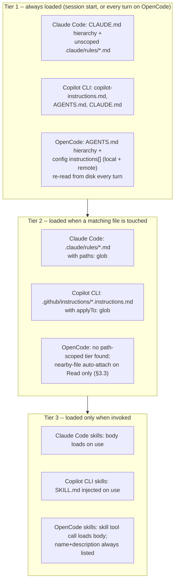
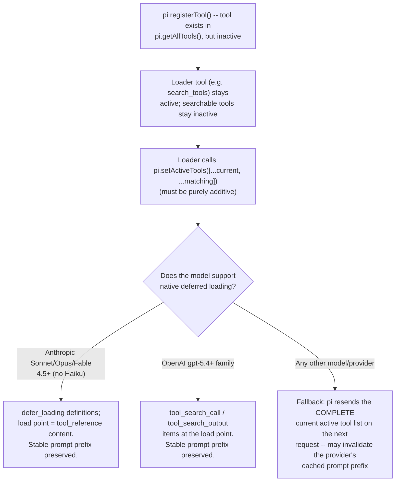
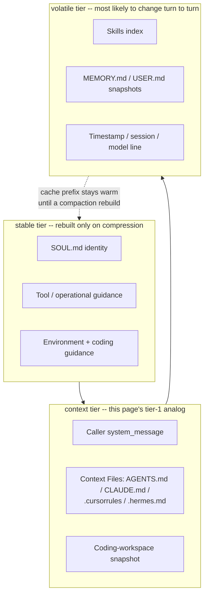
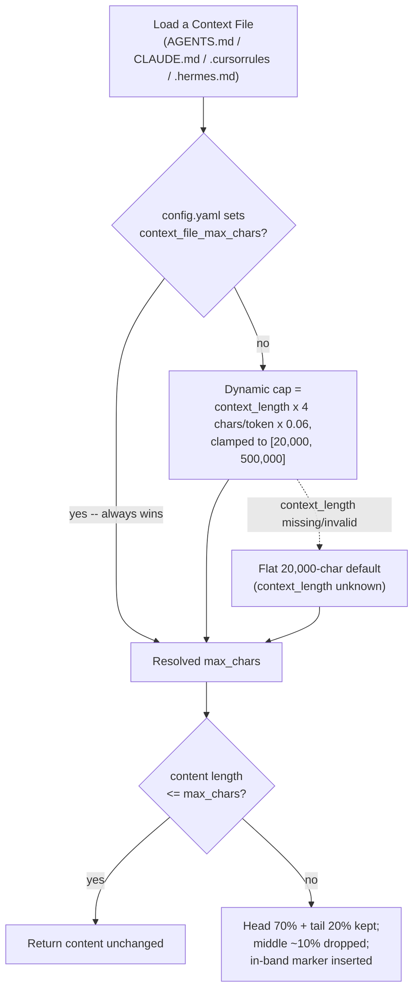
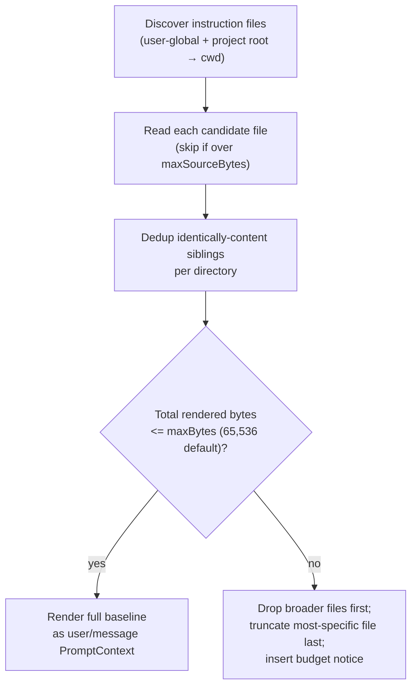

# Instruction context budget -- splitting and scoping instruction files

How to stop a single instruction file (`CLAUDE.md`,
`.github/copilot-instructions.md`) from growing without bound, using the
mechanisms each harness actually ships: modular files, path-scoped
loading, on-demand skills, exclusion, and the surfaces that let you
*measure* what loaded.

Every claim below is tagged VERIFIED (fetched this session from the
named source) or BEST CURRENT UNDERSTANDING, UNCONFIRMED. Sources and
fetch dates at the bottom. Claude Code, Copilot CLI, OpenCode, pi, and
Hermes Agent are separate products from separate organizations --
nothing confirmed for one is assumed for another. Section 3 (OpenCode)
was added 2026-08-24, closing a real gap: this page originally covered
only two of the book's three target harnesses. Section 4 (pi) was
added 2026-09-01, extending the same tiered analysis to the fourth
harness this book documents. Section 5 (Hermes Agent) was added the
same day, extending the analysis to a fifth harness this book
documents as a harness of general interest (not one of this project's
own three deploy targets, see [index.md](index.md)) -- unlike this
page's other four sections, §5 is source-verified directly from
Hermes' own repository code rather than from its public docs site.

**Companion page:** [memory-management.md](memory-management.md) covers
the same file hierarchies from the *persistence* angle (load order,
agent-authored memory, what survives compaction). This page is about
token cost. The one overlap worth restating up front: on Claude Code the
lazily-loaded tier is exactly the tier that does **not** come back after
compaction; OpenCode's own re-read behavior (§3.1) is a genuinely
different shape from either closed-source harness's, source-verified
this session.

**The one-line answer.** All three harnesses have a genuine multi-tier
shape -- (1) always loaded at session start, (2) loaded when a matching
file is touched, (3) loaded only when invoked -- though OpenCode's own
tier 1 is architecturally different from the other two in one important
way (§3.1): it is re-read from disk on every turn, not frozen at session
start. On Claude Code and Copilot CLI, `@`-style imports belong to tier
1, so splitting a big file into imports buys you *organization and
nothing else*; OpenCode has no import-expansion mechanism of its own to
make the same mistake with (§3.2). The real levers on Claude Code and
Copilot CLI are path-scoped instruction files (`.claude/rules/` with
`paths:` on Claude Code, `.github/instructions/*.instructions.md` with
`applyTo:` on Copilot CLI) and skills; OpenCode has no documented
path-scoped instruction tier at all (§3.2), leaving skills as its only
lazy-loading lever.



---

## 1. Claude Code

Sources for this section: `code.claude.com/docs/en/memory` and
`code.claude.com/docs/en/skills`, both fetched 2026-07-30. VERIFIED
unless a claim is tagged otherwise.

### 1.1 The trap: imports do not save context

The docs say this twice, unambiguously. Under "Write effective
instructions": "You can also split content into imports for
organization, though imported files still load and enter the context
window at launch." And in troubleshooting, under "My CLAUDE.md is too
large": "Splitting into `@path` imports helps organization but doesn't
reduce context, since imported files load at launch."

Related facts that set the budget:

- **Stated size target: "target under 200 lines per CLAUDE.md file.
  Longer files consume more context and reduce adherence."** There is no
  hard limit -- "CLAUDE.md files are loaded in full regardless of
  length, though shorter files produce better adherence." (Contrast the
  auto-memory index `MEMORY.md`, which *is* hard-capped at 200 lines /
  25KB.)
- Every `CLAUDE.md` and `CLAUDE.local.md` in the directory hierarchy
  **above** cwd is "loaded in full at launch," concatenated rather than
  overriding. So in a monorepo your budget is the sum of every ancestor
  file, not just yours.
- Delivery mechanism: "CLAUDE.md content is delivered as a user message
  after the system prompt, not as part of the system prompt itself."

### 1.2 Tier 2a -- `.claude/rules/` with `paths:` frontmatter

This is the primary documented answer to your question. Put topic files
in `.claude/rules/`; all `.md` files are discovered **recursively**, so
`rules/frontend/`, `rules/backend/` etc. work.

- **Without** `paths:` frontmatter, a rule is "loaded at launch with the
  same priority as `.claude/CLAUDE.md`" -- i.e. it is still tier 1. You
  have gained modularity, not context.
- **With** `paths:` (a glob list), the rule "only load[s] into context
  when Claude works with matching files, reducing noise and saving
  context space," and specifically: "Path-scoped rules trigger when
  Claude reads files matching the pattern, **not on every tool use**."

Documented glob semantics and the sharp edges:

| Pattern | Matches |
|---|---|
| `**/*.ts` | All TypeScript files in any directory |
| `src/**/*` | All files under `src/` |
| `*.md` | Markdown files in the project root |
| `src/components/*.tsx` | React components in a specific directory |

- Brace expansion is supported (`"src/**/*.{ts,tsx}"`), but a rule's
  whole `paths` list shares **one budget of 1,000 expanded patterns and
  4 MiB**; patterns without braces don't count. A pattern that would
  exceed the budget is used *unexpanded*, and "its literal braces match
  no files" -- a silently dead rule. (Before v2.1.217 an over-large
  `paths` value "stalled or crashed the CLI at startup.")
- A `[` that can't be parsed as a bracket expression makes the pattern
  invalid: it "matches nothing, and the rule's other patterns keep
  working." Escape a literal one as `photos \[2024/**`. Before v2.1.207
  a single invalid pattern "made the Read tool fail for every file the
  rule was evaluated against."
- Symlinks are supported both ways: `.claude/rules/` entries may be
  symlinks (circular links "detected and handled gracefully"), which is
  the documented way to share one rule set across projects; and as of
  v2.1.198 `paths:` matching also works when Claude reaches a file
  through a symlinked path into the project.
- `~/.claude/rules/` is the user-level equivalent, "loaded before
  project rules, giving project rules higher priority."
- Project rules are skipped if you exclude `project` from
  `--setting-sources`; before v2.1.211, on-demand rules loaded anyway.

### 1.3 Tier 2b -- nested `CLAUDE.md` in subdirectories

"Claude also discovers `CLAUDE.md` and `CLAUDE.local.md` files in
subdirectories under your current working directory. Instead of loading
them at launch, they are included when Claude reads files in those
subdirectories." So a per-package `CLAUDE.md` in a monorepo is already
lazy by construction -- no frontmatter needed. The docs point at
`/docs/en/large-codebases` for the full monorepo layout (not fetched
this session).

### 1.4 Tier 3 -- skills, the cheapest place to put procedures

The skills page states the economics directly: "Unlike CLAUDE.md
content, a skill's body loads only when it's used, so long reference
material costs almost nothing until you need it." And the docs give you
the decision rule for *when* to reach for which tier, in `memory`'s
"When to add to CLAUDE.md": "Keep it to facts Claude should hold in
every session: build commands, conventions, project layout, 'always do
X' rules. If an entry is a multi-step procedure or only matters for one
part of the codebase, move it to a skill or a path-scoped rule
instead." A Note in the rules section draws the same line from the other
end: "Rules load into context every session or when matching files are
opened. For task-specific instructions that don't need to be in context
all the time, use skills instead."

The loading table, verbatim in substance:

| Frontmatter | You can invoke | Claude can invoke | When loaded into context |
|---|---|---|---|
| (default) | Yes | Yes | Description always in context, full skill loads when invoked |
| `disable-model-invocation: true` | Yes | No | **Description not in context**, full skill loads when you invoke |
| `user-invocable: false` | No | Yes | Description always in context, full skill loads when invoked |

Practical consequences for budgeting:

- The recurring always-on cost of a skill is its **description**, and
  "the combined `description` and `when_to_use` text is truncated at
  1,536 characters in the skill listing to reduce context usage." Many
  skills with long descriptions is itself a tier-1 cost.
- `disable-model-invocation: true` removes even that -- the one
  documented way to make a body of instructions cost *zero* until you
  type `/name`.
- Skills also accept a **`paths:` frontmatter field**: "Glob patterns
  that limit when this skill is activated... Claude loads the skill
  automatically only when working with files matching the patterns.
  Uses the same format as path-specific rules."
- Once loaded, a skill's content "stays in context across turns, so
  every line is a recurring token cost." Keep the body short and push
  detail into supporting files: "Large reference docs, API
  specifications, or example collections don't need to load into context
  every time the skill runs." Reference them from `SKILL.md` so Claude
  knows when to read them.
- Re-invoking a skill whose rendered content is unchanged adds "a short
  note that the skill is already loaded rather than a second copy"
  (v2.1.202+).
- Nested `.claude/skills/` below cwd "aren't loaded at startup. They
  load the first time Claude reads or edits a file inside that
  subdirectory" -- the same lazy pattern as nested `CLAUDE.md`.

### 1.5 Trimming levers on the tier-1 file itself

- **`claudeMdExcludes`** -- glob patterns matched against absolute
  paths, configurable at any settings layer (arrays merge across
  layers), for skipping other teams' ancestor files in a monorepo:
  e.g. `["**/monorepo/CLAUDE.md", "/home/user/monorepo/other-team/.claude/rules/**"]`.
  Managed-policy CLAUDE.md cannot be excluded.
- **Block-level HTML comments are free.** "Block-level HTML comments
  (`<!-- maintainer notes -->`) in CLAUDE.md files are stripped before
  the content is injected into Claude's context. Use them to leave notes
  for human maintainers without spending context tokens on them."
  Comments inside code blocks are preserved.
- **`/doctor` proposes trims** (requires v2.1.206+): "it cuts content
  Claude can derive from the codebase, such as directory layouts,
  dependency lists, and architecture overviews, and keeps pitfalls,
  rationale, and conventions that differ from tool defaults." That is a
  useful editorial heuristic even if you never run it: anything the
  agent could read off the filesystem does not need to be in tier 1.
- `--add-dir` directories contribute no memory files unless
  `CLAUDE_CODE_ADDITIONAL_DIRECTORIES_CLAUDE_MD=1`; with it set, that
  directory's `CLAUDE.md`, `.claude/CLAUDE.md`, `.claude/rules/*.md` and
  `CLAUDE.local.md` all load. Skills are the documented exception --
  `.claude/skills/` inside an added directory is loaded automatically.

### 1.6 Measuring what actually loaded

- **`/context`** -- the authoritative check: "To confirm the file
  loaded, run `/context` in a session and check the list under **Memory
  files**." Also: "To check which files actually loaded into the current
  session, run `/context`."
- **`InstructionsLoaded` hook** -- "log exactly which instruction files
  are loaded, when they load, and why. This is useful for debugging
  path-specific rules or lazy-loaded files in subdirectories." This is
  the deterministic, machine-readable probe.
- **`/memory`** lists CLAUDE.md / CLAUDE.local.md / auto-memory
  locations (including ones that don't exist yet) -- inventory, not
  proof of loading.

### 1.7 The cost of laziness

Per the compaction table in
[memory-management.md](memory-management.md) §1.7 (sourced from
`code.claude.com/docs/en/context-window`): project-root CLAUDE.md and
unscoped rules are **re-injected from disk** after compaction, while
rules with `paths:` frontmatter and nested subdirectory CLAUDE.md are
**lost until a matching file is read again**. Invoked skill bodies are
re-attached but capped at 5,000 tokens each and 25,000 total, most-recent
first. So every token you move out of tier 1 is also a token that may
silently stop applying mid-session. Budget accordingly: invariants that
must never lapse stay in tier 1 even if they cost tokens.

---

## 2. GitHub Copilot CLI

Sources for this section: `docs.github.com/en/copilot/concepts/response-customization`,
`docs.github.com/en/copilot/how-tos/configure-custom-instructions/add-repository-instructions`,
`docs.github.com/en/copilot/how-tos/copilot-cli/customize-copilot/add-skills`,
`docs.github.com/en/copilot/concepts/agents/about-agent-skills`, and
`github.com/github/copilot-cli` `changelog.md`, all fetched 2026-07-30.
VERIFIED unless tagged otherwise.

### 2.1 What files exist to split into

The CLI reads (per the CLI docs, cited in
[memory-management.md](memory-management.md) §2.1):
`.github/copilot-instructions.md` (repository-wide),
`.github/instructions/**/*.instructions.md` (path-specific), and
`AGENTS.md`. Its own changelog adds `CLAUDE.md` (read and
`@`-import-expanded, v1.0.66) and user-level
`~/.copilot/instructions/**/*.instructions.md` (v1.0.61 `/help` entry).
`COPILOT_CUSTOM_INSTRUCTIONS_DIRS` is a further, changelog-only
mechanism for pointing at instruction directories (v1.0.6 fix entry
naming it).

Discovery is hierarchical like Claude Code's: "Custom instructions, MCP
servers, skills, and agents are now discovered at every directory level
from the working directory up to the git root, enabling full monorepo
support" (v1.0.11). Files are **combined**: "Combine all custom
instruction files instead of using priority-based fallbacks" (v0.0.385)
-- so, as on Claude Code, ancestors add up rather than override.
(Precedence *ordering* for the CLI specifically remains UNCONFIRMED --
see [memory-management.md](memory-management.md) §2.1 for why the
`response-customization` precedence list can't be applied to the CLI.)

Two dedup behaviors reduce accidental double-billing: "Deduplicate
identical model instruction files to save context" (v0.0.394) and "Avoid
sending duplicate custom instruction files (e.g.
copilot-instructions.md and CLAUDE.md with identical content) to reduce
wasted tokens per turn" (v1.0.26). Also, "Custom agent instructions are
no longer duplicated each turn, reducing context window usage"
(v1.0.60).

`@`-style imports exist here too (v1.0.66). BEST CURRENT
UNDERSTANDING, UNCONFIRMED: as on Claude Code they are an organization
mechanism whose expansion still enters context -- the changelog says
"expand," which implies inlining, but no Copilot source I fetched states
the token consequence either way. Do not assume imports save context
here.

### 2.2 The scoping mechanism: `applyTo:` frontmatter

Per `add-repository-instructions`, authoritative for the file format:
path-specific instruction files "must be named `NAME.instructions.md`"
and live in `.github/instructions` or below it, and each needs a
frontmatter block with the `applyTo` keyword using glob syntax:

```markdown
---
applyTo: "app/models/**/*.rb"
---
```

Documented glob semantics: `*` matches files in the current directory;
`**` or `**/*` matches all files in all directories; `*.py` is
current-directory-only; `**/*.py` is recursive; `src/*.py` is direct
children of `src/` only; `src/**/*.py` is recursive within `src/`;
`**/subdir/**/*.py` matches any `subdir` at any depth. "You can specify
multiple patterns by separating them with commas." The purpose sentence
is the same as Claude Code's: "By using path-specific instructions you
can avoid overloading your repository-wide instructions with information
that only applies to files of certain types, or in certain directories."

**Grounding boundary worth knowing.** That same page says "Currently, on
GitHub.com, path-specific custom instructions are only supported for
Copilot cloud agent and Copilot code review." That sentence is scoped to
GitHub.com and does **not** describe the CLI. The CLI's own changelog is
what confirms CLI support, and it also tells you the CLI treats them as
a lazy tier:

- "Pattern-specific instruction files (`.github/instructions/*.instructions.md`)
  no longer include their full body in the system prompt on every
  session" (v1.0.35).
- "Instruction files with specific `applyTo` patterns are consolidated
  into a table instead of inlining full content, reducing context window
  usage" (v1.0.26).

That second entry is the mechanically interesting one: the always-on
cost of a scoped Copilot instruction file is a *table row*, not its
body -- structurally analogous to a Claude Code skill's description, and
it means the model is told the file exists and when it applies before
deciding to pull it in. BEST CURRENT UNDERSTANDING, UNCONFIRMED: what
exactly triggers the full body being loaded (a file read, a model
decision, an embedding match) is not documented on any page I fetched;
the changelog states the consolidation, not the retrieval trigger.

Frontmatter details from the changelog: `applyTo` "accepts both string
and array values" (v1.0.6), and unquoted glob patterns
(`applyTo: **/*.ts`) "are now applied correctly" as of v1.0.48 -- quote
your patterns if you may be on an older build. Instruction files inside
`.gitignore`d directories load correctly as of v1.0.36, and instruction
filenames are "recognized regardless of casing" (v0.0.x era entry).

### 2.3 Tier 3 -- skills

Copilot CLI has an on-demand tier too. Per the CLI's own add-skills
page: "When Copilot chooses to use a skill, the `SKILL.md` file will be
injected in the agent's context" -- i.e. injection at use time, not
session start. Locations, per the same page: project skills in
`.github/skills`, `.claude/skills`, or `.agents/skills`; personal skills
in `~/.copilot/skills` or `~/.agents/skills`. Invocation is by
`/skill-name` in a prompt. The concepts page describes skills as
"folders of instructions, scripts, and resources that Copilot can load
when relevant."

Note that `.claude/skills` in that list is a fact about **Copilot CLI's
own** discovery paths, from GitHub's docs -- not an inference from
Claude Code's docs. It happens to make skills the one tier a single
on-disk location can serve for both harnesses.

Neither Copilot page I fetched states the token cost of the
always-present part of a skill (whether a name/description listing is
injected each session, and how large). That is **UNKNOWN** -- do not
assume Claude Code's "description always in context" model applies.
Two adjacent changelog facts: "Skill content injected to the model no
longer includes YAML frontmatter metadata" (v1.0.48), and there is an
experimental retrieval path -- "Add experimental embedding-based dynamic
retrieval of MCP and skill instructions per turn" (v1.0.5), later
persisted as a `dynamicRetrieval` setting with a
`--dynamic-retrieval skills=<on|off>` flag (v1.0.66). That is a
genuinely different lever from anything documented for Claude Code:
per-turn embedding retrieval of instruction text rather than
glob-triggered loading.

### 2.4 Measuring and toggling

- **`/context`** -- "separates Custom Instructions from the system
  prompt and cross-references per-server MCP tool token costs with
  `/mcp`" (v1.0.60). So instruction cost is itemized separately from the
  system prompt here, which is exactly the number you want when
  trimming.
- **`/env`** -- "show loaded environment details (instructions, MCP
  servers, skills, agents, plugins)" (v1.0.25).
- **`/instructions`** -- "view and toggle custom instruction files"
  (v0.0.x), with "individual instruction file names in `/instructions`
  picker with `[external]` labels for injected files" (v1.0.4).
  Toggling is a real budget lever, not just an inspector.
- `/skills list`, `/skills info`, `/skills reload`, and a `/skills`
  toggle picker (add-skills page).

---

## 3. OpenCode

Sources for this section: `opencode.ai/docs/rules/` (the rendered docs
page) cross-checked against its own Markdown source,
`packages/web/src/content/docs/rules.mdx`, and its skills-tier
counterpart `packages/web/src/content/docs/skills.mdx`, both fetched via
`gh api` from `github.com/anomalyco/opencode`, `dev` branch, 2026-08-24;
deepened with the actual loader source,
`packages/opencode/src/session/instruction.ts` and the calling site in
`packages/opencode/src/session/prompt.ts`, same repo/branch/date. VERIFIED
unless tagged otherwise, with the standing `dev`-branch caveat this book
applies everywhere it cites OpenCode source directly.

### 3.1 The trap does not apply the same way: tier 1 is re-read every turn, not frozen at session start

OpenCode's own instruction-loading module, `Instruction.system()`,
is called once per iteration of the main session loop in
`prompt.ts` -- a `while (true)` turn loop (`let step = 0` before it,
incrementing per iteration) that also drives tool dispatch and the
per-turn system-prompt assembly `[env, instructions, mcpInstructions,
skills]`. `Instruction.system()` itself does a fresh
`fs.readFileString()` of every discovered instruction-file path on each
call, with no caching layer visible in the source read this session.
**This is a materially different architecture from both other harnesses
documented above:** Claude Code's tier 1 is a session-start read with no
documented hot-reload (§1.8, cross-referenced, not repeated), and
Copilot CLI's reload behavior is explicitly undocumented (§2.4). On
OpenCode, editing `AGENTS.md` mid-session takes effect on the *very next
turn* -- a real, source-verified, positive answer to a question the
other two harnesses' own docs leave open. This is a genuinely new
finding for this book, not previously documented in
[memory-management.md](memory-management.md) either.

### 3.2 What tier 1 actually contains, and the absence of a path-scoped tier

Per `rules.mdx` (VERIFIED): OpenCode's tier-1 instruction surface is an
`AGENTS.md` file, initialized via the `/init` slash command (which scans
the repo and writes build/lint/test commands, architecture notes, and
project conventions) or authored by hand. It is discovered from
**multiple locations that serve different purposes**, not merged
arbitrarily:

- **Project**: `AGENTS.md` in the project root, applying only to that
  directory and its subdirectories.
- **Global**: `~/.config/opencode/AGENTS.md`, applied across every
  OpenCode session on the machine, explicitly recommended for personal
  (not team-shared) rules since it is not committed to Git.
- **Claude Code compatibility, as a fallback only**: project-level
  `CLAUDE.md` (used only if no `AGENTS.md` exists) and global
  `~/.claude/CLAUDE.md` (used only if no `~/.config/opencode/AGENTS.md`
  exists), disableable via `OPENCODE_DISABLE_CLAUDE_CODE`,
  `OPENCODE_DISABLE_CLAUDE_CODE_PROMPT`, or
  `OPENCODE_DISABLE_CLAUDE_CODE_SKILLS`.

VERIFIED, docs-stated precedence: "the first matching file wins in each
category" -- if both `AGENTS.md` and `CLAUDE.md` exist at the same
level, only `AGENTS.md` loads; the global `~/.config/opencode/AGENTS.md`
takes precedence over the Claude-compat global fallback. Source-verified
addition not stated on the docs page fetched: the loader
(`instruction.ts`) also recognizes a third, explicitly **deprecated**
filename, `CONTEXT.md`, in the same precedence slot as `AGENTS.md`/
`CLAUDE.md` -- a docs/source gap worth flagging rather than silently
reconciling.

A **separate, additive** mechanism -- not a replacement for the file
hierarchy above -- is the `instructions` array in `opencode.json`
(project) or the global config file, letting a team point at existing
rule files instead of duplicating them into `AGENTS.md`: local paths
(supporting glob patterns, e.g. `"packages/*/AGENTS.md"`) and remote
`https://`/`http://` URLs, source-verified as fetched with a hard
**5-second timeout** (`Effect.timeout(5000)`) and silently degrading to
empty content on failure rather than blocking the turn. VERIFIED (docs):
"All instruction files are combined with your `AGENTS.md` files" -- i.e.
this is an additive tier-1 mechanism, not a per-path-scoped one.

**No path-scoped (tier-2) instruction tier was found.** Neither
`rules.mdx` nor a `search/code` sweep of the docs tree for `applyTo`- or
`paths:`-style scoping syntax this session turned up anything resembling
Claude Code's `.claude/rules/` + `paths:` or Copilot CLI's
`.github/instructions/*.instructions.md` + `applyTo:`. This is UNCONFIRMED-as-absent
(not found in the sources fetched this session), not proven impossible,
but it means OpenCode's own documented answer to "how do I scope
instructions to a subset of files without paying for them everywhere"
is currently just the invoke-only skills tier below, not a middle tier.

### 3.3 A nearby-instruction-file auto-attach mechanism, source-verified, distinct from tier 1 and tier 3

`instruction.ts` exposes a second function, `resolve()`, called when the
model reads a file via the `read` tool: it walks upward from that file's
directory (bounded at the project root) looking for the nearest
`AGENTS.md`/`CLAUDE.md`/`CONTEXT.md` not already surfaced as part of
tier 1 or already attached to that same assistant message (tracked via a
per-message `claims` set, keyed off a helper, `extract()`, that scans
prior completed `read`-tool message parts for a `metadata.loaded` path
list). Any such file found is attached to that turn's context as
`Instructions from: <path>\n<content>`. This is architecturally the
closest OpenCode comes to Claude Code's own **nested-CLAUDE.md-loads-on-
first-read-of-that-subdirectory** behavior (cross-referenced, not
repeated, from Claude Code's own tier documented above) -- a real,
source-verified, per-message-deduplicated auto-attach mechanism, not a
docs-stated feature. BEST CURRENT UNDERSTANDING, UNCONFIRMED: whether
this mechanism is described anywhere in OpenCode's own public docs (it
was not found on `rules.mdx`) -- it currently exists only as a
source-verified implementation detail.

### 3.4 Tier 3 -- skills

VERIFIED (`skills.mdx`): OpenCode's invoke-only tier is the native
`skill` tool. Every discovered `SKILL.md`'s `name` and `description`
(1-1024 characters, frontmatter-only) is always listed in the tool's own
description as an `<available_skills>` block -- structurally the same
"index entry always resident, body loads on demand" shape both Claude
Code's and Copilot CLI's own skills tiers use above -- and the full body
loads only when the model calls `skill({ name: "..." })`. Discovery
walks the same project-root-to-worktree path as `AGENTS.md` (§3.2) for
`.opencode/skills/`, plus Claude-compatible (`.claude/skills/`) and a
third, `agents`-branded (`.agents/skills/`) convention at both project
and global scope, and per-skill/per-agent-pattern `allow`/`ask`/`deny`
permission gating (a `deny`d skill is omitted from `<available_skills>`
entirely, so a denied skill costs nothing, not even its index-entry
tokens -- a stricter budget guarantee than either closed-source
harness's own visibility controls document).

### 3.5 Measuring and toggling

No dedicated context-inspection command (an OpenCode analogue to Claude
Code's `/context` or Copilot CLI's `/context`/`/env`/`/instructions`)
was found in the docs pages fetched this session. This is
UNCONFIRMED-as-absent, not proven absent -- OpenCode's TUI is known
(per [tui-cli-application-architecture.md](tui-cli-application-architecture.md))
to expose a live token/cost footer, but this page found no dedicated
instruction-budget breakdown surface to cite alongside it.

---

## 4. pi

Sources for this section: VERIFIED, fetched 1 September 2026 directly from
`github.com/earendil-works/pi`, `main` branch, both docs and TypeScript source --
`packages/coding-agent/docs/usage.md` (context-file locations and precedence),
`settings.md` (confirmed no context/system-prompt keys live there), `extensions.md`
(Dynamic Tool Loading section, in full) -- cross-checked against
`packages/coding-agent/src/core/system-prompt.ts`, `resource-loader.ts`,
`agent-session.ts`, `agent-session-services.ts`, `skills.ts`, `slash-commands.ts`,
`tools/read.ts`, `tools/tool-definition-wrapper.ts`, and `defaults.ts`. Unlike this
page's Claude Code and Copilot CLI sections (docs-only) this pi section is
source-verified in the same sense §3's OpenCode section is: the claims below are
read off pi's own implementation, not inferred from documentation prose alone.

### 4.1 One monorepo, two real packages -- both spellings elsewhere in this book are correct

This book has cited pi as both `@earendil-works/pi-ai` (in
[llm-api-contract.md](llm-api-contract.md) §3.5) and `@earendil-works/pi-coding-agent`
(in [deterministic-orchestration.md](deterministic-orchestration.md),
[session-persistence.md](session-persistence.md)). Fetched directly this session,
`packages/coding-agent/package.json` and `packages/ai/package.json` in
`github.com/earendil-works/pi` (`main` branch) confirm these are **two distinct,
separately versioned npm packages living side by side in one monorepo**, not a
naming error to reconcile: `@earendil-works/pi-coding-agent` (`"description": "Coding
agent CLI with read, bash, edit, write tools and session management"`, `"bin": {"pi":
"dist/bundle/cli.js"}`) is the harness itself -- the subject of this section --
while `@earendil-works/pi-ai` (`"description": "Unified LLM API with automatic model
discovery and provider configuration"`) is the underlying multi-provider wire-protocol
library the coding agent depends on, documented from the API-shape angle in
[llm-api-contract.md](llm-api-contract.md) §3.5. Both packages currently ship at the
same version number (`0.84.4` as fetched), which is presumably why the book's earlier
pages cite whichever package name was locally relevant without contradiction. One
further, source-only wrinkle worth flagging: `compaction.md`'s own in-repo doc links
still point at `github.com/earendil-works/pi-mono`, an evident holdover from a prior
repository name -- `gh api repos/earendil-works/pi-mono` and `gh api
repos/earendil-works/pi` both resolve to the identical `full_name: "earendil-works/pi"`
this session, confirming `pi-mono` is a stale in-doc link to a renamed repository, not
a second, separate codebase.

### 4.2 Tier 1: the `AGENTS.md`/`CLAUDE.md` context-file hierarchy, read once at session start or on `/reload`

VERIFIED from `resource-loader.ts`'s `loadContextFileFromDir()`/`loadProjectContextFiles()`
functions and `usage.md`: pi discovers, in order, a **global** context file at
`~/.pi/agent/AGENTS.md` (the agent directory, `getAgentDir()`), then walks from the
project root's parent chain down to the current working directory collecting one
context file per directory, unshifting each into an ancestor-ordered list so the
final prompt sees outermost-first, cwd-last. Per directory, the first matching
filename from a fixed candidate list wins: `AGENTS.override.md`, `AGENTS.md`,
`AGENTS.MD`, `CLAUDE.md`, `CLAUDE.MD` -- so, like OpenCode's own precedence rule
(§3.2), an `AGENTS.override.md` or `AGENTS.md` in a directory silently supersedes a
`CLAUDE.md` there rather than both loading. A dedicated `findShadowedContextFile()`
helper additionally suppresses double-loading a linked Git worktree's own copy of the
same logical repository-scoped file when the worktree is nested under its main repo's
root (resolved via realpath, to handle a symlinked `/tmp`-style cwd on macOS
correctly) -- a narrower, more surgical duplicate-prevention rule than either other
harness documents for its own worktree handling.

Two behaviors distinguish this tier from all three other harnesses' own tier 1,
source-verified this session:

- **No stated size guidance was found.** Neither `usage.md` nor any other doc page
  fetched this session states an equivalent of Claude Code's "target under 200 lines"
  (§1.1) for `AGENTS.md`/`CLAUDE.md`.
- **Read once, not per-turn, and not automatically hot-reloaded.** `loadProjectContextFiles()`
  is invoked from `DefaultResourceLoader.reload()`, which the constructor calls once
  during session bootstrap (`agent-session-services.ts`) and which is otherwise only
  re-invoked by an explicit `/reload` slash command -- documented verbatim in
  `slash-commands.ts` as: **"Reload keybindings, extensions, skills, prompts, themes,
  and context files."** This places pi structurally with Claude Code's own
  session-start-read-with-no-documented-hot-reload posture (§1.1), the exact opposite
  of OpenCode's own finding in this page (§3.1) that `Instruction.system()` does a
  fresh disk read on *every* turn with no caching. Editing an `AGENTS.md` mid-session
  on pi therefore has no effect until the user explicitly runs `/reload` (or an
  extension calls the equivalent `ctx.reload()` API, which emits a `session_start`
  event with `reason: "reload"`).
- `--no-context-files` (short flag `-nc`) disables this tier entirely for the session,
  the pi analog of a kill switch rather than a per-directory exclusion glob.

### 4.3 System prompt shape: a small fixed template, not an embedded corpus

VERIFIED directly from `buildSystemPrompt()` in `system-prompt.ts`: absent a full
override (§4.3's next paragraph), pi's default system prompt is a short, fixed
template -- one opening sentence ("You are an expert coding assistant operating inside
pi, a coding agent harness. You help users by reading files, executing commands,
editing code, and writing new files."), an **`Available tools`** section, a
**`Guidelines`** section, a fixed block of pointers to pi's own documentation paths
(read only when the user asks about pi itself), and finally the working directory.
Two things keep this tier lean by construction rather than by editorial discipline
after the fact:

- **A tool only appears in `Available tools` if the caller supplied a one-line
  `toolSnippets` entry for it** -- `visibleTools = tools.filter((name) =>
  !!toolSnippets?.[name])`. A registered, active tool with no snippet is *silently
  omitted from that listing* even though its full JSON-schema definition is still
  sent to the model as a callable tool (§4.4) -- the system-prompt text and the
  tool-schema payload are two independent budgets in pi's own architecture, not one.
- **Guidelines are conditionally assembled and deduplicated** via a `Set`-backed
  `addGuideline()` helper: file-exploration guidance is only added when the active
  tool set actually lacks `grep`/`find`/`ls` (so a project running with those tools
  active never pays for the "use bash for ls/rg/find" bullet), caller-supplied
  `promptGuidelines` are trimmed and deduped against the fixed always-included pair
  ("Be concise in your responses", "Show file paths clearly when working with
  files"), so no guideline line is ever duplicated regardless of how many tools
  contribute one.

**Two escape hatches replace the whole template rather than trimming it.** Source-verified
from `discoverSystemPromptFile()`/`discoverAppendSystemPromptFile()` in
`resource-loader.ts`: a project-level `.pi/SYSTEM.md` (requires
`settingsManager.isProjectTrusted()`, tying full system-prompt replacement to the same
project-trust gate [permissions-and-sandboxing.md](permissions-and-sandboxing.md)
documents for pi's sandboxing posture) or a global `~/.pi/agent/SYSTEM.md` **replaces**
the entire default template above; a sibling `APPEND_SYSTEM.md` at either scope
(same project-trust gate for the project variant) is concatenated onto whichever
system prompt is in effect instead of replacing it. Project takes precedence over
global at each pair. Notably, this same explicit trust gate does **not** appear
anywhere in `loadProjectContextFiles()` itself in the source read this session -- so
an untrusted project's `AGENTS.md`/`CLAUDE.md` content still loads into tier 1 as
ordinary "project context," while only a full or partial *system-prompt replacement*
from that same untrusted project is withheld. That is a real, source-verified
asymmetry worth flagging rather than assuming symmetric trust-gating across every
project-supplied instruction surface.

### 4.4 Tool-schema footprint: four default tools, one-line schema descriptions throughout

VERIFIED from `defaults.ts`, `agent-session.ts`, and the individual tool source files
(`tools/read.ts` inspected directly): pi's **default active tool set is exactly
four tools -- `read`, `bash`, `edit`, `write`** (`defaultActiveToolNames` in
`agent-session.ts`, matching the JSDoc default documented directly in
`BuildSystemPromptOptions`). Additional built-in tools (`find`, `grep`, `ls`,
`powershell`) exist in `src/core/tools/` but are not part of that default set and
must be explicitly activated. Each tool's JSON-schema is built with `typebox`
(`Type.Object({...})`), and the field-level descriptions are terse, one-line strings
-- e.g. `read`'s schema: `path: Type.String({ description: "Path to the file to read
(relative or absolute)" })`, `offset`/`limit` similarly one-clause each -- with the
tool's own system-prompt snippet equally terse (`readToolSystemPromptContribution.snippet
= "Read file contents"`). No MCP (Model Context Protocol) server integration is named
anywhere in the docs or source read this session for pi specifically; this is a
negative finding scoped to the sources fetched this session, not proof MCP support
does not exist elsewhere in the codebase.

### 4.5 A genuinely distinct lazy/deferred-schema mechanism: `pi.registerTool()` + `pi.setActiveTools()`

This is pi's own, source-and-docs-verified answer to "does this harness defer tool
schemas the way a skill defers its body." VERIFIED, quoted verbatim from
`extensions.md`'s "Dynamic Tool Loading" section: an extension can **"register many
tools while keeping only a small initial set active. A tool can then add more tools
with `pi.setActiveTools()` during execution. Pi detects purely additive changes,
records the newly available tool names on that tool result, and applies the updated
active set before the next model request."** Critically, the mechanism branches on
the *provider's own* capability, not just pi's own logic:



Per this same source: "This works with every model. Models with native
deferred-loading support preserve the stable prompt prefix and load the new
definitions at the tool-result position. Other models use the fallback described
below." The native path is named precisely for two model families -- **Anthropic**
("Models: Sonnet, Opus, Fable version 4.5 or newer (without Haiku)"; native
representation: "Deferred definitions use `defer_loading`; the load point uses
`tool_reference` content") and **OpenAI** ("Models: `gpt-5.4` and newer family"; "Pi
adds completed client `tool_search_call` and `tool_search_output` items at the load
point") -- with a documented custom-provider escape hatch, `compat.supportsToolReferences:
true` (for `anthropic-messages`) or `compat.supportsToolSearch: true` (for
`openai-responses`/`openai-codex-responses`), left disabled unless the actual
endpoint accepts the corresponding native protocol. The fallback path is explicit
about its own cost: "Pi sends the complete current active tool list normally on the
next request. The model can call the newly activated tools, but adding their
definitions may invalidate the provider's cached prompt prefix" -- the same
prompt-cache-invalidation concern this book's own [caching.md](caching.md) documents
for each harness independently, here tied specifically to tool-set churn rather than
message-history churn. Tool *removals* (a non-additive change, e.g. replacing one
group of tools with another) always take the fallback path regardless of model --
deferred loading is documented as additive-only. One more caveat named directly:
"activating a tool with `promptSnippet` or `promptGuidelines` rebuilds the system
prompt; that system-prompt change can invalidate the prefix even when the provider
supports deferred schemas" -- so a lazily-activated tool that also wants a visible
`Available tools` line (§4.3) trades away part of the very cache benefit deferred
loading exists to preserve; the docs' own guidance is that "lazily loaded tools
should usually rely on their tool `description` and omit active-only prompt
metadata."

### 4.6 Skills: the same invoke-only tier, an XML index rather than JSON or a truncated string

VERIFIED from `skills.ts`'s `formatSkillsForPrompt()`: pi's skills tier follows the
same "index entry always resident, body loads on demand" shape as Claude Code (§1.4),
Copilot CLI (§2.3), and OpenCode (§3.4), but formats the always-resident index as XML
per the `agentskills.io` Agent Skills standard rather than a description-truncated
listing or a JSON tool-schema block: a `<available_skills>` element containing one
`<skill>` per non-`disable-model-invocation`-flagged skill, each with `<name>`,
`<description>`, and `<location>` (the skill's absolute file path) children, with the
model instructed to "Use the read tool to load a skill's file when the task matches
its description" -- i.e. pi's own skill body is not auto-injected on invocation the
way Claude Code's and Copilot CLI's own skill bodies are; the model must issue its
own `read` tool call against the listed `<location>` path, making the skill's body
cost identical to any other file the model chooses to read. Skills flagged
`disable-model-invocation: true` in frontmatter are omitted from `<available_skills>`
entirely (only invocable via an explicit `/skill:name`, cross-referenced from
[built-in-skills.md](built-in-skills.md)'s own deeper pi-skills coverage, not
repeated here) -- the same "denied/disabled costs nothing, not even an index entry"
property OpenCode's own `deny` permission provides (§3.4).

### 4.7 No path-scoped tier, and no nearby-file auto-attach on read -- a source-verified negative finding

Neither `usage.md` nor a review of `resource-loader.ts`/`agent-session.ts` this
session turned up anything resembling Claude Code's `paths:`-scoped rules (§1.2) or
Copilot CLI's `applyTo:`-scoped instruction files (§2.2). `tools/read.ts` does contain
a `COMPACT_RESOURCE_FILE_NAMES` constant listing the same five context-file names
from §4.2 (`AGENTS.override.md`, `AGENTS.md`, `AGENTS.MD`, `CLAUDE.md`, `CLAUDE.MD`),
but reading its actual use this session (`getCompactReadClassification()`) shows it
exists purely to pick a compact TUI display label ("resource" vs. "docs" vs. "skill")
for how a read of one of these files is rendered in the transcript -- it is **not**
a context-injection mechanism. This is the opposite finding from OpenCode's own
source-verified `Instruction.resolve()` (§3.3), which genuinely attaches a nearby
un-surfaced `AGENTS.md`/`CLAUDE.md` to context when the model reads a file in that
subdirectory. On pi, reading a subdirectory's own `AGENTS.md` via the `read` tool
contributes only that tool call's own result to context, exactly like reading any
other file -- there is no separate, silent attach step. Combined with §4.2's
ancestor-walk-only discovery (parent directories and cwd, never *descendant*
subdirectories the agent later navigates into), pi has neither a path-scoped tier nor
a lazy-by-descendant-location tier; skills (§4.6) are its only lever for scoping
instructions to a subset of tasks without paying for them everywhere.

### 4.8 Measuring and toggling

No dedicated context-inspection command comparable to Claude Code's `/context` or
Copilot CLI's `/context`/`/env`/`/instructions` was found in the slash-command list
read directly from `slash-commands.ts` this session. The closest analog is
`/session` (documented inline in source as **"Show session info and stats"**), but
nothing fetched this session confirms it itemizes *which* `AGENTS.md`/`CLAUDE.md`
files loaded the way Claude Code's `/context` **Memory files** list does --
**BEST CURRENT UNDERSTANDING, UNCONFIRMED** that `/session` surfaces per-file
instruction provenance rather than aggregate token/cost stats alone. The TUI's own
footer is documented (per `usage.md`) to display "token/cache usage, cost, context
usage, and current model" live during a session -- the practical, always-visible
substitute for a dedicated breakdown command, structurally similar to OpenCode's own
token-footer fallback (§3.5). `--no-context-files`/`-nc` (§4.2) is the one documented
toggle; no equivalent of Claude Code's `claudeMdExcludes` glob-based partial
exclusion was found. The `reserveTokens`/`keepRecentTokens` compaction budget that
governs how much of the window survives untouched once tier 1 plus conversation
history are loaded is covered in full in
[context-compression.md](context-compression.md) §4.6, not repeated here -- this
section is about what pi puts into context eagerly, not how it evicts what's already
there.

---

## 5. Hermes Agent (Nous Research)

Sources for this section: VERIFIED, fetched 1 September 2026 directly
from `github.com/NousResearch/hermes-agent`, `main` branch, via `gh
api`/`raw.githubusercontent.com` -- `agent/system_prompt.py`,
`agent/prompt_builder.py`, `agent/context_breakdown.py`,
`agent/context_engine.py`, `agent/context_compressor.py`,
`agent/native_compaction.py`, `agent/iteration_budget.py`,
`docs/micro-compaction.md`, and `cli-config.yaml.example`. Unlike this
book's other Hermes Agent sections (e.g.
[memory-management.md](memory-management.md) §5,
[built-in-skills.md](built-in-skills.md) §5), which are docs-only
(fetched from `hermes-agent.nousresearch.com/docs/`), this section is
source-verified in the same sense this page's own §3 (OpenCode) and §4
(pi) sections are: every claim below is read directly off Hermes' own
implementation, not inferred from documentation or marketing prose.

One grounding note worth stating plainly, since it bears on where this
section's primary source actually is: this section's research request
named the repository as `github.com/hrathod88/hermesagent`. That
repository returns HTTP 404 (`gh api repos/hrathod88/hermesagent`,
checked live this session) and does not exist under that owner. The
actual, canonical, MIT-licensed repository for the harness this book
already documents under the name "Hermes Agent" is
`github.com/NousResearch/hermes-agent` (confirmed live via `gh api
repos/NousResearch/hermes-agent`; its own `homepage` field points at
`hermes-agent.nousresearch.com`, matching the docs domain this book's
other Hermes sections already cite) -- the same product covered
docs-only elsewhere in this book, not a different or unrelated
project. This section treats that repository as the primary source and
does not use the nonexistent one named in the original request.

### 5.1 Three system-prompt cache tiers -- a cache-stability axis, not the lazy-load axis this page's tier-1/2/3 vocabulary otherwise asks about

VERIFIED directly from `agent/system_prompt.py`'s own module docstring
and its `build_system_prompt_parts()` function: Hermes assembles its
system prompt as three ordered string tiers, joined with a blank line,
and rebuilds that string **at most once per session** -- "built once
per session and reused across all turns — only context compression
triggers a rebuild... Hermes never re-renders parts of this string
mid-session — that's the only way to keep upstream prompt caches warm
across turns." The three tiers, quoted from the same docstring, are:

- **`stable`** -- identity (`SOUL.md` or a built-in default identity,
  per this book's own [memory-management.md](memory-management.md)
  §5.4), tool guidance, computer-use guidance, tool-use-enforcement and
  per-model operational guidance, environment hints, and coding
  guidance.
- **`context`** -- the caller-supplied `system_message` plus the
  Context Files this book's own memory-management.md §5.5 names
  (`AGENTS.md`, `CLAUDE.md`, `.cursorrules`, `.hermes.md`) discovered
  under the working directory, plus a coding-workspace snapshot.
- **`volatile`** -- the skills index, `MEMORY.md`/`USER.md` snapshots,
  an external memory-provider block, and a timestamp/session/model/
  provider line.



This answers a genuinely different question from the one this page's
tier-1/tier-2/tier-3 vocabulary asks of the other four harnesses.
Claude Code's, Copilot CLI's, OpenCode's, and pi's own tiers (§§1-4)
are about **when a piece of instruction text is loaded at all**
(session start vs. on-touch vs. on-invoke). Hermes' `stable`/`context`/
`volatile` split is instead about **how often a piece of already-loaded
text is allowed to change**, in service of provider prompt-cache
stability specifically -- the same cache-prefix concern this book's own
[caching.md](caching.md) documents each harness converging on in its
own way. Context Files -- the tier this page's own Claude Code and
Copilot CLI sections would call "tier 1" -- sit in the *middle* band on
Hermes' own axis, not the first (`stable`) or last (`volatile`) one,
because their content can legitimately change between sessions (a
project's `AGENTS.md` gets edited) but must not be treated as
turn-volatile the way a live memory snapshot is.

### 5.2 Context Files carry a source-verified, dynamically-scaled truncation cap, with the reconstruction instruction delivered directly into the model's own context

This is the sharpest, most literal answer this page has found anywhere
to its own opening question -- "how to stop a single instruction file
from growing without bound" -- because on Hermes it is not editorial
guidance at all, it is enforced in code. VERIFIED from
`agent/prompt_builder.py`'s own `CONTEXT_FILE_MAX_CHARS`,
`_dynamic_context_file_max_chars()`, `_get_context_file_max_chars()`,
and `_truncate_content()`:



- **The cap floor is a flat 20,000 characters** (`CONTEXT_FILE_MAX_CHARS
  = 20_000`), used whenever the model's `context_length` is unknown or
  invalid -- "the historical 20K floor," per the source's own comment.
- **The cap scales with the model's context window when a length is
  known**: `budget = context_length * 4 chars/token * 0.06 window
  fraction`, clamped between the 20K floor and a 500,000-character
  ceiling (`_CONTEXT_FILE_DYNAMIC_CEILING`). The source's own rationale,
  quoted directly: "The cap scales with the model's context window so
  large-context models rarely truncate a project doc, while
  small-context models stay at the historical 20K floor... we spend a
  small slice of the window on context files since they share the
  cached prefix with the system prompt, tools, memory, and the whole
  conversation."
- **An explicit `context_file_max_chars` in config.yaml always wins**
  over the dynamic cap, per `_get_context_file_max_chars()`'s own
  documented resolution order (explicit config, then the dynamic cap,
  then the flat 20K fallback).
- **Truncation keeps the head and the tail, not the middle**: `head =
  content[:head_chars]` at 70% of the cap
  (`CONTEXT_TRUNCATE_HEAD_RATIO`) and `tail = content[-tail_chars:]` at
  20% of the cap (`CONTEXT_TRUNCATE_TAIL_RATIO`) -- the remaining ~10%
  of budget is spent on the marker itself. The marker text is inserted
  **directly into the content that becomes part of the model's own
  prompt**, not merely logged for a human operator: `"\n\n[...truncated
  {filename}: kept {head_chars}+{tail_chars} of {len(content)} chars.
  The middle is omitted — if you need the full instructions, read the
  complete file with the read_file tool: {target}]\n\n"`. This is a
  materially different communication channel from anything this page
  has found for the other four harnesses: Claude Code's own equivalent
  event (a `CLAUDE.md` over 200 lines) is a documentation
  recommendation with no stated hard cap and no in-band model-facing
  notice (§1.1); Copilot CLI states no per-file truncation cap on the
  pages fetched (§2.1). Hermes both enforces a hard ceiling *and* tells
  the model, inline, exactly how to recover the omitted middle via its
  own `read_file` tool -- the truncation event is self-describing to the
  agent that will act on it, not just to whoever reads a log file.
- **A second, host-facing channel exists in parallel.** The same
  `_truncate_content()` call also invokes `_record_truncation_warning()`,
  which appends the warning string to a `contextvars.ContextVar`-scoped
  accumulator (isolated per build, so concurrent gateway sessions cannot
  leak warnings into one another) that a `drain_truncation_warnings()`
  call later empties. The module's own comment states the intended
  purpose directly: "Collect truncation warnings so the caller
  (`run_agent`) can surface them." This session did not fetch
  `run_agent.py` to confirm the exact user-facing rendering (CLI
  stderr line, log entry, or both), so *how* that second channel
  ultimately reaches a human is held to **BEST CURRENT UNDERSTANDING,
  UNCONFIRMED** -- but the existence of two independent channels for one
  truncation event (one written into the model's own prompt, one
  collected for the host) is itself a directly source-verified finding.

### 5.3 The compression threshold governing when the wider conversation (not the Context File tier specifically) gets summarized -- source-verified, with three independent override layers

This is adjacent territory to §5.2 -- it governs the *conversation*
budget rather than a single instruction file's own cap -- but it is the
mechanism that answers the task's own "does this harness track token
counts and act on an explicit budget limit" question most directly, so
it is worth stating here rather than only in this book's
[context-compression.md](context-compression.md) (which does not yet
have a Hermes Agent section of its own to point to). VERIFIED from
`agent/context_engine.py`'s `ContextEngine` base class and
`agent/context_compressor.py`'s `ContextCompressor` subclass, cross-checked
against `cli-config.yaml.example`'s own `compression:` block:

- **Default trigger: 50% of the model's context window**
  (`threshold_percent: float = 0.50` in `ContextCompressor.__init__`,
  matching `compression.threshold: 0.50` in the shipped config
  example) -- a materially more conservative default than Copilot CLI's
  own fixed 95% (this page's §2.4, sourced from
  [memory-management.md](memory-management.md) §2.4), and more
  conservative than Claude Code's own undocumented percentage (§1).
- **A small-context floor overrides the ratio, upward only.** Per the
  shipped config's own comment: "Models with context windows below 512K
  are floored at 0.75 (raise-only) so compaction doesn't fire with half
  the window still free; set above 0.75 to override." So a small-window
  model does not compress at 50% of its (already small) window; it
  compresses later, at 75%, unless explicitly configured past that.
- **Per-model substring overrides** (`model_thresholds`, resolved by
  `resolve_model_threshold()`): the longest matching substring key wins
  (`"glm-5.2-1M"` beats `"glm-5.2"` for a model literally named
  `glm-5.2-1M`), letting a 1M-context model compress later (a lower
  fraction) while a 128K model compresses earlier -- with the
  small-context floor above still applied on top of whichever override
  matches.
- **An optional absolute `threshold_tokens` cap** clamps the
  ratio-based trigger downward (never upward): compression fires at the
  *lower* of the percentage-based threshold and this absolute count, so
  switching between models with very different context windows does
  not silently push the trigger point out to an unexpectedly large
  absolute token count.
- **`protect_first_n` (default 3) and `protect_last_n` (default 20)**
  bound what a compression pass is allowed to touch: the system prompt
  plus the first 3 non-system messages are never summarized, and the
  most recent 20 messages are always spared -- the base `ContextEngine`
  class documents `protect_first_n`/`protect_last_n` as "read by
  run_agent.py for preflight," i.e. checked before a request is even
  sent, not only after the fact.
- **A `checkpoint_required` gate can refuse to compact at all rather
  than compact silently.** When set, and no active memory provider
  confirms a durable pre-compress checkpoint, "the compaction attempt
  errors with `BLOCKED_MISSING_PREREQUISITE` and the uncompressed
  transcript is preserved for a later retry" -- and per the config
  comment, this single gate binds to **every** compaction authority at
  once: server-side native compaction, post-turn micro-compaction (§
  below), and the Codex app-server's own thread-compaction path are all
  suppressed together when the gate is armed and no checkpoint is
  confirmed, rather than each mechanism needing its own separate opt-out.
- **A native, provider-side compaction path exists for one model family
  on direct routes only.** VERIFIED from `agent/native_compaction.py`'s
  own module docstring: OpenAI's Responses API supports
  `context_management=[{"type": "compaction", "compact_threshold": N}]`,
  and Hermes' support for it is "deliberately narrow": gpt-5.6-family
  models only (a hard-coded substring gate, because sending the field
  to gpt-5.1/gpt-5.2 "reliably fails server-side"), and only on
  `api.openai.com` or the ChatGPT Codex OAuth backend -- never through a
  relay, xAI, GitHub/Copilot, or a local server. The native threshold is
  clamped 8,192 tokens below Hermes' own local compressor's trigger
  (`LOCAL_TRIGGER_SAFETY_MARGIN`) specifically so "the server compacts
  first" and Hermes' own local summarizer remains, in the module's own
  words, "the fallback owner" if the native path is unavailable
  mid-session.
- **An opt-in, off-by-default "micro-compaction" mode amortizes the same
  bill differently rather than avoiding it.** Per `docs/micro-compaction.md`
  (`compression.micro_compact: true`, default `false`): instead of one
  large stall when the threshold is crossed, "after each completed turn,
  Hermes folds the single oldest un-absorbed exchange into a running
  summary" -- one exchange per turn, bounded per-turn cost. Two regions
  are named as permanently protected: the head (system prompt and
  opening messages) and a token-budgeted tail of the most recent
  messages; and, distinctly, **user messages are never summarized at
  all**, on the stated reasoning that "your prompts stay verbatim...
  they're the intent everything else is derived from, and they cannot
  be reconstructed from the work that followed." The documented cost is
  explicit and is not hidden in the feature's favor: "A micro-compaction
  pass rewrites already-sent history," breaking the provider's cached
  prompt-prefix on every turn instead of once per batch compaction --
  the doc's own comparison table states plainly that this trades one
  cost (a stall) for another (per-turn cache invalidation), not a net
  saving.
- **A separate, cheaper, deterministic lever exists below the
  full-compression trigger.** `proactive_prune_tokens` (default 0,
  disabled) fires a no-LLM-call prune of old tool-result payloads
  (dedup identical results, summarize oversized ones, truncate large
  tool-call arguments) independently of the ratio-based threshold above
  -- aimed specifically at large-window models where the ratio threshold
  "rarely fires" while bulky tool output still re-bills every turn. Its
  own commit is gated by `proactive_prune_min_reclaim_tokens` (default
  4,096) precisely so this cheaper lever does not itself break the
  prompt-cache prefix on every tool iteration -- the source's own
  comment: "one big episodic break instead of a tiny break every tool
  iteration."

### 5.4 Measuring what actually loaded: `/context`, an explicitly "Claude Code-style" glyph grid across eight budget categories, plus a per-skill/per-toolset drill-down

VERIFIED directly from `agent/context_breakdown.py`. Hermes'
`compute_session_context_breakdown()` estimates the next provider
request's composition across **eight categories** -- `system_prompt`,
`tool_definitions`, `rules` (the `context` tier's Context Files),
`skills` (the always-resident `<available_skills>` index this book's
own [built-in-skills.md](built-in-skills.md) §5 documents),
`mcp`, `subagent_definitions`, `memory` (`MEMORY.md`/`USER.md`), and
`conversation` -- using the same rough chars/4 heuristic the
compression threshold itself uses ("so numbers align with compression
thresholds — not exact tokenizer counts," per the module's own
docstring), with tool/MCP/subagent categories instead measured as
JSON-encoded schema length. Separately, `context_used` prefers a
provider-exact figure when one is available: an "anchored" token count
derived from the last response's real usage data plus a delta estimate
of anything appended since, falling back to the raw last-measured
prompt-token count, and only falling back further to the heuristic
total when neither real figure is available -- so the reported
percentage is not purely an estimate when recent usage data exists.

The rendering layer is explicit about which other harness's own UI it
is modeled on: `render_context_grid()`'s own docstring reads, verbatim,
"Render the payload as a **Claude Code-style** glyph block grid. 100
cells (5×20), each one percent of the model context window." Categories
fill the grid in declaration order using per-category glyphs
(`■`,`▣`,`▩`,`▤`,`▥`,`▦`,`▧`,`▨`), unfilled cells render as a `·`
free-space glyph, and a category with a nonzero token count is never
allowed to render as zero visible cells (`if tokens > 0 and n == 0: n =
1`). A plain-text category table accompanies the grid, one line per
category with its glyph, token count, and percentage of the
`context_max` denominator, plus an explicit "Free space" row -- the
same category-cost-itemization goal Copilot CLI's own `/context`
serves by separating Custom Instructions from the system prompt (§2.4),
here extended to eight named categories rather than two.

**`/context all`** goes one level deeper via `compute_context_details()`,
reusing what the source calls "the `hermes prompt-size` attribution
mechanism (PR #66656)": a per-skill breakdown separating each skill's
always-resident index-line cost from its on-demand `SKILL.md` body
cost, and a per-toolset breakdown attributing JSON-schema token cost by
toolset (tool count plus schema size), each table capped at 15 rows
with an "… and N more" overflow line rather than an unbounded dump.
This is, category-for-category, the most granular "what is actually
costing me tokens right now" surface this page has found for any of its
five harnesses: Claude Code's own `/context` names one line item
("Memory files"), Copilot CLI's own `/context` names Custom
Instructions as one separated line plus per-MCP-server costs cross-
referenced from `/mcp` (§2.4), and OpenCode and pi have no dedicated
inspection command at all on this axis (§§3.5, 4.8) -- Hermes' own
`/context`/`/context all` pair is the one mechanism on this page that
itemizes rules, skills, MCP, and subagent-definition costs as four
independently reported categories in the same command.

### 5.5 Iteration budget: a distinct, non-token axis, worth flagging as a false cognate rather than folding into the token-budget discussion above

VERIFIED from `agent/iteration_budget.py`: `IterationBudget` is a
thread-safe consume/refund counter, entirely separate from every token
figure in §§5.2-5.4 above -- it bounds the *number of agent-loop
iterations* (tool-call rounds), not the size of the prompt. Each
`AIAgent` instance holds its own budget: the parent agent's cap comes
from `max_iterations` (default 500), and each subagent spawned via
delegation gets an *independent* budget capped at
`delegation.max_iterations` (default 50) -- meaning total iterations
across a parent plus its subagents can exceed the parent's own cap,
by design, since each subagent's ceiling is tracked separately. Iterations
spent on `execute_code` (programmatic tool calling) are explicitly
`refund()`-ed so they "don't eat into the budget." Nothing here
overlaps with §5.2's character cap or §5.3's token-percentage
threshold; it is included specifically so the word "budget" is not
read as referring to one single mechanism on Hermes when the source
uses it for at least three genuinely distinct ceilings (a character
count, a token percentage, and an iteration count).

---

## 6. DeepSeek Harness (DeepSeek AI)

Sources for this section: VERIFIED, fetched 1 September 2026 directly
from `github.com/deepseek-ai/deepseek-harness`, `master` branch, via `gh
api`/`raw.githubusercontent.com` -- `packages/context/agent-instructions/README.md`
(the workspace-instruction context package), `packages/context/agent-instructions/src/render.ts`
(the budget-truncation renderer), `packages/core/system-prompt/README.md` and
`packages/core/system-prompt/src/index.ts` (prompt assembly, sections, contexts,
tool-schema providers, variables), `packages/skill/tool-skill/src/index.ts` (the
model-facing `skill` tool and catalog), `packages/skill/skill/src/index.ts` and
`packages/skill/skill-filesystem/src/index.ts` (the skill provider registry and
local discovery), `packages/compaction/compaction-basic/README.md` (the compaction
backend's thresholds and retention policy), `docs/subsystems/system-prompt.md`,
`docs/subsystems/scope.md`, `docs/subsystems/skills.md`,
`docs/subsystems/compaction.md`, `docs/subsystems/session.md`,
`docs/subsystems/tools.md`, `docs/subsystems/token-meter.md`,
`docs/AGENTS.md` (the doc-budgeting standard -- not the runtime instruction
format), and `docs/architecture.md`. This section is source-verified in the
same sense this page's own §3 (OpenCode), §4 (pi), and §5 (Hermes Agent) sections
are: every claim below is read directly off DeepSeek Harness' own implementation
and documentation, not inferred from marketing prose. The harness is in developer
preview; per its own README, "THERE WILL BE COMPATIBILITY-BREAKING CHANGES."

One framing note worth stating explicitly because DeepSeek Harness' vocabulary
does not map one-to-one onto the other harnesses' own terminology: what this
page's other sections call "tier 1" (an always-loaded instruction file) and
"section" (a unit of system-prompt text) are *different things* on DSH. An
`AGENTS.md` file is not a prompt section -- it is a `PromptContext`, a dynamic
runtime-context contribution materialized as a durable `user/message` in model
history. What DSH calls a `PromptSection` is the system-prompt tier proper, and
`AGENTS.md` content never enters that tier at all. The analysis below preserves
this page's own tier-1/2/3 vocabulary for cross-harness comparison while naming
DSH's own terms precisely enough to avoid the conflation.

### 6.1 The two kinds of model-facing text -- `PromptSection` vs. `PromptContext` -- and why the distinction matters for budget

VERIFIED from `packages/core/system-prompt/src/index.ts` and its own README:
DeepSeek Harness assembles two independent channels of instruction text before
each model step, not one. They are exposed as separate `PromptSection` and
`PromptContext` registries on `ctx.systemPrompt`, and they reach the model through
different wire channels:

- **`PromptSection`** -- ordered, named, text-contributed sections concatenated
  into the system prompt. Sections carry an `order` (ascending numeric, with
  code-unit name as a tiebreaker), resolve their `text` field on each `assemble()`
  call (static strings or `(context: AssembleContext) => string` providers), and
  may reference `{{variable}}`s that are interpolated at render time. A section
  marked `complete: true` becomes the sole system-prompt section after assembly
  (more than one active complete section makes assembly fail). This is the
  system-prompt tier proper.

- **`PromptContext`** -- ordered, named, dynamic context contributions that the
  agent loop logs as durable `user/message` snapshots in model history, *not* as
  system-prompt content. The `renderContextSnapshot()` function joins their
  rendered text under a header: "Current runtime context. This snapshot
  supersedes earlier runtime-context snapshots." Contexts are re-logged after
  retained model history only when their content changed or compaction removed
  the prior snapshot, making them cache-friendly in the same way Hermes Agent's
  own volatile tier is (§5.1, cross-referenced for the cache axis, not repeated).

This is a structural separation not found on any other harness this page
documents. On Claude Code, Copilot CLI, and OpenCode, all instruction text
enters the same prompt channel (system prompt or user message, not both). On
Hermes Agent, Context Files occupy the `context` tier of a three-tier
cache-stability axis (§5.1) but are still concatenated into the system prompt.
On DSH, workspace instructions (`AGENTS.md` files) are `PromptContext` entries,
while tool guidance, deployment persona, and harness identity are `PromptSection`
entries -- and they reach the model through different message roles. The budget
levers for each channel are different (§6.2–6.3 below).

### 6.2 Workspace instructions (`AGENTS.md`/`CLAUDE.md`): a hard byte budget with content-priority truncation, touch-driven discovery of nested files, and no path-scoped tier

VERIFIED from `packages/context/agent-instructions/README.md` and
`packages/context/agent-instructions/src/render.ts`:

**Discovery and loading.** The `dsh-agent-instructions` plugin discovers
workspace instruction files under the session's working directory. The user-global
`$DSH_HOME/AGENTS.md` loads first, followed by every existing candidate file from
the project root down to the session working directory, in broad-to-specific
order. The project root is found by walking upward from cwd looking for a
`.git` directory (configurable via `projectRootMarkers`). Default candidate file
names are `AGENTS.md` and `CLAUDE.md` (configurable via
`instructionFileCandidates`), with additive `AGENTS.local.md` and
`CLAUDE.local.md` local overlays (configurable via
`localInstructionFileCandidates`). Sibling files whose content matches after
trimming render once -- a `CLAUDE.md` that duplicates its `AGENTS.md` is not
repeated. This is the same dedup-by-content shape Copilot CLI implements by
changelog entry (§2.1), but on DSH it operates at the per-directory level
rather than globally, and it is silent (no "identical file" notice) rather than
announced in a changelog entry.

The entire baseline is rendered once as a `user/message` event at the first
eligible `agent/pre-step` of a session. Files are not re-read on every turn:
there is no file watcher, and external edits become visible only on the next
successful first-party `read`, `write`, or `edit` call (a "touch-driven" refresh
model), or when a resumed session reconciles its baseline.

**The hard byte budget.** This is DSH's central context-budget mechanism for
workspace instructions, and it is genuinely distinct from both Claude Code's
"target under 200 lines" recommendation (§1.1) and Hermes Agent's
dynamically-scaled character cap with head/tail truncation (§5.2). The
configuration surface is a single required field, `maxBytes` (default in the
shipped `dsh-base` composition: 65,536 bytes). A second field, `maxSourceBytes`
(default 1,048,576), caps individual source files before rendering -- a source
file exceeding this per-file cap is omitted rather than read and truncated.

When the complete rendered baseline exceeds `maxBytes`, rendering keeps the
**most specific** files first: it drops whole broader files before truncating
the most-specific file. VERIFIED from `src/render.ts`: the `truncateUtf8()`
helper truncates at a UTF-8 code-point boundary (backing up past continuation
bytes to avoid splitting a multi-byte character). When truncation or omission
occurs, the rendered text includes a visible `Workspace instruction budget ...`
notice naming the omitted and truncated paths. This notice is model-facing
text inside the `<system-reminder>` block, not a host-only log entry -- the
same design philosophy as Hermes Agent's own in-band truncation marker (§5.2),
but with a different priority order: DSH truncates from the broad end (keeping
the most specific file intact as long as possible) while Hermes truncates the
middle (keeping head and tail). An over-budget broad file is omitted entirely;
during refresh it is treated as temporarily unavailable rather than removed.



**Nested discovery is touch-driven, not glob-triggered.** After a successful
first-party `read`, `write`, or `edit` call reaches a deeper directory, the next
request includes the newly applicable instruction file as an additional
`user/message`. This is structurally the same lazy-by-location pattern Claude
Code uses for nested `CLAUDE.md` (§1.3) and OpenCode uses for
`Instruction.resolve()` (§3.3), but on DSH the trigger is a filesystem *tool
call* rather than a file *read* specifically -- `write` and `edit` touches also
qualify, and `bash` directory changes do not (shell syntax and per-call shell
state are "not a reliable filesystem seam," per the README explicitly). Changed
files produce `Updated instructions from: <path>` plus replacement content;
files that disappear or become per-directory duplicates produce a removal notice.

**No path-scoped (tier-2) instruction tier.** Neither the agent-instructions
README nor a review of its source turned up anything resembling Claude Code's
`paths:`-scoped rules (§1.2) or Copilot CLI's `applyTo:`-scoped instruction
files (§2.2). The triggering mechanism for additional context is filesystem
touch-based proximity (a `read`/`write`/`edit` reaching a deeper directory),
not a glob pattern. This is UNCONFIRMED-as-absent (not found in the sources
fetched this session), not proven impossible, but it means DSH's own documented
answer to "how do I scope instructions to a subset of files without paying for
them everywhere" is currently the touch-driven nested-discovery mechanism above
and the skills tier (§6.5), not a middle tier with explicit path patterns.

**No `@`-import expansion.** VERIFIED from the README's "Candidate semantics
stay intentionally small" limitation: "lowercase names, `.claude/rules/`, and
`@path` imports are not interpreted." This is explicitly out of scope by design,
not an oversight. Splitting an instruction into multiple files and
cross-referencing them is an author convention the model can follow, not a
harness-parsed import syntax.

### 6.3 Prompt sections: per-step assembly, scoped shadowing, and the `complete` override

VERIFIED from `packages/core/system-prompt/src/index.ts` and its README:

**Assembly is per-step.** The agent loop calls `assemble()` once per model step,
resolving all registered section providers, context providers, tool-schema
providers, and variables for that step's `AssembleContext` (which carries the
scope key and an optional abort signal). Sections are concatenated in ascending
order by their `order` field, with code-unit name as a deterministic tiebreaker
for equal orders. The first-party section-order allocation is a sparse named
map (`SECTION_ORDERS` in the source): `HARNESS_IDENTITY` at −1000, the
`DEPLOYMENT_PERSONA` at 0, tool-specific sections (`TOOL_BASH` at 1000,
`TOOL_READ` at 1100, etc.) through `TOOL_SUBAGENT` at 2800 and
`STRUCTURED_OUTPUT` at 9900. This is the same "sparse named order allocation"
design pattern this book's own [built-in-skills.md](built-in-skills.md) finds
in other harnesses' tool-guidance ordering; DSH makes the allocation
programmatically addressable via `ctx.systemPrompt.getSectionOrder(name)`.

**Scoped shadowing, not just global sections.** DSH uses the `dsh-scope`
package's `ScopedLayers` registry (§6.6) to layer prompt contributions: a
section registered through an agent's own `agent.ctx` shadows a same-named
global section for that agent alone. The merge semantics are "nearest scope
wins": the assembly resolves the global layer plus the viewing scope's chain,
and scoped entries shadow globals of the same name. Variables and tool-schema
providers follow the same scoping -- a tool registered in an agent's own scope
contributes alongside global tools (not replacing them), while a section or
variable of the same name replaces its global counterpart. This is a richer
scoping model than any other harness on this page documents for its own prompt
assembly: Claude Code has per-file `paths:` scoping but no per-agent prompt
shadowing; Copilot CLI has `applyTo:` scoping but no per-agent override;
OpenCode has no path-scoped tier at all (§3.2); pi and Hermes Agent have no
path-scoped tier either (§§4.7, 5.2).

**The `complete` override.** A `PromptSection` marked `complete: true` becomes
the sole system-prompt section after the cooperative `system-prompt/assemble`
waterfall completes, while tool schemas, contexts, and variables resolved by
the waterfall are retained. More than one effective complete section makes
assembly fail. This is an escape hatch rather than a budget lever: a composition
that owns the whole system prompt registers one `complete` section and skips the
default harness identity, persona, and per-tool guidance.

**`suppressRuntimeContext()`.** A scoped disposer that removes every dynamic
runtime-context contribution for the calling scope without disabling the
services that own the underlying facts. Multiple suppressors compose, and the
effect restores context when none remains. This is the DSH analog of pi's own
`--no-context-files`/`-nc` (§4.2), but with finer granularity: suppression is
per-scope, not process-wide.

### 6.4 The compaction budget: a ratio-based trigger against a route-priced token meter, with per-model overrides

VERIFIED from `packages/compaction/compaction-basic/README.md` and
`docs/subsystems/token-meter.md`:

DSH's compaction is a capability seam (`dsh-compaction`), and the shipped
backend (`dsh-compaction-basic`) owns the actual threshold and retention
policy:

- **Default trigger: 80% of the routed model's context window**
  (`thresholdRatio: 0.8`). This is less conservative than Hermes Agent's own
  50% default (§5.3) but more conservative than Copilot CLI's own 95% (§2.4,
  sourced from [memory-management.md](memory-management.md) §2.4). A confirmed
  context-window overflow (`CONTEXT_WINDOW_EXCEEDED`) triggers an immediate
  maximal balanced head reduction regardless of the percentage threshold.
- **Default retention: 16% of the routed context window** as the recent
  verbatim tail (`retainRatio: 0.16`), mutually exclusive with an absolute
  `retainTokens` budget. The retention tail is priced through `ctx.tokenMeter`,
  the same measurement service that measures pressure.
- **Per-model overrides** (`modelPolicies`): exact `{ provider, model,
  ...partialPolicy }` entries with their own `thresholdRatio` and
  `retainTokens`/`retainRatio`. Misconfiguration fails fast -- duplicate
  overrides or conflicting retention forms reject the plugin at load; an
  absolute retention budget that is not below its threshold fails when that
  model is first used.
- **Optional tool-result pruning** (`dsh-compaction-tool-result-pruner`) runs
  before summarization: deterministic head/middle/tail pruning of oversized
  tool-result payloads (measured in Unicode code points, not tokens) that can
  avoid the summarization model call entirely when trimming brings the
  conversation under threshold.
- **Summarization reuses the provider's warm prefix.** The auxiliary
  summarization call replays the conversation's own system prompt, tool
  schemas, and shadowed-region messages byte-for-byte, so the provider's
  warm prefix cache is reused. The call uses `ctx.llm.stream()` directly
  without going through the loop's `agent/request` extension point. A
  `maxTokens` cap (default 8,192) bounds the summary output.
- **Meter accuracy follows the fixed heuristic.** `ctx.tokenMeter` prices
  messages with a four-characters-per-token heuristic when provider-confirmed
  usage is not available; image occurrences carry provider-exact visual tokens
  only on routes whose adapter declares request-image pricing.

Unlike Hermes Agent (§5.3), DSH does not document a micro-compaction mode, a
checkpoint-required gate, or a native provider-side compaction path. These are
not UNCONFIRMED-as-absent findings -- DSH's compaction seam is explicitly
extensible (a template- or remote-summarizer subclass can override `summarize()`
while pressure, retention, and validation stay on the token meter), so any of
these could be added as a separate backend without changing the seam's
interface.

### 6.5 Skills: the catalog is a model-facing `<available_skills>` block with a configurable description cap; the body loads via the `skill` tool

VERIFIED from `packages/skill/tool-skill/src/index.ts` and
`docs/subsystems/skills.md`:

DSH's invoke-only tier follows the same "index entry always resident, body loads
on demand" shape every other harness on this page uses (Claude Code §1.4,
Copilot CLI §2.3, OpenCode §3.4, pi §4.6, Hermes Agent §5.4), with these
particulars:

- **The catalog is a `<available_skills>` block**, rendered as a
  `<system-reminder>`-wrapped `user/message` listing each model-invocable skill's
  name and a truncated description. The default `catalogDescriptionMaxLength` is
  500 characters (configurable, minimum 3). A replacement catalog (after a
  skill-set change) explicitly supersedes the earlier one: "This complete
  catalog replaces every earlier available-skills list in this session." A
  `disable-model-invocation: true` skill is omitted from the catalog entirely,
  the same zero-index-entry-cost property OpenCode's own `deny` permission and
  pi's own `disable-model-invocation` flag provide (§§3.4, 4.6).
- **The `skill` tool loads the body.** The model calls `skill({ name: "..." })`,
  which resolves the winning candidate through `ctx.skills.get()` and returns the
  full Markdown body. Full definitions are not cached by the registry; each
  `get()` calls the winning provider with the selected candidate, so the local
  provider re-reads the current body on each invocation.
- **Local discovery is rank-ordered across six roots.** The shipped local
  provider scans in rank order: `.dsh/skills` (rank 100), `.agents/skills`
  (200), custom dirs (300), user `~/.dsh/skills` (400), user
  `~/.agents/skills` (500), bundled (600). Duplicate names within one layer
  resolve by rank, then provider order, then local order; across layers, the
  nearest scope's entry wins outright. A `.dsh/skills` entry therefore shadows
  a same-named `.agents/skills` entry at the same scope, the same way OpenCode
  recognizes `.opencode/skills/`, `.claude/skills/`, and `.agents/skills/`
  (§3.4).
- **User-invocable skills enter via `agent/pre-step`.** A claimed user message
  whose first line starts with `/<name>` naming a user-invocable skill is a
  deterministic load gesture. The rendered body is appended as injected
  instructions after every other injection -- background first, the material
  the model must act on last. Only `source.kind === 'user'` messages are
  scanned; external text cannot forge the gesture. This is the only entry path
  for `disable-model-invocation` skills.

### 6.6 The scoping and registry layer model -- a shared primitive that governs both prompt assembly and skill tooling

VERIFIED from `docs/subsystems/scope.md` and `packages/core/scope/src/index.ts`
and `packages/core/system-prompt/src/index.ts`:

The `dsh-scope` package supplies the identity, carrier, and scoped-layer
vocabulary that makes one registration context mean both per-agent visibility
and shared lifetime ownership. It is a library primitive rather than a Cordis
service. `ScopeKey` is an opaque object identity; the shipped loop uses the
live `Agent` object as its own key. `ScopedLayers<L>` owns the eager global
layer and lazily created exact-scope layers. Reads do not create layers:
`peek(undefined)` means no overlay, while `merge()` materializes
insertion-ordered global named entries followed by scoped shadows. A scoped
layer is reclaimed only when its complete `ScopeLayer` is empty.

This shared primitive governs prompt sections, prompt contexts, tool-schema
providers, prompt variables, skill providers, and tool registrations -- all
through the same `ScopedLayers` merge semantics. The consequence for
context-budget management is that every one of these registries has the same
opportunity for per-agent shadowing and restriction: a tool restriction on one
agent (`ToolRestriction`'s `allow`/`deny` lists) removes its entire schema cost
for that agent but not a separately registered prompt section. This is a
notably different posture from Claude Code's own `paths:` scoping (§1.2), which
operates at the *file-path* level rather than the *agent* level, and from
Copilot CLI's own `applyTo:` scoping (§2.2), which operates at the *glob*
level. DSH has no path-scoped instruction tier (§6.2 above), but it has
per-agent *registration* scoping that affects every model-facing surface
uniformly.

### 6.7 The doc-budgeting standard -- a wordcount ceiling on the harness's own documentation, not on runtime instruction content

VERIFIED from `docs/AGENTS.md`: DSH ships an internal `verify-doc-budgets` gate
that enforces standing-doc wordcount ceilings (e.g. root `AGENTS.md` ≤ 1,950;
`architecture.md` ≤ 2,400; subtree `AGENTS.md` ≤ 600). This is the *internal
documentation standard*, not a runtime instruction-file budget -- it governs the
Markdown files the project's own contributors maintain, not the `AGENTS.md`
files DSH discovers in a user's workspace. It is mentioned here solely to
disambiguate: a reader who encounters "AGENTS.md" in DSH's own repo and "word
budget" in the same document might conflate the two. The runtime byte budget
for workspace instructions is `maxBytes` in the `dsh-agent-instructions` config
(§6.2); the doc-budget wordcount ceiling applies to DSH's own developer
documentation.

### 6.8 Measuring what actually loaded

No dedicated context-inspection command comparable to Claude Code's `/context`
or Copilot CLI's `/context` was found in the tree or docs fetched this session.
The closest analogs are:

- **The token meter** (`ctx.tokenMeter`), a per-session replay fold that
  measures current request pressure and surface token counts, using a
  four-characters-per-token heuristic when provider-confirmed usage is
  unavailable. This is an internal service, not a user-facing slash command.
- **`/compact`**, which reports how many history items were condensed and the
  estimated tokens freed, but does not itemize which instruction files are
  currently loaded the way Claude Code's `/context` **Memory files** list does.
- **`dsh --profile <name> --dump-config`**, which prints the full composed
  plugin tree at boot -- useful for verifying that `dsh-agent-instructions` is
  included and configured, but not for inspecting what instruction files a
  running session actually loaded.

The `dsh-agent-instructions` plugin does record which files it loaded, omitted,
and truncated in its model-facing `<system-reminder>` text (including a
`Workspace instruction budget ...` notice when truncation occurred), so a
careful reader of the conversation transcript can reconstruct what reached the
model. But there is no dedicated inspector that surfaces this outside the
conversation itself. This is UNCONFIRMED-as-absent for a dedicated
slash-command equivalent, not proven impossible.

---

## 7. Synthesis

| Concern | Claude Code | Copilot CLI | OpenCode | pi | Hermes Agent | DeepSeek Harness |
|---|---|---|---|---|---|---|
| Tier-1 file(s) | `CLAUDE.md` hierarchy (managed → user → project → local), plus `.claude/rules/*.md` **without** `paths:` | `.github/copilot-instructions.md`, `AGENTS.md`, `CLAUDE.md`, `~/.copilot/instructions/**` | `AGENTS.md` (project + global), `CLAUDE.md`/deprecated `CONTEXT.md` as Claude-compat fallbacks, plus config `instructions[]` (local globs + remote URLs) | `AGENTS.md`/`AGENTS.override.md`/`CLAUDE.md` ancestor walk (global `~/.pi/agent/AGENTS.md` + every directory from project root down to cwd), plus a full-replace `SYSTEM.md`/append-only `APPEND_SYSTEM.md` pair (project variant trust-gated) | Context Files (`AGENTS.md`/`CLAUDE.md`/`.cursorrules`/`.hermes.md`) discovered under cwd, occupying the `context` cache tier; `SOUL.md` (identity) occupies the separate `stable` tier instead (§5.1) | `AGENTS.md`/`CLAUDE.md` (configurable candidates) plus local overlays `AGENTS.local.md`/`CLAUDE.local.md`, discovered from user-global `$DSH_HOME/AGENTS.md` then project root → cwd broad-to-specific; delivered as `PromptContext` user-role messages, **not** system-prompt sections (§6.2) |
| Tier-1 freshness | Session-start read; no documented hot-reload | Undocumented either way | **Re-read from disk every turn** -- source-verified, no caching in `Instruction.system()` | Session-start read (via `resource-loader.ts`'s `reload()` at bootstrap); re-read only on explicit `/reload` -- source-verified, same posture as Claude Code, the opposite of OpenCode | Session-start build only; the whole `stable`/`context`/`volatile` prompt is rebuilt **only** when a context-compression pass fires, not per-turn and not on any `/reload`-equivalent found this session -- source-verified (§5.1) | Baseline rendered once at first `agent/pre-step`; refreshed only on next successful `read`/`write`/`edit` touch reaching a deeper directory, or on resume reconciliation -- no file watcher, no per-turn re-read (§6.2) |
| Stated size guidance | "target under 200 lines per CLAUDE.md file"; loaded in full regardless of length | None found on the pages fetched | None found on the pages fetched | None found on the pages fetched | **Enforced, not merely advised**: a dynamically-scaled character cap (20,000-char floor, 500,000-char ceiling, 6% of the model's context window), source-verified (§5.2) | **Enforced byte budget**: `maxBytes` (default 65,536) caps the complete rendered baseline; broader files are dropped before truncating the most-specific file; per-file `maxSourceBytes` (default 1 MiB) omits oversized source files entirely -- source-verified (§6.2) |
| Do `@` imports save context? | **No** -- stated twice in the docs | UNCONFIRMED; imports exist (v1.0.66), token effect not documented | Not applicable -- no `@`-import-expansion mechanism found | Not applicable -- no `@`-import-expansion mechanism for context files found | Not applicable -- no `@`-import-expansion mechanism for Context Files found | **Explicitly out of scope**: "lowercase names, `.claude/rules/`, and `@path` imports are not interpreted" -- source-verified design decision, not an oversight (§6.2) |
| Path-scoped tier | `.claude/rules/` + `paths:` glob list; triggers on reading a matching file, "not on every tool use" | `.github/instructions/*.instructions.md` + `applyTo:`; body no longer in system prompt every session (v1.0.35), consolidated to a table row (v1.0.26) | **None found** -- UNCONFIRMED-as-absent | **None found** -- source-verified absent this session | **None found** -- source-verified absent in the source read this session | **None found** -- UNCONFIRMED-as-absent; nested discovery is touch-driven, not glob-triggered (§6.2) |
| Lazy-by-location tier | Nested `CLAUDE.md` and nested `.claude/skills/` below cwd load on first read/edit in that subdirectory | Discovery walks working dir → git root (v1.0.11); no documented "load on read of subdirectory file" behavior found | Source-verified nearby-file auto-attach: walking up from a `read`-tool target's directory for the nearest un-surfaced `AGENTS.md`/`CLAUDE.md`/`CONTEXT.md`, deduplicated per assistant message | **None** -- source-verified negative | **None found** | Touch-driven nested discovery: a successful `read`/`write`/`edit` reaching a deeper directory brings that directory's instruction file into the next request; `bash` cd does not qualify (§6.2) |
| Tool-schema deferral | Not documented as a distinct mechanism from the skills tier | Experimental embedding-based per-turn retrieval (below) doubles as this | Not documented for OpenCode's own built-in tool set | **Native deferred loading** for Anthropic Sonnet/Opus/Fable 4.5+ and OpenAI gpt-5.4+ via `pi.registerTool()`+`pi.setActiveTools()` | Not found in the sources read this session | Not found in the sources read this session; tool schemas are part of prompt assembly (`ToolProviderResult`) with per-agent scoping but no documented deferred-loading mechanism |
| Invoke-only tier | Skills: body loads on use; description always in context (1,536-char cap) unless `disable-model-invocation: true` | Skills: `SKILL.md` "injected in the agent's context" when used; always-on listing cost UNKNOWN | Skills: `name`+`description` (≤1,024 chars) always listed; `deny`d skill costs zero | Skills: XML `<available_skills>` index; body requires separate `read` tool call; `disable-model-invocation` omits from index | Skills: `<available_skills>` index always resident; per-skill/item cost itemized in `/context all` | Skills: `<available_skills>` catalog as `user/message` with configurable `catalogDescriptionMaxLength` (default 500); body loads via `skill` tool; `disable-model-invocation` skills omitted from catalog; `/name` gesture for user-invocable skills (§6.5) |
| Exclusion | `claudeMdExcludes` globs, any settings layer, arrays merge | `/instructions` toggle picker | Per-skill/per-agent-pattern `allow`/`ask`/`deny` permissions | `--no-context-files`/`-nc` disables the whole tier-1 mechanism at once | No per-file exclusion glob found; `context_file_max_chars` is a size-budget override | `suppressRuntimeContext()` per-scope removes all dynamic runtime context; over-budget broad files are silently omitted by the byte-budget renderer (§6.2, §6.3) |
| Free maintainer notes | Block-level HTML comments stripped before injection | Not documented on pages fetched | Not documented on pages fetched | Not documented on pages fetched | Not found in the sources read this session | Not found in the sources read this session |
| Automated trim advice | `/doctor` trim proposal (v2.1.206+) | Not documented on pages fetched | Not documented on pages fetched | Not documented on pages fetched | Not found; truncation is automatic and unconditional (§5.2) | Not found; byte-budget truncation is automatic on the baseline render (§6.2) rather than advisory |
| Retrieval-based loading | Not documented | Experimental embedding-based per-turn retrieval of skill/MCP instructions; `dynamicRetrieval` setting | Not documented | Not documented for context files | Not found; Context File truncation discards a contiguous middle span | Not found; byte-budget truncation omits broader files entirely rather than selecting by relevance |
| Verify what loaded | `/context` → **Memory files**; `InstructionsLoaded` hook | `/context`, `/env`, `/instructions` | No dedicated command found | No dedicated command found; `/session` closest analog | **`/context`**: "Claude Code-style" glyph grid across 8 categories + `/context all` drill-down | No dedicated slash command found; model-facing `<system-reminder>` text includes budget-omission/truncation notices; `ctx.tokenMeter` is an internal service, not user-facing (§6.8) |
| Survives compaction? | Tier 1 re-injected; path-scoped and nested lost until retriggered; skills capped 5K/25K | Skills survive; instruction-file re-injection **undocumented** | Moot: tier 1 is rebuilt fresh every turn regardless of compaction | Not directly investigated here | Not the applicable question: Context Files live in the cached `context` system-prompt tier, rebuilt on compression from the same on-disk source | Workspace instructions are durable `user/message` events in the session log, so they survive compaction like any other conversation history; compaction's summarization replaces the oldest history range but does not touch the instruction contribution itself (§6.2, §6.4) |

**The design lesson.** All six harnesses documented on this page independently
converged on some version of the same multi-tier answer, and all six make the
*same* thing tier 1 that authors intuitively expect to be cheap: the
imported/split-out file (on the harnesses that have an import
mechanism at all). The distinction that matters is not "one file vs.
many files," it is **"does this text have a trigger?"** A file with no
trigger (`@` import, unscoped rule, plain `copilot-instructions.md`,
OpenCode's own `AGENTS.md`/`instructions[]`, pi's own
`AGENTS.md`/`CLAUDE.md` ancestor walk, DSH's own broadest `AGENTS.md`) costs you tokens on every turn
no matter how many files you split it across. A file with a trigger
(`paths:`, `applyTo:`, a skill name) costs you only its index entry
until the trigger fires -- and on OpenCode specifically, "every turn"
is not a figure of speech: §3.1's re-read finding means the tier-1 cost
is paid, and the tier-1 *content* can change, on every single model
call, not just once at launch. pi sits closer to Claude Code on this
particular axis (§4.2's session-start-or-explicit-`/reload` read) than
to OpenCode, but pi contributes a genuinely new lever the other
harnesses do not document at all: a *tool-schema* trigger (§4.5) that
is independent of the instruction-file trigger vocabulary above --
provider-native deferred loading keyed off `pi.setActiveTools()` rather
than a glob match or a skill name, which is a lazy-loading axis this
page had not previously found evidence of on any harness for the tool
layer specifically, as opposed to the instruction-file or skill-body
layers all five harnesses share. Hermes Agent, not one of this
project's own three deploy targets but documented here on the same
footing as pi (§5), contributes a second genuinely new axis: none of
the other five harnesses' own tier-1 files are shown, on any page this
book has fetched, to carry a hard, code-enforced size ceiling with
automatic truncation -- Claude Code's "200 lines" is a documentation
recommendation with no stated cap (§1.1), and Copilot CLI states no
cap at all on the pages fetched (§2.1). Hermes both enforces one and
tells the model, inline, exactly how to recover what was cut (§5.2) --
a "does this text have a trigger" question answered not by making the
file lazy, but by making the file's own size self-limiting and
self-describing when it is not. DeepSeek Harness (§6) contributes a
third genuinely new axis: its workspace instructions are not system-prompt
text at all -- they are `PromptContext` entries delivered as durable
`user/message` events, a structural separation none of the other five
harnesses make (§6.1). DSH also deploys a hard byte budget (`maxBytes`,
default 65,536) with a distinct priority order from Hermes: DSH truncates
from the broad end (keeping the most-specific file intact as long as
possible) while Hermes truncates the middle (keeping head and tail).
Both DSH and Hermes enforce size caps in code; the other four harnesses
do not.

**A cross-harness recipe** (relevant to this project's requirement that
everything work across targets):

1. **Tier 1, one small file.** Keep a root `CLAUDE.md` under ~200 lines
   holding only always-true facts. This is close to the one instruction
   file all three harnesses verifiably read at runtime -- Copilot CLI
   reads `CLAUDE.md` directly (its changelog); OpenCode reads it too,
   but only as a fallback when no `AGENTS.md` exists at the same scope
   (§3.2); Claude Code does not read `AGENTS.md` or
   `copilot-instructions.md` (its docs). Practically: an `AGENTS.md`
   with the same content, plus a `CLAUDE.md` for Claude Code, covers all
   three without relying on OpenCode's fallback-only behavior.
2. **Tier 2 has no shared file, and OpenCode has no tier 2 at all.**
   For Claude Code and Copilot CLI you still need two parallel sets:
   `.claude/rules/*.md` with `paths:` for Claude Code and
   `.github/instructions/*.instructions.md` with `applyTo:` for Copilot
   CLI. The glob dialects are similar but not identical (Claude Code
   documents brace expansion with an explicit 1,000-pattern budget;
   Copilot documents comma-separated patterns and a string-or-array
   `applyTo`). Do not generate one from the other without checking the
   pattern semantics, and do not expect OpenCode to honor either --
   its own docs show no scoped-loading equivalent (§3.2), so
   path-conditional guidance either goes in `AGENTS.md` unconditionally
   (paying the token cost everywhere) or is left out for that harness.
3. **Tier 3 can be shared, three ways.** Skills are the one on-demand
   tier where a single directory can serve all three: Copilot CLI's own
   docs list `.claude/skills` among its project skill locations, and
   OpenCode's own skills docs list `.claude/skills/` as a recognized
   discovery path too. Put procedures and long reference material here,
   keep `SKILL.md` bodies short, and push detail into supporting files
   the agent reads only when needed.
4. **Verify per harness, every time.** `/context` on Claude Code and
   Copilot CLI, `InstructionsLoaded` on Claude Code, `/env` and
   `/instructions` on Copilot CLI. OpenCode has no equivalent inspector
   documented -- the practical substitute is reasoning from the source
   behavior in §3.1-§3.3 directly, or watching the TUI's own token
   footer. The cost of a scoped rule on the two closed-source harnesses
   is empirically checkable in under a minute; guessing is not
   necessary there.
5. **Remember the compaction/reload asymmetry, now three-way.** On
   Claude Code, moving text out of tier 1 means it can stop applying
   after a compaction. On Copilot CLI, whether instruction files are
   re-injected post-compaction is undocumented. On OpenCode, the
   question is closer to moot: tier 1 is rebuilt from disk every turn
   regardless of compaction, so an edited `AGENTS.md` is visible on the
   very next turn on OpenCode in a way neither other harness documents
   for itself. Invariants that must never lapse still belong in tier 1
   on all three, even at token cost -- OpenCode just pays that cost with
   a freshness guarantee the other two do not offer.
6. **Hermes is not a deploy target of this project** (see this book's
   [index.md](index.md) framing), so nothing above changes this
   project's own cross-harness requirement -- but its design is worth
   citing as a reasoning aid on the specific question this page opened
   with. A dynamically-scaled, code-enforced character cap with
   head/tail truncation and an in-band, model-facing recovery
   instruction (§5.2) is a stricter and more self-describing answer to
   "stop a single instruction file from growing without bound" than any
   of the four harnesses this project actually targets currently
   documents for itself.
7. **DeepSeek Harness is also not a deploy target of this project.**
   It contributes two design ideas worth citing alongside Hermes': the
   structural separation of `PromptSection` (system prompt) from
   `PromptContext` (user-role durable snapshots) as independent budget
   surfaces (§6.1), and the byte-budget renderer that drops broader
   files before truncating the most-specific one (§6.2) -- a priority
   order optimized for monorepo per-package instructions where the
   outermost file is the least specific. DSH also demonstrates that
   "everything is a plugin" makes the instruction-loading subsystem
   itself a replaceable composition row rather than a hardcoded path,
   which is an architectural axis none of the other five harnesses
   expose at this granularity.

---

## Sources

All fetched 2026-07-30 unless marked otherwise.

**Claude Code (authoritative for Claude Code's documented behavior only):**
- `https://code.claude.com/docs/en/memory` -- 200-line size target, "loaded in full regardless of length," imports-don't-save-context (stated twice), when-to-use-CLAUDE.md vs. skill vs. path-scoped rule, `.claude/rules/` setup and recursion, `paths:` frontmatter and glob table, brace-expansion budget (1,000 patterns / 4 MiB), bracket-expression gotcha, rule symlinks, `~/.claude/rules/` ordering, `--setting-sources` interaction, nested-subdirectory lazy loading, `claudeMdExcludes`, HTML-comment stripping, `/doctor` trim proposal, `/context` **Memory files** check, `InstructionsLoaded` hook, `CLAUDE_CODE_ADDITIONAL_DIRECTORIES_CLAUDE_MD`, CLAUDE.md delivered as a user message after the system prompt.
- `https://code.claude.com/docs/en/skills` -- "a skill's body loads only when it's used," invocation/loading table for `disable-model-invocation` and `user-invocable`, 1,536-character `description`+`when_to_use` cap, skill `paths:` frontmatter, skill content stays in context across turns, supporting-files pattern, nested `.claude/skills/` lazy loading, `--add-dir` skills exception, identical-re-invocation dedup (v2.1.202), post-compaction 5,000/25,000-token skill budget.
- Compaction behavior cited via `references/harnesses/memory-management.md` §1.7, which sourced it from `https://code.claude.com/docs/en/context-window` on 2026-07-30.

**GitHub Copilot CLI (authoritative for Copilot CLI's documented behavior only):**
- `https://docs.github.com/en/copilot/how-tos/configure-custom-instructions/add-repository-instructions` -- `NAME.instructions.md` naming and `.github/instructions` location, `applyTo` frontmatter and glob syntax table, comma-separated multiple patterns, the "avoid overloading your repository-wide instructions" rationale, and the GitHub.com-scoped support caveat.
- `https://docs.github.com/en/copilot/concepts/response-customization` -- path-specific vs. repository-wide framing, precedence list (explicitly enumerating GitHub.com/IDE surfaces, **not** the CLI), `AGENTS.md`/`CLAUDE.md`/`GEMINI.md` as agent-instruction filenames, nearest-`AGENTS.md`-takes-precedence.
- `https://docs.github.com/en/copilot/how-tos/copilot-cli/customize-copilot/add-skills` -- skill directory locations for the CLI (`.github/skills`, `.claude/skills`, `.agents/skills`, `~/.copilot/skills`, `~/.agents/skills`), `/skill-name` invocation, "When Copilot chooses to use a skill, the `SKILL.md` file will be injected in the agent's context," `/skills list|info|reload`.
- `https://docs.github.com/en/copilot/concepts/agents/about-agent-skills` -- skills definition, supported surfaces including the GitHub Copilot CLI.
- `https://github.com/github/copilot-cli` `changelog.md` (via `gh api repos/github/copilot-cli/contents/changelog.md`) -- v1.0.35 pattern-specific bodies out of the system prompt, v1.0.26 consolidation into a table + duplicate-instruction-file avoidance, v1.0.6 `applyTo` string-or-array, v1.0.48 unquoted-glob fix and skill-frontmatter stripping, v1.0.36 gitignored-directory loading, v1.0.11 monorepo discovery to git root, v0.0.385 combine-all-instruction-files, v0.0.394 identical-file dedup, v1.0.60 `/context` Custom Instructions separation and non-duplicated agent instructions, v1.0.25 `/env`, v1.0.4 `/instructions` picker labels, v1.0.61 `~/.copilot/instructions/**`, v1.0.66 `@`-import expansion and `dynamicRetrieval`, v1.0.5 experimental embedding-based retrieval, v1.0.6-era `COPILOT_CUSTOM_INSTRUCTIONS_DIRS`. Authoritative for its own behavior-change history; this repo ships no implementation source.

**OpenCode (fetched 2026-08-24; authoritative for OpenCode's documented and real-source behavior, with the standing `dev`-branch caveat):**
- `opencode.ai/docs/rules/`, source-checked against `github.com/anomalyco/opencode`'s own `packages/web/src/content/docs/rules.mdx` (`dev` branch, via `gh api`) -- `AGENTS.md` initialization via `/init`, project/global/Claude-compat discovery locations and precedence ("first matching file wins in each category"), the three `OPENCODE_DISABLE_CLAUDE_CODE*` env vars, the `instructions` config array (local globs and remote URLs, "combined with your AGENTS.md files"), the manual `@`-reference convention documented as an *agent*-followed instruction rather than a harness-parsed import.
- `packages/web/src/content/docs/skills.mdx`, same repo/branch/method -- `SKILL.md` frontmatter fields and validation rules, `.opencode/skills/`+Claude-compat+`.agents/skills/` discovery paths at project and global scope, the `<available_skills>` always-listed index block, `skill({name})` invocation, and the `allow`/`ask`/`deny` permission schema including the omitted-from-listing-entirely behavior on `deny`.
- `packages/opencode/src/session/instruction.ts` and `packages/opencode/src/session/prompt.ts`, same repo/branch, fetched via `gh api` -- the `Instruction.system()`/`Instruction.resolve()` implementation: per-turn fresh-disk-read of tier-1 instruction files (no caching), the deprecated `CONTEXT.md` filename not named in the docs page fetched, the `instructions[]` remote-URL fetch's 5-second timeout, and the nearby-instruction-file auto-attach mechanism triggered off `read`-tool calls with a per-assistant-message dedup set. Authoritative for OpenCode's real implementation as of this session's fetch; per this book's standing caveat, `dev` is not a stable release tag and may not match the current stable release.
- A `search/code` sweep of `packages/web/src/content/docs` for `applyTo`/`paths:`-style scoping syntax, same session -- zero hits, grounding the UNCONFIRMED-as-absent finding on a path-scoped instruction tier (§3.2).

**pi (fetched 1 September 2026 from `github.com/earendil-works/pi`, `main` branch; this
section is source-verified, not docs-only -- see §4's own opening note):**
- `packages/coding-agent/package.json` and `packages/ai/package.json` (via `gh api
  repos/earendil-works/pi/contents/...`) -- confirmed live that
  `@earendil-works/pi-coding-agent` and `@earendil-works/pi-ai` are two distinct,
  separately versioned packages in one monorepo (§4.1), resolving the two spellings
  used elsewhere in this book.
- `gh api repos/earendil-works/pi` and `gh api repos/earendil-works/pi-mono`, same
  session -- both resolve to `full_name: "earendil-works/pi"`, confirming `pi-mono` is
  a stale in-doc link to a renamed repository rather than a second codebase (§4.1).
- `packages/coding-agent/docs/usage.md` (fetched via
  `raw.githubusercontent.com/earendil-works/pi/main/...`) -- the `AGENTS.md`/
  `AGENTS.override.md`/`CLAUDE.md` context-file discovery hierarchy and precedence
  (§4.2), the `.pi/SYSTEM.md`/`APPEND_SYSTEM.md` full-replace/append system-prompt
  override pair (§4.3), `--no-context-files`/`-nc` (§4.2, §4.8), and the TUI footer's
  documented token/cache/cost/context display (§4.8).
- `packages/coding-agent/docs/settings.md`, same method -- confirmed no
  context-file/system-prompt/token-budget settings keys live there (a negative result
  established by fetching, cited in §4's opening note).
- `packages/coding-agent/docs/extensions.md` (fetched in full via `gh api
  repos/earendil-works/pi/contents/packages/coding-agent/docs/extensions.md`) -- the
  "Dynamic Tool Loading" section in full: `pi.registerTool()`/`pi.setActiveTools()`,
  the native-deferred-loading model matrix (Anthropic Sonnet/Opus/Fable 4.5+ minus
  Haiku via `defer_loading`/`tool_reference`; OpenAI `gpt-5.4`+ via
  `tool_search_call`/`tool_search_output`), the `compat.supportsToolReferences`/
  `compat.supportsToolSearch` custom-provider escape hatch, the fallback behavior and
  its cache-prefix-invalidation cost, the additive-only constraint, the
  `promptSnippet`/`promptGuidelines`-rebuilds-the-prompt caveat, and the Output
  Truncation section's 50KB/~10k-token/2,000-line limit (§4.5).
- `packages/coding-agent/src/core/system-prompt.ts` (via `gh api`, in full) --
  `buildSystemPrompt()`'s fixed default template, the `toolSnippets`-gated
  `Available tools` listing, and the deduplicated conditional `Guidelines` assembly
  (§4.3).
- `packages/coding-agent/src/core/resource-loader.ts` (via `gh api`, in full) --
  `loadContextFileFromDir()`/`findShadowedContextFile()`/`loadProjectContextFiles()`
  (§4.2's ancestor-walk discovery and worktree-shadowing rule),
  `discoverSystemPromptFile()`/`discoverAppendSystemPromptFile()` (§4.3's
  project-trust-gated `SYSTEM.md`/`APPEND_SYSTEM.md` precedence, and the
  asymmetry with the untrusted-but-still-loaded context-file tier), and the
  `reload()` method that `/reload` and session bootstrap both call (§4.2).
- `packages/coding-agent/src/core/agent-session.ts` and
  `agent-session-services.ts` (via `gh api`, in full) -- `_rebuildSystemPrompt()`
  reading `resourceLoader.getAgentsFiles()`/`getSystemPrompt()` from the cached
  reload state rather than re-reading disk per turn, `defaultActiveToolNames`
  confirming the four-tool default (§4.4), and `session.reload()`'s
  `session_start`/`reason: "reload"` event emission (§4.2).
- `packages/coding-agent/src/core/skills.ts` (via `gh api`, in full) --
  `formatSkillsForPrompt()`'s `<available_skills>` XML index, the
  `disable-model-invocation`-omits-from-index behavior, and the 1,024-character
  `MAX_DESCRIPTION_LENGTH` (§4.6).
- `packages/coding-agent/src/core/slash-commands.ts` (via `gh api`, in full) --
  the full slash-command list, confirming `/reload`'s documented scope and the
  absence of any `/context`-equivalent command (§4.2, §4.8).
- `packages/coding-agent/src/core/tools/read.ts` (via `gh api`, in full) --
  `COMPACT_RESOURCE_FILE_NAMES` and `getCompactReadClassification()`, confirmed to be
  a TUI display-label mechanism rather than a context-injection mechanism (§4.7); the
  `readSchema` typebox definition's one-line field descriptions (§4.4).
- `packages/coding-agent/src/core/tools/tool-definition-wrapper.ts` and
  `defaults.ts` (via `gh api`, in full) -- confirmed no MCP-server integration or
  additional lazy-schema mechanism beyond §4.5's dynamic tool loading (§4.4).

**Hermes Agent (fetched 1 September 2026 from `github.com/NousResearch/hermes-agent`,
`main` branch, via `gh api`/`raw.githubusercontent.com`; this section is
source-verified, not docs-only -- see §5's own opening note, including the
live-checked repository-name discrepancy from the original research request):**
- `gh api repos/hrathod88/hermesagent` -- HTTP 404, confirming this repository does
  not exist; grounding the correction to `github.com/NousResearch/hermes-agent` in
  §5's own opening note.
- `gh api repos/NousResearch/hermes-agent` -- confirmed live: MIT license, `main`
  default branch, `homepage: hermes-agent.nousresearch.com`, matching the docs domain
  this book's other Hermes Agent sections (`memory-management.md` §5,
  `built-in-skills.md` §5, `permissions-and-sandboxing.md` §6) already cite --
  confirming one product, not two.
- `agent/system_prompt.py` (via `raw.githubusercontent.com`, in full) --
  `build_system_prompt_parts()`'s three-tier `stable`/`context`/`volatile` assembly
  and its own module docstring's cache-stability rationale (§5.1).
- `agent/prompt_builder.py` (via `raw.githubusercontent.com`, in full) --
  `CONTEXT_FILE_MAX_CHARS`, `_dynamic_context_file_max_chars()`,
  `_get_context_file_max_chars()`'s three-step resolution order, `_truncate_content()`'s
  head/tail truncation ratios and in-band recovery-instruction marker text, and the
  `_record_truncation_warning()`/`drain_truncation_warnings()` host-facing warning
  channel (§5.2).
- `agent/context_engine.py` (via `raw.githubusercontent.com`, in full) -- the abstract
  `ContextEngine` base class's `threshold_percent`/`protect_first_n`/`protect_last_n`
  defaults and `update_model()`'s per-model threshold-override recalculation (§5.3).
- `agent/context_compressor.py` (via `raw.githubusercontent.com`, in full) -- the
  concrete `ContextCompressor` subclass's own `__init__` defaults (`threshold_percent
  = 0.50`, `protect_last_n = 20`, `proactive_prune_min_reclaim_tokens = 4096`),
  `resolve_model_threshold()`'s longest-substring-match override resolution,
  `should_compress()`/`should_compress_info()`'s threshold check and anti-thrashing
  guard, and `prune_tool_results_only()`'s proactive-prune commit/reclaim gating logic
  (§5.3).
- `agent/native_compaction.py` (via `raw.githubusercontent.com`, in full) -- the
  module's own docstring describing OpenAI Responses API server-side compaction,
  the gpt-5.6-family model gate, the direct-OpenAI-route restriction, and
  `resolve_compact_threshold()`'s 8,192-token safety-margin clamp below Hermes' own
  local compressor trigger (§5.3).
- `docs/micro-compaction.md` (via `raw.githubusercontent.com`, in full) -- the
  opt-in, off-by-default micro-compaction feature: per-turn one-exchange absorption,
  the protected head/tail/user-message regions, the rolling-summary defrag threshold,
  and the documented prompt-cache-invalidation cost tradeoff (§5.3).
- `agent/context_breakdown.py` (via `raw.githubusercontent.com`, in full) --
  `compute_session_context_breakdown()`'s eight-category token estimate,
  `anchored_context_tokens`-preferred usage figure, `render_context_grid()`'s own
  docstring naming the "Claude Code-style" glyph-grid rendering, and
  `compute_context_details()`'s per-skill/per-toolset `/context all` drill-down
  citing "the `hermes prompt-size` attribution mechanism (PR #66656)" (§5.4).
- `agent/iteration_budget.py` (via `raw.githubusercontent.com`, in full) -- the
  `IterationBudget` class's parent/subagent iteration caps (500/50 default) and
  `execute_code` refund behavior, flagged as a distinct, non-token budget axis (§5.5).
- `cli-config.yaml.example` (via `raw.githubusercontent.com`, in full) -- the shipped
  `compression:` block's own comments: `threshold: 0.50` default, the <512K
  small-context 0.75 raise-only floor, `model_thresholds` override examples,
  `threshold_tokens` absolute cap, `checkpoint_required`'s cross-authority
  suppression of native/micro/Codex-app-server compaction, `codex_responses_native`
  and `codex_responses_compact_threshold`, and `proactive_prune_tokens`/
  `proactive_prune_min_reclaim_tokens` (§5.3).
