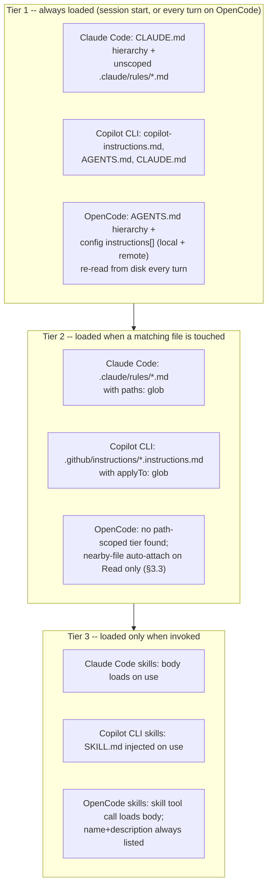

# Instruction context budget -- splitting and scoping instruction files

How to stop a single instruction file (`CLAUDE.md`,
`.github/copilot-instructions.md`) from growing without bound, using the
mechanisms each harness actually ships: modular files, path-scoped
loading, on-demand skills, exclusion, and the surfaces that let you
*measure* what loaded.

Every claim below is tagged VERIFIED (fetched this session from the
named source) or BEST CURRENT UNDERSTANDING, UNCONFIRMED. Sources and
fetch dates at the bottom. Claude Code, Copilot CLI, and OpenCode are
separate products from separate organizations -- nothing confirmed for
one is assumed for another. Section 3 (OpenCode) was added 2026-08-24,
closing a real gap: this page originally covered only two of the
book's three target harnesses.

**Companion page:** [memory-management.md](memory-management.md) covers
the same file hierarchies from the *persistence* angle (load order,
agent-authored memory, what survives compaction). This page is about
token cost. The one overlap worth restating up front: on Claude Code the
lazily-loaded tier is exactly the tier that does **not** come back after
compaction; OpenCode's own re-read behavior (§3.1) is a genuinely
different shape from either closed-source harness's, source-verified
this session.

**The one-line answer.** All three harnesses have a genuine multi-tier
shape -- (1) always loaded at session start, (2) loaded when a matching
file is touched, (3) loaded only when invoked -- though OpenCode's own
tier 1 is architecturally different from the other two in one important
way (§3.1): it is re-read from disk on every turn, not frozen at session
start. On Claude Code and Copilot CLI, `@`-style imports belong to tier
1, so splitting a big file into imports buys you *organization and
nothing else*; OpenCode has no import-expansion mechanism of its own to
make the same mistake with (§3.2). The real levers on Claude Code and
Copilot CLI are path-scoped instruction files (`.claude/rules/` with
`paths:` on Claude Code, `.github/instructions/*.instructions.md` with
`applyTo:` on Copilot CLI) and skills; OpenCode has no documented
path-scoped instruction tier at all (§3.2), leaving skills as its only
lazy-loading lever.



---

## 1. Claude Code

Sources for this section: `code.claude.com/docs/en/memory` and
`code.claude.com/docs/en/skills`, both fetched 2026-07-30. VERIFIED
unless a claim is tagged otherwise.

### 1.1 The trap: imports do not save context

The docs say this twice, unambiguously. Under "Write effective
instructions": "You can also split content into imports for
organization, though imported files still load and enter the context
window at launch." And in troubleshooting, under "My CLAUDE.md is too
large": "Splitting into `@path` imports helps organization but doesn't
reduce context, since imported files load at launch."

Related facts that set the budget:

- **Stated size target: "target under 200 lines per CLAUDE.md file.
  Longer files consume more context and reduce adherence."** There is no
  hard limit -- "CLAUDE.md files are loaded in full regardless of
  length, though shorter files produce better adherence." (Contrast the
  auto-memory index `MEMORY.md`, which *is* hard-capped at 200 lines /
  25KB.)
- Every `CLAUDE.md` and `CLAUDE.local.md` in the directory hierarchy
  **above** cwd is "loaded in full at launch," concatenated rather than
  overriding. So in a monorepo your budget is the sum of every ancestor
  file, not just yours.
- Delivery mechanism: "CLAUDE.md content is delivered as a user message
  after the system prompt, not as part of the system prompt itself."

### 1.2 Tier 2a -- `.claude/rules/` with `paths:` frontmatter

This is the primary documented answer to your question. Put topic files
in `.claude/rules/`; all `.md` files are discovered **recursively**, so
`rules/frontend/`, `rules/backend/` etc. work.

- **Without** `paths:` frontmatter, a rule is "loaded at launch with the
  same priority as `.claude/CLAUDE.md`" -- i.e. it is still tier 1. You
  have gained modularity, not context.
- **With** `paths:` (a glob list), the rule "only load[s] into context
  when Claude works with matching files, reducing noise and saving
  context space," and specifically: "Path-scoped rules trigger when
  Claude reads files matching the pattern, **not on every tool use**."

Documented glob semantics and the sharp edges:

| Pattern | Matches |
|---|---|
| `**/*.ts` | All TypeScript files in any directory |
| `src/**/*` | All files under `src/` |
| `*.md` | Markdown files in the project root |
| `src/components/*.tsx` | React components in a specific directory |

- Brace expansion is supported (`"src/**/*.{ts,tsx}"`), but a rule's
  whole `paths` list shares **one budget of 1,000 expanded patterns and
  4 MiB**; patterns without braces don't count. A pattern that would
  exceed the budget is used *unexpanded*, and "its literal braces match
  no files" -- a silently dead rule. (Before v2.1.217 an over-large
  `paths` value "stalled or crashed the CLI at startup.")
- A `[` that can't be parsed as a bracket expression makes the pattern
  invalid: it "matches nothing, and the rule's other patterns keep
  working." Escape a literal one as `photos \[2024/**`. Before v2.1.207
  a single invalid pattern "made the Read tool fail for every file the
  rule was evaluated against."
- Symlinks are supported both ways: `.claude/rules/` entries may be
  symlinks (circular links "detected and handled gracefully"), which is
  the documented way to share one rule set across projects; and as of
  v2.1.198 `paths:` matching also works when Claude reaches a file
  through a symlinked path into the project.
- `~/.claude/rules/` is the user-level equivalent, "loaded before
  project rules, giving project rules higher priority."
- Project rules are skipped if you exclude `project` from
  `--setting-sources`; before v2.1.211, on-demand rules loaded anyway.

### 1.3 Tier 2b -- nested `CLAUDE.md` in subdirectories

"Claude also discovers `CLAUDE.md` and `CLAUDE.local.md` files in
subdirectories under your current working directory. Instead of loading
them at launch, they are included when Claude reads files in those
subdirectories." So a per-package `CLAUDE.md` in a monorepo is already
lazy by construction -- no frontmatter needed. The docs point at
`/docs/en/large-codebases` for the full monorepo layout (not fetched
this session).

### 1.4 Tier 3 -- skills, the cheapest place to put procedures

The skills page states the economics directly: "Unlike CLAUDE.md
content, a skill's body loads only when it's used, so long reference
material costs almost nothing until you need it." And the docs give you
the decision rule for *when* to reach for which tier, in `memory`'s
"When to add to CLAUDE.md": "Keep it to facts Claude should hold in
every session: build commands, conventions, project layout, 'always do
X' rules. If an entry is a multi-step procedure or only matters for one
part of the codebase, move it to a skill or a path-scoped rule
instead." A Note in the rules section draws the same line from the other
end: "Rules load into context every session or when matching files are
opened. For task-specific instructions that don't need to be in context
all the time, use skills instead."

The loading table, verbatim in substance:

| Frontmatter | You can invoke | Claude can invoke | When loaded into context |
|---|---|---|---|
| (default) | Yes | Yes | Description always in context, full skill loads when invoked |
| `disable-model-invocation: true` | Yes | No | **Description not in context**, full skill loads when you invoke |
| `user-invocable: false` | No | Yes | Description always in context, full skill loads when invoked |

Practical consequences for budgeting:

- The recurring always-on cost of a skill is its **description**, and
  "the combined `description` and `when_to_use` text is truncated at
  1,536 characters in the skill listing to reduce context usage." Many
  skills with long descriptions is itself a tier-1 cost.
- `disable-model-invocation: true` removes even that -- the one
  documented way to make a body of instructions cost *zero* until you
  type `/name`.
- Skills also accept a **`paths:` frontmatter field**: "Glob patterns
  that limit when this skill is activated... Claude loads the skill
  automatically only when working with files matching the patterns.
  Uses the same format as path-specific rules."
- Once loaded, a skill's content "stays in context across turns, so
  every line is a recurring token cost." Keep the body short and push
  detail into supporting files: "Large reference docs, API
  specifications, or example collections don't need to load into context
  every time the skill runs." Reference them from `SKILL.md` so Claude
  knows when to read them.
- Re-invoking a skill whose rendered content is unchanged adds "a short
  note that the skill is already loaded rather than a second copy"
  (v2.1.202+).
- Nested `.claude/skills/` below cwd "aren't loaded at startup. They
  load the first time Claude reads or edits a file inside that
  subdirectory" -- the same lazy pattern as nested `CLAUDE.md`.

### 1.5 Trimming levers on the tier-1 file itself

- **`claudeMdExcludes`** -- glob patterns matched against absolute
  paths, configurable at any settings layer (arrays merge across
  layers), for skipping other teams' ancestor files in a monorepo:
  e.g. `["**/monorepo/CLAUDE.md", "/home/user/monorepo/other-team/.claude/rules/**"]`.
  Managed-policy CLAUDE.md cannot be excluded.
- **Block-level HTML comments are free.** "Block-level HTML comments
  (`<!-- maintainer notes -->`) in CLAUDE.md files are stripped before
  the content is injected into Claude's context. Use them to leave notes
  for human maintainers without spending context tokens on them."
  Comments inside code blocks are preserved.
- **`/doctor` proposes trims** (requires v2.1.206+): "it cuts content
  Claude can derive from the codebase, such as directory layouts,
  dependency lists, and architecture overviews, and keeps pitfalls,
  rationale, and conventions that differ from tool defaults." That is a
  useful editorial heuristic even if you never run it: anything the
  agent could read off the filesystem does not need to be in tier 1.
- `--add-dir` directories contribute no memory files unless
  `CLAUDE_CODE_ADDITIONAL_DIRECTORIES_CLAUDE_MD=1`; with it set, that
  directory's `CLAUDE.md`, `.claude/CLAUDE.md`, `.claude/rules/*.md` and
  `CLAUDE.local.md` all load. Skills are the documented exception --
  `.claude/skills/` inside an added directory is loaded automatically.

### 1.6 Measuring what actually loaded

- **`/context`** -- the authoritative check: "To confirm the file
  loaded, run `/context` in a session and check the list under **Memory
  files**." Also: "To check which files actually loaded into the current
  session, run `/context`."
- **`InstructionsLoaded` hook** -- "log exactly which instruction files
  are loaded, when they load, and why. This is useful for debugging
  path-specific rules or lazy-loaded files in subdirectories." This is
  the deterministic, machine-readable probe.
- **`/memory`** lists CLAUDE.md / CLAUDE.local.md / auto-memory
  locations (including ones that don't exist yet) -- inventory, not
  proof of loading.

### 1.7 The cost of laziness

Per the compaction table in
[memory-management.md](memory-management.md) §1.7 (sourced from
`code.claude.com/docs/en/context-window`): project-root CLAUDE.md and
unscoped rules are **re-injected from disk** after compaction, while
rules with `paths:` frontmatter and nested subdirectory CLAUDE.md are
**lost until a matching file is read again**. Invoked skill bodies are
re-attached but capped at 5,000 tokens each and 25,000 total, most-recent
first. So every token you move out of tier 1 is also a token that may
silently stop applying mid-session. Budget accordingly: invariants that
must never lapse stay in tier 1 even if they cost tokens.

---

## 2. GitHub Copilot CLI

Sources for this section: `docs.github.com/en/copilot/concepts/response-customization`,
`docs.github.com/en/copilot/how-tos/configure-custom-instructions/add-repository-instructions`,
`docs.github.com/en/copilot/how-tos/copilot-cli/customize-copilot/add-skills`,
`docs.github.com/en/copilot/concepts/agents/about-agent-skills`, and
`github.com/github/copilot-cli` `changelog.md`, all fetched 2026-07-30.
VERIFIED unless tagged otherwise.

### 2.1 What files exist to split into

The CLI reads (per the CLI docs, cited in
[memory-management.md](memory-management.md) §2.1):
`.github/copilot-instructions.md` (repository-wide),
`.github/instructions/**/*.instructions.md` (path-specific), and
`AGENTS.md`. Its own changelog adds `CLAUDE.md` (read and
`@`-import-expanded, v1.0.66) and user-level
`~/.copilot/instructions/**/*.instructions.md` (v1.0.61 `/help` entry).
`COPILOT_CUSTOM_INSTRUCTIONS_DIRS` is a further, changelog-only
mechanism for pointing at instruction directories (v1.0.6 fix entry
naming it).

Discovery is hierarchical like Claude Code's: "Custom instructions, MCP
servers, skills, and agents are now discovered at every directory level
from the working directory up to the git root, enabling full monorepo
support" (v1.0.11). Files are **combined**: "Combine all custom
instruction files instead of using priority-based fallbacks" (v0.0.385)
-- so, as on Claude Code, ancestors add up rather than override.
(Precedence *ordering* for the CLI specifically remains UNCONFIRMED --
see [memory-management.md](memory-management.md) §2.1 for why the
`response-customization` precedence list can't be applied to the CLI.)

Two dedup behaviors reduce accidental double-billing: "Deduplicate
identical model instruction files to save context" (v0.0.394) and "Avoid
sending duplicate custom instruction files (e.g.
copilot-instructions.md and CLAUDE.md with identical content) to reduce
wasted tokens per turn" (v1.0.26). Also, "Custom agent instructions are
no longer duplicated each turn, reducing context window usage"
(v1.0.60).

`@`-style imports exist here too (v1.0.66). BEST CURRENT
UNDERSTANDING, UNCONFIRMED: as on Claude Code they are an organization
mechanism whose expansion still enters context -- the changelog says
"expand," which implies inlining, but no Copilot source I fetched states
the token consequence either way. Do not assume imports save context
here.

### 2.2 The scoping mechanism: `applyTo:` frontmatter

Per `add-repository-instructions`, authoritative for the file format:
path-specific instruction files "must be named `NAME.instructions.md`"
and live in `.github/instructions` or below it, and each needs a
frontmatter block with the `applyTo` keyword using glob syntax:

```markdown
---
applyTo: "app/models/**/*.rb"
---
```

Documented glob semantics: `*` matches files in the current directory;
`**` or `**/*` matches all files in all directories; `*.py` is
current-directory-only; `**/*.py` is recursive; `src/*.py` is direct
children of `src/` only; `src/**/*.py` is recursive within `src/`;
`**/subdir/**/*.py` matches any `subdir` at any depth. "You can specify
multiple patterns by separating them with commas." The purpose sentence
is the same as Claude Code's: "By using path-specific instructions you
can avoid overloading your repository-wide instructions with information
that only applies to files of certain types, or in certain directories."

**Grounding boundary worth knowing.** That same page says "Currently, on
GitHub.com, path-specific custom instructions are only supported for
Copilot cloud agent and Copilot code review." That sentence is scoped to
GitHub.com and does **not** describe the CLI. The CLI's own changelog is
what confirms CLI support, and it also tells you the CLI treats them as
a lazy tier:

- "Pattern-specific instruction files (`.github/instructions/*.instructions.md`)
  no longer include their full body in the system prompt on every
  session" (v1.0.35).
- "Instruction files with specific `applyTo` patterns are consolidated
  into a table instead of inlining full content, reducing context window
  usage" (v1.0.26).

That second entry is the mechanically interesting one: the always-on
cost of a scoped Copilot instruction file is a *table row*, not its
body -- structurally analogous to a Claude Code skill's description, and
it means the model is told the file exists and when it applies before
deciding to pull it in. BEST CURRENT UNDERSTANDING, UNCONFIRMED: what
exactly triggers the full body being loaded (a file read, a model
decision, an embedding match) is not documented on any page I fetched;
the changelog states the consolidation, not the retrieval trigger.

Frontmatter details from the changelog: `applyTo` "accepts both string
and array values" (v1.0.6), and unquoted glob patterns
(`applyTo: **/*.ts`) "are now applied correctly" as of v1.0.48 -- quote
your patterns if you may be on an older build. Instruction files inside
`.gitignore`d directories load correctly as of v1.0.36, and instruction
filenames are "recognized regardless of casing" (v0.0.x era entry).

### 2.3 Tier 3 -- skills

Copilot CLI has an on-demand tier too. Per the CLI's own add-skills
page: "When Copilot chooses to use a skill, the `SKILL.md` file will be
injected in the agent's context" -- i.e. injection at use time, not
session start. Locations, per the same page: project skills in
`.github/skills`, `.claude/skills`, or `.agents/skills`; personal skills
in `~/.copilot/skills` or `~/.agents/skills`. Invocation is by
`/skill-name` in a prompt. The concepts page describes skills as
"folders of instructions, scripts, and resources that Copilot can load
when relevant."

Note that `.claude/skills` in that list is a fact about **Copilot CLI's
own** discovery paths, from GitHub's docs -- not an inference from
Claude Code's docs. It happens to make skills the one tier a single
on-disk location can serve for both harnesses.

Neither Copilot page I fetched states the token cost of the
always-present part of a skill (whether a name/description listing is
injected each session, and how large). That is **UNKNOWN** -- do not
assume Claude Code's "description always in context" model applies.
Two adjacent changelog facts: "Skill content injected to the model no
longer includes YAML frontmatter metadata" (v1.0.48), and there is an
experimental retrieval path -- "Add experimental embedding-based dynamic
retrieval of MCP and skill instructions per turn" (v1.0.5), later
persisted as a `dynamicRetrieval` setting with a
`--dynamic-retrieval skills=<on|off>` flag (v1.0.66). That is a
genuinely different lever from anything documented for Claude Code:
per-turn embedding retrieval of instruction text rather than
glob-triggered loading.

### 2.4 Measuring and toggling

- **`/context`** -- "separates Custom Instructions from the system
  prompt and cross-references per-server MCP tool token costs with
  `/mcp`" (v1.0.60). So instruction cost is itemized separately from the
  system prompt here, which is exactly the number you want when
  trimming.
- **`/env`** -- "show loaded environment details (instructions, MCP
  servers, skills, agents, plugins)" (v1.0.25).
- **`/instructions`** -- "view and toggle custom instruction files"
  (v0.0.x), with "individual instruction file names in `/instructions`
  picker with `[external]` labels for injected files" (v1.0.4).
  Toggling is a real budget lever, not just an inspector.
- `/skills list`, `/skills info`, `/skills reload`, and a `/skills`
  toggle picker (add-skills page).

---

## 3. OpenCode

Sources for this section: `opencode.ai/docs/rules/` (the rendered docs
page) cross-checked against its own Markdown source,
`packages/web/src/content/docs/rules.mdx`, and its skills-tier
counterpart `packages/web/src/content/docs/skills.mdx`, both fetched via
`gh api` from `github.com/anomalyco/opencode`, `dev` branch, 2026-08-24;
deepened with the actual loader source,
`packages/opencode/src/session/instruction.ts` and the calling site in
`packages/opencode/src/session/prompt.ts`, same repo/branch/date. VERIFIED
unless tagged otherwise, with the standing `dev`-branch caveat this book
applies everywhere it cites OpenCode source directly.

### 3.1 The trap does not apply the same way: tier 1 is re-read every turn, not frozen at session start

OpenCode's own instruction-loading module, `Instruction.system()`,
is called once per iteration of the main session loop in
`prompt.ts` -- a `while (true)` turn loop (`let step = 0` before it,
incrementing per iteration) that also drives tool dispatch and the
per-turn system-prompt assembly `[env, instructions, mcpInstructions,
skills]`. `Instruction.system()` itself does a fresh
`fs.readFileString()` of every discovered instruction-file path on each
call, with no caching layer visible in the source read this session.
**This is a materially different architecture from both other harnesses
documented above:** Claude Code's tier 1 is a session-start read with no
documented hot-reload (§1.8, cross-referenced, not repeated), and
Copilot CLI's reload behavior is explicitly undocumented (§2.4). On
OpenCode, editing `AGENTS.md` mid-session takes effect on the *very next
turn* -- a real, source-verified, positive answer to a question the
other two harnesses' own docs leave open. This is a genuinely new
finding for this book, not previously documented in
[memory-management.md](memory-management.md) either.

### 3.2 What tier 1 actually contains, and the absence of a path-scoped tier

Per `rules.mdx` (VERIFIED): OpenCode's tier-1 instruction surface is an
`AGENTS.md` file, initialized via the `/init` slash command (which scans
the repo and writes build/lint/test commands, architecture notes, and
project conventions) or authored by hand. It is discovered from
**multiple locations that serve different purposes**, not merged
arbitrarily:

- **Project**: `AGENTS.md` in the project root, applying only to that
  directory and its subdirectories.
- **Global**: `~/.config/opencode/AGENTS.md`, applied across every
  OpenCode session on the machine, explicitly recommended for personal
  (not team-shared) rules since it is not committed to Git.
- **Claude Code compatibility, as a fallback only**: project-level
  `CLAUDE.md` (used only if no `AGENTS.md` exists) and global
  `~/.claude/CLAUDE.md` (used only if no `~/.config/opencode/AGENTS.md`
  exists), disableable via `OPENCODE_DISABLE_CLAUDE_CODE`,
  `OPENCODE_DISABLE_CLAUDE_CODE_PROMPT`, or
  `OPENCODE_DISABLE_CLAUDE_CODE_SKILLS`.

VERIFIED, docs-stated precedence: "the first matching file wins in each
category" -- if both `AGENTS.md` and `CLAUDE.md` exist at the same
level, only `AGENTS.md` loads; the global `~/.config/opencode/AGENTS.md`
takes precedence over the Claude-compat global fallback. Source-verified
addition not stated on the docs page fetched: the loader
(`instruction.ts`) also recognizes a third, explicitly **deprecated**
filename, `CONTEXT.md`, in the same precedence slot as `AGENTS.md`/
`CLAUDE.md` -- a docs/source gap worth flagging rather than silently
reconciling.

A **separate, additive** mechanism -- not a replacement for the file
hierarchy above -- is the `instructions` array in `opencode.json`
(project) or the global config file, letting a team point at existing
rule files instead of duplicating them into `AGENTS.md`: local paths
(supporting glob patterns, e.g. `"packages/*/AGENTS.md"`) and remote
`https://`/`http://` URLs, source-verified as fetched with a hard
**5-second timeout** (`Effect.timeout(5000)`) and silently degrading to
empty content on failure rather than blocking the turn. VERIFIED (docs):
"All instruction files are combined with your `AGENTS.md` files" -- i.e.
this is an additive tier-1 mechanism, not a per-path-scoped one.

**No path-scoped (tier-2) instruction tier was found.** Neither
`rules.mdx` nor a `search/code` sweep of the docs tree for `applyTo`- or
`paths:`-style scoping syntax this session turned up anything resembling
Claude Code's `.claude/rules/` + `paths:` or Copilot CLI's
`.github/instructions/*.instructions.md` + `applyTo:`. This is UNCONFIRMED-as-absent
(not found in the sources fetched this session), not proven impossible,
but it means OpenCode's own documented answer to "how do I scope
instructions to a subset of files without paying for them everywhere"
is currently just the invoke-only skills tier below, not a middle tier.

### 3.3 A nearby-instruction-file auto-attach mechanism, source-verified, distinct from tier 1 and tier 3

`instruction.ts` exposes a second function, `resolve()`, called when the
model reads a file via the `read` tool: it walks upward from that file's
directory (bounded at the project root) looking for the nearest
`AGENTS.md`/`CLAUDE.md`/`CONTEXT.md` not already surfaced as part of
tier 1 or already attached to that same assistant message (tracked via a
per-message `claims` set, keyed off a helper, `extract()`, that scans
prior completed `read`-tool message parts for a `metadata.loaded` path
list). Any such file found is attached to that turn's context as
`Instructions from: <path>\n<content>`. This is architecturally the
closest OpenCode comes to Claude Code's own **nested-CLAUDE.md-loads-on-
first-read-of-that-subdirectory** behavior (cross-referenced, not
repeated, from Claude Code's own tier documented above) -- a real,
source-verified, per-message-deduplicated auto-attach mechanism, not a
docs-stated feature. BEST CURRENT UNDERSTANDING, UNCONFIRMED: whether
this mechanism is described anywhere in OpenCode's own public docs (it
was not found on `rules.mdx`) -- it currently exists only as a
source-verified implementation detail.

### 3.4 Tier 3 -- skills

VERIFIED (`skills.mdx`): OpenCode's invoke-only tier is the native
`skill` tool. Every discovered `SKILL.md`'s `name` and `description`
(1-1024 characters, frontmatter-only) is always listed in the tool's own
description as an `<available_skills>` block -- structurally the same
"index entry always resident, body loads on demand" shape both Claude
Code's and Copilot CLI's own skills tiers use above -- and the full body
loads only when the model calls `skill({ name: "..." })`. Discovery
walks the same project-root-to-worktree path as `AGENTS.md` (§3.2) for
`.opencode/skills/`, plus Claude-compatible (`.claude/skills/`) and a
third, `agents`-branded (`.agents/skills/`) convention at both project
and global scope, and per-skill/per-agent-pattern `allow`/`ask`/`deny`
permission gating (a `deny`d skill is omitted from `<available_skills>`
entirely, so a denied skill costs nothing, not even its index-entry
tokens -- a stricter budget guarantee than either closed-source
harness's own visibility controls document).

### 3.5 Measuring and toggling

No dedicated context-inspection command (an OpenCode analogue to Claude
Code's `/context` or Copilot CLI's `/context`/`/env`/`/instructions`)
was found in the docs pages fetched this session. This is
UNCONFIRMED-as-absent, not proven absent -- OpenCode's TUI is known
(per [tui-cli-application-architecture.md](tui-cli-application-architecture.md))
to expose a live token/cost footer, but this page found no dedicated
instruction-budget breakdown surface to cite alongside it.

---

## 4. Synthesis

| Concern | Claude Code | Copilot CLI | OpenCode |
|---|---|---|---|
| Tier-1 file(s) | `CLAUDE.md` hierarchy (managed → user → project → local), plus `.claude/rules/*.md` **without** `paths:` | `.github/copilot-instructions.md`, `AGENTS.md`, `CLAUDE.md`, `~/.copilot/instructions/**` | `AGENTS.md` (project + global), `CLAUDE.md`/deprecated `CONTEXT.md` as Claude-compat fallbacks, plus config `instructions[]` (local globs + remote URLs) |
| Tier-1 freshness | Session-start read; no documented hot-reload | Undocumented either way | **Re-read from disk every turn** -- source-verified, no caching in `Instruction.system()` |
| Stated size guidance | "target under 200 lines per CLAUDE.md file"; loaded in full regardless of length | None found on the pages fetched | None found on the pages fetched |
| Do `@` imports save context? | **No** -- stated twice in the docs | UNCONFIRMED; imports exist (v1.0.66), token effect not documented | Not applicable -- no `@`-import-expansion mechanism found in `AGENTS.md`/`instructions[]` loading (the docs instead show a manual, agent-authored "read this file on demand" convention, not a harness-parsed import syntax) |
| Path-scoped tier | `.claude/rules/` + `paths:` glob list; triggers on reading a matching file, "not on every tool use" | `.github/instructions/*.instructions.md` + `applyTo:`; body no longer in system prompt every session (v1.0.35), consolidated to a table row (v1.0.26) | **None found** -- UNCONFIRMED-as-absent |
| Lazy-by-location tier | Nested `CLAUDE.md` and nested `.claude/skills/` below cwd load on first read/edit in that subdirectory | Discovery walks working dir → git root (v1.0.11); no documented "load on read of subdirectory file" behavior found | Source-verified nearby-file auto-attach: walking up from a `read`-tool target's directory for the nearest un-surfaced `AGENTS.md`/`CLAUDE.md`/`CONTEXT.md`, deduplicated per assistant message |
| Invoke-only tier | Skills: body loads on use; description always in context (1,536-char cap) unless `disable-model-invocation: true`; supports its own `paths:` | Skills: `SKILL.md` "injected in the agent's context" when used; always-on listing cost UNKNOWN | Skills: `name`+`description` (≤1,024 chars) always listed in `<available_skills>`; body loads via `skill({name})` call; a `deny`d skill is omitted from the listing entirely (zero index-entry cost) |
| Exclusion | `claudeMdExcludes` globs, any settings layer, arrays merge | `/instructions` toggle picker | Per-skill/per-agent-pattern `allow`/`ask`/`deny` permissions; no equivalent exclusion lever found for `AGENTS.md`/`instructions[]` itself |
| Free maintainer notes | Block-level HTML comments stripped before injection | Not documented on pages fetched | Not documented on pages fetched |
| Automated trim advice | `/doctor` trim proposal (v2.1.206+) | Not documented on pages fetched | Not documented on pages fetched |
| Retrieval-based loading | Not documented | Experimental embedding-based per-turn retrieval of skill/MCP instructions; `dynamicRetrieval` setting | Not documented; remote `instructions[]` URLs are always fully fetched (5s timeout), not retrieved by relevance |
| Verify what loaded | `/context` → **Memory files**; `InstructionsLoaded` hook | `/context` (Custom Instructions itemized separately), `/env`, `/instructions` | No dedicated command found in the docs fetched this session |
| Survives compaction? | Tier 1 re-injected; path-scoped and nested lost until retriggered; skills capped 5K/25K | Skills survive; instruction-file re-injection **undocumented** | Not directly investigated here (see [context-compression.md](context-compression.md) §3 for OpenCode's own compaction mechanics); moot in one sense, since tier 1 is rebuilt fresh every turn regardless of compaction state |

**The design lesson.** All three harnesses independently converged on
some version of the same multi-tier answer, and all three make the
*same* thing tier 1 that authors intuitively expect to be cheap: the
imported/split-out file (on the two harnesses that have an import
mechanism at all). The distinction that matters is not "one file vs.
many files," it is **"does this text have a trigger?"** A file with no
trigger (`@` import, unscoped rule, plain `copilot-instructions.md`,
OpenCode's own `AGENTS.md`/`instructions[]`) costs you tokens on every
turn no matter how many files you split it across. A file with a
trigger (`paths:`, `applyTo:`, a skill name) costs you only its index
entry until the trigger fires -- and on OpenCode specifically, "every
turn" is not a figure of speech: §3.1's re-read finding means the tier-1
cost is paid, and the tier-1 *content* can change, on every single
model call, not just once at launch.

**A cross-harness recipe** (relevant to this project's requirement that
everything work across targets):

1. **Tier 1, one small file.** Keep a root `CLAUDE.md` under ~200 lines
   holding only always-true facts. This is close to the one instruction
   file all three harnesses verifiably read at runtime -- Copilot CLI
   reads `CLAUDE.md` directly (its changelog); OpenCode reads it too,
   but only as a fallback when no `AGENTS.md` exists at the same scope
   (§3.2); Claude Code does not read `AGENTS.md` or
   `copilot-instructions.md` (its docs). Practically: an `AGENTS.md`
   with the same content, plus a `CLAUDE.md` for Claude Code, covers all
   three without relying on OpenCode's fallback-only behavior.
2. **Tier 2 has no shared file, and OpenCode has no tier 2 at all.**
   For Claude Code and Copilot CLI you still need two parallel sets:
   `.claude/rules/*.md` with `paths:` for Claude Code and
   `.github/instructions/*.instructions.md` with `applyTo:` for Copilot
   CLI. The glob dialects are similar but not identical (Claude Code
   documents brace expansion with an explicit 1,000-pattern budget;
   Copilot documents comma-separated patterns and a string-or-array
   `applyTo`). Do not generate one from the other without checking the
   pattern semantics, and do not expect OpenCode to honor either --
   its own docs show no scoped-loading equivalent (§3.2), so
   path-conditional guidance either goes in `AGENTS.md` unconditionally
   (paying the token cost everywhere) or is left out for that harness.
3. **Tier 3 can be shared, three ways.** Skills are the one on-demand
   tier where a single directory can serve all three: Copilot CLI's own
   docs list `.claude/skills` among its project skill locations, and
   OpenCode's own skills docs list `.claude/skills/` as a recognized
   discovery path too. Put procedures and long reference material here,
   keep `SKILL.md` bodies short, and push detail into supporting files
   the agent reads only when needed.
4. **Verify per harness, every time.** `/context` on Claude Code and
   Copilot CLI, `InstructionsLoaded` on Claude Code, `/env` and
   `/instructions` on Copilot CLI. OpenCode has no equivalent inspector
   documented -- the practical substitute is reasoning from the source
   behavior in §3.1-§3.3 directly, or watching the TUI's own token
   footer. The cost of a scoped rule on the two closed-source harnesses
   is empirically checkable in under a minute; guessing is not
   necessary there.
5. **Remember the compaction/reload asymmetry, now three-way.** On
   Claude Code, moving text out of tier 1 means it can stop applying
   after a compaction. On Copilot CLI, whether instruction files are
   re-injected post-compaction is undocumented. On OpenCode, the
   question is closer to moot: tier 1 is rebuilt from disk every turn
   regardless of compaction, so an edited `AGENTS.md` is visible on the
   very next turn on OpenCode in a way neither other harness documents
   for itself. Invariants that must never lapse still belong in tier 1
   on all three, even at token cost -- OpenCode just pays that cost with
   a freshness guarantee the other two do not offer.

---

## Sources

All fetched 2026-07-30 unless marked otherwise.

**Claude Code (authoritative for Claude Code's documented behavior only):**
- `https://code.claude.com/docs/en/memory` -- 200-line size target, "loaded in full regardless of length," imports-don't-save-context (stated twice), when-to-use-CLAUDE.md vs. skill vs. path-scoped rule, `.claude/rules/` setup and recursion, `paths:` frontmatter and glob table, brace-expansion budget (1,000 patterns / 4 MiB), bracket-expression gotcha, rule symlinks, `~/.claude/rules/` ordering, `--setting-sources` interaction, nested-subdirectory lazy loading, `claudeMdExcludes`, HTML-comment stripping, `/doctor` trim proposal, `/context` **Memory files** check, `InstructionsLoaded` hook, `CLAUDE_CODE_ADDITIONAL_DIRECTORIES_CLAUDE_MD`, CLAUDE.md delivered as a user message after the system prompt.
- `https://code.claude.com/docs/en/skills` -- "a skill's body loads only when it's used," invocation/loading table for `disable-model-invocation` and `user-invocable`, 1,536-character `description`+`when_to_use` cap, skill `paths:` frontmatter, skill content stays in context across turns, supporting-files pattern, nested `.claude/skills/` lazy loading, `--add-dir` skills exception, identical-re-invocation dedup (v2.1.202), post-compaction 5,000/25,000-token skill budget.
- Compaction behavior cited via `references/harnesses/memory-management.md` §1.7, which sourced it from `https://code.claude.com/docs/en/context-window` on 2026-07-30.

**GitHub Copilot CLI (authoritative for Copilot CLI's documented behavior only):**
- `https://docs.github.com/en/copilot/how-tos/configure-custom-instructions/add-repository-instructions` -- `NAME.instructions.md` naming and `.github/instructions` location, `applyTo` frontmatter and glob syntax table, comma-separated multiple patterns, the "avoid overloading your repository-wide instructions" rationale, and the GitHub.com-scoped support caveat.
- `https://docs.github.com/en/copilot/concepts/response-customization` -- path-specific vs. repository-wide framing, precedence list (explicitly enumerating GitHub.com/IDE surfaces, **not** the CLI), `AGENTS.md`/`CLAUDE.md`/`GEMINI.md` as agent-instruction filenames, nearest-`AGENTS.md`-takes-precedence.
- `https://docs.github.com/en/copilot/how-tos/copilot-cli/customize-copilot/add-skills` -- skill directory locations for the CLI (`.github/skills`, `.claude/skills`, `.agents/skills`, `~/.copilot/skills`, `~/.agents/skills`), `/skill-name` invocation, "When Copilot chooses to use a skill, the `SKILL.md` file will be injected in the agent's context," `/skills list|info|reload`.
- `https://docs.github.com/en/copilot/concepts/agents/about-agent-skills` -- skills definition, supported surfaces including the GitHub Copilot CLI.
- `https://github.com/github/copilot-cli` `changelog.md` (via `gh api repos/github/copilot-cli/contents/changelog.md`) -- v1.0.35 pattern-specific bodies out of the system prompt, v1.0.26 consolidation into a table + duplicate-instruction-file avoidance, v1.0.6 `applyTo` string-or-array, v1.0.48 unquoted-glob fix and skill-frontmatter stripping, v1.0.36 gitignored-directory loading, v1.0.11 monorepo discovery to git root, v0.0.385 combine-all-instruction-files, v0.0.394 identical-file dedup, v1.0.60 `/context` Custom Instructions separation and non-duplicated agent instructions, v1.0.25 `/env`, v1.0.4 `/instructions` picker labels, v1.0.61 `~/.copilot/instructions/**`, v1.0.66 `@`-import expansion and `dynamicRetrieval`, v1.0.5 experimental embedding-based retrieval, v1.0.6-era `COPILOT_CUSTOM_INSTRUCTIONS_DIRS`. Authoritative for its own behavior-change history; this repo ships no implementation source.

**OpenCode (fetched 2026-08-24; authoritative for OpenCode's documented and real-source behavior, with the standing `dev`-branch caveat):**
- `opencode.ai/docs/rules/`, source-checked against `github.com/anomalyco/opencode`'s own `packages/web/src/content/docs/rules.mdx` (`dev` branch, via `gh api`) -- `AGENTS.md` initialization via `/init`, project/global/Claude-compat discovery locations and precedence ("first matching file wins in each category"), the three `OPENCODE_DISABLE_CLAUDE_CODE*` env vars, the `instructions` config array (local globs and remote URLs, "combined with your AGENTS.md files"), the manual `@`-reference convention documented as an *agent*-followed instruction rather than a harness-parsed import.
- `packages/web/src/content/docs/skills.mdx`, same repo/branch/method -- `SKILL.md` frontmatter fields and validation rules, `.opencode/skills/`+Claude-compat+`.agents/skills/` discovery paths at project and global scope, the `<available_skills>` always-listed index block, `skill({name})` invocation, and the `allow`/`ask`/`deny` permission schema including the omitted-from-listing-entirely behavior on `deny`.
- `packages/opencode/src/session/instruction.ts` and `packages/opencode/src/session/prompt.ts`, same repo/branch, fetched via `gh api` -- the `Instruction.system()`/`Instruction.resolve()` implementation: per-turn fresh-disk-read of tier-1 instruction files (no caching), the deprecated `CONTEXT.md` filename not named in the docs page fetched, the `instructions[]` remote-URL fetch's 5-second timeout, and the nearby-instruction-file auto-attach mechanism triggered off `read`-tool calls with a per-assistant-message dedup set. Authoritative for OpenCode's real implementation as of this session's fetch; per this book's standing caveat, `dev` is not a stable release tag and may not match the current stable release.
- A `search/code` sweep of `packages/web/src/content/docs` for `applyTo`/`paths:`-style scoping syntax, same session -- zero hits, grounding the UNCONFIRMED-as-absent finding on a path-scoped instruction tier (§3.2).
