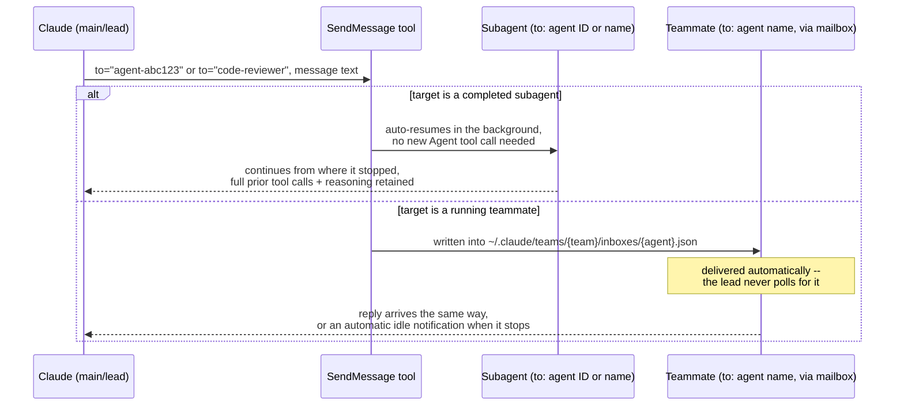
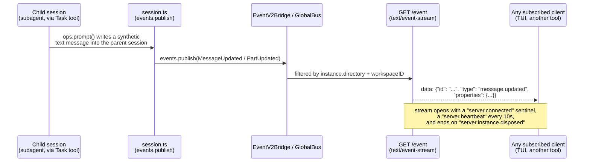
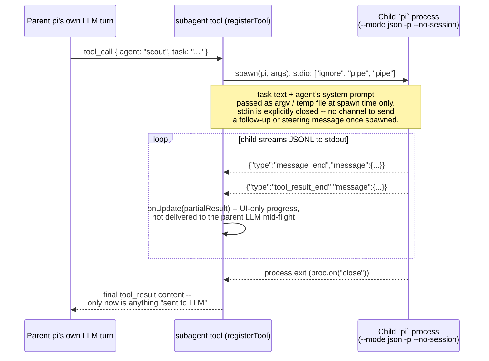
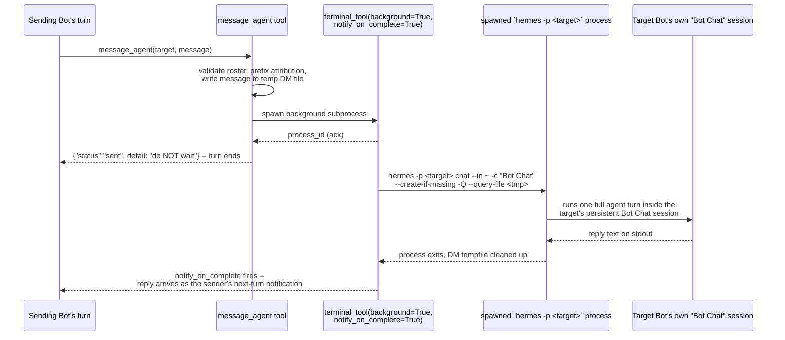

# Inter-agent messaging -- the wire format once agents are already talking

**Scope note.** [handoff-mechanism.md](handoff-mechanism.md) covers what
crosses the boundary at spawn/return time -- the initial context a new
agent instance gets and the final result it hands back.
[orchestration.md](orchestration.md) covers who holds the plan across
several agents. This page asks the question both of those deliberately
leave open: once two agent instances are already running side by side --
a resumed subagent, two agent-team teammates, two `/fleet` subtasks, a
parent session and its OpenCode child session, two Hermes Bot Mode
teammates -- what is the actual transport and envelope a message travels
over between them? Is it a tool call, a file on disk, a server-sent-event
stream, a database row? Is delivery push or pull? Does the message carry
any provenance metadata telling the receiver who really sent it? Is
there a distinction between an ordinary natural-language message and a
structured protocol message (a shutdown request, a plan approval)? The
five harnesses this page covers give five structurally different
answers, and the differences matter for anyone building automation that
assumes messaging "just works" the same way across all of them.

---

## 1. Claude Code

Sources for this section: `code.claude.com/docs/en/sub-agents` and
`code.claude.com/docs/en/agent-teams`, both fetched 2026-07-31 (the
same two pages already cited for handoff mechanics in
[handoff-mechanism.md](handoff-mechanism.md) section 1, re-read here
specifically for the messaging layer); `code.claude.com/docs/en/hooks`,
fetched 2026-07-31, for the `TeammateIdle`/`TaskCreated`/`TaskCompleted`
hook events. VERIFIED unless tagged otherwise.

### 1.1 `SendMessage` is the one tool, used two different ways

Claude Code has exactly one tool for addressing another already-running
agent instance: `SendMessage`. It is unlisted in the permission table as
requiring no approval prompt (see [built-in-tools.md](built-in-tools.md)
section 1.1), and the docs state plainly that "`SendMessage` doesn't
require agent teams to be enabled; only structured team-protocol
messages such as `shutdown_request` and `plan_approval_response` do" --
meaning the same tool is the messaging primitive for both of the
harness's multi-agent shapes, but a second layer of structured,
named message *types* sits on top of it and is gated behind the
experimental agent-teams flag specifically.



### 1.2 Addressing: agent ID vs. agent name, and the name-collision guard

`SendMessage`'s `to` field accepts either the agent's ID (assigned when
Claude spawns it via the `Agent` tool) or the human-readable name Claude
or the user gave it at spawn time. Both addressing schemes resolve to the
same running (or resumable) instance, but they diverge once an agent
name gets reused: "As of v2.1.199, `SendMessage` checks that a name
still refers to the same agent it reached earlier in the conversation.
If a newer agent has taken the name, such as a re-spawned background
agent that reused it, Claude Code refuses the send rather than
delivering it to the wrong agent, and the error reports which agent the
name now reaches so Claude can retarget. To reach the earlier agent
while it's still running, Claude addresses it by the agent ID it
received when it spawned that agent." This is a real, dated behavior
change (the check did not exist before v2.1.199) and a concrete
consequence for anyone scripting against subagent names rather than IDs:
name-based addressing is a convenience that can silently misfire across
a re-spawn unless the ID is kept as the durable handle. The check itself
"is scoped to the current conversation and resets on `/clear`."

A second addressing wrinkle governs what happens when the target is not
currently running at all. A subagent stopped by Claude itself via the
`TaskStop` tool auto-resumes on the next `SendMessage` to it, exactly
like a naturally-completed one. But "as of v2.1.191, a subagent you
stopped yourself, with `x` in `/tasks` or an SDK `stop_task` request,
doesn't auto-resume. The `SendMessage` call returns a refusal telling
Claude the agent was cancelled" -- i.e. the messaging layer distinguishes
*who* stopped the recipient (the orchestrating agent vs. the human) and
enforces that distinction as a hard refusal rather than a silent no-op,
requiring the human to type into the subagent's own transcript in the
subagent panel to clear the stop before `SendMessage` can reach it again.

### 1.3 The mailbox: file-based, push-delivered, self-healing on malformed entries

For agent teams specifically, the architecture table in the docs names
the mailbox as its own component: "**Mailbox** -- Messaging system for
communication between agents," stored concretely as "a JSON file at
`~/.claude/teams/{team-name}/inboxes/{agent-name}.json`." Two mechanical
details matter for anyone reasoning about this as a wire format rather
than an abstraction:

- **Delivery is push, not poll.** "Teammate messages arrive at the lead
  automatically" and, in the fuller framing under Context and
  communication, "when teammates send messages, they're delivered
  automatically to recipients. The lead doesn't need to poll for
  updates." The mailbox file is the persistence layer; the delivery
  mechanism itself is not described as a filesystem-watch poll loop in
  the docs, but the observable guarantee stated is push-style automatic
  arrival.
- **Malformed entries are validated and evicted, not fatal.** "Claude
  Code validates every entry when it reads a mailbox file. Entries that
  don't match the message format are reported as errors and removed
  from the file; the valid messages are still delivered." This is a
  documented fix for a specific dated failure mode: "Before v2.1.207, a
  single malformed mailbox entry caused a repeated error every second
  and blocked delivery for that mailbox until you deleted the file
  manually" -- i.e. before that version, one bad entry in the JSON file
  was a hard, self-repeating failure for the *entire* mailbox, not just
  the one message; after it, the harness quarantines the bad entry and
  keeps delivering everything else. The exact JSON schema of a mailbox
  entry (field names beyond "message format") is not stated in the
  docs content fetched this session -- BEST CURRENT UNDERSTANDING,
  UNCONFIRMED beyond what's quoted above.

Addressing for teammate-to-teammate messaging is name-based only, one
recipient at a time: "send a message to one specific teammate by name.
To reach everyone, send one message per recipient" -- there is no
documented broadcast/multicast primitive; a message to a group is
literally N separate sends.

### 1.4 Provenance tagging and the permission-relay firewall

Every message crossing between two agent instances carries an implicit
provenance tag the receiving agent's own runtime enforces, independent
of what the message text claims: "when one agent sends another a
message over `SendMessage`, the receiving agent is told it came from
another Claude session, not from you. A teammate cannot approve a
permission prompt or supply consent on your behalf, and a teammate that
was denied an action cannot relay it to another teammate to bypass the
check." The enforcement is explicitly at the permission-classifier
level, not merely a documentation guideline: "In [auto mode], the
classifier treats an approval claim relayed from another agent as
untrusted input rather than confirmation from you." The same rule
applies identically to the subagent-resume path (section 1.2 above): "a
subagent treats messages from the agent that launched it as normal task
direction, including mid-task course corrections... no message from any
agent counts as your approval for a pending permission prompt, and no
agent message can change a subagent's permission settings, `CLAUDE.md`,
or configuration." Put together, this is a load-bearing wire-format
fact, not a soft policy: the messaging channel itself is trusted to
carry task direction, but it is structurally incapable of carrying
permission consent, and that distinction is checked on receipt, not left
to the sending agent's good behavior.

### 1.5 Structured protocol messages: a second layer above plain-text task direction

Two named, structured message types ride the same `SendMessage`
transport but are semantically distinct from ordinary task direction,
and both are gated behind agent teams specifically: `shutdown_request`
(the lead-to-teammate message asking a teammate to end gracefully,
which "the teammate can approve, exiting gracefully, or reject with an
explanation") and `plan_approval_response` (the lead's reply to a
teammate's plan-approval request, approving or rejecting with feedback,
after which "a rejected teammate stays in plan mode, revises based on
the feedback, and resubmits"). The docs name these two specifically as
requiring agent teams to be enabled, which by construction implies the
teammate-to-lead direction (the plan approval request itself) is a
comparably structured message type, though the docs content fetched this
session does not name that request-side type explicitly -- treat the
existence of a named `plan_approval_request`-shaped message as BEST
CURRENT UNDERSTANDING, UNCONFIRMED inferred from the response type being
named, not a directly quoted fact.

### 1.6 Idle notifications and hooks as the messaging-adjacent extensibility point

Beyond message delivery between agents, the harness also pushes a
distinct *notification* to the lead when a teammate's own turn ends,
without the teammate having sent anything: "when a teammate finishes and
stops, it automatically notifies the lead... a teammate whose turn ends
on an API error notifies the lead that it failed and includes the error
text, instead of appearing to finish normally" (v2.1.198+). Three hooks
give a project the ability to intercept messaging-adjacent events
before they take effect: `TeammateIdle` fires "when an agent team
teammate is about to go idle" and, if the hook exits with code 2,
"prevents the teammate from going idle, so it continues working";
`TaskCreated` fires when a shared-task-list task is being created via
`TaskCreate`, and exit code 2 "rolls back the task creation"; and
`TaskCompleted` fires when a task is being marked complete, and exit
code 2 "prevents the task from being marked as completed." None of these
three hooks support a `matcher` -- they fire on every occurrence
unconditionally. **A documentation gap found and flagged rather than
papered over:** the exact JSON input-field schema for these three hook
payloads (field names for the team name, agent identifier, and task
content) was not present in the hooks-reference content actually fetched
this session, despite two direct fetch attempts asking for it verbatim.
Treat "these three hooks exist, fire on the events named above, and
support exit-code-2 blocking" as VERIFIED, and the granular payload
field names as an open item for a future session that fetches the full
hooks-reference page successfully.

---

## 2. GitHub Copilot CLI

Sources for this section: `docs.github.com/en/copilot/how-tos/copilot-sdk/features/custom-agents`,
fetched 2026-07-31 (a broader SDK surface than the CLI specifically, per
this project's AUTHORITY OVERREACH discipline -- flagged inline);
`docs.github.com/en/copilot/concepts/agents/copilot-cli/fleet`, fetched
2026-07-31 (CLI-native, authoritative for the CLI's own `/fleet`
command); and `docs.github.com/en/copilot/how-tos/copilot-sdk/features/fleet-mode`,
fetched 2026-07-31 (again the broader SDK surface, flagged). VERIFIED
unless tagged otherwise.

### 2.1 No documented peer-to-peer channel -- messaging is lifecycle events plus a final result

Nothing fetched this session, across the CLI's own docs or the broader
SDK pages, describes a mechanism for one Copilot CLI subagent to send an
arbitrary message directly to another running subagent, or to the main
agent mid-task, the way Claude Code's `SendMessage` does. What the SDK
custom-agents page documents instead is a one-directional **event
stream**, emitted by the runtime and consumed by the parent session,
never agent-to-agent: "Events generated by sub-agents share the parent
session stream" and carry an "envelope-level `agentId`" -- confirming
each event is tagged with which subagent produced it, so a client
consuming the shared stream can attribute events to the right sub-agent,
but the flow is strictly sub-agent-to-parent-session, one direction,
never sub-agent-to-sub-agent.

```mermaid
flowchart LR
    Parent["Parent session"] -->|delegates| Sub["Sub-agent<br/>(own context window)"]
    Sub -.->|subagent.selected<br/>agentName, agentDisplayName, tools| Parent
    Sub -.->|subagent.started<br/>toolCallId, agentName, agentDisplayName, agentDescription| Parent
    Sub -.->|subagent.completed<br/>toolCallId, agentName, agentDisplayName| Parent
    Sub -.->|subagent.failed<br/>toolCallId, agentName, agentDisplayName, error| Parent
    Sub -.->|subagent.deselected<br/>(no data fields)| Parent
    Note["All events share the parent session's own event stream;<br/>each carries an envelope-level agentId.<br/>No sub-agent-to-sub-agent channel is documented."]
```

The five named event types and their data fields, quoted from the SDK
page: `subagent.selected` ("agentName, agentDisplayName, tools" --
emitted when the runtime determines a sub-agent matches the user's
intent), `subagent.started` ("toolCallId, agentName, agentDisplayName,
agentDescription" -- fired as the sub-agent begins execution in its
isolated context), `subagent.completed` ("toolCallId, agentName,
agentDisplayName" -- emitted upon successful sub-agent finish),
`subagent.failed` ("toolCallId, agentName, agentDisplayName, error" --
triggered when the sub-agent encounters an exception), and
`subagent.deselected` (emitted when the runtime switches away from the
sub-agent; the docs state this event carries no associated data
fields). Because this detail is drawn from the SDK's page rather than
the CLI's own documentation, treat it as background on the pattern the
CLI is plausibly built on, not a confirmed statement of what the CLI's
own local terminal session exposes to a script watching it -- the CLI's
own custom-agent creation page (cited in
[handoff-mechanism.md](handoff-mechanism.md) section 2.1) does not
itself describe an event stream at all, only the delegation-in/
result-out shape.

### 2.2 `/fleet`: coordination through shared state, not a messaging protocol

`/fleet`'s own CLI documentation describes subtasks communicating their
*status* to a shared coordination point, not to each other directly: a
subagent "reports completion" or "reports a blocker," which is what
drives the `pending -> in_progress -> done`/`blocked` state transitions
already diagrammed in [orchestration.md](orchestration.md) section 2.2.
That is the closest documented analogue to inter-agent messaging
Copilot CLI's `/fleet` offers, and it is a status-report channel into
shared state, not an addressable message with arbitrary content sent
from one named subagent to another. The separate SDK-level "Fleet mode"
page adds one further, flagged detail relevant here: workers are
"stateless across calls, requiring complete context provision per
invocation" -- meaning even the orchestrator-to-worker direction is not
a persistent conversational channel the way Claude Code's `SendMessage`-
resumed subagent is (section 1.2 above); each invocation of a fleet
worker is handed everything it needs fresh, because there is no ongoing
session for a later message to resume. `subagent.started`/
`subagent.completed` lifecycle events are named again at the SDK level
as streaming back to the parent, the same event-naming convention as
section 2.1. **BEST CURRENT UNDERSTANDING, UNCONFIRMED-as-absent:** no
source fetched this session or in the two related pages
([handoff-mechanism.md](handoff-mechanism.md) section 2,
[orchestration.md](orchestration.md) section 2) describes a Copilot CLI
mechanism for direct subagent-to-subagent messaging analogous to Claude
Code's mailbox; absence from the documentation fetched is not proof the
product has none, but no such mechanism was found despite specifically
looking for it across three separate pages this session.

---

## 3. OpenCode

Sources for this section: `github.com/anomalyco/opencode`, `dev`
branch, fetched via `gh api` 2026-07-31 (`packages/opencode/src/session/message.ts`,
`packages/opencode/src/session/message-v2.ts`, `packages/opencode/src/session/session.ts`,
`packages/opencode/src/bus/global.ts`, `packages/opencode/src/server/event.ts`).
Per this project's standing caveat, `dev` is not a stable release tag
and may not match the current stable release. This is the one harness
of the three where the actual message envelope and transport are
readable in real, currently-live source, one layer below anything
either other harness's docs describe.

### 3.1 There is no separate "inter-agent message" type -- agent-to-agent communication is ordinary message writes to a session

The mechanism established in [handoff-mechanism.md](handoff-mechanism.md)
section 3 -- a subagent is a real child session (`sessions.create({
parentID: ctx.sessionID, ... })`) and a background subagent's completion
is delivered back as a synthetic injected message (`ops.prompt(...)`
with `parts: [{ type: "text", synthetic: true, text: renderOutput(...) }]`)
-- has a concrete consequence for the messaging question this page asks:
OpenCode does not implement a dedicated messaging channel between agent
instances at all. What crosses from a child session back to its parent
is a **new message row written into the parent session**, exactly the
same kind of object as any user or assistant turn in that session's own
history, distinguished only by a `synthetic: true` flag on its text
part. Grepped directly from `session.ts` (`dev` branch): every
message/part mutation goes through the same `events.publish(...)` call
-- `SessionV1.Event.MessageUpdated` when a message is written or
updated, `SessionV1.Event.PartUpdated` and `MessageV2.Event.PartDelta`
as a message streams token by token, `SessionV1.Event.MessageRemoved`/
`PartRemoved` on deletion, and `SessionV1.Event.Created`/`Updated`/
`Deleted` for the session record itself. A subagent's completion
notification and an ordinary assistant reply are, at the wire-format
level, the same kind of event on the same bus -- there is no
special-cased "agent message" schema distinct from a regular chat
message.

### 3.2 The message/part schema itself, source-verified

The `Info` (message) and `Part` types (`packages/opencode/src/session/message.ts`,
cross-checked against the newer `message-v2.ts` re-export layer) define
the actual envelope any message -- human, primary agent, or subagent --
is stored and transmitted as:

```typescript
Info = {
  id: string,
  role: "user" | "assistant",
  parts: MessagePart[],   // discriminated union on "type"
  metadata: {
    time: { created: number, completed?: number },
    error?: MessageError,
    sessionID: string,
    tool: Record<string, { title, snapshot?, time: { start, end } }>,
    assistant?: {
      system: string[], modelID, providerID,
      path: { cwd, root },
      cost: number,
      summary?: boolean,
      tokens: { input, output, reasoning, cache: { read, write } },
    },
  },
}
```

`MessagePart` is a discriminated union of six part types: `text`,
`reasoning` (with optional provider metadata), `tool-invocation`
(wrapping a `ToolCall`/`ToolPartialCall`/`ToolResult`, itself
discriminated on a `state` field of `"call"`/`"partial-call"`/
`"result"`), `source-url`, `file`, and `step-start`. This is the literal
shape a subagent's completion message takes when it lands in the
parent's session: a `text`-type part (carrying the synthetic
`<task_result>`/`<task_error>`-tagged content already documented in
[handoff-mechanism.md](handoff-mechanism.md) section 3.3), attached to a
new `Info` row whose `metadata.sessionID` is the *parent's* session ID
even though the content originated in the child session's own run.

### 3.3 Transport: a real server-sent-events bus, not an abstraction



Read directly from `packages/opencode/src/server/routes/instance/httpapi/handlers/event.ts`
(`dev` branch): OpenCode's server exposes a real HTTP Server-Sent-Events
endpoint (`contentType: "text/event-stream"`, with `Cache-Control:
no-cache, no-transform` and `X-Accel-Buffering: no` headers to defeat
proxy buffering). Every event on the stream is encoded as `{ id: string,
type: string, properties: unknown }` -- the handler's own `eventData`
function wraps each payload as `JSON.stringify(data)` inside a standard
SSE `data:` field. Delivery is filtered per-connection: events are
dropped unless `event.location?.directory === instance.directory` and
the workspace ID matches (when a workspace ID is present), so a client
connected to one project/workspace never sees another project's
message traffic. The stream's own lifecycle is explicit in source: it
opens with a synthetic `server.connected` event before any real traffic
so a client can distinguish "connected, no events yet" from "not
connected"; a `server.heartbeat` event fires every 10 seconds
(`Stream.tick("10 seconds")`) purely to keep the connection alive
through intermediate proxies; and the stream terminates -- `takeUntil`
-- the moment a `server.instance.disposed` event arrives, which is
itself sourced from a separate in-process `GlobalBus` (an
`EventEmitter`) rather than the per-session event pipeline, since it
signals the whole server instance shutting down rather than anything
about one session.

**What this means for the "inter-agent messaging" question specifically:**
there is no OpenCode-specific concept of a message routed *between*
agents at the transport layer. A parent session and its child
(subagent) session are just two rows in the same session table; the
child's completion is one more message written into the parent's row;
and that write is observed, like every other message write in the
system, through the same directory-scoped SSE event stream that also
serves the TUI's own live view of an ordinary human-facing
conversation. Any tooling that wants to observe "an agent messaging
another agent" in OpenCode is, mechanically, watching for
`MessageUpdated`/`PartUpdated` events whose `sessionID` is a session
with a non-null `parentID` (established in
[handoff-mechanism.md](handoff-mechanism.md) section 3.1) -- there is no
separate event type, header, or channel name distinguishing an
inter-agent message from a human-facing one.

---

## 4. pi

Sources for this section, fetched 1 September 2026 via `gh api` directly from
`github.com/earendil-works/pi` (`main` branch; GitHub's own API resolves the
older `earendil-works/pi-mono` name -- still the link target inside
`docs/json.md`'s own prose -- to this same `full_name: "earendil-works/pi"`
repository, confirming the two spellings this book has used inconsistently
across pages are the same, still-active repository under its current name,
not two different projects): `packages/coding-agent/docs/sdk.md`,
`packages/coding-agent/docs/extensions.md`, `packages/coding-agent/docs/json.md`,
and the full source of the repository's own reference
`examples/extensions/subagent/` extension (`README.md`, `index.ts`,
`agents.ts`, and its four sample agent-definition files). VERIFIED unless
tagged otherwise.

### 4.1 There is no core multi-agent primitive -- "subagents" are a shipped, opt-in reference *example*, not a built-in tool

This is the finding the research question actually turns on. Nothing in
`packages/coding-agent/docs/` names a built-in tool, RPC command, or
extension-API hook whose job is spawning or addressing another pi agent
instance the way Claude Code's `Task`/`SendMessage` or Copilot CLI's
custom-agent delegation are core, always-present product surfaces. What pi
ships instead is a **reference extension**, `examples/extensions/subagent/`,
documented in the SDK guide's own use-case list -- "Build custom tools that
spawn sub-agents" -- and cross-referenced in the extensions catalogue table
as `subagent/` / "Spawn sub-agents" / built from `registerTool`, `exec`,
i.e. two ordinary, general-purpose extension-API primitives available to
any custom tool, not a dedicated subagent API. Its own `README.md` is
explicit that it is not wired in by default: installing it means manually
symlinking `index.ts` and `agents.ts` from the repository's
`packages/coding-agent/examples/extensions/subagent/` tree into
`~/.pi/agent/extensions/subagent/`, plus symlinking its four sample agent
definitions into `~/.pi/agent/agents/`. A pi installation with no extension
configured has no subagent concept whatsoever, addressed or otherwise --
inter-agent messaging is moot for the base product for exactly the reason
this task's own framing anticipates, and the qualified finding for pi
specifically is "no core mechanism exists, but the project ships and
documents one concrete opt-in pattern for building one," which this section
now traces at the same wire-format precision as the other three harnesses.

### 4.2 The pattern the reference extension actually implements: a spawned OS process, not a session or a mailbox



The extension's own `runSingleAgent()` function (`index.ts`) spawns a
completely separate `pi` process per delegated task -- "spawns a separate
`pi` process for each subagent invocation, giving it an isolated context
window," per the file's own header comment -- using `--mode json`
(`docs/json.md`'s streamed-JSONL event mode, the same output shape pi's own
non-interactive scripting integrations use generally) together with `-p`
(one-shot prompt mode) and `--no-session` (no session file persisted for the
child). Two mechanical facts, both read directly from the `spawn()` call
site, are load-bearing for the messaging question specifically:

- **`stdio` is `["ignore", "pipe", "pipe"]` -- the child's stdin is
  explicitly closed.** The entire task the child will work on, and its
  agent-specific system prompt (written to a temp file and passed via
  `--append-system-prompt <path>`), are supplied once, as process
  arguments, at spawn time. There is no code path in this extension for the
  parent to write anything further into the child's stdin after it starts --
  which stands in direct contrast to pi's own general-purpose **RPC mode**
  (documented in `docs/rpc.md`, cited already in this book's
  [llm-api-contract.md](llm-api-contract.md) and elsewhere), whose `prompt`
  command supports a `streamingBehavior: "steer"` option specifically for
  injecting a follow-up message into an *already-running* pi session. The
  reference subagent extension does not use RPC mode or the `steer`
  mechanism at all; it uses the simpler one-shot `--mode json -p` mode,
  meaning a spawned subagent's task cannot be redirected, corrected, or
  added to once it starts -- the parent can only wait for it to finish (or
  `signal.abort()`-kill it, which the extension does support, propagating
  `SIGTERM` then `SIGKILL` after a five-second grace period). Whether a
  different, hand-written extension could instead spawn a child in
  `--mode rpc` and drive it with `prompt`/`steer` commands to get a
  genuinely steerable, message-addressable subagent is plausible given
  what `rpc.md` documents about that mode generally, but no such extension
  was found in the repository's own examples this session -- treat a
  steerable-subagent pattern as BEST CURRENT UNDERSTANDING, UNCONFIRMED,
  architecturally possible from the primitives pi documents but not a
  shipped or documented instance of it.
- **The streamed JSONL the child emits is consumed for progress display,
  not delivered to the parent's own LLM turn by turn.** The extension's
  `processLine()` function parses each JSON line the child writes to
  stdout (`message_end`, `tool_result_end` event types, per `docs/json.md`'s
  own event-type table) and calls the tool's `onUpdate` callback with the
  latest accumulated text. `onUpdate` is documented, generically, in
  `extensions.md`'s own `pi.registerTool()` reference as a way to "stream
  progress" during a tool's `execute()` -- the worked example there marks
  only the value *returned* from `execute()` with the comment "Sent to
  LLM," never the `onUpdate` payload, which the same page's UI documentation
  frames as feeding the tool-call's live rendering (the collapsed/expanded
  views the subagent README itself documents, with a Ctrl+O toggle) rather
  than the model's own context window. Concretely: the parent's LLM does
  not see a subagent's intermediate tool calls or partial text as they
  happen: it only receives the fully assembled final result -- "each
  completed task's final output," capped at 50 KB per task in parallel mode
  -- once `runSingleAgent()`'s underlying process actually exits and the
  tool call as a whole resolves. This is architecturally the opposite of
  Claude Code's teammate model (§1.6 above), where an idle notification and
  ongoing `SendMessage` traffic are themselves first-class conversational
  content the lead agent's own turn can react to mid-task; here, delegation
  is a synchronous, blocking tool call from the parent LLM's perspective,
  with a human-facing progress readout as a side channel the model itself
  never sees.

### 4.3 Sequencing multiple subagents is client-side string substitution, not a message protocol

The extension's three invocation modes -- documented in its own README as
Single (`{ agent, task }`), Parallel (`{ tasks: [...] }`, capped at 8 total
and 4 concurrent), and Chain (`{ chain: [...] }`) -- are all implemented in
the same extension's own TypeScript, not by any pi-level orchestration
primitive. Chain mode's own mechanism, per the README, is a
`{previous}` placeholder substituted into the next step's `task` string
with the prior child process's final output text -- i.e. "agent B receives
agent A's output" is accomplished by the parent extension code reading agent
A's finished result and interpolating it into agent B's spawn arguments
before spawning agent B, not by any inter-process channel connecting the
two child processes to each other. The two children never communicate
directly; the parent extension is the sole intermediary, and the "message"
that crosses from one subagent to the next is, at the wire level, just a
larger string embedded in the next child's own argv, indistinguishable from
the human's original task text as far as the child process can tell. The
same is true of the bundled workflow prompt templates (`/implement`,
`/scout-and-plan`, `/implement-and-review`) -- these are pi prompt templates
(`.pi/agent/prompts/*.md`) that pre-fill a chain's steps, not a separate
messaging layer.

### 4.4 A related-but-distinct mechanism worth naming to avoid confusion: `pi.events` is intra-process, not inter-agent

The extensions catalogue also lists an `event-bus.ts` example under
"Messages & Communication" -- "Inter-extension events" via `pi.events`. Read
directly, this is an ordinary in-process publish/subscribe bus
(`pi.events.emit(name, data)` / `pi.events.on(name, handler)`) scoped to the
extensions loaded inside **one single pi session**, letting one extension
notify another extension of something (the example emits a
`my:notification` event on `session_start` and command invocation, consumed
by a UI toast). It is not a channel between two separate pi processes or
sessions, agent or otherwise, and should not be conflated with the
subagent-spawning mechanism above merely because both appear under the same
"Messages & Communication" catalogue heading in the docs.

### 4.5 The naming question resolved

Per this task's own instruction to verify rather than trust either spelling
already in use across this book: the monorepo is `github.com/earendil-works/pi`
(current name; `earendil-works/pi-mono` is a prior name for the identical
repository, confirmed by `gh api repos/earendil-works/pi-mono` resolving to
`full_name: "earendil-works/pi"` -- not two projects, not a fork). Inside
that one repository, three separate, independently-versioned npm packages
matter for this specific page: `@earendil-works/pi-ai` (`packages/ai`, the
provider-agnostic LLM wire layer this book's
[llm-api-contract.md](llm-api-contract.md) §3.5 documents), the CLI/harness
itself is `@earendil-works/pi-coding-agent` (`packages/coding-agent`, whose
own `docs/sdk.md` gives `npm install @earendil-works/pi-coding-agent` as its
installation instruction, and whose exported `AgentSession`/`ModelRuntime`
the extension examples above import from directly), and a third,
lower-level package, `@earendil-works/pi-agent-core` (`packages/agent`,
imported in the subagent extension for its `AgentToolResult`/`ThinkingLevel`
types), which sits between the two. "`pi-ai`" and "`pi-coding-agent`" are
therefore not inconsistent spellings of the same thing -- they are two
distinct, correctly-named packages in the same monorepo, and a citation
should name whichever one it is actually describing rather than treating
them as interchangeable.

---

## 5. Hermes Agent (Nous Research)

Sources for this section: VERIFIED, fetched 1 September 2026. Docs --
`hermes-agent.nousresearch.com/docs/user-guide/features/delegation` and
`.../user-guide/bot-mode` (both fetched directly this session). Source --
`tools/delegate_tool.py`, `tools/bot_mode_dm.py`, `tools/bot_relay.py`,
`tools/bot_failure_reasons.py`, `tools/send_message_tool.py`,
`ui-tui/src/gatewayTypes.ts`, and
`ui-tui/src/app/createGatewayEventHandler.ts`, all fetched this session
via `gh api repos/NousResearch/hermes-agent/contents/<path>` at the
repository's default branch head. Hermes Agent is a fifth, independent,
self-hosted product -- see
[Permissions & sandboxing architecture](permissions-and-sandboxing.md) §6
and [Hooks and lifecycle extensibility](hooks-lifecycle-extensibility.md)
§6 for this book's fuller architectural introduction to the harness
itself, not repeated here; [fan-out.md](fan-out.md) §5 already documents
`delegate_task`'s dispatch/concurrency mechanics and Bot Mode's
group-chat shape from the dispatch angle -- this section asks the
narrower question those two pages leave open: once a `delegate_task`
child or a Bot Mode teammate has something to say, what is the actual
wire format and delivery mechanism that gets it back to whoever is
waiting?

### 5.1 `delegate_task` results: a background handle now, the summary posted back as a new message later

```mermaid
sequenceDiagram
    participant Parent as Parent AIAgent turn
    participant DT as delegate_task tool
    participant Child as Child AIAgent (fresh conversation)
    participant DB as profile state.db
    participant Queue as fresh-turn queue

    Parent->>DT: delegate_task(goal, context) or tasks=[...]
    DT-->>Parent: handle returned immediately -- turn continues
    DT->>Child: spawn (isolated context, own terminal session)
    Note over Child: only goal+context enter --<br/>"subagents know nothing" of parent history
    Child->>Child: works independently
    Child-->>DB: completion event stored durably
    DB->>Queue: published to the normal fresh-turn queue
    Queue-->>Parent: synthetic turn delivers final summary as a new message
    Note over Queue: durable claim -- competing consumers;<br/>only the accepting consumer acknowledges
```

The documentation states the mechanism plainly: "Top-level model calls run
in the background automatically. Hermes returns a handle immediately so
the conversation can continue, then posts the result back as a new
message." A batch call (`delegate_task(tasks=[...])`) works the same way
at one level up: "Hermes returns one background handle, runs the
subagents in parallel, and posts one consolidated result after every
child finishes," with results "sorted by task index to match input order
regardless of completion order." The one architectural exception is an
*orchestrator subagent* -- a child that itself calls `delegate_task` on
further children -- which "waits for its own workers so it can synthesize
their results before returning," i.e. synchronous blocking only applies
one level down from a subagent's own perspective, never at the top level
where the human/parent conversation is waiting.

The redelivery mechanism behind "posts the result back as a new message"
is documented with unusual mechanical precision for a hosted product:
"When a background delegation finishes, Hermes stores its completion
event in the active profile's `state.db` before publishing it to the
normal fresh-turn queue. If Hermes restarts after completion but before
delivery, the pending event is restored and routed through the same
ownership checks. Competing consumers use a durable claim, so only the
consumer that successfully accepts the synthetic turn acknowledges
delivery; failed attempts release the claim for retry." This is a
persistence-then-queue design comparable in spirit to Claude Code's
mailbox-file persistence (§1.3 above) but answering a different failure
mode: Claude Code's mailbox survives a malformed *entry*, while Hermes'
`state.db` write survives a *process restart* between a child finishing
and its result being delivered -- and the docs are explicit that this
buys only delivery durability, not execution durability: "This does not
resume child execution after a crash. A delegation whose owner process
disappears while it is still running is recorded as `unknown`, because
Hermes cannot prove whether its external side effects happened." A
related, separate suppression rule governs a subagent's own
background *processes* (e.g. a child running `npm ci` with
`notify_on_complete`): those notifications "technically route their
completion and watch-pattern notifications to the **parent**
conversation, because anything that outlives the child needs a durable
consumer," but are suppressed by default in the parent chat --
"Suppressed events are logged at debug level" and can be restored via
`delegation.surface_child_process_notifications: true` -- a second,
independent instance of the same "route to the durable consumer, but
don't necessarily surface it" design the completion-event queue itself
embodies.

### 5.2 The `subagent.*` gateway event stream: push-delivered progress telemetry, never the message the parent LLM actually receives

Source-verified from `ui-tui/src/gatewayTypes.ts`: the gateway emits a
six-member tagged union of `subagent.*` events --
`subagent.spawn_requested`, `subagent.start`, `subagent.thinking`,
`subagent.tool`, `subagent.progress`, and `subagent.complete` -- each
carrying a `SubagentEventPayload` with fields including `goal`,
`task_index`, `subagent_id`, `parent_id`, `depth`, `status`, `model`,
`tool_name`, `tool_preview`, `files_read`/`files_written`, token counts,
and `cost_usd`. `ui-tui/src/app/createGatewayEventHandler.ts` consumes
every member of that union purely to drive the terminal UI's live
spawn-tree render (`turnController.upsertSubagent(...)`, keyed by the
server-issued `subagent_id`) -- `subagent.spawn_requested` marks a child
"built but not yet running (waiting on `ThreadPoolExecutor` slot)," and
`subagent.complete` merges in `duration_seconds`, a normalized `status`,
and a `summary` string. This is architecturally the same shape this page
already documents for pi's reference subagent extension (§4.2): a
UI-facing progress stream that a client renders live but that never, by
itself, re-enters the parent model's own context turn by turn. The
documentation's own framing of what the parent's LLM actually receives
is unambiguous on this point -- "only its final summary enters the
parent's context" -- meaning the six-event `subagent.*` stream and the
one `state.db`-persisted completion event from §5.1 are two structurally
different things serving two different consumers: the event stream is
transient, UI-scoped telemetry (nothing about it is durable or
replayed on gateway restart), while the completion event is the durable,
model-facing message the parent conversation actually resumes on.

### 5.3 `message_agent`: a validated, server-attributed send tool that replaced an earlier shell-out protocol

Source-verified from `tools/bot_mode_dm.py`, whose own module docstring
names the problem it was built to fix: "the Bot Mode teammate protocol
taught agents to DM each other via a prompt-injected `hermes -p <bot>
chat ...` shellout. That transport works, but the *invocation* was
fragile -- quoting traps..., temp-file choreography, dead-profile races
-- and the Desktop's remote-mention path forwarded raw user text
verbatim." `message_agent(target, message)` replaces that free-form
shellout with a structured tool call bearing a real JSON-schema
`parameters` object (`target: string`, `message: string`, capped at
16,000 characters), injected -- not globally registered -- only into a
Bot's own canonical "Bot Chat" session, with a second, execution-time
title check as defense in depth against a forged call from a session
that should never have had the tool (group-room member sessions, CLI
sessions, cron agents, and ordinary subagents never see it). Three
mechanical guarantees the source gives directly, all enforced
server-side rather than left to model discipline:

- **The target is validated against a live roster** built from the
  install's own local profiles (`~/.hermes/profiles/`) plus any
  registered peers, before any delivery is attempted; an unresolved
  target returns a structured error listing the actual reachable names
  rather than silently failing.
- **Attribution is stamped by the tool, not composed by the sending
  model.** Every delivered body is prefixed with `f"Message from 🤖
  {sender_handle} (@{sender_handle}): "` inside `message_agent_tool()`
  itself, and the tool's own schema description tells the calling model
  never to include that prefix or to paste the human user's words
  verbatim -- "paraphrase the actionable substance, and keep private 1:1
  chat content private."
- **Delivery is fire-and-forget by construction, not by convention.**
  The tool's schema description states this as an explicit behavioral
  contract to the model: "It does NOT return their reply and you must
  not wait or poll for one -- send it, finish your turn, and the reply
  arrives later as a background-process completion notification."

### 5.4 Local delivery is a full agent turn, not a mailbox write -- and reuses Hermes' own generic background-process primitive



The most structurally distinctive finding in this section, source-read
directly from `tools/bot_mode_dm.py`'s `_start_delivery`/`_spawn_delivery`
functions: local (same-machine) delivery is not a write into a mailbox
file or a queue row at all -- it is a **new, separate `hermes` CLI
process invocation** (`hermes -p <resolved-profile> chat --in ~ -c "Bot
Chat" --create-if-missing -Q`) that runs one complete agent turn inside
the target Bot's own persistent, named session, with the message body
supplied via a temp file rather than shell-interpolated (comment: "nothing
shell-interpreted -- quotes, `$(...)`, and backticks arrive verbatim").
That subprocess is launched through `terminal_tool(background=True,
notify_on_complete=True)` -- the same generic background-process
primitive Hermes uses for any long-running shell command a subagent or
main agent starts (`npm ci` with `notify_on_complete`, §5.1) -- meaning
Hermes has exactly **one** asynchronous-completion notification channel
in the whole product, and delegate_task results, arbitrary background
shell processes, and bot-to-bot message replies are three different call
sites feeding the same channel rather than three separately engineered
messaging systems. Because delivery is a real agent turn against a
stateful session, and two deliveries into the *same* target profile must
never run concurrently, `tools/bot_relay.py` implements a **per-profile
turn lock**: a file under `bot_relay/locks/<profile>.lock` held with
`fcntl.flock` "for exactly the turn execution window," released
automatically by the kernel on holder-process death so a crashed turn
can never wedge the profile permanently. A second deliverer queues
behind the lock up to a configurable `bot_mode.turn_wait_seconds` budget
(120s fallback) before giving up with a structured `TurnBusyError`
tagged reason `target_busy` -- a concrete, source-verified answer to "what
happens when two agents try to message the same teammate at once" that
none of this page's other three harnesses documents at all.

### 5.5 Cross-connection delivery: a durable file-based envelope queue with TTL expiry and a typed failure-reason taxonomy

For a target Bot on a different registered Desktop connection (not a
same-machine profile), `tools/bot_relay.py` implements delivery as a
literal three-directory envelope queue under `<HERMES_ROOT>/bot_relay/`:
`outbox/` (one JSON file per queued message, written by
`enqueue_envelope`), `claimed/` (atomically renamed out of `outbox/` via
`os.replace` the instant the Desktop drains it, "so a second drain can't
double-deliver"), and `replies/` (one JSON file per envelope ID, written
back by `write_reply` once the Desktop relays the target's response).
The envelope itself carries `id`, `created_at`, `from_profile`,
`from_handle`, `target_connection`, `target_profile`, `target_handle`,
and `message` -- a genuine, source-defined message envelope schema,
distinct from the plain natural-language body `message_agent` accepts
from the model. Three failure-handling mechanics are worth naming
precisely because none of them are documented, even approximately, for
any other harness on this page:

- **A configurable TTL expires undelivered envelopes at drain time,
  not send time.** `claim_pending_envelopes` checks each envelope's age
  against `bot_mode.envelope_ttl_seconds` (900-second fallback); an
  envelope older than the TTL is never delivered -- it is answered with
  an error reply tagged reason `queued_expired` and removed from disk,
  so the sender's waiter resolves instead of hanging indefinitely.
- **A liveness check fails fast before an envelope is even queued.**
  `enqueue_envelope` consults a freshness-gated roster snapshot
  (`_target_liveness`, honoring an `online: false` roster row or a
  target's absence from a *recently synced* roster) and raises
  `EnvelopeRefusedError` with reason `runtime_offline` when the target is
  "definitively offline right now," rather than silently queueing a
  message nobody will ever drain; an unknown or stale roster fails open
  by design ("proves nothing").
- **A single, end-to-end typed reason code rides with every failure.**
  The docs enumerate eleven named codes -- `provider_auth_or_access`,
  `provider_quota_limit`, `provider_rate_limit`, `provider_server_error`,
  `context_overflow`, `missing_config`, `model_unavailable`,
  `runtime_offline`, `queued_expired`, `delivery_timeout`, and
  `target_busy` -- classified once at "the target gateway," forwarded by
  the Desktop unchanged, and surfaced to the sending agent's own
  completion notification as a literal `[reason: <code>]` tag ahead of
  the human-readable error text, so "a calling agent can branch on the
  code... instead of parsing provider prose." `tools/bot_failure_reasons.py`
  additionally classifies free-text agent errors into this same enum
  when no explicit reason was set. This is a substantially richer,
  more explicitly machine-readable failure taxonomy than Claude Code's
  own malformed-mailbox-entry fix (§1.3): Claude Code documents *one*
  failure mode (a bad JSON entry) and *one* recovery (validate, evict,
  keep delivering); Hermes documents eleven distinct, named failure
  *reasons* threaded through an entire retry/backoff/expiry pipeline.

A third channel exists for machine-to-machine messaging with no Desktop
process in the loop at all: `hermes peer add <name> --url <api-server-url>
--key <API_SERVER_KEY>` registers a remote gateway directly, and `hermes
peer dm <peer>[/<agent>]` (or `message_agent(target="<peer>/<agent>")`
from inside a model's own tool call) delivers into that remote profile's
canonical Bot Chat over the peer's own API-server HTTP endpoint, "the
exact cross-machine twin of the local `hermes -p <bot> chat` command,"
per the documentation. Because this path is a direct gateway-to-gateway
HTTP call rather than the Desktop-mediated file relay, the docs flag it
as subject to ordinary NAT reachability constraints ("a gateway behind
home NAT can dial out to a public peer... but the reverse direction has
no inbound route unless your network provides one") -- a constraint the
Desktop-relay path above does not share, because the Desktop itself
holds both connections' sockets open rather than requiring either
gateway to accept an inbound connection from the other.

### 5.6 Group chats: voluntary peer participation, not addressed one-to-one messaging

Bot Mode's other coordination surface, a shared multi-Bot "room" (2--6
members), is a genuinely different message-passing shape from
`message_agent`'s addressed one-to-one delivery: a human or Bot message
into the room "triggers up to three serial rounds of member turns,"
each member deciding independently whether to speak -- "not every Bot
replies to every message... a Bot replies only when it has something new
to add and passes otherwise" -- with `@name` used to pull a specific
teammate into the round and `@user` as an explicit escalation channel
back to the human, flagged in the UI as a "needs you" badge. Hard caps
(10 messages per send, 3 rounds) bound how long a room can keep talking
to itself. Each member "keeps its own persistent `Group: <name>` session,"
so the room's history is really N separate per-member session logs, not
one shared transcript row the way OpenCode's synthetic-completion write
is (§3 above). This is the same "independent peers, voluntary per-turn
participation, human-visible shared surface" shape [fan-out.md](fan-out.md)
§5.2 already named from the dispatch angle; from the messaging angle
specifically, the load-bearing addition is that rooms themselves are
**replicated, not centrally hosted**: "each room's recent transcript,
members, picture, and name are mirrored into the shared profile metadata
of every gateway your Desktop is connected to, with per-gateway
versioning so two Desktops writing at once merge instead of overwriting
each other" -- a CRDT-adjacent, multi-writer replication design for the
room's own state that none of this page's addressed one-to-one channels
(Claude Code's mailbox, Hermes' own `message_agent`/envelope-queue paths
above) need, because a mailbox or an envelope queue has exactly one
reader, while a group room can be viewed and written from several
Desktops against the same gateway at once.

---

## 6. Synthesis

| Dimension | Claude Code (`SendMessage`) | Copilot CLI | OpenCode | pi | Hermes Agent |
|---|---|---|---|---|---|
| Transport | Tool call, resolved to either an in-conversation resume or a filesystem mailbox write | One-directional event stream (SDK-documented); no CLI-confirmed transport for a peer channel | Real HTTP Server-Sent-Events endpoint (`text/event-stream`), source-verified | Spawned OS process (`child_process.spawn`, `--mode json -p --no-session`), stdin closed at spawn -- source-verified from an official but opt-in reference extension, not a core primitive | Three distinct transports, source-verified: `delegate_task` results ride a durable `state.db`-backed completion queue (§5.1); local bot-to-bot delivery spawns a whole new `hermes` CLI process running one agent turn against `terminal_tool(background=True, notify_on_complete=True)` (§5.4); cross-connection delivery is a file-based `outbox`/`claimed`/`replies` envelope queue drained by the Desktop, or a direct peer-gateway HTTP call (§5.5) |
| Message envelope | Natural-language "task direction" for ordinary messages; two named structured types (`shutdown_request`, `plan_approval_response`) for agent-team protocol messages | Named lifecycle events with fixed field sets per type (`agentName`, `toolCallId`, `error`, etc.) -- not a general-purpose message, a fixed event schema | A generic `Info` message row (`role`, `parts[]`, `metadata`) -- the same schema for every message in the product, human or agent-originated | Streamed JSONL `AgentSessionEvent`/`AgentEvent` lines (`message_end`, `tool_result_end`, etc., per `docs/json.md`) consumed for UI progress only; the one value actually delivered to the parent LLM is the tool call's own final `content`, assembled client-side by the extension | A `message_agent(target, message)` tool call whose body is server-side wrapped in a fixed `Message from 🤖 <sender> (@<sender>): ` attribution prefix before delivery (§5.3); cross-connection envelopes additionally carry `id`/`created_at`/`from_profile`/`from_handle`/`target_connection`/`target_profile`/`target_handle` as a distinct JSON schema (§5.5); a separate six-member `subagent.*` gateway-event union (`spawn_requested`/`start`/`thinking`/`tool`/`progress`/`complete`) carries UI telemetry only, never the model-facing message (§5.2) |
| Addressing | Agent ID (durable across name reuse) or agent name (collision-checked as of v2.1.199) | `agentId` tag on each event, attributing it to the sub-agent that produced it -- not an address a message is sent *to* | `sessionID` (a session with a `parentID` is a subagent's session); no separate agent-address concept beyond the session ID itself | Agent *name* only, resolved from a markdown frontmatter file (`~/.pi/agent/agents/*.md`, or project-scoped `.pi/agents/*.md`) at dispatch time -- no persistent handle to a *running* instance exists, because each dispatch is a fresh, short-lived child process, not a resumable session | Profile name resolved against a live roster injected into the sender's own system prompt, with `<peer>/<agent>` for a registered peer gateway and `<handle>@<connection>` disambiguating a same-named Bot on another registered Desktop connection (§5.3-§5.5) -- no durable agent-ID handle comparable to Claude Code's |
| Push vs. pull | Push: "the lead doesn't need to poll for updates"; mailbox delivered automatically | Push: events "share the parent session stream" | Push: SSE stream, plus a `server.heartbeat` keepalive so a client can tell "connected, idle" from "disconnected" | Push, but UI-scoped only: the extension's `onUpdate` callback is invoked as JSONL lines arrive on the child's stdout, updating the tool call's live render; nothing is pushed into the parent LLM's own context until the child process exits | Push but fire-and-forget: the sender gets an immediate acknowledgement and is told explicitly not to wait or poll; the reply surfaces later on exactly one shared channel -- a background-process completion notification -- reused across `delegate_task` results, arbitrary background shell processes, and `message_agent` replies alike (§5.1, §5.4) |
| Peer-to-peer (agent-to-agent, not just parent-child) | Yes -- agent teams: "teammates message each other directly," one send per recipient, no broadcast primitive | Not found in any source fetched this session, across three separate pages researched | Not applicable in the same sense -- there is no peer concept; every message is a write into *some* session's own row, parent or child | No -- strictly parent-to-child, one direction, spawn-time only; sequencing multiple subagents (chain mode) is the parent extension's own string interpolation of one child's finished output into the next child's spawn arguments, never a channel between the two children themselves | Yes, and in two distinct shapes: addressed one-to-one via `message_agent` (§5.3-§5.5), and voluntary many-to-many in a shared, replicated group room where each member decides per-turn whether to speak at all (§5.6) |
| Provenance / trust boundary on receipt | Enforced at the permission-classifier level: a message is tagged as coming from another agent, not the human, and cannot carry approval consent | Not documented -- no permission-relay discussion found for Copilot CLI's sub-agent events | Not documented as a trust boundary; the message schema itself carries no sender-trust field distinct from `role: "user" | "assistant"` | Documented at the agent-*definition* level, not the message level: project-local agent files (`.pi/agents/*.md`) are treated as less trusted than user-level ones, and the reference extension prompts for confirmation before running a project-local agent in an untrusted project (`agentScope`, `confirmProjectAgents`) -- a load-time trust gate on which prompt runs, not a runtime check on message content | Enforced at composition time rather than only on receipt: the tool's own schema instructs the sending model never to forward the human's words verbatim and to paraphrase, while the true-sender attribution prefix is stamped server-side inside `message_agent_tool()` itself, not left to the model to self-report (§5.3) |
| Malformed-message handling | Documented, dated fix: bad mailbox entries are validated, reported as errors, and evicted individually (v2.1.207+); before that, one bad entry blocked the whole mailbox | Not documented | Not documented as a distinct failure mode; ordinary schema validation (Effect's `Schema.Struct`) applies to every message row generally | Documented per-invocation, not per-message: a non-zero child exit code surfaces as a tool error with captured stderr/output, an LLM-level `stopReason: "error"` propagates as an error message, and in chain mode the whole chain stops at the first failing step | No documented malformed-*entry* recovery comparable to Claude Code's, but a substantially richer *delivery-failure* taxonomy: eleven named machine-readable reason codes (`provider_auth_or_access`, `queued_expired`, `target_busy`, `runtime_offline`, etc.) ride end-to-end with every failed delivery, plus TTL-based envelope expiry and a fail-fast offline check before an envelope is even queued (§5.5) |
| Extensibility hook for messaging-adjacent events | Three dedicated hooks (`TeammateIdle`, `TaskCreated`, `TaskCompleted`), each supporting exit-code-2 blocking, no `matcher` support | Not found | The same generic SSE stream any external tool could subscribe to; no dedicated hook system found for messaging specifically | None dedicated to subagent messaging specifically; the generic `registerTool`/`onUpdate`/`exec` extension primitives the reference example is built from are available to any tool, and a separate, unrelated `pi.events` in-process pub/sub bus exists for extension-to-extension notification within one session (§4.4) -- not a hook on the subagent pattern itself | None found scoped specifically to subagent or bot-to-bot messages; [Hooks and lifecycle extensibility](hooks-lifecycle-extensibility.md) §6 documents three general-purpose hook systems (gateway/plugin/shell) that observe tool calls and turns broadly, none named for the messaging events this page covers |
| Verifiability | Docs-only (closed-source product) | Docs-only, and thinner than the other two on this specific question | Docs **and** live `dev`-branch source, cross-checked end to end (schema file, publish call sites, SSE handler) | Docs **and** the full, real TypeScript source of the one reference extension the "subagent" concept is built from, both fetched this session from the `main` branch | Docs **and** the full production Python tool source and TypeScript gateway-event schema, both fetched this session directly from `NousResearch/hermes-agent` |

**The design lesson.** The three harnesses answer "how does a message
actually get from one agent instance to another" in three
architecturally different ways that track each product's broader
design. Claude Code treats messaging as a first-class, permissioned
capability with its own tool, its own addressing scheme with a
documented collision guard, a persisted mailbox file with documented
error-recovery behavior, and an explicit trust boundary enforced on
receipt -- because agent teams are built around agents that genuinely
need to talk *to each other*, not just report to a parent. Copilot CLI,
by contrast, has no documented peer channel at all: its multi-agent
surfaces (custom-agent subagents, `/fleet`) are both parent-mediated,
and the only "messaging" a source confirms is a one-directional
lifecycle-event stream a client can observe, plus a shared todo-state
table subagents report status into -- there is nothing to point at and
call "the wire format for agent A talking to agent B" because that
capability itself isn't confirmed to exist. OpenCode is the most
unusual of the three: it has no dedicated inter-agent messaging concept
whatsoever, because it doesn't need one -- a subagent is just another
session, a message is just a row in that session (or, via the synthetic
completion write, in its parent's session), and the transport is the
same general-purpose SSE event bus that already serves every other
kind of live update in the product. A workflow built assuming "there's
a message format I can point at, specific to agent-to-agent
communication" will find a rich, dedicated one on Claude Code, will
find only an observational event stream and a status-report channel on
Copilot CLI, and will find that the question dissolves entirely on
OpenCode into "which session is this message actually a part of." pi
dissolves the question a third, different way: the harness itself has no
opinion on inter-agent messaging at all, and the one documented multi-agent
pattern in the entire project is a reference extension the operator must
opt into by hand, built entirely from generic single-session extension
primitives (`registerTool`, `exec`, `onUpdate`) rather than any dedicated
subagent API. Its "isolation" comes from the OS process boundary, not a
session/mailbox abstraction, and that same process boundary is exactly why
it has no addressed messaging channel to speak of: a spawned child's stdin
is closed the moment it starts, so the only two things that ever cross the
boundary are the fully-specified task handed to the child at spawn and the
fully-assembled result handed back when it exits, with everything in
between (the streamed JSONL events) visible only to a human watching the
tool call's own progress render, never to the parent model's own turn. A
workflow builder coming to pi expecting even OpenCode's minimal "it's just
another session" answer will find something one level starker still: pi
does not ship multiple agents talking to anything, in or out of process,
unless a project has deliberately wired the one example extension the
repository provides for building that pattern themselves.

Hermes Agent answers the question a fifth way, and is the only harness on
this page that gives *different, independently-engineered* answers for
its two different kinds of messaging need. Parent-to-child delegation
results are not messaged at all in the conversational sense -- they are
persisted completion events (`state.db`, a durable claim, a fresh-turn
queue) that survive a gateway restart between a child finishing and its
result being delivered, while a separate, UI-scoped `subagent.*` event
stream carries live progress telemetry that never touches the parent
model's own context, the same push-but-UI-only shape this page already
documents for pi's reference extension. Bot-to-bot messaging, by
contrast, is a genuinely peer-to-peer capability engineered with its own
validated tool (`message_agent`), its own server-enforced attribution
(closing off the exact spoofing surface Claude Code's provenance tagging
also guards against, §1.4, independently arrived at), and a delivery
mechanism unlike anything else on this page: a same-machine message is
not a mailbox write but a full, separately-spawned agent turn against
the recipient's own persistent session, serialized by a per-profile file
lock so two simultaneous deliveries can never race into the same Bot
Chat. Cross-machine delivery adds a third distinct transport again -- a
durable, TTL-bounded file envelope queue relayed by the Desktop, or a
direct gateway-to-gateway HTTP call for an always-on peer -- each with
its own explicitly named failure mode threaded through an eleven-code
typed-reason taxonomy richer than any other harness on this page
documents for message delivery specifically. A workflow builder coming
to Hermes expecting one unified "inter-agent message" concept, the way
Claude Code's `SendMessage` or OpenCode's session-row schema each offer
a single answer, will instead find three purpose-built transports
solving three different delivery problems (durable async result
delivery, addressed peer messaging, and voluntary group participation)
that happen to share exactly one thing: the generic background-process
completion-notification channel every one of them ultimately surfaces
through.

---

## Sources

**Claude Code (authoritative for Claude Code's documented behavior only), fetched 2026-07-31:**
- `https://code.claude.com/docs/en/sub-agents` -- `SendMessage` tool
  mechanics: addressing by agent ID or name, the v2.1.199 name-collision
  guard, auto-resume of a completed or `TaskStop`-stopped subagent, the
  v2.1.191 refusal behavior for a human-stopped subagent, the
  permission-relay restriction on messages between an orchestrator and a
  subagent.
- `https://code.claude.com/docs/en/agent-teams` -- mailbox architecture
  (`~/.claude/teams/{team}/inboxes/{agent}.json`), automatic push
  delivery, the v2.1.207 malformed-mailbox-entry validation/eviction fix
  and its pre-fix failure mode, name-based one-recipient-at-a-time
  teammate addressing, idle notifications (including the v2.1.198
  API-error notification behavior), the `shutdown_request`/
  `plan_approval_response` structured message types, and the
  provenance/trust-boundary statement for `SendMessage` between peers.
- `https://code.claude.com/docs/en/hooks` -- existence, firing
  conditions, and exit-code-2 semantics of the `TeammateIdle`,
  `TaskCreated`, and `TaskCompleted` hooks. Two direct fetches this
  session did not surface the hooks' detailed JSON input-field schema;
  that gap is flagged explicitly in section 1.6 above rather than
  assumed or invented.

**GitHub Copilot CLI (authoritative for Copilot CLI's own documented
behavior only), fetched 2026-07-31:**
- `https://docs.github.com/en/copilot/concepts/agents/copilot-cli/fleet` --
  `/fleet`'s status-report coordination shape (subagents "report
  completion"/"report a blocker" into shared todo state), the closest
  CLI-confirmed analogue to inter-agent messaging this section found.

**Adjacent, broader SDK surface -- checked for background on the
underlying pattern, not treated as confirmed CLI-internal behavior
(AUTHORITY OVERREACH guard), fetched 2026-07-31:**
- `https://docs.github.com/en/copilot/how-tos/copilot-sdk/features/custom-agents` --
  the five named `subagent.*` lifecycle events and their documented data
  fields, the "share the parent session stream"/"envelope-level
  `agentId`" framing, and the explicit absence of any described
  sub-agent-to-sub-agent channel.
- `https://docs.github.com/en/copilot/how-tos/copilot-sdk/features/fleet-mode` --
  the SDK-level Fleet-mode detail that workers are "stateless across
  calls, requiring complete context provision per invocation," and the
  same `subagent.started`/`subagent.completed` event-naming convention
  at the SDK level.

**OpenCode (authoritative for OpenCode's documented behavior AND, this
session, its own real implementation), `dev` branch via `gh api`,
fetched 2026-07-31 -- standing caveat: `dev` is not a stable release
tag and may not match the current stable release:**
- `packages/opencode/src/session/message.ts` and
  `packages/opencode/src/session/message-v2.ts` -- the `Info`/`Part`
  message schema (role, parts discriminated union, metadata including
  per-tool timing and assistant token/cost accounting), and the
  `Event` re-export naming `MessageUpdated`/`MessageRemoved`/
  `PartUpdated`/`PartDelta`/`PartRemoved`.
- `packages/opencode/src/session/session.ts` -- grepped directly for
  every `events.publish(...)` call site, confirming which session/
  message/part mutations actually fire which named event, including the
  session-level `Created`/`Deleted`/`Updated` events alongside the
  message-level ones.
- `packages/opencode/src/bus/global.ts` -- the in-process `GlobalBus`
  (`EventEmitter`-based), used specifically for cross-cutting events
  like `server.instance.disposed` that aren't scoped to one session.
- `packages/opencode/src/server/routes/instance/httpapi/handlers/event.ts` --
  the actual SSE HTTP handler: `text/event-stream` response, the
  `{id, type, properties}` event envelope, directory/workspace-scoped
  filtering, the `server.connected` sentinel, the 10-second
  `server.heartbeat`, and stream termination on
  `server.instance.disposed`.
- Cross-referenced without re-fetching this session:
  `packages/opencode/src/tool/task.ts` and
  `packages/opencode/src/tool/task.txt`, already fetched and cited in
  [handoff-mechanism.md](handoff-mechanism.md) section 3, for the
  synthetic-message injection mechanism this page builds on.

**pi (authoritative for pi's own documented behavior AND, this session, the
real source of its one reference multi-agent extension), `main` branch via
`gh api`, fetched 1 September 2026:**
- `gh api repos/earendil-works/pi` and
  `gh api repos/earendil-works/pi-mono` -- confirms both names resolve to
  the identical, current repository (`full_name: "earendil-works/pi"`),
  resolving section 4.5's naming question.
- `packages/coding-agent/docs/sdk.md` -- the "Build custom tools that spawn
  sub-agents" use-case framing, the `npm install @earendil-works/pi-coding-agent`
  installation instruction, and the `createAgentSession`/`ModelRuntime`
  Quick Start shape.
- `packages/coding-agent/docs/extensions.md`, in full (3000+ lines) --
  the extensions catalogue table naming `subagent/` ("Spawn sub-agents",
  built from `registerTool`/`exec`) and `event-bus.ts` ("Inter-extension
  events", `pi.events`) under the same "Messages & Communication" heading
  (section 4.4's disambiguation); the `pi.registerTool()` reference
  documenting `onUpdate` as a progress-streaming callback distinct from the
  `execute()` return value explicitly marked "Sent to LLM" (section 4.2).
- `packages/coding-agent/docs/json.md` -- the `--mode json` streamed-JSONL
  event schema (`JsonAgentSessionEvent`, `message_end`, `tool_result_end`,
  etc.) the reference subagent extension's own `processLine()` parses.
- `packages/coding-agent/docs/rpc.md` -- re-read this session specifically
  for the `prompt` command's `streamingBehavior: "steer"` option, cited in
  section 4.2 as the documented steering mechanism the reference subagent
  extension does *not* use.
- `packages/coding-agent/examples/extensions/subagent/README.md`,
  `index.ts`, and `agents.ts`, in full -- the entire reference
  implementation this section documents: the three invocation modes
  (single/parallel/chain), the `spawn()` call site and its
  `stdio: ["ignore", "pipe", "pipe"]` argument, the agent-definition
  markdown/frontmatter format and its `agentScope`/`confirmProjectAgents`
  trust gate, the parallel-mode 8-task/4-concurrent cap and 50 KB
  per-task output cap, and the chain-mode `{previous}` string-substitution
  mechanism.
- `packages/coding-agent/examples/extensions/event-bus.ts`, in full --
  confirms `pi.events` is an in-process, single-session
  extension-to-extension pub/sub bus, cited in section 4.4 specifically to
  distinguish it from the subagent-spawning mechanism.

**Hermes Agent (authoritative for its own documented behavior AND, this
session, its own real production source), fetched 1 September 2026:**
- `https://hermes-agent.nousresearch.com/docs/user-guide/features/delegation` --
  `delegate_task`'s "returns a handle immediately... posts the result
  back as a new message" framing, batch-mode result ordering, the
  durable-background-completions paragraph (`state.db`, fresh-turn
  queue, durable claim, restart-safe redelivery, the `unknown`-outcome
  caveat for a crashed owner process), and the child-background-process
  notification-suppression default (§5.1).
- `https://hermes-agent.nousresearch.com/docs/user-guide/bot-mode` --
  Bot-to-bot messaging (`@mentions`, `message_agent`, fire-and-forget
  framing, attribution prefix), the eleven named delivery-failure reason
  codes and their end-to-end propagation, the Desktop-relay mechanics
  for cross-connection messaging, `hermes peer`/`hermes peer dm` for
  Desktop-less machine-to-machine delivery and its NAT-reachability
  caveat, and the group-chat coordination shape (serial rounds,
  `@name`/`@user`, per-gateway-versioned room replication) (§5.3-§5.6).
- `repos/NousResearch/hermes-agent/contents/tools/delegate_tool.py`,
  via `gh api`, default branch head -- cross-checked against the docs'
  own durable-completions claim; the file's own comments confirming the
  durable-ownership-spine design for background delegation (§5.1).
- `repos/NousResearch/hermes-agent/contents/tools/bot_mode_dm.py`, via
  `gh api` -- the full `message_agent` tool implementation: its module
  docstring naming the shell-out protocol it replaced, the JSON-schema
  `message_agent_tool_schema()`, the Bot-Chat-only injection and
  execution-time title gate, the server-side attribution-prefix
  construction inside `message_agent_tool()`, the `MESSAGE_MAX_CHARS`
  cap, and the local-delivery `_start_delivery`/`_spawn_delivery`
  functions spawning `hermes -p <profile> chat --in ~ -c "Bot Chat"
  --create-if-missing -Q` through `terminal_tool(background=True,
  notify_on_complete=True)` (§5.3-§5.4).
- `repos/NousResearch/hermes-agent/contents/tools/bot_relay.py`, via
  `gh api` -- the cross-connection envelope-queue implementation: the
  `outbox`/`claimed`/`replies` directory design, `enqueue_envelope`'s
  `EnvelopeRefusedError`/`runtime_offline` fail-fast liveness check,
  `claim_pending_envelopes`'s atomic `os.replace` claim and
  TTL-expiry/`queued_expired` handling, `write_reply`'s reason-code
  persistence, and the per-profile `acquire_turn_lock`/`TurnBusyError`/
  `target_busy` `fcntl.flock` serialization mechanism (§5.4-§5.5).
- `repos/NousResearch/hermes-agent/contents/tools/bot_failure_reasons.py`
  and `tools/send_message_tool.py`, via `gh api` -- confirming,
  respectively, the free-text-to-reason-code classifier `write_reply`
  falls back to, and that `send_message_tool.py` is a distinct
  human-facing cross-platform (Telegram/Discord/Slack) messaging tool,
  not the agent-to-agent `message_agent` path, avoiding a
  same-repository naming collision this section does not conflate.
- `repos/NousResearch/hermes-agent/contents/ui-tui/src/gatewayTypes.ts`
  and `ui-tui/src/app/createGatewayEventHandler.ts`, via `gh api` --
  the six-member `subagent.*` `GatewayEvent` union and
  `SubagentEventPayload` field set, and the TUI's own
  `turnController.upsertSubagent(...)` consumption of every member
  purely for live progress rendering, confirming the UI-telemetry-only
  scope of that event stream against the docs' own "only its final
  summary enters the parent's context" statement (§5.2).
- Cross-referenced without re-fetching this session:
  [Permissions & sandboxing architecture](permissions-and-sandboxing.md)
  §6 and [Hooks and lifecycle extensibility](hooks-lifecycle-extensibility.md)
  §6, both already sourced from `hermes-agent.nousresearch.com`
  elsewhere in this book, for this harness's broader architectural
  introduction; [fan-out.md](fan-out.md) §5, for `delegate_task`'s
  dispatch/concurrency mechanics and Bot Mode's group-chat shape from
  the dispatch angle, not repeated here.
