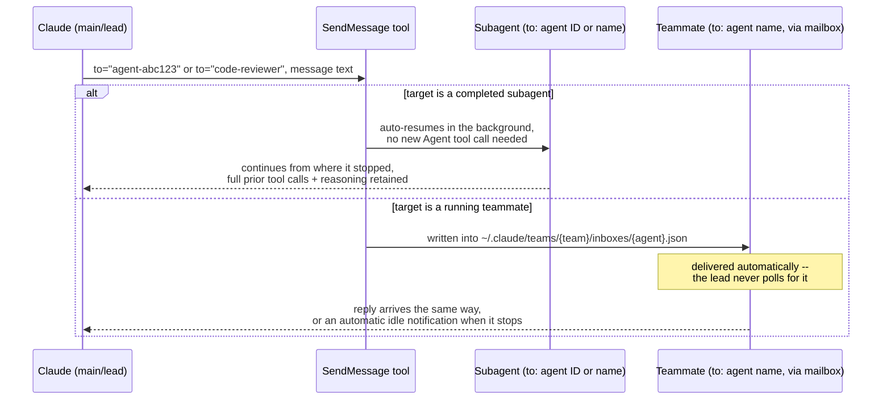
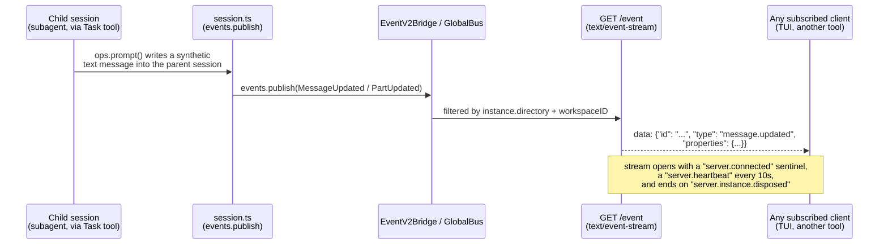

# Inter-agent messaging -- the wire format once agents are already talking

**Scope note.** [handoff-mechanism.md](handoff-mechanism.md) covers what
crosses the boundary at spawn/return time -- the initial context a new
agent instance gets and the final result it hands back.
[orchestration.md](orchestration.md) covers who holds the plan across
several agents. This page asks the question both of those deliberately
leave open: once two agent instances are already running side by side --
a resumed subagent, two agent-team teammates, two `/fleet` subtasks, a
parent session and its OpenCode child session -- what is the actual
transport and envelope a message travels over between them? Is it a
tool call, a file on disk, a server-sent-event stream, a database row? Is
delivery push or pull? Does the message carry any provenance metadata
telling the receiver who really sent it? Is there a distinction between
an ordinary natural-language message and a structured protocol message
(a shutdown request, a plan approval)? The three harnesses give three
structurally different answers, and the differences matter for anyone
building automation that assumes messaging "just works" the same way
across all of them.

---

## 1. Claude Code

Sources for this section: `code.claude.com/docs/en/sub-agents` and
`code.claude.com/docs/en/agent-teams`, both fetched 2026-07-31 (the
same two pages already cited for handoff mechanics in
[handoff-mechanism.md](handoff-mechanism.md) section 1, re-read here
specifically for the messaging layer); `code.claude.com/docs/en/hooks`,
fetched 2026-07-31, for the `TeammateIdle`/`TaskCreated`/`TaskCompleted`
hook events. VERIFIED unless tagged otherwise.

### 1.1 `SendMessage` is the one tool, used two different ways

Claude Code has exactly one tool for addressing another already-running
agent instance: `SendMessage`. It is unlisted in the permission table as
requiring no approval prompt (see [built-in-tools.md](built-in-tools.md)
section 1.1), and the docs state plainly that "`SendMessage` doesn't
require agent teams to be enabled; only structured team-protocol
messages such as `shutdown_request` and `plan_approval_response` do" --
meaning the same tool is the messaging primitive for both of the
harness's multi-agent shapes, but a second layer of structured,
named message *types* sits on top of it and is gated behind the
experimental agent-teams flag specifically.



### 1.2 Addressing: agent ID vs. agent name, and the name-collision guard

`SendMessage`'s `to` field accepts either the agent's ID (assigned when
Claude spawns it via the `Agent` tool) or the human-readable name Claude
or the user gave it at spawn time. Both addressing schemes resolve to the
same running (or resumable) instance, but they diverge once an agent
name gets reused: "As of v2.1.199, `SendMessage` checks that a name
still refers to the same agent it reached earlier in the conversation.
If a newer agent has taken the name, such as a re-spawned background
agent that reused it, Claude Code refuses the send rather than
delivering it to the wrong agent, and the error reports which agent the
name now reaches so Claude can retarget. To reach the earlier agent
while it's still running, Claude addresses it by the agent ID it
received when it spawned that agent." This is a real, dated behavior
change (the check did not exist before v2.1.199) and a concrete
consequence for anyone scripting against subagent names rather than IDs:
name-based addressing is a convenience that can silently misfire across
a re-spawn unless the ID is kept as the durable handle. The check itself
"is scoped to the current conversation and resets on `/clear`."

A second addressing wrinkle governs what happens when the target is not
currently running at all. A subagent stopped by Claude itself via the
`TaskStop` tool auto-resumes on the next `SendMessage` to it, exactly
like a naturally-completed one. But "as of v2.1.191, a subagent you
stopped yourself, with `x` in `/tasks` or an SDK `stop_task` request,
doesn't auto-resume. The `SendMessage` call returns a refusal telling
Claude the agent was cancelled" -- i.e. the messaging layer distinguishes
*who* stopped the recipient (the orchestrating agent vs. the human) and
enforces that distinction as a hard refusal rather than a silent no-op,
requiring the human to type into the subagent's own transcript in the
subagent panel to clear the stop before `SendMessage` can reach it again.

### 1.3 The mailbox: file-based, push-delivered, self-healing on malformed entries

For agent teams specifically, the architecture table in the docs names
the mailbox as its own component: "**Mailbox** -- Messaging system for
communication between agents," stored concretely as "a JSON file at
`~/.claude/teams/{team-name}/inboxes/{agent-name}.json`." Two mechanical
details matter for anyone reasoning about this as a wire format rather
than an abstraction:

- **Delivery is push, not poll.** "Teammate messages arrive at the lead
  automatically" and, in the fuller framing under Context and
  communication, "when teammates send messages, they're delivered
  automatically to recipients. The lead doesn't need to poll for
  updates." The mailbox file is the persistence layer; the delivery
  mechanism itself is not described as a filesystem-watch poll loop in
  the docs, but the observable guarantee stated is push-style automatic
  arrival.
- **Malformed entries are validated and evicted, not fatal.** "Claude
  Code validates every entry when it reads a mailbox file. Entries that
  don't match the message format are reported as errors and removed
  from the file; the valid messages are still delivered." This is a
  documented fix for a specific dated failure mode: "Before v2.1.207, a
  single malformed mailbox entry caused a repeated error every second
  and blocked delivery for that mailbox until you deleted the file
  manually" -- i.e. before that version, one bad entry in the JSON file
  was a hard, self-repeating failure for the *entire* mailbox, not just
  the one message; after it, the harness quarantines the bad entry and
  keeps delivering everything else. The exact JSON schema of a mailbox
  entry (field names beyond "message format") is not stated in the
  docs content fetched this session -- BEST CURRENT UNDERSTANDING,
  UNCONFIRMED beyond what's quoted above.

Addressing for teammate-to-teammate messaging is name-based only, one
recipient at a time: "send a message to one specific teammate by name.
To reach everyone, send one message per recipient" -- there is no
documented broadcast/multicast primitive; a message to a group is
literally N separate sends.

### 1.4 Provenance tagging and the permission-relay firewall

Every message crossing between two agent instances carries an implicit
provenance tag the receiving agent's own runtime enforces, independent
of what the message text claims: "when one agent sends another a
message over `SendMessage`, the receiving agent is told it came from
another Claude session, not from you. A teammate cannot approve a
permission prompt or supply consent on your behalf, and a teammate that
was denied an action cannot relay it to another teammate to bypass the
check." The enforcement is explicitly at the permission-classifier
level, not merely a documentation guideline: "In [auto mode], the
classifier treats an approval claim relayed from another agent as
untrusted input rather than confirmation from you." The same rule
applies identically to the subagent-resume path (section 1.2 above): "a
subagent treats messages from the agent that launched it as normal task
direction, including mid-task course corrections... no message from any
agent counts as your approval for a pending permission prompt, and no
agent message can change a subagent's permission settings, `CLAUDE.md`,
or configuration." Put together, this is a load-bearing wire-format
fact, not a soft policy: the messaging channel itself is trusted to
carry task direction, but it is structurally incapable of carrying
permission consent, and that distinction is checked on receipt, not left
to the sending agent's good behavior.

### 1.5 Structured protocol messages: a second layer above plain-text task direction

Two named, structured message types ride the same `SendMessage`
transport but are semantically distinct from ordinary task direction,
and both are gated behind agent teams specifically: `shutdown_request`
(the lead-to-teammate message asking a teammate to end gracefully,
which "the teammate can approve, exiting gracefully, or reject with an
explanation") and `plan_approval_response` (the lead's reply to a
teammate's plan-approval request, approving or rejecting with feedback,
after which "a rejected teammate stays in plan mode, revises based on
the feedback, and resubmits"). The docs name these two specifically as
requiring agent teams to be enabled, which by construction implies the
teammate-to-lead direction (the plan approval request itself) is a
comparably structured message type, though the docs content fetched this
session does not name that request-side type explicitly -- treat the
existence of a named `plan_approval_request`-shaped message as BEST
CURRENT UNDERSTANDING, UNCONFIRMED inferred from the response type being
named, not a directly quoted fact.

### 1.6 Idle notifications and hooks as the messaging-adjacent extensibility point

Beyond message delivery between agents, the harness also pushes a
distinct *notification* to the lead when a teammate's own turn ends,
without the teammate having sent anything: "when a teammate finishes and
stops, it automatically notifies the lead... a teammate whose turn ends
on an API error notifies the lead that it failed and includes the error
text, instead of appearing to finish normally" (v2.1.198+). Three hooks
give a project the ability to intercept messaging-adjacent events
before they take effect: `TeammateIdle` fires "when an agent team
teammate is about to go idle" and, if the hook exits with code 2,
"prevents the teammate from going idle, so it continues working";
`TaskCreated` fires when a shared-task-list task is being created via
`TaskCreate`, and exit code 2 "rolls back the task creation"; and
`TaskCompleted` fires when a task is being marked complete, and exit
code 2 "prevents the task from being marked as completed." None of these
three hooks support a `matcher` -- they fire on every occurrence
unconditionally. **A documentation gap found and flagged rather than
papered over:** the exact JSON input-field schema for these three hook
payloads (field names for the team name, agent identifier, and task
content) was not present in the hooks-reference content actually fetched
this session, despite two direct fetch attempts asking for it verbatim.
Treat "these three hooks exist, fire on the events named above, and
support exit-code-2 blocking" as VERIFIED, and the granular payload
field names as an open item for a future session that fetches the full
hooks-reference page successfully.

---

## 2. GitHub Copilot CLI

Sources for this section: `docs.github.com/en/copilot/how-tos/copilot-sdk/features/custom-agents`,
fetched 2026-07-31 (a broader SDK surface than the CLI specifically, per
this project's AUTHORITY OVERREACH discipline -- flagged inline);
`docs.github.com/en/copilot/concepts/agents/copilot-cli/fleet`, fetched
2026-07-31 (CLI-native, authoritative for the CLI's own `/fleet`
command); and `docs.github.com/en/copilot/how-tos/copilot-sdk/features/fleet-mode`,
fetched 2026-07-31 (again the broader SDK surface, flagged). VERIFIED
unless tagged otherwise.

### 2.1 No documented peer-to-peer channel -- messaging is lifecycle events plus a final result

Nothing fetched this session, across the CLI's own docs or the broader
SDK pages, describes a mechanism for one Copilot CLI subagent to send an
arbitrary message directly to another running subagent, or to the main
agent mid-task, the way Claude Code's `SendMessage` does. What the SDK
custom-agents page documents instead is a one-directional **event
stream**, emitted by the runtime and consumed by the parent session,
never agent-to-agent: "Events generated by sub-agents share the parent
session stream" and carry an "envelope-level `agentId`" -- confirming
each event is tagged with which subagent produced it, so a client
consuming the shared stream can attribute events to the right sub-agent,
but the flow is strictly sub-agent-to-parent-session, one direction,
never sub-agent-to-sub-agent.

```mermaid
flowchart LR
    Parent["Parent session"] -->|delegates| Sub["Sub-agent<br/>(own context window)"]
    Sub -.->|subagent.selected<br/>agentName, agentDisplayName, tools| Parent
    Sub -.->|subagent.started<br/>toolCallId, agentName, agentDisplayName, agentDescription| Parent
    Sub -.->|subagent.completed<br/>toolCallId, agentName, agentDisplayName| Parent
    Sub -.->|subagent.failed<br/>toolCallId, agentName, agentDisplayName, error| Parent
    Sub -.->|subagent.deselected<br/>(no data fields)| Parent
    Note["All events share the parent session's own event stream;<br/>each carries an envelope-level agentId.<br/>No sub-agent-to-sub-agent channel is documented."]
```

The five named event types and their data fields, quoted from the SDK
page: `subagent.selected` ("agentName, agentDisplayName, tools" --
emitted when the runtime determines a sub-agent matches the user's
intent), `subagent.started` ("toolCallId, agentName, agentDisplayName,
agentDescription" -- fired as the sub-agent begins execution in its
isolated context), `subagent.completed` ("toolCallId, agentName,
agentDisplayName" -- emitted upon successful sub-agent finish),
`subagent.failed` ("toolCallId, agentName, agentDisplayName, error" --
triggered when the sub-agent encounters an exception), and
`subagent.deselected` (emitted when the runtime switches away from the
sub-agent; the docs state this event carries no associated data
fields). Because this detail is drawn from the SDK's page rather than
the CLI's own documentation, treat it as background on the pattern the
CLI is plausibly built on, not a confirmed statement of what the CLI's
own local terminal session exposes to a script watching it -- the CLI's
own custom-agent creation page (cited in
[handoff-mechanism.md](handoff-mechanism.md) section 2.1) does not
itself describe an event stream at all, only the delegation-in/
result-out shape.

### 2.2 `/fleet`: coordination through shared state, not a messaging protocol

`/fleet`'s own CLI documentation describes subtasks communicating their
*status* to a shared coordination point, not to each other directly: a
subagent "reports completion" or "reports a blocker," which is what
drives the `pending -> in_progress -> done`/`blocked` state transitions
already diagrammed in [orchestration.md](orchestration.md) section 2.2.
That is the closest documented analogue to inter-agent messaging
Copilot CLI's `/fleet` offers, and it is a status-report channel into
shared state, not an addressable message with arbitrary content sent
from one named subagent to another. The separate SDK-level "Fleet mode"
page adds one further, flagged detail relevant here: workers are
"stateless across calls, requiring complete context provision per
invocation" -- meaning even the orchestrator-to-worker direction is not
a persistent conversational channel the way Claude Code's `SendMessage`-
resumed subagent is (section 1.2 above); each invocation of a fleet
worker is handed everything it needs fresh, because there is no ongoing
session for a later message to resume. `subagent.started`/
`subagent.completed` lifecycle events are named again at the SDK level
as streaming back to the parent, the same event-naming convention as
section 2.1. **BEST CURRENT UNDERSTANDING, UNCONFIRMED-as-absent:** no
source fetched this session or in the two related pages
([handoff-mechanism.md](handoff-mechanism.md) section 2,
[orchestration.md](orchestration.md) section 2) describes a Copilot CLI
mechanism for direct subagent-to-subagent messaging analogous to Claude
Code's mailbox; absence from the documentation fetched is not proof the
product has none, but no such mechanism was found despite specifically
looking for it across three separate pages this session.

---

## 3. OpenCode

Sources for this section: `github.com/anomalyco/opencode`, `dev`
branch, fetched via `gh api` 2026-07-31 (`packages/opencode/src/session/message.ts`,
`packages/opencode/src/session/message-v2.ts`, `packages/opencode/src/session/session.ts`,
`packages/opencode/src/bus/global.ts`, `packages/opencode/src/server/event.ts`).
Per this project's standing caveat, `dev` is not a stable release tag
and may not match the current stable release. This is the one harness
of the three where the actual message envelope and transport are
readable in real, currently-live source, one layer below anything
either other harness's docs describe.

### 3.1 There is no separate "inter-agent message" type -- agent-to-agent communication is ordinary message writes to a session

The mechanism established in [handoff-mechanism.md](handoff-mechanism.md)
section 3 -- a subagent is a real child session (`sessions.create({
parentID: ctx.sessionID, ... })`) and a background subagent's completion
is delivered back as a synthetic injected message (`ops.prompt(...)`
with `parts: [{ type: "text", synthetic: true, text: renderOutput(...) }]`)
-- has a concrete consequence for the messaging question this page asks:
OpenCode does not implement a dedicated messaging channel between agent
instances at all. What crosses from a child session back to its parent
is a **new message row written into the parent session**, exactly the
same kind of object as any user or assistant turn in that session's own
history, distinguished only by a `synthetic: true` flag on its text
part. Grepped directly from `session.ts` (`dev` branch): every
message/part mutation goes through the same `events.publish(...)` call
-- `SessionV1.Event.MessageUpdated` when a message is written or
updated, `SessionV1.Event.PartUpdated` and `MessageV2.Event.PartDelta`
as a message streams token by token, `SessionV1.Event.MessageRemoved`/
`PartRemoved` on deletion, and `SessionV1.Event.Created`/`Updated`/
`Deleted` for the session record itself. A subagent's completion
notification and an ordinary assistant reply are, at the wire-format
level, the same kind of event on the same bus -- there is no
special-cased "agent message" schema distinct from a regular chat
message.

### 3.2 The message/part schema itself, source-verified

The `Info` (message) and `Part` types (`packages/opencode/src/session/message.ts`,
cross-checked against the newer `message-v2.ts` re-export layer) define
the actual envelope any message -- human, primary agent, or subagent --
is stored and transmitted as:

```typescript
Info = {
  id: string,
  role: "user" | "assistant",
  parts: MessagePart[],   // discriminated union on "type"
  metadata: {
    time: { created: number, completed?: number },
    error?: MessageError,
    sessionID: string,
    tool: Record<string, { title, snapshot?, time: { start, end } }>,
    assistant?: {
      system: string[], modelID, providerID,
      path: { cwd, root },
      cost: number,
      summary?: boolean,
      tokens: { input, output, reasoning, cache: { read, write } },
    },
  },
}
```

`MessagePart` is a discriminated union of six part types: `text`,
`reasoning` (with optional provider metadata), `tool-invocation`
(wrapping a `ToolCall`/`ToolPartialCall`/`ToolResult`, itself
discriminated on a `state` field of `"call"`/`"partial-call"`/
`"result"`), `source-url`, `file`, and `step-start`. This is the literal
shape a subagent's completion message takes when it lands in the
parent's session: a `text`-type part (carrying the synthetic
`<task_result>`/`<task_error>`-tagged content already documented in
[handoff-mechanism.md](handoff-mechanism.md) section 3.3), attached to a
new `Info` row whose `metadata.sessionID` is the *parent's* session ID
even though the content originated in the child session's own run.

### 3.3 Transport: a real server-sent-events bus, not an abstraction



Read directly from `packages/opencode/src/server/routes/instance/httpapi/handlers/event.ts`
(`dev` branch): OpenCode's server exposes a real HTTP Server-Sent-Events
endpoint (`contentType: "text/event-stream"`, with `Cache-Control:
no-cache, no-transform` and `X-Accel-Buffering: no` headers to defeat
proxy buffering). Every event on the stream is encoded as `{ id: string,
type: string, properties: unknown }` -- the handler's own `eventData`
function wraps each payload as `JSON.stringify(data)` inside a standard
SSE `data:` field. Delivery is filtered per-connection: events are
dropped unless `event.location?.directory === instance.directory` and
the workspace ID matches (when a workspace ID is present), so a client
connected to one project/workspace never sees another project's
message traffic. The stream's own lifecycle is explicit in source: it
opens with a synthetic `server.connected` event before any real traffic
so a client can distinguish "connected, no events yet" from "not
connected"; a `server.heartbeat` event fires every 10 seconds
(`Stream.tick("10 seconds")`) purely to keep the connection alive
through intermediate proxies; and the stream terminates -- `takeUntil`
-- the moment a `server.instance.disposed` event arrives, which is
itself sourced from a separate in-process `GlobalBus` (an
`EventEmitter`) rather than the per-session event pipeline, since it
signals the whole server instance shutting down rather than anything
about one session.

**What this means for the "inter-agent messaging" question specifically:**
there is no OpenCode-specific concept of a message routed *between*
agents at the transport layer. A parent session and its child
(subagent) session are just two rows in the same session table; the
child's completion is one more message written into the parent's row;
and that write is observed, like every other message write in the
system, through the same directory-scoped SSE event stream that also
serves the TUI's own live view of an ordinary human-facing
conversation. Any tooling that wants to observe "an agent messaging
another agent" in OpenCode is, mechanically, watching for
`MessageUpdated`/`PartUpdated` events whose `sessionID` is a session
with a non-null `parentID` (established in
[handoff-mechanism.md](handoff-mechanism.md) section 3.1) -- there is no
separate event type, header, or channel name distinguishing an
inter-agent message from a human-facing one.

---

## 4. Synthesis

| Dimension | Claude Code (`SendMessage`) | Copilot CLI | OpenCode |
|---|---|---|---|
| Transport | Tool call, resolved to either an in-conversation resume or a filesystem mailbox write | One-directional event stream (SDK-documented); no CLI-confirmed transport for a peer channel | Real HTTP Server-Sent-Events endpoint (`text/event-stream`), source-verified |
| Message envelope | Natural-language "task direction" for ordinary messages; two named structured types (`shutdown_request`, `plan_approval_response`) for agent-team protocol messages | Named lifecycle events with fixed field sets per type (`agentName`, `toolCallId`, `error`, etc.) -- not a general-purpose message, a fixed event schema | A generic `Info` message row (`role`, `parts[]`, `metadata`) -- the same schema for every message in the product, human or agent-originated |
| Addressing | Agent ID (durable across name reuse) or agent name (collision-checked as of v2.1.199) | `agentId` tag on each event, attributing it to the sub-agent that produced it -- not an address a message is sent *to* | `sessionID` (a session with a `parentID` is a subagent's session); no separate agent-address concept beyond the session ID itself |
| Push vs. pull | Push: "the lead doesn't need to poll for updates"; mailbox delivered automatically | Push: events "share the parent session stream" | Push: SSE stream, plus a `server.heartbeat` keepalive so a client can tell "connected, idle" from "disconnected" |
| Peer-to-peer (agent-to-agent, not just parent-child) | Yes -- agent teams: "teammates message each other directly," one send per recipient, no broadcast primitive | Not found in any source fetched this session, across three separate pages researched | Not applicable in the same sense -- there is no peer concept; every message is a write into *some* session's own row, parent or child |
| Provenance / trust boundary on receipt | Enforced at the permission-classifier level: a message is tagged as coming from another agent, not the human, and cannot carry approval consent | Not documented -- no permission-relay discussion found for Copilot CLI's sub-agent events | Not documented as a trust boundary; the message schema itself carries no sender-trust field distinct from `role: "user" | "assistant"` |
| Malformed-message handling | Documented, dated fix: bad mailbox entries are validated, reported as errors, and evicted individually (v2.1.207+); before that, one bad entry blocked the whole mailbox | Not documented | Not documented as a distinct failure mode; ordinary schema validation (Effect's `Schema.Struct`) applies to every message row generally |
| Extensibility hook for messaging-adjacent events | Three dedicated hooks (`TeammateIdle`, `TaskCreated`, `TaskCompleted`), each supporting exit-code-2 blocking, no `matcher` support | Not found | The same generic SSE stream any external tool could subscribe to; no dedicated hook system found for messaging specifically |
| Verifiability | Docs-only (closed-source product) | Docs-only, and thinner than the other two on this specific question | Docs **and** live `dev`-branch source, cross-checked end to end (schema file, publish call sites, SSE handler) |

**The design lesson.** The three harnesses answer "how does a message
actually get from one agent instance to another" in three
architecturally different ways that track each product's broader
design. Claude Code treats messaging as a first-class, permissioned
capability with its own tool, its own addressing scheme with a
documented collision guard, a persisted mailbox file with documented
error-recovery behavior, and an explicit trust boundary enforced on
receipt -- because agent teams are built around agents that genuinely
need to talk *to each other*, not just report to a parent. Copilot CLI,
by contrast, has no documented peer channel at all: its multi-agent
surfaces (custom-agent subagents, `/fleet`) are both parent-mediated,
and the only "messaging" a source confirms is a one-directional
lifecycle-event stream a client can observe, plus a shared todo-state
table subagents report status into -- there is nothing to point at and
call "the wire format for agent A talking to agent B" because that
capability itself isn't confirmed to exist. OpenCode is the most
unusual of the three: it has no dedicated inter-agent messaging concept
whatsoever, because it doesn't need one -- a subagent is just another
session, a message is just a row in that session (or, via the synthetic
completion write, in its parent's session), and the transport is the
same general-purpose SSE event bus that already serves every other
kind of live update in the product. A workflow built assuming "there's
a message format I can point at, specific to agent-to-agent
communication" will find a rich, dedicated one on Claude Code, will
find only an observational event stream and a status-report channel on
Copilot CLI, and will find that the question dissolves entirely on
OpenCode into "which session is this message actually a part of."

---

## Sources

**Claude Code (authoritative for Claude Code's documented behavior only), fetched 2026-07-31:**
- `https://code.claude.com/docs/en/sub-agents` -- `SendMessage` tool
  mechanics: addressing by agent ID or name, the v2.1.199 name-collision
  guard, auto-resume of a completed or `TaskStop`-stopped subagent, the
  v2.1.191 refusal behavior for a human-stopped subagent, the
  permission-relay restriction on messages between an orchestrator and a
  subagent.
- `https://code.claude.com/docs/en/agent-teams` -- mailbox architecture
  (`~/.claude/teams/{team}/inboxes/{agent}.json`), automatic push
  delivery, the v2.1.207 malformed-mailbox-entry validation/eviction fix
  and its pre-fix failure mode, name-based one-recipient-at-a-time
  teammate addressing, idle notifications (including the v2.1.198
  API-error notification behavior), the `shutdown_request`/
  `plan_approval_response` structured message types, and the
  provenance/trust-boundary statement for `SendMessage` between peers.
- `https://code.claude.com/docs/en/hooks` -- existence, firing
  conditions, and exit-code-2 semantics of the `TeammateIdle`,
  `TaskCreated`, and `TaskCompleted` hooks. Two direct fetches this
  session did not surface the hooks' detailed JSON input-field schema;
  that gap is flagged explicitly in section 1.6 above rather than
  assumed or invented.

**GitHub Copilot CLI (authoritative for Copilot CLI's own documented
behavior only), fetched 2026-07-31:**
- `https://docs.github.com/en/copilot/concepts/agents/copilot-cli/fleet` --
  `/fleet`'s status-report coordination shape (subagents "report
  completion"/"report a blocker" into shared todo state), the closest
  CLI-confirmed analogue to inter-agent messaging this section found.

**Adjacent, broader SDK surface -- checked for background on the
underlying pattern, not treated as confirmed CLI-internal behavior
(AUTHORITY OVERREACH guard), fetched 2026-07-31:**
- `https://docs.github.com/en/copilot/how-tos/copilot-sdk/features/custom-agents` --
  the five named `subagent.*` lifecycle events and their documented data
  fields, the "share the parent session stream"/"envelope-level
  `agentId`" framing, and the explicit absence of any described
  sub-agent-to-sub-agent channel.
- `https://docs.github.com/en/copilot/how-tos/copilot-sdk/features/fleet-mode` --
  the SDK-level Fleet-mode detail that workers are "stateless across
  calls, requiring complete context provision per invocation," and the
  same `subagent.started`/`subagent.completed` event-naming convention
  at the SDK level.

**OpenCode (authoritative for OpenCode's documented behavior AND, this
session, its own real implementation), `dev` branch via `gh api`,
fetched 2026-07-31 -- standing caveat: `dev` is not a stable release
tag and may not match the current stable release:**
- `packages/opencode/src/session/message.ts` and
  `packages/opencode/src/session/message-v2.ts` -- the `Info`/`Part`
  message schema (role, parts discriminated union, metadata including
  per-tool timing and assistant token/cost accounting), and the
  `Event` re-export naming `MessageUpdated`/`MessageRemoved`/
  `PartUpdated`/`PartDelta`/`PartRemoved`.
- `packages/opencode/src/session/session.ts` -- grepped directly for
  every `events.publish(...)` call site, confirming which session/
  message/part mutations actually fire which named event, including the
  session-level `Created`/`Deleted`/`Updated` events alongside the
  message-level ones.
- `packages/opencode/src/bus/global.ts` -- the in-process `GlobalBus`
  (`EventEmitter`-based), used specifically for cross-cutting events
  like `server.instance.disposed` that aren't scoped to one session.
- `packages/opencode/src/server/routes/instance/httpapi/handlers/event.ts` --
  the actual SSE HTTP handler: `text/event-stream` response, the
  `{id, type, properties}` event envelope, directory/workspace-scoped
  filtering, the `server.connected` sentinel, the 10-second
  `server.heartbeat`, and stream termination on
  `server.instance.disposed`.
- Cross-referenced without re-fetching this session:
  `packages/opencode/src/tool/task.ts` and
  `packages/opencode/src/tool/task.txt`, already fetched and cited in
  [handoff-mechanism.md](handoff-mechanism.md) section 3, for the
  synthetic-message injection mechanism this page builds on.
