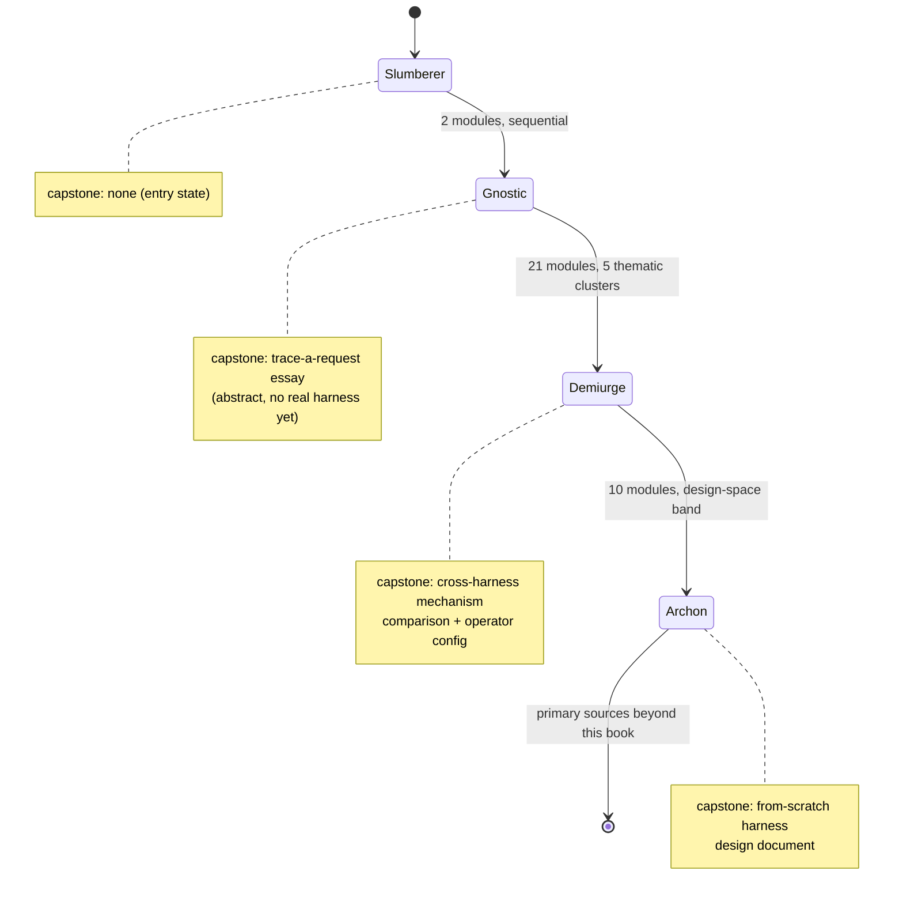
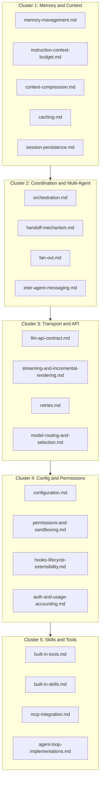

# Knowledge-path curriculum: a course skeleton for the three tier transitions

## What this page is, and what it is not

This page is a **curriculum scaffold**, not a research page. Every other
page in this wiki-book (including
[reader-proficiency-tiers.md](reader-proficiency-tiers.md), which this
page directly expands) makes claims about how Claude Code, GitHub
Copilot CLI, or OpenCode actually behave, each tagged VERIFIED or BEST
CURRENT UNDERSTANDING, UNCONFIRMED per this book's grounding discipline.
This page makes no new claims of that kind. It takes the three named
transitions from `reader-proficiency-tiers.md` -- Slumberer to Gnostic,
Gnostic to Demiurge, Demiurge to Archon -- and turns each tier's flat
reading list into a teachable unit: learning objectives, one module per
source page with key concepts / a comprehension check / an applied
exercise, and a capstone that proves the transition actually happened
rather than merely that the pages were opened.

Two consequences follow from that scope. First, every factual detail
this page cites about what a given source page covers (a config key, a
tool name, a mechanism) is inherited from that source page's own
grounding, not re-verified here -- if a module's "key concepts" line
names `CLAUDE_CODE_MAX_RETRIES` or `PostToolUse`, the authority for that
claim is [retries.md](retries.md) or
[hooks-lifecycle-extensibility.md](hooks-lifecycle-extensibility.md)
itself, cited by reference, not re-fetched for this page. Second, the
comprehension-check questions, exercise prompts, and capstones below are
this page's own original pedagogical design (like the tier names
themselves), not a researched claim about how anyone actually learns --
treat them as a first-draft course skeleton to be iterated on when
actual courses/exercises get built from it, not as a finished syllabus.

---

## Transition 1: Slumberer -> Gnostic

**Overview.** The Slumberer treats the harness as an undifferentiated
black box and debugs by rephrasing prompts; the cognitive shift this
transition asks for is the acquisition of a *vocabulary and a map* --
the learner stops asking "why did the model do that" and starts asking
"which stage of the loop produced that." This is a conceptual-only
transition: per `reader-proficiency-tiers.md`, a Gnostic can describe a
harness abstractly and correctly but has not yet traced that
description through any one harness's real, documented machinery --
that tracing is deferred to the next transition on purpose.

**Learning objectives.** By the end of this band, the learner can:
- State what a "harness" is as an engineering artifact distinct from
  the LLM it wraps, and name at least three things a harness typically
  adds (tool access, memory/instruction injection, permission gating).
- Place any given agent system on agent-topology.md's own axes:
  reactive vs. deliberative, single-agent vs. multi-agent,
  tool-augmented vs. fully autonomous.
- Describe the Thought/Action/Observation cycle and the ReAct pattern
  by name, and explain the while-loop framing of an agent's main loop.
- Explain the stop-and-parse distinction and contrast JSON-mode, code-
  generating, and native function-calling agents as three different
  ways a loop decides "the model wants to call a tool."
- Given a real, unlabeled transcript of an agent session, annotate
  which lines are Thought, which are Action, and which are Observation.

### Session breakdown (agenda only), Slumberer -> Gnostic

A pacing layer chunking this transition's two modules into three
schedulable teaching sessions (5/4/3 items respectively, sized so no
sitting is overloaded or too thin to be worth convening) now lives at
`resources/airchon-teacher/slumberer-to-gnostic-sessions.md`
-- moved there 2026-08-17, out of this page, since session-pacing for
actually running a course is scoped to `airchon-teacher`'s own domain
and is explicitly downstream work that agent doesn't do itself (see
its Constraints & Scope), not general wiki-book research content. This
page's learning objectives, modules, comprehension checks, and
exercises below are still the authoritative source that file's agendas
point back to -- it adds pacing, not new content.

### Module: A topology of agentic systems ([agent-topology.md](agent-topology.md))

**Key concepts:** reactive vs. deliberative agents; single-agent vs.
multi-agent systems as a topology axis (not yet the mechanics -- those
live in orchestration.md/fan-out.md/inter-agent-messaging.md in the next
band); the "LLM + tools + memory + planning" component decomposition,
and how it differs in scope from Anthropic's own narrower usage and
from the Hugging Face agents course's / Lilian Weng's broader ones.

**Comprehension check:** Name the four axes agent-topology.md uses to
classify an agentic system, and state which one distinguishes "a
chatbot with a calculator plugin" from "a fully autonomous coding
agent."

**Exercise:** Pick any AI coding tool you have personally used (an IDE
autocomplete plugin counts). Place it on all four of agent-topology.md's
axes and write two sentences justifying each placement.

### Module: The agent loop ([agent-loop.md](agent-loop.md))

**Key concepts:** the Thought/Action/Observation cycle and the ReAct
pattern; the while-loop framing (observations appended back into the
prompt, loop continues until a stop condition); the stop-and-parse
distinction between "the model emitted plain text" and "the model
emitted a structured tool call," and how JSON-mode, code-generating, and
function-calling agents each resolve that distinction differently.

**Comprehension check:** In the ReAct while-loop framing, what
specifically gets appended to the prompt after a tool executes, and why
does that step have to happen before the loop can produce its next
Thought?

**Exercise:** Take a real multi-step agent transcript (your own session
history, or a shared example) and rewrite it as an explicit
Thought/Action/Observation-labeled trace, one loop iteration per block,
stopping at the first point where the model's next action depended on
an observation from two iterations earlier.

### Capstone: trace-a-request essay (no real harness yet)

Write a 300-500 word abstract description of what happens between a
user typing a coding request and a tool call executing, using only the
vocabulary from these two pages (Thought/Action/Observation, ReAct,
while-loop, stop-and-parse, reactive/deliberative, single/multi-agent).
The essay must not name any concrete harness's actual config keys, file
paths, or tool names -- that concreteness is the next transition's job,
and reaching for it here is the most common way learners short-circuit
this capstone. A grader checks two things: (1) every loop-vocabulary
term is used correctly, and (2) the essay stays at the abstract level
agent-topology.md/agent-loop.md themselves stay at.

---

## Transition 2: Gnostic -> Demiurge

**Overview.** The Gnostic has the map but has never walked the real
terrain: this transition is where abstract loop vocabulary gets
attached to actual config keys, file paths, tool names, and named
limits inside a real harness. The cognitive shift is from "I can
describe a permission system" to "I can say which of Claude Code's six
permission modes a given `settings.json` block selects, and what
Copilot CLI's or OpenCode's equivalent looks like." Per
`reader-proficiency-tiers.md`, a Demiurge can also operate at
power-user/administrator depth (hooks, permission rules, MCP servers)
and compare the same mechanism across all three harnesses -- that
cross-harness comparison is the band's defining exercise shape, not an
optional extra.

**Learning objectives.** By the end of this band, the learner can:
- For any of the five clusters below, name the specific config
  key/file path/tool name each of Claude Code, Copilot CLI, and
  OpenCode uses for that mechanism, not just a generic description of
  the mechanism.
- Trace a single concrete request (e.g. "edit this file, hit a context
  limit, and confirm a shell command") through a real harness's actual
  documented machinery end to end, citing the specific limit or gate it
  crosses at each stage.
- Read one harness's real settings/config file and correctly explain
  what each key does and where it sits in that harness's precedence
  hierarchy.
- Distinguish mechanisms that are easy to conflate because they sit
  next to each other in the loop (e.g. context-compression.md's
  mid-run eviction vs. memory-management.md's compaction-survival vs.
  instruction-context-budget.md's eager-load budget) by naming which
  lifecycle stage each one actually operates at.
- Compare the same mechanism (memory, orchestration, permissions,
  retries, auth) across all three harnesses and state, with citations,
  where they genuinely converge and where they genuinely diverge.

The 21-page core-mechanics band is grouped into five thematic clusters
below to make it navigable as a course. The clusters are this page's own
organizing device, not a distinction drawn by the source pages
themselves -- several pages (session-persistence.md, memory-management.md)
explicitly cross-reference each other across cluster boundaries, and a
course built from this skeleton should preserve those cross-references
rather than teach the clusters as hermetically sealed units.

### Session breakdown (agenda only), Gnostic -> Demiurge

A pacing layer chunking this transition's 21 modules into 27
schedulable teaching sessions (organized around the five clusters
above: one session per module, plus one per-cluster synthesis session,
plus a final capstone session) now lives at
`resources/airchon-teacher/gnostic-to-demiurge-sessions.md`
-- scoped to `airchon-teacher`'s own domain rather than kept as general
wiki-book content, the same reasoning and the same day's precedent as
Transition 1's session breakdown (see that transition's own pointer
paragraph above and `CHANGELOG.md`). This page's learning objectives,
clusters, modules, comprehension checks, exercises, and capstone below
remain the authoritative source that file's agendas point back to -- it
adds pacing, not new content.

### Cluster 1: Memory & Context

**Cluster overview:** how instructions get loaded eagerly, how a live
run's context gets shrunk when it fills up, how a completed session
survives a process restart, and how a server reuses a previously-sent
prefix instead of resending it -- four operations on the same resource
(the context window) that are easy to conflate and that these five
pages deliberately keep apart.

#### Module: Memory management ([memory-management.md](memory-management.md))

**Key concepts:** instruction-file hierarchies (e.g. `CLAUDE.md` load
order); Claude Code's auto-memory vs. Copilot's server-side Copilot
Memory; injection timing and compaction-survival (what memory content
does or does not survive a compaction event).

**Comprehension check:** What is the practical difference between
memory content that is "eagerly loaded" and memory content that is
"reloaded on edit," and which of the two does this page document as
mid-session-edit-aware?

**Exercise:** Pick one harness's memory-file mechanism documented on
this page. Write a memory file that intentionally tests the load-order
rule the page describes (e.g. a project-level file meant to override a
user-level one) and predict which content wins before checking the
harness's actual behavior.

#### Module: Instruction context budget ([instruction-context-budget.md](instruction-context-budget.md))

**Key concepts:** why `@`-style imports don't reduce eager-load cost;
path-scoped rules (`paths:`) vs. `applyTo:` as two harnesses' answers to
the same scoping problem; skills as the invoke-only (lazy-load) tier
contrasted with the eager-load tier.

**Comprehension check:** Name one lever each harness offers for
trimming what loads eagerly into the budget, and explain why moving
content into a skill changes its loading cost.

**Exercise:** For a harness of your choice, measure (using the
mechanism this page documents for "how to measure what loaded") how
much of your actual context budget a real project's instruction files
consume, then propose one concrete change to reduce it without losing
information.

#### Module: Context compression ([context-compression.md](context-compression.md))

**Key concepts:** mid-run compression as distinct from eager-load
budget and from compaction-survival; Claude Code's evict-then-summarize
two-phase mechanism and its auto-compact default; OpenCode's
source-verified `prune()`/`process()` pipeline.

**Comprehension check:** At what proportion of context capacity does
each harness this page documents trigger its compression mechanism, and
what does "evict-then-summarize" mean as opposed to "summarize
everything"?

**Exercise:** Deliberately drive a real session past a documented
compression trigger point (e.g. by pasting large file contents
repeatedly) and record, turn by turn, what the harness evicted first
versus what it preserved as summary.

#### Module: Caching ([caching.md](caching.md))

**Key concepts:** server-side prefix reuse as distinct from compression
(shrinking) and memory loading; cache scope and TTL-by-auth-path;
subagent/fork cache-inheritance behavior.

**Comprehension check:** Name one action documented on this page that
invalidates a cache and one that preserves it, and explain why editing
an early system-prompt section is more expensive than appending a new
user message.

**Exercise:** For one harness, construct two versions of the same
session -- one that only appends new turns, one that edits an early
turn -- and use the harness's own token/cost accounting to observe the
cache-hit difference this page predicts.

#### Module: Session & transcript persistence ([session-persistence.md](session-persistence.md))

**Key concepts:** single-session durability across process restarts, as
distinct from mid-run compaction-survival and agent-to-agent handoff;
what a `--resume`/`--continue`-style command actually restores vs.
leaves behind; fork/branch semantics vs. an in-place undo mechanism.

**Comprehension check:** For one harness this page documents, name the
literal file path or storage backend a session transcript is written
to, and state one thing a resume command does *not* restore.

**Exercise:** Kill a real harness process mid-session (not gracefully
exit it), then use its documented resume mechanism to recover. Compare
what actually came back against what this page's own documentation
predicted would and wouldn't survive.

### Cluster 2: Coordination & Multi-Agent

**Cluster overview:** once a task needs more than one agent, four
separable questions arise -- who holds the overall plan, how a new
agent gets spawned and what crosses that spawn boundary, how many
agents run concurrently and how that's throttled, and what wire format
agents use to talk to each other once running. Each of these four pages
answers exactly one of those questions.

#### Module: Orchestration ([orchestration.md](orchestration.md))

**Key concepts:** the general orchestrator/manager-agent concept; Claude
Code's turn-by-turn model vs. its script-held Dynamic-workflows plan
(`agent()`/`pipeline()`); Copilot CLI's `/fleet` orchestrator agent;
OpenCode's primary-agent/subagent taxonomy.

**Comprehension check:** What is the difference between a
"turn-by-turn" orchestration model and a "script-held plan" model, and
which harness/feature pair on this page instantiates each?

**Exercise:** Design (on paper, no code required) a script-held plan for
a 3-stage task using the `agent()`/`pipeline()` primitives this page
documents, and identify where in your plan the documented
concurrency/total-agent cap would bind.

#### Module: Handoff mechanism ([handoff-mechanism.md](handoff-mechanism.md))

**Key concepts:** agent-to-agent context transfer specifically (not
compaction survival); Claude Code's fresh-context subagents vs. named
resumeable ones; OpenCode's `Task` tool (`session.create(parentID)`,
`task_id` resume).

**Comprehension check:** When Claude Code spawns a subagent, does that
subagent start with a fresh context or an inherited one, and what
mechanism resumes it later?

**Exercise:** Spawn a real subagent/subtask in one harness this page
documents, deliberately give it a task that requires information from
the parent's context, and observe exactly what did and didn't cross
the handoff boundary.

#### Module: Fan-out (subagent dispatch) ([fan-out.md](fan-out.md))

**Key concepts:** launch mechanics distinct from handoff (what crosses)
and orchestration (who holds the plan); Claude Code's three distinct
fan-out layers with their concurrency/depth caps; OpenCode's
`FiberSet`-based concurrent dispatch.

**Comprehension check:** Name the three distinct fan-out layers this
page documents for Claude Code, and state which one has no documented
hard concurrency cap.

**Exercise:** Trigger a real parallel-subagent dispatch in one harness
and count how many ran concurrently against the documented cap; if the
harness lets you exceed the apparent default, identify which config key
you changed to do it.

#### Module: Inter-agent messaging ([inter-agent-messaging.md](inter-agent-messaging.md))

**Key concepts:** the wire format/transport once agents are already
talking; Claude Code's `SendMessage` tool and file-based mailbox;
OpenCode's finding of no dedicated inter-agent message type at all
(ordinary message rows over the same SSE bus).

**Comprehension check:** Contrast Claude Code's messaging architecture
with OpenCode's on this page: which one has a dedicated addressed
mailbox, and which one treats agent-to-agent communication as
indistinguishable from any other session event?

**Exercise:** For a harness with a documented peer-to-peer channel,
construct a two-agent scenario where one agent must wait on a
structured protocol message (e.g. a shutdown or plan-approval message)
from the other, and trace the message through the mechanism this page
documents.

### Cluster 3: Transport & API

**Cluster overview:** the wire-level layer every other cluster assumes
already works -- how a single outbound model request is framed, how it
streams back, how failure on that single request gets retried, and how
the harness picks which model answers a given step.

#### Module: The LLM API contract ([llm-api-contract.md](llm-api-contract.md))

**Key concepts:** Anthropic's Messages API (`tool_use`/`tool_result`
blocks, the `stop_reason` enumeration, the SSE event sequence); OpenAI's
Responses API (`tool_calls`/`call_id`, `finish_reason`); OpenCode's
source-verified `Protocol`/`Endpoint`/`Auth`/`Framing` route
decomposition unifying both.

**Comprehension check:** Name the SSE event sequence Anthropic's
Messages API emits from `message_start` to `message_stop`, and identify
which event carries an in-progress tool-call argument delta.

**Exercise:** Capture a raw streamed API response from one documented
provider (via a debug/verbose flag if the harness exposes one) and
manually annotate each SSE event against this page's own event
taxonomy.

#### Module: Streaming & incremental rendering ([streaming-and-incremental-rendering.md](streaming-and-incremental-rendering.md))

**Key concepts:** the client/UI-side layer above the wire-level SSE
contract; buffering/reassembly/pacing discipline; Claude Code's
delta-coalescing history as a concrete performance-engineering example.

**Comprehension check:** Why does this page distinguish "reassembly at
the JSON-parsing level" from "buffering and pacing," and does any
harness this book covers attempt to parse a genuinely incomplete
tool-call JSON object mid-stream?

**Exercise:** Force a slow/degraded network condition against a real
harness session and observe how its rendering degrades -- does it
buffer visibly, coalesce deltas, or fail to reassemble -- and map the
observed behavior back to a mechanism this page names.

#### Module: Retries ([retries.md](retries.md))

**Key concepts:** failure recovery on a single outbound request, as
distinct from context-overflow handling and cache-prefix reuse; Claude
Code's `CLAUDE_CODE_MAX_RETRIES`/retry-vs-not category list; OpenCode's
two-layer transport-retry-wrapped-by-whole-turn-retry architecture.

**Comprehension check:** What is the practical difference between
OpenCode's bounded transport retry and its wrapping whole-turn retry
this page documents, and which of the two is described as effectively
uncapped?

**Exercise:** Deliberately induce a retryable failure (e.g. hit a rate
limit or kill network briefly) against a real harness and observe how
many attempts it makes and at what backoff interval, comparing against
the documented default.

#### Module: Model routing / selection ([model-routing-and-selection.md](model-routing-and-selection.md))

**Key concepts:** which underlying model answers a given step; Claude
Code's four-tier session-model precedence stack; Copilot CLI's Auto
model selection two-system router; OpenCode's `defaultModel()`
startup-resolution algorithm.

**Comprehension check:** For one harness this page documents, list its
model-selection precedence order from highest to lowest priority, and
name one config key or flag at each level.

**Exercise:** Override a harness's model selection at two different
precedence levels simultaneously (e.g. an env var and a settings file)
and verify which one actually wins, against this page's documented
precedence order.

### Cluster 4: Config & Permissions

**Cluster overview:** the general settings/config-file system, the
enforcement architecture that turns permission rules into actual
runtime gates, the mechanism for user-side code to sit inside the
loop's control flow, and how identity/spend get tracked and enforced.

#### Module: Configuration ([configuration.md](configuration.md))

**Key concepts:** Claude Code's four-scope `settings.json` hierarchy
(Managed/User/Project/Local); Copilot CLI's `~/.copilot` layout and
precedence chain; OpenCode's `mergeConfigConcatArrays()` eight-source
merge order.

**Comprehension check:** For one harness, name its full config
precedence chain from highest to lowest authority, and identify one
documented exception to strict precedence (e.g. a merge rather than an
override).

**Exercise:** Set the same setting at two different scopes in one
harness's config hierarchy (e.g. a User-scope and a Project-scope
value) and confirm which one wins in practice, then locate the
documented merge exception if the setting is one that merges rather
than overrides.

#### Module: Permissions & sandboxing architecture ([permissions-and-sandboxing.md](permissions-and-sandboxing.md))

**Key concepts:** the enforcement architecture underneath the
permission-rule schema; Claude Code's OS-level sandboxed-Bash
two-layer (filesystem/network) design and its named escape hatches;
OpenCode's finding that it ships no OS-level sandbox at all.

**Comprehension check:** Name Claude Code's two independent sandbox
layers for its Bash tool and one documented escape hatch that
deliberately bypasses one of them.

**Exercise:** Configure the strictest permission mode a harness offers,
then deliberately attempt an action you expect to be denied (a
filesystem write outside an allowed directory, or a network call) and
document the exact denial message and which layer produced it.

#### Module: Hooks and lifecycle extensibility ([hooks-lifecycle-extensibility.md](hooks-lifecycle-extensibility.md))

**Key concepts:** the mechanism for user-side code to sit directly
inside the loop's control flow; Claude Code's ~30-event catalogue and
exit-code-2-only-blocks rule; OpenCode's two-surface plugin model
(generic `event` bus vs. typed `Hooks` interface functions).

**Comprehension check:** In Claude Code's hook model, what specific
exit code from a hook handler blocks the action it's attached to, and
what do other non-zero exit codes do instead?

**Exercise:** Write a real hook (in any one harness this page
documents) that fires on a tool-call lifecycle event and deliberately
blocks one specific tool invocation, then verify the block actually
happens and inspect what payload your hook received.

#### Module: Auth & usage accounting ([auth-and-usage-accounting.md](auth-and-usage-accounting.md))

**Key concepts:** API-key/OAuth handling and precedence; token/cost
tracking surfaces (e.g. `/usage`); the three genuinely distinct
budget-enforcement mechanisms this page documents at three different
layers (SDK-level, workflow-level, org-level).

**Comprehension check:** Name Claude Code's full authentication
precedence stack from highest to lowest priority, and identify which of
the three documented budget-enforcement layers is the only one that
counts subagent spend toward a shared cap.

**Exercise:** Configure two competing auth sources for one harness
(e.g. an API key env var and an OAuth login) and verify which one wins,
matching it against this page's documented precedence order.

### Cluster 5: Skills & Tools

**Cluster overview:** the tool surface itself, what ships as a
default-on skill vs. user-authored content, how MCP servers get
discovered/registered/invoked, and the harness-specific companion to
the general agent-loop page -- how the abstract loop actually gets
implemented in real code.

#### Module: Built-in tools ([built-in-tools.md](built-in-tools.md))

**Key concepts:** the full tool inventory per harness (Claude Code's
`tools-reference` table, Copilot CLI's permission-"kind" vocabulary,
OpenCode's `allow`/`ask`/`deny` model); the `Edit` tool's three-gate
check as a named concrete mechanism.

**Comprehension check:** What does "permission-required" mean as a
column in Claude Code's own tools-reference table, and name one tool
that requires it and one that doesn't.

**Exercise:** For one harness, enumerate every built-in tool it exposes
in a real session (via a documented introspection command if one
exists) and classify each as permission-required or not, checking your
classification against the page's own table.

#### Module: Built-in skills ([built-in-skills.md](built-in-skills.md))

**Key concepts:** what ships as a skill by default vs. user-authored
content; Claude Code's bundled-skill set and `disableBundledSkills`/
`skillOverrides` visibility controls; OpenCode's finding of no
confirmed bundled skills at all.

**Comprehension check:** Name two of Claude Code's bundled skills this
page documents, and state what `disableBundledSkills` controls.

**Exercise:** Disable one bundled skill in a harness that supports it,
confirm the skill is genuinely unavailable in a real session, then
re-enable it and confirm it returns.

#### Module: MCP integration ([mcp-integration.md](mcp-integration.md))

**Key concepts:** discovery/registration/invocation of MCP servers;
config formats and transports across harnesses; tool-calling semantics
once a server is registered.

**Comprehension check:** Name one config file format used to register
an MCP server in one harness this page documents, and describe the
transport it uses to actually talk to that server.

**Exercise:** Register a real MCP server (any publicly available one)
with one harness following this page's documented config format, and
verify its tools appear and are invocable in a live session.

#### Module: Agent loop implementations ([agent-loop-implementations.md](agent-loop-implementations.md))

**Key concepts:** the harness-specific companion to the general
agent-loop page; Claude Code's Agent SDK-documented loop (turns,
`max_turns`/`max_budget_usd`, compaction, parallel tool execution) vs.
OpenCode's source-verified loop (`packages/core/src/session/runner/max-steps.ts`).

**Comprehension check:** What does `max_turns` bound in Claude Code's
documented Agent SDK loop, and how does that differ from what
`max_budget_usd` bounds?

**Exercise:** Drive a real session past a documented turn or step limit
(Claude Code's `max_turns` or OpenCode's step-limit system-prompt
injection) and observe exactly what happens when the limit is hit --
does the loop halt, warn, or inject a new instruction?

### Capstone: cross-harness mechanism comparison + operator configuration

Choose one cluster above. For that cluster's mechanism (e.g. "how
context gets compressed mid-run," or "how a permission decision gets
enforced"), produce two artifacts: (1) a comparison table with one row
per harness (Claude Code, Copilot CLI, OpenCode) naming the specific
config key/file path/tool name/limit each uses for that mechanism, with
a citation to the source page for each cell; and (2) a real, working
configuration file (a `settings.json`, a hooks config, a permission
rule set, etc.) for at least one of those harnesses that deliberately
exercises the documented limit or gate -- not a toy example, a
configuration you actually ran against a live session and can show the
output of. A grader checks that the table's cells are traceable to the
cited page (not invented) and that the configuration artifact actually
does what it claims when run.

---

## Transition 3: Demiurge -> Archon

**Overview.** The Demiurge can operate any of the three harnesses at
administrator depth but has been working from a settled, shipped
design; the cognitive shift this transition asks for is moving from
"trace what exists" to "justify what should exist, including where
nothing shipped has a settled answer yet." Per
`reader-proficiency-tiers.md`, the Archon can read design-space pages
critically and argue from primitives, and can design tool schemas,
testing pyramids, multi-agent topologies, and observability strategies
from scratch -- the ten pages in this band are original design-space
surveys and syntheses, not single-harness research reports, and the
exercises below are correspondingly generative rather than
observational.

**Learning objectives.** By the end of this band, the learner can:
- Take a documented negative finding (a mechanism no shipped harness
  implements, per one of these pages) and produce a from-scratch design
  sketch for it, reusing named primitives already documented elsewhere
  in this book rather than inventing new infrastructure gratuitously.
- Critique a shipped design choice (e.g. Claude Code's `TodoWrite`->
  `Task*` split) against a named external design principle (e.g.
  Anthropic's own tool-consolidation guidance) and argue whether the
  divergence is a mistake, a tradeoff, or an artifact of history.
- Design a tool schema, a testing pyramid, a multi-agent topology, or
  an observability strategy for a hypothetical new harness feature,
  citing the primitives and literature these ten pages ground their own
  arguments in.
- Distinguish a genuine technical ceiling from a deliberate,
  team-specific scope decision when a page raises that question, and
  argue for one interpretation using the page's own evidence.

### Session breakdown (agenda only), Demiurge -> Archon

A pacing layer chunking this transition's 10 modules into 13
schedulable teaching sessions (organized around a two-way split this
band's own pages already draw for themselves in `index.md` -- five
design-space/original-survey modules and five production-completeness
/gap-closing modules -- one session per module, plus one per-cluster
synthesis session, plus a final capstone session) now lives at
`resources/airchon-teacher/demiurge-to-archon-sessions.md`
-- scoped to `airchon-teacher`'s own domain rather than kept as general
wiki-book content, the same reasoning and precedent as Transitions 1
and 2's own session breakdowns (see their pointer paragraphs above and
`CHANGELOG.md`). This page's learning objectives, modules, comprehension
checks, exercises, and capstone below remain the authoritative source
that file's agendas point back to -- it adds pacing, not new content.

### Module: The multi-agent coordination design space ([multi-agent-coordination-design-space.md](multi-agent-coordination-design-space.md))

**Key concepts:** topology patterns from the general multi-agent-systems
literature (centralized/decentralized/layered/shared-message-pool);
blackboard architectures; consensus/voting and market-based (Contract
Net Protocol) task allocation, and where each shipped harness mechanic
actually lands on that map.

**Comprehension check:** Which shipped feature does this page identify
as the clearest real blackboard-architecture instance, and which
coordination pattern does it find no shipped harness implements at all?

**Exercise:** Design a market-based (competitive-bidding) task
allocation mechanism for subagent dispatch in a hypothetical new
harness, specifying the bid signal, the auctioneer role, and how it
would interoperate with the capability-based dispatch this page finds
in all three real harnesses today.

### Module: Tool schema / interface design ([tool-schema-and-interface-design.md](tool-schema-and-interface-design.md))

**Key concepts:** JSON Schema authoring grounded in Anthropic's own
tool-use docs; the few-powerful-vs-many-narrow tradeoff tested against
this book's own tool-count inventory; idempotency/error-message design
per the MCP spec's four tool annotation hints.

**Comprehension check:** Name the MCP specification's four tool
annotation hints this page documents, and explain what
`destructiveHint` is supposed to signal to a client.

**Exercise:** Design a complete JSON Schema tool definition for a new
tool of your choosing, including a description written to the
good-vs-poor standard this page documents, `strict: true` constraints,
and all four MCP annotation hints set to their correct values for that
tool's actual behavior.

### Module: System-prompt / agent-instruction design as a craft ([system-prompt-design-as-craft.md](system-prompt-design-as-craft.md))

**Key concepts:** tool-calling-style phrasing and the "right altitude"
framing; few-shot tool-call examples vs. prose constraints as
complementary techniques; compaction-survival phrasing and
prompt-injection-resistant authoring as a complement to (not substitute
for) enforcement architecture.

**Comprehension check:** What does this page mean by "right altitude"
in system-prompt phrasing, and why does it treat prompt-injection
resistance as authoring-side rather than enforcement-side?

**Exercise:** Write a system-prompt section for a hypothetical new tool
that (a) uses canonical rather than exhaustive examples per this page's
own distinction, and (b) includes explicit compaction-survival phrasing
of the kind this page cites Anthropic's own documented sample
instruction for.

### Module: Context retrieval / RAG vs. agentic search as a design space ([context-retrieval-and-agentic-search.md](context-retrieval-and-agentic-search.md))

**Key concepts:** the RAG-vs-agentic-search design space; the finding
that none of the three harnesses ships embeddings-based retrieval as
its primary code-discovery strategy; the open question of whether an
embeddings-for-candidates/agentic-search-for-verification hybrid is a
genuine ceiling or a scope choice.

**Comprehension check:** What reason does this page cite (via a
secondary-sourced attribution) for Claude Code reversing an early
RAG+vector-db implementation?

**Exercise:** Argue, in writing, for one side of this page's own closing
question (ceiling vs. scope choice), citing at least two of the page's
own findings as evidence, and sketch what a hybrid
embeddings-plus-agentic-search retrieval layer would concretely need to
add to one real harness's documented architecture.

### Module: Advanced/novel planning and execution architectures ([advanced-planning-and-execution-architectures.md](advanced-planning-and-execution-architectures.md))

**Key concepts:** the negative finding that no shipped harness
implements tree-search/MCTS planning, loop-integrated self-critique,
per-step multi-model ensembling, or speculative tool execution; the
literature each of those four mechanisms is grounded in (Tree of
Thoughts, Reflexion, Mixture-of-Agents, speculative decoding lineage).

**Comprehension check:** Name one of the four missing mechanisms this
page surveys and the specific paper it cites as that mechanism's
literature grounding.

**Exercise:** Using this book's own already-documented primitives
(Dynamic workflows' script-held plan, `PostToolUse`/`tool.execute.after`
hooks, fan-out's parallel-dispatch machinery), sketch a from-scratch
design for loop-integrated self-critique in a hypothetical harness,
citing which existing primitive each part of your design reuses.

### Module: Evals and testing a harness ([evals-and-testing-a-harness.md](evals-and-testing-a-harness.md))

**Key concepts:** the four-layer testing pyramid (unit-level wire-format
correctness -> session/integration correctness -> API/route-surface
coverage -> end-to-end capability evals); OpenCode's fully source-read
test suite as a concrete worked example (VCR-style cassettes, golden
regression matrix, deterministic streaming-event unit tests).

**Comprehension check:** Name OpenCode's VCR-style test package and
explain what `CI=true`-hard-fails-on-missing-cassette discipline
enforces.

**Exercise:** Design a four-layer test plan (one concrete test per
layer) for a hypothetical new tool you are adding to an existing
harness, modeled directly on OpenCode's documented pyramid, specifying
what each layer's test actually asserts.

### Module: MCP supply-chain trust/vetting ([mcp-supply-chain-trust.md](mcp-supply-chain-trust.md))

**Key concepts:** the three separable trust axes (identity/code-safety/
continuity); the named attack taxonomy (tool description poisoning,
tool shadowing, tool-name squatting, rug pulls); the finding that no
shipped harness re-verifies a previously-approved server's tool
definitions on update.

**Comprehension check:** What is a "rug pull" in this page's attack
taxonomy, and why does the finding that no harness re-verifies tool
definitions on update make that attack specifically dangerous?

**Exercise:** Design a re-verification mechanism (a concrete check, not
a policy statement) that would close the update-time gap this page
identifies, specifying what gets hashed/signed/compared and at what
lifecycle point the check would need to run.

### Module: Observability and self-diagnostics ([observability-and-self-diagnostics.md](observability-and-self-diagnostics.md))

**Key concepts:** the four separable observability layers this page
argues for (cost export, execution tracing, interactive debug surface,
vendor product telemetry); Claude Code's beta OTel traces span
hierarchy; the argument that a harness should keep these layers
structurally distinct rather than sharing one pipe.

**Comprehension check:** Name the four observability layers this page
argues should stay structurally distinct, and give one real harness
example of two of those layers actually being conflated.

**Exercise:** Design an observability architecture for a hypothetical
new harness feature that keeps all four layers this page names
genuinely separate, specifying one concrete signal (a metric, a span,
a log line, or a debug command) for each layer.

### Module: Packaging, distribution, and self-update mechanics ([packaging-distribution-and-self-update.md](packaging-distribution-and-self-update.md))

**Key concepts:** multi-channel distribution (installer scripts,
package managers, signed repos) and integrity chains (GPG/code
signing); auto-update mechanics and their failure modes (a streamed-
download memory fix, a launcher-preservation fix); OpenCode's fully
source-verified per-install-method upgrade branching.

**Comprehension check:** Name one integrity mechanism this page
documents that a distribution channel uses to prove a downloaded binary
hasn't been tampered with.

**Exercise:** Design an auto-update mechanism for a hypothetical new
harness that explicitly addresses one documented failure mode from this
page (e.g. a streamed-download memory issue, or a launcher-preservation
gap), specifying the concrete safeguard you'd add.

### Module: TUI/CLI application architecture ([tui-cli-application-architecture.md](tui-cli-application-architecture.md))

**Key concepts:** the rendering-engine/component-model/input-handling
layer above streaming-and-incremental-rendering.md's buffering
concerns; OpenCode's fully source-verified OpenTUI stack (native Zig
core, Flexbox layout, Solid reconciler) and its keybinding mode-stack
architecture.

**Comprehension check:** What does this page mean by a keybinding
"mode-stack," and how does OpenCode's implementation of it differ from
a flatter keybinding-scoping model?

**Exercise:** Design a three-tier primitive/composite/dialog component
hierarchy (modeled on this page's description of OpenCode's own) for a
hypothetical new interactive dialog in a TUI harness, specifying which
primitives compose into which composite, and where a modal
keybinding-stack push/pop would need to occur.

### Capstone: from-scratch harness design document

Produce a design document (not code) for one substantial, genuinely
novel feature of a hypothetical new harness -- something this book's
Demiurge-band pages document as either unshipped anywhere (a gap
surfaced by one of the ten design-space pages above) or shipped
inconsistently across the three real harnesses. The document must:
(1) state the design problem in the vocabulary of the relevant
design-space page(s); (2) survey what each real harness currently does
or doesn't do, with citations to the specific Demiurge-band page(s)
that established that finding; (3) propose a concrete design -- tool
schemas, config keys, permission gates, observability signals, or
topology, as the feature requires -- reusing named existing primitives
from this book wherever a suitable one exists rather than inventing
new machinery gratuitously; (4) name at least one open question the
design does not resolve, in the same VERIFIED/BEST-CURRENT-
UNDERSTANDING spirit this book uses elsewhere, i.e. explicitly flagged
as unresolved rather than papered over. A grader checks that the
document engages with real cited findings from the ten Archon-band
pages (not invented ones) and that its open-questions section is
honest rather than decorative -- an Archon-tier deliverable that claims
to have resolved everything has failed the capstone as surely as one
that cites nothing.
