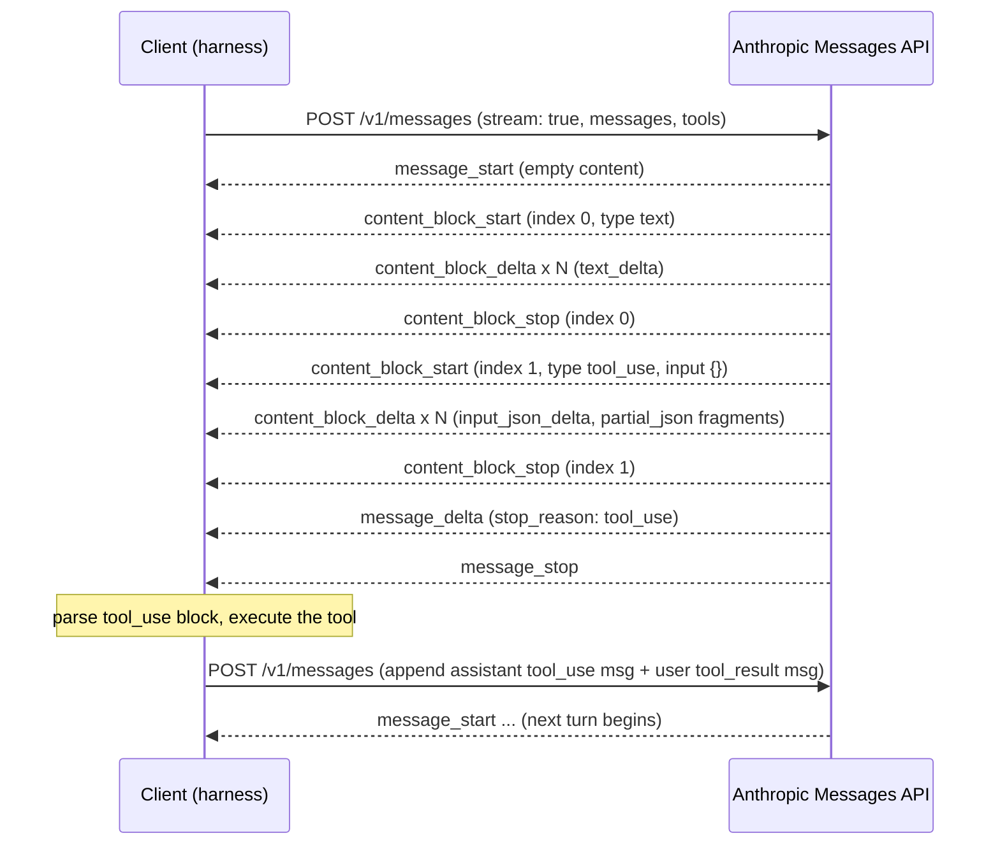
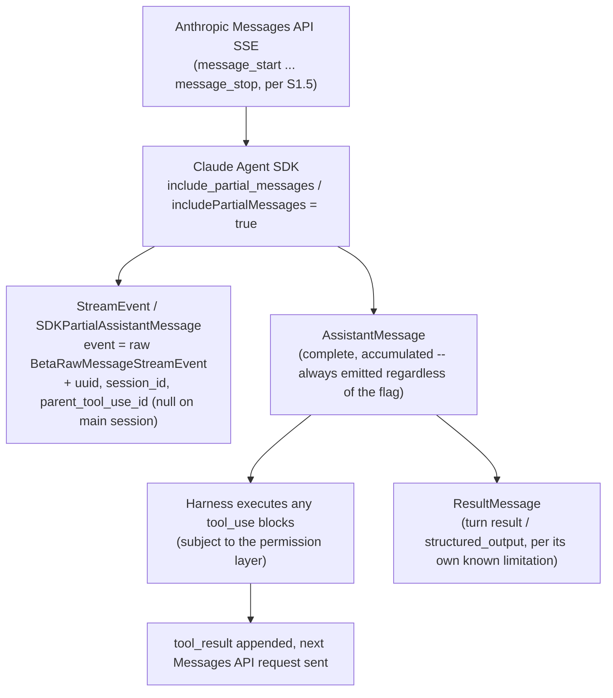
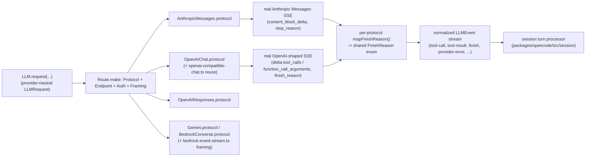

# The LLM API contract -- messages, content blocks, streaming, stop reasons

**Scope note.** This page is the layer *underneath* every other page in
this book. It is the wire-level contract between a harness and the model
provider's HTTP API: the request/response JSON shape, the roles a message
can carry, the typed content-block vocabulary a model uses to say "call
this tool" versus "here is text," the Server-Sent-Events (SSE) framing a
streamed response arrives in, and the enumerated reasons a generation
stops. It is deliberately distinct from
[agent-loop.md](agent-loop.md), which assumes this layer already exists
and describes what a harness's control loop *does* with it once tool
calling already works (the Thought -> Action -> Observation cycle, the
while-loop framing, stop-and-parse). Concretely: a `tool_use` content
block arriving over the wire **is** the Action; the harness executing
that tool and posting a `tool_result` block back **is** the Observation
being appended to context. This page grounds that mechanism at the byte
level; agent-loop.md names the pattern.

Two materially different wire contracts are in play across the three
harnesses this book covers, because they are built by different vendors
against different providers: **Anthropic's Messages API** (a typed
content-block array per message, one `stop_reason` field) and
**OpenAI's Chat Completions / Responses APIs** (a `tool_calls` array
attached to an assistant message, a `finish_reason` field, and, for the
Responses API specifically, a stream of named `response.*` events
distinct from Anthropic's `content_block_*` event names). Every claim
below is tagged VERIFIED (fetched this session from a named source) or
BEST CURRENT UNDERSTANDING, UNCONFIRMED, and a fact verified for one
provider's API is never assumed to hold for the other's without its own
citation -- the same authority-overreach guard this book applies across
harnesses applies here across model-provider APIs too.

---

## 1. The Anthropic Messages API contract

VERIFIED, `platform.claude.com/docs/en/api/messages` (redirected live
this session from `docs.claude.com/en/api/messages` -- both hostnames
serve Anthropic's own Claude Developer Platform documentation),
`platform.claude.com/docs/en/docs/build-with-claude/streaming`
(redirected identically from `docs.claude.com/.../streaming`), both
fetched fresh 2026-08-01. This section is authoritative for what the
Anthropic Messages API itself specifies, not for how any specific
harness's own agent loop chooses to use it -- that distinction is
carried into §3.1 below.

### 1.1 Request shape

A `POST /v1/messages` request's fields, as documented: `model`
(required), `messages` (required, an array of role-tagged content),
`max_tokens` (required -- the docs state a value of `0` populates only
the prompt cache and generates nothing), `system` (a string or an array
of `TextBlockParam`, the top-level, once-per-request system prompt),
`tools` (an array of tool definitions), `tool_choice`, `stream`
(boolean), `temperature`/`top_p`/`top_k`, `stop_sequences`, `metadata`,
`thinking` (extended-thinking configuration), `cache_control`, and a
`service_tier` field. `tool_choice` takes one of four shapes: `"auto"`
(model decides), `"any"` (model must call some tool), `"tool"` (a named,
forced tool call), or `"none"`, with an optional
`disable_parallel_tool_use` flag alongside any of them.

### 1.2 Roles and the messages array

Each message object carries exactly two required fields, `role` and
`content`. Three role values are documented: `"user"` (input, and where
a client posts back the results of tool execution), `"assistant"`
(prior model output, including any `tool_use` blocks the model itself
emitted), and `"system"` -- explicitly distinguished from the top-level
`system` request parameter as a **mid-conversation** system instruction
(`MidConversationSystemBlockParam`), applying only from its position in
the array onward rather than as the request's privileged prime prompt.
Consecutive same-role turns are combined into a single turn by the API.
This page does not cover what actually gets loaded into that top-level
`system` field or how large it is allowed to grow before eviction --
that is [instruction-context-budget.md](instruction-context-budget.md)'s
and [memory-management.md](memory-management.md)'s territory; this page
only names the wire slot it occupies.

### 1.3 The content-block vocabulary

`content` is either a bare string or an array of typed content blocks.
The documented block types, with the two load-bearing ones spelled out
in full because they are the literal wire form of the agent loop's
Action/Observation exchange:

| Block type | Emitted by | Purpose |
|---|---|---|
| `text` | either | plain generated or supplied text |
| `image` | client (request) | base64 or URL-sourced image input |
| `document` | client (request) | PDF/text document input, with citation support |
| `tool_use` | **model** (in a prior turn, replayed back in the next request) | the model's call: `{type: "tool_use", id, name, input}` |
| `tool_result` | **client** | the client's answer to a `tool_use`: `{type: "tool_result", tool_use_id, content, is_error}` |
| `thinking` | model | extended-thinking output: `{type: "thinking", thinking, signature}` |
| `redacted_thinking` | model | a thinking block the API has redacted: `{type: "redacted_thinking", data}` |
| `server_tool_use` / matching `*_tool_result` blocks | model / API | Anthropic-hosted tools (`web_search`, `web_fetch`, `code_execution`, `bash_code_execution`, etc.) executed server-side, not by the client |
| `search_result` | client | structured search-style content supplied back to the model |

The `tool_use` block's `id` (a `toolu_...`-prefixed string) is the
correlation key: the client's subsequent `tool_result` block **must**
carry a matching `tool_use_id`, and `is_error: true` on that block is
the documented mechanism for telling the model the tool call itself
failed (as distinct from the tool succeeding but returning content the
model dislikes) -- this is the exact wire-level substrate of the "bad
Observation handling" failure class agent-loop.md names abstractly.

### 1.4 The response object and the `stop_reason` enumeration

A non-streaming response returns `id`, `type` (always `"message"`),
`role` (always `"assistant"`), `content` (an array of the block types
above), `model`, `stop_reason`, `stop_sequence`, and `usage`
(`input_tokens`, `output_tokens`, plus cache-specific fields covered in
depth by [caching.md](caching.md)). The full documented `stop_reason`
enumeration:

| `stop_reason` | Meaning |
|---|---|
| `end_turn` | natural stopping point; response complete |
| `max_tokens` | the `max_tokens` request limit (or the model's context window) was hit |
| `stop_sequence` | a custom `stop_sequences` string was generated |
| `tool_use` | the model emitted one or more `tool_use` blocks and is waiting on results -- this is the value that tells a harness's loop "re-enter the Action/Observation half of the cycle instead of surfacing text to the user" |
| `pause_turn` | a long-running turn (typically involving a server-side tool) was paused; the client is expected to send the response straight back to continue it |
| `refusal` | a streaming safety classifier intervened mid-generation |
| `model_context_window_exceeded` | the model's own context window, not just `max_tokens`, was exceeded |

### 1.5 Streaming: the SSE event sequence

When `stream: true`, the API emits a Server-Sent-Events stream whose
documented event flow is fixed: one `message_start` (a `Message` shell
with empty `content`), then, per content block, a
`content_block_start` / one-or-more `content_block_delta` /
`content_block_stop` triad (each block carrying an `index` matching its
final position in the `content` array), then one-or-more
`message_delta` events carrying top-level changes (`stop_reason`,
cumulative `usage`), and finally one `message_stop`. `ping` events may
appear anywhere and carry no data of interest; `error` events (e.g. an
`overloaded_error`, the streaming analogue of an HTTP 529) can appear
mid-stream and the docs explicitly instruct clients to handle unknown
future event types gracefully, per the API's own versioning policy.

Three delta types matter beyond plain `text_delta`. **`input_json_delta`**
carries a `tool_use` block's `input` as it is generated: the docs are
explicit that these are "partial JSON strings," never valid JSON on
their own, and that a client must accumulate the string fragments and
parse the whole thing only once `content_block_stop` arrives (or use an
SDK's accumulator helper) -- and that "current models only support
emitting one complete key and value property from `input` at a time,"
so a caller should expect silence between deltas while the model works
on the next key. **`thinking_delta`** carries extended-thinking text
incrementally, the same way `text_delta` carries ordinary text; a
**`signature_delta`** event -- carrying a cryptographic signature used
to verify the thinking block's integrity -- always arrives immediately
before that block's `content_block_stop`. When thinking is configured
with `display: "omitted"`, no `thinking_delta` events are sent at all;
the block opens, receives only its `signature_delta`, and closes.

The docs also describe a documented **error-recovery** procedure for a
stream interrupted mid-response: capture whatever content blocks
completed, then construct a continuation request. For Claude 4.5 and
earlier models this continuation is built by placing the captured
partial text as the *start* of a new assistant message; for Claude 4.6
and later models the same partial content is instead wrapped in a new
**user** message instructing the model to continue from where it left
off -- the docs flag this as a genuine behavior change between model
generations, not a client-side choice. Tool-use and thinking blocks
specifically are called out as **not** partially recoverable this way;
only a completed text block can be resumed from.

---

## 2. The OpenAI Responses API contract (and where Chat Completions differs)

VERIFIED, `developers.openai.com/api/docs/guides/function-calling`
(redirected live this session from
`platform.openai.com/docs/guides/function-calling` -- OpenAI's own
developer documentation), fetched fresh 2026-08-01. The page fetched
documents OpenAI's newer **Responses API** specifically (its own
streaming event names below are Responses-API-specific); the older,
still-widely-supported **Chat Completions API**'s classic
`tool_calls`/`role: "tool"` shape is described from general prior
knowledge, not from a page re-fetched this session, and is explicitly
marked BEST CURRENT UNDERSTANDING, UNCONFIRMED where it is mentioned
below -- treat that half as a plausible sketch to verify independently
before relying on it, not as this page's own grounded claim.

### 2.1 Roles and tool-call shape (Responses API, VERIFIED)

The documented roles are `system`, `user`, `assistant`, and `tool`. When
the model calls a tool, the assistant's output includes an entry with a
`call_id` ("used later to submit the function result"), a `name`, and a
JSON-**encoded string** of `arguments` (not a parsed object the way
Anthropic's `tool_use.input` already is one) -- the entry's `type` is
`"function_call"` for schema-defined tools or `"custom_tool_call"` for
free-text tools. A tool result is sent back as
`{"role": "tool", "tool_call_id": <call_id>, "content": <result>}`,
where `content` "should typically be a string, where the format is up
to you (JSON, error codes, plain text, etc.)" -- a materially looser,
un-typed contract than Anthropic's `tool_result` block, which at least
distinguishes `is_error` as a structured field rather than leaving error
signalling entirely to string content.

### 2.2 `finish_reason` (VERIFIED, as documented on this page)

Four values are named on the fetched page: `stop` (natural completion),
`length` (token limit reached), `tool_calls` (the model invoked one or
more tools), and `content_filter` (a safety policy blocked completion).
This is a visibly coarser vocabulary than Anthropic's seven-value
`stop_reason` enumeration in §1.4 -- there is no OpenAI-documented
analogue, on this page, to Anthropic's `pause_turn` (mid-turn
server-tool continuation) or its `refusal`/`model_context_window_exceeded`
split from plain `length`.

### 2.3 Streaming (Responses API, VERIFIED)

The documented event sequence is `response.output_item.added`
(announces a new tool call with empty arguments), one or more
`response.function_call_arguments.delta` events (progressive JSON
argument chunks -- the direct analogue of Anthropic's
`input_json_delta`), and a terminal
`response.function_call_arguments.done` carrying the fully assembled
arguments string. The page's own framing: a client is "aggregating
chunks into an encoded `arguments` JSON object," the same
accumulate-then-parse discipline Anthropic's docs describe for
`input_json_delta` in §1.5, just under different event names.

### 2.4 Chat Completions' classic shape (BEST CURRENT UNDERSTANDING, UNCONFIRMED)

Not re-verified this session, offered only as a commonly-known,
still-in-wide-use contrast point: the older Chat Completions API
represents a tool call as a `tool_calls` array on the assistant message,
each entry shaped `{id, type: "function", function: {name, arguments}}`
(`arguments` again a JSON-encoded string), with the client's reply as a
message of `role: "tool"` carrying a `tool_call_id` matching that `id`.
Streaming chunks carry a `delta.tool_calls[].function.arguments`
fragment per chunk, accumulated client-side by array index until a
chunk's `finish_reason` becomes `tool_calls`. Anyone relying on this
paragraph specifically should re-verify it against OpenAI's current
Chat Completions reference before treating it as settled -- it is
recalled, not freshly read, this session.

---

## 3. How each harness sits on top of this layer

### 3.1 Claude Code (Claude Agent SDK)

VERIFIED, `code.claude.com/docs/en/agent-sdk/streaming-output`, fetched
fresh 2026-08-01 -- authoritative for the Claude Agent SDK's own
documented behavior specifically (the layer Claude Code itself is built
on), distinct from §1's claim about the raw Anthropic API those
mechanics wrap.

By default the SDK yields only complete, already-accumulated message
objects -- `AssistantMessage`, plus a `SystemMessage` (session
initialization, and, per its `compact_boundary` subtype, a marker for
when [context compaction](context-compression.md) occurred), and a
terminal `ResultMessage`. Setting `include_partial_messages` (Python) /
`includePartialMessages` (TypeScript) to `true` additionally yields a
`StreamEvent` (Python) / `SDKPartialAssistantMessage` with
`type: "stream_event"` (TypeScript) for **every** raw event described in
§1.5 -- the docs state plainly that this wrapper's `event` field is "the
raw streaming event from the Claude API" and, in the TypeScript type
definition, is typed as `BetaRawMessageStreamEvent`, i.e. the Anthropic
SDK's own event type, not a Claude-Code-specific reshaping of it. The
wrapper adds exactly three fields the raw API event does not carry:
`uuid`, `session_id`, and `parent_tool_use_id` (always `null` on the
main session -- subagent-attributed streaming deltas are documented as
not forwarded at the partial-event level at all; only the later,
complete `AssistantMessage` carries a populated `parent_tool_use_id` for
attributing output to a [subagent](handoff-mechanism.md)).

The docs' own documented limitation: structured output "appears only in
the final `ResultMessage.structured_output`, not as streaming deltas" --
i.e. §1's `input_json_delta`-style incremental JSON is available for
ordinary tool calls but not for the SDK's separate structured-output
feature. The message-flow ordering the docs give matches §1.5's SSE
sequence exactly, prefixed by `StreamEvent` wrappers and followed by the
accumulated `AssistantMessage`, then repeating for each further turn
until a `ResultMessage` closes out the exchange -- this is the literal
wire-level substrate that
[agent-loop-implementations.md](agent-loop-implementations.md)'s
turn-by-turn description of Claude Code's loop is built on top of.

Claude Code natively speaks this Anthropic-shaped contract regardless
of backend: BEST CURRENT UNDERSTANDING, UNCONFIRMED (reasoned from, not
directly re-verified against, this session's own fetch) that the same
`BetaRawMessageStreamEvent` typing applies whether the request is served
by the direct Anthropic API, Bedrock, or Vertex -- corroborating,
cross-page evidence from a prior session
([caching.md](caching.md)'s v2.1.211 Bedrock/Foundry prompt-cache-parity
fix) is consistent with those three backends sharing this same
content-block-shaped contract even though their auth, pricing, and TTL
behavior differ, but no source fetched in *this* session states outright
that the raw bytes on the wire are byte-identical Messages API JSON
across all three backends -- only that the SDK's own typed event surface
is Anthropic's own type regardless of which one is in use.

### 3.2 GitHub Copilot CLI

Copilot CLI is closed source; unlike §3.1 and §3.3, no first-party doc
describes its request/response JSON schema directly. Everything below
is inferred from `github.com/github/copilot-cli`'s own `changelog.md`
(fetched fresh this session via `gh api
repos/github/copilot-cli/contents/changelog.md`, grepped for
`tool_call`, `streaming`, `finish_reason`, `Responses API`, `reasoning`),
read as a history of shipped behavior, not a specification -- the same
standing caveat this book applies to Copilot CLI everywhere its
internals are closed (see [retries.md](retries.md) §2.1,
[context-compression.md](context-compression.md) §2,
[caching.md](caching.md) §2 for the identical pattern on other topics).

The changelog names OpenAI's **Responses API** as a real, internally
distinguished provider-protocol family the CLI itself routes against,
not merely a term this page is importing from §2: v1.0.62 (2026-06-13)
lists "Honor `max_output_tokens` for BYOK Responses providers" and "MCP
server names with dots and slashes map to valid Responses API
namespaces" in the same release, and v1.0.52 (2026-05-23) separately
notes "AI Credits usage correctly displays after sessions using the
Responses API" as its own fixed bug -- three independent entries, two
releases apart, all treating "Responses API" as a named internal
category of session rather than a one-off phrase. This is consistent
with Copilot CLI's own multi-model support (Claude, GPT, Gemini,
documented elsewhere in this book's
[configuration.md](configuration.md) and [retries.md](retries.md)
coverage) requiring it to speak more than one upstream wire contract
internally, but the changelog never states its own dispatch architecture
explicitly the way OpenCode's source does in §3.3 -- flag this as BEST
CURRENT UNDERSTANDING, UNCONFIRMED beyond the three bare named facts
above.

The changelog also shows recurring "reasoning effort"/"reasoning
summary"/"reasoning token" entries across dozens of releases (v1.0.62's
"Keep blank lines between reasoning summary sections," v1.0.52's
"Reasoning tokens display as a parenthetical on output token count," and
"Show accurate Anthropic reasoning token counts" among others) --
evidence that a thinking/reasoning content type analogous to §1's
`thinking`/`thinking_delta` blocks or an OpenAI reasoning-model
equivalent is genuinely present and user-configurable
("reasoning effort" as a per-model, per-agent, per-session setting) in
Copilot CLI's own model-facing traffic, but no changelog entry or docs
page fetched this session states the exact wire shape of that content
(a distinct block type, a string field, a separate API parameter) --
this is named as a confirmed *feature* without a confirmed *wire
representation*.

**Adjacent-surface citation, explicitly bounded.** VERIFIED,
`github.com/github/copilot-sdk`'s `docs/auth/byok.md`, fetched fresh
this session -- **the Copilot SDK, a separate, distinct product from
Copilot CLI itself** (the same adjacent-surface caveat
[orchestration.md](orchestration.md) applies to this SDK's Fleet-mode
runtime). Its own `ProviderConfig` documents a `type` field accepting
`"openai" | "azure" | "anthropic"` and a `wireApi` field accepting
`"completions"` (Chat Completions, "broad model compatibility") or
`"responses"` (the newer Responses API, for "multi-turn state
management, tool namespacing, and reasoning support") -- explicitly only
for the OpenAI/Azure provider types, since the same document states
outright: "Anthropic models always use the Messages API regardless of
this setting." This is a real, source-verified three-way protocol
dispatch (Anthropic Messages / OpenAI Chat Completions / OpenAI
Responses) inside a genuinely GitHub-authored product, and it is
architecturally consistent with the three-family split this page
documents in §1-§2 -- but it describes the **Copilot SDK's** dispatch,
not a confirmed description of the **Copilot CLI's** own internal
routing, which remains the BEST CURRENT UNDERSTANDING, UNCONFIRMED
paragraph above it.

### 3.3 OpenCode

VERIFIED, `github.com/anomalyco/opencode`, `dev` branch, fetched fresh
this session via `gh search code` (to locate files) and `curl` against
`raw.githubusercontent.com` (to read full file contents, working around
this session's `gh api`/base64 decoding failure on this platform) --
flagging per this project's standing caveat that `dev` is not a stable
release tag. Unlike §3.2, OpenCode's own multi-provider wire-contract
handling is fully source-verified, not inferred from documentation, and
is the most architecturally explicit of Claude Code, Copilot CLI, and
OpenCode specifically on this exact topic -- §3.4 below covers DeepSeek
Harness's own, differently-pitched contribution to this same question.

`packages/llm/AGENTS.md` (the package's own maintainer-facing design
document, read in full) states the core decomposition directly: a
**route** is "the registered, runnable composition of four orthogonal
pieces" -- **Protocol** (owns request-body construction and the
streaming-event-to-common-event state machine), **Endpoint** (URL
construction), **Auth** (per-request authentication, including
Bedrock-SigV4-style request signing), and **Framing** (bytes to frames;
SSE via `Framing.sse` is shared across protocols, while Bedrock keeps
its own AWS event-stream binary framing). Concrete protocol modules
under `packages/llm/src/protocols/`: `anthropic-messages.ts` (§1's
contract), `openai-chat.ts` and `openai-responses.ts` (§2's two
contracts), `gemini.ts`, `bedrock-converse.ts` (with
`bedrock-event-stream.ts` supplying its distinct binary framing), and
`openai-compatible-chat.ts` -- a route that reuses `OpenAIChat.protocol`
verbatim for any OpenAI-shaped third-party endpoint (DeepSeek, TogetherAI,
Cerebras, Baseten, Fireworks, DeepInfra), which `AGENTS.md` gives as the
concrete payoff of the four-axis split: "each provider deployment is a
5-15 line `Route.make(...)` call instead of a 300-400 line route clone."

**The normalized event vocabulary.** VERIFIED,
`packages/llm/src/schema/events.ts` (full file read this session). Every
protocol's stream parser -- regardless of which of §1/§2's wire formats
it is reading -- emits the same tagged union of `LLMEvent`s:
`step-start`, `text-start`/`text-delta`/`text-end`,
`reasoning-start`/`reasoning-delta`/`reasoning-end`,
`tool-input-start`/`tool-input-delta`/`tool-input-end`, `tool-call`,
`tool-result`, `tool-error`, `step-finish`, `finish`, and
`provider-error`. This is the same content-block-versus-tool-call
distinction §1 and §2 draw at the wire level, re-expressed as one
shared, provider-neutral event alphabet -- `tool-input-delta` is
OpenCode's single normalized name for both Anthropic's
`input_json_delta` and OpenAI's `function_call_arguments.delta`/
`tool_calls[].function.arguments` chunk streams.

**The `FinishReason` normalization, read directly from two separate
protocol files.** VERIFIED, `packages/llm/src/schema/ids.ts`: the shared
enum is `Schema.Literals(["stop", "length", "tool-calls",
"content-filter", "error", "unknown"])`. Each protocol's own
`mapFinishReason()` function, read in full from source, maps its
provider's native vocabulary onto this one shared enum:

| Provider-native value | Protocol file | Mapped `FinishReason` |
|---|---|---|
| `end_turn`, `stop_sequence`, `pause_turn` | `anthropic-messages.ts` | `"stop"` |
| `max_tokens` | `anthropic-messages.ts` | `"length"` |
| `tool_use` | `anthropic-messages.ts` | `"tool-calls"` |
| `refusal` | `anthropic-messages.ts` | `"content-filter"` |
| (anything else, incl. `model_context_window_exceeded`) | `anthropic-messages.ts` | `"unknown"` |
| `stop` | `openai-chat.ts` | `"stop"` |
| `length` | `openai-chat.ts` | `"length"` |
| `content_filter` | `openai-chat.ts` | `"content-filter"` |
| `function_call`, `tool_calls` | `openai-chat.ts` | `"tool-calls"` |
| (anything else) | `openai-chat.ts` | `"unknown"` |

This table is a direct, source-read demonstration of the exact
normalization problem §1 and §2 describe in the abstract: Anthropic's
seven-value, single-field `stop_reason` and OpenAI's four-value
`finish_reason` are two genuinely different enumerations (notably,
Anthropic's `pause_turn` collapses into plain `"stop"` here, discarding
the "resume this specific turn" nuance §1.4 documents, and Anthropic has
no native analogue at all to being folded into `"error"`, since
OpenCode's own enum reserves that value for transport/provider failures
rather than any Anthropic `stop_reason` value).

**Provider-executed (hosted) tools pass through untouched.** VERIFIED,
`packages/llm/AGENTS.md`: Anthropic's `web_search`/`code_execution`/
`web_fetch` and OpenAI Responses' `web_search_call`/`file_search_call`/
`code_interpreter_call`/`mcp_call`/`local_shell_call`/
`image_generation_call`/`computer_use_call` all surface as an ordinary
`tool-call` event carrying `providerExecuted: true`, with a matching
`tool-result` event also flagged `providerExecuted: true` -- callers are
instructed to detect this flag and **skip local dispatch** entirely (no
handler invoked, no "unknown tool" `tool-error` raised), since the
provider already ran the tool server-side. Continuing a conversation
afterward is itself protocol-specific: "Anthropic encodes them back as
`server_tool_use` + `web_search_tool_result` ... blocks; OpenAI Responses
callers typically use `previous_response_id` instead of resending hosted
tool items" -- a concrete instance of the two contracts' shapes leaking
into how a harness must continue a conversation, not just how it parses
one.

**The `<system-update>` chronological-system-message fallback.** VERIFIED,
`packages/llm/AGENTS.md`: OpenCode's own `Message.system(...)` operator
represents a provider-neutral, mid-conversation system update -- the
same wire slot §1.2 names as Anthropic's dedicated mid-conversation
`"system"` role. Because that native role is model/route-specific
(`AGENTS.md` names it as natively lowered only for Anthropic Messages on
`claude-opus-4-8`), every other route lowers the same operator "in place
into ordinary user-compatible text using this stable escaped
representation": a plain-text block wrapped in literal
`<system-update>...</system-update>` tags, chosen because it "preserves
ordering while visibly lowering authority" when the underlying wire
format has no dedicated slot for it. `AGENTS.md` explicitly warns against
inserting untrusted content (retrieved documents, tool output, web
content) into this privileged channel -- keeping it strictly for the
harness's own operator-issued updates.

**Two execution paths converge on the same event alphabet.**
`packages/llm/AGENTS.md` names `packages/opencode/src/session/llm.ts` as
"the session-owned orchestration layer that decides whether a request
uses AI SDK or this package's native route runtime," with
`native-request.ts` lowering session data into this package's own
`LLMRequest`, `native-runtime.ts` executing it via the route pipeline
described above, and `ai-sdk.ts` separately "converting AI SDK stream
parts into this package's shared `LLMEvent`s" for the default path that
still goes through the third-party Vercel AI SDK rather than OpenCode's
own native protocol implementations. VERIFIED corroboration from
`packages/opencode/src/session/message-v2.ts` (full file read this
session): the session layer converts stored `WithParts` message rows
into the AI SDK's own `UIMessage`/`ModelMessage` shapes via a
`toModelMessagesEffect` function whose logic includes a documented,
provider-specific media-in-tool-result workaround -- because
"OpenAI-compatible APIs only support string content in tool results,"
media attached to a tool's output is stripped out and re-injected as a
synthetic follow-up user message (prefixed
`SYNTHETIC_ATTACHMENT_PROMPT = "Attached media from tool result:"`) for
any model whose `model.api.npm` package does not appear in a hard-coded
allow-list (`@ai-sdk/anthropic`, `@ai-sdk/openai`,
`@ai-sdk/amazon-bedrock/mantle` unconditionally; `@ai-sdk/amazon-bedrock`
and `@ai-sdk/xai` only for image attachments; `@ai-sdk/google` only for
`gemini-3`-family models) -- a second, independent, source-verified
instance of §1 vs §2's contract differences (here, specifically:
Anthropic's `tool_result` content array accepting arbitrary block types
vs. several OpenAI-compatible surfaces accepting only a string) forcing
a harness to actively paper over the gap rather than merely translate
field names.

### 3.4 DeepSeek Harness

VERIFIED, fetched 20 August 2026 directly from `deepseek-ai/deepseek-harness`
(`master` branch) -- `docs/capability-seams.md`, `docs/glossary.md`, and
`docs/architecture.md`. DeepSeek Harness (`dsh`, MIT-licensed, in developer
preview as of this fetch -- see [Hooks and lifecycle
extensibility](hooks-lifecycle-extensibility.md) §4 for this book's fuller
introduction to the harness and its Cordis plugin substrate, not repeated
here) names, as an explicit, first-class architectural term, the exact
provider-swap pattern this page's §3.3 already found OpenCode's source
exhibiting *without* a comparable name: a **capability seam**. The docs
define it as three interdependent roles -- a **Service Definition** (the
package declaring the interface a seam promises to expose), one or more
**Service Providers** (packages implementing that interface), and one or
more **Consumers** (packages that depend on the seam's interface without
knowing which provider is mounted underneath it). `ctx.llm` is the seam
governing exactly the wire-contract question this page is about: its
Service Definition specifies what an LLM-request capability must expose,
and the harness ships (at minimum) three real, interchangeable Providers
against it -- `llm-deepseek`, `llm-pi-ai`, and `llm-replay` (a deterministic,
recorded-fixture provider, functionally analogous in purpose to
[Evals and testing a harness](evals-and-testing-a-harness.md)'s coverage of
OpenCode's own `@opencode-ai/http-recorder` VCR-style cassette package,
though DeepSeek's docs frame it as a swappable seam provider rather than a
dedicated test package). The agent loop itself is named directly as the
seam's Consumer, reaching the currently-mounted provider through a
provider-neutral interface it never inspects to determine which concrete
wire contract (Anthropic Messages-shaped, OpenAI-shaped, or something else
entirely) is actually in play underneath. The docs state the architectural
payoff in one line: "Seams are why one provider swap changes the whole
product" -- swapping the mounted `ctx.llm` provider changes what speaks to
the model with no code change required in the agent loop that consumes it.

This three-role decomposition is not merely a vocabulary restatement of
§3.3's four-axis `Protocol`/`Endpoint`/`Auth`/`Framing` split -- it operates
one level of abstraction higher. OpenCode's four axes describe *how a
single route is assembled internally* (which URL, which auth scheme, which
byte-framing, which request-body shape); DeepSeek's capability-seam
vocabulary instead names *the substitutability boundary itself*, independent
of how many axes a given provider's own implementation happens to need
internally. The two are compatible, not competing: an OpenCode-style
`Route.make(Protocol, Endpoint, Auth, Framing)` composition is a plausible
concrete shape a `ctx.llm` Service Provider could take internally, but
DeepSeek's docs do not decompose their own `llm-deepseek`/`llm-pi-ai`
providers into named axes the way `packages/llm/AGENTS.md` does for
OpenCode's routes -- so this page treats the seam vocabulary as a naming
contribution over an already-independently-verified pattern, not as
evidence that DeepSeek's own providers are internally structured the same
four-axis way OpenCode's are. The architecture doc gives a matching rule for
when something should **not** be split into a seam at all: `ctx.sessions`
(the append-only session-event log documented in [Session & transcript
persistence](session-persistence.md) §4) and `ctx.invariants` (package-
attributed checks) are deliberately kept as **core services** rather than
seams, on the stated principle that a seam exists specifically where
deployment-time or provider-time substitutability is the actual design
point -- not wherever an interface merely exists.

---

## 4. Synthesis

| Dimension | Anthropic Messages API | OpenAI Chat Completions / Responses API |
|---|---|---|
| Tool call representation | typed `tool_use` content block inside the `content` array, `input` already a parsed object | `tool_calls`/output-item array on the assistant message/output, `arguments` a JSON-**encoded string** the caller must parse |
| Tool result representation | typed `tool_result` content block, structured `is_error` boolean | `role: "tool"` message, unstructured `content` (string) |
| Turn-stop vocabulary | 7-value `stop_reason` (`end_turn`, `max_tokens`, `stop_sequence`, `tool_use`, `pause_turn`, `refusal`, `model_context_window_exceeded`) | 4-value `finish_reason` (Responses/Chat: `stop`, `length`, `tool_calls`, `content_filter`) |
| Streaming tool-input delivery | `content_block_delta` events of `delta.type: "input_json_delta"`, partial JSON strings keyed by block `index` | `response.function_call_arguments.delta` (Responses) or `delta.tool_calls[].function.arguments` (Chat Completions, unconfirmed this session), partial JSON strings |
| Reasoning/thinking content | `thinking`/`redacted_thinking` blocks, `thinking_delta` + terminal `signature_delta` | reasoning-effort-configurable, but this page found no OpenAI wire-shape citation fetched this session for its own reasoning content type |
| Mid-conversation system updates | native `"system"`-role message, distinguished from the top-level `system` request field | not documented on the pages fetched this session |

| Harness | How it sits on this layer |
|---|---|
| Claude Code (Agent SDK) | Wraps the raw Anthropic SSE events (§1.5) in a `StreamEvent`/`SDKPartialAssistantMessage` carrying `parent_tool_use_id`/`session_id`/`uuid`, alongside always-emitted accumulated `AssistantMessage`/`ResultMessage` objects; the wrapped `event` field is Anthropic's own SDK type, unmodified |
| Copilot CLI | Closed source; changelog confirms "Responses API" as a real internally-named provider-protocol category (BYOK sessions, MCP namespace mapping, AI-credits display) across three separate releases, and confirms a reasoning-content *feature* exists, but does not document the exact request/response schema; the separate, adjacent Copilot SDK product documents an explicit three-way `anthropic`/`openai` (`completions`)/`openai` (`responses`) dispatch that is architecturally consistent with, but not proof of, Copilot CLI's own internal routing |
| OpenCode | Fully source-verified: a four-axis `Protocol`/`Endpoint`/`Auth`/`Framing` route composition, one protocol module per wire contract (`anthropic-messages.ts`, `openai-chat.ts`, `openai-responses.ts`, `gemini.ts`, `bedrock-converse.ts`), each with its own `mapFinishReason()` normalizing into one shared six-value `FinishReason` enum and one shared `LLMEvent` tagged union, plus explicit, source-documented workarounds where the contracts genuinely disagree (hosted-tool continuation shape, tool-result media support, native vs. text-wrapped mid-conversation system updates) |
| DeepSeek Harness | Fully source-verified (docs, not implementation code, for this specific point): names the substitutability boundary itself, one level of abstraction above OpenCode's four axes, as a **capability seam** -- a Service Definition/Provider/Consumer three-role unit, with `ctx.llm` as the seam governing this page's own subject, real interchangeable providers (`llm-deepseek`, `llm-pi-ai`, `llm-replay`) mounted underneath a provider-neutral Consumer interface the agent loop itself never inspects |

**The design lesson.** Every harness examined on this page has to solve
the same underlying problem even though only OpenCode's solution is
fully visible from the outside: a model provider's content-block or
tool-call vocabulary, its finish/stop-reason enumeration, and its
streaming delta-accumulation discipline are all provider-specific, and
a harness that speaks to more than one provider (which all three
harnesses in this book do, to varying documented degrees) needs a
normalization layer sitting directly on top of §1/§2's raw wire formats
and directly underneath the agent-loop mechanics
[agent-loop.md](agent-loop.md) and
[agent-loop-implementations.md](agent-loop-implementations.md)
describe. OpenCode's source names and implements that layer explicitly
(`Route`/`Protocol`/`LLMEvent`/`FinishReason`); Claude Code's Agent SDK
mostly avoids needing one by wrapping a single provider's own typed SDK
events directly; Copilot CLI's own version of this layer is real
(the changelog proves at least an OpenAI-Responses-API-aware provider
category exists) but not source-visible, leaving its exact shape as
this page's one clearly-flagged remaining gap. DeepSeek Harness's own
docs supply, independently of OpenCode's engineering, a genuinely useful
*name* for the underlying design principle both harnesses converge on --
"provider-neutral consumer, swappable provider, one shared interface" --
without this page treating that naming contribution as evidence either
harness's own internal axis structure resembles the other's.

---

## Sources

All fetched fresh 2026-08-01 unless noted otherwise.

**Anthropic (authoritative for the Messages API contract itself, not
for any specific harness's use of it):**
- `https://platform.claude.com/docs/en/api/messages` (redirected live
  this session from `https://docs.claude.com/en/api/messages`) --
  request/response field reference, content-block types, `stop_reason`
  enumeration; covers §1.1-§1.4.
- `https://platform.claude.com/docs/en/docs/build-with-claude/streaming`
  (redirected live this session from the equivalent `docs.claude.com`
  path) -- SSE event flow, delta types, error recovery; covers §1.5.

**OpenAI (authoritative for its own API contract itself, not for
Copilot CLI's or OpenCode's use of it):**
- `https://developers.openai.com/api/docs/guides/function-calling`
  (redirected live this session from
  `https://platform.openai.com/docs/guides/function-calling`) -- Responses
  API tool-calling shape, `finish_reason` enumeration, streaming event
  names; covers §2.1-§2.3. §2.4 (classic Chat Completions shape) is
  explicitly marked as recalled, not re-verified this session.

**Claude Code (authoritative for the Claude Agent SDK's own documented
behavior; this repo ships no implementation source):**
- `https://code.claude.com/docs/en/agent-sdk/streaming-output` --
  `StreamEvent`/`SDKPartialAssistantMessage` shape, message-flow
  ordering, the structured-output streaming limitation; covers §3.1 in
  full.

**GitHub Copilot CLI (authoritative for its own behavior-change history
only; no implementation source exists in this repo):**
- `https://github.com/github/copilot-cli` `changelog.md`, fetched fresh
  this session via `gh api repos/github/copilot-cli/contents/
  changelog.md` (full file, grepped for `tool_call`, `streaming`,
  `finish_reason`, `Responses API`, `reasoning`) -- v1.0.62 (2026-06-13)
  and v1.0.52 (2026-05-23) "Responses API" entries and the recurring
  reasoning-effort/reasoning-summary/reasoning-token entries cited in
  §3.2.
- `https://github.com/github/copilot-sdk` `docs/auth/byok.md`, fetched
  fresh this session -- adjacent-surface-only citation of the Copilot
  SDK's own `ProviderConfig` (`type`, `wireApi`) three-way protocol
  dispatch, explicitly flagged as describing a different product from
  Copilot CLI itself.

**OpenCode (authoritative for its own documented behavior AND, unlike
the two harnesses above, its own real implementation; `dev` branch, not
a stable release tag):**
- `https://github.com/anomalyco/opencode`, `dev` branch, located via
  `gh search code` and read via `curl` against
  `raw.githubusercontent.com` this session (working around a local
  `gh api`/base64-decoding failure on this platform) -- full contents of
  `packages/llm/AGENTS.md`, `packages/llm/src/schema/events.ts`,
  `packages/llm/src/schema/ids.ts` (the `FinishReason` enum),
  `packages/llm/src/protocols/anthropic-messages.ts` and
  `packages/llm/src/protocols/openai-chat.ts` (both `mapFinishReason()`
  implementations, grepped and read in context), and
  `packages/opencode/src/session/message-v2.ts` -- covering §3.3 in
  full.

**DeepSeek Harness (authoritative for its own documented capability-seam
vocabulary; fetched 20 August 2026, `master` branch of
`deepseek-ai/deepseek-harness`, developer preview at time of fetch --
see [Hooks and lifecycle extensibility](hooks-lifecycle-extensibility.md)
§4's Sources for the full repository-metadata citation, not repeated
here):**
- `docs/capability-seams.md` -- the Service Definition/Provider/Consumer
  three-role definition, the `ctx.llm` seam and its named providers
  (`llm-deepseek`, `llm-pi-ai`, `llm-replay`), the "one provider swap
  changes the whole product" quote; covers §3.4 in full.
- `docs/glossary.md` and `docs/architecture.md` -- the seam-vs-core-service
  distinction (`ctx.sessions`/`ctx.invariants` deliberately kept unseamed),
  cross-checked against the same two files' citation in
  [Session & transcript persistence](session-persistence.md) §4.
