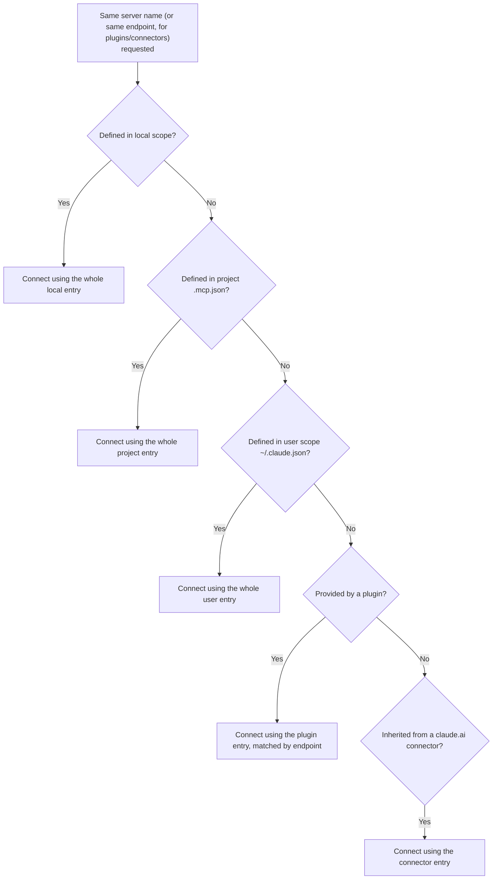
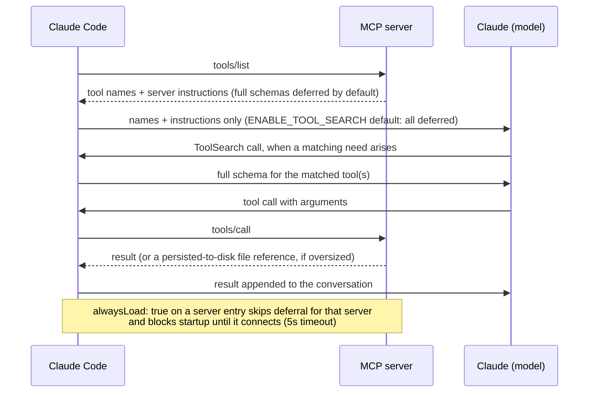
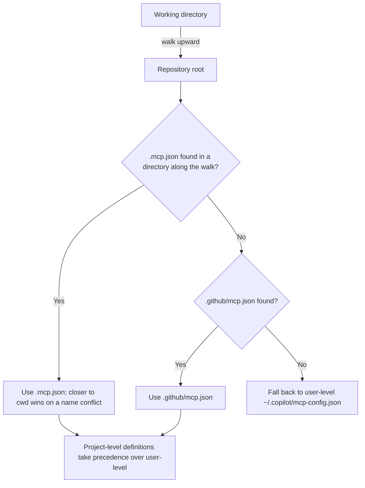
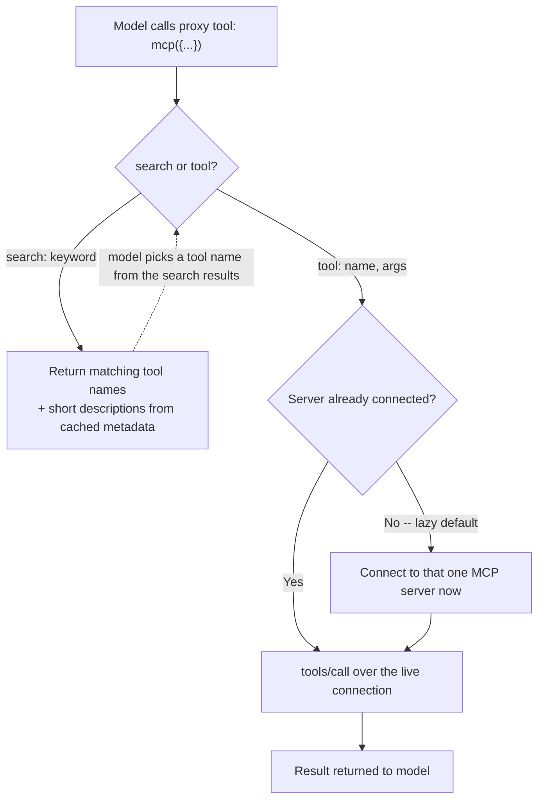

# MCP integration -- Claude Code, GitHub Copilot CLI, OpenCode, Hermes Agent, and pi

How each harness discovers, registers, connects to, and invokes MCP
servers. Written for someone building a server that must work across
harnesses.

Every claim below is tagged VERIFIED (fetched this session from the
named source) or BEST CURRENT UNDERSTANDING, UNCONFIRMED. Sources and
fetch dates at the bottom. Claude Code, Copilot CLI, OpenCode, Hermes
Agent, and pi are separate products from separate organizations --
nothing confirmed for one is assumed for another. §3 (OpenCode) was
added 2026-08-24 as a gap-fill: an earlier 2026-08-24 update to this
page had added Hermes Agent as a third harness section, but the page
still had never covered OpenCode -- one of this book's own three named
target harnesses -- leaving a real gap this update closes; §4 (Hermes
Agent) and §5 (Synthesis) are renumbered from that earlier update, not
otherwise changed. §5 (pi) was added 1 September 2026, with the former
§5 (Synthesis) renumbered to §6 -- pi is already documented elsewhere
in this book (`llm-api-contract.md` §3.5, `hooks-lifecycle-extensibility.md`
§5, `permissions-and-sandboxing.md`, `session-persistence.md`,
`configuration.md`, `auth-and-usage-accounting.md`, `built-in-skills.md`
§4, `context-compression.md`, `model-routing-and-selection.md`), and
this page's own finding is a genuinely different shape from the other
four: pi ships **no built-in MCP client at all**, by explicit design
choice, and this section documents both that absence and the
ecosystem's own de facto third-party answer to it.

---

## 1. Claude Code

Source for this whole section unless noted: `code.claude.com/docs/en/mcp`,
fetched 2026-07-30. VERIFIED.

### 1.1 Config sources and scopes



Three scopes, all using the same `mcpServers` object shape:

| Scope | Loads in | Shared with team | Stored in |
|---|---|---|---|
| Local (default) | Current project only | No | `~/.claude.json`, under that project's path |
| Project | Current project only | Yes, via version control | `.mcp.json` in project root |
| User | All your projects | No | `~/.claude.json` |

Two further sources sit below those three: plugin-provided servers
(declared in a plugin's own `.mcp.json` or inline in `plugin.json`) and
claude.ai connectors (inherited from a claude.ai subscription login).

Precedence, highest first: local, project, user, plugin, claude.ai
connector. When the same server is defined twice, Claude Code connects
once using the whole entry from the highest-precedence source -- fields
are **not** merged across scopes. The three scopes match duplicates by
name; plugins and connectors match by endpoint (same URL or command).

Project-scoped `.mcp.json` servers require an approval prompt before
first use. From v2.1.196, in a folder you have not accepted the
workspace-trust dialog for, approvals committed to the repo
(`enableAllProjectMcpServers`, `enabledMcpjsonServers` in
`.claude/settings.json`) are ignored and the server sits at
`Pending approval` -- a cloned repo cannot approve its own servers.

### 1.2 Transports

Four: `stdio`, `http` (a.k.a. `streamable-http`, accepted as an alias),
`sse` (documented as deprecated -- "use HTTP servers instead, where
available"), and `ws` (WebSocket, JSON-config-only; `claude mcp add
--transport` does not accept `ws`).

A JSON entry with a `url` but no `type` is a hard configuration error:
Claude Code reads a typeless entry as stdio and reports `MCP server
"<name>" has a "url" but no "type"`. Always set `type` explicitly on
remote entries.

### 1.3 Registration CLI

```bash
claude mcp add --transport http <name> <url>
claude mcp add --transport http <name> <url> --header "Authorization: Bearer TOKEN"
claude mcp add --transport sse  <name> <url>
claude mcp add [options] <name> -- <command> [args...]      # stdio
claude mcp add-json <name> '<json>'                          # any type, incl. ws
claude mcp add-from-claude-desktop                           # macOS / WSL only
claude mcp list | get <name> | remove <name>
claude mcp login <name> | logout <name>
claude mcp reset-project-choices
```

`--scope`/`-s` selects `local` (default) / `project` / `user`.
`--env`/`-e` sets env vars. For stdio, `--` separates Claude's own
flags from the server's command line -- everything after `--` is passed
through untouched.

### 1.4 Environment-variable expansion

Supported in `.mcp.json`: `${VAR}` and `${VAR:-default}`, expanded in
`command`, `args`, `env`, `url`, and `headers`. An unset variable with
no default does **not** fail the load -- Claude Code warns in
`claude mcp list` and passes the literal `${VAR}` text through.

Plugin configs additionally get `${CLAUDE_PLUGIN_ROOT}`,
`${CLAUDE_PLUGIN_DATA}`, and `${CLAUDE_PROJECT_DIR}` substituted
directly.

### 1.5 What a stdio server receives at spawn time

`CLAUDE_PROJECT_DIR` is set in the spawned server's environment to the
stable project root -- it does not change when working directories are
added or removed mid-session. Read it from inside the server process
(`process.env.CLAUDE_PROJECT_DIR`).

Important gotcha for `.mcp.json` authors: `CLAUDE_PROJECT_DIR` is set in
the *server's* environment, not in Claude Code's own, so `${CLAUDE_PROJECT_DIR}`
inside a `.mcp.json` `command`/`args` needs a default
(`${CLAUDE_PROJECT_DIR:-.}`) to expand usefully. Only plugin-provided
configs substitute it directly.

For sandboxing filesystem access, Claude Code answers the MCP
`roots/list` request with the session's launch directory plus every
`--add-dir`/`/add-dir`/`additionalDirectories` grant, and sends
`notifications/roots/list_changed` when that set changes (both as of
v2.1.203).

### 1.6 Tool-calling semantics



**Callable tool name.** A plain configured server's tools are callable as
`mcp__<server-name>__<tool-name>`. A plugin-bundled server's tools are
`mcp__plugin_<plugin-name>_<server-name>__<tool-name>`, with any
character outside `A-Z a-z 0-9 _ -` replaced by `_`. That full name is
what permission rules, a skill's `allowed-tools`, a subagent's `tools`
field, and hook matchers must use -- a matcher written against the bare
server key never fires for a plugin server. The server itself registers
under `plugin:<plugin-name>:<server-name>` for places that want a
server name (e.g. an `mcp_tool` hook's `server` field).

**Tool search (default on).** Only tool *names* and server instructions
load at session start; full schemas are deferred and fetched via a
`ToolSearch` call when Claude needs them. There is no fixed per-server
tool cap -- the practical limit is context budget. `ENABLE_TOOL_SEARCH`
controls it: unset/`true` = all deferred, `auto` = load upfront if they
fit in 10% of context (`auto:N` for a custom percentage), `false` = all
upfront. Requires a model supporting `tool_reference` blocks (Sonnet
4.5, Haiku 4.5, Opus 4.5 and later). Per-server escape hatch:
`"alwaysLoad": true` in the server entry loads all its tools upfront
regardless -- and also blocks startup until that server connects, capped
at a 5-second connect timeout.

**For server authors, this makes the `instructions` field load-bearing**:
with tool search on, server instructions are how Claude decides to go
looking for your tools at all. Descriptions and instructions are
truncated at 2KB each -- front-load the important part.

**Timeouts.** `MCP_TIMEOUT` (env) for server startup. Per-server
`timeout` in ms in the server entry is a hard wall-clock limit per tool
call, overriding `MCP_TOOL_TIMEOUT` for that server; values below 1000
are ignored. Remote transports additionally have a per-request
first-byte timer, 60s by default. Separately, an idle timeout aborts a
call that sends no response and no progress notification: 5 minutes for
HTTP/SSE/WS/connectors, 30 minutes for stdio, tunable via
`CLAUDE_CODE_MCP_TOOL_IDLE_TIMEOUT` (0 disables).

**Automatic backgrounding.** From v2.1.212, a main-conversation MCP call
still running after 2 minutes moves to a background task; Claude gets a
task ID immediately and the result arrives as a notification. Subagent
calls are never backgrounded. Tunable via
`CLAUDE_CODE_MCP_AUTO_BACKGROUND_MS`.

**Output limits.** Warning above 10,000 tokens (threshold fixed); hard
default limit 25,000 tokens, raised via `MAX_MCP_OUTPUT_TOKENS`. A
server can raise the persist-to-disk threshold for one tool by setting
`_meta["anthropic/maxResultSizeChars"]` in its `tools/list` entry, up to
a 500,000-character ceiling. Oversized results are persisted to disk and
replaced in the conversation with a file reference.

**Anthropic-specific `_meta` annotations a server can set**:
`anthropic/maxResultSizeChars`, `anthropic/requiresUserInteraction`
(forces a permission prompt on every call, even in `bypassPermissions`),
`anthropic/alwaysLoad` (per-tool upfront loading).

**Schema constraint worth knowing.** The Claude API rejects `anyOf`/
`oneOf`/`allOf` at the *root* of a tool's input schema. As of v2.1.195
Claude Code flattens such a schema into a single object and describes
the parameter groups in the tool description instead -- so the tool stays
available, but the union is no longer enforced by the schema. Keep
validating combinations server-side. Before v2.1.195 those tools were
skipped entirely.

**Reliability.** `list_changed` notifications for tools/prompts/resources
are honoured (and from v2.1.214 a failed refresh keeps the previous
list rather than emptying it). HTTP/SSE servers reconnect automatically
with exponential backoff, up to five attempts; stdio servers are not
reconnected automatically.

### 1.7 Beyond tools

- **Resources** -- referenced with `@server:protocol://resource/path`
  in a prompt; appear in `@` autocomplete alongside files.
- **Prompts** -- surface as slash commands, `/mcp__servername__promptname`,
  with space-separated arguments.
- **Elicitation** -- servers can request structured input mid-task;
  Claude Code renders a form dialog or opens a URL. No client-side
  config needed. Auto-respond via the `Elicitation` hook.
- **Channels** -- a server declaring the `claude/channel` capability can
  push messages into a session (opt in with `--channels`).
- **Claude Code as a server** -- `claude mcp serve` exposes its own
  tools over stdio.
- **OAuth 2.0** -- full client support: automatic discovery (RFC 9728
  protected-resource metadata, then RFC 8414), dynamic client
  registration, CIMD, pre-configured `clientId`/`clientSecret`, fixed
  `--callback-port`, `oauth.scopes` pinning, `authServerMetadataUrl`
  override, and `headersHelper` for non-OAuth schemes (a command whose
  stdout is a JSON header object, 10s timeout, re-run on every connect).

---

## 2. GitHub Copilot CLI

Sources for this section: `docs.github.com/en/copilot/how-tos/copilot-cli/customize-copilot/add-mcp-servers`
and `.../set-up-copilot-cli/configure-copilot-cli`, both fetched
2026-07-30; and `github/copilot-cli`'s own `changelog.md` (note the
lowercase filename) read via `gh api` on 2026-07-30, authoritative for
its own behaviour-change history. VERIFIED.

### 2.1 Config sources and precedence



User-level: `~/.copilot/mcp-config.json`. The whole `~/.copilot`
directory relocates if `COPILOT_HOME` is set (default `~/.copilot` on
macOS/Linux, `$HOME\.copilot\` on Windows).

Project-level, and this is the part most likely to trip you up coming
from Claude Code -- the docs name exactly two paths:

- `.mcp.json`, searched in every directory from the working directory
  up to the repository root
- `.github/mcp.json`

Precedence, quoting the docs: "When server names conflict, definitions
in files closer to your working directory take precedence. Project-level
definitions also take precedence over those in
`~/.copilot/mcp-config.json`." And: "If both `.mcp.json` and
`.github/mcp.json` exist in the same directory, `.mcp.json` takes
precedence."

**There is no documented repository-level `.copilot/mcp-config.json`.**
The current docs page does not mention that path at all -- only
`~/.copilot/mcp-config.json` (user-level, and only at whatever
`COPILOT_HOME` resolves to). VERIFIED as an absence in the page fetched
2026-07-30, which is weaker than a positive statement: it means the
behaviour is undocumented, not provably nonexistent. Treat a repo-root
`.copilot/mcp-config.json` as unsupported and use `.mcp.json` or
`.github/mcp.json` instead. `github/copilot-cli`'s changelog corroborates
the direction of travel: it records removing `.vscode/mcp.json` and
`.devcontainer/devcontainer.json` as config sources in favour of
`.mcp.json` only, and separately adding `.github/mcp.json` as a
workspace config source. VERIFIED (changelog).

Project-level servers load only after folder trust is confirmed
(changelog; permanently trusted directories live in a `trustedFolders`
array in `~/.copilot/config.json`).

Per-session override: `--additional-mcp-config`, taking inline JSON or
`@/path/to/file.json`, repeatable with later values overriding earlier
ones. VERIFIED (changelog).

### 2.2 Config format

Same `mcpServers` wrapper object, keyed by server name:

```json
{
  "mcpServers": {
    "serverName": {
      "type": "local",
      "command": "node",
      "args": ["path/to/server.js"],
      "env": { "TOKEN": "${GITHUB_TOKEN}" },
      "tools": ["*"]
    }
  }
}
```

Project-level files may also use a bare format with server names as
top-level keys (no `mcpServers` wrapper) -- the changelog calls this
"Claude-style `.mcp.json` format without `mcpServers` wrapper".

Two format differences from Claude Code that will bite you:

1. **`type` values differ.** Copilot CLI uses `local` for a stdio
   process, plus `http` (streamable HTTP) and `sse` (legacy,
   deprecated-but-supported). Claude Code uses `stdio` for the same
   thing. A config file is therefore **not** portable verbatim between
   the two harnesses on this field.
2. **`env` values are literal unless you write `${VAR}`.** Copilot CLI
   changed this deliberately (v0.0.340, 2025-10-13): `env` values are
   now literal strings, and to pass through a host environment variable
   you must write `"KEY": "${HOST_VAR}"`. Before that change a bare
   `"KEY": "HOST_VAR"` was read as a reference. VERIFIED (changelog,
   which shows the before/after JSON explicitly).

There is also a `tools` field with no Claude Code equivalent: "Enter
`*` to include all tools, or provide a comma-separated list of tool
names (no quotes needed). The default is `*`." This is a per-server
allow-list applied at config level, i.e. the client filters which of
your server's tools it will expose at all.

### 2.3 Registration CLI and interactive management

```bash
copilot mcp add SERVER-NAME -- COMMAND [ARGS...]
copilot mcp add --transport http SERVER-NAME URL
copilot mcp list [--json] | get SERVER-NAME [--json] | remove SERVER-NAME
```

`copilot mcp add` options: `--env`, `--header`, `--transport`,
`--tools`, `--timeout`.

In-session: `/mcp add`, `/mcp show` (all servers and status),
`/mcp show SERVER-NAME` (status plus its tool list), `/mcp edit`,
`/mcp delete`, `/mcp disable`/`/mcp enable`, `/mcp list`, and an
experimental `/mcp search [QUERY]` for registry discovery.

The GitHub MCP server is built in and available with no configuration.

### 2.4 Tool-calling semantics

**Permission syntax.** Copilot CLI's allow/deny flags address MCP tools
as `'MCP_SERVER_NAME(tool_name)'` for one tool, or `'MCP_SERVER_NAME'`
for every tool from that server, used with
`--allow-tool='...'` / `--deny-tool='...'` / `--allow-all-tools`.
VERIFIED (configure-copilot-cli page). This is a different addressing
scheme from Claude Code's flat `mcp__server__tool` string -- rules do
not port between harnesses.

**Tool search exists here too, and is a distinct implementation.**
Copilot CLI's changelog records "Tool search with deferred loading for
MCP and external tools" (initially experimental), later enabling it for
Claude Haiku 4.5+, and a per-server `deferTools` option "to keep a
server's tools always available, even when tool search is enabled" --
including honoured on servers configured in custom-agent frontmatter.
VERIFIED (changelog). Note `deferTools` is Copilot's field name for
roughly what Claude Code calls `alwaysLoad`; do not assume identical
semantics, and do not put either field in the other harness's config.

**Name sanitisation.** The changelog records fixes for "MCP tool names
with dots or other invalid characters are now sanitized correctly" and
"MCP server names with dots and slashes map to valid Responses API
namespaces". VERIFIED that sanitisation happens. The exact model-visible
name format Copilot CLI produces for an MCP tool is BEST CURRENT
UNDERSTANDING, UNCONFIRMED -- the permission-rule form
`SERVER(tool_name)` is documented, but whether that is also the literal
tool identifier sent to the model is not stated in any source fetched
here. Practical consequence for you as a server author: keep tool and
server names to `[a-z0-9_-]` and you never have to care.

**Elicitation and sampling** are supported: the changelog references
elicitation dialogs extensively (form input, enum/boolean fields,
Escape-to-dismiss, SDK `handlePendingElicitation`, autopilot
auto-handling of "elicitation, ask_user, sampling, and permission
prompts"). VERIFIED (changelog).

**Resources** are at least partially supported: "Add paginated
`session.mcp.resources` read/list/listTemplates RPCs for MCP server
resources". VERIFIED that the capability exists in the SDK surface.
Whether Copilot CLI exposes MCP resources to an interactive user the way
Claude Code's `@server:protocol://path` mentions do is BEST CURRENT
UNDERSTANDING, UNCONFIRMED.

**OAuth** is supported for remote servers: "Sign in to MCP servers
through the CLI OAuth callback flow", plus static client overrides
including client secrets, silent refresh reusing granted scope, and
automatic non-interactive reconnect on a mid-call 401. VERIFIED
(changelog).

**Server instructions are opt-in, not automatic.** The changelog records
`--allow-all-mcp-server-instructions` "to optionally include
instructions from all MCP servers in system prompts". VERIFIED. This is
a meaningful asymmetry: on Claude Code, server instructions are what
makes tool search find your server; on Copilot CLI they may not reach
the system prompt at all unless the user passes that flag. The default
behaviour when the flag is absent -- ignored entirely, or included for
some trusted subset -- is BEST CURRENT UNDERSTANDING, UNCONFIRMED.

**Sandbox interaction.** Locally-spawned servers can run inside
Copilot CLI's sandbox and are marked `connected (sandboxed)` in
`/mcp list`; toggling `/sandbox` restarts local servers and leaves
remote ones connected. VERIFIED (changelog). Claude Code's docs fetched
here describe no equivalent sandbox for stdio servers -- do not assume
one exists.

**No confirmed equivalents on Copilot CLI** for the following Claude
Code mechanisms. Each is UNCONFIRMED-as-absent (not found in sources
fetched here), which means "check before relying on it", not "proven
missing":

- a project-root env var handed to the spawned server
  (`CLAUDE_PROJECT_DIR`'s counterpart)
- `roots/list` / `notifications/roots/list_changed` answering
- MCP output token warning/limit thresholds
  (`MAX_MCP_OUTPUT_TOKENS`'s counterpart)
- automatic backgrounding of long tool calls
- `_meta` annotations (`anthropic/*` are Anthropic-namespaced by
  definition and must not be expected to do anything here)
- MCP prompts surfaced as slash commands

---

## 3. OpenCode

Sources for this section: `opencode.ai/docs/mcp-servers/`, source-checked
against its own Markdown, `packages/web/src/content/docs/mcp-servers.mdx`,
plus the real implementation --
`packages/opencode/src/mcp/index.ts` and `packages/opencode/src/mcp/catalog.ts`
-- all from `github.com/anomalyco/opencode`, `dev` branch, fetched via
`gh api` 2026-08-24. VERIFIED unless tagged otherwise, with the standing
`dev`-branch caveat this book applies everywhere it cites OpenCode
source directly. OpenCode is, as with every other page in this book that
covers it, the one harness of the three whose MCP layer is independently
source-checkable rather than doc-only.

### 3.1 Config, scopes, and the two transport shapes

VERIFIED (`mcp-servers.mdx`): servers are declared under a top-level
`mcp` key in `opencode.json` (project) or the global config file, one
entry per server, each entry either `"type": "local"` (a `command` array
plus optional `cwd`, `environment`, `enabled`, `timeout`) or
`"type": "remote"` (a `url` plus optional `headers`, `oauth`, `enabled`,
`timeout`). Both types share the same `enabled` boolean to toggle a
server on/off without deleting it, and the docs' own stated
per-server-tool-fetch `timeout` default is **5000 ms (5 seconds)**.

Source-verified discrepancy, flagged rather than smoothed over:
`packages/opencode/src/mcp/index.ts` and `.../catalog.ts` both define
`const DEFAULT_TIMEOUT = 30_000` (30 seconds), used as the fallback
passed into `client.listTools`/`client.callTool` when a server entry
sets no `timeout` of its own. That is six times the docs-stated 5-second
default. BEST CURRENT UNDERSTANDING, UNCONFIRMED which figure a current
build actually enforces -- possibly the docs describe an intent or an
older default not yet updated, or the 30-second constant is a different
layer's fallback than the one the docs describe -- but the two numbers
are flatly inconsistent as read this session, and a server author tuning
for a 5-second budget should not assume it.

A distinctive mechanism with no documented equivalent in Claude Code's
or Copilot CLI's own config surfaces (§1-§2 above): **organization-wide
remote defaults**. VERIFIED (`mcp-servers.mdx`): an organization can
publish default MCP server entries via a `.well-known/opencode`
endpoint; these may ship disabled by default, and a user opts in locally
by re-declaring the same server name with `"enabled": true` -- local
config values override the remote defaults (cross-referenced to
[configuration.md](configuration.md)'s own precedence-order coverage,
not repeated here).

### 3.2 OAuth: automatic discovery, dynamic client registration, and a CLI-driven auth flow

VERIFIED (`mcp-servers.mdx`): OpenCode automates OAuth for remote
servers -- detecting a 401, then attempting **Dynamic Client
Registration (RFC 7591)** if the server supports it, then storing tokens
"securely for future requests." Most OAuth-enabled servers need no extra
config at all; the CLI prompts interactively on first use, or a user can
pre-empt that with `opencode mcp auth <server-name>`. Pre-registered
client credentials (`clientId`/`clientSecret`/`scope`, each supporting
`{env:...}` substitution) are an explicit opt-in escape hatch for
servers that require them, and `oauth: false` disables the whole
auto-detection path for servers that use a static header/API key
instead. Management commands: `opencode mcp auth list` (auth status for
every OAuth-capable server), `opencode mcp list` (all servers plus auth
status), `opencode mcp logout <server-name>` (revoke locally), and
`opencode mcp debug <server-name>` (tests HTTP connectivity and walks
the OAuth discovery flow for troubleshooting). Tokens are stored at
`~/.local/share/opencode/mcp-auth.json` -- a different path, and a
different mechanism entirely, from the general credential-storage
surface [auth-and-usage-accounting.md](auth-and-usage-accounting.md) §3
documents for OpenCode's own provider auth (`~/.local/share/opencode/auth.json`),
worth not confusing the two.

### 3.3 Tool naming, namespacing, and pagination -- source-verified

VERIFIED, `packages/opencode/src/mcp/catalog.ts`: the callable tool name
for an MCP tool is computed as `toolName(clientName, name) =
sanitize(clientName) + "_" + sanitize(name)`, where `sanitize` replaces
every character outside `[a-zA-Z0-9_-]` with `_`. This is the source
behind the docs' own worked guidance (`mcp-servers.mdx`): to disable
every tool from a server named `mymcpservername`, set
`"mymcpservername_*": false` under the config's `tools` key -- a single
fixed-underscore-separator convention, distinct from Claude Code's
double-underscore `mcp__server__tool` (§1.6) and from Copilot CLI's
`SERVER(tool_name)` permission-addressing syntax (§2.4), and closer in
shape to Hermes Agent's own single-underscore `mcp_<server>_<tool>`
convention (§4.2) than to either closed-source harness's own scheme --
though, per this page's own recurring lesson, none of the four
conventions is interchangeable. Resources and prompts (fetched via a
shared `fetch()` helper in the same file) are instead keyed
`sanitizedClient:sanitizedKey`, with `%` and `:` in the client name
themselves percent-escaped first so the composite key stays unambiguous
-- a namespacing collision guard this page has not found documented on
any other harness's own MCP surface.

Tool/resource/prompt listing is paginated through a shared `paginate()`
helper, source-capped at **1,000 pages** (`MAX_LIST_PAGES`), and it
throws rather than looping forever if a server ever repeats a
`nextCursor` value it has already seen -- a defensive guard against a
misbehaving server's pagination cursor, not documented on
`mcp-servers.mdx` and not found analogously on either other harness's
own docs this session. Tool *execution* (`convertTool()`, same file)
wraps the underlying `client.callTool()` with `resetTimeoutOnProgress:
true`, meaning a server that emits MCP progress notifications during a
long-running call can keep resetting its own per-call timeout clock
rather than being cut off at a fixed wall-clock limit -- and the
implementation separately retries a stricter, "tolerant" result schema
(`TolerantListToolsResultSchema`, which drops `outputSchema` from
validation) if the strict schema parse fails with a
reference-resolution-shaped error, a defensive tolerance for
spec-non-conformant servers not stated in the docs page fetched.

### 3.4 Capability negotiation: `roots` enabled, `sampling`/`elicitation` commented out despite closed tracking issues

VERIFIED, `packages/opencode/src/mcp/index.ts`: the MCP client
capabilities OpenCode advertises to every server it connects to are
defined in a single `CLIENT_OPTIONS` object. As read this session,
`roots: {}` is live (an active capability), while `sampling: {}` and
`elicitation: {}` are **commented out** in the source, each with an
inline comment linking a GitHub issue: `#11948` for sampling ("Add MCP
sampling support (`createMessage`)") and `#23066` for elicitation ("MCP
elicitation support"). This means, as of the code read this session,
OpenCode's MCP client does not offer to service a server's
`sampling/createMessage` or `elicitation/create` requests at all --
narrower support than this page documents for Claude Code, whose own
`code.claude.com/docs/en/mcp` explicitly documents elicitation support
with client-side form/URL rendering (§1.7 above).

A discrepancy worth stating honestly rather than resolving by
assumption: both linked issues were checked live via `gh api` this
session and are **closed with `state_reason: completed`** -- #11948
closed 2026-04-05, #23066 closed 2026-07-08 -- which on GitHub's own
issue-tracking convention normally signals the requested feature
shipped. Yet the corresponding capability declarations remain commented
out in the `dev`-branch source fetched the same session. BEST CURRENT
UNDERSTANDING, UNCONFIRMED: whether this means the feature shipped and
was later disabled again (a regression or a deliberate rollback, neither
confirmed this session), whether "completed" here tracks a different,
narrower deliverable than full client-side capability advertisement, or
whether the `dev` branch simply lags a stable release that has already
re-enabled these lines -- this page does not resolve the discrepancy,
it names it, per this book's own grounding discipline against blending
an unconfirmed inference into a VERIFIED-sounding claim.

### 3.5 Per-tool and per-agent enforcement: config, not a separate MCP-specific permission system

VERIFIED (`mcp-servers.mdx`): MCP tools are "available as tools in
OpenCode, alongside built-in tools," and are managed through the exact
same mechanism as any other tool -- the config's `tools` key, with
literal names or glob patterns (`"my-mcp*": false` disables every tool
from a server named `my-mcp`; `?` matches exactly one character; all
other characters match literally). A documented **per-agent override**
pattern layers on top: disable a server's tools globally in `tools`,
then re-enable them for one named agent only inside that agent's own
`tools` block in `agent.<name>.tools` -- letting a large MCP surface be
scoped to just the agent(s) that need it rather than loaded into every
session. This is OpenCode's own client policy, not a distinguishing MCP
protocol feature; cross-referenced to
[built-in-tools.md](built-in-tools.md) and
[permissions-and-sandboxing.md](permissions-and-sandboxing.md) §3 for
its fuller `allow`/`ask`/`deny` permission-engine treatment, not
re-derived here.

---

## 4. Hermes Agent (Nous Research)

Source for this section: VERIFIED, fetched 24 August 2026 directly from
`hermes-agent.nousresearch.com/docs/user-guide/features/mcp` (WebFetch).
Hermes Agent is a third, independent, self-hosted product -- see
[Permissions & sandboxing architecture](permissions-and-sandboxing.md)
§6 for this book's fuller architectural introduction to the harness
itself, not repeated here.

### 4.1 Discovery, config, and transports

"Hermes discovers MCP servers at startup and registers their tools into
the normal tool registry" -- the same tool registry this book's
[built-in-skills.md](built-in-skills.md) and
[permissions-and-sandboxing.md](permissions-and-sandboxing.md) §6
document Hermes' own 70+ built-in tools self-registering into, not a
separate MCP-only surface the way neither Claude Code's nor Copilot
CLI's own tool-dispatch layer requires either. Servers are configured
under `mcp_servers` in `~/.hermes/config.yaml` with both **stdio**
(subprocess, e.g. `npx -y @modelcontextprotocol/server-github`) and
**HTTP** (remote URL plus headers, supporting API keys, OAuth, and
client-certificate mTLS) transports -- the same two-transport split §1.2,
§2.2, and §3.1 above document for all three of this book's other target
harnesses, here confirmed a fourth time for an independently-built,
self-hosted product.

### 4.2 Tool namespacing, filtering, and dynamic re-discovery

MCP tools are namespaced to avoid collisions with Hermes' own 70+
built-in tools -- "`mcp_<server_name>_<tool_name>`" -- a simpler,
single-fixed-prefix convention than either Claude Code's
`mcp__<server-name>__<tool-name>` (§1.6) or Copilot CLI's
`SERVER(tool_name)` permission-addressing scheme (§2.4), and functionally
the same single-underscore shape as OpenCode's own source-verified
`sanitize(clientName) + "_" + sanitize(name)` scheme (§3.3) -- though, as
that section's own closing point makes explicit, the two conventions
converging on the same *shape* is not the same as being
*interchangeable*: neither harness reads the other's naming rules. None
of the four harnesses' naming conventions are interchangeable,
reinforcing this page's own closing point (§5) that permission-rule
syntax and tool naming are per-harness client policy, never part of the
portable MCP protocol surface itself. Per-server tool filtering supports
both whitelisting (`tools.include`) and blacklisting (`tools.exclude`),
including glob patterns for large tool surfaces (`exclude:
["*_radar_*"]`) -- a coarser, but directly comparable, control to
Copilot CLI's own `tools` field (§2.2, `*` or a comma-separated list) and
to OpenCode's own config-level `tools` glob-pattern key (§3.5), and a
materially different mechanism from Claude Code's own tool-count
strategy, which manages surface size via deferred schema loading
(`ToolSearch`, §1.6) rather than per-server include/exclude filtering.
Hermes also supports **dynamic runtime re-discovery**: "MCP servers can
notify Hermes when their available tools change... Hermes automatically
re-fetches the server's tool list and updates the registry" -- a
live-update capability neither §1 nor §2 documents for Claude Code or
Copilot CLI (both instead honour `list_changed` notifications
per-connection, §1.6, without this page finding a stated broader
re-discovery guarantee), and one this page's own OpenCode section (§3)
did not find an equivalent for either -- worth flagging as a genuinely
new finding for this page's own eventual follow-up on the other three
harnesses' equivalent behavior, rather than assumed to also be true of
them (AUTHORITY OVERREACH guard).

### 4.3 Tool-result sanitisation

Tool results additionally undergo security sanitisation -- "stripping
invisible Unicode TAG characters whilst preserving legitimate emoji
sequences" -- before being shown to the model, a narrow but concrete
content-sanitisation step this book's own
[mcp-supply-chain-trust.md](mcp-supply-chain-trust.md) page has not
previously sourced for any harness, and a different, narrower concern
than that page's own attack-taxonomy coverage (tool description
poisoning, tool shadowing, tool-name squatting, rug pulls) -- Hermes'
own mechanism sanitises tool *output* content specifically, not the
tool *definition* trust questions that page's own attack taxonomy
addresses.

---

## 5. pi (Earendil Works)

Source for this section: VERIFIED, fetched 1 September 2026 directly from
`github.com/earendil-works/pi`, `main` branch (`packages/coding-agent/README.md`
in full, `packages/coding-agent/docs/extensions.md` grepped for MCP
mentions, and both `packages/coding-agent/package.json` and
`packages/ai/package.json`, all via `gh api`); Mario Zechner's own blog
post, `mariozechner.at/posts/2025-11-02-what-if-you-dont-need-mcp/`
(WebFetch), which the README itself cites as its rationale; a live npm
registry search (`registry.npmjs.org/-/v1/search`) for the community
extension ecosystem; and one community package's own `README.md`
(`github.com/nicobailon/pi-mcp-adapter`, fetched in full via `gh api`).
pi is, as with every other harness this page documents, researched on
its own terms -- nothing below is assumed from Claude Code's, Copilot
CLI's, OpenCode's, or Hermes Agent's own MCP surfaces (§1-§4 above).

### 5.1 Package-name resolution: two real, differently-scoped packages in one monorepo, not an inconsistency

This book's other pi sections cite `@earendil-works/pi-ai`
([llm-api-contract.md](llm-api-contract.md) §3.5) and
`@earendil-works/pi-coding-agent`
([deterministic-orchestration.md](deterministic-orchestration.md)) as
though these might be competing spellings of the same package. VERIFIED,
fetched this session directly from each package's own `package.json` in
the `earendil-works/pi` monorepo: they are two distinct, correctly-named
packages, not an inconsistency needing correction. `packages/ai/package.json`
declares `"name": "@earendil-works/pi-ai"`, described as "Unified LLM API
with automatic model discovery and provider configuration" -- the
model-facing request/response abstraction layer `llm-api-contract.md`
§3.5 documents. `packages/coding-agent/package.json` declares
`"name": "@earendil-works/pi-coding-agent"`, described as "Coding agent
CLI with read, bash, edit, write tools and session management" -- the
actual terminal product a user runs (its own `bin` entry is simply
`pi`), and it depends on `@earendil-works/pi-ai` (`^0.84.4`) as one of
five first-party workspace packages (`pi-agent-core`, `pi-ai`,
`pi-client`, `pi-protocol`, `pi-tui`). The repository itself is
`github.com/earendil-works/pi` (its own GitHub description: "AI agent
toolkit: unified LLM API, agent loop, TUI, coding agent CLI"), a single
monorepo housing all of these packages plus the CLI binary. This MCP
section documents the CLI's own surface, so `@earendil-works/pi-coding-agent`
is the correctly-scoped package name to cite here; other pages' own
`@earendil-works/pi-ai` citations remain correct for the layer each of
them documents.

### 5.2 No built-in MCP client -- an explicit, stated design choice

VERIFIED, `packages/coding-agent/README.md`, fetched this session in
full: pi ships **no MCP support of any kind**. Under the README's own
"Philosophy" section, stated as one bullet among a deliberate list of
omitted features (alongside no sub-agents, no permission popups, no
plan mode, no built-in to-dos, no background bash): "**No MCP.** Build
CLI tools with READMEs (see Skills), or build an extension that adds
MCP support." The same absence surfaces earlier in the README's own
"What's possible" list under Extensions, where "MCP server integration"
appears as one example of something a *user-written* extension could
add -- not something the product ships. This is a materially different
shape from every other harness in this page: Claude Code, Copilot CLI,
OpenCode, and Hermes Agent (§1-§4) each ship a first-party MCP client as
part of the base product; pi ships none, by explicit design philosophy
rather than an unfinished or undocumented feature.

The rationale is footnoted directly from the README to Mario Zechner's
own blog post, `mariozechner.at/posts/2025-11-02-what-if-you-dont-need-mcp/`
(WebFetch, fetched this session). The argument, in the author's own
terms: MCP servers are token-expensive relative to their value -- the
post cites the Playwright MCP server at 13.7k tokens (6.8% of Claude's
context window) and the Chrome DevTools MCP server at 18.0k tokens
(9.0%), for 21 and 26 tools respectively, against a hand-written
CLI-tool README of roughly 225 tokens covering comparable ground; that
many tools "confuse your agent, especially when combined with other MCP
servers and built-in tools"; and MCP's request/response shape forces
"any output... through your agent's context" rather than allowing a
tool to write large output straight to a file or pipe it into another
command the way a Bash-invoked CLI tool can. pi's own alternative,
consistent with this rationale, is to lean on **Skills** (plain CLI
tools with a README the model reads on demand -- this book's own
[built-in-skills.md](built-in-skills.md) §4) and **extensions**
(in-process TypeScript modules --
[hooks-lifecycle-extensibility.md](hooks-lifecycle-extensibility.md)
§5) as the two supported surfaces for adding exactly this kind of
capability, rather than a bundled MCP client.

Confirmed absent from the official docs tree and examples directory as
read this session: `packages/coding-agent/docs/extensions.md` (the
single largest page in pi's own docs tree, and the page this book's
[hooks-lifecycle-extensibility.md](hooks-lifecycle-extensibility.md)
§5 already documents in full) contains no mention of MCP at all when
grepped this session, and none of the 60-plus official example
extensions under `packages/coding-agent/examples/extensions/`
(`dynamic-tools.ts`, `tools.ts`, `tool-override.ts`, and so on) is an
MCP client or bridge. There is no `mcp.md` doc page, no `mcp` key found
in `settings.md`'s documented schema (cross-referenced to
[configuration.md](configuration.md), not re-derived here), and no
reserved CLI subcommand analogous to `claude mcp`, `copilot mcp`, or
`opencode mcp` (§1.3, §2.3, §3.2 above) found in any source read this
session.

### 5.3 The ecosystem's de facto answer: `pi-mcp-adapter` and sibling extension packages

VERIFIED (npm registry search, `registry.npmjs.org/-/v1/search`, run
this session): a real third-party ecosystem has filled the gap the
README describes, distributed as ordinary "pi packages" (pi's own
npm-or-git extension-distribution mechanism, `pi install npm:<pkg>` --
[hooks-lifecycle-extensibility.md](hooks-lifecycle-extensibility.md)
§5.1). The most-adopted by a wide margin, at the time of this search,
is `pi-mcp-adapter` (761,442 monthly downloads, 43 declared npm
dependents, version 2.31.0 as read this session, maintained by GitHub
user `nicobailon`) -- description: "MCP (Model Context Protocol) adapter
extension for Pi coding agent." Several other listed packages explicitly
depend on or interoperate with it by name rather than reimplementing MCP
support independently (e.g. `@geohar/pi-mcp-combiner` and
`@geohar/pi-svg-mcp`, both stating "Pairs with pi-mcp-adapter, which
makes \[X\]'s tools reachable from Pi"), which is itself evidence this
one package functions as a shared, de facto standard layer within the
ecosystem rather than one competing option among equals. Others found in
the same search (`pi-mcp-extension`, `@pi-unipi/mcp`, `@spences10/pi-mcp`,
`pi-mcp-router`, `@dreki-gg/pi-mcp`,
`@ryan_nookpi/pi-extension-claude-mcp-bridge`, and more) confirm the gap
is a recognised, actively-worked-on one, not a one-off; this section
documents `pi-mcp-adapter` specifically because of its scale, and does
not claim its design is pi's own or Earendil Works' own official
recommendation -- it is independently maintained, third-party code, a
distinction this page holds to throughout this subsection.

VERIFIED, `github.com/nicobailon/pi-mcp-adapter`'s own `README.md`,
fetched in full this session: the adapter's actual mechanism differs
sharply from every first-party client this page documents in §1-§4,
precisely because it exists to solve the token-cost problem §5.2 names,
not merely to add MCP connectivity.



**Config file layout and precedence.** Rather than inventing a pi-only
config format, the adapter reads the same `.mcp.json` `mcpServers`-object
shape Claude Code (§1.1) and Copilot CLI (§2.2) already use, plus two
additional tool-agnostic global paths (`~/.agents/mcp.json`,
`~/.agents/mcp/mcp.json`) it shares with no other single harness in this
book, plus two of its own override files (`<Pi agent dir>/mcp.json`,
default `~/.pi/agent/mcp.json`, and project-local `.pi/mcp.json`)
reserved for adapter-specific settings such as `directTools` and for the
`disabled` per-server flag toggled by its own `/mcp enable`/`/mcp
disable` slash commands. Documented precedence, highest first:
`.pi/mcp.json` > `.mcp.json` > `<Pi agent dir>/mcp.json` >
`~/.agents/mcp/mcp.json` > `~/.agents/mcp.json` > `~/.config/mcp/mcp.json`.
On first run with no config present at all, `/mcp setup` scaffolds a
minimal `.mcp.json` or offers to import host-specific configs it detects
from other tools (named examples in the README: Cursor, Claude Code,
Codex) -- opt-in only, gated behind `settings.hostConfigDiscovery`
(`"off"` by default, `"on"` or `"prompt"` to enable), and the README
states plainly it "never writes to external host files or silently
launches commands from them."

**Transports.** Three, named directly in the adapter's own `Server
Options` table: `command`/`args` (stdio, mutually exclusive with the
other two), `url` (Streamable HTTP with SSE fallback), and `socket` (an
explicit `rmcp-mux` Unix-domain-socket path) -- a third transport shape
this page has not found named on any of Claude Code's, Copilot CLI's,
OpenCode's, or Hermes Agent's own client surfaces (§1.2, §2.2, §3.1,
§4.1).

**Tool-calling semantics -- the whole point of the package.** Rather
than registering every MCP tool directly into the model's tool list the
way §1-§4's first-party clients each do, the adapter registers exactly
**one proxy tool** (README's own estimate: "~200 tokens" against "10k+
tokens" for a single typical MCP server's full tool set) that accepts
either `{ search: "<keyword>" }` (returns matching tool names and short
descriptions from cached metadata, no live connection required) or
`{ tool: "<name>", args: {...} }` (dispatches the actual call, connecting
to that tool's server on demand if not already connected). Per-server
escape hatches exist for tools that do need to be model-visible
individually: `directTools` (`true`, a `string[]`, or `false`) registers
some or all of a server's tools directly instead of through the proxy,
and `toolPrefix` (`"server"`, `"short"`, `"none"`, or `"mcp"`, per-server
or global) controls how a directly-registered tool's name is prefixed.
`includeTools`/`excludeTools` (glob-capable) filter which tools a server
exposes at all -- functionally the same shape as OpenCode's config-level
`tools` glob key (§3.5) and Hermes' own `tools.include`/`tools.exclude`
(§4.2), here layered under a third harness's own independently-built
adapter rather than any first-party client.

**Lifecycle and connection management.** Four documented `lifecycle`
values -- `"lazy"` (default: connect only on first tool call), `"eager"`
(connect at session start), `"keep-alive"`, and `"lazy-keep-alive"` --
plus a per-server `idleTimeout` (minutes) and `requestTimeoutMs` (falls
back to "the MCP SDK default timeout" when omitted or `<= 0`). Tool
*metadata* is cached independently of the live connection, so
`mcp({ search })` works even for a server not yet connected.

**OAuth.** A materially fuller documented surface than this page has
found for any other harness's OAuth support, including
automatic-discovery fallback (RFC 7591 Dynamic Client Registration when
no `clientId` is configured and the server supports it), an explicit
`oauth.grantType` choice between `"authorization_code"` (interactive)
and `"client_credentials"` (non-interactive, machine-to-machine),
pre-registered client metadata fields (`clientId`, `clientSecret`,
`clientName`, `clientUri`, `logoUri`), an `authServerMetadataUrl`
override for authoritative-metadata pinning with issuer validation (and
an explicit, security-labelled opt-out,
`oauth.skipIssuerMetadataValidation`, described in its own docs as
weakening "OAuth mix-up protection"), and OS-credential-store-backed
token storage bound to the server's resolved URL (so a stored token
cannot silently be reused against a different endpoint under the same
server name). A separate `bearerToken`/`bearerTokenEnv`/`bearerTokenStore`
path covers static-token auth without OAuth at all.

**Distinctive, adapter-specific mechanisms with no first-party analogue
found on any of §1-§4's own harnesses:** Agent Plugins support (loading
MCP servers bundled inside an `agent-plugins.org`-format package,
auto-prefixed `<plugin>__<server>`); a "Pi package manifest" convention
(`"pi": {"mcp": "./mcp.json"}` in a distributed extension's own
`package.json`, letting a shared pi package ship its own bundled MCP
servers, auto-prefixed by sanitized package name); a documented runtime
cross-extension registration event
(`pi-mcp-adapter:runtime-register:v1` on pi's own shared event bus)
letting another extension register an MCP server at runtime without
importing the adapter's code directly; and an `SDK configuration` mode
(`createMcpAdapter({ config })`) for embedding the adapter in a
non-interactive host with a config snapshot that is deliberately never
merged with any file-based config, isolating it from the ambient
project/user layers.

**A cross-harness compatibility feature worth naming on its own.** The
adapter's host-config-import flow (`/mcp setup`,
`pi-mcp-adapter init --discover-host-configs`) is explicitly built to
read *other harnesses'* own MCP config files (the README names Cursor,
Claude Code, Codex) and offer to adopt them into pi's own config -- a
one-directional import, not a live compatibility shim, and the README
is explicit that it previews every file change before writing and never
auto-runs commands discovered this way. This is the closest thing this
page has found, across any of the five harnesses it now documents, to a
harness explicitly designed to interoperate with another harness's own
config format rather than merely happening to share the same
`mcpServers` JSON shape (§1.1's own `.mcp.json` and §2.1's Claude-style
bare-key acceptance are coincidental convergence on a common shape, not
built-for-import compatibility the way this adapter's own `/mcp setup`
flow is).

**A necessary caveat, held to this page's own grounding discipline.**
Everything in this subsection describes one specific, independently
maintained, third-party npm package's own documented behaviour -- not
pi's own behaviour, and not a standard every pi installation exhibits. A
pi user who has not installed `pi-mcp-adapter` (or one of its siblings)
has access to none of the mechanisms described above; §5.2's "no
built-in MCP client" remains true of the base product regardless of
what the ecosystem has built on top of it.

---

## 6. Synthesis -- what actually differs

| Dimension | Claude Code | Copilot CLI | OpenCode | Hermes Agent | pi |
|---|---|---|---|---|---|
| Built-in MCP client | Yes | Yes | Yes | Yes | **No** -- explicit design choice; ecosystem fills the gap via third-party extensions (§5.3) |
| Wrapper object | `mcpServers` | `mcpServers`, bare top-level keys also accepted in project files | `mcp` (under `opencode.json`) | `mcp_servers` under `~/.hermes/config.yaml` | N/A in pi itself (§5.2); `pi-mcp-adapter` (third-party, §5.3) reads the same `mcpServers` object shape |
| stdio type value | `"stdio"` | `"local"` | `"local"` | Implicit -- a `command`-shaped entry (e.g. `npx -y @modelcontextprotocol/server-github`) rather than a discriminated `type` value documented on the one page fetched | N/A in pi itself; the adapter uses a `command`/`args` entry with no discriminated `type` field, mutually exclusive with its own `url`/`socket` fields |
| Remote types | `http` (alias `streamable-http`), `sse` (deprecated), `ws` | `http`, `sse` (deprecated) | `remote` (a single type value covering any URL-based server; no `sse`/`ws` distinction documented) | HTTP (remote URL, headers, API key/OAuth/mTLS) | N/A in pi itself; the adapter's `url` field is Streamable HTTP with SSE fallback (no separate `sse` type) |
| WebSocket | Yes, JSON-config only | No confirmed support | Not found on the pages fetched | Not found on the page fetched | Not found -- the adapter instead documents a `socket` field for an `rmcp-mux` Unix-domain-socket path, a different mechanism from a `ws://` MCP transport |
| User-level file | `~/.claude.json` | `~/.copilot/mcp-config.json` (relocatable via `COPILOT_HOME`) | Global `opencode.json` (location not itself re-derived here; see [configuration.md](configuration.md)) | `~/.hermes/config.yaml` | N/A in pi itself; the adapter reads `~/.config/mcp/mcp.json`, `~/.agents/mcp.json`, `~/.agents/mcp/mcp.json`, and its own `<Pi agent dir>/mcp.json` (default `~/.pi/agent/mcp.json`) |
| Project file | `.mcp.json` at project root | `.mcp.json` (walked up to repo root) or `.github/mcp.json` | `opencode.json` at project root, under its own `mcp` key (no separate MCP-only file found) | Not found on the page fetched -- config is documented as the single `~/.hermes/config.yaml` (or `$HERMES_HOME`-relative per profile, per [permissions-and-sandboxing.md](permissions-and-sandboxing.md) §6's own per-profile isolation finding) | N/A in pi itself; the adapter reads `.mcp.json` plus its own project override `.pi/mcp.json` |
| `env` semantics | `${VAR}` / `${VAR:-default}` expansion | literal by default; `${VAR}` for a reference | `environment` object (local servers) with literal values in the docs' own examples; `{env:...}` substitution confirmed specifically for OAuth `clientId`/`clientSecret` | Not documented on the page fetched | N/A in pi itself; the adapter supports `${VAR}`/`$env:VAR` interpolation, plus a leading `!` on a value to run a command for it (`!!` escapes a literal leading `!`) |
| Per-server tool filter | none in config; permissions instead | `tools` field (`*` or comma-separated list) | config-level `tools` key with glob patterns (`"my-mcp*": false`), plus a documented per-agent override pattern | `tools.include`/`tools.exclude`, glob-pattern-capable | N/A in pi itself; the adapter's `includeTools`/`excludeTools` (glob-capable) |
| Deferred loading opt-out | `alwaysLoad: true` | `deferTools` | Not applicable -- no deferred-loading strategy documented; tools register directly into the flat registry alongside built-ins | Not applicable -- no deferred-loading strategy documented; tools register directly into the flat registry | N/A -- pi has no first-party MCP registration to defer at all (§5.2); the adapter instead registers one proxy tool by default for every server, with `directTools` as its own opt-in escape hatch to individual per-tool registration |
| Permission addressing | `mcp__server__tool` | `SERVER(tool_name)` or `SERVER` | `sanitize(server)_sanitize(tool)` (single underscore, source-verified in `catalog.ts`) | `mcp_<server_name>_<tool_name>` (single fixed prefix, not a permission-rule-specific syntax distinct from the tool's own registered name) | N/A in pi itself (pi's own permission model is extension-defined, not MCP-specific); the adapter's default proxy-tool shape addresses a call via a `{ tool: "<name>" }` argument, not a `server__tool` string, with `toolPrefix` controlling the name format only for directly-registered tools |
| Server instructions in prompt | yes, and central to tool search | opt-in via `--allow-all-mcp-server-instructions` | Not documented on the pages fetched | Not documented on the page fetched | Not found on the sources read this session, for either pi itself or the adapter |
| Per-session override flag | `--mcp-config` (referenced in docs) | `--additional-mcp-config` (inline JSON or `@file`) | Not found on the pages fetched | Not found on the page fetched | Not found on the sources read this session, for either pi itself or the adapter |
| Built-in server always present | reserved names include `workspace`, `claude-in-chrome`, `computer-use` | GitHub MCP server | None found -- no bundled MCP server documented | None found -- Hermes' own built-in capability comes from its 70+ native tools, not a bundled MCP server | None -- pi ships none, first-party or via the adapter |
| OAuth | Full client support: discovery, dynamic registration, CIMD, pre-configured credentials | Not independently confirmed on pages fetched this session | Full client support: 401-triggered discovery, RFC 7591 dynamic client registration, pre-registered `clientId`/`clientSecret`/`scope`, `oauth: false` opt-out, dedicated `mcp auth`/`mcp debug` command surface, tokens at `~/.local/share/opencode/mcp-auth.json` | API key/OAuth/mTLS named as supported for HTTP transport; mechanism detail not independently confirmed beyond that | N/A in pi itself; the adapter's own OAuth surface (§5.3) is the fullest documented of any client in this table: RFC 7591 DCR fallback, an explicit `authorization_code`/`client_credentials` grant choice, pre-registered client metadata, authoritative-metadata pinning with issuer validation, and OS-credential-store token storage bound to the server's resolved URL |
| Dynamic tool-list re-discovery | `list_changed` notification honoured per-connection; no broader re-discovery guarantee found | `list_changed`-style behavior not independently confirmed on pages fetched | Not found on the pages fetched (a `list_changed`-shaped MCP capability is not among the client capabilities read from `CLIENT_OPTIONS`) | Explicit, named runtime re-discovery: a connected server can push a change notification and Hermes re-fetches and updates the registry live | Not found on the sources read this session, for either pi itself or the adapter |
| Sampling / elicitation client capability | Elicitation documented and supported (form/URL rendering, `Elicitation` hook); sampling not documented on the page fetched | Not documented on pages fetched | Both explicitly commented out in source (`sampling`/`elicitation` capabilities), each citing a since-closed-as-completed GitHub issue -- a live, unresolved discrepancy (§3.4) | Not independently confirmed | Not found on the sources read this session, for either pi itself or the adapter |
| Pagination/cursor defensiveness | Not documented on the page fetched | Not documented on pages fetched | Source-verified 1,000-page cap with a duplicate-cursor guard that throws rather than looping forever | Not documented on the page fetched | Not found on the sources read this session, for either pi itself or the adapter |
| Tool-result content sanitisation | Not found as a named MCP-specific step (general prompt-injection mitigations exist elsewhere, per [system-prompt-design-as-craft.md](system-prompt-design-as-craft.md)) | Not found as a named MCP-specific step | Not found as a named MCP-specific step | Named Unicode-TAG-character stripping on tool results specifically | Not found on the sources read this session, for either pi itself or the adapter |
| Org-wide/remote default servers | Claude.ai connector inheritance is the closest analogue (§1.1), a different mechanism | Not documented on pages fetched | Documented `.well-known/opencode`-published remote defaults, opt-in per server via local `enabled: true` | Not documented on the page fetched | Not found on the sources read this session; the adapter's own host-config-import flow (§5.3) is a related but distinct, one-directional, user-triggered import mechanism, not an org-published default |

**The three things that matter most if you are writing one server for
Claude Code and Copilot CLI specifically.** First, `type` is genuinely
incompatible -- `stdio` vs `local` -- so you cannot ship one config
file, only one *server*. Second, `env` semantics are inverted enough to
leak a literal string where you meant a secret, or vice versa; write
`${VAR}` in both and you are correct on both (Claude Code expands it,
Copilot CLI treats it as a reference). Third, everything above the
protocol -- permission rule syntax, deferred loading opt-out field,
whether your `instructions` string is even read -- is per-harness
client policy, so keep it out of your server's assumptions. OpenCode and
Hermes each add a real, independent data point to this same lesson
rather than an exception to it: OpenCode's own `"local"`/`"remote"`
`type` values (again incompatible with both closed-source harnesses'
own vocabulary), its config-level `tools` glob-pattern filter with a
per-agent override, and its source-verified
`sanitize(server)_sanitize(tool)` naming (§3.3); Hermes' own
`mcp_<server_name>_<tool_name>` namespacing, `tools.include`/`tools.exclude`
filtering, and dynamic re-discovery behavior (§4.2) -- are, again,
entirely each harness's own client policy. A server author gains nothing
by assuming any one of Claude Code's, Copilot CLI's, OpenCode's, or
Hermes' own naming/filtering conventions transfers to any of the other
three.

**pi is the outlier in this table, not a fifth variation on the same
theme.** Where Claude Code, Copilot CLI, OpenCode, and Hermes Agent each
ship a first-party MCP client whose config format, transports, and
naming conventions merely differ from one another, pi ships none at all
-- a deliberate product decision (§5.2), not an oversight, grounded in a
named, fetched rationale about MCP's own token cost relative to
plain-CLI-tool alternatives. If you are shipping an MCP server and want
it reachable from a pi session, there is no first-party integration
surface to target; the only realistic path is the third-party
`pi-mcp-adapter` (or a sibling extension), whose own config format
happens to reuse the same `.mcp.json` `mcpServers` shape Claude Code and
Copilot CLI use (§5.3) -- convenient, but still someone else's
independently maintained code sitting between your server and the
model, with its own proxy-tool-first tool-calling shape that a server
author writing against the raw MCP spec would not otherwise anticipate.

**The protocol itself is the portable part.** `tools/list`,
`tools/call`, `list_changed`, elicitation, and OAuth are confirmed on
Claude Code and Copilot CLI; OpenCode's own source confirms
`tools/list`/`tools/call` discovery and registration directly (§3.1,
§3.3) and full OAuth client support (§3.2), but its own client
capabilities explicitly do *not* advertise sampling or elicitation as of
the source read this session (§3.4) -- narrower support than Claude
Code's own documented elicitation handling, a genuine, source-verified
cross-harness asymmetry rather than an assumed one; Hermes' own docs
confirm `tools/list`/`tools/call` discovery and registration directly
(§4.1) and `list_changed`-driven re-discovery specifically (§4.2),
though this session did not independently confirm elicitation or OAuth
support for Hermes beyond the general credential-handling detail named
in §4.1; pi itself confirms none of the above, having no MCP client to
confirm it of (§5.2), though the third-party `pi-mcp-adapter` documents
its own `tools/call` dispatch and a fuller OAuth surface than any of the
first-party clients in this table (§5.3). Design against the MCP spec,
expose good `description` and `instructions` text, keep names in
`[a-z0-9_-]`, keep result payloads small (Claude Code will truncate and
disk-spill above documented thresholds; Copilot CLI's, OpenCode's, and
Hermes' own thresholds are either unknown or, for OpenCode, only weakly
source-inferable from a 30-second-vs-5-second timeout discrepancy §3.1
already flags rather than resolves -- so small is the safe default
everywhere), validate every argument server-side rather than trusting
the client to enforce your JSON Schema, and avoid root-level
`anyOf`/`oneOf`/`allOf` in input schemas since Claude Code has to
flatten them.

**Related page in a sibling project, different scope**:
the AgentXRay repo's `references/mcp-server-setup.md` documents how
*that* project registers its own `xray-tools` server via APM. Note
that its Copilot section describes a repo-root `.copilot/mcp-config.json`,
which section 2.1 above could not confirm against the current docs --
worth reconciling if picked up again.

---

## Sources

| Source | Fetched | Authoritative for |
|---|---|---|
| `code.claude.com/docs/en/mcp` | 2026-07-30 | Claude Code's documented MCP behaviour, config format, transports, CLI, tool-calling semantics, limits |
| `docs.github.com/en/copilot/how-tos/copilot-cli/customize-copilot/add-mcp-servers` | 2026-07-30 | Copilot CLI's documented MCP config paths, format, server types, `/mcp` and `copilot mcp` commands, `tools` field, precedence |
| `docs.github.com/en/copilot/how-tos/copilot-cli/set-up-copilot-cli/configure-copilot-cli` | 2026-07-30 | `COPILOT_HOME`, `~/.copilot/config.json`, `trustedFolders`, `--allow-tool`/`--deny-tool` syntax |
| `github/copilot-cli` `changelog.md` (via `gh api`, at 1.0.75 / 2026-07-24) | 2026-07-30 | its own behaviour-change history: `env` semantics change, `deferTools`, tool search, sandboxed servers, OAuth, elicitation, `--additional-mcp-config`, config-source removals/additions |
| `opencode.ai/docs/mcp-servers/`, source-checked against `github.com/anomalyco/opencode`'s own `packages/web/src/content/docs/mcp-servers.mdx` (`dev` branch, via `gh api`) | 2026-08-24 | OpenCode's documented `mcp` config schema (local/remote types, `enabled`, `timeout`), organization-wide `.well-known/opencode` remote defaults, OAuth (automatic + pre-registered flows, `mcp auth`/`mcp list`/`mcp logout`/`mcp debug` commands), config-level `tools` glob filtering, and the per-agent override pattern |
| `packages/opencode/src/mcp/index.ts` and `packages/opencode/src/mcp/catalog.ts`, `github.com/anomalyco/opencode`, `dev` branch, via `gh api` | 2026-08-24 | OpenCode's real implementation: the `toolName()`/`sanitize()` naming scheme, resource/prompt keying and escaping, the `MAX_LIST_PAGES`/duplicate-cursor pagination guard, `resetTimeoutOnProgress`/tolerant-schema-retry tool-execution behavior, the `DEFAULT_TIMEOUT = 30_000` docs/source discrepancy, and the `CLIENT_OPTIONS` capability list (`roots` enabled; `sampling`/`elicitation` commented out, each citing a GitHub issue). Standing `dev`-branch caveat applies. |
| `github.com/anomalyco/opencode` issues `#11948` and `#23066`, via `gh api` | 2026-08-24 | Confirms both issues' current state (`closed`, `state_reason: completed`) and titles, grounding §3.4's flagged, unresolved discrepancy against the commented-out capability code found in the same session's source read |
| `hermes-agent.nousresearch.com/docs/user-guide/features/mcp` (WebFetch) | 2026-08-24 | Hermes' own MCP server discovery at startup, the stdio/HTTP config schema examples, the `mcp_<server>_<tool>` naming convention, per-server include/exclude tool filtering, dynamic runtime tool-list re-discovery, and tool-result Unicode-sanitisation |
| `github.com/earendil-works/pi`'s `packages/coding-agent/README.md` (in full), `packages/coding-agent/docs/extensions.md` (grepped for MCP), `packages/coding-agent/package.json`, and `packages/ai/package.json`, `main` branch, via `gh api` | 2026-09-01 | pi's explicit "No MCP" design statement and its Skills/extensions alternative, confirmation that no MCP mention exists in its own extensions docs or official examples, and the `@earendil-works/pi-ai` vs. `@earendil-works/pi-coding-agent` package-name resolution (§5.1) |
| Mario Zechner, `mariozechner.at/posts/2025-11-02-what-if-you-dont-need-mcp/` (WebFetch) | 2026-09-01 | The token-cost rationale pi's own README cites for shipping no MCP client (Playwright/Chrome DevTools MCP token-cost figures, the tool-count and composability arguments) |
| `registry.npmjs.org/-/v1/search` (npm registry search API) | 2026-09-01 | Confirms the existence, relative popularity, and self-reported descriptions of the third-party pi-package MCP-adapter ecosystem, including `pi-mcp-adapter`'s own download/dependent counts |
| `github.com/nicobailon/pi-mcp-adapter`'s own `README.md` (in full), via `gh api` | 2026-09-01 | `pi-mcp-adapter`'s documented config file layout and precedence, transports, proxy-tool tool-calling semantics, lifecycle values, OAuth surface, Agent Plugins/Pi-package-manifest/runtime-registration/SDK-mode mechanisms, and host-config-import flow (§5.3) |

Not consulted this session, and therefore not cited above:
`modelcontextprotocol.io` (the spec itself), Copilot CLI's issue
tracker, the Copilot "About MCP" concepts page, any dedicated Hermes
config-reference page beyond the one Features page fetched (its
project-file/env-substitution/OAuth support could not be independently
confirmed as a result, see the §6 table's own "not found" cells), pi's
own `docs.json`/`settings.md` in full (only grepped/cross-referenced,
not read end to end for this page), and the source of `pi-mcp-adapter`
itself (only its README was read -- its documented behaviour is not
independently verified against its actual implementation the way this
book verifies OpenCode's own source in §3). Any of these is the natural
next stop -- the spec especially, if you want the capability-negotiation
and lifecycle details that sit underneath all five clients.
