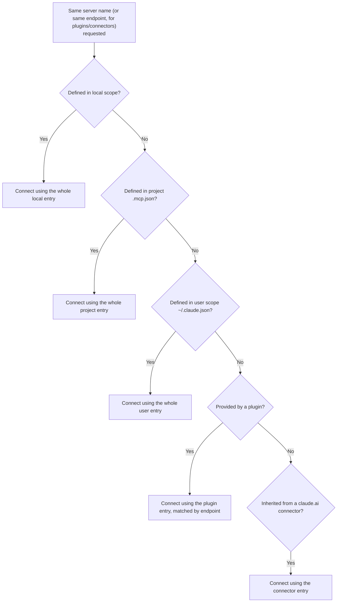
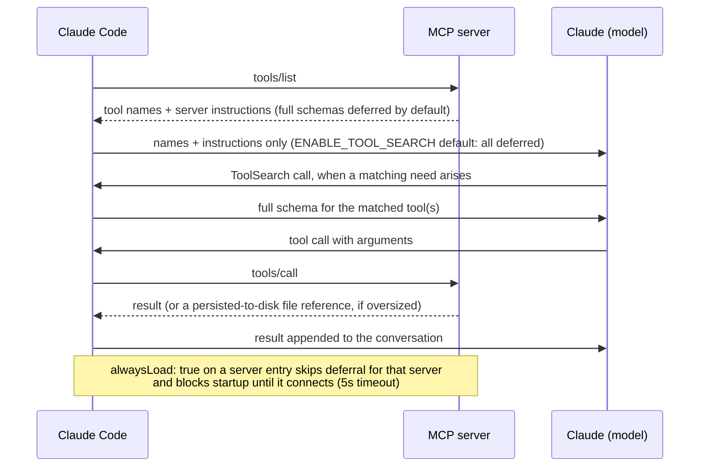
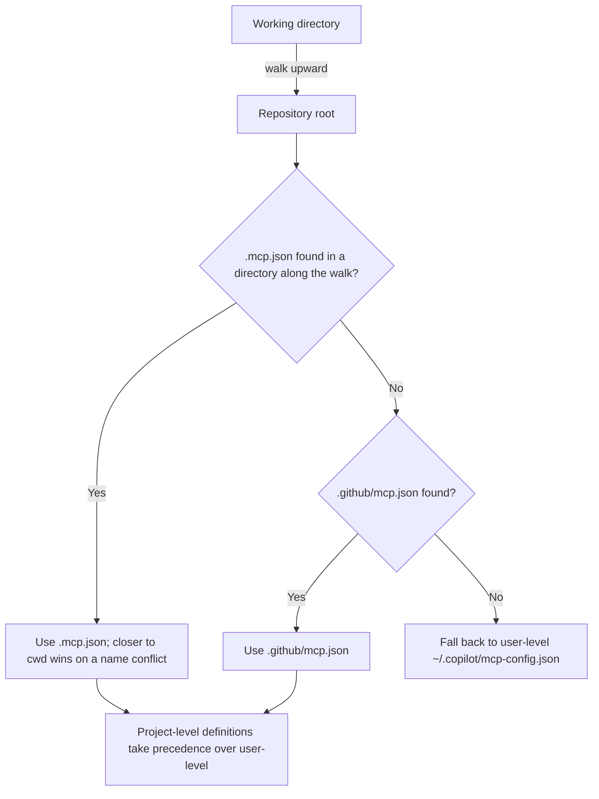

# MCP integration -- Claude Code, GitHub Copilot CLI, and Hermes Agent

How each harness discovers, registers, connects to, and invokes MCP
servers. Written for someone building a server that must work across
harnesses.

Every claim below is tagged VERIFIED (fetched this session from the
named source) or BEST CURRENT UNDERSTANDING, UNCONFIRMED. Sources and
fetch dates at the bottom. Claude Code, Copilot CLI, and Hermes Agent
are separate products from separate organizations -- nothing confirmed
for one is assumed for another.

---

## 1. Claude Code

Source for this whole section unless noted: `code.claude.com/docs/en/mcp`,
fetched 2026-07-30. VERIFIED.

### 1.1 Config sources and scopes



Three scopes, all using the same `mcpServers` object shape:

| Scope | Loads in | Shared with team | Stored in |
|---|---|---|---|
| Local (default) | Current project only | No | `~/.claude.json`, under that project's path |
| Project | Current project only | Yes, via version control | `.mcp.json` in project root |
| User | All your projects | No | `~/.claude.json` |

Two further sources sit below those three: plugin-provided servers
(declared in a plugin's own `.mcp.json` or inline in `plugin.json`) and
claude.ai connectors (inherited from a claude.ai subscription login).

Precedence, highest first: local, project, user, plugin, claude.ai
connector. When the same server is defined twice, Claude Code connects
once using the whole entry from the highest-precedence source -- fields
are **not** merged across scopes. The three scopes match duplicates by
name; plugins and connectors match by endpoint (same URL or command).

Project-scoped `.mcp.json` servers require an approval prompt before
first use. From v2.1.196, in a folder you have not accepted the
workspace-trust dialog for, approvals committed to the repo
(`enableAllProjectMcpServers`, `enabledMcpjsonServers` in
`.claude/settings.json`) are ignored and the server sits at
`Pending approval` -- a cloned repo cannot approve its own servers.

### 1.2 Transports

Four: `stdio`, `http` (a.k.a. `streamable-http`, accepted as an alias),
`sse` (documented as deprecated -- "use HTTP servers instead, where
available"), and `ws` (WebSocket, JSON-config-only; `claude mcp add
--transport` does not accept `ws`).

A JSON entry with a `url` but no `type` is a hard configuration error:
Claude Code reads a typeless entry as stdio and reports `MCP server
"<name>" has a "url" but no "type"`. Always set `type` explicitly on
remote entries.

### 1.3 Registration CLI

```bash
claude mcp add --transport http <name> <url>
claude mcp add --transport http <name> <url> --header "Authorization: Bearer TOKEN"
claude mcp add --transport sse  <name> <url>
claude mcp add [options] <name> -- <command> [args...]      # stdio
claude mcp add-json <name> '<json>'                          # any type, incl. ws
claude mcp add-from-claude-desktop                           # macOS / WSL only
claude mcp list | get <name> | remove <name>
claude mcp login <name> | logout <name>
claude mcp reset-project-choices
```

`--scope`/`-s` selects `local` (default) / `project` / `user`.
`--env`/`-e` sets env vars. For stdio, `--` separates Claude's own
flags from the server's command line -- everything after `--` is passed
through untouched.

### 1.4 Environment-variable expansion

Supported in `.mcp.json`: `${VAR}` and `${VAR:-default}`, expanded in
`command`, `args`, `env`, `url`, and `headers`. An unset variable with
no default does **not** fail the load -- Claude Code warns in
`claude mcp list` and passes the literal `${VAR}` text through.

Plugin configs additionally get `${CLAUDE_PLUGIN_ROOT}`,
`${CLAUDE_PLUGIN_DATA}`, and `${CLAUDE_PROJECT_DIR}` substituted
directly.

### 1.5 What a stdio server receives at spawn time

`CLAUDE_PROJECT_DIR` is set in the spawned server's environment to the
stable project root -- it does not change when working directories are
added or removed mid-session. Read it from inside the server process
(`process.env.CLAUDE_PROJECT_DIR`).

Important gotcha for `.mcp.json` authors: `CLAUDE_PROJECT_DIR` is set in
the *server's* environment, not in Claude Code's own, so `${CLAUDE_PROJECT_DIR}`
inside a `.mcp.json` `command`/`args` needs a default
(`${CLAUDE_PROJECT_DIR:-.}`) to expand usefully. Only plugin-provided
configs substitute it directly.

For sandboxing filesystem access, Claude Code answers the MCP
`roots/list` request with the session's launch directory plus every
`--add-dir`/`/add-dir`/`additionalDirectories` grant, and sends
`notifications/roots/list_changed` when that set changes (both as of
v2.1.203).

### 1.6 Tool-calling semantics



**Callable tool name.** A plain configured server's tools are callable as
`mcp__<server-name>__<tool-name>`. A plugin-bundled server's tools are
`mcp__plugin_<plugin-name>_<server-name>__<tool-name>`, with any
character outside `A-Z a-z 0-9 _ -` replaced by `_`. That full name is
what permission rules, a skill's `allowed-tools`, a subagent's `tools`
field, and hook matchers must use -- a matcher written against the bare
server key never fires for a plugin server. The server itself registers
under `plugin:<plugin-name>:<server-name>` for places that want a
server name (e.g. an `mcp_tool` hook's `server` field).

**Tool search (default on).** Only tool *names* and server instructions
load at session start; full schemas are deferred and fetched via a
`ToolSearch` call when Claude needs them. There is no fixed per-server
tool cap -- the practical limit is context budget. `ENABLE_TOOL_SEARCH`
controls it: unset/`true` = all deferred, `auto` = load upfront if they
fit in 10% of context (`auto:N` for a custom percentage), `false` = all
upfront. Requires a model supporting `tool_reference` blocks (Sonnet
4.5, Haiku 4.5, Opus 4.5 and later). Per-server escape hatch:
`"alwaysLoad": true` in the server entry loads all its tools upfront
regardless -- and also blocks startup until that server connects, capped
at a 5-second connect timeout.

**For server authors, this makes the `instructions` field load-bearing**:
with tool search on, server instructions are how Claude decides to go
looking for your tools at all. Descriptions and instructions are
truncated at 2KB each -- front-load the important part.

**Timeouts.** `MCP_TIMEOUT` (env) for server startup. Per-server
`timeout` in ms in the server entry is a hard wall-clock limit per tool
call, overriding `MCP_TOOL_TIMEOUT` for that server; values below 1000
are ignored. Remote transports additionally have a per-request
first-byte timer, 60s by default. Separately, an idle timeout aborts a
call that sends no response and no progress notification: 5 minutes for
HTTP/SSE/WS/connectors, 30 minutes for stdio, tunable via
`CLAUDE_CODE_MCP_TOOL_IDLE_TIMEOUT` (0 disables).

**Automatic backgrounding.** From v2.1.212, a main-conversation MCP call
still running after 2 minutes moves to a background task; Claude gets a
task ID immediately and the result arrives as a notification. Subagent
calls are never backgrounded. Tunable via
`CLAUDE_CODE_MCP_AUTO_BACKGROUND_MS`.

**Output limits.** Warning above 10,000 tokens (threshold fixed); hard
default limit 25,000 tokens, raised via `MAX_MCP_OUTPUT_TOKENS`. A
server can raise the persist-to-disk threshold for one tool by setting
`_meta["anthropic/maxResultSizeChars"]` in its `tools/list` entry, up to
a 500,000-character ceiling. Oversized results are persisted to disk and
replaced in the conversation with a file reference.

**Anthropic-specific `_meta` annotations a server can set**:
`anthropic/maxResultSizeChars`, `anthropic/requiresUserInteraction`
(forces a permission prompt on every call, even in `bypassPermissions`),
`anthropic/alwaysLoad` (per-tool upfront loading).

**Schema constraint worth knowing.** The Claude API rejects `anyOf`/
`oneOf`/`allOf` at the *root* of a tool's input schema. As of v2.1.195
Claude Code flattens such a schema into a single object and describes
the parameter groups in the tool description instead -- so the tool stays
available, but the union is no longer enforced by the schema. Keep
validating combinations server-side. Before v2.1.195 those tools were
skipped entirely.

**Reliability.** `list_changed` notifications for tools/prompts/resources
are honoured (and from v2.1.214 a failed refresh keeps the previous
list rather than emptying it). HTTP/SSE servers reconnect automatically
with exponential backoff, up to five attempts; stdio servers are not
reconnected automatically.

### 1.7 Beyond tools

- **Resources** -- referenced with `@server:protocol://resource/path`
  in a prompt; appear in `@` autocomplete alongside files.
- **Prompts** -- surface as slash commands, `/mcp__servername__promptname`,
  with space-separated arguments.
- **Elicitation** -- servers can request structured input mid-task;
  Claude Code renders a form dialog or opens a URL. No client-side
  config needed. Auto-respond via the `Elicitation` hook.
- **Channels** -- a server declaring the `claude/channel` capability can
  push messages into a session (opt in with `--channels`).
- **Claude Code as a server** -- `claude mcp serve` exposes its own
  tools over stdio.
- **OAuth 2.0** -- full client support: automatic discovery (RFC 9728
  protected-resource metadata, then RFC 8414), dynamic client
  registration, CIMD, pre-configured `clientId`/`clientSecret`, fixed
  `--callback-port`, `oauth.scopes` pinning, `authServerMetadataUrl`
  override, and `headersHelper` for non-OAuth schemes (a command whose
  stdout is a JSON header object, 10s timeout, re-run on every connect).

---

## 2. GitHub Copilot CLI

Sources for this section: `docs.github.com/en/copilot/how-tos/copilot-cli/customize-copilot/add-mcp-servers`
and `.../set-up-copilot-cli/configure-copilot-cli`, both fetched
2026-07-30; and `github/copilot-cli`'s own `changelog.md` (note the
lowercase filename) read via `gh api` on 2026-07-30, authoritative for
its own behaviour-change history. VERIFIED.

### 2.1 Config sources and precedence



User-level: `~/.copilot/mcp-config.json`. The whole `~/.copilot`
directory relocates if `COPILOT_HOME` is set (default `~/.copilot` on
macOS/Linux, `$HOME\.copilot\` on Windows).

Project-level, and this is the part most likely to trip you up coming
from Claude Code -- the docs name exactly two paths:

- `.mcp.json`, searched in every directory from the working directory
  up to the repository root
- `.github/mcp.json`

Precedence, quoting the docs: "When server names conflict, definitions
in files closer to your working directory take precedence. Project-level
definitions also take precedence over those in
`~/.copilot/mcp-config.json`." And: "If both `.mcp.json` and
`.github/mcp.json` exist in the same directory, `.mcp.json` takes
precedence."

**There is no documented repository-level `.copilot/mcp-config.json`.**
The current docs page does not mention that path at all -- only
`~/.copilot/mcp-config.json` (user-level, and only at whatever
`COPILOT_HOME` resolves to). VERIFIED as an absence in the page fetched
2026-07-30, which is weaker than a positive statement: it means the
behaviour is undocumented, not provably nonexistent. Treat a repo-root
`.copilot/mcp-config.json` as unsupported and use `.mcp.json` or
`.github/mcp.json` instead. `github/copilot-cli`'s changelog corroborates
the direction of travel: it records removing `.vscode/mcp.json` and
`.devcontainer/devcontainer.json` as config sources in favour of
`.mcp.json` only, and separately adding `.github/mcp.json` as a
workspace config source. VERIFIED (changelog).

Project-level servers load only after folder trust is confirmed
(changelog; permanently trusted directories live in a `trustedFolders`
array in `~/.copilot/config.json`).

Per-session override: `--additional-mcp-config`, taking inline JSON or
`@/path/to/file.json`, repeatable with later values overriding earlier
ones. VERIFIED (changelog).

### 2.2 Config format

Same `mcpServers` wrapper object, keyed by server name:

```json
{
  "mcpServers": {
    "serverName": {
      "type": "local",
      "command": "node",
      "args": ["path/to/server.js"],
      "env": { "TOKEN": "${GITHUB_TOKEN}" },
      "tools": ["*"]
    }
  }
}
```

Project-level files may also use a bare format with server names as
top-level keys (no `mcpServers` wrapper) -- the changelog calls this
"Claude-style `.mcp.json` format without `mcpServers` wrapper".

Two format differences from Claude Code that will bite you:

1. **`type` values differ.** Copilot CLI uses `local` for a stdio
   process, plus `http` (streamable HTTP) and `sse` (legacy,
   deprecated-but-supported). Claude Code uses `stdio` for the same
   thing. A config file is therefore **not** portable verbatim between
   the two harnesses on this field.
2. **`env` values are literal unless you write `${VAR}`.** Copilot CLI
   changed this deliberately (v0.0.340, 2025-10-13): `env` values are
   now literal strings, and to pass through a host environment variable
   you must write `"KEY": "${HOST_VAR}"`. Before that change a bare
   `"KEY": "HOST_VAR"` was read as a reference. VERIFIED (changelog,
   which shows the before/after JSON explicitly).

There is also a `tools` field with no Claude Code equivalent: "Enter
`*` to include all tools, or provide a comma-separated list of tool
names (no quotes needed). The default is `*`." This is a per-server
allow-list applied at config level, i.e. the client filters which of
your server's tools it will expose at all.

### 2.3 Registration CLI and interactive management

```bash
copilot mcp add SERVER-NAME -- COMMAND [ARGS...]
copilot mcp add --transport http SERVER-NAME URL
copilot mcp list [--json] | get SERVER-NAME [--json] | remove SERVER-NAME
```

`copilot mcp add` options: `--env`, `--header`, `--transport`,
`--tools`, `--timeout`.

In-session: `/mcp add`, `/mcp show` (all servers and status),
`/mcp show SERVER-NAME` (status plus its tool list), `/mcp edit`,
`/mcp delete`, `/mcp disable`/`/mcp enable`, `/mcp list`, and an
experimental `/mcp search [QUERY]` for registry discovery.

The GitHub MCP server is built in and available with no configuration.

### 2.4 Tool-calling semantics

**Permission syntax.** Copilot CLI's allow/deny flags address MCP tools
as `'MCP_SERVER_NAME(tool_name)'` for one tool, or `'MCP_SERVER_NAME'`
for every tool from that server, used with
`--allow-tool='...'` / `--deny-tool='...'` / `--allow-all-tools`.
VERIFIED (configure-copilot-cli page). This is a different addressing
scheme from Claude Code's flat `mcp__server__tool` string -- rules do
not port between harnesses.

**Tool search exists here too, and is a distinct implementation.**
Copilot CLI's changelog records "Tool search with deferred loading for
MCP and external tools" (initially experimental), later enabling it for
Claude Haiku 4.5+, and a per-server `deferTools` option "to keep a
server's tools always available, even when tool search is enabled" --
including honoured on servers configured in custom-agent frontmatter.
VERIFIED (changelog). Note `deferTools` is Copilot's field name for
roughly what Claude Code calls `alwaysLoad`; do not assume identical
semantics, and do not put either field in the other harness's config.

**Name sanitisation.** The changelog records fixes for "MCP tool names
with dots or other invalid characters are now sanitized correctly" and
"MCP server names with dots and slashes map to valid Responses API
namespaces". VERIFIED that sanitisation happens. The exact model-visible
name format Copilot CLI produces for an MCP tool is BEST CURRENT
UNDERSTANDING, UNCONFIRMED -- the permission-rule form
`SERVER(tool_name)` is documented, but whether that is also the literal
tool identifier sent to the model is not stated in any source fetched
here. Practical consequence for you as a server author: keep tool and
server names to `[a-z0-9_-]` and you never have to care.

**Elicitation and sampling** are supported: the changelog references
elicitation dialogs extensively (form input, enum/boolean fields,
Escape-to-dismiss, SDK `handlePendingElicitation`, autopilot
auto-handling of "elicitation, ask_user, sampling, and permission
prompts"). VERIFIED (changelog).

**Resources** are at least partially supported: "Add paginated
`session.mcp.resources` read/list/listTemplates RPCs for MCP server
resources". VERIFIED that the capability exists in the SDK surface.
Whether Copilot CLI exposes MCP resources to an interactive user the way
Claude Code's `@server:protocol://path` mentions do is BEST CURRENT
UNDERSTANDING, UNCONFIRMED.

**OAuth** is supported for remote servers: "Sign in to MCP servers
through the CLI OAuth callback flow", plus static client overrides
including client secrets, silent refresh reusing granted scope, and
automatic non-interactive reconnect on a mid-call 401. VERIFIED
(changelog).

**Server instructions are opt-in, not automatic.** The changelog records
`--allow-all-mcp-server-instructions` "to optionally include
instructions from all MCP servers in system prompts". VERIFIED. This is
a meaningful asymmetry: on Claude Code, server instructions are what
makes tool search find your server; on Copilot CLI they may not reach
the system prompt at all unless the user passes that flag. The default
behaviour when the flag is absent -- ignored entirely, or included for
some trusted subset -- is BEST CURRENT UNDERSTANDING, UNCONFIRMED.

**Sandbox interaction.** Locally-spawned servers can run inside
Copilot CLI's sandbox and are marked `connected (sandboxed)` in
`/mcp list`; toggling `/sandbox` restarts local servers and leaves
remote ones connected. VERIFIED (changelog). Claude Code's docs fetched
here describe no equivalent sandbox for stdio servers -- do not assume
one exists.

**No confirmed equivalents on Copilot CLI** for the following Claude
Code mechanisms. Each is UNCONFIRMED-as-absent (not found in sources
fetched here), which means "check before relying on it", not "proven
missing":

- a project-root env var handed to the spawned server
  (`CLAUDE_PROJECT_DIR`'s counterpart)
- `roots/list` / `notifications/roots/list_changed` answering
- MCP output token warning/limit thresholds
  (`MAX_MCP_OUTPUT_TOKENS`'s counterpart)
- automatic backgrounding of long tool calls
- `_meta` annotations (`anthropic/*` are Anthropic-namespaced by
  definition and must not be expected to do anything here)
- MCP prompts surfaced as slash commands

---

## 3. Hermes Agent (Nous Research)

Source for this section: VERIFIED, fetched 24 August 2026 directly from
`hermes-agent.nousresearch.com/docs/user-guide/features/mcp` (WebFetch).
Hermes Agent is a third, independent, self-hosted product -- see
[Permissions & sandboxing architecture](permissions-and-sandboxing.md)
§6 for this book's fuller architectural introduction to the harness
itself, not repeated here.

### 3.1 Discovery, config, and transports

"Hermes discovers MCP servers at startup and registers their tools into
the normal tool registry" -- the same tool registry this book's
[built-in-skills.md](built-in-skills.md) and
[permissions-and-sandboxing.md](permissions-and-sandboxing.md) §6
document Hermes' own 70+ built-in tools self-registering into, not a
separate MCP-only surface the way neither Claude Code's nor Copilot
CLI's own tool-dispatch layer requires either. Servers are configured
under `mcp_servers` in `~/.hermes/config.yaml` with both **stdio**
(subprocess, e.g. `npx -y @modelcontextprotocol/server-github`) and
**HTTP** (remote URL plus headers, supporting API keys, OAuth, and
client-certificate mTLS) transports -- the same two-transport split §1.2
and §2.2 above document for both of this book's closed-source harnesses,
here confirmed a third time for an independently-built, self-hosted
product.

### 3.2 Tool namespacing, filtering, and dynamic re-discovery

MCP tools are namespaced to avoid collisions with Hermes' own 70+
built-in tools -- "`mcp_<server_name>_<tool_name>`" -- a simpler,
single-fixed-prefix convention than either Claude Code's
`mcp__<server-name>__<tool-name>` (§1.6) or Copilot CLI's
`SERVER(tool_name)` permission-addressing scheme (§2.4); none of the
three harnesses' naming conventions are interchangeable, reinforcing
this page's own closing point (§4) that permission-rule syntax and tool
naming are per-harness client policy, never part of the portable MCP
protocol surface itself. Per-server tool filtering supports both
whitelisting (`tools.include`) and blacklisting (`tools.exclude`),
including glob patterns for large tool surfaces (`exclude:
["*_radar_*"]`) -- a coarser, but directly comparable, control to
Copilot CLI's own `tools` field (§2.2, `*` or a comma-separated list)
and a materially different mechanism from Claude Code's own tool-count
strategy, which manages surface size via deferred schema loading
(`ToolSearch`, §1.6) rather than per-server include/exclude filtering.
Hermes also supports **dynamic runtime re-discovery**: "MCP servers can
notify Hermes when their available tools change... Hermes automatically
re-fetches the server's tool list and updates the registry" -- a
live-update capability neither §1 nor §2 documents for Claude Code or
Copilot CLI (both instead honour `list_changed` notifications
per-connection, §1.6, without this page finding a stated broader
re-discovery guarantee), and worth flagging as a genuinely new finding
for this page's own eventual follow-up on the other two harnesses'
equivalent behavior, rather than assumed to also be true of them
(AUTHORITY OVERREACH guard).

### 3.3 Tool-result sanitisation

Tool results additionally undergo security sanitisation -- "stripping
invisible Unicode TAG characters whilst preserving legitimate emoji
sequences" -- before being shown to the model, a narrow but concrete
content-sanitisation step this book's own
[mcp-supply-chain-trust.md](mcp-supply-chain-trust.md) page has not
previously sourced for any harness, and a different, narrower concern
than that page's own attack-taxonomy coverage (tool description
poisoning, tool shadowing, tool-name squatting, rug pulls) -- Hermes'
own mechanism sanitises tool *output* content specifically, not the
tool *definition* trust questions that page's own attack taxonomy
addresses.

---

## 4. Synthesis -- what actually differs

| Dimension | Claude Code | Copilot CLI | Hermes Agent |
|---|---|---|---|
| Wrapper object | `mcpServers` | `mcpServers`, bare top-level keys also accepted in project files | `mcp_servers` under `~/.hermes/config.yaml` |
| stdio type value | `"stdio"` | `"local"` | Implicit -- a `command`-shaped entry (e.g. `npx -y @modelcontextprotocol/server-github`) rather than a discriminated `type` value documented on the one page fetched |
| Remote types | `http` (alias `streamable-http`), `sse` (deprecated), `ws` | `http`, `sse` (deprecated) | HTTP (remote URL, headers, API key/OAuth/mTLS) |
| WebSocket | Yes, JSON-config only | No confirmed support | Not found on the page fetched |
| User-level file | `~/.claude.json` | `~/.copilot/mcp-config.json` (relocatable via `COPILOT_HOME`) | `~/.hermes/config.yaml` |
| Project file | `.mcp.json` at project root | `.mcp.json` (walked up to repo root) or `.github/mcp.json` | Not found on the page fetched -- config is documented as the single `~/.hermes/config.yaml` (or `$HERMES_HOME`-relative per profile, per [permissions-and-sandboxing.md](permissions-and-sandboxing.md) §6's own per-profile isolation finding) |
| `env` semantics | `${VAR}` / `${VAR:-default}` expansion | literal by default; `${VAR}` for a reference | Not documented on the page fetched |
| Per-server tool filter | none in config; permissions instead | `tools` field (`*` or comma-separated list) | `tools.include`/`tools.exclude`, glob-pattern-capable |
| Deferred loading opt-out | `alwaysLoad: true` | `deferTools` | Not applicable -- no deferred-loading strategy documented; tools register directly into the flat registry |
| Permission addressing | `mcp__server__tool` | `SERVER(tool_name)` or `SERVER` | `mcp_<server_name>_<tool_name>` (single fixed prefix, not a permission-rule-specific syntax distinct from the tool's own registered name) |
| Server instructions in prompt | yes, and central to tool search | opt-in via `--allow-all-mcp-server-instructions` | Not documented on the page fetched |
| Per-session override flag | `--mcp-config` (referenced in docs) | `--additional-mcp-config` (inline JSON or `@file`) | Not found on the page fetched |
| Built-in server always present | reserved names include `workspace`, `claude-in-chrome`, `computer-use` | GitHub MCP server | None found -- Hermes' own built-in capability comes from its 70+ native tools, not a bundled MCP server |
| Dynamic tool-list re-discovery | `list_changed` notification honoured per-connection; no broader re-discovery guarantee found | `list_changed`-style behavior not independently confirmed on pages fetched | Explicit, named runtime re-discovery: a connected server can push a change notification and Hermes re-fetches and updates the registry live |
| Tool-result content sanitisation | Not found as a named MCP-specific step (general prompt-injection mitigations exist elsewhere, per [system-prompt-design-as-craft.md](system-prompt-design-as-craft.md)) | Not found as a named MCP-specific step | Named Unicode-TAG-character stripping on tool results specifically |

**The three things that matter most if you are writing one server for
Claude Code and Copilot CLI specifically.** First, `type` is genuinely
incompatible -- `stdio` vs `local` -- so you cannot ship one config
file, only one *server*. Second, `env` semantics are inverted enough to
leak a literal string where you meant a secret, or vice versa; write
`${VAR}` in both and you are correct on both (Claude Code expands it,
Copilot CLI treats it as a reference). Third, everything above the
protocol -- permission rule syntax, deferred loading opt-out field,
whether your `instructions` string is even read -- is per-harness
client policy, so keep it out of your server's assumptions. Hermes adds
a real, third data point to this same lesson rather than an exception to
it: its own `mcp_<server_name>_<tool_name>` namespacing, `tools.include`/`tools.exclude`
filtering, and dynamic re-discovery behavior (§3.2) are, again, entirely
its own client policy -- a server author gains nothing by assuming any
of Claude Code's, Copilot CLI's, or Hermes' own naming/filtering
conventions transfer to either of the other two.

**The protocol itself is the portable part.** `tools/list`,
`tools/call`, `list_changed`, elicitation, and OAuth are confirmed on
Claude Code and Copilot CLI; Hermes' own docs confirm `tools/list`/`tools/call`
discovery and registration directly (§3.1) and `list_changed`-driven
re-discovery specifically (§3.2), though this session did not
independently confirm elicitation or OAuth support for Hermes beyond
the general credential-handling detail named in §3.1. Design against
the MCP spec, expose good `description` and `instructions` text, keep
names in `[a-z0-9_-]`, keep result payloads small (Claude Code will
truncate and disk-spill above documented thresholds; Copilot CLI's and
Hermes' own thresholds are unknown, so small is the safe default),
validate every argument server-side rather than trusting the client to
enforce your JSON Schema, and avoid root-level `anyOf`/`oneOf`/`allOf`
in input schemas since Claude Code has to flatten them.

**Related page in a sibling project, different scope**:
the AgentXRay repo's `references/mcp-server-setup.md` documents how
*that* project registers its own `xray-tools` server via APM. Note
that its Copilot section describes a repo-root `.copilot/mcp-config.json`,
which section 2.1 above could not confirm against the current docs --
worth reconciling if picked up again.

---

## Sources

| Source | Fetched | Authoritative for |
|---|---|---|
| `code.claude.com/docs/en/mcp` | 2026-07-30 | Claude Code's documented MCP behaviour, config format, transports, CLI, tool-calling semantics, limits |
| `docs.github.com/en/copilot/how-tos/copilot-cli/customize-copilot/add-mcp-servers` | 2026-07-30 | Copilot CLI's documented MCP config paths, format, server types, `/mcp` and `copilot mcp` commands, `tools` field, precedence |
| `docs.github.com/en/copilot/how-tos/copilot-cli/set-up-copilot-cli/configure-copilot-cli` | 2026-07-30 | `COPILOT_HOME`, `~/.copilot/config.json`, `trustedFolders`, `--allow-tool`/`--deny-tool` syntax |
| `github/copilot-cli` `changelog.md` (via `gh api`, at 1.0.75 / 2026-07-24) | 2026-07-30 | its own behaviour-change history: `env` semantics change, `deferTools`, tool search, sandboxed servers, OAuth, elicitation, `--additional-mcp-config`, config-source removals/additions |
| `hermes-agent.nousresearch.com/docs/user-guide/features/mcp` (WebFetch) | 2026-08-24 | Hermes' own MCP server discovery at startup, the stdio/HTTP config schema examples, the `mcp_<server>_<tool>` naming convention, per-server include/exclude tool filtering, dynamic runtime tool-list re-discovery, and tool-result Unicode-sanitisation |

Not consulted this session, and therefore not cited above:
`modelcontextprotocol.io` (the spec itself), Copilot CLI's issue
tracker, the Copilot "About MCP" concepts page, and any dedicated
Hermes config-reference page beyond the one Features page fetched (its
project-file/env-substitution/OAuth support could not be independently
confirmed as a result, see the §4 table's own "not found" cells). Any of
these is the natural next stop -- the spec especially, if you want the
capability-negotiation and lifecycle details that sit underneath all
three clients.
