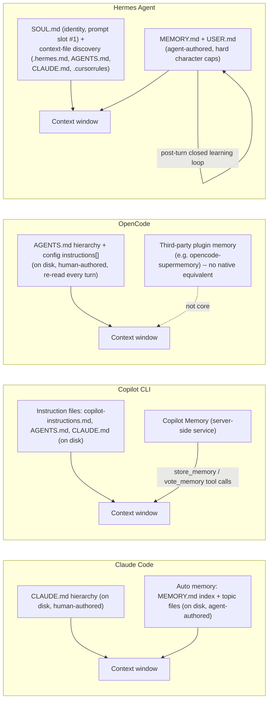
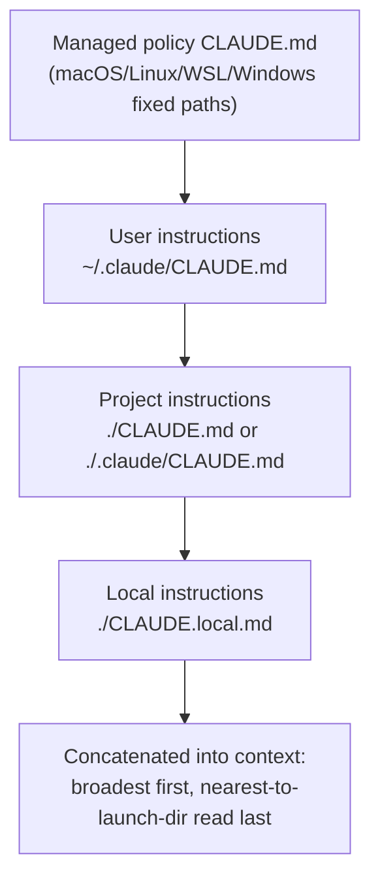
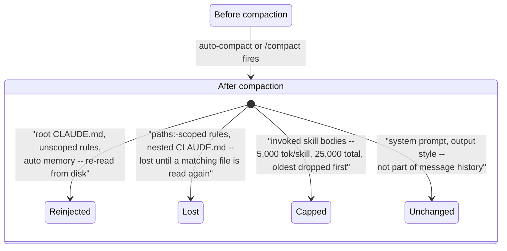

# Memory management -- Claude Code, GitHub Copilot CLI, OpenCode, and Hermes Agent

How each harness persists information across sessions, how that
information gets back into context, and what happens to it when a long
session compacts.

Every claim below is tagged VERIFIED (fetched this session from the
named source) or BEST CURRENT UNDERSTANDING, UNCONFIRMED. Sources and
fetch dates at the bottom. Claude Code, Copilot CLI, OpenCode, and
Hermes Agent are separate products from separate organizations --
nothing confirmed for one is assumed for another. §3 (OpenCode) was
added 2026-08-24 as a gap-fill: an earlier 2026-08-24 update to this
page had added Hermes Agent as a third harness section, but the page
still had never covered OpenCode -- one of this book's own three named
target harnesses -- leaving a real gap this update closes; §4 (Hermes
Agent) and §5 (Synthesis) are renumbered from that earlier update, not
otherwise changed.

**The one-line answer to "is it a memory tool or file convention?":**
Claude Code is entirely file-based and machine-local -- plain markdown
on your disk, written with ordinary file tools, no dedicated memory
tool primitive. Copilot CLI has both: instruction *files* in the repo
**and** a genuine server-side memory service (Copilot Memory) exposed
to the model as tool calls (`store_memory`, `vote_memory`) with
GitHub-account/repository scoping. OpenCode is file-based like Claude
Code -- and, source-verified this session, is the one harness of the
three whose instruction files are re-read from disk on every turn
rather than frozen at session start -- but ships **no dedicated
agent-authored memory tool of its own at all**; the closest thing is a
third-party plugin filling the gap, the same shape this book's own
[context-retrieval-and-agentic-search.md](context-retrieval-and-agentic-search.md)
already found for OpenCode's native RAG support. All three claims
VERIFIED, see below.



---

## 1. Claude Code

Sources for this section: `code.claude.com/docs/en/memory`,
`code.claude.com/docs/en/context-window`,
`code.claude.com/docs/en/how-claude-code-works`, and
`github.com/anthropics/claude-code` `CHANGELOG.md`, all fetched
2026-07-30. VERIFIED unless a claim is tagged otherwise.

### 1.1 Two mechanisms, not one

The docs are explicit that there are exactly two things carrying
knowledge across a session boundary, and that "each Claude Code session
begins with a fresh context window":

| | CLAUDE.md files | Auto memory |
|---|---|---|
| Who writes it | You | Claude |
| What it contains | Instructions and rules | Learnings and patterns |
| Scope | Project, user, or org | Per repository, shared across worktrees |
| Loaded into | Every session | Every session (first 200 lines or 25KB) |

(That table is reproduced from the docs page.) Critically, the docs
state both "are loaded at the start of every conversation" and that
"Claude treats them as context, not enforced configuration" -- to block
an action regardless of what the model decides, the documented answer
is a `PreToolUse` hook, not a memory file.

### 1.2 CLAUDE.md: locations and load order



Four scopes, listed by the docs in load order, broadest first:

| Scope | Location |
|---|---|
| Managed policy | macOS `/Library/Application Support/ClaudeCode/CLAUDE.md`; Linux/WSL `/etc/claude-code/CLAUDE.md`; Windows `C:\Program Files\ClaudeCode\CLAUDE.md` |
| User instructions | `~/.claude/CLAUDE.md` |
| Project instructions | `./CLAUDE.md` or `./.claude/CLAUDE.md` |
| Local instructions | `./CLAUDE.local.md` (gitignore it) |

Resolution is a walk *up* the directory tree from cwd, checking each
directory for `CLAUDE.md` and `CLAUDE.local.md`. All discovered files
are **concatenated, not overridden** -- ordered filesystem-root-down, so
instructions nearest your launch directory are read last, and within a
directory `CLAUDE.local.md` is appended after `CLAUDE.md`. Files in
*subdirectories* below cwd are discovered but **not** loaded at launch;
they load when Claude reads a file in that subdirectory.

`claudeMdExcludes` (glob patterns against absolute paths, arrays merge
across settings layers) skips ancestor files in monorepos; managed
policy CLAUDE.md cannot be excluded. A managed CLAUDE.md can also be
inlined as a `claudeMd` string key in `managed-settings.json`, honored
only in managed/policy settings.

`--add-dir` directories do **not** contribute memory files unless
`CLAUDE_CODE_ADDITIONAL_DIRECTORIES_CLAUDE_MD=1` is set.

### 1.3 Imports and the AGENTS.md question

`@path/to/import` inside a CLAUDE.md expands the referenced file into
context **at launch** -- relative paths resolve against the importing
file, recursion is capped at four hops, and import parsing skips code
spans and fenced blocks (so `` `@README` `` in backticks stays
literal). The docs are blunt that this is an organization tool, not a
context-saving one: "imported files still load and enter the context
window at launch."

Imports in a *project* memory file whose path resolves outside the
working directory are "external" and trigger a one-time approval dialog;
imports in user-scope files (`~/.claude/CLAUDE.md`, `~/.claude/rules/`)
load without a dialog.

**Claude Code does not read `AGENTS.md`.** The docs say so directly:
"Claude Code reads `CLAUDE.md`, not `AGENTS.md`." The recommended
bridge is a `CLAUDE.md` containing `@AGENTS.md` (or a symlink, with the
caveat that Windows symlinks need Administrator or Developer Mode).
Separately, `/init` *reads* other agents' rule files -- Cursor
(`.cursor/rules/`, `.cursorrules`) and Copilot
(`.github/copilot-instructions.md`) -- and folds relevant parts into the
CLAUDE.md it generates; with `CLAUDE_CODE_NEW_INIT=1` it also reads
`AGENTS.md`, `.devin/rules/`, `.windsurf/rules/`/`.windsurfrules`, and
`.clinerules`. That is a one-time authoring convenience, not runtime
loading.

### 1.4 `.claude/rules/` -- the path-scoped tier

`.claude/rules/**/*.md` (discovered recursively, symlinks supported and
circular links handled) is the modular alternative to one long
CLAUDE.md. Rules without `paths:` frontmatter load at launch with the
same priority as `.claude/CLAUDE.md`. Rules **with** `paths:` (glob
list) load only when Claude reads a matching file -- "not on every tool
use." `~/.claude/rules/` is the user-level equivalent, loaded before
project rules so project rules win.

Brace expansion in `paths:` shares a budget of 1,000 expanded patterns
and 4 MiB per rule; over-budget patterns are used unexpanded and match
nothing. Project rules are skipped when `project` is excluded from
`--setting-sources` (as of v2.1.211 -- before that, on-demand rules
loaded anyway).

### 1.5 Auto memory: the file-based learned-preferences store

On by default. Storage is `~/.claude/projects/<project>/memory/`, with
`<project>` derived from the **git repository**, so all worktrees and
subdirectories of one repo share a single memory directory. The
directory holds a `MEMORY.md` entrypoint plus arbitrary topic files
Claude creates (`debugging.md`, `api-conventions.md`, ...).

The mechanics that matter for context budgeting:

- **Only `MEMORY.md` loads at session start**, and only its first 200
  lines or 25KB, whichever comes first. Content past that is simply not
  loaded.
- **Topic files are not loaded at startup.** Claude "reads them on
  demand using its standard file tools." That sentence is the whole
  answer to "is there a memory tool?" -- retrieval of the detailed tier
  is ordinary file reading, model-driven, not a special primitive.
- Claude Code enforces the index budget after writes: near a limit it
  reminds Claude to shorten; over a limit the write succeeds but an
  error tells Claude to rewrite the index, because the overflow is
  dropped on next load (v2.1.210; corroborated by CHANGELOG "Memory
  writes that leave a MEMORY.md index over its read limit now produce an
  explicit error instead of silent truncation" and "the agent is now
  reminded to compact its `MEMORY.md` index when nearing the size
  limit"). As of v2.1.211 frontmatter and block-level HTML comments are
  stripped before measuring.
- As of v2.1.214, a memory file that already begins with YAML
  frontmatter gets a `modified` ISO-8601 timestamp written on each save.
  Claude Code never *adds* frontmatter to a file that has none.
- **Machine-local.** Not shared across machines or cloud environments.
- Auto memory is **not** inherited by subagents (the exception is a
  fork, which inherits the parent conversation). A subagent's own auto
  memory, enabled by the subagent `memory` field, is a separate
  directory.

Controls: `/memory`'s toggle writes `autoMemoryEnabled` to
`~/.claude/settings.json`; `autoMemoryEnabled: false` in a project's
settings disables it there; `CLAUDE_CODE_DISABLE_AUTO_MEMORY=1` kills it
by env var; `autoMemoryDirectory` (absolute or `~/`-prefixed) relocates
the store and is read from any settings scope -- but when set in a
project's `.claude/settings.json`/`settings.local.json` it is honored
only after you accept the workspace trust dialog, the same gate that
governs hooks.

### 1.6 How it actually reaches the model

One detail worth internalizing, stated in the troubleshooting section:
"CLAUDE.md content is delivered as a **user message after the system
prompt**, not as part of the system prompt itself." If you want
system-prompt-level text you need `--append-system-prompt` on every
invocation. The interactive context-window page's own timeline puts auto
memory (`MEMORY.md`) very early in startup loading, right after the
system prompt and before environment info.

Inspection surfaces: `/context` lists what actually loaded, under a
**Memory files** heading; `/memory` lists and opens CLAUDE.md,
CLAUDE.local.md and the auto memory folder (creating a listed file that
doesn't exist yet if you select it); the `InstructionsLoaded` hook logs
exactly which instruction files loaded, when, and why. "Saved 2
memories" / "Recalled 2 memories" in the UI are auto memory writes and
reads.

### 1.7 Compaction interaction -- the load-bearing table



From the context-window page, verbatim in substance:

| Mechanism | After compaction |
|---|---|
| System prompt and output style | Unchanged; not part of message history |
| Project-root CLAUDE.md and unscoped rules | Re-injected from disk |
| Auto memory | Re-injected from disk |
| Rules with `paths:` frontmatter | Lost until a matching file is read again |
| Nested CLAUDE.md in subdirectories | Lost until a file in that subdirectory is read again |
| Invoked skill bodies | Re-injected, capped at 5,000 tokens per skill and 25,000 total; oldest dropped first |
| Hooks | Not applicable; hooks run as code, not context |

So the persistence guarantee is asymmetric by *tier*, not by file
format: the launch-loaded tier (project-root CLAUDE.md, unscoped rules,
`MEMORY.md`) is re-read from disk after each compaction; the on-demand
tier (path-scoped rules, nested CLAUDE.md) is summarized away with
everything else and only comes back when its trigger file is read
again. The documented remedy for a rule that must survive is to drop
`paths:` or move it to the project-root CLAUDE.md.

Skill-body truncation "keeps the start of the file," which is a real
authoring constraint: put the most important instructions near the top
of `SKILL.md`.

On the compaction mechanism itself: "It clears older tool outputs
first, then summarizes the conversation if needed. Your requests and key
code snippets are preserved; detailed instructions from early in the
conversation may be lost." You can steer it with a "Compact
Instructions" section in CLAUDE.md or `/compact focus on ...`. As of
v2.1.198 the summarization request inherits the session's extended
thinking configuration. There is a documented anti-thrash guard: after
context refills immediately following three consecutive compactions,
auto-compaction stops with an actionable error rather than looping
(CHANGELOG). A `PreCompact` hook exists and can *block* compaction by
exiting 2 or returning `{"decision":"block"}` (CHANGELOG).

*BEST CURRENT UNDERSTANDING, UNCONFIRMED:* the two-phase behavior
(evict old tool outputs, then summarize) is what the community calls
"microcompaction." The term does not appear in the Claude Code docs
pages fetched here nor anywhere in `CHANGELOG.md` (grepped this
session), so treat the *name* as unofficial while the *behavior* is
verified. Likewise, no exact auto-compaction trigger percentage is
documented on the pages fetched; the only percentage found is a
CHANGELOG entry "Increased auto-compact warning threshold from 60% to
80%," which is a warning threshold, not the compaction trigger.

### 1.8 Mid-session edits: is an edited CLAUDE.md re-read?

Asked directly, and researched directly (docs pages + full `CHANGELOG.md`
grep, 2026-07-30). The honest answer has a verified part and an inferred
part, and they must not be blended.

VERIFIED, and stated repeatedly across the docs: loading is a
**session-start** event. "Each Claude Code session begins with a fresh
context window"; CLAUDE.md files are "loaded into the context window at
the start of every session"; "Claude reads them at the start of every
session"; ancestor CLAUDE.md/CLAUDE.local.md are "loaded in full at
launch"; unscoped `.claude/rules/` are "loaded at launch"; `@` imports
are "expanded and loaded into context at launch." There is **no
documented file watcher, hot-reload, or automatic re-read on edit** for
the launch-loaded tier. Nothing in the memory page, the context-window
page, or the `CHANGELOG.md` (grepped for `reload`/`re-read`/`watch`/
`takes effect`/`mid-session`) describes one. `/memory` opens the file in
your editor and, as of v2.1.216, lets you keep using the session while
the editor window is open -- but the docs do not claim saving it changes
the running session's context.

Three documented paths *do* pull instruction content off disk after
launch, and they are the only levers you have without restarting:

1. **Compaction.** "Project-root CLAUDE.md survives compaction: after
   `/compact`, Claude re-reads it from disk and re-injects it into the
   session." Same for unscoped rules and auto memory (the compaction
   table in 1.7).
2. **Nested CLAUDE.md in a subdirectory.** Loads when Claude reads a
   file in that subdirectory, and reloads the next time it does after a
   compaction. A CHANGELOG entry ("Fixed nested CLAUDE.md files being
   re-injected dozens of times in long sessions that read many files")
   confirms this path fires repeatedly within one session, not once.
3. **Path-scoped rules (`paths:` frontmatter).** Load when a matching
   file is read -- "not on every tool use."

*BEST CURRENT UNDERSTANDING, UNCONFIRMED:* because the docs say
compaction "re-reads it from disk," an edit you made earlier in the
session should appear in its post-compaction form -- i.e. `/compact` is
in practice a manual reload for root CLAUDE.md. The docs never state
this consequence explicitly (they discuss re-reading in the context of
*persistence*, not of *picking up edits*), so treat it as reasoned, not
documented. Likewise UNCONFIRMED: whether a nested CLAUDE.md re-injected
mid-session on a later file read reflects edits made since it first
loaded.

The practical upshot, and the part worth remembering: **for the
launch-loaded tier, edit-then-restart (or `--continue`, which reopens the
session and re-runs startup loading) is the only documented way to be
sure the model sees your change.** `/context` under **Memory files**, and
the `InstructionsLoaded` hook (fires "when CLAUDE.md or
`.claude/rules/*.md` files are loaded into context," CHANGELOG) are how
you verify what a given session actually holds rather than guessing.

### 1.9 Session-level persistence (distinct from memory)

Every message, tool use, and result is written to a plaintext JSONL file
under `~/.claude/projects/`, which is what powers rewind, resume, and
fork. `claude --continue` / `claude --resume` reopen the *same session
ID* and append; `--fork-session` / `/branch` copy history into a new
ID. But the docs draw the line clearly: "Sessions are independent. Each
new session starts with a fresh context window, without the
conversation history from previous sessions." Transcript persistence is
not memory -- it is only reachable by explicitly resuming.

---

## 2. GitHub Copilot CLI

Sources for this section: `docs.github.com/en/copilot/how-tos/copilot-cli/use-copilot-cli/overview`,
`docs.github.com/en/copilot/how-tos/use-copilot-agents/use-copilot-cli`,
`docs.github.com/en/copilot/reference/copilot-cli-reference/cli-command-reference`,
`docs.github.com/en/copilot/concepts/agents/copilot-memory`,
`docs.github.com/en/copilot/how-tos/use-copilot-agents/copilot-memory/manage-for-yourself`,
`docs.github.com/en/copilot/concepts/response-customization`, and
`github.com/github/copilot-cli` `changelog.md` + `README.md`, all
fetched 2026-07-30. VERIFIED unless tagged otherwise.

### 2.1 Instruction files (the file-based tier)

Per the Copilot CLI docs, the CLI "automatically incorporates"
instructions from:

- `.github/copilot-instructions.md` -- repository-wide
- `.github/instructions/**/*.instructions.md` -- path-specific
- `AGENTS.md` -- agent instructions

Two further facts come from the repo's own `changelog.md` (authoritative
for its behavior-change history):

- **Copilot CLI reads `CLAUDE.md` too.** Two independent entries confirm
  it: "Expand @-style imports in AGENTS.md, CLAUDE.md, and Copilot
  instruction files," and "Avoid sending duplicate custom instruction
  files (e.g. copilot-instructions.md and CLAUDE.md with identical
  content) to reduce wasted tokens per turn." So `@`-import expansion
  exists on this harness as well, across all three families.
- **User-level instructions exist outside the repo**:
  "Support `~/.copilot/instructions/*.instructions.md` files for
  user-level instructions across all repositories," and a later entry
  noting `/help` lists `$HOME/.copilot/instructions/**/*.instructions.md`
  among user-level instruction locations.

One context-cost detail from the changelog: "Pattern-specific
instruction files (`.github/instructions/*.instructions.md`) no longer
include their full body in the system prompt on every session" --
i.e. path-specific instruction bodies became lazy rather than always-on,
mirroring (independently) Claude Code's path-scoped-rules design.

`/instructions` views and toggles the loaded instruction files;
`/init` initializes custom instructions and agentic features.

**Precedence caveat (grounding boundary).** `docs.github.com`'s
response-customization page gives a combined-not-overridden precedence
order (personal > path-specific > repository-wide > agent instructions >
organization instructions) but that page enumerates GitHub.com, VS Code,
Visual Studio, JetBrains, Xcode and Eclipse and **does not mention
Copilot CLI at all**. So: instructions are combined rather than
overridden on the surfaces that page covers -- VERIFIED for those; that
the CLI applies the identical ordering is BEST CURRENT UNDERSTANDING,
UNCONFIRMED. I did not find a CLI-specific precedence statement.

### 2.2 Copilot Memory: a real, server-side memory service

```mermaid
sequenceDiagram
    participant Svc as Copilot Memory service
    participant CLI as Copilot CLI
    participant M as Model

    Svc-->>CLI: repo-level facts + user-level preferences (session start, refreshed every 30 min)
    CLI->>M: injected into the prompt
    M->>CLI: store_memory(fact, scope)
    CLI->>M: permission prompt, showing scope (user, or owner/repo)
    M->>Svc: write fact/preference, on approval
    Svc-->>CLI: citation validated against the current branch on later use
    M->>CLI: vote_memory(relevance), throttled per response/interaction
    Note over Svc: unused fact or preference auto-deleted after 28 days;<br/>successful validated use resets the timer
```

This is the genuine architectural difference. Per
`docs.github.com/en/copilot/concepts/agents/copilot-memory` (public
preview at time of fetch): "Copilot Memory helps Copilot become more
effective over time by remembering facts about your repositories and
your personal coding preferences."

Two memory types:

- **Repository-level facts** -- coding conventions, architectural
  decisions, build commands, project-specific rules. Created only in
  response to actions by users **with write access** who have Memory
  enabled. Stored with the repository; available to any user with
  Memory access to that repo; usable only in operations on that same
  repo. Facts carry **citations** to supporting code, and Copilot
  validates citations against the current branch before using a fact.
- **User-level preferences** -- stated or implied personal preferences,
  created only from that user's own interactions and available only in
  that user's later interactions. Citations may include direct user
  quotes. On Business/Enterprise plans the preferences are owned by the
  billing entity.

Other verified properties:

- **Surfaces:** "Copilot Memory is currently used by Copilot cloud
  agent, Copilot code review, and Copilot CLI." Copilot CLI applies
  repository-level facts plus the initiating user's user-level
  preferences. (Code review uses repo facts only.)
- **Retention:** any stored fact or preference that goes unused is
  automatically deleted after **28 days**; successful validation-and-use
  resets the timer.
- **Enablement is per user, not per repository.** Individual plans:
  on by default. Enterprise/org plans: admin must enable it before users
  can opt out. Management UI is profile picture → Copilot settings →
  Features → Copilot Memory (Enabled/Disabled); repository owners
  review and delete repo-level facts under repository Settings →
  Copilot → Memory.
- **Explicitly positioned against instruction files:** the docs frame
  Memory as reducing the "regular, manual maintenance" that custom
  instruction files require, letting Copilot "build its own knowledge."

The CLI-side surface, from `github/copilot-cli` `changelog.md`:

- `/memory on|off|show` -- "enable, disable, or view memory status
  (persistent)" (v1.0.49, 2026-05-18). `/memory show` also surfaces
  documentation links.
- **Model-facing tools**: "Inject repo memories in the prompt and add
  memory storage tool to remember facts across sessions" (v0.0.382 era,
  2026-01-14) -- this is the origin entry, and it names both halves of
  the mechanism: injection at prompt-build time, plus a tool for
  writing. Later entries name the tools directly: "The `store_memory`
  tool is only included when memory is enabled for the user," and
  "`vote_memory` tool calls are throttled per response and per
  interaction to prevent runaway voting bursts." A `vote_memory` tool
  implies a relevance/quality feedback loop on retrieved memories.
- **Permission-gated writes with visible scope**: "Memory tool
  confirmation prompt now shows the scope (repository or user) when
  requesting permission to store a memory," and "Memory permission
  prompts now name who can see a stored memory: user scope or the
  specific `owner/repo` for repository scope. Timeline entries also show
  the scope (`(for user)` / `(shared with repository collaborators)`)."
  Storage is a consented, per-write action, not silent.
- **Timeline visibility**: "Memory storage shows subject, fact, and
  citations in timeline."
- **Backend-dependency failure modes** (further evidence this is a
  service, not a file): "Agent no longer hangs on the first turn when
  the memory backend is unavailable"; "Show warning when repository
  memory fails to load"; "Memory loading no longer warns when outside a
  Git repository"; "Memory storage errors now indicate when repository
  doesn't exist or you lack write access"; "Memory storage correctly
  limits available scopes when no repository context is present."
- **Mid-session refresh**: "Refresh memory context after 30 minutes in
  long-lived sessions." Injection is therefore not purely a
  session-start event on this harness -- it re-hydrates on a timer.
- **Cross-session recall as a separate, experimental feature**: "Add
  cross-session memory: ask about past work, files, and PRs across
  sessions (experimental)" -- i.e. queryable history distinct from
  Copilot Memory's fact/preference store. Related: `/chronicle search`
  "search all session content by keyword or topic."
- SDK-level control: "Allow SDK clients to configure session memory
  through `session.create` and `session.resume`."

### 2.3 Session persistence and resume

`--resume` (or `/resume`) opens a session picker; `--continue` "quickly
resume[s] the most recently closed local session" -- "pick up right
where you left off, with the saved context." `--continue` and
`--resume` are mutually exclusive ("Reject `--continue` when used with
`--resume`", changelog). `--session-id` addresses a specific session;
`/session id` prints and copies the current one.

Config and state live under `~/.copilot/`, relocatable with
`COPILOT_HOME`. Sessions are stored in **session databases** -- the
changelog repeatedly says so ("Improve CLI responsiveness when reading
and writing session databases", "session SQL", "Recover corrupted
session history on load", "Store CLI settings and session state more
reliably"), which is a different storage model from Claude Code's
plaintext JSONL transcripts. The precise on-disk filename/schema is
**not** documented on the pages fetched -- BEST CURRENT UNDERSTANDING,
UNCONFIRMED that it is SQLite specifically, though "session SQL" points
that way. Sessions are also "tied to their working directory across
prompts, restarts, and workspace tools," and the sidebar can restore
remembered sessions across restarts.

### 2.4 Compaction on Copilot CLI

VERIFIED from the CLI docs: the CLI "automatically compresses your
history in the background when your conversation approaches **95% of
the token limit**"; `/compact` compresses manually; `/context` shows a
visual token-usage overview; `/usage` reports credits, duration, lines
edited, and a token breakdown.

From `changelog.md`, the mechanism has more shape than the docs page
gives:

- "Add auto-compaction at 95% token limit and `/compact` command" --
  the origin entry, matching the docs number exactly.
- "Auto-compaction runs in background without blocking the
  conversation" and "Enable infinite sessions with automatic
  long-running context management through **compaction checkpoints**."
  Compaction produces checkpoints with viewable summaries ("Compaction
  messages show clearer command hints to view checkpoint summaries").
- `/compact` "accepts optional focus instructions to shape the
  compaction summary" -- functionally the same affordance as Claude
  Code's `/compact focus on ...`.
- What survives, as far as the changelog states it: "**Skills remain
  effective after conversation history is compacted**" and "Preserve
  extended thinking after compaction." What is deliberately dropped:
  "Reduced memory growth in long sessions by evicting transient events
  after compaction."
- A **`preCompact` hook** exists ("Add preCompact hook to run commands
  before context compaction starts"). *UNCONFIRMED* whether it can
  block compaction the way Claude Code's `PreCompact` can -- no
  changelog or docs statement found either way.
- Context-window tiering interacts with compaction: "Context window
  tier selection (default ~200K vs 1M tokens) is now enforced
  end-to-end, so picking a tier actually constrains compaction,
  truncation, and token display," and tier selection now survives
  SDK-only resume paths.
- Observability hook worth knowing for profiling work: "OpenTelemetry:
  chat spans after a successful compaction carry
  `gen_ai.conversation.compacted=true`, and the summary is emitted as a
  `CompactionPart` in `gen_ai.input.messages`." That gives a
  machine-checkable compaction marker in exported traces.

### 2.5 Mid-session edits on Copilot CLI

Researched the same way (docs pages + full `changelog.md` grep,
2026-07-30). **Not found:** any statement that editing an instruction
file mid-session is or isn't picked up, and no file-watcher/hot-reload
entry for instruction files. The changelog *does* carry explicit reload
primitives for other subsystems -- `/mcp reload`, `/lsp reload`, "Reload
installed plugin extensions without restarting a session" -- and
conspicuously no instruction-file equivalent, which is a weak negative
signal rather than a fact.

Two nearby verified datapoints, neither of which answers the question:
`/instructions` "view and toggle custom instruction files" (so which
files are active is mutable in-session, per the changelog entry adding
the command), and the token-saving entry "Avoid sending duplicate custom
instruction files (e.g. `copilot-instructions.md` and `CLAUDE.md` with
identical content) to reduce wasted tokens **per turn**."

*BEST CURRENT UNDERSTANDING, UNCONFIRMED:* that "per turn" phrasing, plus
the 30-minute memory-context refresh (2.2), hints that Copilot CLI
assembles its prompt per turn rather than freezing instruction text at
launch -- which would make edits visible sooner than on Claude Code. That
is an inference from an incidental word in a changelog entry about
deduplication, not a documented reload guarantee. Do not rely on it.

**Not found:** any statement that Copilot CLI re-injects instruction
files from disk after compaction, the way Claude Code documents for
project-root CLAUDE.md and auto memory. The nearest datapoints are the
skills-survive-compaction entry and the 30-minute memory-context
refresh. Whether `.github/copilot-instructions.md` / `AGENTS.md` bodies
are re-read post-compaction is **UNKNOWN** -- do not assume symmetry
with Claude Code here.

---

## 3. OpenCode

Sources for this section: `opencode.ai/docs/rules/`, source-checked
against its own Markdown, `packages/web/src/content/docs/rules.mdx`;
`packages/web/src/content/docs/ecosystem.mdx` (the third-party plugin
catalogue); and the real loader implementation,
`packages/opencode/src/session/instruction.ts` and its calling site in
`packages/opencode/src/session/prompt.ts` -- all from
`github.com/anomalyco/opencode`, `dev` branch, fetched via `gh api`
2026-08-24. This page's own [instruction-context-budget.md](instruction-context-budget.md)
§3 covers the same OpenCode source material from the token-cost angle;
this section covers it from the persistence angle and does not repeat
its full detail.

### 3.1 No native agent-authored memory tool -- a real, source-verified absence

VERIFIED, negative finding: this session found no OpenCode analogue to
Claude Code's auto-memory (`MEMORY.md` index + topic files, written by
the model during ordinary tool use, §1.5 above) or to Copilot Memory's
server-side `store_memory`/`vote_memory` tool-call service (§2.2 above).
A `search/code` sweep of `packages/web/src/content/docs` for `"MEMORY.md"`
returned zero hits, and the only documented-adjacent hit for the word
`memory` in the docs tree is in `ecosystem.mdx`'s own third-party
integrations table: **`opencode-supermemory`**, described there as
providing "Persistent memory across sessions using Supermemory" -- i.e.
cross-session agent-authored memory exists for OpenCode only as an
external, community-built plugin, not a core feature, the same
"repeatedly-requested-but-never-shipped-natively, filled by a named
third-party project instead" shape this book's own
[context-retrieval-and-agentic-search.md](context-retrieval-and-agentic-search.md)
already documented for OpenCode's own RAG support. This is
UNCONFIRMED-as-absent in the strict sense (a feature could exist
undocumented and unfound by this session's searches), but the negative
signal is a real one -- a dedicated docs search that found the
third-party gap-filler and not a first-party feature, not a search that
simply came up empty.

### 3.2 The persistent-instruction tier is `AGENTS.md`, purely human-authored -- and re-read from disk every turn

What OpenCode has instead, per `rules.mdx`, is a purely human-authored
(or `/init`-scaffolded, not agent-maintained-in-the-background)
`AGENTS.md` file, discovered at project scope (project root, applying to
that directory and its subdirectories) and global scope
(`~/.config/opencode/AGENTS.md`, applied to every session, explicitly
recommended for personal rather than team-shared rules since it is not
committed to Git), with `CLAUDE.md`/deprecated `CONTEXT.md` honoured only
as Claude Code-compatibility fallbacks when no `AGENTS.md` exists at the
same scope -- cross-referenced to
[instruction-context-budget.md](instruction-context-budget.md) §3.2 for
the full precedence detail and the source-only `CONTEXT.md` finding, not
repeated here.

The persistence-relevant finding that page's token-cost framing does not
foreground, but this one does: `Instruction.system()` -- the function
that reads all of tier 1 off disk -- is called fresh, with no caching
layer visible in the source, on **every iteration of the main session
loop** (`prompt.ts`'s `while (true)` turn loop), source-verified this
session. Practically, that means an `AGENTS.md` edit made mid-session is
visible to the model on the very next turn, with no restart, no
`--continue`, and no compaction required to pick it up. This is a
materially different answer from both other harnesses' own documented
behavior: Claude Code's own §1.8 above documents no file watcher or
hot-reload for the launch-loaded tier at all, with compaction and
nested-file re-reads as the only two paths that pull instruction content
off disk again mid-session; Copilot CLI's own §2.4 above leaves the
question explicitly UNKNOWN. OpenCode's answer is the strongest,
most-directly-source-verified "yes, live" of the three, and closes a
question this page's own Synthesis table (§5) previously had no OpenCode
column to answer at all.

### 3.3 A nearby-file auto-attach mechanism, distinct from tier 1 and structurally closest to Claude Code's own nested-CLAUDE.md behavior

A second, source-only finding, not stated anywhere in `rules.mdx`:
`instruction.ts` exposes a `resolve()` function, called when the model
reads a file via the `read` tool, that walks upward from that file's
directory (bounded at the project root) for the nearest
`AGENTS.md`/`CLAUDE.md`/`CONTEXT.md` not already surfaced as part of
tier 1 or already attached earlier in that same assistant message
(tracked via a per-message `claims` set). Any match found is attached to
that turn's context, prefixed `Instructions from: <path>`. This is
architecturally the closest thing OpenCode has to Claude Code's own
documented **nested-CLAUDE.md-loads-on-first-read-of-that-subdirectory**
behavior (§1.6 above, not repeated) -- a real, per-message-deduplicated,
source-verified mechanism, distinct from both the always-loaded tier
(§3.2) and the invoke-only skills tier (§3.4), and one this page had not
previously documented for OpenCode.

### 3.4 Skills, briefly, and what they are not

OpenCode's skills tier (`.opencode/skills/`, Claude-compatible
`.claude/skills/`, and `.agents/skills/`, at both project and global
scope) is an invoke-only, on-demand instruction surface, not an
agent-authored memory store -- a skill's author writes it, the model
merely loads and follows it. Full detail (frontmatter fields, the
always-listed `<available_skills>` index, `allow`/`ask`/`deny`
permissioning) is cross-referenced to
[instruction-context-budget.md](instruction-context-budget.md) §3.4 and
[built-in-skills.md](built-in-skills.md), not repeated here, since
neither page found OpenCode's skills mechanism to be a persistence
feature in the sense this page is about.

### 3.5 Session-level persistence (distinct from memory)

Cross-referenced, not re-derived: this book's own
[session-persistence.md](session-persistence.md) documents OpenCode's
transcript/session storage in full (a `dev`-branch migration from a
flat per-message JSON layout to a SQLite database, `Session.fork()`
mechanics, and a shadow-git-repo-backed `SessionRevert`), and
[context-compression.md](context-compression.md) §3 documents its
compaction pipeline. Neither is agent-authored *memory* in the sense
§3.1-§3.3 above use the word -- both are records of what already
happened, not a store the agent deliberately curates for future
sessions to consult.

---

## 4. Hermes Agent (Nous Research)

Sources for this section: VERIFIED, fetched 24 August 2026 directly
from `hermes-agent.nousresearch.com/docs/user-guide/features/memory`,
`.../user-guide/features/personality`, and `.../user-guide/features/overview`
(all WebFetch). Hermes Agent is a third, independent, self-hosted
product -- see [Permissions & sandboxing architecture](permissions-and-sandboxing.md)
§6 for this book's fuller architectural introduction to the harness
itself, not repeated here.

### 4.1 `MEMORY.md`/`USER.md`: two bounded files, hard caps, no silent truncation

Hermes' own built-in memory is two bounded files under
`~/.hermes/memories/` -- **`MEMORY.md`** (capped at 2,200 characters:
"Agent's environmental observations, project conventions, and learned
techniques") and **`USER.md`** (capped at 1,375 characters: "User
identity, communication preferences, and workflow habits") -- both
injected "as frozen snapshots into the system prompt at session start,
preserving the LLM's prefix cache for performance efficiency." This is
the same cache-preserving, load-once-per-session discipline this book's
[caching.md](caching.md) documents Claude Code, Copilot CLI, and
OpenCode converging on for their own instruction files, and it splits
the agent-authored tier along an identity/environment axis neither
Claude Code's single `MEMORY.md` index (§1.5) nor Copilot Memory's own
repo-facts/user-preferences split (§2.2) draws in quite the same shape:
Hermes' two files are a fixed, always-both-loaded pair rather than an
index-plus-on-demand-topic-files structure (Claude Code) or a
server-side fact store queried by scope (Copilot CLI).

Capacity is a **hard limit, not an auto-compacting buffer**: "Memory
does **not** auto-compact: when a write would exceed the limit, the
`memory` tool returns an error instead of silently dropping entries" --
the opposite design choice from the evict-or-summarize mechanisms
[context-compression.md](context-compression.md) documents for
mid-run message-history growth in Claude Code/Copilot CLI/OpenCode,
here applied to a persistent memory *file* rather than the live
conversation, and resolved by forcing the agent to consolidate rather
than by silently discarding anything -- a materially different failure
mode from Claude Code's own auto-memory index, which (per §1.5 above)
also errors rather than silently truncates on overflow, but only as of
v2.1.210; Hermes' docs state the no-silent-truncation guarantee as the
mechanism's baseline design, not a later hardening.

### 4.2 A closed, post-turn learning loop feeding both memory and skills

The **closed learning loop** named in Hermes' own marketing copy
resolves, on direct inspection, into a specific mechanism: "a
background self-improvement review that runs after each turn,
automatically capturing repeated corrections and durable workflow
lessons as compact entries or procedural skills" -- meaning the same
post-turn review can write either to `MEMORY.md`/`USER.md` (facts) or
hand off to the `skill_manage` tool this book's
[built-in-skills.md](built-in-skills.md) §5.3 documents (procedures), a
single closed-loop mechanism feeding both stores. Neither Claude Code's
documented auto-memory (a model-driven write during the ordinary
tool-calling loop, not a dedicated post-turn review pass) nor Copilot
Memory's own write path (also ordinary in-loop `store_memory` tool
calls, §2.2) is documented as running a separate, dedicated
background-review step the way Hermes' own closed learning loop is.

### 4.3 FTS5 cross-session search: a second, independent memory channel

**Session search** is a second, independent memory channel from the
two bounded files above: "agents access unlimited historical
conversations through full-text search (FTS5) across SQLite's
conversation database," letting a model discover weeks-old discussions
"without consuming tokens in the current session." This is
structurally close to Copilot CLI's own "cross-session memory: ask
about past work, files, and PRs across sessions (experimental)" feature
and its `/chronicle search` command (§2.2 above) -- two independently
documented instances of a searchable, token-cheap channel held apart
from the always-loaded memory tier -- though Hermes' docs describe FTS5
full-text search specifically, where Copilot CLI's own docs do not name
the underlying search technology.

### 4.4 `SOUL.md`: a persona file pinned to a stated prompt position

`SOUL.md` is Hermes' persona/identity file, and its position in the
prompt is stated with unusual precision -- "SOUL.md content goes
directly into slot #1 of the system prompt -- the agent identity
position. No wrapper language is added around it" -- user-editable,
stored at `~/.hermes/SOUL.md`, and explicitly preserved across updates:
"Existing user SOUL.md files are never overwritten." Content passes
through prompt-injection scanning and truncation before inclusion, and
an empty or unreadable file falls back to a built-in default identity.
Neither Claude Code's `CLAUDE.md` (delivered as a user message *after*
the system prompt, per §1.6 above) nor Copilot CLI's own instruction
files are documented as occupying a named, fixed slot inside the system
prompt itself the way `SOUL.md` is -- a materially different injection
point from either harness's own documented mechanism.

### 4.5 Context-file discovery: naming other harnesses' own conventions directly

Separately, and independently verified from the Features Overview page,
Hermes "automatically discovers **Context Files** (`.hermes.md`,
`AGENTS.md`, `CLAUDE.md`, `SOUL.md`, `.cursorrules`)" and supports
**Context References** using an `@` syntax "to inject content directly
into messages." The dedicated context-files documentation page returned
an HTTP 503 during this session and could not be independently read
beyond that one Features Overview line, so the exact discovery
order and merge/precedence behavior across that five-file list is held
to **BEST CURRENT UNDERSTANDING, UNCONFIRMED** rather than asserted --
but the bare fact of the list itself is a directly quoted, VERIFIED
finding, and it is a genuinely notable one: Hermes explicitly recognizes
and loads instruction-file conventions this page documents as native to
**two of its three other harnesses** -- Claude Code's `CLAUDE.md`,
Copilot CLI's own `AGENTS.md` convention (§2.1 above), and, this session
confirms, the exact filename OpenCode's own tier-1 tier is built around
(§3.2 above; `AGENTS.md` is OpenCode's *primary* file, not a
compatibility fallback the way `CLAUDE.md` is for OpenCode) -- directly,
by name, alongside its own native `.hermes.md`/`SOUL.md` files. Copilot
CLI's own §2.1 already documents the mirror-image finding (Copilot CLI
reads `CLAUDE.md` too), and OpenCode's own §3.2 documents a third
instance in the opposite direction (OpenCode reads Claude Code's
`CLAUDE.md` as an explicit, named fallback), so this page now has three
independently-sourced instances of one harness's own docs/source naming
a rival's instruction-file convention by name -- direct evidence that
`CLAUDE.md`/`AGENTS.md` function as de facto cross-harness
interoperability surfaces, not merely convergent naming. Session-level
continuity is additionally supported by **Checkpoints**, named in the
Features Overview as providing "automatic snapshots for rollback
protection" -- a plausible analogue, per this book's own
[session-persistence.md](session-persistence.md) documentation of
Claude Code's `/rewind` file-snapshot mechanism, held to **BEST CURRENT
UNDERSTANDING, UNCONFIRMED** since no dedicated Hermes checkpoints page
was independently fetched this session to confirm the underlying
storage mechanism.

---

## 5. Synthesis

| Dimension | Claude Code | Copilot CLI | OpenCode | Hermes Agent |
|---|---|---|---|---|
| Human-authored persistent instructions | `CLAUDE.md` hierarchy (managed → user → project → local), `.claude/rules/` | `.github/copilot-instructions.md`, `.github/instructions/**/*.instructions.md`, `AGENTS.md`, `~/.copilot/instructions/**/*.instructions.md` | `AGENTS.md` (project + global), config `instructions[]` (local globs + remote URLs), `CLAUDE.md`/deprecated `CONTEXT.md` as compat fallbacks | `SOUL.md` (identity, prompt slot #1) plus auto-discovered Context Files (`.hermes.md`, `AGENTS.md`, `CLAUDE.md`, `.cursorrules`) |
| Reads the *other* harness's file? | No -- `AGENTS.md` not read at runtime; `/init` only mines it at authoring time | Yes -- `CLAUDE.md` is read and `@`-import-expanded (changelog) | Yes -- both `CLAUDE.md` and `AGENTS.md` named directly in its own Context Files discovery list |
| Path-scoped instruction tier | `.claude/rules/` with `paths:` frontmatter | `.github/instructions/**/*.instructions.md` (bodies no longer always in system prompt) | Not found in the docs pages fetched this session (see [instruction-context-budget.md](instruction-context-budget.md) §3.2) | Not found in the one docs page fetched this session |
| `@`-import expansion | Yes, 4-hop cap, launch-time | Yes (changelog: AGENTS.md, CLAUDE.md, Copilot instruction files) | Not applicable -- no `@`-import-expansion mechanism found; a manual, agent-followed "read this file when needed" convention exists instead (§3.2) | A distinct `@`-syntax exists, but for **Context References** (inline message injection), not documented as an import mechanism inside `SOUL.md`/Context Files themselves |
| Agent-authored memory | Auto memory: local markdown at `~/.claude/projects/<project>/memory/`, `MEMORY.md` index (200 lines / 25KB) + on-demand topic files | Copilot Memory: **server-side**, repo-level facts + user-level preferences, citation-validated, 28-day unused-expiry | **None, natively** -- no dedicated agent-authored memory tool found; cross-session persistent memory exists only via a third-party plugin (`opencode-supermemory`, §3.1) | `MEMORY.md` (2,200-char cap) + `USER.md` (1,375-char cap), both always loaded whole, no on-demand topic-file tier |
| Written how | Ordinary file tools; no dedicated memory tool | Dedicated model-facing tools `store_memory` / `vote_memory`, permission-prompted per write, scope shown | Ordinary file tools on `AGENTS.md`, same as Claude Code's own instruction-file tier; no dedicated memory-writing tool of its own | A `memory` tool plus a dedicated **post-turn closed learning loop** review pass, distinct from ordinary in-loop tool calls |
| Overflow behavior | Error + reminder to shorten near/at the limit (v2.1.210+), no silent truncation | Not documented on pages fetched | Not applicable -- no bounded memory store to overflow | Hard error on overflow, no auto-compaction, by original design (not a later hardening) |
| Memory sharing | Machine-local; shared across worktrees of one repo; never across machines | Repo facts shared with repo collaborators; user prefs private to the user/billing entity; server-side so cross-machine by construction | `AGENTS.md` at project scope is team-shared via Git (docs explicitly recommend committing it); global scope is machine-local and explicitly recommended for personal-only rules | Machine-local (`~/.hermes/memories/`), profile-isolated under `HERMES_HOME` |
| Enable/disable | `autoMemoryEnabled`, `CLAUDE_CODE_DISABLE_AUTO_MEMORY=1`, `/memory` toggle | `/memory on\|off\|show`, GitHub Copilot settings (per user; admin gate on Enterprise) | Not applicable to memory (none exists); Claude-compat *fallback* specifically is disableable via `OPENCODE_DISABLE_CLAUDE_CODE`/`_PROMPT`/`_SKILLS` | Not documented on pages fetched; `skills.write_approval`-style gating exists for skills, and a comparable `write_approval` flag is named for memory writes generally |
| Injection timing | Session start (system prompt then a *user message* carrying CLAUDE.md; `MEMORY.md` early in startup) | Session start prompt injection, **plus refresh after 30 minutes** in long-lived sessions | **Every turn** -- `Instruction.system()` re-reads and reassembles tier 1 on each iteration of the main session loop, source-verified (§3.2) | Session start, as a **frozen snapshot** explicitly to preserve prefix-cache reuse |
| Cross-session recall beyond the loaded tier | Not found as a distinct feature (session resume is the mechanism, §1.9) | Experimental cross-session memory + `/chronicle search` | Not native; the third-party `opencode-supermemory` plugin is the only documented answer (§3.1) | FTS5 full-text search across the SQLite conversation database, "without consuming tokens in the current session" |
| Mid-session re-read of an *edited* instruction file | No documented watcher/hot-reload; launch-loaded tier is a session-start read. Off-disk re-reads happen only at compaction (root CLAUDE.md, unscoped rules, auto memory) and on trigger-file reads (nested CLAUDE.md, `paths:` rules). Restart or `--continue` is the sure path | Undocumented either way; reload primitives exist for MCP/LSP/plugins but not instruction files. `/instructions` can toggle which files are active in-session | **Yes, every turn** -- the strongest, most directly source-verified "yes" of the four harnesses on this page (§3.2); a nearby-file auto-attach mechanism (§3.3) additionally re-surfaces subdirectory instruction files on each new matching `read` call | Not documented on pages fetched -- `SOUL.md`/Context Files are described as loaded, not as watched |
| Auto-compaction trigger | Documented behaviorally (evict tool outputs, then summarize); no % on fetched pages | **95% of token limit**, background, non-blocking | Token-budget-based (see [context-compression.md](context-compression.md) §3 for the source-verified `overflow.ts` mechanics; not re-derived here) | Not documented on pages fetched; **Checkpoints** ("automatic snapshots for rollback protection") are named but not confirmed as the same mechanism |
| Focused manual compaction | `/compact focus on ...`, plus "Compact Instructions" section in CLAUDE.md | `/compact [FOCUS-INSTRUCTIONS]` | Not investigated on this page; see [context-compression.md](context-compression.md) §3 | Not documented on pages fetched |
| Post-compaction re-injection | Documented per-mechanism table (root CLAUDE.md + auto memory re-injected; path-scoped rules and nested CLAUDE.md lost until retriggered; skill bodies capped 5K/25K) | Skills survive; instruction-file re-injection **undocumented** | Moot in the usual sense -- tier 1 is rebuilt from disk every turn regardless of compaction state (§3.2), so there is nothing distinct to "re-inject" | Not documented on pages fetched |
| Pre-compaction hook | `PreCompact`, can block (exit 2 / `{"decision":"block"}`) | `preCompact` exists; blocking capability unconfirmed | Not investigated on this page; see [hooks-lifecycle-extensibility.md](hooks-lifecycle-extensibility.md) §3 for OpenCode's own hook catalogue | Not documented on pages fetched (contrast its own shell-hook `pre_tool_call` blocking, [hooks-lifecycle-extensibility.md](hooks-lifecycle-extensibility.md) §6) |
| Session transcripts | Plaintext JSONL under `~/.claude/projects/` | Session databases under `~/.copilot/` (`COPILOT_HOME`); "session SQL" | SQLite database (`opencode.db`, Drizzle ORM, WAL mode) per [session-persistence.md](session-persistence.md) §3, not re-derived here | SQLite with FTS5 full-text indexing |
| Resume / continue | `claude --continue`, `--resume`, `--fork-session` / `/branch` | `--continue`, `--resume` / `/resume` (mutually exclusive), `--session-id` | `--fork` (`Session.fork()`), `SessionRevert`; see [session-persistence.md](session-persistence.md) §3 for the full, source-verified mechanics | Not independently researched on this page; see [session-persistence.md](session-persistence.md) for this book's general resume/fork coverage |

**The design lesson.** All harnesses on this page converge on some
version of a *two-tier* shape -- a small always-loaded index plus a
larger lazily-read or separately-searchable body -- but diverge
completely on where the agent-authored tier lives, how strictly it is
bounded, and, on OpenCode specifically, whether an agent-authored tier
exists at all. Claude Code keeps its memory as plain files you own, on
your machine, auditable with a text editor and invisible to your
teammates; Copilot puts it in a GitHub-hosted store with repository
scoping, write-access gating, citation validation against the current
branch, and automatic expiry; OpenCode has no agent-authored memory
tier of its own to compare on this axis at all -- its only persistent,
human-authored tier (`AGENTS.md`) is architecturally closer to Claude
Code's own instruction files than to either harness's memory mechanism,
and it distinguishes itself instead on *freshness*: it is the only one
of the four harnesses on this page that re-reads its persistent tier
from disk on every turn rather than freezing it at session start (or
at a fixed refresh interval, Copilot CLI's own 30-minute compromise
between the two). Hermes keeps its own memory machine-local like Claude
Code but enforces a **hard, error-on-overflow character cap** from the
outset rather than a soft/reminder-based budget, and adds a dedicated
**post-turn review pass** as the writing mechanism rather than routing
memory writes through the same ordinary tool-calling loop the other
harnesses use. That is a governance/reviewability tradeoff for Claude
Code vs. Copilot specifically: Claude Code's model can be inspected and
diffed but never shared; Copilot's is shared and centrally deletable
but not a file you can grep. Hermes adds a third axis to that
comparison -- *how memory writes get proposed in the first place* --
that neither Claude Code's auto memory nor Copilot Memory varies on
(both write during the ordinary agentic loop, where Hermes' closed
learning loop is a separate, dedicated background pass). OpenCode adds
a fourth axis distinct from all three: *whether the tier is even
re-read while the session is still running*, which none of the other
three harnesses' own documented mechanisms answers "yes, unconditionally,
every turn" to.

**Consequences for anything that must work across harnesses** (directly
relevant to this project's cross-harness requirement):

1. Do not build on "the agent will remember" as a cross-harness
   primitive. The nearest thing to a verified equivalent across harnesses
   is **repo instruction files**, and even there the filenames and
   fallback rules differ: Copilot CLI reads `CLAUDE.md` directly; Claude
   Code does not read `AGENTS.md` or `copilot-instructions.md` at
   runtime; OpenCode's own primary file is `AGENTS.md`, with `CLAUDE.md`
   honoured only as a fallback when no `AGENTS.md` exists at the same
   scope. An `AGENTS.md` with the same content as a `CLAUDE.md`, kept in
   sync, is the closest thing to a shared file across all three of this
   project's own target harnesses -- not a single file all three read
   identically by default.
2. Anything that must survive a long run should be in the
   always-loaded tier, not conversation. On Claude Code that means
   project-root `CLAUDE.md` or an unscoped rule (both re-injected after
   compaction); path-scoped rules and nested CLAUDE.md are explicitly
   *not* re-injected. On Copilot CLI the equivalent guarantee is not
   documented -- assume conversation-only state is lost at 95%. On
   OpenCode the question is close to moot: the always-loaded tier is
   rebuilt from disk every turn regardless of compaction state, so an
   `AGENTS.md` invariant is never at risk of the same kind of loss --
   though it is equally never protected from a *bad* edit made
   mid-session, since that too takes effect immediately.
3. Instrumentation asymmetry for profiling compaction: Copilot CLI
   emits a machine-checkable OTel marker
   (`gen_ai.conversation.compacted=true` plus a `CompactionPart`);
   Claude Code's documented equivalents are UI/`/context` surfaces and
   the `InstructionsLoaded` hook for load-time visibility; OpenCode's own
   compaction internals are source-readable directly (per
   [context-compression.md](context-compression.md) §3) but this page
   found no dedicated compaction-event marker comparable to Copilot
   CLI's. If you need a deterministic "did this run compact?" signal,
   each harness needs its own probe.
4. Hermes is not a deploy target of this project (see this book's
   [index.md](index.md) framing), so nothing above changes this
   project's own cross-harness requirement -- but its design is worth
   citing as a reasoning aid: a **hard, error-on-overflow character
   cap** (§4.1) is a stricter, more predictable failure mode than either
   Claude Code's warn-then-error-near-the-limit auto memory or Copilot
   Memory's undocumented overflow behavior, at the cost of occasionally
   forcing an explicit consolidation step rather than growing silently.
5. If a project needs genuine cross-session agent-authored memory on
   OpenCode specifically, the honest answer per this session's own
   research is: build it yourself, or adopt a named third-party plugin
   (`opencode-supermemory`, §3.1) -- do not assume a Claude-Code- or
   Copilot-Memory-shaped feature is coming for free on that harness.

---

## Sources

Claude Code and Copilot CLI sections fetched 2026-07-30; the OpenCode
and Hermes Agent sections fetched 2026-08-24 (see below).

**Claude Code (authoritative for Claude Code's documented behavior only):**
- `https://code.claude.com/docs/en/memory` -- CLAUDE.md hierarchy, load order, imports, AGENTS.md non-support, `.claude/rules/`, auto memory storage/limits/settings, `/memory`, compaction troubleshooting.
- `https://code.claude.com/docs/en/context-window` -- startup load order timeline, "What survives compaction" table, `/compact` guidance.
- `https://code.claude.com/docs/en/how-claude-code-works` -- "When context fills up", session JSONL storage under `~/.claude/projects/`, resume/fork semantics.
- `https://github.com/anthropics/claude-code` `CHANGELOG.md` (via `gh api repos/anthropics/claude-code/contents/CHANGELOG.md`) -- memory-index error and reminder entries, `autoMemoryDirectory`, worktree sharing, `PreCompact` blocking, autocompact thrash guard, 60%→80% warning threshold. Authoritative for its own behavior-change history; this repo ships no implementation source.

**GitHub Copilot CLI (authoritative for Copilot CLI's documented behavior only):**
- `https://docs.github.com/en/copilot/how-tos/copilot-cli/use-copilot-cli/overview` and `https://docs.github.com/en/copilot/how-tos/use-copilot-agents/use-copilot-cli` -- instruction files read by the CLI, `--resume`/`--continue`/`/resume`, 95% auto-compaction, `/compact`, `/context`, `/usage`.
- `https://docs.github.com/en/copilot/reference/copilot-cli-reference/cli-command-reference` -- slash-command list, `COPILOT_HOME`, `~/.copilot/` config location, session-picker shortcuts.
- `https://docs.github.com/en/copilot/concepts/agents/copilot-memory` -- what Copilot Memory is, repo facts vs. user preferences, citation validation, supported surfaces incl. Copilot CLI, 28-day expiry, per-user enablement, contrast with instruction files.
- `https://docs.github.com/en/copilot/how-tos/use-copilot-agents/copilot-memory/manage-for-yourself` -- enable/disable path in Copilot settings, viewing/deleting repo facts and user preferences.
- `https://docs.github.com/en/copilot/concepts/response-customization` -- instruction-file precedence, explicitly for the GitHub website and IDE surfaces it enumerates; **does not cover Copilot CLI**.
- `https://github.com/github/copilot-cli` `changelog.md` and `README.md` (via `gh api repos/github/copilot-cli/contents/...`) -- `/memory on|off|show`, `store_memory`/`vote_memory`, permission-prompt scoping, timeline citations, memory-backend failure modes, 30-minute memory refresh, cross-session memory (experimental), `CLAUDE.md` reading and `@`-import expansion, `~/.copilot/instructions/`, compaction checkpoints, `preCompact` hook, OTel compaction attributes, session databases. Authoritative for its own behavior-change history; this repo ships no implementation source.

**Hermes Agent (authoritative for its own documented behavior only; fetched 24 August 2026 from `hermes-agent.nousresearch.com/docs/`):**
- `https://hermes-agent.nousresearch.com/docs/user-guide/features/memory` (WebFetch) -- the `MEMORY.md`/`USER.md` two-file architecture and character caps, the frozen-snapshot/prefix-cache injection detail, the closed-learning-loop post-turn review mechanism, the does-not-auto-compact error-on-overflow behavior, FTS5 cross-session search, and write-approval gating (§4.1-4.3).
- `https://hermes-agent.nousresearch.com/docs/user-guide/features/personality` (WebFetch) -- the `SOUL.md` prompt-slot-#1 statement, its user-editability and update-preservation guarantee, and its prompt-injection-scanning and fallback-identity behavior (§4.4).
- `https://hermes-agent.nousresearch.com/docs/user-guide/features/overview` (WebFetch) -- the Context Files discovery list (`.hermes.md`/`AGENTS.md`/`CLAUDE.md`/`SOUL.md`/`.cursorrules`), the `@`-context-reference syntax, and the Checkpoints feature name (§4.5). A dedicated context-files documentation page returned HTTP 503 both times fetched this session and could not be independently read beyond what this Overview page states.

**OpenCode (fetched 2026-08-24; authoritative for OpenCode's documented and real-source behavior, with the standing `dev`-branch caveat):**
- `opencode.ai/docs/rules/`, source-checked against `github.com/anomalyco/opencode`'s own `packages/web/src/content/docs/rules.mdx` (`dev` branch, via `gh api`) -- `AGENTS.md` project/global discovery and precedence, the Claude Code-compatibility fallback (`CLAUDE.md`, `~/.claude/CLAUDE.md`) and its three disable env vars, the config `instructions` array (local globs, remote URLs with a 5-second fetch timeout), and the "combined with your AGENTS.md files" additive framing (§3.2).
- `packages/web/src/content/docs/ecosystem.mdx`, same repo/branch/method -- the third-party plugin catalogue, specifically `opencode-supermemory` ("Persistent memory across sessions using Supermemory"), grounding the no-native-memory finding (§3.1).
- `packages/opencode/src/session/instruction.ts` and `packages/opencode/src/session/prompt.ts`, same repo/branch/method -- the `Instruction.system()`/`Instruction.resolve()` implementation: per-turn fresh-disk-read of tier-1 instruction files with no caching (called from the main `while (true)` turn loop in `prompt.ts`), the deprecated `CONTEXT.md` filename not named on the docs page fetched, and the nearby-instruction-file auto-attach mechanism keyed off `read`-tool calls (§3.3). Authoritative for OpenCode's real implementation as of this session's fetch; per this book's standing caveat, `dev` is not a stable release tag and may not match the current stable release.
- A `search/code` sweep of `packages/web/src/content/docs` for `"MEMORY.md"`, same session -- zero hits, grounding §3.1's no-native-agent-authored-memory finding alongside the `ecosystem.mdx` third-party-plugin evidence.
