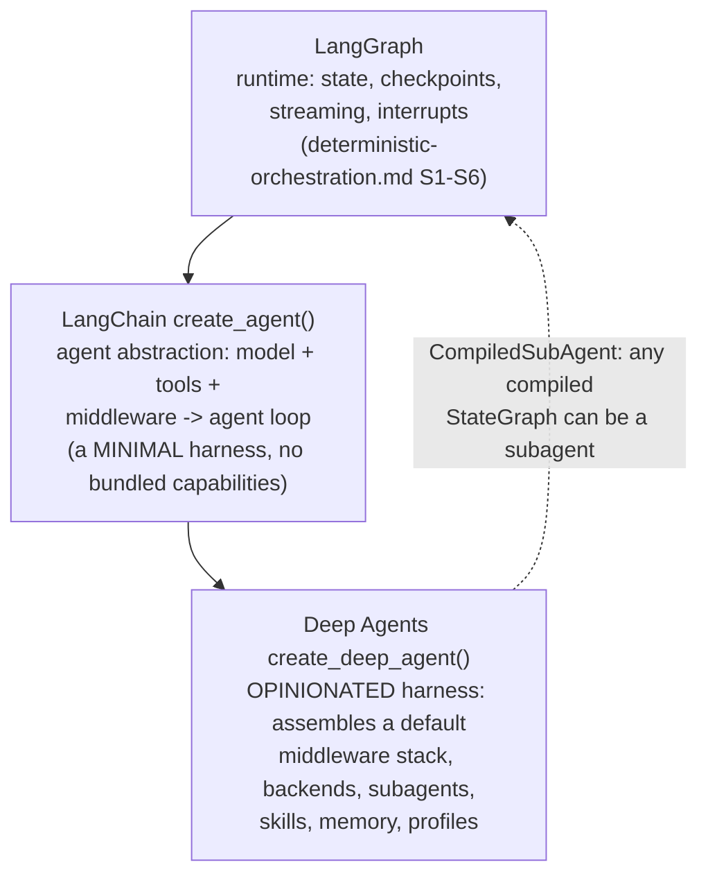
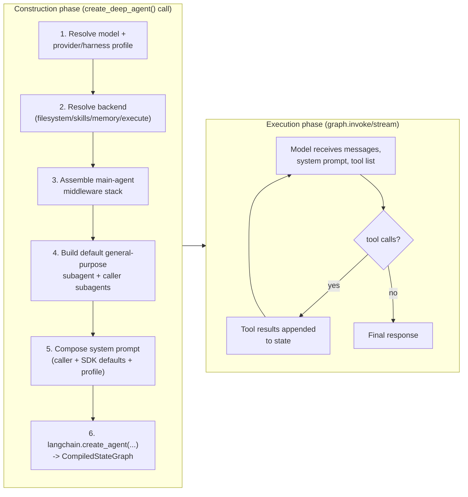
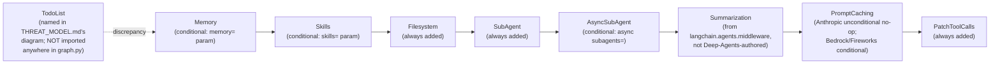
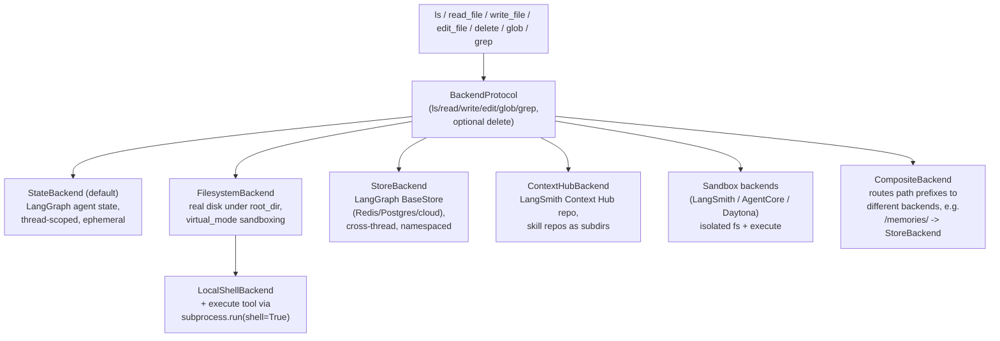
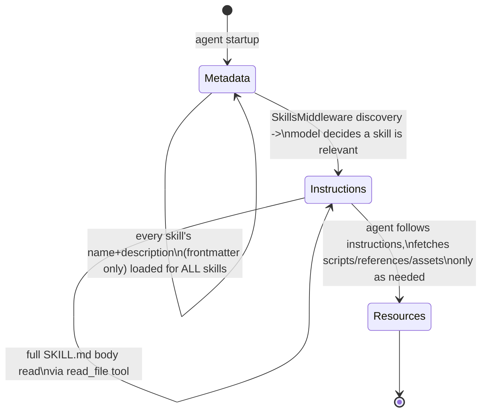

# Middleware-composed general-purpose agent harnesses: LangChain's Deep Agents and the library-as-harness design space

**Scope note.** [deterministic-orchestration.md](deterministic-orchestration.md) already documents a *different*
category of thing built on the LangChain ecosystem's LangGraph runtime: a
**deterministic orchestrator**, where an author fixes a control-flow graph
in code (`StateGraph`) or YAML (Microsoft Conductor) and the LLM only ever
decides what happens *inside* one already-placed node. This page documents
a **third** category this book had not yet named anywhere: a
**general-purpose, dynamically-looping agent harness distributed as a
composable library**, rather than either a finished terminal product
(Claude Code, Copilot CLI, OpenCode -- this book's three primary subjects)
or a fixed-graph orchestrator. VERIFIED (`github.com/langchain-ai/deepagents`,
repository metadata fetched via `gh api repos/langchain-ai/deepagents` this
session, 24 August 2026): the repository's own one-line GitHub description
is "The batteries-included agent harness," and its own README states
directly, "Deep Agents is an open source agent harness — an opinionated
agent that runs out of the box." That word -- *harness* -- is the same
umbrella term this book's own [agent-topology.md](agent-topology.md) adopts
from Claude Code's own glossary; Deep Agents is the first sourced instance
in this book of a project *outside* Claude Code, Copilot CLI, or OpenCode
that applies the same word to itself, while shipping as a Python (and,
per the README, a separately-maintained JavaScript/TypeScript port,
`github.com/langchain-ai/deepagentsjs` -- named there but not independently
fetched this session, so held to a lower confidence than everything else
on this page) library a developer `import`s and calls a factory function
on, not a binary a user launches in a terminal. The repository is large
and actively maintained: 28,324 stargazers, 3,962 forks, and a
`pushed_at` timestamp of 24 August 2026 -- the same day this page was
researched -- confirmed via the same `gh api` call.

## 1. Verifying the category: three layers, not a LangGraph-alternative



The user's own framing for this page -- that Deep Agents is "built ON TOP
OF LangGraph" rather than being a deterministic-graph-authoring tool
itself -- is confirmed precisely, and with one extra layer neither this
page's opening description nor a shallow README skim would have surfaced.
VERIFIED (`libs/ARCHITECTURE.md`, fetched via `gh api
repos/langchain-ai/deepagents/contents/libs/ARCHITECTURE.md` this session):
the document states the stack explicitly as three named layers --
"LangGraph: runtime: state, checkpoints, streaming, interrupts" at the
bottom, "LangChain: agent abstraction: model + tools + middleware -> agent
loop" in the middle, and "Deep Agents: opinionated harness: defaults,
middleware, backends, profiles" on top -- and is explicit that the middle
layer, LangChain's own `create_agent()`, is itself only "a minimal agent
harness on top of it," with **no bundled capabilities of its own**: "The
only default component mentioned is the core agent loop itself (model +
tools + harness). No specific default middleware stack or built-in tools
are documented as automatic," per `docs.langchain.com/oss/python/langchain/agents`
(fetched via WebFetch this session). Deep Agents' own contribution, per
the same ARCHITECTURE.md, "does not introduce a new runtime. Instead,
`create_deep_agent()` assembles the default middleware stack and
configures backends, subagents, skills, memory, and profiles" -- i.e. the
thing this page documents is a curated, opinionated *bundle of
middleware and configuration defaults* sitting on an unopinionated agent
abstraction, which itself sits on LangGraph's own graph runtime. This is
a structurally different relationship to LangGraph than
[deterministic-orchestration.md](deterministic-orchestration.md) documents:
that page's LangGraph sections describe an author directly building a
`StateGraph` and reasoning about nodes/edges/channels; Deep Agents never
asks its own caller to author a graph at all -- `create_deep_agent()`
returns an already-compiled `CompiledStateGraph` (VERIFIED, same source:
"`create_deep_agent()` ... Calls LangChain's `create_agent(...)` to
produce the runnable agent graph") whose internal graph shape a Deep
Agents caller never inspects or edits directly. The **dotted line** in
the diagram above is the one genuine seam between the two categories,
and is itself a directly sourced finding rather than an inference:
VERIFIED (`docs.langchain.com/oss/python/deepagents/subagents`, WebFetch
this session): "For complex workflows, pass a precompiled LangGraph as a
`CompiledSubAgent`" with fields `name`, `description`, and `runnable` (a
compiled LangGraph that "must have a `messages` state key") -- meaning a
Deep Agent's own dynamically-looping, LLM-driven control flow can dispatch
into a fixed, author-authored LangGraph `StateGraph` as one named
delegate, the same "black-box sub-workflow" composition pattern
[deterministic-orchestration.md](deterministic-orchestration.md) section 12
already documents for Conductor's `type: workflow` step and LangGraph's
own subgraph embedding, but here crossing from the dynamic-agent category
*into* the deterministic-orchestrator category at a single, well-defined
tool-call boundary.

Confirming the "not a competitor, a layer" framing further: VERIFIED
(README FAQ, same fetch): "LangGraph is the graph runtime. LangChain's
`create_agent` is a minimal agent harness on top of it. Deep Agents is a
more opinionated harness on top of `create_agent` — same building blocks,
but with filesystem, sub-agents, context management, and skills bundled
in," and, on when to choose which: "Use **Deep Agents** when you want the
full harness — planning, context management, delegation — out of the box.
Use **LangChain's `create_agent`** when you want a lighter harness without
the bundled middleware. Drop to **LangGraph** when the agent loop itself
isn't the right shape and you need a custom graph." That last sentence is
the precise, first-party statement of the axis
[deterministic-orchestration.md](deterministic-orchestration.md) section 1
independently derives from LangGraph's own "workflows vs. agents" framing:
Deep Agents occupies the *agent* end of that axis (an LLM-driven while-loop,
the same shape [agent-loop.md](agent-loop.md) documents generically and
[agent-loop-implementations.md](agent-loop-implementations.md) documents
for Claude Code/OpenCode specifically), while LangGraph's raw `StateGraph`
sits at the *workflow* end -- and Deep Agents' own docs name that same
choice explicitly as a reason to "drop down" a layer, corroborating
[deterministic-orchestration.md](deterministic-orchestration.md)'s own
synthesis from the opposite direction.

Finally, worth naming precisely because it sharpens what "general-purpose"
means here: VERIFIED (README, "Acknowledgements" section, same fetch):
"Inspired by Claude Code: an attempt to identify what makes it general-purpose,
and push that further." Deep Agents is not merely LangGraph-ecosystem-native
vocabulary for concepts this book already has three other names for --
its own authors name Claude Code directly as the design target it is
attempting to generalize past, which is itself the reason sections 3-10
below cross-reference this book's Claude Code material so heavily: Deep
Agents is reachable, structurally, as an attempt to build "a Claude-Code-shaped
harness" as an *importable, provider-agnostic library* rather than a
downloadable terminal product tied to one company's models.

## 2. The general concept: middleware as an agent-loop extension mechanism, distinct from event-dispatch hooks

Every prior mention of extensibility in this book is built around **named
lifecycle events dispatched to external handlers**:
[hooks-lifecycle-extensibility.md](hooks-lifecycle-extensibility.md)
documents Claude Code's ~30-event catalogue (`PreToolUse`, `PostToolUse`,
etc.), Copilot CLI's 14 dual-cased events, and OpenCode's `Hooks` interface
-- in every case, a fixed point in the loop fires, a registered handler
runs (in-process or out-of-process), and the loop resumes based on that
handler's return value or exit code. Deep Agents' own extension mechanism,
**middleware**, is a structurally different shape, and its own docs are
explicit about the distinction rather than leaving it implicit. VERIFIED
(`libs/ARCHITECTURE.md`, same fetch as section 1): "Middleware can run
before a model call, around a model call, around tool execution, or while
state is being prepared. This lets the harness do things that plain tools
cannot do, such as: Adding or removing tools from the current model
request, Injecting filesystem, memory, skills, subagent, or
human-in-the-loop instructions into the final system prompt,
Summarizing/compacting or offloading message history as context grows,
Storing typed values in graph state for later middleware or tools, and
Enforcing filesystem permissions before a (built-in) filesystem tool
runs." Critically, the same document draws the line a plain tool cannot
cross: "A callable passed through `tools=` is different: it is only
invoked after the model *chooses to use* that tool. It cannot rewrite the
tool list or prompt before the model call." Where a hook is a *named,
discrete event* an external process subscribes to, a middleware is closer
to a **decorator/onion layer wrapped directly around the model-call and
tool-execution steps of the agent loop itself**, with the authority to
rewrite the very request the model or a tool is about to receive --
mutating the tool list, the system prompt, or the persisted state *before*
the step it wraps ever runs, not merely observing or vetoing it
afterward. BEST CURRENT UNDERSTANDING, UNCONFIRMED: this is plausibly a
direct consequence of the library-vs-product distinction section 1 already
draws -- a hook protocol has to be a stable, externally-callable contract
(a subprocess, an HTTP endpoint, a matcher/config schema) because Claude
Code, Copilot CLI, and OpenCode are compiled/shipped products whose
internal loop code a third party cannot edit; Deep Agents' middleware
objects are ordinary Python classes composed *inside the same process, at
construction time*, because the caller already has the entire source tree
one `pip install` away and is expected to subclass or reorder middleware
directly rather than reach it through an IPC-shaped event contract.

## 3. Construction vs. execution: what `create_deep_agent()` actually assembles



VERIFIED (`libs/ARCHITECTURE.md`, "Construction and execution" section):
the six-step construction sequence quoted above is stated directly, and
the surrounding prose is precise about where each named capability comes
from -- "Deep Agents changes that loop mainly through middleware" during
execution, not by replacing LangGraph's own Plan/Execution/Update loop
(the same superstep model [deterministic-orchestration.md](deterministic-orchestration.md)
section 1 documents for LangGraph's `Pregel` runtime; Deep Agents inherits
that execution model wholesale rather than defining its own). The
document's own file map for where to find each piece of this (VERIFIED,
"Common starting points" section, paths relative to
`libs/deepagents/deepagents/`) is worth citing precisely since it is the
clearest single index into the SDK's own source tree: `graph.py` for
"Agent construction, middleware ordering, prompt assembly, default model
behavior"; `middleware/` for "Tool visibility, prompt injection, and
request-time behavior" with feature modules `subagents.py`, `filesystem.py`,
`skills.py`, `memory.py`, `permissions.py`, and `summarization.py` named
individually; `backends/` for "Filesystem persistence, shell support, and
route behavior"; and `profiles/` for "Provider- or model-specific harness
changes." Section 4 below reads that middleware directory directly.

## 4. The default middleware stack, and a source-verified discrepancy about "planning"

VERIFIED, directly read from source
(`libs/deepagents/deepagents/graph.py`, ~45,000 bytes, fetched via
`gh api repos/langchain-ai/deepagents/contents/libs/deepagents/deepagents/graph.py`
and base64-decoded this session): `create_deep_agent()`'s own docstring
enumerates its assembled middleware stack by name, in order --
`SkillsMiddleware` (conditional on `skills`), `FilesystemMiddleware`,
`SubAgentMiddleware`, `SummarizationMiddleware` (imported from
`langchain.agents.middleware`, not authored by Deep Agents itself),
`PatchToolCallsMiddleware`, `AsyncSubAgentMiddleware` (conditional on
async `subagents`), `AnthropicPromptCachingMiddleware` (stated
"unconditional; no-ops for" non-Anthropic models), `BedrockPromptCachingMiddleware`,
`FireworksPromptCachingMiddleware`, and `MemoryMiddleware` (conditional
on `memory`). This is corroborated independently by
`libs/deepagents/THREAT_MODEL.md`'s own architecture diagram (same fetch
method), which draws the pipeline as "TodoList → Memory → Skills →
Filesystem → SubAgent → AsyncSubAgent → Summarization → PromptCaching →
PatchToolCalls" -- **naming a `TodoList` stage the docstring in `graph.py`
itself never names**, worth flagging as a precise, source-grounded
discrepancy rather than smoothed over:



VERIFIED (`gh api .../contents/libs/deepagents/deepagents/middleware`,
directory listing fetched this session): the actual file inventory of
Deep Agents' own `middleware/` package is `_fs_interrupt.py`,
`_message_eviction.py`, `_overflow_clip.py`, `_prompt_caching.py`,
`_state.py`, `_tool_exclusion.py`, `_utils.py`, `_video.py`,
`async_subagents.py`, `filesystem.py`, `memory.py`, `patch_tool_calls.py`,
`permissions.py`, `rubric.py`, `skills.py`, `subagents.py`, and
`summarization.py` -- **no `todo.py`, `planning.py`, or equivalently named
file exists anywhere in this directory**, and a full-text search of
`graph.py` for the strings `TodoListMiddleware` and (case-insensitively)
`todo` turned up zero matches outside the word "planning" once, in the
module's own top-of-file docstring ("the main entry point for constructing
a fully configured deep agent with planning, filesystem, subagent, and
summarization middleware"). Read together with `docs.langchain.com/oss/python/deepagents/overview`'s
own instruction ("Pass `TodoListMiddleware()` to the `middleware`
parameter to add a `write_todos` tool" -- WebFetch this session, phrased
as something the *caller* does, not something already assembled) and
`docs.langchain.com/oss/python/langchain/agents`'s own confirmation that
`create_agent()` itself ships zero default middleware or tools at all
(WebFetch this session: "The only default component mentioned is the
core agent loop itself... No specific default middleware stack or
built-in tools are documented as automatic"), the most literal reading of
everything actually fetched this session is: **the "planning" capability
named in `libs/ARCHITECTURE.md`'s prose and `graph.py`'s own docstring is
not implemented as a bundled, always-on middleware inside Deep Agents'
own source tree** -- a caller who wants the `write_todos` tool has to pass
LangChain's own (not Deep-Agents-authored) `TodoListMiddleware` through
the `middleware=` parameter explicitly, the same caller-supplied-middleware
seam section 3's construction step 3 names generically. This reading
directly contradicts a separate first-party source fetched the same
session -- `docs.langchain.com/oss/python/langchain/agents` itself
states Deep Agents "comes with commonly useful capabilities already
assembled, such as planning, file system tools, subagents, and memory"
(quoted verbatim from that page's own WebFetch summary). Held explicitly
as BEST CURRENT UNDERSTANDING, UNCONFIRMED rather than folded silently
into either VERIFIED claim: this page has fetched clear, direct evidence
on both sides of the question (a source-code absence against two docs
pages' own plain-language claims of default-on planning) and has not
fetched a release-changelog entry, a `pyproject.toml` dependency pin, or
a runtime trace that would resolve which statement is stale -- the same
honest-discrepancy discipline
[deterministic-orchestration.md](deterministic-orchestration.md) section 12
already applies to Conductor's own `Status: Proposed` registry-design-doc
header sitting next to an apparently-already-shipped CLI surface.

## 5. Virtual filesystem: `BackendProtocol` and six pluggable storage strategies



The single most distinctive general concept this page adds relative to
this book's own three-CLI file-tool coverage
([built-in-tools.md](built-in-tools.md)) is that Deep Agents treats "where
do a session's files actually live" as a **swappable strategy object**, not
a fixed implementation detail of one product. VERIFIED
(`docs.langchain.com/oss/python/deepagents/backends`, WebFetch this
session): the same seven-tool surface -- `ls`, `read_file`, `write_file`,
`edit_file`, `delete`, `glob`, `grep`, plus `execute` where a backend
supports shell -- is exposed uniformly "through a pluggable backend
mechanism. The backend handles all storage interactions, allowing agents
to work with different persistence layers transparently," with every
backend implementing one shared `BackendProtocol` (`ls()`, `read()`,
`write()`, `edit()`, `glob()`, `grep()`, and optionally `delete()`).
**`StateBackend`** is the unconditional default (VERIFIED, `THREAT_MODEL.md`
component table, same fetch as section 4: "framework-controlled... **Yes**
(default backend)") and "stores files in LangGraph agent state for the
current thread via checkpoints. Files are not shared across threads" --
meaning a Deep Agent's default "filesystem" is not a filesystem at all in
the OS sense, but a set of keyed values riding inside the same
checkpointed graph state section 1's diagram already places at the bottom
layer, giving it exactly the persistence properties
[deterministic-orchestration.md](deterministic-orchestration.md) section 3
already documents for LangGraph checkpointers generally (thread-scoped,
survives process restarts via the same `thread_id`, non-destructively
forkable via the same `update_state()` mechanism) applied specifically to
*file contents* rather than arbitrary typed state. **`FilesystemBackend`**
crosses into real disk I/O under a configurable `root_dir`, with an
explicitly documented, currently-*deprecated* footgun: VERIFIED (same
source, quoted directly) "the default (`virtual_mode=False`) provides no
security even with `root_dir` set," and `THREAT_MODEL.md`'s own assumption
list states "The default (`virtual_mode=None`) is deprecated and will
change to `True` in v0.5.0" -- a security-relevant default flip already
scheduled at the time this page was written, worth naming precisely rather
than glossing as a settled behavior. **`LocalShellBackend`** extends
`FilesystemBackend` with the `execute` tool via `subprocess.run(shell=True)`,
and is explicitly *not* the default -- `THREAT_MODEL.md`'s own component
table marks it "user-controlled... **No** (must be explicitly provided)."
**`StoreBackend`** persists across threads via a LangGraph `BaseStore`
(Redis, Postgres, or a cloud implementation), requiring "explicit
namespace factories for multi-user isolation" -- the same namespace-scoping
concept section 8 documents in more depth for memory specifically.
**`ContextHubBackend`** mounts a LangSmith Context Hub repository at the
filesystem root, with linked skill repositories as subdirectories --
named here but not independently investigated, since LangSmith itself is
a hosted product surface this page treats the same way
[deterministic-orchestration.md](deterministic-orchestration.md)'s own
opening scope note treats LangSmith Deployment: adjacent, not a
harness-internals mechanism this page re-derives. **Sandbox backends**
(LangSmith's own, AWS AgentCore, and Daytona, all three named directly)
provide isolated filesystem-plus-`execute` environments, the closest Deep
Agents analogue to [permissions-and-sandboxing.md](permissions-and-sandboxing.md)'s
OS-level sandbox coverage for Claude Code's Seatbelt/bubblewrap pair and
Copilot CLI's own `/sandbox` -- though, per `THREAT_MODEL.md`'s own
assumption 5, "the library does not provide OS-level process isolation"
itself; that isolation is delegated entirely to whichever sandbox backend
a caller chooses to plug in, an explicit **non-goal** rather than a gap
this page found unintentionally. **`CompositeBackend`** is the mechanism
that makes several of these strategies usable *together* in one agent --
"Routes different path prefixes to different backends (e.g., `/memories/`
to `StoreBackend`, everything else to `StateBackend`)," the concrete
routing example the memory system in section 8 below builds on directly.

## 6. Sub-agent-as-tool spawning: `task()`, `CompiledSubAgent`, and async/remote delegation

```mermaid
sequenceDiagram
    participant Main as Main agent (LLM loop)
    participant Task as task() tool
    participant Sub as Ephemeral subagent<br/>(own context window)

    Main->>Task: task(subagent_name, description)
    Task->>Sub: new agent instance,<br/>own middleware stack
    Note over Sub: intermediate tool calls/results<br/>stay local to Sub, never<br/>enter Main's context
    Sub->>Task: final report only
    Task->>Main: one tool_result:<br/>the final report
    Note over Main,Sub: Runtime CONTEXT propagates<br/>downward automatically;<br/>STATE stays isolated
```

VERIFIED (`docs.langchain.com/oss/python/deepagents/subagents`, WebFetch
this session): delegation happens through a single built-in tool, `task()`
-- "The main agent calls this tool to delegate work, passing the subagent
name and task description. The supervisor blocks until the subagent
completes (synchronous execution), then receives the result." This is the
same fan-out/handoff shape [fan-out.md](fan-out.md) and
[handoff-mechanism.md](handoff-mechanism.md) already document across
Claude Code's `Task`/subagent tools, Copilot CLI's subagent lifecycle, and
OpenCode's own `Task` tool, converging on the same "spawn an isolated
context, get back a summary, not a transcript" property this book has now
found independently reinvented in every harness it has examined --
VERIFIED here specifically: "Each subagent maintains its own isolated
context window—intermediate tool calls and results don't pollute the
parent's context. The parent receives only the final summary," and,
separately, "Context propagates downward: Runtime context passed to the
parent agent automatically flows to all subagents and their tools" while
"State stays local." A subagent is declared one of two ways: a plain
dict/`SubAgent` object naming `name` (the identifier the main agent's own
`task()` call must match), `description` (guides *when* the main agent
delegates to it -- structurally the same role
[tool-schema-and-interface-design.md](tool-schema-and-interface-design.md)
documents for a well-written tool description generally, applied here to
choosing *which subagent*, not which tool), an independent `system_prompt`
that explicitly "doesn't inherit from parent," and optional `tools`,
`model`, `middleware`, `permissions`, and `skills` overrides; or a
**`CompiledSubAgent`** -- the seam back into
[deterministic-orchestration.md](deterministic-orchestration.md) section 1
already names, wrapping an arbitrary precompiled LangGraph `StateGraph` as
one named delegate, constrained only to exposing a `"messages"` state key.
A **default general-purpose subagent** is added automatically unless
disabled (VERIFIED, same source): it "Inherits skills from the main agent
(custom subagents don't)," "Has filesystem tools by default," "Can be
replaced by providing your own with `name="general-purpose"`," and "Can be
disabled via `GeneralPurposeSubagentProfile(enabled=False)`" -- the last
of which is itself a **harness-profile** override, tying this mechanism
to section 9's model-conditional configuration layer. Finally, **async and
remote subagents** are a structurally distinct third delegation shape,
implemented by a separate `AsyncSubAgentMiddleware` (confirmed present in
`graph.py`'s own import list, section 4 above): VERIFIED
(`THREAT_MODEL.md`'s component table, same fetch): this middleware
"Manages background tasks on remote LangGraph server deployments via
LangGraph SDK," authenticating against "user-configured remote LangGraph
server URLs" via `LANGGRAPH_API_KEY`/`LANGSMITH_API_KEY`/`LANGCHAIN_API_KEY`
environment variables the library itself "does not manage" -- a delegation
target that is not merely a different context window in the same process,
but a genuinely different *machine*, "enabling long-running tasks and
parallel workstreams where mid-flight steering and cancellation are
needed" per the subagents docs page's own closing note. No harness this
book has examined elsewhere -- not Claude Code's background `claude agents`
sessions, not Copilot's `/fleet`, not OpenCode's `Task` tool -- ships a
first-class *remote-server* subagent target reachable through the same
`task()`-shaped tool surface as an in-process delegate; the closest
structural analogue in this book is
[deterministic-orchestration.md](deterministic-orchestration.md) section 8.1's
finding that Conductor can wrap an entire other harness's SDK as one
workflow step, though Conductor does that as a fixed YAML-declared step
type, not as a dynamically-chosen `task()` tool call an LLM decides to make
at runtime -- itself one more instance of this page's section 1 "dynamic
agent vs. fixed workflow" axis recurring at the sub-agent-dispatch layer
specifically.

## 7. Skills: progressive disclosure over `SKILL.md`, and the shared cross-harness convention



VERIFIED (`docs.langchain.com/oss/python/deepagents/skills`, WebFetch this
session): a Deep Agents skill is "a directory containing a `SKILL.md`
file: a markdown file with YAML frontmatter... followed by instructions
the agent follows when the skill is activated," with a documented
directory layout (`skills/<name>/SKILL.md` plus optional `scripts/`,
`references/`, and `assets/` subdirectories) and a frontmatter schema
naming `name` (lowercase alphanumeric, matching the parent directory),
`description` ("what the skill does and when to activate it," capped at
1,024 characters), and optional `license`/`compatibility`/`metadata`/`allowed-tools`
fields. The loading discipline is explicitly three-tiered -- "Skills load
in three levels. Each level adds more detail only when the task needs it"
-- metadata (name+description, loaded for every skill at startup),
instructions (the full `SKILL.md` body, loaded only once a skill is
invoked), and resources (supporting files, loaded on demand after
invocation), orchestrated by `SkillsMiddleware` across a named
"Discovery"/"Read"/"Execute" phase sequence. This is the same
**progressive-disclosure, invoke-only-tier** loading discipline
[instruction-context-budget.md](instruction-context-budget.md) and
[built-in-skills.md](built-in-skills.md) already document for Claude Code's
and Copilot CLI's own skill conventions, independently converged on here.
It is not merely a similar-shaped reinvention, either: the same fetched
page states plainly that Deep Agents skills "follow the [Agent Skills
specification](https://agentskills.io/specification) for standardisation
across potential multi-agent tooling ecosystems" -- a **named, shared,
cross-vendor specification** this book had not previously had occasion to
cite by name, distinct from (and possibly a formalization attempt over)
the informal, convergent-by-observation `SKILL.md`-plus-frontmatter
convention this book's own [built-in-skills.md](built-in-skills.md) and
[system-prompt-design-as-craft.md](system-prompt-design-as-craft.md) had
only been able to describe as parallel evolution across Claude Code and
Copilot CLI, not as a documented common standard both explicitly target.
Subagent skill inheritance is deliberately *not* automatic: "Custom
subagents do not inherit the main agent's skills unless explicitly
configured via the `skills` parameter" (corroborating section 6's own
finding that only the built-in general-purpose subagent inherits skills
by default), and "Each subagent with skills runs its own independent
`SkillsMiddleware` instance" -- skills are re-discovered per subagent, not
shared as one process-wide registry.

## 8. Memory: `AGENTS.md` as writable semantic memory, namespaced across sessions

VERIFIED (`docs.langchain.com/oss/python/deepagents/memory`, WebFetch this
session): memory is configured via a `memory=` parameter naming one or
more file paths (conventionally `AGENTS.md`), loaded into the system
prompt at agent startup or retrieved on demand, with the explicit,
first-party distinction drawn between memory and skills: "AGENTS.md
functions as semantic memory (facts and preferences), whilst skills
represent procedural memory... Skills are typically read-only
developer-defined resources; AGENTS.md can be writable by default." That
writability is not merely a docs claim: the agent updates its own memory
through the *same* built-in `edit_file` tool section 5 already documents
for the virtual filesystem generally, with changes "persisting for
subsequent interactions" -- memory is not a separate subsystem with its
own API, but an ordinary file, routed through `CompositeBackend` (section 5)
to whichever backend a caller has mapped its path onto. Cross-session
scope is controlled by an explicit `namespace=` lambda passed to the
backend: `namespace=lambda rt: (rt.server_info.assistant_id,)` yields
memory shared across every user of one deployed agent, while
`namespace=lambda rt: (rt.server_info.user.identity,)` isolates memory
per end user, quoted directly as ensuring "User A's preferences never
leak into User B's conversations." Read against
[memory-management.md](memory-management.md)'s own documented
instruction-file hierarchies -- Claude Code's `CLAUDE.md` load order,
Copilot's server-side Memory feature -- Deep Agents' `AGENTS.md` sits
closest in spirit to Claude Code's own project-instructions file (a
plain-text, always-loaded, human-and-agent-editable context document), but
with the multi-user namespace-scoping question -- who's `AGENTS.md` is
this, exactly, when the same compiled agent serves many users -- treated
as a first-class, documented configuration axis of its own rather than an
implicit assumption. `THREAT_MODEL.md`'s own data-classification table
(section 10 below) separately flags a real, named risk this
namespace-scoping mechanism does not by itself close: "If a user's
AGENTS.md contains credentials, they will be injected verbatim into LLM
requests," with `MemoryMiddleware`'s own system prompt explicitly warning
the model, quoted directly from source, "Never store API keys, access
tokens, passwords..." -- a prompt-level mitigation layered on top of, not
instead of, the namespace-isolation mechanism, the same
authoring-side-complement-not-substitute framing
[system-prompt-design-as-craft.md](system-prompt-design-as-craft.md)
already argues for prompt-injection resistance generally.

## 9. Harness profiles: model- and provider-keyed overrides of the default stack

VERIFIED (`docs.langchain.com/oss/python/deepagents/profiles`, WebFetch
this session): a `HarnessProfile` "packages configuration that Deep Agents
applies when a particular model or provider is selected," registered
under a two-level key -- a bare provider name (`"openai"`, applying to
every model from that provider) or a fully qualified `"provider:model"`
key (`"openai:gpt-5.5"`, overriding the provider-level default when both
exist). A profile can override `base_system_prompt` (wholesale replacement)
or append via `system_prompt_suffix`; remap individual tool descriptions
via `tool_description_overrides`; hide tools by name via `excluded_tools`;
strip or add whole middleware classes via `excluded_middleware`/`extra_middleware`;
and reconfigure the default general-purpose subagent via a
`GeneralPurposeSubagentProfile` (section 6's disable-it-entirely mechanism
is one instance of this). The worked example fetched this session --
`register_harness_profile("openai:gpt-5.5", HarnessProfile(system_prompt_suffix="Respond in under 100 words.", excluded_tools={"execute"}, excluded_middleware={"SummarizationMiddleware"}))`
-- shows all three override axes composed in one call. Profiles can also
load from external YAML/JSON via `HarnessProfileConfig`, decoupling the
override data from the calling code entirely. This is the same general
concept [model-routing-and-selection.md](model-routing-and-selection.md)
already documents Claude Code doing *implicitly*, in shipped product code
rather than a public config surface -- the v2.1.233 model-conditional
withholding of the `TodoWrite`->`Task*` migration on specific named model
families (Opus 4.8, Sonnet 5, Fable 5, Mythos 5 and later) is exactly the
shape a `HarnessProfile`'s own `excluded_tools`/`excluded_middleware`
fields make into a first-class, caller-visible, caller-*writable*
configuration object instead of an internal decision baked into a
specific shipped version. BEST CURRENT UNDERSTANDING, UNCONFIRMED: this
plausibly reflects the same library-vs-product distinction section 2's
own reasoning aid names -- a product with one vendor's own models as its
primary target can afford to hard-code a model-conditional decision
per release, where a model-agnostic library whose own README states "works
with any LLM that supports tool calling" (quoted in section 1) has to
expose *some* durable, versioned extension point for the same category of
decision, because it cannot predict every model a caller will eventually
route through it.

## 10. Permissions and human-in-the-loop: path-level rules with an `interrupt` mode

VERIFIED (`docs.langchain.com/oss/python/deepagents/permissions`, WebFetch
this session): permissions are declared as a list of `FilesystemPermission`
rules passed to a `permissions=` parameter, each rule carrying an
`operations` field (`"read"`, covering `ls`/`read_file`/`glob`/`grep`, or
`"write"`, covering `write_file`/`edit_file`/`delete`), a `paths` glob
pattern (supporting `**` recursion and `{a,b}` alternation), and a `mode`
of `"allow"`, `"deny"`, or `"interrupt"`, evaluated **first-match-wins**
in declaration order -- the identical evaluation discipline
[deterministic-orchestration.md](deterministic-orchestration.md) section 1.1
already documents for Conductor's own `routes:` list and LangGraph's
`add_conditional_edges`, here applied to a tool-permission rule list
instead of a control-flow router. The scope is explicitly narrow and
explicitly stated as narrow, not merely inferred: "Permissions only apply
to the built-in filesystem tools" -- custom tools, MCP-server tools, and a
sandbox backend's own arbitrary command execution are all outside this
mechanism's reach entirely, a real, named gap this page states without
softening because the source states it without softening. Setting
`mode="interrupt"` is where this mechanism meets
[deterministic-orchestration.md](deterministic-orchestration.md) section 4's
`interrupt()` primitive directly: a matching write call "raises a
human-in-the-loop interrupt rather than running the tool, and a reviewer
can approve, edit, or reject the call," requiring a checkpointer (the same
durable-pause dependency LangGraph's own `interrupt()` carries) and
integrating with the harness's separate, broader `interrupt_on` config
map "using identical resume workflows." This is a finer-grained,
tool-specific instance of the same general pause-and-resume mechanic --
where LangGraph's `interrupt()` is a bare, author-placed call inside any
node, Deep Agents' `FilesystemPermission(mode="interrupt")` is a
*declarative rule* evaluated automatically before a specific *class* of
built-in tool call, closer in shape to
[permissions-and-sandboxing.md](permissions-and-sandboxing.md)'s own
documented per-tool approval-prompt UX for Claude Code/Copilot CLI/OpenCode
than to a bespoke `interrupt()` call a graph author writes by hand. Three
tool calls, side by side, illustrate the range this book has now sourced
for the same underlying concept: Claude Code's durable Bash-rule
persistence-vs-session-only-file-edit-approval split
([permissions-and-sandboxing.md](permissions-and-sandboxing.md) section 1),
LangGraph's single generic `interrupt()`/`Command(resume=)` pair
([deterministic-orchestration.md](deterministic-orchestration.md) section 4),
and Deep Agents' glob-pattern-scoped, read/write-typed `FilesystemPermission`
rule list -- three independently-arrived-at answers to "which tool calls
need a human before they run," at three different levels of declarative
specificity.

## 11. Context management: summarization, message eviction, and the `DeltaChannel` reducer

VERIFIED (`libs/ARCHITECTURE.md`, "State and persistence" section, same
fetch as section 1): "Deep Agents extends LangChain's `AgentState` with
`DeepAgentState`, whose `messages` field uses a `DeltaChannel` reducer so
checkpoint growth stays linear across long threads." This is a genuinely
precise, cross-page-linking detail: `DeltaChannel` is not a Deep-Agents-invented
concept but a LangGraph-native channel type
[deterministic-orchestration.md](deterministic-orchestration.md)'s own
Sources section already names among Pregel's channel implementations
(`LastValue`, `Topic`, `BinaryOperatorAggregate`, `DeltaChannel`) --
directly confirmed by `graph.py`'s own import line, read from source this
session: `from langgraph.channels.delta import DeltaChannel`. Deep Agents'
own contribution here is not a new persistence primitive, but choosing
*which* of LangGraph's own built-in channel/reducer options to wire onto
its message-history state field specifically to keep checkpoint size
growth linear rather than quadratic across a long-running thread -- a
concrete, sourced instance of
[deterministic-orchestration.md](deterministic-orchestration.md) section 2's
generic "each state key has its own reducer" mechanism being exercised for
a specific, named engineering reason. Layered on top of that structural
choice, the middleware stack (section 4) contributes two further,
Deep-Agents-specific context-management behaviors named directly in the
middleware file inventory: `_message_eviction.py` and `_overflow_clip.py`
(both confirmed present in the `middleware/` directory listing, section 4),
alongside the imported, not-self-authored `SummarizationMiddleware`.
`libs/ARCHITECTURE.md`'s own execution-phase description names the
user-visible behavior these implement: "Summarizing/compacting or
offloading message history as context grows" -- and the README's own
Features list separately names "offload tool outputs to disk" as a
distinct context-management feature, meaning a large tool result can be
written out through the same virtual-filesystem backend section 5
documents rather than kept inline in the message history at all, with the
model retrieving it later via `read_file` only if it turns out to matter.
This is directly comparable to, and a more filesystem-integrated variant
of, [context-compression.md](context-compression.md)'s own two-phase
evict-then-summarize mechanism for Claude Code and OpenCode's source-verified
`prune()`/`process()` pipeline -- the same general problem (a message
history that must not grow without bound) solved with the same two basic
levers (compress in place, or move content out of the hot context
entirely), except that "move it out" here has a fully general destination
-- any backend the virtual filesystem is already wired to -- rather than a
purpose-built archival mechanism separate from the rest of the harness.

## 12. Stated security posture: "trust the LLM," and a fully source-read threat model

Unlike anything else this book has sourced for any of Claude Code, Copilot
CLI, or OpenCode, Deep Agents ships an explicit, dated, machine-generated
**threat model document** as part of its own repository. VERIFIED
(`libs/deepagents/THREAT_MODEL.md`, fetched via `gh api` this session):
the document's own header states "Generated: 2026-03-28 | Commit: e859077f
| Scope: `libs/deepagents/deepagents/` — SDK library only (not CLI)," with
an explicit disclaimer that it is "automatically generated... experimental,
subject to change, and not an authoritative security reference." Its
System Overview restates section 1's own layering precisely: `deepagents`
"compiles a graph that user application code invokes... It does **not**
run a server itself." Its own ASCII architecture diagram names the exact
middleware ordering already cross-checked against `graph.py` in section 4,
plus a labeled **Trust Boundary** line separating the "framework-controlled"
middleware stack from the "user-controlled" storage/execution layer
underneath it -- the boundary section 5's `BackendProtocol` sits directly
on top of. A **Components** table enumerates fourteen named pieces (C1
through C14) each tagged with a trust level (`framework-controlled`,
`user-controlled`, or `external`) and a default-on/off flag -- confirming,
for instance, that `SubAgentMiddleware` (C9) and `FilesystemMiddleware`
(C14) are the two pieces marked default-**Yes**, while `LocalShellBackend`
(C4) is explicitly default-**No**, corroborating section 5's own finding
independently. A separate **Data Classification** table (DC1 through DC7)
assigns a PII sensitivity rating and storage location to each named class
of data the SDK handles -- conversation history, memory-file contents,
skill-file contents, shell command output, LLM API credentials, data
retained by OpenAI's Responses API specifically, and async-task state --
with two entries worth naming precisely for how concretely they are
scoped: DC4 (shell output) is capped "at 100KB (`local_shell.py:LocalShellBackend.__init__`,
`max_output_bytes`)" and is flagged because that output "may output
`/etc/passwd`, SSH keys, environment variables, or other secrets" and "This
output enters the LLM context window and may be sent to external LLM
providers"; DC5 (API credentials) notes that "With `LocalShellBackend(inherit_env=True)`,
all env vars (including API keys) are available to every shell command."
The document's own **Assumptions** list states the security model's
central, load-bearing design choice in plain language, corroborating the
README's own framing quoted in this page's introduction: "trust the LLM"
-- assumption 5 states directly that "Users who require isolation for
untrusted workloads are expected to extend `BaseSandbox` or use
container/VM-level sandboxing — the library does not provide OS-level
process isolation." VERIFIED (README, "Security" section, section 1's
fetch): "Deep Agents follows a 'trust the LLM' model. The agent can do
anything its tools allow. Enforce boundaries at the tool/sandbox level,
not by expecting the model to self-police." Read against
[permissions-and-sandboxing.md](permissions-and-sandboxing.md)'s own stated
threat models -- Claude Code's own documented prompt-injection threat
model plus its OS-level sandboxed-Bash tool as a real enforcement layer
underneath the model, Copilot CLI's directory-scope default plus its own
OS-level `/sandbox`, OpenCode's source-verified finding that it ships *no*
OS-level sandbox at all and relies on its permission engine alone -- Deep
Agents' own stated position sits closest to OpenCode's: an in-process
permission/backend-selection layer as the *only* enforcement Deep Agents
itself ships, with genuine process isolation named explicitly, in the
library's own threat model, as the caller's responsibility to bring via a
sandbox backend (section 5) rather than something the harness provides by
default -- the same "no OS-level sandbox in the box" finding
[permissions-and-sandboxing.md](permissions-and-sandboxing.md) already
reached for OpenCode independently, now reached a third time, for a third,
structurally different kind of harness, by reading that harness's own
first-party security documentation rather than inferring the gap from an
absence.

## 13. Adjacent surface named but not investigated: Deep Agents Code

VERIFIED (README, same fetch as section 1): "**Deep Agents Code** — a
pre-built coding agent in your terminal, similar to Claude Code or Cursor,
powered by any LLM. Install with `curl -LsSf https://langch.in/dcode | bash`,"
and the repository's own top-level `libs/` directory (listing fetched via
`gh api repos/langchain-ai/deepagents/contents/libs` this session)
confirms a `libs/code` package exists alongside `libs/deepagents` (the SDK
this page otherwise documents), `libs/cli`, `libs/acp`, `libs/evals`, and
`libs/partners`. This means the same organization that built the
library-shaped harness this page documents has *also* built an actual
terminal product on top of it -- structurally the fourth interactive
coding-assistant CLI this book could in principle document alongside
Claude Code, Copilot CLI, and OpenCode. This page deliberately does not
investigate it further: `THREAT_MODEL.md`'s own scope note states plainly
that "CLI and SDK are treated as independent product stories" with a
"separate threat model" for `libs/cli/`, and this page's own research
session was scoped to verifying and documenting the *library/harness*
category the user's request specifically asked about. Per this book's own
LAZY-authoring discipline, a dedicated page on Deep Agents Code as a
fourth interactive CLI -- comparable in scope to
[agent-loop-implementations.md](agent-loop-implementations.md),
[tui-cli-application-architecture.md](tui-cli-application-architecture.md),
or the per-CLI sections of this book's dozens of other topic pages -- is
named here as real, identified follow-up work, not something this page's
own writing should be read as having already covered.

## 14. Synthesis: what Deep Agents adds, and what it renames

| Deep Agents mechanism (this page) | Closest match in this book | What's the same | What's genuinely different |
|---|---|---|---|
| Three-layer stack: LangGraph runtime -> `create_agent()` -> `create_deep_agent()` (S1) | [deterministic-orchestration.md](deterministic-orchestration.md)'s own LangGraph sections; [agent-loop.md](agent-loop.md)'s generic while-loop | All three ultimately run an LLM-driven or graph-driven loop over the same underlying LangGraph runtime | Deep Agents never asks its caller to author a graph directly -- it is the first sourced instance of a *dynamically-looping* agent (not a fixed workflow) delivered as a layered, composable **library** rather than a finished CLI product or an author-built `StateGraph` |
| Middleware (before/around model call, around tool execution, state prep) (S2) | [hooks-lifecycle-extensibility.md](hooks-lifecycle-extensibility.md)'s named-event hook catalogues (Claude Code/Copilot/OpenCode) | Both let external code intervene in a running agent loop | Middleware is in-process, composed at construction time, and can *rewrite* the tool list/prompt/state before a step runs; hooks are externally-callable, named-event, allow/deny-shaped callbacks around an already-decided step |
| Default middleware stack + `TodoList` docs-vs-source discrepancy (S4) | [built-in-tools.md](built-in-tools.md)'s `TodoWrite`; [session-persistence.md](session-persistence.md)'s task-tracking split | Same "track a working plan as structured state" concept | Whether this is bundled by default in Deep Agents is a genuinely unresolved, source-flagged discrepancy this page holds open rather than one this book's own docs pages agree on |
| `BackendProtocol` + six pluggable storage strategies (S5) | [built-in-tools.md](built-in-tools.md)'s file-tool surface; [session-persistence.md](session-persistence.md)'s per-harness session stores | Same seven-tool file-operation surface (`ls`/`read`/`write`/`edit`/`glob`/`grep`/`delete`) this book already documents per CLI | Deep Agents makes "where files live" an explicit, swappable strategy object (ephemeral state, real disk, cross-thread store, sandboxed remote, or a composite router) rather than one fixed implementation per product |
| `task()` tool + `CompiledSubAgent` + async/remote subagents (S6) | [fan-out.md](fan-out.md)/[handoff-mechanism.md](handoff-mechanism.md)'s per-CLI subagent dispatch; [deterministic-orchestration.md](deterministic-orchestration.md) S8.1's orchestrator-wraps-a-harness finding | Same isolated-context/final-report-only delegation shape found in every harness this book has examined | `CompiledSubAgent` is a direct, tool-call-level bridge from the dynamic-agent category into the fixed-graph category (deterministic-orchestration.md); the async/remote path is the first sourced case of a *different machine* as a same-shaped delegation target |
| Skills: `SKILL.md`, three-tier progressive disclosure (S7) | [built-in-skills.md](built-in-skills.md)/[instruction-context-budget.md](instruction-context-budget.md)'s Claude Code/Copilot skill conventions | Same frontmatter-plus-body format, same invoke-only-tier loading discipline | Explicitly targets a named, shared cross-vendor `agentskills.io` specification rather than only converging by independent observation |
| `AGENTS.md` memory, namespace-scoped (S8) | [memory-management.md](memory-management.md)'s instruction-file hierarchies | Same always-loaded, editable project-context document shape | First-class, documented multi-user namespace scoping (`assistant_id` vs. `user.identity`) as a caller-chosen config axis, not an implicit single-user assumption |
| Harness profiles, model/provider-keyed (S9) | [model-routing-and-selection.md](model-routing-and-selection.md)'s Claude Code model-conditional tool withholding | Same underlying need -- different models need different tool/prompt surfaces | A public, versioned, caller-writable config object (`HarnessProfile`) instead of an internal decision baked into one vendor's own shipped release |
| `FilesystemPermission` rules + `interrupt` mode (S10) | [permissions-and-sandboxing.md](permissions-and-sandboxing.md)'s per-tool approval UX; [deterministic-orchestration.md](deterministic-orchestration.md) S4's `interrupt()` | Same first-match-wins rule evaluation; same pause-for-human primitive underneath | Scoped specifically and narrowly to built-in filesystem tools by declarative glob/operation rule, explicitly *not* covering custom/MCP tools or sandbox `execute` |
| `DeltaChannel`-backed `DeepAgentState`, message eviction, disk-offloading (S11) | [context-compression.md](context-compression.md)'s per-CLI compaction pipelines | Same "don't let history grow unbounded" goal | Reuses a LangGraph-native channel type directly (not a bespoke summarizer), and "offload to disk" routes through the same general virtual-filesystem backend the rest of the harness already uses |
| "Trust the LLM" stated threat model, generated `THREAT_MODEL.md` (S12) | [permissions-and-sandboxing.md](permissions-and-sandboxing.md)'s stated threat models, esp. OpenCode's no-OS-sandbox finding | Same ultimate reliance on an in-process permission layer with no bundled OS isolation | The only harness in this book with a dated, versioned, explicitly-scoped threat-model document as a first-class repository artifact |

**The plain verdict.** Deep Agents is not a fourth data point on
[deterministic-orchestration.md](deterministic-orchestration.md)'s own
axis -- it is the dynamic-agent end of that same axis, built as a library
rather than a product, and every mechanism this page found worth naming as
genuinely new (the three-layer opinionated-harness-over-a-minimal-abstraction
stack, middleware as an in-process onion-wrapper rather than an
externally-dispatched hook, `CompiledSubAgent` as a live bridge between the
dynamic-agent and fixed-graph categories, and a first-class, dated threat
model as a repository artifact) follows directly from that one structural
choice: everything else -- planning-as-state, a virtual filesystem, isolated
subagent context windows, progressive-disclosure skills, namespaced memory,
model-conditional profiles, permission rules with an interrupt mode, and
context-growth management -- is the same small set of capabilities this
book has now found independently reinvented in Claude Code, Copilot CLI,
OpenCode, DeepSeek Harness, pi, LangGraph, and Conductor, arrived at once
more by a team whose own README explicitly names Claude Code as the thing
they were trying to generalize past.

---

## Sources

All fetched this session (24 August 2026) unless noted otherwise.

- `gh api repos/langchain-ai/deepagents` -- repository metadata: the
  GitHub description ("The batteries-included agent harness"), topics,
  star/fork counts, `pushed_at` recency, license, and the top-level
  `libs/` monorepo layout (`acp`, `cli`, `code`, `deepagents`, `evals`,
  `partners`, `talon`), cited throughout the introduction and section 13.
- `gh api repos/langchain-ai/deepagents/contents/README.md` (base64-decoded)
  -- the project's own self-description, principles, features list, FAQ
  (the three-layer "How is this different from LangGraph or LangChain?"
  answer and the `CompiledStateGraph`-as-subagent composition note), the
  Deep Agents Code callout, the Acknowledgements ("Inspired by Claude
  Code") line, and the Security ("trust the LLM") statement -- cited in
  sections 1, 6, 12, and 13.
- `gh api repos/langchain-ai/deepagents/contents/libs/ARCHITECTURE.md`
  (base64-decoded) -- the three-layer stack description, the six-step
  construction sequence, the middleware-capabilities list, the tool-surface/
  filesystem-access explanation, the `DeepAgentState`/`DeltaChannel`
  state-and-persistence note, and the "Common starting points" file map --
  cited in sections 1, 2, 3, and 11.
- `gh api repos/langchain-ai/deepagents/contents/libs/deepagents/THREAT_MODEL.md`
  (base64-decoded, read in full) -- the document header/disclaimer/scope,
  the system-overview quote and ASCII architecture diagram, the Components
  table (C1-C14), the Data Classification table (DC1-DC7, especially DC4's
  100KB shell-output cap and DC5's `inherit_env=True` credential-exposure
  note), and the Assumptions list -- cited in sections 4, 5, 6, 8, and 12.
- `gh api repos/langchain-ai/deepagents/contents/libs/deepagents/deepagents/graph.py`
  (base64-decoded, ~45,000 bytes, read in full) -- direct source
  verification of the default middleware stack's exact assembly and
  import list, the absence of any `TodoListMiddleware`/planning-named
  middleware anywhere in the file, the `DeltaChannel` import from
  `langgraph.channels.delta`, and the `langchain.agents.create_agent`
  hand-off -- cited in sections 4 and 11.
- `gh api repos/langchain-ai/deepagents/contents/libs/deepagents/deepagents/middleware`
  (directory listing) -- the middleware package's exact file inventory,
  confirming no dedicated planning/todo module exists -- cited in section 4.
- `docs.langchain.com/oss/python/deepagents/overview` (WebFetch) -- the
  built-in filesystem tool list, the `TodoListMiddleware`/`write_todos`
  opt-in instruction, the `task` tool, system-prompt composition layers,
  Anthropic/Bedrock prompt-caching behavior, and the key `create_deep_agent()`
  parameter list -- cited in sections 3 and 4.
- `docs.langchain.com/oss/python/deepagents/subagents` (WebFetch) -- the
  `task()` invocation mechanism, dictionary- and `CompiledSubAgent`-based
  subagent declaration fields, the default general-purpose subagent's
  behavior, context-propagation-vs-state-isolation semantics, and the
  async/remote subagent mention -- cited in section 6.
- `docs.langchain.com/oss/python/deepagents/backends` (WebFetch) -- the six
  backend types, the `BackendProtocol` method set, the `execute`-tool/shell
  access rules, the `virtual_mode=False`-provides-no-security quote, and
  the permissions-layered-atop-backends design note -- cited in section 5.
- `docs.langchain.com/oss/python/deepagents/permissions` (WebFetch) -- the
  `FilesystemPermission` rule schema, first-match-wins evaluation, the
  built-in-tools-only scope limitation, and the `interrupt` mode's
  checkpointer dependency and `interrupt_on` integration -- cited in
  section 10.
- `docs.langchain.com/oss/python/deepagents/skills` (WebFetch) -- the
  `SKILL.md` directory layout and frontmatter schema, the three-tier
  progressive-disclosure loading model, `SkillsMiddleware`'s
  discovery/read/execute phases, the `skills=` configuration example, the
  `agentskills.io` specification reference, and the subagent
  skill-non-inheritance rule -- cited in section 7.
- `docs.langchain.com/oss/python/deepagents/memory` (WebFetch) -- the
  `memory=` configuration mechanism, the AGENTS.md-as-semantic-memory vs.
  skills-as-procedural-memory distinction, the `namespace=` lambda examples
  for agent-scoped vs. user-scoped memory, and the `edit_file`-driven
  update mechanism -- cited in section 8.
- `docs.langchain.com/oss/python/deepagents/profiles` (WebFetch) -- the
  `HarnessProfile` two-level (provider/model) keying, its overridable
  fields, the worked `register_harness_profile()` example, and the
  `HarnessProfileConfig` YAML/JSON loading note -- cited in section 9.
- `docs.langchain.com/oss/python/langchain/agents` (WebFetch) -- confirmation
  that `create_agent()` ships no default middleware or tools of its own,
  and the separately-quoted claim that `create_deep_agent()` "comes with
  commonly useful capabilities already assembled, such as planning, file
  system tools, subagents, and memory" -- the source of section 4's
  flagged discrepancy, and cited in section 1.
- This book's own prior pages, re-read for cross-reference rather than
  re-fetched from any external source this session:
  [deterministic-orchestration.md](deterministic-orchestration.md) (every
  section), [agent-loop.md](agent-loop.md),
  [agent-loop-implementations.md](agent-loop-implementations.md),
  [hooks-lifecycle-extensibility.md](hooks-lifecycle-extensibility.md),
  [built-in-tools.md](built-in-tools.md),
  [built-in-skills.md](built-in-skills.md),
  [instruction-context-budget.md](instruction-context-budget.md),
  [memory-management.md](memory-management.md),
  [context-compression.md](context-compression.md),
  [session-persistence.md](session-persistence.md),
  [permissions-and-sandboxing.md](permissions-and-sandboxing.md),
  [model-routing-and-selection.md](model-routing-and-selection.md),
  [fan-out.md](fan-out.md), [handoff-mechanism.md](handoff-mechanism.md),
  [tool-schema-and-interface-design.md](tool-schema-and-interface-design.md),
  and [system-prompt-design-as-craft.md](system-prompt-design-as-craft.md)
  -- every cross-harness claim in this page's section 14 table is a
  pointer into one of these, not a new claim researched fresh about
  Claude Code's, Copilot CLI's, or OpenCode's own behavior.
- Named but not independently fetched or investigated this session, and
  held to a correspondingly lower confidence or explicitly out of scope:
  `github.com/langchain-ai/deepagentsjs` (the JavaScript/TypeScript port,
  section 1), LangSmith Deployment and LangSmith Context Hub (both hosted
  product surfaces underlying `ContextHubBackend`, section 5), and Deep
  Agents Code / `libs/code` and `libs/cli` (the terminal-product surface
  built on top of this SDK, section 13).
