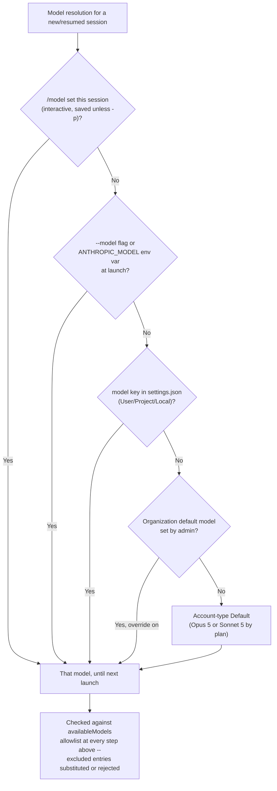
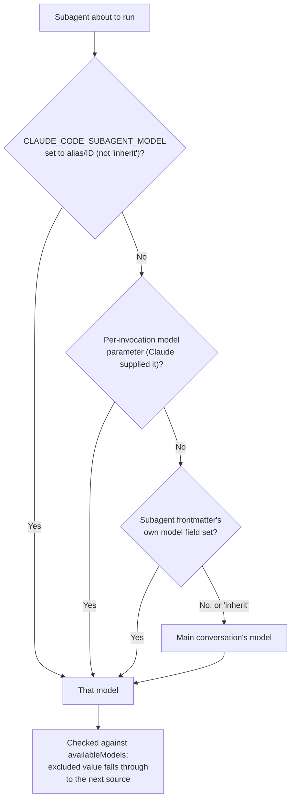
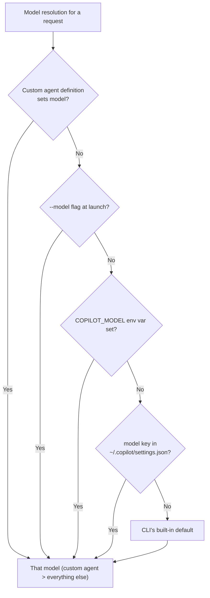
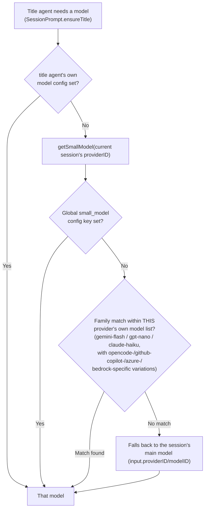
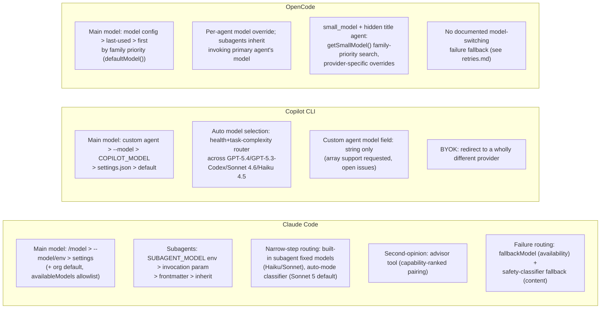

# Model routing / selection

This page is the dedicated treatment of a question [fan-out.md](fan-out.md) and
[orchestration.md](orchestration.md) only brush against in passing (a subagent's
`model` field, mentioned there only as one property among many a dispatched worker
carries): **how a harness decides which underlying model answers a given request** --
the main-loop model versus a cheaper/faster model for a narrower step, a subagent's own
model override, and what happens when the chosen model is unavailable. It is also
distinct from two other pages that touch model behavior from a different angle:
[retries.md](retries.md) covers what happens on a *failed* request to the model already
chosen (retry counts, backoff, error-type gating) -- this page covers the *selection*
decision itself, before or independent of any failure; and
[permissions-and-sandboxing.md](permissions-and-sandboxing.md) §1.4 covers Claude Code's
auto-mode permission classifier as an *enforcement-architecture* choice (why a second
model call reviews actions at all) -- this page adds only the classifier's own
model-selection fact, not repeated there, and cross-references back for the rest.

Every factual claim below is tagged VERIFIED (fetched this session from a named
authoritative source) or BEST CURRENT UNDERSTANDING, UNCONFIRMED. All three harnesses
are covered, since all three make a live model-routing decision on every request, but
the shape of that decision differs sharply: Claude Code's is a rich, deeply configurable
precedence stack around a single frontier-model family; Copilot CLI's is a genuine
per-request cost/capability router (Auto model selection) across models from several
providers; OpenCode's is a per-agent configuration surface plus a narrowly scoped
small-model carve-out for one auxiliary task (title generation).

## 1. Claude Code

### 1.1 Main-session model selection and its precedence stack

VERIFIED (`code.claude.com/docs/en/model-config`, fetched this session): Claude Code
resolves the model for the *main session* through an explicitly ordered stack, listed in
the docs "in order of priority":

1. **During session**: `/model <alias|name>` (or `/model` with no argument, to open the
   picker). As of v2.1.153, choosing a model here also writes it into user settings as
   the new default for future sessions, unless run under `-p` (non-interactive), in
   which case the choice applies only to the current session.
2. **At startup**: the `--model` flag.
3. **Environment variable**: `ANTHROPIC_MODEL`.
4. **Settings**: the `model` field in a settings file (`settings.json`).

Both the `--model` flag and `ANTHROPIC_MODEL` are session-scoped only -- they do not
persist the way an interactive `/model` selection does. Two further layers sit outside
this ordered stack and can override or restrict it: an **organization default model**
(Claude Enterprise admins can set one from the admin console; with "override user
selection" turned on, it beats the `model` value in user/project/local settings, though
`--model`/`ANTHROPIC_MODEL`/managed settings still beat it), and an **`availableModels`
allowlist** (managed/policy settings restricting which models/aliases are selectable at
all -- entries can match a family like `sonnet`, a version prefix, or a full model ID;
an excluded selection is replaced or rejected depending on which layer set it, with the
substitution shown as a notice).

Model **aliases** (`sonnet`, `opus`, `haiku`, `fable`, `best`, `default`, and the
`[1m]`-suffixed long-context variants) resolve to a specific model version per provider
(Anthropic API, Claude Platform on AWS, Amazon Bedrock, Google Cloud's Agent Platform,
Microsoft Foundry each map `opus`/`sonnet` slightly differently) and can be repinned
with `ANTHROPIC_DEFAULT_OPUS_MODEL` / `ANTHROPIC_DEFAULT_SONNET_MODEL` /
`ANTHROPIC_DEFAULT_HAIKU_MODEL` / `ANTHROPIC_DEFAULT_FABLE_MODEL`. A special
`opusplan` alias is itself a routing rule, not a fixed model: it runs `opus` while in
plan mode and switches to `sonnet` once execution starts, pairing Opus's reasoning for
planning with Sonnet's cost/speed for the actual edits -- this is model routing keyed
to a *lifecycle phase* (plan vs. execute) rather than to task classification.

An **effort level** (`low`/`medium`/`high`/`xhigh`/`max`, plus the `ultracode` session
setting) is an adjacent but distinct axis from model choice: it controls how much a
given model reasons per step (adaptive-reasoning models decide per-step whether and how
long to think, within the configured effort ceiling), not which model answers. Effort
is set per-session (`/effort`, `--effort`, `CLAUDE_CODE_EFFORT_LEVEL`, `effortLevel` in
settings) and can also be overridden per skill or per subagent via an `effort`
frontmatter field, the same way `model` can be.

### 1.2 Subagent model overrides

VERIFIED (`code.claude.com/docs/en/sub-agents`, fetched this session): a custom
subagent's YAML frontmatter carries an optional `model` field accepting a model alias
(`sonnet`, `opus`, `haiku`, `fable`), a full model ID, or the literal `inherit` (the
default when the field is omitted). When Claude invokes a subagent it can also pass a
per-invocation `model` parameter distinct from the frontmatter. Claude Code resolves the
subagent's actual model in this order:

1. `CLAUDE_CODE_SUBAGENT_MODEL` environment variable, when set to an alias or model ID
   (as of v2.1.196, setting it to `inherit` is equivalent to leaving it unset -- in
   earlier versions `inherit` here forced every subagent onto the main model and
   ignored the two sources below it).
2. The per-invocation `model` parameter Claude supplies when delegating.
3. The subagent definition's own `model` frontmatter field.
4. The main conversation's model.

Every value at every step is checked against `availableModels`; an excluded value is
skipped and resolution falls through to the inherited/default model rather than
failing the subagent's launch. As of v2.1.211, a per-invocation `model` parameter also
survives resuming or sending a follow-up to that subagent (earlier versions dropped it
on resume and fell back to the frontmatter or main-conversation model instead).

Claude Code's own **built-in subagents** are a concrete instance of routing a narrow
step to a cheaper model: `statusline-setup` runs on Sonnet and `claude-code-guide` runs
on Haiku regardless of the main session's model, while the built-in `Explore` subagent
"inherits from the main conversation, capped at Opus on the Claude API, so Explore never
runs on a more expensive model than the one you already chose for the session" -- and a
user- or project-level subagent named `Explore` overrides the built-in entirely,
including its `model` field, so the docs give `model: haiku` as the pattern for pinning
exploration itself to a cheaper model. `Plan` and `general-purpose` (the other two
built-ins) simply inherit the main conversation's model with no cap.

### 1.3 Dynamic workflows: per-stage model routing in a script

Cross-reference: [orchestration.md](orchestration.md) covers the Workflow tool's
script model (`agent()`/`pipeline()`, concurrency/total-agent caps, resumability) in
full; this page adds only the model-routing fact the orchestration page doesn't state.
VERIFIED (`code.claude.com/docs/en/workflows`, fetched this session): "Every agent in a
workflow uses your session's model unless the script routes a stage to a different one
or the `CLAUDE_CODE_SUBAGENT_MODEL` environment variable is set, which overrides both."
In other words, a workflow script Claude writes can itself hard-code a cheaper model for
a specific stage (for example, routing a bulk per-file audit fan-out to Haiku while
keeping a final synthesis step on the session's own model), and the docs explicitly
suggest this as a cost lever: "Ask Claude to use a smaller model for stages that don't
need the strongest one when you describe the task."

### 1.4 The advisor tool: a second, typically stronger model consulted mid-task

VERIFIED (`code.claude.com/docs/en/advisor`, fetched this session): the advisor tool is
an experimental, Anthropic-API-only server tool that lets "Claude consult a second,
typically stronger model at key moments during a task, such as before committing to an
approach, when stuck on a recurring error, or before declaring a task complete." Unlike
a subagent, the advisor is not a delegated worker with its own tools -- it receives the
full conversation transcript (every tool call and result) as a server-side tool call and
returns guidance Claude then applies; Claude, not the harness, decides when to invoke it.
The advisor model is set independently of the main model (`/advisor`, the `advisorModel`
setting, or the `--advisor` flag) and is capability-ranked against the main model: "The
advisor must be at least as capable as the main model," with an explicit acceptance
table (for example, a Sonnet 5 main model accepts a Fable, Opus, or Sonnet 5 advisor but
rejects a Sonnet 4.6 advisor as less capable; a Haiku 4.5 main model "can call the
advisor but cannot act as one"). Subagents inherit the configured advisor and are
checked against the same pairing rule using their own resolved model. Toggling the
advisor mid-session does not invalidate the main model's prompt cache (unlike an actual
model or effort-level change, which does -- see [caching.md](caching.md)), because the
advisor's own read of the conversation is never itself cached.

This is a genuinely distinct routing shape from a subagent or `opusplan`: the docs'
own comparison table lines up "when the stronger model runs" for each --

| Approach | When the stronger model runs | How it starts |
|---|---|---|
| Advisor tool | At decision points mid-task | Claude calls it when it needs guidance |
| `opusplan` | During plan mode, then switches to Sonnet for execution | You enter plan mode |
| Subagent with `model` set | For the entire delegated subtask | Claude delegates, or you invoke it |
| `/model` | For all subsequent turns | You switch models |

### 1.5 Availability-triggered fallback and safety-classifier fallback

VERIFIED (`code.claude.com/docs/en/model-config`, fetched this session), cross-reference
[retries.md](retries.md) §1.5 for the retry-count/error-type mechanics in full detail --
this page states only the selection-relevant facts. `fallbackModel` (settings) or
`--fallback-model` (CLI flag, comma-separated) configures up to three backup models
(after de-duplication) tried in order "when the primary model is overloaded,
unavailable, or returns another non-retryable server error." Authentication, billing,
rate-limit, request-size, and transport errors never trigger this switch. The switch
lasts for the current turn only -- the next message tries the primary model again --
and the chain also covers compaction, with one constraint: Claude Code "won't fall back
to a model with a smaller context window than the primary's, since summarizing there
would cut off part of the conversation first."

A second, unrelated fallback mechanism is **content-triggered**, not
availability-triggered: Fable 5 and Opus 5 run safety classifiers for cybersecurity and
biology content, and a flagged request is automatically re-run on a designated fallback
model (Fable 5's biology-flagged requests re-run on Opus 5; both Fable 5's and Opus 5's
cybersecurity-flagged requests re-run on Opus 4.8; a biology flag on Opus 5 itself has
no fallback and ends in a refusal, since Opus 5 runs its own biology classifiers). This
can be switched from automatic to an explicit prompt (`switchModelsOnFlag: false`), and
either way the fallback target is itself checked against `availableModels` before the
switch is allowed to happen.

### 1.6 The auto-mode permission classifier's own model

Cross-reference [permissions-and-sandboxing.md](permissions-and-sandboxing.md) §1.4 for
why the auto-mode classifier exists and how its verdict is enforced; this page adds only
the fact of which model runs the classifier itself, which that page does not state.
VERIFIED (`code.claude.com/docs/en/model-config`, fetched this session, "Auto mode
classifier" row of the `availableModels` restriction table): "the classifier's Claude
Sonnet 5 default applies only when the allowlist permits Sonnet 5. When it's excluded,
the classifier runs on the session's model, which the allowlist already governs, or on
an Opus model when the session runs on Fable 5." So the classifier is itself a routed,
usually-cheaper-than-the-session model call layered underneath the main loop -- a
second concrete instance (alongside the built-in `Explore`/`statusline-setup`/
`claude-code-guide` subagents in §1.2) of Claude Code routing a narrow, high-frequency
step to a smaller model than the one doing the substantive work.

## 2. GitHub Copilot CLI

### 2.1 Main-session model precedence

VERIFIED (`docs.github.com/en/copilot/reference/copilot-cli-reference/cli-programmatic-reference`,
fetched this session): "When determining which model to use for a given prompt, the CLI
checks for model specifications in the following order of precedence (from highest to
lowest): the model specified in the custom agent definition (if any), and the `--model`
command line option." Continuing down the stack (same source): the `COPILOT_MODEL`
environment variable, then the `model` key in the CLI's own config file
(`~/.copilot/settings.json` or `$COPILOT_HOME/settings.json`), then the CLI's built-in
default. The documentation does not describe what happens if a resolved model is
unavailable at request time beyond this precedence walk -- there is no documented
availability-triggered fallback chain analogous to Claude Code's `fallbackModel`;
BEST CURRENT UNDERSTANDING, UNCONFIRMED is that Auto model selection (§2.3) is the
closest functional substitute, since it is explicitly designed to route around
rate-limited or unhealthy models rather than fail outright.

Interactively, VERIFIED (`docs.github.com/en/copilot/reference/copilot-cli-reference/cli-command-reference`,
fetched this session): the `/model [--repo|--local|--session] [MODEL]` slash command
"Select[s] the AI model you want to use, or choose **Auto**," with `--repo`/`--local`
pinning the *default* model in repository settings rather than only the current
session, and a `Tab` key to toggle a model's context-window column between its default
and long-context variant where one exists.

### 2.2 Custom-agent `model` frontmatter

VERIFIED (`docs.github.com/en/copilot/reference/custom-agents-configuration`, fetched
this session): a custom agent's `.agent.md` frontmatter supports a `model` field, typed
as a plain **string**: "Model to use when this custom agent executes. If unset, inherits
the default model." A related, separately named field, `disable-model-invocation`
(boolean, default `false`), controls whether the harness may pick this agent
automatically based on task context, superseding an older, retired `infer` property when
both are present -- this governs *whether the agent gets dispatched at all*, not which
model it runs on, but the two fields sit in the same frontmatter block and are easy to
conflate.

A real, currently open cross-surface incompatibility is worth flagging here as a
concrete illustration of how young this configuration surface still is. VERIFIED (`gh
issue view`, `github/copilot-cli` #2133, fetched this session, opened 2026-03-18, still
open): VS Code Copilot Chat accepts `model:` as an array in the same `.agent.md`
frontmatter format (intended to declare several acceptable models/fallbacks for a chat
mode's picker), but "the GitHub Copilot CLI strictly expects `model` to be a **string**,
causing a schema validation failure and preventing the agent from loading entirely" --
the reported error is `custom agent markdown frontmatter is malformed: model: Expected
string, received array`. A second, still-open issue (#3070, opened 2026-05-01) requests
the CLI accept an array and use the first entry as the effective model, precisely so a
single agent-definition file can be shared unmodified between VS Code and the CLI. As of
this session neither issue is resolved, so an `.agent.md` file authored for VS Code's
array-style `model:` will currently fail to load in Copilot CLI outright rather than
degrading to some single selected model.

### 2.3 Auto model selection: task-complexity-based routing

VERIFIED (`docs.github.com/en/copilot/concepts/models/auto-model-selection`, fetched
this session): Auto model selection "combines two systems" -- one that "tracks
real-time system health and availability" and one that "evaluates task complexity" --
and uses them together to route "the task to the optimal model," reserving
"higher-cost reasoning models for problems that truly need it" while sending
straightforward tasks "to faster, lower-cost models that still deliver great results,"
while also preserving natural prompt-cache boundaries to avoid extra cache-related cost.
This is architecturally the closest analog in this book to a dedicated
classification-then-route step for the *main loop itself* (as opposed to Claude Code's
narrower, single-purpose classifier in §1.6, which reviews actions for permission
purposes rather than choosing which model answers the user's request). Auto model
selection with full task optimization is documented as generally available in Copilot
Chat (github.com and VS Code), **Copilot CLI**, the GitHub Copilot app, and Copilot
cloud agent; a reliability-only variant (health/availability tracking without the
task-complexity routing) runs in JetBrains IDEs, Eclipse, and Xcode, and Visual Studio
has it in public preview only.

VERIFIED (`github.blog/changelog/2026-04-17-github-copilot-cli-now-supports-copilot-auto-model-selection`,
fetched this session): the CLI-specific GA announcement names the actual models Auto
routes among -- "GPT-5.4, GPT-5.3-Codex, Sonnet 4.6, and Haiku 4.5 based on your plan
and policies" -- and states three user-facing properties: transparency ("See which
model was used directly in the Copilot CLI"), reversibility ("Switch between auto and
any specific model at any time"), and policy compliance ("Auto honours all administrator
model settings"). Paid subscribers additionally get "a 10% discount on the model
multiplier when using auto" (for example, a 1x-multiplier model selected by Auto bills
as 0.9 premium requests). Per the concepts page, Auto's routing is also bounded by three
kinds of exclusion regardless of task complexity: models unavailable in the user's
subscription tier, models an administrator has restricted, and models excluded under a
data-residency or FedRAMP compliance policy; users can additionally opt out of having
"evaluation models" considered by Auto.

### 2.4 Bring-your-own-key (BYOK) as a routing-adjacent mechanism

VERIFIED (`docs.github.com/en/copilot/how-tos/copilot-cli/customize-copilot/use-byok-models`,
fetched this session): a user can point Copilot CLI at an entirely different model
provider by setting environment variables before launch -- `COPILOT_PROVIDER_BASE_URL`
(required, the API endpoint) and `COPILOT_MODEL` (required, the model identifier) are
the two mandatory variables, with `COPILOT_PROVIDER_TYPE` (one of `openai`,
`azure`, or `anthropic`) and `COPILOT_PROVIDER_API_KEY` optional depending on the
endpoint. This covers OpenAI-compatible endpoints (including locally hosted runtimes
such as Ollama, vLLM, and Foundry Local), Azure OpenAI, and Anthropic directly. Every
BYOK model must support tool calling and streaming, and the docs recommend at least a
128K-token context window. This is a separate mechanism from `COPILOT_MODEL`'s normal
role in the precedence stack (§2.1) in the sense that it also redirects *where* the
request goes (a different provider entirely, not just a different GitHub-hosted model
name) -- BEST CURRENT UNDERSTANDING, UNCONFIRMED is that a BYOK-configured model is
therefore outside the scope of Auto model selection's routing pool, since Auto's own
documented model list (§2.3) names only GitHub-hosted models; this was not directly
confirmed in either source fetched this session.

## 3. OpenCode

### 3.1 Global `model`/`small_model` configuration and startup default resolution

VERIFIED (`opencode.ai/docs/config/`, fetched this session): the top-level `model` and
`small_model` config keys use a `provider_id/model_id` string syntax, for example
`"model": "anthropic/claude-sonnet-4-5"` and `"small_model": "anthropic/claude-haiku-4-5"`.
The docs describe `small_model`'s intent directly: "configures a separate model for
lightweight tasks like title generation. By default, OpenCode tries to use a cheaper
model if one is available from your provider, otherwise it falls back to your main
model." (§3.3 below verifies the actual source-level algorithm behind that sentence,
including a documented-vs-source discrepancy history.)

VERIFIED (`packages/opencode/src/provider/provider.ts`, `anomalyco/opencode`, `dev`
branch, fetched this session -- **`dev`-branch caveat**: this may not reflect the
current stable release): the startup default-model resolution, read directly from
`defaultModel()`, is: (1) the `model` config key, if set; (2) the most recently used
model, read from a small `model.json` state file recording recent
`{providerID, modelID}` pairs, filtered to models still actually present among
currently configured providers; (3) failing both, the first model (by a fixed
family-priority list -- `["gpt-5", "claude-sonnet-4", "big-pickle", "gemini-3-pro"]`,
most-recent-release-date first within a family) from the first configured provider.
This is a genuinely different shape from either Claude Code's or Copilot CLI's stack:
there is no environment-variable layer in this specific resolution path, and "most
recently used" is a real fallback tier here, not merely a UI convenience.

### 3.2 Per-agent model override

VERIFIED (OpenCode agents documentation, fetched this session): an agent's config
(primary agents such as `build`/`plan`, or a custom subagent) accepts its own `model`
field in the same `provider/model-id` string form, for example configuring the `plan`
agent to `anthropic/claude-haiku-4-20250514` while the global default stays on a larger
model. Inheritance is stated directly: "If you don't specify a model, primary agents use
the model globally configured whilst subagents will use the model of the primary agent
that invoked the subagent" -- unless the subagent's own definition sets `model` itself,
in which case that value wins. This is architecturally close to Claude Code's subagent
`model: inherit` default (§1.2), with the difference that OpenCode's inheritance chains
through whichever *primary* agent did the invoking, not a single fixed main-conversation
model, since OpenCode's own primary/subagent taxonomy (documented in
[orchestration.md](orchestration.md) §3) allows more than one primary agent identity in
the first place.

### 3.3 The hidden title agent: OpenCode's own concrete cheap-model case, source-verified end to end

This is the sharpest concrete instance in this book of "cheap/fast model for one narrow
step, main model for everything else," because OpenCode's implementation of it is fully
readable. VERIFIED (`packages/opencode/src/session/prompt.ts`,
`SessionPrompt.ensureTitle`, `anomalyco/opencode`, `dev` branch, fetched this session):
after the first real (non-synthetic) user message in a new session, OpenCode looks up a
built-in agent named `"title"` (`agents.get("title")`) and resolves its model in this
order: (1) the title agent's own configured `model`, if the deployment set one; (2)
`provider.getSmallModel(input.providerID)`, i.e., a small model within the *same
provider* as the session's current main model; (3) failing both, the main model itself
(`input.providerID`/`input.modelID`). The resolved model then streams a title from a
one-line instruction ("Generate a title for this conversation:") over the session's own
early context.

VERIFIED (`packages/opencode/src/provider/provider.ts`, `getSmallModel()`, same source):
when no explicit `small_model` config value is set, the function searches the given
provider's own model list against a fixed family-priority list --
`["gemini-flash", "gpt-nano", "claude-haiku"]` -- with two provider-specific
overrides: a provider ID starting with `"opencode"` (OpenCode's own hosted model
gateway) is restricted to `["gpt-nano"]` only, and a provider ID starting with
`"github-copilot"` prepends `["gpt-mini", ...smallModelFamilyPriority]`. An
Azure/Azure-Cognitive-Services provider ID returns `undefined` outright ("Remove these
provider-specific assumptions once model syncing reliably reports available
deployments," per an inline `TODO`), and an Amazon Bedrock provider ID runs an
additional cross-region-prefix resolution step (preferring a `global.`-prefixed
deployment, then one matching the configured AWS region's `us.`/`eu.` prefix, then an
unprefixed model) before falling through to the plain family match.

### 3.4 A resolved documented-vs-source discrepancy in this exact code path

VERIFIED (`gh issue view`, `anomalyco/opencode` #8609, fetched this session, filed
against a specific historical commit `253b7ea`): the issue reports that, at that
commit, when no family match was found within the *current* provider,
`getSmallModel()` fell through to an unconditional final check -- "Check if opencode
provider is available before using it" -- and used OpenCode's own hosted `gpt-5-nano`
model if present, **before** ever falling back to the user's own main model. The
reporter's concrete complaint: with a DeepSeek main model configured, OpenCode "silently
used `opencode nano-5-gpt` as the small model," sending session data to OpenCode's own
servers "without explicit notice."

VERIFIED (direct read of that exact commit, `provider.ts` at `253b7ea`, fetched this
session): the code at that commit confirms the report precisely -- a final
`// Check if opencode provider is available before using it` block does return
`getModel("opencode", "gpt-5-nano")` unconditionally when reached, with no fallback to
the caller's main model at that layer at all.

VERIFIED (direct read of the current `dev`-branch HEAD, fetched this session, same file
as quoted in §3.3): that unconditional "always try the opencode provider" block is no
longer present. The current `getSmallModel()` simply returns `undefined` when no family
match is found within the requesting provider's own model list, and it is the *caller*
(`ensureTitle` in `prompt.ts`, per §3.3) that then falls back to the session's own main
model -- not to OpenCode's hosted provider. This reads as the underlying behavior having
been fixed since the commit the issue was filed against, but this is **not** corroborated
by a changelog entry or a linked closing commit -- OpenCode's own `dev`-branch source is
the only evidence checked this session, so treat "fixed" here as BEST CURRENT
UNDERSTANDING, UNCONFIRMED derived from a direct before/after source comparison, not as
a VERIFIED-closed issue (the GitHub issue itself remained open at fetch time).

### 3.5 No documented availability-triggered model-fallback chain

BEST CURRENT UNDERSTANDING, UNCONFIRMED: no OpenCode documentation or source path
examined this session describes a Claude-Code-`fallbackModel`-style or
Copilot-`continueOnAutoMode`-style mechanism that reroutes a request to a *different*
model when the configured one is unavailable or overloaded. Cross-reference
[retries.md](retries.md) §3 for OpenCode's actual, fully source-verified failure-recovery
architecture instead: a bounded, jittered *transport*-level retry
(`packages/llm/src/route/executor.ts`) wrapped by an effectively uncapped *whole-turn*
retry (`SessionRetry.policy` in `packages/opencode/src/session/retry.ts`) -- both retry
the *same* model/provider rather than routing to a different one. The absence of a
model-switching fallback is therefore an absence relative to what retries.md documents
OpenCode doing on failure, not an unexamined gap.

## 4. Synthesis

| Routing dimension | Claude Code | Copilot CLI | OpenCode |
|---|---|---|---|
| Main-loop model selection | `/model` > `--model`/`ANTHROPIC_MODEL` > settings `model`, plus org default and `availableModels` allowlist layers | Custom agent definition > `--model` > `COPILOT_MODEL` > settings.json `model` > built-in default | `model` config key > last-used (`model.json`) > first provider's first model by family priority |
| Auto/classification-based routing for the main loop itself | `opusplan` phase-keyed switch (plan vs. execute); no per-message task-complexity router for the main loop | Auto model selection: real-time health + task-complexity routing across four named models, GA on CLI | None found for the main loop; `small_model` scoped only to the auxiliary title agent |
| Per-subtask/subagent override | `model` frontmatter, resolved `env > invocation > frontmatter > inherit`; built-in subagents carry fixed model assignments | `model` frontmatter field (string only; array support requested in open issues #2133/#3070) | `model` config per agent; subagent inherits invoking primary agent's model unless overridden |
| Second-model consultation mid-task | Advisor tool: capability-ranked pairing table, server-side, Claude decides timing | None found | None found |
| Availability/content-triggered fallback to a different model | `fallbackModel` (up to 3, availability-triggered, retried once per turn) + automatic safety-classifier fallback (content-triggered) | `continueOnAutoMode` reroutes to Auto on rate limit (see retries.md) | None found (see retries.md's same-model retry architecture instead) |

The throughline: Claude Code's design spends the most configuration surface on
*precedence and overrides within one model family*, plus two narrow, purpose-built
cheap-model carve-outs (built-in subagents, the permission classifier) and one
second-opinion mechanism (the advisor) layered on top. Copilot CLI's Auto model
selection is the only mechanism examined in this book that performs genuine per-request
task-complexity routing *across providers* for the main conversational loop itself, not
merely for an auxiliary step. OpenCode sits closest to Claude Code's shape in kind (an
explicit per-agent `model` config plus one auxiliary-task cheap-model carve-out) but
with a materially different default-resolution algorithm (recency-based fallback) and,
uniquely among the three, a fully source-readable history of a real routing bug -- an
unconditional fallback to the vendor's own hosted model -- that the `dev`-branch source
now appears to no longer exhibit.

## Sources

**Claude Code (authoritative for Claude Code's documented behavior only):**
- `https://code.claude.com/docs/en/model-config` -- fetched this session in full:
  model aliases and per-provider resolution, the four-tier "Setting your model"
  precedence order, `availableModels`/`enforceAvailableModels`, organization default
  model, `opusplan`, effort levels and adaptive reasoning, extended thinking/context,
  fallback model chains, and automatic content-classifier fallback (Fable 5/Opus 5
  safety categories), including the auto-mode classifier's own Sonnet-5-default model
  fact used in §1.6.
- `https://code.claude.com/docs/en/sub-agents` -- fetched this session: built-in
  subagents' fixed/capped model assignments (Explore/Plan/general-purpose/
  statusline-setup/claude-code-guide), the full frontmatter field table, and the
  "Choose a model" section's exact subagent model-resolution precedence order.
- `https://code.claude.com/docs/en/advisor` -- fetched this session in full: the
  advisor tool's model-pairing capability table, enablement mechanisms, cost and
  prompt-cache interaction, and its comparison table against `opusplan`/subagents/
  `/model`.
- `https://code.claude.com/docs/en/workflows` -- fetched this session: the "Every
  agent in a workflow uses your session's model unless the script routes a stage to a
  different one or `CLAUDE_CODE_SUBAGENT_MODEL` is set" fact used in §1.3 (fuller
  Workflow-tool treatment lives in orchestration.md/fan-out.md, not repeated here).

**GitHub Copilot CLI (authoritative for Copilot CLI's documented behavior only):**
- `https://docs.github.com/en/copilot/reference/copilot-cli-reference/cli-programmatic-reference` --
  fetched this session: the four-tier main-model precedence order (custom agent
  definition > `--model` > `COPILOT_MODEL` > `settings.json` `model` key > default).
- `https://docs.github.com/en/copilot/reference/copilot-cli-reference/cli-command-reference` --
  fetched this session: the `/model` slash command's documented behavior including
  `--repo`/`--local`/`--session` scoping and the Auto option.
- `https://docs.github.com/en/copilot/reference/custom-agents-configuration` --
  fetched this session: the `model` frontmatter field's exact type (string) and
  documented text, and `disable-model-invocation` distinguished from it.
- `https://docs.github.com/en/copilot/concepts/models/auto-model-selection` --
  fetched this session in full: the two-system (health/availability +
  task-complexity) routing description, supported-surface list, and documented
  exclusions.
- `https://github.blog/changelog/2026-04-17-github-copilot-cli-now-supports-copilot-auto-model-selection/` --
  fetched this session directly: the CLI-specific GA announcement naming the actual
  routed models (GPT-5.4, GPT-5.3-Codex, Sonnet 4.6, Haiku 4.5), the transparency/
  reversibility/policy-compliance properties, and the 10%-discount detail.
- `https://docs.github.com/en/copilot/how-tos/copilot-cli/customize-copilot/use-byok-models` --
  fetched this session: the four BYOK environment variables, the three supported
  provider types, and the tool-calling/streaming/context-window requirements.
- `github/copilot-cli` issues **#2133** and **#3070** -- fetched this session via
  `gh issue view` (both real, open at fetch time): the `model:` frontmatter
  array-vs-string incompatibility between VS Code Copilot Chat and Copilot CLI. Cited
  per this project's source-authority rule for `github.com/github/copilot-cli` --
  authoritative for its own real, reported Issues, not for undocumented internal
  implementation.

**OpenCode (authoritative for OpenCode's own documented behavior AND, for the `dev`
branch specifically, its own real implementation -- `dev`-branch caveat applies
throughout this section, since it is not a stable release tag):**
- `https://opencode.ai/docs/config/` -- fetched this session: the `model`/`small_model`
  config key syntax and the docs' own stated default behavior for `small_model`.
- OpenCode's agents documentation -- fetched this session: per-agent `model` override
  syntax and the documented primary-agent/subagent model-inheritance rule quoted
  verbatim in §3.2.
- `packages/opencode/src/provider/provider.ts` and `packages/opencode/src/session/prompt.ts`,
  `anomalyco/opencode`, **`dev` branch**, fetched this session via direct raw-source
  read: `defaultModel()`'s startup resolution order (§3.1), `getSmallModel()`'s
  family-priority algorithm and provider-specific overrides (§3.3), and the hidden
  `"title"` agent's own model-resolution order in `SessionPrompt.ensureTitle` (§3.3).
- `anomalyco/opencode` issue **#8609** (fetched this session via `gh issue view`, open
  at fetch time) plus a direct source read of the specific historical commit
  (`253b7ea78403585db916dc2746d07f622015c597`) it references -- used in §3.4 to confirm
  the reported unconditional-opencode-provider-fallback bug at that commit, compared
  directly against the current `dev`-branch HEAD read in §3.3, where that code path is
  no longer present.

**Cross-referenced, not re-derived, pages in this book:** [fan-out.md](fan-out.md) and
[orchestration.md](orchestration.md) (where a subagent's `model` field is mentioned only
in passing as one dispatch property among many), [retries.md](retries.md) (failure
recovery on an already-chosen model, versus this page's selection-time decision), and
[permissions-and-sandboxing.md](permissions-and-sandboxing.md) §1.4 (Claude Code's
auto-mode classifier as an enforcement-architecture choice, versus this page's addition
of the classifier's own model-selection fact).
