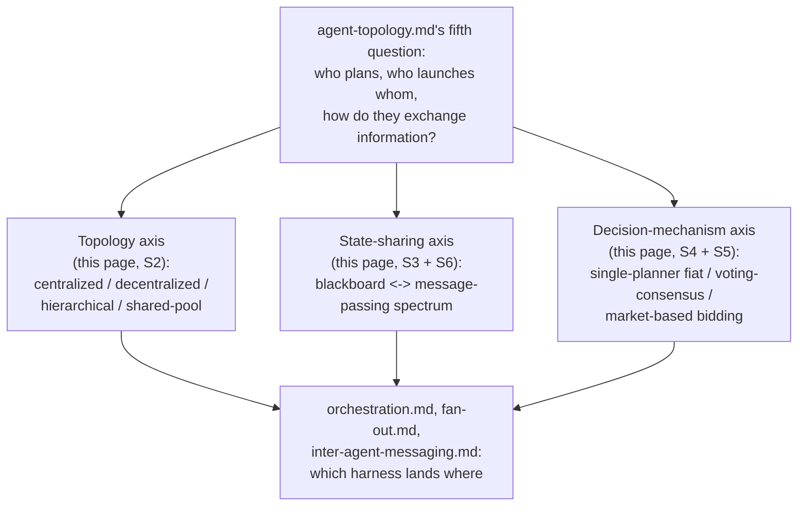
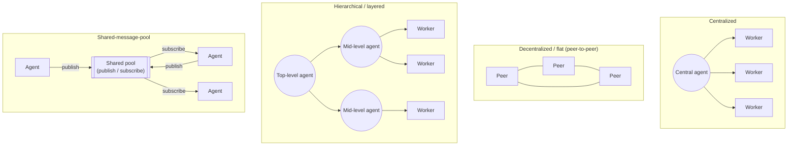
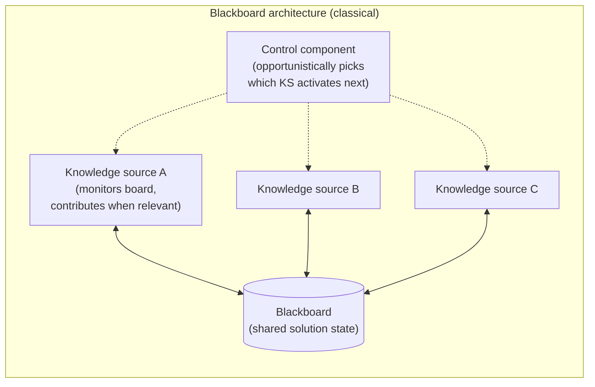
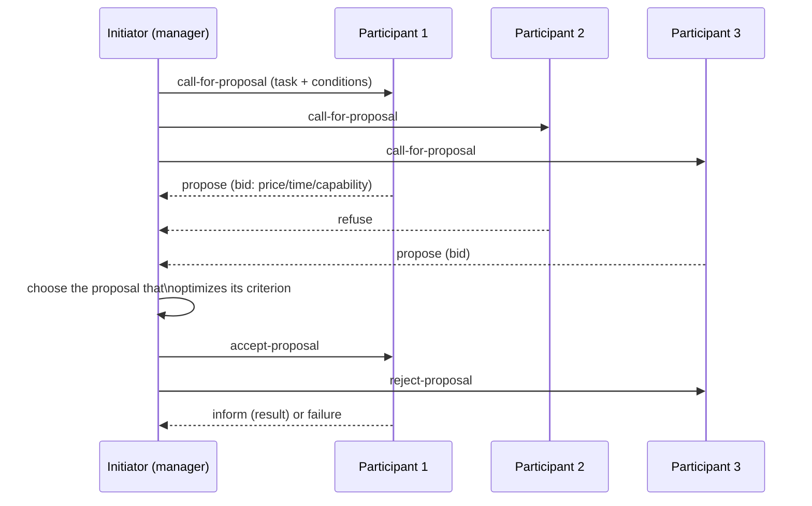
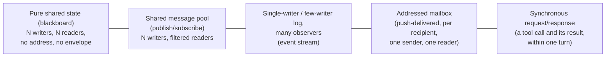

# The multi-agent coordination design space (general agent-engineering concept)

**Scope note.** This is a GENERAL-CONCEPTS page, in the same family as
[agent-loop.md](agent-loop.md) and [agent-topology.md](agent-topology.md):
no harness gets a dedicated section here on its own terms, the way it does
in [orchestration.md](orchestration.md), [fan-out.md](fan-out.md), and
[inter-agent-messaging.md](inter-agent-messaging.md). Instead, this page
draws the general architectural design space that those three
implementation pages already show Claude Code, Copilot CLI, and OpenCode
each occupying one point of, and every cross-reference below points back
at a specific section of one of those three pages rather than re-deriving
its mechanics.

This page picks up exactly where
[agent-topology.md](agent-topology.md) section 7 stops. That page's own
closing words: a multi-agent system "adds a fifth, compositional question
this page deliberately leaves to orchestration.md, fan-out.md, and
inter-agent-messaging.md: once you have more than one agent, how do you
decide who plans, who launches whom, and how they exchange information."
Those three pages answer that question **per harness** -- this page
answers a logically prior question: what are the recurring *architectural
patterns* the wider multi-agent-systems literature has already named for
answering it, independent of any one product? A blackboard, a hierarchy, a
vote, a market, a shared scratchpad, an addressed message -- these are not
Claude-Code-specific or OpenCode-specific ideas; they are decades-old
coordination patterns from classical distributed-AI and multi-agent-systems
research that any harness design, including a hypothetical from-scratch
one, has to choose among (or blend). Reading this page first, then
orchestration.md/fan-out.md/inter-agent-messaging.md, should make it
legible *why* each harness's documented mechanics look the way they do --
which point in a much older design space each one occupies -- rather than
reading three independent inventories of unrelated product trivia.

---

## 1. Why a design space, not a checklist

The four candidate mechanisms this page was briefed to survey --
blackboard architectures, hierarchical-vs-flat topology, consensus/voting,
and market-based allocation -- are not four independent features a
harness either has or lacks. They are answers to three separable
questions any coordinated multi-agent system has to resolve, however
implicitly: **(a) who is structurally allowed to talk to whom** (the
topology question), **(b) where does shared state live and how visible is
it** (the blackboard-vs-message-passing question, which section 6 below
argues is a spectrum, not a binary), and **(c) how does the system decide
what to do when more than one agent has an opinion or more than one agent
could do a piece of work** (the decision-mechanism question, spanning
single-planner fiat, peer voting/consensus, and market-based bidding).
Because these are separable, a real system's position on one does not fix
its position on the others -- exactly the same "independent axes" point
[agent-topology.md](agent-topology.md) section 7 makes about its own four
classification axes one level up. The sections below take each mechanism
in turn, ground it in a named source, and then place -- not re-derive --
each of the three harnesses' already-documented behavior on that
mechanism's slice of the map.

---

## 2. Topology: centralized, decentralized/flat, hierarchical/layered, and shared-message-pool

VERIFIED (arXiv:2402.01680, "Large Language Model based Multi-Agents: A
Survey of Progress and Challenges," `arxiv.org/html/2402.01680v2`, fetched
2026-08-17 -- an IJCAI 2024 survey, cited here as a named academic
secondary source, not a standard-setting body): the survey's own section
on communication structures names exactly the four shapes diagrammed
above. **Centralised**: "a central agent or group of central agents
coordinating the system's communication, with other agents primarily
interacting through this central node." **Decentralised**: "agents
directly communicate with each other," a structure the survey associates
with peer-to-peer, world-simulation-style applications. **Layered**
(what this page calls hierarchical): "agents at each level having
distinct roles and primarily interacting within their layer" or with
adjacent layers. **Shared message pool**: "agents publish messages and
subscribe to relevant messages based on their profiles" -- a
publish-subscribe model where no agent addresses another directly at all;
information moves through the pool. The same survey separately names
three *cooperation strategies* orthogonal to topology -- **cooperative**
("agents work together towards a shared goal... typically exchanging
information"), **debate** ("agents engage in argumentative interactions,
presenting and defending their own viewpoints" toward consensus -- directly
relevant to section 4 below), and **competitive** ("agents work towards
their own goals that might be in conflict with the goals of other
agents," relevant to section 5's market framing) -- confirming topology
(who can talk to whom) and cooperation strategy (what they do once they
can) are genuinely separate design choices, not one axis.

VERIFIED (Hong et al., "MetaGPT: Meta Programming for a Multi-Agent
Collaborative Framework," `arxiv.org/abs/2308.00352` and
`arxiv.org/html/2308.00352`, fetched 2026-08-17): MetaGPT is the concrete,
widely-cited worked example of the shared-message-pool shape in the
taxonomy above, and it is explicit about *why* it chose that shape over
direct peer messaging: "we introduce a shared message pool that allows
all agents to exchange messages directly," where agents "publish their
structured messages in the pool but also access messages from other
entities transparently," which "eliminates the need to inquire about
other agents and await their responses." To keep this scalable as agent
count grows, "agents utilise role-specific interests to extract relevant
information" via subscription filtering -- the publish/subscribe half of
the shape named by the survey above. MetaGPT additionally goes one step
further than the pool shape alone by making the *content* itself
structured rather than free-text dialogue: "agents in MetaGPT communicate
through documents and diagrams (structured outputs) rather than
dialogue," a design choice this page treats as adjacent to, but distinct
from, the pool-vs-peer topology question -- a shared pool could in
principle carry unstructured chat messages too.

BEST CURRENT UNDERSTANDING, UNCONFIRMED (historical lineage, not verified
against the original texts this session, offered the same way
[agent-topology.md](agent-topology.md) section 2 flags its own
reactive/deliberative lineage): the centralized/decentralized/hierarchical
vocabulary the 2024 LLM-MAS survey uses is itself inherited from older,
pre-LLM distributed-AI and organizational-design literature on
multi-agent-system topologies (classically discussed in terms of
command hierarchies, markets, and networks as alternative organizational
forms for a society of autonomous agents) -- this book did not
independently fetch that older lineage this session, so the historical
attribution is reasoned context, not a direct citation.

### 2.1 Where the three harnesses land

Cross-referencing [orchestration.md](orchestration.md) and
[inter-agent-messaging.md](inter-agent-messaging.md) rather than
re-deriving their mechanics: **Claude Code's turn-by-turn subagent case**
(orchestration.md section 1.1) is strictly centralized/hierarchical --
Claude is the one hub, every subagent's result lands back in Claude's own
context window, and no subagent has a channel to any other subagent.
**The Workflow tool** (orchestration.md section 1.2) is the same shape at
a coarser grain -- one script is the hub, `agent()`/`pipeline()` spawn
workers that report only to the script, never to each other. **Claude
Code's agent teams** are the one genuinely mixed case among all three
harnesses examined in this book: the lead plays the centralized/
hierarchical orchestrator role for planning and shutdown/plan-approval
protocol messages, but inter-agent-messaging.md section 1.3 documents
that "teammates message each other directly" via `SendMessage`,
one-recipient-at-a-time, with no broadcast primitive -- a real
decentralized/peer-to-peer edge grafted onto an otherwise hierarchical
structure, not a pure instance of either shape in the taxonomy above.
**Copilot CLI's** ordinary custom-agent delegation and `/fleet` (both
covered in orchestration.md section 2) are also strictly
centralized/hierarchical -- the main Copilot agent or the named
"orchestrator agent" is the sole hub, and inter-agent-messaging.md section
2.1 found no documented subagent-to-subagent channel across three
separate pages checked this session, only a one-directional
subagent-to-parent event stream. **OpenCode's** primary-agent/subagent
split (orchestration.md section 3.1) is likewise strictly hierarchical --
and, per inter-agent-messaging.md section 3, arguably the *most* rigidly
hierarchical of the three, since a subagent's own session has no address
a sibling subagent could even in principle target; the only relationship
that exists at all is the parent-child one baked into `sessions.create({
parentID })`. None of the three harnesses examined in this book
implements the shared-message-pool shape at the top-level orchestration
layer the way MetaGPT does -- the closest analogue, Copilot CLI's `/fleet`
SQL-backed todo table (background, SDK-level detail per
orchestration.md section 2.2), is closer to the blackboard pattern
covered next than to a publish/subscribe pool, since subtasks read and
write a shared coordination *state* rather than publishing free-form
messages to a shared *feed*.

---

## 3. Blackboard architectures

VERIFIED (arXiv:2510.01285, "LLM-based Multi-Agent Blackboard System for
Information Discovery in Data Science," `arxiv.org/html/2510.01285v1` and
`arxiv.org/abs/2510.01285`, fetched 2026-08-17 -- a 2025 paper applying
the classical architecture to an LLM multi-agent setting, cited here for
its own restatement of blackboard mechanics, not as the original source):
this paper's own abstract states its design directly -- "a central agent
posts requests to a shared blackboard, and autonomous subordinate agents
-- either responsible for a partition of the data lake or retrieval from
the web -- volunteer to respond based on their capabilities." Read against
the classical three-part decomposition (a shared data structure holding
solution state; independent knowledge-source modules that monitor and
contribute to it; and a control component that opportunistically decides
which knowledge source acts next), this 2025 paper's own innovation is
explicitly to weaken the third part: it removes "the requirement for a
master controller to maintain explicit knowledge of each sub-agent's
expertise," replacing central control-component scheduling with
capability-based self-selection -- agents "volunteer" rather than being
assigned. This is the same design move [orchestration.md](orchestration.md)
section 0 attributes to the general orchestrator/worker pattern, but
inverted: instead of an orchestrator choosing which worker gets which
task, the shared board's current content is what workers themselves watch
and react to.

BEST CURRENT UNDERSTANDING, UNCONFIRMED (historical attribution, not
independently fetched this session): the classical blackboard architecture
this 2025 paper builds on originates with Frederick Hayes-Roth's "A
Blackboard Architecture for Control" (*Artificial Intelligence*, 1985) and
the earlier Hearsay-II speech-understanding system built at Carnegie
Mellon in the early 1970s, which needed to coordinate independently-triggered
phonetic, syntactic, semantic, and pragmatic knowledge sources against one
evolving partial solution. This book did not fetch Hayes-Roth's original
1985 paper or the Hearsay-II literature directly this session (both sit
behind paywalls not reachable via the tools available); the attribution
above is reasoned from the 2025 paper's own framing and widely-repeated
secondary description of the architecture, not a direct citation of the
primary source, and should be read with that caveat.

### 3.1 Where the three harnesses land

The clearest blackboard-shaped mechanism found anywhere in this book's
existing harness pages is **Claude Code's agent-team shared task list**,
documented in [orchestration.md](orchestration.md) section 1.1: "a
shared, file-locked task list that teammates self-claim from, rather than
waiting for the lead to assign work item by item." BEST CURRENT
UNDERSTANDING, UNCONFIRMED (this book's own architectural reading, not a
term Claude Code's own docs use): structurally, this is a genuine
blackboard instance under the classical three-part decomposition -- the
task list is the shared board, each teammate plays the role of a
knowledge source that monitors the board and volunteers for (self-claims)
work items it judges itself capable of, and there is no described central
scheduler assigning tasks turn by turn the way the lead assigns work in
Claude Code's plain turn-by-turn subagent case (orchestration.md section
1.1's first paragraph) -- self-claiming *is* the opportunistic-activation
mechanic the classical architecture's control component would otherwise
perform. Note this coexists, inside the very same product feature, with a
second and structurally different substrate -- the private, per-recipient
mailbox documented in [inter-agent-messaging.md](inter-agent-messaging.md)
section 1.3 -- which is addressed message-passing, not a blackboard, at
all; section 6 below returns to this coexistence as direct evidence that
a single system can occupy more than one point on the
scratchpad-vs-messaging spectrum simultaneously, for different purposes
(shared work state vs. directed communication).

The second-closest analogue is **Copilot CLI's `/fleet` SQL-backed todo
table** with its `todo_deps` dependency graph, documented in
orchestration.md section 2.2 -- but flagged there, and again here, as
SDK-page detail describing a runtime `/fleet` is *plausibly* built on,
not confirmed CLI-internal behavior. If accurate, it is architecturally
blackboard-like in one respect (a shared, persistent, queryable state
table any interested party can read the current status of) but differs
from the classical pattern in a structurally important way: the paper in
section 3 above and Claude Code's self-claimed task list both describe
workers *volunteering* based on their own judgment of fit, whereas the
`/fleet` todo table's own documented mechanics describe the orchestrator
querying "ready work using dependency-satisfaction logic" and assigning
it -- closer to a shared *scheduling* state than a shared *opportunistic
activation* board.

**OpenCode has no blackboard-shaped mechanism at all** among what this
book has verified. Per [inter-agent-messaging.md](inter-agent-messaging.md)
section 3.1, there is no shared state store any subagent can read that
isn't its own session's private row history; a subagent's result becomes
visible to its parent only via a direct, synthetic message write into the
parent's own session, never via a shared structure multiple agents jointly
observe. This is the extreme opposite end of the blackboard pattern from
Claude Code's self-claimed task list -- no shared board, no opportunistic
activation, purely point-to-point parent/child data flow.

---

## 4. Consensus and voting among peers

VERIFIED (arXiv:2501.06322, "Multi-Agent Collaboration Mechanisms: A
Survey of LLMs," `arxiv.org/abs/2501.06322` and
`arxiv.org/html/2501.06322`, fetched 2026-08-17): the survey's own section
4.3.1 names a concrete family directly relevant here -- "rule-based
protocols" where "agents mimic human collaborative dynamics such as
debate and majority rule, achieving efficient collaboration without
deviating from predefined pathways." Its applications section separately
names LLM-Blender as a worked example of an aggregation-by-comparison
mechanism distinct from majority rule: it "calls different LLMs in one
round and uses pairwise ranking to combine the top responses" -- a
tournament-style aggregation rather than a one-agent-one-vote count. Two
further mechanisms this book has *already* fetched and grounded elsewhere
sit squarely in this same family and are cross-referenced rather than
re-cited in full: self-consistency (arXiv:2203.11171, already grounded in
[advanced-planning-and-execution-architectures.md](advanced-planning-and-execution-architectures.md)
section 1.1) -- sampling several reasoning paths from one model and taking
the majority final answer, a degenerate single-agent case of the same
majority-rule idea -- and multi-agent debate (arXiv:2305.14325, also
grounded in that same page) -- multiple agent instances arguing toward a
converged answer, which is the "debate" strategy the 2024 LLM-MAS survey
in section 2 above names as one of its three cooperation types.

BEST CURRENT UNDERSTANDING, UNCONFIRMED (this page's own synthesis of
the sources above, not stated in these exact terms by any one of them):
read together, "consensus/voting among peers" in the multi-agent-LLM
literature spans at least three structurally different aggregation rules
that should not be treated as interchangeable -- **counting** (plain
majority rule over discrete votes, the closest LLM analogue to classical
social-choice voting), **ranking** (LLM-Blender's pairwise-comparison
tournament, which produces an ordering rather than a single winner-take-all
count), and **argumentative convergence** (debate, where agents revise
their own positions across rounds rather than a fixed panel of votes being
tallied once). A harness feature that "votes" in any one of these three
senses is not automatically doing the other two.

### 4.1 Where the three harnesses land -- and one deliberate false friend

The clearest, most literal instance of peer-agent claim voting anywhere
in this book is **Claude Code's `/deep-research` built-in workflow**,
already documented in [orchestration.md](orchestration.md) section 1.2
and cross-referenced in
[advanced-planning-and-execution-architectures.md](advanced-planning-and-execution-architectures.md):
it "fans out web searches on a question across several angles, fetches
and cross-checks the sources it finds, votes on each claim, and returns a
cited report with claims that didn't survive cross-checking filtered
out," layered with "independent agents adversarially review each other's
findings before they're reported." This lands in the **counting**
sub-category above -- claims are the unit being voted on, and a claim
that fails to survive the vote/cross-check is dropped from the final
report, a real filtering consequence tied to the vote's outcome. Adjacent
but structurally different, per
advanced-planning-and-execution-architectures.md's own table: Claude
Code's `/ultrareview` (a multi-agent fleet reviewing one code change) and
Copilot CLI's rubber-duck (a single cross-model second opinion) are
**not** voting mechanisms in any of the three senses above -- neither
describes a formal aggregation rule over multiple independent judgments;
they are closer to independent-review-and-report or single-second-opinion
patterns that this page does not re-classify as consensus/voting, per
that page's own careful distinction.

**A deliberate false friend worth naming explicitly, because the tool
name alone invites the wrong inference:** Copilot CLI ships a tool
literally called `vote_memory` (documented in
[built-in-tools.md](built-in-tools.md) section 2 and
[memory-management.md](memory-management.md) section 2.2). VERIFIED
(`github/copilot-cli` `changelog.md`, already fetched and cited in
memory-management.md section 2.2): "`vote_memory` tool calls are
throttled per response and per interaction to prevent runaway voting
bursts," and memory-management.md's own reading is that "a `vote_memory`
tool implies a relevance/quality feedback loop on retrieved memories."
This is **not** a multi-agent consensus mechanism in any sense grounded
above -- it is a single model instance signaling a relevance score back
to the server-side Copilot Memory service about one retrieved fact or
preference, the same kind of signal a thumbs-up/thumbs-down button would
carry, with no second agent, no aggregation across peers, and no
tally determining a shared outcome. A reader who encounters the name
`vote_memory` and assumes it implements some form of the peer-voting
pattern this section otherwise documents (as `/deep-research`'s claim
voting genuinely does) would be drawing the wrong architectural
conclusion from a coincidental naming choice -- this page flags the
distinction explicitly rather than letting the two "voting" usages blend.

**A real gap, not merely an absence of documentation:** no mechanism
found anywhere in this book has *peer* agents voting on a **plan** or a
**task assignment** the way section 5's market mechanism or a classical
quorum protocol would -- Claude Code's agent-team `plan_approval_response`
(documented in [inter-agent-messaging.md](inter-agent-messaging.md)
section 1.5) is the single lead approving or rejecting one teammate's
plan, a hierarchical fiat decision, not a vote tallied across several
teammates. BEST CURRENT UNDERSTANDING, UNCONFIRMED: this book has not
found any harness where multiple peer agents jointly vote on which of
several competing plans to adopt, or on which agent should own a given
task -- the closest anything gets is `/deep-research`'s claim-level
voting, which operates on facts extracted from research, not on
control-flow decisions about who does what next.

---

## 5. Market-based task allocation

VERIFIED (Reid G. Smith, "The Contract Net Protocol: High-Level
Communication and Control in a Distributed Problem Solver," *IEEE
Transactions on Computers*, December 1980 -- attribution and mechanics
confirmed against a secondary description fetched this session,
`handwiki.org/wiki/Contract_Net_Protocol`, fetched 2026-08-17, itself
citing Smith's original paper): the Contract Net Protocol splits agents
into a **manager** role, which "initiates the process by proposing
tasks," and a **contractor** role, which "responds to proposals and
executes allocated tasks," with any agent able to hold either role
depending on context. The message sequence diagrammed above --
call-for-proposals, then each participant's proposal or refusal, then the
manager's accept/reject based on "chooses among the proposals the one
that suits it best," then a completion `inform` or failure `cancel` --
is the mechanism's whole shape, later formalized without substantive
change by FIPA as the **Contract Net Interaction Protocol**, whose
standardization this secondary source confirms added explicit
reject/confirm communicative acts to Smith's original pattern. The
market framing is explicit in the source's own words: "when the agents
are competitive, the protocol ends up in a marketplace organisation,
very similar to auctions" -- contrasted directly with the same protocol
producing "hierarchical organisations" when the agents are instead
cooperative, which is a genuinely useful point for this page's own
"independent axes" framing in section 1: the same message-passing
protocol can realize either a market or a hierarchy depending on the
agents' underlying incentive structure, not on the protocol's wire
format alone.

The defining feature this page draws out for comparison against every
harness below: a market-based mechanism requires a **solicitation step**
-- the manager broadcasts (or narrowcasts) an open call, more than one
candidate can respond with a competing bid, and the manager's selection
criterion is what gets optimized (price, completion time, load balance,
or some other stated function of the proposals received), not simply
"whichever agent the manager already had in mind."

### 5.1 Where the three harnesses land -- and where none of them do

None of the three harnesses examined in this book implements anything
resembling a call-for-proposals/bid/award cycle. In every documented
dispatch mechanism this book has grounded -- Claude Code's `Agent` tool
targeting a named subagent type or spawning a fresh worker
([handoff-mechanism.md](handoff-mechanism.md) section 1), Copilot CLI's
`@CUSTOM-AGENT-NAME` targeting inside a `/fleet`-decomposed subtask
([orchestration.md](orchestration.md) section 2.2), and OpenCode's `Task`
tool addressing a named agent by its declared description
([orchestration.md](orchestration.md) section 3.1) -- the *deciding*
agent (the model, the orchestrator, or the primary agent) picks a
specific worker directly, based on that worker's declared
capability/description, without ever soliciting competing proposals from
multiple candidates and comparing them against an explicit optimization
criterion the way the manager role does in section 5's protocol. This is
capability-based direct dispatch, not competitive bidding -- a real and
consistent design-space finding across all three products, not a gap in
this book's own research.

The single mechanism that comes structurally closest without actually
crossing the line is Copilot CLI's `/fleet` **dependency-aware scheduling**
(orchestration.md section 2.2): the orchestrator "will assess, based on
the nature of the subtasks and their dependencies, whether these can be
efficiently executed by subagents," which is a form of the manager
optimizing *something* (parallelism, subject to dependency constraints)
before dispatching work -- but the optimization is over the *task graph*
(which subtasks can run now, given `todo_deps`), not over *competing bids
from multiple candidate workers* for the same task. There is no evidence
in any source fetched for this book that more than one candidate agent
ever proposes for the same unit of work in any of the three harnesses;
task-to-agent assignment is uniformly one-shot and capability-matched,
never solicited-and-compared. BEST CURRENT UNDERSTANDING, UNCONFIRMED:
this is plausibly the same underlying reason
[advanced-planning-and-execution-architectures.md](advanced-planning-and-execution-architectures.md)
gives for the absence of tree-search/MCTS-style planning in any of the
three harnesses' primary loops -- a market mechanism's soliciting,
scoring, and rejecting multiple candidate proposals costs strictly more
model calls and latency than direct dispatch for a benefit (better-fit
task assignment) that is hard to measure and monetize inside an
interactive coding-assistant product, the same cost/latency-metering
argument that page makes about speculative execution and per-step
ensembling. This page does not re-derive that argument in full -- it is
offered here only as a plausible explanation for the same negative
finding recurring on a different axis.

---

## 6. Shared-scratchpad vs. message-passing as a spectrum

Sections 3 and 4 above each treated blackboard-style shared state and
addressed messaging as if they were opposite poles of a single binary.
Read across all three harnesses' already-documented mechanics, the more
accurate picture is a **spectrum with at least four distinguishable
points**, not two: (1) a true multi-writer blackboard with no addressing
at all; (2) a publish/subscribe pool, which is still multi-writer and
low-addressing but adds a filtering step on the read side (MetaGPT's
role-based subscription, section 2); (3) a single-writer-or-few-writer
event log that many parties can observe but cannot themselves write
into on equal terms; and (4) a fully addressed, one-sender-one-recipient
mailbox, the closest LLM-harness analogue to classical point-to-point
message-passing. This section places each harness mechanism this book
has already documented onto that spectrum, rather than forcing a
binary call.

- **Claude Code's agent-team task list** (section 3.1 above) sits at
  point (1) -- a genuine shared, multi-writer, self-claimed board with no
  per-message addressing.
- **Claude Code's mailbox** (`~/.claude/teams/{team}/inboxes/{agent}.json`,
  [inter-agent-messaging.md](inter-agent-messaging.md) section 1.3) sits
  at point (4) -- one JSON file per recipient, one sender per `SendMessage`
  call, "one recipient at a time... to reach everyone, send one message
  per recipient," push-delivered, with no broadcast primitive. The fact
  that both (1) and (4) coexist inside the *same* Claude Code feature
  (agent teams) is the single clearest piece of evidence this book has
  found that a real system deliberately picks a different point on this
  spectrum for different purposes within itself -- shared work-claiming
  state at one end, directed communication at the other -- rather than
  committing to one shape for everything.
- **Copilot CLI's `subagent.*` lifecycle event stream**
  ([inter-agent-messaging.md](inter-agent-messaging.md) section 2.1) sits
  at point (3): a single producer (the runtime, on behalf of the
  sub-agent) writes named, typed events that "share the parent session
  stream," observable by the parent but never writable by any other
  sub-agent, and never addressed to a specific recipient the way a
  mailbox entry is addressed. It is not a blackboard (only one party
  effectively writes) and not a mailbox (there is no addressing, only
  attribution via an envelope-level `agentId`).
- **Copilot CLI's `/fleet` SQL todo table** (section 3.1 above, SDK-level
  detail, flagged there as unconfirmed for the CLI specifically) sits
  closer to point (1)/(2) than to point (4) if accurate -- a shared,
  queryable, multi-party-readable state table, closer to a blackboard
  than to addressed messaging, since the state itself (not a directed
  message) is what coordinates the participants.
- **OpenCode's session-row message model**
  ([inter-agent-messaging.md](inter-agent-messaging.md) sections 3.1-3.3)
  is the one mechanism in this book that does not map cleanly onto any of
  the four points above, and is worth naming as its own fifth shape: a
  **per-session private log with occasional cross-writes**. A parent
  session's own message history is not a shared board any sibling
  subagent can read (unlike point 1), it is not filtered-publish/subscribe
  (unlike point 2), it is not a stream a party merely observes without
  writing (unlike point 3, since the child session *does* write into the
  parent, not just emit alongside it), and it is not addressed the way a
  mailbox entry is (there is no recipient field; the write target is
  simply "whichever session's row this is," determined by the
  `parentID`/`sessionID` relationship established at spawn time, not
  chosen per message). OpenCode's own SSE transport
  ([inter-agent-messaging.md](inter-agent-messaging.md) section 3.3)
  is best read as the *delivery* layer underneath this fifth shape, not
  as evidence of a genuine shared-pool or broadcast semantic at the
  message-model level -- the directory/workspace-scoped filtering it
  applies is about which *client* sees which project's traffic, not
  about which *agent* is allowed to write into which session's row.

BEST CURRENT UNDERSTANDING, UNCONFIRMED (this page's own synthesis): the
practical lesson from treating this as a spectrum rather than a binary is
that "does harness X use shared memory or message-passing" is frequently
the wrong question to ask about a real system -- the more useful question,
demonstrated directly by Claude Code's own agent-teams feature holding
two different points on the spectrum at once, is *which specific
coordination need* (claiming ownership of a unit of work vs. directing a
specific instruction at one named peer vs. merely observing another
agent's progress) a given piece of shared state or messaging channel is
actually serving, since a mature multi-agent design is likely to need more
than one point on this spectrum simultaneously rather than picking a
single one for the whole system.

---

## 7. Putting the map together

| Design-space axis | Classical/literature grounding | Claude Code | Copilot CLI | OpenCode |
|---|---|---|---|---|
| Topology (S2) | Centralized/decentralized/layered/pool (arXiv:2402.01680) | Hierarchical (subagents, Workflow); hybrid hierarchical-plus-peer-edges (agent teams) | Strictly hierarchical/centralized (custom-agent delegation, `/fleet`) | Strictly hierarchical, most rigid of the three -- no sibling-to-sibling edge even in principle |
| Blackboard (S3) | Hayes-Roth/Hearsay-II via arXiv:2510.01285's restatement | Agent-team shared, self-claimed task list -- closest real instance found | `/fleet` SQL todo table -- blackboard-*like*, but SDK-level/unconfirmed, and orchestrator-scheduled rather than volunteer-based | None found -- structural opposite of a blackboard |
| Consensus/voting (S4) | Majority rule, pairwise ranking (LLM-Blender), debate (arXiv:2501.06322, arXiv:2305.14325, arXiv:2203.11171) | `/deep-research`'s claim-level voting + adversarial review -- the clearest real instance | `vote_memory` is a false friend (single-agent memory-relevance signal, not peer consensus); rubber-duck is a single second opinion, not a vote | None found |
| Market-based allocation (S5) | Contract Net Protocol, Smith 1980 / FIPA | Not found -- capability-based direct dispatch only | Not found -- `/fleet`'s dependency-aware scheduling optimizes the task graph, not competing bids | Not found -- name-matched direct dispatch only |
| Scratchpad<->messaging spectrum (S6) | This page's own four-plus-one-point synthesis | Occupies two points at once: blackboard-like task list *and* addressed mailbox | Event-stream point (single-producer, parent-observed); `/fleet` table leans blackboard-like if SDK detail holds | A fifth, unclassified shape: per-session private log with parent-directed cross-writes |

**The design lesson.** No single harness examined in this book implements
more than a fraction of the coordination patterns the wider
multi-agent-systems literature has already named and formalized, and that
is worth stating plainly rather than as an implicit criticism: blackboard
architectures, formal consensus/voting protocols, and market-based
bidding are all decades-old, well-understood mechanisms with known
tradeoffs, and none of them shows up in more than one recognizable
instance (Claude Code's self-claimed task list; `/deep-research`'s claim
voting) across three actively developed, widely used coding-assistant
harnesses. Read alongside
[advanced-planning-and-execution-architectures.md](advanced-planning-and-execution-architectures.md)'s
own finding that none of the three implement tree-search planning,
loop-integrated self-critique, or per-step multi-model ensembling either,
a consistent pattern emerges across both this page and that one: the
production harnesses this book documents converge overwhelmingly on the
cheapest, lowest-latency point in each design space they touch --
hierarchical dispatch over markets or genuine blackboards, single-planner
fiat over peer consensus, capability-matched direct addressing over
competitive bidding -- and the interesting, still largely unoccupied
territory for a harness aiming to surpass current designs, per that
page's own framing, is not a missing *feature* so much as a missing
*willingness to spend the extra model calls and latency* that a market,
a quorum, or a genuine multi-writer blackboard would cost, in exchange
for coordination properties (fault-tolerant task claiming, competitively
optimized assignment, quorum-validated plans) that none of the three
harnesses examined here currently buys.

---

## Sources

All fetched 2026-08-17 unless noted otherwise.

**General multi-agent-systems and LLM-multi-agent literature (authoritative
for the design-space concepts themselves, never for any one harness's
specific behavior):**
- arXiv:2402.01680, "Large Language Model based Multi-Agents: A Survey of
  Progress and Challenges" (IJCAI 2024), `arxiv.org/html/2402.01680v2`.
  Fetched and read directly this session for its own communication-structure
  taxonomy (centralized/decentralized/layered/shared-message-pool) and its
  cooperative/debate/competitive strategy taxonomy, both used throughout
  section 2.
- arXiv:2308.00352, Hong et al., "MetaGPT: Meta Programming for a
  Multi-Agent Collaborative Framework," `arxiv.org/abs/2308.00352` and
  `arxiv.org/html/2308.00352`. Fetched this session for its own
  description of the shared message pool, publish/subscribe filtering,
  and structured-document communication, cited in section 2 as the
  worked example of the shared-pool topology.
- arXiv:2510.01285, "LLM-based Multi-Agent Blackboard System for
  Information Discovery in Data Science," `arxiv.org/html/2510.01285v1`.
  Fetched this session for its own restatement of blackboard-architecture
  mechanics applied to an LLM multi-agent system, cited in section 3; this
  book did not independently fetch Hayes-Roth's original 1985 paper or the
  Hearsay-II literature this session (flagged as BEST CURRENT
  UNDERSTANDING on the historical-lineage point only).
- arXiv:2501.06322, "Multi-Agent Collaboration Mechanisms: A Survey of
  LLMs," `arxiv.org/abs/2501.06322` and `arxiv.org/html/2501.06322`.
  Fetched this session for its own rule-based/majority-rule protocol
  family and its LLM-Blender pairwise-ranking example, cited in section 4.
- `handwiki.org/wiki/Contract_Net_Protocol`. Fetched this session as a
  secondary description of Reid G. Smith's original 1980 Contract Net
  Protocol and its later FIPA standardization; cited in section 5 for
  the manager/contractor roles, the call-for-proposals/propose/accept
  message sequence, and the explicit market-vs-hierarchy framing
  ("when the agents are competitive, the protocol ends up in a
  marketplace organisation"). The FIPA Contract Net Interaction Protocol
  specification itself (`fipa.org/specs/fipa00029/SC00029H.html`) was
  attempted directly this session and returned an HTTP 403; it is named
  here as the formal standard this secondary source describes, not
  independently fetched and verified this session.
- Cross-referenced without re-fetching this session, per this book's own
  established citations: arXiv:2203.11171 (self-consistency) and
  arXiv:2305.14325 (multi-agent debate), both already fetched and
  grounded in
  [advanced-planning-and-execution-architectures.md](advanced-planning-and-execution-architectures.md)
  section 1.1; `huggingface.co/learn/agents-course/en/unit2/smolagents/multi_agent_systems`,
  already fetched and grounded in [orchestration.md](orchestration.md)
  section 0 and [agent-topology.md](agent-topology.md) section 3, for
  the general orchestrator/managed-agent vocabulary this page assumes
  rather than re-derives.

**This book's own prior pages (re-read for cross-reference, not
re-fetched from any external source this session):**
[agent-topology.md](agent-topology.md), [orchestration.md](orchestration.md),
[fan-out.md](fan-out.md), [inter-agent-messaging.md](inter-agent-messaging.md),
[handoff-mechanism.md](handoff-mechanism.md), [built-in-tools.md](built-in-tools.md),
[memory-management.md](memory-management.md), and
[advanced-planning-and-execution-architectures.md](advanced-planning-and-execution-architectures.md)
-- every harness-specific claim in this page is a pointer into one of
these, not a new claim about Claude Code's, Copilot CLI's, or OpenCode's
behavior researched fresh for this page.
